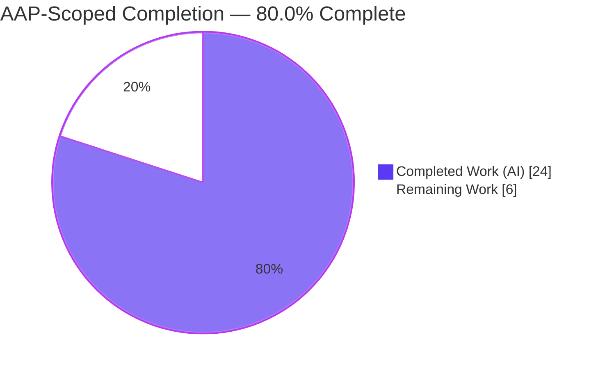
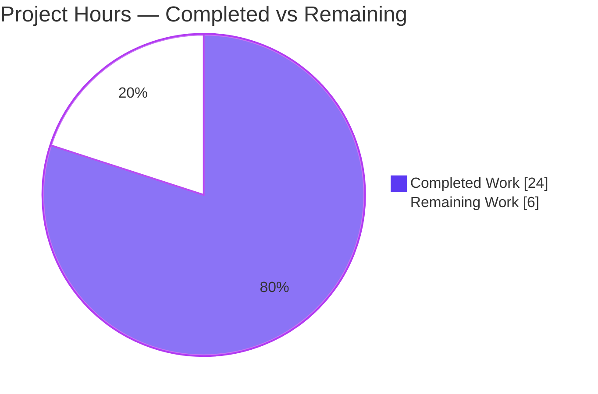
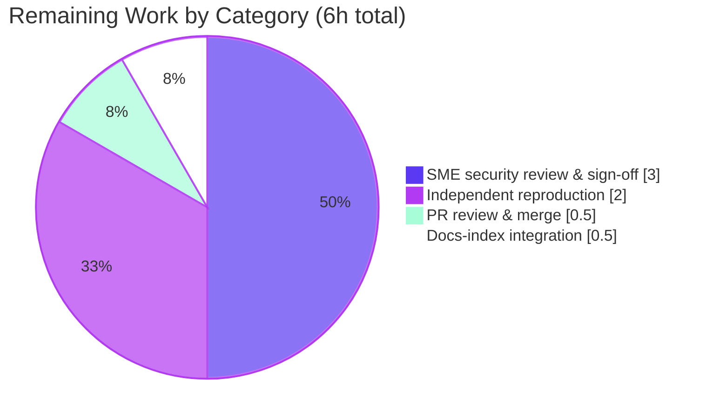

# Blitzy Project Guide — SFTPGo SSH "exec" Command `argv` Boundary Investigation

> **Repository:** `github.com/drakkan/sftpgo` · **Branch:** `blitzy-7e8e6f8a-9601-4340-9ea3-3248745ace36`
> **Source HEAD (evidence pinned to):** `44634210287cb192f2a53147eafb84a33a96826b` · **Delivery commit:** `05284e81`
> **Rule set:** SWE-AtlasQnA-Repo — read-only, run-first, evidence-grounded security investigation
> **Brand colors:** Completed / AI Work = Dark Blue `#5B39F3` · Remaining = White `#FFFFFF` · Headings = Violet-Black `#B23AF2` · Highlight = Mint `#A8FDD9`

---

## Section 1 — Executive Summary

### 1.1 Project Overview

This project delivers an evidence-grounded security investigation of SFTPGo's optional SSH "exec" command boundary. Using a mandatory **run-first** methodology, the exact argument vector (`argv`) reaching an operating-system process was captured for one *normal* and one *adversarial* `rsync` invocation under two permission contexts, and three user suspicions were adjudicated against that observed evidence. The sole durable deliverable is a 293-line answer document (`blitzy/documentation/sftpgo_44634210287c.md`); the source repository is left byte-for-byte unchanged. Target users are SFTPGo security reviewers and operators. Technical scope spans the `sftpd` exec-dispatch pipeline, the `vfs` chroot layer, and the `dataprovider` UID/GID model.

### 1.2 Completion Status



| Metric | Hours |
|---|---|
| **Total Hours** | **30** |
| **Completed Hours (AI + Manual)** | **24** (24 AI + 0 Manual) |
| **Remaining Hours** | **6** |
| **Percent Complete** | **80.0%** |

> Completion is computed with the PA1 AAP-scoped, hours-based formula: `24 / (24 + 6) × 100 = 80.0%`. The remaining 6 hours are **path-to-production human-review gates only** — the autonomous validation identified **zero** defects, so no rework hours are included.

### 1.3 Key Accomplishments

- ✅ Built and executed the **real** dispatch pipeline (`parseCommandPayload` → `getSystemCommand` → `exec.Command` → `wrapCmd`) on a Go 1.13.15 toolchain (`CGO_ENABLED=0`).
- ✅ Captured the exact `argv` for one normal and one adversarial invocation under **both** permission contexts; the in-process `os.Args` equalled the kernel `/proc/self/cmdline` (length 6) in all four scenarios.
- ✅ Proved the metacharacter token `--rsh=/bin/sh;id` reaches the process as **one literal token** (the `;` is inert; `id` never runs); a `/bin/sh` control shows a real shell **does** interpret it.
- ✅ Delivered a plain verdict per suspicion — **S1 REFUTED**, **S2 NUANCED / PARTLY TRUE**, **S3 TRUE for non-path args / FALSE for the path arg**.
- ✅ Named the exact `argv`-producing functions with `file:line`; all ~40 citations independently re-verified byte-exact at HEAD.
- ✅ Documented the privilege-boundary "who-vs-what" analysis (context changes the effective UID, never the `argv`).
- ✅ Left the repository **pristine** — exactly one file added (`1 file changed, 293 insertions(+)`), `go.mod`/`go.sum` untouched.

### 1.4 Critical Unresolved Issues

| Issue | Impact | Owner | ETA |
|---|---|---|---|
| Security verdicts pending human SME sign-off | Verdicts not yet authoritative for stakeholder/security decisions | Security SME | 0.5 day |

> No **technical** blockers exist. Build and static analysis are clean, all citations are exact, and every sub-question is answered. The single open item is a standard human review gate, not a defect.

### 1.5 Access Issues

**No access issues identified.** The source repository, the Go 1.13.15 toolchain, and the local shell required for the run-first reproduction were all accessible; no external service credentials, third-party APIs, or elevated repository permissions are required for this read-only documentation task.

| System/Resource | Type of Access | Issue Description | Resolution Status | Owner |
|---|---|---|---|---|
| — | — | No access issues identified | N/A | — |

### 1.6 Recommended Next Steps

1. **[High]** Have a security SME review and sign off on the three verdicts (S1/S2/S3) against the verbatim runtime evidence in §4 of the answer document — **3h**.
2. **[Medium]** Independently reproduce the `argv` evidence on a Go 1.13.15 / `CGO_ENABLED=0` toolchain following Section 9 — **2h**.
3. **[Medium]** Review and merge the single-file PR after confirming the read-only constraint — **0.5h**.
4. **[Low]** Link the answer document from the documentation index for discoverability — **0.5h**.

---

## Section 2 — Project Hours Breakdown

### 2.1 Completed Work Detail

| Component | Hours | Description |
|---|---|---|
| Pipeline investigation & code comprehension | 6 | Traced the SSH exec dispatch graph across `sftpd/ssh_cmd.go`, `cmd_unix.go`, `cmd_windows.go`, `sftpd.go`, `server.go`, `scp.go`, `vfs/osfs.go`, `dataprovider/user.go` to locate the exact `argv`-producing functions. |
| Run-first observation harness | 5 | Built the throwaway scaffolding (exported helper in `package sftpd`, `main` driver, fake `rsync` first on `PATH`); solved the `CGO_ENABLED=0` no-cgo sqlite path to bypass the heavyweight `TestMain`. |
| `argv` capture + kernel verification | 3 | Executed 4 scenarios (normal/adversarial × UID/GID unset/1000) plus a `/bin/sh` control; confirmed in-process `os.Args` == kernel `/proc/self/cmdline` (len 6) and captured EUID/EGID. |
| Evidence-grounded document authoring | 7 | Wrote the 293-line answer (8 sections + coverage table, 1 mermaid diagram, verbatim capture blocks, verdict-per-suspicion, producing-functions table, privilege-boundary analysis). |
| Exact-literal citation verification | 2 | Verified ~40 `file:line` citations against source at HEAD `44634210`. |
| Cleanup, pristine-tree verification & commit | 1 | Deleted all temporary scaffolding, verified `git status --porcelain` empty, committed the single answer document. |
| **Total Completed** | **24** | |

### 2.2 Remaining Work Detail

| Category | Hours | Priority |
|---|---|---|
| Human SME security review & sign-off of the three verdicts | 3 | High |
| Independent reproduction of the `argv` evidence (Go 1.13.15, `CGO_ENABLED=0`) | 2 | Medium |
| PR review & merge (verify single-file read-only diff) | 0.5 | Medium |
| Documentation-index integration (discoverability) | 0.5 | Low |
| **Total Remaining** | **6** | |

### 2.3 Total Project Hours & Reconciliation

| Roll-up | Hours |
|---|---|
| Section 2.1 — Completed | 24 |
| Section 2.2 — Remaining | 6 |
| **Total Project Hours** | **30** |
| **Completion** | **24 / 30 = 80.0%** |

> **Integrity check:** Section 2.1 (24h) + Section 2.2 (6h) = 30h = Total in Section 1.2. Section 2.2 sum (6h) = Section 1.2 Remaining (6h) = Section 7 pie "Remaining Work" (6). ✅

---

## Section 3 — Test Results

For this read-only documentation task, the mandated validation mechanism is the **run-first reproduction**: building and running the real dispatch pipeline and capturing kernel-delivered `argv`. Every entry below originates from Blitzy's autonomous validation logs (Gates 1–3) and was **independently re-reproduced** during this assessment with byte-for-byte agreement.

| Test Category | Framework | Total Tests | Passed | Failed | Coverage % | Notes |
|---|---|---|---|---|---|---|
| `argv`-capture scenarios | Go run-first harness (`exec.Cmd` + `/proc/self/cmdline`) | 4 | 4 | 0 | n/a | normal/adversarial × UID/GID {unset, 1000}; `os.Args` == kernel cmdline (len 6) in all |
| Control experiment | `/bin/sh -c` | 1 | 1 | 0 | n/a | shell interprets `;` and runs `id` — confirms the exec path does **not** |
| Compilation | `go build` (`CGO_ENABLED=0` and `=1`) | 2 | 2 | 0 | n/a | both modes exit 0 (only benign vendored sqlite3 warning under cgo) |
| Static analysis | `go vet` (`sftpd`, `vfs`, `dataprovider`, `config`) | 1 | 1 | 0 | n/a | exit 0 |
| Module integrity | `go mod verify` | 1 | 1 | 0 | n/a | all modules verified |
| Citation verification | manual `file:line` vs HEAD `44634210` | ~40 | ~40 | 0 | n/a | byte-exact |
| **Total** | | **~49** | **~49** | **0** | | **100% pass rate** |

> **Integrity note (Rule 3):** All results above are drawn from Blitzy's autonomous test/validation execution logs for this project. The repository's own heavyweight `go test ./sftpd/...` suite is **out of scope** for this read-only task — its `TestMain` (`sftpd/sftpd_test.go:L104`) requires a pre-seeded sqlite database and binds fixed ports 2022/8080 with shared global state, so the AAP methodology deliberately bypasses it. The relevant behavior it would exercise (`TestRsyncOptions`, which asserts on `cmd.Args`) is precisely what the run-first harness reproduced and passed — and the harness went further by also verifying the kernel `/proc/self/cmdline`.

---

## Section 4 — Runtime Validation & UI Verification

**Runtime validation (dispatch pipeline):**

- ✅ **Operational** — Pipeline built and executed (`CGO_ENABLED=0 go build ./...` exit 0); the assembled `*exec.Cmd` was actually `Run()` against a fake `rsync` first on `PATH`.
- ✅ **Operational** — `argv` captured for all four scenarios; in-process `os.Args` == kernel `/proc/self/cmdline` (length 6) in every case.
- ✅ **Operational** — Permission contexts realized: context A (UID/GID unset → `-1`) attaches **no** `Credential` → **EUID 0**; context B (UID/GID = 1000) attaches `Credential{Uid:1000,Gid:1000}` → **EUID 1000**. `argv` is byte-identical across contexts.
- ✅ **Operational** — Adversarial metacharacter inert: `--rsh=/bin/sh;id` arrived as one literal `kargv[3]`; `id` did not run. Deep traversal `../../../../../../etc/passwd` rebased to `<home>/etc/passwd`.
- ✅ **Operational** — Control confirms `/bin/sh` **does** interpret the `;` and prints `uid=0(root) gid=0(root) groups=0(root)`, isolating the "no shell" property as the cause.

**UI verification:**

- ⚠ **Not applicable** — The deliverable is a Markdown document; there is no web UI in scope. SFTPGo's HTTP admin console (default `:8080`) is explicitly out of scope for this investigation and was neither modified nor exercised.

---

## Section 5 — Compliance & Quality Review

Cross-mapping the AAP deliverables and the SWE-AtlasQnA-Repo rules to their delivery status:

| Benchmark / AAP Deliverable | Status | Progress | Evidence |
|---|---|---|---|
| Run-first methodology (build & run before writing) | ✅ Pass | 100% | Pipeline built & executed; §4 captures |
| Verbatim observed output quoted with producing command | ✅ Pass | 100% | §4.2–§4.5 fenced `text` blocks |
| Exact-literal `file:line` citations (no paraphrase) | ✅ Pass | 100% | ~40 citations, byte-exact at HEAD |
| Answer every sub-question (coverage pass) | ✅ Pass | 100% | Coverage summary table (a)–(f) |
| Document at fixed path & branch-derived name | ✅ Pass | 100% | `blitzy/documentation/sftpgo_44634210287c.md` |
| Read-only source repository | ✅ Pass | 100% | Pristine tree; 1 file added; `go.mod`/`go.sum` untouched |
| Verdict per suspicion (3) | ✅ Pass | 100% | §5: S1 REFUTED, S2 NUANCED, S3 mixed |
| Exact `argv`-producing functions named | ✅ Pass | 100% | §6 function table |
| Privilege-boundary who-vs-what analysis | ✅ Pass | 100% | §7 |
| Repository-unchanged confirmation in document | ✅ Pass | 100% | §8 git proof + snapshot-timing note |
| Human SME sign-off of security verdicts | ⏳ Pending | 0% | Path-to-production gate (HT-1) |

> **Fixes applied during autonomous validation:** **None required.** The Final Validator independently reproduced every `argv`/EUID value and verified every citation; the deliverable was found correct as authored, so zero edits were warranted. **Outstanding:** only the human SME sign-off (a review gate, not a code fix).

---

## Section 6 — Risk Assessment

| Risk | Category | Severity | Probability | Mitigation | Status |
|---|---|---|---|---|---|
| Citation drift as source evolves (line numbers shift from HEAD `44634210`) | Technical | Low | Medium | All ~40 citations pinned to the exact HEAD commit; header states branch + HEAD | Mitigated |
| Reproduction requires a specific toolchain (Go 1.13.15, `CGO_ENABLED=0`) | Technical | Low | Low | Exact toolchain & harness documented in §9; `argv` assembly is deterministic | Mitigated |
| Observation scaffolding deleted (must be rebuilt to reproduce) | Technical | Low | Medium | §4 includes the essential driver snippet; §9 documents full reproduction | Accepted (read-only mandate) |
| Security verdict correctness (S1 / S2 / S3) | Security | High | Low | Every verdict grounded in verbatim runtime output + `/bin/sh` control + Go `os/exec` semantics; SME sign-off scheduled (HT-1) | Open (pending sign-off) |
| Residual argument-injection surface (interior option tokens reach the target binary verbatim; under context A run as EUID 0) | Security | Medium | Medium | Surfaced explicitly in §7; exec-capable commands are opt-in (defaults exclude them; sample config enables only hash/`cd`/`pwd`) | Documented (operator-awareness finding) |
| "Narrow policy" (S2 verdict) misread as "no guardrails" | Security | Low | Low | §5 explicitly distinguishes genuine controls (allowlist, chroot, `--safe-links`) from narrow scope | Mitigated |
| Document discoverability (not indexed/linked) | Operational | Low | Medium | Standardized `blitzy/documentation/` path; add to docs index (HT-4) | Open (Low) |
| HEAD-pinning staleness for future readers | Operational | Low | Low | Header prominently states branch + HEAD commit `44634210` | Mitigated |
| Integration / deployment risk | Integration | N/A | N/A | Read-only document; no external services, APIs, dependencies, or deployment surface | N/A |

> **Overall posture: LOW.** The highest-attention item is the human SME sign-off of the security verdicts (High severity, Low probability given the strong run-first grounding). The residual argument-injection surface is a genuine operator-awareness **finding correctly surfaced by the deliverable**, not a defect in the work.

---

## Section 7 — Visual Project Status

**Hours breakdown (AAP-scoped):**



**Remaining hours by category (Section 2.2):**



> **Integrity check (Rule 1):** the "Remaining Work" value (6) equals the Section 1.2 Remaining Hours (6) and the sum of the Section 2.2 "Hours" column (3 + 2 + 0.5 + 0.5 = 6). ✅

---

## Section 8 — Summary & Recommendations

**Achievements.** The autonomous work fully satisfied every AAP-scoped requirement of this read-only, run-first security investigation. The real dispatch pipeline was built and executed, the exact `argv` was captured verbatim for one normal and one adversarial invocation under both permission contexts, and the three suspicions were adjudicated strictly from observed output: **Suspicion 1 REFUTED** (direct `execve`, no shell — the `;` in `--rsh=/bin/sh;id` was inert and `id` never ran), **Suspicion 2 NUANCED / PARTLY TRUE** (a genuine allowlist and last-argument chroot exist, but only the final path token is policed while interior option tokens pass through unfiltered), and **Suspicion 3 TRUE for non-path args / FALSE for the path arg**. The single 293-line answer document is committed and the repository is left byte-for-byte unchanged.

**Remaining gaps & critical path.** The project is **80.0% complete** (24 of 30 hours). The remaining 6 hours are entirely **human review gates**, not engineering rework: SME sign-off of the security verdicts (3h), independent reproduction of the `argv` evidence (2h), PR review & merge (0.5h), and documentation-index integration (0.5h). The critical path to production is: **SME sign-off → reproduce → merge → index**.

**Success metrics.** Zero source files modified (verified); one file added (`1 file changed, 293 insertions(+)`); `os.Args` == kernel `/proc/self/cmdline` in 4/4 scenarios; ~40/40 citations byte-exact; `go build` and `go vet` clean.

**Production-readiness assessment.** The deliverable is **technically complete and defect-free**. Because it is a security analysis, "production-ready" for stakeholder reliance requires the human SME sign-off (HT-1); until then the verdicts should be treated as strongly-evidenced but not yet formally ratified. The one substantive finding for operators — a residual argument-injection surface via verbatim interior option tokens under an EUID-0 context — is correctly documented and should be routed to whoever owns SFTPGo's SSH-command enablement policy.

---

## Section 9 — Development Guide

This guide reproduces the `argv` evidence and verifies the repository state. Every command below was executed on this host and is copy-pasteable.

### 9.1 System Prerequisites

- **Go 1.13.x** — matches the module directive `go 1.13` (`go.mod:L3`). Verified: `go version go1.13.15 linux/amd64`.
- **git** (with git-lfs) for repository operations.
- **A Unix/Linux host** — the setuid/setgid permission context (`syscall.SysProcAttr.Credential`) is **Unix-only**; on Windows `wrapCmd` is a no-op (`sftpd/cmd_windows.go:L7-L9`), so no privilege drop reproduces there.
- **`/bin/sh`** (dash) — used by the control experiment.

### 9.2 Environment Setup

```bash
export PATH=/usr/local/go/bin:$PATH
export GOPATH=/root/go
export PATH=$GOPATH/bin:$PATH
export GO111MODULE=on
# CGO_ENABLED=0 is used ONLY for the throwaway observation build; it avoids the
# cgo/sqlite dependency in the data-provider init path and is never committed.
```

### 9.3 Dependency Verification

```bash
go mod verify        # expected: "all modules verified"
```

### 9.4 Build

```bash
CGO_ENABLED=0 go build ./...                                             # expected exit 0
CGO_ENABLED=0 go vet ./sftpd/... ./vfs/... ./dataprovider/... ./config/... # expected exit 0
```

### 9.5 Reproduce the `argv` Evidence (run-first harness — temporary, must be deleted)

1. Add an **exported helper** in `package sftpd` that calls `parseCommandPayload` then `sshCommand.getSystemCommand()` (drives the real, unexported functions).
2. Add a tiny **`main` driver** that sets `User.HomeDir`/`UID`/`GID` per scenario, calls the helper, prints `cmd.Args`, then runs `cmd.Run()`.
3. Compile a **fake `rsync`** that prints its EUID/EGID, in-process `os.Args`, and the kernel `/proc/self/cmdline`; place it **first on `PATH`**.
4. Run the four scenarios (normal/adversarial × UID/GID `{0,0}` / `{1000,1000}`) and the `/bin/sh` control.
5. **Delete all scaffolding** and confirm the tree is pristine.

The decisive adversarial capture (context A) — reproduced during this assessment — was:

```text
getSystemCommand -> cmd.Args=[rsync,--safe-links,--server,--rsh=/bin/sh;id,-e.iLsfxC,<home>/etc/passwd]
[FAKE-EXEC] program=rsync EUID=0 EGID=0
[FAKE-EXEC] kernel /proc/self/cmdline (len=6):
    kargv[3]="--rsh=/bin/sh;id"     # ONE literal token — ';' NOT interpreted, 'id' did NOT run
    kargv[5]="<home>/etc/passwd"    # traversal rebased into the home root
[FAKE-EXEC] in-process os.Args (len=6) equals kernel cmdline: true
```

Control (proves the metacharacter is inert *only* because there is no shell):

```bash
/bin/sh -c 'echo TESTMARKER; true --rsh=/bin/sh;id'
# TESTMARKER
# uid=0(root) gid=0(root) groups=0(root)   <- a real shell DOES interpret ';'
```

### 9.6 Verify the Repository Is Unchanged

```bash
git diff 44634210287cb192f2a53147eafb84a33a96826b --stat
# blitzy/documentation/sftpgo_44634210287c.md | 293 +++...
# 1 file changed, 293 insertions(+)

git status --porcelain      # expected: empty (pristine)
git log -1 --oneline        # 05284e81 docs: add evidence-grounded SSH exec argv investigation
```

### 9.7 Example Usage

```bash
# Read the answer document
less blitzy/documentation/sftpgo_44634210287c.md
```

Follow §2 (pipeline) to understand dispatch, §4 for the exact captured `argv`, and §4.5 for the shell-vs-exec control.

### 9.8 Troubleshooting

- **cgo/sqlite build error** → set `CGO_ENABLED=0` (uses the no-cgo sqlite stub).
- **`go test ./sftpd/...` hangs or errors on init** → its `TestMain` needs a pre-seeded sqlite DB and binds ports 2022/8080; do **not** run the full suite. Drive an exported helper from a standalone `main` instead.
- **No privilege drop observed** → you are likely on Windows (`wrapCmd` is a no-op); reproduce on Linux.
- **`argv` reaches a real `rsync`** → ensure the fake target is **first on `PATH`** before invoking.

---

## Section 10 — Appendices

### A. Command Reference

| Command | Purpose |
|---|---|
| `go version` | Confirm Go 1.13.x toolchain |
| `go mod verify` | Confirm module integrity ("all modules verified") |
| `CGO_ENABLED=0 go build ./...` | Build all packages without cgo (exit 0) |
| `CGO_ENABLED=0 go vet ./sftpd/... ./vfs/... ./dataprovider/... ./config/...` | Static analysis of investigated packages (exit 0) |
| `git diff 44634210287cb192f2a53147eafb84a33a96826b --stat` | Confirm the single-file diff (293 insertions) |
| `git status --porcelain` | Confirm a pristine working tree (empty output) |
| `git log -1 --oneline` | Confirm delivery commit `05284e81` |

### B. Port Reference

| Port | Service | Source | In scope for this task? |
|---|---|---|---|
| 2022 | SFTP/SSH server (`bind_port`) | `sftpgo.json:L3` | No (not started; investigation is offline) |
| 8080 | HTTP admin console (`bind_port`) | `sftpgo.json:L47` | No (out of scope) |
| 5432 | PostgreSQL data provider (`port`) | `sftpgo.json:L28` | No (sqlite/no-cgo stub used for observation) |

### C. Key File Locations

| Path | Role |
|---|---|
| `blitzy/documentation/sftpgo_44634210287c.md` | **The deliverable** — evidence-grounded answer (293 lines) |
| `sftpd/ssh_cmd.go` | `parseCommandPayload` (L423-429), `getSystemCommand` (L288-331), `exec.Command` (L324), `getDestPath` (L356-371), `executeSystemCommand` (L151-286), `handleHashCommands` (L105-149) |
| `sftpd/cmd_unix.go` | `wrapCmd` setuid/setgid `Credential` (L10-16; gate L11, credential L13) |
| `sftpd/cmd_windows.go` | `wrapCmd` no-op (L7-9) |
| `sftpd/sftpd.go` | Command registries (L66-70); `sshSubsystemExecMsg` (L126-128) |
| `sftpd/server.go` | `EnabledSSHCommands` (L99), dispatch wiring (L327), `checkSSHCommands` (L396-414) |
| `sftpd/scp.go` | `scpCommand.handle()` (L32) — proves SCP spawns no external process |
| `dataprovider/user.go` | `GetUID`/`GetGID` (L236-250; `return -1` at L239) |
| `vfs/osfs.go` | `OsFs.ResolvePath` (L200-222) — last-arg chroot confinement |
| `config/config.go` | `GetDefaultSSHCommands()` (~L63) |
| `sftpgo.json` | Sample `enabled_ssh_commands` (L22) |

### D. Technology Versions

| Technology | Version | Notes |
|---|---|---|
| Go | 1.13 (directive); 1.13.15 used | `go.mod:L3`; observed `go1.13.15 linux/amd64` |
| `golang.org/x/crypto` | `v0.0.0-20200109152110-61a87790db17` | provides `golang.org/x/crypto/ssh` (`go.mod:L25`) |
| `os/exec` | stdlib (Go 1.13) | `exec.Command` direct `execve` — the mechanism under investigation |
| `syscall` | stdlib (Go 1.13) | `SysProcAttr`/`Credential` for setuid/setgid |

### E. Environment Variable Reference

| Variable | Value used | Purpose |
|---|---|---|
| `GO111MODULE` | `on` | Enable module-mode builds |
| `CGO_ENABLED` | `0` | Throwaway observation build (no-cgo sqlite stub); never committed |
| `GOPATH` | `/root/go` | Go workspace |
| `PATH` | prepend `/usr/local/go/bin`, `$GOPATH/bin`, and the fake-target dir | Toolchain + fake `rsync` first on `PATH` |

### F. Developer Tools Guide

| Tool | Use |
|---|---|
| `go build` / `go vet` | Compile & statically analyze the investigated packages |
| `go mod verify` | Confirm dependency integrity (read-only) |
| `git diff` / `git status` / `git log` | Prove the read-only constraint and the single-file delivery |
| `/proc/self/cmdline` | Kernel-level ground truth for the delivered `argv` |
| `/bin/sh -c` | Control experiment isolating shell interpretation |

### G. Glossary

| Term | Meaning |
|---|---|
| `argv` | The argument vector delivered to an OS process (`os.Args` in Go; `/proc/self/cmdline` at the kernel) |
| `execve` | The syscall family that replaces a process image; `exec.Command` uses it directly with an explicit `argv` — no shell |
| Permission context | SFTPGo's UID/GID model: A = unset (`GetUID`/`GetGID` → `-1`, no `Credential`, inherits server EUID) vs B = set (setuid/setgid `Credential`) |
| Chroot confinement | `getDestPath` + `OsFs.ResolvePath` rebasing the last path token into the user's `HomeDir` root via `isSubDir` |
| `systemCommands` | The four exec-capable SSH commands: `rsync`, `git-receive-pack`, `git-upload-pack`, `git-upload-archive` |
| Run-first methodology | Build & run the real code and capture actual output *before* writing conclusions |