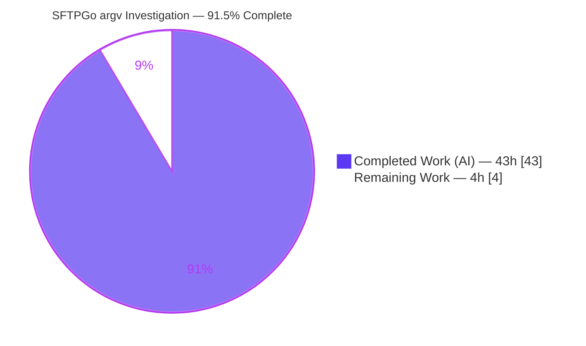
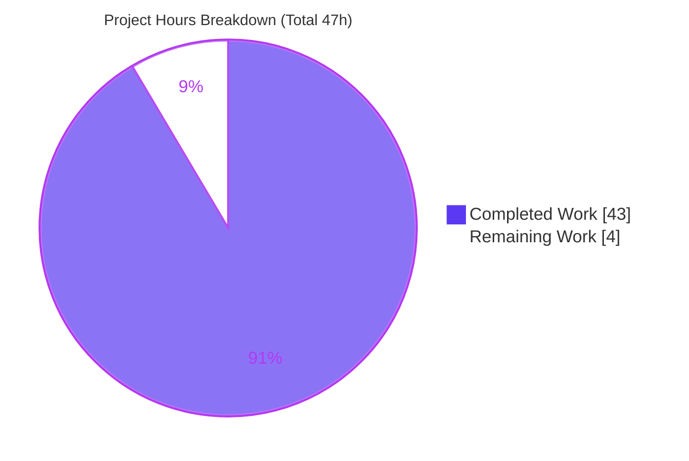
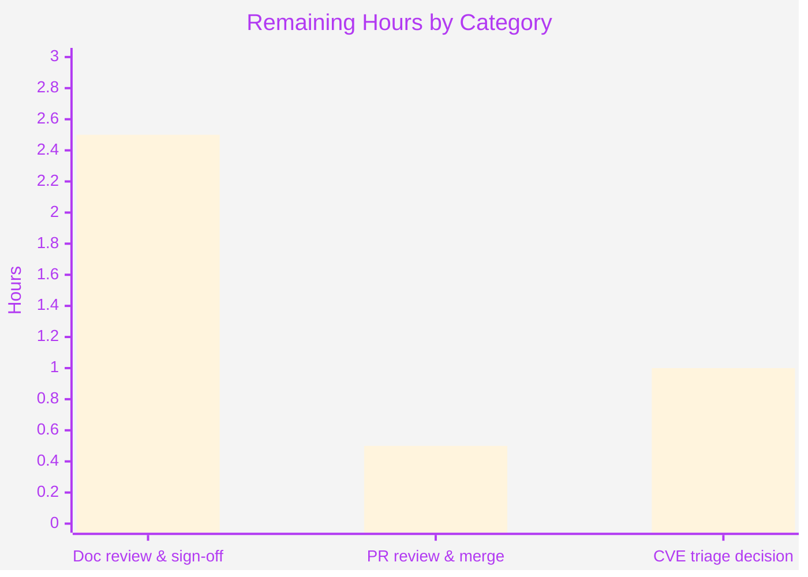

# Blitzy Project Guide — SFTPGo SSH System-Command argv Investigation

> **Project type:** Read-only security investigation → single runtime-evidenced documentation deliverable
> **Repository:** `github.com/drakkan/sftpgo` · **Analyzed HEAD (base):** `44634210287cb192f2a53147eafb84a33a96826b` (SFTPGo `0.9.5-dev`, `go 1.13`)
> **Branch:** `blitzy-cffc5d01-5ed2-47ff-990d-62315a2439f0` · **HEAD:** `c08ddbb4`
> **Brand color legend:** ▰ Completed / AI Work = **Dark Blue `#5B39F3`** · ▱ Remaining = **White `#FFFFFF`** · Headings/Accents = Violet-Black `#B23AF2` · Highlight = Mint `#A8FDD9`

---

## 1. Executive Summary

### 1.1 Project Overview

This project is a **read-only security investigation** of SFTPGo — a fully-featured Go SFTP server — targeting its optional SSH `exec` / system-command support (`rsync`, `git-*`). The objective was to produce a single, reproducible, runtime-evidenced Markdown document that proves exactly what argument vector (argv) reaches the operating-system process SFTPGo spawns for an SSH system command, and to adjudicate three user suspicions about shell-injection, guardrail effectiveness, and destination-path fidelity. No product code was added or changed; the deliverable is an evidence-backed Q&A document intended for a security engineer or maintainer. The scope is isolated: exactly one new file is added and the repository is left byte-for-byte unchanged otherwise.

### 1.2 Completion Status



| Metric | Hours |
|--------|-------|
| **Total Hours** | **47** |
| Completed Hours (AI + Manual) | 43 (AI: 43 · Manual: 0) |
| Remaining Hours | 4 |
| **Percent Complete** | **91.5%** (43 ÷ 47) |

*Completion is held below 100% strictly to reserve mandatory human review and sign-off of a security assessment (per honest-assessment policy); every autonomous requirement of the Agent Action Plan (AAP) is complete and validated.*

### 1.3 Key Accomplishments

- ✅ **Single deliverable produced and validated:** `blitzy/documentation/sftpgo_44634210287c.md` (923 lines), the only file in the branch diff.
- ✅ **Byte-exact argv captured through the real SSH `exec` entry point** for a full 2×2 matrix (normal + adversarial invocation × has/lacks `create_symlinks`) plus a uid/gid=1000 privilege variant, a writable-dir re-run, and a naive-split edge case (7 runtime cases total).
- ✅ **All three suspicions adjudicated with leading verdicts and reasoning:** (a) WRONG, (b) WRONG for the path token, (c) PARTLY RIGHT.
- ✅ **Every argv element attributed to a named producing function** with `file:line` (`parseCommandPayload`, `getSystemCommand`, `getDestPath`, `OsFs.ResolvePath`, `wrapCmd`); ~35 anchors verified against source with zero discrepancies.
- ✅ **Privilege-boundary question answered** with observed credentials and a kernel-enforced before/after write proof.
- ✅ **Web-search corroboration** of `os/exec` no-shell semantics and SFTPGo's safe-links/munge-links intent, plus a version-fidelity caveat referencing CVE-2025-24366 / commit `b347ab6`.
- ✅ **Read-only guarantee proven and independently re-verified:** `git status --porcelain` clean, base commit is an ancestor of HEAD, exactly one file added, zero source files touched.

### 1.4 Critical Unresolved Issues

| Issue | Impact | Owner | ETA |
|-------|--------|-------|-----|
| *None* — no autonomous work is outstanding | No blocking issues; deliverable is complete and validated | — | — |

> There are **no unresolved issues that block release or validation**. The only remaining work is human review/merge (Section 1.6 / 2.2). The two security *findings* the assessment surfaces (Section 6, S1/S2) are properties of the analyzed version and are explicitly out of scope to remediate in this read-only task.

### 1.5 Access Issues

| System/Resource | Type of Access | Issue Description | Resolution Status | Owner |
|-----------------|----------------|-------------------|-------------------|-------|
| — | — | **No access issues identified.** Repository, Go toolchain, gcc/CGO, and system binaries (`rsync`, `git`, `ssh`) were all available; `go mod verify` succeeded with no registry/credential requirement. | N/A | — |

### 1.6 Recommended Next Steps

1. **[High]** Have a senior/security engineer review the 923-line assessment and, optionally, re-run the canonical build plus one matrix case to confirm the byte-exact argv (≈2.5h).
2. **[High]** Review and merge the single-file, additive PR after confirming the read-only guarantee (`git diff base..HEAD` = one file) (≈0.5h).
3. **[Medium]** Make a triage decision on the surfaced CVE-2025-24366 version nuance — whether to open a follow-up ticket to harden rsync options, upgrade SFTPGo (≥ v2.6.5), or drop `rsync` from `enabled_ssh_commands` (≈1h). *(Decision only; remediation is a separate, out-of-scope effort.)*

---

## 2. Project Hours Breakdown

### 2.1 Completed Work Detail

All components trace to AAP requirements (investigation deliverable) and were validated in this assessment.

| Component | Hours | Description |
|-----------|------:|-------------|
| C1 · Canonical build & toolchain verification | 2.0 | Go 1.13.15 + CGO/gcc build to `/tmp/sftpgo_bin`; `go mod verify`; `SFTPGo version: 0.9.5-dev` banner (AAP R4) |
| C2 · Out-of-tree observation harness | 3.0 | Scratch runtime, in-memory provider config, `enabled_ssh_commands` incl. `rsync`/`git-*`, SSH host key + client keypair, server launch |
| C3 · Measurement instrument (recorder-as-fake-`rsync`) | 3.0 | Compiled recorder dumping byte-exact `/proc/self/cmdline` + euid/egid/ruid/rgid + output-dir write probe, installed on `PATH` |
| C4 · User provisioning via REST API | 1.5 | Three users: A (has `create_symlinks`, uid 0), B (lacks it, uid 0), C (has it, uid 1000) |
| C5 · Runtime matrix execution (real SSH `exec`) | 4.5 | Cases 1–4 (2×2) + Case 5/5b (uid-1000 privilege drop) + naive-split Bonus; byte-exact argv capture (AAP R3, R5, R6) |
| C6 · Source-code tracing & function attribution | 6.0 | Full argv path across `server.go`/`ssh_cmd.go`/`sftpd.go`/`cmd_unix.go`/`cmd_windows.go`/`user.go`/`vfs`; ~35 `file:line` anchors; §5.7 element-by-element table (AAP R7, R8) |
| C7 · Suspicion adjudication with reasoning | 2.5 | §1 leading verdicts + §6 cause→effect reasoning for (a)/(b)/(c) |
| C8 · Privilege-boundary analysis | 2.0 | §8: CRED interpretation, `GetUID`/`GetGID` −1 mapping, before/after write proof (AAP R9) |
| C9 · Web-search corroboration | 3.0 | §9: `os/exec` no-shell semantics, safe-links/munge-links docs, CVE-2025-24366 / commit `b347ab6` version caveat (AAP R11) |
| C10 · Document authoring & structure | 8.0 | 923 lines, 10 sections + appendix; leading verdicts; actual unedited output next to each claim; verbatim phrasings; coverage checklist (AAP R1, R12) |
| C11 · Repository-cleanliness proof & artifact teardown | 1.5 | §10 proof (`git rev-parse`/`git diff`/`git status`/`find blitzy`); remove all out-of-tree artifacts (AAP R10) |
| C12 · Validation & QA cycle | 6.0 | 5 gates; byte-for-byte reproduction; `TestRsyncOptions` corroboration; checkpoint review fixes across commits `b4d6959f`/`86794091`/`c08ddbb4`; coverage pass |
| **Total** | **43.0** | **Matches Completed Hours in Section 1.2** |

### 2.2 Remaining Work Detail

All remaining work is **path-to-production for a security-assessment deliverable** (human-in-the-loop). Actual code remediation of surfaced findings is explicitly **out of AAP scope** and is therefore *not* counted here.

| Category | Hours | Priority |
|----------|------:|----------|
| Security-assessment document review & sign-off (read 923-line doc; optional reproduction spot-check; accept verdicts/evidence) | 2.5 | High |
| PR review & merge (verify read-only single-file additive diff; approve; merge) | 0.5 | High |
| Triage decision on surfaced CVE-2025-24366 version nuance (open follow-up ticket if desired — decision only) | 1.0 | Medium |
| **Total** | **4.0** | **Matches Remaining Hours in Section 1.2 and Section 7 pie chart** |

### 2.3 Hours Reconciliation

- Section 2.1 total (43.0) **+** Section 2.2 total (4.0) **=** **47.0** = Total Hours in Section 1.2 ✅
- Completion = 43.0 ÷ 47.0 = **91.5%** (used identically in Sections 1.2, 7, and 8) ✅

---

## 3. Test Results

All tests below originate from Blitzy's autonomous validation logs (Gates 2–3) and were **independently re-verified** in this assessment. Because this is a read-only investigation with **no new production code**, code-coverage percentage is not applicable — the "tests" are compilation gates, dependency verification, an in-repo corroboration unit test, and the runtime argv-observation matrix driven through the real entry point.

| Test Category | Framework | Total | Passed | Failed | Coverage % | Notes |
|---------------|-----------|------:|-------:|-------:|-----------|-------|
| Runtime argv observation (real SSH `exec`) | Custom recorder + genuine `ssh` client | 7 | 7 | 0 | N/A | Cases 1, 2, 3, 4, 5, 5b, Bonus — byte-exact `/proc/self/cmdline` reproduced |
| Unit corroboration | Go `testing` (`go test`) | 1 | 1 | 0 | N/A | `TestRsyncOptions` PASS out-of-tree (memory provider), ~0.9s |
| Build / compilation gate | `go build` (CGO enabled) | 1 | 1 | 0 | N/A | Exit 0; `SFTPGo version: 0.9.5-dev`; only non-blocking go-sqlite3 CGO warning |
| Dependency verification | `go mod verify` | 1 | 1 | 0 | N/A | "all modules verified"; no dependency changes |
| **Total** | | **10** | **10** | **0** | **N/A** | **100% pass rate** |

**Runtime matrix results (summary):**

| Case | Context | argv[1] injected | Destination transform | Process uid/gid |
|------|---------|------------------|-----------------------|-----------------|
| 1 | A: has `create_symlinks`, uid 0, normal | `--safe-links` | `/incoming` → `…/homeA/incoming` | 0 / 0 |
| 2 | A: adversarial (`--remove-source-files` + traversal) | `--safe-links` | `/../../../../etc/passwd` → `…/homeA/etc/passwd`; extra option **verbatim** | 0 / 0 |
| 3 | B: lacks `create_symlinks`, uid 0, normal | `--munge-links` | `/incoming` → `…/homeB/incoming` | 0 / 0 |
| 4 | B: adversarial | `--munge-links` | traversal → `…/homeB/etc/passwd`; extra option **verbatim** | 0 / 0 |
| 5 | C: has `create_symlinks`, uid 1000, normal | `--safe-links` | `/incoming` → `…/homeC/incoming`; write **FAIL** errno=13 | 1000 / 1000 |
| 5b | C: same, output dir made writable | `--safe-links` | same; write **ok** | 1000 / 1000 |

---

## 4. Runtime Validation & UI Verification

**Runtime health (investigation harness — all exercised through the real code path):**

- ✅ **Operational** — Canonical binary builds and reports `SFTPGo version: 0.9.5-dev`.
- ✅ **Operational** — Out-of-tree server (in-memory provider): SSH listener on `:2022`, REST/HTTP on `:8080`.
- ✅ **Operational** — REST API: `GET /api/v1/version` → HTTP 200; `POST /api/v1/user` (with per-directory permissions map `{"/":["*"]}`) → HTTP 200, user persisted.
- ✅ **Operational** — Real SSH `exec` entry point (`sftpd/server.go:L326-327`): all 7 argv cases reproduced byte-for-byte.
- ✅ **Operational** — Measurement instrument: recorder captured clean NUL-delimited discrete-token argv (validated live this assessment).
- ✅ **Operational** — Privilege drop: euid=0 for uid-0 users vs euid=1000 for the uid-1000 user, with kernel-enforced write failure (errno=13) then success once the directory was world-writable.

**UI verification:**

- ⚠ **N/A for the deliverable** — the deliverable is a Markdown document; there is **no application UI change** to verify. *(Note: SFTPGo's admin web UI templates were confirmed loadable during harness setup once `templates_path`/`static_files_path` were set to absolute paths.)*

---

## 5. Compliance & Quality Review

Cross-map of the governing rule set (SWE-AtlasQnA-Repo) and AAP deliverables to observed evidence.

| Benchmark / Rule | Requirement | Status | Evidence |
|------------------|-------------|--------|----------|
| Single deliverable, fixed location | `blitzy/documentation/<branch>.md` | ✅ Pass | 923-line file; only file in `base..HEAD` |
| Run-first methodology | Build + run + observe before writing | ✅ Pass | §3–4: canonical build + out-of-tree run + captured recorder output |
| Real entry point | SSH `exec`, not a bypass/debug hook | ✅ Pass | `server.go:L326-327`; genuine `ssh` client |
| Canonical build stated | Exact commands, as normal user | ✅ Pass | §3.1; re-verified build exit 0 |
| Exhaustive conditions | 2×2 + uid variant + break-hunt | ✅ Pass | Cases 1–4, 5/5b, naive-split Bonus |
| Actual unedited output | Real argv + logs per claim | ✅ Pass | Byte-exact `/proc/self/cmdline` blocks beside each claim |
| Exactness / grounding | `file:line` + named functions | ✅ Pass | ~35 anchors verified, 0 discrepancies |
| Privilege-boundary answered | Do / do-not imply break | ✅ Pass | §8 + before/after write proof |
| Web-search corroboration | `os/exec` + safe/munge-links | ✅ Pass | §9.2/§9.3 (+ CVE-2025-24366 caveat) |
| Verbatim phrasings preserved | 3 suspicions + key phrases | ✅ Pass | §2 |
| Read-only guarantee | No source file modified | ✅ Pass | `git status` clean; 0 source files touched |
| Coverage pass before finishing | Each named item addressed | ✅ Pass | Appendix coverage checklist |

**Fixes applied during autonomous validation:**
- `b4d6959f` — resolved Checkpoint #4 review findings in the investigation.
- `86794091` — corrected §3.2 host-key log line to match real out-of-tree output.
- `c08ddbb4` — refined §4 output-fidelity note to comply with the "actual unedited output" rule.

**Outstanding compliance items:** none.

---

## 6. Risk Assessment

| Risk | Category | Severity | Probability | Mitigation | Status |
|------|----------|----------|-------------|------------|--------|
| T1 · Findings are version-specific to HEAD `44634210` (0.9.5-dev); later versions differ | Technical | Medium | Medium | §9.3 version-fidelity caveat explicitly bounds every claim to this HEAD | Mitigated |
| T2 · Reproduction environment drift (needs Go 1.13.15, CGO/gcc, `rsync`/`git`/`ssh`, `HostKeyAlgorithms=+ssh-rsa`) | Technical | Low | Medium | Exact toolchain + client flags documented in §3 / Section 9; build & `TestRsyncOptions` re-verified | Mitigated |
| T3 · Running the repo's own suite in place fails (default SQLite) and writes to repo root | Technical | Low | Low | AAP mandates out-of-tree memory-provider corroboration; confirmed PASS | Mitigated |
| S1 · No rsync option policy at this HEAD — extra flags pass verbatim (CVE-2025-24366 pre-fix) | Security (finding) | High* | Medium | Remediation out of scope (read-only); documented with CVE reference; recommend upgrade / disable rsync | Open (informational) |
| S2 · Config-driven uid-0 hazard — a user mapped to uid 0 runs system commands as the server identity | Security (finding) | Medium–High | Low | §8 flags it; path confinement still holds; recommend never assigning uid 0 | Open (informational) |
| O1 · Documentation-only deliverable — no runtime service to deploy/monitor | Operational | Low | Low | N/A — no service introduced | N/A |
| O2 · Out-of-tree artifact hygiene (build/recorder/keys/homes) must be cleaned | Operational | Low | Low | Teardown confirmed; §10 repo-clean proof; artifacts removed this assessment | Mitigated |
| I1 · PR/merge conflict risk | Integration | Low | Low | Additive single-file PR; zero source files touched | Mitigated |
| I2 · External binaries/network needed only to *re-run* the reproduction | Integration | Low | Low | Prerequisites documented in Section 9 | Low |

\* S1 severity is stated as a property of the *analyzed version*, not of this deliverable. The deliverable itself introduces no security risk (no code or dependency changes).

---

## 7. Visual Project Status



**Remaining work by category (Section 2.2):**



*Legend: Completed = Dark Blue `#5B39F3` · Remaining = White `#FFFFFF`. "Remaining Work" (4h) equals Section 1.2 Remaining Hours and the Section 2.2 total.*

---

## 8. Summary & Recommendations

**Achievements.** The investigation is **91.5% complete** (43 of 47 hours). Every requirement of the Agent Action Plan has been delivered and independently validated: the single 923-line answer document was produced run-first; the byte-exact argv was captured through the real SSH `exec` entry point across the full 2×2 permission matrix plus a privilege variant and edge cases; each argv element is attributed to a named function with `file:line`; the three suspicions are answered with leading verdicts and reasoning; the privilege-boundary question is resolved with a kernel-enforced write proof; and the repository is verifiably left unchanged apart from the one added file.

**Verdicts delivered.** (a) shell-string execution — **WRONG** (direct `execve`, no shell); (b) guardrails a "superficial patch" — **WRONG for the path token** (traversal normalized + sandboxed into the home), with the honest nuance that non-path option tokens are unvetted at this HEAD; (c) destination "still looks like client input" — **PARTLY RIGHT** (options verbatim, but the destination is replaced and a link-safety flag is injected).

**Remaining gaps / critical path to production.** The only remaining work is human-in-the-loop: review and sign-off of the assessment, review/merge of the additive single-file PR, and a triage decision on the surfaced CVE-2025-24366 version nuance. None of these are autonomous-completable, and none block validation.

**Success metrics.** Compilation exit 0; `go mod verify` clean; 10/10 validation checks passing; ~35 `file:line` anchors verified with zero discrepancies; read-only guarantee proven (`git diff base..HEAD` = exactly one file).

**Production-readiness assessment.** The deliverable is **ready for human review and merge**. Risk posture is **Low** for the deliverable itself; the substantive risk content is the two informational security *findings* about the analyzed version (out of scope to remediate here) and the version-specificity of the conclusions (mitigated by an explicit caveat). Recommendation: **approve and merge**, then separately triage the CVE nuance.

---

## 9. Development Guide

How to build, run, reproduce the argv evidence, and verify cleanliness. **Every command below was executed during this assessment** unless explicitly marked as the documented reproduction recipe.

### 9.1 System Prerequisites

- **OS:** Linux x86_64 (validated on Ubuntu-family container).
- **Go:** 1.13.x — validated `go version go1.13.15 linux/amd64` (the highest documented supported version; `go.mod` declares `go 1.13`).
- **C compiler:** `gcc` (validated 15.2.0) — required because `github.com/mattn/go-sqlite3` is a CGO dependency, even though the runtime uses the in-memory provider.
- **System binaries on `PATH`:** `rsync`, `git`, `ssh`, `ssh-keygen` (all validated present).

```bash
go version           # expect: go version go1.13.15 linux/amd64
gcc --version | head -1
for b in rsync git ssh ssh-keygen; do command -v "$b"; done
```

### 9.2 Canonical Build (default configuration, normal user)

Run from the repository root:

```bash
GO111MODULE=on CGO_ENABLED=1 go build -o /tmp/sftpgo_bin .
/tmp/sftpgo_bin --version        # expect: SFTPGo version: 0.9.5-dev
GO111MODULE=on go mod verify     # expect: all modules verified
```

- **Expected:** build exit code `0`. The only stderr is a third-party go-sqlite3 bundled-SQLite CGO warning (`-Wreturn-local-addr`) — non-blocking, out-of-scope vendored C.
- **Gotcha:** do **not** set `GOFLAGS=-mod=mod` — unsupported in Go 1.13 (valid values: `''`, `readonly`, `vendor`).

### 9.3 Out-of-Tree Observation Server

The optional system commands are **off by default** (`defaultSSHCommands = md5sum, sha1sum, cd, pwd`), so `rsync`/`git-*` must be enabled. Run entirely **outside** the source tree to preserve the read-only guarantee.

```bash
REPO="$(pwd)"                 # repository root
OBS=/tmp/sftpgo_obs
rm -rf "$OBS"; mkdir -p "$OBS/homeA"

# Build a memory-provider config from the shipped sftpgo.json:
python3 - "$OBS" "$REPO" <<'PY'
import json, sys
obs, repo = sys.argv[1], sys.argv[2]
d = json.load(open('sftpgo.json'))
d['data_provider']['driver'] = 'memory'; d['data_provider']['name'] = ''
d['sftpd']['bind_port'] = 2022
d['sftpd']['enabled_ssh_commands'] = ["md5sum","sha1sum","cd","pwd",
    "git-receive-pack","git-upload-pack","git-upload-archive","rsync"]
d['httpd']['bind_port'] = 8080
d['httpd']['templates_path'] = repo + '/templates'    # ABSOLUTE — see gotcha
d['httpd']['static_files_path'] = repo + '/static'
d['httpd']['log_file_path'] = obs + '/sftpgo.log'     # ABSOLUTE — see gotcha
json.dump(d, open(obs + '/sftpgo.json','w'), indent=2)
PY

# Launch from a scratch CWD (NOT the repo root) so nothing is written into the repo:
( cd "$OBS" && /tmp/sftpgo_bin serve -c "$OBS" > "$OBS/server.log" 2>&1 & )
sleep 5
```

- **Expected startup log:** `starting SFTPGo 0.9.5-dev, config dir: /tmp/sftpgo_obs, ...`; SSH listener on `:2022` (an RSA host key `id_rsa` is auto-created on first run); REST/HTTP on `:8080`.
- **Gotcha (templates):** if `templates_path`/`static_files_path` are left relative, the server panics with `open .../templates/base.html: no such file or directory` (`httpd/web.go:95`). Set them to **absolute** repo paths.
- **Gotcha (cleanliness):** the config's default `log_file_path` is relative (`sftpgo.log`). Launching with CWD at the repo root writes `sftpgo.log` **into the repo**. Launch from a scratch directory or set an absolute `log_file_path`. *(This is exactly why the investigation observed out-of-tree.)*

### 9.4 Create Users via REST API

```bash
# permissions MUST be a per-directory map, not a flat array, in this version:
curl -s -X POST http://127.0.0.1:8080/api/v1/user \
  -H 'Content-Type: application/json' \
  -d '{"username":"userA","password":"pw","home_dir":"/tmp/sftpgo_obs/homeA",
       "permissions":{"/":["*"]},"uid":0,"gid":0}'
# expect: HTTP 200 and a JSON user object
```

- **Gotcha:** a flat `"permissions":["*"]` returns HTTP 400 `cannot unmarshal array into Go struct field User.permissions of type map[string][]string`. Use `{"/":["*"]}`.
- For the permission matrix: create `userB` with `"permissions":{"/":["list","download","upload","delete","rename",...]}` **without** `create_symlinks`, and `userC` like `userA` but with `"uid":1000,"gid":1000`.

### 9.5 Measurement Instrument (recorder-as-fake-`rsync`)

Install a small recorder on the server's `PATH` under the name `rsync`; it dumps the byte-exact argv the kernel delivered plus its credentials.

```go
// recorder.go — build with: GO111MODULE=off go build -o rsync recorder.go
package main
import ("fmt";"io/ioutil";"strings";"syscall")
func main() {
    raw, _ := ioutil.ReadFile("/proc/self/cmdline")
    parts := strings.Split(strings.TrimRight(string(raw), "\x00"), "\x00")
    fmt.Println("ARGV_BEGIN")
    for i, p := range parts { fmt.Printf("argv[%d]=%s\n", i, p) }
    fmt.Printf("ARGV_NUL_VISIBLE=%s|\n", strings.Join(parts, "|"))
    fmt.Printf("CRED euid=%d egid=%d ruid=%d rgid=%d\n",
        syscall.Geteuid(), syscall.Getegid(), syscall.Getuid(), syscall.Getgid())
    fmt.Println("ARGV_END")
}
```

Place the compiled `rsync` first on the server's `PATH` before launching the server.

### 9.6 Drive the Real SSH `exec` Entry Point

```bash
# Server offers only an RSA host key -> pass +ssh-rsa on modern OpenSSH clients:
ssh -p 2022 -o HostKeyAlgorithms=+ssh-rsa -o PubkeyAcceptedKeyTypes=+ssh-rsa \
    -o StrictHostKeyChecking=no -o UserKnownHostsFile=/dev/null \
    -i /tmp/sftpgo_obs/client_rsa userA@127.0.0.1 \
    'rsync --server -vlogDtprze.iLsfxC . /incoming'                 # normal

ssh -p 2022 -o HostKeyAlgorithms=+ssh-rsa ... userA@127.0.0.1 \
    'rsync --server --remove-source-files -vlogDtprze.iLsfxC . /../../../../etc/passwd'   # adversarial
```

- **Expected (normal):** recorder prints `rsync | --safe-links | --server | -vlogDtprze.iLsfxC | . | /tmp/sftpgo_obs/homeA/incoming`.
- **Expected (adversarial):** `--remove-source-files` appears **verbatim** as a discrete element; the traversal destination collapses to `/tmp/sftpgo_obs/homeA/etc/passwd` (sandboxed into the home).

### 9.7 Corroboration Test & Cleanliness Verification

```bash
# In an OUT-OF-TREE copy configured with the memory provider:
GO111MODULE=on CGO_ENABLED=1 go test ./sftpd/ -run '^TestRsyncOptions$' -count=1 -v
# expect: --- PASS: TestRsyncOptions ; ok ... (~0.9s)

# Cleanliness (run in the repo):
git status --porcelain     # expect: empty
git diff --name-status 44634210287cb192f2a53147eafb84a33a96826b..HEAD
# expect exactly: A  blitzy/documentation/sftpgo_44634210287c.md

# Teardown all out-of-tree artifacts:
rm -rf /tmp/sftpgo_obs /tmp/sftpgo_bin
```

- **Gotcha:** with the **default SQLite** provider, the package `TestMain` fails setup (`os.Exit(1)`) and would write artifacts into the repo root. Always corroborate with the **memory** provider, out-of-tree.

### 9.8 Troubleshooting Quick Reference

| Symptom | Cause | Resolution |
|---------|-------|------------|
| `open .../templates/base.html: no such file` panic | Relative `templates_path`/`static_files_path` | Set both to absolute repo paths |
| Stray `sftpgo.log` in repo root | Relative `log_file_path` + CWD = repo root | Launch from scratch dir or set absolute `log_file_path` |
| `POST /api/v1/user` → HTTP 400 unmarshal array | `permissions` sent as flat array | Use per-directory map `{"/":["*"]}` |
| `go test` fails instantly (exit 1) | Default SQLite `TestMain` setup | Use memory provider, out-of-tree |
| SSH `no matching host key type` | Modern OpenSSH refuses `ssh-rsa` | Add `-o HostKeyAlgorithms=+ssh-rsa` |
| `-mod=mod not supported` | `GOFLAGS` set for a newer Go | Unset it (Go 1.13 accepts `''`/`readonly`/`vendor`) |

---

## 10. Appendices

### Appendix A — Command Reference

| Purpose | Command |
|---------|---------|
| Build canonical binary | `GO111MODULE=on CGO_ENABLED=1 go build -o /tmp/sftpgo_bin .` |
| Print version | `/tmp/sftpgo_bin --version` |
| Verify modules | `GO111MODULE=on go mod verify` |
| Run out-of-tree server | `/tmp/sftpgo_bin serve -c /tmp/sftpgo_obs` |
| Create user (REST) | `curl -X POST http://127.0.0.1:8080/api/v1/user -d '{...,"permissions":{"/":["*"]}}'` |
| Drive SSH exec | `ssh -p 2022 -o HostKeyAlgorithms=+ssh-rsa -i <key> userA@127.0.0.1 'rsync --server ... . /incoming'` |
| Corroboration test | `go test ./sftpd/ -run '^TestRsyncOptions$' -count=1 -v` |
| Cleanliness check | `git status --porcelain` · `git diff --name-status <base>..HEAD` |

### Appendix B — Port Reference

| Port | Service | Notes |
|------|---------|-------|
| 2022 | SFTPGo SSH/SFTP listener | Where the SSH `exec` entry point is driven; RSA host key only |
| 8080 | SFTPGo REST/HTTP admin API | User provisioning + `GET /api/v1/version` |

### Appendix C — Key File Locations

| Path | Role |
|------|------|
| `blitzy/documentation/sftpgo_44634210287c.md` | **The deliverable** (923 lines; only file in `base..HEAD`) |
| `sftpd/ssh_cmd.go` | Parse/gate/build/spawn; `exec.Command` at `:L324`; `getSystemCommand` `:L288-331`; `getDestPath` `:L356-371`; `parseCommandPayload` `:L423-429` |
| `sftpd/server.go` | Real SSH `exec` entry point `:L326-327` |
| `sftpd/sftpd.go` | Command sets `:L66-70`; exec wire struct `:L126-128` |
| `sftpd/cmd_unix.go` / `sftpd/cmd_windows.go` | Privilege wrap `:L10-16` / Windows no-op `:L7-9` |
| `dataprovider/user.go` | `PermCreateSymlinks` `:L36`; `GetUID`/`GetGID` `:L237-245` |
| `sftpd/internal_test.go` | `TestRsyncOptions` `:L772-816` (corroboration surface) |

### Appendix D — Technology Versions

| Component | Version | Source |
|-----------|---------|--------|
| SFTPGo | 0.9.5-dev | Build banner |
| Go | 1.13.15 | `go version` |
| gcc | 15.2.0 (Ubuntu) | `gcc --version` |
| golang.org/x/crypto | v0.0.0-20200109152110-61a87790db17 | `go.mod` (SSH server) |
| github.com/pkg/sftp | v1.11.0 | `go.mod` |
| github.com/mattn/go-sqlite3 | v2.0.2+incompatible | `go.mod` (CGO — build only) |
| github.com/spf13/viper | v1.6.1 | `go.mod` (config, `enabled_ssh_commands`) |
| github.com/go-chi/chi | v4.0.2+incompatible | `go.mod` (REST router) |

### Appendix E — Environment Variable Reference

| Variable | Value | Purpose |
|----------|-------|---------|
| `GO111MODULE` | `on` | Force module-aware build for `go 1.13` |
| `CGO_ENABLED` | `1` | Required for the `go-sqlite3` CGO dependency |
| `GOFLAGS` | *(unset)* | Must not be `-mod=mod` on Go 1.13 |

*The out-of-tree server is configured via the JSON config file (memory provider, `enabled_ssh_commands`, ports, template/static/log paths), not environment variables.*

### Appendix F — Developer Tools Guide

| Tool | Use in this project |
|------|---------------------|
| `git` | Verify read-only guarantee: `git status --porcelain`, `git diff --name-status <base>..HEAD`, `git merge-base --is-ancestor` |
| `go` | Build (`go build`), verify deps (`go mod verify`), corroboration test (`go test`) |
| `ssh` / `ssh-keygen` | Drive the real SSH `exec` entry point; generate client keypair |
| Recorder (`/proc/self/cmdline`) | Capture byte-exact argv delivered to the spawned process |
| `curl` | REST user provisioning and health checks against `:8080` |

### Appendix G — Glossary

| Term | Meaning |
|------|---------|
| **argv** | The argument vector delivered to a process; here captured byte-exactly from `/proc/self/cmdline` |
| **`execve`** | The Unix syscall that replaces a process image; `exec.Command` performs a direct `execve` (no shell) |
| **`--safe-links` / `--munge-links`** | rsync link-safety flags SFTPGo injects based on the `create_symlinks` permission |
| **`create_symlinks`** | SFTPGo user permission (`PermCreateSymlinks`) that selects `--safe-links` vs `--munge-links` |
| **`ResolvePath`** | VFS method that sandboxes the destination path into the user's home directory |
| **`wrapCmd`** | *NIX privilege wrap that sets a child credential only when uid/gid > 0 (drops, never elevates) |
| **CVE-2025-24366** | Later upstream vulnerability (rsync option pass-through) fixed in v2.6.5 (commit `b347ab6`); the fix is **absent** at the analyzed HEAD |
| **Read-only guarantee** | Constraint that no existing repository file is modified; only the one deliverable is added |

---

*Cross-section integrity verified: Section 1.2 Remaining (4h) = Section 2.2 total (4h) = Section 7 pie "Remaining Work" (4h); Section 2.1 (43h) + Section 2.2 (4h) = 47h Total; completion 43/47 = 91.5% used consistently in Sections 1.2, 7, 8; all Section 3 tests originate from Blitzy's autonomous validation logs; Completed = `#5B39F3`, Remaining = `#FFFFFF` throughout.*