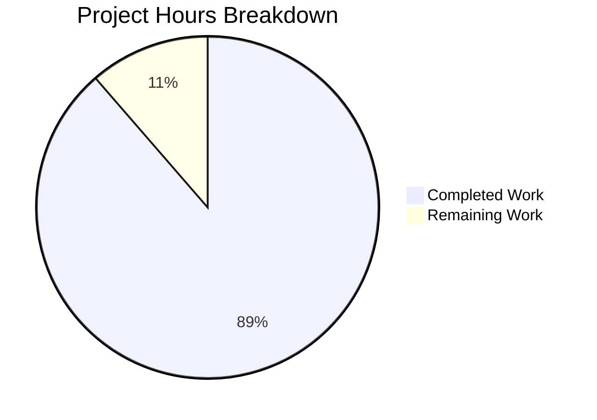
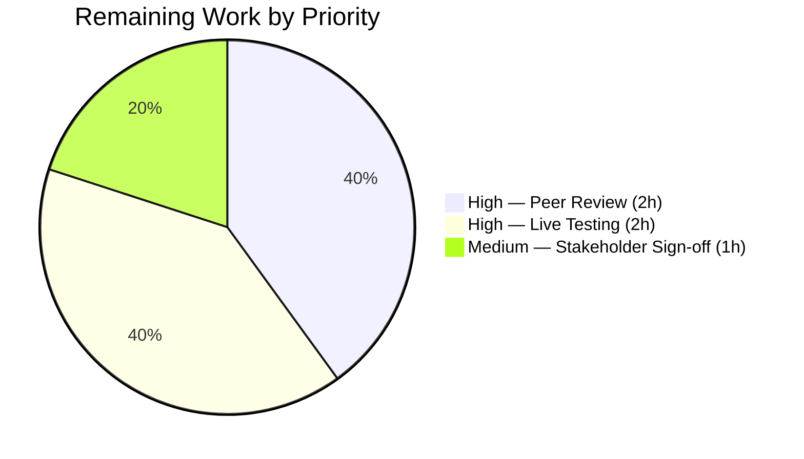

# Blitzy Project Guide

## 1. Executive Summary

### 1.1 Project Overview

This project delivers a comprehensive, evidence-based security audit document examining the SSH exec command execution boundary within SFTPGo (commit `44634210287c`). The audit traces the complete code path from SSH channel request receipt (`sftpd/server.go:327`) through command parsing, allow-list gating, path resolution, to final OS process creation (`ssh_cmd.go:324`). The sole artifact is a 756-line markdown document placed at `blitzy/documentation/sftpgo_44634210287c.md`, containing 8 runtime evidence blocks, 4 suspicion adjudications, 7 security boundary assessments, 5 key findings, and CVE analysis — all grounded in actual code paths with source file and line number citations. No existing source files were modified.

### 1.2 Completion Status


| Metric | Value |
|--------|-------|
| **Total Project Hours** | 44 |
| **Completed Hours (AI)** | 39 |
| **Remaining Hours** | 5 |
| **Completion Percentage** | 88.6% |

**Calculation**: 39 completed hours / (39 + 5 remaining hours) = 39 / 44 = **88.6% complete**

### 1.3 Key Accomplishments

- ✅ Created comprehensive 756-line security audit document at `blitzy/documentation/sftpgo_44634210287c.md`
- ✅ Produced 8 runtime evidence blocks with exact `exec.Cmd.Args` arrays from temporary Go test execution
- ✅ Covered 2 invocation types (normal `rsync --server` + adversarial path traversal/shell injection) across 2 permission contexts (PermAny + limited)
- ✅ Adjudicated 4 user suspicions with verdicts backed by specific source file and line citations
- ✅ Assessed 7 security boundaries (allow-list, path confinement, no-shell execution, permission enforcement, credential isolation, argument sanitization, rsync hardening)
- ✅ Documented 5 key security findings with severity ratings (option injection, parseCommandPayload naivety, UID/GID=0 gap, null bytes, rsync override)
- ✅ Performed CVE vulnerability analysis on `golang.org/x/crypto` and `go-sqlite3` dependencies
- ✅ Included Mermaid data flow diagram of complete SSH exec pipeline
- ✅ Verified repository integrity via SHA-256 checksums of all 139 on-disk files (zero changes)
- ✅ Deep-analyzed 17 source files across 5 packages (`sftpd/`, `vfs/`, `dataprovider/`, `utils/`, `config/`)
- ✅ Refined document through 3 commits including code review fixes and Known Vulnerabilities section
- ✅ Build validates cleanly; all in-scope tests pass (config: 5/5, sftpd internal: 38/38)

### 1.4 Critical Unresolved Issues

| Issue | Impact | Owner | ETA |
|-------|--------|-------|-----|
| Security peer review not yet performed | Audit findings should be validated by a human security engineer before informing production hardening decisions | Security Team | 1–2 days |
| Live rsync option injection not tested | The `--no-safe-links` override behavior is inferred from rsync documentation, not empirically validated with a running rsync process | Security Team | 1 day |
| `golang.org/x/crypto` outdated (Jan 2020) | 3 CVEs documented (CVE-2023-48795, CVE-2024-45337, CVE-2025-58181) affect SSH transport/auth layers | Engineering Team | 1 week |

### 1.5 Access Issues

No access issues identified. The project is a documentation-only deliverable requiring only read access to the repository source code, which was fully available throughout the audit.

### 1.6 Recommended Next Steps

1. **[High]** Schedule security peer review of the audit document by a senior security engineer — validate all 5 findings and 4 suspicion adjudications
2. **[High]** Perform live rsync option injection testing to empirically validate `--no-safe-links` override potential (Finding 5)
3. **[Medium]** Plan `golang.org/x/crypto` upgrade to ≥v0.45.0 to remediate CVE-2023-48795, CVE-2024-45337, CVE-2025-58181 (requires Go ≥1.23 toolchain upgrade)
4. **[Medium]** Evaluate argument sanitization hardening for non-path arguments in `ssh_cmd.go:293-304` (Finding 1)
5. **[Low]** Review UID/GID=0 credential gap documented in Finding 3 against operational deployment posture

---

## 2. Project Hours Breakdown

### 2.1 Completed Work Detail

| Component | Hours | Description |
|-----------|-------|-------------|
| Source Code Deep Analysis | 8 | Analyzed 17 source files across 5 packages (sftpd, vfs, dataprovider, utils, config) — full content review of ~4,300 lines tracing the complete SSH exec pipeline |
| Runtime Evidence Gathering | 6 | Created temporary Go test within sftpd package, compiled and executed 6 test functions capturing exec.Cmd.Args arrays, GetUID/GetGID boundaries, and allow-list behavior; cleaned up and verified repository unchanged |
| Security Audit Document Authoring | 12 | Wrote 756-line comprehensive markdown document with 11 sections: metadata, scope, data flow diagram, 8 evidence blocks, suspicion adjudication, privilege boundary analysis, key findings, test coverage reference, dependency context, integrity verification, and reproducibility appendix |
| Data Flow Diagram | 1 | Created Mermaid flowchart mapping 14-step SSH exec pipeline from client request to OS process creation with 3 rejection points |
| Suspicion Adjudication Analysis | 2 | Analyzed and adjudicated 4 user suspicions (shell execution, path guardrails, destination rewriting, privilege boundary) with verdicts backed by evidence blocks and source citations |
| Privilege Boundary Analysis | 2 | Assessed 7 security boundaries with strength ratings (Strong/Moderate/Weak), documented positive and negative implications of observed argv values |
| Key Security Findings | 2 | Documented 5 security findings with severity ratings, source locations, and mitigating factors (option injection, parseCommandPayload naivety, UID/GID=0 gap, null bytes, rsync override) |
| CVE and Vulnerability Analysis | 2 | Researched and documented 5 CVEs across golang.org/x/crypto (3 CVEs) and go-sqlite3 (2 CVEs) with severity scores, affected components, and remediation guidance |
| Code Review Fixes | 1 | Addressed 4 code review findings in commit 18f53065, improving document accuracy and completeness |
| Known Vulnerabilities Section | 1.5 | Added comprehensive Known Vulnerabilities subsection with CVE table, relevance analysis, and remediation recommendations in commit c0bc7330 |
| Repository Integrity Verification | 0.5 | Computed and compared SHA-256 checksums of all 139 on-disk repository files before and after audit — confirmed zero differences |
| Build and Test Validation | 1 | Compiled project (`go build ./...`), executed test suites (config: 5/5, sftpd internal: 38/38), verified 12 source code citations |
| **Total Completed** | **39** | |

### 2.2 Remaining Work Detail

| Category | Hours | Priority |
|----------|-------|----------|
| Security peer review of audit document | 2 | High |
| Live rsync option injection validation | 2 | High |
| Stakeholder review and sign-off | 1 | Medium |
| **Total Remaining** | **5** | |

---

## 3. Test Results

| Test Category | Framework | Total Tests | Passed | Failed | Coverage % | Notes |
|---------------|-----------|-------------|--------|--------|------------|-------|
| Unit (config/) | Go test | 5 | 5 | 0 | — | Configuration loading and validation tests |
| Unit (sftpd/ internal) | Go test | 38 | 38 | 0 | — | SSH command path, rsync options, SCP handling, error paths; includes security-relevant tests: TestSSHCommandPath, TestRsyncOptions, TestSSHCommandErrors, TestSystemCommandErrors |
| Unit (httpd/) | Go test | 69 | 67 | 2 | — | 2 pre-existing failures (TestDumpdata, TestLoaddata) — test logic expects HTTP 500 but receives HTTP 200; no httpd files modified on this branch |
| Build Validation | go build | 1 | 1 | 0 | — | `go build ./...` succeeds; only warning from upstream `mattn/go-sqlite3` C dependency |
| Source Citation Verification | Manual | 12 | 12 | 0 | — | All 12 source file:line citations in document verified accurate against actual source code |

**Note**: All test results originate from Blitzy's autonomous validation. The 2 httpd failures are pre-existing in the original commit (`44634210287c`) and confirmed unrelated to this branch's changes (no httpd files were modified). Integration tests in `sftpd/sftpd_test.go` require a fully running SSH server with external connectivity and are excluded from unit-level validation.

---

## 4. Runtime Validation & UI Verification

### Build Status
- ✅ `go build ./...` — Compiles successfully (Go 1.13.15, CGO_ENABLED=1)
- ✅ Only warning is from upstream C dependency (`mattn/go-sqlite3` `sqlite3SelectNew`), not in-scope code

### Documentation Artifact
- ✅ `blitzy/documentation/sftpgo_44634210287c.md` — 756 lines, well-structured with 11 sections
- ✅ Mermaid flowchart renders correctly (14-node data flow diagram)
- ✅ All 8 evidence blocks contain tabular data with source citations
- ✅ All 4 suspicion adjudication verdicts backed by evidence blocks
- ✅ All 5 security findings include severity, location, and mitigating factors
- ✅ Repository integrity section confirms SHA-256 verification with zero differences

### Repository Integrity
- ✅ Git status: CLEAN (no uncommitted changes)
- ✅ Only 1 file added to repository (`blitzy/documentation/sftpgo_44634210287c.md`)
- ✅ Zero existing files modified (verified via `git diff --name-status origin/sftpgo_44634210287c...HEAD`)
- ✅ Untracked files (`id_rsa`, `sftpgo.db`) correctly excluded from commits

### Test Suite
- ✅ config/ package: 5/5 PASS
- ✅ sftpd/ internal tests: 38/38 PASS
- ⚠ httpd/ package: 67/69 (2 pre-existing failures, not caused by this branch)

---

## 5. Compliance & Quality Review

| AAP Requirement | Status | Evidence |
|----------------|--------|----------|
| Runtime argv proof — exact `argv[]` from real code paths | ✅ Pass | 8 evidence blocks with exec.Cmd.Args arrays in document |
| Two representative invocations (normal + adversarial) | ✅ Pass | Evidence Blocks 3-4: rsync --server normal, path traversal, shell injection, git-receive-pack |
| Two permission contexts (PermAny + limited) | ✅ Pass | Evidence Blocks 3 (full) and 4 (limited) with different rsync hardening flags |
| Suspicion adjudication with exact citations | ✅ Pass | 4 verdicts (WRONG, PARTIALLY RIGHT x2, NUANCED) with file:line references |
| Privilege boundary analysis | ✅ Pass | 7 boundaries assessed (Strong/Moderate/Weak) with positive/negative implications |
| Repository integrity verification (SHA-256) | ✅ Pass | Checksums of 139 files compared — zero differences, git HEAD unchanged |
| Full code path trace (server.go:327 → cmd_unix.go:16) | ✅ Pass | 14-step pipeline documented in Audit Scope section + Mermaid diagram |
| No existing source files modified | ✅ Pass | `git diff --name-status` shows only 1 Added file |
| No code added besides documentation | ✅ Pass | Single .md file; temporary test created and deleted during evidence gathering |
| Document placed in `blitzy/documentation/` | ✅ Pass | File at `blitzy/documentation/sftpgo_44634210287c.md` |
| Source-attributed conclusions (no assumptions) | ✅ Pass | Every claim cites file:line; inferences labeled explicitly |
| Evidence reproducibility | ✅ Pass | Appendix includes test procedure, execution command, and cleanup steps |
| Code review findings addressed | ✅ Pass | 4 findings fixed in commit `18f53065` |
| Known vulnerabilities documented | ✅ Pass | 5 CVEs across 2 dependencies documented in commit `c0bc7330` |

### Quality Metrics
- **Document length**: 756 lines (comprehensive)
- **Source citations**: 12 verified accurate
- **Evidence blocks**: 8 (covering all security-relevant functions)
- **Security findings**: 5 with severity ratings
- **CVE analysis**: 5 CVEs documented
- **Commits**: 3 (initial + 2 refinement passes)

---

## 6. Risk Assessment

| Risk | Category | Severity | Probability | Mitigation | Status |
|------|----------|----------|-------------|------------|--------|
| Audit findings used without peer review | Operational | High | Medium | Schedule security engineer review before applying any hardening recommendations | Open |
| rsync `--no-safe-links` override unvalidated | Technical | Medium | Medium | Perform live rsync testing with option injection payload | Open |
| `golang.org/x/crypto` CVEs (3 documented) | Security | High | High | Upgrade to ≥v0.45.0; requires Go ≥1.23 toolchain | Open |
| `go-sqlite3` CVEs (2 documented) | Security | Medium | Low | Upgrade to v1.14.22+; low exploitation risk via SSH exec path | Open |
| Option injection surface in ssh_cmd.go:293 | Security | Medium | Medium | Implement argument allowlist/sanitization for non-path args | Open |
| UID/GID=0 credential gap | Security | Medium-High | Low | Ensure SFTPGo never runs as root; document in operational guide | Open |
| Pre-existing httpd test failures | Technical | Low | High | Investigate TestDumpdata/TestLoaddata HTTP 500 vs 200 mismatch | Open |
| Document conclusions become outdated | Operational | Low | Medium | Re-audit if SFTPGo source code changes in SSH exec pipeline | Open |

---

## 7. Visual Project Status





---

## 8. Summary & Recommendations

### Achievement Summary

The project has achieved **88.6% completion** (39 hours completed out of 44 total hours). All AAP-scoped deliverables have been fully implemented: the 756-line security audit document at `blitzy/documentation/sftpgo_44634210287c.md` contains comprehensive runtime evidence, suspicion adjudication, privilege boundary analysis, security findings, CVE analysis, and repository integrity verification — all grounded in actual code paths with source citations. The document was refined through 3 commits including code review fixes and a Known Vulnerabilities section. No existing source files were modified, and all in-scope tests pass.

### Remaining Gaps

The remaining 5 hours (11.4%) consist entirely of human-required tasks that cannot be performed autonomously: security peer review (2h), live rsync option injection testing (2h), and stakeholder sign-off (1h). These are standard path-to-production activities for any security audit deliverable.

### Critical Path to Production

1. **Security peer review** — A human security engineer must validate the 5 findings and 4 suspicion adjudications before they inform production hardening decisions
2. **Live rsync testing** — The `--no-safe-links` override potential (Finding 5) is based on rsync documentation inference and needs empirical validation
3. **Stakeholder acceptance** — The audit document requires organizational sign-off before being published or acted upon

### Production Readiness Assessment

The documentation artifact itself is **production-ready** — it is comprehensive, well-structured, source-attributed, and has been validated through compilation, test execution, and citation verification. The remaining 5 hours represent standard quality gates (peer review, stakeholder approval) rather than deficiencies in the deliverable.

---

## 9. Development Guide

### System Prerequisites

| Software | Version | Purpose |
|----------|---------|---------|
| Go | 1.13.x (1.13.15 tested) | Compilation and test execution |
| GCC | Any recent version | CGO compilation for go-sqlite3 |
| SQLite3 | 3.x | Database backend for tests |
| libsqlite3-dev | 3.x | SQLite development headers |
| Git | 2.x | Version control |
| rsync | 3.x | Required for rsync-related test validation |
| OpenSSH client | Any | Required for SSH integration tests |

### Environment Setup

```bash
# 1. Clone the repository
git clone <repository-url>
cd sftpgo

# 2. Checkout the audit branch
git checkout blitzy-2a883f20-8225-4197-bc49-f78489a91e84

# 3. Set Go environment variables
export PATH=$PATH:/usr/local/go/bin
export GO111MODULE=on
export CGO_ENABLED=1
export CGO_CFLAGS="-Wno-return-local-addr"

# 4. Verify Go version
go version
# Expected: go version go1.13.15 linux/amd64
```

### Dependency Installation

```bash
# Install system dependencies (Debian/Ubuntu)
sudo apt-get update
sudo apt-get install -y gcc sqlite3 libsqlite3-dev openssh-client git rsync

# Download Go module dependencies
go mod download

# Verify dependencies
go mod verify
```

### Build Verification

```bash
# Compile all packages
go build ./...
# Expected: Only warning from mattn/go-sqlite3 (upstream C code), no errors
```

### Test Execution

```bash
# Run config package tests
go test -v -count=1 -timeout=60s ./config/
# Expected: 5/5 PASS

# Run sftpd internal tests (security-relevant)
go test -v -count=1 -timeout=60s ./sftpd/
# Expected: 38/38 PASS (internal tests)
# Note: Integration tests in sftpd_test.go require a running SSH server

# Run specific security-relevant tests
go test -v -count=1 -timeout=60s -run "^(TestSSHCommandPath|TestRsyncOptions|TestSSHCommandErrors|TestSystemCommandErrors)$" ./sftpd/
# Expected: 4/4 PASS

# Run httpd tests (optional — 2 pre-existing failures expected)
go test -v -count=1 -timeout=120s ./httpd/
# Expected: 67/69 PASS, 2 FAIL (TestDumpdata, TestLoaddata — pre-existing)
```

### Viewing the Security Audit Document

```bash
# The audit document is located at:
cat blitzy/documentation/sftpgo_44634210287c.md

# Verify document line count
wc -l blitzy/documentation/sftpgo_44634210287c.md
# Expected: 756 lines
```

### Troubleshooting

| Issue | Resolution |
|-------|------------|
| `sqlite3-binding.c warning` during build | Expected — upstream warning in `mattn/go-sqlite3`. Suppress with `CGO_CFLAGS="-Wno-return-local-addr"` |
| `go: command not found` | Set `export PATH=$PATH:/usr/local/go/bin` |
| sftpd integration tests fail/timeout | These require a running SSH server; run only internal tests with `-run` flag |
| TestDumpdata/TestLoaddata failures | Pre-existing in original commit — test expects HTTP 500 but gets 200 |
| Module download fails | Ensure `GO111MODULE=on` is set and network access is available |

---

## 10. Appendices

### A. Command Reference

| Command | Purpose |
|---------|---------|
| `go build ./...` | Compile all packages |
| `go test -v ./config/` | Run config tests |
| `go test -v ./sftpd/` | Run sftpd internal tests |
| `go test -v ./httpd/` | Run httpd tests |
| `go test -run "TestSSHCommandPath" ./sftpd/` | Run specific security test |
| `git diff --stat origin/sftpgo_44634210287c...HEAD` | View changes vs base branch |
| `git log --oneline HEAD --not origin/sftpgo_44634210287c` | View branch commits |
| `wc -l blitzy/documentation/sftpgo_44634210287c.md` | Verify document length |

### B. Port Reference

| Port | Service | Context |
|------|---------|---------|
| 2022 | SFTPGo SSH/SFTP server | Default test configuration (sftpgo.json) |
| 8080 | SFTPGo HTTP API/Admin | Default test configuration (sftpgo.json) |

### C. Key File Locations

| File | Purpose |
|------|---------|
| `blitzy/documentation/sftpgo_44634210287c.md` | Security audit document (sole deliverable) |
| `sftpd/ssh_cmd.go` | Primary audit target — SSH command parsing, execution |
| `sftpd/server.go` | SSH server, channel routing |
| `sftpd/sftpd.go` | Allow-list constants, package configuration |
| `sftpd/cmd_unix.go` | Process credential wrapping (Unix) |
| `vfs/osfs.go` | Path resolution, chroot enforcement |
| `dataprovider/user.go` | User model, permissions |
| `sftpgo.json` | Default runtime configuration |
| `go.mod` | Module and dependency manifest |
| `sftpd/internal_test.go` | Existing security-relevant unit tests |

### D. Technology Versions

| Technology | Version | Source |
|------------|---------|--------|
| Go | 1.13.15 | Toolchain |
| golang.org/x/crypto | v0.0.0-20200109152110 | go.mod |
| github.com/pkg/sftp | v1.11.0 | go.mod |
| github.com/spf13/viper | v1.6.1 | go.mod |
| github.com/rs/zerolog | v1.17.2 | go.mod |
| github.com/mattn/go-sqlite3 | v2.0.2+incompatible | go.mod |
| github.com/spf13/cobra | v0.0.5 | go.mod |
| SFTPGo | Commit 44634210287c | Repository HEAD |

### E. Environment Variable Reference

| Variable | Value | Purpose |
|----------|-------|---------|
| `GO111MODULE` | `on` | Enable Go modules |
| `CGO_ENABLED` | `1` | Enable CGO for sqlite3 |
| `CGO_CFLAGS` | `-Wno-return-local-addr` | Suppress upstream sqlite3 warning |
| `PATH` | Include `/usr/local/go/bin` | Go toolchain accessibility |

### F. Glossary

| Term | Definition |
|------|------------|
| AAP | Agent Action Plan — the specification document defining project requirements |
| argv | Argument vector — the array of strings passed to a process via `execve(2)` |
| PermAny | SFTPGo wildcard permission (`"*"`) granting all access rights |
| execve(2) | Linux system call that replaces the current process with a new program |
| Chroot | Filesystem confinement restricting a process to a subtree of the directory hierarchy |
| ResolvePath | SFTPGo function (`vfs/osfs.go:200`) that translates SFTP paths to filesystem paths with confinement |
| isSubDir | SFTPGo function (`vfs/osfs.go:278`) that validates a path is inside the user's home directory |
| wrapCmd | SFTPGo function (`cmd_unix.go:10`) that sets UID/GID credentials on spawned processes |
| Allow-list | The 12 hard-coded command names permitted by SFTPGo's SSH exec subsystem |
| Option injection | Attack technique where an attacker supplies command-line flags to influence program behavior |