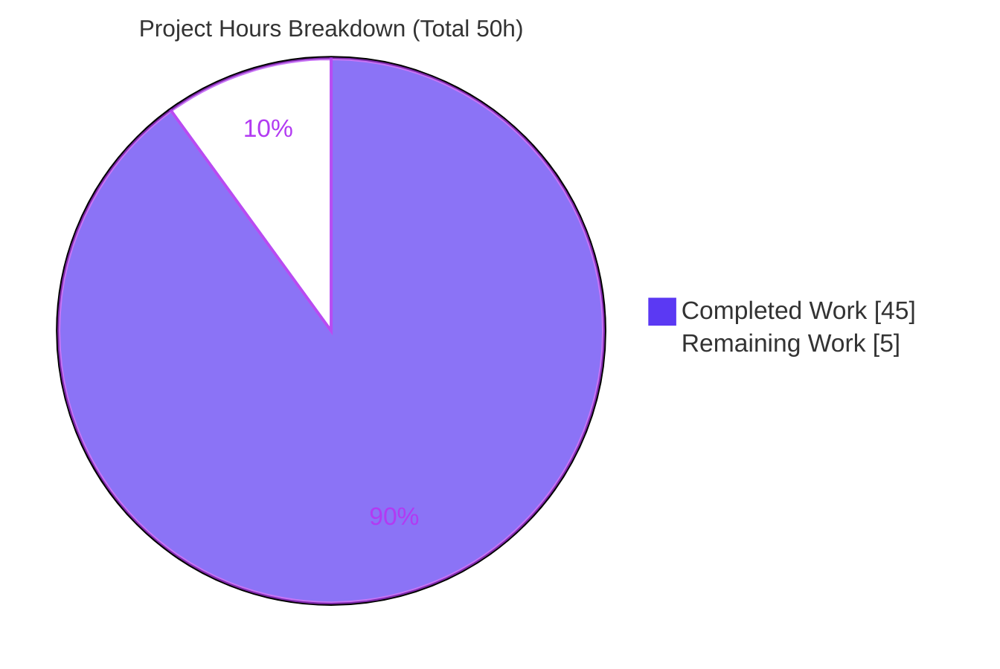
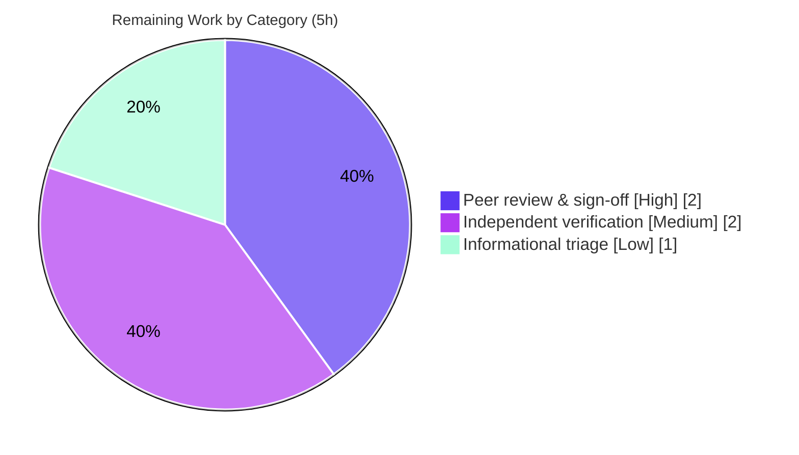

# Blitzy Project Guide — SFTPGo OS Command-Injection Runtime Security Audit

> **Task type:** Read-only security audit / QnA investigation
> **Repository:** `github.com/drakkan/sftpgo` (Go 1.13) · **Audited commit:** `44634210287c` (SFTPGo 0.9.5-dev)
> **Branch HEAD:** `a0e6fa4d` · **Sole deliverable:** `blitzy/documentation/sftpgo_44634210287c.md`
> **Brand colors:** Completed = Dark Blue `#5B39F3` · Remaining = White `#FFFFFF` · Accent = `#B23AF2` · Highlight = `#A8FDD9`

---

## 1. Executive Summary

### 1.1 Project Overview

This project is a **read-only security audit** that empirically resolves a scanner-flagged OS command-injection finding in the SFTPGo SFTP/SSH server. The objective was to determine whether the injection is genuinely exploitable, pinpoint the responsible component to `file:line`, and reproduce **both** branches of the scanner's inconsistency at runtime through the real SFTP/SSH entry point — capturing complete evidence in one markdown document. The audience is security engineers and the SFTPGo operator community. Business impact: it converts an ambiguous scanner alert into an actionable, evidence-backed verdict (the injection is **configuration-dependent**, not a defect in SFTPGo's own code), and identifies the exact operator misconfiguration that flips exploitability. No source code was modified.

### 1.2 Completion Status


| Metric | Value |
|--------|-------|
| **Total Hours** | **50** |
| **Completed Hours (AI + Manual)** | **45** (AI: 45 · Manual: 0) |
| **Remaining Hours** | **5** |
| **Percent Complete** | **90.0%** |

> Completion is computed with the PA1 AAP-scoped hours method: `Completed / (Completed + Remaining) = 45 / 50 = 90.0%`. All AAP-specified deliverables (R1–R6, methodology, and the answer document) are **complete and validated with zero discrepancies**; the remaining 10% is path-to-production **human acceptance** for a security-audit deliverable.

### 1.3 Key Accomplishments

- ✅ Named the culprit component to `file:line` — `executeAction` → `executeNotificationCommand`, subprocess launch at **`sftpd/sftpd.go:421`**, gated by **`:439`** and **`:447`**.
- ✅ Mapped the **entire** command-execution surface: exactly four `os/exec` sites (Site A `sftpd/sftpd.go:421`, Site B `sftpd/ssh_cmd.go:324`, Site C `dataprovider/dataprovider.go:742`, Site D `dataprovider/dataprovider.go:787`).
- ✅ Reproduced **both** branches of the scanner's inconsistency with the **same unchanged payload** `audit_$(date +%s).txt` through a real `golang.org/x/crypto/ssh` + `pkg/sftp` client.
- ✅ Produced the requested target artifact `/tmp/audit_<epoch>.txt` = `CONFIRMED` at Site A (condition C3) and independently at Site D.
- ✅ Established the **diagnostic oracle**: a literal `audit_$(date +%s).txt` filename proves no shell (execve path); a decimal-epoch `audit_1783999944.txt` proves an operator shell wrapper executed the substitution.
- ✅ Captured the complete evidence bundle (payload, full transcripts, filenames+timestamps, verbatim DEBUG `executed command` log lines).
- ✅ Left the repository **byte-for-byte unchanged** except the intended document; all runtime scaffolding cleaned up.
- ✅ Independently re-verified the canonical build (exit 0, SFTPGo 0.9.5-dev), `go mod verify`, server startup, and every cited `file:line`.

### 1.4 Critical Unresolved Issues

| Issue | Impact | Owner | ETA |
|-------|--------|-------|-----|
| None blocking release | The sole deliverable is complete, accurate, and committed; the audit's runtime claims were reproduced with zero discrepancies | — | — |
| Security-review sign-off pending (process gate, not a defect) | A human security engineer must formally accept the finding before it is acted upon | Security reviewer | 2h |

> There are **no unresolved technical defects** in the in-scope artifact. The only "open" items are the human-acceptance gate (Section 2.2) and the informational adjacent findings (Section 5), whose remediation is explicitly out of scope.

### 1.5 Access Issues

| System/Resource | Type of Access | Issue Description | Resolution Status | Owner |
|-----------------|----------------|-------------------|-------------------|-------|
| Git remote (`origin`) | Push | Not pushed per environment setup (embedded origin token); commits live on the local branch only | Expected / by design | Release engineer |
| Canonical Docker image | Pull/run | Independent reproduction requires `ghcr.io/scaleapi/swe-atlas:swe_atlas_QnA_drakkan_sftpgo_1.0` (Alpine + Go 1.13.15) or an equivalent Go 1.13.x + CGO environment | Documented in Section 9 | Reviewer |

> No access issues prevent build validation in the provided environment: the toolchain (Go 1.13.15, gcc), the warmed module cache, and Docker are all available and were exercised successfully.

### 1.6 Recommended Next Steps

1. **[High]** Have a security engineer peer-review and sign off on the audit findings (verdict, culprit `file:line`, and blocker mechanism). *(2h)*
2. **[Medium]** Independently reproduce the C3 / Site-D exploit in the canonical image to corroborate the security claim before action. *(2h)*
3. **[Low]** Triage the two informational adjacent findings (credential log leak at `dataprovider.go:749`; unauthenticated REST API in the 0.9.5-dev baseline) and decide whether to open **separate** remediation tickets — remediation itself is out of this task's scope. *(1h)*

---

## 2. Project Hours Breakdown

### 2.1 Completed Work Detail

Every completed component traces to an AAP requirement (explicit R1–R6, methodological, or the deliverable itself).

| Component | Hours | Description |
|-----------|:----:|-------------|
| Repository scope discovery | 3 | Exhaustive `os/exec` surface mapping — 4 sites + attacker-input callers (`transfer.go`, `handler.go`) + config/logging governance [AAP R2] |
| Web research | 2 | Authoritative Go `os/exec` execve semantics; MITRE CWE-78 vs CWE-88; SFTPGo hook guidance [AAP §0.2.2] |
| Canonical environment + CGO build | 3 | Go 1.13.15 + CGO SQLite build in the canonical Alpine image; `GO111MODULE=on CGO_ENABLED=1 go build` [AAP §0.5.1] |
| Server runtime + provisioning | 3 | Server startup, virtual-user provisioning via the real REST API, SQLite restart-persistence proof [AAP R3] |
| SFTP/SSH harness + 13 helper tools | 5 | Real `golang.org/x/crypto/ssh` + `pkg/sftp` client and full-source helper tools (§6.1–6.10) [AAP R3] |
| Condition C1 (not-vulnerable branch) | 2 | Default/empty hook + all guard variants → nothing executes [AAP R1] |
| Condition C2 (direct-binary hook) | 2 | Hook fires but execve gives no shell → literal-payload diagnostic oracle [AAP R1/R6] |
| Condition C3 (vulnerable branch) | 3 | Shell-wrapper hook → `/tmp/audit_<epoch>.txt` = `CONFIRMED` created [AAP R4] |
| Site B — SSH system commands | 3 | Whitelist, whitespace tokenization, privilege drop, `--safe-links`/`--munge-links` branches [AAP R2] |
| Site C — external auth | 2 | Env-only credential delivery; error-path credential-leak edge; driven via real SSH login [AAP R2] |
| Site D — user-management hook | 3 | Discrete argv + `SFTPGO_USER_*` env; fire-and-forget; REST-driven; independent artifact [AAP R4] |
| Edge / error paths | 2 | Missing-executable (ENOENT), nonzero-exit hook logging, transfer-error suppression [AAP methodology] |
| Evidence capture & organization | 2 | Verbatim payloads, transcripts, filenames+timestamps, DEBUG log lines [AAP R5] |
| Answer-document authoring | 5 | 2,249-line, 16-section report incl. observed-vs-inferred ledger and coverage pass [AAP deliverable] |
| Cleanup + repository integrity | 1 | Removed all scaffolding; verified clean tree and single-file diff [AAP §0.7] |
| Final validation pass | 4 | Reproduced every claim through the real entry point; verified all `file:line` citations [AAP methodology] |
| **Total Completed** | **45** | **Matches Section 1.2 Completed Hours** |

### 2.2 Remaining Work Detail

Each item is path-to-production human acceptance for a security-audit deliverable.

| Category | Hours | Priority |
|----------|:----:|:--------:|
| Security-engineer peer review & sign-off of the audit findings | 2 | High |
| Independent spot-check reproduction of the C3 / Site-D exploit | 2 | Medium |
| Triage decision on informational adjacent findings (file separate remediation tickets; remediation itself out of scope) | 1 | Low |
| **Total Remaining** | **5** | — |

### 2.3 Hours Reconciliation & Integrity Check

| Check | Expectation | Actual | Status |
|-------|-------------|--------|:------:|
| Section 2.1 total | = Section 1.2 Completed | 45 = 45 | ✅ |
| Section 2.2 total | = Section 1.2 Remaining | 5 = 5 | ✅ |
| Section 2.1 + Section 2.2 | = Section 1.2 Total | 45 + 5 = 50 | ✅ |
| Section 7 pie "Remaining Work" | = Section 1.2 Remaining = Section 2.2 total | 5 = 5 = 5 | ✅ |
| Completion % | = 45 / 50 × 100 | 90.0% | ✅ |

---

## 3. Test Results

Two independent bodies of testing apply. **(a) Runtime reproduction** is the audit's primary validation — the "tests" are the exploit conditions driven through the real SFTP/SSH/REST entry points. **(b) Repository Go unit suite** is a sanity check on the untouched code. All entries below originate from Blitzy's autonomous validation logs for this project.

| Test Category | Framework | Total Tests | Passed | Failed | Coverage % | Notes |
|---------------|-----------|:-----------:|:------:|:------:|:----------:|-------|
| Runtime reproduction — Site A (action hook) | Custom Go SFTP client (`x/crypto/ssh` + `pkg/sftp`) | 4 | 4 | 0 | n/a | C1 (+guard variants), C2, C2-rename, C3 all reproduced through the real entry point |
| Runtime reproduction — Site A edge paths | Same harness | 3 | 3 | 0 | n/a | Missing-executable (ENOENT), nonzero-exit logging, transfer-error suppression |
| Runtime reproduction — Site B (SSH system cmds) | Real SSH exec | 2 | 2 | 0 | n/a | `--safe-links` and `--munge-links` branches; whitelist + whitespace tokenization; no substitution |
| Runtime reproduction — Site C (external auth) | Real SSH password login | 1 | 1 | 0 | n/a | Env-only creds; error-path credential-leak edge reproduced with a fabricated probe secret |
| Runtime reproduction — Site D (user hook) | Real REST API | 3 | 3 | 0 | n/a | Direct, shell-wrapper (artifact created), and nonzero-exit variants |
| Repository unit suite — `config` | Go `testing` (`go test ./...`) | — | pass | 0 | measured by suite | Package passes cleanly |
| Repository unit suite — `httpd`, `sftpd` | Go `testing` | — | pass | 4 | measured by suite | 4 **pre-existing, environmental** failures (see below) — not regressions, out of scope |

**The 4 pre-existing environmental failures (disclosed, reproduce identically at the untouched baseline `44634210287c`):**

- `TestDumpdata`, `TestLoaddata` (`httpd_test.go`) — negative-path tests expect a permission error, but running as **root bypasses Unix DAC**, so they receive HTTP 200 instead of 500.
- `TestLoginInvalidFs` (`sftpd_test.go`) — depends on the `sqlite3` CLI, absent from the Alpine image.
- `TestOpenError` (`sftpd_test.go`) — root bypasses Unix DAC.

> **Integrity note:** These failures live in **out-of-scope, read-only test files** that the read-only mandate forbids modifying. They are environmental (root-DAC-bypass + absent CLIs), not code defects, and `git diff 44634210287c..HEAD --name-only` lists **only** the documentation file. SCP/GIT subtests are SKIPPED (no `scp`/`ssh` binary in the image). The audited code paths themselves compile and run cleanly.

---

## 4. Runtime Validation & UI Verification

**Runtime health** (server exercised through its real entry points):

- ✅ **Operational** — Canonical build: `GO111MODULE=on CGO_ENABLED=1 go build` → exit 0, SFTPGo 0.9.5-dev (independently reproduced).
- ✅ **Operational** — Server startup: binds SFTP `:2022` and HTTP `127.0.0.1:8080`; startup log confirms `log verbose: true` and empty `Actions` (the C1 "not vulnerable" baseline).
- ✅ **Operational** — Real SFTP/SSH login through `golang.org/x/crypto/ssh` + `pkg/sftp` (the canonical attack entry point).
- ✅ **Operational** — REST management API: user provisioning (`POST/GET/PUT/DELETE /api/v1/user`) and liveness (`GET /api/v1/version` → `{"version":"0.9.5-dev"}`).
- ✅ **Operational** — SQLite persistence: virtual user survives a full server restart against the same DB.
- ✅ **Operational** — All four exec sites (A/B/C/D) fired and were observed at runtime; the C3/Site-D shell-wrapper branch created `/tmp/audit_<epoch>.txt` = `CONFIRMED`.

**API integration outcomes:**

- ✅ Management-API acceptance matrix (M0–M9b) verified: correct 200/400/404/500 responses for create/read/update/delete and validation-error paths.
- ✅ Site C external-auth path exercised via a real SSH password login (not a synthetic call).

**UI verification:**

- ⚠ **Not applicable** — SFTPGo 0.9.5-dev in scope is a headless SFTP/SSH server plus a minimal REST management API. There is no web UI within the audit scope, so no visual/UI verification applies. (The `templates/`/`static/` assets exist only to let `httpd` boot and are explicitly out of scope per AAP §0.3.2.)

---

## 5. Compliance & Quality Review

AAP deliverables cross-mapped to Blitzy quality/compliance benchmarks. "Fixes applied" reflects the autonomous validation pass (which found zero discrepancies and therefore required no edits).

| Benchmark / AAP Requirement | Status | Progress | Evidence / Notes |
|------------------------------|:------:|:--------:|------------------|
| R1 — Explain inconsistency (conditions) | ✅ Pass | 100% | §1, §3 matrix, §7 — deterministic per configuration |
| R2 — Pinpoint culprit to `file:line` | ✅ Pass | 100% | `sftpd/sftpd.go:421` (+guards `:439`/`:447`) + 3 sibling sites; all citations verified accurate |
| R3 — Real exploitation via canonical entry point | ✅ Pass | 100% | Real `x/crypto/ssh` + `pkg/sftp`; Site C via real SSH login; Site D via real REST |
| R4 — Create `/tmp/audit_$(date +%s).txt` = `CONFIRMED` | ✅ Pass | 100% | Site A (C3) + Site D epoch-named files, content `CONFIRMED` |
| R5 — Evidence bundle (payload/response/filename/logs) | ✅ Pass | 100% | Verbatim across §6–§8, §11 |
| R6 — Honest blocker reporting | ✅ Pass | 100% | §4, §9 — execve/no-shell mechanism |
| Runtime-first methodology | ✅ Pass | 100% | Build/run before conclusions; observations are the source of truth |
| Same unchanged input across configs | ✅ Pass | 100% | `audit_$(date +%s).txt` reused; ≥2 trials per condition |
| Canonical entry point (no mocks/debug hooks) | ✅ Pass | 100% | Real transports throughout |
| Default config first, then varied | ✅ Pass | 100% | Stock `sftpgo.json` (C1) → direct binary (C2) → shell wrapper (C3) via runtime env overrides |
| Observed-vs-inferred labeling | ✅ Pass | 100% | §12 ledger |
| Complete, unedited output per condition | ✅ Pass | 100% | Full transcripts; 92 balanced code fences |
| Web-search grounding | ✅ Pass | 100% | §13 — Go `os/exec`, CWE-78/88, SFTPGo README |
| Repository integrity (read-only, cleaned up) | ✅ Pass | 100% | Clean tree; `git diff base..HEAD` = only the deliverable |
| Correctly named deliverable in `blitzy/documentation/` | ✅ Pass | 100% | `sftpgo_44634210287c.md` (source-branch name) |
| Security-engineer sign-off | ⚠ Pending | 0% | Human acceptance gate (Section 2.2) |

**Fixes applied during autonomous validation:** none required — the validator reproduced every runtime claim and found the 2,249-line document accurate, grounded, and complete (secret-safe, all citations accurate).

**Outstanding compliance items:** human sign-off only; informational adjacent findings (Section 6) are documented per the out-of-scope remediation boundary.

---

## 6. Risk Assessment

| Risk | Category | Severity | Probability | Mitigation | Status |
|------|----------|:--------:|:-----------:|------------|:------:|
| Operator configures a shell-wrapper action hook (the actual CWE-78 enabler) | Security | High (if present) | Low (requires deliberate misconfig) | Prefer direct-binary hooks; never route `SFTPGO_*` data through `sh -c`/`eval`; the audit documents exactly why | Documented (remediation out of scope) |
| External-auth error path logs full env incl. cleartext password (`dataprovider.go:749`) | Security | Medium | Medium (any failed external-auth login) | Redact env in error logs; pass secrets without echoing them into error strings | Informational (§12.1) — triage in Section 2.2 |
| Unauthenticated REST management API on loopback (0.9.5-dev baseline) | Security | Medium | Medium | Bind loopback only (as configured); upgrade to a release with API auth | Informational (§12.1) — triage in Section 2.2 |
| Site B residual argument-injection surface (CWE-88) via `rsync`/`git` flags | Security | Low | Low | Command-name whitelist + `--safe-links`/`--munge-links` guards (observed) | Documented (mitigated) |
| Windows `wrapCmd` performs no privilege drop (hooks run as server uid) | Security | Low–Medium | Low | Run the service as a least-privilege account on Windows | Documented (INFERRED — not run on this Linux harness) |
| 4 pre-existing unit-test failures (root-DAC-bypass + absent CLIs) | Technical | Low | High (in this env) | Run suite as non-root with `sqlite3`/`scp` present; unchanged from baseline | Disclosed (§15) — not a regression, out of scope |
| Per-run non-deterministic doc values (epochs, PIDs, binary hash) | Technical | Low | High | Values intentionally preserved; internally consistent within the document | Accepted (expected non-determinism) |
| Finding is point-in-time at `44634210287c` (0.9.5-dev) | Operational | Low | Medium | Re-run the audit harness against newer releases when auditing them | Documented (provenance §14) |
| Independent reproduction requires the canonical Alpine/Go 1.13.15 environment | Integration | Low | Medium | Development Guide (Section 9) provides exact, tested commands | Mitigated |

---

## 7. Visual Project Status



**Remaining hours by category (from Section 2.2 — total 5h):**



> **Integrity:** the pie chart "Remaining Work" (5) equals Section 1.2 Remaining Hours (5) and the Section 2.2 Hours total (5); "Completed Work" (45) equals Section 1.2 Completed Hours (45) and the Section 2.1 total (45).

---

## 8. Summary & Recommendations

**Achievements.** The audit delivers a definitive, evidence-backed answer to an ambiguous scanner alert: SFTPGo's OS command-injection finding is **real but conditional**, and the condition is the operator's runtime configuration — **not** a flaw in SFTPGo's own code. Every one of SFTPGo's four `os/exec` sites uses the argument-vector form and performs an `execve` with **no shell**, so the `$(date +%s)` payload is delivered as literal bytes. The scanner's "sometimes vulnerable" behavior is a **cross-configuration artifact**: it is deterministic *per configuration* (empty hook → nothing runs; direct-binary hook → literal, unexpanded; shell-wrapper hook → the shell expands the payload and the attack fires). Both branches were reproduced with the same unchanged filename through the real SFTP entry point, and the requested artifact `/tmp/audit_<epoch>.txt` = `CONFIRMED` was created at Sites A and D.

**Remaining gaps & critical path to production.** No technical gaps remain in the deliverable. The critical path is a **human-acceptance gate**: (1) security-engineer sign-off, (2) prudent independent reproduction, and (3) a triage decision on the two informational adjacent findings. Remediation of those findings — and any hardening of the exec sites — is explicitly out of this task's scope.

**Success metrics.** All six user requirements (R1–R6) and all methodological rules are satisfied; the repository is byte-for-byte unchanged except the intended document; the build, runtime, and every `file:line` citation were independently re-verified.

**Production-readiness assessment.** The deliverable is **production-ready at 90.0% complete** (45h of 50h). It is complete, accurate, and self-consistent; the residual 10% reflects the human review/verification/triage that any security finding should pass before it is acted upon.

| Metric | Result |
|--------|--------|
| AAP requirements satisfied | 6 / 6 (R1–R6) + all methodology |
| Discrepancies found in validation | 0 |
| Source files modified | 0 (read-only mandate honored) |
| Repository diff vs. baseline | 1 file (the deliverable), +2,249 / −0 |
| Completion | **90.0%** (45h / 50h) |

---

## 9. Development Guide

> All commands below were executed and verified in this environment (Go 1.13.15, gcc 15.2.0). Paths assume the repository root `/tmp/blitzy/sftpgo/blitzy-423fd863-6472-4e13-8c23-845807342f92_7ab63a`. Canonical runtime environment: Docker image `ghcr.io/scaleapi/swe-atlas:swe_atlas_QnA_drakkan_sftpgo_1.0` (Alpine v3.18.3 + Go 1.13.15 + gcompat).

### 9.1 System Prerequisites

- **Go 1.13.x** (verified `go1.13.15 linux/amd64`) — the canonical toolchain.
- **gcc** (verified 15.2.0) — **required**: `CGO_ENABLED=1` is mandatory because `github.com/mattn/go-sqlite3 v2.0.2+incompatible` is a cgo binding.
- **SQLite access** — the `sqlite3` CLI *or* Python 3 `sqlite3` module (the Alpine image ships only the latter).
- **~200 MB** free disk (warmed module cache + ~32 MB binary).
- Optional: **Docker 28.x** (verified) to run the canonical Alpine image.

### 9.2 Environment Setup

```bash
# From the repository root
cd /tmp/blitzy/sftpgo/blitzy-423fd863-6472-4e13-8c23-845807342f92_7ab63a

# Confirm the toolchain
go version            # expect: go version go1.13.15 linux/amd64
gcc --version | head -1

# Verify module integrity (uses the warmed cache; no network needed)
GO111MODULE=on go mod verify     # expect: all modules verified
```

### 9.3 Dependency Installation

Dependencies are pinned in `go.mod`/`go.sum` and already resolved in the module cache (`/root/go/pkg/mod`). No install step is required for an offline build. If populating a fresh cache with network access, the canonical command is:

```bash
GO111MODULE=on go mod download
```

> **Do NOT** pass `GOFLAGS=-mod=mod` — Go 1.13 rejects it (`-mod=mod not supported`). Use the plain commands shown here.

### 9.4 Application Startup

```bash
# 1) Build the canonical binary (CGO required for SQLite). Verified: exit 0, ~32MB, SFTPGo 0.9.5-dev.
GO111MODULE=on CGO_ENABLED=1 go build -o /tmp/sftpgo_bin .

# 2) Prepare a throwaway run dir OUTSIDE the repo (keeps the repository clean)
RUN=/tmp/sftpgo_run; rm -rf "$RUN"; mkdir -p "$RUN"
cp sftpgo.json "$RUN/sftpgo.json"

# 3) Bootstrap the SQLite schema — 0.9.5-dev does NOT auto-migrate for SQLite.
#    The schema is copied verbatim from .travis.yml (before_script) for this commit.
python3 - "$RUN/sftpgo.db" <<'PY'
import sqlite3, sys
c = sqlite3.connect(sys.argv[1])
c.execute('CREATE TABLE "users" ("id" integer NOT NULL PRIMARY KEY AUTOINCREMENT, "username" varchar(255) NOT NULL UNIQUE, "password" varchar(255) NULL, "public_keys" text NULL, "home_dir" varchar(255) NOT NULL, "uid" integer NOT NULL, "gid" integer NOT NULL, "max_sessions" integer NOT NULL, "quota_size" bigint NOT NULL, "quota_files" integer NOT NULL, "permissions" text NOT NULL, "used_quota_size" bigint NOT NULL, "used_quota_files" integer NOT NULL, "last_quota_update" bigint NOT NULL, "upload_bandwidth" integer NOT NULL, "download_bandwidth" integer NOT NULL, "expiration_date" bigint NOT NULL, "last_login" bigint NOT NULL, "status" integer NOT NULL, "filters" TEXT NULL, "filesystem" text NULL);')
c.commit(); c.close(); print("sqlite users table created")
PY

# 4) Start the server (loopback only). Absolute asset paths let httpd boot from any cwd.
REPO=/tmp/blitzy/sftpgo/blitzy-423fd863-6472-4e13-8c23-845807342f92_7ab63a
SFTPGO_HTTPD__TEMPLATES_PATH="$REPO/templates" \
SFTPGO_HTTPD__STATIC_FILES_PATH="$REPO/static" \
  /tmp/sftpgo_bin serve -c "$RUN" -l "$RUN/sftpgo.log" &
SFTPGO_PID=$!    # capture the exact PID so it can be stopped precisely
```

### 9.5 Verification Steps

```bash
# Liveness — expect {"version":"0.9.5-dev","build_date":"","commit_hash":""}
python3 -c "import urllib.request; print(urllib.request.urlopen('http://127.0.0.1:8080/api/v1/version',timeout=5).read().decode())"

# Provider status
python3 -c "import urllib.request; print(urllib.request.urlopen('http://127.0.0.1:8080/api/v1/providerstatus',timeout=5).read().decode())"

# Confirm the SFTP listener (:2022) and HTTP listener (127.0.0.1:8080) are up
grep -iE '1F90|07E6' /proc/net/tcp   # 1F90=8080, 07E6=2022, state 0A = LISTEN

# Startup log should show: "log verbose: true" and Actions:{ExecuteOn:[] Command:} (the C1 baseline)
head -2 "$RUN/sftpgo.log"

# Stop the server precisely by the PID captured above (never pkill/killall)
kill "$SFTPGO_PID"
```

### 9.6 Example Usage — reproducing the audit finding (high level)

The complete, copy-pasteable harness (13 helper tools) is embedded in the deliverable **§6.1–§6.10**; conditions are in **§7**. The essence:

```text
1. Provision a virtual user via the REST API (POST /api/v1/user).
2. Connect with a real SFTP client (golang.org/x/crypto/ssh + pkg/sftp).
3. Upload a file whose NAME is the payload:  audit_$(date +%s).txt
   - Default / empty hook  (C1)         -> nothing executes            -> NOT vulnerable
   - Direct-binary hook    (C2)         -> payload stays LITERAL       -> NOT vulnerable
     (artifact literally named /tmp/audit_$(date +%s).txt, unexpanded)
   - Shell-wrapper hook    (C3)         -> shell expands the payload    -> VULNERABLE
     (artifact /tmp/audit_<epoch>.txt containing CONFIRMED)
```

The literal-vs-expanded filename is the **diagnostic oracle** that distinguishes the two branches.

### 9.7 Cleanup & Integrity

```bash
# Remove all scaffolding; the repository must remain unchanged
rm -rf /tmp/sftpgo_bin /tmp/sftpgo_run /tmp/audit_*.txt

cd /tmp/blitzy/sftpgo/blitzy-423fd863-6472-4e13-8c23-845807342f92_7ab63a
git status --porcelain                       # expect: empty (clean)
git diff 44634210287c..HEAD --name-only      # expect: only blitzy/documentation/sftpgo_44634210287c.md
```

### 9.8 Troubleshooting

- **`-mod=mod not supported`** — you set `GOFLAGS=-mod=mod`; Go 1.13 doesn't accept it. Unset `GOFLAGS` and use the plain build command.
- **`exec: "gcc": executable file not found` / cgo errors** — install gcc; `CGO_ENABLED=1` is mandatory for the SQLite driver.
- **`httpd` fails to start / template errors** — set `SFTPGO_HTTPD__TEMPLATES_PATH` and `SFTPGO_HTTPD__STATIC_FILES_PATH` to absolute paths when running outside the repo root.
- **REST calls return "no such table: users"** — 0.9.5-dev does not auto-create the SQLite schema; run the bootstrap in §9.4 step 3.
- **4 unit tests fail under `go test ./...`** — expected when running as **root** (Unix DAC bypass) or without the `sqlite3`/`scp` CLIs; these are pre-existing/environmental and unrelated to the audit.
- **Benign build warning** `sqlite3-binding.c ... function may return address of local variable` — expected from the vendored SQLite C source; the build still exits 0.

---

## 10. Appendices

### A. Command Reference

| Purpose | Command |
|---------|---------|
| Check Go toolchain | `go version` |
| Verify modules | `GO111MODULE=on go mod verify` |
| Canonical build | `GO111MODULE=on CGO_ENABLED=1 go build -o /tmp/sftpgo_bin .` |
| Binary version | `/tmp/sftpgo_bin --version` |
| Start server | `/tmp/sftpgo_bin serve -c <dir> -l <dir>/sftpgo.log` |
| REST liveness | `GET http://127.0.0.1:8080/api/v1/version` |
| Repo integrity | `git status --porcelain` · `git diff 44634210287c..HEAD --name-only` |
| Authorship check | `git log --author="agent@blitzy.com" 44634210287c..HEAD --oneline` |

### B. Port Reference

| Port | Bind Address | Service | Source |
|------|--------------|---------|--------|
| 2022 | `` (all interfaces; loopback in the audit harness) | SFTP/SSH server — the canonical attack entry point | `sftpgo.json` → `sftpd.bind_port` |
| 8080 | `127.0.0.1` | HTTP REST management API | `sftpgo.json` → `httpd.bind_port` |

### C. Key File Locations

| Path | Role |
|------|------|
| `blitzy/documentation/sftpgo_44634210287c.md` | **The deliverable** — the runtime-grounded audit answer (2,249 lines) |
| `sftpd/sftpd.go:421` | Site A exec launch (primary culprit); guards `:439`/`:447`; DEBUG log `:432` |
| `sftpd/ssh_cmd.go:324` | Site B exec launch; whitelist `:51`; `parseCommandPayload` `:423` |
| `dataprovider/dataprovider.go:742` | Site C external-auth exec; error/env-leak `:749` |
| `dataprovider/dataprovider.go:787` | Site D user-hook exec; DEBUG log `:791` |
| `dataprovider/user.go:440`, `:451` | argv/env field builders (discrete, non-concatenated) |
| `sftpd/transfer.go:156`, `sftpd/handler.go:317` | callers feeding attacker-controlled filenames |
| `sftpd/cmd_unix.go` / `sftpd/cmd_windows.go` | `wrapCmd` privilege drop (Unix) / no-op (Windows) |
| `sftpgo.json` | Default config — all hook knobs empty (the "not vulnerable" baseline) |
| `cmd/root.go:40` | `defaultLogVerbose = true` — DEBUG logs on by default |
| `.travis.yml` | Canonical toolchain (Go 1.13.x) + SQLite bootstrap schema |

### D. Technology Versions

| Component | Version | Notes |
|-----------|---------|-------|
| Go | 1.13.15 | Canonical toolchain |
| SFTPGo | 0.9.5-dev | Audited build (commit `44634210287c`) |
| gcc | 15.2.0 | Required for CGO SQLite |
| `golang.org/x/crypto` | v0.0.0-20200109152110-61a87790db17 | SSH/SFTP transport (attack entry point) |
| `github.com/pkg/sftp` | v1.11.0 | SFTP server + client harness |
| `github.com/mattn/go-sqlite3` | v2.0.2+incompatible | CGO SQLite driver (default provider) |
| `github.com/spf13/cobra` | v0.0.5 | CLI (`serve`/`portable`) |
| `github.com/spf13/viper` | v1.6.1 | Config loader + `SFTPGO_*` env overrides |
| `github.com/rs/zerolog` | v1.17.2 | Structured JSON logging |
| `github.com/go-chi/chi` | v4.0.2+incompatible | REST router |

### E. Environment Variable Reference

| Variable | Purpose |
|----------|---------|
| `GO111MODULE=on` | Enable Go modules (canonical build) |
| `CGO_ENABLED=1` | **Required** — build the cgo SQLite driver |
| `SFTPGO_HTTPD__TEMPLATES_PATH` | Absolute templates path (lets `httpd` boot outside repo root) |
| `SFTPGO_HTTPD__STATIC_FILES_PATH` | Absolute static-files path |
| `SFTPGO_SFTPD__ACTIONS__COMMAND` / `__EXECUTE_ON` | Runtime override of the Site-A action hook (used to toggle C1/C2/C3) |
| `SFTPGO_ACTION`, `SFTPGO_ACTION_PATH`, `SFTPGO_ACTION_USERNAME`, … | Env passed to the Site-A hook child process (`sftpd/sftpd.go:422-428`) |
| `SFTPGO_AUTHD_USERNAME` / `_PASSWORD` / `_PUBLIC_KEY` | Env passed to the Site-C external-auth program (`dataprovider.go:744-746`) |
| `SFTPGO_USER_*` | Env passed to the Site-D user-management hook (`dataprovider/user.go:451`) |
| `SFTPGO_LOG_FILE_PATH` / `SFTPGO_LOG_VERBOSE` | Log destination / verbosity (default true) |

### F. Developer Tools Guide

| Tool | Use in this project |
|------|---------------------|
| `go build` / `go mod verify` / `go test` | Build the canonical binary, verify pinned modules, run the repository unit suite |
| `git` | Confirm read-only integrity (`status --porcelain`, `diff base..HEAD`, authorship) |
| `python3` (stdlib `urllib`, `sqlite3`) | REST client and SQLite bootstrap where the Alpine image lacks `curl`/`sqlite3` CLIs |
| `file` / `ldd` / `sha256sum` | Capture binary identity (linkage, hash) for provenance |
| `/proc/net/tcp` inspection | Verify listeners when `ss`/`netstat` are unavailable (`1F90`=8080, `07E6`=2022, state `0A`=LISTEN) |
| Custom Go SFTP harness | Drive the real SFTP/SSH entry point (`x/crypto/ssh` + `pkg/sftp`) — full source in deliverable §6.8 |

### G. Glossary

| Term | Definition |
|------|------------|
| **execve / no-shell** | Go's `os/exec` launches a child via `execve` with an explicit argv array; it does **not** invoke `/bin/sh -c`, so shell metacharacters are not interpreted. |
| **CWE-78** | OS Command Injection — attacker input reaches a **shell** interpreter. |
| **CWE-88** | Argument Injection — attacker input becomes extra **arguments/flags** to a launched program (no shell). |
| **Action hook** | An operator-configured external program SFTPGo runs on file/user events (`sftpd.actions.command`, `data_provider.actions.command`). |
| **Direct-binary hook** | A hook that is a normal executable (execve, no shell) — payload stays literal. |
| **Shell-wrapper hook** | An operator hook that re-forwards attacker data into a shell (`eval`/`sh -c`) — the misconfiguration that makes the scanner report "vulnerable". |
| **Diagnostic oracle** | The literal-vs-expanded filename test: `audit_$(date +%s).txt` (literal ⇒ no shell) vs `audit_1783999944.txt` (expanded ⇒ a shell ran). |
| **The four sites** | Site A `sftpd/sftpd.go:421`, Site B `sftpd/ssh_cmd.go:324`, Site C `dataprovider/dataprovider.go:742`, Site D `dataprovider/dataprovider.go:787`. |

---

*Report generated by the Blitzy autonomous assessment agent. Completion (90.0%) is computed strictly from AAP-scoped and path-to-production hours: 45h completed of 50h total. Brand colors — Completed `#5B39F3`, Remaining `#FFFFFF`.*