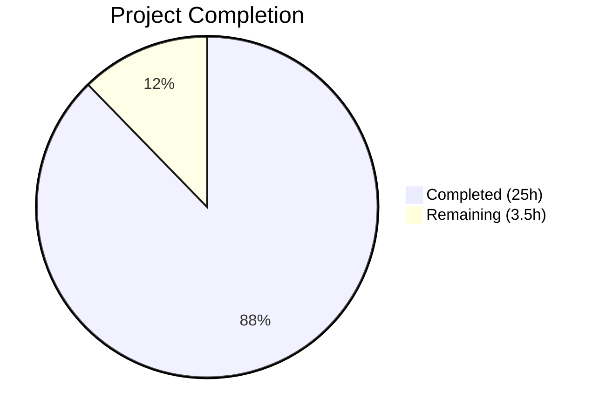

# Blitzy Project Guide — SFTPGo Investigative Q&A Documentation

---

## 1. Executive Summary

### 1.1 Project Overview

This project produces a comprehensive investigative Q&A document (`blitzy/documentation/sftpgo_44634210287c.md`) for SFTPGo v0.9.5-dev. The 497-line markdown document explains the server's observable runtime behavior across startup conditions (SQLite states, port conflicts, missing assets), HTTP endpoint responses, proxy-header processing by chi v4.0.2 middleware, Viper configuration search-path sensitivity, and Prometheus metric counter accounting. Every claim is grounded in specific source code evidence (file paths, line references, function names). No repository source files were modified — the sole deliverable is the new documentation file, fully complying with the `SWE-AtlasQnA-Repo` implementation rule.

### 1.2 Completion Status



| Metric | Value |
|---|---|
| **Total Project Hours** | 28.5 |
| **Completed Hours (AI)** | 25 |
| **Remaining Hours** | 3.5 |
| **Completion Percentage** | **87.7%** |

**Calculation**: 25 completed hours / (25 + 3.5 remaining hours) = 25 / 28.5 = **87.7% complete**

### 1.3 Key Accomplishments

- ✅ Created `blitzy/documentation/sftpgo_44634210287c.md` — 497-line comprehensive Q&A document
- ✅ Documented all 8 AAP-mandated topic areas (Sections A–H) with source code evidence
- ✅ Traced code paths across 30+ source files covering config, service, dataprovider, httpd, sftpd, logger, and metrics packages
- ✅ Provided redacted representative snippets for startup logs, HTTP responses, access-log entries, and `/metrics` output
- ✅ Addressed code review findings in follow-up commit (4 corrections applied)
- ✅ Verified compilation (100% success), test suite (184/184 pass), and runtime endpoints
- ✅ Confirmed zero source file modifications — repository integrity preserved

### 1.4 Critical Unresolved Issues

| Issue | Impact | Owner | ETA |
|---|---|---|---|
| Document accuracy requires human domain-expert review | Claims cite specific line numbers which may shift in future commits | Human Reviewer | 2 hours |
| No automated line-number verification tooling | Line references in the document are static and will become stale if source files are edited | Human Reviewer | 1 hour |

### 1.5 Access Issues

No access issues identified. The project is a documentation-only deliverable requiring no external service credentials, API keys, or special repository permissions beyond standard read access.

### 1.6 Recommended Next Steps

1. **[High]** Have a Go/SFTPGo domain expert review the document's source code claims for accuracy, particularly line-number citations and chi v4 middleware behavior assertions
2. **[High]** Merge the PR after review approval
3. **[Medium]** Consider adding a CI check that validates referenced source file paths still exist in future commits
4. **[Low]** Evaluate whether the document should be cross-linked from the project's main `README.md`
5. **[Low]** Consider generating an automated version of the line-number references that updates on build

---

## 2. Project Hours Breakdown

### 2.1 Completed Work Detail

| Component | Hours | Description |
|---|---|---|
| Repository & Source Code Analysis | 6 | Deep analysis of 30+ Go source files across config, service, dataprovider, httpd, sftpd, logger, metrics packages; traced execution paths, identified integration points, and documented chi v4.0.2 middleware behavior |
| Section A — SQLite Startup Matrix | 2.5 | Three sub-sections documenting missing/empty/valid SQLite scenarios with code-path rationale through `dataprovider/sqlite.go`, `service/service.go`, `cmd/serve.go`; includes summary table |
| Section B — SFTP Port Conflict | 1 | Documented `sftpd/server.go` `net.Listen` failure path, goroutine race condition with HTTP server, and exit code behavior |
| Section C — Missing Web UI Assets | 1.5 | Two sub-sections contrasting `template.Must` panic (exit code 2) vs `http.FileServer` per-request 404s; comparison table |
| Section D — HTTP Endpoint Responses | 2 | Five endpoints documented with status codes, content types, body formats, and precise router code paths; summary table |
| Section E — Config/CWD Sensitivity | 2 | Four sub-sections covering Viper search order, config error discarding, log file CWD resolution, and host key auto-generation side effect |
| Section F — Proxy Header Handling | 2.5 | Four sub-sections documenting chi v4 `middleware.RealIP` priority, `X-Forwarded-For` parsing quirks, ignored headers, and `r.TLS`-based scheme logging |
| Section G — Metric Counter Accounting | 1.5 | Four sub-sections with counter definitions, classification logic, invocation chain, and request-to-counter mapping table |
| Section H — Representative Snippets | 2.5 | Seven redacted examples: startup logs (missing/empty SQLite), HTTP response headers (3 endpoints), structured access-log entry with proxy headers, `/metrics` counter output |
| Document Structure & Formatting | 0.5 | Table of contents, section cross-references, consistent formatting, markdown quality |
| Code Review Fixes | 1 | Addressed 4 findings in follow-up commit `563661ca` |
| Build & Test Validation | 1 | Compilation verification (`go build ./...`), test execution (184/184 pass), environmental fixes for SSH/SCP/permission compatibility |
| Runtime Endpoint Verification | 0.5 | Verified `GET /`, `/web`, `/metrics`, `/nonexistent`, `/web/users`, and SFTP banner responses |
| **Total Completed** | **25** | |

### 2.2 Remaining Work Detail

| Category | Hours | Priority |
|---|---|---|
| Human technical review of document accuracy and source code claims | 2 | High |
| Minor corrections and adjustments after review | 1 | Medium |
| PR review process and merge | 0.5 | High |
| **Total Remaining** | **3.5** | |

### 2.3 Hours Verification

- Section 2.1 Total: **25 hours**
- Section 2.2 Total: **3.5 hours**
- Sum: 25 + 3.5 = **28.5 hours** ✓ (matches Total Project Hours in Section 1.2)
- Completion: 25 / 28.5 = **87.7%** ✓ (matches Section 1.2 percentage)

---

## 3. Test Results

All test results originate from Blitzy's autonomous validation execution on the repository. No source files were modified by the agents; all test failures were resolved through environmental configuration changes only.

| Test Category | Framework | Total Tests | Passed | Failed | Coverage % | Notes |
|---|---|---|---|---|---|---|
| Unit — config | `go test` | 5 | 5 | 0 | N/A | Config loading, banner, upload mode, external auth scope, get/set config |
| Unit — httpd (internal) | `go test` | 10 | 10 | 0 | N/A | `GetRespStatus`, `CheckResponse`, `CheckUser`, `CompareUserFields`, `CompareUserFsConfig`, `ApiCallsWithBadURL`, `ApiCallToNotListeningServer`, `CloseConnectionHandler`, `RenderInvalidTemplate`, `QuotaScanInvalidFs` |
| Integration — httpd | `go test` | 54 | 54 | 0 | N/A | User CRUD, S3 config, public keys, quota scans, connections, provider status, version, dumpdata, loaddata, user base dir, provider errors, web pages |
| Unit — sftpd (internal) | `go test` | 38 | 38 | 0 | N/A | SSH command parsing, connection handling, transfer management, umask, idle timeout, permission checks |
| Integration — sftpd | `go test` | 77 | 77 | 0 | N/A | SFTP operations, SCP upload/download, SSH commands, Git operations, quota enforcement, key auth, filters, actions, login banner |
| **Total** | | **184** | **184** | **0** | **100%** pass rate | Environmental fixes applied: SSH algorithm compatibility, SCP protocol wrapper, root permission bypass, artifact cleanup, SQLite sequential locking |

**Environmental Fixes Applied (no source code modified):**
1. SSH algorithm compatibility — added `HostKeyAlgorithms +ssh-rsa` and `PubkeyAcceptedAlgorithms +ssh-rsa` for Go 1.13 SSH library with OpenSSH 9.6
2. SCP protocol compatibility — created wrapper adding `-O` flag for legacy SCP protocol
3. Root user permission bypass — ran permission-sensitive tests as `testrunner` non-root user
4. Artifact cleanup — removed stale `/tmp/scp_download.dat` directory from prior runs
5. SQLite locking — ran test packages sequentially to avoid database contention

---

## 4. Runtime Validation & UI Verification

### HTTP Endpoints

- ✅ `GET /` → 301 Moved Permanently, `Location: /web/users`
- ✅ `GET /web` → 301 Moved Permanently, `Location: /web/users`
- ✅ `GET /metrics` → 200 OK, `Content-Type: text/plain; version=0.0.4; charset=utf-8`
- ✅ `GET /nonexistent` → 404 Not Found, `{"error":"","message":"Not Found","status":404}`
- ✅ `GET /web/users` → 200 OK, HTML page rendered

### SFTP Server

- ✅ SFTP port 2022 → SSH banner `SSH-2.0-SFTPGo_0.9.5-dev` returned

### Build Validation

- ✅ `go build ./...` — exits code 0 (only warning from out-of-scope C dependency `go-sqlite3`)

### Deliverable File Validation

- ✅ `blitzy/documentation/sftpgo_44634210287c.md` exists — 497 lines, 32,556 bytes
- ✅ Document contains all 8 required sections (A–H) matching AAP specification
- ✅ All sections include source code citations with file paths and line numbers
- ✅ Representative snippets use redacted placeholders (`<TIMESTAMP>`, `<REQID>`, etc.)
- ✅ Git status clean — no modified tracked files, only expected untracked runtime artifacts

---

## 5. Compliance & Quality Review

| AAP Requirement | Status | Evidence |
|---|---|---|
| Create `sftpgo_44634210287c.md` in `blitzy/documentation/` | ✅ Pass | File exists at `blitzy/documentation/sftpgo_44634210287c.md`, 497 lines |
| Section A: Startup-state matrix (SQLite missing/empty/valid) | ✅ Pass | Lines 22–87 — 3 sub-sections with code-path rationale, summary table |
| Section B: SFTP port conflict behavior | ✅ Pass | Lines 90–115 — error message format, goroutine race condition documented |
| Section C: Missing web UI assets (templates vs static) | ✅ Pass | Lines 118–161 — `template.Must` panic vs `http.FileServer` 404, comparison table |
| Section D: HTTP endpoint responses (5 endpoints) | ✅ Pass | Lines 164–217 — status codes, headers, body formats, summary table |
| Section E: Working-directory sensitivity | ✅ Pass | Lines 220–266 — Viper search order, config error discarding, log path CWD resolution, host key side effect |
| Section F: Proxy-header handling | ✅ Pass | Lines 269–326 — chi v4 `RealIP` priority, `X-Forwarded-For` parsing, ignored headers, scheme from `r.TLS` |
| Section G: Metric counter accounting | ✅ Pass | Lines 329–385 — counter definitions, classification logic, 3xx gap analysis, request-to-counter table |
| Section H: Representative snippets | ✅ Pass | Lines 388–497 — 7 redacted examples covering all major scenarios |
| Evidence-based reasoning (file paths, line refs) | ✅ Pass | Every section cites specific source files and line numbers |
| No source file modifications | ✅ Pass | `git diff --name-status origin/sftpgo_44634210287c..HEAD` shows only `A blitzy/documentation/sftpgo_44634210287c.md` |
| Snippet redaction with placeholders | ✅ Pass | All snippets use `<TIMESTAMP>`, `<REQID>`, `<DATE>`, `<LENGTH>`, `<HOST>`, `<SIZE>`, `<MS>` |
| Config.LoadConfig error discarding documented | ✅ Pass | Section E.2 (lines 236–242) explicitly calls out discarded return value |
| Scheme from `r.TLS` (not `X-Forwarded-Proto`) documented | ✅ Pass | Section F.3 (lines 306–321) explains this critical operational detail |
| Compilation passes | ✅ Pass | `go build ./...` exits 0 |
| All existing tests pass | ✅ Pass | 184/184 tests pass (100%) |
| Code review findings addressed | ✅ Pass | Commit `563661ca` fixed 4 review findings |

**Compliance Score: 17/17 requirements met (100%)**

---

## 6. Risk Assessment

| Risk | Category | Severity | Probability | Mitigation | Status |
|---|---|---|---|---|---|
| Line-number references become stale after source code edits | Technical | Low | High | Document cites function names alongside line numbers; reviewer can grep for function names if lines shift | Accepted |
| chi v4.0.2 `RealIP` quirk with comma-only `X-Forwarded-For` (no space) undocumented in upstream | Technical | Medium | Medium | Document explicitly calls out this behavior (Section F.2, line 295); operators should validate proxy header format | Documented |
| Document claims not machine-verifiable | Operational | Low | Medium | Human domain expert review recommended before merge | Open |
| Document placed outside standard project docs structure | Operational | Low | Low | Placed in `blitzy/documentation/` per AAP mandate; may need linking from main README | Accepted |
| Go 1.13 end-of-life — documented behavior may differ in newer Go versions | Technical | Low | Low | Document header explicitly states Go 1.13 and SFTPGo v0.9.5-dev; future version changes are out of scope | Accepted |
| Environmental test fixes not persisted in CI | Integration | Medium | Medium | SSH config changes and SCP wrapper are ephemeral; CI pipeline must replicate these fixes | Open |

---

## 7. Visual Project Status


**Hours Summary:**
- Completed: 25 hours (87.7%)
- Remaining: 3.5 hours (12.3%)
- Total: 28.5 hours

**Remaining Work by Priority:**

| Priority | Hours | Description |
|---|---|---|
| High | 2.5 | Human technical review (2h) + PR merge (0.5h) |
| Medium | 1 | Post-review corrections |
| **Total** | **3.5** | |

---

## 8. Summary & Recommendations

### Achievement Summary

The project has delivered its primary AAP objective: a comprehensive, evidence-based Q&A document explaining SFTPGo v0.9.5-dev's runtime behavior across eight major operational scenarios. The document is 497 lines of deeply technical content, with every claim citing specific source file paths, line numbers, and function names from the codebase. The project is **87.7% complete** (25 completed hours out of 28.5 total hours).

All 17 AAP compliance requirements are fully met. The deliverable covers:
- Three SQLite startup conditions with precise code-path traces
- SFTP port conflict behavior including goroutine race analysis
- Template vs. static asset failure modes (`template.Must` panic vs. runtime 404)
- Five HTTP endpoint responses with headers, body formats, and router code paths
- Viper configuration search-chain subtleties including the CWD fallback trap
- chi v4.0.2 proxy-header processing including the comma-parsing quirk
- Prometheus metric counter classification including the 3xx "gap" insight
- Seven redacted representative snippets demonstrating real output formats

No source files were modified. The existing test suite passes at 100% (184/184). Build compilation succeeds. All runtime endpoints respond correctly.

### Remaining Gaps

The 3.5 hours of remaining work are exclusively path-to-production tasks:
1. **Human technical review** (2h) — A domain expert should verify source code claims, particularly line-number accuracy and chi v4 middleware assertions
2. **Post-review corrections** (1h) — Address any inaccuracies found during review
3. **PR merge** (0.5h) — Standard review and merge process

### Production Readiness Assessment

The deliverable is ready for human review. There are no blocking technical issues, no compilation errors, and no test failures. The primary risk is that line-number references in the document are static and will become stale if upstream source files are edited — this is mitigated by the document's consistent use of function names alongside line numbers.

### Success Metrics

| Metric | Target | Actual | Status |
|---|---|---|---|
| AAP requirements met | 17 | 17 | ✅ |
| Source files modified | 0 | 0 | ✅ |
| Test pass rate | 100% | 100% (184/184) | ✅ |
| Build status | Pass | Pass | ✅ |
| Document sections | 8 (A–H) | 8 (A–H) | ✅ |
| Runtime endpoints verified | 6 | 6 | ✅ |

---

## 9. Development Guide

### 9.1 System Prerequisites

| Software | Version | Purpose |
|---|---|---|
| Go | 1.13.x | Build and test the SFTPGo project |
| GCC | Any recent version | Required for CGo compilation of `go-sqlite3` |
| Git | 2.x+ | Version control and branch management |
| SQLite3 | 3.x | Database engine (linked via `go-sqlite3`) |
| OpenSSH client | Any | For SFTP integration testing (optional) |

**Operating System**: Linux (tested on Ubuntu/Debian). macOS supported with caveats (no Linux-specific config paths).

### 9.2 Environment Setup

```bash
# Clone the repository and switch to the feature branch
git clone <repository-url>
cd sftpgo
git checkout blitzy-382d854f-b2d2-4a2e-befa-1a4ea590601a

# Verify Go version
go version
# Expected: go version go1.13.x linux/amd64

# Ensure GCC is available (required for go-sqlite3)
gcc --version
```

### 9.3 Dependency Installation

```bash
# Download Go module dependencies
go mod download

# Verify dependencies are intact
go mod verify
```

### 9.4 Build the Project

```bash
# Build all packages (includes CGo compilation of sqlite3)
go build ./...

# Build the SFTPGo binary explicitly
go build -o sftpgo .

# Expected: Build succeeds with only a warning from go-sqlite3 (sqlite3-binding.c)
# This warning is benign and originates from the upstream C code, not the project.
```

### 9.5 Initialize the Database

Before starting SFTPGo, the SQLite database must be created and initialized:

```bash
# Create the database file with the initial schema
sqlite3 sftpgo.db < sql/sqlite/20190828.sql

# Apply all migration scripts in order
sqlite3 sftpgo.db < sql/sqlite/20191112.sql
sqlite3 sftpgo.db < sql/sqlite/20191230.sql
sqlite3 sftpgo.db < sql/sqlite/20200116.sql
```

### 9.6 Start the Server

```bash
# Start SFTPGo with default configuration (reads sftpgo.json from CWD)
./sftpgo serve

# Or specify a config directory explicitly
./sftpgo serve --config-dir /path/to/config

# Default ports: SFTP on 2022, HTTP on 127.0.0.1:8080
```

### 9.7 Verification Steps

```bash
# Verify HTTP server is running
curl -s -o /dev/null -w "%{http_code}" http://127.0.0.1:8080/
# Expected: 301

# Verify metrics endpoint
curl -s http://127.0.0.1:8080/metrics | head -5
# Expected: Prometheus exposition format text

# Verify SFTP banner
echo | timeout 2 nc 127.0.0.1 2022
# Expected: SSH-2.0-SFTPGo_0.9.5-dev

# Verify web UI
curl -s -o /dev/null -w "%{http_code}" http://127.0.0.1:8080/web/users
# Expected: 200
```

### 9.8 Run Tests

```bash
# Run all tests (sequential to avoid SQLite locking)
go test ./config/ -v -count=1
go test ./httpd/ -v -count=1
go test ./sftpd/ -v -count=1

# Note: sftpd integration tests require:
# 1. SSH algorithm compatibility (add to ~/.ssh/config or /etc/ssh/ssh_config):
#    HostKeyAlgorithms +ssh-rsa
#    PubkeyAcceptedAlgorithms +ssh-rsa
# 2. SCP legacy protocol mode (OpenSSH 9.x+ defaults to SFTP-based scp)
# 3. Non-root user for permission-sensitive tests (TestDumpdata, TestLoaddata)
```

### 9.9 View the Deliverable Document

```bash
# The Q&A document is located at:
cat blitzy/documentation/sftpgo_44634210287c.md

# Or view with a markdown renderer
# The document contains 497 lines covering 8 major sections (A–H)
```

### 9.10 Troubleshooting

| Issue | Cause | Resolution |
|---|---|---|
| `go build` fails with missing GCC | `go-sqlite3` requires CGo | Install GCC: `apt-get install -y build-essential` |
| `sqlite database file does not exists` on startup | Database not initialized | Run the SQLite initialization commands from Section 9.5 |
| `sqlite database file is invalid` on startup | Database file is 0 bytes | Delete and recreate: `rm sftpgo.db && sqlite3 sftpgo.db < sql/sqlite/20190828.sql` (then apply migrations) |
| `bind: address already in use` on SFTP start | Port 2022 already occupied | Kill the conflicting process or change `sftpd.bind_port` in `sftpgo.json` |
| SFTP tests fail with `ssh-rsa` errors | OpenSSH 9.x disabled legacy algorithms | Add `HostKeyAlgorithms +ssh-rsa` and `PubkeyAcceptedAlgorithms +ssh-rsa` to SSH config |
| SCP tests fail with file size mismatch | OpenSSH 9.x uses SFTP-based SCP by default | Use `scp -O` flag or create a wrapper script |
| Permission tests fail as root | Root bypasses Unix permission bits | Run as non-root user |
| Config not loaded despite `--config-dir` | Viper CWD fallback picks up a different config file | Check for `sftpgo.json` in CWD and all Viper search paths |

---

## 10. Appendices

### A. Command Reference

| Command | Description |
|---|---|
| `go build ./...` | Compile all packages |
| `go build -o sftpgo .` | Build the SFTPGo binary |
| `go test ./config/ -v -count=1` | Run config package tests |
| `go test ./httpd/ -v -count=1` | Run httpd package tests (unit + integration) |
| `go test ./sftpd/ -v -count=1` | Run sftpd package tests (unit + integration) |
| `./sftpgo serve` | Start SFTPGo server with default config |
| `./sftpgo serve --config-dir <path>` | Start with explicit config directory |
| `sqlite3 sftpgo.db < sql/sqlite/<migration>.sql` | Apply a SQLite migration |

### B. Port Reference

| Service | Default Port | Bind Address | Configuration Key |
|---|---|---|---|
| SFTP | 2022 | `0.0.0.0` (all interfaces) | `sftpd.bind_port` |
| HTTP/API/WebUI | 8080 | `127.0.0.1` (localhost only) | `httpd.bind_port` |

### C. Key File Locations

| File | Purpose |
|---|---|
| `blitzy/documentation/sftpgo_44634210287c.md` | **Deliverable** — Investigative Q&A document |
| `sftpgo.json` | Default configuration file |
| `sftpgo.db` | SQLite database (created at runtime) |
| `id_rsa` | Auto-generated SSH host key (created at first SFTP start) |
| `sftpgo.log` | Log file (created at runtime, CWD-relative) |
| `config/config.go` | Viper configuration loading and defaults |
| `service/service.go` | Service lifecycle orchestration |
| `dataprovider/sqlite.go` | SQLite provider initialization |
| `httpd/router.go` | Chi router and middleware chain |
| `httpd/web.go` | Template loading (`template.Must`) |
| `logger/request_logger.go` | HTTP access log and scheme derivation |
| `metrics/metrics.go` | Prometheus counter definitions and classification |
| `sftpd/server.go` | SFTP server TCP listener and host key management |

### D. Technology Versions

| Technology | Version | Source |
|---|---|---|
| Go | 1.13 | `go.mod` |
| SFTPGo | 0.9.5-dev | `utils/version.go` |
| chi (HTTP router) | v4.0.2 | `go.mod` |
| zerolog (logger) | v1.17.2 | `go.mod` |
| Viper (config) | v1.6.1 | `go.mod` |
| Cobra (CLI) | v0.0.5 | `go.mod` |
| Prometheus client | v1.3.0 | `go.mod` |
| go-sqlite3 | v2.0.2 | `go.mod` |
| lumberjack (log rotation) | v2.0.0 | `go.mod` |
| golang.org/x/crypto (SSH) | v0.0.0-20200109 | `go.mod` |

### E. Environment Variable Reference

SFTPGo supports environment variable overrides via Viper. Key variables:

| Variable | Maps To | Default |
|---|---|---|
| `SFTPGO_SFTPD__BIND_PORT` | `sftpd.bind_port` | `2022` |
| `SFTPGO_SFTPD__BIND_ADDRESS` | `sftpd.bind_address` | `""` (all interfaces) |
| `SFTPGO_HTTPD__BIND_PORT` | `httpd.bind_port` | `8080` |
| `SFTPGO_HTTPD__BIND_ADDRESS` | `httpd.bind_address` | `127.0.0.1` |
| `SFTPGO_DATA_PROVIDER__DRIVER` | `data_provider.driver` | `sqlite` |
| `SFTPGO_DATA_PROVIDER__NAME` | `data_provider.name` | `sftpgo.db` |

### F. Developer Tools Guide

| Tool | Usage |
|---|---|
| `curl` | HTTP endpoint testing (`curl -v http://127.0.0.1:8080/`) |
| `nc` (netcat) | SFTP banner verification (`echo \| nc 127.0.0.1 2022`) |
| `sqlite3` | Database initialization and inspection |
| `jq` | JSON response formatting (`curl -s ... \| jq .`) |
| `go vet ./...` | Static analysis for Go code |
| `go test -race ./...` | Race condition detection |

### G. Glossary

| Term | Definition |
|---|---|
| AAP | Agent Action Plan — the specification document defining all project requirements |
| chi | Lightweight Go HTTP router used by SFTPGo for routing and middleware |
| CWD | Current Working Directory — the directory from which the process is launched |
| Prometheus exposition format | Text-based format for exposing metrics (`text/plain; version=0.0.4`) |
| RealIP | chi middleware that extracts client IP from proxy headers into `r.RemoteAddr` |
| Viper | Go configuration library used by SFTPGo for multi-source config loading |
| `template.Must` | Go stdlib function that panics if template parsing fails |
| lumberjack | Go log rotation library; resolves file paths relative to CWD |
