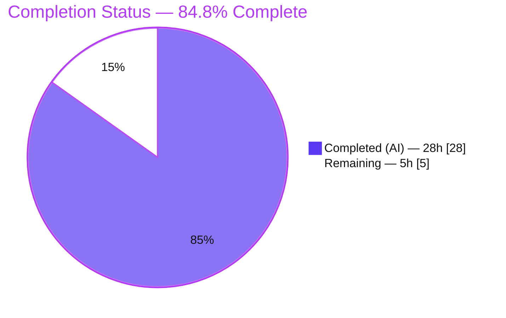
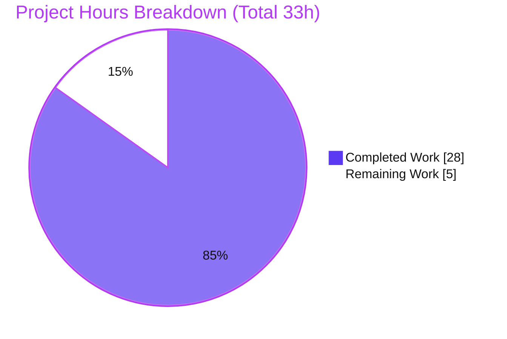
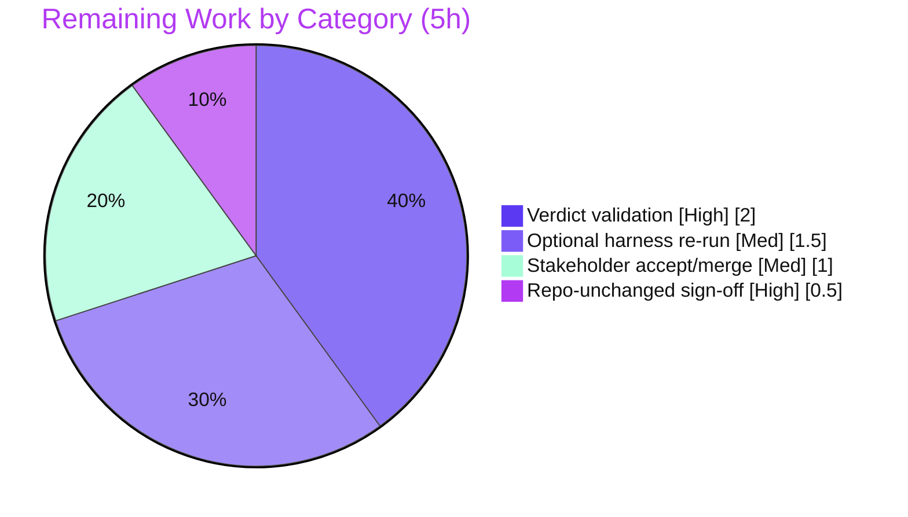

# Blitzy Project Guide — SFTPGo SSH `exec` `argv` Runtime Security Investigation

> **Branch:** `blitzy-18461f06-43ec-4099-b424-599565cc61cc` · **Base:** `44634210` ("S3: add support for serving virtual folders") · **Target:** SFTPGo **v0.9.5-dev**
> **Deliverable:** `blitzy/documentation/sftpgo_44634210287c.md` (855 lines) · **Task type:** Documentation / read-only security-boundary analysis

---

## 1. Executive Summary

### 1.1 Project Overview

This project is a **read-only, evidence-first security investigation** of SFTPGo v0.9.5-dev. The objective was to empirically prove — with reproducible runtime evidence rather than a theoretical explanation — the exact argument vector (`argv`, including `argv[0]`) that SFTPGo hands to an operating-system process when an SSH client requests an optional "system command" over `exec`, and to use that evidence to confirm or refute three client suspicions about the SSH-exec security boundary (shell-like execution, superficial safety flags, client-controlled destination). The audience is the requesting security engineer and downstream stakeholders. The sole sanctioned artifact is one Markdown answer document; no source, configuration, tests, or dependencies were modified.

### 1.2 Completion Status

The AAP-scoped autonomous work is fully delivered and independently validated. The remaining hours are exclusively **human path-to-production review and acceptance** (which cannot be performed autonomously).



| Metric | Hours |
|--------|-------|
| **Total Hours** | **33.0** |
| Completed Hours (AI) | 28.0 |
| Completed Hours (Manual) | 0.0 |
| **Completed Hours (AI + Manual)** | **28.0** |
| **Remaining Hours** | **5.0** |
| **Percent Complete** | **84.8%** |

> Completion % = Completed ÷ Total = 28 ÷ 33 = **84.8%** (PA1 AAP-scoped methodology). Colors: **Completed = Dark Blue `#5B39F3`**, **Remaining = White `#FFFFFF`**.

### 1.3 Key Accomplishments

- ✅ **Exact OS-process `argv` captured at runtime** across the full **2×2 evidence matrix** (normal/adversarial × `--safe-links`/`--munge-links`), each cell run **3× with byte-identical results**.
- ✅ **Three independent capture views that must agree** — a compiled PATH logging shim (`os.Args`), SFTPGo's own debug log (`sftpd/ssh_cmd.go:323`), and `strace -f -e trace=execve` — all agreed byte-for-byte.
- ✅ **Canonical entry point only** — driven by a real `golang.org/x/crypto/ssh` client issuing an SSH session `"exec"` request reaching `processSSHCommand` (`sftpd/server.go:326-327`); no mock, bypass, or debug hook.
- ✅ **All three suspicions adjudicated with evidence** — S1 **refuted**, S2 **confirmed**, S3 **confirmed**.
- ✅ **Exact function attribution** by `file:line` (`getSystemCommand` `sftpd/ssh_cmd.go:288-331` and collaborators).
- ✅ **Negative no-shell proof** — 0 shell `execve`; `$(…)` tokens never evaluated (`/tmp/pwned`, `/tmp/evil` never created).
- ✅ **Downstream real `/usr/bin/rsync` 3.4.1 corroboration** of the S2 safety-flag effects.
- ✅ **Repository left byte-for-byte unchanged** except the answer document (independently re-verified).

### 1.4 Critical Unresolved Issues

There are **no unresolved issues that block release or validation of the deliverable.** All AAP objectives are met and the answer document passed independent reproduction. The items below are informational.

| Issue | Impact | Owner | ETA |
|-------|--------|-------|-----|
| Embedded `HEAD` hash in doc §6 is a point-in-time value that goes stale on each subsequent doc amendment | None — self-disclosed in the document; Objective-7 re-verified at every commit (`git diff` = only the answer doc) | Reviewer (acknowledge) | N/A (by design) |
| Security **findings** S2/S3 describe pre-existing weaknesses in the target codebase | Informational — remediation is **explicitly out of AAP scope** (§0.3.2); no fix was requested | Stakeholder (decision) | Deferred |

### 1.5 Access Issues

**No access issues identified.** All build, run, and observation activities were performed locally with the default toolchain; no repository permissions, service credentials, or third-party API access were required or blocked.

| System/Resource | Type of Access | Issue Description | Resolution Status | Owner |
|-----------------|----------------|-------------------|-------------------|-------|
| Source repository | Read/write (git) | None — clean checkout, doc-only commit | ✅ No issue | Blitzy |
| Go module proxy / cache | Build-time | None — `go mod download`/`verify` succeeded (cache kept outside checkout) | ✅ No issue | Blitzy |
| Local toolchain (Go 1.13.15, gcc, rsync, strace) | Build/runtime | None — all present and version-matched | ✅ No issue | Blitzy |

### 1.6 Recommended Next Steps

1. **[High]** Have a security reviewer validate the three verdicts (S1/S2/S3) against the cited runtime evidence and spot-check the `file:line` anchors and captured `argv` in §2 of the deliverable. *(2.0h)*
2. **[High]** Confirm the repository is byte-for-byte unchanged (`git status` clean; `git diff --name-status 44634210 HEAD` = only the answer doc) and that the deliverable sits at the mandated path. *(0.5h)*
3. **[Medium]** Optionally re-run the documented harness (deliverable §1.5) to independently reconfirm the `argv` captures for reproducibility. *(1.5h)*
4. **[Medium]** Complete stakeholder review and accept/merge the documentation PR. *(1.0h)*
5. **[Low]** *(Out of AAP scope — informational)* Decide separately whether to act on the S2/S3 findings (e.g., upgrade SFTPGo / backport the upstream rsync option allow-list; the class of weakness was later closed as CVE-2025-24366, fixed in v2.6.5).

---

## 2. Project Hours Breakdown

### 2.1 Completed Work Detail

All completed hours were delivered autonomously (AI). Each component traces to the AAP-scoped investigation and the single answer document.

| Component | Hours | Description |
|-----------|-------|-------------|
| Environment & default build | 2.0 | Go 1.13.15 + gcc 15.2.0 + CGO SQLite; version verification ("SFTPGo version: 0.9.5-dev"); CGO-vs-no-CGO clarification (doc §1.3) |
| Observation harness engineering | 5.0 | Go logging shim (`os.Args` JSON), `x/crypto/ssh` client driver, config generation, 3-user provisioning (A/B/C), PATH shim install, `strace -f -e trace=execve` integration, second daemon resolving real rsync |
| 2×2 matrix execution + probes/edges | 3.0 | 4 matrix cells (each run 3×) + 4 supplementary probes + 4 error/edge branches; triple-view capture (shim/daemon/strace) |
| Capture correlation & integrity checks | 2.0 | Three-view agreement, `execve` accounting (19 constructions / 18 launches), sha256 stability recipe, negative no-shell proof |
| Downstream real-rsync corroboration | 2.0 | Real `/usr/bin/rsync` 3.4.1 over the canonical path: `--safe-links` refuses escaping symlink, `--munge-links` neutralizes, no-flag control leaks `/etc/passwd` |
| Source-code grounding (`file:line`) | 2.5 | Reading & citing every anchor: `getSystemCommand`, flag guards, `getDestPath`, `parseCommandPayload`, `wrapCmd`, command catalogs, `ResolvePath` |
| Web research | 1.0 | Go `os/exec` no-shell semantics, SFTPGo rsync `--safe-links`/`--munge-links` docs, CVE-2025-24366 context |
| Answer document authoring | 6.0 | 855-line evidence-grounded write-up: verdicts, function-attribution table + mermaid flow, privilege analysis, coverage pass, observed-vs-inferred discipline |
| QA / validation refinement | 4.5 | 6 revision commits: code-review rewrite, INFERRED relabeling, QA rounds (F5/F6), F1/F2 precision fixes |
| **Total Completed** | **28.0** | **Matches §1.2 Completed Hours** |

### 2.2 Remaining Work Detail

All remaining work is **human path-to-production review and acceptance** — the autonomous AAP deliverable is complete.

| Category | Hours | Priority |
|----------|-------|----------|
| Security-reviewer validation of the three verdicts vs. cited evidence (+ `file:line`/argv spot-check) | 2.0 | High |
| Repository-unchanged + mandated-path sign-off (`git status` / `git diff`) | 0.5 | High |
| Optional independent harness re-run (reproducibility reconfirmation) | 1.5 | Medium |
| Stakeholder review & acceptance/merge of the documentation PR | 1.0 | Medium |
| **Total Remaining** | **5.0** | — |

> **Out-of-scope (excluded from all totals):** acting on the S2/S3 security findings (remediation) is explicitly out of AAP scope (§0.3.2) and is **not** counted in the 5.0h.

### 2.3 Hours Reconciliation

| Check | Value | Status |
|-------|-------|--------|
| Section 2.1 Completed total | 28.0h | ✅ |
| Section 2.2 Remaining total | 5.0h | ✅ |
| 2.1 + 2.2 | 33.0h = Total (§1.2) | ✅ |
| Remaining matches §1.2 ↔ §2.2 ↔ §7 | 5.0h everywhere | ✅ |
| Percent complete | 28 ÷ 33 = 84.8% | ✅ |

---

## 3. Test Results

This is a documentation deliverable — a Markdown file has **no compile or unit-test surface**, and **zero source files were modified** (so no source-level test outcome could change from the validated baseline). The meaningful validation surface is therefore the **empirical evidence reproduction** performed by Blitzy's autonomous validation harness. Every row below originates from Blitzy's autonomous validation logs for this project.

| Test Category | Framework | Total | Passed | Failed | Coverage % | Notes |
|---------------|-----------|-------|--------|--------|------------|-------|
| argv capture — 2×2 matrix | Custom harness (PATH shim + `strace` + `x/crypto/ssh` client) | 12 (4 cells × 3 passes) | 12 | 0 | 100% of matrix | 4 distinct byte-identical digests: CELL1 `94451e43…`, CELL2 `60a72d01…`, CELL3 `fce0d2c2…`, CELL4 `1ea389d0…` |
| argv capture — supplementary probes | Custom harness | 4 | 4 | 0 | — | PROBE5a `14891ff9…`, PROBE5b `5c805215…`, PROBE6/7 `081bf26d…` |
| Error/edge branches | Custom harness | 4 | 4 | 0 | — | EDGE_EMPTY `e3a869dc…`, EDGE_EMPTY_RSYNC `e69e5c45…`, EDGE_NOTENABLED (0 exec), EDGE_PERMDENIED (construct-only, 0 launch) |
| 3-view agreement | shim `os.Args` vs debug log vs `strace execve` | 18 launches | 18 | 0 | 100% | All three views agree byte-for-byte |
| `execve` accounting | `strace -f -e trace=execve` | 19 | 19 | 0 | — | 19 = 1 daemon + 18 children (15 rsync + 3 git) — reconciled |
| Negative no-shell proof | filesystem + `strace` grep | 3 | 3 | 0 | — | 0 shell `execve`; `/tmp/pwned` & `/tmp/evil` never created |
| Downstream real-rsync effects | `/usr/bin/rsync` 3.4.1 | 3 | 3 | 0 | — | safe-links refuses, munge-links neutralizes, no-flag leaks `/etc/passwd` |
| Dependency integrity | `go mod verify` | 1 | 1 | 0 | — | "all modules verified"; go.mod/go.sum sha256 match base |
| Canonical build | `CGO_ENABLED=1 go build` (go1.13.15) | 1 | 1 | 0 | — | exit 0; "SFTPGo version: 0.9.5-dev" (benign SQLite `-Wreturn-local-addr` warning) |
| Config package smoke test | `go test ./config/` | 1 | 1 | 0 | — | "ok github.com/drakkan/sftpgo/config"; working tree stayed clean |

> **Note (honest, out of scope):** the repository's full integration suites (`go test ./sftpd/ ./httpd/`) have **pre-existing, environmental-only** failures (require run-as-root; incompatible with modern git/OpenSSH; one hanging SCP test) documented by the setup agent. They pre-date and are unrelated to this doc-only change, cannot be fixed without modifying out-of-scope source/test-setup (forbidden), and were deliberately **not** executed because they write `sftpgo.db` into the repo root and would violate the byte-for-byte-unchanged guarantee.

---

## 4. Runtime Validation & UI Verification

**Runtime health (SFTPGo daemon, default minimal config):**
- ✅ **Operational** — daemon builds and starts; SSH bound to `127.0.0.1:2022`, HTTP readiness `127.0.0.1:8080` returned `200 "Alive"` (proves CGO=1 SQLite is live).
- ✅ **Operational** — canonical SSH `"exec"` request path (`sftpd/server.go:326-327`) driven end-to-end by a real `x/crypto/ssh` client.
- ✅ **Operational** — child OS process launched via `exec.Command(...).Start()` (`sftpd/ssh_cmd.go:176`); argv observed at the OS boundary.

**API / command integration outcomes:**
- ✅ **Operational** — `rsync` system command exercises the `--safe-links`/`--munge-links` branch (CELL 1–4, PROBE 5a/5b, EDGE_EMPTY_RSYNC).
- ✅ **Operational** — `git-upload-pack` system command exercises the identical builder with no safety flag (PROBE 6/7, EDGE_EMPTY).
- ✅ **Operational** — permission gate denies execution for a user missing required perms (EDGE_PERMDENIED); non-enabled command rejected before exec (EDGE_NOTENABLED).

**UI verification:**
- ⚠ **Not applicable** — the deliverable is a Markdown investigation document; there is no user interface to verify. SFTPGo's web management UI is explicitly out of scope for the SSH-exec investigation (AAP §0.3.2). No screenshots or UI flows are required.

---

## 5. Compliance & Quality Review

AAP deliverables and governing-rule mandates cross-mapped to outcomes. Fixes applied during autonomous validation are noted.

| AAP Item / Benchmark | Requirement | Status | Progress | Evidence / Notes |
|----------------------|-------------|--------|----------|------------------|
| Objective 1 | Capture exact OS-process argv at runtime | ✅ Pass | 100% | 2×2 matrix + probes + edges, 3-view agreement (doc §2) |
| Objective 2 | Two representative invocations (normal + adversarial) | ✅ Pass | 100% | CELL 1/2 normal; CELL 3/4 adversarial (doc §2) |
| Objective 3 | Two permission contexts | ✅ Pass | 100% | User A `--safe-links` vs User B `--munge-links` (doc §1.5, §2) |
| Objective 4 | Plain verdicts on S1/S2/S3 | ✅ Pass | 100% | S1 refuted, S2 confirmed, S3 confirmed (doc §3) |
| Objective 5 | Name exact functions (`file:line`) | ✅ Pass | 100% | `getSystemCommand` `ssh_cmd.go:288-331` et al. (doc §4) |
| Objective 6 | Privilege-boundary implication | ✅ Pass | 100% | Sanitization/containment weakness, not elevation (doc §5) |
| Objective 7 | Repository left byte-for-byte unchanged | ✅ Pass | 100% | `git diff` = only answer doc; 11 files + go.sum unchanged (doc §6, independently re-verified) |
| Rule: evidence-first (run then write) | Conclusions from captured output, not reading | ✅ Pass | 100% | Every claim paired with its command & unedited output |
| Rule: canonical entry only | Real SSH `"exec"` path, no mock/bypass | ✅ Pass | 100% | `x/crypto/ssh` client → `server.go:326-327` |
| Rule: default canonical build | Stated exact build/invocation | ✅ Pass | 100% | `CGO_ENABLED=1 go build`; v0.9.5-dev (doc §1.1–1.2) |
| Rule: complete unedited output | Full captures inline | ✅ Pass | 100% | 12-field shim records, daemon log, strace lines shown |
| Rule: observed vs inferred labeling | Label non-observed claims | ✅ Pass | 100% | INFERRED items (exec.Command internals, mapped-uid drop, CVE) explicitly labeled |
| Rule: exercise every implied condition | Normal + adversarial + edges | ✅ Pass | 100% | Includes EDGE_NOTENABLED / EDGE_PERMDENIED / EMPTY branches |
| Rule: web-search research | Frame findings against authoritative sources | ✅ Pass | 100% | Go `os/exec` docs, SFTPGo docs, CVE-2025-24366 (Appendix A) |
| Rule: read-only scope | No source/dependency/config edits | ✅ Pass | 100% | 0 source files changed; go.mod/go.sum sha256 match base |
| Fix F1 (validation) | Correct §1.3 no-CGO SQLite mechanism | ✅ Applied | 100% | Now cites driver's `static_mock.go` `// +build !cgo` + `checkAvailability()` |
| Fix F2 (validation) | Scope the argv-stability claim precisely | ✅ Applied | 100% | 4 matrix cells each run 3× (byte-identical); probes/edges captured once |

**Overall quality:** the deliverable is evidence-grounded, exact in its `file:line` attribution, disciplined in distinguishing observed vs. inferred, and self-aware about its own limitations (e.g., the stale embedded HEAD hash). No compliance gaps remain for the deliverable itself.

---

## 6. Risk Assessment

| Risk | Category | Severity | Probability | Mitigation | Status |
|------|----------|----------|-------------|------------|--------|
| Embedded `HEAD` hash in doc §6 goes stale on later amendments | Technical | Low | Certain (occurred) | Self-disclosed in the doc; Objective-7 re-verified each commit via `git diff` | Mitigated |
| Some claims are INFERRED (exec.Command internals, mapped-uid drop, CVE attribution) | Technical | Low | N/A | Explicitly labeled; core verdicts are all observed | Mitigated |
| Toolchain drift — modern host (gcc 15, rsync 3.4.1, git 2.51, OpenSSH 10) vs 2020-era Go 1.13 codebase | Technical | Low | Low | Exact versions documented in doc §1.1; harness reproducible | Documented |
| **Finding S2** — thin rsync safety policy: bare membership guard, no option allow-list, forced contradictory `--safe-links`+`--munge-links` pair | Security | High* | N/A (pre-existing) | Documented for stakeholder decision; upstream fix in v2.6.5 (CVE-2025-24366). *Severity is of the codebase property, not of this deliverable* | Documented (remediation out of scope) |
| **Finding S3** — client-controlled destination; argv overwhelmingly client-shaped (sanitization weakness) | Security | Medium* | N/A (pre-existing) | Documented; only last token chroot-confined. *Pre-existing codebase property* | Documented (remediation out of scope) |
| Deployment: SFTPGo run as root with an unmapped user → child inherits daemon root | Security/Operational | Medium* | Deployment-dependent | Documented; not an SFTPGo self-escalation; use mapped uid/gid + least privilege | Documented |
| Harness artifacts / daemons (ports 2022, 8080) left running | Operational | Low | Low | Exact-PID `kill` + `rm -rf /tmp/sftpgo_probe`; validator confirmed cleanup, ports clear | Resolved |
| Repository integration suites have pre-existing environmental failures | Integration | Low | N/A (pre-existing) | Unrelated to this doc-only change; fixing needs forbidden out-of-scope edits; `go test ./config/` = ok | Documented (out of scope) |
| Documentation task introduces new risk to the codebase | Technical/Security | None | None | Read-only; only one new file added; no code path altered | N/A |

> \* Security **findings** describe properties of the **target codebase** discovered by the investigation. They are the intended output of this documentation task, **not** risks introduced by it; the AAP explicitly excludes remediation.

---

## 7. Visual Project Status

**Project hours breakdown** (Completed = Dark Blue `#5B39F3`, Remaining = White `#FFFFFF`):



**Remaining work by category (hours)** — from Section 2.2 (sums to 5.0h):



> **Integrity check:** "Remaining Work" = **5** here = Remaining Hours in §1.2 = sum of §2.2 "Hours" column. "Completed Work" = **28** = Completed Hours in §1.2 = sum of §2.1.

---

## 8. Summary & Recommendations

**Achievements.** The investigation delivered exactly what the AAP required: reproducible, runtime-captured evidence of the precise `argv` SFTPGo hands to an OS process on the SSH `exec` path, across a 2×2 permission/invocation matrix, each cell stable across three passes and corroborated by three independent capture methods. The three suspicions were adjudicated with evidence — **S1 (shell-like execution) is WRONG/refuted** (direct `exec.Command`, zero shell `execve`, metacharacters never evaluated); **S2 (superficial safety flags) is CONFIRMED/right** (a bare exact-string membership guard with no option allow-list, forcible into a contradictory flag pair; the flag *does* work against real rsync, but the server-side *policy* is thin — the class later fixed as CVE-2025-24366); **S3 (client-controlled destination) is CONFIRMED/right** (only the final token is chroot-resolved; all other client tokens reach `argv` verbatim). The exact producing functions were named by `file:line`, the privilege boundary was characterized as a **sanitization/containment** concern rather than a self-escalation, and the repository was left byte-for-byte unchanged except the answer document.

**Remaining gaps & critical path to production.** The project is **84.8% complete** (28 of 33 hours). The remaining **5.0 hours are entirely human review and acceptance** — validating the verdicts against the evidence, confirming the clean repository state, an optional independent harness re-run, and stakeholder sign-off/merge. There is no incomplete AAP deliverable and no engineering rework outstanding.

**Success metrics (all met):** four stable argv captures ✅ · explicit S1/S2/S3 verdicts ✅ · exact function attribution ✅ · privilege-boundary statement ✅ · clean `git status` ✅.

**Production-readiness assessment.** The deliverable is **production-ready for a documentation artifact**: complete, accurate, independently reproduced, and template-consistent. The recommended path forward is human security-reviewer validation followed by acceptance/merge. Separately and outside this task's scope, stakeholders may choose to act on the S2/S3 findings by upgrading or hardening SFTPGo.

| Metric | Value |
|--------|-------|
| Completion | 84.8% (28 / 33h) |
| AAP objectives met | 7 / 7 |
| Suspicions adjudicated | 3 / 3 (S1 refuted, S2 & S3 confirmed) |
| Source files modified | 0 |
| Repository state | Clean; only answer doc added |
| Blocking issues | 0 |

---

## 9. Development Guide

### 9.1 System Prerequisites

- **OS:** Linux (x86-64). The investigation ran on Ubuntu.
- **Go toolchain:** Go **1.13.x** (1.13.15 used). `go.mod` declares `go 1.13`; `.travis.yml` pins `1.13.x`.
- **C compiler:** `gcc` (required for the CGO `github.com/mattn/go-sqlite3` default data provider).
- **System binaries for the exec path:** `rsync` (exercises the safety-flag branch) and/or `git-upload-pack` (installed with `git`; exercises the identical builder).
- **Observation tooling:** `strace` (argv capture), `sqlite3` (inspect the data provider).
- **Disk:** ~1 GB for the module cache + build output.

Verified versions on the reference host:
```bash
/usr/local/go/bin/go version   # go version go1.13.15 linux/amd64
gcc --version | head -1         # gcc (Ubuntu 15.2.0-4ubuntu4) 15.2.0
git --version                   # git version 2.51.0
rsync --version | sed -n 1p     # rsync  version 3.4.1  protocol version 32
strace --version | head -1      # strace -- version 6.16
sqlite3 --version               # 3.46.1 ...
```

### 9.2 Environment Setup

```bash
# Go 1.13.15 is installed but may not be on PATH:
export PATH="$PATH:/usr/local/go/bin"
export GO111MODULE=on

# Keep ALL build/run artifacts OUTSIDE the checkout to preserve the
# byte-for-byte-unchanged guarantee:
export GOPATH=/tmp/gopath
mkdir -p /tmp/sftpgo_probe
```

### 9.3 Dependency Installation

```bash
cd /tmp/blitzy/sftpgo/blitzy-18461f06-43ec-4099-b424-599565cc61cc_d2c7df
go mod download
go mod verify        # expect: "all modules verified"
```

### 9.4 Canonical Build (default SQLite provider, CGO enabled)

```bash
CGO_ENABLED=1 go build -o /tmp/sftpgo_probe/sftpgo .
echo "build exit=$?"                       # expect: build exit=0
/tmp/sftpgo_probe/sftpgo --version          # expect: SFTPGo version: 0.9.5-dev
```
A single benign C warning (`-Wreturn-local-addr`) from the vendored SQLite amalgamation inside `go-sqlite3` is expected; the build still exits 0.

### 9.5 Reproducing the argv Captures (harness — deliverable §1.5)

1. **Build a logging shim** (a tiny Go program that writes its own `os.Args` as JSON) and install it under both `rsync` and `git-upload-pack` names **first on `PATH`**.
2. **Generate a minimal `sftpgo.json`** under `/tmp` whose only meaningful override is `sftpd.enabled_ssh_commands` (include `rsync`/`git-upload-pack`); bind SSH to `127.0.0.1:2022`; use the default SQLite provider.
3. **Provision users:** User A **with** `create_symlinks` (→ `--safe-links`), User B **without** it but retaining `{download, upload, create_dirs, list, overwrite, delete, rename}` (→ `--munge-links`).
4. **Drive the canonical path:** a real `golang.org/x/crypto/ssh` client authenticates and issues a session `"exec"` request carrying the crafted command string.
5. **Capture three ways:** the shim's `os.Args`; SFTPGo's debug log line (`sftpd/ssh_cmd.go:323`, run the daemon at debug verbosity); and `strace -f -e trace=execve` on the daemon.
6. **Confirm stability:** run each matrix cell 3× and compare the sha256 of the `{argv,exe,uid,gid}` fields (recipe in deliverable §2, "argv stability").

### 9.6 Verification Steps

```bash
cd /tmp/blitzy/sftpgo/blitzy-18461f06-43ec-4099-b424-599565cc61cc_d2c7df

# Deliverable exists at the mandated path:
test -f blitzy/documentation/sftpgo_44634210287c.md && echo "OK: deliverable present"

# Objective 7 — repository byte-for-byte unchanged except the answer doc:
git status --porcelain                              # expect: (empty)
git diff --name-status 44634210 HEAD                # expect: A  blitzy/documentation/sftpgo_44634210287c.md

# Cited sources unchanged + manifest hashes:
for f in sftpd/ssh_cmd.go sftpd/server.go sftpd/sftpd.go sftpd/cmd_unix.go \
         sftpd/cmd_windows.go dataprovider/user.go vfs/osfs.go README.md go.mod go.sum; do
  git diff --quiet 44634210 HEAD -- "$f" && echo "UNCHANGED: $f" || echo "CHANGED: $f"
done
sha256sum go.mod go.sum   # 5f0f3d3d… go.mod ; a318aa80… go.sum
```

Safe smoke test (does not touch the tree):
```bash
go test ./config/         # expect: ok  github.com/drakkan/sftpgo/config
```

### 9.7 Cleanup

```bash
# Stop daemons by EXACT PID (never a broad pkill), then remove artifacts:
kill <daemon_pid>
rm -rf /tmp/sftpgo_probe
for p in 2022 8080; do (exec 3<>/dev/tcp/127.0.0.1/$p) 2>/dev/null && echo "$p OPEN" || echo "$p closed"; done
```

### 9.8 Troubleshooting

- **`go: command not found`** → `export PATH="$PATH:/usr/local/go/bin"`.
- **`rsync --version | head -1` prints nothing / returns non-zero** → harmless SIGPIPE from `head` closing the pipe; `rsync` is present at `/usr/bin/rsync`.
- **SQLite warn "requires cgo … This is a stub"** → you built with `CGO_ENABLED=0`; the binary compiles but SQLite is non-functional. Rebuild with `CGO_ENABLED=1`.
- **`go test ./sftpd/` or `./httpd/` fail or hang** → these integration suites have **pre-existing, environmental** failures (run-as-root, modern git/OpenSSH, one hanging SCP test) and write `sftpgo.db` into the repo root. Do **not** run them if you must keep the tree clean; use `go test ./config/` as a smoke check.
- **Adversarial `$(…)` tokens** appear in `argv` but nothing executes → expected: `exec.Command` uses no shell (S1), so the token is an inert string.

---

## 10. Appendices

### Appendix A — Command Reference

| Command | Purpose |
|---------|---------|
| `export PATH="$PATH:/usr/local/go/bin"` | Put Go 1.13.15 on PATH |
| `go mod download && go mod verify` | Fetch & verify dependencies |
| `CGO_ENABLED=1 go build -o /tmp/sftpgo_probe/sftpgo .` | Canonical default build |
| `/tmp/sftpgo_probe/sftpgo --version` | Confirm "SFTPGo version: 0.9.5-dev" |
| `strace -f -e trace=execve -p <pid>` | Capture kernel-level `execve` argv |
| `git status --porcelain` | Confirm clean working tree |
| `git diff --name-status 44634210 HEAD` | Confirm only the answer doc was added |
| `git diff --quiet 44634210 HEAD -- <file>` | Per-file unchanged assertion |
| `sha256sum go.mod go.sum` | Manifest integrity |
| `go test ./config/` | Safe smoke test |

### Appendix B — Port Reference

| Port | Service | Bind | Notes |
|------|---------|------|-------|
| 2022 | SFTPGo SSH/SFTP | `127.0.0.1` | Canonical `exec` entry point driven here |
| 8080 | SFTPGo HTTP | `127.0.0.1` | Readiness `200 "Alive"` (proves live CGO SQLite) |

### Appendix C — Key File Locations

| Path | Role |
|------|------|
| `blitzy/documentation/sftpgo_44634210287c.md` | **The deliverable** (855 lines) |
| `sftpd/ssh_cmd.go` | argv builder `getSystemCommand` (`:288-331`), `exec.Command` (`:324`), flag guard (`:306-322`), `getDestPath` (`:356-371`), `parseCommandPayload` (`:423-429`), launch `cmd.Start()` (`:176`), debug log (`:323`) |
| `sftpd/server.go` | Canonical `"exec"` dispatch (`:326-327`) |
| `sftpd/sftpd.go` | Command catalogs (`:66-70`), `sshSubsystemExecMsg` (`:126-128`) |
| `sftpd/cmd_unix.go` | `wrapCmd` credential handling (`:10-16`) |
| `dataprovider/user.go` | `PermCreateSymlinks = "create_symlinks"` (`:36`) |
| `vfs/osfs.go` | `OsFs.ResolvePath` (`:200`) |
| `utils/utils.go` | `IsStringInSlice` (`:20`) |

### Appendix D — Technology Versions

| Component | Version |
|-----------|---------|
| SFTPGo | 0.9.5-dev (commit `44634210`) |
| Go | 1.13.15 (`go 1.13` in go.mod; `1.13.x` in .travis.yml) |
| gcc | 15.2.0 |
| rsync | 3.4.1 (protocol 32) |
| git / git-upload-pack | 2.51.0 |
| strace | 6.16 |
| sqlite3 | 3.46.1 |
| OpenSSH client | 10.0p2 |
| `golang.org/x/crypto` | `v0.0.0-20200109152110-61a87790db17` |
| `github.com/mattn/go-sqlite3` | `v2.0.2+incompatible` (CGO) |

### Appendix E — Environment Variable Reference

| Variable | Value | Purpose |
|----------|-------|---------|
| `PATH` | `…:/usr/local/go/bin` | Expose Go 1.13.15; the shim dir must be **first** for capture |
| `GO111MODULE` | `on` | Module-mode build (Go 1.13) |
| `GOPATH` | `/tmp/gopath` | Module cache outside the checkout |
| `CGO_ENABLED` | `1` | Required for a functional default (SQLite) build |

### Appendix F — Developer Tools Guide

| Tool | Use in this project |
|------|--------------------|
| PATH logging shim (custom Go) | Records the child's own `os.Args` — the literal argv incl `argv[0]` |
| `strace -f -e trace=execve` | Kernel-level view of the `execve(2)` argument array |
| SFTPGo debug log (`ssh_cmd.go:323`) | Server's own "new system command … with args: […]" line |
| `golang.org/x/crypto/ssh` client | Drives the canonical SSH `"exec"` request |
| `git diff` / `sha256sum` | Prove the repository is byte-for-byte unchanged |

### Appendix G — Glossary

| Term | Definition |
|------|------------|
| `argv` | The argument vector a process receives, including `argv[0]` (the program name) |
| Canonical entry point | The real SSH `"exec"` request path (`server.go:326-327`), not a mock/bypass |
| `--safe-links` / `--munge-links` | rsync flags SFTPGo conditionally prepends based on the `create_symlinks` permission |
| S1 / S2 / S3 | The three client suspicions: shell-like execution / superficial safety flags / client-controlled destination |
| Sanitization boundary | Whether client input is neutralized before reaching the process (vs. a privilege/credential boundary) |
| INFERRED | A claim derived from code/docs rather than directly observed at runtime (explicitly labeled in the deliverable) |
| CVE-2025-24366 | The upstream advisory that later closed the S2 class of weakness (fixed in SFTPGo v2.6.5); cited as external context |

---

*Generated by the Blitzy Platform. Completion measured against the Agent Action Plan (AAP-scoped, PA1 methodology): **84.8% complete** (28.0 of 33.0 hours); remaining 5.0 hours are human path-to-production review and acceptance.*