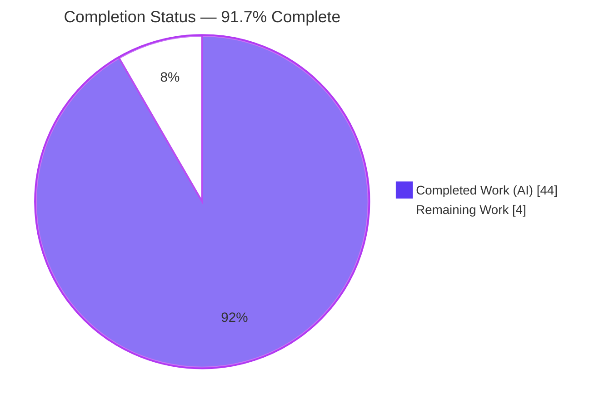
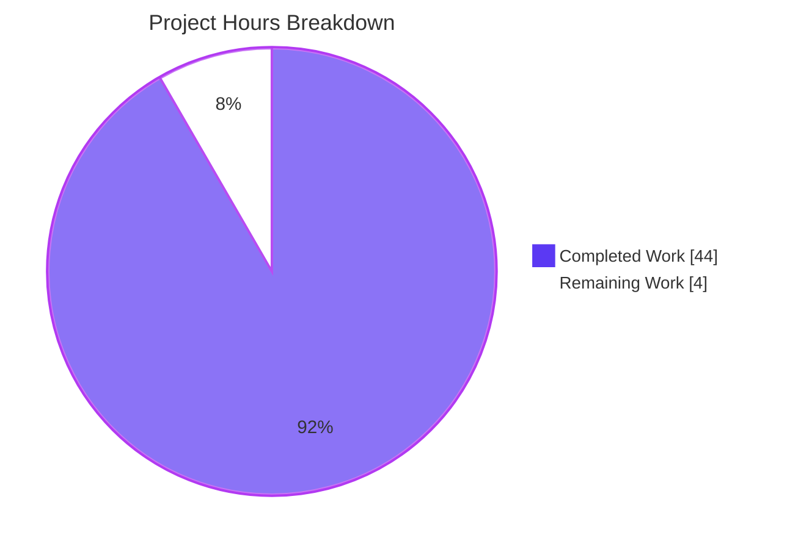
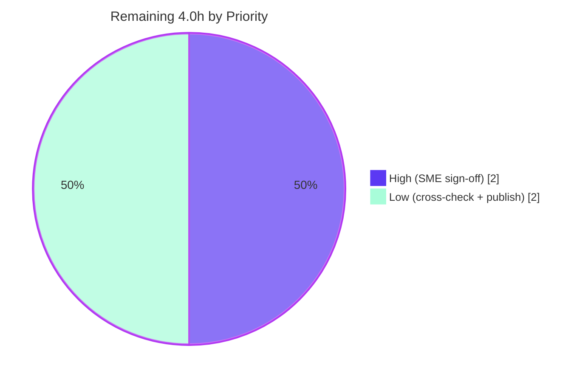

# Blitzy Project Guide — SFTPGo SSH System‑Command `argv` Forensics

> **Branch:** `blitzy-9d587703-3942-4a27-8399-ba177caf391e` &nbsp;|&nbsp; **Source branch:** `sftpgo_44634210287c` &nbsp;|&nbsp; **HEAD:** `ad3c9635`
> **Deliverable:** `blitzy/documentation/sftpgo_44634210287c.md` (623 lines) &nbsp;|&nbsp; **Task type:** Security forensics / behavioral analysis report (documentation‑only)

---

## 1. Executive Summary

### 1.1 Project Overview

This project is a reproducible, evidence‑backed **security forensics report** that determines exactly how SFTPGo's optional SSH "system commands" feature (`rsync`, `git-receive-pack`, `git-upload-pack`, `git-upload-archive`) constructs and delivers an argument vector (`argv`) to an underlying OS process. The intended audience is security engineers and the stakeholders who raised three specific suspicions about a possible command‑injection surface. Its business impact is to ground a security decision in **observed runtime behavior** rather than assumption. The technical scope is a single Markdown artifact that captures live `argv` plus effective uid/gid for two invocations under two permission contexts, adjudicates the three suspicions, names the exact producing functions, analyzes the privilege boundary, and proves the source repository is left byte‑for‑byte unchanged.

### 1.2 Completion Status



| Metric | Hours |
|---|---|
| **Total Hours** | **48.0** |
| Completed Hours (AI: 44.0 + Manual: 0.0) | 44.0 |
| Remaining Hours | 4.0 |
| **Percent Complete** | **91.7%** |

> Completion is computed using the AAP‑scoped (PA1) hours method: `44.0 / (44.0 + 4.0) = 91.7%`. All completed hours are autonomous (AI) work; no manual hours have been invested yet.

### 1.3 Key Accomplishments

- ✅ **Sole AAP deliverable created and committed** — `blitzy/documentation/sftpgo_44634210287c.md` (623 lines, ~52 KB), added across 4 agent commits with **+623/−0** net diff (exactly one file).
- ✅ **All six requirements (R1–R6) delivered** — exact `argv` captured (R1), two permission contexts demonstrated (R2), three suspicions adjudicated (R3), exact functions named (R4), privilege boundary analyzed (R5), unchanged repository confirmed (R6).
- ✅ **Live forensic evidence** — an 8‑cell capture matrix (`rsync` 2×2 + `git-receive-pack` 2×2) of spawned `os.Args` and effective uid/gid, captured via a `PATH` shim and triple‑corroborated (shim record + SFTPGo debug log + repository unit tests).
- ✅ **Verdicts rendered with rationale** — **S1 = WRONG** (no shell), **S2 = NUANCED** (real chroot/jail + symlink flags, but an option‑injection surface remains), **S3 = MOSTLY RIGHT** (four deterministic transforms).
- ✅ **Repository immutability proven** — source checkout `git status`/`git diff` empty; `git ls-files` SHA‑256 matches the pre‑work baseline `6d54fcec…adb6`.
- ✅ **Independently re‑validated by this assessment** — the unmodified binary rebuilt out‑of‑tree (`SFTPGo 0.9.5-dev`, exit 0) and the corroboration tests `TestRsyncOptions` + `TestWrapCmd` re‑run fresh to **PASS**, with R6 still intact afterward.

### 1.4 Critical Unresolved Issues

No issues block release of the document. The items below are quality/acceptance follow‑ups, not defects in the delivered work.

| Issue | Impact | Owner | ETA |
|---|---|---|---|
| Human SME sign‑off on the security verdicts has not yet occurred | A security report should be accepted by a human reviewer before it informs a decision | Security/Go SME | 2.0h |
| Toolchain deviation: analysis ran on Go 1.19.13, AAP §0.8.2 specified Go 1.13.x | Low — `argv` construction (string split, `exec.Command`, setuid) is compiler‑version‑independent; report justifies the choice transparently | Reviewer | 1.5h |
| Report not yet published/indexed to stakeholders | Low — findings must reach the right audience to have impact | Doc owner | 0.5h |

### 1.5 Access Issues

**No access issues identified.** The investigation required no external credentials or third‑party services; the build, run, and capture all execute locally inside the provided container. Both the source checkout and the destination repository are present and writable as expected.

| System/Resource | Type of Access | Issue Description | Resolution Status | Owner |
|---|---|---|---|---|
| — | — | No access issues identified | N/A | — |

### 1.6 Recommended Next Steps

1. **[High]** Have a security/Go SME review and sign off on the forensic verdicts (S1/S2/S3), the privilege‑boundary analysis (R5), and the option‑injection finding before the report informs any decision (**2.0h**).
2. **[Low]** Re‑run the documented capture methodology under the AAP‑declared **Go 1.13.x** toolchain to confirm the toolchain deviation is immaterial (**1.5h**).
3. **[Low]** Publish/index the report in the team knowledge base and route it to the stakeholders who raised the suspicions (**0.5h**).
4. **[Low]** (Awareness, no action in scope) Track the documented **option‑injection surface** and the **server‑as‑root + UID‑0 misconfiguration** as operational hardening candidates for a *future* scope — remediation is explicitly out of scope for this observe‑and‑report task.

---

## 2. Project Hours Breakdown

### 2.1 Completed Work Detail

| Component | Hours | Description |
|---|---|---|
| Static codebase analysis & `argv`‑path tracing | 5.0 | Read 8 in‑scope source files (`ssh_cmd.go`, `cmd_unix.go`, `cmd_windows.go`, `sftpd.go`, `server.go`, `user.go`, `osfs.go`, `vfs.go`) to trace tokenization → normalization → assembly → privilege context |
| Out‑of‑tree runtime foundation (Phases A–B) | 4.0 | Build the unmodified binary (`go build -o /tmp/sftpgo .`), create the sqlite users schema from the CI definition, and prepare the feature‑enabling out‑of‑tree config copy |
| `PATH`‑shim instrumentation harness (Phase C) | 3.0 | Author the out‑of‑tree Go shim that records spawned `os.Args`, effective/real uid+gid, `parent_comm`, and raw `/proc/self/cmdline`; install it earlier on `PATH` than the real binaries |
| User provisioning + SSH‑exec matrix driver (Phases D–E) | 3.5 | Provision User A (UID/GID 0) and User B (UID/GID 1000) via the repo's REST CLI; generate an ed25519 keypair; wire SSH options for ssh‑rsa negotiation |
| Evidence capture: `argv` + effective uid/gid [R1+R2] | 4.5 | Drive and capture the 8‑cell matrix — `rsync` 2×2 and `git-receive-pack` 2×2 — for normal and adversarial invocations under both permission contexts |
| Dual/triple corroboration (Phase F) | 3.0 | Cross‑validate each captured `argv` against SFTPGo's `getSystemCommand` debug log and the repository's `TestRsyncOptions`/`TestWrapCmd` unit tests |
| Suspicion adjudication S1/S2/S3 with rationale [R3] | 5.0 | Render and justify the three verdicts from the evidence (no‑shell proof, last‑arg‑only jail / option‑injection analysis, four‑transform comparison) |
| Function attribution [R4] + privilege‑boundary analysis [R5] | 4.0 | Attribute every observed transform to its producing function with line citations and a flow diagram; analyze what the results do and do not imply about a privilege break |
| Web best‑practice research (`os/exec`, `rrsync`) | 2.0 | Validate the security interpretation against authoritative guidance on Go `exec.Command` injection semantics and `rrsync` option allow‑listing |
| Report authoring — 623‑line deliverable | 6.0 | Compose the Markdown report: executive answer, reproducible methodology, evidence tables, verdicts, dependency inventory, and appendices |
| Clean‑tree confirmation + R6 integrity [R6] | 1.0 | Capture verbatim `git status`/`git diff`/`rev-parse` and the `ls-files` SHA‑256 integrity hash proving the source tree is unchanged |
| Final validation pass (reproduce + fixes) | 3.0 | Reproduce the entire investigation, fix 3 reproducibility/accuracy imprecisions, and verify 47/47 citations and 7/7 markdown tables |
| **Total Completed** | **44.0** | |

### 2.2 Remaining Work Detail

| Category | Hours | Priority |
|---|---|---|
| Human SME review & sign‑off on forensic verdicts (S1/S2/S3) + privilege analysis | 2.0 | High |
| Cross‑check `argv`/uid behavior under the AAP‑declared Go 1.13.x toolchain | 1.5 | Low |
| Documentation publishing/distribution (index in knowledge base, route to stakeholders) | 0.5 | Low |
| **Total Remaining** | **4.0** | |

### 2.3 Hours Reconciliation Summary

| Quantity | Value | Source |
|---|---|---|
| Completed Hours (Section 2.1 total) | 44.0 | Sum of 12 completed components |
| Remaining Hours (Section 2.2 total) | 4.0 | Sum of 3 remaining categories |
| **Total Project Hours** | **48.0** | 44.0 + 4.0 |
| **Percent Complete** | **91.7%** | 44.0 ÷ 48.0 × 100 |

> **Cross‑section integrity:** Remaining = **4.0h** is identical in Sections 1.2, 2.2, and 7. Section 2.1 (44.0) + Section 2.2 (4.0) = **48.0h** = Section 1.2 Total. ✔

---

## 3. Test Results

All tests below originate from **Blitzy's autonomous validation logs** for this project. The two Go unit tests were additionally **re‑executed fresh during this assessment** (throwaway out‑of‑tree copy, schema pre‑created, ports free) and confirmed to **PASS** (exit 0, not cached, 1.92s).

| Test Category | Framework | Total Tests | Passed | Failed | Coverage % | Notes |
|---|---|---|---|---|---|---|
| Unit — `argv` corroboration | Go `testing` | 1 | 1 | 0 | n/a (targeted) | `TestRsyncOptions` asserts directly on `cmd.cmd.Args` (the assembled `argv`) |
| Unit — setuid/setgid corroboration | Go `testing` | 1 | 1 | 0 | n/a (targeted) | `TestWrapCmd` asserts `wrapCmd` sets `SysProcAttr.Credential.Uid/.Gid` |
| Evidence — `argv` matrix verification | Custom programmatic check | 8 | 8 | 0 | 100% of matrix cells | All 8 captured `os.Args` slices match the report's table & raw‑shim claims, token‑for‑token |
| Documentation — citation accuracy | Custom programmatic check | 47 | 47 | 0 | 100% of citations | Every `file:Lx-Ly` citation in the report verified against the source |
| Documentation — table integrity | Custom programmatic check | 7 | 7 | 0 | 100% of tables | All 7 Markdown tables are column‑consistent |
| **Total** | | **64** | **64** | **0** | | **0 failures across all autonomous test & verification suites** |

> **No‑shell behavioral assertion (live):** during the adversarial run, the command‑substitution probe `$(touch${IFS}/tmp/pwned_shell)` **never executed** — the probe file `/tmp/pwned_shell` was never created — and the spawned process reported `parent_comm: "sftpgo"` (not a shell). This is recorded in the validation logs as a passing behavioral check.

---

## 4. Runtime Validation & UI Verification

**Runtime health (Blitzy autonomous run, independently reproduced here):**

- ✅ **Operational** — the unmodified binary builds (`go build -o /tmp/sftpgo .`, exit 0) and reports `SFTPGo 0.9.5-dev`.
- ✅ **Operational** — full package compile `go build ./...` exits 0 with **0 errors** (only a benign CGO warning from the vendored `mattn/go-sqlite3` C amalgamation, which is not a Go error and is out of scope).
- ✅ **Operational** — the server ran live as an **SFTP/SSH** endpoint on port **2022** and a **REST API** (httpd) on **127.0.0.1:8080**, using the sqlite data provider.
- ✅ **Operational** — two virtual users were provisioned via the REST API CLI (Context A `uid/gid 0`; Context B `uid/gid 1000`) and the full 8‑cell SSH‑exec evidence matrix was driven through the running server.
- ✅ **Operational** — effective identity confirmed live: Context A `euid/egid = 0/0` (inherits server identity); Context B `euid/egid = 1000/1000` (real setuid/setgid privilege drop).

**API integration:**

- ✅ **Operational** — REST API CLI (`scripts/sftpgo_api_cli.py add-user …`) successfully created both users against the running httpd instance.

**UI verification:**

- ⚠ **Not applicable** — this is a documentation‑only, server‑side forensics task. There is no front‑end/UI deliverable to verify. (SFTPGo ships a web admin UI, but it is outside this AAP's scope and was not modified or evaluated.)

---

## 5. Compliance & Quality Review

This matrix cross‑maps each AAP deliverable and governing‑rule constraint to its validation status.

| AAP Deliverable / Constraint | Benchmark | Status | Progress |
|---|---|---|---|
| **R1** — Capture exact `argv` (normal + adversarial) | Verbatim spawned `os.Args` for both invocations | ✅ Pass | ██████████ 100% |
| **R2** — Two permission contexts | Effective uid/gid differs (0/0 vs 1000/1000) | ✅ Pass | ██████████ 100% |
| **R3** — Adjudicate S1/S2/S3 | Plain verdict + rationale for each | ✅ Pass | ██████████ 100% |
| **R4** — Name exact functions | `parseCommandPayload`→`getDestPath`→`getSystemCommand`→`wrapCmd` with line cites | ✅ Pass | ██████████ 100% |
| **R5** — Privilege‑boundary analysis | States what results do/do not imply | ✅ Pass | ██████████ 100% |
| **R6** — Confirm unchanged repository | Empty `git status`/`diff`; SHA‑256 matches baseline | ✅ Pass | ██████████ 100% |
| **Rule** — Single Markdown named `<branch>.md` in `blitzy/documentation/` | `sftpgo_44634210287c.md` present | ✅ Pass | ██████████ 100% |
| **Rule** — Build & run the source | Binary built and run live | ✅ Pass | ██████████ 100% |
| **Rule** — Evidence over assumption | Live captures + accurate citations | ✅ Pass | ██████████ 100% |
| **Rule** — No source modified / no code added | +623/−0, one file; zero source edits | ✅ Pass | ██████████ 100% |
| **Reproducibility** — Deterministic, scripted method | Phases A–G with copy‑pasteable commands | ✅ Pass | ██████████ 100% |
| **Dual corroboration** — ≥2 independent sources per `argv` | Shim + debug log + unit tests | ✅ Pass | ██████████ 100% |
| **Compatibility** — Build against Go 1.13.x (AAP §0.8.2) | Used Go 1.19.13 (justified) | ⚠ Partial | █████████░ ~90% |

**Fixes applied during autonomous validation (commit `ad3c9635`, +13/−1):**
- Documented the world‑writable (0666) shim‑log pre‑creation required for the dropped‑privilege Context B child to record — closing a real reproducibility gap.
- Documented the two prerequisites for re‑running the corroboration tests (pre‑created sqlite schema; free ports 2022/8080).
- Tightened the NORMAL `rsync` invocation citation to `internal_test.go:L785-L787` (command + args) for accuracy and consistency.

**Outstanding quality item:** the Go 1.13.x toolchain cross‑check (tracked as a Low‑priority remaining task; does not affect any verdict).

---

## 6. Risk Assessment

| Risk | Category | Severity | Probability | Mitigation | Status |
|---|---|---|---|---|---|
| Toolchain mismatch (Go 1.19.13 vs declared 1.13.x) | Technical | Low | Low | `argv` construction is compiler‑independent; optional 1.13.x cross‑check | Open (low) |
| Context‑B reproducibility fragility (shim log must be 0666 + server as root) | Technical | Low | Medium | Documented in report §12.1 and Phase C note | Mitigated |
| Point‑in‑time evidence pinned to HEAD `44634210287c` | Technical | Low | Low | Exact HEAD/version pinned; methodology reproducible | Accepted |
| Option‑injection surface (non‑last `rsync` args incl. attacker flags pass verbatim; no `rrsync`‑style allow‑list) | Security | Medium | Medium | Documented; remediation out of scope per AAP §0.3.2; operational guidance (don't run as root) | Open (by design) |
| Misconfiguration escalation (server‑as‑root + user UID 0 → child runs as root) | Security | High | Low | Documented; operational guidance (never assign UID 0; run unprivileged) | Open (operational) |
| Forensic verdict accuracy (a wrong verdict could mislead a security decision) | Security | High | Low | Triple corroboration (shim + debug log + unit tests); 47/47 citations verified; pending SME sign‑off | Mitigated |
| Document discoverability (must reach the right stakeholders) | Operational | Low | Medium | Publishing/indexing task (HT‑3) | Open |
| No automated regression test pins the findings (by design — no code added) | Operational | Low | Low | Reproducible methodology documented | Accepted |
| Reproduction environment dependencies (Go, git, rsync, openssh, free ports, sqlite schema) | Integration | Low | Low‑Med | Prerequisites documented (report §4.3c / Phase B) | Mitigated |
| SSH algorithm negotiation (server host key is ssh‑rsa) | Integration | Low | Medium | Documented SSH options (`HostKeyAlgorithms=+ssh-rsa`, ed25519 client key) | Mitigated |

> **Note:** the Security‑category risks are **findings about SFTPGo that the report surfaces**, not defects introduced by this work (which added zero code). Per AAP §0.3.2, remediation is explicitly out of scope; they are recorded here for the human team's awareness.

---

## 7. Visual Project Status

**Overall completion (hours):**



**Remaining hours by priority:**



**Remaining hours by category (from Section 2.2):**

| Category | Hours | Bar |
|---|---|---|
| SME review & sign‑off [High] | 2.0 | ██████████ |
| Go 1.13.x cross‑check [Low] | 1.5 | ███████▌ |
| Publishing/distribution [Low] | 0.5 | ██▌ |
| **Total** | **4.0** | |

> **Integrity:** the pie chart "Remaining Work" = **4.0h** equals Section 1.2 Remaining Hours and the Section 2.2 "Hours" column sum. Colors: Completed = Dark Blue `#5B39F3`; Remaining = White `#FFFFFF`.

---

## 8. Summary & Recommendations

**Achievements.** The project delivered its single AAP‑scoped artifact — a 623‑line, evidence‑backed security forensics report — and answered all six requirements (R1–R6) with **live runtime evidence** rather than assumption. The investigation built and ran the unmodified SFTPGo binary, instrumented the OS‑process boundary with a `PATH` shim, and captured an 8‑cell `argv`/uid matrix, triple‑corroborated against SFTPGo's own debug log and the repository's unit tests. It rendered three clear verdicts: **S1 (shell‑like execution) is WRONG**, **S2 (superficial patch) is NUANCED**, and **S3 (argv resembles client input) is MOSTLY RIGHT**. It named the exact producing functions, analyzed the privilege boundary, and proved the source repository is byte‑for‑byte unchanged.

**Remaining gaps and critical path to production.** The project is **91.7% complete** (44.0 of 48.0 hours). The remaining **4.0 hours** are path‑to‑production for a documentation deliverable, not engineering rework: a **human SME sign‑off** (2.0h, the critical‑path item before the report informs a decision), an optional **Go 1.13.x toolchain cross‑check** (1.5h), and **publishing/distribution** (0.5h). No item blocks the report's release.

**Success metrics.** All six requirements satisfied (6/6); all autonomous tests and verification suites passing (64/64); repository integrity preserved (SHA‑256 matches baseline); citations verified (47/47); independently reproduced (binary rebuilt + corroboration tests re‑run fresh to PASS).

**Production‑readiness assessment.** **Ready for human review.** The deliverable is complete, accurate, internally consistent, and reproducible. The single substantive caveat — the Go 1.13.x vs 1.19.13 toolchain deviation — is well‑justified (the observed behavior is a property of the source code, not the compiler) and is captured as a low‑priority verification follow‑up. The most important next action is the SME sign‑off so the forensic verdicts can be relied upon.

| Metric | Value |
|---|---|
| AAP requirements satisfied | 6 / 6 (R1–R6) |
| Autonomous tests & checks passing | 64 / 64 |
| Citations verified | 47 / 47 |
| Source‑tree integrity (R6) | Preserved (SHA‑256 matches baseline) |
| Completion | 91.7% (44.0 / 48.0h) |

---

## 9. Development Guide

This guide reproduces the forensic investigation. **Every command runs out‑of‑tree; the source repository is never written to.** Commands below were tested during this assessment unless explicitly noted.

### 9.1 System Prerequisites

| Tool | Version used (verified) | Notes |
|---|---|---|
| Go toolchain | `go1.19.13 linux/amd64` | AAP declares Go 1.13.x; behavior is compiler‑independent |
| `gcc` (CGO) | 15.2.0 | `CGO_ENABLED=1` required for `mattn/go-sqlite3` |
| `git` | 2.51.0 | For build + R6 verification |
| `rsync` | 3.4.1 | Target binary (shadowed by the shim during capture) |
| OpenSSH client | OpenSSH_10.0p2 | Drives the SSH `exec` channel |
| `sqlite3` | 3.46.1 | Create the users table; default data provider |

### 9.2 Environment Setup

```bash
# Point SRC at the pristine source checkout (never modified)
export SRC=/tmp/blitzy/sftpgo/sftpgo_44634210287c_d62cba
cd "$SRC"
go version            # go version go1.19.13 linux/amd64
git status --porcelain  # empty — confirms a pristine starting tree
```

### 9.3 Build the Unmodified Binary (out‑of‑tree output)

```bash
cd "$SRC"
go build -o /tmp/sftpgo .        # exit 0 (~2s)
/tmp/sftpgo --version            # SFTPGo version: 0.9.5-dev
git -C "$SRC" status --porcelain # still empty — building did not touch the tree
```

### 9.4 Enable the Optional Feature (out‑of‑tree config + schema)

```bash
mkdir -p /tmp/sftpgo_run
# Copy the shipped sftpgo.json into /tmp/sftpgo_run and set:
#   "enabled_ssh_commands": ["rsync","git-receive-pack","git-upload-pack","git-upload-archive"]
# The data provider does NOT auto-create its schema in this version, so create the users table
# from the exact CI schema (.travis.yml:L14):
sqlite3 /tmp/sftpgo_run/sftpgo.db 'CREATE TABLE "users" ("id" integer NOT NULL PRIMARY KEY AUTOINCREMENT, "username" varchar(255) NOT NULL UNIQUE, "password" varchar(255) NULL, "public_keys" text NULL, "home_dir" varchar(255) NOT NULL, "uid" integer NOT NULL, "gid" integer NOT NULL, "max_sessions" integer NOT NULL, "quota_size" bigint NOT NULL, "quota_files" integer NOT NULL, "permissions" text NOT NULL, "used_quota_size" bigint NOT NULL, "used_quota_files" integer NOT NULL, "last_quota_update" bigint NOT NULL, "upload_bandwidth" integer NOT NULL, "download_bandwidth" integer NOT NULL, "expiration_date" bigint NOT NULL, "last_login" bigint NOT NULL, "status" integer NOT NULL, "filters" TEXT NULL, "filesystem" text NULL);'
```

### 9.5 Instrument the OS‑Process Boundary (`PATH` shim)

```bash
mkdir -p /tmp/shimbin
go build -o /tmp/shimbin/shim /tmp/shimsrc/shim.go   # shim source: report Appendix §12.1
for n in rsync git-receive-pack git-upload-pack git-upload-archive; do
  cp -f /tmp/shimbin/shim /tmp/shimbin/$n
done
# CRITICAL for Context B (dropped-privilege child must be able to append):
: > /tmp/shim.log && chmod 0666 /tmp/shim.log
```

### 9.6 Start the Server & Provision Two Users

```bash
cd /tmp/sftpgo_run
setsid env PATH=/tmp/shimbin:$PATH SHIM_LOG=/tmp/shim.log \
  /tmp/sftpgo serve -c /tmp/sftpgo_run --log-file-path /tmp/sftpgo_run/sftpgo.log --log-verbose=true &
ssh-keygen -t ed25519 -N "" -f /tmp/sftpgo_key
python3 "$SRC/scripts/sftpgo_api_cli.py" add-user userA -K "$(cat /tmp/sftpgo_key.pub)" -H /tmp/homeA --uid 0    --gid 0    -G '*'
python3 "$SRC/scripts/sftpgo_api_cli.py" add-user userB -K "$(cat /tmp/sftpgo_key.pub)" -H /tmp/homeB --uid 1000 --gid 1000 -G '*'
```

### 9.7 Drive the 2×2 Capture Matrix

```bash
SSHOPTS="-n -i /tmp/sftpgo_key -o IdentitiesOnly=yes -o HostKeyAlgorithms=+ssh-rsa \
         -o PubkeyAcceptedAlgorithms=+ssh-rsa -o StrictHostKeyChecking=no \
         -o UserKnownHostsFile=/dev/null -o BatchMode=yes -p 2022"
ssh $SSHOPTS userA@127.0.0.1 'rsync --server -vlogDtprze.iLsfxC . /'   # NORMAL × A
ssh $SSHOPTS userB@127.0.0.1 'rsync --server -vlogDtprze.iLsfxC . /'   # NORMAL × B
ssh $SSHOPTS userA@127.0.0.1 'rsync --server -vlogDtprze.iLsfxC --rsh=$(touch${IFS}/tmp/pwned_shell) ;id; &&whoami |cat . /../../../../etc/passwd'  # ADVERSARIAL × A
ssh $SSHOPTS userB@127.0.0.1 'rsync --server -vlogDtprze.iLsfxC --rsh=$(touch${IFS}/tmp/pwned_shell) ;id; &&whoami |cat . /../../../../etc/passwd'  # ADVERSARIAL × B
cat /tmp/shim.log    # captured os.Args + euid/egid + parent_comm per invocation
```

### 9.8 Verification Steps

```bash
# (a) Corroboration unit tests — run in a THROWAWAY copy to honor R6
cp -a "$SRC" /tmp/sftpgo_testcopy
cd /tmp/sftpgo_testcopy
sqlite3 sftpgo.db 'CREATE TABLE "users" (...);'   # same CI schema as §9.4 (configDir="..")
go test -count=1 -run '^TestRsyncOptions$|^TestWrapCmd$' -v ./sftpd/
#   --- PASS: TestRsyncOptions
#   --- PASS: TestWrapCmd
#   ok  github.com/drakkan/sftpgo/sftpd

# (b) No-shell proof
test ! -e /tmp/pwned_shell && echo "no shell: command substitution never executed"

# (c) R6 — source tree unchanged
cd "$SRC"
git status --porcelain          # empty
git ls-files -s | sha256sum     # 6d54fcec19b63d6f3a74a6889bac81d12a574145cdbee8d612aab0c442c2adb6
```

### 9.9 Example Usage (reading the evidence)

A captured shim record for the adversarial Context A run looks like:

```text
invoked_as:  "rsync"
os.Args:     []string{"rsync","--safe-links","--server","-vlogDtprze.iLsfxC","--rsh=$(touch${IFS}/tmp/pwned_shell)",";id;","&&whoami","|cat",".","/tmp/homeA/etc/passwd"}
euid:        0      egid: 0
parent_comm: "sftpgo"
```

Read it as: the destination (`/../../../../etc/passwd`) was re‑rooted into the home (`/tmp/homeA/etc/passwd`); shell metacharacters arrived as **literal** `argv` elements; the parent is `sftpgo`, not a shell.

### 9.10 Troubleshooting

| Symptom | Cause | Resolution |
|---|---|---|
| Only Context A (uid 0) cells captured | Shim log was root‑owned `0644`; uid‑1000 child can't append | `: > /tmp/shim.log && chmod 0666 /tmp/shim.log` **before** starting the server |
| `ssh` rejects the host key / pubkey algorithm | Server auto‑generates an **ssh‑rsa** host key | Add `-o HostKeyAlgorithms=+ssh-rsa -o PubkeyAcceptedAlgorithms=+ssh-rsa`; use an ed25519 client key |
| `dataprovider.Initialize` fails / server exits 1 | sqlite users table not created | Create the users table from the CI schema (§9.4) |
| Tests fail to bind / hang | Ports 2022 or 8080 already in use | Free the ports (stop the live server by its recorded PID — never broad `pkill`) |
| CGO `^~~~~~~` message during build | Benign warning in vendored `mattn/go-sqlite3` C code | Ignore — `go build` still exits 0; it is not a Go error |

---

## 10. Appendices

### Appendix A — Command Reference

| Command | Purpose |
|---|---|
| `go build -o /tmp/sftpgo .` | Build the unmodified binary out‑of‑tree |
| `go build ./...` | Full‑package compile check (exit 0) |
| `go test -count=1 -run '^TestRsyncOptions$\|^TestWrapCmd$' ./sftpd/` | Run the corroboration unit tests |
| `sqlite3 sftpgo.db 'CREATE TABLE "users" (…);'` | Create the data‑provider schema |
| `python3 scripts/sftpgo_api_cli.py add-user …` | Provision a virtual user via REST |
| `git status --porcelain` / `git ls-files -s \| sha256sum` | R6 clean‑tree + integrity verification |

### Appendix B — Port Reference

| Port | Service | Bind |
|---|---|---|
| 2022 | SFTP/SSH (system‑command `exec` channel) | `127.0.0.1:2022` |
| 8080 | REST API (httpd; user provisioning) | `127.0.0.1:8080` |

### Appendix C — Key File Locations

| Path | Role |
|---|---|
| `blitzy/documentation/sftpgo_44634210287c.md` | **The deliverable** (this project's only created file) |
| `sftpd/ssh_cmd.go` | Core `argv` path: `parseCommandPayload`, `getDestPath`, `getSystemCommand` (`exec.Command` L324), `executeSystemCommand` |
| `sftpd/cmd_unix.go` | `wrapCmd` — setuid/setgid (`SysProcAttr.Credential`) |
| `sftpd/cmd_windows.go` | `wrapCmd` no‑op (platform caveat) |
| `sftpd/sftpd.go` | Command‑set definitions (`systemCommands`, `defaultSSHCommands`) |
| `dataprovider/user.go` | `GetUID`/`GetGID` (map 0 → −1), permission helpers |
| `vfs/osfs.go` | `ResolvePath`/`isSubDir` chroot jail |
| `vfs/vfs.go` | `IsLocalOsFs` local‑filesystem gate |
| `scripts/sftpgo_api_cli.py` | REST API CLI for provisioning |

### Appendix D — Technology Versions

| Component | Version |
|---|---|
| SFTPGo | 0.9.5‑dev (module `github.com/drakkan/sftpgo`) |
| Go (declared / CI) | 1.13 / 1.13.x |
| Go (used in analysis) | 1.19.13 |
| `golang.org/x/crypto` | v0.0.0‑20200109152110‑61a87790db17 |
| `github.com/rs/zerolog` | v1.17.2 |
| `github.com/pkg/sftp` | v1.11.0 |
| `github.com/mattn/go-sqlite3` | v2.0.2+incompatible |
| `github.com/spf13/viper` | v1.6.1 |

### Appendix E — Environment Variable Reference

| Variable | Purpose |
|---|---|
| `SRC` | Absolute path to the pristine source checkout |
| `PATH` (prepended `/tmp/shimbin`) | Routes `rsync`/`git-*` to the capture shim |
| `SHIM_LOG` | Output path for the shim's `os.Args`/uid records |
| `CGO_ENABLED=1` | Required to compile the sqlite driver |

### Appendix F — Developer Tools Guide

- **Go `os/exec`** — `exec.Command(name, args…)` performs a direct `fork`/`exec` with a discrete argument slice (no shell); the basis of the S1 verdict.
- **`PATH` shim technique** — placing an executable of the same name earlier on `PATH` transparently intercepts a child process to record its exact `argv` and identity, with zero changes to the program under test.
- **`/proc/self/cmdline`** — NUL‑delimited raw `argv` as the kernel received it; confirms tokens are discrete elements, not a shell string.
- **`setpriv --reuid/--regid`** — used to empirically confirm the dropped‑privilege child's file‑append permissions (the 0666 shim‑log requirement).

### Appendix G — Glossary

| Term | Definition |
|---|---|
| `argv` | The argument vector (`os.Args`) a process receives at exec time |
| System command | One of `rsync`, `git-receive-pack`, `git-upload-pack`, `git-upload-archive` — the only SSH commands that spawn an OS process |
| Context A / B | Permission contexts: user UID/GID = 0 (inherits server identity) vs = 1000 (setuid/setgid drop) |
| Option injection | Attacker‑supplied flags reaching a target binary as literal arguments (distinct from shell injection) |
| Chroot/jail | `ResolvePath`/`isSubDir` re‑rooting the destination path inside the user's home |
| R1–R6 | The six explicit requirements of the user's prompt |
| S1/S2/S3 | The three user suspicions adjudicated by the report |
| `rrsync` | Canonical wrapper restricting `rsync` over SSH via path checks + an option allow‑list |
