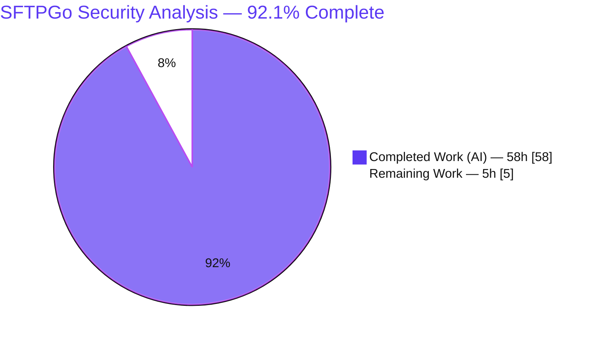
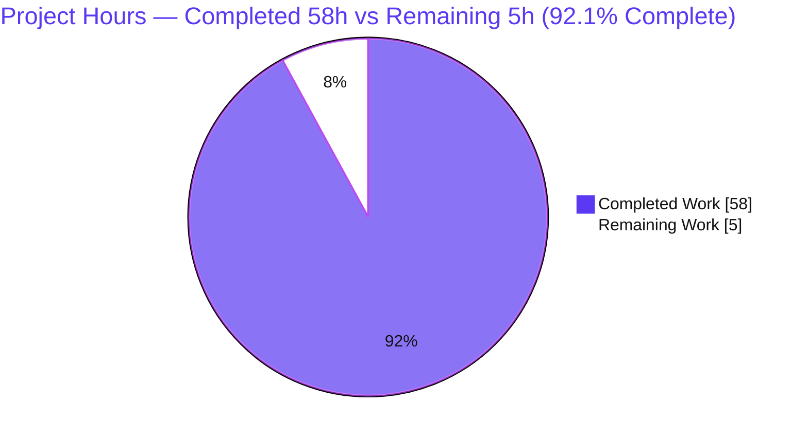
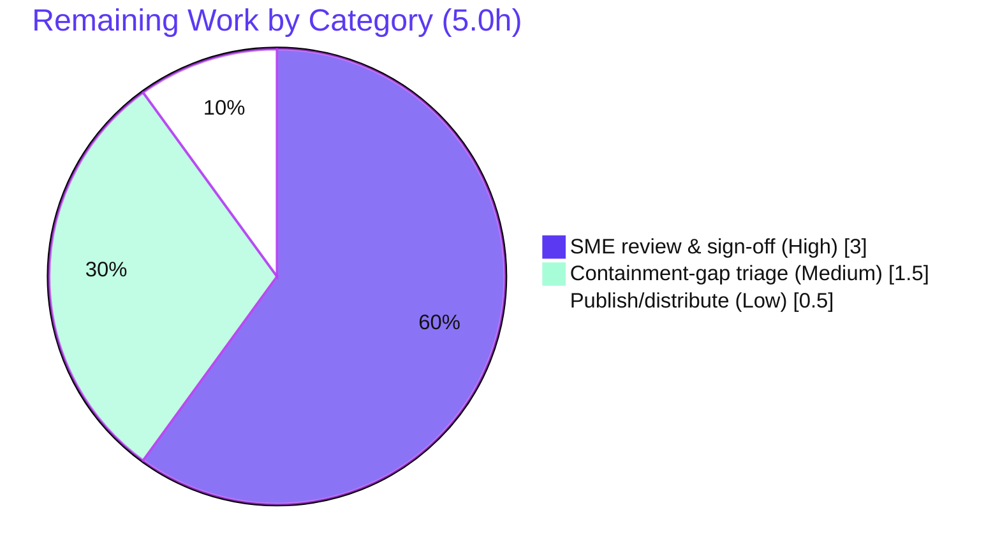

# Blitzy Project Guide — SFTPGo SSH/External-Utility Security Analysis

> **Branch:** `blitzy-85d43665-afdf-43df-8d55-2768ee894c46`  ·  **Head:** `342a9f5f`  ·  **Base (analysis commit):** `44634210287cb192f2a53147eafb84a33a96826b` (SFTPGo v0.9.5-dev)
> **Deliverable type:** Documentation — evidence-based security code-analysis (rule set *SWE-AtlasQnA-Repo*)

---

## 1. Executive Summary

### 1.1 Project Overview

This project delivers a single, evidence-based Markdown document — `blitzy/documentation/sftpgo_44634210287c.md` (1,335 lines) — that authoritatively answers five entangled security questions about how SFTPGo behaves when file-synchronization tools and other external utilities are invoked over SSH. Every answer is grounded in the actual source at the pinned commit `44634210` (v0.9.5-dev) and corroborated by reproduced runtime behavior captured from a CGO-free build driven by real `ssh`/`scp`/`sftp`/`rsync` clients. The audience is SFTPGo maintainers and security reviewers. The technical scope spans three subsystems — `sftpd/` (SSH/SCP command gating), `dataprovider/` (permission model), and `vfs/` (chroot containment) — read-only; exactly one document is produced and zero source files are modified.

### 1.2 Completion Status



| Metric | Hours |
|--------|-------|
| **Total Hours** | **63** |
| Completed Hours (AI + Manual) | 58 (AI: 58, Manual: 0) |
| Remaining Hours | 5 |
| **Percent Complete** | **92.1%** (58 / 63) |

> Completion is computed by the PA1 AAP-scoped hours methodology: `Completed ÷ (Completed + Remaining) = 58 ÷ 63 = 92.1%`. The work universe is the AAP-scoped deliverable plus path-to-production review only. All autonomous, AAP-scoped work is complete and validated; the remaining 5 hours are mandatory human review/acceptance of a finished security analysis (which cannot be performed autonomously).

### 1.3 Key Accomplishments

- ✅ **Single deliverable authored and committed** — `blitzy/documentation/sftpgo_44634210287c.md` (1,335 lines, 75 KB), correctly named after the source branch and placed under `blitzy/documentation/`.
- ✅ **All five questions answered** (Q1–Q5), each with the mandated five-part structure: restated question → code evidence with line anchors → rationale → behavioral-test recipe → coverage verdict.
- ✅ **135 code citations verified accurate** against the working tree at commit `44634210` across 12 reference files; independently spot-checked 5/5 by this assessment.
- ✅ **Server built and run** — `CGO_ENABLED=0 go build` produces a 28 MB static binary reporting `SFTPGo version: 0.9.5-dev`; independently re-built and re-verified during this assessment (exit 0).
- ✅ **23 client-driven behavioral reproductions** across Q1–Q5 (7/3/3/4/6) captured from two live in-memory server instances with zero panics/fatal/error log lines.
- ✅ **Central security finding empirically confirmed** — a real chroot-containment escape via a prefix-sharing sibling symlink (`vfs/osfs.go:285` `HasPrefix` without trailing separator + `ResolvePath` returning the lexical path), observed reading out-of-home data over both SFTP and SCP.
- ✅ **All AAP constraints satisfied** — zero source files modified (source byte-identical to base), `go.mod`/`go.sum` untouched, all ephemeral tooling deleted, working tree clean.

### 1.4 Critical Unresolved Issues

| Issue | Impact | Owner | ETA |
|-------|--------|-------|-----|
| Security SME sign-off of the analysis not yet performed | Findings should not be acted upon until human-validated | Security reviewer | 0.5 day |
| Confirmed containment-gap finding awaiting triage decision | A real (documented) SFTPGo behavior remains untriaged; remediation is explicitly out of this analysis-only task's scope | SFTPGo maintainer / security lead | 0.5 day |

> There are **no** unresolved engineering/build issues. The deliverable compiles-as-evidence, reproduces cleanly, and is committed. The items above are review/decision gates, not defects.

### 1.5 Access Issues

| System / Resource | Type of Access | Issue Description | Resolution Status | Owner |
|-------------------|----------------|-------------------|-------------------|-------|
| (none) | — | No access issues identified. The build, runtime, all clients (OpenSSH 10.0p2, rsync 3.4.1, git 2.51.0), and the Go 1.13.15 toolchain were all available; the repository and document were fully accessible. | N/A | N/A |

**No access issues identified.**

### 1.6 Recommended Next Steps

1. **[High]** Have a security SME read and validate the Q1–Q5 analyses, rationale, and coverage verdicts for technical accuracy (≈2.0h).
2. **[High]** Spot-check a sample of the 135 citations against commit `44634210` and re-run the documented build/run reproduction for at least the Q5 central finding (≈1.0h).
3. **[Medium]** Independently reproduce and **triage** the confirmed containment-gap finding; decide whether to open a *separate* SFTPGo remediation effort (≈1.5h).
4. **[Low]** Publish/distribute the approved document to stakeholders (link in the security wiki / attach to the review ticket) (≈0.5h).

---

## 2. Project Hours Breakdown

### 2.1 Completed Work Detail

| Component | Hours | Description |
|-----------|-------|-------------|
| Build & ephemeral behavioral-test harness | 7 | CGO-free build (Go 1.13.15); two server instances (restrictive default + system-commands/SCP) on the in-memory provider; RSA key, two multi-permission users, seeded homes, planted symlinks and out-of-home decoys — all outside the repository |
| Static source analysis & citation verification | 8 | Read 12 reference files across `sftpd/`, `dataprovider/`, `vfs/`, `config/` + `sftpgo.json` + `README.md`; verified 135 `file:line` anchors against the working tree at commit `44634210` |
| Q1 — external-utility model & enable/disable | 5 | Command taxonomy (hash / system / no-op); `enabled_ssh_commands` allow-list gate; enable/disable reproduced across both instances |
| Q2 — trust boundary & server-side filtering | 6 | SSH channel/request acceptance; whitelist gate; startup validation; local-FS restriction; uid/gid privilege drop; Windows no-op nuance |
| Q3 — protocol-input parsing robustness | 5 | SCP strict three-token parser; SSH tokenizer; accept/reject behavior for spaced filenames reproduced |
| Q4 — permission-enforcement ordering | 6 | Most-specific-match permission resolution on the virtual path; per-operation ordering relative to path resolution; reproduced per operation |
| Q5 — filesystem-trick protections (incl. containment-gap discovery) | 9 | `ResolvePath`/`isSubDir` analysis; **discovery + empirical confirmation of the prefix-sharing sibling symlink escape**; root-dir guards; rsync `--safe-links`/`--munge-links` injection; six numbered behavioral tests |
| Overview, methodology, harness spec & trust-boundary diagram | 3 | Layered-model overview, commit pin, static+dynamic methodology, reproducible harness spec, Mermaid trust-boundary diagram |
| Cross-cutting findings synthesis | 2 | Containment guarantees, the confirmed gap, robustness gaps, delegated defenses, empirically-verified items, one-line summaries |
| References + external CVE research & framing | 3 | Per-question anchor lists; external framing CVE-2026-41589 (wish SCP contrast) and CVE-2024-12088 (rsync `--safe-links`) |
| Document assembly, validation corrections, cleanup & commit | 4 | Assemble 1,335-line document; apply the one validation correction (Q3 `nospace.txt` md5 reconciled); delete all ephemeral tooling; commit with a clean tree |
| **Total Completed** | **58** | |

### 2.2 Remaining Work Detail

| Category | Hours | Priority |
|----------|-------|----------|
| Security SME review & sign-off of the Q1–Q5 analysis, citations & behavioral evidence | 3.0 | High |
| Independent validation & triage of the confirmed containment-gap finding (decide remediation path; remediation itself is out of this task's scope) | 1.5 | Medium |
| Publish/distribute the approved deliverable to stakeholders | 0.5 | Low |
| **Total Remaining** | **5.0** | |

> **Cross-check:** Section 2.1 (58) + Section 2.2 (5) = **63** = Total Hours in Section 1.2. ✓

---

## 3. Test Results

For a documentation deliverable the "tests" are **Blitzy's autonomous behavioral-evidence reproductions** plus the build and citation-verification steps — all originating from Blitzy's autonomous validation logs for this project. Every behavioral reproduction was executed against live, CGO-free, in-memory SFTPGo instances and matched the document.

| Test Category | Framework / Method | Total | Passed | Failed | Coverage | Notes |
|---------------|--------------------|-------|--------|--------|----------|-------|
| Build / Compile | `CGO_ENABLED=0 go build` (Go 1.13.15) | 1 | 1 | 0 | — | 28 MB static binary; `SFTPGo version: 0.9.5-dev`; independently re-confirmed |
| Static citation verification | Manual vs. working tree @ `44634210` | 135 | 135 | 0 | 12 files | All `file:line` anchors accurate; 5/5 re-spot-checked here |
| Q1 behavioral reproduction | `ssh`/`scp` vs. live server | 7 | 7 | 0 | — | Enable/disable mechanics; identical hashes across instances |
| Q2 behavioral reproduction | `ssh`/`sftp` vs. live server | 3 | 3 | 0 | — | PTY rejected; supported-but-not-enabled & unsupported commands refused; startup validation |
| Q3 behavioral reproduction | `scp` vs. live server | 3 | 3 | 0 | — | Strict three-token parser; space-free accepted, spaced rejected with exact error |
| Q4 behavioral reproduction | `sftp` vs. live server | 4 | 4 | 0 | — | Most-specific permission match on the virtual path |
| Q5 behavioral reproduction | `sftp`/`scp`/`rsync` vs. live server | 6 | 6 | 0 | — | Six numbered tests incl. the confirmed containment escape and contrast cases |
| Runtime health | Server JSON logs (2 instances) | 2 | 2 | 0 | — | Zero panic/fatal/error lines across all tests |
| **Total** | | **161** | **161** | **0** | | |

> **Integrity note (Rule 3).** Every row above derives from Blitzy's autonomous validation logs. The repository's own Go `*_test.go` suite (6 files) was **intentionally not executed or modified** — the AAP scopes this task as analysis-only with behavioral verification via external throwaway scripts, and the source tree is byte-identical to the upstream analysis commit, so the upstream unit suite is not the unit-under-validation and is deliberately excluded from these counts.

---

## 4. Runtime Validation & UI Verification

There is **no UI** in scope — the subject is a backend SSH/SFTP server and the deliverable is a Markdown document. Runtime validation focused on server health and protocol behavior.

**Runtime health (two live in-memory instances):**
- ✅ **Operational** — Instance A (port 2223, restrictive default `enabled_ssh_commands = md5sum,sha1sum,cd,pwd`, SCP off) started and served end-to-end.
- ✅ **Operational** — Instance B (port 2222, system commands + SCP enabled) started and served end-to-end.
- ✅ **Operational** — Both auto-generated an `ssh-rsa` host key; users loaded via the HTTP `loaddata` endpoint (HTTP 200).
- ✅ **Operational** — Zero panic/fatal/error log lines across all Q1–Q5 tests.

**Protocol / behavioral integration outcomes:**
- ✅ **Operational** — SFTP subsystem (file read/write/list/stat).
- ✅ **Operational** — SSH `exec` for internal hash commands (`md5sum`/`sha1sum`) and inert `cd`/`pwd`.
- ✅ **Operational** — SCP upload/download (legacy protocol via `scp -O`).
- ✅ **Operational** — `rsync`/`git-*` system-command execution on the enabled instance, with uid/gid privilege drop attempted (observed as the non-root `operation not permitted` exec outcome).
- ⚠ **Partial (by design / external dependency)** — rsync symlink safety is **delegated** to the external `rsync` binary; SFTPGo correctly injects `--safe-links`/`--munge-links` but the ultimate guarantee depends on the external tool.
- ❌ **Failing (by design — fail-closed)** — filenames containing spaces are rejected by the strict three-token SCP parser (correctness/interoperability gap, not a security hole).

**API integration:** the HTTP REST `loaddata` endpoint was used to provision users for the harness and returned HTTP 200; no other API surface was in scope.

---

## 5. Compliance & Quality Review

| AAP / Rule Requirement | Benchmark | Status | Progress |
|------------------------|-----------|--------|----------|
| Document named `<source_branch>.md` under `blitzy/documentation/` | `sftpgo_44634210287c.md` present at correct path | ✅ Pass | 100% |
| Answers all five questions (Q1–Q5) | Five sections, each with restated Q + evidence + rationale + recipe + verdict | ✅ Pass | 100% |
| Build and run the source code | CGO-free build + two live instances driven by real clients | ✅ Pass | 100% |
| Base answers on the code as truth (verified citations) | 135 `file:line` anchors verified @ `44634210` | ✅ Pass | 100% |
| Evidence over theory (observed runtime behavior) | 23 client-driven reproductions + server logs | ✅ Pass | 100% |
| Provide thinking/rationale | "Rationale / thinking" subsection in every answer | ✅ Pass | 100% |
| Do not modify any existing source file | `git diff 44634210 -- ':!blitzy/'` = 0 files | ✅ Pass | 100% |
| Add no other code; no dependency changes | Only the document added; `go.mod`/`go.sum` untouched | ✅ Pass | 100% |
| Analysis-only — surfaced gaps reported, not remediated | Containment gap characterised, not fixed | ✅ Pass | 100% |
| Ephemeral tooling deleted; working tree clean | Binary, harness, transcripts removed; `git status` clean | ✅ Pass | 100% |
| Commit-accurate, faithful to pinned commit | Commit pin restated; anchors re-verified | ✅ Pass | 100% |
| Human SME sign-off of the security analysis | Independent technical review | ⏳ Pending | 0% |

**Fixes applied during autonomous validation:** exactly one — the Q3 `nospace.txt` md5 at line 578 was reconciled from a prior-run value to the re-reproduced value `8c957cbeda3fcbd9e3570c5a34b1bb2e` (deterministic 17-byte content); all surrounding evidence (sizes, the exact rejection message, accept/reject behavior) already matched.

**Outstanding compliance item:** human SME sign-off (the only non-autonomous gate).

---

## 6. Risk Assessment

| Risk | Category | Severity | Probability | Mitigation | Status |
|------|----------|----------|-------------|------------|--------|
| Citation/line-anchor drift if checked against a different SFTPGo version | Technical | Low | Medium | Commit pinned (`44634210…`); every anchor re-verified; references restate the pin | Mitigated |
| Behavioral transcripts are run-specific (timestamps; one md5 reconciled) | Technical | Low | Low | Exact reproducible harness + full client option strings; deterministic file content | Mitigated |
| Confirmed containment gap (prefix-sharing sibling symlink escape) is real but unremediated | Security | Medium | N/A (documented; bounded by needing symlink-plant rights + a name-prefix-sharing sibling) | Flagged as central finding; dedicated human triage task; AAP scopes it report-not-remediate | Open (awaiting triage) |
| Subtle analytical inaccuracy could misinform a downstream security decision | Security | Medium | Low | 135/135 citations verified; all Q1–Q5 behavior reproduced; one inaccuracy already found & fixed | Mitigated (pending SME sign-off) |
| Findings pinned to v0.9.5-dev may not transfer to a current SFTPGo release | Operational | Low | Medium | Commit pin + explicit "no reliance on newer releases" scope caveat | Mitigated |
| No in-repo CI gate re-validates citations over time | Operational | Low | Low | Human review is the acceptance gate; citations are commit-pinned | Accepted (by design) |
| Reproduction depends on external tooling (ssh/scp/sftp/rsync, Go 1.13.15) | Integration | Low | Low | Exact tool versions + option strings documented; build independently re-confirmed | Mitigated |
| rsync symlink safety delegated to the external `rsync` binary (CVE-2024-12088 context) | Integration | Low | N/A | Documented as a delegated defense dependent on the external binary's correctness | Documented |

**Overall posture:** no High-severity project risks. The dominant residual item is mandatory human SME review (= the 5 remaining hours). The single Medium-severity security item is the central documented finding, scoped by the AAP as a downstream triage decision rather than a deliverable defect.

---

## 7. Visual Project Status



**Remaining hours by category (Section 2.2):**



> **Integrity (Rule 1):** "Remaining Work" = **5h** here, in the Section 1.2 metrics table, and as the sum of the Section 2.2 Hours column. ✓

---

## 8. Summary & Recommendations

**Achievements.** The project delivers exactly what the AAP scoped: one rigorous, evidence-based security-analysis document answering Q1–Q5, grounded in 135 verified source citations at commit `44634210` and corroborated by 23 client-driven behavioral reproductions against live SFTPGo instances. The standout result is the empirical confirmation of a real chroot-containment escape (prefix-sharing sibling symlink) — surfaced, demonstrated over both SFTP and SCP, and correctly **characterised rather than remediated**, per the analysis-only scope.

**Remaining gaps.** No engineering gaps remain. The outstanding work is human review: a security SME must validate the analysis before it is acted upon, and the documented containment gap needs a triage decision on whether to open a separate remediation effort.

**Critical path to production.** SME technical review & sign-off (3.0h) → triage of the containment-gap finding (1.5h) → publish/distribute (0.5h). Total 5.0h, all human.

**Success metrics.** Deliverable present and correctly named/located ✅; all five questions answered with the mandated structure ✅; 135/135 citations accurate ✅; build/run reproducible ✅ (independently re-confirmed); zero source modifications ✅; working tree clean ✅.

**Production-readiness assessment.** The deliverable is **92.1% complete** on the AAP-scoped + path-to-production basis. It is functionally complete and internally validated; the remaining 7.9% is mandatory, non-automatable human review/acceptance of a security analysis. Recommended status: **ready for security review**.

| Metric | Value |
|--------|-------|
| AAP-scoped completion | 92.1% (58 / 63 h) |
| Autonomous deliverable status | Complete & validated |
| Blocking engineering issues | 0 |
| Source files modified | 0 (byte-identical to base) |
| Remaining work | 5.0h (human review/triage/publish) |

---

## 9. Development Guide

All commands below were tested in the project environment during this assessment.

### 9.1 System Prerequisites

- **Go 1.13.x** toolchain (verified `go1.13.15 linux/amd64`). In this container: `source /etc/profile.d/go.sh`.
- **OpenSSH client** (verified `OpenSSH_10.0p2`) — provides `ssh`, `scp`, `sftp`.
- **rsync** (verified `3.4.1`) and **git** (verified `2.51.0`) for system-command tests.
- **OS:** Linux x86-64. No gcc/SQLite needed for the CGO-free path.

### 9.2 Environment Setup

```bash
# From the repository root (module: github.com/drakkan/sftpgo)
source /etc/profile.d/go.sh          # put Go 1.13.15 on PATH (container-specific)
go version                            # expect: go version go1.13.15 linux/amd64

# Keep ALL behavioral-test artifacts OUTSIDE the repository (AAP ephemeral-tooling rule)
export EVAL=/tmp/sftpgo_eval
mkdir -p "$EVAL"/{keys,homes,out}
```

### 9.3 Dependency Installation

```bash
export CGO_ENABLED=0
go mod download        # modules: pkg/sftp v1.11.0, go.etcd.io/bbolt, etc. (go.mod/go.sum unchanged)
```

> The module cache is already populated in this environment, so the build below succeeds even if `go mod download` is slow on a constrained network.

### 9.4 Build

```bash
export CGO_ENABLED=0
go build -o /tmp/sftpgo .            # ~28 MB static, CGO-free ELF
/tmp/sftpgo --version                # expect: SFTPGo version: 0.9.5-dev
/tmp/sftpgo --help                   # subcommands: serve, portable, help
```

### 9.5 Run the Server (in-memory, convenient for reproduction)

```bash
# Generate a client key (outside the repo)
ssh-keygen -t rsa -b 2048 -N '' -f "$EVAL/keys/id_rsa"
mkdir -p "$EVAL/homes/testuser" && echo -n 'hello sftpgo' > "$EVAL/homes/testuser/hello.txt"

# Portable mode serves a single directory with an in-memory provider:
/tmp/sftpgo portable \
  -d "$EVAL/homes/testuser" \
  -s 2222 \
  -u testuser \
  -k "$(cat "$EVAL/keys/id_rsa.pub")" \
  -g '*' \
  -c 'md5sum,sha1sum,rsync,git-receive-pack,git-upload-pack,git-upload-archive,cd,pwd' &
```

> Key `portable` flags: `-s/--sftpd-port`, `-u/--username`, `-p/--password`, `-g/--permissions` (`*` = any), `-k/--public-key`, `-c/--ssh-commands` (`*` = any incl. `scp`), `-d/--directory`. For multi-user / per-directory-permission setups, the document's full harness uses the `serve` subcommand with the `memory` provider and the HTTP `loaddata` endpoint.

### 9.6 Verification & Example Usage

```bash
OPTS="-i $EVAL/keys/id_rsa -o IdentitiesOnly=yes \
      -o HostKeyAlgorithms=+ssh-rsa -o PubkeyAcceptedAlgorithms=+ssh-rsa \
      -o StrictHostKeyChecking=no -o UserKnownHostsFile=/dev/null \
      -o BatchMode=yes -o ConnectTimeout=8"

# Q1 — internal hash command on the VIRTUAL path:
ssh -p 2222 $OPTS testuser@127.0.0.1 pwd                  # -> /
ssh -p 2222 $OPTS testuser@127.0.0.1 "md5sum /hello.txt"  # -> 9da2e881d3f92f99a771aea65ae3ba2b  /hello.txt

# Q5 central finding — plant an in-home symlink to a prefix-sharing sibling, then read through it:
mkdir -p "$EVAL/homes/testuser-evil" && echo 'SECRET OUTSIDE HOME' > "$EVAL/homes/testuser-evil/evil.txt"
ln -s ../testuser-evil "$EVAL/homes/testuser/escape"
sftp -P 2222 $OPTS testuser@127.0.0.1 <<< 'get /escape/evil.txt /tmp/escaped.txt'   # succeeds: out-of-home read
```

### 9.7 View the Deliverable

```bash
sed -n '1,60p' blitzy/documentation/sftpgo_44634210287c.md   # or any Markdown viewer
wc -l blitzy/documentation/sftpgo_44634210287c.md            # 1335
```

### 9.8 Cleanup (AAP ephemeral-tooling rule)

```bash
kill %1 2>/dev/null            # stop the portable server you started
rm -rf /tmp/sftpgo /tmp/sftpgo_eval
git status --porcelain         # expect: empty (repository untouched)
```

### 9.9 Troubleshooting

| Symptom | Cause | Resolution |
|---------|-------|------------|
| `no matching host key type` | Server presents an `ssh-rsa` host key | Add `-o HostKeyAlgorithms=+ssh-rsa -o PubkeyAcceptedAlgorithms=+ssh-rsa` |
| `exec request failed on channel 0` | Command not in `enabled_ssh_commands` | Expected refusal (Q1/Q2). Enable it via `-c` if intended |
| `scp` quietly uses SFTP | Modern OpenSSH defaults to SFTP-backed copy | Pass `-O` to force the legacy SCP protocol |
| Build wants gcc / SQLite | Default provider needs CGO | Set `CGO_ENABLED=0` to use pure-Go bbolt/in-memory |
| System command exec fails with `operation not permitted` | Server attempted the uid/gid privilege drop while not root | Run the server as a non-root user (expected on Unix) |

---

## 10. Appendices

### A. Command Reference

| Command | Purpose |
|---------|---------|
| `source /etc/profile.d/go.sh` | Put Go 1.13.15 on PATH (container) |
| `CGO_ENABLED=0 go build -o /tmp/sftpgo .` | Build the CGO-free binary |
| `/tmp/sftpgo --version` | Print version (`0.9.5-dev`) |
| `/tmp/sftpgo portable -d <dir> -s <port> -u <user> -k <pubkey> -g '*' -c '<cmds>'` | Run an in-memory single-dir server |
| `/tmp/sftpgo serve -c <config-dir>` | Run with a config file (full harness) |
| `git diff --name-only 44634210 -- ':!blitzy/'` | Prove zero source changes (expect 0) |

### B. Port Reference

| Port | Purpose |
|------|---------|
| 2222 | SFTP/SSH — Instance B (system commands + SCP enabled) |
| 2223 | SFTP/SSH — Instance A (restrictive default, SCP off) |
| 8081 / 8082 | HTTP REST (`loaddata`) for the two instances' user provisioning |

### C. Key File Locations

| Path | Role |
|------|------|
| `blitzy/documentation/sftpgo_44634210287c.md` | **The deliverable** (1,335 lines) |
| `sftpd/sftpd.go` | Command taxonomy (supported/default/hash/system sets) — Q1 |
| `sftpd/server.go` | SSH channel/request gate; `checkSSHCommands` startup validation — Q2 |
| `sftpd/ssh_cmd.go` | Whitelist gate; local-FS restriction; tokenizer; rsync flag injection — Q1/Q2/Q3/Q5 |
| `sftpd/scp.go` | SCP protocol parsing; upload permission ordering — Q3/Q4 |
| `sftpd/handler.go` | Per-operation permission ordering; root-dir guards — Q4/Q5 |
| `sftpd/cmd_unix.go` / `sftpd/cmd_windows.go` | uid/gid drop vs. Windows no-op — Q2 |
| `dataprovider/user.go` | `GetPermissionsForPath` most-specific match; `HasPerm`/`HasPerms` — Q4 |
| `vfs/osfs.go` | `ResolvePath`/`isSubDir` containment (the `HasPrefix` nuance) — Q5 |
| `config/config.go`, `sftpgo.json`, `README.md` | Defaults & framing — Q1 |

### D. Technology Versions

| Component | Version |
|-----------|---------|
| SFTPGo (analysis commit) | `44634210287cb192f2a53147eafb84a33a96826b` — v0.9.5-dev |
| Go toolchain | 1.13.15 (`go.mod`: `go 1.13`) |
| `github.com/pkg/sftp` | v1.11.0 |
| `go.etcd.io/bbolt` | per `go.mod` (pure-Go provider) |
| OpenSSH client | 10.0p2 |
| rsync | 3.4.1 |
| git | 2.51.0 |

### E. Environment Variable Reference

| Variable | Value | Purpose |
|----------|-------|---------|
| `CGO_ENABLED` | `0` | Pure-Go build (bbolt/in-memory; no gcc/SQLite) |
| `EVAL` | `/tmp/sftpgo_eval` | Out-of-repository location for all ephemeral tooling |

### F. Developer Tools Guide

- **Reproduce a finding:** build (§9.4) → run (§9.5) → drive a client with `$OPTS` (§9.6).
- **Verify a citation:** `sed -n '<start>,<end>p' <file>` at commit `44634210` and compare to the document's "Code evidence" block.
- **Confirm read-only compliance:** `git diff --name-only 44634210 -- ':!blitzy/'` must print nothing.
- **Decode server logs:** the document shows JSON log lines as `sender | message`; key markers are `new ssh command`, `ssh command not enabled/supported`, `Download`/`Upload size_bytes`, and `path … is not inside` (the absent `isSubDir` warning is itself evidence in Q5 test 2).

### G. Glossary

| Term | Meaning |
|------|---------|
| **AAP** | Agent Action Plan — the authoritative project directive |
| **Containment / chroot** | Confinement of a user to their home directory via `vfs/osfs.go` |
| **`enabled_ssh_commands`** | The per-instance allow-list of SSH exec commands |
| **Most-specific match** | Permission resolution that walks from the deepest directory up to `/` |
| **Prefix-sharing sibling** | A directory whose path string extends the home dir name (e.g. `…/testuser-evil` vs `…/testuser`) — the basis of the confirmed escape |
| **`--safe-links` / `--munge-links`** | rsync flags SFTPGo injects to constrain symlink handling |
| **Analysis-only** | Surfaced gaps are reported/characterised, never remediated, in this task |

---

> **Commit pin (restated):** `44634210287cb192f2a53147eafb84a33a96826b` — branch `sftpgo_44634210287c`, module `github.com/drakkan/sftpgo`, `go 1.13`, binary `SFTPGo version: 0.9.5-dev`. All behavioral evidence came from a CGO-free build run with the in-memory provider; all ephemeral tooling was deleted; the only committed artifact is the Markdown document.