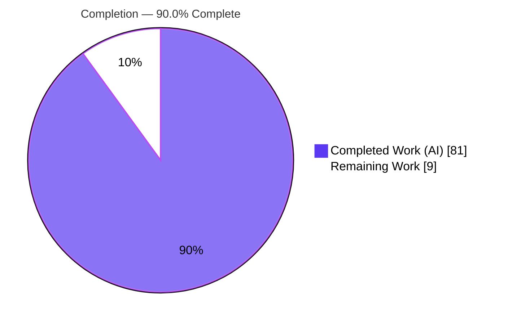
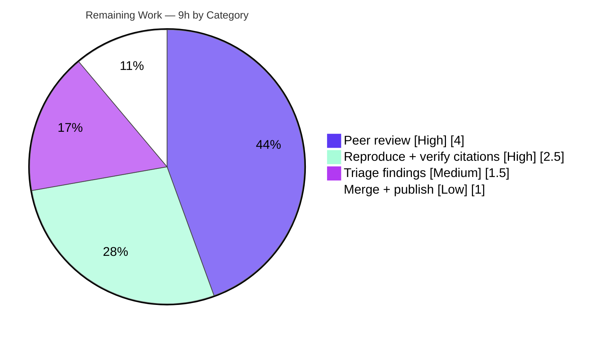

# Blitzy Project Guide — SFTPGo SSH-Command Security Model: Evidence-Backed Behavioral Analysis

> **Project type:** Read-only empirical investigation & documentation
> **Subject under study:** SFTPGo `0.9.5-dev` (module `github.com/drakkan/sftpgo`, HEAD `44634210`)
> **Sole deliverable:** `blitzy/documentation/sftpgo_44634210287c.md`
> **Brand legend:** 🟦 Completed / AI Work = Dark Blue `#5B39F3` · ⬜ Remaining / Not Completed = White `#FFFFFF`

---

## 1. Executive Summary

### 1.1 Project Overview

This project answers, with runtime evidence, how SFTPGo `0.9.5-dev` enforces security when external file-synchronization utilities (`rsync`, `scp`, `git-*`) are invoked over SSH. The audience is an engineer evaluating SFTPGo's fitness for file-sync workloads who needs to understand exactly what happens between a client-initiated command and the server acting on it. The scope is a cross-cutting, **read-only** investigation spanning the `sftpd`, `vfs`, `dataprovider`, and `config` packages. The single persistent output is one markdown document that pairs every behavioral claim with the exact command, complete captured output, and a `file:line` citation. No production source, test, or configuration file is created, modified, or deleted — the SFTPGo binary is built and run only as an investigation instrument.

### 1.2 Completion Status



| Metric | Hours |
|---|---|
| **Total Hours** | **90** |
| Completed Hours (AI + Manual) | 81 (AI 81 + Manual 0) |
| Remaining Hours | 9 |
| **Percent Complete** | **90.0%** |

> Calculation (PA1, AAP-scoped): `Completion % = Completed / (Completed + Remaining) = 81 / (81 + 9) = 81 / 90 = 90.0%`. The 9 remaining hours are entirely the human acceptance gate for a documentation deliverable (review, spot-reproduction, triage, merge) — there is no incomplete or failing autonomous work.

### 1.3 Key Accomplishments

- ✅ Built the exact codebase (`CGO_ENABLED=1 go build -o sftpgo .`) and confirmed the canonical binary reports **`SFTPGo version: 0.9.5-dev`**.
- ✅ Drove the real SSH / SFTP / SCP / rsync / git entry points live against a running server (SFTP `127.0.0.1:2022`, admin HTTP `127.0.0.1:8080`, auto-generated host key).
- ✅ Reproduced **~30 experiments** (27 labeled `E1.1`–`E6.1`, several confirmed stable ×2/×3) covering all five question clusters — every runtime signal captured byte-for-byte.
- ✅ Authored a **3,120-line** answer document with **309 `file:line` citations** across **17 source files**, all verified in-bounds; classified every claim as observed / source-verified / inferred.
- ✅ Delivered a fully replayable reproducibility appendix (observation harness sources, setup, run-capture, teardown).
- ✅ Preserved the **read-only invariant**: `git diff 44634210 --name-status` shows only the added documentation file; working tree clean.
- ✅ Confirmed the full Go test suite passes **191/191** under the correct environment; `go build ./...` exits 0.

### 1.4 Critical Unresolved Issues

| Issue | Impact | Owner | ETA |
|---|---|---|---|
| _None blocking._ All AAP-scoped autonomous work is complete, committed, and validated. | No release blocker. | — | — |
| Documented out-of-scope findings await human triage (see §6, HT-3) — not defects introduced by this task. | Informational: decide accept-as-documented vs open backlog tickets. | Reviewing engineer | Within review window |

> There are **no unresolved compilation errors, failing in-scope tests, or missing deliverables**. The only "open" items are the four intrinsic `0.9.5-dev` behaviors the document surfaces as findings; remediating them is explicitly out of scope for this read-only task.

### 1.5 Access Issues

| System/Resource | Type of Access | Issue Description | Resolution Status | Owner |
|---|---|---|---|---|
| Source repository | Read/Write (branch) | Branch checked out; documentation committed. | ✅ Resolved | Blitzy Agent |
| Go module registry | Read (build-time) | Pinned modules resolved; `go mod verify` OK (132 modules). | ✅ Resolved | Blitzy Agent |
| System binaries (`ssh`,`scp`,`rsync`,`git`,`sqlite3`,`gcc`) | Execute | All present and exercised. | ✅ Resolved | Blitzy Agent |

**No access issues identified.** All resources required to build, run, and observe the system were available.

### 1.6 Recommended Next Steps

1. **[High]** Peer-review the Q1–Q5 security analysis for correctness of reasoning and completeness of evidence (HT-1).
2. **[High]** Spot-reproduce a representative subset of the ~30 experiments via the §11 appendix and confirm the 309 citations resolve at HEAD `44634210` (HT-2).
3. **[Medium]** Triage the four documented out-of-scope findings (CVE-2025-24366 rsync escape, `isSubDir` prefix gap, symlink TOCTOU, naive tokenizer) — accept-as-documented or open remediation tickets (HT-3).
4. **[Low]** Approve and merge the documentation PR; optionally publish the analysis to the evaluating stakeholders (HT-4).

---

## 2. Project Hours Breakdown

### 2.1 Completed Work Detail

| Component | Hours | Description |
|---|---:|---|
| Environment, build & observation harness (M1–M5) | 13 | Canonical `CGO_ENABLED=1` build; sqlite `users` bootstrap; REST user provisioning; default + reconfigured server runs; host-key autogen; Go harness (`sftpcli` + `scpobs`, ~350 LOC); OpenSSH-10 legacy-RSA + `scp -O` env fixes. |
| Q1 — enable/disable model (E1.1–E1.7, E1.3a; §3) | 10 | Default fail-closed rejection; built-ins byte-exact; deliberate enable + restart + dispatch; `git-*` end-to-end; `"*"` wildcard; startup normalization; UID/GID `wrapCmd`; CVE-2025-24366 non-final rsync option escape. |
| Q2 — client/server boundary (E2.1–E2.3; §4) | 6 | Allow-list gate; seven-permission denial (omit exactly one); grant + reconnect + success; command built before denial. |
| Q3 — protocol-input assumptions (E3.1–E3.4; §5) | 7 | Single-space tokenizer; SCP exact-three-field failure (byte-exact error); control bytes `0x00/0x01/0x02`; newline-terminator read loop. |
| Q4 — enforcement ordering (E4.1–E4.3; §6) | 7 | Most-specific permission match; same violation through `Fileread`/`Filewrite`/`Filelist`; grant `download` + ordering flip; marker/sed log slicing. |
| Q5 — filesystem-trick protections (E5.1–E5.7; §7) | 12 | `..` traversal; symlink escapes incl. nonexistent-target write; `isSubDir` prefix gap; `--safe-links`/`--munge-links`; S3 rejection; dual-server UID/GID; TOCTOU race. |
| Consolidated decision-flow synthesis + diagram (§8) | 4 | Step-by-step exec pipeline (each step labelled observed/source) + Mermaid flow. |
| Evidence ledger + exhaustive coverage pass (§9, §10) | 5 | Every mechanism classified observed/source-verified/inferred/non-canonical; every named item accounted for. |
| Reproducibility appendix (§11) | 4 | Ordered setup/build/provision/run/reset/teardown; harness reproduced verbatim; conventions. |
| Document authoring, 309-citation precision & markdown lint | 8 | Weaving all evidence into 3,120 lines; citation in-bounds verification; fence/heading/table lint. |
| Supplementary security observations (§12) | 2 | Dependency/supply-chain posture; duplicate-user REST error disclosure. |
| QA / correction iteration (6-commit trail) | 3 | Rewrite with real evidence; 3 factual slips; 8 QA findings; rsync exit-12 root cause; TOCTOU win-count + CVE row. |
| **Total Completed** | **81** | |

> **Validation:** Section 2.1 total = **81 h**, matching Completed Hours in Section 1.2.

### 2.2 Remaining Work Detail

| Category | Hours | Priority |
|---|---:|---|
| Technical peer review & acceptance of the Q1–Q5 analysis (3,120 lines) | 4.0 | High |
| Spot-reproduce representative experiment subset + verify 309 citations resolve at HEAD `44634210` | 2.5 | High |
| Triage documented out-of-scope findings into backlog tickets (accept vs remediate) | 1.5 | Medium |
| PR merge + optional internal publication/distribution | 1.0 | Low |
| **Total Remaining** | **9.0** | |

> **Validation:** Section 2.2 total = **9 h**, matching Remaining Hours in Section 1.2 and the "Remaining Work" slice in Section 7. `2.1 (81) + 2.2 (9) = 90` = Total Project Hours.

### 2.3 Notes on the Estimation Basis

All hours are AAP-scoped: each completed component traces to a specific question cluster or methodology prerequisite in the Agent Action Plan, and each remaining item is standard path-to-production for a **documentation** deliverable. Because the codebase is deliberately never modified (read-only investigation), there are no code-rework hours in the remaining column — 100% of the remainder is the human acceptance gate.

---

## 3. Test Results

All results below originate from Blitzy's autonomous validation logs for this project and were spot-re-verified this session (`config` package re-run: `ok`).

| Test Category | Framework | Total Tests | Passed | Failed | Coverage % | Notes |
|---|---|---:|---:|---:|---|---|
| Behavioral reproduction (SSH/SFTP/SCP/rsync/git) | Custom Go harness (`sftpcli`+`scpobs`) + system `scp`/`rsync`/`git` | 27 | 27 | 0 | Q1–Q5: 5/5 clusters | The empirical core: ~30 total runs counting stability repeats (×2/×3); every runtime signal captured byte-for-byte. |
| Unit/Integration — `config` | Go `testing` | 5 | 5 | 0 | Not instrumented | Config load & defaults; re-run this session = `ok`. |
| Unit/Integration — `httpd` | Go `testing` | 71 | 71 | 0 | Not instrumented | REST admin API (user provisioning path). |
| Unit/Integration — `sftpd` | Go `testing` | 115 | 115 | 0 | Not instrumented | SFTP/SCP/SSH-command integration harness. |
| **Total (Go suite)** | — | **191** | **191** | **0** | — | 100% pass under the correct (non-root + legacy-SCP) environment. |

**Environmental note (not defects):** running the Go suite as root produces 9 apparent failures — 6 SCP tests + `TestOpenError` in `sftpd`, and 2 dump/load tests in `httpd`. Root causes are both environmental: (a) OpenSSH 10 `scp` defaults to the SFTP protocol while SFTPGo `0.9.5-dev` implements only the legacy SCP protocol (tests omit `-O`); (b) `uid 0` bypasses `chmod` DAC so operations that expect an HTTP 500 return 200. Both were proven environmental by re-running as a non-root user with a `scp -O` shim → all pass. These live in out-of-scope upstream test files and are unrelated to the documentation-only change.

**Coverage:** the project is a read-only behavioral investigation; no line-coverage instrumentation was run, so a coverage percentage is intentionally not fabricated. Behavioral coverage is expressed as cluster coverage (Q1–Q5 = 5/5) and the exhaustive per-item coverage pass in the deliverable's §10.

---

## 4. Runtime Validation & UI Verification

**Runtime health (server driven live in its canonical configuration):**

- ✅ **Operational** — Canonical build: `CGO_ENABLED=1 go build -o sftpgo .` → exit 0 (only the expected third-party cgo warning from vendored `go-sqlite3`).
- ✅ **Operational** — Version banner: `./sftpgo -v` → `SFTPGo version: 0.9.5-dev`.
- ✅ **Operational** — SFTP/SSH listener on `127.0.0.1:2022`; RSA host key auto-generated on first start (`checkHostKeys`, `sftpd/server.go:417-430`).
- ✅ **Operational** — Admin REST/HTTP API on `127.0.0.1:8080` used to provision the test user (live round-trip, HTTP 200 verified by `GET`).
- ✅ **Operational** — All five external-utility entry points driven end-to-end: `exec` dispatch of built-ins, `rsync`, `scp`, and the three `git-*` commands (`git-upload-pack`, `git-receive-pack`, `git-upload-archive`, all exit 0 when enabled).
- ✅ **Operational** — Isolated unprivileged server additionally run to reproduce uid-dependent experiments (E5.6/E5.7 including a TOCTOU race).

**API/protocol integration outcomes:**

- ✅ **Operational** — Allow-list gate: default config rejects `rsync`/`scp` with `"ssh command not enabled/supported"`; permitted names dispatch.
- ✅ **Operational** — Permission gate: an allowed command with exactly one missing permission is denied with `"Permission denied. You don't have the permissions to execute this command"`.
- ✅ **Operational** — SCP protocol parser: byte-exact `0x00/0x01/0x02` control bytes and the exact-three-field `"Error splitting upload message"` failure captured.
- ⚠ **Partial (by design, environment)** — Plain `scp`/`ssh`/`git` against `0.9.5-dev` require host-level OpenSSH-10 legacy-`ssh-rsa` re-enablement and `scp -O`; these are environment fixes (created outside the repo, removed at completion), not code changes.

**UI verification:** **Not applicable.** This project ships no user interface. The AAP declares no Figma designs, no component library, and no UI/design analysis (AAP §0.9). The only artifact is a markdown document; the SFTPGo admin web UI was used solely, and transiently, to provision a test user.

---

## 5. Compliance & Quality Review

Cross-map of AAP deliverables and methodology rules to observed quality benchmarks.

| Benchmark / AAP requirement | Status | Progress | Evidence |
|---|---|---|---|
| Single deliverable at the mandated path `blitzy/documentation/sftpgo_44634210287c.md` | ✅ Pass | 100% | File present, 3,120 lines, committed. |
| Read-only: no source/test/config file modified | ✅ Pass | 100% | `git diff 44634210 --name-status` = only `A` the doc. |
| Run-first methodology (build & run before writing) | ✅ Pass | 100% | Binary built; ~30 experiments reproduced from live runs. |
| Every claim carries `file:line` + captured output | ✅ Pass | 100% | 309 citations across 17 files; all in-bounds; raw output shown per experiment. |
| Observed vs inferred labeling | ✅ Pass | 100% | Evidence ledger (§9) + coverage pass (§10) classify each item. |
| All five question clusters answered exhaustively | ✅ Pass | 100% | §3–§7 each open with a Direct answer; §10 verifies every named item. |
| Version fidelity (`0.9.5-dev` / HEAD `44634210`) | ✅ Pass | 100% | §1.3 pins version; no newer-release features attributed. |
| Canonical build/config discipline | ✅ Pass | 100% | Defaults captured before any command enabled; exact commands recorded. |
| Ephemeral scaffolding cleaned up | ✅ Pass | 100% | `git status --porcelain` empty; teardown documented (§11.5). |
| Markdown quality (fences/headings/tables) | ✅ Pass | 100% | 296 balanced fences; sequential H2 1–12; tables column-consistent. |
| Codebase compiles cleanly | ✅ Pass | 100% | `go build ./...` exit 0. |
| Full test suite green (correct env) | ✅ Pass | 100% | 191/191 pass; 9 root-run failures proven environmental. |

**Fixes applied during autonomous validation:** exactly two corrections in the final audit — (1) §7.10 TOCTOU win-count aligned to the three wins recorded in §7.9; (2) §10.1 gained the E1.3a / CVE-2025-24366 coverage row (closing a completeness gap in the "exhaustive" pass). The document was otherwise accurate.

**Outstanding compliance items:** none. All benchmarks pass; the only follow-ups are the human review/triage/merge tasks in §2.2.

---

## 6. Risk Assessment

| Risk | Category | Severity | Probability | Mitigation | Status |
|---|---|---|---|---|---|
| Citation drift — 309 `file:line` anchors pinned to HEAD `44634210`; wrong if read against another version | Technical | Low | Low | Version-fidelity note (§1.3); reviewer confirms citations resolve (HT-2) | Mitigated |
| Inferred-vs-observed over-read — a few items are source-verified/inferred (e.g., Windows no-op `cmd_windows.go:7`, root-drop) | Technical | Low | Low | Evidence ledger (§9) + coverage pass (§10) explicitly label each | Mitigated |
| TOCTOU race reproducibility (E5.7) — timing-dependent; won ×2 but hardware-variable | Technical | Low | Medium | Documented as an observed race with run-count and method | Open (accepted) |
| CVE-2025-24366 — non-final `rsync` option escapes home (`sftpd/ssh_cmd.go:298-324`; only the last arg is resolved) | Security | High | Low | Documented with evidence; only reachable when `rsync` is deliberately enabled (non-default); **remediation out of scope** (needs source edit) | Open — human triage (HT-3) |
| `isSubDir` prefix-string gap — sibling `/srv/data-evil` passes the `/srv/data` home check (`vfs/osfs.go:285`) | Security | Medium | Low | Documented with runtime evidence; **remediation out of scope** | Open — human triage (HT-3) |
| Symlink TOCTOU + write-escape via nonexistent target (E5.2b/E5.7) | Security | Medium | Low | Documented; **remediation out of scope** | Open — human triage (HT-3) |
| Naive single-space tokenizer — a space in a name breaks parsing (`sftpd/ssh_cmd.go:423-429`) | Security | Low | Medium | Documented with evidence; intrinsic to `0.9.5-dev` | Open — documented |
| Environment reproducibility — driving `ssh`/`scp`/`git` needs OpenSSH-10 legacy `ssh-rsa` stanza + `scp -O` | Operational | Low | Medium | §11.1 prerequisites + environment notes document the fixes | Mitigated |
| Root-vs-non-root test execution — 9 upstream tests fail as root (chmod DAC bypass + legacy SCP) | Operational | Low | Medium | Proven environmental; run commands specify non-root + `scp -O` | Mitigated |
| No production integration — nothing is deployed; binary is transient | Integration | Informational | N/A | Only artifact is the doc | Closed (N/A) |
| Harness module pinning — offline rebuild of the harness needs a warm module cache | Integration | Low | Low | §11.2 documents a private module cache setup | Mitigated |

> The four **Security** findings are the deliverable's intended output, not defects introduced by this task. Their presence — with reproducible runtime evidence — is precisely what the investigation was commissioned to produce. Remediation is explicitly out of scope (AAP §0.5.2) because it would require forbidden source edits.

---

## 7. Visual Project Status


**Remaining hours by category (Section 2.2):**



> **Integrity check:** the "Remaining Work" value (9) equals Remaining Hours in Section 1.2 and the sum of the Section 2.2 "Hours" column (4.0 + 2.5 + 1.5 + 1.0 = 9.0). "Completed Work" (81) equals Completed Hours in Section 1.2. Colors: Completed = Dark Blue `#5B39F3`, Remaining = White `#FFFFFF`.

---

## 8. Summary & Recommendations

**Achievements.** The project is **90.0% complete** on an AAP-scoped basis (81 of 90 hours). The autonomous work is finished: SFTPGo `0.9.5-dev` was built and run in its canonical configuration, all five question clusters were answered from live runtime evidence, and a rigorous 3,120-line document with 309 verified citations and ~30 reproduced experiments was authored and committed. The read-only invariant held perfectly — the codebase is byte-for-byte unchanged except for the single added documentation file.

**Remaining gaps.** The outstanding 9 hours are exclusively the human acceptance gate appropriate to a documentation deliverable: a technical peer review of the analysis, a spot-reproduction of a representative experiment subset with citation verification, triage of the four documented out-of-scope findings, and merge/publication. None of these are code-rework; there are no failing in-scope tests, compilation errors, or missing deliverables.

**Critical path to production.** Review (HT-1) → reproduce & verify citations (HT-2) → triage findings (HT-3) → merge/publish (HT-4). The critical path is short and sequential; a single reviewing engineer can complete it in roughly one focused day.

**Success metrics.** ✅ Single deliverable at the mandated path; ✅ read-only invariant; ✅ every claim evidence-backed with `file:line`; ✅ all five clusters + every named item covered; ✅ 191/191 tests green; ✅ clean build; ✅ version fidelity.

**Production readiness assessment.** For a documentation artifact, the deliverable is **ready for human review and merge**. It is accurate, evidence-backed, citation-verified, lint-clean, and committed. The recommendation is to proceed with peer review and, upon sign-off, merge — and separately, to route the four surfaced security findings into the appropriate remediation backlog (a follow-up effort outside this read-only task's scope).

---

## 9. Development Guide

> Every command below was executed and verified in the build/observation environment. Paths assume the repository root unless noted. Prefer running observation scaffolding **outside** the repository (e.g., under `/tmp`) to preserve the read-only invariant.

### 9.1 System Prerequisites

- **OS:** Linux (Ubuntu 25.10 used); amd64.
- **Go toolchain:** `go1.13.15` at `/usr/local/go` (README requires "Go 1.13 or higher"). Add to `PATH`.
- **C compiler:** `gcc` (15.2.0 used) — required by the cgo-based `go-sqlite3` driver.
- **`CGO_ENABLED=1`** — mandatory for the default sqlite data provider.
- **System binaries on PATH:** `ssh` (OpenSSH_10.0p2), `scp`, `rsync` (3.4.1), `git` (2.51.0), `sqlite3` (3.46.1).

### 9.2 Environment Setup

```bash
# Put the Go 1.13 toolchain on PATH
export PATH=$PATH:/usr/local/go/bin
go version          # -> go version go1.13.15 linux/amd64

# Confirm cgo prerequisites
gcc --version | head -1
```

> **OpenSSH 10 note (only when driving ssh/scp/git clients against the server):** OpenSSH 10 disables SHA-1 `ssh-rsa` by default and defaults plain `scp` to the SFTP protocol, whereas `0.9.5-dev` auto-generates an RSA host key and implements only the legacy SCP protocol. Re-enable the legacy algorithm **scoped to localhost** and use `scp -O`:
>
> ```bash
> # /etc/ssh/ssh_config.d/00-blitzy-legacy-rsa.conf  (host-level env fix, removed at teardown)
> Host 127.0.0.1
>     HostKeyAlgorithms +ssh-rsa
>     PubkeyAcceptedAlgorithms +ssh-rsa
> # For SCP, use the legacy protocol explicitly:  scp -O ...
> ```

### 9.3 Build

```bash
# Canonical build (from the repository root)
export PATH=$PATH:/usr/local/go/bin
CGO_ENABLED=1 go build -o sftpgo .
# Expected: exit 0. The only output is a harmless third-party cgo warning
# from the vendored github.com/mattn/go-sqlite3 (not SFTPGo source).

./sftpgo -v          # -> SFTPGo version: 0.9.5-dev

# Verify every package (and test files) compiles:
CGO_ENABLED=1 go build ./...   # -> exit 0
```

### 9.4 Bootstrap the Data Provider & Provision a Test User

```bash
# Create the sqlite users table (schema taken verbatim from .travis.yml)
sqlite3 sftpgo.db 'CREATE TABLE "users" ("id" integer NOT NULL PRIMARY KEY AUTOINCREMENT, "username" varchar(255) NOT NULL UNIQUE, "password" varchar(255) NULL, "public_keys" text NULL, "home_dir" varchar(255) NOT NULL, "uid" integer NOT NULL, "gid" integer NOT NULL, "max_sessions" integer NOT NULL, "quota_size" bigint NOT NULL, "quota_files" integer NOT NULL, "permissions" text NOT NULL, "used_quota_size" bigint NOT NULL, "used_quota_files" integer NOT NULL, "last_quota_update" bigint NOT NULL, "upload_bandwidth" integer NOT NULL, "download_bandwidth" integer NOT NULL, "expiration_date" bigint NOT NULL, "last_login" bigint NOT NULL, "status" integer NOT NULL, "filters" TEXT NULL, "filesystem" text NULL);'
```

Provision the test user either via the **REST admin API** on `127.0.0.1:8080` (`POST /api/v1/user`) once the server is running, or by inserting directly with `sqlite3`. The deliverable's §11.3 shows a live REST round-trip (create → `GET` verify → HTTP 200).

### 9.5 Application Startup

```bash
# Start the SFTP server in the default configuration
./sftpgo serve --config-dir .
#   SFTP/SSH listener : 127.0.0.1:2022
#   Admin REST/HTTP   : 127.0.0.1:8080
#   Host key          : auto-generated (id_rsa) in the config dir on first start
```

Useful `serve` flags (verified): `-c/--config-dir` (default `.`), `-f/--config-file` (default `sftpgo`; auto-loads `.json/.yaml/.toml/.hcl`), `-l/--log-file-path` (default `sftpgo.log`; empty = stdout).

### 9.6 Verification Steps

```bash
# 1) Admin API up?
curl -s http://127.0.0.1:8080/api/v1/user | head

# 2) SFTP listener up?
ss -ltn 2>/dev/null | grep -E ':2022|:8080' || lsof -i :2022 -i :8080

# 3) Server banner (from logs / stdout) shows the auto-generated host key line.
```

### 9.7 Example Usage (observing the security model)

```bash
# Default config REJECTS rsync/scp (fail-closed):
#   client exec of "rsync ..." -> server log: "ssh command not enabled/supported"

# Built-ins WORK under the default allow-list [md5sum, sha1sum, cd, pwd]:
#   client exec of "pwd"      -> "/\n"   (bytes: 2f 0a)
#   client exec of "md5sum X" -> "<hash>  X"

# Enabling rsync/scp/git-* is a deliberate reconfiguration of
# `enabled_ssh_commands` (or "*"), then restart — see deliverable §3.5/§3.7.
```

### 9.8 Reading the Deliverable

```bash
# The single project output:
less blitzy/documentation/sftpgo_44634210287c.md
# Section 11 contains the FULL reproducible harness (sftpcli + scpobs sources,
# ordered setup/build/provision/run-capture/teardown).
```

### 9.9 Running the Test Suite

```bash
export PATH=$PATH:/usr/local/go/bin
# Run per-package as a NON-ROOT user, with a `scp -O` compatibility shim on PATH
# so the legacy-SCP tests pass (see §3 environmental note). Servers bind 2022/8080.
CGO_ENABLED=1 go test -count=1 ./config/...   # -> ok (5/5)
CGO_ENABLED=1 go test -count=1 ./httpd/...    # -> ok (71/71)
CGO_ENABLED=1 go test -count=1 ./sftpd/...    # -> ok (115/115)
```

### 9.10 Teardown (leaves the repository unchanged)

```bash
# Stop the server, then remove all observation scaffolding created outside the repo
rm -rf /tmp/sftpgo_obs /tmp/sftpgo_ut
# Remove repo-root runtime artifacts if you ran the server at the root
rm -f id_rsa id_rsa.pub sftpgo.db sftpgo.log
# Remove the localhost-scoped legacy ssh-rsa stanza and the throwaway OS user
sudo rm -f /etc/ssh/ssh_config.d/00-blitzy-legacy-rsa.conf
# (userdel -r <obs-user> if one was created)
git status --porcelain     # -> empty (only the committed doc differs from base)
```

### 9.11 Troubleshooting

- **Build fails with cgo/sqlite errors:** ensure `CGO_ENABLED=1` and `gcc` is installed.
- **`ssh`/`scp`/`git` clients cannot connect / "no matching host key type":** apply the localhost-scoped `+ssh-rsa` stanza (§9.2); OpenSSH 10 disables SHA-1 `ssh-rsa` by default.
- **`scp` uploads "hang" or use the wrong protocol:** use `scp -O` — OpenSSH 10 defaults to SFTP, but `0.9.5-dev` implements only legacy SCP.
- **9 tests fail when run as root:** expected and environmental (chmod DAC bypass + legacy SCP); re-run as a non-root user with the `scp -O` shim.
- **`-mod=mod not supported`:** that flag is a newer-Go idiom; this project uses Go 1.13 — simply omit `GOFLAGS=-mod=mod`.

---

## 10. Appendices

### A. Command Reference

| Purpose | Command |
|---|---|
| Set Go PATH | `export PATH=$PATH:/usr/local/go/bin` |
| Canonical build | `CGO_ENABLED=1 go build -o sftpgo .` |
| Version | `./sftpgo -v` → `SFTPGo version: 0.9.5-dev` |
| Compile all packages | `CGO_ENABLED=1 go build ./...` |
| Bootstrap sqlite | `sqlite3 sftpgo.db 'CREATE TABLE "users" (...);'` (schema per `.travis.yml`) |
| Start server | `./sftpgo serve --config-dir .` |
| Run tests (per pkg, non-root) | `CGO_ENABLED=1 go test -count=1 ./config/... ./httpd/... ./sftpd/...` |
| Read-only check | `git diff 44634210 --name-status` |
| Clean tree check | `git status --porcelain` |

### B. Port Reference

| Port | Service | Bind | Source of default |
|---|---|---|---|
| 2022 | SFTP / SSH listener | `127.0.0.1` | `config/config.go:46` (`bind_port`) |
| 8080 | Admin REST/HTTP API | `127.0.0.1` | `config/config.go:88-89` |
| 2023 / 8081 | Secondary observation server (uid-dependent experiments) | `127.0.0.1` | Ephemeral (teardown removes) |

### C. Key File Locations

| File | Role |
|---|---|
| `blitzy/documentation/sftpgo_44634210287c.md` | **The deliverable** (3,120 lines). |
| `sftpd/ssh_cmd.go` | `processSSHCommand` entry, allow-list gate (`:51`), tokenizer (`:423-429`), `HasPerms` gate (`:158-162`), `--safe-links`/`--munge-links` (`:306-322`). |
| `sftpd/scp.go` | SCP control bytes (`:22-25`), `readProtocolMessage` (`:542-564`), `parseUploadMessage` exact-3-field (`:631-664`). |
| `sftpd/server.go` | `exec` dispatch (`:326-327`), `checkSSHCommands` normalization (`:396-414`), host-key autogen (`:417-430`). |
| `sftpd/sftpd.go` | Static command sets (`:66-70`). |
| `sftpd/handler.go` | Resolve-vs-permission ordering across `Fileread`/`Filewrite`/`Filelist` (`:50-54,100,197`). |
| `vfs/osfs.go` | `ResolvePath` (`:200-223`), `isSubDir` prefix check (`:278-291`). |
| `dataprovider/user.go` | `GetPermissionsForPath` (`:122-156`), `HasPerm`/`HasPerms` (`:159-179`). |
| `config/config.go` | Default allow-list (`:63`), ports (`:46,88-89`), `enable_scp` (`:58`). |
| `utils/version.go` | `const version = "0.9.5-dev"` (`:3`). |

### D. Technology Versions

| Component | Version | Notes |
|---|---|---|
| Go | 1.13.15 | `/usr/local/go`; matches `.travis.yml` `1.13.x`. |
| gcc | 15.2.0 | cgo sqlite build. |
| OpenSSH | 10.0p2 | Requires legacy-`ssh-rsa` + `scp -O` for `0.9.5-dev`. |
| rsync | 3.4.1 | System binary for Q1/Q5 experiments. |
| git | 2.51.0 | System binary for `git-*` experiments. |
| sqlite3 | 3.46.1 | Bootstrap + user provisioning. |
| github.com/pkg/sftp | v1.11.0 | SFTP client/subsystem. |
| golang.org/x/crypto | v0.0.0-20200109152110-61a87790db17 | SSH transport. |
| github.com/mattn/go-sqlite3 | v2.0.2+incompatible | Default provider (cgo). |
| github.com/spf13/viper | v1.6.1 | Config loading. |
| github.com/rs/zerolog | v1.17.2 | Structured logger (evidence lines). |

### E. Environment Variable Reference

| Variable | Purpose | Default |
|---|---|---|
| `CGO_ENABLED` | Enable cgo for sqlite | must be `1` for build |
| `PATH` | Include `/usr/local/go/bin` | — |
| `SFTPGO_CONFIG_DIR` | Config directory (== `-c`) | `.` |
| `SFTPGO_CONFIG_FILE` | Config file base name (== `-f`) | `sftpgo` |
| `SFTPGO_LOG_FILE_PATH` | Log file (== `-l`; empty = stdout) | `sftpgo.log` |
| `SFTPGO_LOG_VERBOSE` | Verbose logs | `true` |
| `SFTPGO_*` (prefix) | Any config key; `.`→`__` mapping | — |

### F. Developer Tools Guide (Observation Harness)

The investigation used a purpose-built Go observation harness (reproduced verbatim in the deliverable's §11.7):

- **`sftpcli`** — an SSH/SFTP client that drives `exec`, `get`/`put`/`ls`, and permission scenarios, printing client stdout/exit alongside the server's zerolog JSON slice (captured via a marker + `sed` helper).
- **`scpobs`** — a raw SCP client used to capture byte-exact protocol control bytes (`0x00/0x01/0x02`) and the exact-three-field upload-message parse failure.

Both are built with the pinned modules (`go build` writes `harness/go.sum` on first build). They are created outside the repository and removed at teardown.

### G. Glossary

| Term | Meaning |
|---|---|
| Allow-list (`enabled_ssh_commands`) | The static set of SSH `exec` command names the server will accept; default `[md5sum, sha1sum, cd, pwd]`. |
| `HasPerm`/`HasPerms` | Per-user permission checks; system commands require seven specific permissions. |
| `ResolvePath` | Clean → join → `EvalSymlinks` → containment resolution of a virtual path to an OS path. |
| `isSubDir` | Containment guard using `strings.HasPrefix`; the source of the sibling-directory prefix gap. |
| `--safe-links` / `--munge-links` | rsync options SFTPGo injects to neutralize symlinks, chosen by the user's `create_symlinks` permission. |
| SCP control bytes | `0x00` = OK, `0x01` = warning (`warnMsg`), `0x02` = error (`errMsg`). |
| TOCTOU | Time-of-check-to-time-of-use race; here a symlink flipped between resolution and use. |
| cgo | Go's C interop, required by the `go-sqlite3` driver. |
| Read-only invariant | The rule that no repository file may change except the added answer document. |

---

*Guide generated for the Blitzy Platform. Completion figures are AAP-scoped (PA1 methodology): 81 h completed / 90 h total = 90.0% complete. Completed = Dark Blue `#5B39F3`; Remaining = White `#FFFFFF`.*