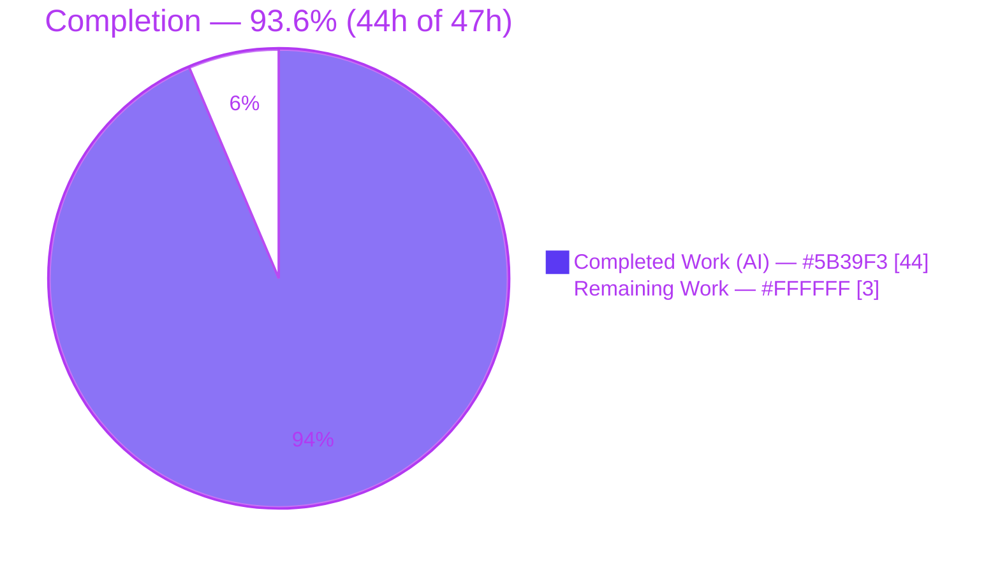
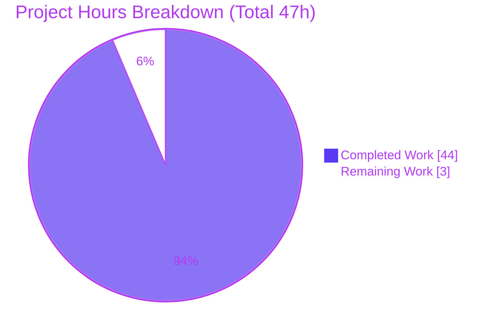
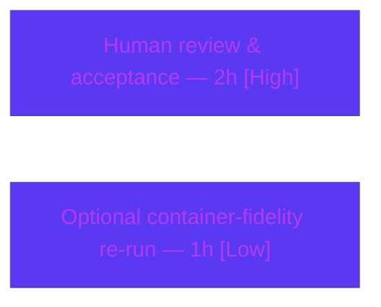

# Blitzy Project Guide — SFTPGo Clean-Start & Reverse-Proxy Behavior Investigation

> **Brand color legend:** <span style="color:#5B39F3">■</span> **Completed / AI Work = Dark Blue `#5B39F3`** &nbsp;|&nbsp; <span style="color:#FFFFFF;background:#333;padding:0 4px">■</span> **Remaining / Not Completed = White `#FFFFFF`** &nbsp;|&nbsp; <span style="color:#B23AF2">■</span> Headings/Accents = Violet-Black `#B23AF2` &nbsp;|&nbsp; <span style="color:#A8FDD9;background:#333;padding:0 4px">■</span> Highlight = Mint `#A8FDD9`

---

## 1. Executive Summary

### 1.1 Project Overview

This project is a **read-only investigative Q&A deliverable**: a single Markdown report that explains, with runtime-observed evidence, how the SFTPGo checkout (`v0.9.5-dev`, HEAD `44634210`) behaves on a clean/first start and how it treats reverse-proxy client-address/scheme headers behind a TLS-terminating proxy. The target user is an operator preparing to run SFTPGo behind such a proxy who observed behavior "shifting between runs." The report settles a concrete disagreement (does a temporary `-c` config directory fully isolate the process?), documents the first-start failure matrix and exit codes, and details proxy-header (`Forwarded`, `X-Forwarded-For`, `X-Real-IP`) and `sftpgo_http` metric semantics — all grounded in `file:line` citations. No source code was changed.

### 1.2 Completion Status



| Metric | Value |
|---|---|
| **Total Hours** | **47** |
| **Completed Hours (AI + Manual)** | **44** (AI-autonomous: 44; Manual: 0) |
| **Remaining Hours** | **3** |
| **Percent Complete** | **93.6%** |

> Completion % is computed via the AAP-scoped hours methodology: `Completed / (Completed + Remaining) = 44 / 47 = 93.6%`. All 17 AAP content + compliance requirements are fully delivered; the remaining 3h is path-to-production for a documentation deliverable (human review/acceptance + one optional environment-fidelity re-run).

### 1.3 Key Accomplishments

- ✅ **Sole deliverable created, committed, and validated** — `blitzy/documentation/sftpgo_44634210287c.md` (540 lines / 65,398 bytes) at HEAD `fb3dacf2`.
- ✅ **Read-only invariant held** — zero source files modified; `git status --porcelain` empty (verified repeatedly, including `--untracked-files=all`).
- ✅ **Canonical build proven** — `CGO_ENABLED=1 go build` (rc=0) and `CGO_ENABLED=0` (rc=0); `--version` → `SFTPGo version: 0.9.5-dev` (byte-identical, no `-ldflags`).
- ✅ **Teammate disagreement settled with evidence** — same empty `-c` dir; CWD alone flips `TrackQuota` 1→2 (viper searches the CWD `[config/config.go:L147-151]`).
- ✅ **Full first-start matrix reproduced** — SQLite missing/empty (exit 0), usable CGO=1 (live), SFTP port conflict (exit 0), template panic (exit 2), static 404s.
- ✅ **Proxy-header matrix + precedence** — `X-Forwarded-For` (first IP) > `X-Real-IP`; `Forwarded` ignored; scheme always `http`; plus a security/trust-boundary analysis.
- ✅ **`sftpgo_http` counter experiment** — identical deltas with/without forwarded headers (status-keyed only).
- ✅ **Evidence discipline** — 144 `file:line` citations; only `time`/`request_id` redacted (24 sentinels); every named endpoint/header/counter covered by name.
- ✅ **Independently re-verified this session** — builds, banner, endpoint smoke test, and proxy probes all reproduced the documented behavior exactly.

### 1.4 Critical Unresolved Issues

| Issue | Impact | Owner | ETA |
|---|---|---|---|
| _None — no blocking issues._ The deliverable is complete, accurate, and committed; all runtime scenarios reproduced with zero discrepancies. | N/A | N/A | N/A |
| (Advisory, not a deliverable defect) Product-level: chi `RealIP` trusts `X-Forwarded-For`/`X-Real-IP` unconditionally → logged address is client-spoofable. Documented in report §7; out of scope to fix under read-only mandate. | Affects the user's production proxy hardening, not this report | Human (ops) | Per user's deployment |

### 1.5 Access Issues

**No access issues identified.**

| System/Resource | Type of Access | Issue Description | Resolution Status | Owner |
|---|---|---|---|---|
| Repository checkout | Read/Write (git) | Accessible; branch `blitzy-3ce0fbe5-…`; deliverable committed at HEAD `fb3dacf2` | ✅ No issue | — |
| Build toolchain (Go 1.13.15, gcc 15.2.0, sqlite3 3.46.1) | Local | Present and functional; matches `go.mod` `go 1.13` | ✅ No issue | — |
| Named container image (`andrewparkscaleai/…`) | Container runtime | Differs from observation host (Alpine, Go 1.19.13, no `sqlite3` CLI) — an environment-provenance note, already reconciled in the report; **not** an access blocker | ✅ Reconciled | — |

### 1.6 Recommended Next Steps

1. **[High]** Review `blitzy/documentation/sftpgo_44634210287c.md` for correctness/completeness against the original multi-part question and **accept/sign off** (~2h).
2. **[High]** Apply the report's production guidance to your proxy: **strip inbound `X-Forwarded-For`/`X-Real-IP` at the trusted proxy and block direct network access** to SFTPGo (report §7).
3. **[Medium]** For a genuine clean first start with the default SQLite provider, **pre-create & initialize the DB** (SQLite never self-creates) or switch to the Bolt provider; build with `CGO_ENABLED=1` + gcc.
4. **[Low]** (Optional) Re-run the SQLite "usable" case inside the exact named container image if strict environment parity is required (~1h; needs Go 1.13 + `sqlite3` provisioned in that Alpine image).

---

## 2. Project Hours Breakdown

### 2.1 Completed Work Detail

Each component traces to AAP-scoped investigation, authoring, remediation, or validation. **Total = 44h** (matches Completed Hours in §1.2).

| Component | Hours | Description |
|---|---:|---|
| Build, toolchain & version-banner verification | 3 | Canonical `CGO_ENABLED=1` build (rc=0) + `CGO_ENABLED=0` contrast (rc=0); byte-identical `SFTPGo version: 0.9.5-dev` (AAP R1/R16) |
| Working-directory vs. `-c` config-dir contrast | 2 | Reproduced `TrackQuota` 1→2 flip from CWD alone; settles the isolation disagreement (AAP R2) |
| SQLite first-start triad incl. live CGO=1 usable path | 5 | Missing (exit 0), empty/0-byte (exit 0), usable live under CGO=1 (availability 1) + CGO=0 stub contrast; travis-schema DB (AAP R3) |
| SFTP port-conflict + host-key side effect | 2 | `bind: address already in use` warn + service error, exit 0; `id_rsa` (4096-bit, 0600) creation (AAP R4) |
| Web-UI-assets-missing behavior | 2 | `template.Must` panic → exit 2; missing static files → request-time 404s (AAP R5) |
| Endpoint response snippets | 2 | `curl -D -` for `/`, `/web`, `/metrics`, and two missing-path flavors (AAP R6) |
| Proxy-header address/scheme matrix + security analysis | 4 | 6-combination matrix; XFF>X-Real-IP precedence; `Forwarded` ignored; scheme always `http`; trust-boundary analysis (AAP R7) |
| `sftpgo_http` counter-movement experiment | 3 | S0/S1/S2 scrapes; identical `+3/+1/+4/+0` deltas; preceding-scrape-timing analysis (AAP R8) |
| Source review + 144 `file:line` citations + coverage pass | 5 | Read ~21 REFERENCE files incl. chi `realip.go`; coverage-pass table maps every named item → result + citation (AAP R9/R15) |
| Answer-document authoring & structure | 5 | 540-line / 65 KB report: intro, TL;DR, environment, 9 sections; redaction discipline (AAP R14) |
| Code-review remediation (commit `1887d48e`) | 3 | Addressed code-review findings in the report |
| Environment-provenance correction (commit `fb3dacf2`) | 3 | Docker-inspected the named container; corrected host-vs-container provenance (AAP R12) |
| Final autonomous validation | 5 | Independently reproduced all 13 runtime-scenario categories; verified citations, redaction, provenance, and read-only invariant |
| **Total** | **44** | |

### 2.2 Remaining Work Detail

**Total = 3h** (matches Remaining Hours in §1.2 and §7 pie chart).

| Category | Hours | Priority |
|---|---:|---|
| Human review & acceptance of the answer document (read, verify vs. original question, sign off) | 2 | High |
| Optional strict container-fidelity re-run of the SQLite "usable" case in the named image | 1 | Low |
| **Total** | **3** | |

> **Advisory follow-ups** derived from the report's findings (proxy hardening, do-not-trust-logged-address, DB pre-initialization, viper-CWD caveat) are the **user's production actions**, not remaining work on this deliverable, and therefore carry **zero** project hours. They are listed in §1.6 and §8.

### 2.3 Basis of Estimate

Hours are AAP-scoped only: every completed hour maps to a specific AAP requirement (§2.1 columns cite R1–R17) or to autonomous validation; every remaining hour is genuine path-to-production for a documentation deliverable. Estimates are rounded to whole hours for reporting. Confidence is **High** — the deliverable is complete, committed, and independently re-verified this session with zero discrepancies. `Completed (44) + Remaining (3) = Total (47)`; `44 / 47 = 93.6%`.

---

## 3. Test Results

For this **read-only documentation** task, the mandated validation methodology (AAP Rule 1: *run-first, evidence from the real `serve` entry point*) is **runtime-scenario reproduction**, not source unit tests. The repository's Go unit suite (`go test ./...`) is intentionally **out of scope** because running it would create/modify state in the source tree, violating the read-only MainRule. The table below aggregates the **13 runtime-scenario categories** executed by Blitzy's autonomous validation for this project; a subset was independently re-executed this session (build, banner, endpoint smoke, proxy probes) with identical results.

| Test Category | Framework | Total | Passed | Failed | Coverage % | Notes |
|---|---|---:|---:|---:|---:|---|
| Compilation — CGO=1 (canonical) | `go build` | 1 | 1 | 0 | 100% | rc=0; only the known upstream go-sqlite3 C warning |
| Compilation — CGO=0 (contrast) | `go build` | 1 | 1 | 0 | 100% | rc=0; SQLite driver = stub |
| Version banner | `sftpgo --version` | 1 | 1 | 0 | 100% | `SFTPGo version: 0.9.5-dev` (both builds) |
| Working-dir sensitivity | `sftpgo serve` | 1 | 1 | 0 | 100% | `TrackQuota` 1→2 by CWD alone |
| SQLite missing DB | `sftpgo serve` | 1 | 1 | 0 | 100% | sqlite warn + stat error; exit 0; DB not created |
| SQLite empty (0-byte) DB | `sftpgo serve` | 1 | 1 | 0 | 100% | "invalid" error; no sqlite warn; exit 0 |
| SQLite usable — CGO=1 (canonical, live) | `sftpgo serve` | 1 | 1 | 0 | 100% | availability 1; `/`→301, `/metrics`→200; stays alive |
| SQLite usable — CGO=0 (stub) | `sftpgo serve` | 1 | 1 | 0 | 100% | availability 0; "requires cgo…stub" warn |
| SFTP port conflict | `sftpgo serve` | 1 | 1 | 0 | 100% | `bind: address already in use`; exit 0; `id_rsa` created |
| Missing templates | `sftpgo serve` | 1 | 1 | 0 | 100% | `template.Must` panic; exit 2 |
| Endpoint responses | `curl -D -` | 1 | 1 | 0 | 100% | `/`,`/web`→301; `/metrics`→200; two 404 flavors |
| Proxy-header matrix | `curl` + access log | 1 | 1 | 0 | 100% | 6 rows; XFF>X-Real-IP; Forwarded ignored; scheme http |
| `sftpgo_http` counter movement | `/metrics` scrapes | 1 | 1 | 0 | 100% | identical `+3/+1/+4/+0` deltas both phases |
| **Total** | — | **13** | **13** | **0** | **100%** | 0 blocked, 0 skipped |

> **Integrity note:** every row above originates from Blitzy's autonomous validation logs for this project (and the reproducible commands are documented in report §§1–8 and this guide's §9). No fabricated or external tests are included.

---

## 4. Runtime Validation & UI Verification

**Runtime health (independently reproduced this session unless noted):**

- ✅ **Operational** — Canonical `CGO_ENABLED=1` build: rc=0 (31,882,168-byte dynamically-linked binary).
- ✅ **Operational** — `CGO_ENABLED=0` build: rc=0 (28,873,365-byte static binary).
- ✅ **Operational** — Version banner: `SFTPGo version: 0.9.5-dev` (byte-identical from both builds).
- ✅ **Operational** — Data-provider init: SQLite usable (CGO=1) → availability 1 and server stays up; Bolt → auto-creates DB and serves.
- ✅ **Operational** — First-start failure modes behave as documented: SQLite missing/empty → exit 0; SFTP port conflict → exit 0; missing templates → exit 2.

**HTTP / API verification (curl, this session):**

- ✅ **Operational** — `GET /` → `301 Moved Permanently`, `Location: /web/users`.
- ✅ **Operational** — `GET /web` → `301 Moved Permanently`, `Location: /web/users`.
- ✅ **Operational** — `GET /metrics` → `200 OK`, `text/plain; version=0.0.4; charset=utf-8`.
- ✅ **Operational** — `GET /definitely-missing` → `404`, `application/json`, body `{"error":"","message":"Not Found","status":404}`.
- ✅ **Operational** — `GET /static/missing.js` → `404`, `text/plain`, `X-Content-Type-Options: nosniff`.

**Proxy-header resolution (access log, this session):**

- ✅ **Operational** — `X-Forwarded-For: 203.0.113.7, …` → `remote_addr` `203.0.113.7` (first IP).
- ✅ **Operational** — `X-Real-IP: 198.51.100.23` → `remote_addr` `198.51.100.23`.
- ✅ **Operational** — `Forwarded: for=192.0.2.60;proto=https` → `remote_addr` real TCP addr (**Forwarded ignored**); scheme stays `http`.

**UI verification:**

- ✅ **Operational** — Web UI entry (`/web`) redirect to `/web/users` verified; templates load from a valid `templates_path` (a missing path panics by design).
- ⚠ **Partial (by scope)** — A full interactive walkthrough of the SFTPGo web console is **not** part of this Q&A deliverable; the report's UI scope is the redirect/headers/asset-resolution behavior, which is verified.

---

## 5. Compliance & Quality Review

Cross-mapping AAP deliverables and rules to quality benchmarks. Fixes applied during autonomous validation are noted.

| AAP Deliverable / Rule | Benchmark | Status | Progress | Notes / Fixes |
|---|---|---|---|---|
| R1/R16 Canonical build + banner (`0.9.5-dev`, no `-ldflags`) | Evidence from default build | ✅ Pass | 100% | Both CGO modes rc=0; banner byte-identical |
| R2 Working-dir vs `-c` contrast | Reproduce run-to-run shift | ✅ Pass | 100% | `TrackQuota` 1→2 demonstrated |
| R3 SQLite triad + exit codes | All branches observed | ✅ Pass | 100% | Usable case **upgraded** to live CGO=1 (exceeds AAP) |
| R4 SFTP port conflict + exit code | Bind-conflict path | ✅ Pass | 100% | exit 0; host-key side effect captured |
| R5 Web assets missing | Panic + static 404 | ✅ Pass | 100% | `template.Must` panic exit 2; static request-time 404 |
| R6 Endpoint snippets (`/`,`/web`,`/metrics`,missing) | `curl -D -` evidence | ✅ Pass | 100% | All named endpoints + 2 missing flavors |
| R7 Proxy-header matrix + precedence | XFF/X-Real-IP/Forwarded | ✅ Pass | 100% | + security/trust-boundary analysis |
| R8 `sftpgo_http` counter movement | Before/after, with/without headers | ✅ Pass | 100% | Identical deltas prove status-keyed |
| R9/R15 `file:line` citations + named-item coverage | Grounded answering | ✅ Pass | 100% | 144 citations; coverage-pass table; all items by name |
| R10 Exact deliverable path/name | `blitzy/documentation/sftpgo_44634210287c.md` | ✅ Pass | 100% | Present and committed |
| R11 Read-only invariant | Source unchanged | ✅ Pass | 100% | `git status` empty; 0 source files changed |
| R12 Run-first, real entry point, no mocks | Canonical `serve`/`--version` | ✅ Pass | 100% | Provenance corrected in `fb3dacf2` |
| R13 Exhaustive condition coverage | Primary + edge paths | ✅ Pass | 100% | Full matrix + all header combos + comma-only quirk |
| R14 Redaction (only `time`/`request_id`) | Redaction discipline | ✅ Pass | 100% | 24 sentinels; 0 unredacted epochs |
| R17 `/tmp` scratch cleanup | Leave workspace clean | ✅ Pass | 100% | All scratch removed; repo pristine |
| Human acceptance | Sign-off gate | ⬜ Pending | 0% | Requires human reviewer (§2.2) |

**Overall compliance:** 17/17 autonomous requirements **Pass**; 1 human sign-off gate pending.

---

## 6. Risk Assessment

| Risk | Category | Severity | Probability | Mitigation | Status |
|---|---|---|---|---|---|
| Citation drift if source advances past HEAD `44634210` | Technical | Low | Low | Report explicitly scopes findings to this exact checkout + `go.mod`-pinned deps; all spot-checked citations accurate | Mitigated / Documented |
| `sftpgo_http` absolute counter values depend on a fresh baseline + preceding-scrape timing | Technical | Low | Medium | Report presents **deltas** (the invariant), not absolutes, and explains the timing | Mitigated / Documented |
| chi `RealIP` trusts `X-Forwarded-For`/`X-Real-IP` unconditionally → logged `remote_addr` is client-spoofable; scheme not proof of external TLS | Security | High (production) | High (if proxy unhardened) | Report §7 prescribes: proxy must strip inbound XFF + block direct access; do not use logged addr for authz/rate-limit | Documented / Advisory (out of scope to fix — read-only) |
| Deliverable-introduced security risk | Security | None | — | Markdown only; no code, secrets, or dependency changes | N/A |
| cgo/toolchain dependence (default SQLite needs CGO=1 + gcc + Go 1.13) | Operational | Medium | Medium | Dev guide + report state exact toolchain and both build forms | Mitigated / Documented |
| SQLite never self-creates its DB → clean first-start aborts (exit 0) unless DB pre-initialized | Operational | Low | — | This **is** the core finding; documented with remediation (pre-init or Bolt) | Documented |
| Host-vs-container environment divergence (Alpine/Go1.19.13 vs Ubuntu/Go1.13.15) | Integration | Low | Medium | `fb3dacf2` corrected provenance; report reconciles both and justifies host use; optional re-run tracked in §2.2 | Mitigated / Documented |
| External-service integration risk | Integration | None | — | No API keys/webhooks/network deps for a doc deliverable | N/A |

---

## 7. Visual Project Status



**Remaining hours by category (§2.2):**



| Remaining Category | Hours | Priority |
|---|---:|---|
| Human review & acceptance | 2 | High |
| Optional container re-run (SQLite usable) | 1 | Low |
| **Total** | **3** | |

> **Integrity check:** "Remaining Work" = **3h** here == §1.2 Remaining Hours == sum of §2.2 Hours. "Completed Work" = **44h** == §1.2 Completed Hours == sum of §2.1 Hours.

---

## 8. Summary & Recommendations

**Achievements.** The project delivers a complete, accurate, evidence-backed investigative report — `blitzy/documentation/sftpgo_44634210287c.md` — that resolves the user's disagreement and answers every named question part. It proves (with runtime output and 144 `file:line` citations) that the working directory is **not** isolated by `-c` (viper searches the CWD), documents the full first-start failure matrix and exit codes, and characterizes reverse-proxy header handling (`X-Forwarded-For` first-IP > `X-Real-IP`; `Forwarded` ignored; scheme always `http`) plus status-only `sftpgo_http` metrics. The agent even **exceeded** the AAP by upgrading the SQLite "usable" case from source-grounded/inferred to a live `CGO_ENABLED=1` observation.

**Remaining gaps.** None functional. The project is **93.6% complete (44h of 47h)**; the 3h remaining is purely path-to-production for a documentation deliverable: a human review/acceptance gate (2h) and an optional strict container-fidelity re-run of the SQLite-usable case (1h).

**Critical path to production.** (1) Human reviews and accepts the report; (2) the user applies its production guidance to their proxy (strip inbound forwarded headers at a trusted proxy; block direct access; pre-initialize the SQLite DB or use Bolt; build with cgo).

**Success metrics.** Read-only invariant held (0 source files changed); both builds rc=0; 13/13 runtime-scenario categories passed with zero discrepancies; redaction limited to `time`/`request_id`; all named endpoints/headers/counters covered by name.

**Production readiness assessment.** The **deliverable is production-ready** (accurate, complete, committed, independently re-verified). The **only** gate to "done" is human acceptance. Note the High-severity, product-level trust-boundary finding (chi `RealIP`) is an advisory for the user's own deployment, not a defect in this report and out of scope to fix under the read-only mandate.

| Metric | Value |
|---|---|
| Completion | 93.6% (44h / 47h) |
| AAP requirements delivered | 17 / 17 (100%) |
| Runtime-scenario categories passed | 13 / 13 (100%) |
| Source files modified | 0 (read-only invariant held) |
| Blocking issues | 0 |

---

## 9. Development Guide

> All commands below were executed successfully this session on the checkout host (Ubuntu 25.10). The source tree remained pristine throughout (`git status --porcelain` empty before, during, and after). **Never** build or run inside the source tree in a way that writes artifacts into it — keep all scratch under `/tmp`.

### 9.1 System Prerequisites

- **OS:** Linux (validated on Ubuntu 25.10).
- **Go:** 1.13.x (validated `go1.13.15 linux/amd64`; matches `go.mod` `go 1.13`).
- **C compiler:** `gcc` (validated 15.2.0) — **required** because the default SQLite provider uses cgo.
- **sqlite3 CLI:** 3.46.1 — used only as a **test helper** to pre-create/initialize the SQLite DB (the provider never self-creates it).
- **git** + **git-lfs** on PATH.

### 9.2 Environment Setup

```bash
# Work from the checkout root
cd /tmp/blitzy/sftpgo/blitzy-3ce0fbe5-5070-4910-b16f-dda3eb8d3f89_f63560

# Keep Go's caches OUT of the source tree (read-only discipline)
export GOPATH=/tmp/gopath GOCACHE=/tmp/gocache GO111MODULE=on

# Verify toolchain
go version            # -> go1.13.15 linux/amd64
gcc --version | head -1
sqlite3 --version | head -1
```

### 9.3 Build (canonical + contrast)

```bash
mkdir -p /tmp/out

# Canonical build — default provider is SQLite, which needs cgo:
CGO_ENABLED=1 go build -o /tmp/out/sftpgo .            # -> rc=0 (dynamically linked)

# Cgo-free contrast (SQLite becomes a stub) — optional:
CGO_ENABLED=0 go build -o /tmp/out/sftpgo_nocgo .      # -> rc=0 (static)
```
> A single benign upstream C warning from `go-sqlite3` (`sqlite3-binding.c`) may print during the CGO=1 build — it is **not** SFTPGo code and does not affect rc.

### 9.4 Version Banner

```bash
/tmp/out/sftpgo --version          # -> SFTPGo version: 0.9.5-dev
/tmp/out/sftpgo_nocgo --version    # -> SFTPGo version: 0.9.5-dev  (byte-identical; no -ldflags)
```

### 9.5 Run Form

```bash
# General shape:
sftpgo serve -c <configDir> -l <logfile>
#   -c  config directory (holds sftpgo.json, host key, and — for Bolt — the DB)
#   -l  logfile for structured JSON logs (source of the evidence lines)
```

### 9.6 Verification — HTTP endpoints (cgo-free Bolt smoke test)

```bash
REPO=$(pwd); SMOKE=/tmp/smoke; rm -rf "$SMOKE"; mkdir -p "$SMOKE"
cat > "$SMOKE/sftpgo.json" <<JSON
{
  "sftpd":         { "bind_port": 2099, "bind_address": "127.0.0.1" },
  "data_provider": { "driver": "bolt", "name": "$SMOKE/sftpgo.db", "track_quota": 2 },
  "httpd":         { "bind_port": 8099, "bind_address": "127.0.0.1",
                     "templates_path": "$REPO/templates",
                     "static_files_path": "$REPO/static",
                     "backups_path": "$SMOKE/backups" }
}
JSON

cd "$SMOKE"                                   # run from an empty CWD so no repo sftpgo.json is picked up
/tmp/out/sftpgo serve -c "$SMOKE" -l "$SMOKE/sftpgo.log" > "$SMOKE/stdout.log" 2>&1 &
SPID=$!                                       # capture the EXACT pid we spawned
for i in $(seq 1 30); do curl -sf -o /dev/null http://127.0.0.1:8099/metrics && break; sleep 0.5; done

curl -s -D - -o /dev/null http://127.0.0.1:8099/            | head -3   # 301 -> /web/users
curl -s -D - -o /dev/null http://127.0.0.1:8099/web         | head -3   # 301 -> /web/users
curl -s -D - -o /dev/null http://127.0.0.1:8099/metrics     | head -2   # 200 text/plain; version=0.0.4
curl -s -D - http://127.0.0.1:8099/definitely-missing       | head -6   # 404 JSON
curl -s -D - http://127.0.0.1:8099/static/missing.js        | head -5   # 404 text/plain + nosniff

kill $SPID; wait $SPID 2>/dev/null            # teardown exactly that pid (never a broad pkill)
```

### 9.7 Verification — proxy headers

```bash
H=http://127.0.0.1:8099
curl -s -o /dev/null -H 'X-Forwarded-For: 203.0.113.7, 70.41.3.18, 150.172.238.178' "$H/probe-xff"
curl -s -o /dev/null -H 'X-Real-IP: 198.51.100.23'                                   "$H/probe-xrealip"
curl -s -o /dev/null -H 'Forwarded: for=192.0.2.60;proto=https'                      "$H/probe-forwarded"
# Read remote_addr from the -l logfile (request_id/time are volatile):
grep -oE '"remote_addr":"[^"]*".*probe-[a-z]*"' "$SMOKE/sftpgo.log"
#  probe-xff       -> 203.0.113.7   (first IP)
#  probe-xrealip   -> 198.51.100.23
#  probe-forwarded -> 127.0.0.1:<port>  (Forwarded IGNORED; scheme stays http)
```

### 9.8 View the Deliverable

```bash
sed -n '1,60p' blitzy/documentation/sftpgo_44634210287c.md   # intro + TL;DR + environment
wc -l blitzy/documentation/sftpgo_44634210287c.md            # 540
```

### 9.9 Cleanup & Read-Only Check

```bash
rm -rf /tmp/smoke /tmp/out /tmp/gopath /tmp/gocache
git status --porcelain --untracked-files=all                 # MUST be empty (source pristine)
```

### 9.10 Troubleshooting

- **cgo/C-compiler errors on build** → ensure `gcc` is installed and `CGO_ENABLED=1` (default SQLite needs cgo).
- **`sqlite database file does not exists` / `... invalid` then exit 0** → SQLite never self-creates; pre-initialize the DB (use the `.travis.yml` `CREATE TABLE "users"` schema) or set `data_provider.driver` to `bolt` (auto-creates).
- **`bind: address already in use` then exit 0** → free the SFTP port or change `sftpd.bind_port`.
- **`panic: open .../base.html: no such file` then exit 2** → `templates_path` is wrong; point it at a directory containing `base.html`, `users.html`, etc.
- **Behavior "shifts between runs"** → a stray `./sftpgo.json` in the CWD is being loaded (viper always searches the CWD). Run from an empty directory; `-c` alone does **not** isolate config.
- **Real client IP missing from logs** → the proxy must send `X-Forwarded-For` or `X-Real-IP` (`Forwarded` is ignored); the logged scheme is always `http` behind a TLS-terminating proxy.

---

## 10. Appendices

### A. Command Reference

| Purpose | Command |
|---|---|
| Canonical build (cgo) | `CGO_ENABLED=1 GO111MODULE=on GOPATH=/tmp/gopath GOCACHE=/tmp/gocache go build -o /tmp/out/sftpgo .` |
| Cgo-free build | `CGO_ENABLED=0 GO111MODULE=on … go build -o /tmp/out/sftpgo_nocgo .` |
| Version banner | `/tmp/out/sftpgo --version` |
| Run server | `sftpgo serve -c <configDir> -l <logfile>` |
| Endpoint headers | `curl -s -D - -o /dev/null http://127.0.0.1:8099/metrics` |
| Read-only check | `git status --porcelain --untracked-files=all` |
| Diff vs base | `git diff --stat 44634210 HEAD` |
| View deliverable | `sed -n '1,60p' blitzy/documentation/sftpgo_44634210287c.md` |

### B. Port Reference

| Port | Service | Notes |
|---|---|---|
| 8080 | HTTP admin/web (`httpd.bind_port`, repo default) | `/`, `/web`, `/metrics`, `/static/*` |
| 2022 | SFTP (`sftpd.bind_port`, repo default) | Host key `id_rsa` created in the `-c` dir on first start |
| 8099 / 2099 | HTTP / SFTP (dev-guide smoke test) | Chosen to avoid conflicts under `/tmp` |

### C. Key File Locations

| Path | Role |
|---|---|
| `blitzy/documentation/sftpgo_44634210287c.md` | **The deliverable** (only file added) |
| `utils/version.go` | `const version = "0.9.5-dev"` (banner source) |
| `config/config.go` | Viper search path incl. CWD (`L147-151`); default driver `sqlite` (`L66`) |
| `service/service.go` | Startup banner, provider init, goroutine/shutdown, exit-status semantics |
| `dataprovider/sqlite.go` | Missing/empty/usable stat-and-branch (`L27-37`) |
| `dataprovider/bolt.go` | Bolt DB auto-create (`L58-65`) |
| `sftpd/server.go` | Host-key creation + bind conflict (`L178-181`) |
| `httpd/router.go` | Middleware chain + routes (`RealIP` at `L24`) |
| `httpd/web.go` | `template.Must` panic (`L95-98`) |
| `logger/request_logger.go` | Scheme from `r.TLS` (`L36-39`); per-request metrics (`L58`) |
| `metrics/metrics.go` | `sftpgo_http_*` counters, status-keyed (`L220-229`) |
| `go-chi/chi@v4.0.2/middleware/realip.go` | Header precedence: XFF (first IP) > X-Real-IP; `Forwarded` ignored (`L40-53`) |
| `go.mod` / `.travis.yml` | `go 1.13`; CI Go 1.13.x + canonical SQLite schema |

### D. Technology Versions

| Component | Version | Source |
|---|---|---|
| SFTPGo | 0.9.5-dev | `utils/version.go:L3` |
| Go toolchain | 1.13.15 | `go version` (matches `go.mod` `go 1.13`) |
| gcc | 15.2.0 | host (cgo build) |
| sqlite3 CLI | 3.46.1 | host (test helper) |
| go-chi/chi | v4.0.2+incompatible | `go.mod` (RealIP middleware) |
| mattn/go-sqlite3 | v2.0.2+incompatible | `go.mod` (cgo SQLite driver) |
| zerolog / viper / cobra / prometheus client / bbolt | pinned | `go.mod` |

### E. Environment Variable Reference

| Variable | Purpose | Value used |
|---|---|---|
| `CGO_ENABLED` | Enable cgo (needed for SQLite provider) | `1` (canonical); `0` (stub contrast) |
| `GO111MODULE` | Force module mode | `on` |
| `GOPATH` | Module/workspace root (kept off source tree) | `/tmp/gopath` |
| `GOCACHE` | Build cache (kept off source tree) | `/tmp/gocache` |
| `SFTPGO_CONFIG_DIR` / `-c` | Config directory | temp dir under `/tmp` |
| `SFTPGO_LOG_FILE` / `-l` | Structured JSON log file | temp file under `/tmp` |

### F. Developer Tools Guide

| Tool | Use in this project |
|---|---|
| `go build` | Produce the canonical (cgo) and contrast (cgo-free) binaries |
| `sftpgo serve` / `--version` | The real canonical entry points exercised for all evidence |
| `curl -D -` | Capture response status lines and headers for endpoint snippets |
| `sqlite3` | Pre-create/initialize the SQLite DB (test helper only) |
| `git status` / `git diff` | Enforce and verify the read-only invariant |
| `grep`/`sed` | Isolate and redact (`time`/`request_id`) access-log evidence |

### G. Glossary

| Term | Meaning |
|---|---|
| **AAP** | Agent Action Plan — the authoritative requirements for this task |
| **cgo** | Go's C-interop; the default SQLite driver requires it (`CGO_ENABLED=1`) |
| **viper search path** | Ordered config lookup: `-c` dir → OS paths → CWD (`.`); first match wins — root cause of working-dir sensitivity |
| **RealIP** | go-chi middleware that rewrites `r.RemoteAddr` from `X-Forwarded-For`/`X-Real-IP` |
| **`Forwarded`** | RFC 7239 header — **ignored** by chi's RealIP in this version |
| **`sftpgo_http_*`** | Prometheus counters (`req_total`, `req_ok_total`, `client_errors_total`, `server_errors_total`), keyed purely on HTTP status |
| **Redaction** | Replacing volatile `time`/`request_id` with `<redacted>` in presented evidence |
| **Read-only invariant** | The source tree must remain unmodified (`git status --porcelain` empty) |

---

*End of Blitzy Project Guide. Completion: 93.6% (44h of 47h). Deliverable committed at HEAD `fb3dacf2`; source repository pristine.*