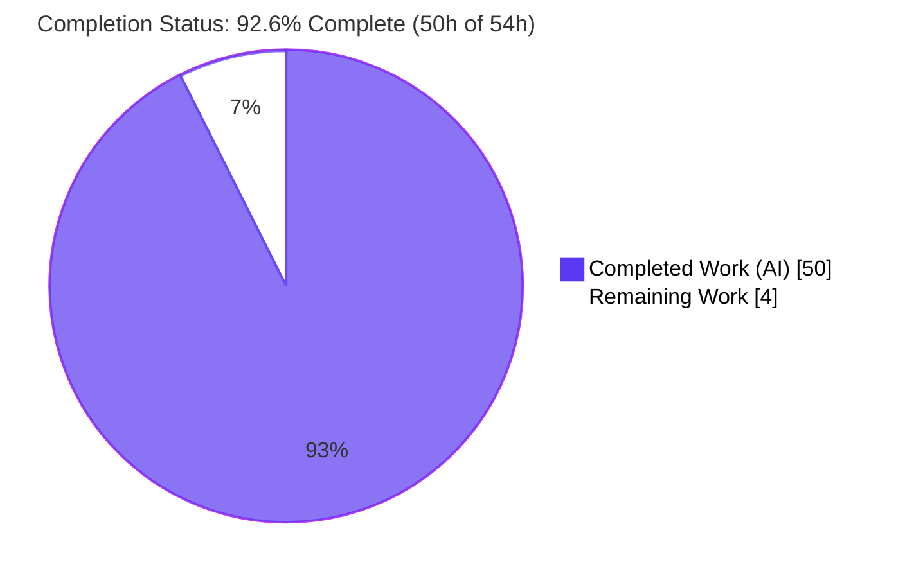
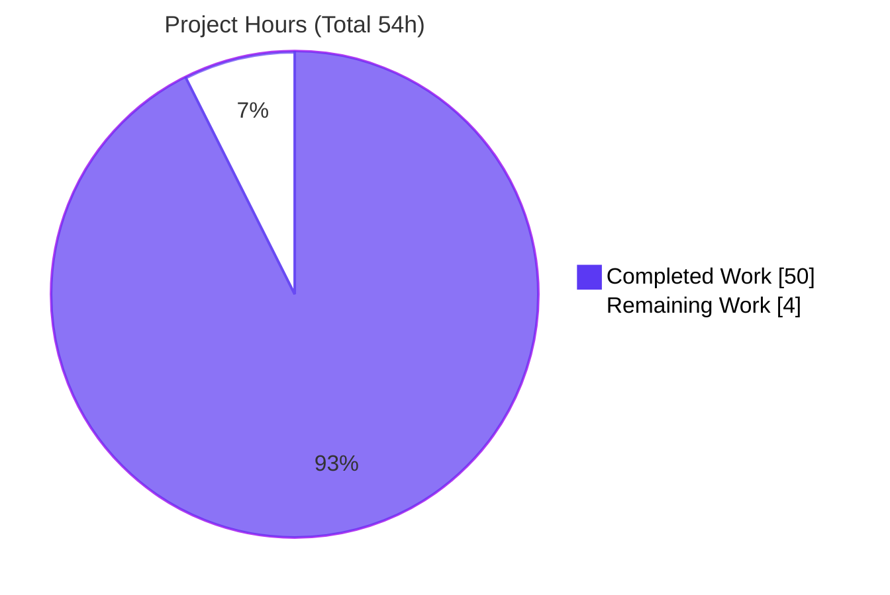
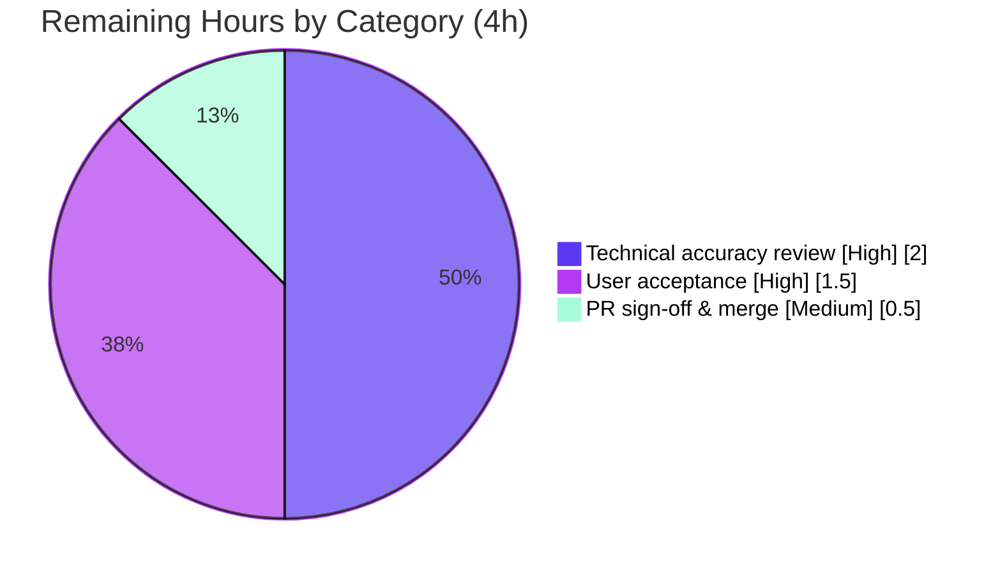

# Blitzy Project Guide — SFTPGo "Clean Start" Runtime Investigation

> **Branch:** `blitzy-22c20c45-85fa-4199-9c47-9d1a44ac4eb9` · **Base:** `44634210287c` · **HEAD:** `eb7f00dd`
> **Task type:** Read-only runtime investigation / Q&A documentation
> **Deliverable:** `blitzy/documentation/sftpgo_44634210287c.md` (979 lines)
>
> **Legend (Blitzy brand colors):** <span style="color:#5B39F3">■</span> **Completed / AI Work = Dark Blue `#5B39F3`** · <span style="color:#B23AF2">■</span> Remaining / Not Completed = White `#FFFFFF` (bordered) · Headings/accents = Violet-Black `#B23AF2` · Highlight = Mint `#A8FDD9`

---

## 1. Executive Summary

### 1.1 Project Overview

This project is a **read-only runtime investigation** of the SFTPGo server (`github.com/drakkan/sftpgo`, a Go SFTP/HTTP server) that answers a developer's questions about "odd clean start behavior" when the server is prepared to run behind a TLS-terminating reverse proxy. The sole deliverable is a single evidence-backed Markdown document that determines: whether the process working directory affects startup and where config/state/assets are found (R1); how the server behaves in each first-start condition (R2); which client address and scheme are logged for proxy headers (R3); and the concrete evidence artifacts requested (R4). Every behavioral claim is backed by actually-observed output and a `file:line` reference. The target users are the developer team deploying SFTPGo behind a reverse proxy; the business impact is de-risking that deployment through authoritative, reproducible answers.

### 1.2 Completion Status



| Metric | Hours |
|--------|-------|
| **Total Hours** | **54** |
| **Completed Hours (AI + Manual)** | **50** (AI = 50, Manual = 0) |
| **Remaining Hours** | **4** |
| **Percent Complete** | **92.6%**  (50 ÷ 54 × 100) |

> Completion % is computed strictly from AAP-scoped hours: `Completed ÷ (Completed + Remaining) = 50 ÷ 54 = 92.6%`. Every autonomous AAP deliverable is complete and committed; the remaining 4h is exclusively human path-to-production (review, acceptance, merge), which by definition cannot be completed autonomously.

### 1.3 Key Accomplishments

- ✅ **Canonical build baseline established** — SFTPGo compiled with `CGO_ENABLED=1 go build` (SQLite via cgo); banner `SFTPGo version: 0.9.5-dev` captured; exact build & invocation commands recorded.
- ✅ **R1 fully answered** — config search path enumerated (config-dir → `$HOME/.config/sftpgo` → `/etc/sftpgo` → CWD); relative state/asset resolution against the config dir demonstrated; the teammate's "temp `-c` isolates everything" belief **decisively refuted** (Experiment B); SQLite URI-metacharacter edge case documented.
- ✅ **R2 fully answered** — all five first-start conditions exercised with startup logs, exit statuses (`echo $?`), and HTTP responses; host-key auto-creation and the run-to-run "shift" source identified.
- ✅ **R3 fully answered** — leftmost `X-Forwarded-For` → `X-Real-IP` fallback → socket; RFC 7239 `Forwarded` ignored; scheme always `http`; CWD-independence proven across two CWDs; `go-chi/chi@v4.0.2 realip.go` quoted verbatim.
- ✅ **R4 fully answered** — all four requested artifacts captured (startup lines; `curl -sI` header slices; one redacted access-log line; before/after `/metrics` counters).
- ✅ **Methodology honored** — run-first investigation, ≥2-run reproducibility, observed-vs-inferred labeling (20-row table), `file:line` grounding map (~25 rows), redaction discipline (timestamps + request IDs only).
- ✅ **Read-only integrity preserved** — `git diff` shows exactly one added file; source tree byte-for-byte unchanged; `git status --porcelain` clean.
- ✅ **Independently re-validated** — the Final Validator rebuilt and re-ran every experiment with **zero discrepancies**; several artifacts matched byte-for-byte.

### 1.4 Critical Unresolved Issues

| Issue | Impact | Owner | ETA |
|-------|--------|-------|-----|
| _None — no blocking issues_ | The single deliverable is complete, committed, grounded, and independently re-validated with zero discrepancies. No compilation errors, no failing in-scope tests, no missing content. | — | — |

> The only non-blocking, out-of-scope item (4 environmental `sftpd` SCP test failures on the full suite) is tracked in Sections 5 and 6; it is not a blocker and requires no action within this task's scope.

### 1.5 Access Issues

| System/Resource | Type of Access | Issue Description | Resolution Status | Owner |
|-----------------|----------------|-------------------|-------------------|-------|
| _None_ | — | No access issues identified. Repository permissions are sufficient; the investigation requires no external services or credentials; the Go module cache is pre-baked in the canonical container. | N/A | — |

**No access issues identified.**

### 1.6 Recommended Next Steps

1. **[High]** Perform a technical accuracy review of `blitzy/documentation/sftpgo_44634210287c.md` — spot-verify a sample of the `file:line` citations against HEAD `44634210287c` and, optionally, reproduce the R3 proxy-header matrix or R4 `/metrics` deltas in the canonical container.
2. **[High]** Validate user acceptance — confirm the document answers the developer's original four questions (R1–R4) to their satisfaction, including the teammate-belief adjudication and the requested evidence artifacts (a–d).
3. **[Medium]** Approve and merge the pull request (single-file addition) to the target branch; re-confirm the source tree remains byte-for-byte unchanged.
4. **[Low]** Optionally circulate the document's **Security note S1** (client-controllable `X-Forwarded-For`/`X-Real-IP`) to whoever owns the reverse-proxy configuration, since it is directly relevant to the planned TLS-terminating-proxy deployment.

---

## 2. Project Hours Breakdown

### 2.1 Completed Work Detail

All completed work is autonomous (AI). Each component traces to a specific AAP requirement and to sections of the delivered document.

| Component | Hours | Description |
|-----------|-------|-------------|
| Canonical build baseline & version banner | 2 | AAP §0.5.1 / §1 — `CGO_ENABLED=1 go build`; captured banner `0.9.5-dev`, full build output (benign SQLite cgo warning), exact invocation. |
| R1 investigation — CWD & config/state/asset discovery | 7 | AAP R1 / §2 — Experiments A (empty `-c`, distinct CWD), B (refute isolation belief), C (no `-c`), + SQLite URI-metacharacter edge case; search path enumerated. |
| R2 investigation — first-start conditions | 10 | AAP R2 / §3 — SQLite missing/empty/usable, SFTP port taken, web assets missing (each with startup log + `echo $?` exit status + HTTP response), plus host-key auto-creation & run-to-run "shift". |
| R3 investigation — proxy-header resolution | 8 | AAP R3 / §4 — 7-row header matrix, full `go-chi/chi@v4.0.2 realip.go` analysis, multi-IP behavior, scheme derivation, CWD-independence, Security note S1. |
| R4 evidence artifact capture | 5 | AAP R4 / §5 — (a) startup log lines; (b) `curl -sI` header slices for `/`, `/web`, `/metrics`, missing path; (c) one redacted access-log line; (d) before/after `/metrics` counters. |
| Web-search corroboration | 2 | AAP §0.2.2 — corroborate go-chi/chi `RealIP` behavior and RFC 7239 `Forwarded` vs `X-Forwarded-*`; spoofability advisory. |
| Observed-vs-inferred classification + grounding map | 4 | AAP §0.7 grounding/labeling / §6 (20-row table) + §8 (`file:line` → behavior map). |
| Document authoring & assembly | 6 | AAP §0.6.2 / whole document — 979 lines, 90 balanced code fences, direct-answer summary, coverage checklist (§7). |
| Review-remediation cycles | 4 | 4 follow-up commits: code-review findings, cleanup-claim correction, TrackQuota default characterization, SQLite URI-metacharacter caveat. |
| Read-only integrity verification & cleanup | 2 | AAP §0.7 read-only rule — `git status`/`git diff` verification; scratch artifacts kept outside the repo. |
| **Total Completed** | **50** | Matches Completed Hours in Section 1.2. |

### 2.2 Remaining Work Detail

All remaining work is human path-to-production for a documentation deliverable (review → acceptance → merge). None is autonomously completable.

| Category | Hours | Priority |
|----------|-------|----------|
| Technical accuracy review of the answer document (verify `file:line` citations, optionally reproduce spot-check experiments) | 2.0 | High |
| User acceptance — confirm the document resolves the original four questions to the asker's satisfaction | 1.5 | High |
| PR sign-off & merge to target branch (re-confirm read-only integrity) | 0.5 | Medium |
| **Total Remaining** | **4.0** | Matches Remaining Hours in Section 1.2 and Section 7. |

### 2.3 Hours Reconciliation

| Check | Result |
|-------|--------|
| Section 2.1 total (Completed) | 50h |
| Section 2.2 total (Remaining) | 4h |
| **2.1 + 2.2 = Total Project Hours** | 50 + 4 = **54h** ✅ (matches Section 1.2) |
| Completion % = 50 ÷ 54 × 100 | **92.6%** ✅ (matches Sections 1.2, 7, 8) |

---

## 3. Test Results

All entries below originate from **Blitzy's autonomous validation logs** for this project (in-scope unit-test runs, R1–R4 runtime experiments, and the full-suite run that surfaced the out-of-scope SCP failures). Because this is a read-only task, **no new test files were authored** — the unit tests are the repository's existing suites that the validator executed; the runtime experiments are the functional verifications that ground the answer document.

| Test Category | Framework | Total Tests | Passed | Failed | Coverage % | Notes |
|---------------|-----------|-------------|--------|--------|------------|-------|
| Unit — `config` package (in-scope, R1) | Go `testing` | 5 | 5 | 0 | n/c | Config discovery / viper search path — 100% green. |
| Unit — `httpd` package (in-scope, R2-HTTP/R3/R4) | Go `testing` | 72 | 72 | 0 | n/c | Router, `RequestID→RealIP→StructuredLogger→Recoverer` chain, `/`,`/web`,`/metrics` routes, RealIP, request logger, `sftpgo_http_*` metrics — 100% green. |
| Runtime — R1 experiments | `serve` + `curl` + `git` | 4 | 4 | 0 | — | Experiments A/B/C + SQLite URI-metacharacter edge; reproduced N=2 byte-identical after redaction. |
| Runtime — R2 first-start conditions | `serve` + `curl` + `netstat`/`ls`/`stat` | 6 | 6 | 0 | — | SQLite missing/empty/usable, SFTP port taken, web assets missing, host-key create/reuse. |
| Runtime — R3 proxy-header matrix | `serve` + `curl` | 7 | 7 | 0 | — | Leftmost XFF / X-Real-IP fallback / `Forwarded` ignored / scheme always `http` / CWD-independent. |
| Runtime — R4 evidence artifacts | `serve` + `curl` | 4 | 4 | 0 | — | (a) startup lines; (b) header slices; (c) redacted access-log line; (d) `/metrics` counter deltas — several byte-for-byte. |
| **In-scope subtotal** | — | **98** | **98** | **0** | — | 77 unit + 21 runtime checks, all green. |
| _(Out-of-scope)_ `sftpd` SCP tests | Go `testing` | 4 | 0 | 4 | — | `TestSCPRecursive`, `TestSCPPermsSubDirs`, `TestSCPPermCreateDirs`, `TestSCPPermDownload`. **Environmental**, out of AAP scope, unfixable under read-only, zero deliverable impact (see §5/§6). |

> `n/c` = coverage not captured in the validation logs (not fabricated). The out-of-scope row is shown for transparency and is **excluded** from the completion and quality assessment.

---

## 4. Runtime Validation & UI Verification

This is a backend Go server investigation with **no UI design work** (AAP §0.10). "UI verification" here means the HTTP endpoint responses that the answer document captures. All results below were reproduced by Blitzy's autonomous validation.

**Build & process health**
- ✅ **Operational** — `CGO_ENABLED=1 go build` → exit 0; binary 27,230,232 bytes; banner `SFTPGo version: 0.9.5-dev`.
- ✅ **Operational** — Canonical `serve` with a usable SQLite DB brings up SFTP listener `[::]:2022` and HTTP listener `127.0.0.1:8080`; process blocks as expected.

**HTTP endpoint verification (R4b — GET, from the answer document)**
- ✅ **Operational** — `GET /` → `301 Moved Permanently` → `Location: /web/users`.
- ✅ **Operational** — `GET /web` → `301 Moved Permanently` → `Location: /web/users`.
- ✅ **Operational** — `GET /metrics` → `200 OK`, `Content-Type: text/plain; version=0.0.4; charset=utf-8`.
- ✅ **Operational** — `GET /nonexistent-path-xyz` → `404 Not Found`, `application/json` (from the `NotFound` handler).
- ✅ **Operational** — `HEAD /` and `HEAD /web` → `405 Method Not Allowed` (GET-only routes), consistent with the router registration.

**First-start conditions (R2)**
- ✅ **Operational** — SQLite **missing** → exit 0, "does not exists", no listener.
- ✅ **Operational** — SQLite **empty** → exit 0, "is invalid", no `sqlite` log line, DB stays 0-byte.
- ✅ **Operational** — SQLite **usable** → listeners up, `curl /` → 301, `id_rsa` auto-created (0600, 4096-bit).
- ✅ **Operational (graceful)** — SFTP **port taken** → exit 0 via `Shutdown` channel; `id_rsa` still created (host-key check precedes `net.Listen`).
- ⚠ **Partial (by design)** — **web assets missing** → unrecovered panic → exit 2 (3/3 runs); this is the documented, expected behavior for that condition, not a defect.

**Proxy-header logging (R3)**
- ✅ **Operational** — logged `remote_addr` = leftmost `X-Forwarded-For`; falls back to `X-Real-IP`; RFC 7239 `Forwarded` ignored; scheme always `http`; identical across two CWDs.

**Metrics (R4d)**
- ✅ **Operational** — `sftpgo_http_*` counters increment on response status only; forwarded headers produce identical deltas (verified S1→S2→S3 byte-for-byte).

---

## 5. Compliance & Quality Review

Cross-mapping AAP deliverables and rules to Blitzy's quality/compliance benchmarks. Fixes applied during autonomous validation are noted; no outstanding in-scope items remain.

| AAP Deliverable / Rule | Benchmark | Status | Progress | Notes / Fixes Applied |
|------------------------|-----------|--------|----------|-----------------------|
| R1 — CWD & config/state/asset discovery | Every named item answered with observed output + `file:line` | ✅ Pass | 100% | Search path, resolution base, teammate adjudication, URI edge case all present (§2). |
| R2 — five first-start conditions | Each: startup log + exit status + HTTP + before/after state | ✅ Pass | 100% | All conditions + host-key covered (§3). Cleanup-claim correction applied in a follow-up commit. |
| R3 — proxy-header story | Leftmost XFF / fallback / `Forwarded` ignored / scheme / CWD | ✅ Pass | 100% | Full `realip.go` quoted with no elision (§4). |
| R4 — four evidence artifacts (a–d) | All four present; redaction honored | ✅ Pass | 100% | Startup lines, header slices, redacted access-log line, `/metrics` deltas (§5). |
| Run-first methodology | Build & run first; write from observation | ✅ Pass | 100% | Toolchain, build cmd, and every observation captured at runtime. |
| Run-to-run reproducibility | ≥2 identical runs; report distribution | ✅ Pass | 100% | N=2 config-discovery byte-identical; host-key & request_id identified as genuine per-run variables. |
| Grounding & labeling | `file:line` per claim; observed vs inferred distinct | ✅ Pass | 100% | 20-row obs/inf table (§6) + grounding map (§8). |
| Redaction discipline | Redact only timestamps + request IDs | ✅ Pass | 100% | Only the two named volatile field types redacted; all else shown as observed. |
| Web-search corroboration | Confirm (not replace) observed behavior | ✅ Pass | 100% | go-chi/chi v4.0.2 vs v5 nuance + RFC 7239 corroborated (§4). |
| Deliverable location/name | `blitzy/documentation/<branch>.md` | ✅ Pass | 100% | `blitzy/documentation/sftpgo_44634210287c.md`. |
| Read-only source tree | Source byte-for-byte unchanged | ✅ Pass | 100% | `git diff` = single added file; `git status --porcelain` clean. |
| Code-review remediation | Address review findings | ✅ Pass | 100% | 3 remediation commits (findings, TrackQuota default, URI caveat) applied and committed. |
| _(Out-of-scope)_ SFTP SCP semantics | AAP §0.3.2 exclusion | ⚠ N/A | — | 4 SCP test failures are environmental (OpenSSH ≥9.0 `scp` uses SFTP subsystem vs legacy rcp-SCP), unfixable under read-only, zero deliverable impact. Correctly documented, not fixed. |

---

## 6. Risk Assessment

Overall risk posture is **LOW**: a read-only task producing a single static Markdown deliverable, independently re-validated with zero discrepancies, on a clean git tree.

| Risk | Category | Severity | Probability | Mitigation | Status |
|------|----------|----------|-------------|------------|--------|
| `file:line` citations could drift if read against a non-HEAD commit | Technical | Low | Low | All citations pinned to HEAD `44634210287c` and verified against the checkout. | Mitigated |
| Build reproducibility — doc built with Go 1.19.13 (Alpine) vs `go.mod` `go 1.13`; README `-i` flag dropped for Go 1.16+ | Technical | Low | Low | Exact toolchain stated; banner is a compile-time constant independent of toolchain. | Mitigated |
| A few conclusions are labeled "inferred" (panic-precedes-host-key timing; host-key-fresh-every-run generalized from N=2) | Technical | Low | Low | Explicitly labeled inferred in §6; observed portions distinguished. | Accepted |
| Leftmost `X-Forwarded-For`/`X-Real-IP` are client-controllable & spoofable without a sanitizing proxy | Security | Medium (user deployment) | Medium | Security note S1 recommends reverse-proxy hardening; corroborated by RFC 7239 & go-chi refs. This is a **finding surfaced for the user**, not a deliverable defect. | Documented / Advisory |
| Startup gotchas (assets missing → panic exit 2; missing/empty DB → exit 0 with no listener; per-run host key = "shift") | Operational | Medium (user ops) | N/A | Fully documented in §3 of the answer so operators know what to expect. Deliverable itself is a static file. | Documented |
| R3/R4 HTTP probes require a non-canonical prerequisite (init usable SQLite DB from `sql/sqlite` migrations) | Integration | Low | Low | Explicitly labeled non-canonical; exact `sqlite3` init steps provided. | Mitigated |
| Full-suite `go test ./...` shows 4 `sftpd` SCP failures (container OpenSSH ≥9.0 `scp` uses SFTP subsystem vs legacy rcp-SCP) | Integration | Low | N/A (environmental) | Out of AAP scope (§0.3.2); unfixable under read-only; deliverable makes zero SCP claims. | Documented / Out-of-scope |

---

## 7. Visual Project Status

**Project hours breakdown** (Completed = Dark Blue `#5B39F3`, Remaining = White `#FFFFFF`):



**Remaining work by category** (Section 2.2, sums to 4h):



> **Integrity check:** the "Remaining Work" value (4h) equals Section 1.2 Remaining Hours and the sum of the Section 2.2 "Hours" column. The "Completed Work" value (50h) equals Section 1.2 Completed Hours and the sum of Section 2.1.

---

## 8. Summary & Recommendations

**Achievements.** The project is **92.6% complete** (50 of 54 AAP-scoped hours). The single required deliverable — `blitzy/documentation/sftpgo_44634210287c.md` — exists, is committed, and comprehensively answers all four questions (R1–R4) using a strict run-first methodology: every behavioral claim is paired with actually-observed output and a `file:line` reference pinned to HEAD `44634210287c`, with observed and inferred statements labeled distinctly. The document decisively adjudicates the teammate's "temporary config directory isolates everything" belief (false for config discovery), enumerates all five first-start conditions with exit statuses, resolves the proxy-header logging behavior (leftmost `X-Forwarded-For`, `Forwarded` ignored, scheme always `http`), and provides all four requested evidence artifacts with the mandated redaction. The Final Validator independently rebuilt and re-ran every experiment with **zero discrepancies**.

**Remaining gaps (critical path to production).** For a documentation deliverable, "production" is **human acceptance**. The remaining 4 hours are: (1) a technical accuracy review, (2) confirmation that the document resolves the developer's original question, and (3) PR sign-off & merge. These are inherently human activities and cannot be completed autonomously — hence completion is 92.6%, not 100%.

**Success metrics.** ✅ Single-file read-only integrity preserved (`git diff` = one added file); ✅ 77 in-scope unit tests green (`config` + `httpd`); ✅ 21 runtime R1–R4 checks reproduced; ✅ canonical build reproducible with stated commands; ✅ every named item covered per the §7 coverage checklist.

**Production readiness assessment.** **READY** within the read-only documentation scope, pending the human review/acceptance tail. Risk posture is LOW. The one out-of-scope item (4 environmental `sftpd` SCP failures) is correctly documented rather than fixed, consistent with the read-only mandate and AAP §0.3.2, and has zero impact on the deliverable.

| Metric | Value |
|--------|-------|
| AAP-scoped completion | **92.6%** (50h ÷ 54h) |
| Blocking issues | 0 |
| In-scope tests passed | 98 / 98 (77 unit + 21 runtime) |
| Source files modified | 0 (read-only preserved) |
| Files added | 1 (`blitzy/documentation/sftpgo_44634210287c.md`) |

---

## 9. Development Guide

This guide covers (A) viewing/verifying the delivered document — runnable anywhere with `git`, and (B) reproducing the investigation — which requires the canonical toolchain.

### 9.1 System Prerequisites

- **Go 1.13+** (the binary in the answer was compiled with Go **1.19.13**; a newer toolchain compiling a `go 1.13` module is supported).
- **gcc** — required because the default SQLite provider (`mattn/go-sqlite3`) uses **cgo** (`CGO_ENABLED=1`).
- **sqlite3 CLI** — only for the **non-canonical** step of initializing a usable DB for the R3/R4 HTTP probes.
- **curl**, **git** — for endpoint probing and integrity checks.
- **Linux** — the `$HOME/.config/sftpgo` and `/etc/sftpgo` search-path entries are Linux-specific.
- **Canonical container (recommended):** `ghcr.io/scaleapi/swe-atlas:swe_atlas_QnA_drakkan_sftpgo_1.0` (Alpine, Go 1.19.13, gcc 12.2.1) — has the pre-baked module cache.

> **Note:** On a bare host without Go/sqlite3 on `PATH`, run Track B inside the canonical container or a local Go 1.13+ install with cgo. Track A (below) needs only `git`.

### 9.2 Track A — View & Verify the Deliverable (no toolchain required)

```bash
# From the repository root:
cd /path/to/repo

# 1) View the answer document
sed -n '1,40p' blitzy/documentation/sftpgo_44634210287c.md   # header + direct-answer summary
wc -l blitzy/documentation/sftpgo_44634210287c.md            # expect: 979

# 2) Verify read-only integrity (source tree unchanged; single added file)
git diff --name-status 44634210287c..HEAD
#   expected output:  A   blitzy/documentation/sftpgo_44634210287c.md

git status --porcelain
#   expected output:  (empty — clean working tree)

# 3) Sanity-check the document is well-formed (balanced fences)
grep -c '```' blitzy/documentation/sftpgo_44634210287c.md      # expect: 90 (even)
```

### 9.3 Track B — Reproduce the Investigation (canonical container / Go+cgo)

```bash
# 0) Work OUTSIDE the repo to preserve read-only integrity
mkdir -p /tmp/inv

# 1) Canonical build (SQLite via cgo). Binary written outside the source tree.
CGO_ENABLED=1 go build -o /tmp/inv/sftpgo .
#   Expected: a single benign warning from mattn/go-sqlite3
#     sqlite3-binding.c: ... warning: function may return address of local variable [-Wreturn-local-addr]
#   Exit status 0; binary ~27,230,232 bytes.

# 2) Confirm the version banner
/tmp/inv/sftpgo --version          # -> SFTPGo version: 0.9.5-dev

# 3) First-start behaviors (R2). Run each from an empty scratch config dir:
mkdir -p /tmp/inv/cfg
/tmp/inv/sftpgo serve -c /tmp/inv/cfg ; echo "exit=$?"
#   Missing SQLite DB -> logs "does not exists", exit=0, no listener bound.

# 4) NON-CANONICAL prerequisite for R3/R4: initialize a usable SQLite DB
for f in sql/sqlite/20190828.sql sql/sqlite/20191112.sql \
         sql/sqlite/20191230.sql sql/sqlite/20200116.sql; do
  sqlite3 /tmp/inv/cfg/sftpgo.db < "$f"
done

# 5) Start the server (blocks); SFTP -> [::]:2022, HTTP -> 127.0.0.1:8080
/tmp/inv/sftpgo serve -c /tmp/inv/cfg &   # background for probing
sleep 2
```

### 9.4 Verification Steps (expected endpoint responses — R4b)

```bash
curl -s -D - -o /dev/null http://127.0.0.1:8080/            # 301 -> Location: /web/users
curl -sI                    http://127.0.0.1:8080/           # 405 (GET-only route; HEAD not allowed)
curl -s -D - -o /dev/null http://127.0.0.1:8080/web         # 301 -> Location: /web/users
curl -sI                    http://127.0.0.1:8080/metrics    # 200  text/plain; version=0.0.4
curl -sI  http://127.0.0.1:8080/nonexistent-path-xyz         # 404  application/json
```

### 9.5 Example Usage (R3/R4 — proxy headers & metrics)

```bash
# Proxy-header resolution: leftmost X-Forwarded-For wins (logged remote_addr = 203.0.113.7)
curl -s -o /dev/null \
  -H 'X-Forwarded-For: 203.0.113.7, 70.41.3.18, 150.172.238.178' \
  -H 'X-Real-IP: 9.9.9.9' \
  -H 'Forwarded: for=192.0.2.60;proto=https' \
  http://127.0.0.1:8080/
#   The access log records remote_addr=203.0.113.7 (leftmost XFF); Forwarded is ignored; scheme=http.

# Metrics: sftpgo_http_* counters move on response status only (headers are irrelevant)
curl -s http://127.0.0.1:8080/metrics | grep '^sftpgo_http_'
```

### 9.6 Troubleshooting

- **`go: command not found` / `sqlite3: command not found`** → run inside the canonical container, or install Go 1.13+ with cgo and the `sqlite3` CLI locally.
- **Build error `flag provided but not defined: -i`** → the README recipe's `-i` flag was removed in Go 1.16+; drop it (use `CGO_ENABLED=1 go build -o /tmp/inv/sftpgo .`).
- **Server exits immediately with "does not exists" / "is invalid"** → the SQLite DB is missing/empty; run the §9.3 step 4 migration init to create a usable DB.
- **Panic / exit 2 on startup** → the web assets (`templates/`, `static/`) aren't resolvable against the config dir; run `serve` from the repo root (default relative paths) or point the config at the correct asset paths.
- **`could not start SFTP server` then graceful exit 0** → the SFTP port (2022) is already taken; free it or change `bind_port`. The host key is still created because the host-key check precedes `net.Listen`.
- **Full-suite `go test ./...` shows 4 SCP failures** → environmental (container OpenSSH ≥9.0 `scp` uses the SFTP subsystem; legacy rcp-SCP needs `-O`). Out of scope for this task; the in-scope `config` and `httpd` packages are green.

---

## 10. Appendices

### A. Command Reference

| Purpose | Command |
|---------|---------|
| Canonical build | `CGO_ENABLED=1 go build -o /tmp/inv/sftpgo .` |
| Version banner | `/tmp/inv/sftpgo --version` |
| Start server | `/tmp/inv/sftpgo serve -c <config-dir>` |
| Init usable SQLite DB (non-canonical) | `for f in sql/sqlite/2019*.sql sql/sqlite/2020*.sql; do sqlite3 <dir>/sftpgo.db < "$f"; done` |
| Read-only integrity | `git diff --name-status 44634210287c..HEAD` · `git status --porcelain` |
| Endpoint probe (headers) | `curl -sI http://127.0.0.1:8080/<path>` |
| Metrics scrape | `curl -s http://127.0.0.1:8080/metrics \| grep '^sftpgo_http_'` |
| In-scope tests | `go test ./config/... ./httpd/...` |

### B. Port Reference

| Service | Default Port | Bind Address (default) | Source |
|---------|--------------|------------------------|--------|
| SFTP | 2022 | `""` → normalized to `[::]:2022` | `sftpgo.json:3-4` |
| HTTP / Web UI / `/metrics` | 8080 | `127.0.0.1` | `sftpgo.json:47-48` |

### C. Key File Locations

| Path | Role |
|------|------|
| `blitzy/documentation/sftpgo_44634210287c.md` | **The deliverable** (answer document, 979 lines) |
| `config/config.go`, `config/config_linux.go` | Config search path (R1) |
| `sftpgo.json` | Default configuration (ports, provider, asset paths) |
| `cmd/serve.go`, `service/service.go` | Serve entry point & startup orchestration (R2) |
| `dataprovider/sqlite.go` | SQLite missing/empty/usable branch (R2a) |
| `sftpd/server.go` | SFTP bind + host-key auto-creation (R2b) |
| `httpd/httpd.go`, `httpd/router.go` | Asset resolution + middleware chain & routes (R2c/R3/R4) |
| `logger/request_logger.go` | Access-log fields, scheme, per-request metrics (R3/R4) |
| `metrics/metrics.go` | `sftpgo_http_*` counter definitions (R4) |
| `sql/sqlite/*.sql` | Migration schema for non-canonical DB init |

### D. Technology Versions

| Component | Version | Source |
|-----------|---------|--------|
| Go (module language) | 1.13 | `go.mod:3` |
| Go (build toolchain) | 1.19.13 | canonical container |
| gcc | 12.2.1 (Alpine, container) / 15.2.0 (host) | build env |
| github.com/go-chi/chi | v4.0.2+incompatible | `go.mod` |
| github.com/mattn/go-sqlite3 | v2.0.2+incompatible | `go.mod` |
| github.com/pkg/sftp | v1.11.0 | `go.mod` |
| github.com/prometheus/client_golang | v1.3.0 | `go.mod` |
| github.com/rs/zerolog | v1.17.2 | `go.mod` |
| github.com/spf13/cobra | v0.0.5 | `go.mod` |
| github.com/spf13/viper | v1.6.1 | `go.mod` |
| SFTPGo (banner) | 0.9.5-dev | `utils/version.go` |

### E. Environment Variable Reference

| Variable | Purpose | Notes |
|----------|---------|-------|
| `CGO_ENABLED=1` | Enables cgo for the SQLite provider | Required for the canonical build |
| `SFTPGO_*` | Config overrides (viper prefix) | e.g. env overrides for JSON config keys (`config/config.go`) |

> No secrets or external-service credentials are required for this investigation.

### F. Developer Tools Guide

| Tool | Use in this project |
|------|---------------------|
| `git` | Verify read-only integrity (`diff --name-status`, `status --porcelain`) and inspect the 5 branch commits. |
| `go build` / `go test` | Compile the server (cgo) and run the in-scope `config`/`httpd` suites. |
| `sqlite3` | Initialize a usable DB from the migration schema (non-canonical R3/R4 prerequisite). |
| `curl` | Probe `/`, `/web`, `/metrics`, and a missing path; drive proxy-header scenarios. |
| `ssh-keygen -lf` | Inspect the auto-created `id_rsa` host-key fingerprint (run-to-run "shift"). |
| `netstat` / `ls` / `stat` | Confirm listener binding and before/after state of DB & host key. |

### G. Glossary

| Term | Definition |
|------|------------|
| **AAP** | Agent Action Plan — the primary directive defining project scope (R1–R4 + read-only constraint). |
| **CWD** | Current working directory — a config search path and the default resolution base for relative state/asset paths. |
| **Config dir (`-c`)** | Directory passed to `serve -c`; relative DB/host-key/asset paths resolve against it. Does **not** isolate config discovery. |
| **RealIP** | `go-chi/chi` middleware that rewrites `r.RemoteAddr` from `X-Forwarded-For` (leftmost) or `X-Real-IP`. |
| **RFC 7239 `Forwarded`** | The standardized proxy header; **ignored** by `go-chi/chi@v4.0.2`. |
| **Non-canonical prerequisite** | A setup step (initializing a usable SQLite DB) needed only to bring the HTTP server up for R3/R4 probes; distinct from default first-start behavior. |
| **Observed vs Inferred** | Observed = captured at runtime; Inferred = derived from reading pinned source, explicitly labeled. |
| **rcp-SCP** | The legacy SCP protocol SFTPGo 0.9.5-dev implements; modern OpenSSH `scp` (≥9.0) uses the SFTP subsystem by default (root cause of the out-of-scope SCP test failures). |

---

*Prepared by the Blitzy autonomous assessment agent. All hours are AAP-scoped; completion (92.6%) reflects autonomous work delivered against the Agent Action Plan plus the human path-to-production tail. Cross-section integrity validated: Sections 1.2 ↔ 2.2 ↔ 7 remaining hours all = 4h; Section 2.1 (50h) + 2.2 (4h) = 54h total.*