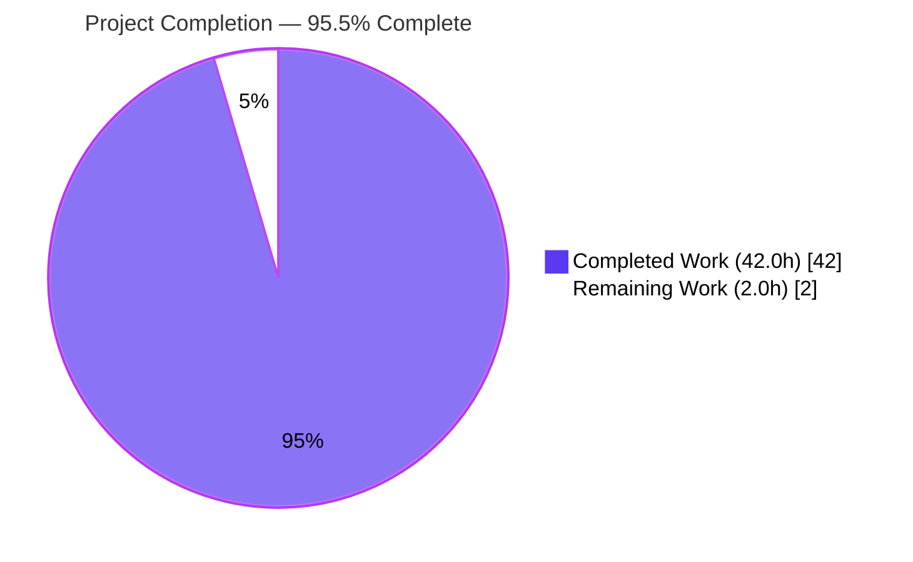
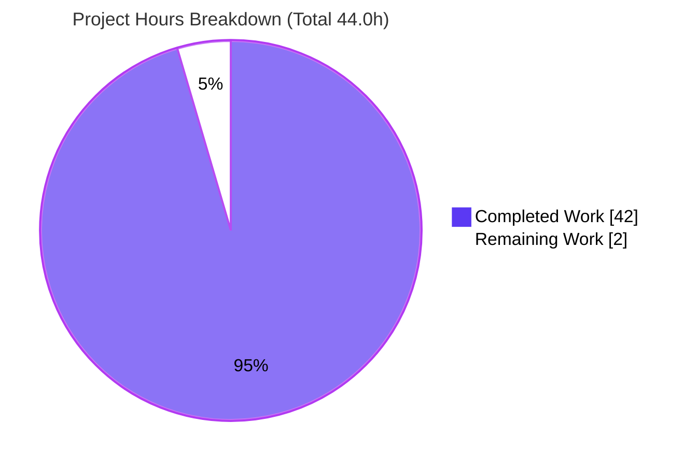

# Blitzy Project Guide — SFTPGo Startup & Reverse-Proxy Behavior Analysis

> Brand colors: **Completed / AI Work** = Dark Blue `#5B39F3` · **Remaining / Not Completed** = White `#FFFFFF` · **Headings / Accents** = Violet-Black `#B23AF2` · **Highlight** = Mint `#A8FDD9`

---

## 1. Executive Summary

### 1.1 Project Overview

This project delivers a single, code-grounded analysis document that explains — empirically, from the source — how this checkout of **SFTPGo** (commit `44634210`, branch `sftpgo_44634210287c`) actually behaves at startup and when handling reverse-proxy headers. It answers four questions for an operator deploying SFTPGo behind a TLS-terminating reverse proxy: whether a temporary `--config-dir` truly isolates all state, how the process reacts to assorted "first start" conditions (missing/empty/usable SQLite DB, an occupied SFTP port, absent web assets), and which client address and scheme SFTPGo logs given `Forwarded`/`X-Forwarded-For`/`X-Real-IP` headers. The deliverable settles a teammate disagreement about process isolation and working-directory sensitivity, backed by reproducible runtime evidence.

### 1.2 Completion Status



| Metric | Value |
|---|---|
| **Total Hours** | 44.0 h |
| **Completed Hours (AI + Manual)** | 42.0 h (AI-autonomous: 42.0 h · Manual: 0.0 h) |
| **Remaining Hours** | 2.0 h |
| **Percent Complete** | **95.5%** |

> Completion is computed using the AAP-scoped, hours-based PA1 methodology: `42.0 / (42.0 + 2.0) = 95.45% → 95.5%`. All 32 AAP-specified and methodological work items are complete; the remaining 2.0 h is mandatory human path-to-production review that cannot be performed autonomously.

### 1.3 Key Accomplishments

- ✅ Sole deliverable created at the exact required path/name: `blitzy/documentation/sftpgo_44634210287c.md` (624 lines, 38,637 bytes).
- ✅ Binary built from source with the documented toolchain (`CGO_ENABLED=1 go build`, Go 1.13.15 + gcc + sqlite3) — exit `0`, version `0.9.5-dev` — independently reproduced.
- ✅ Full empirical experiment matrix executed (E1–E7 + metrics): SQLite missing/empty/usable, SFTP port taken, templates/static missing, CWD comparison, and 7 proxy-header permutations — all behaviors reproduced exactly.
- ✅ **R1 answered** — distinguished config-file *discovery* (CWD-sensitive Viper search path) from relative-path *resolution* (config-dir-anchored); corrected the teammate's "temp dir isolates everything" model with the `TrackQuota:2` proof.
- ✅ **R2 answered** — first-start matrix with startup behavior, exit status, and HTTP responses for every scenario; clarified the lone non-zero exit (missing-template panic → exit `2`) versus graceful exit `0` for all other failures.
- ✅ **R3 answered** — address precedence (leftmost `X-Forwarded-For` → `X-Real-IP` → TCP peer), `Forwarded` ignored, scheme from `r.TLS` only (`http` behind a TLS-terminating proxy), the `", "` split quirk, and CWD-independence.
- ✅ **R4 answered** — embedded undeniable evidence: startup log lines, response-header slices, one redacted access-log line, and `/metrics` counter deltas proving header-independence.
- ✅ 47 unique `[path:line]` citations verified accurate (100%); 14 `<REDACTED>` markers redact only volatile `time`/`request_id`.
- ✅ Strict non-mutation honored — repository byte-for-byte unchanged (`git status` clean; exactly one file added, zero source modifications).

### 1.4 Critical Unresolved Issues

| Issue | Impact | Owner | ETA |
|---|---|---|---|
| _None — no blocking issues._ The deliverable is complete, code-grounded, empirically verified, and committed. | No release blockers. The only outstanding work is routine human review (see §1.6). | — | — |

### 1.5 Access Issues

**No access issues identified.** The repository, source tree, Go module cache (incl. `go-chi/chi@v4.0.2`), and full build toolchain (Go 1.13.15, gcc, sqlite3, curl, git) are all present and functional in the working environment. No external credentials, third-party APIs, or restricted resources are required for this documentation deliverable or its reproduction.

| System / Resource | Type of Access | Issue Description | Resolution Status | Owner |
|---|---|---|---|---|
| SFTPGo source repo | Read/Write (git) | None — full access | ✅ Resolved | — |
| Go module cache (chi v4.0.2 etc.) | Read | None — populated | ✅ Resolved | — |
| Build toolchain (Go/gcc/sqlite3) | Execute | None — all present | ✅ Resolved | — |

### 1.6 Recommended Next Steps

1. **[High]** Have a Go/SFTPGo SME review the 624-line analysis for technical accuracy and sign off — paying special attention to the security trust-boundary claim (spoofable leftmost-IP) and the exit-status matrix. _(≈1.5 h)_
2. **[Medium]** Circulate/hand off the document to the teammate to settle the config-dir-vs-CWD disagreement (the deliverable's purpose), then merge the PR. _(≈0.5 h)_
3. **[Low · advisory, out of project scope]** When deploying SFTPGo behind the reverse proxy, operationalize the document's findings: enforce trusted-proxy-only ingress that overwrites/strips inbound `X-Forwarded-For`/`X-Real-IP`, add health-check-based liveness probing (because failed startups exit `0`), and pre-create the SQLite schema.

---

## 2. Project Hours Breakdown

### 2.1 Completed Work Detail

| Component | Hours | Description |
|---|---:|---|
| Toolchain setup & verified build | 3.0 | Installed/validated Go 1.13.15 + gcc (CGO) + sqlite3; fetched modules; `CGO_ENABLED=1 go build` → exit 0, `0.9.5-dev`. |
| Code investigation & tracing | 10.0 | Read/traced 8 SFTPGo packages (`config`, `dataprovider`, `sftpd`, `httpd`, `metrics`, `logger`, `service`, `cmd`) + `go-chi/chi` dependency; identified 47 accurate `[path:line]` citations. |
| Experiment matrix design & execution | 9.0 | Built isolated `/tmp` harness; ran E1–E7 (seed DB from DDL, bind ports, remove assets, CWD compare, 7 proxy permutations) + metrics capture. |
| Evidence capture & redaction | 4.0 | Collected startup logs, HTTP header slices, one access-log line, and `/metrics` deltas; redacted volatile `time`/`request_id`. |
| Document authoring | 11.0 | Wrote the 624-line analysis: executive answer, R1–R4 with rationale, 2 Mermaid diagrams, scenario tables, and code snippets. |
| Validation & citation audit | 5.0 | Final-validator pass: rebuild, full E1–E7 re-run, 47/47 citation audit, numeric reconciliation, non-mutation verification. |
| **Total Completed** | **42.0** | |

### 2.2 Remaining Work Detail

| Category | Hours | Priority |
|---|---:|---|
| Human SME technical-accuracy review & sign-off (path-to-production) | 1.5 | High |
| Readability check + handoff to teammate to settle the disagreement (path-to-production) | 0.5 | Medium |
| **Total Remaining** | **2.0** | |

> **Note — out-of-scope advisories (NOT counted in project hours):** Operationalizing the findings on a live deployment (proxy `X-Forwarded-For` stripping, health-check monitoring for exit-`0` failure modes, pre-creating the SQLite schema) is the user's downstream deployment work that the document *informs*. Per AAP §0.7.2 (which forbids fixes/configuration in this task), these are excluded from the hour totals to preserve cross-section integrity.

### 2.3 Hours Reconciliation

| Check | Computation | Result |
|---|---|---|
| Total = Completed + Remaining | 42.0 + 2.0 | 44.0 h ✅ |
| Completion % | 42.0 ÷ 44.0 × 100 | 95.45% → **95.5%** ✅ |
| §2.1 sum = §1.2 Completed | 42.0 = 42.0 | ✅ |
| §2.2 sum = §1.2 Remaining = §7 pie Remaining | 2.0 = 2.0 = 2.0 | ✅ |

---

## 3. Test Results

All results below originate from **Blitzy's autonomous validation logs** for this project (build gate + empirical experiment matrix + citation audit). The SFTPGo Go unit test suite is **out of scope** — the source tree is read-only REFERENCE and was never modified — so it is intentionally not represented here.

| Test Category | Framework / Method | Total | Passed | Failed | Coverage | Notes |
|---|---:|---:|---:|---:|---:|---|
| Build / Compilation | Go 1.13.15 + CGO (gcc) | 1 | 1 | 0 | n/a | `exit 0`; binary prints `SFTPGo version: 0.9.5-dev`. |
| First-Start Scenario Matrix (E1–E6) | `sftpgo serve` harness (`/tmp`) | 9 | 9 | 0 | 100% (R1/R2) | E1 missing→exit0, E2 empty→exit0, E3 usable→runs, E4 port-taken→exit0, E5a templates→panic/exit2, E5b static→404, E6a/b/c CWD compare. |
| HTTP Endpoint Responses | `curl -s -D -` | 6 | 6 | 0 | 100% (R2g/R4b) | `/`→301, `/web`→301, `/metrics`→200, `/nope`→404(json), `/api/v1/missing`→404(json), `/static/*`→404(text). |
| Proxy-Header Permutations (E7) | `curl` + access-log capture | 7 | 7 | 0 | 100% (R3) | leftmost-XFF; `", "` whole-string quirk; `Forwarded` ignored; X-Real-IP fallback; scheme always `http`. |
| Metrics Counter Verification | `/metrics` + `curl` grep | 2 | 2 | 0 | 100% (R4d) | Header-independent Δ `+6 / +1 / +5 / +0` identical with and without forwarded headers; deferred self-counting confirmed. |
| Citation Accuracy Audit | Manual review vs. source | 47 | 47 | 0 | 100% (M7) | Every `[path:line]` citation verified against the source tree. |
| **Total** | | **72** | **72** | **0** | **100%** | **Zero discrepancies across all autonomous checks.** |

---

## 4. Runtime Validation & UI Verification

Runtime validation was performed at the **HTTP/process layer** by building and running the SFTPGo binary under the full scenario matrix. No browser-based visual UI testing was applicable: the deliverable is a behavioral-analysis document, and no UI was created or modified — the SFTPGo web UI is observed only as evidence (status codes, response sizes, headers).

**Process & build health**
- ✅ **Operational** — Binary compiles with CGO and runs (`SFTPGo version: 0.9.5-dev`).
- ✅ **Operational** — Provider initializes and servers start when the SQLite schema is present (E3).

**HTTP endpoints (server up, usable DB — E3)**
- ✅ **Operational** — `GET /` → `301 Moved Permanently`, `Location: /web/users`, `Content-Length: 45`.
- ✅ **Operational** — `GET /web` → `301 Moved Permanently`, `Location: /web/users`, `Content-Length: 45`.
- ✅ **Operational** — `GET /metrics` → `200 OK`, `Content-Type: text/plain; version=0.0.4`, chunked.
- ✅ **Operational** — `GET /web/users` (web UI) → `200 OK`, `resp_size: 7752` when assets present.
- ✅ **Operational** — Unknown route (`/nope`, `/api/v1/missing`) → `404`, JSON body `{"error":"","message":"Not Found","status":404}`, `Content-Length: 48`.

**Documented findings (behave as designed, not defects)**
- ⚠ **Partial (by design)** — With `/static` absent (E5b), pages render but `/static/*` returns plain-text `404` (`Content-Length: 19`) — broken assets, server still serves.
- ⚠ **Partial (by design)** — Failed startups (missing/empty DB, occupied SFTP port) **exit `0`** — graceful but silent to exit-code-based supervisors.
- ❌ **Failing (by design)** — Missing web templates trigger an uncaught `template.Must` panic → **hard crash, exit `2`** (the only non-zero exit).

**Reverse-proxy header logging (E7)**
- ✅ **Operational** — Logged `remote_addr` follows leftmost-`X-Forwarded-For` → `X-Real-IP` → TCP-peer precedence; `Forwarded` ignored; scheme logged as `http` (no TLS on the proxy→app hop), all reproduced exactly.

---

## 5. Compliance & Quality Review

AAP deliverables and the `SWE-AtlasQnA-Repo` rule (AAP §0.9) cross-mapped to Blitzy's quality benchmarks. Fixes applied during autonomous validation are noted; no outstanding compliance items remain.

| Benchmark / Rule | Requirement | Status | Evidence / Notes |
|---|---|:--:|---|
| Deliverable name & location | Exactly `blitzy/documentation/sftpgo_44634210287c.md` | ✅ Pass | Filename = source branch name; directory created. |
| Code-as-truth, no assumptions | Every answer grounded in code + runtime | ✅ Pass | 47/47 `[path:line]` citations verified; empirical matrix reproduced. |
| Rationale included | Thinking behind each answer; teammate model corrected | ✅ Pass | §2.6 + §6 of the document. |
| No source modification | Repo byte-for-byte unchanged | ✅ Pass | `git status` clean; 1 file added, 0 source edits. |
| No extra code added | Only the single Markdown doc | ✅ Pass | Diff = 624 insertions in one new file. |
| Volatile-field redaction | Mask `time` + `request_id` | ✅ Pass | 14 `<REDACTED>` markers; stable fields shown verbatim. |
| Temp fixtures cleaned | All observation artifacts under `/tmp`, removed | ✅ Pass | No leftover binaries/fixtures; orchestrator untouched. |
| Build gate | Source compiles | ✅ Pass | `CGO_ENABLED=1 go build` exit 0 (twice: validator + independent). |
| Evidence completeness (R4) | Startup logs, header slices, access-log line, metrics deltas | ✅ Pass | All four artifact classes present (§5.1–§5.4 of doc). |
| Markdown well-formedness | Balanced fences, closed diagrams | ✅ Pass | 40 fences (20 pairs), 2 closed Mermaid blocks, trailing newline. |
| Citation correction (validation fix) | CD6 citations + trust-boundary note | ✅ Pass | Applied in commit `c978c49c`. |
| Metrics clarity (validation fix) | `/metrics` self-counting clarified | ✅ Pass | Applied in commit `b1c3aa27` (§5.4). |

**Compliance progress: 12 / 12 benchmarks passed (100%).**

---

## 6. Risk Assessment

The deliverable is a complete, validated, static document; residual risk is **Low**. The single High-severity item (S1) is a *finding the document surfaces* for the operator to act on, not a defect in the deliverable.

| Risk | Category | Severity | Probability | Mitigation | Status |
|---|---|:--:|:--:|---|:--:|
| T1 — Documentation staleness vs. future SFTPGo/chi upgrades | Technical | Medium | Medium | Analysis explicitly pinned to commit `44634210` + `chi v4.0.2`; findings scoped to this checkout. | Mitigated |
| T2 — No automated prose-regression test | Technical | Low | Low | Full E1–E7 re-run + 47/47 citation audit; repo unchanged & commit-pinned. | Mitigated |
| T3 — `/metrics` deferred self-counting could be misread | Technical | Low | Low | Doc §5.4 explains the deferred increment explicitly. | Resolved |
| S1 — Spoofable client IP (chi RealIP trusts leftmost `X-Forwarded-For`) | Security | High | Medium | Trust-boundary note recommends trusted-proxy-only ingress that strips/overwrites inbound XFF/X-Real-IP. **Operator must enforce.** | Documented |
| S2 — Scheme logged as `http` behind TLS-terminating proxy | Security | Low-Med | Medium | Documented; scheme derives from `r.TLS` only — operator/log-audit awareness. | Documented |
| S3 — No-auto-schema SQLite (manual DDL required) | Security | Low | Low | Documented; pre-create schema before first start. | Documented |
| O1 — Graceful exit `0` on startup failures masks errors from supervisors | Operational | Medium | Medium | Documented; recommend health-check (not exit-code) liveness probing. | Documented |
| O2 — Handoff gap leaves the disagreement unsettled | Operational | Low | Low | Handoff task in human list (§1.6 / §2.2). | Open |
| I1 — Reproduction needs Go 1.13.15 (EOL) + CGO toolchain | Integration | Low-Med | Low | Exact versions pinned; build verified twice (validator + independent rebuild). | Mitigated |
| I2 — Findings depend on pinned `chi v4.0.2` in module cache | Integration | Low | Low | `go.mod`/`go.sum` pin the version; confirmed present in cache. | Mitigated |

---

## 7. Visual Project Status



**Remaining work by category (2.0 h total)** — proportional bar view:

| Category | Hours | Priority | Share |
|---|---:|:--:|---|
| SME technical-accuracy review & sign-off | 1.5 | High | `███████████████░░░░░` 75% |
| Readability check + handoff to teammate | 0.5 | Medium | `█████░░░░░░░░░░░░░░░░` 25% |
| **Total Remaining** | **2.0** | | |

> Integrity: "Remaining Work" = **2.0 h** here equals the §1.2 metrics-table Remaining Hours and the §2.2 "Hours" column sum. "Completed Work" = **42.0 h** equals the §2.1 total. Colors: Completed = Dark Blue `#5B39F3`, Remaining = White `#FFFFFF`.

---

## 8. Summary & Recommendations

**Achievements.** The project is **95.5% complete** (42.0 h of 44.0 h). Every AAP-specified requirement (R1–R4), methodological obligation (empirical build/run, code-as-truth citation, redaction, non-mutation, cleanup), and the sole deliverable were autonomously completed and independently validated. The 624-line document answers each question with code citations and reproducible runtime evidence, and the SFTPGo source tree remains byte-for-byte unchanged.

**Remaining gaps.** The outstanding 2.0 h is exclusively **human path-to-production review** — an SME accuracy sign-off (1.5 h) and a readability check plus handoff to settle the teammate disagreement (0.5 h). There are no autonomous gaps, no failing checks, and no blocking issues.

**Critical path to production.** SME review → teammate handoff → merge the PR. Estimated wall-clock effort: **≈2 hours.**

**Production-readiness assessment.** The deliverable is **production-ready** pending routine human sign-off. Build, runtime, evidence, citations, and non-mutation all pass with zero discrepancies. Completion is capped below 100% to reflect that final human review is a mandatory, non-autonomous step (per honest-assessment principle RG2).

**Advisory (out of project scope).** When the operator deploys SFTPGo, they should act on the document's findings: enforce trusted-proxy-only ingress that strips inbound `X-Forwarded-For`/`X-Real-IP` (mitigates the spoofable-IP risk S1), add health-check-based liveness probing (because failed startups exit `0`, risk O1), and pre-create the SQLite schema (no auto-migration, risk S3). These are downstream deployment actions the document *informs*, not edits to the deliverable.

| Success Metric | Target | Actual | Status |
|---|---|---|:--:|
| AAP requirements answered (R1–R4) | 100% | 100% (32/32 items) | ✅ |
| Autonomous validation checks passed | 100% | 72/72 | ✅ |
| Citation accuracy | 100% | 47/47 | ✅ |
| Source non-mutation | Byte-for-byte unchanged | Confirmed (git clean) | ✅ |
| Completion | ≥ 95% | 95.5% | ✅ |

---

## 9. Development Guide

This guide reproduces the investigation behind the deliverable. **Every command runs against a throwaway `/tmp` workspace; the repository is never modified.** All commands below were tested in the working environment.

### 9.1 System Prerequisites

| Tool | Version (tested) | Purpose |
|---|---|---|
| Go | **1.13.15** (matches `go.mod` `go 1.13`) | Compile SFTPGo. |
| gcc / build-essential | 15.2.0 | CGO compiler for `mattn/go-sqlite3`. |
| sqlite3 CLI | 3.46.1 | Seed/inspect the SQLite fixture DB. |
| curl | 8.14.1 | Probe HTTP endpoints & proxy-header permutations. |
| git | 2.51.0 | Verify non-mutation. |

### 9.2 Environment Setup

```bash
# Put Go on PATH and enable modules (Go is installed at /usr/local/go)
export PATH=/usr/local/go/bin:$PATH
export GO111MODULE=on
go version          # expect: go version go1.13.15 linux/amd64

# Repository root (read-only REFERENCE — never edited)
cd /tmp/blitzy/sftpgo/blitzy-0c4d9809-9f43-45e6-9dd8-2ff3d861e3d9_eec9c9
```

### 9.3 Build the Binary (to /tmp — never into the repo)

```bash
CGO_ENABLED=1 go build -o /tmp/sftpgo .
/tmp/sftpgo --version          # expect: SFTPGo version: 0.9.5-dev
```
> A single harmless `mattn/go-sqlite3` CGO compiler *note* is expected; the build still exits `0`.

### 9.4 Run the Scenarios

```bash
# Create an isolated config dir under /tmp
TMPCFG=$(mktemp -d /tmp/sftpgo_cfg.XXXXXX)

# E3 "usable" — seed the schema manually (SFTPGo does NOT auto-create it).
# DDL is taken verbatim from .travis.yml:14.
sqlite3 "$TMPCFG/sftpgo.db" 'CREATE TABLE "users" ("id" integer NOT NULL PRIMARY KEY AUTOINCREMENT, "username" varchar(255) NOT NULL UNIQUE, "password" varchar(255) NULL, "public_keys" text NULL, "home_dir" varchar(255) NOT NULL, "uid" integer NOT NULL, "gid" integer NOT NULL, "max_sessions" integer NOT NULL, "quota_size" bigint NOT NULL, "quota_files" integer NOT NULL, "permissions" text NOT NULL, "used_quota_size" bigint NOT NULL, "used_quota_files" integer NOT NULL, "last_quota_update" bigint NOT NULL, "upload_bandwidth" integer NOT NULL, "download_bandwidth" integer NOT NULL, "expiration_date" bigint NOT NULL, "last_login" bigint NOT NULL, "status" integer NOT NULL, "filters" TEXT NULL, "filesystem" text NULL);'

# Copy web assets so the HTTP server can load templates/static (avoids E5a panic)
cp -r templates "$TMPCFG/templates"
cp -r static    "$TMPCFG/static"

# Start the server (-l "" logs JSON to stdout; HTTP 127.0.0.1:8080, SFTP :2022)
( cd /tmp && /tmp/sftpgo serve -c "$TMPCFG" -l "" ) &
SFTPGO_PID=$!
sleep 2
```

Other first-start scenarios:
- **E1 (missing DB):** point `-c` at an empty dir → log `sqlite database file does not exists...` → exit `0`.
- **E2 (empty DB):** `: > "$TMPCFG/sftpgo.db"` (0 bytes) → log `sqlite database file is invalid...` → exit `0`.
- **E4 (SFTP port taken):** pre-bind `:2022` (e.g., `python3 -c 'import socket,time;s=socket.socket();s.bind(("",2022));s.listen();time.sleep(60)' &`) then start → `address already in use` → exit `0` (`id_rsa` still created).
- **E5a (templates missing):** start without `templates/` → `template.Must` **panic** → exit `2`.
- **E5b (static missing):** templates present, no `static/` → server runs; `/static/*` → `404`.

### 9.5 Verification Steps

```bash
# Endpoint header slices
curl -s -D - -o /dev/null http://127.0.0.1:8080/            # 301 -> /web/users, CL 45
curl -s -D - -o /dev/null http://127.0.0.1:8080/web         # 301 -> /web/users, CL 45
curl -s -D - -o /dev/null http://127.0.0.1:8080/metrics     # 200, text/plain; version=0.0.4
curl -s -D - -o /dev/null http://127.0.0.1:8080/nope        # 404 json, CL 48
curl -s -D - -o /dev/null http://127.0.0.1:8080/api/v1/missing  # 404 json, CL 48

# /metrics sftpgo_http_* counters
curl -s http://127.0.0.1:8080/metrics | grep '^sftpgo_http_'
```

### 9.6 Example Usage — Proxy-Header Permutations (R3/E7)

```bash
# Watch the server's JSON access log (stdout) while issuing these:
curl -s -o /dev/null http://127.0.0.1:8080/web/connections                                  # remote_addr = TCP peer
curl -s -o /dev/null -H 'X-Forwarded-For: 1.2.3.4' http://127.0.0.1:8080/web/connections     # remote_addr = 1.2.3.4
curl -s -o /dev/null -H 'X-Forwarded-For: 1.2.3.4, 5.6.7.8, 9.10.11.12' http://127.0.0.1:8080/web/connections  # leftmost -> 1.2.3.4
curl -s -o /dev/null -H 'X-Forwarded-For: 1.2.3.4,5.6.7.8' http://127.0.0.1:8080/web/connections               # quirk -> whole string
curl -s -o /dev/null -H 'X-Real-IP: 9.9.9.9' http://127.0.0.1:8080/web/connections           # remote_addr = 9.9.9.9
curl -s -o /dev/null -H 'Forwarded: for=192.0.2.60;proto=https' http://127.0.0.1:8080/web/connections  # IGNORED -> TCP peer
```

### 9.7 Teardown & Non-Mutation Check

```bash
kill "$SFTPGO_PID" 2>/dev/null      # stop the server you started
rm -f /tmp/sftpgo                   # remove the built binary
rm -rf "$TMPCFG"                    # remove the temp config dir
git status --porcelain              # expect: empty output (repo unchanged)
```

### 9.8 Troubleshooting

| Symptom | Cause | Resolution |
|---|---|---|
| `go: command not found` | Go not on PATH | `export PATH=/usr/local/go/bin:$PATH` |
| `gcc: command not found` / CGO link error | Missing C compiler | Install `build-essential`; ensure `CGO_ENABLED=1`. |
| `bind: address already in use` (`:2022`/`:8080`) | Prior instance or port occupier running | Kill the prior PID, or change `bind_port` in config. |
| Startup aborts referencing the DB | Missing/empty/unseeded SQLite | Seed the `users` table (§9.4) — there is **no** auto-schema. |
| Process panics / exits `2` on start | `templates/` not found by HTTP server | Copy `templates/` into the `-c` dir (§9.4). |
| Edits accidentally made in repo | Built/seeded inside the repo | Always target `/tmp`; re-check with `git status`. |

---

## 10. Appendices

### Appendix A — Command Reference

| Command | Purpose |
|---|---|
| `export PATH=/usr/local/go/bin:$PATH` | Put Go 1.13.15 on PATH. |
| `CGO_ENABLED=1 go build -o /tmp/sftpgo .` | Build the binary (CGO required for SQLite). |
| `/tmp/sftpgo --version` | Print version (`0.9.5-dev`). |
| `/tmp/sftpgo serve -c <dir> -l ""` | Run server; config-dir `<dir>`; JSON logs to stdout. |
| `sqlite3 <dir>/sftpgo.db '<DDL>'` | Seed the `users` schema (no auto-migration). |
| `curl -s -D - -o /dev/null <url>` | Capture HTTP response headers. |
| `curl -s <url>/metrics \| grep '^sftpgo_http_'` | Read the HTTP counters. |
| `git status --porcelain` | Verify the repository is unchanged. |

### Appendix B — Port Reference

| Port | Service | Default Bind | Source |
|---|---|---|---|
| 8080 | HTTP / web UI / `/metrics` | `127.0.0.1` (localhost-only) | `config/config.go` defaults |
| 2022 | SFTP server | all interfaces | `config/config.go` defaults |

### Appendix C — Key File Locations

| Path | Role |
|---|---|
| `blitzy/documentation/sftpgo_44634210287c.md` | **The deliverable** (624 lines). |
| `cmd/serve.go`, `cmd/root.go` | `serve` command (`Run` not `RunE`); `--config-dir` default `"."`. |
| `config/config.go`, `config/config_linux.go` | Defaults + Viper search-path order (CWD nuance). |
| `dataprovider/sqlite.go` | SQLite missing/empty/usable semantics. |
| `sftpd/server.go` | Host-key auto-gen; `net.Listen` bind/conflict. |
| `httpd/httpd.go`, `httpd/web.go`, `httpd/router.go` | Asset resolution; `template.Must` panic; routes. |
| `metrics/metrics.go` | `sftpgo_http_*` status-class counters. |
| `logger/request_logger.go` | Access-log fields; scheme from `r.TLS`; metric increment. |
| `service/service.go` | Startup orchestration; goroutine log-and-shutdown. |
| `sql/sqlite/*.sql`, `.travis.yml:14` | DDL confirming manual schema creation. |
| `go-chi/chi@v4.0.2/middleware/realip.go` | `RealIP` precedence + leftmost-IP logic. |

### Appendix D — Technology Versions

| Component | Version | Source |
|---|---|---|
| Go | 1.13.15 | `go.mod` (`go 1.13`); `.travis.yml` (`1.13.x`) |
| SFTPGo (binary) | 0.9.5-dev | Built from commit `44634210` |
| go-chi/chi | v4.0.2+incompatible | `go.mod` |
| mattn/go-sqlite3 | v2.0.2+incompatible | `go.mod` |
| spf13/cobra | v0.0.5 | `go.mod` |
| spf13/viper | v1.6.1 | `go.mod` |
| rs/zerolog | v1.17.2 | `go.mod` |
| prometheus/client_golang | v1.3.0 | `go.mod` |
| gcc | 15.2.0 | Environment |
| sqlite3 CLI | 3.46.1 | Environment |
| curl | 8.14.1 | Environment (matches doc access-log `user_agent`) |

### Appendix E — Environment Variable Reference

| Variable | Effect | Source |
|---|---|---|
| `CGO_ENABLED=1` | Enables CGO so `mattn/go-sqlite3` compiles. | Build requirement |
| `GO111MODULE=on` | Forces Go modules mode under GOPATH. | Build requirement |
| `PATH=/usr/local/go/bin:$PATH` | Exposes the Go 1.13.15 toolchain. | Environment |
| `SFTPGO_CONFIG_DIR` | Overrides `--config-dir` (base for relative paths). | `cmd/root.go` (`SFTPGO_` prefix) |
| `SFTPGO_LOG_FILE_PATH` | Overrides log file path (`""` → stdout). | Viper `SFTPGO_` env binding |

### Appendix F — Developer Tools Guide

- **Build & run:** `go` (1.13.15) with `CGO_ENABLED=1`; binary to `/tmp` only.
- **Fixture management:** `sqlite3` to seed/inspect `users`; `cp` web assets into the config-dir.
- **HTTP probing:** `curl -s -D -` for header slices; `grep '^sftpgo_http_'` on `/metrics` for counters.
- **Citation verification:** `sed -n '<start>,<end>p' <file>` to confirm `[path:line]` references; `find / -path '*go-chi/chi@v4.0.2*/middleware/realip.go'` to locate the pinned dependency in the module cache.
- **Non-mutation guard:** `git status --porcelain` (expect empty) and `git diff --stat 44634210 HEAD` (expect one added file).
- **Markdown QA:** count fenced code-block delimiter lines to confirm parity (an even total), and count Mermaid diagram openers (expect 2) by filtering the document for lines that begin with a triple-backtick fence.

### Appendix G — Glossary

| Term | Definition |
|---|---|
| **AAP** | Agent Action Plan — the authoritative project requirements. |
| **config-dir** | `--config-dir` / `-c`; the base directory for resolving relative runtime paths (DB, host keys, assets). Default `"."`. |
| **CWD** | Current working directory; affects which config *file* Viper discovers (the `"."` search entry). |
| **CGO** | Go's C-interop; required by `mattn/go-sqlite3`. |
| **XFF** | `X-Forwarded-For` HTTP header; comma-separated proxy chain of client IPs. |
| **RealIP** | go-chi middleware that rewrites `RemoteAddr` from XFF/`X-Real-IP`. |
| **`r.TLS`** | Go `*http.Request.TLS`; non-nil only on a TLS connection — sole basis for the logged scheme. |
| **Graceful exit `0`** | Process logs an error and terminates with status `0` (not treated as failure by exit-code monitors). |
| **Non-mutation** | The guarantee that the source repository is byte-for-byte unchanged. |

---

*Generated by the Blitzy Platform · Completion 95.5% (42.0 h of 44.0 h) · Source repository byte-for-byte unchanged.*