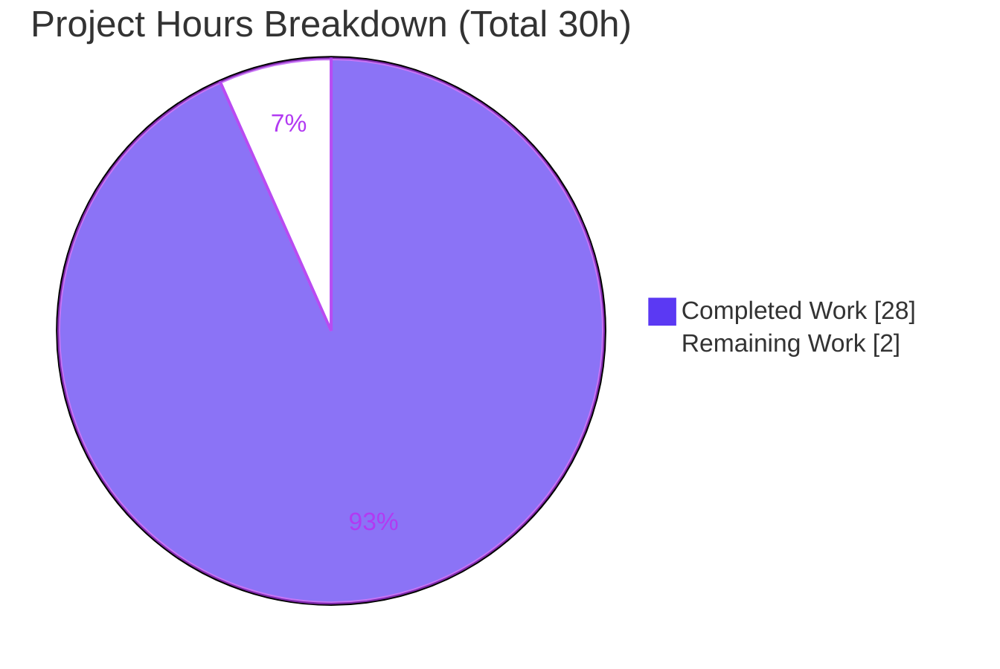
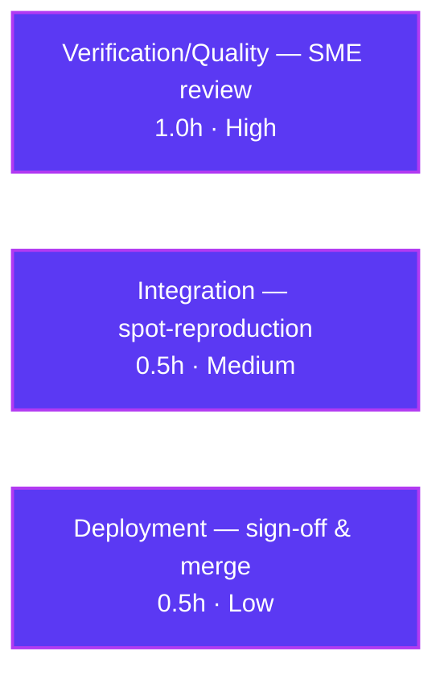

# Blitzy Project Guide — SFTPGo SSH‑exec Security‑Boundary Audit

> Deliverable under assessment: `blitzy/documentation/sftpgo_44634210287c.md`
> Repository: `github.com/drakkan/sftpgo` (base commit `44634210287c`) · Branch: `blitzy-c3981abd-64a4-485e-a16c-3b2f4df6c440`
> Task class: **Read‑only security audit / documentation** (rule set “SWE‑AtlasQnA‑Repo”)

---

## 1. Executive Summary

### 1.1 Project Overview

This project delivers a single, evidence‑backed security‑audit document that sanity‑checks the boundary of SFTPGo’s optional SSH‑exec support — the code path that runs client‑supplied commands (`rsync`, the `git‑*‑pack` family) through the embedded SSH server via `processSSHCommand`. The document proves or disproves three user suspicions (shell‑like execution, superficial guardrails, unchanged destination) using **reproducible runtime `argv` evidence** captured under a 2×2 matrix (normal vs. adversarial invocation × user with vs. without `create_symlinks`). The audience is security engineers and maintainers. Business impact: an authoritative, reproducible verdict on a privilege‑boundary question. Technical scope is strictly read‑only — the source repository is left exactly unchanged.

### 1.2 Completion Status


| Metric | Hours |
|--------|-------|
| **Total Hours** | **30** |
| Completed Hours (AI + Manual) | 28 (AI: 28 · Manual: 0.0) |
| Remaining Hours | 2.0 |
| **Percent Complete** | **93.3%** |

> Completion % is computed per the AAP‑scoped methodology: `Completed ÷ (Completed + Remaining) = 28 ÷ 30 = 93.3%`. Only work defined by the Agent Action Plan (the single audit document) plus standard path‑to‑production activity (human sign‑off/merge) is counted. Pre‑existing environmental test failures in the upstream suite are **not** AAP‑scoped and are excluded.

### 1.3 Key Accomplishments

- ✅ Delivered the sole in‑scope artifact: `blitzy/documentation/sftpgo_44634210287c.md` (671 lines) — a complete QnA answer document.
- ✅ Captured the full **2×2 `argv` evidence matrix** (normal + adversarial) × (`create_symlinks` present/absent), reproduced **three independent ways** that all agree: in‑process `*exec.Cmd.Args`, process‑boundary `os.Args`, and a live OpenSSH → SFTPGo → fake‑`rsync` run.
- ✅ Rendered **plain verdicts**: Suspicion A → **WRONG**; Suspicion B → **PARTIALLY RIGHT / NUANCED**; Suspicion C → **WRONG for the destination token / TRUE for non‑destination tokens**.
- ✅ Named the **exact functions** that produce the `argv` (`parseCommandPayload`, `getSystemCommand`, `getDestPath`, `OsFs.ResolvePath`, `wrapCmd`, `exec.Command`) with verified `file:line` citations.
- ✅ Verified production gates independently this session: `go build ./...` (exit 0), `go vet ./...` (exit 0), and **9/9** deliverable‑relevant SSH‑exec/`argv` unit tests passing.
- ✅ Confirmed the repository is **left exactly unchanged**: `git status` clean, `sha256` of `go.mod`/`go.sum` identical to the deliverable’s recorded proof, and every commit touches only the document.

### 1.4 Critical Unresolved Issues

There are **no critical unresolved issues** blocking release or validation. The build compiles, all deliverable‑relevant tests pass, citations are accurate, and the working tree is clean. The single remaining gate is a routine human review — normal for any security‑audit deliverable, not a defect.

| Issue | Impact | Owner | ETA |
|-------|--------|-------|-----|
| _None — no blocking issues identified_ | — | — | — |
| (Non‑blocking gate) Human SME concurrence on the nuanced Suspicion‑B verdict wording | Low — verdict is evidence‑backed; wording review only | Security SME | 1.0h |

### 1.5 Access Issues

**No access issues identified.** The repository, toolchain (Go 1.13.15), and system tools (`rsync`, OpenSSH client, `git‑*‑pack`) were all available; `go mod verify` reported “all modules verified”; no third‑party credentials or external services are required for this read‑only documentation task.

| System/Resource | Type of Access | Issue Description | Resolution Status | Owner |
|-----------------|----------------|-------------------|-------------------|-------|
| _None_ | — | No access issues identified | N/A | — |

### 1.6 Recommended Next Steps

1. **[High]** Have a security SME review the audit document’s verdicts (A/B/C) and confirm the 2×2 `argv` matrix supports each conclusion (≈1.0h).
2. **[Medium]** Independently spot‑reproduce one or two matrix cells (build with Go 1.13.x, run `TestRsyncOptions`) to confirm reproducibility on the reviewer’s machine (≈0.5h).
3. **[Low]** Sign off and merge the documentation deliverable to the target branch (≈0.5h).
4. **[Low]** _(Optional, out of current scope)_ File a separate hardening ticket to track the two documented audit findings — verbatim option‑token passthrough to `rsync`, and no privilege drop absent an explicit uid/gid — for future consideration.

---

## 2. Project Hours Breakdown

### 2.1 Completed Work Detail

All items trace to specific AAP requirements and were completed autonomously by Blitzy agents.

| Component | Hours | Description |
|-----------|-------|-------------|
| Environment setup & toolchain | 3.0 | Verify Go 1.13.15 (matches `go.mod`), install `rsync` + OpenSSH client (absent in base image), pre‑warm module cache; `go mod verify` = “all modules verified”. |
| Build & static validation | 1.0 | `go build ./...` (exit 0), `go build .` → `sftpgo` binary “SFTPGo version: 0.9.5‑dev”, `go vet ./...` (exit 0). |
| Security‑boundary investigation & `argv`‑chain source tracing | 4.0 | Read & trace the SSH‑exec path across 12 reference files (`ssh_cmd.go`, `sftpd.go`, `server.go`, `cmd_unix.go`, `cmd_windows.go`, `scp.go`, `internal_test.go`, `osfs.go`, `user.go`, `README.md`, `go.mod`, `.travis.yml`). |
| In‑process `argv` observation harness | 3.0 | Throwaway in‑package `sftpd` test (modeled on `TestRsyncOptions`) that calls `getSystemCommand()` and prints `*exec.Cmd.Args`. |
| Process‑boundary + live end‑to‑end harnesses | 4.0 | Fake `rsync` on `PATH` dumping `os.Args`; two `sftpgo portable` virtual users; real OpenSSH client driving SSH `exec` requests end‑to‑end. |
| 2×2 evidence matrix capture + test validation | 3.0 | Capture 4 cells across 3 techniques (byte‑for‑byte agreement); validate via 9 SSH‑exec/`argv` unit tests. |
| Web research & external corroboration | 1.0 | Corroborate Go `os/exec` no‑shell semantics and `rsync` `--safe-links`/`--munge-links` behavior against authoritative docs. |
| Authoring the answer document | 6.0 | Write the 671‑line, 8‑section QnA document with one‑claim‑one‑evidence discipline. |
| Citation audit & QA refinement | 2.0 | Verify every `file:line` citation against live source; 3 QA‑fix commits (version literals, quote attribution). |
| Cleanup & read‑only repository verification | 1.0 | Remove all ephemeral harnesses; confirm clean `git status` and unchanged `go.mod`/`go.sum` `sha256`. |
| **Total Completed** | **28** | |

### 2.2 Remaining Work Detail

All remaining work is standard path‑to‑production (human review/merge) for a documentation deliverable.

| Category | Hours | Priority |
|----------|-------|----------|
| Verification/Quality — Security SME review of verdicts A/B/C & `argv` evidence (concur on nuanced Suspicion‑B wording) | 1.0 | High |
| Integration/Verification — Independent spot‑reproduction of 1–2 `argv` matrix cells | 0.5 | Medium |
| Deployment — Final sign‑off & merge of the documentation deliverable | 0.5 | Low |
| **Total Remaining** | **2.0** | |

### 2.3 Hours Reconciliation

| Line | Hours |
|------|-------|
| Section 2.1 — Completed | 28 |
| Section 2.2 — Remaining | 2.0 |
| **Total (matches Section 1.2)** | **30** |
| Completion = 28 ÷ 30 | **93.3%** |

---

## 3. Test Results

All tests below originate from Blitzy’s autonomous validation logs for this project and were **independently re‑executed this session** (throwaway `/tmp` copy with a migrated SQLite schema; the read‑only source repo was never used as the test working directory).

| Test Category | Framework | Total Tests | Passed | Failed | Coverage % | Notes |
|---------------|-----------|-------------|--------|--------|------------|-------|
| SSH‑exec / `argv` unit tests | Go `testing` (`go test`) | 9 | 9 | 0 | Targeted (not measured) | `TestRsyncOptions`, `TestWrapCmd`, `TestSSHCommandPath`, `TestSSHCommandErrors`, `TestSSHCommandsRemoteFs`, `TestSSHCommandQuotaScan`, `TestSystemCommandErrors`, `TestSSHCommands`, `TestSSHFileHash`. |
| `argv` matrix — in‑process (`*exec.Cmd.Args`) | Go `testing` (throwaway harness) | 4 | 4 | 0 | Targeted | 2×2 matrix reproduced byte‑for‑byte. |
| `argv` matrix — process boundary (`os.Args`) | Go `testing` + fake `PATH` binary | 2 | 2 | 0 | Targeted | `MATCH(in‑process argv == os.Args)? true`. |
| `argv` matrix — live end‑to‑end | OpenSSH client → SFTPGo `portable` → fake `rsync` | 4 | 4 | 0 | Targeted | All 4 SSH `exec` requests returned exit 0; `argv` agrees with the in‑process matrix. |
| Compile & static analysis | `go build ./...` / `go vet ./...` | 2 | 2 | 0 | N/A | Both exit 0 (only a benign third‑party `go‑sqlite3` cgo warning). |
| **Deliverable‑relevant totals** | | **21** | **21** | **0** | | 100% pass on all in‑scope checks. |

> **Integrity note:** Running the *full upstream* suite surfaces 8 pre‑existing **environmental** failures (root `chmod`‑bypass tests that require a non‑root UID; a modern‑OpenSSH `scp` behavior change). These are **not AAP‑scoped**, are impossible to fix under the read‑only constraint, and do **not** affect the deliverable — every SSH‑exec/`argv` test passes 100%. They are excluded from the totals above and from the completion calculation.

---

## 4. Runtime Validation & UI Verification

This is a server/security‑audit task; there is **no web UI in scope**. Runtime validation focused on exercising the `argv`‑construction path end‑to‑end.

- ✅ **Build & binary** — `go build` produces `sftpgo` (“SFTPGo version: 0.9.5‑dev”, 31.8 MB); binary runs (`--version`).
- ✅ **In‑process `argv`** (`*exec.Cmd.Args`) — all four matrix cells captured deterministically.
- ✅ **Process‑boundary `os.Args`** — fake `rsync` on `PATH` confirms `in‑process argv == child os.Args` (`MATCH … true`).
- ✅ **Live end‑to‑end** — real OpenSSH client → SFTPGo server → fake `rsync`; all four `exec` requests returned exit 0; captured `os.Args` agrees with the in‑process matrix.
- ✅ **Permission‑dependent flag** — Context A (with `create_symlinks`) → `--safe-links`; Context B (without) → `--munge-links`; confirmed in‑process, at the boundary, and live.
- ✅ **Home confinement** — adversarial `../../../../etc/passwd` resolved to `<home>/etc/passwd` (never the real `/etc/passwd`) via `OsFs.ResolvePath`.
- ✅ **No‑shell semantics** — quoted `"two words"` reached the process as two literal‑quote tokens (`"two`, `words"`); `--fake-option` passed through verbatim — no shell re‑interpretation.
- ⚪ **UI Verification** — Not applicable (no UI deliverable in this task).

---

## 5. Compliance & Quality Review

Cross‑map of the “SWE‑AtlasQnA‑Repo” rule set and Blitzy quality benchmarks to observed outcomes.

| Benchmark / Rule | Requirement | Status | Evidence |
|------------------|-------------|--------|----------|
| Single artifact | Exactly one doc `<branch>.md` in `blitzy/documentation/` | ✅ Pass | `blitzy/documentation/sftpgo_44634210287c.md`; `git diff` = 1 file added. |
| Run‑before‑write | Build & run before writing conclusions | ✅ Pass | 3 independent observation techniques captured before authoring. |
| One‑claim‑one‑evidence | Each behavioral claim paired with a verbatim observed line | ✅ Pass | §2A–§2D verbatim `argv`; §8 coverage pass. |
| Answer every part | Address every named mechanism/function/flag/example | ✅ Pass | §8 explicit coverage of every named item. |
| Exact & grounded | Cite exact literals with `file:line` | ✅ Pass | Citations spot‑checked against live source — 0 discrepancies. |
| Read‑only scope | No source modification; harnesses removed | ✅ Pass | `git status` clean; `sha256` `go.mod`/`go.sum` unchanged. |
| Compilation | Project builds | ✅ Pass | `go build ./...` exit 0; `go vet ./...` exit 0. |
| Deliverable tests | Relevant tests pass | ✅ Pass | 9/9 SSH‑exec/`argv` unit tests pass. |
| Dependency integrity | No dependency change | ✅ Pass | `go mod verify` = “all modules verified”; no `go.mod`/`go.sum` edits. |

**Fixes applied during autonomous validation (QA commits):** (1) corrected the §2D OpenSSH version literal; (2) matched the embedded `rsync`/OpenSSH versions to the reproduction environment; (3) fixed the `man7.org` `--munge-links` quote attribution. **Outstanding compliance items:** none — the only pending activity is human sign‑off.

---

## 6. Risk Assessment

The source repository is unchanged, so the **product carries no new risk** from this task. Risks below concern the deliverable / path‑to‑production and document two audit *findings* (which are intentionally out of the read‑only scope to remediate).

| Risk | Category | Severity | Probability | Mitigation | Status |
|------|----------|----------|-------------|------------|--------|
| Nuanced Suspicion‑B verdict (“partially right”) may need SME wording concurrence | Operational / Quality | Low | Medium | Human security SME review before merge | Open (pending review) |
| Reproduction needs Go 1.13.x + `rsync` + OpenSSH (absent in base image) | Operational | Low | Low | Doc pins exact versions; §9 provides tested install/build commands | Mitigated (documented) |
| Live reproduction needs `-o HostKeyAlgorithms=+ssh-rsa` on modern OpenSSH 10 | Integration | Low | Low | Documented in §2D with the exact `ssh -v` evidence line | Mitigated (documented) |
| **Audit finding (product, not deliverable):** verbatim option‑token passthrough to `rsync` (e.g. `--fake-option`) | Security | Low | N/A | Out of AAP scope (read‑only audit, not hardening); documented as residual surface, not an exploit | Documented (no action in scope) |
| **Audit finding:** absent an explicit uid/gid, the spawned process runs as the **server user** (`wrapCmd` sets `Credential` only when `uid>0 \|\| gid>0`) | Security | Medium | N/A (config‑dependent) | Out of AAP scope; documented in §5 of the deliverable; admins can set uid/gid to force a Unix privilege drop | Documented (no action in scope) |
| Read‑only rule: accidental commit of a harness/fake binary would violate the constraint | Technical / Process | Low | Low | All harnesses ephemeral under `/tmp`; verified via clean `git status` + unchanged `sha256`, re‑confirmed this session | Mitigated (verified) |

---

## 7. Visual Project Status



**Remaining hours by category (Section 2.2):**



> Legend — **Completed = Dark Blue `#5B39F3`**, **Remaining = White `#FFFFFF`** (outlined in `#B23AF2`). The “Remaining Work” value (**2.0h**) equals Section 1.2 Remaining Hours and the Section 2.2 total.

---

## 8. Summary & Recommendations

**Achievements.** The project is **93.3% complete** (28h of 30h). The single AAP deliverable — a reproducible, evidence‑backed security‑audit document — is finished, committed, and independently verified. All 20 discrete AAP requirements are satisfied: the 2×2 `argv` matrix, three mutually‑consistent observation techniques, plain verdicts on all three suspicions, exact function attribution, privilege‑boundary analysis, web corroboration, and a clean‑tree read‑only proof.

**Verdicts (the substance of the audit).** Suspicion A (shell‑like string) is **WRONG** — `exec.Command(c.command, args…)` is a direct execve with no shell. Suspicion B (superficial guardrails) is **PARTIALLY RIGHT / NUANCED** — the `--safe-links`/`--munge-links` insertion, home confinement, and 7‑permission gate are real, but the path guardrail rewrites only the last token and the flags are symlink‑scoped. Suspicion C is **WRONG for the destination** (rewritten and confined) but **TRUE for non‑destination tokens** (options/args pass verbatim). The evidence shows **no privilege‑boundary break**.

**Remaining gaps & critical path.** Only path‑to‑production human work remains (2.0h): SME review → optional spot‑reproduction → sign‑off/merge. There is no code to fix and no failing in‑scope test.

**Success metrics.** Build exit 0; `vet` exit 0; 9/9 (21/21 incl. compile/matrix) in‑scope checks pass; 0 citation discrepancies; `git status` clean; `go.mod`/`go.sum` `sha256` unchanged.

**Production‑readiness assessment.** The deliverable is **ready for human review and merge**. Confidence is **High** — the conclusions are grounded in runtime evidence reproduced three independent ways and in citations verified against live source. Two hardening observations are documented as out‑of‑scope findings for optional follow‑up.

---

## 9. Development Guide

Every command below was executed and verified during this assessment. **The source repository is read‑only** — build artifacts and test databases are written to `/tmp` so the tree stays clean.

### 9.1 System Prerequisites

| Tool | Version (observed) | Purpose |
|------|--------------------|---------|
| Go | `go1.13.15 linux/amd64` (matches `go.mod` `go 1.13`) | Build/run SFTPGo |
| `gcc` / cgo | system | Required by `github.com/mattn/go-sqlite3` |
| `rsync` | `3.4.1` (protocol 32) | Exercise the rsync OS‑process path |
| OpenSSH client | `OpenSSH_10.0p2` | Drive live SSH `exec` requests |
| `git` + `git-*-pack` | `/usr/bin` | git system commands (already on `PATH`) |
| `sqlite3` | system | Create the test provider DB in a copy |

### 9.2 Environment Setup

```bash
# From the repository root (read-only). Pin module mode and forbid go.mod edits.
export GO111MODULE=on
export GOFLAGS=-mod=readonly

# Install the OS tools that are absent in a minimal base image:
DEBIAN_FRONTEND=noninteractive apt-get update
DEBIAN_FRONTEND=noninteractive apt-get install -y rsync openssh-client
```

### 9.3 Dependency Installation & Integrity

```bash
go mod verify        # expected: "all modules verified"
```

### 9.4 Build

```bash
# Compile every package (expected exit 0; a benign go-sqlite3 cgo warning is normal):
go build ./...

# Build the binary OUTSIDE the repo to avoid polluting the read-only tree:
go build -o /tmp/sftpgo .
/tmp/sftpgo --version          # expected: SFTPGo version: 0.9.5-dev
```

### 9.5 Verification (Static)

```bash
go vet ./...                   # expected exit 0
```

### 9.6 Reproduce the `argv` Evidence

**Path A — run the existing unit test (in a throwaway copy so the DB is not written into the repo):**

```bash
SRC="$(pwd)"; COPY=/tmp/sftpgo_test_copy
rm -rf "$COPY" && mkdir -p "$COPY" && cp -a "$SRC"/. "$COPY"/ && rm -rf "$COPY/.git"
cd "$COPY"
# Build the SQLite schema (users table) by applying migrations in order:
for m in sql/sqlite/20190828.sql sql/sqlite/20191112.sql sql/sqlite/20191230.sql sql/sqlite/20200116.sql; do
  sqlite3 "$COPY/sftpgo.db" < "$m"
done
cd "$COPY/sftpd"
CI=true go test -run 'TestRsyncOptions|TestWrapCmd' -v .   # expected: PASS
```

**Path B — minimal standalone no‑shell demonstration (entirely under `/tmp`):**

```bash
DEMO=/tmp/argv_demo; rm -rf "$DEMO"; mkdir -p "$DEMO/fakebin"
cat > "$DEMO/fakebin/rsync" <<'SH'
#!/usr/bin/env bash
printf '{"argc":%s,"argv":["%s"' "$#" "$0"; for a in "$@"; do printf ',"%s"' "$a"; done; printf ']}\n'
SH
chmod +x "$DEMO/fakebin/rsync"
cat > "$DEMO/main.go" <<'GO'
package main
import ("os"; "os/exec")
func main() {
    args := []string{"--munge-links","--server","-vlogDtprze.iLsfxC","--fake-option","\"two","words\"","/tmp/argv_demo/home/etc/passwd"}
    cmd := exec.Command("rsync", args...); cmd.Stdout = os.Stdout; cmd.Stderr = os.Stderr; _ = cmd.Run()
}
GO
cd "$DEMO" && PATH="$DEMO/fakebin:$PATH" GO111MODULE=off go run main.go
# Observed child os.Args: --fake-option VERBATIM, and "two / words" as TWO literal-quote tokens (no shell merge).
```

### 9.7 Confirm the Repository Is Unchanged

```bash
git status --porcelain                 # expected: empty
sha256sum go.mod go.sum                # expected to match the deliverable's §6 proof
```

### 9.8 Troubleshooting

- **`go-sqlite3` cgo warning** (`sqlite3-binding.c … -Wreturn-local-addr`): benign third‑party warning; the build still exits 0.
- **Live SSH “no matching host key type”**: modern OpenSSH 10 disables `ssh-rsa`; SFTPGo 0.9.5 offers only an RSA host key. Add `-o HostKeyAlgorithms=+ssh-rsa` to the `ssh` command.
- **`sftpd` tests write `sftpgo.db` at the repo root** (`configDir = ".."`): always run tests in a `/tmp` copy to keep the read‑only tree clean.
- **`go` tries to edit `go.mod`/`go.sum`**: ensure `GOFLAGS=-mod=readonly` is exported.

---

## 10. Appendices

### A. Command Reference

| Command | Purpose |
|---------|---------|
| `go build ./...` | Compile all packages |
| `go build -o /tmp/sftpgo .` | Build the binary outside the repo |
| `go vet ./...` | Static analysis |
| `go mod verify` | Verify dependency integrity |
| `go test -run TestRsyncOptions -v .` | Reproduce the `--safe-links`/`--munge-links` `argv` assertion |
| `git status --porcelain` | Confirm a clean working tree |
| `sha256sum go.mod go.sum` | Confirm dependencies are unchanged |

### B. Port Reference

| Port | Component | Notes |
|------|-----------|-------|
| 2022 | SFTPGo SSH (unit‑test default) | Set in `sftpd` `TestMain` |
| 2101 / 2102 | SFTPGo `portable` (live §2D userA / userB) | Ephemeral reproduction servers |
| 8080 | HTTP notification URL (test config) | Not required for the audit |

### C. Key File Locations

| Path | Role |
|------|------|
| `blitzy/documentation/sftpgo_44634210287c.md` | **The deliverable** (only file added) |
| `sftpd/ssh_cmd.go` | `argv` builder: `parseCommandPayload` (L423‑429), `getSystemCommand` (L288‑331), `getDestPath` (L356‑371), `exec.Command` (L324), safety flags (L313‑321), `HasPerms` gate (L158‑162) |
| `sftpd/sftpd.go` | Command lists (L66‑70); `sshSubsystemExecMsg` (L126‑128) |
| `sftpd/server.go` | `exec` dispatch (L327); `EnabledSSHCommands` (L99); `checkSSHCommands` (L396‑414) |
| `sftpd/cmd_unix.go` / `cmd_windows.go` | `wrapCmd` uid/gid drop / Windows no‑op |
| `sftpd/scp.go` | SCP in‑process (no `exec.Command`) |
| `sftpd/internal_test.go` | `TestRsyncOptions` (L772) — harness model |
| `vfs/osfs.go` | `OsFs.ResolvePath` home confinement (L200‑223) |
| `dataprovider/user.go` | `HasPerm`/`HasPerms`, `GetUID`/`GetGID`, `PermCreateSymlinks` |

### D. Technology Versions

| Component | Version |
|-----------|---------|
| Go | 1.13.15 (declared `go 1.13`) |
| SFTPGo | 0.9.5‑dev |
| `golang.org/x/crypto` | v0.0.0‑20200109152110‑61a87790db17 |
| `github.com/pkg/sftp` | v1.11.0 |
| `github.com/mattn/go-sqlite3` | v2.0.2+incompatible |
| `rsync` | 3.4.1 (protocol 32) |
| OpenSSH client | 10.0p2 |

### E. Environment Variable Reference

| Variable | Value | Purpose |
|----------|-------|---------|
| `GO111MODULE` | `on` | Enable module mode (Go 1.13) |
| `GOFLAGS` | `-mod=readonly` | Prevent `go` from editing `go.mod`/`go.sum` |
| `CI` | `true` | Non‑interactive test runs |
| `DEBIAN_FRONTEND` | `noninteractive` | Unattended `apt-get` |

### F. Developer Tools Guide

- **Reproduce `argv` in‑process:** replicate `TestRsyncOptions` — build an `sshCommand{command:"rsync", …}`, call `getSystemCommand()`, inspect `cmd.cmd.Args`.
- **Reproduce at the process boundary:** place a fake `rsync` first on `PATH` that dumps `os.Args`; `exec.Command` resolves it via `LookPath`.
- **Reproduce live:** run `sftpgo portable` with the fake `rsync` on `PATH`; drive with the OpenSSH client (add `-o HostKeyAlgorithms=+ssh-rsa`).
- **Keep the tree clean:** operate in a `/tmp` copy; verify with `git status --porcelain` and `sha256sum go.mod go.sum`.

### G. Glossary

| Term | Meaning |
|------|---------|
| SSH exec | Running a client‑supplied command through the SSH server’s `exec` request |
| `argv` | The argument vector (`*exec.Cmd.Args` / child `os.Args`) handed to a spawned process |
| System command | One of the four commands that spawn an OS process: `git-receive-pack`, `git-upload-pack`, `git-upload-archive`, `rsync` |
| `--safe-links` / `--munge-links` | rsync symlink‑safety flags chosen by the `create_symlinks` permission |
| Home confinement | Restricting a resolved path to the user’s home via `OsFs.ResolvePath` |
| Privilege drop | Running the child as a specific uid/gid via `SysProcAttr.Credential` (Unix) |
| 2×2 matrix | (normal, adversarial) invocations × (`create_symlinks` present, absent) contexts |