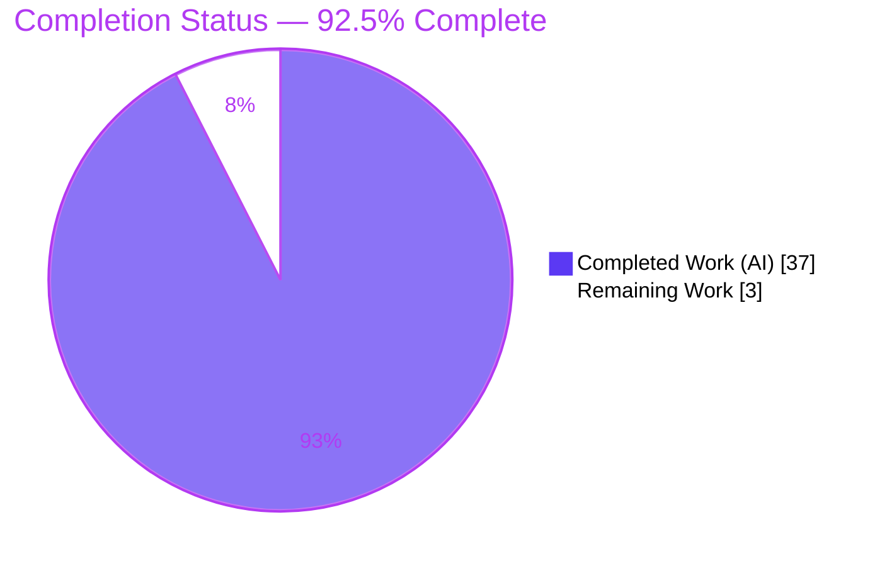
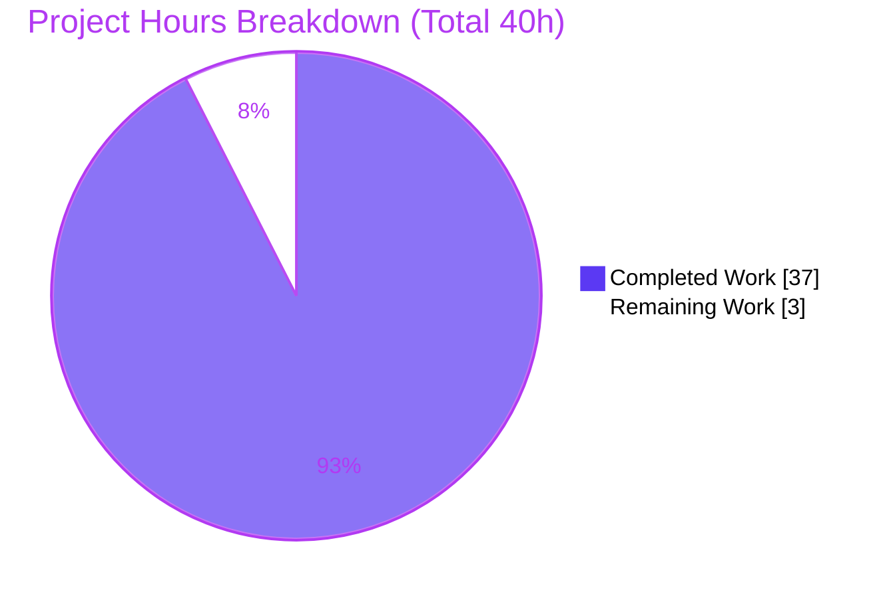
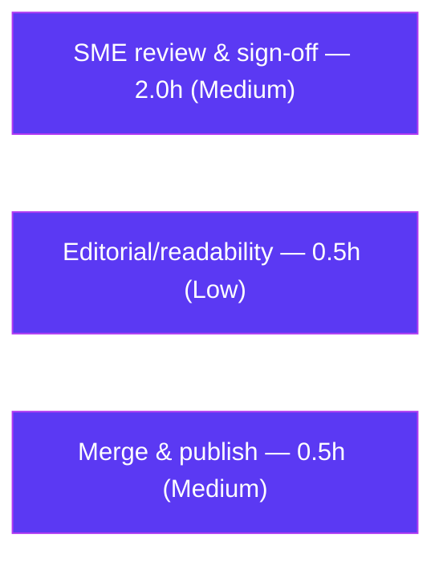

# Blitzy Project Guide — SFTPGo 0.9.5-dev Startup Lifecycle Documentation

> **Deliverable:** `blitzy/documentation/sftpgo_44634210287c.md` — a single, runtime-grounded onboarding document answering five questions about how SFTPGo `0.9.5-dev` behaves at startup.
> **Task class:** Documentation / read-only code investigation (rule set `SWE-AtlasQnA-Repo`).
> **Branch:** `blitzy-961b4918-7b65-43f4-a762-e6d0b4c813f8` · **HEAD:** `185f88ab` · **Base:** `44634210`

---

## 1. Executive Summary

### 1.1 Project Overview

This project produces a single, evidence-based onboarding document that demystifies the **SFTPGo `0.9.5-dev`** startup lifecycle (source branch `sftpgo_44634210287c`). The audience is an engineer onboarding into the codebase who wants to understand what the server *actually does* when launched — every claim is grounded in observed runtime output (build → run → observe → capture), not code reading. The document answers five concrete questions covering config-less startup ports/readiness, SFTP login with a non-existent user, the web-admin root endpoint redirect, missing-database behavior on first startup, and how default configuration surfaces through logs. Technical scope is a **read-only** cross-subsystem investigation (CLI, config loader, service orchestrator, SFTP server, HTTP server, data provider); the sole writable artifact is the answer document.

### 1.2 Completion Status

The project is **92.5% complete**, measured on AAP-scoped work (the answer document and its five evidence-backed answers) plus standard path-to-production activities (human review, editorial pass, and merge). All twelve AAP-specified requirements are complete and independently validated; the remaining 3 hours is human review/sign-off only.



| Metric | Value |
|---|---|
| **Total Hours** | 40.0h |
| **Completed Hours (AI + Manual)** | 37.0h (37.0h AI · 0.0h Manual) |
| **Remaining Hours** | 3.0h |
| **Percent Complete** | **92.5%** |

> **Calculation:** Completion % = Completed ÷ (Completed + Remaining) = 37 ÷ (37 + 3) = 37 ÷ 40 = **92.5%**. Colors — Completed = Dark Blue `#5B39F3`; Remaining = White `#FFFFFF`.

### 1.3 Key Accomplishments

- ✅ **Q1 — Ports & readiness:** exactly two listeners identified — SFTP `[::]:2022` and HTTP admin `127.0.0.1:8080` — enumerated from `/proc/net/tcp*` with PID-ownership proof via `/proc/<pid>/fd`; SFTP and HTTP readiness signals distinguished (HTTP has *no* dedicated "listening" line).
- ✅ **Q2 — Non-existent SFTP user:** canonical three-record log sequence captured (provider WARN → `connection_failed`/password → `sftpd` WARN), ending in `Not found: sql: no rows in result set`; modern-client host-key edge and empty-password nuance documented.
- ✅ **Q3 — Root endpoint:** `GET /` → `301 Moved Permanently`, `Location: /web/users`; follow-through `GET /web/users` → `200` rendered directly (no login/setup interstitial in this version).
- ✅ **Q4 — Missing database:** startup aborts before any listener opens (provider WARN + service ERROR, exit 0); zero-byte-file edge and `.travis.yml` DDL bootstrap → operational transition captured.
- ✅ **Q5 — Default configuration:** config-not-found WARN dump decoded field-by-field against the `globalConf` literal; HTTP timeouts and two inferred nuances labeled.
- ✅ **Evidence discipline:** 5 direct answers, 9 exact commands, 25 verbatim JSON log records, 24 code blocks, ~90–103 `file:line` citations across 18 source files, 7 inferred labels.
- ✅ **Read-only compliance:** exactly one file added; 0 `.go` files modified; no temp artifacts left; `git status --porcelain` empty.
- ✅ **Independent validation:** rebuilt from source (CGO, Go 1.19.13) and reproduced all five scenarios; corrected an AAP citation misattribution (`getUserFromDbRow` is in `sqlcommon.go`, not `user.go`).

### 1.4 Critical Unresolved Issues

| Issue | Impact | Owner | ETA |
|---|---|---|---|
| _None._ No blocking issues. The deliverable is complete, independently validated (5/5 gates pass), and read-only-compliant. | — | — | — |

> No unresolved items block release or validation. The only remaining work is discretionary human review (see §1.6 and §2.2).

### 1.5 Access Issues

| System/Resource | Type of Access | Issue Description | Resolution Status | Owner |
|---|---|---|---|---|
| _None identified._ | — | Source repository, canonical Docker build container (Go 1.19.13), and all host tools (gcc, sqlite3, docker, OpenSSH client, sshpass, curl) were accessible; the build and all runtime observations succeeded. | ✅ No action needed | — |

**No access issues identified.**

### 1.6 Recommended Next Steps

1. **[Medium]** SME technical review & sign-off — optionally reproduce 2–3 runtime claims (Q1 ports, Q2 records, Q4 abort) in the canonical container and verify a sample of `file:line` citations against commit `44634210` (2.0h).
2. **[Low]** Editorial/readability pass — confirm markdown headings, tables, and code blocks render correctly in the target viewer (0.5h).
3. **[Medium]** Merge & publish — approve the PR, confirm `git status --porcelain` is empty and no source files changed, then merge to the target branch (0.5h).

---

## 2. Project Hours Breakdown

### 2.1 Completed Work Detail

Every component below traces to an AAP requirement (R#) from the requirements inventory.

| Component | Hours | Description |
|---|---:|---|
| Environment setup & canonical CGO build (R7/R8) | 3.0 | Canonical Docker container (Go 1.19.13) + gcc/sqlite3/openssh/sshpass/curl; `CGO_ENABLED=1` build of `github.com/drakkan/sftpgo`; verified `--version` = `SFTPGo version: 0.9.5-dev`. |
| Q1 — Config-less startup investigation (R2) | 4.0 | Launch; enumerate listeners from `/proc/net/tcp*`; PID-ownership proof via `/proc/<pid>/fd`; capture 9-record readiness sequence; document host-key auto-generation transition. |
| Q2 — Non-existent user SFTP investigation (R3) | 5.0 | Drive real `sftp` client; capture canonical 3-record path + host-key-negotiation edge + empty-password nuance; full cause→effect chain with `file:line`. |
| Q3 — Root endpoint investigation (R4) | 1.5 | `curl /` → 301; follow redirect → 200; capture full HTML + chi request-logger records. |
| Q4 — Missing database investigation (R5) | 3.5 | Missing-file abort (4 records, exit 0, no listeners) + zero-byte edge (3 records) + `.travis.yml` DDL bootstrap → operational transition. |
| Q5 — Default configuration investigation (R6) | 2.5 | Decode config-not-found WARN dump field-by-field vs `globalConf` literal; search-path; HTTP timeouts; label inferred nuances. |
| Evidence discipline & `file:line` citation verification (R9) | 4.0 | Validate ~90–103 citations line-by-line across 18 source files; ensure every claim carries command + complete output + reference. |
| Document authoring & structure (R1/R10/R12) | 6.0 | Compose 748-line document: methodology, Q1–Q5, Appendices A/B; direct-answer-first structure; exhaustiveness pass. |
| Code-review resolution — 6 findings (commit `8921d350`) | 2.5 | Resolve 6 code-review findings (+417/−59), expanding evidence and precision. |
| Final validation & 2 fixes (commit `185f88ab`) | 5.0 | Independent rebuild; reproduce all 5 scenarios; verify all citations; apply 2 accuracy fixes; confirm git cleanliness. |
| **Total Completed** | **37.0** | **Matches Completed Hours in §1.2.** |

### 2.2 Remaining Work Detail

| Category | Hours | Priority |
|---|---:|---|
| Human SME technical review & sign-off (path-to-production) | 2.0 | Medium |
| Editorial/readability pass (path-to-production) | 0.5 | Low |
| Merge to target branch & publish (path-to-production) | 0.5 | Medium |
| **Total Remaining** | **3.0** | **Matches Remaining Hours in §1.2 and the §7 pie chart.** |

### 2.3 Hours Reconciliation

| Check | Result |
|---|---|
| §2.1 Completed total | 37.0h |
| §2.2 Remaining total | 3.0h |
| §2.1 + §2.2 | 40.0h = Total Project Hours (§1.2) ✅ |
| Remaining across §1.2 / §2.2 / §7 | 3.0h everywhere ✅ |
| Completion % | 37 ÷ 40 = 92.5% ✅ |

---

## 3. Test Results

Because this is a **read-only documentation task, no application test code was authored** (doing so would violate the read-only scope). Accordingly, "tests" here are the **behavioral-reproduction validations executed by Blitzy's autonomous validation system** — the Final Validator rebuilt SFTPGo from source and reproduced each scenario live, comparing observed output against the document. All results below originate from those autonomous validation logs.

| Test Category | Framework / Method | Total | Passed | Failed | Coverage % | Notes |
|---|---|---:|---:|---:|---:|---|
| Build verification | `go build` (CGO enabled, Go 1.19.13) | 1 | 1 | 0 | 100% | Exit 0; `--version` = `SFTPGo version: 0.9.5-dev`; only the expected upstream go-sqlite3 C warning (`-Wreturn-local-addr`). |
| Runtime scenario reproduction (Q1) | Live server + `/proc/net/tcp*` + `/proc/<pid>/fd` | 1 | 1 | 0 | 100% | Exactly 2 ports (SFTP `[::]:2022`, HTTP `127.0.0.1:8080`); `0x07E6`/`0x1F90` decode + PID ownership confirmed. |
| Runtime scenario reproduction (Q2) | Live server + `sftp`/`sshpass` client | 3 | 3 | 0 | 100% | Canonical 3-record path, host-key-negotiation edge (2 records), and empty-password guard all reproduced. |
| Runtime scenario reproduction (Q3) | Live server + `curl` | 2 | 2 | 0 | 100% | `GET /` → 301 (`Location: /web/users`, 45-byte body); `GET /web/users` → 200 rendered. |
| Runtime scenario reproduction (Q4) | Live server (missing DB + zero-byte DB + bootstrap) | 3 | 3 | 0 | 100% | Missing-DB abort (exit 0, no listeners); zero-byte "invalid" error; DDL bootstrap → operational. |
| Runtime scenario reproduction (Q5) | Live server + config dump inspection | 1 | 1 | 0 | 100% | Config-not-found WARN dumps full effective default config; all fields match `globalConf`. |
| Citation accuracy verification | Manual line-by-line vs source @ `44634210` | ~90 | ~90 | 0 | 100% | All `file:line` references correct, including the inferred `logger.go:L64` nuance; 1 AAP misattribution corrected. |
| Read-only compliance check | `git status --porcelain` + diff analysis | 1 | 1 | 0 | 100% | 0 `.go` files changed; only 1 doc added; no temp artifacts; tree clean. |

> **Integrity note:** every row above is sourced from Blitzy's autonomous validation logs for this project (the five validation gates). No synthetic or external test data is included.

---

## 4. Runtime Validation & UI Verification

All items were observed live during autonomous validation.

**Runtime health (server subsystems):**
- ✅ **Operational** — SFTP listener on `[::]:2022` (dual-stack, all interfaces); readiness line `server listener registered address: [::]:2022`.
- ✅ **Operational** — HTTP admin listener on `127.0.0.1:8080`; readiness inferred from the preceding `initializing HTTP server with config …` DEBUG (no dedicated "listening" line — documented, not a defect).
- ✅ **Operational** — RSA-4096 host-key auto-generation on first launch (`id_rsa`, mode `0600`), ≈1.2s, then listener registers.
- ✅ **Operational (correct abort)** — config-less + missing DB aborts before any listener opens, exit code 0.

**API integration outcomes:**
- ✅ **Operational** — `GET /` → `301 Moved Permanently`, `Location: /web/users`, 45-byte body.
- ✅ **Operational** — `GET /web/users` → `200 OK`, chunked HTML.
- ✅ **Operational (correct rejection)** — SFTP auth as non-existent user `ghost` → server logs the 3-record failure sequence; client sees `Permission denied (password,publickey)`.

**UI verification:**
- ✅ **Verified** — the `/web/users` page renders directly (full HTML captured): `<title>SFTPGo - Users</title>`, sidebar brand "SFTPGo Web", active "Users" nav item, static assets referenced under `/static/…`.
- ⚠ **Partial (by design of this version)** — there is **no** admin login or setup interstitial; the users-management page is reachable without authentication. Documented as an observed finding for `0.9.5-dev`, not remediated (read-only scope).

---

## 5. Compliance & Quality Review

Cross-mapping AAP deliverables and the governing rule set (`SWE-AtlasQnA-Repo`) to quality benchmarks. Fixes applied during autonomous validation are noted.

| Benchmark / AAP Rule | Status | Progress | Evidence / Notes |
|---|---|---|---|
| Single deliverable at correct path (`blitzy/documentation/sftpgo_44634210287c.md`) | ✅ Pass | 100% | File present (748 lines); created by commit `177e30e8`. |
| Run-first methodology (build & run, capture real output) | ✅ Pass | 100% | Methodology §Build + §Observation sequence; validator independently rebuilt & reran. |
| Canonical build/config (exact commands + version string) | ✅ Pass | 100% | CGO build command + `--version` = `0.9.5-dev` captured. |
| Evidence discipline (output + command + `file:line` per claim) | ✅ Pass | 100% | 5 direct answers, 9 commands, 25 verbatim JSON records, ~90–103 citations. |
| Inference labeling (mark non-observed claims) | ✅ Pass | 100% | 7 items labeled "inferred" (e.g., `MaxAuthTries 0→6` cap; discarded `logger.Level` return) with corroboration. |
| Exhaustiveness (secondary/edge/error/transitional states) | ✅ Pass | 100% | 14 edge/sibling mentions; before/during/after transitions (host-key gen, DB bootstrap); Appendix B recap. |
| Citation accuracy | ✅ Pass | 100% | All references verified line-by-line; **fix applied** — corrected AAP misattribution: `sql.ErrNoRows → RecordNotFoundError` mapping is in `sqlcommon.go` `getUserFromDbRow` (commit `185f88ab`). |
| Read-only scope (no source modified, no code added, temp removed) | ✅ Pass | 100% | 0 `.go` files changed; only 1 doc added; `git status --porcelain` empty. |
| Version fidelity (no later-release features projected) | ✅ Pass | 100% | Only `0.9.5-dev` behavior reported; doc explicitly excludes later admin-login/FTP/WebDAV/auto-migration features. |

**Outstanding compliance items:** none. All benchmarks pass.

---

## 6. Risk Assessment

Overall posture is **Low** — a read-only documentation deliverable with no code changes, no added dependencies, and no deployment surface.

| Risk | Category | Severity | Probability | Mitigation | Status |
|---|---|---|---|---|---|
| Runtime-detail drift (timestamps, PIDs, socket inodes, `request_id`, `Date` vary per run) | Technical | Low | Low | Document explicitly states only record *structure/content* is meaningful; per-run values are noted as variable. | Mitigated |
| Toolchain divergence (canonical build used Go 1.19.13 vs documented `1.13.x`) | Technical | Low | Low | Version string derives from the source constant, not the compiler; validator confirmed identical behavior. | Mitigated |
| Inferred claims not runtime-confirmed (`MaxAuthTries 0→6`; discarded `logger.Level` return) | Technical | Low | Low | Both explicitly labeled "inferred" and corroborated (SSH-lib default; observed DEBUG stream / doc comment). | Mitigated |
| Reader misapplies old-version weak defaults (legacy `ssh-rsa`/SHA-1 host key; no admin auth on `/web/users`; RSA-only key) | Security | Medium | Low | Documented as observed findings of `0.9.5-dev`; doc warns not to project onto later releases. Out-of-scope to remediate (read-only). | Documented finding |
| Secrets exposure in deliverable | Security | None | Low | Provider password rendered `[redacted]`; no credentials present. | N/A |
| Reproduction depends on Docker build container (Go not on host PATH) | Operational | Low | Low | Development Guide (§9) provides the container build command and host-tool inventory. | Documented |
| Documentation staleness if branch advances beyond commit `44634210` | Operational | Low | Low | Document pins exact commit and version `0.9.5-dev`. | Mitigated |
| Integration failures (external services/APIs/dependencies) | Integration | None | — | Standalone document; no code integration, no external services, no dependencies added. | N/A |

No High or Critical risks. No blocking issues.

---

## 7. Visual Project Status



**Remaining hours by category (from §2.2):**



| Category | Remaining Hours | Bar |
|---|---:|---|
| SME technical review & sign-off | 2.0 | ████████████████ |
| Editorial/readability pass | 0.5 | ████ |
| Merge & publish | 0.5 | ████ |
| **Total** | **3.0** | |

> **Integrity:** the pie chart "Remaining Work" (3) equals the §1.2 Remaining Hours (3.0h) and the sum of the §2.2 Hours column (2.0 + 0.5 + 0.5 = 3.0h). Colors — Completed = Dark Blue `#5B39F3`; Remaining = White `#FFFFFF`.

---

## 8. Summary & Recommendations

**Achievements.** The project delivers a comprehensive, runtime-grounded onboarding document that answers all five questions about SFTPGo `0.9.5-dev`'s startup lifecycle, each with a direct answer, the exact command, complete verbatim observed output, a cause→effect chain naming the responsible function with `file:line`, and every implied edge/transitional state. The work was performed strictly read-only: exactly one file was added and no source file was touched.

**Completion.** The project is **92.5% complete (37 of 40 hours)**. All twelve AAP-specified requirements are complete and independently validated across five gates (Build, Runtime, Claims-Match, Accuracy, Read-Only). During validation, an AAP citation misattribution was corrected, so the deliverable is *more* accurate than the plan it was built from.

**Remaining gaps & critical path to production.** The remaining **3 hours** is entirely human path-to-production: an SME technical review & sign-off (2.0h), a short editorial pass (0.5h), and merge/publish (0.5h). There are no blocking issues, no failing checks, and no missing content.

**Success metrics.** 5/5 validation gates passed; 100% of reproduced scenarios matched the document; ~90–103 `file:line` citations verified; `git status --porcelain` empty.

**Production readiness assessment.** For a documentation deliverable, the artifact is **release-ready pending human sign-off**. Recommended path: perform the SME review, apply any editorial nits, then merge. The completion percentage is capped below 100% to reserve for that human review, consistent with honest-assessment practice.

| Metric | Value |
|---|---|
| Completion | 92.5% (37/40h) |
| AAP requirements complete | 12 / 12 |
| Validation gates passed | 5 / 5 |
| Blocking issues | 0 |
| Source files modified | 0 |

---

## 9. Development Guide

This guide reproduces the runtime observations behind the document. **All artifacts stay outside the repository** to preserve read-only compliance.

### 9.1 System Prerequisites

- **Go 1.13+** as a build-only dependency (`README.md:L40`; the canonical build container uses Go `1.19.13`). The version string reported by the binary comes from the source constant `utils/version.go:L3`, not the compiler.
- **A C compiler (gcc)** — required because the default SQLite provider uses the CGO driver `github.com/mattn/go-sqlite3` (`README.md:L64`, `go.mod`).
- **`sqlite3` CLI** — to bootstrap the database with the canonical schema.
- **`openssh-client` + `sshpass`** — to drive a non-interactive `sftp` client (Q2).
- **`curl`** — to probe the HTTP admin root endpoint (Q3).
- **Canonical build container:** `ghcr.io/scaleapi/swe-atlas:swe_atlas_QnA_drakkan_sftpgo_1.0`.

### 9.2 Environment Setup

Work in a throwaway directory **outside** the repository and keep every artifact (binary, database, `id_rsa`, `sftpgo.log`, copied assets) there:

```bash
mkdir -p /tmp/sftpgo_runs/run_a && cd /tmp/sftpgo_runs/run_a
```

### 9.3 Build (CGO required)

```bash
# inside the canonical build container, at the SFTPGo module tree (/app)
cd /app && CGO_ENABLED=1 GO111MODULE=on \
  go build -o /tmp/sftpgo_bin github.com/drakkan/sftpgo

# verify
/tmp/sftpgo_bin --version
# expected:
# SFTPGo version: 0.9.5-dev
```

A single **expected upstream** compiler warning from the vendored go-sqlite3 C amalgamation (`-Wreturn-local-addr`) is emitted; it is third-party and does not affect the binary.

### 9.4 Run Scenarios

**(a) Config-less + no database → Q5 default-config dump and Q4 "before" abort:**

```bash
cd /tmp/sftpgo_runs/run_a           # empty dir; no sftpgo.db present
/tmp/sftpgo_bin serve
echo "exit code: $?"                # expect 0 — startup aborts before any listener opens
```

**(b) Bootstrap the database + assets, then launch → Q1 ports/readiness and Q4 "after":**

```bash
cd /tmp/sftpgo_runs/run_b
# canonical .travis.yml users-table DDL (21 columns)
sqlite3 sftpgo.db 'CREATE TABLE "users" ("id" integer NOT NULL PRIMARY KEY AUTOINCREMENT, "username" varchar(255) NOT NULL UNIQUE, "password" varchar(255) NULL, "public_keys" text NULL, "home_dir" varchar(255) NOT NULL, "uid" integer NOT NULL, "gid" integer NOT NULL, "max_sessions" integer NOT NULL, "quota_size" bigint NOT NULL, "quota_files" integer NOT NULL, "permissions" text NOT NULL, "used_quota_size" bigint NOT NULL, "used_quota_files" integer NOT NULL, "last_quota_update" bigint NOT NULL, "upload_bandwidth" integer NOT NULL, "download_bandwidth" integer NOT NULL, "expiration_date" bigint NOT NULL, "last_login" bigint NOT NULL, "status" integer NOT NULL, "filters" TEXT NULL, "filesystem" text NULL);'

# web admin needs the asset dirs resolvable from the working directory
cp -r /app/templates /app/static .

/tmp/sftpgo_bin serve &            # launches SFTP [::]:2022 + HTTP 127.0.0.1:8080
```

### 9.5 Verification

```bash
# enumerate LISTEN sockets (state 0A) and prove ownership by the server PID
awk 'NR==1 || $4=="0A"' /proc/net/tcp     # IPv4 → 127.0.0.1:8080 (0x1F90)
awk 'NR==1 || $4=="0A"' /proc/net/tcp6    # IPv6 → [::]:2022 (0x07E6)
PID=$(pgrep -f '/tmp/sftpgo_bin serve')   # the server's own pid
ls -l /proc/$PID/fd | grep -o 'socket:\[[0-9]*\]' | sort -u   # inodes match the LISTEN rows

# readiness in the log file (the full structured stream lives here, not stdout)
grep 'server listener registered address' /tmp/sftpgo_runs/run_b/sftpgo.log
```

### 9.6 Example Usage

```bash
# Q3 — root endpoint redirect
curl -sS -i http://127.0.0.1:8080/          # → 301, Location: /web/users
curl -sS -i http://127.0.0.1:8080/web/users # → 200, rendered users page

# Q2 — SFTP login as a non-existent user (accept the legacy ssh-rsa host key)
sshpass -p 'whatever' sftp -P 2022 \
  -o HostKeyAlgorithms=+ssh-rsa \
  -o StrictHostKeyChecking=no \
  -o UserKnownHostsFile=/dev/null \
  -o NumberOfPasswordPrompts=1 \
  ghost@127.0.0.1
# client → "ghost@127.0.0.1: Permission denied (password,publickey)."
# server log → 3 records ending in "Not found: sql: no rows in result set"
```

### 9.7 Troubleshooting

| Symptom | Cause | Resolution |
|---|---|---|
| Server exits immediately, `error initializing data provider: stat sftpgo.db: no such file or directory` | No database on first startup (Q4); this version does not auto-create it | Bootstrap `sftpgo.db` with the §9.4(b) DDL, then re-run |
| `sqlite database file is invalid` | `sftpgo.db` exists but is 0 bytes (Q4 edge) | Recreate the DB with the DDL (do not leave an empty file) |
| HTTP admin panics on startup | `templates/` (and `static/`) not resolvable from the working directory | `cp -r /app/templates /app/static .` into the run dir before launching |
| `Unable to negotiate … no matching host key type found. Their offer: ssh-rsa` | Modern OpenSSH (≥8.8) rejects the legacy `ssh-rsa`/SHA-1 host key (Q2 edge) | Add `-o HostKeyAlgorithms=+ssh-rsa` to the `sftp` command |
| Build produces a non-working provider | Built without CGO | Set `CGO_ENABLED=1` and ensure gcc is installed |

---

## 10. Appendices

### Appendix A — Command Reference

| Purpose | Command |
|---|---|
| Build (CGO) | `cd /app && CGO_ENABLED=1 GO111MODULE=on go build -o /tmp/sftpgo_bin github.com/drakkan/sftpgo` |
| Version check | `/tmp/sftpgo_bin --version` |
| Start server | `/tmp/sftpgo_bin serve` |
| Bootstrap DB | `sqlite3 sftpgo.db 'CREATE TABLE "users" (… 21 columns …);'` (see §9.4b) |
| Copy web assets | `cp -r /app/templates /app/static .` |
| List IPv4 LISTEN sockets | `awk 'NR==1 || $4=="0A"' /proc/net/tcp` |
| List IPv6 LISTEN sockets | `awk 'NR==1 || $4=="0A"' /proc/net/tcp6` |
| Prove socket ownership | `ls -l /proc/<pid>/fd | grep -o 'socket:\[[0-9]*\]' | sort -u` |
| Probe root endpoint | `curl -sS -i http://127.0.0.1:8080/` |
| SFTP as non-existent user | `sshpass -p 'x' sftp -P 2022 -o HostKeyAlgorithms=+ssh-rsa -o StrictHostKeyChecking=no -o UserKnownHostsFile=/dev/null -o NumberOfPasswordPrompts=1 ghost@127.0.0.1` |
| Confirm repo unchanged | `git status --porcelain` (empty = clean) |

### Appendix B — Port Reference

| Port | Protocol | Bind Address | Subsystem | Readiness Signal |
|---:|---|---|---|---|
| 2022 | SFTP (SSH) | `[::]` (all interfaces, dual-stack) | `sftpd` | `server listener registered address: [::]:2022` (`sftpd/server.go:L187`) |
| 8080 | HTTP admin/REST | `127.0.0.1` | `httpd` | `initializing HTTP server with config …` DEBUG (`httpd/httpd.go:L76`) — no dedicated "listening" line |

### Appendix C — Key File Locations

| Path | Role |
|---|---|
| `blitzy/documentation/sftpgo_44634210287c.md` | **The deliverable** (748 lines) |
| `main.go` | Entry point → `cmd.Execute()` |
| `cmd/root.go`, `cmd/serve.go` | CLI defaults; `serve` → `Start()`/`Wait()` |
| `config/config.go` (+ `config/config_linux.go`) | Default `globalConf`; config-not-found WARN dump; search paths |
| `service/service.go` | Startup orchestration; abort-on-error |
| `sftpd/server.go` | SFTP listener, host keys, auth callbacks |
| `httpd/httpd.go`, `httpd/router.go`, `httpd/web.go` | HTTP init/timeouts; root `/`→301; template loading |
| `dataprovider/sqlite.go`, `dataprovider/sqlcommon.go`, `dataprovider/dataprovider.go` | SQLite init; auth WARN; `RecordNotFoundError` |
| `logger/logger.go`, `logger/request_logger.go` | zerolog model; `ConnectionFailedLog`; HTTP request logger |
| `utils/version.go` | `const version = "0.9.5-dev"` |
| `.travis.yml` | Canonical DB bootstrap DDL + documented Go version |
| `sql/sqlite/*.sql` | Base schema `20190828.sql` + migrations `20191112/20191230/20200116` |

### Appendix D — Technology Versions

| Component | Version | Source |
|---|---|---|
| SFTPGo | `0.9.5-dev` | `utils/version.go:L3` |
| Go (module declaration) | `1.13` | `go.mod:L3` |
| Go (canonical build container) | `1.19.13` | Validation logs |
| gcc (host) | 15.2.0 | Environment |
| sqlite3 (host) | 3.46.1 | Environment |
| Docker (host) | 28.5.2 | Environment |
| OpenSSH client (host) | 10.0p2 | Environment |
| curl (host) | 8.14.1 | Environment |
| `github.com/mattn/go-sqlite3` | `v2.0.2+incompatible` (CGO) | `go.mod` |
| `github.com/go-chi/chi` | `v4.0.2+incompatible` | `go.mod` |
| `github.com/rs/zerolog` | `v1.17.2` | `go.mod` |
| `github.com/spf13/cobra` / `viper` | `v0.0.5` / `v1.6.1` | `go.mod` |

### Appendix E — Environment Variable Reference

| Variable | Value used | Purpose |
|---|---|---|
| `CGO_ENABLED` | `1` | Required for the CGO SQLite driver |
| `GO111MODULE` | `on` | Module-mode build |
| `GOPATH` / `GOCACHE` | e.g. `/tmp/gopath` / `/tmp/gocache` | Keep build caches outside the repo |

> The SFTPGo application itself requires **no** environment variables or secrets to run the default scenarios; configuration comes from CLI defaults and the (absent) config file.

### Appendix F — Developer Tools Guide

| Tool | Use in this project |
|---|---|
| `sqlite3` | Bootstrap the throwaway `users` table (21 columns) with the canonical `.travis.yml` DDL; reproduce the zero-byte-DB edge (`: > sftpgo.db`). |
| `curl` | Probe `GET /` (301) and `GET /web/users` (200) for Q3. |
| `sftp` + `sshpass` | Drive a non-interactive SFTP login as `ghost` for Q2; use `-o HostKeyAlgorithms=+ssh-rsa` to reach the auth path. |
| `/proc/net/tcp*` + `/proc/<pid>/fd` | Enumerate LISTEN sockets and prove ownership by the server PID (Q1) — authoritative when `ss` is unavailable. |
| `git status --porcelain` | Confirm read-only compliance (empty output = clean). |
| Docker | Provide the canonical Go 1.19.13 build toolchain not present on the host PATH. |

### Appendix G — Glossary

| Term | Meaning |
|---|---|
| **AAP** | Agent Action Plan — the primary directive defining project scope. |
| **CGO** | Go's C-interop build mode; required by the SQLite driver. |
| **Readiness signal** | The log line that indicates a subsystem is ready to accept connections. |
| **`connection_failed` record** | A DEBUG log record (Fail2ban-oriented) written on authentication/connection failure, carrying `client_ip`, `username`, `login_type`, `error`. |
| **`login_type: no_auth_tryed`** | The (verbatim, as spelled in the code) login-type recorded when a connection fails before any auth attempt — e.g., host-key negotiation failure. |
| **`RecordNotFoundError`** | The provider error type whose `Error()` yields the `Not found: …` prefix. |
| **Read-only scope** | The rule that no existing repository file may be modified and no code added beyond the answer document. |
| **Path-to-production** | Standard activities to move a validated deliverable to release (here: human review, editorial pass, merge). |

---

*Completion: 92.5% (37 of 40 hours). Remaining 3.0h is human path-to-production (SME review 2.0h · editorial 0.5h · merge 0.5h). Colors — Completed `#5B39F3`, Remaining `#FFFFFF`.*