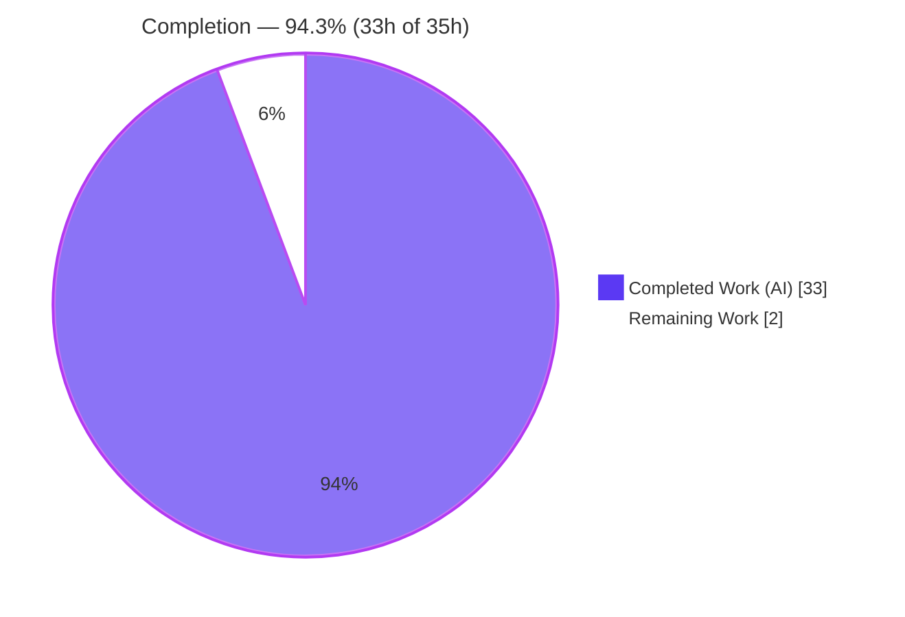
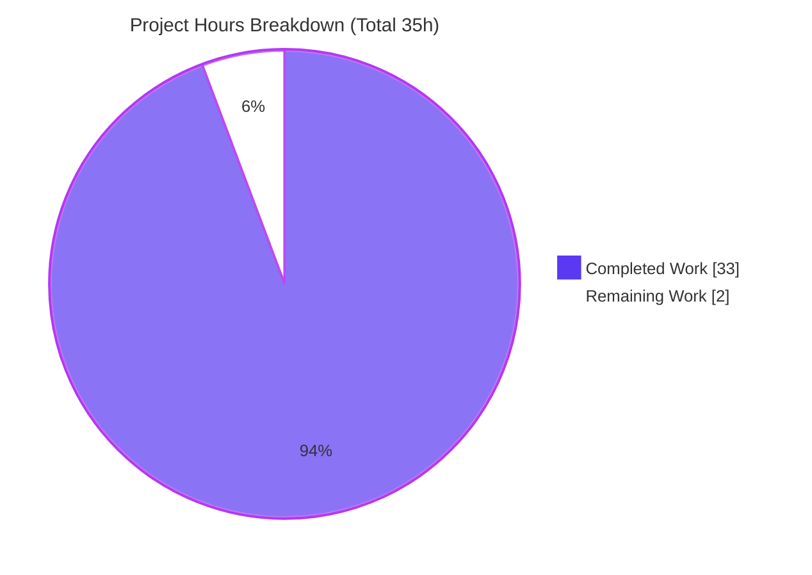
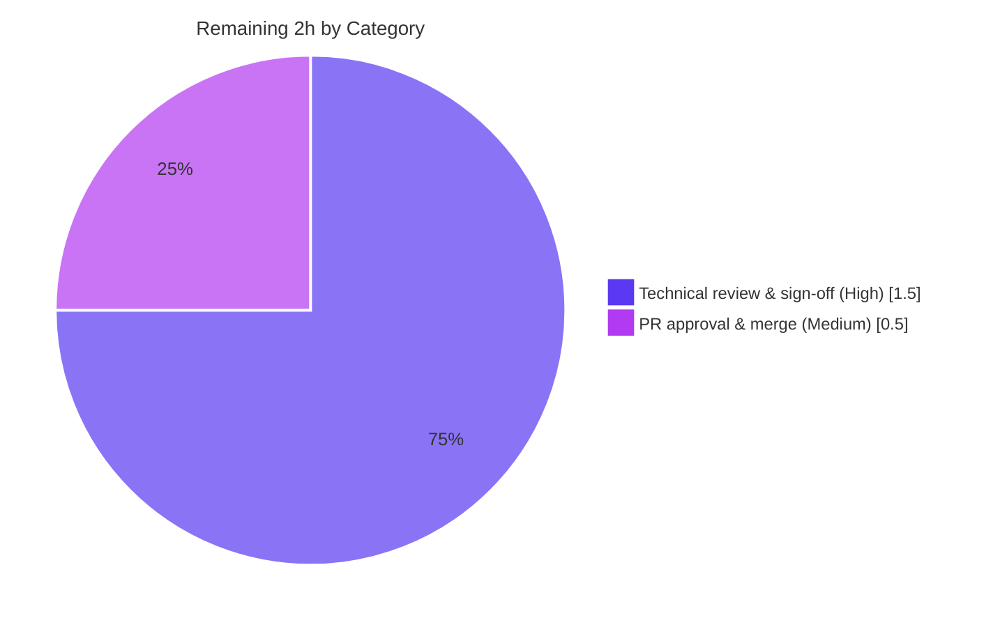

# Blitzy Project Guide — SFTPGo 0.9.5-dev Runtime-Behavior Onboarding Q&A

> Brand legend: **Completed / AI Work** = Dark Blue `#5B39F3` · **Remaining / Not Completed** = White `#FFFFFF` · Headings/Accents = Violet-Black `#B23AF2` · Highlight = Mint `#A8FDD9`.

---

## 1. Executive Summary

### 1.1 Project Overview

This project delivers a single, self-contained onboarding document — `blitzy/documentation/sftpgo_44634210287c.md` — that answers five runtime-behavior questions about the **SFTPGo `0.9.5-dev`** SFTP server, grounded in **directly observed behavior** (the binary built from source and executed under controlled scenarios) and corroborated by exact source-code locators. The audience is engineers onboarding into the SFTPGo repository who value *what is observed at runtime* over *what the code suggests*. The governing rule ("SWE-AtlasQnA-Repo") mandates a documentation-only change: the SFTPGo source tree must remain byte-for-byte unchanged, with all observation scaffolding kept out-of-tree and cleaned up. Scope is intentionally isolated to exactly one new Markdown artifact.

### 1.2 Completion Status

The project is **94.3% complete**. All autonomous (AI) work scoped by the Agent Action Plan is finished and validated; the only remaining work consists of path-to-production human gates (technical sign-off and PR merge).



| Metric | Hours |
|--------|-------|
| **Total Hours** | **35** |
| **Completed Hours (AI + Manual)** | **33** |
| &nbsp;&nbsp;— AI / Autonomous | 33 |
| &nbsp;&nbsp;— Manual (human, completed) | 0 |
| **Remaining Hours** | **2** |
| **Percent Complete** | **94.3%** |

> Calculation (PA1, AAP-scoped): `Completion % = Completed ÷ (Completed + Remaining) = 33 ÷ 35 = 94.3%`.

### 1.3 Key Accomplishments

- ✅ Authored and committed the sole deliverable `blitzy/documentation/sftpgo_44634210287c.md` (452 lines) answering all five questions with the `Observed Behavior → Rationale (code trace) → How to Reproduce` structure.
- ✅ Built SFTPGo `0.9.5-dev` from an **isolated** source copy (Go 1.13.15, `CGO_ENABLED=1`, gcc) and executed it under five controlled scenarios to capture ground truth.
- ✅ Captured live evidence: bound TCP listeners (`[::]:2022`, `127.0.0.1:8080`), ordered startup log sequences, HTTP `301` redirect, missing-DB clean exit, and the redacted default-config WARN dump.
- ✅ Verified **44/44** cited code-trace locators against source — including the document's own self-correction that the SFTP readiness line is at `sftpd/server.go:L187` (not L185).
- ✅ Preserved repository integrity: **zero** source/test/config/build files modified; `git status` clean; all `/tmp` scaffolding removed.
- ✅ Documented edge cases and nuances (size-0 DB, client-dependent Q2 variants, viper cwd search "gotcha", HTTP having no readiness log line, `TrackQuota` 1-vs-2).

### 1.4 Critical Unresolved Issues

| Issue | Impact | Owner | ETA |
|-------|--------|-------|-----|
| _None_ — no blocking issues. The deliverable is complete, accurate, and committed; all five validation gates passed. | None | — | — |

### 1.5 Access Issues

| System/Resource | Type of Access | Issue Description | Resolution Status | Owner |
|-----------------|----------------|-------------------|-------------------|-------|
| _None_ | — | No access issues identified. The deliverable is a self-contained Markdown file requiring no external systems, credentials, or third-party APIs. | N/A | — |

### 1.6 Recommended Next Steps

1. **[High]** Technical review & accuracy sign-off of `blitzy/documentation/sftpgo_44634210287c.md` — confirm each of the five answers addresses its question and the cited locators/observed behaviors are sound (optionally spot-reproduce Q3 via `curl` and Q4 via an empty-dir run).
2. **[Medium]** Approve the pull request and merge the branch into the target branch (single-file additive change, no source impact).
3. **[Low]** Add the document to the team onboarding index/wiki for discoverability.
4. **[Low]** Schedule a future doc refresh if SFTPGo is upgraded beyond commit `44634210` (re-verify line locators against the new HEAD).

---

## 2. Project Hours Breakdown

### 2.1 Completed Work Detail

All completed work is autonomous (AI) and traces to specific AAP deliverables (the build→run→observe→document method that produced the single document).

| Component | Hours | Description |
|-----------|-------|-------------|
| Environment & toolchain setup | 3 | Go 1.13.15 (matches `go.mod`/`.travis.yml`), `CGO_ENABLED=1` + gcc (cgo SQLite driver), observation tools (sqlite3, openssh+sshpass, iproute2/lsof, curl). |
| Isolated source build + verification | 2 | Out-of-tree copy build (repo untouched); `--version` ⇒ `0.9.5-dev`; CLI surface confirmed (help/portable/serve; no `initprovider`). |
| Q1 — startup ports & readiness investigation | 4 | Seed DB, symlink templates/static, no-config run; confirm 2 listeners via ss/lsof//proc; capture 9-line ordered startup log; identify SFTP readiness line; note HTTP has none; RSA-4096 host key. |
| Q2 — unknown-user SFTP auth investigation | 4 | Live `sshpass` probe with OpenSSH `ssh-rsa` workaround; capture 3-line auth chain; document client-dependent single/multi-prompt variants; trace `ServerAuthError`. |
| Q3 — web admin root redirect investigation | 1.5 | `curl GET /` and `/web` ⇒ `301 → /web/users`; verify `Content-Length: 45` via `od -c`; capture access log. |
| Q4 — missing-database startup investigation | 2 | Empty-dir run ⇒ 4-line log, clean `exit 0`, no port, DB not auto-created; size-0 DB edge case ⇒ 3-line "invalid" variant. |
| Q5 — default-config-via-logs investigation | 3 | Capture redacted WARN struct dump; tabulate ~20 defaults across 3 structs; read extra timeouts from source; `TrackQuota` 1-vs-2 + `Banner` nuance; `WarnToConsole` suppression under `-l ""`. |
| Code-trace locator verification | 4 | 44 locators across ~15 source files mapped to observations; includes the L185→L187 self-correction. |
| Q&A Markdown authoring + directory creation | 6 | 452-line document (preamble + 5 answers + consolidated appendix + integrity section); created `blitzy/documentation/`. |
| Repository-integrity verification & cleanup | 1 | `git status` clean; remove all `/tmp` scaffolding (build copy, seeded DB, host keys, symlinks); confirm byte-for-byte unchanged. |
| QA review cycle & corrections | 2.5 | Two follow-up commits (Q5 `WarnToConsole` correction; addressing QA findings). |
| **Total Completed** | **33** | |

### 2.2 Remaining Work Detail

All remaining work is path-to-production (human). Each item traces to a production gate for the AAP deliverable.

| Category | Hours | Priority |
|----------|-------|----------|
| Human SME technical review & accuracy sign-off of the deliverable | 1.5 | High |
| Pull request approval & merge to target branch | 0.5 | Medium |
| **Total Remaining** | **2** | |

> Cross-check: Section 2.1 (33h) + Section 2.2 (2h) = **35h** = Total Hours in Section 1.2. Remaining = **2h** (identical in 1.2, 2.2, and 7).

### 2.3 Hours Summary

| Bucket | Hours | Share |
|--------|-------|-------|
| Completed (AI) | 33 | 94.3% |
| Remaining (Human) | 2 | 5.7% |
| **Total** | **35** | **100%** |

---

## 3. Test Results

This deliverable is a Markdown document and therefore has **no unit tests of its own**. For a runtime-onboarding Q&A, the equivalent of testing is **verifying every documented claim against ground truth**. The table below aggregates the validation activities executed by Blitzy's autonomous validation systems for this project. The SFTPGo Go test suite is **out of scope** (REFERENCE-only; the governing rule forbids modifying source/test files) and is therefore not included here.

| Test Category | Framework / Method | Total | Passed | Failed | Coverage % | Notes |
|---------------|--------------------|-------|--------|--------|-----------|-------|
| Code-Trace Locator Verification | Manual source diff vs. document | 44 | 44 | 0 | 100% | Every cited `file:Lstart-Lend` verified exact, incl. the L185→L187 self-correction. |
| Runtime Scenario Reproduction | Live build + execute (`ss`/`lsof`/`/proc`, `curl`, `sshpass`/`sftp`) | 5 | 5 | 0 | 100% (5/5 questions) | Q1–Q5 each reproduced exactly under its controlled scenario. |
| Build Verification | `CGO_ENABLED=1 go build` (Go 1.13.15) | 1 | 1 | 0 | n/a | Exit 0; `--version` ⇒ `0.9.5-dev`; one benign vendored-SQLite `-Wreturn-local-addr` warning. |
| Repository Integrity | `git status` / `git diff` vs base `44634210` | 1 | 1 | 0 | n/a | Exactly one file added (+452/−0); byte-for-byte unchanged; working tree clean. |
| Markdown Well-formedness | Fence/table/placeholder scan | 1 | 1 | 0 | n/a | 32 balanced code fences; 62 table rows; 0 placeholder/stub tokens. |
| **Total** | | **52** | **52** | **0** | **100%** | Zero discrepancies across all autonomous validation activities. |

> Integrity note: all entries above originate from Blitzy's autonomous validation logs for this project; none are sourced from the product's own (out-of-scope) test suite.

---

## 4. Runtime Validation & UI Verification

All five scenarios were executed against the binary built from source; behavior was captured live (ports, logs, HTTP responses, exit codes, host-key type).

**Runtime health (server build & lifecycle):**

- ✅ **Operational** — Build from isolated copy: exit 0; binary self-reports `SFTPGo version: 0.9.5-dev`.
- ✅ **Operational** — Q1: exactly two listeners bind — SFTP `[::]:2022` (all interfaces) and HTTP `127.0.0.1:8080` (localhost only); confirmed by `ss`, `lsof`, and `/proc/net/tcp*`.
- ✅ **Operational** — Q1 readiness: SFTP signals readiness via `info`/`sftpd` `server listener registered address: [::]:2022`; the 9-line startup sequence appears in the documented order; an RSA-4096 host key is auto-generated on first start.
- ✅ **Operational** — Q4: with a missing database the server logs a WARN + fatal ERROR, exits cleanly (`exit 0`), opens **no** port, and does **not** auto-create the DB; size-0 DB yields the "invalid" 3-line variant.

**API / protocol integration:**

- ✅ **Operational** — Q2: an unknown-user SFTP login is rejected with `Permission denied`; the server emits the unknown-user auth chain and **stays up** (accept loop continues). Both the single-prompt `ServerAuthError` variant and the default multi-prompt `connection reset` variant were observed; the unknown-user rejection lines and `Permission denied` result are invariant.
- ✅ **Operational** — Q3: `GET /` and `GET /web` each return `HTTP 301 Moved Permanently` with `Location: /web/users` and `Content-Length: 45` (43 body bytes + `\n\n`).

**UI verification (web admin):**

- ✅ **Operational** — The web admin root redirect to the users list (`/web/users`) is served as documented.
- ⚠ **Partial (prerequisite, documented)** — The web admin **requires** the `templates/` directory at startup; if absent, `httpd.loadTemplates` (`template.Must(...)`) **panics** (exit 2). This is documented as a startup prerequisite, not a defect; the operational scenarios symlink `templates/`+`static/` into the config-dir.
- ⚠ **Partial (client-side artifact, documented)** — Modern OpenSSH (≥8.8) rejects the autogenerated SHA-1 `ssh-rsa` host key by default; reproduction requires `-o HostKeyAlgorithms=+ssh-rsa`. This is a client compatibility note, not part of any answer.

---

## 5. Compliance & Quality Review

Cross-mapping the governing rule "SWE-AtlasQnA-Repo" directives and AAP deliverables to their compliance status.

| Benchmark / Directive | Requirement | Status | Evidence |
|-----------------------|-------------|--------|----------|
| Deliverable naming | File named `<source_branch_name>.md` | ✅ Pass | `sftpgo_44634210287c.md` (branch `sftpgo_44634210287c`). |
| Comprehensive answers | Answer all five posed questions | ✅ Pass | Q1–Q5 each present with Observed/Rationale/Reproduce. |
| Build & run the source | Observations grounded in a running binary | ✅ Pass | Built `0.9.5-dev` (Go 1.13.15, CGO); 5 scenarios executed live. |
| Evidence over assumption | Each answer pairs observation + code locator | ✅ Pass | 44/44 locators verified exact. |
| Provide rationale | Include thinking/rationale per answer | ✅ Pass | Every answer has a "Rationale (code trace)" subsection. |
| Do not modify existing files | Source tree unchanged | ✅ Pass | `git diff` = 1 file added, 0 modified; `git status` clean. |
| Add no other code | No scripts/fixtures committed | ✅ Pass | Only the Markdown file added; scaffolding lived in `/tmp`, removed. |
| Placement | File in `blitzy/documentation/` of destination repo | ✅ Pass | `blitzy/documentation/sftpgo_44634210287c.md` committed. |
| Cleanup | Temporary artifacts removed | ✅ Pass | All `/tmp` scaffolding removed; no stray processes. |
| Reproducibility | Pin exact version + toolchain | ✅ Pass | `0.9.5-dev`, Go `1.13.15`, `CGO_ENABLED=1` pinned in preamble. |
| Document quality | Well-formed, no placeholders | ✅ Pass | Balanced fences, well-formed tables, 0 placeholder/stub tokens. |

**Fixes applied during autonomous validation:** None required — the document was found 100% accurate against live runtime. Two earlier refinement commits (Q5 `WarnToConsole` behavior correction; QA findings) were already incorporated. **Outstanding compliance items:** None.

---

## 6. Risk Assessment

This is a documentation-only deliverable with zero product-code change, so traditional security/operational/integration risk categories are minimal or non-applicable. All identified risks are Low severity and already mitigated by design.

| Risk | Category | Severity | Probability | Mitigation | Status |
|------|----------|----------|-------------|------------|--------|
| Documentation staleness / code drift (pinned line locators may diverge as source evolves) | Technical | Low | Medium | Doc pins HEAD `44634210`, version `0.9.5-dev`, and toolchain as a point-in-time snapshot; locators are re-verifiable. | Mitigated |
| Reproducibility depends on legacy toolchain (Go 1.13.15 + CGO + gcc) | Technical | Low | Medium | Doc supplies exact toolchain pins, the `go1.13.15` download command, and validated build steps. | Mitigated |
| Non-deterministic observations (Q2 client-dependent variants; RSA-keygen timing; Date header / ephemeral ports) | Technical | Low | Medium | Doc explicitly flags every variable/non-deterministic field and documents both Q2 variants plus the invariants. | Mitigated |
| Documentation maintenance over time (refresh on future SFTPGo upgrades) | Operational | Low | Low | Version-pinned snapshot scoped to commit `44634210`; refresh tracked as a future low-priority task. | Accepted |
| No security risk introduced | Security | None | — | Zero code changed; static Markdown; repo unchanged; provider password shown `[redacted]`; no secrets in doc. | N/A |
| No integration risk | Integration | None | — | Self-contained file; no external deps, API keys, network config, service deps, or CI/CD integration. | N/A |
| Out-of-scope test-suite confusion (pre-existing env-artifact failures in SFTPGo's Go tests) | Process/Scope | Low | Low | Governing rule forbids modifying source/test files; failures documented as out-of-scope environment artifacts, not deliverable concerns. | Documented |

**Overall risk posture: VERY LOW.** No blocking, High, or Critical risks.

---

## 7. Visual Project Status



**Remaining work by category (from Section 2.2, total = 2h):**



| Indicator | Value |
|-----------|-------|
| Completion | 94.3% |
| Completed hours | 33 |
| Remaining hours | 2 |
| Total hours | 35 |
| Blocking issues | 0 |
| Highest risk severity | Low |

> Integrity: the pie "Remaining Work" value (2) equals Section 1.2 Remaining Hours (2) and the Section 2.2 "Hours" total (2).

---

## 8. Summary & Recommendations

**Achievements.** The project fulfills the governing rule end-to-end: a single, comprehensive onboarding document was produced at `blitzy/documentation/sftpgo_44634210287c.md`, answering all five runtime-behavior questions about SFTPGo `0.9.5-dev`. Every answer is grounded in directly observed behavior (built from source and executed under five controlled scenarios) and corroborated by exact source locators — **44/44** of which were verified accurate. The SFTPGo source tree remains byte-for-byte unchanged, and all observation scaffolding was removed.

**Remaining gaps.** No autonomous gaps remain. The outstanding **2 hours** are path-to-production human gates: a technical sign-off and the PR merge.

**Critical path to production.** (1) Human SME reviews the document for accuracy (≈1.5h); (2) PR is approved and merged (≈0.5h). There are no compilation, test, configuration, integration, or deployment blockers because the deliverable is a static document.

**Success metrics.** 5/5 questions answered; 44/44 locators verified; 5/5 runtime scenarios reproduced; 52/52 autonomous validation activities passed; 0 source files modified; 0 blocking issues; 0 placeholder tokens.

**Production-readiness assessment.** At **94.3% complete**, the deliverable is **ready for human review and merge**. Confidence is **High**: the scope is well-defined and isolated, the work is validated against live runtime, and the remaining effort is limited to standard human review/merge gates. Per Blitzy policy, completion is reported below 100% to reserve the final increment for human sign-off.

---

## 9. Development Guide

This guide covers (A) accessing the deliverable and (B) reproducing the runtime observations that produced it. Commands marked _(verified here)_ were executed in the destination environment; the full Go 1.13.15 build is intentionally **ephemeral / out-of-tree** to preserve the repository's byte-for-byte integrity.

### 9.1 System Prerequisites

- **OS:** Linux or macOS (observations captured on Linux).
- **Go `1.13.15`** — matches `go.mod` (`go 1.13`) and `.travis.yml` (`1.13.x`).
- **`CGO_ENABLED=1` + a C compiler (gcc)** — required by the cgo-based default SQLite driver `github.com/mattn/go-sqlite3 v2.0.2+incompatible`.
- **Observation tools:** `sqlite3`, `openssh-client` + `sshpass`, `iproute2` (`ss`) and/or `lsof`, `curl`.
- **`git`** — to check out the branch and verify integrity.

### 9.2 Accessing the Deliverable

```bash
# From the repository root, on the delivery branch:
git log --oneline -3                                  # (verified here) shows the 3 doc commits
wc -l blitzy/documentation/sftpgo_44634210287c.md     # (verified here) => 452
sed -n '1,60p' blitzy/documentation/sftpgo_44634210287c.md   # read the preamble
```

### 9.3 Environment Setup (reproduction)

```bash
# Install the pinned Go toolchain (out-of-tree); set GOROOT/GOPATH as appropriate
curl -sSL https://dl.google.com/go/go1.13.15.linux-amd64.tar.gz \
  | tar -C "$GOROOT" --strip-components=1 -xz
go version    # => go version go1.13.15 linux/amd64

# Copy the repo to /tmp so the source tree is never touched
cp -a <repo> /tmp/sftpgo-iso
```

### 9.4 Build (out-of-tree; repository stays untouched)

```bash
cd /tmp/sftpgo-iso
CGO_ENABLED=1 go build -o /tmp/sftpgo-bin .
/tmp/sftpgo-bin --version          # => SFTPGo version: 0.9.5-dev
# Note: one benign vendored-SQLite "-Wreturn-local-addr" warning; build exits 0 (~31 MB binary).
```

### 9.5 Operational Scenarios (Q1, Q2, Q3, Q5) — require a seeded DB

```bash
# Seed a valid sftpgo.db out-of-tree using the users DDL from .travis.yml:L14
mkdir -p /tmp/sftpgo-work
sqlite3 /tmp/sftpgo-work/sftpgo.db 'CREATE TABLE "users" ("id" integer NOT NULL PRIMARY KEY AUTOINCREMENT, "username" varchar(255) NOT NULL UNIQUE, "password" varchar(255) NULL, "public_keys" text NULL, "home_dir" varchar(255) NOT NULL, "uid" integer NOT NULL, "gid" integer NOT NULL, "max_sessions" integer NOT NULL, "quota_size" bigint NOT NULL, "quota_files" integer NOT NULL, "permissions" text NOT NULL, "used_quota_size" bigint NOT NULL, "used_quota_files" integer NOT NULL, "last_quota_update" bigint NOT NULL, "upload_bandwidth" integer NOT NULL, "download_bandwidth" integer NOT NULL, "expiration_date" bigint NOT NULL, "last_login" bigint NOT NULL, "status" integer NOT NULL, "filters" TEXT NULL, "filesystem" text NULL);'

# Make web-admin assets reachable from the config-dir (else httpd panics at startup)
ln -s <repo>/templates /tmp/sftpgo-work/templates
ln -s <repo>/static    /tmp/sftpgo-work/static

# Run with NO config file, logs to stdout (cwd MUST contain no sftpgo.json)
cd /tmp/sftpgo-work && /tmp/sftpgo-bin serve -l "" -c /tmp/sftpgo-work &
```

### 9.6 Verification

```bash
# Q1 — ports (any one of these):
ss -ltnp | grep -E ':2022|:8080'                          # (ss verified present here)
lsof -iTCP -sTCP:LISTEN -P -n | grep sftpgo               # (lsof verified present here)
awk 'NR>1 && $4=="0A"{print $2}' /proc/net/tcp /proc/net/tcp6   # 2022=07E6, 8080=1F90

# Q3 — web root redirect:
curl -i http://127.0.0.1:8080/        # (curl verified present here) => 301 Location: /web/users
curl -i http://127.0.0.1:8080/web     # identical 301

# Q2 — unknown-user SFTP login (note the ssh-rsa host-key workaround):
sshpass -p x sftp -o HostKeyAlgorithms=+ssh-rsa -o PubkeyAuthentication=no \
  -o PreferredAuthentications=password -o NumberOfPasswordPrompts=1 \
  -o StrictHostKeyChecking=no -o UserKnownHostsFile=/dev/null \
  -P 2022 ghost@127.0.0.1 </dev/null    # => Permission denied; server logs the 3-line chain
```

### 9.7 Missing-Database Scenario (Q4)

```bash
mkdir /tmp/empty && /tmp/sftpgo-bin serve -l "" -c /tmp/empty; echo "exit=$?"   # => 4 log lines, exit=0
ls /tmp/empty                         # DB was NOT auto-created
ss -ltn | grep -E ':2022|:8080'       # no listeners ever bound

# size-0 edge case:
mkdir /tmp/empty0 && : > /tmp/empty0/sftpgo.db
/tmp/sftpgo-bin serve -l "" -c /tmp/empty0; echo "exit=$?"   # => 3-line "is invalid" log, exit=0
```

### 9.8 Cleanup

```bash
kill %1 2>/dev/null                    # stop the server started in 9.5
rm -rf /tmp/sftpgo-iso /tmp/sftpgo-bin /tmp/sftpgo-work /tmp/empty /tmp/empty0
# Confirm the source repository is byte-for-byte unchanged:
git -C <repo> status --porcelain       # (verified here) must print nothing
```

### 9.9 Troubleshooting

- **Go 1.13 unavailable on a modern host:** use the pinned tarball in §9.3; do not substitute a newer Go, so observations match the repository as committed.
- **`Permission denied (publickey)` / host-key rejected:** modern OpenSSH (≥8.8) disables SHA-1 `ssh-rsa`; add `-o HostKeyAlgorithms=+ssh-rsa` (client-side only).
- **Seeing `TrackQuota:2` / a "config file used" line instead of defaults:** viper also searches the **current directory** (`config/config.go:L149`); the repo ships `sftpgo.json`. Run from a directory that contains **no** `sftpgo.json` to observe true in-code defaults (`TrackQuota:1`).
- **Server panics at startup (`open .../templates/base.html`):** the web admin requires `templates/` (and `static/`) reachable from the config-dir; symlink them as in §9.5.
- **`ss`/`lsof` absent in a minimal container:** parse `/proc/net/tcp*` for LISTEN sockets (state `0A`; port `2022` = `07E6`, port `8080` = `1F90`).

---

## 10. Appendices

### Appendix A — Command Reference

| Command | Purpose |
|---------|---------|
| `CGO_ENABLED=1 go build -o /tmp/sftpgo-bin .` | Build SFTPGo (out-of-tree). |
| `/tmp/sftpgo-bin --version` | Confirm `SFTPGo version: 0.9.5-dev`. |
| `/tmp/sftpgo-bin serve -l "" -c <dir>` | Run with no config file; logs to stdout. |
| `ss -ltnp \| grep -E ':2022\|:8080'` | List bound SFTP/HTTP listeners. |
| `curl -i http://127.0.0.1:8080/` | Observe the `301 → /web/users` redirect. |
| `sqlite3 <db> '<users DDL>'` | Seed a valid database (DDL from `.travis.yml:L14`). |
| `git status --porcelain` | Verify the source tree is unchanged. |

### Appendix B — Port Reference

| Port | Subsystem | Bind address | Exposure |
|------|-----------|--------------|----------|
| `2022` | SFTP | `""` ⇒ `[::]:2022` | All interfaces |
| `8080` | HTTP admin / REST | `127.0.0.1` | Localhost only |

### Appendix C — Key File Locations

| Path | Role |
|------|------|
| `blitzy/documentation/sftpgo_44634210287c.md` | **The deliverable** (452 lines). |
| `config/config.go` | In-code defaults (L41–L102); missing-config WARN (L151–L156). |
| `sftpd/server.go` | SFTP daemon: readiness line (L187), `PasswordCallback` (L128–L135), host-key autogen. |
| `httpd/router.go` | Root `301 → /web/users` (L36–L38). |
| `httpd/httpd.go` | `webUsersPath` (L31); HTTP timeouts (L94–L96); `ListenAndServe` (L98). |
| `dataprovider/sqlite.go` | Missing-DB warning (L29–L31); size-0 invalid (L33–L35). |
| `dataprovider/sqlcommon.go` | Unknown-user auth-error log. |
| `service/service.go` | Data-provider init error path (L71). |
| `cmd/serve.go` | Skips `Wait()` on `Start()` error (L29–L31). |
| `.travis.yml` | Users-table DDL (L14) used to seed the test DB. |

### Appendix D — Technology Versions

| Component | Version | Source |
|-----------|---------|--------|
| SFTPGo | `0.9.5-dev` | `utils/version.go:L3` |
| Go toolchain | `1.13.15` | `go.mod` / `.travis.yml` |
| CGO | enabled (`CGO_ENABLED=1`) | required for SQLite |
| `mattn/go-sqlite3` | `v2.0.2+incompatible` | `go.mod` |
| `go-chi/chi` | `v4.0.2+incompatible` | `go.mod` (HTTP router, Q3) |
| `rs/zerolog` | `v1.17.2` | `go.mod` (structured logging) |
| `spf13/viper` | `v1.6.1` | `go.mod` (config loader, Q5) |
| `spf13/cobra` | `v0.0.5` | `go.mod` (CLI) |
| `pkg/sftp` | `v1.11.0` | `go.mod` (SFTP server) |

### Appendix E — Environment Variable Reference

| Variable | Used for | Notes |
|----------|----------|-------|
| `CGO_ENABLED=1` | Build | Mandatory for the cgo SQLite driver. |
| `GOROOT` / `GOPATH` | Build | Point at the pinned Go 1.13.15 install. |
| `SFTPGO_*` (prefix) | Runtime config override | Viper env overrides; nested keys use `__` separator (`config/config.go`). Not used in the no-config observation runs. |

### Appendix F — Developer Tools Guide

| Tool | Role in reproduction |
|------|----------------------|
| `ss` / `lsof` | Inspect bound TCP listeners (Q1). |
| `/proc/net/tcp*` | Fallback listener inspection (LISTEN = `0A`). |
| `curl` | Probe the web admin root endpoint (Q3). |
| `sshpass` + `sftp` | Drive the unknown-user SFTP login (Q2). |
| `sqlite3` | Seed and inspect the test database. |
| `od -c` | Verify the exact `Content-Length: 45` redirect body (Q3). |
| `ssh-keygen -lf id_rsa` | Confirm the autogenerated host key is RSA-4096 (Q1). |

### Appendix G — Glossary

| Term | Definition |
|------|------------|
| **AAP** | Agent Action Plan — the governing technical specification for this task. |
| **Readiness signal** | A log line indicating a subsystem is ready to accept connections (SFTP: `server listener registered address`). |
| **Seeded DB** | A valid `sftpgo.db` created out-of-tree from the users DDL, required because `0.9.5-dev` does not auto-create or migrate the database. |
| **No-config run** | Launching `serve` with no config file so the in-code defaults activate. |
| **Out-of-tree** | Built/run from a `/tmp` copy so the source repository stays byte-for-byte unchanged. |
| **`ServerAuthError`** | The aggregated SSH authentication error surfaced in the SFTP accept-loop log (Q2). |
| **Locator** | A `path:Lstart-Lend` reference pinning an observation to its source code. |

---

*This Blitzy Project Guide reflects AAP-scoped completion only. Completion (94.3%) = Completed hours (33) ÷ Total hours (35); Remaining (2h) is consistent across Sections 1.2, 2.2, and 7.*