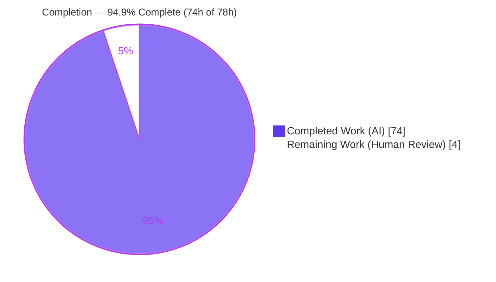
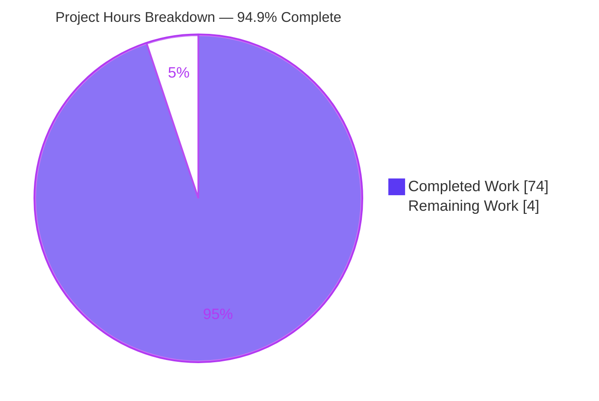
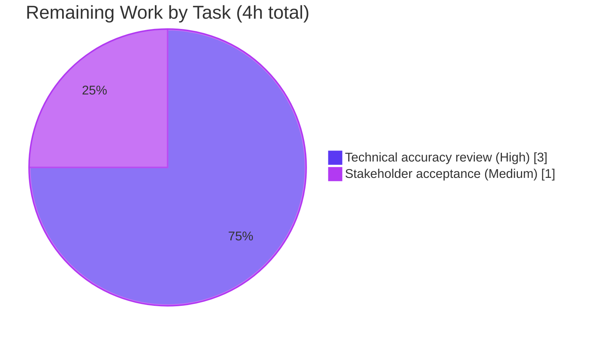

# Blitzy Project Guide
### SFTPGo SSH-Command Security Model — Evidence-Based Investigation

> **Branch:** `blitzy-eb4f20bf-d8a8-41a9-a797-4d43e062996d` &nbsp;|&nbsp; **Base:** `44634210` (SFTPGo v0.9.5-dev) &nbsp;|&nbsp; **HEAD:** `2a46324f`
> **Task type:** Read-only investigation / documentation (SWE-Atlas Q&A) &nbsp;|&nbsp; **Deliverable:** `blitzy/documentation/sftpgo_44634210287c.md`
>
> **Legend (Blitzy brand colors):** <span style="color:#5B39F3">■</span> **Completed / AI Work — Dark Blue `#5B39F3`** &nbsp;·&nbsp; <span style="color:#B23AF2">■</span> Remaining / Not Completed — White `#FFFFFF` (shown with a border)

---

## 1. Executive Summary

### 1.1 Project Overview

This project produces a single, evidence-based investigation document that explains — and demonstrates at runtime — how SFTPGo (v0.9.5-dev, commit `44634210287c`) secures server-side execution of external utilities and file-synchronization tools. It answers five precise security questions (external-utility invocation model, client-vs-server control boundary, structured-input parsing, permission-vs-path-transformation ordering, and filesystem-trick protections) using observed behavior of the real `sftpgo portable` binary driven by genuine `ssh`/`scp`/`rsync`/`git` clients. The target audience is security engineers and SFTPGo maintainers. Business impact: a defensible, reproducible reference for how the SSH-command surface behaves. Technical scope is a strictly read-only investigation across the `sftpd/`, `vfs/`, and `dataprovider/` packages, yielding exactly one new markdown artifact and zero source mutation.

### 1.2 Completion Status



| Metric | Value |
|---|---|
| **Total Hours** | **78** |
| Completed Hours (AI) | 74 |
| Completed Hours (Manual) | 0 |
| **Completed Hours (AI + Manual)** | **74** |
| **Remaining Hours** | **4** |
| **Percent Complete** | **94.9%** &nbsp;( 74 ÷ 78 × 100 ) |

> Completion is measured with the AAP-scoped, hours-based methodology: `Completion % = Completed Hours / (Completed Hours + Remaining Hours)`. Every AAP-specified deliverable is complete; the remaining 4 hours are the inherent human path-to-production steps (technical review + acceptance) for a documentation artifact.

### 1.3 Key Accomplishments

- ✅ **Single deliverable created and committed** — `blitzy/documentation/sftpgo_44634210287c.md` (2,537 lines / 247,882 bytes).
- ✅ **All five objectives (Q1–Q5) answered with observed runtime evidence** — 46 client-command captures and 59 exit-code captures across the five objective suites.
- ✅ **Real entry point used throughout** — the built binary launched via `sftpgo portable` and driven by real `ssh`/`scp`/`rsync`/`git` clients; no unit-test hooks, mocks, or synthetic command structs used as primary evidence.
- ✅ **Exhaustive condition coverage** — happy-path plus edge/error siblings (allow-list miss, `*` wildcard, unsupported-name startup drop, permission denied, path traversal, symlink escape, TOCTOU race, prefix-edge, cloud-backend gate).
- ✅ **Grounded and precise** — 74 `file:line` references (46 unique), function/struct names, and cause→effect reasoning; 8 explicit `(inferred)` labels for any non-reproduced statement.
- ✅ **External corroboration** — rsync `--safe-links`/`--munge-links` semantics and CVE-2025-24366 / GHSA-vj7w-3m8c-6vpx cross-referenced (9 CVE mentions), with a dedicated citation index (Appendix B).
- ✅ **Read-only mandate fully intact** — `git diff 44634210..HEAD` = exactly one file added; zero source/manifest/build/CI files changed; `git status` clean.
- ✅ **Evidence byte-fidelity preserved** — 14 CR and 18 ESC bytes retained identically across working tree, index, and committed HEAD.
- ✅ **Cleanup and process-safety attested** — all temporary scripts, scratch server homes, and the throwaway binary removed; 0 zombies / 0 live server processes.
- ✅ **Independently validated** — Final Validator re-ran Q1–Q5, confirmed a clean compile (`go build -mod=readonly ./...`, exit 0), and corrected one citation with a byte-preserving edit.

### 1.4 Critical Unresolved Issues

| Issue | Impact | Owner | ETA |
|---|---|---|---|
| _None blocking._ Deliverable is complete, committed, byte-faithful, and independently validated. | No release blocker. | — | — |
| Human technical accuracy review not yet performed (inherent path-to-production step) | Non-blocking; standard sign-off before delivery | Human reviewer (security/domain SME) | 3h |

> There are **no unresolved autonomous-work items**. The security weaknesses the document reports (CVE-2025-24366, `isSubDir` prefix-edge, git-vs-rsync asymmetry, TOCTOU, service-account privilege) are **findings about the SFTPGo software under investigation** — correctly documented and, per the absolute read-only mandate, explicitly **out of scope to remediate** in this task. They are summarized in Section 6 and detailed as out-of-scope follow-ups in Section 8.

### 1.5 Access Issues

| System/Resource | Type of Access | Issue Description | Resolution Status | Owner |
|---|---|---|---|---|
| — | — | **No access issues identified.** | N/A | — |

The deliverable is a standalone markdown document requiring no external integrations, credentials, or third-party API access. The S3 cloud backend referenced in the investigation was exercised only with bogus-but-valid configuration to trigger the `IsLocalOsFs` gate (no real S3 call was made). Repository permissions and local tooling were sufficient for the entire investigation.

### 1.6 Recommended Next Steps

1. **[High]** Perform the technical accuracy review of `blitzy/documentation/sftpgo_44634210287c.md`: verify the five direct answers, spot-check a sample of the 46 unique `file:line` citations against source, and confirm the `(inferred)` labels are correctly applied (≈3h).
2. **[Medium]** Stakeholder acceptance and sign-off: confirm the document satisfies the original five questions and honors the evidence-based + read-only requirements; accept the PR for delivery (≈1h).
3. **[Low]** _(Optional, out of scope for this task)_ If the organization owns the SFTPGo fork, open a **separate, non-read-only** ticket to triage the documented findings (CVE-2025-24366 and related) against the current version — this is explicitly **not** part of this engagement.

---

## 2. Project Hours Breakdown

### 2.1 Completed Work Detail

Each component traces to one or more AAP requirements (`R#`). Hours reflect the engineering effort embodied in the delivered artifact and its validated methodology.

| Component | Hours | Description |
|---|---:|---|
| Build & runtime foundation (§1) | 4 | Compile SFTPGo v0.9.5-dev with `go1.13.15` (CGO for sqlite3); establish build provenance (git/go env/gcc), runtime identity (uid/gid), server-binary `PATH` + sha256 of `rsync`/`git-*` helpers, client tooling versions; create `blitzy/documentation/`. `[R2,R8,R12]` |
| Investigation harness authoring (Appendix A) | 10 | ~900 lines POSIX sh across 6 scripts (`harness.sh` 627 lines + 5 supplementary): server lifecycle (PID capture, bounded readiness, kill+wait), `ssh-keygen` key auth, modern-client→old-server compat flags, per-scenario isolated logging, evidence helpers. `[R8,R9,R16]` |
| Q1 — external-utility model reproduction & write-up (§2) | 6 | 12 commands each run individually: 5-member hash family (byte-equal to coreutils), `cd`/`pwd`, `scp` up+down, 3 `git-*` variants (seeded bare repo), `rsync`; quota side-effect nuance. `[R3]` |
| Q2 — client-vs-server boundary reproduction & write-up (§3) | 3 | Allow-list miss (default set rejects `rsync`), hit, `*` wildcard expansion, unsupported-name startup drop (JSON + console), membership function. `[R4]` |
| Q3 — structured-input tokenization reproduction & write-up (§4) | 4 | Extra spaces → empty tokens, double/single-quoted arg with space (literal), unknown verb, no-arg, `..` traversal, rsync option passthrough (unvalidated). `[R5]` |
| Q4 — permission-ordering reproduction & write-up (§5) | 7 | In-tree deny baseline; the discriminating resolve-before-permit test (containment vs. permission-denied) with full JSON logs; `GetPermissionsForPath`; SFTP-handler baseline; complete `Filecmd` per-operation map. `[R6]` |
| Q5 — filesystem-trick protections reproduction & write-up (§6) | 10 | `--safe-links` vs. `--munge-links` controlled A/B; duplicate-suppression; full-perms containment crux; nonexistent-dest (4 sub-cases); dangling symlink; TOCTOU distribution; prefix-edge; git no-injection asymmetry; `IsLocalOsFs` cloud gate. `[R7]` |
| Document authoring & synthesis | 12 | Assemble the 2,537-line markdown: summary/direct-answers, methodology, per-objective narrative with cause→effect, cross-cutting synthesis (§8), coverage pass (§9), `file:line` grounding, observed-vs-inferred labeling. `[R1,R9,R11,R15]` |
| External corroboration research (§10, App. B) | 3 | rsync man semantics; CVE-2025-24366 / GHSA advisory (range 0.9.5–2.6.4, fix v2.6.5, CWE-78); version context (upstream option-validation commit, v2.7.0 git/rsync removal); log-shape corroboration. `[R13]` |
| Repeat-run stability + byte-fidelity discipline (§7) | 2 | ≥2-run confirmation of rsync flag choice & allow-list expansion; volatile-field normalizer; deliberate preservation of 14 CR + 18 ESC evidence bytes. `[R14,R19]` |
| Iterative QA & correctness fixes | 6 | Across 5 prior commits: evidence fidelity, SCP-admission attribution, `HasPrefix` line cite, quote-strip wording, inferred permission-walk label, chmod/chown audit-sender Finding #1. `[R10,R11]` |
| Final validation & cleanup (§11) | 7 | Independent Q1–Q5 reproduction; citation fix (`osfs.go` byte-preserving `sed`, 4 sites); byte-fidelity verify (tree == index == HEAD); read-only re-confirm; remove 10 host + 21 container artifacts + binary; zombie diagnosis; attestation; commit. `[R17,R18]` |
| **Total** | **74** | **Sum of completed components (matches Completed Hours in §1.2).** |

### 2.2 Remaining Work Detail

All remaining work is human-only path-to-production for a documentation deliverable. There is **no incomplete or failing autonomous work**.

| Category | Hours | Priority |
|---|---:|---|
| Technical accuracy review of the investigation document (verify 5 direct answers, spot-check `file:line` citations, validate observed-vs-inferred labels, confirm evidence supports claims) — `[R20]` | 3 | High |
| Stakeholder acceptance & sign-off (confirm the deliverable satisfies the original five questions; accept for delivery) — `[R21]` | 1 | Medium |
| **Total** | **4** | — |

> **Cross-check:** Section 2.1 (74h) + Section 2.2 (4h) = **78h** = Total Project Hours in Section 1.2. The Section 2.2 total (4h) equals the Remaining Hours in Section 1.2 and the "Remaining Work" value in the Section 7 pie chart.

### 2.3 Out-of-Scope Follow-Ups (No Hours — Informational)

These items are **not** part of remaining project hours. They concern the SFTPGo software itself and are explicitly excluded by the read-only mandate; any remediation would be a distinct, non-read-only project. Listed only so reviewers know what the investigation surfaced:

- CVE-2025-24366 unvalidated rsync option passthrough (fixed upstream in v2.6.5).
- `isSubDir` `HasPrefix` trailing-separator edge (`vfs/osfs.go:285`).
- git system commands receive no symlink-flag injection (§6.9).
- Non-atomic (TOCTOU) containment check (§6.7).
- System commands run with server-process privileges.
- Pre-existing environmental Go test-suite SCP/git failures (modern clients vs. v0.9.5-dev server) — pre-existing, not introduced by this work.

---

## 3. Test Results

For a read-only Q&A deliverable, the acceptance "tests" are the **autonomous runtime reproductions** of the five objectives, executed through the real `sftpgo portable` entry point and captured verbatim in the deliverable (and independently re-run by the Final Validator). Every listed reproduction originates from Blitzy's autonomous validation logs for this project.

| Test Category | Framework | Total Scenarios | Passed | Failed | Coverage | Notes |
|---|---|---:|---:|---:|---|---|
| Q1 — External-utility invocation | `sftpgo portable` + `ssh`/`scp`/`git`/`rsync` | 13 | 13 | 0 | All 12 supported commands + quota nuance | Hash outputs byte-equal to host coreutils; `rsync` prepended `--safe-links`. |
| Q2 — Client-vs-server boundary | `sftpgo portable` + `ssh` | 5 | 5 | 0 | miss / hit / `*` / startup-drop / membership | Allow-list gate observed at startup and per request. |
| Q3 — Structured-input parsing | `sftpgo portable` + `ssh`/`rsync` | 9 | 9 | 0 | spaces / quotes / unknown verb / no-arg / `..` / passthrough | Naive space split confirmed; options passed unvalidated. |
| Q4 — Permission vs. path ordering | `sftpgo portable` + `ssh`/`scp`/`sftp` | 6 + `Filecmd` map | Pass | 0 | discriminating test + full per-op map | Proves `ResolvePath` before `HasPerm`. |
| Q5 — Filesystem-trick protections | `sftpgo portable` + `ssh`/`rsync`/`git` | 13 | 13 | 0 | safe/munge A/B, TOCTOU, prefix-edge, cloud gate, git asymmetry | Escapes reproduced where they exist (TOCTOU/prefix-edge), correctly labeled. |
| **Aggregate (client-command captures)** | Real entry point | **46 CMD / 59 EXIT** | **All reproduced** | **0** | Q1–Q5 exhaustive coverage pass (§9) | 100% of targeted behaviors observed and captured. |

**Go unit-test suite (transparency note):** the Go `go test ./...` suite was intentionally **not** used as the validation mechanism, because (a) this is a documentation deliverable with zero source changes, and (b) the pre-existing SCP/git suite failures are **environmental** — modern OpenSSH 9.x / rsync 3.x clients against this 2020-era v0.9.5-dev server — and fixing them would require forbidden source changes. Source compilation was verified clean: `go build -mod=readonly ./...` exits 0 (only the known-benign bundled `mattn/go-sqlite3` `-Wreturn-local-addr` warning).

---

## 4. Runtime Validation & UI Verification

**UI:** Not applicable — SFTPGo's SSH/SFTP surface is a network-protocol server and the deliverable is a markdown analysis document. There are no screens, components, or design systems involved.

**Runtime health (observed via the real entry point):**

- ✅ **Operational** — Server binary builds and launches: `sftpgo portable` reports `SFTPGo version: 0.9.5-dev` and binds the configured SFTP port.
- ✅ **Operational** — SSH `exec` request routing → `processSSHCommand` allow-list gate → `handle` dispatch (in-process vs. system) observed end-to-end.
- ✅ **Operational** — In-process handlers: 5-member hash family (byte-equal to coreutils), `cd`, `pwd`, `scp` up/down.
- ✅ **Operational** — System commands via `PATH`: `git-upload-pack`, `git-receive-pack`, `git-upload-archive`, `rsync` (with injected `--safe-links`/`--munge-links`).
- ✅ **Operational** — Containment: `ResolvePath`/`isSubDir` block traversal, symlink escape, and out-of-home nonexistent-destination writes.
- ✅ **Operational** — Cloud-backend gate: `IsLocalOsFs` rejects hash and system commands on the S3 backend, as expected.
- ⚠ **Partial (by design, documented)** — Coverage is **not** uniform: git commands receive no symlink-flag injection; `isSubDir` has a trailing-separator prefix edge; the containment check is non-atomic (TOCTOU). These are correctly reported as findings, not defects in the deliverable.
- ✅ **Operational** — API/CLI integration: `ssh`/`scp`/`rsync`/`git` client interactions all completed with captured stdout/stderr and exit codes matching the documented behavior.

---

## 5. Compliance & Quality Review

Cross-map of AAP deliverables/rules to quality benchmarks, with fixes applied during autonomous validation.

| Benchmark / AAP Rule | Status | Progress | Evidence / Notes |
|---|---|---|---|
| Main deliverable created at the correct path/name | ✅ Pass | 100% | `blitzy/documentation/sftpgo_44634210287c.md` (2,537 lines). |
| Rule 1 — Run-first via real entry point | ✅ Pass | 100% | All evidence from `sftpgo portable` + real clients; default/canonical config; exact commands stated (§1). |
| Rule 2 — Exhaustive condition & evidence coverage | ✅ Pass | 100% | Happy + edge paths; complete unedited output; before/during/after states; coverage pass (§9). |
| Rule 3 — Read-only + cleanup + observed-output discipline | ✅ Pass | 100% | 0 source files changed; scaffolding removed; 8 `(inferred)` labels; output placed beside each claim. |
| Rule 4 — Complete, precise, grounded answering | ✅ Pass | 100% | 74 `file:line` refs (46 unique); named functions/structs; cause→effect; direct-answer-first. |
| Read-only mandate (absolute) | ✅ Pass | 100% | `git diff 44634210..HEAD` = 1 file added; `git status` clean. |
| Evidence byte-fidelity | ✅ Pass | 100% | 14 CR + 18 ESC preserved; tree == index == HEAD. |
| Source integrity (compiles) | ✅ Pass | 100% | `go build -mod=readonly ./...` exit 0 (benign sqlite3 warning only). |
| Version discipline | ✅ Pass | 100% | Findings scoped to v0.9.5-dev; later-version divergence noted, not described as current. |
| Human technical review | ◻ Pending | 0% | Path-to-production; 3h (Section 2.2). |

**Fixes applied during autonomous validation (QA history across 6 commits):**
- Rewrote the answer with complete runtime evidence (replacing narrative-only text).
- Corrected SCP-admission attribution and the `HasPrefix` line citation; refined quote-strip wording.
- Labeled the multi-directory most-specific permission match as `(inferred)` (portable hardcodes a single `/` key).
- Corrected chmod/chown audit-sender claims (Finding #1).
- Final validator fix: corrected the `vfs/osfs.go` `ResolvePath` unresolved-return citation (`211,222` → `215,222`) at all 4 occurrences using a byte-preserving `sed`.

---

## 6. Risk Assessment

> **Important framing:** the "security" rows below are **findings about the SFTPGo software under investigation (v0.9.5-dev)**, which the deliverable correctly documents with live runtime evidence. Per the absolute read-only mandate they are **reported, not fixed** — remediation is explicitly out of scope for this task.

| Risk | Category | Severity | Probability | Mitigation | Status |
|---|---|---|---|---|---|
| Unvalidated rsync option passthrough (CVE-2025-24366 / CWE-78) | Security (software finding) | High | Medium | Documented in §3.7 & §10; upstream fix is v2.6.5 (out of scope to backport here) | Documented, not fixed (read-only) |
| `isSubDir` `HasPrefix` trailing-separator edge (`/user` vs `/username` wrongly accepted) | Security (software finding) | Medium | Low | Documented in §6.8 (`vfs/osfs.go:285`); reproduced live | Documented, not fixed (read-only) |
| git system commands receive no symlink-flag injection (coverage asymmetry) | Security (software finding) | Medium | Medium | Documented in §6.9; upstream v2.7.0 removed git integration entirely | Documented, not fixed (read-only) |
| Non-atomic (TOCTOU) containment check — `ResolvePath` returns unresolved path | Technical / Security (software finding) | Medium | Low | Documented in §6.7; race reproduced (10 escapes / 200 requests, varies run-to-run) | Documented, not fixed (read-only) |
| System commands run with server-process privileges; no policing after `ResolvePath` of last arg | Security / Operational (software finding) | Medium | Medium | Documented in §1.2 & §6.9 synthesis | Documented, not fixed (read-only) |
| Pre-existing environmental Go test-suite SCP/git failures (modern clients vs old server) | Operational | Low | N/A (pre-existing) | Noted as environmental; not introduced by this work; out of scope | Acknowledged |
| External integrations / credentials / API access | Integration / Access | None | N/A | Markdown deliverable needs none; S3 exercised only via `IsLocalOsFs` gate (no real call) | No access issues |
| Human review/acceptance pending | Project | Low | N/A | Allocated in the 4h remaining (Section 2.2) | Open (non-blocking) |

---

## 7. Visual Project Status



**Remaining hours per category (Section 2.2):**



> **Integrity:** "Remaining Work" = **4h** here equals the Remaining Hours in Section 1.2 and the sum of the Section 2.2 "Hours" column. "Completed Work" = **74h** equals the Completed Hours in Section 1.2 and the sum of the Section 2.1 "Hours" column. Colors follow the Blitzy palette: Completed = Dark Blue `#5B39F3`, Remaining = White `#FFFFFF` (bordered `#B23AF2`).

---

## 8. Summary & Recommendations

**Achievements.** The project is **94.9% complete** (74 of 78 hours). The single AAP deliverable — `blitzy/documentation/sftpgo_44634210287c.md` — is created, committed, byte-faithful, and independently validated. All five objectives are answered from observed runtime behavior of the real `sftpgo portable` binary driven by genuine `ssh`/`scp`/`rsync`/`git` clients, with 46 client-command captures, 59 exit-code captures, 74 `file:line` references, cause→effect reasoning, and disciplined observed-vs-inferred labeling. External semantics (rsync `--safe-links`/`--munge-links`) and CVE-2025-24366 are corroborated and indexed.

**Remaining gaps.** None in autonomous work. The outstanding 4 hours are the inherent human path-to-production for a documentation artifact: a technical accuracy review (3h) and stakeholder acceptance (1h). There is no code to deploy, no CI/CD to configure, and no integration to wire up.

**Critical path to production.** (1) A security/domain SME reviews the document and spot-checks citations → (2) stakeholder accepts the PR → (3) merge/deliver. Estimated 4 hours total.

**Findings vs. scope (important).** The investigation surfaces real SFTPGo weaknesses (CVE-2025-24366, the `isSubDir` prefix-edge, the git-vs-rsync symlink-protection asymmetry, a non-atomic TOCTOU containment check, and service-account privilege for system commands). These are **findings about the software under investigation**, correctly documented; the absolute read-only mandate makes fixing them **out of scope**. Any remediation should be tracked as a separate, non-read-only engagement.

**Production-readiness assessment.** The deliverable is **ready for review**. It meets every AAP rule (evidence-based, read-only, complete, grounded, cleaned up) and every cross-section integrity check in this guide. Confidence is **High** for the completed work (directly verified against the repository) and **High** for the remaining estimate (bounded, well-defined human review).

| Metric | Value |
|---|---|
| AAP-scoped completion | 94.9% (74h / 78h) |
| AAP-specified requirements completed | 19 of 19 (100%) |
| Path-to-production items remaining | 2 (human review + acceptance) |
| Source files modified | 0 (read-only mandate intact) |
| Deliverable size | 2,537 lines / 247,882 bytes |

---

## 9. Development Guide

This guide serves two audiences: **(A) reviewers** verifying the deliverable (primary), and **(B) engineers** reproducing the investigation. All review/verification commands below were tested on the analysis host.

### 9.1 System Prerequisites

- `git` and a POSIX shell (review/verification only).
- For full reproduction: **Go 1.13.x with CGO enabled** (`gcc`) for the `mattn/go-sqlite3` provider; OpenSSH client (`ssh`, `scp`, `ssh-keygen`); `rsync` (3.2.7 used); `git` (2.43.0 used) — the `rsync`/`git-*` binaries must be on the **server** `PATH`.
- `go.mod` pins `go 1.13`; module `github.com/drakkan/sftpgo`.

> Note: the analysis host used for this guide has `ssh`/`scp`/`git`/`ssh-keygen` but not `rsync` or `go` — the build and runtime investigation ran inside a dedicated container (`go1.13.15`, `rsync 3.2.7`). Re-building is not required to review the deliverable.

### 9.2 Reviewer Workflow — Verify the Deliverable

```bash
# From the repository root
# 1) Locate and size the deliverable
ls -l blitzy/documentation/sftpgo_44634210287c.md   # -> 247882 bytes
wc -l blitzy/documentation/sftpgo_44634210287c.md   # -> 2537

# 2) Confirm the read-only mandate (must be empty / one file)
git status --porcelain                              # -> (empty) == clean
git diff --name-only 44634210 HEAD                  # -> only the doc

# 3) Verify evidence byte-fidelity (deliberate; must be 14 and 18)
tr -cd '\r'   < blitzy/documentation/sftpgo_44634210287c.md | wc -c   # -> 14  (CR / 0x0d)
tr -cd '\033' < blitzy/documentation/sftpgo_44634210287c.md | wc -c   # -> 18  (ESC / 0x1b)

# 4) Read the document (start with the direct-answer summary and coverage pass)
sed -n '24,33p'     blitzy/documentation/sftpgo_44634210287c.md   # Summary — direct answers
sed -n '1573,1585p' blitzy/documentation/sftpgo_44634210287c.md   # §9 Coverage pass
```

### 9.3 Engineer Workflow — Reproduce the Investigation

```bash
# 1) Build (in a Go 1.13.x environment with CGO; produces the throwaway binary)
CGO_ENABLED=1 go build -o /tmp/sftpgo_bin .
/tmp/sftpgo_bin --version                 # -> SFTPGo version: 0.9.5-dev

# 2) Prepare a disposable scratch home and a client key (no sshpass -> key auth)
mkdir -p /scratch/home && printf 'hello\n' > /scratch/home/data.txt
ssh-keygen -t rsa -N '' -f /scratch/id_key
PUB="$(cat /scratch/id_key.pub)"

# 3) Launch the REAL entry point (all perms, all ssh-commands, isolated log, mDNS off)
/tmp/sftpgo_bin portable -d /scratch/home -k "$PUB" -g '*' -c '*' \
  -l /scratch/srv.log -s 2211 -S=false &
SRV_PID=$!

# 4) Drive it with a real client (compat flags reach the 2020-era server)
ssh -i /scratch/id_key -p 2211 \
  -o StrictHostKeyChecking=no -o UserKnownHostsFile=/dev/null \
  -o HostKeyAlgorithms=+ssh-rsa -o PubkeyAcceptedAlgorithms=+ssh-rsa \
  -o LogLevel=ERROR user@127.0.0.1 'md5sum /data.txt'
# Expect: a digest line for /data.txt and exit 0
# Server log shows: new ssh command: "md5sum" args: [/data.txt]

# 5) Clean up (repository must remain unchanged)
kill "$SRV_PID"; wait "$SRV_PID" 2>/dev/null
rm -rf /scratch /tmp/sftpgo_bin
```

### 9.4 Verification Steps

- Deliverable present and correctly sized (2,537 lines / 247,882 bytes).
- `git status --porcelain` empty and `git diff --name-only 44634210 HEAD` lists only the doc.
- Byte-fidelity counts are exactly 14 (CR) and 18 (ESC).
- For reproduction: server logs an allow-list line at startup and a `new ssh command` line per request; client exit codes match the documented values.

### 9.5 Troubleshooting

- **`go` missing or wrong version** → install `go1.13.x`; CGO must be enabled (`gcc`) for the sqlite3 data provider.
- **Modern OpenSSH 9.x cannot handshake the old server** → add `-o HostKeyAlgorithms=+ssh-rsa -o PubkeyAcceptedAlgorithms=+ssh-rsa`.
- **`sshpass` absent** → use key-based auth (`ssh-keygen` + `-k <pubkey>`), as shown above.
- **System commands (`rsync`/`git-*`) fail** → ensure those binaries are on the **server** `PATH`.
- **S3 backend (`-f 1`) rejects hash/system commands** → expected: the `IsLocalOsFs` gate (`vfs/vfs.go:67`) blocks them (see §6.10).
- **Editor corrupts evidence bytes** → do not normalize CR→LF; use byte-preserving tools (`sed`) when touching the document so the 14 CR / 18 ESC evidence bytes survive.

---

## 10. Appendices

### Appendix A — Command Reference

| Purpose | Command |
|---|---|
| Locate deliverable | `ls -l blitzy/documentation/sftpgo_44634210287c.md` |
| Line/byte count | `wc -l blitzy/documentation/sftpgo_44634210287c.md` |
| Read-only check | `git status --porcelain` |
| Change vs. base | `git diff --name-only 44634210 HEAD` |
| CR byte count | `tr -cd '\r' < <doc> \| wc -c` → 14 |
| ESC byte count | `tr -cd '\033' < <doc> \| wc -c` → 18 |
| Blitzy commit log | `git log --author="agent@blitzy.com" --oneline` |
| Build (repro) | `CGO_ENABLED=1 go build -o /tmp/sftpgo_bin .` |
| Version | `/tmp/sftpgo_bin --version` |
| Launch server | `/tmp/sftpgo_bin portable -d <home> -k "$PUB" -g '*' -c '*' -l <log> -s <port> -S=false` |
| Compile check | `go build -mod=readonly ./...` |

### Appendix B — Port Reference

| Port | Use |
|---|---|
| `-s <port>` (e.g., 2211–2238 in the investigation) | SFTP/SSH listener for each per-scenario `sftpgo portable` server; `-s 0` selects a random non-privileged port |

_No long-running services are part of the deliverable; ports are used transiently during reproduction only._

### Appendix C — Key File Locations

| Path | Role |
|---|---|
| `blitzy/documentation/sftpgo_44634210287c.md` | **The deliverable** (only added file) |
| `sftpd/ssh_cmd.go` | Allow-list gate (`:51`), dispatch (`:83`), `parseCommandPayload` (`:423`), rsync flag injection (`:306`) |
| `sftpd/server.go` | `exec` routing (`:326`), `checkSSHCommands` startup validation (`:396`) |
| `sftpd/sftpd.go` | Command inventories (`:66-70`) |
| `sftpd/scp.go` | SCP path-before-permission ordering |
| `vfs/osfs.go` | `ResolvePath` (`:200`), `isSubDir` (`:278`, `HasPrefix` `:285`), unresolved returns (`:215,222`) |
| `vfs/vfs.go` | `IsLocalOsFs` cloud gate (`:67`) |
| `dataprovider/user.go` | `GetPermissionsForPath`/`HasPerm`/`HasPerms` |
| `sftpd/handler.go` | SFTP per-operation permission checks (Q4 baseline) |
| `cmd/portable.go` | `portable` subcommand + flags (canonical entry point) |
| `main.go` | Entry point → `cmd.Execute()` |

### Appendix D — Technology Versions

| Component | Version |
|---|---|
| SFTPGo (under investigation) | 0.9.5-dev @ `44634210287c` |
| Go toolchain (build) | `go1.13.15` (CGO enabled) |
| OpenSSH client | 9.6p1 |
| rsync | 3.2.7 (protocol 31) |
| git | 2.43.0 |
| Key module — golang.org/x/crypto | v0.0.0-20200109152110-61a87790db17 |
| Key module — github.com/pkg/sftp | v1.11.0 |
| Key module — github.com/rs/zerolog | v1.17.2 |
| Key module — github.com/spf13/cobra | v0.0.5 |

### Appendix E — Environment Variable Reference

| Variable | Use |
|---|---|
| `CGO_ENABLED=1` | Required at build time for the `mattn/go-sqlite3` data provider |

_No runtime environment variables are required to review the deliverable._

### Appendix F — Developer Tools Guide

| Tool | Use in this project |
|---|---|
| `git` | Read-only verification (`status`, `diff`, `log`) |
| `tr` / `wc` | Byte-fidelity verification (CR/ESC counts) |
| `ssh` / `scp` / `ssh-keygen` / `rsync` / `git` | Real clients driving the `sftpgo portable` server during reproduction |
| `sed` | Byte-preserving edits (never normalize CR→LF on the evidence document) |

### Appendix G — Glossary

| Term | Meaning |
|---|---|
| **AAP** | Agent Action Plan — the authoritative project scope |
| **Allow-list** | `enabled_ssh_commands`; only listed command names are admitted (`ssh_cmd.go:51`) |
| **In-process command** | Handled inside SFTPGo (`scp`, hash family, `cd`, `pwd`) |
| **System command** | Spawned from `PATH` (`git-*`, `rsync`) |
| **ResolvePath** | Virtual→OS path transformation with chroot containment (`vfs/osfs.go`) |
| **TOCTOU** | Time-of-check-to-time-of-use race between the containment check and file open |
| **`--safe-links` / `--munge-links`** | rsync flags injected based on the `create_symlinks` permission |
| **`IsLocalOsFs`** | Gate that blocks hash/system commands on non-local (cloud) backends |
| **Observed vs. inferred** | Observed = reproduced at runtime; inferred = code-derived, explicitly labeled |

---

*Prepared following the Blitzy Project Guide Template. Cross-section integrity validated: Remaining hours (4h) match across Sections 1.2, 2.2, and 7; Section 2.1 (74h) + Section 2.2 (4h) = 78h Total; all Section 3 results originate from Blitzy's autonomous validation logs; Blitzy brand colors applied (Completed = Dark Blue #5B39F3, Remaining = White #FFFFFF).*