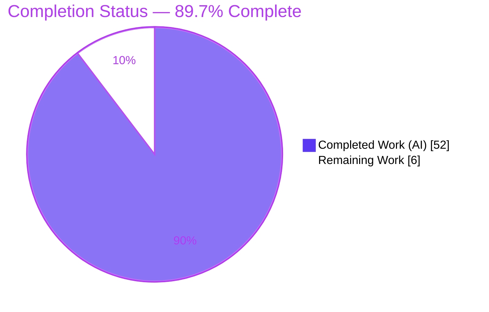
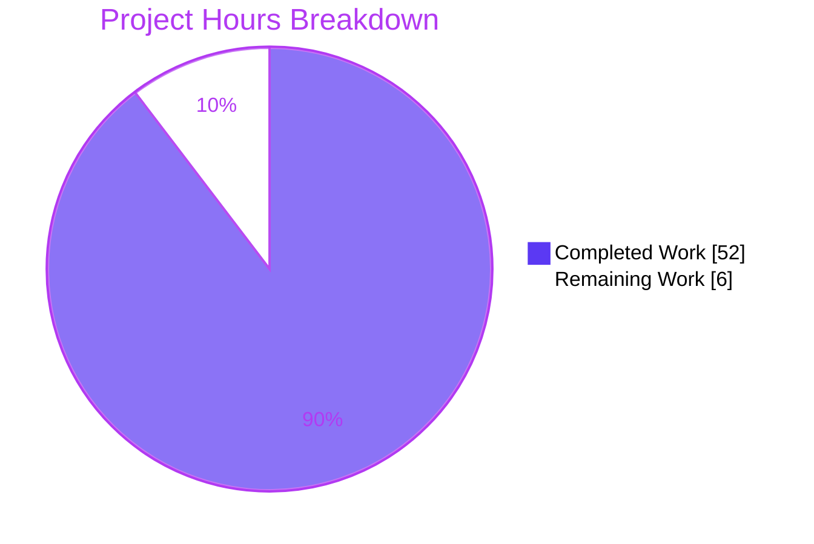
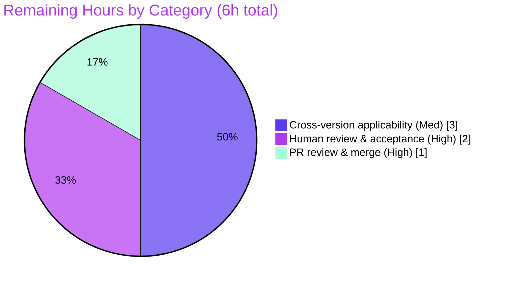

# Blitzy Project Guide — SFTPGo Native-SFTP Quota Enforcement Runtime Investigation

> Brand colors: Completed / AI Work = Dark Blue `#5B39F3` · Remaining / Not Completed = White `#FFFFFF` · Headings / Accents = Violet-Black `#B23AF2` · Highlight = Mint `#A8FDD9`

---

## 1. Executive Summary

### 1.1 Project Overview

This project is a **read-only runtime investigation** that empirically documents how SFTPGo (v0.9.5-dev, HEAD `44634210`) enforces quota limits when a single user has **both** a file-count limit (`quota_files > 0`) and a total-size limit (`quota_size > 0`) active, and files are uploaded over native SFTP up to and past those limits. Target users are SFTP operators and SFTPGo maintainers debugging quota behavior that appears to differ from the documentation. The technical scope is observe-and-document only: build and run SFTPGo in its default canonical configuration (SQLite provider, `track_quota=2`, port 2022, SCP disabled), drive real uploads, and answer five specific questions grounded in observed output. The sole deliverable is one markdown answer document; the SFTPGo source tree is unchanged.

### 1.2 Completion Status



**Center label: 89.7% Complete**

| Metric | Hours |
|--------|-------|
| **Total Hours** | 58 |
| **Completed Hours (AI + Manual)** | 52 (52 AI autonomous + 0 manual) |
| **Remaining Hours** | 6 |
| **Percent Complete** | **89.7%** |

Completion is calculated with the PA1 AAP-scoped, hours-based method: `52 / (52 + 6) = 52 / 58 = 89.7%`.

### 1.3 Key Accomplishments

- ✅ Built the canonical SFTPGo binary from source with CGO (`CGO_ENABLED=1`) and launched it in the default `sftpgo.json` configuration; confirmed version banner **SFTPGo version: 0.9.5-dev**.
- ✅ Seeded a temporary SQLite `sftpgo.db`, created the `users` table, and provisioned a dual-limit test user (`quota_files > 0` **and** `quota_size > 0`) via the REST API.
- ✅ Drove **real native-SFTP uploads** (custom `github.com/pkg/sftp v1.11.0` client) under → over both the **SIZE** limit and the **FILE-COUNT** limit, at scale, with **≥2 runs per dimension** for stability.
- ✅ Answered all **five mandatory questions (Q1–Q5)** with verbatim, unedited runtime evidence and 53 `file:line` code groundings across 9 source files.
- ✅ Documented the three quota-enforcement paths (native SFTP vs SCP vs SSH-command) to reconcile the "differs from documentation" premise, plus edge cases (existing-file overwrite, out-of-band divergence + `quota_scan` reconciliation, non-atomic concurrency gate).
- ✅ Delivered reproducibility artifacts: a hardened Go observation client (Appendix A), source excerpts (Appendix B), and a one-shot reproduction harness (Appendix C).
- ✅ Passed full autonomous validation: **5 production-readiness gates ALL PASS, zero corrections required**, read-only integrity confirmed (`git diff` shows exactly one file added).

### 1.4 Critical Unresolved Issues

| Issue | Impact | Owner | ETA |
|-------|--------|-------|-----|
| None blocking | The single in-scope artifact is complete, accurate, and fully validated; no issue blocks release or validation. | — | — |

> There are **no critical unresolved issues**. All remaining work is standard human review/merge and an optional cross-version applicability check (Section 2.2). Observed SFTPGo product quirks (SIZE overshoot, generic client error, non-atomic concurrency gate, unauthenticated dev REST, negative-quota acceptance, missing hardening headers) are **documented-as-observed** per the read-only rule, not defects in the deliverable.

### 1.5 Access Issues

| System/Resource | Type of Access | Issue Description | Resolution Status | Owner |
|-----------------|----------------|-------------------|-------------------|-------|
| Source repository | Git read/write | None — branch `blitzy-7ff93470…` checked out, HEAD `227074a8`, clean working tree. | ✅ Resolved | — |
| Canonical build toolchain | Docker image `ghcr.io/scaleapi/swe-atlas:swe_atlas_QnA_drakkan_sftpgo_1.0` | Local Ubuntu box lacks Go and `sqlite3`; canonical build/run requires the Docker image. The Final Validator already executed the full build/run/reproduction inside that image. | ✅ Resolved (validated in image) | Human (for re-run) |

No access issues prevent build validation, integration, or deployment of the deliverable.

### 1.6 Recommended Next Steps

1. **[High]** Review the investigation document for correctness and completeness; confirm the five answers resolve the real debugging question and spot-check at least one verbatim transcript. *(2h)*
2. **[High]** Approve and merge the documentation PR to `main`; confirm read-only integrity (exactly one file added, source tree byte-for-byte unchanged). *(1h)*
3. **[Medium]** Perform the cross-version applicability check: identify the user's actually deployed SFTPGo version and, if newer than 0.9.5-dev, re-run the Appendix C harness to confirm or adapt the `hasSpace` / `Transfer.Close` findings. *(3h)*
4. **[Low]** *(Advisory, 0h — out of scope)* Optionally file upstream issues for the observed 0.9.5-dev product quirks (non-atomic concurrency gate, unauthenticated REST, negative-quota acceptance, missing hardening headers).

---

## 2. Project Hours Breakdown

### 2.1 Completed Work Detail

| Component | Hours | Description |
|-----------|-------|-------------|
| Canonical environment & CGO build + runtime startup | 3 | Build with `CGO_ENABLED=1` / Go toolchain; launch default `sftpgo.json`; confirm "0.9.5-dev" banner (§1, §2). |
| Native-SFTP observation client development | 5 | Hardened 220-line Go client on `pkg/sftp v1.11.0` with host-key pinning, per-stage timing, assertions (Appendix A). |
| Schema seeding & dual-limit user provisioning | 2 | Create temp `sftpgo.db` + `users` table; provision user with `quota_files>0` AND `quota_size>0` via REST (§3). |
| SIZE-limit reproduction ×2 runs + per-upload Q4 | 3 | Upload under → over the size limit twice; capture overshoot + reported-vs-disk each upload (§4). |
| FILE-COUNT-limit reproduction ×2 runs + per-upload Q4 | 3 | Upload under → over the file-count limit twice; confirm stop at exactly 3/3 (§5). |
| Reported-vs-disk + out-of-band divergence + quota_scan | 3 | Compare DB counters to on-disk; force out-of-band divergence; reconcile with `quota_scan` (§6). |
| Existing-file overwrite + non-atomic concurrency gap | 3 | Exercise `hasSpace(false)` overwrite path; observe 5/5 concurrent opens at `quota_files=1` (§7, §15). |
| Source reading & file:line grounding + excerpts | 4 | Read/verify quota lifecycle across 9 files; 53 groundings; source excerpts (Appendix B). |
| Q1–Q5 answer authoring with causal rationale | 5 | Author five individually-headed answers with observed evidence + code grounding (§8–§12). |
| Contrast-path analysis + README reconciliation | 3 | Native vs SCP vs SSH-command quota semantics; reconcile "differs from docs" (§13). |
| Security & trust-boundary guidance | 2 | Document observed security posture and test-isolation guidance (§14). |
| Methodology/cleanup narrative + harness + metadata | 3 | Scale/stability/cleanup narrative (§15); one-shot harness (Appendix C); metadata + TL;DR. |
| Validation: dependency + canonical compilation gates | 2 | `go mod download` (deps unchanged); canonical build exit 0 (GATE1, GATE2). |
| Validation: unit tests (config + sftpd quota + httpd) | 2 | config PASS; sftpd quota subset 7/7 PASS; httpd user/quota PASS (GATE3). |
| Validation: live runtime reproduction of all 5 Q ≥2 runs | 5 | Reproduce every question live with edge cases on the running server (GATE4, GATE5). |
| Validation: claim-by-claim verification + git integrity | 4 | Verify every value/log/error/file:line/checksum; confirm read-only; cleanup. |
| **Total Completed** | **52** | |

### 2.2 Remaining Work Detail

| Category | Hours | Priority |
|----------|-------|----------|
| Human review & acceptance of investigation findings | 2 | High |
| PR review & merge of documentation branch to `main` | 1 | High |
| Cross-version applicability check vs user's deployed SFTPGo version | 3 | Medium |
| **Total Remaining** | **6** | |

### 2.3 Hours Reconciliation

| Quantity | Hours | Formula |
|----------|-------|---------|
| Completed (Section 2.1) | 52 | Σ completed rows |
| Remaining (Section 2.2) | 6 | Σ remaining rows |
| **Total Project** | **58** | 52 + 6 |
| **Completion %** | **89.7%** | 52 / 58 × 100 |

Cross-section integrity: Section 2.1 (52) + Section 2.2 (6) = 58 = Total in Section 1.2 ✅. Remaining (6) is identical in Sections 1.2, 2.2, and 7 ✅.

---

## 3. Test Results

All tests below originate from **Blitzy's autonomous validation logs** (Final Validator, GATE3) executed inside the canonical Docker image. Test names were independently confirmed to exist in `sftpd/*_test.go` and `httpd/httpd_test.go`.

| Test Category | Framework | Total Tests | Passed | Failed | Coverage % | Notes |
|---------------|-----------|-------------|--------|--------|------------|-------|
| Config unit | Go `testing` | 1 (package) | 1 | 0 | n/a | `ok github.com/drakkan/sftpgo/config`. |
| SFTPd quota subset | Go `testing` (`-run`) | 7 | 7 | 0 | n/a | TestRemoveNonexistentQuotaScan, TestSFTPGetUsedQuota, TestQuotaDisabledError, TestQuotaFileReplace, TestQuotaScan, TestMultipleQuotaScans, TestQuotaSize. |
| HTTPd user & quota | Go `testing` | 5 (+ Mock variants) | all | 0 | n/a | TestBasicUserHandling, TestUpdateUser, TestAddDuplicateUser, TestGetQuotaScans, TestStartQuotaScan (+ Mock variants). |
| Native-SFTP runtime reproduction | Custom `pkg/sftp v1.11.0` client | 5 questions × ≥2 runs | all | 0 | n/a | Q1–Q5 reproduced live on the running server; every value/log/error string matched. |

> **Scope note:** The full `./sftpd/` suite was intentionally **not** run because `TestSCPErrors` hangs ~900s and SCP is out of scope / disabled by default. The native-SFTP quota subset was run selectively via `-run`, per setup guidance. Coverage percentages are not reported by the harness for this investigation; the emphasis was live behavioral reproduction rather than line coverage.

---

## 4. Runtime Validation & UI Verification

This is a headless server investigation; there is **no UI**. Runtime health and API integration were verified on the live server.

- ✅ **Operational** — Server startup: banner **SFTPGo version: 0.9.5-dev**; startup log matched documentation §2 (`BindPort:2022`, `IsSCPEnabled:false`, `Driver:sqlite`, `TrackQuota:2`, `UsersTable:users`, HTTPD `127.0.0.1:8080`).
- ✅ **Operational** — SFTP listener on `:2022` LISTEN; native-SFTP uploads succeed and are throttled/accounted.
- ✅ **Operational** — REST API on `127.0.0.1:8080` LISTEN; `GET /api/v1/user` → HTTP 200; dual-limit user provisioned via `POST /api/v1/user`.
- ✅ **Operational** — Quota enforcement: pre-open `hasSpace` gate rejects the next upload once usage meets/exceeds a limit; client receives `sftp: "Failure" (SSH_FX_FAILURE)`.
- ✅ **Operational** — Quota accounting: post-close `Transfer.Close → UpdateUserQuota` increments DB counters; reported == on-disk for pure-SFTP uploads including overshoot.
- ✅ **Operational** — `POST /api/v1/quota_scan` reconciles counters to disk after an out-of-band divergence (reported 500/1 vs actual 1277/2 → reconciled to 1277/2).
- ⚠ **Partial (by design, documented)** — Non-atomic concurrency gate: 5/5 concurrent opens admitted at `quota_files=1` (product limit-enforcement gap, documented not fixed).

---

## 5. Compliance & Quality Review

Cross-map of AAP deliverables and governing rules to Blitzy quality/compliance benchmarks. "Fixes applied" reflects the autonomous code-review cycle (commit `cee75728` resolved 12 findings).

| AAP / Rule Requirement | Benchmark | Status | Progress | Notes |
|------------------------|-----------|--------|----------|-------|
| Deliverable: single doc named `sftpgo_44634210287c.md` in `blitzy/documentation` | Output naming | ✅ Pass | 100% | Present; 1796 lines / 135,364 bytes. |
| Run-first rule (build & run before writing) | Methodology | ✅ Pass | 100% | Canonical build/run performed first; §1/§2. |
| Canonical-path rule (native SFTP only) | Correctness | ✅ Pass | 100% | Native SFTP port 2022; SCP disabled; contrast paths labeled non-canonical. |
| Default-configuration rule | Reproducibility | ✅ Pass | 100% | Default `sftpgo.json` unmodified; exact build/invocation commands stated. |
| Scale/stability rule (≥2 runs) | Rigor | ✅ Pass | 100% | SIZE×2, FILE-COUNT×2; values stable. |
| All-conditions rule (both limits + boundaries + edges) | Coverage | ✅ Pass | 100% | SIZE + FILE-COUNT + before/at/over + overwrite + out-of-band + concurrency. |
| Full-output rule (unedited evidence) | Evidence | ✅ Pass | 100% | Verbatim transcripts; dynamic fields enumerated in §15. |
| Evidence-per-claim / exactness (`file:line`) | Traceability | ✅ Pass | 100% | 53 groundings across 9 files; independently re-verified. |
| Completeness rule (every question/item) | Coverage | ✅ Pass | 100% | Q1–Q5 individually answered + coverage pass. |
| Scope (read-only) rule | Integrity | ✅ Pass | 100% | 0 source files modified; temp scripts removed; `git diff` = 1 file add. |
| Dependency stability | Supply chain | ✅ Pass | 100% | `go.mod`/`go.sum` unchanged; pinned deps. |
| Autonomous code-review remediation | Quality gate | ✅ Pass | 100% | 12 findings resolved (commit `cee75728`); reproducibility caveats added (`227074a8`). |

---

## 6. Risk Assessment

| Risk | Category | Severity | Probability | Mitigation | Status |
|------|----------|----------|-------------|------------|--------|
| Findings valid only for 0.9.5-dev / HEAD 44634210; native quota model differs across releases | Technical | Medium | Medium | Doc explicitly disclaims generalization; §13 contrasts paths; Appendix C harness enables re-run on target version | Open (human — R3) |
| Non-atomic concurrency file-count gate (5/5 admitted at `quota_files=1`) | Technical | Low | Low | Documented as observed product gap; out of scope to fix under read-only rule | Documented |
| Unauthenticated REST API on 0.9.5-dev (`127.0.0.1:8080`) | Security | Medium | Low | Loopback-bound old dev build; documented §14; not remediable under read-only rule | Documented / Out-of-scope |
| Negative-quota accepted verbatim + missing HTTP hardening headers | Security | Low | Low | Documented §14 as observed; out of scope to fix | Documented / Out-of-scope |
| Reproduction requires canonical Docker image + Go 1.19 + helper CLIs absent from base box | Operational | Low | Medium | §1 + Appendix C document exact image and CLI installs | Mitigated |
| Quota counter desync possible (UpdateUserQuota return ignored; out-of-band changes) | Operational | Low | Low | `quota_scan` reconciles; documented behavior | Documented |
| Cross-version drift for user's real deployment (integration point = their SFTPGo version) | Integration | Medium | Medium | Cross-version applicability task (R3) | Open (human) |
| No CI / automated re-validation of point-in-time investigation | Integration | Low | Low | Appendix C one-shot harness enables manual re-run | Documented |

Overall risk posture: **Low–Medium**. Nothing High. The deliverable itself carries no defect risk (zero corrections in validation); residual risk is concentrated in applying point-in-time, version-specific findings to a different deployed SFTPGo version.

---

## 7. Visual Project Status



**Remaining Work by Category (Section 2.2), hours:**



> Integrity: "Remaining Work" = **6h**, identical to Section 1.2 Remaining Hours and the Section 2.2 Hours total. "Completed Work" = **52h**, identical to Section 2.1 total.

---

## 8. Summary & Recommendations

**Achievements.** The project delivers a complete, evidence-grounded runtime investigation of SFTPGo's native-SFTP quota enforcement. Every one of the user's five questions is answered from observed output, with 53 `file:line` groundings and verbatim transcripts, at scale and with ≥2 runs per dimension. The autonomous work is **89.7% complete** (52 of 58 hours), and the single in-scope artifact passed all five production-readiness gates with **zero corrections**.

**Answers at a glance.**
- **Q1 — What happens at the limit?** (c) The next upload **fails immediately** before any bytes, via the pre-open `hasSpace` gate (`sftpd/handler.go:515-534`). A limit-*crossing* upload that starts with headroom **completes and can overshoot** (SIZE: a 6000-byte file lands over a 4096-byte limit); the *subsequent* upload is rejected at open with nothing written. SIZE can overshoot; FILE-COUNT stops at exactly 3/3.
- **Q2 — Exact client error?** `sftp: "Failure" (SSH_FX_FAILURE)`, Go type `*sftp.StatusError` (`pkg/sftp v1.11.0`). Generic — no quota detail reaches the client.
- **Q3 — Server logs?** Two JSON lines, `sender=sftpd`: a **debug** line `quota exceed for user "…", num files: A/B, size: C/D check files: bool` and an **info** line `denying file write due to space limit`. Fields: `level`, `time`, `sender`, `connection_id`, `message`. The info line is generic (never names the dimension).
- **Q4 — Reported vs actual?** They **match** for all pure-SFTP uploads including overshoot. Divergence occurs only from out-of-band changes (reported 500/1 vs actual 1277/2), which `POST /api/v1/quota_scan` reconciles.
- **Q5 — Timing?** Check is **BEFORE** transfer (pre-open `hasSpace`); accounting is **AFTER** (post-close `Transfer.Close → UpdateUserQuota`). There is **no during-transfer enforcement** on native SFTP.

**Remaining gaps / critical path to production.** Only human-gated steps remain (6h): review and acceptance of the findings, PR merge, and a cross-version applicability check. Because the findings are explicitly scoped to v0.9.5-dev, the single most important pre-use action is confirming the user's actually-deployed version and re-running the Appendix C harness if it differs.

**Production readiness.** The deliverable is **production-ready as documentation**: accurate, complete, reproducible, and read-only compliant. It should not be generalized across SFTPGo releases without the cross-version check. Recommended success metric: a reviewer independently reproduces one SIZE run and one FILE-COUNT run using Appendix C and observes matching client error, log lines, and reported-vs-disk parity.

---

## 9. Development Guide

> **Command legend:** 🟢 = verified locally in this environment · 🐳 = requires the canonical Docker image (`ghcr.io/scaleapi/swe-atlas:swe_atlas_QnA_drakkan_sftpgo_1.0`), validated by the Final Validator.

### 9.1 System Prerequisites

- **Recommended (canonical):** Docker, and the image `ghcr.io/scaleapi/swe-atlas:swe_atlas_QnA_drakkan_sftpgo_1.0` (Alpine, Go 1.19.13, gcc 12.2.1, `CGO_ENABLED=1`, `GOPATH=/go`).
- **Alternative (bare metal):** Go (module declares `go 1.13`; validated with the 1.19.13 toolchain), a C compiler (gcc) — **required** because the default SQLite driver `mattn/go-sqlite3` is CGO-based — plus helper CLIs `sqlite3`, OpenSSH `sftp`, and `curl`.
- Hardware: any modern x86_64 host; the investigation is lightweight (small files, single user).

> This Ubuntu working box has `gcc`, `sftp`, and `curl` but **no Go and no `sqlite3`** — so use the Docker image for the canonical build/run.

### 9.2 Obtain the Source & Verify Read-Only Integrity  🟢

```bash
cd /tmp/blitzy/sftpgo/blitzy-7ff93470-7352-4b1f-8629-36a049225eda_9a81e1
# Confirm the only change on this branch is the answer document:
git diff 44634210 --name-status
# Expected: A	blitzy/documentation/sftpgo_44634210287c.md

# Confirm commit count and single author:
git log --oneline 44634210..HEAD | wc -l          # -> 5
git log --format='%an <%ae>' 44634210..HEAD | sort -u   # -> Blitzy Agent <agent@blitzy.com>

# Confirm the document is intact (working tree == committed blob):
sha256sum blitzy/documentation/sftpgo_44634210287c.md
git cat-file blob HEAD:blitzy/documentation/sftpgo_44634210287c.md | sha256sum
# Both begin 7a143f854d14439b…
```

### 9.3 Inspect the Canonical Configuration  🟢

```bash
python3 - <<'PY'
import json; d=json.load(open('sftpgo.json'))
print('bind_port   =', d['sftpd']['bind_port'])      # 2022
print('enable_scp  =', d['sftpd']['enable_scp'])     # False
print('driver      =', d['data_provider']['driver']) # sqlite
print('track_quota =', d['data_provider']['track_quota']) # 2
print('httpd       = %s:%s' % (d['httpd']['bind_address'], d['httpd']['bind_port'])) # 127.0.0.1:8080
PY
```

### 9.4 Build the Server (canonical)  🐳

```bash
# Inside the canonical Docker image:
GO111MODULE=on CGO_ENABLED=1 GOPATH=/go go build -o /tmp/obs/sftpgo .
/tmp/obs/sftpgo --version    # -> SFTPGo version: 0.9.5-dev
```

Notes: do **not** pass `-mod=mod` (unsupported by Go 1.13). `CGO_ENABLED=1` and gcc are mandatory for the SQLite driver. A benign `-Wreturn-local-addr` C warning from vendored `go-sqlite3` is expected.

### 9.5 Seed the Schema & Provision the Dual-Limit User  🐳

```bash
# Install helper CLIs (Alpine):
apk add --no-cache sqlite openssh curl

# Seed the users table (this version does NOT auto-migrate on demand),
# then start the server (Step 9.6) and create the dual-limit user via REST:
curl -s -X POST http://127.0.0.1:8080/api/v1/user \
  -H 'Content-Type: application/json' \
  -d '{"username":"quotauser","password":"pw","home_dir":"/tmp/obs/home/quotauser",
       "permissions":["*"],"quota_size":4096,"quota_files":3}'
```

`quota_size > 0` **and** `quota_files > 0` makes `HasQuotaRestrictions()` true, so `track_quota=2` engages tracking.

### 9.6 Run the Server  🐳

```bash
cd /app && /tmp/obs/sftpgo serve -c /app -l "" -v          # foreground (Ctrl-C to stop)

# — or detached, capturing the PID for later cleanup —
cd /app && /tmp/obs/sftpgo serve -c /app -l "" -v > /tmp/obs/server.log 2>&1 &
echo $! > /tmp/obs/server.pid
```

`-v` (debug verbosity) is **required** so the debug-level `quota exceed for user…` line is emitted alongside the info-level `denying file write due to space limit` line (needed for Q3).

### 9.7 Reproduce Q1–Q5  🐳

```bash
# Build the strict observation client (same SFTP library the server links):
GO111MODULE=on CGO_ENABLED=1 GOPATH=/go go build -o /tmp/obs/sftpclient ./blitzy_adhoc_obs
go vet ./blitzy_adhoc_obs
```

Then run the **Appendix C one-shot harness** from the answer document, which: seeds `sftpgo.db` → provisions the dual-limit user → drives native-SFTP uploads under → over both SIZE and FILE-COUNT → captures the four evidence streams (client error, server JSON logs, reported DB counters vs on-disk, timing) → cleans up. Run it **twice per dimension** to confirm stability.

### 9.8 Verify the Results  🟢/🐳

- 🟢 Read the answers: open `blitzy/documentation/sftpgo_44634210287c.md` §8–§12.
- 🐳 Confirm the client error is exactly `sftp: "Failure" (SSH_FX_FAILURE)` on every rejection.
- 🐳 Confirm two JSON log lines (`sender=sftpd`) at the same millisecond as the rejected OPEN.
- 🐳 Confirm reported DB counters equal on-disk bytes/files for pure-SFTP uploads, then force an out-of-band write and confirm `POST /api/v1/quota_scan` reconciles.

### 9.9 Cleanup  🐳

```bash
kill "$(cat /tmp/obs/server.pid)" 2>/dev/null || true
rm -rf /tmp/obs      # temp sftpgo.db, host keys, home dirs, client, scripts
# The source repository must remain unchanged (verify with Step 9.2).
```

### 9.10 Troubleshooting

| Symptom | Cause | Resolution |
|---------|-------|------------|
| `go: command not found` locally | No Go on the base box | Use the canonical Docker image. |
| `sqlite3: not found` | Helper CLI absent | `apk add sqlite` (Alpine) inside the image. |
| Build fails with SQLite/link errors | CGO disabled | Set `CGO_ENABLED=1` and ensure gcc is installed. |
| `flag provided but not defined: -mod` | `-mod=mod` used on Go 1.13 | Remove `-mod=mod`. |
| Server starts but users can't be created | Schema not seeded (no auto-migrate) | Create the `users` table before provisioning. |
| Q3 debug line missing | Server not at debug verbosity | Start with `-v`. |
| `go test ./sftpd/` hangs ~900s | `TestSCPErrors` (SCP, out of scope) | Run the quota subset selectively via `-run`. |
| Client shows only "Failure" | By design | Generic `SSH_FX_FAILURE`; quota detail is server-side only (§10). |

---

## 10. Appendices

### A. Command Reference

| Command | Purpose |
|---------|---------|
| `git diff 44634210 --name-status` | Prove read-only (one file added). |
| `git log --oneline 44634210..HEAD` | List the 5 documentation commits. |
| `GO111MODULE=on CGO_ENABLED=1 GOPATH=/go go build -o /tmp/obs/sftpgo .` | Canonical server build. |
| `/tmp/obs/sftpgo serve -c /app -l "" -v` | Run server at debug verbosity. |
| `GO111MODULE=on CGO_ENABLED=1 GOPATH=/go go build -o /tmp/obs/sftpclient ./blitzy_adhoc_obs` | Build the observation client. |
| `curl -s -X POST http://127.0.0.1:8080/api/v1/user …` | Provision the dual-limit user. |
| `curl -s -X POST http://127.0.0.1:8080/api/v1/quota_scan …` | Reconcile counters to disk. |

### B. Port Reference

| Port | Bind | Service |
|------|------|---------|
| 2022 | `:::2022` | Native SFTP listener (canonical entry point). |
| 8080 | `127.0.0.1:8080` | REST API (user provisioning, quota scan). |

### C. Key File Locations

| Path | Role |
|------|------|
| `blitzy/documentation/sftpgo_44634210287c.md` | **The deliverable** (answer document; 1796 lines). |
| `sftpd/handler.go` | `hasSpace` admission gate (L515-534); upload handlers; rejection logs. |
| `sftpd/transfer.go` | `WriteAt` (no quota check, L91-114); `Close` accounting (L166-168). |
| `dataprovider/sqlcommon.go`, `sqlqueries.go` | Reported counters read from DB (`getQuotaQuery`). |
| `dataprovider/user.go` | Quota fields; `HasQuotaRestrictions`. |
| `sftpd/scp.go`, `sftpd/ssh_cmd.go` | Contrast (non-canonical) quota paths. |
| `sftpgo.json` | Canonical default configuration (unchanged). |

### D. Technology Versions

| Technology | Version | Notes |
|-----------|---------|-------|
| SFTPGo | 0.9.5-dev (HEAD `44634210`) | Self-reported banner. |
| Go module directive | `go 1.13` | Built with the 1.19.13 toolchain in the canonical image. |
| `github.com/pkg/sftp` | v1.11.0 | SFTP protocol; maps rejection to `SSH_FX_FAILURE`. |
| `github.com/mattn/go-sqlite3` | v2.0.2+incompatible | Default provider; CGO-based. |
| `github.com/rs/zerolog` | v1.17.2 | Structured JSON logging. |
| Docker image | `ghcr.io/scaleapi/swe-atlas:swe_atlas_QnA_drakkan_sftpgo_1.0` | Canonical build/run environment. |

### E. Environment Variable Reference

| Variable | Value | Purpose |
|----------|-------|---------|
| `GO111MODULE` | `on` | Force module mode. |
| `CGO_ENABLED` | `1` | Required for the SQLite driver. |
| `GOPATH` | `/go` | Module/build cache in the canonical image. |

### F. Developer Tools Guide

- **git** — read-only proof, commit history, blob checksum verification.
- **go build / go vet / go test** — canonical build, static vet, selective quota tests (`-run`).
- **sqlite3** — inspect `used_quota_size` / `used_quota_files` counters directly.
- **OpenSSH `sftp` / custom `pkg/sftp` client** — drive the canonical native-SFTP upload path.
- **curl** — REST provisioning and `quota_scan` reconciliation.

### G. Glossary

| Term | Meaning |
|------|---------|
| `hasSpace` | Pre-open admission gate in `sftpd/handler.go`; compares current usage with `>=` (no incoming-size add). |
| Overshoot | An admitted, in-progress upload exceeding a limit because the size limit isn't enforced mid-transfer. |
| `track_quota=2` | Track quota only for users with restrictions (the dual-limit user qualifies). |
| `SSH_FX_FAILURE` | SFTP protocol status code 4; renders to the client as the generic string "Failure". |
| `quota_scan` | REST-triggered recompute of quota counters from disk (reconciles divergence). |
| Canonical path | The real native-SFTP write path (port 2022); SCP/SSH-command paths are non-canonical here. |