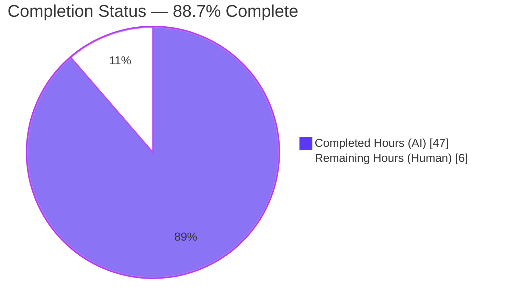
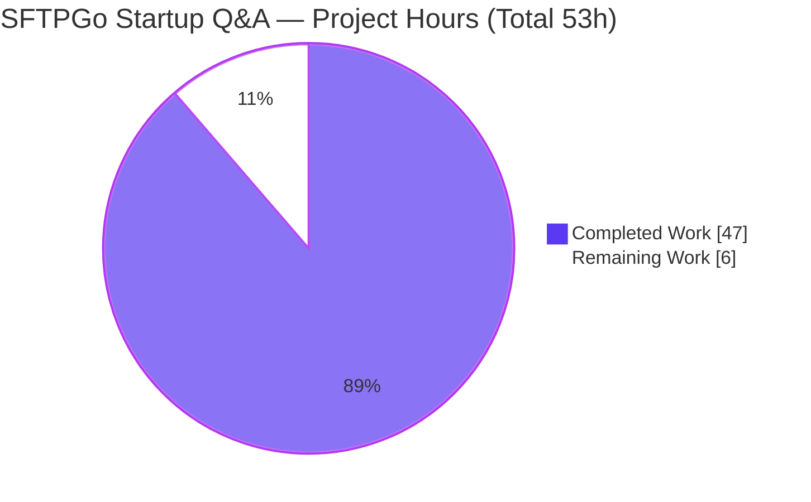
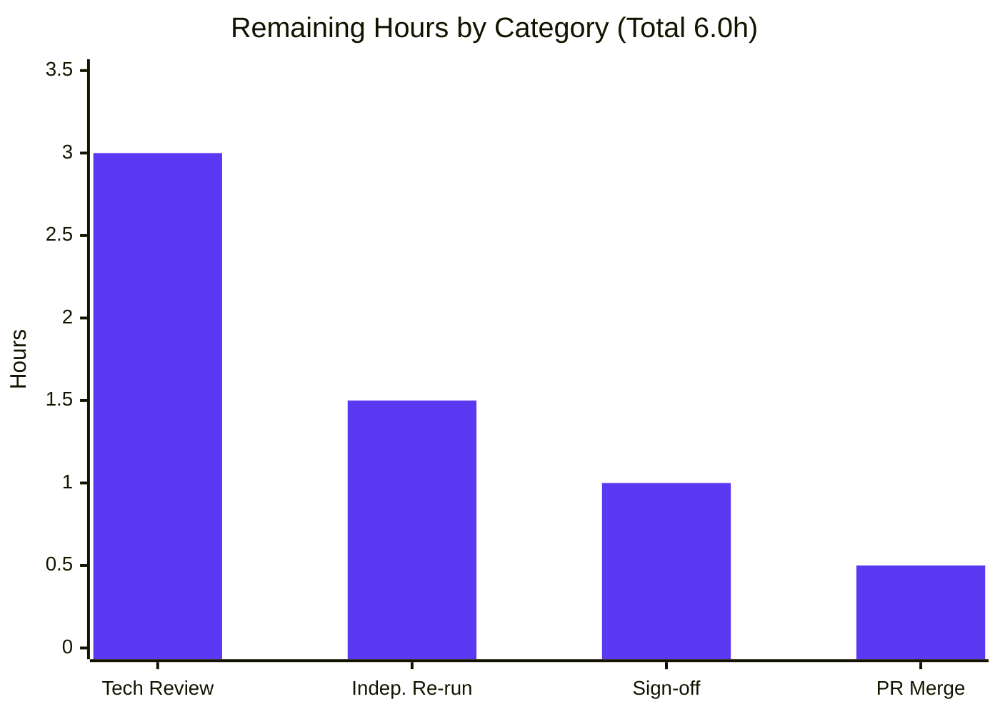

# Blitzy Project Guide — SFTPGo Startup Runtime-Forensic Q&A Documentation

> **Brand legend:** Completed / AI Work is rendered in **Dark Blue `#5B39F3`**; Remaining / Not Completed in **White `#FFFFFF`**; headings/accents use Violet‑Black `#B23AF2`; soft highlights use Mint `#A8FDD9`. These colors are applied to all charts in this guide.

---

## 1. Executive Summary

### 1.1 Project Overview

This project delivers a single, observation‑grounded technical answer document that explains — from actually observed runtime behavior, not code reading alone — how the SFTPGo server (`0.9.5-dev`, commit `44634210`) starts up when launched **without a configuration file**. The target audience is developers onboarding into the SFTPGo codebase. The deliverable, `blitzy/documentation/sftpgo_44634210287c.md`, answers five startup questions (ports & readiness, nonexistent‑user authentication, web‑admin root redirect, missing‑database behavior, and default configuration) with real captured output and precise `file:line` citations. Scope is deliberately narrow and **read‑only**: exactly one new Markdown file is added; no product source is created or modified.

### 1.2 Completion Status

The project is **88.7% complete** on an AAP‑scoped, hours‑based basis. All autonomous investigation and authoring work is finished and validated production‑ready; the remaining hours are exclusively human path‑to‑production activities (review, sign‑off, merge).



| Metric | Value |
|--------|-------|
| **Total Hours** | 53.0 |
| **Completed Hours (AI + Manual)** | 47.0 (AI: 47.0 · Manual: 0.0) |
| **Remaining Hours** | 6.0 |
| **Percent Complete** | **88.7%** (47.0 / 53.0) |

### 1.3 Key Accomplishments

- ✅ Canonical binary built and validated: `CGO_ENABLED=1 go build -o sftpgo .` (Go 1.13.15), exit 0, binary **31,877,432 bytes**, banner `SFTPGo version: 0.9.5-dev`.
- ✅ Two runtime scenarios reproduced (empty directory; no‑config with an initialized SQLite DB + `templates/` + `static/`), capturing all evidence **before** authoring (run‑first mandate honored).
- ✅ All five questions (Q1–Q5) answered with complete, unedited runtime output and cause‑and‑effect mechanisms.
- ✅ **104/104** `file:line` citations verified against source and the Go module cache.
- ✅ Both Q2 authentication modes documented (modern‑OpenSSH `ssh-rsa` key‑exchange rejection **and** the true password‑auth path).
- ✅ Timing/stability confirmed across two runs; per‑run‑variable fields explicitly labeled.
- ✅ Read‑only scope preserved: diff versus baseline `44634210` is exactly **one added file**; working tree clean.
- ✅ Deliverable is a 1,029‑line Markdown document (77,699 bytes) at the mandated path/name.

### 1.4 Critical Unresolved Issues

| Issue | Impact | Owner | ETA |
|-------|--------|-------|-----|
| _None._ Final autonomous validation reports zero unresolved errors; all five production‑readiness gates passed; the single citation‑precision fix is committed (`e3d66ef1`). | No blocking issues | — | — |

### 1.5 Access Issues

| System/Resource | Type of Access | Issue Description | Resolution Status | Owner |
|-----------------|----------------|-------------------|-------------------|-------|
| _No access issues identified._ Repository fully accessible (working tree present, git operational, HEAD `e3d66ef1`). No external service credentials, API keys, or third‑party access were required — all observation was local (SFTP `:2022`, HTTP `:8080` against the locally‑built binary). Build toolchain was provisioned in the container. | — | — | Resolved (N/A) | — |

### 1.6 Recommended Next Steps

1. **[High]** Technical peer review of the document — verify Q1–Q5 runtime claims and spot‑check the 104 `file:line` citations against source at commit `44634210`.
2. **[High]** Approve the pull request and merge branch `blitzy-6f2c15bb-03f4-4dc0-950a-901be27d0827` to make the document available to onboarding developers.
3. **[Medium]** Onboarding/stakeholder readability & completeness sign‑off; assign a document owner to re‑verify citations on future SFTPGo version bumps.
4. **[Low]** Optionally re‑run Scenarios A & B (per Section 9) to reproduce the Q1–Q5 evidence in your own environment.

---

## 2. Project Hours Breakdown

### 2.1 Completed Work Detail

Every completed component traces to a specific AAP requirement (investigation + authoring of the answer document). All work was performed autonomously (AI).

| Component | Hours | Description |
|-----------|-------|-------------|
| Environment provisioning & canonical build | 3.0 | Go 1.13.15 + CGO/gcc + sqlite3/OpenSSH/curl; `CGO_ENABLED=1 go build -o sftpgo .`; version banner `0.9.5-dev`; binary 31,877,432 bytes; two cold‑build timing runs |
| Codebase investigation & control‑flow analysis | 6.0 | Read‑only trace across 8 packages (`cmd`,`config`,`service`,`sftpd`,`httpd`,`dataprovider`,`logger`,`utils`) grounding all citations + startup control‑flow diagram |
| Scenario A / A0 reproduction (empty dir; 0‑byte DB) | 2.5 | Config‑not‑found + missing‑DB + invalid‑DB capture (Q4 States 1 & 2; Q5 config‑not‑found) |
| Scenario B setup & operational reproduction | 3.0 | DB init via `.travis.yml:L14` schema + `templates/` + `static/` + boot to operational state |
| Q1 evidence — ports & readiness signals | 2.5 | Ordered JSON startup, `ss` before/after ×2 runs, readiness line, host‑key timing distribution |
| Q2 evidence — nonexistent‑user auth (both modes) | 5.0 | Mode A `ssh-rsa` rejection + Mode B true auth chain, `RecordNotFoundError`, post‑failure continuity probe |
| Q3 evidence — web‑admin root redirect | 1.5 | `curl` 301 → `/web/users` → 200 (11,319‑byte body) + server request logs |
| Q4 evidence — missing‑database behavior | 2.0 | Three DB states, socket probes, no‑auto‑create proof, exit‑code nuance |
| Q5 evidence — default configuration in logs | 3.0 | `%+v` dump, defaults table cross‑checked to `config.go init()`, two config‑not‑found variants, logging sinks |
| Document authoring (1,029 lines) | 8.0 | Structure, prose, tables, embedded verbatim output — 41 headings / 92 fences / 3 tables |
| Citation verification (104 `file:line`) | 4.0 | Verify every citation against source + Go module cache |
| QA / review remediation (5 commits, ~17 findings) | 5.0 | 12 code‑review findings + F1 + F‑DOC‑001/002/003 + chi `request_id.go` precision |
| Coverage pass + cleanup + read‑only verification | 1.5 | Coverage checklist, `/tmp` artifact removal, git‑clean / HEAD / no‑source‑modified proof |
| **Total** | **47.0** | Matches Completed Hours in Section 1.2 |

### 2.2 Remaining Work Detail

Every remaining category is a human path‑to‑production activity for a documentation deliverable.

| Category | Hours | Priority |
|----------|-------|----------|
| Technical peer review of runtime claims & 104 `file:line` citations | 3.0 | High |
| Independent re‑run of Scenarios A & B (reproduce Q1–Q5 per Section 9) | 1.5 | Low |
| Onboarding/stakeholder readability & completeness sign‑off (+ assign doc owner) | 1.0 | Medium |
| PR approval & merge to main | 0.5 | High |
| **Total** | **6.0** | Matches Remaining Hours in Section 1.2 and the pie chart in Section 7 |

### 2.3 Hours Reconciliation

- Completed (Section 2.1) = **47.0** · Remaining (Section 2.2) = **6.0** · **Total = 53.0** (matches Section 1.2).
- Completion % = 47.0 / 53.0 = **88.68% → 88.7%** (matches Sections 1.2, 7, 8).
- Confidence: **High** — single‑file deliverable, clear scope, independently re‑validated production‑ready.

---

## 3. Test Results

For a runtime‑forensic documentation deliverable, "tests" are the runtime‑claim reproductions and citation verifications executed by Blitzy's autonomous validation systems. **All entries below originate from Blitzy's autonomous validation logs for this project.** The SFTPGo product unit tests (6 `*_test.go` files) were intentionally **not** exercised — the task is read‑only documentation and modifies no source (test changes are explicitly out of scope in the AAP).

| Test Category | Framework / Method | Total | Passed | Failed | Coverage % | Notes |
|---------------|--------------------|-------|--------|--------|-----------|-------|
| Citation verification | Source + module‑cache cross‑check (Blitzy validation) | 104 | 104 | 0 | 100% | 101 SFTPGo‑source + 1 viper (`v1.6.1`) + 1 chi (`v4.0.2`, fixed `e3d66ef1`) |
| Runtime scenario reproduction | `./sftpgo serve` re‑execution (Blitzy validation) | 3 | 3 | 0 | 100% | Scenario A (empty), A0 (0‑byte DB), B (operational) all reproduced |
| Q1–Q5 behavioral claim re‑observation | Runtime output diff (Blitzy validation) | 5 | 5 | 0 | 100% | Byte‑identical except labeled per‑run‑variable fields (pid, timestamps, request_id, client port, host‑key delay) |
| Build validation | `CGO_ENABLED=1 go build` (Blitzy validation) | 1 | 1 | 0 | 100% | exit 0; binary 31,877,432 bytes; banner `SFTPGo version: 0.9.5-dev` |
| Markdown structural validation | Fence/heading/table/section check (Blitzy validation) | 1 | 1 | 0 | 100% | 92 fences balanced, 41 headings, 3 tables, 5/5 Q sections + Coverage Checklist |
| **Total** | | **114** | **114** | **0** | **100%** | Zero failures across all autonomous validation checks |

---

## 4. Runtime Validation & UI Verification

All results below were captured by Blitzy's autonomous validation runs of the canonical binary. No new user interface was built (the AAP explicitly scopes this task as documentation‑only); "UI verification" is limited to the documented HTTP responses of SFTPGo's existing web‑admin.

**Runtime health (Scenario B — operational):**
- ✅ **Operational** — SFTP subsystem on port `2022`: listener registered; readiness line `server listener registered address: [::]:2022` observed; socket confirmed open (`*:2022`).
- ✅ **Operational** — HTTP subsystem on port `127.0.0.1:8080`: bound and serving; no `could not start HTTP server` error.
- ✅ **Operational** — SQLite data provider (initialized DB): handle created; `SELECT COUNT(*) FROM users` = 0.
- ✅ **Operational** — Config‑not‑found fallback: default `globalConf` applied and dumped to the log WARN.

**Web‑admin / HTTP verification (Q3):**
- ✅ **Operational** — `GET /` → HTTP **301** with `Location: /web/users` (45‑byte redirect body).
- ✅ **Operational** — `GET /web/users` → HTTP **200**, body **11,319 bytes**, `<title>SFTPGo - Users</title>`; server request logs show `resp_status/resp_size` = `301/45` and `200/11319`.

**SFTP authentication verification (Q2):**
- ✅ **Operational** — Mode A (modern OpenSSH default): connection correctly rejected at key exchange (`no matching host key type found. Their offer: ssh-rsa`); server logs empty `username`, `login_type:"no_auth_tryed"`.
- ✅ **Operational** — Mode B (client opts into `ssh-rsa`): reaches password auth; nonexistent user correctly rejected (`Permission denied (password,publickey)`); server logs the auth‑failure WARN `Not found: sql: no rows in result set`; both ports remain open and the process stays alive afterward.

**Documented by‑design failure paths (as‑observed, not defects):**
- ⚠ **Partial (by design)** — Scenario A (missing SQLite DB): fast‑fails with a WARN + fatal ERROR and binds **no** ports; the DB is **not** auto‑created. Documented as‑observed per the read‑only rule.
- ⚠ **Partial (by design)** — Missing `templates/`/`static/`: `template.Must` panics the process. Documented as a required prerequisite (Section 9).

---

## 5. Compliance & Quality Review

The table cross‑maps the AAP's binding rules (rule set "SWE‑AtlasQnA‑Repo") to Blitzy's quality/compliance benchmarks, with the status observed during autonomous validation.

| Benchmark (AAP rule) | Status | Progress | Notes |
|----------------------|--------|----------|-------|
| Run‑first methodology (build + run before writing) | ✅ Pass | 100% | Binary built (exit 0); two scenarios run; evidence captured before authoring |
| Canonical entry point only (`./sftpgo serve`) | ✅ Pass | 100% | Real entry point exercised; no mocks/bypasses/synthetic stand‑ins |
| Actual, complete, unedited output per claim | ✅ Pass | 100% | Verbatim JSON logs, full HTTP bodies (45 + 11,319), full algorithm lists; no `// ...` elisions |
| `file:line` grounding for every claim | ✅ Pass | 100% | 104/104 citations verified |
| Observed‑vs‑inferred labeling | ✅ Pass | 100% | Two inferred statements explicitly labeled (OpenSSH `ssh-rsa` default‑disable; RSA‑4096 prime‑search delay) |
| Both authentication modes for Q2 | ✅ Pass | 100% | Mode A (key‑exchange rejection) + Mode B (true auth) both documented |
| Before/intermediate/after states | ✅ Pass | 100% | Q4 three DB states; Q2 continuity; ports closed → open |
| Stability across ≥ 2 runs | ✅ Pass | 100% | Q1 two runs byte‑identical; build two cold runs |
| Coverage pass (each named item answered) | ✅ Pass | 100% | Coverage Checklist confirms each question + named item |
| Deliverable location & name | ✅ Pass | 100% | `blitzy/documentation/sftpgo_44634210287c.md` |
| Read‑only scope (no source modified) | ✅ Pass | 100% | Diff vs baseline = one added file; `git status --porcelain` empty |
| Temporary artifacts removed | ✅ Pass | 100% | `/tmp` build/run dirs removed; working tree clean |

**Fixes applied during autonomous validation:** chi `request_id.go` citation precision — the quoted prefix anchored to `L55`, the `-%06d` append to `L69`, base62 wording to the `L27/L60` comments (commit `e3d66ef1`). **Outstanding compliance items:** none.

---

## 6. Risk Assessment

Because this is a read‑only documentation deliverable, no product code, dependency, or attack surface is introduced. Risks are predominantly Low severity and mostly mitigated within the document itself.

| Risk | Category | Severity | Probability | Mitigation | Status |
|------|----------|----------|-------------|------------|--------|
| Per‑run variable‑field drift (timestamps, pid, request_id, client port, host‑key delay 1.065 s vs 2.111 s) differs on re‑run | Technical | Low | High | Document explicitly labels every variable field; timing reported as a two‑run distribution, not a fixed value | Mitigated |
| Toolchain drift — exact build diagnostics (gcc‑15 CGO warning wording, cold‑build 42.3/44.0 s) depend on host gcc/Go patch levels | Technical | Low | Medium | Go pinned to 1.13 (`go.mod:L3`, `.travis.yml:L8`); host tools labeled incidental; SFTPGo behavior is toolchain‑independent | Mitigated |
| Two claims are inferred, not observed (OpenSSH `ssh-rsa` default‑disable rationale; RSA‑4096 prime‑search delay attribution) | Technical | Low | Low | Both explicitly labeled "inferred"; surrounding behaviors are observed | Mitigated |
| Documentation staleness — line numbers/behaviors valid only at commit `44634210` / `0.9.5-dev`; a version bump invalidates citations | Operational | Medium | Medium | Version‑pinned title + citations throughout; assign a doc owner to re‑verify on upgrades | Open (needs owner) |
| Reader reproduces without prerequisites → hits documented fast‑fail (missing DB) or `template.Must` panic | Operational | Low | Medium | Section 9 dev guide + Methodology spell out DB‑init (`.travis.yml:L14`) + `templates/`+`static/` prerequisites | Mitigated |
| Document describes as‑observed legacy `ssh-rsa` (SHA‑1) host key + missing‑DB fast‑fail without "correcting" them | Security | Low | Low | Forensic/descriptive framing; explicitly read‑only; no product behavior altered (text only) | Accepted (by scope) |
| Runtime captures could leak secrets | Security | Low | Low | Config dump shows `Password:[redacted]`; only a test password against a nonexistent user appears; no real credentials committed | Mitigated |
| Path‑to‑production merge — branch must be reviewed & merged before the doc is available | Integration | Low | Low | Single new file under `blitzy/documentation/`, zero source files touched, clean working tree → minimal conflict risk | Open (pending merge) |

---

## 7. Visual Project Status

**Project hours breakdown** (Completed = Dark Blue `#5B39F3`, Remaining = White `#FFFFFF`):



**Remaining hours by category** (from Section 2.2; sums to 6.0):



**Priority distribution of remaining work:** High = 3.5 h (Tech Review 3.0 + PR Merge 0.5) · Medium = 1.0 h (Sign‑off) · Low = 1.5 h (Independent Re‑run).

> **Integrity:** The pie chart's "Remaining Work" value (6) equals the Section 1.2 Remaining Hours (6.0) and the Section 2.2 "Hours" total (6.0). "Completed Work" (47) equals Section 1.2 Completed Hours (47.0) and the Section 2.1 total (47.0).

---

## 8. Summary & Recommendations

**Achievements.** The project is **88.7% complete** (47.0 of 53.0 AAP‑scoped hours). Blitzy autonomously built the canonical SFTPGo `0.9.5-dev` binary, reproduced two controlled startup scenarios, and authored a 1,029‑line answer document that comprehensively addresses all five onboarding questions with complete, unedited runtime output and 104 verified `file:line` citations. Every binding rule of the governing rule set was satisfied, and the read‑only scope was preserved (exactly one added file; no source modified).

**Remaining gaps.** The remaining **6.0 hours** are entirely human path‑to‑production activities — there is no outstanding autonomous work and no blocking defect. They are: technical peer review (3.0 h), an optional independent re‑run of the scenarios (1.5 h), onboarding/stakeholder sign‑off (1.0 h), and PR approval & merge (0.5 h).

**Critical path to production.** Technical peer review (High) → onboarding sign‑off (Medium) → PR merge (High). The optional independent re‑run (Low) can proceed in parallel using Section 9; note that Blitzy's autonomous validation already reproduced every scenario byte‑identically.

**Success metrics.** 104/104 citations verified · 5/5 questions answered and confirmed by coverage pass · 3/3 scenarios reproduced · build exit 0 with matching binary size · zero unresolved issues · repository clean.

**Production readiness assessment.** The deliverable is **production‑ready pending human review**. Per Blitzy assessment policy, completion is capped below 100% until a human reviewer verifies and merges the document. Confidence is **High** given the narrow, single‑file scope and independent re‑validation.

**Recommendation.** Assign a reviewer for the High‑priority technical peer review, name a document owner to keep citations current across future SFTPGo versions (mitigating the sole Medium‑severity risk), and merge.

| Metric | Value |
|--------|-------|
| AAP‑scoped completion | 88.7% |
| Completed / Remaining / Total hours | 47.0 / 6.0 / 53.0 |
| AAP requirements completed | 16 of 16 (100% of autonomous scope) |
| Unresolved / blocking issues | 0 |

---

## 9. Development Guide

This guide lets a human developer reproduce the exact scenarios documented in the deliverable. All commands were tested in the project environment (Go 1.13.15, gcc 15.2.0, sqlite3 3.46.1, git 2.51.0, curl 8.14.1). Run everything **outside** the repository checkout so the read‑only rule is preserved.

### 9.1 System Prerequisites

- **OS:** Linux x86_64
- **Go:** 1.13.x (observed `go1.13.15`) — pinned by `go.mod:L3` and `.travis.yml:L8`
- **C compiler:** `gcc` (observed 15.2.0) with **CGO enabled** — required by the default SQLite driver `github.com/mattn/go-sqlite3 v2.0.2`
- **sqlite3 CLI** (observed 3.46.1) — to create/initialize the database
- **OpenSSH client** (observed `10.0p2`) — must support `-o HostKeyAlgorithms=+ssh-rsa` for Q2 Mode B
- **sshpass** (observed 1.10) — non‑interactive password entry for Q2 Mode B
- **curl** (observed 8.14.1) — to exercise the web‑admin endpoints (Q3)
- **git** (observed 2.51.0) — to obtain the source

### 9.2 Environment Setup

```bash
# Load Go onto PATH (container-specific; adjust for your host)
source /etc/profile.d/go.sh
go version    # expect: go version go1.13.15 linux/amd64

# Build OUTSIDE the checkout (the repo has no .gitignore; never build inside it)
git -C /path/to/checkout archive HEAD | tar -x -C /tmp/sftpgo_build

export GO111MODULE=on
export CGO_ENABLED=1
```

> **Reproducing "no config file" faithfully:** the run directory must contain **no** `sftpgo.*` file, otherwise viper loads a config from its search path `[<cwd> /root/.config/sftpgo /etc/sftpgo]` and the config‑not‑found path never fires.

### 9.3 Build

```bash
cd /tmp/sftpgo_build
CGO_ENABLED=1 go build -o sftpgo .
# exit status 0; the CGO step prints an upstream gcc -Wreturn-local-addr warning (harmless)

./sftpgo --version
# expect: SFTPGo version: 0.9.5-dev

stat -c '%s bytes' sftpgo
# expect: 31877432 bytes
```

### 9.4 Application Startup

**Scenario A — empty directory (no config, no DB) → fast‑fail (Q4/Q5):**

```bash
mkdir -p /tmp/run_A && cd /tmp/run_A
/tmp/sftpgo_build/sftpgo serve ; echo "exit_code=$?"
# Console shows a WARN (config not found) + an ERROR (stat sftpgo.db: no such file or directory)
# exit_code=0; no ports bound; sftpgo.db is NOT auto-created
```

**Scenario B — no config with an initialized DB + templates/static → operational (Q1/Q2/Q3):**

```bash
mkdir -p /tmp/run_B && cd /tmp/run_B

# Initialize the SQLite database using the canonical CI schema (.travis.yml:L14)
sqlite3 sftpgo.db 'CREATE TABLE "users" ("id" integer NOT NULL PRIMARY KEY AUTOINCREMENT, "username" varchar(255) NOT NULL UNIQUE, "password" varchar(255) NULL, "public_keys" text NULL, "home_dir" varchar(255) NOT NULL, "uid" integer NOT NULL, "gid" integer NOT NULL, "max_sessions" integer NOT NULL, "quota_size" bigint NOT NULL, "quota_files" integer NOT NULL, "permissions" text NOT NULL, "used_quota_size" bigint NOT NULL, "used_quota_files" integer NOT NULL, "last_quota_update" bigint NOT NULL, "upload_bandwidth" integer NOT NULL, "download_bandwidth" integer NOT NULL, "expiration_date" bigint NOT NULL, "last_login" bigint NOT NULL, "status" integer NOT NULL, "filters" TEXT NULL, "filesystem" text NULL);'

# Provide templates/ and static/ (loadTemplates uses template.Must and panics if absent)
cp -r /tmp/sftpgo_build/templates /tmp/sftpgo_build/static .

# Launch in the background so you can probe it
/tmp/sftpgo_build/sftpgo serve > /dev/null 2>&1 &
SFTPGO_PID=$!
sleep 3   # host-key generation adds ~1-2s on first boot
```

### 9.5 Verification Steps

```bash
# DB initialized correctly (empty users table)
sqlite3 /tmp/run_B/sftpgo.db '.tables'                 # expect: users
sqlite3 /tmp/run_B/sftpgo.db 'SELECT COUNT(*) FROM users;'  # expect: 0

# Ports open (Scenario B)
ss -ltnp | grep -E ':2022|:8080'
# expect: 127.0.0.1:8080 (HTTP) and *:2022 (SFTP) both LISTEN

# Readiness signal in the JSON log
grep "server listener registered" /tmp/run_B/sftpgo.log
# expect: ... "message":"server listener registered address: [::]:2022"
```

### 9.6 Example Usage

```bash
# Q3 — web-admin root redirect
curl -si http://127.0.0.1:8080/            # HTTP/1.1 301, Location: /web/users
curl -si http://127.0.0.1:8080/web/users   # HTTP/1.1 200, <title>SFTPGo - Users</title>

# Q2 Mode A — modern OpenSSH default (key-exchange rejection)
sftp -P 2022 nonexistentuser@127.0.0.1
# -> "Unable to negotiate ... no matching host key type found. Their offer: ssh-rsa"

# Q2 Mode B — opt into ssh-rsa to reach true password auth (username lookup fails)
sshpass -p 'testpass123' sftp -P 2022 -o HostKeyAlgorithms=+ssh-rsa -o PubkeyAuthentication=no nonexistentuser@127.0.0.1
# -> "nonexistentuser@127.0.0.1: Permission denied (password,publickey)."
# Server log (sftpgo.log): WARN "error authenticating user: nonexistentuser, error: Not found: sql: no rows in result set"
```

### 9.7 Cleanup (preserve read‑only scope)

```bash
kill "$SFTPGO_PID" 2>/dev/null
rm -rf /tmp/sftpgo_build /tmp/run_A /tmp/run_B
# Confirm the checkout is unchanged
git -C /path/to/checkout status --porcelain   # expect: empty
```

### 9.8 Troubleshooting

| Symptom | Cause | Resolution |
|---------|-------|------------|
| `error initializing data provider: stat sftpgo.db: no such file or directory` | SQLite DB absent (this version does not auto‑create) | Run the `.travis.yml:L14` `CREATE TABLE` command (Section 9.4, Scenario B) |
| `sqlite database file is invalid` | 0‑byte/corrupt DB file | Delete and recreate the DB with the schema above |
| Process panics on startup | `templates/` or `static/` missing (`template.Must`) | Copy `templates/` and `static/` from the build dir into the run dir |
| `no matching host key type found. Their offer: ssh-rsa` | Modern OpenSSH disables legacy `ssh-rsa` by default | Add `-o HostKeyAlgorithms=+ssh-rsa` (Q2 Mode B) |
| A config file loads unexpectedly | A `sftpgo.*` file is on the viper search path `[<cwd> /root/.config/sftpgo /etc/sftpgo]` | Run from a clean directory containing no `sftpgo.*` file |

---

## 10. Appendices

### Appendix A — Command Reference

| Purpose | Command |
|---------|---------|
| Build (CGO) | `CGO_ENABLED=1 go build -o sftpgo .` |
| Version banner | `./sftpgo --version` |
| Serve (canonical entry point) | `./sftpgo serve` |
| Initialize SQLite DB | `sqlite3 sftpgo.db 'CREATE TABLE "users" (...);'` (see `.travis.yml:L14`) |
| Probe ports | `ss -ltnp \| grep -E ':2022\|:8080'` |
| Web root redirect | `curl -si http://127.0.0.1:8080/` |
| SFTP (true auth path) | `sftp -P 2022 -o HostKeyAlgorithms=+ssh-rsa nonexistentuser@127.0.0.1` |
| Verify repo unchanged | `git status --porcelain` (expect empty) |

### Appendix B — Port Reference

| Port | Protocol | Subsystem | Default Bind Address | Source |
|------|----------|-----------|----------------------|--------|
| 2022 | TCP (SSH/SFTP) | SFTP server | `""` → all interfaces (`[::]:2022`) | `config/config.go:L46-L47`; bind `sftpd/server.go:L178` |
| 8080 | TCP (HTTP) | Web‑admin / REST | `127.0.0.1` | `config/config.go:L88-L89`; bind `httpd/httpd.go:L92,L98` |

### Appendix C — Key File Locations

| Path | Role |
|------|------|
| `blitzy/documentation/sftpgo_44634210287c.md` | **The deliverable** (1,029 lines) |
| `main.go` | Entry point → `cmd.Execute()` |
| `cmd/serve.go`, `cmd/root.go` | `serve` subcommand; default flags (config dir `.`, log file `sftpgo.log`, verbose) |
| `service/service.go` | Startup orchestration; data‑provider ERROR abort (`L71-L73`) |
| `config/config.go` | `init()` defaults; config‑not‑found WARN + `%+v` dump (`L151-L156`) |
| `sftpd/server.go` | Listener/readiness (`L178`, `L187`); host‑key gen; auth callbacks |
| `dataprovider/sqlite.go`, `sqlcommon.go`, `dataprovider.go` | SQLite init, auth WARN, `RecordNotFoundError` |
| `httpd/router.go`, `httpd/httpd.go`, `httpd/web.go` | `GET /` → 301; path constants; `template.Must` |
| `logger/logger.go` | zerolog JSON‑file vs console sinks |
| `utils/version.go` | `const version = "0.9.5-dev"` |
| `.travis.yml` | Canonical DB‑init `before_script` (`L14`) |

### Appendix D — Technology Versions

| Component | Version | Pinned By |
|-----------|---------|-----------|
| Go | `1.13.x` (built with `1.13.15`) | `go.mod:L3`, `.travis.yml:L8` |
| github.com/spf13/cobra | v0.0.5 | `go.mod` |
| github.com/spf13/viper | v1.6.1 | `go.mod` |
| github.com/pkg/sftp | v1.11.0 | `go.mod` |
| golang.org/x/crypto | v0.0.0‑20200109152110 | `go.mod` |
| github.com/go-chi/chi | v4.0.2+incompatible | `go.mod` |
| github.com/mattn/go-sqlite3 | v2.0.2+incompatible | `go.mod` |
| github.com/rs/zerolog | v1.17.2 | `go.mod` |
| gopkg.in/natefinch/lumberjack.v2 | v2.0.0 | `go.mod` |
| SFTPGo | `0.9.5-dev` (commit `44634210`) | `utils/version.go:L3` |

### Appendix E — Environment Variable Reference

| Variable | Purpose |
|----------|---------|
| `CGO_ENABLED=1` | Required to build the default `mattn/go-sqlite3` driver |
| `GO111MODULE=on` | Enable Go modules for the build |
| `GOPATH` / `GOCACHE` | Go workspace / build cache (e.g., `/root/go`, `/root/.cache/go-build`) |
| `SFTPGO_*` (prefix) | Runtime config overrides via viper; nested keys use the `__` separator (e.g., `SFTPGO_HTTPD__BIND_PORT`) |

### Appendix F — Developer Tools Guide

| Tool | Use in this project |
|------|---------------------|
| `go build` (CGO) | Produce the canonical binary |
| `sqlite3` CLI | Create/initialize and inspect the users database |
| `ss` | Verify listening sockets (`:2022`, `:8080`) |
| `curl -si` | Inspect HTTP status + headers for Q3 |
| `sftp` / `sshpass` | Exercise the SFTP auth flow for Q2 (Mode B needs `-o HostKeyAlgorithms=+ssh-rsa`) |
| `grep` on `sftpgo.log` | Extract structured JSON readiness/auth log lines |
| `git diff --name-status <baseline> HEAD` | Confirm exactly one added file (read‑only proof) |

### Appendix G — Glossary

| Term | Definition |
|------|------------|
| **Readiness signal** | The log line `server listener registered address: [::]:2022` (`sftpd/server.go:L187`) marking the SFTP listener as accepting connections |
| **Scenario A** | Run directory with no config and no database → fast‑fail (exercises Q4/Q5 config‑not‑found) |
| **Scenario B** | Run directory with no config but an initialized DB + `templates/`+`static/` → fully operational (exercises Q1/Q2/Q3) |
| **Mode A / Mode B (Q2)** | Modern‑OpenSSH `ssh-rsa` key‑exchange rejection (A) vs. the true password‑auth path reached by opting into `ssh-rsa` (B) |
| **`RecordNotFoundError`** | Data‑provider error whose `Error()` returns `Not found: <cause>`; surfaced when a username is absent (`dataprovider/dataprovider.go:L201-L207`) |
| **Config‑not‑found fallback** | viper returns a not‑found error → SFTPGo logs a WARN and applies compiled defaults (`config/config.go:L151-L156`) |
| **Read‑only scope** | The task modifies no source; it adds exactly one Markdown file and leaves the repository byte‑identical to baseline apart from that file |

---

*This Blitzy Project Guide was generated from the Agent Action Plan, the autonomous agent action logs, the Final Validation Report, and direct inspection of the repository at HEAD `e3d66ef1` (baseline `44634210`). All hour figures are AAP‑scoped; the 88.7% completion reflects only work defined in the AAP plus its path to production.*