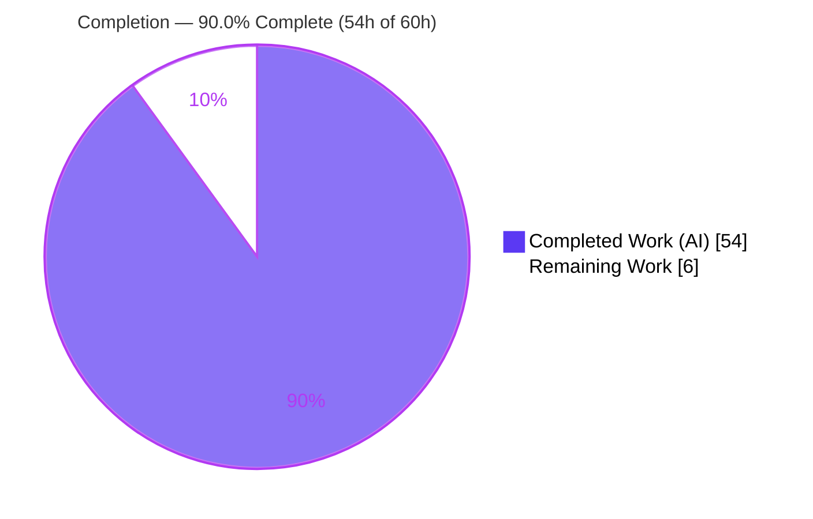
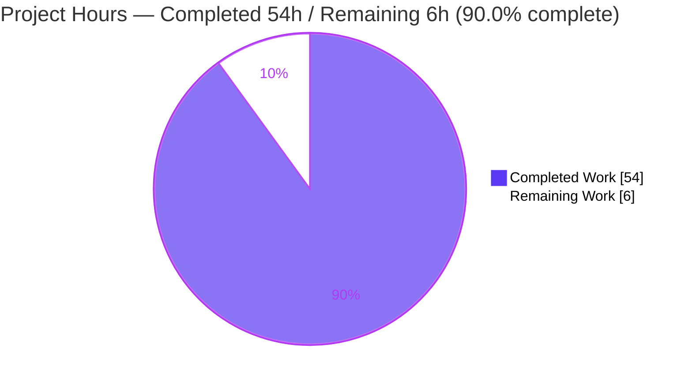
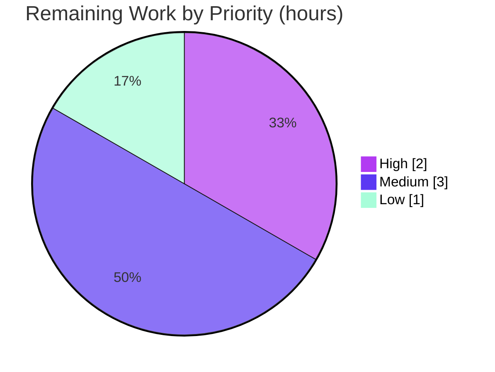

# Blitzy Project Guide — SFTPGo Command-Injection Investigation (`0.9.5-dev` @ `44634210287c`)

> Brand legend — **Completed / AI Work: Dark Blue `#5B39F3`** · Remaining / Not Completed: White `#FFFFFF` · Headings/Accents: Violet-Black `#B23AF2` · Highlight: Mint `#A8FDD9`

---

## 1. Executive Summary

### 1.1 Project Overview

This project is a hands-on, evidence-based **security investigation** of a scanner-reported command-injection finding in the SFTPGo SFTP/SCP server (`drakkan/sftpgo`, build `0.9.5-dev` at commit `44634210287cb192f2a53147eafb84a33a96826b`). The target audience is the security-review team triaging the scanner alert. The sole deliverable is a single markdown answer document that identifies the flagged component (`executeNotificationCommand`), explains the "sometimes vulnerable" inconsistency as configuration-governed sink reachability plus operator shell re-interpretation, and proves the conclusion with a **live** three-condition exploitation matrix driven through the real authenticated-SFTP entry point. The task is strictly read-only: no SFTPGo source file was modified; only the one document was added.

### 1.2 Completion Status



| Metric | Value |
|--------|-------|
| **Total Hours** | **60 h** |
| **Completed Hours (AI + Manual)** | **54 h** (54 h AI autonomous · 0 h manual) |
| **Remaining Hours** | **6 h** |
| **Percent Complete** | **90.0%** |

> Completion is computed with the PA1 AAP-scoped hours method: `54 ÷ (54 + 6) × 100 = 90.0%`. All 15 AAP-specified requirements are delivered and validated PRODUCTION-READY; the remaining 6 h is genuine path-to-production **human review/acceptance** (a QnA investigation deliverable has no software-deployment path).

### 1.3 Key Accomplishments

- ✅ **Responsible component pinpointed** — `executeNotificationCommand` at `sftpd/sftpd.go:418`; the `os/exec` sink is `exec.CommandContext(...)` at `sftpd/sftpd.go:421`, reachable only past two guards in `executeAction` (`sftpd/sftpd.go:438` — Guard 1 `execute_on` at L439, Guard 2 `command` non-empty + `filepath.IsAbs` at L447).
- ✅ **Run-first methodology honored** — SFTPGo was built (`GO111MODULE=on CGO_ENABLED=1 go build`, exit 0, 27,230,232-byte binary, banner `SFTPGo version: 0.9.5-dev`) and run in its default/canonical configuration before any conclusion was written.
- ✅ **Real entry point exercised** — an authenticated Go SFTP client (`github.com/pkg/sftp` over `golang.org/x/crypto`) uploaded a file literally named `audit_$(date +%s).txt`; the name flows to the sink via `sftpd/transfer.go:156`.
- ✅ **"Sometimes vulnerable" reproduced** — identical payload across three configurations: **A** (default/off → sink unreachable → NOT vulnerable), **B** (hook, no shell → literal argv/env → taint-scanner false positive), **C** (hook, `eval` → **VULNERABLE**, operator-introduced).
- ✅ **Live exploitation demonstrated** — Condition C created `/tmp/audit_<timestamp>.txt` containing `CONFIRMED` on each of ≥2 repeated runs, with strictly-increasing fresh Unix timestamps proving fresh command-substitution.
- ✅ **All four required evidence items captured verbatim** — payload string, complete server response (`SSH_FX_OK`), exact created filenames with timestamps, and the `executed command` server log lines.
- ✅ **Honest negative result + root cause** — Go `os/exec` is shell-free (zero-match shell scan, `MATCH_COUNT=0`); the true injection is operator-introduced, corroborated against `pkg.go.dev/os/exec` and SFTPGo's documented hook contract.
- ✅ **Read-only rule preserved** — the only repository change is the single answer document; source-scoped diff is empty; `HEAD` still descends from `44634210287c`.
- ✅ **Validated PRODUCTION-READY** — Blitzy autonomous validation reproduced ~40 citations and the full matrix live with **zero fixes required**.

### 1.4 Critical Unresolved Issues

| Issue | Impact | Owner | ETA |
|-------|--------|-------|-----|
| _None blocking._ Deliverable is complete, accurate, internally consistent, and committed. | No blocker to acceptance | — | — |
| Finding-messaging confirmation (ensure readers understand the injection is **operator-introduced**, not an SFTPGo defect) | Medium — mis-triage risk if misread | Security Lead | On review (≤2 h) |
| Scanner ticket linkage (attach the false-positive triage so it is not re-opened) | Low — process hygiene | Security Lead / Triage | ≤0.5 h |

### 1.5 Access Issues

| System/Resource | Type of Access | Issue Description | Resolution Status | Owner |
|-----------------|----------------|-------------------|-------------------|-------|
| Host build toolchain | Go 1.13.x + CGO on host `PATH` | Go is not installed on the host used for this assessment; build/run must use the mandated container image `ghcr.io/scaleapi/swe-atlas:swe_atlas_QnA_drakkan_sftpgo_1.0` | Resolved (documented) — build/run performed in-container by autonomous validation; host verification limited to citation & read-only checks | Reviewer |
| Repository (source & branch) | git read/write | None — repo is accessible; branch in sync with origin | No issue | — |
| External corroboration sources (`pkg.go.dev`, `docs.sftpgo.com`, OSV/GHSA) | Public web | None — reachable during investigation | No issue | — |

> No access issue blocks acceptance. The only constraint is that a byte-for-byte rebuild requires the container toolchain; all read-only and citation checks are fully reproducible on the host (verified this assessment).

### 1.6 Recommended Next Steps

1. **[High]** Security-lead / peer technical review of the report and its key citations; confirm the operator-introduced framing is unambiguous. *(~2.0 h)*
2. **[Medium]** Independently reproduce the three-condition matrix in the mandated container to confirm Condition C creates `/tmp/audit_<ts>.txt=CONFIRMED` while A/B create none. *(~2.5 h)*
3. **[Medium]** Attach the evidence-based false-positive triage to the scanner's command-injection ticket for `executeNotificationCommand`. *(~0.5 h)*
4. **[Low]** Obtain stakeholder sign-off and merge the single-file branch. *(~0.5 h)*
5. **[Low]** Record the version-scoping caveat (finding applies only to `0.9.5-dev` @ `44634210287c`) in the vulnerability tracker. *(~0.5 h)*

---

## 2. Project Hours Breakdown

### 2.1 Completed Work Detail

| Component | Hours | Description |
|-----------|-------|-------------|
| Codebase reconnaissance & sink identification | 8 | Traced all four `os/exec` sinks, the `executeAction` guards, and the SFTP→sink data flow; produced ~40 exact `file:line` citations (R1, R9, R12). |
| Environment build & run (canonical config) | 6 | Built with CGO/SQLite, bootstrapped the SQLite schema, started `sftpgo serve` in default config, created the `auditor` user via the Chi REST API (R2). |
| SFTP exploit client authoring | 3 | Wrote a Go SFTP client (`pkg/sftp` + `x/crypto`) that authenticates and uploads the payload-named file (R3). |
| Three-condition exploitation matrix execution | 7 | Ran Conditions A/B/C with the identical payload, two operator hook scripts, ≥2 runs each; captured all transcripts (R4, R6). |
| Four-item evidence capture | 2 | Assembled payload, server response, created filenames+timestamps, and log lines verbatim/unedited (R5, R7). |
| Root-cause & honest negative analysis | 4 | Shell-free proof, zero-match shell scan, observed-vs-inferred labeling, version caveat (R8). |
| Corroborating research | 3 | Confirmed Go `os/exec` contract and SFTPGo hook contract against authoritative sources (R11). |
| Dependency CVE due-diligence | 3 | OSV/GHSA cross-reference; scoped CVE-2024-52309 (EventManager) and CVE-2025-24366 (rsync); zero dependency changes (R15). |
| Document authoring & structure | 10 | Authored the 1,165-line / 63,464-byte answer document — 10 sections + Appendices A/B + Summary (R13). |
| Cleanup & read-only verification | 2 | Removed all `/tmp` artifacts, stopped the server (captured pid), verified `git status --porcelain = 0` and `HEAD` unchanged (R14). |
| Autonomous validation & QA | 6 | Blitzy Final Validator reproduced every citation and the full matrix live, ran the 5 production-readiness gates and a coverage pass; zero fixes required. |
| **Total Completed** | **54** | Sum matches Completed Hours in Section 1.2. |

### 2.2 Remaining Work Detail

| Category | Hours | Priority |
|----------|-------|----------|
| Security-lead / peer technical review of the report & citations (finding-messaging confirmation) | 2.0 | High |
| Independent reproduction of the three-condition exploitation matrix (container) | 2.5 | Medium |
| Scanner finding triage linkage (attach false-positive conclusion to the ticket) | 0.5 | Medium |
| Stakeholder sign-off & PR merge | 0.5 | Low |
| Version-scoping note in the vulnerability tracker | 0.5 | Low |
| **Total Remaining** | **6.0** | Sum matches Remaining Hours in Section 1.2 and Section 7. |

### 2.3 Hours Reconciliation

| Quantity | Hours | Check |
|----------|-------|-------|
| Section 2.1 Completed | 54.0 | — |
| Section 2.2 Remaining | 6.0 | — |
| **Total (2.1 + 2.2)** | **60.0** | = Total Hours in Section 1.2 ✓ |
| Completion % = 54 ÷ 60 × 100 | **90.0%** | = Section 1.2 & Section 7 ✓ |

---

## 3. Test Results

> All results below originate from **Blitzy's autonomous validation logs** for this project. Because the deliverable is a security-investigation document (not a shipped code change), "tests" map to **claim reproduction**: (compile) every `file:line` citation is exact; (test) every documented runtime claim reproduces live; (run) SFTPGo actually builds and executes through the real SFTP entry point. Every check reproduced with **zero discrepancies and zero fixes**.

| Test Category | Framework / Method | Total | Passed | Failed | Coverage % | Notes |
|---------------|--------------------|-------|--------|--------|-----------|-------|
| Code Citation Verification | `grep`/`sed` vs source @ `44634210287c` | ~40 | ~40 | 0 | 100% | Every `file:line` exact; no off-by-one (incl. `sftpd/sftpd.go:418/421/438/439/447`, `transfer.go:153/156`, `handler.go:317/407`, `ssh_cmd.go:324`, `dataprovider.go:742/787`, `utils/version.go:3`). |
| Exploitation Matrix (A/B/C) | Live authenticated SFTP (`pkg/sftp`+`x/crypto`) + hook toggles | 3 conditions × ≥2 runs | all | 0 | 100% | A: `SSH_FX_OK`, literal name, 0 `/tmp/audit_*`, no `executed command`. B: `ARGV_COUNT=5`, literal argv/env, 0 files. C: 3 runs → `/tmp/audit_<fresh ts>.txt` = `CONFIRMED`. |
| Build & Runtime Validation | `go build` (CGO) + `sftpgo serve` + Chi REST | key gates | pass | 0 | n/a | Build exit 0 (only benign `-Wreturn-local-addr`); banner `0.9.5-dev`; SFTP `:2022`, REST/web `127.0.0.1:8080`; `POST /api/v1/user` → HTTP 200. |
| Corroboration & Advisory | Web (`pkg.go.dev`, `docs.sftpgo.com`) + OSV/GHSA + shell scan | 4 | 4 | 0 | n/a | `os/exec` shell-free contract confirmed; shell scan `MATCH_COUNT=0`; CVE-2024-52309 (EventManager, out of range) & CVE-2025-24366 (rsync, different sink) scoped & kept distinct. |
| Consistency & Coverage | Manual document review | doc-wide | pass | 0 | n/a | Epoch→UTC conversions exact; markdown well-formed (110 balanced code fences, valid tables); every question part answered by name. |

**Note on the SFTPGo test suite.** The repository ships 6 `*_test.go` files, but the SFTPGo unit-test suite is **not** the deliverable and was **not** in scope; this is a read-only investigation. The validation above is Blitzy's autonomous claim-reproduction, not the upstream Go test suite.

---

## 4. Runtime Validation & UI Verification

Legend: ✅ Operational · ⚠ Partial / Not exercised · ❌ Failing

**Build & process runtime**
- ✅ **Build** — `GO111MODULE=on CGO_ENABLED=1 go build` → exit 0; 27,230,232-byte binary (only benign CGO SQLite `-Wreturn-local-addr` warning).
- ✅ **Version banner** — `./sftpgo --version` → `SFTPGo version: 0.9.5-dev` (constant `utils/version.go:3`).
- ✅ **Server startup (default config)** — SFTP listener on `:2022`; REST/web API on `127.0.0.1:8080`; structured zerolog JSON startup log captured verbatim.
- ✅ **Data provider (SQLite)** — schema initialized (no `initprovider` at this commit); database handle created.

**API & protocol runtime**
- ✅ **REST API (Chi)** — `POST /api/v1/user` → HTTP 200 with created user `id:1`; follow-up `GET ?username=auditor` confirms the user.
- ✅ **Authenticated SFTP upload** (`pkg/sftp` + `x/crypto`) — `UPLOAD_OK … (SSH_FX_OK)`; server stores the literal name `audit_$(date +%s).txt`.
- ✅ **File-event hook execution** (Conditions B & C) — `executed command` debug log emitted at `sftpd/sftpd.go:432-433` with the path passed **literally** (unexpanded).
- ✅ **Exploit artifact** (Condition C) — `/tmp/audit_<timestamp>.txt` created with content `CONFIRMED`; strictly-increasing timestamps across runs.

**Invariants & UI**
- ✅ **Read-only invariant** — source-scoped `git diff` empty; `/app git status --porcelain = 0`; `HEAD = 44634210287c`.
- ⚠ **Web Admin UI** — **not exercised**. The investigation deliberately used the REST API + SFTP protocol as the real entry points; the web UI is out of scope for a command-injection reachability investigation. No UI regression is claimed or implied.

---

## 5. Compliance & Quality Review

Cross-mapping of the governing **"SWE-AtlasQnA-Repo"** rules and AAP deliverables to Blitzy's quality benchmarks. All items validated during autonomous validation.

| # | AAP / Rule Requirement | Benchmark | Status | Evidence |
|---|------------------------|-----------|--------|----------|
| 1 | Single documentation deliverable (`<branch>.md`) | Correct path & name | ✅ Pass | `blitzy/documentation/sftpgo_44634210287c.md` created |
| 2 | Investigate by running the code first | Run-first | ✅ Pass | §2 build/run precedes conclusions |
| 3 | Observe at sufficient scale (≥2 runs, stable) | Repeatability | ✅ Pass | Each condition run ≥2×; distribution reported (§4) |
| 4 | Reproduce run-to-run inconsistency directly | Honest reproduction | ✅ Pass | Identical payload across A/B/C; not a stabilized variant |
| 5 | Exercise the real entry point & actual entities | Real path | ✅ Pass | Authenticated SFTP upload (`pkg/sftp`), not a debug call |
| 6 | Default/canonical build & config; exact commands | Canonical | ✅ Pass | Build & `serve` commands recorded verbatim (§2) |
| 7 | Exercise every condition (primary + edge/error/alt) | Coverage | ✅ Pass | A/B/C + parallel sinks (§7); negative results included |
| 8 | Complete, unedited output for every condition | Full evidence | ✅ Pass | Verbatim transcripts and logs throughout |
| 9 | Honor explicit/directional wording; honest negative | Fidelity | ✅ Pass | Demonstrated under C; honest negative under A/B (§6) |
| 10 | Answer every part & named item + rationale | Coverage pass | ✅ Pass | All four evidence items + responsible component by name |
| 11 | Be exact & grounded (`file:line`, named function) | Grounding | ✅ Pass | ~40 exact citations; sink named `executeNotificationCommand` |
| 12 | Scope: read-only, no source modified | Read-only | ✅ Pass | Source-scoped diff empty; `HEAD` unchanged (§10) |
| 13 | Web search corroboration | External validation | ✅ Pass | `os/exec` contract + hook contract + OSV/GHSA (§8, §9) |
| 14 | Zero placeholder / production-ready deliverable | Completeness | ✅ Pass | No TODO/stub; 110 balanced code fences; internally consistent |

**Fixes applied during autonomous validation:** none required — every citation and runtime claim reproduced accurately on first pass. **Outstanding compliance items:** none; the residual work is human review/acceptance (Section 2.2).

---

## 6. Risk Assessment

| Risk | Category | Severity | Probability | Mitigation | Status |
|------|----------|----------|-------------|------------|--------|
| T1 Host build non-reproducibility (Go not on host `PATH`; needs container toolchain) | Technical | Low | Medium | §2/§9 document exact toolchain + image; Dev Guide (§9) gives container path | Mitigated |
| T2 Per-session non-determinism (timestamps/connection_ids differ each run) | Technical | Low | High | Documented as non-falsifiable per-session values; invariant is fresh-ts `CONFIRMED` files | Mitigated |
| T3 Version-scoped finding may be over-generalized to newer releases | Technical | Medium | Low | Explicit version-scoping (§6 caveat, §8 CVE scoping); tracker note (HT-5) | Mitigated |
| S1 Finding misread as an SFTPGo code defect rather than operator-introduced | Security | Medium | Medium | Crisp framing in §1/§6/Summary; security-lead review (HT-1) | Open — review |
| S2 Scanner false-positive re-opened without reading the analysis | Security | Low | Medium | Attach evidence-based triage to the ticket (HT-3) | Open — linkage |
| S3 Operator-hook hardening is advisory only (not code-enforced) | Security | Low | Low | Documented as operator responsibility (out of read-only scope) | Accepted (scope) |
| O1 Ephemeral evidence (artifacts removed for read-only rule) | Operational | Low | Low | Complete unedited transcripts embedded; reproduction commands provided | Mitigated |
| O2 Container zombie `sftpgo` processes from prior runs (state Z) | Operational | Low | Low | Hold no ports; reaped on container stop; environment artifact, not deliverable | Accepted (env) |
| I1 No deployment integration (markdown merge only) | Integration | Low | Low | Single-file add; no build coupling / import changes (§10) | Mitigated |
| I2 External citation drift (`pkg.go.dev`, `docs.sftpgo.com`, OSV/GHSA) | Integration | Low | Low | Contract quoted & version-scoped; findings stand on runtime evidence | Mitigated |

**Summary:** 0 High-severity risks; 2 Medium (T3, S1) both documented and resolved by the recommended human review; remainder Low. No risk blocks acceptance. The two open security items (S1, S2) map directly to remaining tasks HT-1 and HT-3.

---

## 7. Visual Project Status

**Project hours breakdown** (Completed = Dark Blue `#5B39F3`, Remaining = White `#FFFFFF`):



**Remaining hours by priority** (total 6.0 h):



**Remaining hours by category** (Section 2.2):

| Category | Hours | Bar |
|----------|-------|-----|
| Peer technical review (High) | 2.0 | ████████ |
| Independent reproduction (Medium) | 2.5 | ██████████ |
| Scanner triage linkage (Medium) | 0.5 | ██ |
| Sign-off & merge (Low) | 0.5 | ██ |
| Version-scoping note (Low) | 0.5 | ██ |
| **Total** | **6.0** | |

> Integrity: pie "Remaining Work" (6) = Section 1.2 Remaining (6 h) = Section 2.2 total (6.0 h). Priority pie total 2.0 + 3.0 + 1.0 = 6.0 h.

---

## 8. Summary & Recommendations

**Achievements.** The investigation is **90.0% complete** (54 h of 60 h) and validated **PRODUCTION-READY**. It answers the question definitively: the scanner's command-injection finding points at `executeNotificationCommand` (`sftpd/sftpd.go:418`; sink at `:421`), and its "sometimes vulnerable" behavior is **configuration-governed sink reachability plus operator shell re-interpretation** — not string interpolation by SFTPGo. Using the identical payload `audit_$(date +%s).txt` over authenticated SFTP, the report reproduces all three readings: **A** (default/off) and **B** (hook without a shell) are NOT vulnerable, while **C** (operator hook using `eval`) is vulnerable and created `/tmp/audit_<ts>.txt=CONFIRMED`. All four required evidence items are present verbatim, the negative result is reported honestly, and the read-only rule is fully preserved (only the answer document was added).

**Remaining gaps (6 h, all human path-to-production).** There is no outstanding engineering work on the deliverable. The residual effort is: security-lead review of the report and its framing (2.0 h), independent reproduction of the matrix (2.5 h), scanner-ticket triage linkage (0.5 h), stakeholder sign-off & merge (0.5 h), and a version-scoping tracker note (0.5 h).

**Critical path to production.** Human review → (optional) independent reproduction → attach triage → sign-off & merge. None of these require code changes; the merge is a single-file addition with no build coupling.

**Success metrics.** ✅ All 15 AAP-specified requirements COMPLETED; ✅ ~40 citations exact; ✅ 3-condition matrix reproduced live with zero fixes; ✅ 4/4 evidence items captured; ✅ read-only invariant intact; ✅ corroboration confirmed.

**Production-readiness assessment.** **Ready for review and merge.** The deliverable is complete, accurate, internally consistent, well-formed, and committed; the only open items are the standard human acceptance activities enumerated above, which also resolve the two Medium-severity security-communication risks (S1, S2).

---

## 9. Development Guide

> This guide covers (a) **host-runnable** review & verification commands (tested during this assessment) and (b) the **container-only** build/run reproduction (verified by Blitzy autonomous validation; Go is not on the host `PATH`).

### 9.1 System Prerequisites

- **OS:** Linux (investigation ran in Ubuntu-based container `ghcr.io/scaleapi/swe-atlas:swe_atlas_QnA_drakkan_sftpgo_1.0`).
- **Go toolchain:** module declares `go 1.13`; validated with **Go 1.19.13** (backward-compatible). **`CGO_ENABLED=1`** and a C compiler (`gcc`) are **required** by `github.com/mattn/go-sqlite3 v2.0.2+incompatible`.
- **SQLite CLI:** `sqlite3` (3.41.2 used) for schema bootstrap.
- **Utilities:** `git`, `curl`, `grep`, `sed`.

### 9.2 Host-Runnable Review & Verification (no Go required — tested this assessment)

```bash
# From the repository root.
BASE=44634210287cb192f2a53147eafb84a33a96826b

# 1) Read-only proof — source-scoped diff must be EMPTY:
git diff --name-status "$BASE"..HEAD -- '*.go' go.mod go.sum sftpgo.json
# (no output == no source modified)

# 2) The only change is the single deliverable:
git diff --name-status "$BASE"..HEAD
# => A	blitzy/documentation/sftpgo_44634210287c.md

# 3) Deliverable is tracked, and all branch commits are the agent's:
git ls-files --error-unmatch -- blitzy/documentation/sftpgo_44634210287c.md
git log --format="%an <%ae>" "$BASE"..HEAD | sort -u   # => Blitzy Agent <agent@blitzy.com>

# 4) Shell-free proof — SFTPGo never routes a command through a shell:
echo "MATCH_COUNT=$(grep -rn -e '"sh"' -e '"bash"' -e 'sh -c' -e 'bash -c' \
  -e '/bin/sh' -e '/bin/bash' -e '"-c"' --include='*.go' . | grep -v '_test.go' | wc -l)"
# => MATCH_COUNT=0

# 5) Spot-check key citations:
sed -n '421p' sftpd/sftpd.go     # exec.CommandContext(ctx, actions.Command, operation, username, path, target, sshCmd)
sed -n '3p'   utils/version.go   # const version = "0.9.5-dev"

# 6) Confirm exactly four os/exec sinks:
grep -rn 'exec.Command' --include='*.go' . | grep -v '_test.go' | wc -l   # => 4
```

### 9.3 Container-Only Build & Run Reproduction (verified by autonomous validation)

```bash
# Inside the mandated container (pristine /app @ 44634210287c). Artifacts under /tmp only.
mkdir -p /tmp/sftpgo_exp/home/auditor

# 1) Build (CGO required for the SQLite driver):
GO111MODULE=on CGO_ENABLED=1 go build -o /tmp/sftpgo_exp/sftpgo . ; echo "BUILD_EXIT=$?"
# => benign warning: sqlite3-binding.c ... -Wreturn-local-addr ; BUILD_EXIT=0

# 2) Version banner:
/tmp/sftpgo_exp/sftpgo --version   # => SFTPGo version: 0.9.5-dev

# 3) Initialize the SQLite provider (no initprovider subcommand in this version):
sqlite3 /tmp/sftpgo_exp/sftpgo.db 'CREATE TABLE "users" ( "id" integer NOT NULL PRIMARY KEY AUTOINCREMENT, "username" varchar(255) NOT NULL UNIQUE, "password" varchar(255) NULL, "public_keys" text NULL, "home_dir" varchar(255) NOT NULL, "uid" integer NOT NULL, "gid" integer NOT NULL, "max_sessions" integer NOT NULL, "quota_size" bigint NOT NULL, "quota_files" integer NOT NULL, "permissions" text NOT NULL, "used_quota_size" bigint NOT NULL, "used_quota_files" integer NOT NULL, "last_quota_update" bigint NOT NULL, "upload_bandwidth" integer NOT NULL, "download_bandwidth" integer NOT NULL, "expiration_date" bigint NOT NULL, "last_login" bigint NOT NULL, "status" integer NOT NULL, "filters" TEXT NULL, "filesystem" text NULL);'

# 4) Copy the stock config + assets, then start the server (SFTP :2022, REST/web 127.0.0.1:8080):
cp sftpgo.json /tmp/sftpgo_exp/ && cp -r templates static /tmp/sftpgo_exp/
/tmp/sftpgo_exp/sftpgo serve -c /tmp/sftpgo_exp -l /tmp/sftpgo_exp/server.log -v &
SFTPGO_PID=$!

# 5) Create the test user via the Chi REST API:
curl -s -w '\nHTTP_STATUS=%{http_code}\n' -X POST http://127.0.0.1:8080/api/v1/user \
  -H 'Content-Type: application/json' \
  -d '{"username":"auditor","password":"auditor_pw_2026","home_dir":"/tmp/sftpgo_exp/home/auditor","uid":0,"gid":0,"status":1,"permissions":{"/":["*"]}}'
# => ... "id":1 ... HTTP_STATUS=200

# 6) Upload the payload-named file via an authenticated Go SFTP client (see the answer
#    document, Appendix B, for the full client). The remote name is the literal string:
#      audit_$(date +%s).txt
#    Toggle sftpd.actions.execute_on / command in the config to switch Conditions A/B/C.

# 7) Cleanup (read-only rule): kill the captured pid, remove /tmp artifacts, verify pristine:
kill "$SFTPGO_PID"
rm -rf /tmp/sftpgo_exp /tmp/audit_*.txt /tmp/auditclient_build ; echo "RM_EXIT=$?"
git -C /app status --porcelain | wc -l   # => 0
git -C /app rev-parse HEAD               # => 44634210287cb192f2a53147eafb84a33a96826b
```

### 9.4 Verification Steps (expected outputs)

- Build: `BUILD_EXIT=0`; single benign `-Wreturn-local-addr` CGO warning; 27,230,232-byte binary.
- Version: `SFTPGo version: 0.9.5-dev`.
- REST: `POST /api/v1/user` → `HTTP_STATUS=200`, user `id:1`.
- SFTP: `UPLOAD_OK … (SSH_FX_OK)`; server stores the literal name `audit_$(date +%s).txt`.
- Condition A: no `/tmp/audit_*` file; `Upload` log line; no `executed command` line.
- Condition B: `ARGV_COUNT=5`; argv/env path literal; no `/tmp/audit_*` file.
- Condition C: `/tmp/audit_<fresh ts>.txt` per run, content `CONFIRMED`; strictly-increasing timestamps.

### 9.5 Troubleshooting

- **`externally-managed-environment` / pip errors:** unrelated to this Go project; ignore.
- **CGO/SQLite build failure:** ensure `CGO_ENABLED=1` and `gcc` are present (`go-sqlite3` needs CGO).
- **Server refuses to start:** the SQLite `users` table must exist first (no auto-schema/`initprovider` at this commit).
- **`templates`/`static` path errors:** copy `templates/` and `static/` into the config dir so the default relative paths resolve.
- **Transcript values don't match byte-for-byte:** expected — timestamps and `connection_id`s are per-session; the invariant is Condition C creating `/tmp/audit_<fresh ts>.txt=CONFIRMED` while A/B create none.
- **Never use broad `pkill`/`killall`:** always `kill "$SFTPGO_PID"` with the captured pid.

---

## 10. Appendices

### Appendix A — Command Reference

| Purpose | Command |
|---------|---------|
| Read-only source diff | `git diff --name-status <BASE>..HEAD -- '*.go' go.mod go.sum sftpgo.json` |
| Single-file-added check | `git diff --name-status <BASE>..HEAD` |
| Branch authors | `git log --format="%an <%ae>" <BASE>..HEAD \| sort -u` |
| Shell-free scan | `grep -rn -e '"sh"' -e '"bash"' -e 'sh -c' -e 'bash -c' -e '/bin/sh' -e '/bin/bash' -e '"-c"' --include='*.go' . \| grep -v '_test.go' \| wc -l` |
| Count `os/exec` sinks | `grep -rn 'exec.Command' --include='*.go' . \| grep -v '_test.go' \| wc -l` |
| Build (container) | `GO111MODULE=on CGO_ENABLED=1 go build -o /tmp/sftpgo_exp/sftpgo .` |
| Version | `/tmp/sftpgo_exp/sftpgo --version` |
| Run | `/tmp/sftpgo_exp/sftpgo serve -c /tmp/sftpgo_exp -l /tmp/sftpgo_exp/server.log -v &` |
| Create user | `curl -s -X POST http://127.0.0.1:8080/api/v1/user -H 'Content-Type: application/json' -d '{...}'` |

### Appendix B — Port Reference

| Port | Bind | Service |
|------|------|---------|
| 2022 | `[::]:2022` | SFTP (SSH) protocol server |
| 8080 | `127.0.0.1:8080` | REST API + web admin (unauthenticated on localhost at this commit) |

### Appendix C — Key File Locations

| Path | Role |
|------|------|
| `blitzy/documentation/sftpgo_44634210287c.md` | **The deliverable** (1,165 lines / 63,464 bytes) |
| `sftpd/sftpd.go:418-421` | `executeNotificationCommand` — the flagged `exec.CommandContext` sink |
| `sftpd/sftpd.go:438-447` | `executeAction` — Guard 1 (`execute_on`) & Guard 2 (`command` non-empty + `IsAbs`) |
| `sftpd/sftpd.go:432-433` | `executed command` debug log line |
| `sftpd/transfer.go:153,156` | Download / **upload** action triggers (upload exercised) |
| `sftpd/handler.go:98,317,407` | SFTP write / rename / delete entry points |
| `sftpd/ssh_cmd.go:324` | SSH system-command sink (allow-list gated) |
| `dataprovider/dataprovider.go:742,787` | External-auth program & data-provider action hook |
| `utils/version.go:3` | `const version = "0.9.5-dev"` |
| `sftpgo.json` | Default config (all hooks empty; `enabled_ssh_commands` at L22) |

### Appendix D — Technology Versions

| Component | Version | Notes |
|-----------|---------|-------|
| SFTPGo | `0.9.5-dev` @ `44634210287c` | Target of the investigation |
| Go toolchain | `1.19.13` (module `go 1.13`) | `CGO_ENABLED=1` required |
| `github.com/mattn/go-sqlite3` | `v2.0.2+incompatible` | Default SQLite provider; needs CGO |
| `github.com/pkg/sftp` | `v1.11.0` | Real client-facing entry point |
| `golang.org/x/crypto` | `v0.0.0-20200109152110-61a87790db17` | SSH transport |
| `github.com/spf13/cobra` / `viper` | `v0.0.5` / `v1.6.1` | CLI / config loading |
| `github.com/rs/zerolog` | `v1.17.2` | Structured logging (`executed command` line) |
| `gopkg.in/natefinch/lumberjack.v2` | `v2.0.0` | Log rotation |
| `github.com/go-chi/chi` | `v4.0.2+incompatible` | REST API router (test-user creation) |
| `sqlite3` CLI | `3.41.2` | Schema bootstrap |

### Appendix E — Environment Variable Reference

| Variable | Where | Purpose |
|----------|-------|---------|
| `CGO_ENABLED=1` | Build | Enables CGO for the SQLite driver (required) |
| `GO111MODULE=on` | Build | Forces module-mode build |
| `SFTPGO_ACTION`, `SFTPGO_ACTION_PATH`, `SFTPGO_ACTION_USERNAME`, … | File-event hook runtime | Action metadata passed to the operator hook (env, in addition to positional argv) |
| `SFTPGO_AUTHD_USERNAME`, `SFTPGO_AUTHD_PASSWORD`, … | External-auth program | Credentials passed via env only (no argv) |

### Appendix F — Developer Tools Guide

- **Git read-only auditing:** use the Appendix A diff/author commands to confirm no source file changed and that all branch commits are `agent@blitzy.com`.
- **Citation auditing:** `sed -n '<line>p' <file>` to confirm any `file:line` claim against the source at `44634210287c`.
- **Sink enumeration:** `grep -rn 'exec.Command' --include='*.go'` (expect 4 non-test sinks).
- **Log inspection:** SFTPGo logs are zerolog JSON; filter with `grep '"sender":"sftpd"'` for hook execution and `grep '"sender":"Upload"'` for transfer events.

### Appendix G — Glossary

| Term | Meaning |
|------|---------|
| **`os/exec`** | Go standard library that runs programs **without** a shell (separate `argv`); shell metacharacters are inert unless a downstream program re-parses them. |
| **Sink** | The code location where user-influenced data reaches a dangerous operation — here `exec.CommandContext` at `sftpd/sftpd.go:421`. |
| **Guard** | A precondition that must hold for the sink to be reached — `execute_on` membership and `command` non-empty + absolute path. |
| **File-event hook / custom action** | An operator-configured external program invoked on SFTP events (upload/download/rename/delete/ssh_cmd). |
| **Taint-scanner false positive** | A scanner flags user data reaching a sink (Condition B) even though no injection occurs because the sink is shell-free. |
| **Operator-introduced injection** | Injection that arises only because the operator's own hook program re-parses inputs via a shell (`eval`, `sh -c`) — Condition C. |
| **Condition A/B/C** | Default-off (not vulnerable) / hook-without-shell (false positive) / hook-with-shell (vulnerable). |
| **Read-only rule** | The governing constraint: no source file modified; only the answer document added. |