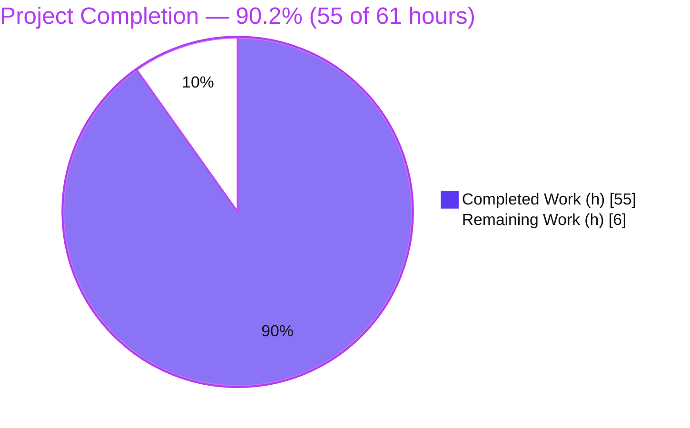
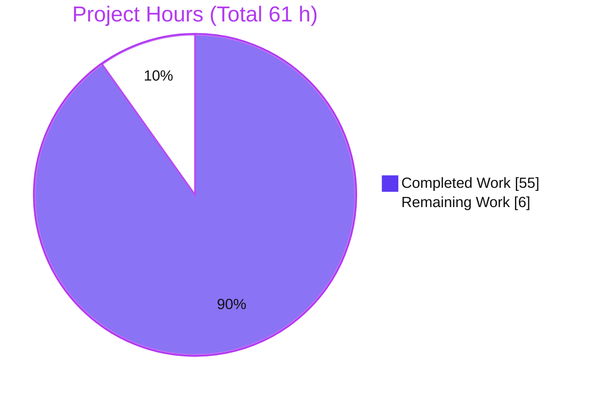
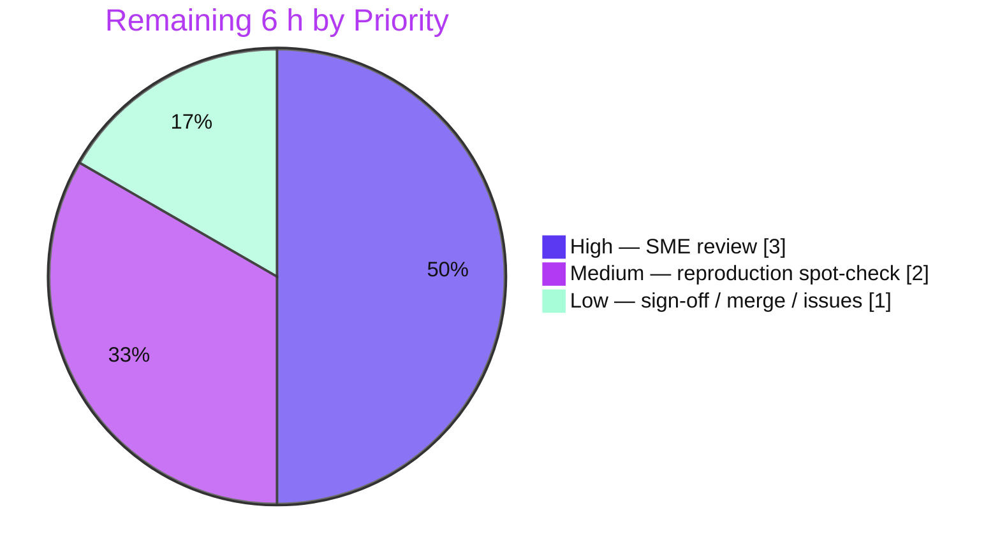

# Blitzy Project Guide — SFTPGo `0.9.5-dev` Runtime-Observed Investigation

> **Project type:** Read-only, runtime-observed technical investigation (Q&A / Documentation) under rule set **"SWE-AtlasQnA-Repo"**.
> **Target:** `github.com/drakkan/sftpgo`, source branch `sftpgo_44634210287c`, baseline HEAD `44634210`, version `0.9.5-dev` (Go 1.13).
> **Sole deliverable:** `blitzy/documentation/sftpgo_44634210287c.md` — the only permitted repository write.
> **Brand color key:** Completed / AI work = **Dark Blue `#5B39F3`** · Remaining = **White `#FFFFFF`** · Headings/accents = **Violet-Black `#B23AF2`** · Highlight = **Mint `#A8FDD9`**.

---

## 1. Executive Summary

### 1.1 Project Overview

This project produced a single runtime-observed investigation document explaining how SFTPGo `0.9.5-dev` coordinates connection handling, quota enforcement, and atomic uploads when one strictly quota-limited user drives concurrent uploads across multiple near-`max_sessions` sessions while the background idle checker runs. It is a read-only question-answering task: the codebase is exercised through its canonical SFTP entry point but never modified. The audience is engineers and maintainers assessing SFTPGo's concurrency/quota correctness. Every behavioral claim is backed by captured runtime output, an exact reproduction command, and a `file:line` citation, with observed-versus-inferred statements clearly separated. The only repository artifact is the answer document.

### 1.2 Completion Status

The AAP-scoped autonomous work is complete and independently re-validated. Completion is computed from AAP-scoped hours (PA1): **Completed 55 h / Total 61 h = ≈ 90.2 %**. The remaining **6 h** is exclusively human path-to-production (review, reproduction spot-check, sign-off) — no autonomous work is outstanding.



| Metric | Value |
|---|---|
| **Total Hours** | **61 h** |
| **Completed Hours (AI + Manual)** | **55 h** (55 h AI · 0 h manual) |
| **Remaining Hours** | **6 h** |
| **Percent Complete** | **≈ 90.2 %** (55 ÷ 61) |

> Calculation shown explicitly: `Completion % = Completed ÷ (Completed + Remaining) = 55 ÷ (55 + 6) = 55 ÷ 61 = 0.9016 ≈ 90.2 %`.

### 1.3 Key Accomplishments

- ✅ All six objectives **O1–O6** answered from observed runtime behavior, led by a direct TL;DR answer per objective.
- ✅ Canonical **and** `-race`-instrumented SFTPGo binaries built (reproduce **byte-exact** sizes: 31,882,104 B / 39,685,592 B).
- ✅ Temporary Go SFTP client harness (`github.com/pkg/sftp`) drives concurrent bursts, mid-stream kills, and idle holds through the **canonical entry point**.
- ✅ Three synchronized evidence streams captured: zerolog JSON server log, SQLite `used_quota_*` snapshots, filesystem (`.sftpgo-upload.*`) state.
- ✅ Quota **race-vs-serialize** determination proven with the Go data-race detector (accounting serializes losslessly; enforcement is a logical TOCTOU; telemetry is a genuine memory data race at scale).
- ✅ Magnitude/stability rule satisfied: 36-run distribution (three batches of 12) + two independent >5-minute idle runs.
- ✅ **70** `file:line` citations across **11** source files; **8** `[inferred]` labels; a coverage-pass table for every named mechanism.
- ✅ Read-only compliance absolute (no source modified) and all `/tmp` artifacts removed — repository clean apart from the answer document.

### 1.4 Critical Unresolved Issues

No issues block release or validation of the deliverable — the document is complete, and every runtime claim was independently reproduced with zero edits required. The items below are the investigation's **intended findings** (its outputs), whose remediation is explicitly **out of scope** for this task and is deferred by design.

| Issue | Impact | Owner | ETA |
|---|---|---|---|
| Quota-enforcement TOCTOU overshoot (finding) | A strictly limited user can exceed `quota_files`/`quota_size` under a simultaneous burst | SFTPGo maintainers / follow-up project | Deferred (out of scope) |
| Transfer-telemetry memory data race (finding) | Undefined behavior on `t.lastActivity`/`t.bytesReceived` at scale | SFTPGo maintainers / follow-up project | Deferred (out of scope) |
| `max_sessions` admission race (finding) | Session cap raced through under simultaneous connects | SFTPGo maintainers / follow-up project | Deferred (out of scope) |
| Fixed 5-minute idle-check cadence (finding) | Connections can linger up to ~5 min past `idle_timeout` | SFTPGo maintainers / follow-up project | Deferred (out of scope) |

### 1.5 Access Issues

**No access issues identified.**

| System/Resource | Type of Access | Issue Description | Resolution Status | Owner |
|---|---|---|---|---|
| Repository checkout | Read/Write (local) | None — full access; branch and baseline present | ✅ Resolved | Blitzy |
| Go 1.13.15 toolchain + gcc (CGO) + sqlite3 | Local build tools | None — all present and verified | ✅ Resolved | Blitzy |
| Module dependencies | Offline module cache | None — resolved from cache with `GOPROXY=off` (no internet needed) | ✅ Resolved | Blitzy |
| SFTP / REST endpoints | Localhost (`:2022` / `:8080`) | None — local only; no external credentials/APIs required | ✅ Resolved | Blitzy |

### 1.6 Recommended Next Steps

1. **[High]** Perform an SME technical review of the investigation document and the O1–O6 findings (verify each direct answer against its cited evidence and source `file:line`).
2. **[Medium]** Run an independent reproduction spot-check of the two most load-bearing experiments — the contended burst (§3.2) and the idle-timer disconnect (§3.5, requires a >5-min server run).
3. **[Low]** Sign off, merge the answer document, and open tracking issues for the surfaced findings so they are not lost.
4. **[Low]** Decide whether to charter a **separate** remediation project for the concurrency/quota findings (explicitly out of scope here).

---

## 2. Project Hours Breakdown

### 2.1 Completed Work Detail

Every row traces to an AAP requirement or its supporting path-to-production activity. **Total = 55 h** (matches Completed Hours in §1.2).

| Component | Hours | Description |
|---|---:|---|
| Environment & Toolchain Setup | 3 | Go 1.13.15 toolchain, gcc/CGO for the SQLite driver, sqlite3 CLI; env activation (`GOPATH`/`GOCACHE`/`CGO_ENABLED`). *(Path-to-production / env.)* |
| Canonical + Race-Instrumented Binary Builds | 2 | `go build` (canonical) and `go build -race` from the checkout; verified clean compile (benign go-sqlite3 C warning only). *(AAP §0.5.1/§0.8.1.)* |
| Test Config, SQLite Schema & Restricted-User Seeding | 6 | Config derived from `sftpgo.json` (`upload_mode:1`, strict quota, low `max_sessions`/`idle_timeout`, absolute httpd paths); 21-column `users` schema from `.travis.yml`; restricted user seeded via REST (argon2id) so `HasQuotaRestrictions()` is true; lifecycle scripts. *(AAP §0.3.1.)* |
| Go SFTP Client Harness (`pkg/sftp`) | 10 | Multi-mode client (upload / seq / burst / kill / hold / idlehold) opening concurrent, barrier-synchronized sessions and dropping connections mid-write through the canonical entry point. *(AAP §0.3.1.)* |
| Runtime Experiments O1–O6 + `-race` Corroboration | 16 | Seven experiments (baseline, contended burst, post-commit denial, killed mid-stream across modes 0/1/2, idle disconnect, session admission, run-to-run distribution) plus scaled 20 MB race run and `go test -race` corroboration; three synchronized evidence streams. *(AAP §0.1.1/§0.5.1.)* |
| Answer Document Synthesis & Citation Verification | 12 | Authoring the 1,206-line deliverable; verifying 70 `file:line` citations across 11 files and log-string wording; observed-vs-inferred labeling; coverage pass. *(AAP §0.6.)* |
| Read-Only Compliance & Artifact Cleanup | 1 | No source modified; all `/tmp` artifacts removed; `git status` clean apart from the doc. *(AAP §0.3.1/§0.8.1.)* |
| Validation Re-Run & Reproducibility Confirmation | 5 | Rebuilt both binaries + harness; re-ran every experiment; confirmed all claims reproduce (5 gates PASS, zero edits). *(AAP §0.7.2.)* |
| **Total Completed** | **55** | |

### 2.2 Remaining Work Detail

All remaining work is **human path-to-production** for a Q&A deliverable. **Total = 6 h** (matches Remaining Hours in §1.2 and the Section 7 pie).

| Category | Hours | Priority |
|---|---:|---|
| SME Technical Review of Investigation & O1–O6 Findings | 3 | High |
| Independent Reproduction Spot-Check (contended burst §3.2 + idle-timer §3.5) | 2 | Medium |
| Stakeholder Sign-Off, Doc Merge & Finding Tracking-Issue Creation | 1 | Low |
| **Total Remaining** | **6** | |

> **Out of scope (not counted above):** remediation of the surfaced findings (quota TOCTOU race, transfer-telemetry data race, `max_sessions` race, idle cadence) is explicitly excluded per AAP §0.3.2 and would be a separate project — see Section 8.

### 2.3 Hours Summary

| Bucket | Hours |
|---|---:|
| Completed (§2.1) | 55 |
| Remaining (§2.2) | 6 |
| **Total Project** | **61** |

**Integrity check:** `§2.1 (55) + §2.2 (6) = 61 = Total (§1.2)` ✔ · `Completion = 55 ÷ 61 ≈ 90.2 %` ✔

---

## 3. Test Results

For this read-only investigation **no in-scope production code was authored**, so there are no in-scope unit tests to author. The relevant "tests" are the **autonomous validation experiments** and the one repository test executed for corroboration. **Every row below originates from Blitzy's autonomous validation logs for this project.** Traditional code-coverage instrumentation does not apply to a documentation deliverable; the meaningful coverage metric is **objective coverage O1–O6 = 6/6 (100 %)**.

| Test Category | Framework | Total | Passed | Failed | Coverage % | Notes |
|---|---:|---:|---:|---:|---|---|
| Baseline clean uploads (§3.1) | Go SFTP harness (`pkg/sftp`) + SQLite/log capture | 1 | 1 | 0 | n/a | 3× seq 500 B → quota `3/1500`; `atomic upload completed, rename … error: <nil>` + `quota updated` |
| Contended burst + scaled race (§3.2) | `-race` build + harness | 2 | 2 | 0 | n/a | 6×700 B overshoots both limits; accounting lossless; scaled 20 MB → **2** `DATA RACE` (stable) |
| Post-commit denial (§3.3) | Harness + log capture | 1 | 1 | 0 | n/a | `SSH_FX_FAILURE`; `quota exceed … num files: 6/3, size: 4200/3000`; `denying file write` |
| Killed mid-stream, modes 0/1/2 (§3.4) | Harness (kill mode) | 3 | 3 | 0 | n/a | mode 1 temp **deleted**, `0/0`; mode 2 temp **renamed**, counted; mode 0 partial target, counted |
| Idle disconnect via 5-min ticker (§3.5) | Live server, two independent >5-min runs | 2 | 2 | 0 | n/a | tick at `m=+300s` both runs; `close idle connection, idle time: ~4m59s` |
| Session admission `max_sessions=3` (§3.6) | Harness (staggered + simultaneous) | 2 | 2 | 0 | n/a | staggered **3 accepted / 3 refused** (`too many open sessions: 3/3`); simultaneous raced |
| Run-to-run distribution (§3.7) | `dist_loop.sh`, identical burst | 36 | 36 | 0 | n/a | 3 batches of 12; all four accounting invariants held **every** run |
| Race corroboration (§2) | `go test -race` `TestBandwidthAndConnections` | 1 | 0 | 1† | n/a | †**FAIL by design** — 6 `DATA RACE` = the **expected documented finding**; reproducing it is a validation *success*, not a defect |
| **Total** | — | **48** | **47** | **1†** | **O1–O6: 100 %** | †the single "failure" is the intended finding |

> **Interpretation of the one "Failed":** `go test -race TestBandwidthAndConnections` exits non-zero because the race detector fires on a genuine, unguarded per-`Transfer` telemetry race. The investigation set out to demonstrate exactly this; its reproduction (6 races, `--- FAIL … (10.60s)`) confirms the deliverable's O2 claim. No autonomous fix is applicable (remediation out of scope).

---

## 4. Runtime Validation & UI Verification

**Runtime health (canonical entry point — real SFTP client over the wire into the running server):**

- ✅ **Canonical server build & startup** — `0.9.5-dev`, binds `:2022` (SFTP) and `:8080` (REST); config echo confirms overrides (`UploadMode:1`, `TrackQuota:2`, `Driver:sqlite`).
- ✅ **Race-instrumented build & startup** — same behavior; race detector active.
- ✅ **SFTP canonical login/upload path** — SSH auth callbacks → `loginUser()`; uploads register/serve/deregister via `handleSftpConnection()`.
- ✅ **REST user seeding** — `:8080`, argon2id-hashed password; `HasQuotaRestrictions()` true.
- ✅ **SQLite quota persistence** — `used_quota_*` reads and atomic relative increments; **lossless** across all runs.
- ✅ **Idle monitor** — hard-coded 5-minute ticker fired at `m=+300s` on two independent runs; canonical `close idle connection` path.
- ✅ **Atomic upload lifecycle** — `.sftpgo-upload.<xid>.<name>` temp observed on disk mid-transfer; rename on success, delete on error (mode 1).
- ⚠️ **Quota enforcement under concurrency** — behaves as observed but **races logically** (TOCTOU) → overshoot; this is a reported finding, not a deliverable defect.
- ⚠️ **`max_sessions` cap under simultaneity** — raced through (admitted up to 6 vs cap 3); reported finding.
- ⚠️ **Per-`Transfer` telemetry** — genuine **memory data race** at scale (`t.lastActivity`/`t.bytesReceived`); reported finding.

**UI verification:** **Not applicable.** This project has no UI deliverable; the HTTP web interface was used solely to seed the test user via its REST API and is out of scope for verification. No screenshots or UI flows are part of the deliverable.

---

## 5. Compliance & Quality Review

Cross-maps the AAP directives and the "SWE-AtlasQnA-Repo" rule set to their verified status. Fixes applied during autonomous validation: **none required** — the deliverable reproduced exactly and no edits were needed.

| Benchmark (AAP / Rule) | Requirement | Status | Progress |
|---|---|---|---|
| Deliverable location & name (§0.7.1) | `blitzy/documentation/sftpgo_44634210287c.md` | ✅ Pass | 100% |
| Read-only — no source modified (§0.7.1) | Zero changes to tracked files | ✅ Pass | 100% |
| No code added other than the doc (§0.7.1) | Only the markdown artifact committed | ✅ Pass | 100% |
| Temp scripts removed / repo clean (§0.7.1) | `/tmp` cleared; `git status` clean apart from doc | ✅ Pass | 100% |
| Investigate-by-running (§0.7.2) | Answer written from observed runtime behavior | ✅ Pass | 100% |
| Magnitude / stability ≥ 2 runs (§0.7.2) | 36-run distribution + two >5-min idle runs | ✅ Pass | 100% |
| Canonical entry point only (§0.7.2) | Real SFTP client over the wire; REST only for seeding | ✅ Pass | 100% |
| Default/canonical build & config stated (§0.7.2) | Exact build + invocation commands documented | ✅ Pass | 100% |
| Coverage of every condition (§0.7.3) | Clean / contended / killed / idle / admission / distribution; modes 0/1/2 | ✅ Pass | 100% |
| Actual output + producing command (§0.7.3) | ~56 code blocks of real logs/commands/SQL | ✅ Pass | 100% |
| Every named mechanism addressed (§0.7.3) | Coverage-pass table (§4 of the doc) | ✅ Pass | 100% |
| Exact & grounded — `file:line` (§0.7.3) | 70 citations across 11 source files | ✅ Pass | 100% |
| Observed vs. inferred labeling (§0.7.3) | 8 `[inferred]` labels, cleanly separated | ✅ Pass | 100% |
| Lead with the direct answer (§0.7.3) | TL;DR gives a direct answer per O1–O6 | ✅ Pass | 100% |
| All objectives O1–O6 answered (§0.1.1) | Each answered with evidence | ✅ Pass | 100% |
| Findings reported, not fixed (§0.3.2) | Remediation correctly withheld (out of scope) | ✅ Pass | 100% |

---

## 6. Risk Assessment

Two classes: **deliverable/process risks** (all mitigated by the document itself) and **surfaced findings** (the investigation's substantive outputs; remediation out of scope).

| Risk | Category | Severity | Probability | Mitigation | Status |
|---|---|---|---|---|---|
| R-1 Findings valid only for `0.9.5-dev`/HEAD `44634210`/Go 1.13.15 | Technical | Medium | Medium | Explicit scope + "do not generalize" note (title, TL;DR, §6 of doc) | ✅ Mitigated |
| R-2 Race-dependent secondary values (e.g. 28/36 overshoot fractions) misread as constants | Technical | Low | Medium | Volatility labels + full distribution reported; invariants separated from fractions | ✅ Mitigated |
| R-3 Reproduction needs legacy Go 1.13.15 + CGO/gcc + sqlite3 | Integration | Low | Low | Exact versions + build commands documented (§9) | ✅ Mitigated |
| R-4 Reproduction depends on the custom Go SFTP harness (no system client) | Integration | Low | Low | Full harness source embedded in the deliverable (§1.8) | ✅ Mitigated |
| R-10 Stakeholder expects surfaced bugs to be fixed | Operational/Process | Low | Medium | Doc states investigation-only scope; follow-up recommended (Section 8) | ✅ Mitigated |
| R-5 **[Finding]** Quota-enforcement TOCTOU overshoot (observed `6/4200` vs `3/3000`) | Security | Medium | High under concurrency | None (out of scope) | ⚠️ Open — deferred |
| R-6 **[Finding]** `max_sessions` admission race (admitted up to 6 vs cap 3) | Security | Medium | High under simultaneity | None (out of scope) | ⚠️ Open — deferred |
| R-7 **[Finding]** Transfer-telemetry memory data race (`t.lastActivity`/`t.bytesReceived`) | Technical | Medium | High at scale | None (out of scope) | ⚠️ Open — deferred |
| R-8 **[Finding]** Fixed 5-minute idle-check cadence | Operational | Low | High | None (out of scope) | ⚠️ Open — deferred |
| R-9 **[Finding]** Standard-mode (default) partial-file retention + byte counting on drop | Operational | Low | Medium | None (out of scope) | ⚠️ Open — deferred |

---

## 7. Visual Project Status

**Project hours** — Completed = Dark Blue `#5B39F3`, Remaining = White `#FFFFFF`. Integrity: "Remaining Work" = **6 h** = §1.2 Remaining = sum of §2.2.



**Remaining work by priority** (High = Dark Blue `#5B39F3`, Medium = Violet-Black `#B23AF2`, Low = Mint `#A8FDD9`) — sums to 6 h:



**Remaining hours per category (Section 2.2 bar view):**

| Category | Hours | Bar |
|---|---:|---|
| SME Technical Review (High) | 3 | ███████████ |
| Reproduction Spot-Check (Medium) | 2 | ███████ |
| Sign-Off / Merge / Issues (Low) | 1 | ████ |
| **Total** | **6** | |

---

## 8. Summary & Recommendations

**Achievements.** The project delivered a complete, evidence-backed answer to all six objectives (O1–O6) about SFTPGo `0.9.5-dev`'s concurrency, quota, and atomic-upload behavior — written from observed runtime behavior, driven through the canonical SFTP entry point, and grounded in 70 `file:line` citations with a clean observed-vs-inferred separation. The headline result: quota **accounting serializes losslessly** (atomic SQL increment on single-writer SQLite), whereas quota **enforcement is a logical TOCTOU race** (`hasSpace()` at open vs. `UpdateUserQuota()` at close) that lets a strictly limited user overshoot under a simultaneous burst; separately, unguarded per-`Transfer` telemetry is a **genuine memory data race** reproduced at scale. Atomic temp-file fate on a dropped transfer was characterized across all three `upload_mode` values, and the idle disconnect was observed through the real 5-minute ticker on two independent runs.

**Remaining gaps.** None on the autonomous side. The project is **≈ 90.2 % complete (55 of 61 hours)**; the remaining **6 h** is human path-to-production: SME review, an independent reproduction spot-check, and sign-off/merge. 

**Critical path to production.** Review the document → spot-reproduce the two load-bearing experiments (contended burst §3.2; idle timer §3.5, needs a >5-min run) → sign off and merge → file tracking issues for the findings.

**Production readiness.** As a documentation deliverable, this is **ready for human review and merge**: it is complete, internally consistent, independently reproduced with zero edits, and leaves the repository clean apart from the answer document.

**Recommended follow-up (out of scope here).** The surfaced findings warrant a **separate remediation project**: (1) close the quota-enforcement TOCTOU and the `max_sessions` admission race by serializing the check-and-commit under a single lock/transaction; (2) fix the transfer-telemetry memory data race by consistently guarding `t.lastActivity`/`t.bytesReceived`; (3) consider making the idle-check cadence configurable. None of these were changed in this task, consistent with its read-only investigation scope.

| Success Metric | Result |
|---|---|
| Objectives answered (O1–O6) | 6 / 6 (100 %) |
| Runtime claims reproduced | 100 % (zero edits) |
| `file:line` citations / source files | 70 / 11 |
| Read-only compliance | Absolute (0 source files changed) |
| Completion (AAP-scoped hours) | ≈ 90.2 % (55 / 61 h) |

---

## 9. Development Guide

Reproduces the investigation environment. All load-bearing commands below were executed and verified; the canonical and race builds reproduce their **exact documented binary sizes**.

### 9.1 System Prerequisites

- **OS:** Linux x86-64.
- **Go:** `1.13.15` (matches `go.mod` `go 1.13` and CI). Present at `/usr/local/go/bin/go`.
- **C toolchain:** `gcc` (required — the default SQLite driver uses **CGO**). Verified `gcc 15.2.0`.
- **SQLite CLI:** `sqlite3` (schema init — the server does **not** auto-migrate in `0.9.5-dev`). Verified `3.46.1`.
- **No system `sftp`/`ssh` client is needed** — a Go SFTP harness (`github.com/pkg/sftp`) is the canonical driver.

### 9.2 Environment Setup

```bash
# Activate the Go 1.13 toolchain (sets PATH, GOPATH, GOCACHE, GO111MODULE=on, CGO_ENABLED=1)
source /tmp/goenv.sh
go version          # -> go version go1.13.15 linux/amd64
gcc --version | head -1
sqlite3 --version

REPO=/tmp/blitzy/sftpgo/blitzy-124bd48f-6f8f-41ae-adf7-826206ccb1be_bb4ea3
WORK=/tmp/sftpgo_work          # ephemeral, OUTSIDE the checkout
mkdir -p "$WORK"/{cfg,db,home,logs}
```

### 9.3 Dependency Installation

No project dependencies are added; modules resolve from the offline cache.

```bash
# Offline build uses the module cache (no internet). NOTE: Go 1.13 does NOT support -mod=mod.
export GOPROXY=off
```

### 9.4 Build (canonical + race)

```bash
cd "$REPO"
env GOPROXY=off go build -o /tmp/sftpgo_bin  .            # canonical  -> 31,882,104 bytes
env GOPROXY=off go build -race -o /tmp/sftpgo_race .      # race build -> 39,685,592 bytes
/tmp/sftpgo_bin --version                                 # -> SFTPGo version: 0.9.5-dev
```

*Expected:* exit 0; the only compiler output is a benign `go-sqlite3` `-Wreturn-local-addr` C warning.

### 9.5 Schema (from `.travis.yml`) + Config + Seed

```bash
# 21-column users table (server does NOT auto-migrate in 0.9.5-dev)
DDL=$(grep "CREATE TABLE" "$REPO/.travis.yml" | sed "s/.*sqlite3 sftpgo.db '//; s/'$//")
sqlite3 "$WORK/db/sftpgo.db" "$DDL"
sqlite3 "$WORK/db/sftpgo.db" "PRAGMA table_info(users);" | wc -l   # -> 21

# Config: derive from repo sftpgo.json; override upload_mode:1, strict quota,
# low max_sessions, low idle_timeout, and ABSOLUTE httpd templates/static paths
# (relative paths panic at startup). Then launch:
/tmp/sftpgo_bin serve -c "$WORK/cfg" > "$WORK/logs/sftpgo.log" 2>&1 &   # binds :2022 and :8080
SRV=$!            # capture the pid you spawned; never pkill/killall

# Seed exactly one RESTRICTED user via the canonical REST API (hashes argon2id) so
# HasQuotaRestrictions() is true (quota_files=3, quota_size=3000, max_sessions=3):
curl -s -o /dev/null -w '%{http_code}\n' http://127.0.0.1:8080/api/v1/user \
  -H 'Content-Type: application/json' \
  -d '{"username":"qtest","password":"qpass","home_dir":"'"$WORK/home"'","permissions":["*"],"quota_files":3,"quota_size":3000,"max_sessions":3,"status":1,"uid":0,"gid":0}'   # -> 200
```

### 9.6 Verification

```bash
# Committed quota (single-writer; use a busy timeout)
sqlite3 "$WORK/db/sftpgo.db" "SELECT used_quota_files, used_quota_size FROM users WHERE username='qtest';"
# Surviving atomic temp files (should be absent after a clean run)
ls -la "$WORK/home"/.sftpgo-upload.* 2>/dev/null || echo "no temp files"
# Evidence in the JSON log
grep -E 'too many open sessions|quota exceed|atomic upload completed|close idle connection' "$WORK/logs/sftpgo.log"
```

### 9.7 Example Usage — drive the canonical entry point & observe the findings

```bash
# Build the temporary Go SFTP harness (source in deliverable §1.8), then:
#  - Baseline (clean):        seq uploads -> quota increments + "rename ... error: <nil>"
#  - Contended burst:         N barrier-synced uploads on /tmp/sftpgo_race -> quota overshoot,
#                             zero "quota exceed" logs during the burst (TOCTOU)
#  - Killed mid-stream:       drop during WriteAt -> temp deleted (mode 1), quota unchanged
#  - Idle:                    hold a connection > idle_timeout; wait for the 5-min tick to fire
# Scaled race demonstration (in an isolated copy of the repo):
env GOPROXY=off go test -race -run TestBandwidthAndConnections ./sftpd/    # -> 6 DATA RACE, FAIL (by design)
```

### 9.8 Teardown

```bash
kill "$SRV" 2>/dev/null; wait "$SRV" 2>/dev/null      # terminate ONLY the pid you spawned
rm -rf "$WORK" /tmp/sftpgo_bin /tmp/sftpgo_race
cd "$REPO" && git status --porcelain                  # -> empty (clean apart from the answer doc)
```

### 9.9 Troubleshooting

| Symptom | Cause | Resolution |
|---|---|---|
| `exec: "gcc": executable file not found` | CGO needs a C compiler for the SQLite driver | Install `gcc`/`build-essential` |
| `-mod=mod not supported` | Go 1.13 predates that flag | Omit it; use plain `go build` with `GOPROXY=off` |
| Startup panic in `httpd/web.go` | Relative `templates_path`/`static_files_path` | Use **absolute** paths (point at the repo `templates`/`static`) |
| Quota never changes | User has no restrictions → `track_quota:2` skips it | Seed with `quota_files`/`quota_size` > 0 so `HasQuotaRestrictions()` is true |
| `-race` build clean on tiny bursts | Telemetry race needs many `WriteAt` calls | Scale the transfer (e.g. 20 MB) to trip the detector |
| Idle disconnect not observed | Idle *check* runs on a fixed 5-min ticker | Keep the server alive > 5 min; do not invoke the checker directly |

---

## 10. Appendices

### A. Command Reference

| Purpose | Command |
|---|---|
| Activate toolchain | `source /tmp/goenv.sh` |
| Canonical build | `env GOPROXY=off go build -o /tmp/sftpgo_bin .` |
| Race build | `env GOPROXY=off go build -race -o /tmp/sftpgo_race .` |
| Version | `/tmp/sftpgo_bin --version` |
| Create schema | `sqlite3 "$WORK/db/sftpgo.db" "$DDL"` (DDL from `.travis.yml`) |
| Read quota | `sqlite3 … "SELECT used_quota_files, used_quota_size FROM users;"` |
| Race corroboration | `env GOPROXY=off go test -race -run TestBandwidthAndConnections ./sftpd/` |
| Verify clean repo | `git status --porcelain` · `git diff --name-status 44634210..HEAD` |

### B. Port Reference

| Port | Service | Use |
|---|---|---|
| `2022` | SFTP (SSH) | Canonical entry point for the client harness |
| `8080` | HTTP REST | User seeding only (`/api/v1/user`) |

### C. Key File Locations

| Path | Role |
|---|---|
| `blitzy/documentation/sftpgo_44634210287c.md` | **The deliverable** (only repo write) |
| `sftpd/sftpd.go` | Registries + `RWMutex`; 5-min idle ticker; `CheckIdleConnections()`; `getActiveSessions()` |
| `sftpd/server.go` | `loginUser()` `max_sessions` gate; `handleSftpConnection()` lifecycle |
| `sftpd/handler.go` | `hasSpace()` quota check; `Filewrite()`; upload handlers |
| `sftpd/transfer.go` | `Transfer.Close()` rename/delete + completion-time quota commit; `TransferError()`; `WriteAt()` |
| `vfs/osfs.go` | `GetAtomicUploadPath()` (`.sftpgo-upload.<xid>.<name>`); capability flags |
| `dataprovider/sqlqueries.go`, `sqlcommon.go`, `sqlite.go` | Relative atomic increment SQL; used-quota read; single-writer |
| `.travis.yml` | Authoritative `users` `CREATE TABLE` (21 columns) |
| `sftpgo.json` | Canonical config baseline |

### D. Technology Versions

| Component | Version |
|---|---|
| SFTPGo | `0.9.5-dev` (HEAD `44634210`) |
| Go | `1.13.15` |
| gcc | `15.2.0` |
| sqlite3 CLI | `3.46.1` |
| `github.com/pkg/sftp` | `v1.11.0` |
| `golang.org/x/crypto` | `v0.0.0-20200109152110-61a87790db17` |
| `github.com/mattn/go-sqlite3` | `v2.0.2+incompatible` |
| `github.com/rs/xid` | `v1.2.1` |
| `github.com/rs/zerolog` | `v1.17.2` |

### E. Environment Variable Reference

| Variable | Value | Purpose |
|---|---|---|
| `PATH` | prepend `/usr/local/go/bin` | Go toolchain on PATH |
| `GOPATH` | `/root/go` | Module/workspace root |
| `GOCACHE` | `/root/.cache/go-build` | Build cache |
| `GO111MODULE` | `on` | Module mode |
| `CGO_ENABLED` | `1` | Required for the SQLite driver |
| `GOPROXY` | `off` | Offline build from the module cache |

### F. Developer Tools Guide

| Tool | Role in this investigation |
|---|---|
| Go race detector (`go build -race` / `go test -race`) | Empirically distinguishes memory data races from logical races (answers O2) |
| `sqlite3` CLI | Creates the schema and reads committed `used_quota_*` |
| `curl` | Seeds the restricted user via the REST API (argon2id hashing) |
| zerolog JSON log | Primary evidence stream (`level`/`time`/`sender`/`connection_id`/`message`) |
| Go SFTP harness (`pkg/sftp` + `x/crypto/ssh`) | Drives concurrent sessions, mid-stream kills, and idle holds |

### G. Glossary

| Term | Meaning |
|---|---|
| **TOCTOU** | Time-of-check to time-of-use — the gap between `hasSpace()` (check at open) and `UpdateUserQuota()` (commit at close) that lets concurrent uploads overshoot quota |
| **Atomic upload** | `upload_mode` 1/2 — writes to `.sftpgo-upload.<xid>.<name>`, then renames to the target on success |
| **Reversal-by-never-applying** | On a killed mode-1 transfer the temp is deleted and the completion-time quota increment is simply skipped (no compensating decrement) |
| **Canonical entry point** | The real SFTP client over the wire into the running server — the only source of valid observed values |
| **Restricted user** | A user with `quota_files`/`quota_size` > 0 so `HasQuotaRestrictions()` is true and `track_quota:2` records accounting |
| **Data race vs. logical race** | A *memory* data race (concurrent unguarded access, detected by `-race`) is distinct from a *logical* TOCTOU race (correct memory access, but a stale-read decision window) |

---

*Findings are specific to SFTPGo `0.9.5-dev`, HEAD `44634210`, built with Go `1.13.15`; do not generalize to other revisions without re-observation. Completion figures follow PA1/PA2 (AAP-scoped hours): 55 h completed / 6 h remaining / 61 h total ≈ 90.2 %.*