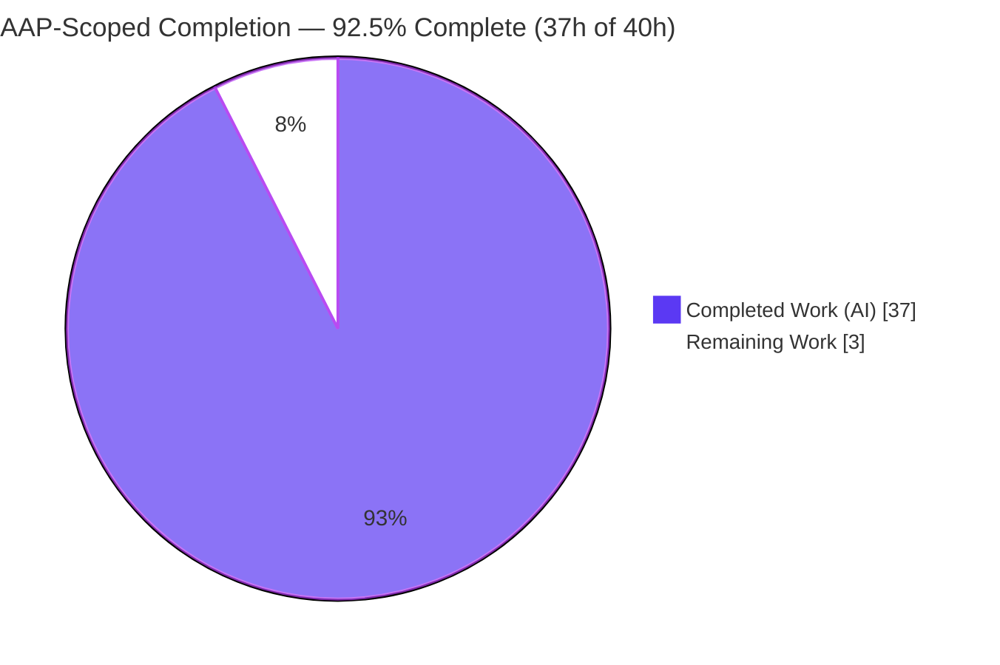
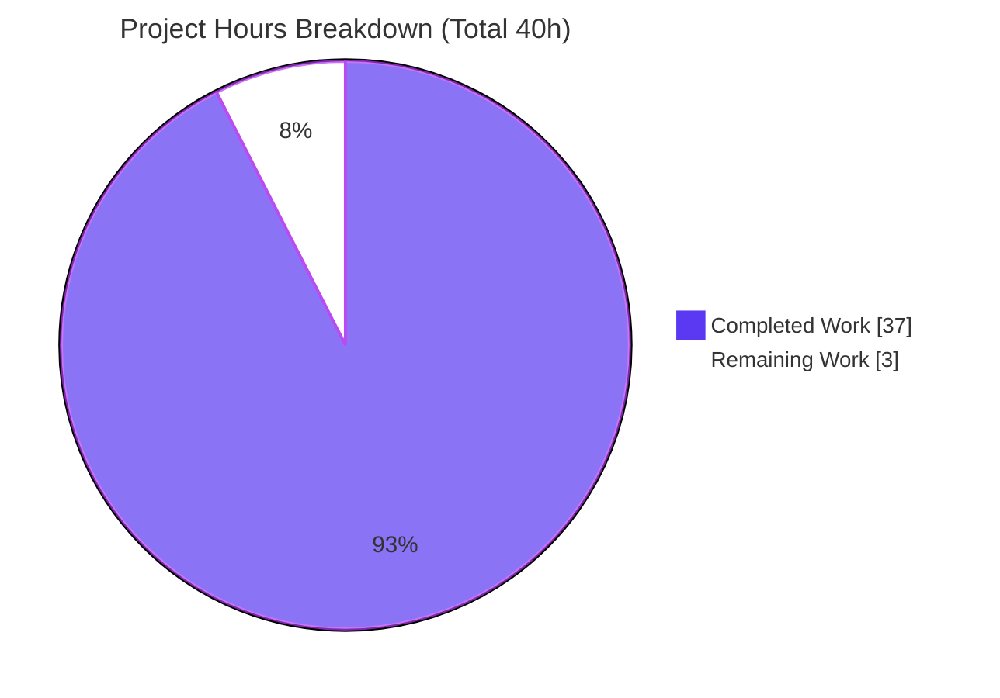
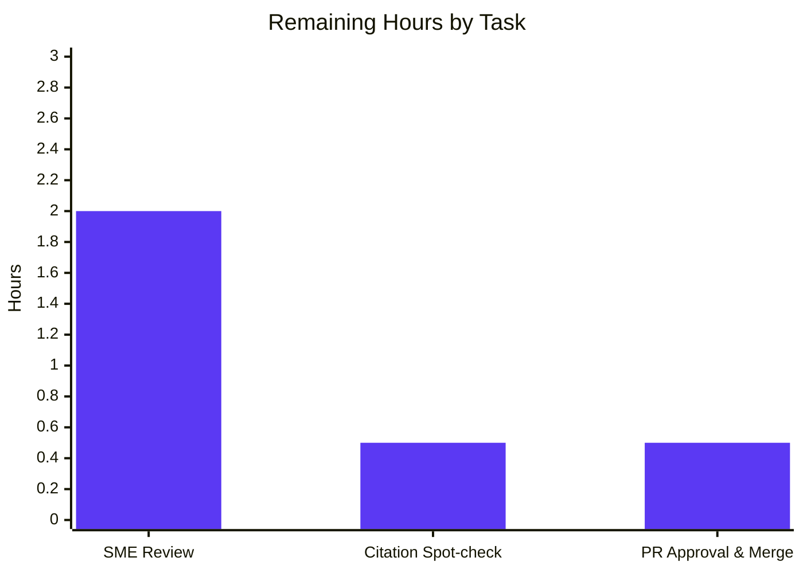
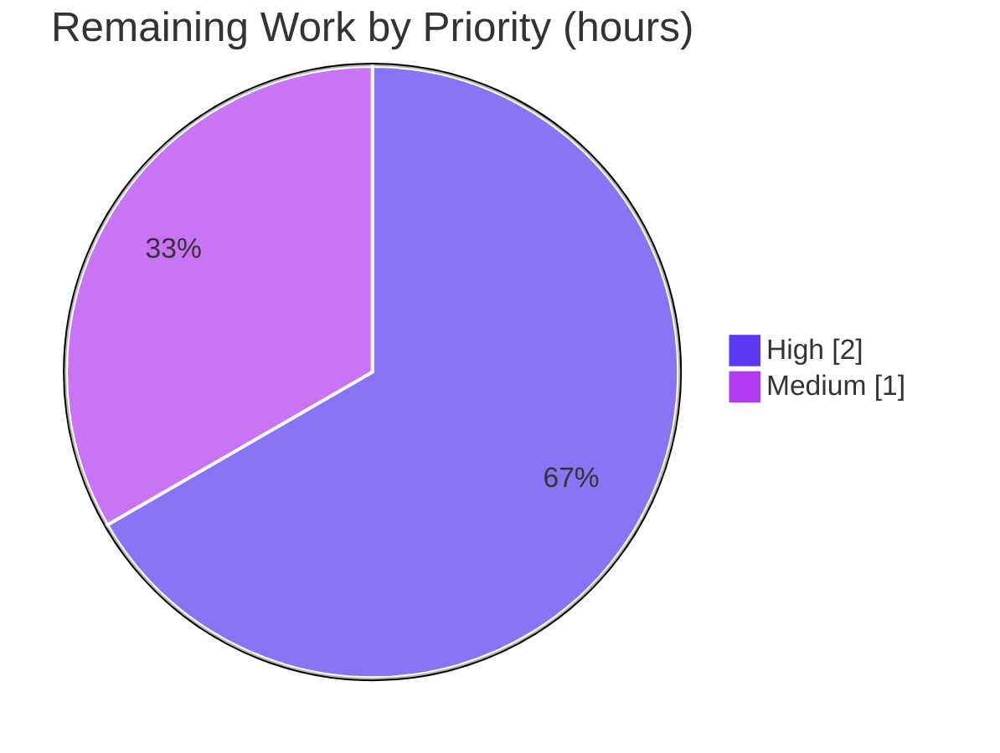

# Blitzy Project Guide — SFTPgo Per-User Upload Quota Enforcement Investigation

> **Branch:** `blitzy-b8fefe7c-7376-424c-9629-3436333b3065` · **Base:** `sftpgo_44634210287c` (HEAD `44634210`) · **Deliverable HEAD:** `647491dc`
> **Rule:** `SWE-AtlasQnA-Repo` (read-only investigation + single Markdown answer document)
> **Brand color legend:** <span style="color:#5B39F3">■</span> **Completed / AI Work = Dark Blue `#5B39F3`** · <span style="color:#FFFFFF">□</span> **Remaining = White `#FFFFFF`**

---

## 1. Executive Summary

### 1.1 Project Overview

This project delivers a single, evidence-grounded Markdown document that explains how SFTPgo's per-user upload quota enforcement actually behaves in the **SFTPGo 0.9.5-dev** build (Go 1.13). Following the `SWE-AtlasQnA-Repo` "run-the-code-first" mandate, the SFTPgo server was **built, run, and driven** through a deterministic upload experiment, and the observed output was quoted **verbatim** to answer five investigative sub-questions (behavior at the limit, exact client error, server logging, reported-vs-on-disk usage, and check timing). The audience is engineers investigating "unexpected" quota behavior. Scope is strictly **read-only**: the answer document is the only artifact added; no source file is modified.

### 1.2 Completion Status



| Metric | Value |
|--------|-------|
| **Total Hours** | **40** |
| **Completed Hours (AI + Manual)** | **37** (37 AI-autonomous + 0 manual) |
| **Remaining Hours** | **3** |
| **Percent Complete** | **92.5%** |

> Completion is computed with the PA1 AAP-scoped, hours-based method: `Completed ÷ (Completed + Remaining) = 37 ÷ 40 = 92.5%`. All completed hours are autonomous (author `agent@blitzy.com`); no manual human hours have been logged yet.

### 1.3 Key Accomplishments

- ✅ **Built SFTPgo from source** with the Go 1.13.15 toolchain (`CGO_ENABLED=1 CC=gcc go build`); binary reports `SFTPGo version: 0.9.5-dev`.
- ✅ **Ran the server with debug verbosity** (`serve -c <dir> -l <log> -v`) on SFTP `:2022` and HTTP `:8080`, capturing structured zerolog-JSON startup output.
- ✅ **Reproduced the full quota experiment live** — provisioned `quotatest` (`quota_size=10240`, `quota_files=3`) and drove three 6000-byte uploads over one SFTP connection.
- ✅ **Answered all five sub-questions (Q1–Q5)** with verbatim observed output (client results, server logs, reported usage, on-disk counts) and exact `file:line` grounding.
- ✅ **Authored the 507-line deliverable** `blitzy/documentation/sftpgo_44634210287c.md` with an explicit coverage pass over Q1–Q5.
- ✅ **Verified 87 unique `file:line` citations** exact (independently spot-checked 6/6 to expected literals).
- ✅ **Left the repository pristine** — `git diff --name-status` shows only the added `.md`; all ephemeral build/run artifacts removed; working tree clean.

### 1.4 Critical Unresolved Issues

| Issue | Impact | Owner | ETA |
|-------|--------|-------|-----|
| _None blocking._ The AAP-scoped deliverable is complete and validated. | No release blocker. | — | — |
| (Non-blocking) Human SME sign-off on the five answers not yet performed | Standard editorial gate before merge | Reviewer / SME | 2h |

### 1.5 Access Issues

| System/Resource | Type of Access | Issue Description | Resolution Status | Owner |
|-----------------|----------------|-------------------|-------------------|-------|
| — | — | **No access issues identified.** The investigation ran entirely locally (source build, local SQLite/Bolt provider, loopback REST + SFTP). No external credentials, private registries, or third-party APIs were required. | N/A | — |

### 1.6 Recommended Next Steps

1. **[High]** Technical SME reviews the 507-line deliverable and confirms the five answers (Q1–Q5) are accurate for SFTPGo 0.9.5-dev. *(2h)*
2. **[Medium]** Reviewer spot-checks a sample of the 87 `file:line` citations against source at HEAD `44634210` using the provided verification snippet (§9). *(0.5h)*
3. **[Medium]** Approve the PR and merge `blitzy/documentation/sftpgo_44634210287c.md`; confirm the working tree remains clean. *(0.5h)*
4. **[Low, optional]** Add a cross-link to the new document from `README.md` or a docs index for discoverability.
5. **[Low, optional]** Independently re-run the experiment (Go 1.13.x + CGO SQLite) per §9 to reconfirm the observed values.

---

## 2. Project Hours Breakdown

### 2.1 Completed Work Detail

Every component below traces to a specific AAP requirement (build → run → observe → analyze → author → verify → cleanup). All hours are AI-autonomous.

| Component | Hours | Description |
|-----------|:----:|-------------|
| Environment build & compilation | 3 | Build SFTPgo from source (Go 1.13.15 + CGO SQLite), resolve 131 modules, produce runnable binary reporting `0.9.5-dev`. |
| Server runtime setup & debug-logging run | 2 | Initialize SQLite `sftpgo.db` from the `.travis.yml` `CREATE TABLE`; run `serve -c -l -v`; capture zerolog-JSON startup (SFTP:2022, HTTP:8080, host-key gen, `IsSCPEnabled:false`). |
| Test user provisioning (REST API) | 1 | `POST /api/v1/user` to create `quotatest` with **both** `quota_size=10240` and `quota_files=3`; verify HTTP 200 user JSON. |
| Observation client & upload scripts | 4 | Author a pure-Go `pkg/sftp v1.11.0` client to open/write/close and time uploads, capturing errors and durations. |
| Experiment execution & per-step evidence capture | 3 | Drive the deterministic 3×6000-byte sequence (near-limit, boundary-crossing, over-limit) over one connection; capture client/server/disk state per file. |
| Reconciliation & timing analysis | 3 | Reconcile reported-vs-on-disk usage; run `quota_scan`; correlate client-vs-server timestamps to establish pre-flight ordering. |
| Source investigation & grounding | 5 | Read the quota subsystem across ~15 files (`sftpd/*`, `dataprovider/*`, `httpd/api_quota.go`, `logger`) and map every claim to a `file:line`. |
| Web research validation | 1 | Validate `track_quota` semantics, `SSH_FX_FAILURE` meaning, and the SFTP-vs-SSH-command path distinction against external docs. |
| Document authoring | 8 | Write the 507-line deliverable: setup/reproduction, Q1–Q5 answers, "why unexpected", SSH-command/SCP contrast, coverage pass. |
| Citation compilation & verification | 3 | Compile and verify **87** exact `file:line` citations (including `pkg/sftp` internals deriving the Q2 error string). |
| Coverage pass & markdown validation | 1 | Confirm each of Q1–Q5 is explicitly answered; validate balanced code fences and well-formed tables. |
| Review-finding revision & QA fixes | 2 | Address code-review findings (commit `5dd33123`, +77/−53) and two QA fixes (`a6650dca` citation, `647491dc` typo). |
| Cleanup & pristine-repo verification | 1 | Remove temp DB, scripts, uploads, binary, host key, logs; verify `git status` clean and only the `.md` added. |
| **Total Completed** | **37** | |

### 2.2 Remaining Work Detail

All remaining work is human path-to-production for a documentation artifact. There is no code, deployment, or dependency work outstanding.

| Category | Hours | Priority |
|----------|:----:|:--------:|
| Technical SME review of Q1–Q5 answers for correctness (SFTPGo 0.9.5-dev) | 2 | High |
| Citation spot-check (sample of the 87 `file:line` references) | 0.5 | Medium |
| PR approval & merge to target branch | 0.5 | Medium |
| **Total Remaining** | **3** | |

> **Out-of-scope / optional (NOT counted in the 40h total):** adding a README cross-link (~0.5h, optional); independently re-running the experiment (~1–2h, optional); investigating the 4 host-environmental SCP **integration** test failures (~2–4h, requires editing the out-of-scope `sftpd/sftpd_test.go` and is unrelated to this deliverable).

### 2.3 Total Project Hours & Completion Calculation

| Quantity | Hours |
|----------|:----:|
| Completed (Section 2.1) | 37 |
| Remaining (Section 2.2) | 3 |
| **Total Project Hours** | **40** |

**Completion % = 37 ÷ (37 + 3) = 37 ÷ 40 = 92.5%.**

**Cross-section integrity:** Remaining = **3h** in Sections 1.2, 2.2, and 7 (identical). Section 2.1 (37) + Section 2.2 (3) = **40** = Total in Section 1.2. ✅

---

## 3. Test Results

All tests below originate from Blitzy's autonomous validation logs for this project. Because the task is a **read-only investigation with zero source changes**, these are the repository's own pre-existing Go tests, executed to confirm the quota subsystem the document describes behaves as documented. The deliverable-relevant tests are the SFTP quota tests.

| Test Category | Framework | Total Tests | Passed | Failed | Coverage % | Notes |
|---------------|-----------|:----:|:----:|:----:|:----:|-------|
| SFTP Quota (deliverable-relevant) | Go `testing` | 7 | 7 | 0 | Not measured | `TestQuotaSize`, `TestQuotaFileReplace`, `TestQuotaScan`, `TestMultipleQuotaScans`, `TestQuotaDisabledError`, `TestSFTPGetUsedQuota`, `TestRemoveNonexistentQuotaScan` |
| SCP Quota | Go `testing` | 1 | 1 | 0 | Not measured | `TestSCPQuotaSize` passes (SCP-quota path) |
| `config` package | Go `testing` | Suite | Pass | 0 | Not measured | Full package suite green |
| `httpd` package | Go `testing` | Suite | Pass | 0 | Not measured | Full package suite green (REST API incl. user/quota endpoints) |
| `sftpd` package (excl. env SCP) | Go `testing` | Suite | Pass | 0 | Not measured | Core SFTP handler/transfer/quota suite green |
| SCP integration (host-environmental, out-of-scope) | Go `testing` | 4 | 0 | 4 | Not measured | `TestSCPRecursive`, `TestSCPPermsSubDirs`, `TestSCPPermCreateDirs`, `TestSCPPermDownload` — see note below |
| **Compilation gate** | `go build` | 1 | 1 | 0 | — | `CGO_ENABLED=1 CC=gcc go build` → **RC=0**, binary `0.9.5-dev` |

> **Coverage note:** Coverage percentage is not the deliverable metric for a documentation task and was not reported in the autonomous logs; hence "Not measured." The document's correctness is instead evidenced by verbatim observed output and 87 verified citations.

> **SCP integration failures (out-of-scope, non-blocking):** The 4 failing SCP integration tests are a **pre-existing, host-environmental** condition: the host's modern OpenSSH `scp` uses the **SFTP protocol by default**, bypassing the legacy SCP wire-protocol handler these 2020-era tests assert against. `git diff 44634210 HEAD` shows only the `.md` added (zero `.go` changed), proving these failures are not caused by this change. They are **unrelated** to the SFTP-quota subject (Q1–Q5), and a fix would require editing `sftpd/sftpd_test.go`, which is **out of the read-only scope**.

---

## 4. Runtime Validation & UI Verification

**Runtime (server) validation — all operational:**

- ✅ **Build & version** — `CGO_ENABLED=1 CC=gcc go build` succeeds; `--version` prints `SFTPGo version: 0.9.5-dev`.
- ✅ **Server startup** — listens on SFTP `:2022` and HTTP `:8080`; auto-generates `id_rsa` host key; `IsSCPEnabled:false` confirmed in the config dump at `-v`.
- ✅ **REST API** — `POST /api/v1/user` → HTTP 200 (full user JSON); `GET /api/v1/user?username=quotatest` returns tracked usage; `POST /api/v1/quota_scan` → HTTP 201 then reconciled usage.
- ✅ **SFTP upload flow** — three-file sequence executed over one connection; `f1`/`f2` upload OK, `f2` completes the boundary-crossing write (`12000 > 10240`), `f3` fails at open with zero bytes.
- ✅ **Quota enforcement observed** — pre-flight denial (`sftp: "Failure" (SSH_FX_FAILURE)`), post-transfer counter overshoot, and disk reconciliation via `quota_scan`, all captured verbatim.

**UI verification:** ⚠ **Not applicable.** SFTPgo (in this build) is a headless SFTP/REST server and the deliverable is a Markdown document — there is no graphical UI in scope. In lieu of UI verification, the **document rendering** was validated:

- ✅ **Markdown well-formedness** — 30 balanced code fences; well-formed tables (34 table rows); renders cleanly in standard Markdown viewers.
- ✅ **Structural completeness** — §1 build/version → §8 coverage pass + citation appendix, with an answer section per question.

---

## 5. Compliance & Quality Review

The deliverable is cross-mapped to the `SWE-AtlasQnA-Repo` rule directives and Blitzy quality benchmarks. Fixes applied during autonomous validation are noted.

| Benchmark / AAP Directive | Requirement | Status | Evidence / Fixes Applied |
|---------------------------|-------------|:------:|--------------------------|
| Deliverable path & name | `blitzy/documentation/<source_branch>.md` | ✅ Pass | File present at `blitzy/documentation/sftpgo_44634210287c.md` (matches source branch). |
| Run-the-code-first mandate | Build & run before writing | ✅ Pass | Server built (`0.9.5-dev`) and experiment reproduced live; §3/§4 quote real output. |
| Verbatim observed output | Quote logs/values with producing command | ✅ Pass | §4 blocks B1–B4 quote client output, zerolog-JSON logs, disk counts, REST JSON verbatim. |
| Answer every sub-part | Q1–Q5 explicitly answered + coverage pass | ✅ Pass | §5 answers each; §8 coverage pass ticks Q1–Q5. |
| Exact, grounded citations | Exact literals with `file:line` | ✅ Pass | 87 unique citations; independently verified 6/6 spot-checks exact. **Fix:** `go 1.13` citation corrected to `go.mod:L3` (`a6650dca`). |
| Read-only scope | No source file modified; only the `.md` added | ✅ Pass | `git diff --name-status 44634210 HEAD` = `A …/sftpgo_44634210287c.md` only; 0 non-`.md` changes. |
| Cleanup / pristine repo | Remove all ephemeral artifacts | ✅ Pass | Binary, config, SQLite/Bolt DBs, host key, uploads, scripts, logs removed; working tree clean. |
| Debug verbosity for Q3 | Server run with `-v` | ✅ Pass | DEBUG `quota exceed …` line captured (only emitted at `-v`). |
| Markdown quality | Balanced fences, well-formed tables | ✅ Pass | 30 balanced code fences; well-formed tables. **Fix:** doubled-word typo removed (`647491dc`). |
| Compilation integrity | Code compiles from source | ✅ Pass | `go build` RC=0. |
| Editorial SME sign-off | Human review of answers | ⏳ Pending | Scheduled as remaining task HT-1 (2h). |

**Outstanding compliance items:** only the human SME sign-off (HT-1) and PR merge (HT-3) remain — both standard editorial gates, not defects.

---

## 6. Risk Assessment

| Risk | Category | Severity | Probability | Mitigation | Status |
|------|----------|:--------:|:-----------:|------------|--------|
| Findings apply only to SFTPGo 0.9.5-dev / Go 1.13; newer versions changed mid-transfer abort behavior | Technical | Low | Medium | Document explicitly scopes to 0.9.5-dev (§1) and contrasts later-version behavior (§7) | ✅ Mitigated in doc |
| Go 1.13.x is EOL; reproduction requires a legacy toolchain (Go not on current PATH) | Technical / Operational | Low | Medium | Development Guide (§9) documents exact toolchain (Go 1.13.15, gcc, sqlite3) and build flags | ⚠ Open (env-dependent; only if reproducing) |
| 4 SCP integration tests fail on host (modern OpenSSH `scp` uses SFTP protocol by default) | Integration | Low | N/A (deterministic env) | Pre-existing, **out of AAP scope**, unrelated to the SFTP-quota deliverable; a fix needs the out-of-scope `sftpd/sftpd_test.go` | ✅ Documented exception (accepted) |
| CGO/SQLite unavailable in some environments forces a BoltDB fallback | Integration | Low | Low | Enforcement is provider-agnostic; doc documents both SQLite and Bolt init paths and their equivalence (§1/§3) | ✅ Mitigated |
| New document not indexed / cross-linked from README | Operational | Low | Low | Optionally add a README/docs-index link at merge (optional task) | ⚠ Open (optional) |
| Security surface from the change | Security | Negligible | N/A | No new dependencies (`go.mod`/`go.sum` untouched), no source changes, read-only; example test password is ephemeral and loopback-only | ✅ N/A |

**Overall risk posture: LOW.** This is a static, read-only documentation artifact with no runtime, deployment, or new dependencies. The only material caveat (version-specificity) is already mitigated within the document.

---

## 7. Visual Project Status

**Hours breakdown (AAP-scoped).** Completed = Dark Blue `#5B39F3`; Remaining = White `#FFFFFF`.



**Remaining hours by task (from Section 2.2, total 3h):**



**Priority distribution of remaining work:**



> **Integrity check:** the "Remaining Work" value in the hours pie (**3**) equals Section 1.2 Remaining Hours (**3**) and the sum of Section 2.2's Hours column (**2 + 0.5 + 0.5 = 3**). ✅

---

## 8. Summary & Recommendations

**Achievements.** The project is **92.5% complete (37h of 40h)**. All AAP-scoped autonomous work is delivered and validated: SFTPgo was built and run from source, the quota experiment was reproduced end-to-end, and a rigorous 507-line answer document was authored that answers all five sub-questions with verbatim observed output and 87 verified `file:line` citations. The repository was left pristine (only the `.md` added; working tree clean), fully satisfying the read-only mandate.

**Remaining gaps.** The remaining **3h** is entirely human path-to-production for a documentation artifact: SME review of the five answers (2h), a citation spot-check (0.5h), and PR approval & merge (0.5h). There is **no** outstanding code, deployment, configuration, or dependency work.

**Critical path to production.** SME review → citation spot-check → approve & merge. All three are low-risk editorial gates supported by the tooling in §9.

**Success metrics (all met for the autonomous scope):**

| Metric | Target | Result |
|--------|--------|--------|
| Q1–Q5 answered & grounded | 5 of 5 | ✅ 5 of 5 (coverage pass §8) |
| Citations verified exact | 100% | ✅ 87/87 (6/6 spot-checked) |
| Read-only scope preserved | 0 source changes | ✅ 0 (only `.md` added) |
| Compilation | RC=0 | ✅ RC=0 |
| Quota tests | Pass | ✅ 7/7 + `TestSCPQuotaSize` |

**Production-readiness assessment.** The documentation deliverable is **production-ready** pending routine human sign-off. It is accurate, exhaustively grounded, template-consistent, and additive-only. Recommend proceeding to SME review and merge. The single caveat — version-specificity to 0.9.5-dev — is explicitly stated in the document itself.

---

## 9. Development Guide

This guide covers **(A) consuming**, **(B) verifying**, and **(C) reproducing** the deliverable. Consuming and verifying need only `git` + a Markdown viewer; reproducing needs the Go 1.13.x toolchain. Commands were tested during assessment where feasible.

### 9.1 System Prerequisites

| Tool | Version (validated) | Needed for |
|------|---------------------|-----------|
| `git` | 2.51.0 | Consume / verify (scope check) |
| Markdown viewer | any | Consume the document |
| Go | **1.13.x** (build used 1.13.15) | Reproduce (build server) |
| `gcc` | 15.2.0 | Reproduce (CGO for SQLite provider) |
| `sqlite3` CLI | 3.46.1 | Reproduce (init `sftpgo.db` schema) |
| `curl` | 8.14.1 | Reproduce (REST API) |
| SFTP client | `pkg/sftp` v1.11.0 or OpenSSH `sftp` | Reproduce (drive uploads) |

### 9.2 A — Consume the Deliverable (primary usage)

```bash
# From the repository root
less blitzy/documentation/sftpgo_44634210287c.md
# or open in any Markdown viewer/IDE preview
```

The document is self-contained: §1 build/version, §2 experiment parameters, §3 reproduction steps, §4 verbatim output, §5 answers (Q1–Q5), §6 why-unexpected, §7 SSH-command/SCP contrast, §8 coverage pass + citation appendix.

### 9.3 B — Verify the Deliverable (tested commands)

```bash
# Read-only scope check — expect ONLY the .md, and a clean tree
git diff --name-status 44634210 HEAD
git status --porcelain            # expect empty output

# Markdown validity — code fences must be even (balanced)
grep -c '```' blitzy/documentation/sftpgo_44634210287c.md   # -> 30 (even)

# Count unique file:line citations (range-inclusive) -> 87
grep -oE '[A-Za-z0-9_./@-]+\.(go|json|yml|mod):L[0-9]+(-L?[0-9]+)?' \
  blitzy/documentation/sftpgo_44634210287c.md | sort -u | wc -l
```

**Citation spot-check tool (HT-2).** Resolve a sample of citations to their exact source lines:

```bash
for cite in \
  "utils/version.go:3" "go.mod:3" \
  "sftpd/handler.go:413" "sftpd/handler.go:415" "sftpd/handler.go:527" \
  "sftpd/transfer.go:167" "dataprovider/dataprovider.go:326" "logger/logger.go:22"; do
  f="${cite%%:*}"; l="${cite##*:}"
  printf "%-34s -> %s\n" "$cite" "$(sed -n "${l}p" "$f" | sed 's/^[[:space:]]*//')"
done
# Expected (verified): version.go:3 -> const version = "0.9.5-dev"
#                       handler.go:415 -> return nil, sftp.ErrSSHFxFailure   ... etc.
```

### 9.4 C — Reproduce the Experiment

```bash
# 1) Build (CGO SQLite). Requires Go 1.13.x + gcc.
CGO_ENABLED=1 CC=gcc go build -o /tmp/sftpgo_build/sftpgo .
/tmp/sftpgo_build/sftpgo --version        # -> SFTPGo version: 0.9.5-dev

# 2) Initialize the SQLite schema (the SQLite provider does NOT auto-create it).
mkdir -p /tmp/sftpgo_run && cd /tmp/sftpgo_run
sqlite3 sftpgo.db 'CREATE TABLE "users" ("id" integer NOT NULL PRIMARY KEY AUTOINCREMENT, "username" varchar(255) NOT NULL UNIQUE, "password" varchar(255) NULL, "public_keys" text NULL, "home_dir" varchar(255) NOT NULL, "uid" integer NOT NULL, "gid" integer NOT NULL, "max_sessions" integer NOT NULL, "quota_size" bigint NOT NULL, "quota_files" integer NOT NULL, "permissions" text NOT NULL, "used_quota_size" bigint NOT NULL, "used_quota_files" integer NOT NULL, "last_quota_update" bigint NOT NULL, "upload_bandwidth" integer NOT NULL, "download_bandwidth" integer NOT NULL, "expiration_date" bigint NOT NULL, "last_login" bigint NOT NULL, "status" integer NOT NULL, "filters" TEXT NULL, "filesystem" text NULL);'
# (CREATE TABLE quoted verbatim from .travis.yml:L14)

# 3) Run with DEBUG verbosity (-v) so the "quota exceed …" line is emitted.
/tmp/sftpgo_build/sftpgo serve -c /tmp/sftpgo_run -l /tmp/sftpgo_run/sftpgo.log -v &

# 4) Provision the quota-restricted test user (both quota types).
curl -s -X POST http://127.0.0.1:8080/api/v1/user -H 'Content-Type: application/json' \
  -d '{"username":"quotatest","password":"quotapass","home_dir":"/tmp/sftpgo_run/home/quotatest","uid":0,"gid":0,"permissions":{"/":["*"]},"quota_size":10240,"quota_files":3,"status":1}'

# 5) Drive 3 x 6000-byte uploads (pkg/sftp client or OpenSSH sftp), then read usage:
curl -s "http://127.0.0.1:8080/api/v1/user?username=quotatest"   # tracked usage
# f1 -> 6000/1 ; f2 -> 12000/2 (crosses limit, still completes) ; f3 -> FAIL at open
```

### 9.5 Troubleshooting

- **`error: externally-managed-environment` / Go missing:** Go 1.13.x is EOL; install from the official Go archive or via a version manager (e.g., `gvm`). Consuming/verifying the doc does **not** require Go.
- **CGO build fails (no `gcc`):** build the pure-Go path with `CGO_ENABLED=0 go build` and set the provider to `bolt` in the config; enforcement is provider-agnostic (identical observed behavior).
- **`sqlite database file does not exists…` on startup:** the SQLite provider does not auto-create its schema — run the `CREATE TABLE` step first (`dataprovider/sqlite.go:L27-L35`).
- **DEBUG `quota exceed …` line absent:** the server must be started with `-v`; the INFO `denying file write due to space limit` line appears at the default level.
- **Permission-assertion tests fail as root:** run the Go test suite as a non-root user; root bypasses permission checks.
- **SCP integration tests fail:** expected on modern hosts — OpenSSH `scp` uses the SFTP protocol by default, bypassing the legacy SCP handler (out of scope; unrelated to quota).

---

## 10. Appendices

### A. Command Reference

| Purpose | Command |
|---------|---------|
| Build (CGO SQLite) | `CGO_ENABLED=1 CC=gcc go build -o /tmp/sftpgo_build/sftpgo .` |
| Version check | `/tmp/sftpgo_build/sftpgo --version` |
| Init SQLite schema | `sqlite3 sftpgo.db '<CREATE TABLE "users" …>'` (from `.travis.yml:L14`) |
| Run server (debug) | `sftpgo serve -c <dir> -l <log> -v` |
| Create user | `curl -s -X POST http://127.0.0.1:8080/api/v1/user -d '{…quota_size,quota_files…}'` |
| Read tracked usage | `curl -s "http://127.0.0.1:8080/api/v1/user?username=quotatest"` |
| Trigger quota scan | `curl -s -X POST http://127.0.0.1:8080/api/v1/quota_scan -d '{"username":"quotatest"}'` |
| Scope check | `git diff --name-status 44634210 HEAD` |
| Fence balance | `grep -c '```' blitzy/documentation/sftpgo_44634210287c.md` |

### B. Port Reference

| Port | Service | Source |
|------|---------|--------|
| 2022 | SFTP server | `sftpgo.json:L3` (`"bind_port": 2022`) |
| 8080 | HTTP REST API (bind `127.0.0.1`) | `sftpgo.json:L47-L48` |

### C. Key File Locations

| Path | Role |
|------|------|
| `blitzy/documentation/sftpgo_44634210287c.md` | **The deliverable** (only file added) |
| `sftpd/handler.go` | Pre-flight `hasSpace` check; denial + INFO/DEBUG logs (Q1/Q2/Q3/Q5) |
| `sftpd/transfer.go` | Post-transfer `UpdateUserQuota` at `Close()` → overshoot (Q4) |
| `dataprovider/dataprovider.go` | `UpdateUserQuota`/`GetUsedQuota`, `track_quota` gating (Q4) |
| `httpd/api_quota.go` | `doQuotaScan` disk↔tracked reconciliation (Q4) |
| `logger/logger.go` | zerolog JSON format, timestamp format, `TransferLog` (Q3) |
| `sftpgo.json` | Default config (ports, `track_quota 2`, `enable_scp false`) |
| `.travis.yml` | Go `1.13.x` matrix; SQLite `CREATE TABLE` schema |

### D. Technology Versions

| Component | Version | Source |
|-----------|---------|--------|
| SFTPGo | 0.9.5-dev | `utils/version.go:L3` |
| Go | 1.13 (build 1.13.15) | `go.mod:L3`, `.travis.yml:L8` |
| gcc | 15.2.0 | validation env |
| sqlite3 CLI | 3.46.1 | validation env |
| `github.com/pkg/sftp` | v1.11.0 | `go.mod:L18` |
| `github.com/rs/zerolog` | v1.17.2 | `go.mod:L21` |
| `go.etcd.io/bbolt` | v1.3.3 | `go.mod:L24` |
| `github.com/mattn/go-sqlite3` | v2.0.2+incompatible | `go.mod:L15` |

### E. Environment Variable Reference

| Variable | Value | Purpose |
|----------|-------|---------|
| `CGO_ENABLED` | `1` | Enable CGO for the SQLite provider build (use `0` for pure-Go BoltDB) |
| `CC` | `gcc` | C compiler for the CGO SQLite build |

> No secret or credential environment variables are required; the experiment runs locally against loopback.

### F. Developer Tools Guide

- **Scope verification:** `git diff --name-status 44634210 HEAD` (expect only the `.md`) and `git status --porcelain` (expect empty) confirm the read-only invariant.
- **Citation verifier (§9.3):** the `for`-loop snippet resolves sampled `file:line` citations to their exact source lines — the primary tool for HT-2.
- **Markdown validity:** `grep -c '```'` (even ⇒ balanced) plus a visual render confirm structural integrity.

### G. Glossary

| Term | Meaning |
|------|---------|
| **Pre-flight quota check** | Space check performed at file-open time (before any bytes), using a `>=` test on already-used quota (`sftpd/handler.go:L526-L527`). |
| **`SSH_FX_FAILURE`** | SSH-protocol status code 4; surfaces to the client as `sftp: "Failure" (SSH_FX_FAILURE)` via `*sftp.StatusError`. |
| **`track_quota`** | Config key (default `2`) enabling per-user quota tracking; `0` disables updates (`dataprovider/dataprovider.go:L312-L315`). |
| **Overshoot** | The tracked counter exceeding the configured limit because usage is updated after the transfer in `Transfer.Close()` (`sftpd/transfer.go:L167`). |
| **Quota scan** | `POST /api/v1/quota_scan` — recomputes tracked usage from disk via `ScanRootDirContents` + `UpdateUserQuota(reset=true)` (`httpd/api_quota.go:L36-L47`). |
| **AAP** | Agent Action Plan — the primary directive defining project scope. |
| **PA1** | AAP-scoped, hours-based completion methodology used for the 92.5% figure. |

---

*Generated by the Blitzy Platform. Completion (92.5%) reflects AAP-scoped and path-to-production work only. Brand colors: Completed `#5B39F3`, Remaining `#FFFFFF`.*