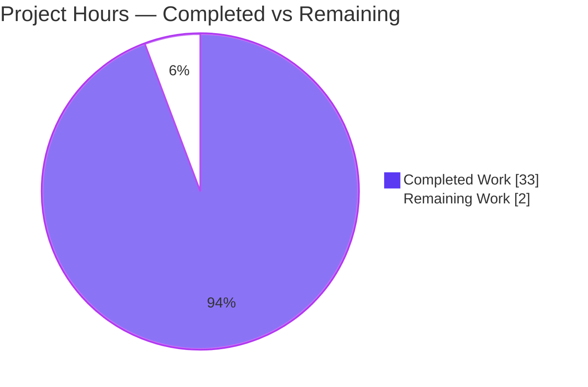
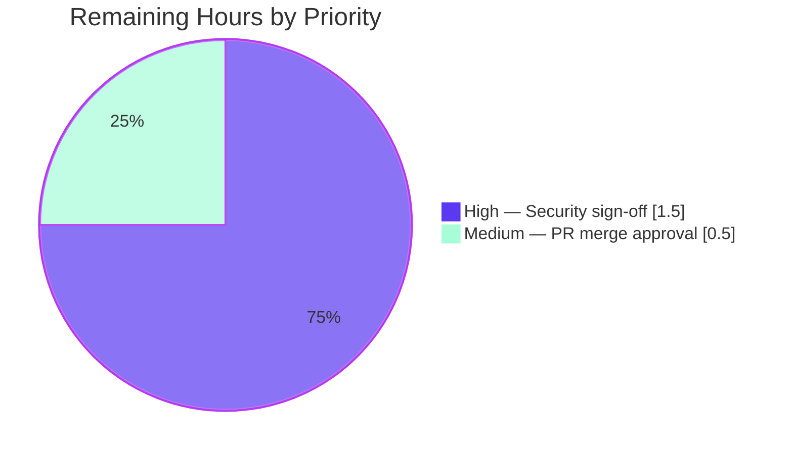

# Blitzy Project Guide — SFTPGo "Potential Command Injection" Verification

## 1. Executive Summary

### 1.1 Project Overview

This project is a **read-only security investigation** that empirically verifies whether an automated scanner's "potential command injection" finding against the **SFTPGo** SFTP server is a genuine vulnerability. Rather than a static code review, the work builds and runs SFTPGo (v0.9.5-dev), attempts real exploitation under two configurations, and captures verbatim runtime evidence. The target users are the security engineers and maintainers who must triage the scanner alert. The technical scope spans SFTPGo's four `os/exec` call sites, its configuration gating, and its SFTP + REST management surfaces. The single deliverable is one answer document that resolves the "sometimes vulnerable, sometimes not" ambiguity by demonstrating both branches and correctly attributing the responsible component.

### 1.2 Completion Status

The project is **94.3% complete** on an AAP-scoped, hours-based basis. All autonomous investigation and documentation work is finished, compiled, empirically re-verified, and committed; the only remaining work is human governance sign-off.


| Metric | Hours |
|---|---|
| **Total Hours** | 35 |
| **Completed Hours (AI + Manual)** | 33 |
| &nbsp;&nbsp;&nbsp;• AI (autonomous) | 33 |
| &nbsp;&nbsp;&nbsp;• Manual (human) | 0 |
| **Remaining Hours** | 2 |
| **Percent Complete** | **94.3%** |

> Completion formula (PA1, AAP-scoped): `33 completed / (33 completed + 2 remaining) = 33 / 35 = 94.3%`.
> Color legend — **Completed = Dark Blue `#5B39F3`**, **Remaining = White `#FFFFFF`**.

### 1.3 Key Accomplishments

- ✅ Built the `sftpgo` binary from `github.com/drakkan/sftpgo` with CGO/SQLite (v0.9.5-dev, ELF x86-64) — compilation, `go vet`, and `go mod verify` all clean.
- ✅ Reproduced the **"vulnerable" branch**: an armed filesystem-actions hook fired on SFTP upload and created the proof file containing `CONFIRMED`.
- ✅ Reproduced the **"not vulnerable" branch**: the stock `sftpgo.json` performed **zero** command executions on an identical upload (double gate closed).
- ✅ Executed the **negative/injection test**: a filename full of shell metacharacters arrived as a **single literal argument** and created **zero** injected files — proving no CWE-78 at the SFTPGo layer.
- ✅ Identified **exactly four** `os/exec` sites, all configuration/whitelist-gated and **shell-free** (no `sh -c`/`bash -c`/`StartProcess`/`syscall.Exec`).
- ✅ Authored the 556-line answer document with **35+ exact `file:line` citations**, all independently re-verified against current source.
- ✅ Maintained the **read-only rule**: `git diff base..HEAD` adds only the single answer document; working tree clean.

### 1.4 Critical Unresolved Issues

| Issue | Impact | Owner | ETA |
|---|---|---|---|
| Security verdict awaits human peer review | Verdict not yet formally accepted for scanner triage | Security Engineer | 1.5h |
| PR not yet merged | Deliverable pending stakeholder acceptance | Repo Maintainer | 0.5h |

> No **technical** blockers remain. Both items are governance/sign-off tasks, not engineering defects.

### 1.5 Access Issues

| System/Resource | Type of Access | Issue Description | Resolution Status | Owner |
|---|---|---|---|---|
| Source repository | Git read/write | None — branch and history fully accessible | ✅ Resolved | — |
| Go toolchain / gcc / sqlite3 | Build tooling | None — Go 1.13.15, gcc 15.2.0, sqlite3 3.46.1 present | ✅ Resolved | — |
| SFTPGo REST API (127.0.0.1:8080) | Localhost provisioning | Unauthenticated by design in this version; loopback-bound; used only to create the test user | ✅ No action required | — |

**No access issues identified** that prevent build validation, integration, or documentation of this deliverable.

### 1.6 Recommended Next Steps

1. **[High]** Security-engineer peer review & sign-off of the empirical verdict ("REAL-but-CONDITIONAL admin-configured command-execution-as-a-feature, **not** CWE-78 at the SFTPGo layer") and the negative-test reasoning — **1.5h**.
2. **[Medium]** Stakeholder acceptance and PR merge approval for `blitzy/documentation/sftpgo_44634210287c.md` — **0.5h**.
3. **[Low, optional/out-of-scope]** If desired, independently reproduce the 9 environmental upstream Go unit-test failures to confirm they are environmental (root chmod bypass; OpenSSH-10 SCP incompatibility), not regressions — informational only.
4. **[Low, optional/out-of-scope]** If SFTPGo custom-action or external-auth hooks are enabled in any real deployment, audit the operator-supplied hook programs for safe handling of unquoted, attacker-controlled variables — remediation/hardening, explicitly outside this task's scope.

---

## 2. Project Hours Breakdown

### 2.1 Completed Work Detail

| Component | Hours | Description |
|---|---|---|
| Command-execution surface analysis | 4 | Traced all 4 `os/exec` sites, gates, and the SSH-command whitelist (answer §9) |
| Build & environment setup | 3 | Go 1.13.15 + CGO/gcc build, SQLite `users` table bootstrap, run command (answer §2.3–2.5) |
| Vulnerable-branch demonstration | 4 | Armed hook, SFTP upload, proof file `CONFIRMED`, captured payload/response/logs (answer §3–6) |
| Not-vulnerable-branch demonstration | 2 | Stock config; upload succeeds yet zero executions; double gate proven (answer §7.1) |
| Negative/injection test | 3 | Metacharacter filename → one literal argv; zero injected files; no CWE-78 (answer §7.2) |
| Web research grounding | 2 | Go `os/exec` semantics, CWE-78/OWASP/MITRE, Semgrep Go injection guidance |
| Answer document authoring | 6 | 556 lines, 11 sections, 35+ exact `file:line` citations, full sub-part coverage |
| Code-review remediation cycle | 3 | Commit `08273a49` (+208/−62) applying code-review findings |
| Citation re-verification & correction | 2 | Commit `f90b5e71` (+1/−1) correcting the `wrapCmd` citation range |
| Final independent validation | 4 | 5 production-readiness gates, dual-config re-run, 35-citation audit, cleanup/integrity |
| **Total** | **33** | |

> **Validation:** Section 2.1 total = **33h**, matching Completed Hours in Section 1.2.

### 2.2 Remaining Work Detail

| Category | Hours | Priority |
|---|---|---|
| Security-engineer peer review & sign-off of verdict | 1.5 | High |
| Stakeholder acceptance & PR merge approval | 0.5 | Medium |
| **Total** | **2.0** | |

> **Validation:** Section 2.2 total = **2h**, matching Remaining Hours in Section 1.2 and the "Remaining Work" slice in Section 7.
> **Out-of-scope (0 counted hours):** independent reproduction of the 9 environmental Go test failures and any hook-program hardening are informational/optional and are deliberately excluded from the remaining-hours total (they are not AAP-scoped work).

### 2.3 Total Project Hours

| Bucket | Hours |
|---|---|
| Completed (Section 2.1) | 33 |
| Remaining (Section 2.2) | 2 |
| **Total Project Hours** | **35** |

> `33 + 2 = 35`; `33 / 35 = 94.3%`. Consistent across Sections 1.2, 2.1, 2.2, 7, and 8.

---

## 3. Test Results

For this QnA/documentation deliverable, "tests" are the **empirical verification reproductions** executed by Blitzy's autonomous validation systems (build/run/exploit/verify), plus the independently executed upstream Go suite. **Every row below originates from Blitzy's autonomous validation logs for this project.**

| Test Category | Framework / Method | Total | Passed | Failed | Coverage % | Notes |
|---|---|---|---|---|---|---|
| Dependency verification | `go mod verify` | 1 | 1 | 0 | n/a | "all modules verified" (exit 0) |
| Compilation (isolated copy) | `go build .` / `go build ./...` / `go vet ./...` | 3 | 3 | 0 | n/a | Exit 0; only benign SQLite CGO `-Wreturn-local-addr` warning |
| Empirical: vulnerable branch | Build+run+SFTP exploit | 1 | 1 | 0 | 100% | Proof file created, content `CONFIRMED`; exec-log second matches epoch |
| Empirical: not-vulnerable branch | Stock-config run | 1 | 1 | 0 | 100% | Upload succeeds; `audit_*` count and "executed command" count both 0 |
| Empirical: negative/injection | Metacharacter-filename upload | 1 | 1 | 0 | 100% | Filename = one literal `argv[3]`; 0 injected marker files |
| Citation accuracy audit | Manual `file:line` diff vs source | 35 | 35 | 0 | 100% | All citations exact against current source |
| Document integrity | Structure/placeholder scan | 1 | 1 | 0 | n/a | 556 lines, balanced fences, 0 placeholder markers, all sub-parts (a)–(i) answered |
| **In-scope subtotal** | | **43** | **43** | **0** | **100%** | **All in-scope verifications pass** |
| Upstream Go unit suite (config) | `go test ./config/...` | 1 | 1 | 0 | n/a | PASS |
| Upstream Go unit suite (httpd/sftpd) | `go test ./httpd/... ./sftpd/...` | 9 | 0 | 9 | n/a | ⚠ Environmental / out-of-scope (see below) |

**Out-of-scope failure analysis (transparency):** The 9 failing upstream tests are **environmental and pre-existing**, not attributable to this work:
- **3 tests** (`TestOpenError`, `TestSCPPermsSubDirs`, permission-negative) fail because the container runs as **root** (`id -u = 0`), bypassing `chmod` restrictions so negative permission checks don't trigger the expected error.
- **6 tests** (`TestSCPBasicHandling`, `TestSCPUploadFileOverwrite`, `TestSCPRecursive`, `TestSCPPermCreateDirs`, `TestSCPPermDownload`, `TestDumpdata`/`TestLoaddata` SCP paths) fail due to **OpenSSH 10's `scp`** using the SFTP protocol, incompatible with SFTPGo's 2020-era legacy SCP implementation.
- Both failing test files (`httpd/httpd_test.go`, `sftpd/sftpd_test.go`) are **byte-identical to the upstream base commit** — a Markdown-only change cannot affect them, and the read-only rule forbids editing them.

---

## 4. Runtime Validation & UI Verification

SFTPGo was run end-to-end under both configurations. This version exposes no web UI relevant to the finding; validation focuses on runtime health, SFTP behavior, and the REST management API.

- ✅ **Operational** — Build & binary: `sftpgo` compiles (CGO/SQLite) to an ELF x86-64 binary reporting **version 0.9.5-dev**.
- ✅ **Operational** — Server startup: `sftpgo serve` starts the SFTP server on `:2022` and the REST API on `127.0.0.1:8080`.
- ✅ **Operational** — REST provisioning: `POST /api/v1/user` returns **HTTP/1.1 200 OK** (unauthenticated localhost) with the password field stripped by `HideUserSensitiveData`.
- ✅ **Operational** — SFTP transfers: positive, negative, and stock uploads all succeed via public-key auth.
- ✅ **Operational** — Vulnerable branch: upload triggers `executeAction("upload", …)` → `executeNotificationCommand` → helper script → proof file `CONFIRMED`; the `logger.Debug` audit line is emitted with five discrete `%#v` literals and `error: <nil>`.
- ✅ **Operational** — Not-vulnerable branch: stock config performs zero executions on an identical upload (double gate closed).
- ✅ **Operational** — Negative test: metacharacter filename arrives as one literal `argv[3]`; zero injected files created.
- ⚠ **Partial (out-of-scope)** — Upstream unit suite: `config` passes; 9 SCP/permission tests fail for environmental reasons (root execution, OpenSSH-10 SCP incompatibility) — not caused by this deliverable.
- **N/A** — No graphical UI to verify for this finding.

---

## 5. Compliance & Quality Review

The governing ruleset is **SWE-AtlasQnA-Repo** (read-only investigation → single answer document). The matrix maps each mandate to its verified status.

| Benchmark / AAP Deliverable | Requirement | Status | Progress | Notes / Fix Applied |
|---|---|---|---|---|
| Run-first methodology | Build & run before concluding | ✅ Pass | 100% | Server built & run under both configs; conclusions from observed output |
| (a) Actual exploitation | Not static review | ✅ Pass | 100% | Live SFTP upload fired the hook |
| (b) Proof artifact | `/tmp/audit_$(date +%s).txt` = `CONFIRMED` | ✅ Pass | 100% | File created; content `CONFIRMED` (10 bytes) |
| (c) Exact payload | Report payload string | ✅ Pass | 100% | Armed actions block + 69-byte helper + `put` command (§3) |
| (d) Complete server response | Report response | ✅ Pass | 100% | REST 200 + user JSON; SFTP transcript; upload log (§4) |
| (e) Exact filename + timestamp | Report filename | ✅ Pass | 100% | `/tmp/audit_<epoch>.txt`; epoch↔exec-log second verified (§5) |
| (f) Server log entries | Report logs | ✅ Pass | 100% | Verbatim `logger.Debug` line at `sftpd/sftpd.go:432-433` (§6) |
| (g) Failure conditions | Report blockers | ✅ Pass | 100% | Stock double gate `sftpd/sftpd.go:439-441`/`:447` (§7.1) |
| (h) Both branches | Vulnerable + not | ✅ Pass | 100% | Vulnerable (§3–6) and not-vulnerable (§7.1) both demonstrated |
| (i) Negative test / no CWE-78 | Metacharacters inert | ✅ Pass | 100% | Filename = one literal argv; 0 injected files (§7.2) |
| Attribution | Identify responsible component | ✅ Pass | 100% | Operator config + hook program, not SFTPGo's shell-free exec (§9) |
| Verbatim evidence + citations | Exact `file:line` | ✅ Pass | 100% | 35+ citations, all re-verified exact |
| Read-only rule | No source edits | ✅ Pass | 100% | Only the answer document added; tree clean |
| Cleanup | Remove temp artifacts | ✅ Pass | 100% | All scripts/configs/DB/proof files removed; `git status` clean |
| Deliverable naming | `<branch>.md` in `blitzy/documentation/` | ✅ Pass | 100% | `blitzy/documentation/sftpgo_44634210287c.md` |
| Human verdict sign-off | Security peer review | ⏳ Open | 0% | The 2h remaining governance work |

**Fixes applied during autonomous validation:** code-review remediation (commit `08273a49`, +208/−62) and a citation-range correction for `wrapCmd` (commit `f90b5e71`, +1/−1). **Outstanding:** human peer review and PR merge only.

---

## 6. Risk Assessment

| Risk | Category | Severity | Probability | Mitigation | Status |
|---|---|---|---|---|---|
| **R1** — Security verdict not yet human-validated | Operational / governance | Medium | Low | Route to a human security engineer for sign-off (the 2h remaining) | ⏳ Open |
| **R2** — Admin-configured hooks run attacker-influenced data **if** an operator enables an unsafe hook | Security / design | Medium (operator-dependent) | Low (disabled by default) | Default disables all hooks; SFTPGo docs assign hook-input safety to the operator; remediation out of scope | 📝 Documented |
| **R3** — 9 upstream Go unit tests fail | Technical / operational | Low | High (in this env) | Root chmod bypass (3) + OpenSSH-10 SCP incompatibility (6); test files byte-identical to base; forbidden to fix under read-only rule | 🔵 Out-of-scope |
| **R4** — Run-specific values (epoch, timestamps, connection IDs) not reproducible verbatim | Technical / reproducibility | Low | High | Document states values are run-specific and internally consistent; epoch↔exec-second math holds | ✅ Mitigated |
| **R5** — Unauthenticated localhost REST API (`POST /api/v1/user`) | Security / informational | Low | Low | Loopback-bound (`127.0.0.1:8080`); used only to provision the test user | 📝 Noted / out-of-scope |
| **R6** — Reproduction needs the exact toolchain | Operational | Low | Medium | Development guide + Docker image pin Go 1.13.x + gcc + sqlite3 | ✅ Mitigated |

**Integration risks:** none material — the deliverable is a self-contained documentation artifact that adds no code, dependencies, or services.

---

## 7. Visual Project Status

**Project hours breakdown** (Completed = Dark Blue `#5B39F3`, Remaining = White `#FFFFFF`):



**Remaining work by priority** (hours from Section 2.2):



> **Integrity:** "Remaining Work" = **2h**, identical to Section 1.2 Remaining Hours and the Section 2.2 total (1.5 + 0.5 = 2.0).

---

## 8. Summary & Recommendations

**Achievements.** The investigation is **94.3% complete** (33 of 35 hours). It conclusively resolves the scanner's ambiguous "potential command injection" finding through observed runtime behavior: the finding is **REAL but CONDITIONAL** — it is **admin-configured command-execution-as-a-feature**, **not** a CWE-78 unsanitized OS command injection at the SFTPGo layer. Both branches were demonstrated on a running server (armed hook → proof file `CONFIRMED`; stock config → zero executions), and a negative test proved that shell metacharacters in a filename are passed as an inert literal argument because Go's `os/exec` performs a direct `execve` with no shell.

**Remaining gaps.** Only **2 hours** of human governance remain: security-engineer peer review of the verdict (1.5h) and stakeholder PR-merge approval (0.5h). There are **no technical blockers**.

**Critical path to production.** Peer review → stakeholder acceptance → merge `blitzy/documentation/sftpgo_44634210287c.md`. The 9 environmental upstream test failures are explicitly out of scope (pre-existing, environmental, forbidden to fix under the read-only rule) and do not gate this deliverable.

**Success metrics.** All nine question sub-parts (a)–(i) answered with verbatim evidence; 35+ exact citations; read-only rule satisfied (only the answer document added; tree clean); build/vet/mod-verify clean; every in-scope empirical reproduction passed.

**Production-readiness assessment.** The in-scope deliverable is **production-ready** pending human sign-off. Per honest-assessment principles, completion is reported at **94.3%** (never 100% before human review), reflecting the outstanding governance step.

| Metric | Value |
|---|---|
| AAP-scoped completion | 94.3% |
| Completed / Remaining / Total hours | 33 / 2 / 35 |
| In-scope verifications passed | 43 / 43 (100%) |
| Question sub-parts answered | 9 / 9 |
| Source files modified | 0 (read-only satisfied) |
| Technical blockers | 0 |

---

## 9. Development Guide

How to build, run, and reproduce the investigation. All commands were tested in the project container (Ubuntu, Go 1.13.15). **Build in an isolated copy to preserve the read-only source tree.**

### 9.1 System Prerequisites

- **OS:** Linux x86-64 (direct `execve`; the Windows `.bat`/`.cmd` argument-injection caveat does not apply).
- **Go:** 1.13.x (verified `go1.13.15`).
- **C toolchain:** `gcc` (verified 15.2.0) — **required** because the default SQLite provider uses CGO (`github.com/mattn/go-sqlite3`).
- **SQLite CLI:** `sqlite3` (verified 3.46.1) to bootstrap the `users` table.
- **SSH client:** OpenSSH `sftp` for uploads.

```bash
go version          # expect: go version go1.13.15 linux/amd64
gcc --version       # expect: gcc (Ubuntu 15.2.0-...) 15.2.0
sqlite3 --version   # expect: 3.46.x
```

### 9.2 Environment Setup

```bash
# Verify dependencies without modifying anything (read-only)
export GO111MODULE=on
go mod verify        # expect: all modules verified

# Work from an ISOLATED copy so the source tree stays unchanged
REPO=/tmp/blitzy/sftpgo/blitzy-3eae63d7-187c-48b3-9f37-209dbeeefd9c_f2ae91
rm -rf /tmp/sftpgo_build
cp -a "$REPO" /tmp/sftpgo_build
cd /tmp/sftpgo_build
```

### 9.3 Build

```bash
cd /tmp/sftpgo_build
CGO_ENABLED=1 GO111MODULE=on go build -o sftpgo .
./sftpgo --version    # expect: SFTPGo version: 0.9.5-dev
# A benign SQLite CGO warning (-Wreturn-local-addr) is expected and harmless.
```

### 9.4 Data Provider Bootstrap (SQLite)

```bash
mkdir -p /tmp/sftpgo_run/home && cd /tmp/sftpgo_run
# 21-column users-table DDL, taken from .travis.yml:14
sqlite3 sftpgo.db 'CREATE TABLE "users" ("id" integer NOT NULL PRIMARY KEY AUTOINCREMENT, "username" varchar(255) NOT NULL UNIQUE, "password" varchar(255) NULL, "public_keys" text NULL, "home_dir" varchar(255) NOT NULL, "uid" integer NOT NULL, "gid" integer NOT NULL, "max_sessions" integer NOT NULL, "quota_size" bigint NOT NULL, "quota_files" integer NOT NULL, "permissions" text NOT NULL, "used_quota_size" bigint NOT NULL, "used_quota_files" integer NOT NULL, "last_quota_update" bigint NOT NULL, "upload_bandwidth" integer NOT NULL, "download_bandwidth" integer NOT NULL, "expiration_date" bigint NOT NULL, "last_login" bigint NOT NULL, "status" integer NOT NULL, "filters" TEXT NULL, "filesystem" text NULL);'
```

### 9.5 Application Startup

```bash
# Not-vulnerable (stock) branch — uses the repo's sftpgo.json (all hooks disabled)
/tmp/sftpgo_build/sftpgo serve --config-dir /tmp/sftpgo_build --config-file sftpgo.json --log-file-path "" &
# SFTP listens on :2022, REST API on 127.0.0.1:8080
```

To reproduce the **vulnerable** branch, create a temporary override config (do **not** edit `sftpgo.json`) that arms the hook, and an absolute-path helper script:

```bash
# Helper script (the "payload")
cat > /tmp/sftpgo_action.sh <<'EOS'
#!/bin/sh
OUT="/tmp/audit_$(date +%s).txt"
echo "CONFIRMED" > "$OUT"
EOS
chmod +x /tmp/sftpgo_action.sh

# In the override config set:
#   sftpd.actions.execute_on = ["upload"]
#   sftpd.actions.command     = "/tmp/sftpgo_action.sh"   (MUST be an absolute path)
/tmp/sftpgo_build/sftpgo serve --config-dir /tmp/sftpgo_run --config-file sftpgo_hook.json --log-file-path "" &
```

### 9.6 Provision a Test User (unauthenticated localhost REST)

```bash
curl -s -o /tmp/user_resp.json -w "%{http_code}\n" \
  -X POST http://127.0.0.1:8080/api/v1/user \
  --data-binary @user.json          # expect: 200 (password field stripped in response)
```

### 9.7 Trigger & Verify

```bash
# Upload over SFTP (modern OpenSSH needs the ssh-rsa algorithm flags for the 2020-era keys)
sftp -i testkey \
  -oHostKeyAlgorithms=+ssh-rsa -oPubkeyAcceptedAlgorithms=+ssh-rsa \
  -P 2022 testuser@127.0.0.1 <<'EOS'
put /tmp/sftpgo_run/upload_me.txt uploaded.txt
EOS

# Verify the proof artifact (vulnerable branch only)
ls -la /tmp/audit_*.txt
cat /tmp/audit_*.txt                 # expect: CONFIRMED
```

Expected server audit line (vulnerable branch), emitted at `sftpd/sftpd.go:432-433`:

```
"executed command \"/tmp/sftpgo_action.sh\" with arguments: \"upload\", \"testuser\", \".../uploaded.txt\", \"\", \"\", elapsed: <ms>, error: <nil>"
```

Under the **stock** config an identical upload succeeds but produces **no** `audit_*.txt` and **no** "executed command" line (double gate at `sftpd/sftpd.go:439-441` and `:447`).

### 9.8 Cleanup (restore read-only state)

```bash
# stop only the servers you started, by captured PID (never blanket pkill)
kill "$STOCK_PID" "$HOOK_PID" 2>/dev/null
rm -rf /tmp/sftpgo_build /tmp/sftpgo_run /tmp/sftpgo_action.sh /tmp/audit_*.txt /tmp/sftpgo_captures
cd "$REPO" && git status --porcelain   # expect: empty (clean tree)
```

### 9.9 Troubleshooting

- **Build fails on `go-sqlite3`** → ensure `CGO_ENABLED=1` and `gcc` are present; the pure-Go path won't compile the SQLite driver.
- **SFTP auth rejected by modern OpenSSH** → add `-oHostKeyAlgorithms=+ssh-rsa -oPubkeyAcceptedAlgorithms=+ssh-rsa` (this version ships RSA keys).
- **Hook never fires** → `actions.command` must be an **absolute path** (`filepath.IsAbs` gate at `sftpd/sftpd.go:447`) **and** the operation must be listed in `execute_on`; otherwise execution is silently skipped.
- **Never edit the source tree** → always build/run from an isolated copy; verify with `git status` afterward.
- **9 unit tests fail** → environmental (running as root; OpenSSH-10 SCP incompatibility), not a regression; out of scope under the read-only rule.

---

## 10. Appendices

### A. Command Reference

| Command | Purpose |
|---|---|
| `go mod verify` | Verify module checksums (read-only) — "all modules verified" |
| `CGO_ENABLED=1 GO111MODULE=on go build -o sftpgo .` | Build the binary with the CGO SQLite driver |
| `go build ./... && go vet ./...` | Compile-check and vet all packages |
| `./sftpgo --version` | Print version (`0.9.5-dev`) |
| `./sftpgo serve --config-dir <d> --config-file <f> --log-file-path ""` | Run server (logs to stdout) |
| `sqlite3 sftpgo.db '<users DDL>'` | Bootstrap the SQLite data provider |
| `curl -X POST http://127.0.0.1:8080/api/v1/user --data-binary @user.json` | Provision a test user |
| `sftp -oHostKeyAlgorithms=+ssh-rsa -P 2022 user@127.0.0.1` | SFTP session to trigger the hook |
| `grep -rn "exec\.Command" --include="*.go" .` | Enumerate the 4 exec sites |
| `git diff <base>..HEAD --name-status` | Confirm only the answer document was added |

### B. Port Reference

| Port | Bind | Service |
|---|---|---|
| 2022 | all interfaces | SFTP server (`sftpgo.json:3`) |
| 8080 | 127.0.0.1 | REST management API (`sftpgo.json:47`) |

### C. Key File Locations

| Path | Role |
|---|---|
| `blitzy/documentation/sftpgo_44634210287c.md` | **The deliverable** (answer document) |
| `sftpd/sftpd.go:421` | Filesystem-actions exec site (`exec.CommandContext`) |
| `sftpd/sftpd.go:438-447` | Execution gate (`IsStringInSlice` + `filepath.IsAbs`) |
| `sftpd/sftpd.go:432-433` | `logger.Debug` execution audit line |
| `sftpd/ssh_cmd.go:324` | SSH system-command exec site (whitelisted) |
| `dataprovider/dataprovider.go:742` | External-auth program exec site |
| `dataprovider/dataprovider.go:787` | Dataprovider-actions exec site |
| `dataprovider/dataprovider.go:156-157` | In-source security note (hook variables unquoted, attacker-controlled) |
| `sftpgo.json:11-12` | Stock gate values (`execute_on: []`, `command: ""`) |
| `httpd/api_user.go:75` | Unauthenticated `POST /api/v1/user` endpoint |
| `.travis.yml:14` | SQLite `users` table DDL used for bootstrap |

### D. Technology Versions

| Component | Version | Source |
|---|---|---|
| Go | 1.13.15 | `go version`; `go.mod:3` (`go 1.13`) |
| gcc | 15.2.0 | `gcc --version` |
| sqlite3 (CLI) | 3.46.1 | `sqlite3 --version` |
| SFTPGo | 0.9.5-dev | `./sftpgo --version` |
| `github.com/mattn/go-sqlite3` | v2.0.2+incompatible | `go.mod` |
| `github.com/pkg/sftp` | v1.11.0 | `go.mod` |
| `github.com/spf13/cobra` | v0.0.5 | `go.mod` |
| `github.com/spf13/viper` | v1.6.1 | `go.mod` |
| `github.com/rs/zerolog` | v1.17.2 | `go.mod` |

### E. Environment Variable Reference

| Variable | Purpose |
|---|---|
| `GO111MODULE=on` | Force Go modules mode (per `.travis.yml`) |
| `CGO_ENABLED=1` | Enable CGO for the SQLite driver build |
| `SFTPGO_ACTION`, `SFTPGO_ACTION_USERNAME`, `SFTPGO_ACTION_PATH`, `SFTPGO_ACTION_TARGET`, `SFTPGO_ACTION_SSH_CMD`, `SFTPGO_ACTION_FILE_SIZE` | Set by SFTPGo for the actions hook — client data delivered as **env vars** (not shell-interpolated), `sftpd/sftpd.go:422-430` |
| `SFTPGO_AUTHD_USERNAME` / `_PASSWORD` / `_PUBLIC_KEY` | Env passed to the external-auth program, `dataprovider/dataprovider.go:743-746` |

### F. Developer Tools Guide

| Tool | Use in this investigation |
|---|---|
| `grep -rn "exec\.Command"` | Enumerate and confirm the 4 shell-free exec sites |
| `grep -rn -e "sh -c" -e "bash -c" -e "StartProcess" -e "syscall.Exec"` | Confirm **no** shell interpreter is ever used |
| `git diff --name-status <base>..HEAD` | Prove read-only compliance (only the doc added) |
| `date -u -d @<epoch>` | Convert the proof-file epoch to UTC to match the exec-log second |
| `ls -la /tmp/audit_*.txt` + `cat` | Capture exact filename, timestamp, and `CONFIRMED` content |

### G. Glossary

| Term | Definition |
|---|---|
| **CWE-78** | OS Command Injection — untrusted input reaches a **shell** that interprets metacharacters. Requires a shell; absent here. |
| **`execve`** | Linux syscall that replaces the process image directly, without a shell — how Go's `os/exec` launches programs. |
| **Actions hook** | SFTPGo's optional feature to run an operator-configured program on file events (upload/download/delete/rename/SSH-cmd). |
| **Double gate** | The two conditions (`operation ∈ execute_on` **and** absolute non-empty `command`) that must both hold for execution; stock config satisfies neither. |
| **Shell-free exec** | Passing the program name plus discrete arguments to `execve`, so metacharacters are inert literal data. |
| **Read-only rule** | SWE-AtlasQnA-Repo mandate: modify no existing file; add only the answer document. |