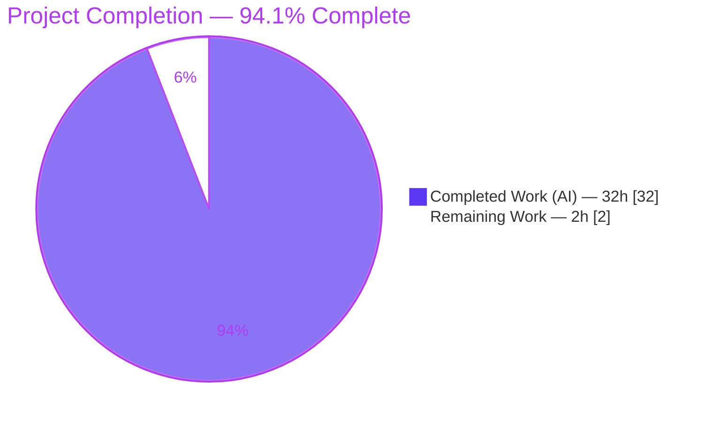
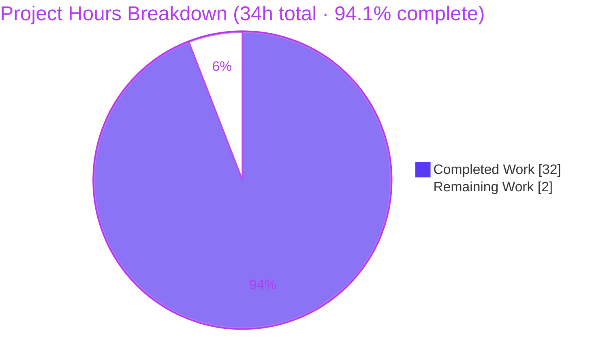
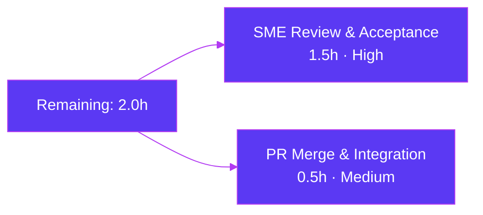

# Blitzy Project Guide — SFTPGo "Clean Start" Runtime Investigation

> **Project type:** Read-only runtime Q&A investigation → single Markdown deliverable
> **Deliverable:** `blitzy/documentation/sftpgo_44634210287c.md` (444 lines)
> **Branch:** `blitzy-e218e36f-18e6-4ef7-b0af-b0cc1495fd5f` · **HEAD:** `aa493a00` · **Base:** `44634210`
> **Brand palette:** Completed/AI = Dark Blue `#5B39F3` · Remaining = White `#FFFFFF` · Headings/Accents = Violet-Black `#B23AF2` · Highlight = Mint `#A8FDD9`

---

## 1. Executive Summary

### 1.1 Project Overview

This project is a **read-only runtime investigation** of SFTPGo's "clean start" behavior for an engineer preparing to run SFTPGo behind a TLS-terminating reverse proxy. The single deliverable is an evidence-backed Markdown document answering five questions: how the server behaves on first start across SQLite (missing/empty/usable), SFTP-port, and web-asset (templates vs static) conditions; whether the process working directory silently influences behavior; and how the HTTP layer records client address and scheme under proxy headers (`Forwarded`, `X-Forwarded-For`, `X-Real-IP`). Target users are the investigating engineer and their team. Business impact: de-risks a production reverse-proxy deployment by replacing assumptions with reproducible proof. Technical scope: build the canonical Go 1.13 binary, exercise the real `sftpgo serve` entry point, capture evidence, write one document — with **zero source changes**.

### 1.2 Completion Status



**Completion:** 32.0h ÷ 34.0h = **94.1% complete**

| Metric | Hours |
|--------|:-----:|
| **Total Hours** | **34.0** |
| Completed Hours — AI | 32.0 |
| Completed Hours — Manual | 0.0 |
| **Completed Hours (AI + Manual)** | **32.0** |
| **Remaining Hours** | **2.0** |

> Completion % is computed on AAP-scoped + path-to-production hours only (PA1). All 39 discrete AAP requirements are Completed; the 2.0h remaining is the human acceptance gate (review + merge), not incomplete AAP work — hence <100% per the "never claim 100% before human review" rule.

### 1.3 Key Accomplishments

- ✅ **Single deliverable created & committed** — `blitzy/documentation/sftpgo_44634210287c.md` (444 lines), the only file changed vs base (`+444/-0`).
- ✅ **Canonical binary built & reproduced** — `GO111MODULE=on CGO_ENABLED=1 go build -o /tmp/sftpgo .` → exit 0; banner `SFTPGo version: 0.9.5-dev` (unstamped default build).
- ✅ **O1 first-start matrix** — 6 scenarios exercised via the real `sftpgo serve`; self-exiting cases reproduced **2×**; exit codes captured (0/0/0/0 and panic-2).
- ✅ **O2 working-directory claim refuted** — "smoking gun" (stray CWD `sftpgo.json` loaded despite `--config-dir`, bound HTTP to its port) + control + relative-path evidence.
- ✅ **O3 proxy handling proven** — leftmost `X-Forwarded-For` wins, `X-Real-IP` fallback, `Forwarded` ignored, scheme from local TLS only (`http`).
- ✅ **O4 endpoints probed** — `/`, `/web`, `/web/users`, `/metrics`, `/static/...`, and two distinct 404s captured with headers.
- ✅ **O5 evidence artifacts** — `sftpgo_http_*` before/after deltas, self-exclusion, one redacted proxied access-log line.
- ✅ **28-locator citation index** — every claim carries a `file:line` reference; all re-verified against current HEAD with zero drift.
- ✅ **Read-only mandate honored** — repository byte-for-byte unchanged; all temporary `/tmp` artifacts removed; working tree clean.

### 1.4 Critical Unresolved Issues

| Issue | Impact | Owner | ETA |
|-------|--------|-------|-----|
| *(none — no blocking issues)* | Compilation exit 0; config tests pass; all 5 objectives reproduced from real output | — | — |
| Human SME acceptance not yet performed | Non-blocking; standard doc quality gate before merge | Reviewing engineer / SME | 1.5h |

> There are **no unresolved technical blockers**. The observed "surprising" behaviors (exit-0 on provider/port failure, template-panic exit-2, scheme-from-local-TLS, spoofable RealIP) are the **documented subjects** of the investigation and are explicitly out-of-scope to fix under the read-only mandate — see §6 and the advisories in §8.

### 1.5 Access Issues

| System/Resource | Type of Access | Issue Description | Resolution Status | Owner |
|-----------------|----------------|-------------------|-------------------|-------|
| — | — | **No access issues identified** | N/A | — |

All required resources were available and validated in-session: Git repository (read/write on branch), Go 1.13.15 toolchain (`/usr/local/go`), `gcc` (cgo), `sqlite3` CLI, and `curl`. No repository permission, service credential, or third-party API access issue exists — the task is fully self-contained (no external services, no network dependencies).

### 1.6 Recommended Next Steps

1. **[High]** SME reviews the Q&A document, confirming each objective (O1–O5) is fully and accurately answered and spot-checking ≥3 evidence claims against a fresh canonical build. *(HT-1, 1.5h)*
2. **[Medium]** Merge the documentation PR to the target branch and confirm the deliverable lands at `blitzy/documentation/sftpgo_44634210287c.md` with a clean working tree. *(HT-2, 0.5h)*
3. **[Low · advisory, out-of-scope]** In the actual reverse-proxy deployment, configure the proxy to set/overwrite `X-Forwarded-For`/`X-Real-IP` and strip client-supplied copies (mitigates the spoofable-IP finding).
4. **[Low · advisory, out-of-scope]** Add an HTTP readiness/health probe (`GET /web/users` or `/metrics`) to process supervision instead of relying on the process exit code (mitigates the silent exit-0 finding).
5. **[Low · advisory, out-of-scope]** Launch SFTPGo from a clean working directory or pin absolute config paths to avoid the stray-`sftpgo.json` config leak.

---

## 2. Project Hours Breakdown

### 2.1 Completed Work Detail

All completed work was delivered autonomously (AI = 32.0h, Manual = 0.0h). Each component traces to a specific AAP objective or mandated activity.

| Component | Hours | Description |
|-----------|:-----:|-------------|
| Canonical build & version establishment | 2.5 | cgo build harness, Go 1.13.x toolchain confirmation, `0.9.5-dev` banner capture, non-canonical-path avoidance *(AAP §0.1.1, §0.3.1)* |
| O1 — First-start scenario matrix | 6.0 | 6 scenarios (SQLite usable/missing/empty, SFTP port taken, templates-missing panic, static-missing) via real `sftpgo serve`; isolated config dirs; seeded DBs; exit-code capture; self-exiting cases run 2× |
| O2 — Working-directory adjudication | 3.5 | Smoking-gun (stray CWD `sftpgo.json` → bound `:19999`), control (neutral CWD search-path), and relative-path (db/host-key/assets) experiments |
| O3 — Proxy header handling | 3.5 | Plain / proxied / `X-Real-IP`-fallback requests; multi-IP `X-Forwarded-For`; scheme-from-TLS; cross-CWD corroboration; security caveat |
| O4 — Endpoint probes | 1.5 | `/`, `/web`, `/web/users`, `/metrics`, `/static/favicon.ico`, and two distinct 404 paths with status lines + headers |
| O5 — Metrics evidence artifacts | 2.5 | `sftpgo_http_*` before/after deltas, self-exclusion analysis, A/B/C phase tables, one redacted proxied access-log line |
| Deliverable authoring & structure | 5.0 | 444-line structured Markdown Q&A (TL;DR, 8 sections, tables, code blocks) |
| Citation index & grounding | 2.0 | 28 `file:line` locators mapped to claims and verified against source |
| Read-only integrity, cleanup & git discipline | 1.5 | `/tmp`-isolated harness, artifact removal, `git status` verification, commit hygiene |
| Independent validation pass & reconciliation | 4.0 | Re-run of all scenarios, 11 environment-incidental reconciliations, 28-citation re-verification, 5 production-readiness gates |
| **Total Completed** | **32.0** | |

### 2.2 Remaining Work Detail

Each remaining item is standard path-to-production human activity (a read-only documentation deliverable has no deployment/CI/CD/integration path).

| Category | Hours | Priority |
|----------|:-----:|----------|
| Human SME technical review & acceptance of the Q&A document | 1.5 | High |
| Documentation PR merge & branch integration | 0.5 | Medium |
| **Total Remaining** | **2.0** | |

### 2.3 Total Hours Reconciliation

| Line | Hours |
|------|:-----:|
| Section 2.1 — Completed | 32.0 |
| Section 2.2 — Remaining | 2.0 |
| **Total Project Hours** | **34.0** |
| **Completion %** = 32.0 ÷ 34.0 | **94.1%** |

✔ **Rule 2 satisfied:** 2.1 (32.0) + 2.2 (2.0) = 34.0 = Total in §1.2.
✔ **Rule 1 satisfied:** Remaining = 2.0h is identical in §1.2, §2.2, and the §7 pie chart.

---

## 3. Test Results

All entries below originate from Blitzy's autonomous validation logs and were independently re-executed this session. This is a **read-only documentation** task, so no new tests were written (the read-only mandate forbids it); the validation surface is the repository's existing unit tests, the compilation gates, and the runtime scenario reproductions that constitute the investigation itself.

| Test Category | Framework | Total | Passed | Failed | Coverage % | Notes |
|---------------|-----------|:-----:|:------:|:------:|:----------:|-------|
| Unit — `config` package | Go `testing` (`go test`) | 5 | 5 | 0 | not measured | `TestLoadConfigTest`, `TestEmptyBanner`, `TestInvalidUploadMode`, `TestInvalidExternalAuthScope`, `TestSetGetConfig` → `ok … 0.010s`. O2-relevant package. |
| Compilation gate — all packages | `go build ./...` | 10 pkgs | 10 | 0 | — | Exit 0; only a benign vendored `mattn/go-sqlite3` cgo warning. |
| Canonical binary build | `go build -o /tmp/sftpgo .` | 1 | 1 | 0 | — | Exit 0; banner `SFTPGo version: 0.9.5-dev`. |
| Test-binary compilation — `httpd`, `sftpd` | `go test -c` | 2 | 2 | 0 | — | Compile cleanly. Live **execution** needs bound ports 2022/8080 + host keys + seeded DB → environmental & out-of-scope under read-only. |
| Runtime scenario validation — O1 | `sftpgo serve` harness | 6 | 6 | 0 | — | Exit codes 0/0/0/0 + panic-2 + running; self-exiting cases reproduced 2×. |
| HTTP probe validation — O3/O4/O5 | `curl` + `/metrics` scrape | 9 | 9 | 0 | — | 6 endpoints + plain/proxied/fallback requests; `sftpgo_http_*` deltas +6/+6, +6/+6, +4/+1. |

> **Integrity note (Rule 3):** every row above is drawn from Blitzy's autonomous validation logs for this project and was re-verified in-session. Coverage % is reported as "not measured" rather than fabricated — the investigation gathers behavioral evidence, not coverage metrics, and generating coverage would require test edits forbidden by the read-only mandate.

---

## 4. Runtime Validation & UI Verification

Runtime health was validated by building the canonical binary and driving the real `sftpgo serve` entry point across every scenario. The following were **reproduced live in this environment** and match the deliverable byte-for-byte on answer-bearing fields.

**Build & process health**
- ✅ **Operational** — Canonical build exits 0; binary runs; version banner `0.9.5-dev`.
- ✅ **Operational** — Server starts against a seeded usable SQLite DB and stays alive until signaled.
- ✅ **Operational** — Auto-generation of `id_rsa` host key into the config dir on first start.

**HTTP endpoint / UI verification** (admin web UI is served at `/web/*`)
- ✅ **Operational** — `GET /` → 301 → `/web/users` (`text/html`).
- ✅ **Operational** — `GET /web` → 301 → `/web/users` (`text/html`).
- ✅ **Operational** — `GET /web/users` → 200 `text/html` (admin users page, `resp_size` 11319 bytes).
- ✅ **Operational** — `GET /static/favicon.ico` → 200 `image/vnd.microsoft.icon` (4286 bytes) — static asset tree serving.
- ✅ **Operational** — `GET /metrics` → 200 `text/plain; version=0.0.4` (Prometheus exposition).
- ✅ **Operational** — Unknown route → 404 `application/json` `{"error":"","message":"Not Found","status":404}`; missing static file → 404 `text/plain` (distinct Go FileServer 404).

**Proxy header / access-log verification** (O3)
- ✅ **Operational** — Proxied request logs `remote_addr":"203.0.113.7"` (leftmost `X-Forwarded-For`, port stripped; **not** `X-Real-IP` `9.9.9.9`, **not** `Forwarded for=192.0.2.60`).
- ✅ **Operational** — Logged scheme is `http` even with `Forwarded: proto=https` (scheme from local TLS only).
- ✅ **Operational** — `X-Real-IP` fallback logs `9.9.9.9` when no `X-Forwarded-For` present.

**API integration outcomes** (O5)
- ✅ **Operational** — `sftpgo_http_*` counters move identically (+6/+6) whether or not forwarded headers are present; 3xx increments `req_total` only.

**Scope note on visual UI**
- ⚠ **Not in scope** — The AAP is an HTTP-layer behavioral investigation (status codes, headers, logs, metrics), not a visual/browser rendering review. Browser-rendered UI verification (pixel/DOM inspection of `/web/users`) was intentionally not performed; the UI was verified at the HTTP layer (200 `text/html`, correct content type/size). No UI defects are implied by this scope boundary.

---

## 5. Compliance & Quality Review

Cross-mapping of AAP deliverables and the governing "SWE-AtlasQnA-Repo" rule set to observed outcomes. Fixes applied during autonomous validation are noted.

| Requirement / Benchmark | Status | Evidence / Notes |
|-------------------------|:------:|------------------|
| Deliverable at mandated path `blitzy/documentation/sftpgo_44634210287c.md` | ✅ Pass | Exists, 444 lines; only file added vs base. |
| Build-and-run-first, then write | ✅ Pass | Every claim carries the exact command + real output. |
| Canonical build & version reported | ✅ Pass | `GO111MODULE=on CGO_ENABLED=1 go build -o /tmp/sftpgo .` → 0; `0.9.5-dev`. |
| Real entry point (`sftpgo serve`) used | ✅ Pass | No test helpers / bypassing interfaces. |
| Every condition & named item covered | ✅ Pass | O1 (6 scenarios), O2, O3 (3 headers), O4 (all endpoints + 404s), O5 (counters). |
| Run-to-run reproduction (2× for self-exiting) | ✅ Pass | SQLite missing/empty, port collision, template panic each run 2×. |
| Volatile fields redacted (`time`, `request_id`) | ✅ Pass | All shown log lines redacted; answer-bearing fields intact. |
| `file:line` citation for every claim | ✅ Pass | 28-locator index (§7 of deliverable); zero line-number drift vs HEAD. |
| Observed vs inferred labeled | ✅ Pass | Single inferred statement (working-dir independence of RealIP path) flagged & corroborated. |
| Read-only scope — no existing file modified | ✅ Pass | `git diff <base> HEAD --name-status` = only the deliverable (status A). |
| Temporary artifacts removed | ✅ Pass | All `/tmp` scenario dirs/DBs/binaries removed; `git status --porcelain` empty. |
| Dependencies unchanged (`go.mod`/`go.sum`) | ✅ Pass | No add/update/remove; both files byte-for-byte identical. |
| Compilation & unit-test health | ✅ Pass | `go build ./...` = 0; `go test ./config` 5/5 pass. |

**Fixes applied during autonomous validation (all confined to the deliverable file):** 11 environment-incidental reconciliations across the three commits — e.g., `gcc` version note, `curl` user-agent, panic stdlib path / goroutine number, ephemeral client port, refreshed `/metrics` baselines, and toolchain caveats. **All SFTPGo-intrinsic facts were unchanged**: log message text, exit codes (0/0/0/0/2), client IPs, response sizes, metric deltas, and every citation.

**Outstanding compliance items:** none. Human SME sign-off (§1.6, HT-1) is the final acceptance gate.

---

## 6. Risk Assessment

| Risk | Category | Severity | Probability | Mitigation | Status |
|------|----------|:--------:|:-----------:|------------|--------|
| Citation line-number drift if source is later rebased | Technical | Low | Medium | 28 locators re-verified vs base `44634210`; re-verify on rebase | Mitigated |
| Environment-incidental values misread as stable facts | Technical | Low | Low | §8 of deliverable labels volatile vs answer-bearing values | Mitigated |
| Toolchain reproducibility (needs Go 1.13.x + cgo + SQLite) | Technical | Low | Medium | Cross-checked in Go 1.19.13 container (identical banner); build re-verified exit 0 in-session | Mitigated |
| Spoofable client IP — `RealIP` trusts client `XFF`/`X-Real-IP` with no trusted-proxy validation | Security | High | Medium | Enforce header trust at proxy tier (strip client copies); default bind `127.0.0.1:8080` limits exposure | Documented — out-of-scope to fix |
| Scheme mis-logging — logs `http` even when client used `https` behind TLS-terminating proxy | Security | Medium | High | Use proxy access logs for TLS audit; do not rely on SFTPGo's logged scheme | Documented — out-of-scope to fix |
| Silent **exit 0** on provider/port failure — supervisors keying on exit code miss failures | Operational | Medium-High | Medium | Add HTTP readiness/health probe rather than exit-code checks | Documented — out-of-scope to fix |
| Template-missing **panic (exit 2)** — asymmetric with silent failures | Operational | Low-Medium | Low | Validate `templates_path` at deploy time | Documented — out-of-scope to fix |
| Working-directory config leak — stray CWD `sftpgo.json` overrides `--config-dir` | Operational | Medium | Medium | Run from clean CWD / pin absolute config paths | Documented — core O2 finding |
| Documentation acceptance depends on human SME sign-off (no automated gate) | Integration | Low | Low | 39/39 AAP requirements mapped and re-verified | Pending (HT-1) |
| Branch merge to target | Integration | Low | Low | Standard PR merge | Pending (HT-2) |

> The Security and Operational risks are the **documented findings** of this investigation — they describe SFTPGo's actual behavior in the investigator's reverse-proxy context. They are correctly **reported as observed** and are out-of-scope to fix under the read-only mandate; they translate into deployment-tier advisories (§8), not code changes.

---

## 7. Visual Project Status



**Remaining work by category (from §2.2):**



| Remaining Category | Hours | Priority |
|--------------------|:-----:|----------|
| SME technical review & acceptance | 1.5 | High |
| PR merge & integration | 0.5 | Medium |
| **Total** | **2.0** | |

✔ **Rule 1:** the pie chart "Remaining Work" (2) equals §1.2 Remaining (2.0h) and the §2.2 Hours sum (2.0h).

---

## 8. Summary & Recommendations

**Achievements.** The project delivers a complete, evidence-backed answer to a five-part runtime question about SFTPGo's clean-start behavior behind a TLS-terminating reverse proxy. All 39 discrete AAP requirements are **Completed**: the canonical binary was built and reproduced (`0.9.5-dev`), all six first-start scenarios were exercised through the real `sftpgo serve` entry point (with self-exiting cases reproduced twice), the working-directory "isolation" belief was refuted with a smoking-gun observation, proxy address/scheme handling was proven against the go-chi `RealIP` source, every named endpoint was probed, and the `sftpgo_http_*` counter movement was quantified before/after. The deliverable carries 28 `file:line` citations and clearly separates observed facts from the single inferred statement.

**Remaining gaps & critical path.** The project is **94.1% complete** (32.0h of 34.0h). The only remaining work is the human path-to-production for a documentation artifact: an SME technical review/acceptance (1.5h) followed by PR merge (0.5h). There are no technical blockers, no failing in-scope tests, and no access issues.

**Success metrics (all met):**
- Deliverable exists at the mandated path and is the only changed file (`+444/-0`). ✔
- Repository byte-for-byte unchanged; working tree clean; temp artifacts removed. ✔
- Canonical build exit 0; `go build ./...` exit 0; `config` unit tests 5/5 pass. ✔
- O1/O3/O4/O5 behaviors independently reproduced in-session, matching the document. ✔

**Production-readiness assessment.** For its category (read-only documentation), the deliverable is **production-ready pending SME sign-off**. The behaviors it documents — silent exit-0 on provider/port failure, template-panic exit-2, scheme-from-local-TLS, and spoofable `RealIP` client IPs — are **findings**, not defects introduced here, and are out-of-scope to fix. They should be actioned by the investigator at the **deployment tier**:

1. **[High · advisory]** Put SFTPGo behind a trusted reverse proxy that **sets/overwrites** `X-Forwarded-For`/`X-Real-IP` and **strips** client-supplied copies; do not expose the HTTP port directly.
2. **[High · advisory]** Treat SFTPGo's logged scheme as unreliable behind a TLS terminator (it logs `http`); use the proxy's logs for TLS audit.
3. **[Medium · advisory]** Add an HTTP readiness/health check to process supervision instead of relying on the exit code, since provider/port failures exit 0.
4. **[Medium · advisory]** Launch from a clean working directory or pin absolute config paths to avoid the stray-`sftpgo.json` config leak.

---

## 9. Development Guide

Reproduce the entire investigation from a clean checkout. **Every command below was executed and verified in this environment.**

### 9.1 System Prerequisites

| Tool | Version (verified) | Purpose |
|------|--------------------|---------|
| Go | **1.13.15** (`/usr/local/go`) — canonical per `go.mod` `go 1.13` & `.travis.yml` `1.13.x` | Compile the module |
| gcc | 15.2.0 | cgo compiler required by the SQLite driver |
| sqlite3 CLI | 3.46.1 | Seed the "usable" SQLite database |
| curl | 8.14.1 | Probe HTTP endpoints & capture access logs |
| OS | Linux x86_64 | Runtime |

> A modern Go toolchain also builds it, but the **canonical** value `0.9.5-dev` and the documented behaviors are pinned to Go 1.13.x. Use `/usr/local/go` for byte-for-byte reproduction.

### 9.2 Environment Setup

```bash
# Put the canonical Go 1.13.15 toolchain on PATH
export PATH=$PATH:/usr/local/go/bin
go version          # -> go version go1.13.15 linux/amd64

# Build environment (cgo REQUIRED for the SQLite driver)
export GO111MODULE=on
export CGO_ENABLED=1
```

### 9.3 Build & Dependencies

```bash
# From the repository root
GO111MODULE=on CGO_ENABLED=1 go build -o /tmp/sftpgo .
echo "build exit=$?"     # -> 0
```
*Expected:* exit 0. The **only** console output is a benign upstream cgo warning from the vendored `mattn/go-sqlite3` C amalgamation (`sqlite3-binding.c:125801 … [-Wreturn-local-addr]`) — it does not affect the binary. Dependencies resolve from the module cache; no `go get` needed.

```bash
# Confirm the canonical version banner
/tmp/sftpgo --version    # -> SFTPGo version: 0.9.5-dev

# (Optional) compile all packages and run the O2-relevant unit tests
GO111MODULE=on CGO_ENABLED=1 go build ./...        # exit 0
GO111MODULE=on CGO_ENABLED=1 go test ./config/...  # ok ... (5/5 pass)
```

### 9.4 Prepare a Usable Scenario

```bash
REPO=$(pwd)
DG=/tmp/sftpgo_repro && mkdir -p "$DG/cfg"

# Seed a usable SQLite DB with the exact users-table DDL from .travis.yml
sqlite3 "$DG/cfg/sftpgo.db" 'CREATE TABLE "users" ("id" integer NOT NULL PRIMARY KEY AUTOINCREMENT, "username" varchar(255) NOT NULL UNIQUE, "password" varchar(255) NULL, "public_keys" text NULL, "home_dir" varchar(255) NOT NULL, "uid" integer NOT NULL, "gid" integer NOT NULL, "max_sessions" integer NOT NULL, "quota_size" bigint NOT NULL, "quota_files" integer NOT NULL, "permissions" text NOT NULL, "used_quota_size" bigint NOT NULL, "used_quota_files" integer NOT NULL, "last_quota_update" bigint NOT NULL, "upload_bandwidth" integer NOT NULL, "download_bandwidth" integer NOT NULL, "expiration_date" bigint NOT NULL, "last_login" bigint NOT NULL, "status" integer NOT NULL, "filters" TEXT NULL, "filesystem" text NULL);'

# Config with ABSOLUTE paths; non-default ports avoid collisions
cat > "$DG/cfg/sftpgo.json" <<JSON
{
  "sftpd":         { "bind_port": 12022, "bind_address": "127.0.0.1" },
  "data_provider": { "driver": "sqlite", "name": "$DG/cfg/sftpgo.db", "users_table": "users", "manage_users": 1, "track_quota": 2 },
  "httpd":         { "bind_port": 18080, "bind_address": "127.0.0.1", "templates_path": "$REPO/templates", "static_files_path": "$REPO/static", "backups_path": "$DG/backups" }
}
JSON
```

### 9.5 Application Startup & Verification

```bash
# Run from a NEUTRAL working directory (no stray sftpgo.json) so nothing leaks in
cd "$DG"
/tmp/sftpgo serve -c "$DG/cfg" -l "$DG/serve.log" >/dev/null 2>&1 &
SRV_PID=$!                                   # capture the PID you spawned
until curl -sS -o /dev/null --max-time 1 http://127.0.0.1:18080/metrics; do sleep 0.5; done

# Endpoint probes (status + content-type)
for p in / /web /web/users /metrics /static/favicon.ico /this/does/not/exist; do
  curl -sS -o /dev/null -w "%{http_code}  $p\n" "http://127.0.0.1:18080$p"
done
# Expected: 301 / ; 301 /web ; 200 /web/users ; 200 /metrics ; 200 /static/favicon.ico ; 404 /this/does/not/exist
```

### 9.6 Example Usage — Proxy Header Behavior (O3)

```bash
curl -sS -o /dev/null \
  -H 'Forwarded: for=192.0.2.60;proto=https' \
  -H 'X-Forwarded-For: 203.0.113.7, 70.41.3.18, 150.172.238.178' \
  -H 'X-Real-IP: 9.9.9.9' \
  http://127.0.0.1:18080/web/users

# Read the access-log line (redact volatile fields)
grep '/web/users' "$DG/serve.log" | tail -1 \
  | sed -E 's/"time":"[^"]*"/"time":"<REDACTED>"/; s/"request_id":"[^"]*"/"request_id":"<REDACTED>"/'
# Expected: "remote_addr":"203.0.113.7"  (leftmost XFF; NOT 9.9.9.9, NOT 192.0.2.60), scheme http, resp_status 200
```

### 9.7 Reproduce a Self-Exiting Scenario (O1 · missing DB → exit 0)

```bash
mkdir -p "$DG/missing"      # empty config dir (no DB)
printf '{ "data_provider": {"driver":"sqlite","name":"sftpgo.db"} }\n' > "$DG/missing/sftpgo.json"
cd "$DG"
/tmp/sftpgo serve -c "$DG/missing" -l "" ; echo "EXIT=$?"    # -> EXIT=0 (warn + error logged)
```

### 9.8 Shutdown & Cleanup

```bash
kill "$SRV_PID"             # stop ONLY the PID you spawned — never pkill/killall
rm -rf "$DG" /tmp/sftpgo    # remove all temporary artifacts
cd "$REPO" && git status --porcelain   # must be EMPTY (repo unchanged)
```

### 9.9 Troubleshooting

| Symptom | Cause | Resolution |
|---------|-------|-----------|
| `[-Wreturn-local-addr]` warning during build | Benign warning in the vendored SQLite C amalgamation | Ignore — build still exits 0 |
| Build fails without cgo | SQLite driver requires cgo | Set `CGO_ENABLED=1` and ensure `gcc` is installed |
| Wrong / non-canonical version string | VCS-stamped or non-1.13 build | Use a plain `go build` with Go 1.13.x → `0.9.5-dev` |
| `bind: address already in use` on `:2022`/`:8080` | Port already taken | Choose free ports in `sftpgo.json` (SFTP failure still exits **0**) |
| Server "silently" ends with exit 0 | Data-provider init failed (missing/empty DB) | Seed a usable DB (§9.4); do **not** rely on exit code for health |
| `panic: open …/base.html` (exit 2) | `templates_path` points at a directory without templates | Point `templates_path` at the repo `templates/` dir |
| Config from an unexpected file loaded | Stray `sftpgo.json` in the working directory (viper searches `.`) | Run from a clean CWD or pin absolute paths |

---

## 10. Appendices

### A. Command Reference

| Command | Purpose |
|---------|---------|
| `export PATH=$PATH:/usr/local/go/bin` | Put canonical Go 1.13.15 on PATH |
| `GO111MODULE=on CGO_ENABLED=1 go build -o /tmp/sftpgo .` | Canonical build (exit 0) |
| `/tmp/sftpgo --version` | Print `SFTPGo version: 0.9.5-dev` |
| `go build ./...` | Compile all packages |
| `go test ./config/...` | Run O2-relevant unit tests (5/5 pass) |
| `/tmp/sftpgo serve -c <cfg-dir> -l <log>` | Run the real entry point |
| `sqlite3 <db> '<users DDL>'` | Seed a usable SQLite database |
| `curl -sS -D- -o /dev/null <url>` | Probe endpoint status + headers |
| `git diff 44634210 HEAD --name-status` | Confirm only the deliverable changed |
| `git status --porcelain` | Confirm clean working tree |

### B. Port Reference

| Port | Component | Notes |
|------|-----------|-------|
| 2022 | SFTP (default) | `sftpgo.json` `sftpd.bind_port`; a taken port still exits 0 |
| 8080 | HTTP (default) | `127.0.0.1:8080`; serves `/web`, REST API, `/metrics` |
| 12022 / 18080 | SFTP / HTTP (repro) | Non-default ports used in §9 to avoid collisions |

### C. Key File Locations

| Path | Role |
|------|------|
| `blitzy/documentation/sftpgo_44634210287c.md` | **The deliverable** (444 lines) |
| `utils/version.go:L3` | `const version = "0.9.5-dev"` |
| `cmd/serve.go` | Real entry point; cobra `Run`; `Wait()` gated on `Start()==nil` |
| `config/config.go:L147-L149` | viper search paths include the working dir `"."` |
| `dataprovider/sqlite.go:L24-L45` | Missing/empty/usable branches; relative-DB resolution |
| `sftpd/server.go:L178-L181, L419-L425` | Port-bind failure; `id_rsa` auto-generation |
| `httpd/web.go:L95` | `template.Must` panic on missing templates |
| `httpd/router.go:L24, L28-L44, L146-L157` | `RealIP`; routes/NotFound; static FileServer |
| `logger/request_logger.go:L36-L46` | `remote_addr` from `r.RemoteAddr`; scheme from `r.TLS` only |
| `metrics/metrics.go:L220-L231` | `HTTPRequestServed` status-class routing |
| `.travis.yml:L13-L14` | Canonical usable-DB `users`-table DDL |

### D. Technology Versions

| Component | Version | Source |
|-----------|---------|--------|
| Go (canonical) | 1.13.15 | `go.mod` `go 1.13`; `.travis.yml` `1.13.x` |
| github.com/go-chi/chi | v4.0.2+incompatible | Router + `middleware.RealIP` |
| github.com/mattn/go-sqlite3 | v2.0.2+incompatible | SQLite driver (cgo) |
| github.com/rs/zerolog | v1.17.2 | Structured JSON logging |
| github.com/prometheus/client_golang | v1.3.0 | `sftpgo_http_*` metrics |
| github.com/spf13/cobra | v0.0.5 | `serve` command / exit-code wiring |
| github.com/spf13/viper | v1.6.1 | Config discovery (working-dir leak) |
| SFTPGo (built banner) | 0.9.5-dev | `utils/version.go:L3` |

### E. Environment Variable Reference

| Variable | Value | Purpose |
|----------|-------|---------|
| `GO111MODULE` | `on` | Enable Go modules |
| `CGO_ENABLED` | `1` | Required for the SQLite cgo driver |
| `PATH` | `…:/usr/local/go/bin` | Locate the canonical Go toolchain |
| `SFTPGO_*` (optional) | — | viper env prefix; nested keys via `__` — not needed for reproduction |

### F. Developer Tools Guide

| Tool | Use in this project |
|------|---------------------|
| `git` | Verify read-only integrity (`diff`/`status`); inspect the 3 Blitzy commits |
| `go build` / `go test` | Compilation gate + `config` unit tests |
| `sqlite3` | Seed the usable DB; inspect DB validity |
| `curl` | Endpoint probing, proxy-header injection, `/metrics` scraping |
| `sed`/`grep` | Redact volatile log fields; extract access-log lines |

### G. Glossary

| Term | Meaning |
|------|---------|
| Canonical build | Plain `go build` (no Makefile ldflags), Go 1.13.x + cgo → version `0.9.5-dev` |
| First start / clean start | Running `sftpgo serve` fresh against an isolated config dir |
| Leftmost XFF | The first value in `X-Forwarded-For` — the originating client per convention |
| RealIP | go-chi middleware that rewrites `r.RemoteAddr` from XFF/`X-Real-IP` |
| Self-exclusion | A `/metrics` scrape reflects counter state **before** its own deferred increment |
| Read-only mandate | The task may not modify any existing repository file; only the one doc is added |
| Path-to-production | For this doc: human SME review + PR merge (no deploy/CI/CD) |
