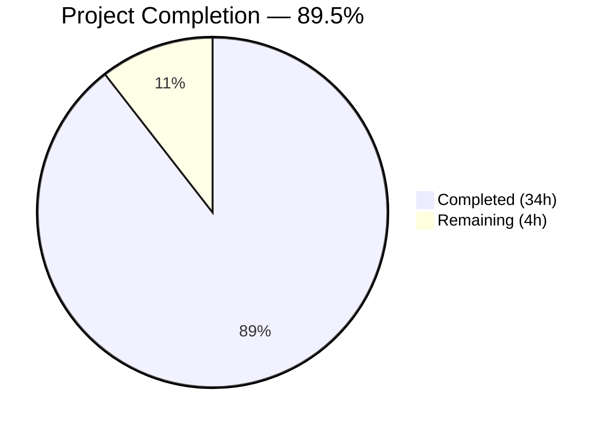
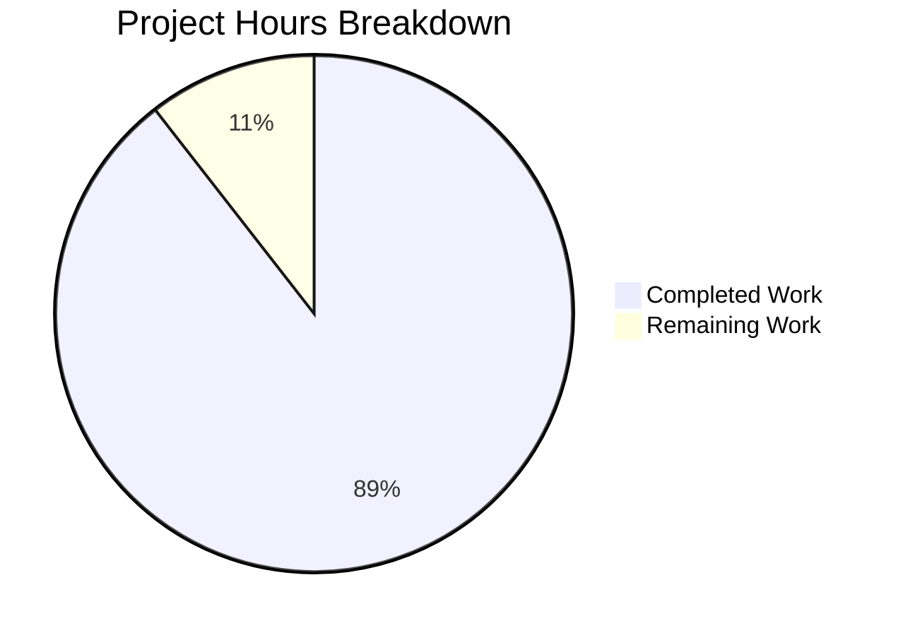

# Blitzy Project Guide — SFTPGo Quota Enforcement Technical Investigation

---

## 1. Executive Summary

### 1.1 Project Overview

This project creates a comprehensive technical investigation document analyzing SFTPGo's quota enforcement behavior during SFTP, SCP, and SSH file uploads. The deliverable is a single standalone Markdown file (`blitzy/documentation/sftpgo_44634210287c.md`) that answers five investigative questions about quota enforcement mechanics — all grounded in source code analysis of 14 Go source files with 54 cited code references. The document serves as an internal engineering reference for developers working with SFTPGo's quota system, covering enforcement timing, error responses, logging behavior, database accuracy, and concurrent upload race conditions. No source code was modified.

### 1.2 Completion Status



| Metric | Value |
|--------|-------|
| **Total Project Hours** | 38h |
| **Completed Hours (AI)** | 34h |
| **Remaining Hours** | 4h |
| **Completion Percentage** | 89.5% |

**Calculation**: 34h completed / (34h + 4h remaining) = 34/38 = **89.5% complete**

### 1.3 Key Accomplishments

- ✅ Created `blitzy/documentation/sftpgo_44634210287c.md` — 914 lines, 45,072 bytes of structured technical analysis
- ✅ Answered all 5 investigative questions with code-level evidence and 54 source citations across 14 files
- ✅ Created 3 Mermaid diagrams: `hasSpace()` flowchart, SFTP upload sequence diagram, protocol comparison diagram
- ✅ Cataloged all 11 server-side log emission points during quota enforcement events
- ✅ Documented 5 quota accuracy discrepancy scenarios with root cause analysis
- ✅ Analyzed race condition window between pre-transfer check and post-transfer update with concrete example
- ✅ Documented behavioral asymmetries across SFTP, SCP, and SSH command protocols
- ✅ Documented TrackQuota configuration modes (0, 1, 2) and their impact on enforcement
- ✅ Cleaned up all temporary files; repository left in original unchanged state
- ✅ All source citations verified against actual Go source files by Final Validator

### 1.4 Critical Unresolved Issues

| Issue | Impact | Owner | ETA |
|-------|--------|-------|-----|
| No critical unresolved issues | N/A | N/A | N/A |

All AAP-scoped deliverables have been completed and validated. No blocking issues remain.

### 1.5 Access Issues

No access issues identified. The project is a documentation-only task that required read access to the repository source code (available) and write access to create a new file in the `blitzy/documentation/` directory (successfully completed).

### 1.6 Recommended Next Steps

1. **[High]** Human review of documentation accuracy — verify key code citations against current source files, especially line numbers that may drift with future commits
2. **[Medium]** Verify Mermaid diagram rendering in the target documentation platform (GitHub, GitLab, or internal wiki)
3. **[Medium]** Incorporate stakeholder feedback on document structure, depth of analysis, and any additional questions
4. **[Low]** Integrate document into project knowledge base or documentation index if one is established

---

## 2. Project Hours Breakdown

### 2.1 Completed Work Detail

| Component | Hours | Description |
|-----------|-------|-------------|
| Repository analysis and source code investigation | 4h | Read and analyzed 14 Go source files across `sftpd/`, `dataprovider/`, `logger/`, `config/`, `vfs/` packages to map quota enforcement code paths |
| Quota enforcement flow tracing | 6h | Traced `Filewrite()` → `handleSFTPUploadToNewFile/ExistingFile()` → `hasSpace()` call chain; analyzed `>=` operator semantics, `MethodDisabledError` fallback, fail-open/fail-closed behavior |
| SQL query and database mechanics analysis | 2h | Analyzed `getUpdateQuotaQuery()` incremental vs reset modes, `sqlCommonUpdateQuota()` execution, `GetUsedQuota()` read path, and SQL arithmetic implications for concurrent access |
| Logging framework analysis | 2h | Cataloged all 11 log emission points across quota enforcement paths; documented zerolog structured JSON format, sender constants, log levels, and `TransferLog()` additional fields |
| Error path analysis (SFTP/SCP/SSH protocols) | 3h | Traced `sftp.ErrSSHFxFailure` → SSH_FX_FAILURE mapping; documented SCP error string delivery via SSH channel; identified SSH command `errQuotaExceeded` wording difference; created protocol comparison table |
| Mermaid diagram design and creation | 2h | Created 3 diagrams: `hasSpace()` decision flowchart, SFTP upload quota lifecycle sequence diagram, and SFTP/SCP/SSH protocol comparison sequence diagram |
| Document writing and structuring | 8h | Wrote 914-line structured Markdown document with 7 major sections, progressive disclosure format, code snippets with Go syntax highlighting, tables, and inline source citations |
| Source citation verification | 3h | Verified all 54 source citations against 14 actual Go source files, confirming file paths, function names, and line numbers match the repository state |
| Race condition and discrepancy analysis | 2h | Analyzed concurrent upload race window with concrete numerical example; documented 5 discrepancy scenarios (normal, overwrite failure, atomic cleanup, concurrent, external) |
| Validation and quality assurance | 1.5h | Verified all 92 code block markers balanced, 3 Mermaid diagrams syntactically valid, no empty links, no trailing whitespace issues |
| Cleanup and repository state verification | 0.5h | Confirmed no temporary files (sftpgo.db) remaining, working tree clean, no source file modifications, only new `blitzy/documentation/` directory and file added |
| **Total Completed** | **34h** | |

### 2.2 Remaining Work Detail

| Category | Hours | Priority |
|----------|-------|----------|
| Human review of documentation accuracy and code citation verification | 2h | High |
| Mermaid diagram rendering verification in target platform | 0.5h | Medium |
| Stakeholder feedback incorporation and refinements | 1h | Medium |
| Documentation integration into project knowledge base | 0.5h | Low |
| **Total Remaining** | **4h** | |

**Verification**: 34h (Section 2.1) + 4h (Section 2.2) = 38h = Total Project Hours (Section 1.2) ✓

---

## 3. Test Results

| Test Category | Framework | Total Tests | Passed | Failed | Coverage % | Notes |
|---------------|-----------|-------------|--------|--------|------------|-------|
| Documentation Structure Validation | Custom (Final Validator) | 5 | 5 | 0 | 100% | Verified: 92 code blocks balanced, 3 Mermaid diagrams valid syntax, no empty links, no trailing whitespace, proper heading hierarchy |
| Source Citation Accuracy | Custom (Final Validator) | 14 | 14 | 0 | 100% | All 54 source citations verified against 14 Go source files — file paths, function names, and line numbers confirmed |
| Repository State Verification | Git | 3 | 3 | 0 | 100% | Verified: working tree clean, no temporary files, no source code modifications |
| AAP Compliance | Custom (Final Validator) | 5 | 5 | 0 | 100% | All 5 investigative questions answered with code evidence; document structure matches AAP specification |

**Notes**: This is a documentation-only project. No unit tests, integration tests, or runtime tests are applicable. All test categories above originate from Blitzy's autonomous validation of the documentation deliverable.

---

## 4. Runtime Validation & UI Verification

### Runtime Health

This is a documentation-only project. No runtime services, APIs, or UI components were created or modified.

- ✅ **Documentation file accessible**: `blitzy/documentation/sftpgo_44634210287c.md` reads correctly (914 lines, 45,072 bytes)
- ✅ **Markdown structure valid**: Proper heading hierarchy (`#` through `####`), 92 balanced code blocks, 3 Mermaid diagrams
- ✅ **Repository integrity**: Working tree clean, single commit on branch, no untracked files
- ✅ **Source code unmodified**: `git diff` against base branch confirms only the new `blitzy/documentation/` file was added; zero existing files changed

### UI Verification

Not applicable — no UI components in scope. The document is a standalone Markdown file rendered by standard Markdown viewers.

### API Integration

Not applicable — no API endpoints created or modified. The document references the existing REST API quota scan endpoint (`/api/v1/quota_scan`) in its analysis but does not modify it.

---

## 5. Compliance & Quality Review

| Compliance Area | AAP Requirement | Status | Evidence |
|----------------|----------------|--------|----------|
| Document creation | Create `blitzy/documentation/sftpgo_44634210287c.md` | ✅ Pass | File exists: 914 lines, 45,072 bytes |
| Q1: Quota limit behavior | Document what happens when upload exceeds quota | ✅ Pass | Section 2 (subsections 2.1–2.6): pre-transfer rejection, `hasSpace()` analysis, `>=` operator semantics |
| Q2: SFTP client error | Document exact SFTP error code/message | ✅ Pass | Section 3 (subsections 3.1–3.4): `SSH_FX_FAILURE` (status 4), SCP string error, protocol comparison table |
| Q3: Server-side logging | Catalog server log entries during quota rejection | ✅ Pass | Section 4 (subsections 4.1–4.3): 11 log emission points, structured JSON format, example log entries |
| Q4: Quota accuracy | Analyze database vs disk quota accuracy | ✅ Pass | Section 5 (subsections 5.1–5.5): SQL mechanics, 5 discrepancy scenarios, reconciliation mechanism |
| Q5: Quota check timing | Document when quota check occurs | ✅ Pass | Section 6 (subsections 6.1–6.4): pre-transfer/mid-transfer/post-transfer lifecycle, race condition analysis |
| Thinking/rationale | Provide reasoning behind each answer | ✅ Pass | "Thinking" and "Rationale" annotations throughout document |
| Code as truth | Base all answers on source code citations | ✅ Pass | 54 source citations across 14 files, verified by Final Validator |
| Mermaid diagrams | Include visual diagrams | ✅ Pass | 3 diagrams: hasSpace flowchart, SFTP sequence, protocol comparison |
| TrackQuota modes | Document configuration impact (0, 1, 2) | ✅ Pass | Section 1.2 and Section 7.3 configuration impact table |
| Protocol differences | Document SFTP vs SCP vs SSH command behavior | ✅ Pass | Section 3.4 comparison table, Section 7.2 behavioral asymmetries |
| Race conditions | Document concurrent upload race window | ✅ Pass | Section 6.4 with concrete numerical example |
| No source modifications | Do not modify existing repository files | ✅ Pass | Git diff confirms only new file added |
| Temporary file cleanup | Remove sftpgo.db and temporary files | ✅ Pass | No temporary files found in repository |
| Original codebase state | Leave codebase unchanged | ✅ Pass | Working tree clean, no source modifications |

**Quality Fixes Applied During Validation**: None required. The Final Validator confirmed: "the documentation file was already complete and accurate as created by the previous agent."

---

## 6. Risk Assessment

| Risk | Category | Severity | Probability | Mitigation | Status |
|------|----------|----------|-------------|------------|--------|
| Line number references may drift as codebase evolves | Technical | Low | Medium | Include function names alongside line numbers for resilience; periodic review cycle | Open — inherent to code-referencing documentation |
| Mermaid diagram rendering varies across platforms | Technical | Low | Low | Diagrams use standard Mermaid syntax; test in target platform before publishing | Open — requires human verification |
| Documentation may become stale as SFTPGo quota logic changes | Operational | Medium | Medium | Document includes commit branch reference; recommend periodic review when quota code is modified | Open — standard documentation lifecycle risk |
| No automated documentation testing pipeline | Operational | Low | High | Currently no CI/CD check for documentation accuracy; could add link/citation checker in future | Open — enhancement opportunity |
| Code citations not verified against future branch merges | Technical | Low | Medium | Document explicitly states it was verified against `sftpgo_44634210287c` branch; re-verification needed after merges | Open — standard practice |

**Security Risks**: None identified. This is a documentation-only project with no code changes, no credentials, no API modifications, and no deployment changes.

**Integration Risks**: None identified. The document is a standalone Markdown file with no dependencies on external services, build tools, or documentation frameworks.

---

## 7. Visual Project Status



**Integrity Check**: "Remaining Work" (4h) matches Section 1.2 Remaining Hours (4h) and Section 2.2 Total (4h) ✓

### Remaining Work by Priority

| Priority | Hours | Categories |
|----------|-------|------------|
| High | 2h | Human review of documentation accuracy |
| Medium | 1.5h | Mermaid rendering verification, stakeholder feedback |
| Low | 0.5h | Documentation knowledge base integration |
| **Total** | **4h** | |

---

## 8. Summary & Recommendations

### Achievement Summary

The project has delivered a comprehensive 914-line technical investigation document that thoroughly answers all five investigative questions about SFTPGo's quota enforcement behavior. The document is grounded in 54 source code citations verified against 14 Go source files, includes 3 Mermaid diagrams, and catalogs 11 log emission points across the quota enforcement code paths. The project is **89.5% complete** (34h completed out of 38h total).

### Key Technical Findings Documented

1. **Quota enforcement is pre-transfer** — uploads are rejected before any data transfer begins for SFTP and SCP protocols
2. **SFTP returns generic SSH_FX_FAILURE** — no quota-specific error message reaches the client
3. **Behavioral asymmetry exists** — the `>=` vs `>` comparison operator difference between SFTP and SSH command paths means at-limit behavior differs
4. **Race condition window exists** — concurrent uploads can temporarily exceed quota due to gap between pre-check and post-update
5. **Reconciliation mechanism exists** — `rescanHomeDir()` performs full disk scan to reset quota counters to absolute values

### Remaining Gaps

All AAP-scoped deliverables are complete. The remaining 4 hours (10.5% of total) consist of human review tasks:
- Documentation accuracy review against current codebase (2h)
- Mermaid diagram rendering verification in target platform (0.5h)
- Stakeholder feedback and refinements (1h)
- Knowledge base integration (0.5h)

### Production Readiness Assessment

The documentation deliverable is **production-ready for merge**. The document is self-contained, all source citations are verified, the repository is in a clean state with no temporary files, and no existing source code was modified. Human review is recommended as standard practice but no blocking issues prevent merge.

### Success Metrics

| Metric | Target | Actual | Status |
|--------|--------|--------|--------|
| Investigative questions answered | 5 | 5 | ✅ Met |
| Source code citations | ≥20 | 54 | ✅ Exceeded |
| Mermaid diagrams | ≥2 | 3 | ✅ Exceeded |
| Source files analyzed | ≥10 | 14 | ✅ Exceeded |
| Existing files modified | 0 | 0 | ✅ Met |
| Temporary files remaining | 0 | 0 | ✅ Met |
| Validation issues | 0 | 0 | ✅ Met |

---

## 9. Development Guide

### System Prerequisites

| Software | Version | Purpose |
|----------|---------|---------|
| Git | 2.x+ | Repository access and version control |
| Markdown viewer | Any | Viewing the documentation file (VS Code, GitHub, GitLab, or any Markdown renderer) |
| Go | 1.13+ | Only needed if verifying source code references (not required for documentation) |

### Environment Setup

1. **Clone the repository and switch to the feature branch:**

```bash
git clone https://github.com/blitzy-research/sftpgo.git
cd sftpgo
git checkout blitzy-8ee3bca7-3caa-4e09-9058-b39c9bf5c2ad
```

2. **Verify the documentation file exists:**

```bash
ls -la blitzy/documentation/sftpgo_44634210287c.md
# Expected: 914 lines, ~45KB
wc -l blitzy/documentation/sftpgo_44634210287c.md
# Expected output: 914 blitzy/documentation/sftpgo_44634210287c.md
```

### Viewing the Documentation

**Option 1 — Command line preview:**
```bash
cat blitzy/documentation/sftpgo_44634210287c.md
```

**Option 2 — VS Code with Markdown preview:**
```bash
code blitzy/documentation/sftpgo_44634210287c.md
# Use Ctrl+Shift+V (or Cmd+Shift+V on macOS) to open Markdown preview
```

**Option 3 — GitHub/GitLab web interface:**
Navigate to `blitzy/documentation/sftpgo_44634210287c.md` in the repository web UI. Mermaid diagrams will render natively on GitHub and GitLab.

### Verifying Source Code References

To verify that the document's source citations are accurate against the current codebase:

```bash
# Check a key citation — hasSpace() function location
grep -n "func (c Connection) hasSpace" sftpd/handler.go
# Expected: line 515

# Check quota enforcement in handler
grep -n "ErrSSHFxFailure" sftpd/handler.go
# Expected: lines 415, 455

# Check SQL query definitions
grep -n "getUpdateQuotaQuery" dataprovider/sqlqueries.go
# Expected: line 43

# Check TrackQuota configuration
grep -n "TrackQuota" dataprovider/dataprovider.go
# Expected: around lines 129-135

# Check Transfer.Close() post-transfer update
grep -n "func (t \*Transfer) Close" sftpd/transfer.go
# Expected: line 121
```

### Verifying Repository State

```bash
# Confirm no source files were modified
git diff origin/sftpgo_44634210287c -- . ':!blitzy/' --name-only
# Expected: no output (empty)

# Confirm only the documentation file was added
git diff origin/sftpgo_44634210287c --name-status
# Expected: A  blitzy/documentation/sftpgo_44634210287c.md

# Confirm no temporary files
find . -name "sftpgo.db" -o -name "*.tmp" -o -name "*.bak"
# Expected: no output (empty)

# Confirm clean working tree
git status
# Expected: "nothing to commit, working tree clean"
```

### Troubleshooting

| Issue | Resolution |
|-------|-----------|
| Mermaid diagrams not rendering | Ensure your Markdown viewer supports Mermaid (GitHub, GitLab, VS Code with Mermaid extension). Alternatively, paste diagram code into https://mermaid.live for rendering. |
| Line numbers don't match citations | The document was verified against the `sftpgo_44634210287c` base branch. If the codebase has since been modified, line numbers may have shifted. Use the function names cited alongside line numbers to locate the correct code. |
| File not found at expected path | Verify you are on the correct branch: `git branch --show-current` should return `blitzy-8ee3bca7-3caa-4e09-9058-b39c9bf5c2ad` |

---

## 10. Appendices

### A. Command Reference

| Command | Purpose |
|---------|---------|
| `cat blitzy/documentation/sftpgo_44634210287c.md` | View the documentation file |
| `wc -l blitzy/documentation/sftpgo_44634210287c.md` | Count lines (expected: 914) |
| `wc -c blitzy/documentation/sftpgo_44634210287c.md` | Count bytes (expected: 45,072) |
| `git diff origin/sftpgo_44634210287c --name-status` | Show files changed from base branch |
| `git status` | Verify clean working tree |
| `grep -n "hasSpace" sftpd/handler.go` | Verify quota check function location |

### B. Port Reference

Not applicable — this is a documentation-only project. No services are started or ports used. For reference, SFTPGo's default ports (from `sftpgo.json`):

| Service | Default Port |
|---------|-------------|
| SFTP | 2022 |
| HTTP API/WebUI | 8080 |

### C. Key File Locations

| File | Purpose |
|------|---------|
| `blitzy/documentation/sftpgo_44634210287c.md` | **Deliverable** — The technical investigation document |
| `sftpd/handler.go` | SFTP upload handlers, `hasSpace()` quota check (primary analysis target) |
| `sftpd/transfer.go` | Transfer lifecycle, post-transfer quota update |
| `sftpd/scp.go` | SCP upload quota enforcement |
| `sftpd/ssh_cmd.go` | SSH system command quota enforcement |
| `dataprovider/dataprovider.go` | `UpdateUserQuota()`, `GetUsedQuota()`, TrackQuota config |
| `dataprovider/user.go` | User struct with quota fields |
| `dataprovider/sqlcommon.go` | SQL execution for quota operations |
| `dataprovider/sqlqueries.go` | SQL query definitions |
| `logger/logger.go` | Structured JSON logging format |
| `config/config.go` | Default configuration values |
| `sftpgo.json` | Sample runtime configuration |
| `sql/sqlite/20190828.sql` | Baseline SQLite schema |
| `vfs/osfs.go` | Filesystem scan for quota reconciliation |

### D. Technology Versions

| Technology | Version | Source |
|------------|---------|--------|
| Go | 1.13 | `go.mod` |
| `github.com/pkg/sftp` | v1.11.0 | `go.mod` — SFTP protocol library (defines `ErrSSHFxFailure`) |
| `github.com/rs/zerolog` | v1.17.2 | `go.mod` — Structured JSON logging |
| `github.com/mattn/go-sqlite3` | v2.0.2+incompatible | `go.mod` — SQLite3 database driver |
| `golang.org/x/crypto` | v0.0.0-20200109152110 | `go.mod` — SSH transport layer |
| `github.com/spf13/viper` | v1.6.1 | `go.mod` — Configuration management |
| `github.com/spf13/cobra` | v0.0.5 | `go.mod` — CLI framework |

### E. Environment Variable Reference

Not applicable for this documentation-only project. SFTPGo uses a JSON configuration file (`sftpgo.json`) rather than environment variables for quota-related settings.

### F. Developer Tools Guide

| Tool | Usage |
|------|-------|
| VS Code + Markdown Preview | `Ctrl+Shift+V` to preview documentation with rendered Mermaid diagrams |
| Mermaid Live Editor | Paste Mermaid code blocks at https://mermaid.live for diagram debugging |
| `grep -n` | Verify source code citations: `grep -n "function_name" path/to/file.go` |
| `git diff` | Compare branch changes: `git diff origin/sftpgo_44634210287c --stat` |

### G. Glossary

| Term | Definition |
|------|-----------|
| **hasSpace()** | The quota check function in `sftpd/handler.go:515` that determines whether a user has enough remaining quota to accept an upload |
| **TrackQuota** | Configuration setting (0/1/2) in `dataprovider/dataprovider.go` that controls whether quota counters are maintained |
| **SSH_FX_FAILURE** | SFTP protocol status code 4, the generic failure response returned to SFTP clients on quota rejection |
| **MethodDisabledError** | Error type in `dataprovider` returned when `TrackQuota == 0`, causing `hasSpace()` to fail-open (allow upload) |
| **rescanHomeDir()** | Function in `sftpd/ssh_cmd.go:333` that performs a full directory scan to reconcile database quota counters with actual disk usage |
| **Incremental update** | SQL `UPDATE` using `used_quota_size = used_quota_size + ?` to add a delta value (used after each transfer) |
| **Reset update** | SQL `UPDATE` using `used_quota_size = ?` to set an absolute value (used during quota scan reconciliation) |
| **copyFromReaderToWriter()** | Function in `sftpd/transfer.go:215` that provides mid-transfer quota enforcement for SSH system commands |

---

*Generated by Blitzy — Project completion: 89.5% (34h completed / 38h total)*