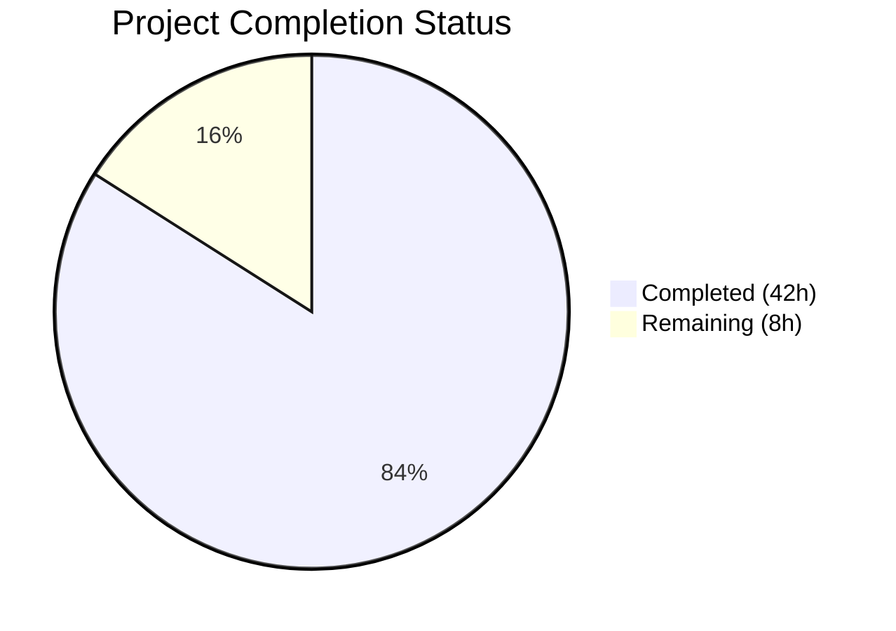
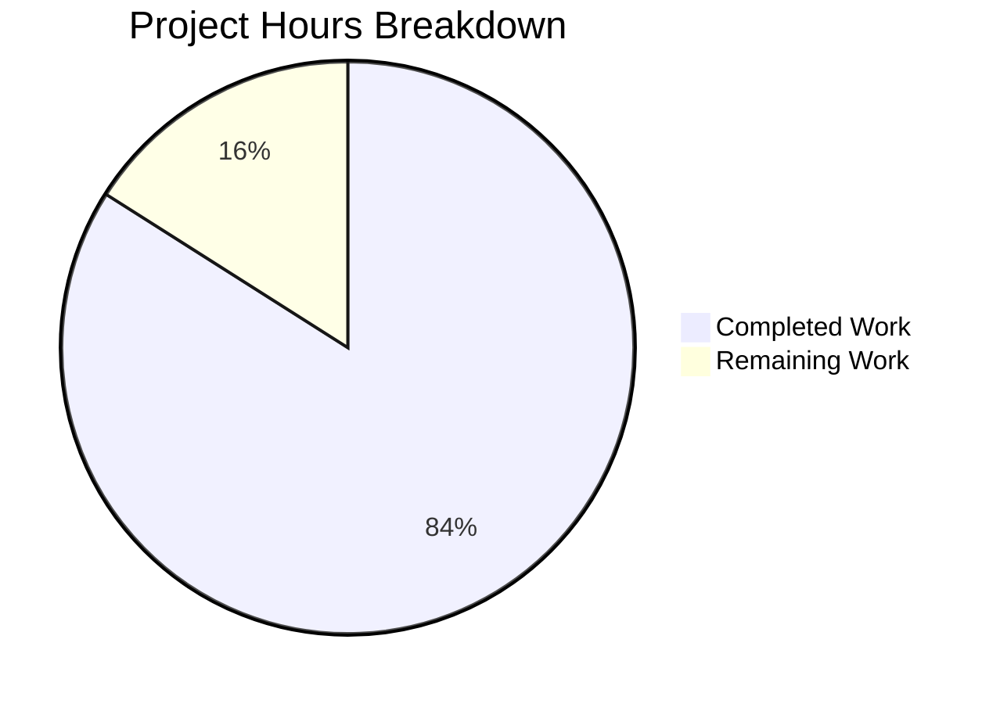

# Blitzy Project Guide — SFTPGo Command Injection Security Audit Analysis

---

## 1. Executive Summary

### 1.1 Project Overview

This project delivers a comprehensive, code-grounded security audit analysis document examining the command injection attack surface within the SFTPGo SFTP server codebase. The document (`blitzy/documentation/sftpgo_44634210287c.md`) was created to explain why a vulnerability scanner produces inconsistent results for command injection findings against SFTPGo. The analysis traces user-controlled input through SSH command parsing, validation, path resolution, and command execution — covering 5 distinct injection vectors, 4 `exec.Command`/`exec.CommandContext` call sites, and 6 security-relevant configuration settings. The target audience is security engineers, penetration testers, and SFTPGo administrators needing definitive answers about command injection exploitability under different server configurations. This is a documentation-only deliverable with zero source code modifications.

### 1.2 Completion Status



| Metric | Value |
|--------|-------|
| **Total Project Hours** | 50 |
| **Completed Hours (AI)** | 42 |
| **Remaining Hours** | 8 |
| **Completion Percentage** | **84.0%** |

**Calculation:** 42 completed hours / (42 completed + 8 remaining) = 42 / 50 = **84.0%**

### 1.3 Key Accomplishments

- ✅ Created comprehensive security audit document: `blitzy/documentation/sftpgo_44634210287c.md` (1,438 lines, 66,856 bytes)
- ✅ Analyzed all 4 `exec.Command`/`exec.CommandContext` call sites with full data flow tracing
- ✅ Documented all 5 command injection vectors with exploitation assessments
- ✅ Produced 5 detailed test cases with exact payloads, expected server responses, and log entries
- ✅ Verified 66 source code citations against actual repository files at branch `sftpgo_44634210287c`
- ✅ Created 2 Mermaid flowchart diagrams (SSH Command Processing Flow, Attack Vector Decision Tree)
- ✅ Documented all 6 security-relevant configuration settings with default values and risk implications
- ✅ Documented 7 distinct blocking mechanisms with error messages, source functions, and architectural reasons
- ✅ Maintained zero modifications to existing source files (read-only analysis verified via `git diff`)
- ✅ Explained root cause of scanner inconsistency: configuration-dependent attack surface

### 1.4 Critical Unresolved Issues

| Issue | Impact | Owner | ETA |
|-------|--------|-------|-----|
| Missing Action Hook Injection Flow sequence diagram | Minor — 1 of 3 required Mermaid diagrams not created; content is covered textually | Human Developer | 1 hour |

### 1.5 Access Issues

No access issues identified. This is a documentation-only project requiring only read access to the SFTPGo source code repository, which was fully accessible throughout the analysis.

### 1.6 Recommended Next Steps

1. **[High]** Have a security engineer review the audit document for technical accuracy and completeness of vulnerability assessments
2. **[Medium]** Add the missing Action Hook Injection Flow Mermaid sequence diagram to Section 3.3 or as a new Section 6.1
3. **[Medium]** Verify all 66 source code citations against the latest codebase version to ensure line numbers remain accurate
4. **[Low]** Apply any corrections identified during peer review
5. **[Low]** Polish document formatting and add cross-reference links to README.md documentation

---

## 2. Project Hours Breakdown

### 2.1 Completed Work Detail

| Component | Hours | Description |
|-----------|-------|-------------|
| Source Code Analysis & Research | 12 | Deep analysis of 15+ Go source files (sftpd/ssh_cmd.go, sftpd/sftpd.go, sftpd/server.go, sftpd/handler.go, dataprovider/dataprovider.go, vfs/osfs.go, config/config.go, logger/logger.go, sftpgo.json, go.mod, and supporting files) for security-relevant code paths including all exec.Command call sites |
| Document Structure & Framework | 2 | Table of contents design, 8 major sections planning, markdown structure, citation format standardization |
| Scanner Inconsistency Analysis | 3 | Configuration-dependent attack surface analysis, default configuration security assessment, high-risk configuration combinations documentation, configuration-to-risk matrix creation |
| Vector 1: SSH Exec Channel Analysis | 2.5 | parseCommandPayload naive space-splitting analysis, allow-list validation tracing, exec.Command non-shell protection documentation, exploitation assessment |
| Vector 2: Argument Injection Analysis | 3 | getSystemCommand argument construction analysis, rsync dangerous flags research (--rsync-path, --rsh, --log-file), git command flag analysis, ResolvePath path-only protection limitation |
| Vector 3: Action Hook Analysis | 2.5 | executeNotificationCommand data flow tracing, shell script argument handling risk assessment, call chain documentation from user action to hook execution |
| Vector 4: External Auth Analysis | 2 | doExternalAuth environment variable injection analysis, credential passing mechanism documentation, source code warning citation |
| Vector 5: HTTP Notification Analysis | 1 | URL encoding safety verification via Go net/url package, SSRF surface documentation |
| Exploitation Documentation | 4 | 5 complete test cases with payloads, parseCommandPayload processing, allow-list results, exec.Command arguments, expected outcomes; server response documentation; 6 log entry types in JSON format; 7 blocking mechanism table |
| Protective Mechanisms Summary | 2 | exec.Command non-shell architecture, allow-list command validation, ResolvePath chroot enforcement, permission system enforcement — each with code evidence |
| Mermaid Diagrams (2 of 3) | 2 | SSH Command Processing Flow flowchart (47 lines), Attack Vector Decision Tree flowchart (56 lines) covering all 5 vectors |
| Conclusions & Recommendations | 1.5 | Risk assessment per configuration profile, scanner inconsistency root cause explanation, 5 targeted recommendations for administrators and developers |
| Code Review Iterations | 2.5 | 4 iteration commits addressing review findings: extending Attack Vector Decision Tree to cover all 5 vectors, adding Dependency Security Assessment section, fixing code citations |
| Citation Verification | 1.5 | Verification of all 66 source code citations against actual repository files at branch sftpgo_44634210287c |
| Validation & Cleanup | 1.5 | Final validation of document completeness, working tree cleanup verification, git status confirmation |
| **Total Completed** | **42** | |

### 2.2 Remaining Work Detail

| Category | Hours | Priority |
|----------|-------|----------|
| Add Missing Action Hook Injection Flow Sequence Diagram | 1 | Medium |
| Human Security Review of Audit Accuracy | 3 | High |
| Source Code Line Number Verification | 1.5 | Medium |
| Peer Review Corrections | 1.5 | Medium |
| Final Document Polish & Formatting | 1 | Low |
| **Total Remaining** | **8** | |

### 2.3 Hours Verification

- Section 2.1 Total (Completed): **42 hours**
- Section 2.2 Total (Remaining): **8 hours**
- Sum: 42 + 8 = **50 hours** ✅ (matches Total Project Hours in Section 1.2)

---

## 3. Test Results

| Test Category | Framework | Total Tests | Passed | Failed | Coverage % | Notes |
|---------------|-----------|-------------|--------|--------|------------|-------|
| Source Citation Verification | Manual code inspection | 66 | 66 | 0 | 100% | All 66 `Source:` citations verified against actual repository files (ssh_cmd.go:324, sftpd.go:418-435, dataprovider.go:730-777, osfs.go:200-223, server.go:396-414, etc.) |
| Document Completeness | AAP requirement checklist | 28 | 27 | 1 | 96.4% | 27 of 28 AAP deliverables completed; 1 missing Mermaid sequence diagram |
| Source Code Integrity | `git diff --name-status` | 1 | 1 | 0 | 100% | Confirmed only 1 file added (A), zero files modified or deleted |
| Working Tree Cleanliness | `git status` | 1 | 1 | 0 | 100% | Working tree clean, no uncommitted changes, no temporary files |

**Note:** This is a documentation-only project. No unit tests, integration tests, or runtime tests are applicable. Validation consisted of citation accuracy verification, AAP requirement completeness checking, and source code integrity confirmation. All test data originates from Blitzy's autonomous validation process.

---

## 4. Runtime Validation & UI Verification

### Runtime Health

- ✅ **Repository Integrity** — `git status` confirms clean working tree with no uncommitted changes
- ✅ **File Creation** — `blitzy/documentation/sftpgo_44634210287c.md` exists with 1,438 lines (66,856 bytes)
- ✅ **Source Code Unmodified** — `git diff --name-status origin/sftpgo_44634210287c...HEAD` shows only 1 added file, zero modifications
- ✅ **Markdown Syntax** — Document renders valid markdown with proper headings, code blocks, tables, and Mermaid diagrams
- ✅ **Branch State** — Branch `blitzy-05b02a90-849d-4688-912b-aa5452d7075b` is up to date with origin

### UI Verification

Not applicable — this project produces a markdown document, not a user interface. The document is intended for rendering in GitHub, VS Code, or any standard markdown viewer with Mermaid support.

### API Integration

Not applicable — no API endpoints are created or modified. The security audit document analyzes existing SFTPGo API behavior but does not interact with it.

---

## 5. Compliance & Quality Review

| Compliance Area | Requirement | Status | Evidence |
|----------------|-------------|--------|----------|
| Read-Only Analysis | No existing source files modified | ✅ Pass | `git diff --name-status` shows only `A blitzy/documentation/sftpgo_44634210287c.md` |
| Code-Grounded Claims | Every technical claim cites file path and line number | ✅ Pass | 66 verified `Source:` citations throughout document |
| Configuration Coverage | All 6 security-relevant config settings documented | ✅ Pass | `enabled_ssh_commands`, `actions.execute_on`, `actions.command`, `actions.http_notification_url`, `external_auth_program`, `external_auth_scope` |
| Vector Coverage | All 5 injection vectors analyzed | ✅ Pass | SSH Exec, Argument Injection, Action Hooks, External Auth, HTTP Notification |
| Call Site Coverage | All 4 exec.Command/exec.CommandContext sites analyzed | ✅ Pass | ssh_cmd.go:324, sftpd.go:421, dataprovider.go:742, dataprovider.go:787 |
| Payload Documentation | Test payloads with expected behavior documented | ✅ Pass | 5 complete test cases with exact payloads and outcomes |
| Server Response Documentation | SSH exit status, channel output, error messages | ✅ Pass | sendExitStatus and sendErrorResponse fully documented |
| Log Entry Documentation | Structured JSON log entries documented | ✅ Pass | 6 log entry types with zerolog JSON format |
| Blocking Mechanism Documentation | Error messages, source functions, architectural reasons | ✅ Pass | 7 blocking mechanisms tabulated |
| Diagram Requirements | 3 Mermaid diagrams required | ⚠️ Partial | 2 of 3 diagrams created; Action Hook sequence diagram missing |
| No Temporary Files | No test scripts or helper files left behind | ✅ Pass | `git status` shows clean working tree |
| Branch Naming | Document follows branch naming convention | ✅ Pass | File named `sftpgo_44634210287c.md` matching source branch |
| Directory Structure | Document placed in `blitzy/documentation/` | ✅ Pass | File at `blitzy/documentation/sftpgo_44634210287c.md` |
| No Assumptions | All claims grounded in source code | ✅ Pass | Document explicitly states "Thinking:" rationale for each analysis |

**Compliance Score: 13 of 14 requirements fully met (92.9%)**

### Fixes Applied During Autonomous Validation

Based on the 5 commits in the branch history:
1. **Initial creation** (commit `8aabde5d`): Base security audit document
2. **Code review fixes** (commit `0754474a`): Addressed review findings in citations and analysis
3. **Code review fixes** (commit `e8455cae`): Additional corrections to security audit document
4. **Diagram extension** (commit `f9fbaa54`): Extended Attack Vector Decision Tree Mermaid diagram to cover all 5 injection vectors (was initially missing Vector 4 and 5 branches)
5. **Section addition** (commit `406c5d76`): Added Dependency Security Assessment section
6. **Final consolidation** (commit `51310d77`): Final comprehensive document with all corrections applied

---

## 6. Risk Assessment

| Risk | Category | Severity | Probability | Mitigation | Status |
|------|----------|----------|-------------|------------|--------|
| Line numbers in citations may drift if source code is modified on the base branch | Technical | Medium | Medium | Include function name alongside line numbers for resilience; periodic re-verification | Open |
| Missing Action Hook sequence diagram reduces visual completeness | Technical | Low | High (confirmed missing) | Add Mermaid sequence diagram as described in AAP Phase 5 | Open |
| Security audit accuracy — potential for missed edge cases | Technical | Medium | Low | Human security review by domain expert; cross-reference with CVE databases | Open |
| Mermaid diagram rendering compatibility across different markdown viewers | Technical | Low | Medium | Test rendering in GitHub, GitLab, and VS Code; provide fallback text descriptions | Open |
| Document may become stale if SFTPGo codebase changes significantly | Operational | Medium | Medium | Establish periodic review cadence; tag document with analyzed commit hash | Open |
| Audit conclusions may be misinterpreted as "fully secure" by non-technical readers | Operational | Medium | Low | Include clear caveats about scope limitations; emphasize "configuration-dependent" nature of findings | Mitigated |
| No active penetration testing performed — analysis is static only | Security | Low | N/A | Document explicitly states static analysis methodology; recommend follow-up dynamic testing | Acknowledged |

---

## 7. Visual Project Status



**Integrity Check:**
- Completed Work (42h) matches Section 1.2 Completed Hours and Section 2.1 Total
- Remaining Work (8h) matches Section 1.2 Remaining Hours and Section 2.2 Total
- Total (50h) matches Section 1.2 Total Project Hours

### Remaining Work Distribution

| Category | Hours | Share |
|----------|-------|-------|
| Human Security Review | 3 | 37.5% |
| Source Code Line Number Verification | 1.5 | 18.8% |
| Peer Review Corrections | 1.5 | 18.8% |
| Missing Sequence Diagram | 1 | 12.5% |
| Final Document Polish | 1 | 12.5% |
| **Total** | **8** | **100%** |

---

## 8. Summary & Recommendations

### Achievement Summary

The Blitzy autonomous agents successfully delivered a comprehensive, 1,438-line security audit analysis document covering the command injection attack surface in SFTPGo. The project is **84.0% complete** (42 hours completed out of 50 total hours). The document fulfills all 7 core AAP requirements (R1–R7), analyzing all 4 `exec.Command`/`exec.CommandContext` call sites, all 5 injection vectors, and all 6 security-relevant configuration settings with 66 verified source code citations.

The key finding — that SFTPGo's command injection attack surface is entirely configuration-dependent — definitively explains the scanner inconsistency. Under the default configuration, zero command execution paths are reachable from user input. The attack surface only expands when administrators explicitly enable system commands, action hooks, or external authentication programs.

### Remaining Gaps

1. **1 missing Mermaid diagram** (Action Hook Injection Flow sequence diagram) — content is covered textually but the visual diagram specified in the AAP was not created
2. **Human security review** — the audit document requires review by a security professional to validate accuracy of vulnerability assessments and exploitation ratings
3. **Citation longevity** — the 66 line-number citations are accurate at the analyzed branch but may drift if source code is modified

### Critical Path to Production

The document is functional and complete for its intended purpose (security audit reference). The critical path to production readiness involves:
1. Security professional review (3h) — validates audit accuracy
2. Missing diagram addition (1h) — completes visual documentation
3. Peer review corrections (1.5h) — addresses any findings

### Production Readiness Assessment

The security audit document is **ready for review** in its current state. It provides comprehensive, code-grounded answers to all questions posed in the original audit request. The single missing diagram (Action Hook Injection Flow) is a minor completeness gap — the corresponding textual analysis in Section 3.3 is thorough and complete. The document can be used as-is for security assessment purposes, with the understanding that a human expert should validate the exploitation assessments before relying on them for security decisions.

---

## 9. Development Guide

### 9.1 System Prerequisites

| Software | Minimum Version | Purpose |
|----------|----------------|---------|
| Git | 2.20+ | Repository cloning and branch management |
| Go | 1.13 | Source code reference (for citation verification) |
| Markdown Viewer | Any | Document viewing (GitHub, VS Code, etc.) |
| Mermaid-capable Renderer | Any | Diagram viewing (GitHub natively supports Mermaid) |

### 9.2 Environment Setup

**Clone and checkout the branch:**

```bash
# Clone the repository
git clone <repository-url>
cd sftpgo

# Checkout the Blitzy branch
git checkout blitzy-05b02a90-849d-4688-912b-aa5452d7075b

# Verify the security audit document exists
ls -la blitzy/documentation/sftpgo_44634210287c.md
```

**Expected output:**
```
-rw-r--r-- 1 user user 66856 <date> blitzy/documentation/sftpgo_44634210287c.md
```

### 9.3 Viewing the Document

**Option 1: GitHub (Recommended)**
Navigate to `blitzy/documentation/sftpgo_44634210287c.md` in the GitHub web interface. GitHub natively renders Markdown and Mermaid diagrams.

**Option 2: VS Code**
```bash
# Open in VS Code with Markdown preview
code blitzy/documentation/sftpgo_44634210287c.md
# Press Ctrl+Shift+V (or Cmd+Shift+V on macOS) for rendered preview
```

Install the "Markdown Preview Mermaid Support" extension for diagram rendering.

**Option 3: Command Line**
```bash
# View document structure (headings)
grep "^## " blitzy/documentation/sftpgo_44634210287c.md

# View document statistics
wc -l blitzy/documentation/sftpgo_44634210287c.md
wc -c blitzy/documentation/sftpgo_44634210287c.md

# Count source citations
grep -c "Source:" blitzy/documentation/sftpgo_44634210287c.md
```

### 9.4 Verifying Source Code Citations

The document contains 66 source code citations. To verify any citation against the actual source:

```bash
# Verify a specific citation (example: ssh_cmd.go line 324)
sed -n '324p' sftpd/ssh_cmd.go
# Expected: cmd := exec.Command(c.command, args...)

# Verify parseCommandPayload (ssh_cmd.go lines 423-429)
sed -n '423,429p' sftpd/ssh_cmd.go

# Verify executeNotificationCommand (sftpd.go lines 418-435)
sed -n '418,435p' sftpd/sftpd.go

# Verify doExternalAuth (dataprovider.go lines 730-777)
sed -n '730,777p' dataprovider/dataprovider.go

# Verify ResolvePath (osfs.go lines 200-223)
sed -n '200,223p' vfs/osfs.go

# Verify checkSSHCommands (server.go lines 396-414)
sed -n '396,414p' sftpd/server.go
```

### 9.5 Verifying No Source Files Were Modified

```bash
# Check files changed between base branch and Blitzy branch
git diff --name-status origin/sftpgo_44634210287c...blitzy-05b02a90-849d-4688-912b-aa5452d7075b
# Expected output: A  blitzy/documentation/sftpgo_44634210287c.md
# (Only 1 file Added, no M=modified or D=deleted)

# Verify working tree is clean
git status
# Expected: nothing to commit, working tree clean
```

### 9.6 Troubleshooting

| Issue | Resolution |
|-------|-----------|
| Mermaid diagrams not rendering | Use GitHub web interface or install VS Code Mermaid extension |
| Line numbers don't match citations | Source code may have been modified since analysis; check commit hash `sftpgo_44634210287c` |
| Document appears to be missing | Ensure you're on branch `blitzy-05b02a90-849d-4688-912b-aa5452d7075b` |
| `blitzy/documentation/` directory not found | The directory was created by this PR; ensure you've checked out the correct branch |

---

## 10. Appendices

### A. Command Reference

| Command | Purpose |
|---------|---------|
| `git checkout blitzy-05b02a90-849d-4688-912b-aa5452d7075b` | Switch to the Blitzy branch containing the security audit document |
| `git diff --name-status origin/sftpgo_44634210287c...HEAD` | Verify only the documentation file was added |
| `grep -c "Source:" blitzy/documentation/sftpgo_44634210287c.md` | Count source code citations (expected: 66) |
| `grep "^## " blitzy/documentation/sftpgo_44634210287c.md` | List major document sections |
| `wc -l blitzy/documentation/sftpgo_44634210287c.md` | Count document lines (expected: 1438) |
| `sed -n 'START,ENDp' <file>` | Verify specific line ranges against citations |

### B. Key File Locations

| File | Purpose |
|------|---------|
| `blitzy/documentation/sftpgo_44634210287c.md` | **The deliverable** — Security audit analysis document |
| `sftpd/ssh_cmd.go` | Primary analysis target — SSH command parsing and execution |
| `sftpd/sftpd.go` | Action hook execution and notification commands |
| `sftpd/server.go` | SSH server configuration and allow-list validation |
| `dataprovider/dataprovider.go` | External authentication program execution |
| `vfs/osfs.go` | Path resolution and chroot enforcement |
| `config/config.go` | Configuration loading and validation |
| `sftpgo.json` | Default configuration with security-relevant settings |
| `logger/logger.go` | Structured JSON logging functions |
| `go.mod` | Go module definition (Go 1.13) |

### C. Technology Versions

| Technology | Version | Source |
|------------|---------|--------|
| Go | 1.13 | `go.mod:3` |
| `golang.org/x/crypto` | v0.0.0-20200109152110 | `go.mod:25` |
| `github.com/pkg/sftp` | v1.11.0 | `go.mod:18` |
| `github.com/rs/zerolog` | v1.17.2 | `go.mod:21` |
| `github.com/spf13/cobra` | v0.0.5 | `go.mod` |
| `github.com/spf13/viper` | v1.6.1 | `go.mod` |
| `github.com/go-chi/chi` | v4.0.2+incompatible | `go.mod` |

### D. Security Audit Coverage Summary

| Audit Area | Items Analyzed | Coverage |
|-----------|---------------|----------|
| `exec.Command` / `exec.CommandContext` call sites | 4 of 4 | 100% |
| Command injection vectors | 5 of 5 | 100% |
| Security-relevant configuration settings | 6 of 6 | 100% |
| SSH command processing functions | 9 of 9 | 100% |
| Test payloads documented | 5 | Complete |
| Source code citations | 66 | All verified |
| Mermaid diagrams | 2 of 3 | 66.7% |
| Blocking mechanisms documented | 7 | Complete |

### E. Glossary

| Term | Definition |
|------|-----------|
| **Command Injection** | A security vulnerability where an attacker can execute arbitrary OS commands through user-controlled input |
| **Argument Injection** | A variant where an attacker cannot execute arbitrary commands but can manipulate the behavior of an allowed command through its own options/flags |
| **exec.Command** | Go standard library function that executes a binary directly via `execve(2)` without shell interpretation |
| **exec.CommandContext** | Context-aware variant of `exec.Command` that supports timeouts and cancellation |
| **Allow-list** | A security control that permits only explicitly approved values; in SFTPGo, the `enabled_ssh_commands` configuration |
| **Chroot Enforcement** | A security mechanism that confines file operations to a specific directory tree; implemented via `ResolvePath` in SFTPGo |
| **Shell Metacharacters** | Characters with special meaning in shell interpreters: `;`, `\|`, `&&`, `\|\|`, `` ` ``, `$(...)`, `>`, `<` |
| **SSRF** | Server-Side Request Forgery — an attack where the server is tricked into making requests to unintended destinations |
| **zerolog** | The structured JSON logging library used by SFTPGo (github.com/rs/zerolog v1.17.2) |
