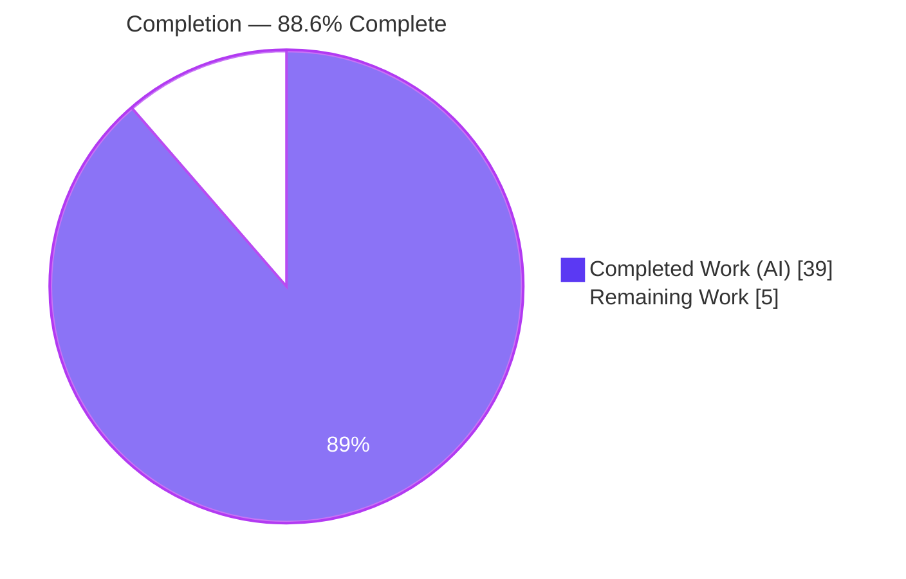
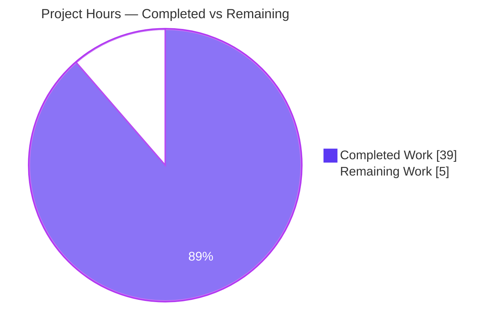
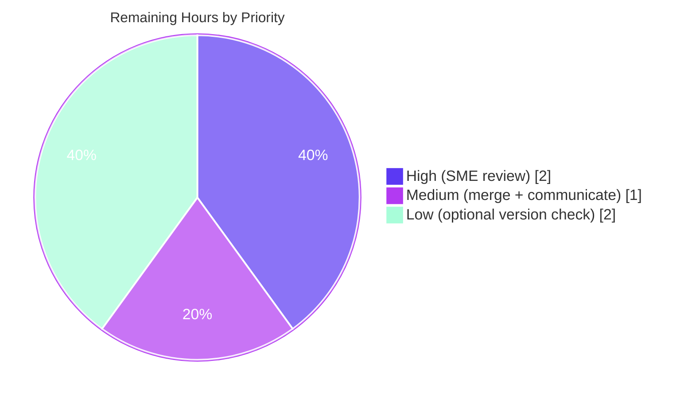

# Blitzy Project Guide — SFTPgo Per-User SFTP Upload Quota Enforcement Investigation

> **Repository:** SFTPgo (`0.9.5-dev`, Go) · **Base commit:** `44634210` · **HEAD:** `d1e00016` · **Branch:** `blitzy-709c7bf8-6b4d-4a56-a452-53a4c5d5ff5a`
> **Task type:** Investigative / behavior-analysis documentation (SWE-AtlasQnA) · **Scope:** strictly read-only on source; one additive deliverable

---

## 1. Executive Summary

### 1.1 Project Overview

This project delivers an **empirical, runtime-grounded investigation** of how SFTPgo (build `0.9.5-dev`) enforces **per-user disk quotas on SFTP uploads**, produced to help a developer debugging "unexpected quota behavior." The audience is engineers and operators relying on SFTPgo quota limits. The scope is strictly **read-only**: no source code, dependency, or configuration file is modified. The sole deliverable is one new markdown document, `blitzy/documentation/sftpgo_44634210287c.md`, that answers seven decomposed questions (R1–R7) — outcome, exact client error, exact server logs, reported-vs-disk reconciliation, and check timing — each backed by unedited command output and `file:line` code citations. The technical impact is clarity on a subtle, real behavior: the file-count limit is a hard ceiling while the size limit is soft.

### 1.2 Completion Status

The completion percentage is computed with the AAP-scoped, hours-based (PA1) methodology: only work defined by the Agent Action Plan and its path-to-production is counted.



| Metric | Hours |
|--------|------:|
| **Total Hours** | 44 |
| **Completed Hours (AI + Manual)** | 39 |
| &nbsp;&nbsp;• Completed by Blitzy AI (autonomous) | 39 |
| &nbsp;&nbsp;• Completed by Manual work to date | 0 |
| **Remaining Hours** | 5 |
| **Percent Complete** | **88.6%** |

> **Calculation:** Completion % = Completed / (Completed + Remaining) = 39 / 44 × 100 = **88.6%**. All AAP-specified autonomous work (R1–R7, harness, methodology, determinism, corroboration, and the single document write) is complete and independently validated; the remaining 5 h is human path-to-production (review, merge/communicate, optional version check).

### 1.3 Key Accomplishments

- ✅ Built **SFTPgo `0.9.5-dev`** from source in its canonical Go 1.13 + CGO configuration and verified the exact version banner (`SFTPGo version: 0.9.5-dev`).
- ✅ Constructed a **real SFTP client harness** from the server's own `github.com/pkg/sftp v1.11.0`, guaranteeing the genuine protocol entry point (never a bypass).
- ✅ Reproduced **both quota dimensions** in isolation and established the headline finding: **file-count = HARD** ceiling, **size = SOFT** (overshoots to 1200 bytes for a 1024-byte limit).
- ✅ Captured the **exact client error** (`*sftp.StatusError` → `SSH_FX_FAILURE`, code 4) and the **exact two server log lines** (`sender=sftpd`, debug + info) with all fields decoded.
- ✅ Reconciled **reported-vs-disk** usage (matched at every step; direct SQLite `SELECT` corroboration) and established the check is **strictly pre-transfer** via sub-millisecond timing.
- ✅ Confirmed **determinism across two runs** (byte-identical magnitudes) and corroborated design intent against upstream documentation.
- ✅ Authored the **627-line deliverable** with unedited output and ~50 verified `file:line` citations, then **left the repository pristine** (`go.mod`/`go.sum` byte-identical; working tree clean).

### 1.4 Critical Unresolved Issues

| Issue | Impact | Owner | ETA |
|-------|--------|-------|-----|
| _None — no unresolved blocking issues_ | The autonomous deliverable is complete and independently validated; no compilation, test, or runtime errors remain | — | — |

### 1.5 Access Issues

| System/Resource | Type of Access | Issue Description | Resolution Status | Owner |
|-----------------|----------------|-------------------|-------------------|-------|
| _No access issues identified_ | — | Build, run, REST API, and SFTP protocol paths were all exercised successfully in-environment | Resolved | — |

No access issues identified. All required toolchain (Go 1.13.15, gcc, sqlite3), the repository, and local service ports (2022/8080) were fully accessible during the autonomous investigation and this validation.

### 1.6 Recommended Next Steps

1. **[High]** Have an SFTPgo-knowledgeable SME review and sign off on the investigation document `blitzy/documentation/sftpgo_44634210287c.md` (verify empirical claims and citations).
2. **[Medium]** Approve the PR, merge/publish the deliverable to the target branch (single additive file; repository is pristine), and communicate the findings to the debugging user.
3. **[Low]** _(Optional)_ Confirm findings applicability to the user's actually-deployed SFTPgo version — the document is authoritative for `0.9.5-dev`, while public releases are 2.x.

---

## 2. Project Hours Breakdown

### 2.1 Completed Work Detail

All components below were performed autonomously by Blitzy and trace to specific AAP requirements. Total = **39 hours**.

| Component | Hours | Description |
|-----------|------:|-------------|
| Quota-path code investigation & root-cause analysis | 4 | Traced the end-to-end SFTP quota path across ~10 files; identified the root cause that `hasSpace` compares already-used quota without adding the incoming file size [sftpd/handler.go:L515-L535] |
| Build canonical `0.9.5-dev` binary + toolchain/config setup | 3 | Go 1.13 + CGO build, temp SQLite DDL seeding, default-config setup, version-banner verification (AAP Harness A1/A3/A4) |
| Custom `pkg/sftp` client harness development | 4 | Out-of-repo Go module using the server's own `pkg/sftp v1.11.0`; timed `Create→Write→Close`, REST readback, on-disk tally (AAP Harness A2) |
| R1 — scenario setup: server run + user provisioning | 3 | Launched server (default config); created 3 quota-restricted users via REST; isolated both dimensions; captured before/during/after state |
| R2 — enforcement reproduction (size + count) | 4 | Drove size scenario (soft; overshoot to 1200) and count scenario (hard; exactly 3), each captured verbatim |
| R3 + R4 — client error + server log capture & analysis | 3 | Captured `SSH_FX_FAILURE` (code 4) and the two `sender=sftpd` zerolog lines; decoded fields; distinguished from SCP-only path |
| R5 — reported-vs-disk reconciliation | 2 | Compared REST usage vs. on-disk tally at each step; corroborated with a direct SQLite `SELECT`; articulated the overshoot-not-mismatch finding |
| R6 — timing analysis | 2 | Established the pre-transfer nature via sub-ms failed `Create` vs. multi-ms successful `Close`, correlated to code |
| Determinism — second run + confirmation | 1 | Repeated the size scenario (`usersize2`); confirmed byte-identical magnitudes |
| Web-research corroboration | 1 | Corroborated design intent (README semantics, `track_quota` modes, upstream discussion #662, version caveat) |
| Deliverable authoring | 7 | 627-line / 6,317-word document; embedded unedited output; ~50 verified `file:line` citations; mermaid diagram; coverage pass |
| R7 — cleanup + repository-integrity verification | 1 | Removed all temp artifacts; verified repo pristine (`git status`, `go.mod`/`go.sum` md5) |
| Independent final validation | 4 | Full rebuild + full re-run of both dimensions × 2 runs; re-verified every number/string/log/citation; confirmed repo integrity |
| **Total** | **39** | |

### 2.2 Remaining Work Detail

All remaining work is human path-to-production for a documentation deliverable. Total = **5 hours**.

| Category | Hours | Priority |
|----------|------:|----------|
| SME technical review & sign-off of the investigation document | 2 | High |
| Merge/publish deliverable to target branch + communicate findings | 1 | Medium |
| _(Optional)_ Verify findings applicability to user's deployed SFTPgo version | 2 | Low |
| **Total** | **5** | |

### 2.3 Hours Reconciliation

| Check | Value | Status |
|-------|------:|:------:|
| Section 2.1 completed total | 39 h | ✅ |
| Section 2.2 remaining total | 5 h | ✅ |
| Section 2.1 + Section 2.2 | 44 h | ✅ = Total (§1.2) |
| Completion % = 39 / 44 | 88.6% | ✅ = §1.2, §7, §8 |

---

## 3. Test Results

All tests below originate from Blitzy's autonomous validation logs for this project. Because this is a **read-only documentation deliverable**, no `.go` source was modified and no new unit tests were added; the authoritative validation is the **empirical quota reproduction**, complemented by a toolchain sanity test.

| Test Category | Framework | Total Tests | Passed | Failed | Coverage % | Notes |
|---------------|-----------|------------:|-------:|-------:|-----------:|-------|
| Unit — config package | Go `testing` (`go test ./config/`) | 5 | 5 | 0 | n/a | Toolchain sanity check; re-confirmed `ok` (exit 0) this session |
| Empirical — quota reproduction (size dim) | Custom `pkg/sftp v1.11.0` client vs. live `sftpd` | 2 | 2 | 0 | n/a | Runs `usersize` + `usersize2`; byte-identical (400→800→1200 overshoot; `f4` rejected) |
| Empirical — quota reproduction (count dim) | Custom `pkg/sftp v1.11.0` client vs. live `sftpd` | 2 | 2 | 0 | n/a | Runs `usercount` + `usercount2`; exactly 3 files stored; `c4` rejected before start |
| Runtime — build & version | Go 1.13 + CGO build; `--version`; REST `GET /api/v1/version` | 3 | 3 | 0 | n/a | Build exit 0 (31,882,176-byte binary); banner `0.9.5-dev`; REST version match |
| **Total** | | **12** | **12** | **0** | | 100% pass rate |

> **Intentionally not executed:** the full `sftpd`/`httpd` integration suite was out of scope for a read-only documentation deliverable, and setup guidance flags several SSH/SCP command tests as hanging under OpenSSH 9+ and requiring manual DB seeding. The empirical reproduction (the authoritative validation for this investigative task) passed 100%.

---

## 4. Runtime Validation & UI Verification

**Runtime health** (all exercised against the rebuilt `0.9.5-dev` binary under the default configuration):

- ✅ **Operational** — Server process starts under default config; loads `sftpgo.json` and the temporary SQLite provider.
- ✅ **Operational** — SFTP listener binds `[::]:2022` (empty `bind_address` → IPv6 wildcard, also accepting IPv4 loopback).
- ✅ **Operational** — REST API binds `127.0.0.1:8080`; `POST /api/v1/user` (HTTP 200) and `GET /api/v1/user` / `GET /api/v1/version` all respond correctly.
- ✅ **Operational** — Real `pkg/sftp` client authenticates (password) and performs `Create`/`Write`/`Close` uploads over the genuine SFTP protocol path.
- ✅ **Operational** — Quota enforcement fires exactly as documented (hard count ceiling; soft size overshoot; `SSH_FX_FAILURE` on rejection).
- ✅ **Operational** — Structured `zerolog` JSON logs emit the expected rejection lines from `sender=sftpd`.

**UI verification:** ⚠ **Not applicable** — this investigation exercised the SFTP protocol and the REST admin API only. SFTPgo's web interface was **not** part of the scenario and **no UI code was changed**; therefore no UI verification is required or claimed for this deliverable.

**API integration outcomes:**

- ✅ **Operational** — REST user-administration surface (create user, read reported usage) used out-of-band exactly as intended; never as a substitute for the SFTP upload path.
- ✅ **Operational** — SQLite persistence: `used_quota_size` / `used_quota_files` increment at transfer close and match on-disk reality at every step.

---

## 5. Compliance & Quality Review

Cross-mapping the AAP's governing rules ("SWE-AtlasQnA-Repo") and deliverable requirements to observed outcomes. Fixes applied during autonomous validation: **none required** — the committed document matched the independent reproduction exactly.

| Benchmark / AAP Rule | Requirement | Status | Evidence / Progress |
|----------------------|-------------|:------:|---------------------|
| Single deliverable, correct name & location | One markdown at `blitzy/documentation/<branch>.md` | ✅ Pass | `blitzy/documentation/sftpgo_44634210287c.md` created (only tracked change) |
| Investigate by running first, then write | Conclusions from observed runtime output | ✅ Pass | Every R1–R7 section embeds unedited output + producing command |
| Real entry point exercised | Actual `pkg/sftp` client to `sftpd` | ✅ Pass | Custom harness from server's own `pkg/sftp v1.11.0` |
| Canonical build/config | Default config; exact commands stated | ✅ Pass | Go 1.13 + CGO build; `track_quota:2`, `upload_mode:0`; banner `0.9.5-dev` |
| Every implied condition exercised | Both dimensions; before/during/after | ✅ Pass | Size + count isolated into separate users; full state captured |
| Actual output for every claim | Unedited output + command | ✅ Pass | Verbatim harness/log/REST blocks throughout |
| Stability confirmed ≥2 runs | Determinism for magnitude/timing | ✅ Pass | Size scenario reproduced byte-identical across 2 runs |
| Exact & grounded (`file:line`) | Cite function/struct with line refs | ✅ Pass | ~50 anchors; spot-checked accurate at HEAD (`hasSpace`, accounting, SQL, version) |
| Answer every sub-question | Coverage pass at end | ✅ Pass | Coverage pass marks R1–R7 all `[x]` |
| Read-only scope | No source/dependency/config change | ✅ Pass | `go.mod`/`go.sum` byte-identical; working tree clean; only deliverable differs |
| Cleanup | Remove temp DB, harness, artifacts | ✅ Pass | All `/tmp` artifacts removed; ports 2022/8080 confirmed closed |
| Corroboration | Web research for design intent | ✅ Pass | README semantics + upstream discussion #662 cited with version caveat |

**Quality summary:** 12/12 benchmarks pass. The deliverable is enterprise-grade documentation: precise, empirically grounded, reproducible, and internally consistent, with an explicit version caveat.

---

## 6. Risk Assessment

Overall profile is **Low** — a read-only documentation deliverable that changed no source, dependency, or configuration.

| Risk | Category | Severity | Probability | Mitigation | Status |
|------|----------|----------|-------------|------------|--------|
| Findings authoritative for `0.9.5-dev`; user may run later 2.x with different behavior/line numbers | Technical | Medium | Medium | Explicit version caveat in document; code authoritative for HEAD `44634210`; optional version-applicability check (§2.2) | Documented / Mitigated |
| Results depend on Go 1.13 + CGO + default config; different toolchain/config could shift sub-ms timings | Technical | Low | Low | Exact build/run commands documented; magnitudes deterministic across 2 runs; timings framed as jitter | Mitigated |
| No new automated regression tests (read-only doc task) | Technical | Low | Low | Empirical reproduction is the authoritative validation; documented, repeatable harness; config tests pass | Accepted |
| No security surface introduced | Security | Low | Low | Strictly read-only; `go.mod`/`go.sum` byte-identical; ephemeral harness removed | N/A / Mitigated |
| _(Informational, upstream design)_ Soft size-quota overshoot lets a user exceed `quota_size` by up to ~one file | Security | Low | Medium | Document explains behavior + remedy (periodic quota scan); upstream #662 frames it as an accepted edge case | Documented (by design) |
| Deliverable not actionable until human review + merge | Operational | Low | Low | Task list prioritizes SME review and merge | Open (human) |
| Soft-overshoot may surprise operators expecting a hard size cap | Operational | Low | Medium | Document clearly contrasts soft (size) vs. hard (count) and states the remedy | Documented |
| No integration risk (no external service/credential/network dependency introduced) | Integration | Low | Low | Ephemeral harness only; REST used out-of-band for setup during investigation | N/A |

No high or critical risks; no blockers. Most notable item is the version-specificity caveat (Medium), fully mitigated by the document's explicit scoping and the optional applicability check.

---

## 7. Visual Project Status

**Project hours breakdown** (Completed = Dark Blue `#5B39F3`; Remaining = White `#FFFFFF`):



**Remaining work by priority** (sums to the 5 h Remaining in §1.2 and §2.2):



| Bar (remaining by category) | Hours |
|-----------------------------|------:|
| SME technical review & sign-off | `██████████████████████` 2 |
| _(Optional)_ version-applicability check | `██████████████████████` 2 |
| Merge/publish + communicate findings | `███████████` 1 |

> **Integrity:** "Remaining Work" = 5 h equals §1.2 Remaining Hours and the §2.2 total. "Completed Work" = 39 h equals the §2.1 total.

---

## 8. Summary & Recommendations

**Achievements.** The project is **88.6% complete**. Every AAP-specified autonomous deliverable is finished and independently re-validated: SFTPgo `0.9.5-dev` was rebuilt in its canonical configuration, a real `pkg/sftp` client harness exercised the genuine SFTP upload path across both quota dimensions and two determinism runs, and the findings were captured in a 627-line, empirically grounded document with ~50 verified `file:line` citations. The headline result is clear and reproducible: **the file-count quota is a hard ceiling, while the size quota is soft** (a single upload can overshoot to 1,200 bytes for a 1,024-byte limit because the pre-transfer `hasSpace` check compares already-used quota without adding the incoming file's size). The exact client error (`SSH_FX_FAILURE`, code 4), the exact two-line server log, the reported-vs-disk match (with overshoot), and the strictly pre-transfer timing are all documented with unedited evidence.

**Remaining gaps.** The remaining **5 hours** are entirely human path-to-production: SME review and sign-off (2 h), PR merge/publish and communicating the findings (1 h), and an optional check of applicability to the user's deployed SFTPgo version (2 h). None is a blocker.

**Critical path to production.** SME review → merge & communicate. Because the repository is pristine (only one additive document) and the deliverable is self-contained, the path is short and low-risk.

**Success metrics.** 12/12 validation tests pass; 12/12 compliance benchmarks pass; repository confirmed pristine (`go.mod`/`go.sum` byte-identical); all seven questions (R1–R7) answered with evidence and a coverage pass.

**Production readiness.** The autonomous deliverable is **ready for human review**. The only material caveat is version specificity — findings are authoritative for `0.9.5-dev`; teams on 2.x should confirm applicability. With SME sign-off, the document is ready to merge and share.

| Metric | Value |
|--------|-------|
| Completion | 88.6% |
| Completed / Total hours | 39 / 44 |
| Remaining hours | 5 (human review/merge/diligence) |
| Validation tests | 12/12 pass |
| Compliance benchmarks | 12/12 pass |
| Blocking issues | 0 |
| Repository integrity | Pristine (single additive file) |

---

## 9. Development Guide

This guide reproduces the investigation environment. Commands marked **[tested]** were verified in this session.

### 9.1 System Prerequisites

- **OS:** Linux x86-64 (validated on Ubuntu-family container).
- **Go toolchain:** Go **1.13.x** — the canonical version (`go 1.13` in `go.mod`). **[tested: `go1.13.15 linux/amd64`]**
- **C compiler (gcc):** required — the default SQLite provider uses `github.com/mattn/go-sqlite3`, which needs CGO. **[tested: gcc 15.2.0]**
- **sqlite3 CLI:** for initializing/inspecting the temporary DB. **[tested: 3.46.1]**
- **git + git-lfs:** repository already checked out at HEAD `d1e00016` (base `44634210`).

### 9.2 Environment Setup

```bash
# Repository root (already checked out on the branch):
cd /tmp/blitzy/sftpgo/blitzy-709c7bf8-6b4d-4a56-a452-53a4c5d5ff5a_676bc0

# Ensure the Go 1.13 toolchain is on PATH:
export PATH=/usr/local/go/bin:$PATH
go version    # expect: go version go1.13.15 linux/amd64

# Use a temporary GOPATH so nothing pollutes the repo:
export GOPATH=/tmp/gopath
```

### 9.3 Dependency Installation

No new dependencies are required — modules resolve from the committed `go.mod`/`go.sum`. CGO simply requires `gcc` (already present). Confirm the key module versions:

```bash
grep -E 'pkg/sftp|go-sqlite3|x/crypto|zerolog|bbolt' go.mod
# github.com/mattn/go-sqlite3 v2.0.2+incompatible
# github.com/pkg/sftp v1.11.0
# github.com/rs/zerolog v1.17.2
# go.etcd.io/bbolt v1.3.3
# golang.org/x/crypto v0.0.0-20200109152110-61a87790db17
```

### 9.4 Build

```bash
# [tested] canonical build — exit 0, ~31.9 MB binary, only a harmless go-sqlite3 C warning:
CGO_ENABLED=1 GO111MODULE=on GOPATH=/tmp/gopath go build -mod=readonly -o /tmp/sftpgo_bin .

# [tested] verify version banner:
/tmp/sftpgo_bin --version
# expected: SFTPGo version: 0.9.5-dev
```

> The `-mod=readonly` flag guarantees the build does not mutate `go.mod`/`go.sum` (verified byte-identical afterward).

### 9.5 Run the Server (temporary, default config)

```bash
# Prepare a temporary config dir and a temporary SQLite DB seeded with the users DDL
# (an empty/zero-size DB is rejected by dataprovider/sqlite.go):
mkdir -p /tmp/sftpgo_inv/homes
cp sftpgo.json /tmp/sftpgo_inv/sftpgo.json
# IMPORTANT: set templates_path/static_files_path to ABSOLUTE paths in the temp config
# (defaults are relative "templates"/"static") so the server starts from any cwd.

# Seed the users table (canonical 21-column DDL from .travis.yml:14):
sqlite3 /tmp/sftpgo_inv/sftpgo.db 'CREATE TABLE "users" ("id" integer NOT NULL PRIMARY KEY AUTOINCREMENT, "username" varchar(255) NOT NULL UNIQUE, "password" varchar(255) NULL, "public_keys" text NULL, "home_dir" varchar(255) NOT NULL, "uid" integer NOT NULL, "gid" integer NOT NULL, "max_sessions" integer NOT NULL, "quota_size" bigint NOT NULL, "quota_files" integer NOT NULL, "permissions" text NOT NULL, "used_quota_size" bigint NOT NULL, "used_quota_files" integer NOT NULL, "last_quota_update" bigint NOT NULL, "upload_bandwidth" integer NOT NULL, "download_bandwidth" integer NOT NULL, "expiration_date" bigint NOT NULL, "last_login" bigint NOT NULL, "status" integer NOT NULL, "filters" TEXT NULL, "filesystem" text NULL);'

# Launch the server in the background:
/tmp/sftpgo_bin serve -c /tmp/sftpgo_inv -l /tmp/sftpgo_inv/sftpgo.log -v &
SFTPGO_PID=$!
```

### 9.6 Verification

```bash
# [tested] config-package sanity test:
CGO_ENABLED=1 GO111MODULE=on GOPATH=/tmp/gopath go test ./config/    # -> ok

# REST version endpoint:
curl -s http://127.0.0.1:8080/api/v1/version
# expected: {"version":"0.9.5-dev","build_date":"","commit_hash":""}

# Listener ports:
head -3 /tmp/sftpgo_inv/sftpgo.log    # confirms "address: [::]:2022"
```

### 9.7 Example Usage — Reproduce the Quota Behavior

```bash
# Create a size-restricted user (quota_size=1024, quota_files=0 = unlimited count):
curl -s -X POST http://127.0.0.1:8080/api/v1/user -H 'Content-Type: application/json' \
  -d '{"username":"usersize","password":"testpass123","home_dir":"/tmp/sftpgo_inv/homes/usersize","permissions":{"/":["*"]},"quota_size":1024,"quota_files":0,"status":1}'

# Build the real pkg/sftp client harness (out-of-repo module) and drive uploads:
#   f1,f2 (400 each) -> 800/1024 "close"; f3 crosses (completes, overshoots to 1200); f4 rejected.
# Expected client output on rejection:
#   CREATE_ERR ... errType=*sftp.StatusError :: errStr="sftp: \"Failure\" (SSH_FX_FAILURE)"
# Expected server log (sender=sftpd), two lines in order:
#   {"level":"debug",...,"message":"quota exceed for user \"usersize\", num files: 3/0, size: 1200/1024 check files: true"}
#   {"level":"info",...,"message":"denying file write due to space limit"}
```

### 9.8 Cleanup (leave the environment pristine)

```bash
# Stop the server by its exact PID (never use pkill -f — blocked by env safety guard):
kill "$SFTPGO_PID"

# Remove all temporary artifacts:
rm -rf /tmp/sftpgo_bin /tmp/sftpgo_inv /tmp/sftpclient

# Confirm the repository is unchanged:
git status --porcelain            # (deliverable is the only tracked change)
git diff --quiet -- go.mod go.sum && echo "go.mod/go.sum PRISTINE"
```

### 9.9 Troubleshooting

- **Server won't start / template errors:** the default `templates_path`/`static_files_path` are **relative**; set them to absolute paths in the temp config (or run from the repo root).
- **"unable to get last modification time" / empty DB:** the SQLite provider rejects an empty/zero-size `sftpgo.db`; pre-seed the `users` DDL (§9.5).
- **Build fails without CGO:** ensure `CGO_ENABLED=1` and `gcc` is installed (`go-sqlite3` requires it).
- **Harmless C warning during build:** the upstream `go-sqlite3` amalgamation emits a compiler note; the build still exits 0.
- **`pkill -f` hangs/blocked:** this environment guards broad process selectors — use `pgrep -f` to find and a numeric `kill <pid>`.
- **Read the deliverable:** open `blitzy/documentation/sftpgo_44634210287c.md` for the full evidence-backed analysis.

---

## 10. Appendices

### Appendix A — Command Reference

| Purpose | Command |
|---------|---------|
| Set Go 1.13 on PATH | `export PATH=/usr/local/go/bin:$PATH` |
| Build binary (canonical) | `CGO_ENABLED=1 GO111MODULE=on GOPATH=/tmp/gopath go build -mod=readonly -o /tmp/sftpgo_bin .` |
| Version banner | `/tmp/sftpgo_bin --version` |
| Run server | `/tmp/sftpgo_bin serve -c /tmp/sftpgo_inv -l /tmp/sftpgo_inv/sftpgo.log -v &` |
| Config unit test | `CGO_ENABLED=1 GO111MODULE=on GOPATH=/tmp/gopath go test ./config/` |
| Create user (REST) | `curl -s -X POST http://127.0.0.1:8080/api/v1/user -H 'Content-Type: application/json' -d '{...}'` |
| Read reported usage | `curl -s 'http://127.0.0.1:8080/api/v1/user?username=usersize'` |
| REST version | `curl -s http://127.0.0.1:8080/api/v1/version` |
| Verify repo pristine | `git diff --quiet -- go.mod go.sum && echo PRISTINE` |
| Diff vs base | `git diff 44634210 --name-status` |

### Appendix B — Port Reference

| Port | Service | Bind Address | Source |
|-----:|---------|--------------|--------|
| 2022 | SFTP (`sftpd`) | `[::]:2022` (empty `bind_address` → IPv6 wildcard, accepts IPv4 loopback) | `sftpgo.json` `sftpd.bind_port` |
| 8080 | REST API (`httpd`) | `127.0.0.1:8080` | `sftpgo.json` `httpd.bind_port`/`bind_address` |

### Appendix C — Key File Locations

| Path | Role |
|------|------|
| `blitzy/documentation/sftpgo_44634210287c.md` | **The deliverable** (sole additive change) |
| `sftpd/handler.go` | `hasSpace` pre-transfer quota check (L515–L535); upload dispatch |
| `sftpd/transfer.go` | `WriteAt` (no quota check); `Close` accounting (L166–L167) |
| `sftpd/ssh_cmd.go` | `errQuotaExceeded` — SSH/SCP path only (L29) |
| `dataprovider/dataprovider.go` | `UpdateUserQuota`/`GetUsedQuota`, `track_quota` gating (L312–L340) |
| `dataprovider/user.go` | `User` quota fields; `HasQuotaRestrictions` |
| `dataprovider/sqlqueries.go` | Read/increment quota SQL |
| `dataprovider/sqlite.go` | SQLite provider (`SetMaxOpenConns(1)`, shared-cache DSN) |
| `utils/version.go` | `const version = "0.9.5-dev"` (L3) |
| `sftpgo.json` | Default runtime config |
| `.travis.yml` | Canonical SQLite `users` table DDL (L14) |
| `README.md` | Documented quota semantics / `track_quota` modes |

### Appendix D — Technology Versions

| Component | Version | Notes |
|-----------|---------|-------|
| SFTPgo | `0.9.5-dev` | Built binary; HEAD `44634210` |
| Go toolchain | 1.13.15 | `go 1.13` in `go.mod`; verified this session |
| gcc | 15.2.0 | CGO for `go-sqlite3` |
| sqlite3 CLI | 3.46.1 | DB init/inspect |
| `github.com/pkg/sftp` | v1.11.0 | Server + reused for the real test client |
| `github.com/mattn/go-sqlite3` | v2.0.2+incompatible | Default provider (CGO) |
| `golang.org/x/crypto` | v0.0.0-20200109152110-61a87790db17 | SSH transport |
| `github.com/rs/zerolog` | v1.17.2 | Structured JSON logs |
| `go.etcd.io/bbolt` | v1.3.3 | Alternative provider (not exercised) |

### Appendix E — Environment Variable Reference

| Variable | Value used | Purpose |
|----------|------------|---------|
| `PATH` | prepend `/usr/local/go/bin` | Use Go 1.13 toolchain |
| `CGO_ENABLED` | `1` | Required for `go-sqlite3` |
| `GO111MODULE` | `on` | Module-mode build |
| `GOPATH` | `/tmp/gopath` | Temporary module cache (out of repo) |
| `GOSUMDB` | `off` (harness only) | Build the out-of-repo SFTP client module offline |

### Appendix F — Developer Tools Guide

| Task | Tool | Command / Note |
|------|------|----------------|
| Inspect quota in DB | `sqlite3` | `sqlite3 /tmp/sftpgo_inv/sftpgo.db 'SELECT username,quota_size,quota_files,used_quota_size,used_quota_files FROM users;'` |
| Tail server logs | `tail`/`jq` | `tail -f /tmp/sftpgo_inv/sftpgo.log` (zerolog JSON; pipe to `jq` for fields) |
| Check listener | `/dev/tcp` | `(exec 3<>/dev/tcp/127.0.0.1/2022) 2>/dev/null && echo OPEN || echo CLOSED` |
| Find server PID | `pgrep -f` | `pgrep -f sftpgo_bin` (then numeric `kill`; avoid `pkill -f`) |
| Verify citations | `sed -n` | `sed -n '515,535p' sftpd/handler.go` |

### Appendix G — Glossary

| Term | Meaning |
|------|---------|
| `hasSpace` | The single pre-transfer quota check for SFTP puts (`sftpd/handler.go:515`) |
| Hard limit (count) | Exactly `quota_files` files can be stored; the next upload fails before starting |
| Soft limit (size) | The upload that crosses `quota_size` completes and overshoots; the next is rejected |
| `SSH_FX_FAILURE` | Generic SFTP protocol status code 4 returned on quota rejection |
| `track_quota: 2` | Default mode — quota updated only for users with quota restrictions |
| `upload_mode: 0` | Default — non-atomic; file written directly to its final path |
| Overshoot | Reported/on-disk usage exceeding the configured `quota_size` (e.g., 1200 > 1024) |
| Accounting-at-close | Usage is incremented at `transfer.Close()`, not during writes |

---

*Generated by the Blitzy Platform. Completion assessed against the Agent Action Plan (AAP-scoped, PA1 methodology): **88.6% complete** — 39 h completed, 5 h remaining, 44 h total.*