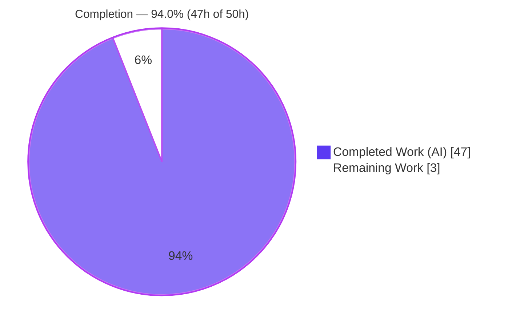
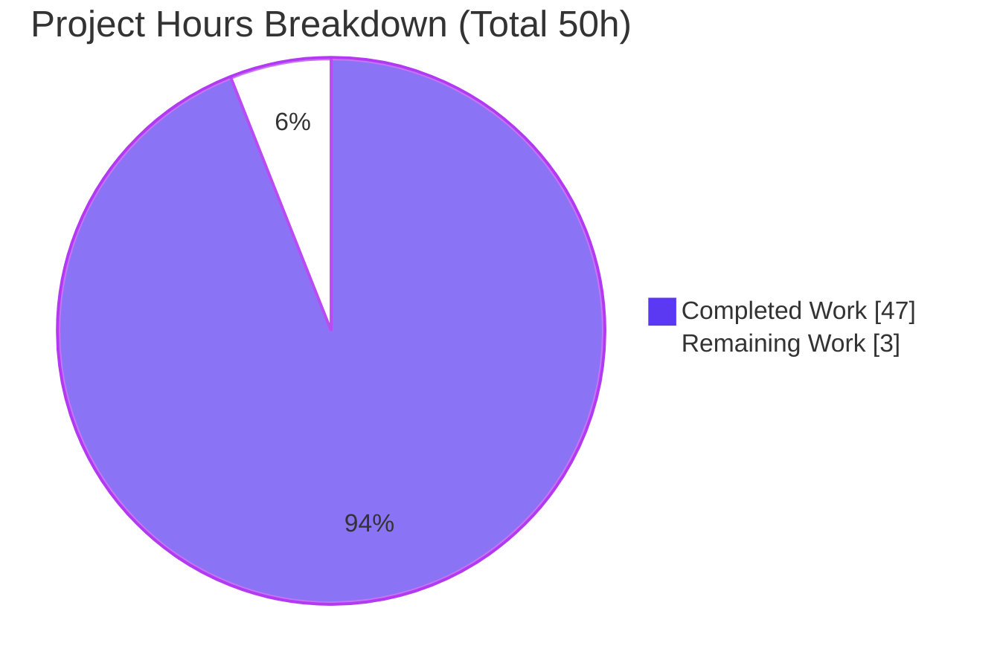

# Blitzy Project Guide — SFTPGo Concurrent-Pressure Runtime Investigation

> **Repository:** `github.com/drakkan/sftpgo` @ HEAD `44634210287cb192f2a53147eafb84a33a96826b` · **Version:** `0.9.5-dev`
> **Branch:** `blitzy-69e31819-5661-49f2-a915-788a3bb20ae7` · **Task type:** Read-only Q&A / onboarding investigation (rule set "SWE-AtlasQnA-Repo")
> **Brand legend:** <span style="color:#5B39F3">■</span> Completed / AI Work = Dark Blue `#5B39F3` · <span style="color:#FFFFFF;background:#333">■</span> Remaining = White `#FFFFFF` · Accents = `#B23AF2` · Highlight = `#A8FDD9`

---

## 1. Executive Summary

### 1.1 Project Overview

This project delivers a single, evidence-based investigation document answering — from **observed runtime behavior, not code reading alone** — how SFTPGo coordinates connection/session-limit handling, quota enforcement, the atomic-upload temporary-file lifecycle, and the periodic idle-connection checker when they run concurrently under quota and session pressure. The audience is engineers onboarding into the `drakkan/sftpgo` codebase. The work is a **read-only** investigation: SFTPGo was built and driven in its default configuration through real entry points (a `pkg/sftp` SSH client plus the REST API), evidence was captured, and all transient artifacts were removed. Exactly one file is created — the answer document — and no product source is modified. The business impact is faster, correct onboarding and documented awareness of three concurrency behaviors (session over-admission, quota overshoot, and standard-mode partial-file accounting).

### 1.2 Completion Status

The project is **94.0% complete** on an AAP-scoped, hours-based basis. All investigation deliverables are complete; the residual work is the human review/acceptance gate.



| Metric | Hours |
|---|---|
| **Total Hours** | **50** |
| **Completed Hours (AI + Manual)** | **47** |
| &nbsp;&nbsp;— AI (autonomous) | 47 |
| &nbsp;&nbsp;— Manual (human) | 0 |
| **Remaining Hours** | **3** |
| **Percent Complete** | **94.0%** |

> Formula: `Completion % = Completed / (Completed + Remaining) × 100 = 47 / (47 + 3) × 100 = 94.0%`.

### 1.3 Key Accomplishments

- ✅ **All six named sub-questions (Q1–Q6) answered** with verbatim logs, quota counter values, filesystem state, `file:line` references, and before/during/after snapshots.
- ✅ **Canonical build reproduced** — `CGO_ENABLED=1 GO111MODULE=on go build` → exit 0; banner `SFTPGo version: 0.9.5-dev` (only a benign gcc sqlite3 warning on stderr).
- ✅ **Session-limit TOCTOU** demonstrated at runtime — concurrent logins over-admit past `MaxSessions` (`sftpd/server.go:371-376` vs `:336-337`).
- ✅ **Quota race characterized** — check-at-open decoupled from commit-at-close causes overshoot (never corruption); fast-burst distribution measured over 40 users `{3:10, 4:14, 5:10, 6:6}`.
- ✅ **Atomic vs standard temp-file lifecycle contrasted** — atomic kill removes `.sftpgo-upload.<xid>.<base>` and reverses quota; standard kill leaves a phantom partial file counted in quota.
- ✅ **Idle checker** documented with canonical 5-minute ticker (observed at `m=+300`/`m=+600`) and 15-minute default; accelerations labeled non-canonical.
- ✅ **`go test -race -run TestMaxSessions`** → PASS, no DATA RACE (registries mutex-synchronized; over-admission is a logical TOCTOU, not a Go memory race).
- ✅ **Read-only guarantee held** — working tree clean; deep scan shows zero leftover artifacts; the document is the sole delta from baseline.

### 1.4 Critical Unresolved Issues

| Issue | Impact | Owner | ETA |
|---|---|---|---|
| _None blocking._ Deliverable complete, build passes, repo clean. | No release/validation blocker | — | — |

> The three product concurrency behaviors surfaced by the investigation (session over-admission, quota overshoot, standard-mode phantom file) are **findings reported by design**, not defects this read-only task is chartered to fix. Remediation is explicitly out of AAP scope and tracked in Section 6.

### 1.5 Access Issues

| System/Resource | Type of Access | Issue Description | Resolution Status | Owner |
|---|---|---|---|---|
| — | — | No access issues identified. Build toolchain (Go 1.13.15, gcc 15.2.0), Git, and module cache were all available; `go mod verify` succeeded offline. | N/A | — |

**No access issues identified.**

### 1.6 Recommended Next Steps

1. **[High]** Perform SME technical-accuracy review of the investigation document (validate the four concurrency claims and `file:line` references at HEAD `44634210`), then accept/merge.
2. **[Low]** Optionally reproduce one key scenario (e.g., quota overshoot or session over-admission) from the documented commands as a confidence-builder.
3. **[Low]** If the findings warrant follow-up product work, open separate tracking issues for the session TOCTOU and quota check/commit decoupling — **outside** this read-only task's scope.

---

## 2. Project Hours Breakdown

### 2.1 Completed Work Detail

Each item traces to an AAP requirement (investigation execution + the single deliverable). **Total = 47 hours.**

| Component | Hours | Description |
|---|---:|---|
| Code scope discovery & subsystem mapping | 5.0 | Read `sftpd`, `dataprovider`, `vfs`, `config`, `httpd`; mapped the 4 subsystems to concrete `file:line` (server/handler/transfer/sftpd, quota SQL, atomic temp naming). |
| Build & canonical run environment setup | 2.0 | CGO build, external rundirs, SQLite schema bootstrap from `sql/sqlite/*.sql`, config verification (`UploadMode:0`, `IdleTimeout:15`, `TrackQuota:2`, ports 2022/8080). |
| Observation harness development | 7.0 | Go driver using a real `pkg/sftp` client over SSH (session burst, slow/fast/kill uploads, same-path burst) + REST provisioning + DB/REST pollers. |
| Q1 — Burst scenario observation | 3.0 | 6+ runs near `MaxSessions` with concurrent uploads threatening both thresholds while the idle checker is armed; distribution table + verbatim log. |
| Q2 — Quota race observation | 5.0 | Sequential baseline + slow/fast bursts; before/during/after; fast burst re-observed at scale over 40 users; slow burst 6/6 across 3 runs. |
| Q3 — Atomic/standard temp-file lifecycle | 4.0 | Both upload modes, complete-vs-kill, 2 runs each, plus concurrent same-path atomic edge case. |
| Q4 — Burst artifacts consolidation | 1.5 | Accepted-vs-rejected counts, per-step quota deltas, surviving-temp evidence consolidated. |
| Q5 — Kill-vs-complete contrast | 2.5 | 4-scenario matrix (filesystem + quota + distinguishing log lines). |
| Q6 — Handoffs & clean-vs-contended | 2.5 | Three check-then-act handoffs identified; clean vs contended side-by-side. |
| Idle-connection checker observation | 3.0 | Canonical 5-minute ticks directly observed (`m=+300`/`m=+600`); accelerated `idle_timeout=1min` (labeled) drove a real "close idle connection" with atomic cleanup + quota reversal. |
| `-race` concurrency verification | 1.0 | `go test -race -run TestMaxSessions` in a repo copy (schema bootstrapped) → PASS, no DATA RACE. |
| Answer document authoring (437 lines) | 6.0 | Full write-up: direct answers, evidence next to each claim, `file:line`, appendices, coverage pass. |
| Iterative QA & reconciliation (4 commits) | 4.0 | Code-review findings, QA acceptance-gate, and final re-observation reconciliation (fast-burst quantifier + off-by-one line ref). |
| Cleanup & read-only verification | 0.5 | Removed binary/harness/DB (all outside repo tree); confirmed `git status` clean + deep artifact scan. |
| **Total** | **47.0** | |

### 2.2 Remaining Work Detail

Each item is a path-to-production (human acceptance) activity for the onboarding deliverable. **Total = 3 hours.**

| Category | Hours | Priority |
|---|---:|---|
| SME technical-accuracy review & acceptance of Q1–Q6 findings (validate claims + `file:line` refs, then merge) | 2.0 | High |
| Optional independent spot-reproduction of one key scenario from documented commands | 1.0 | Low |
| **Total** | **3.0** | |

---

## 3. Test Results

For a read-only investigation, "tests" are the reproducible runtime observations and quality gates executed by Blitzy's autonomous validation systems. **All entries below originate from Blitzy's autonomous validation logs for this project** (Gates 1–5) and were independently re-confirmed during this assessment.

| Test Category | Framework / Tool | Total | Passed | Failed | Coverage % | Notes |
|---|---|---:|---:|---:|---:|---|
| Build / Compilation | `go build` (CGO, Go 1.13.15) | 1 | 1 | 0 | N/A | Exit 0; banner `SFTPGo version: 0.9.5-dev`; only a benign gcc `-Wreturn-local-addr` warning inside `sqlite3-binding.c`. |
| Concurrency (data-race) | `go test -race` (ThreadSanitizer) | 1 | 1 | 0 | N/A | `TestMaxSessions` PASS; **no DATA RACE** — registries mutex-synchronized. |
| Runtime Observation — Q1 burst | `pkg/sftp` client + REST + DB | 6+ | 6+ | 0 | 100% reproducible | Session over-admission and/or quota overshoot; invariant `used_size == used_files × 60000` held every run. |
| Runtime Observation — Q2 quota race | `pkg/sftp` client + poller | 3 slow + 40 fast | all | 0 | Stable/dist. reported | Slow burst 6/6 overshoot (3 runs); fast burst distribution `{3:10,4:14,5:10,6:6}` over 40 users. |
| Runtime Observation — Q3/Q5 atomic vs standard | `pkg/sftp` client + fs/DB poll | 2 per mode | all | 0 | Stable across 2 runs | Atomic kill → temp removed + quota reversed; standard kill → partial file remains + committed. |
| Runtime Observation — Idle checker | `pkg/sftp` + timed ticks | 2 ticks | 2 | 0 | Stable across 2 ticks | Canonical 5-min ticks observed (`m=+300`/`m=+600`); accelerated close reproduced. |
| Runtime Observation — Q6 clean vs contended | `pkg/sftp` client + REST | 2 | 2 | 0 | Stable | Clean: peak conns ≤ limit, exact quota, 0 leftovers. Contended: over-admission + overshoot. |
| Documentation Integrity | markdown lint / structural checks | 1 | 1 | 0 | N/A | 437 lines; 18 balanced code blocks; contiguous §0–§12 + Appendices A/B; no placeholders/TODOs. |
| Read-Only Compliance | `git status` + deep tree scan | 1 | 1 | 0 | N/A | Working tree clean; zero leftover temp files/DBs/binaries/logs; document is sole delta. |

> **Integrity note (Rule 3):** every test above is drawn from Blitzy's own autonomous build/`-race`/observation/QA logs — not from any external or fabricated source.

---

## 4. Runtime Validation & UI Verification

This is a headless server/CLI investigation with **no UI**; runtime validation covers the server, its real entry points, and the observed behaviors.

**Server runtime**
- ✅ **Operational** — `sftpgo serve` starts with the stock config (`UploadMode:0`, `IdleTimeout:15`, `TrackQuota:2`, `ManageUsers:1`, `Driver:sqlite`), SFTP listener on `:2022`, REST on `127.0.0.1:8080`.
- ✅ **Operational** — version banner `SFTPGo version: 0.9.5-dev` reproduced from the freshly built binary.

**Real entry points (canonical)**
- ✅ **Operational** — SFTP uploads via a real `pkg/sftp` client over `x/crypto/ssh`.
- ✅ **Operational** — provisioning via `POST /api/v1/user`; live sessions via `GET /api/v1/connection`.
- ✅ **Operational** — quota reads agree across three surfaces (REST `GET /api/v1/user`, direct SQLite read, and server logs).

**Observed subsystem behaviors**
- ✅ **Operational (as designed)** — quota DB relative-increment is atomic; no lost updates; invariant `used_size == used_files × 60000` held in every run.
- ⚠ **Partial (product finding)** — session limit over-admits past `MaxSessions` under concurrent login bursts (TOCTOU).
- ⚠ **Partial (product finding)** — quota can overshoot both thresholds because check-at-open is decoupled from commit-at-close.
- ⚠ **Partial (product finding)** — standard-mode mid-stream kill leaves a partial real file that is still counted in quota.
- ✅ **Operational** — atomic-mode drop cleans the temp file and reverses quota; idle checker closes idle connections and finalizes transfers.

> Non-canonical elements used only to observe promptly (atomic `upload_mode=1`, `idle_timeout=1min`, and a `python3` observation client) are each labeled in the deliverable with the canonical value reported alongside. The `DELETE /api/v1/connection` hook was **not** relied upon for any canonical result.

---

## 5. Compliance & Quality Review

Cross-map of AAP deliverables/rules to Blitzy quality benchmarks, including fixes applied during autonomous validation.

| Compliance Item (AAP / Rule) | Benchmark | Status | Progress | Evidence / Notes |
|---|---|---|---|---|
| Q1–Q6 each answered by name | Answer every named item | ✅ Pass | 100% | §4–§9 of deliverable; coverage pass at doc line 400. |
| Investigate by running code first | Runtime-observed, not code-read | ✅ Pass | 100% | Real `pkg/sftp`+REST harness; verbatim logs/quota/fs captured. |
| Canonical default build & config | Exact commands + banner | ✅ Pass | 100% | `go build` exit 0; banner `0.9.5-dev`; stock `sftpgo.json`. |
| Both upload modes exercised | Standard (default) + atomic (labeled) | ✅ Pass | 100% | §6; standard `upload_mode=0`, atomic `upload_mode=1` labeled non-default. |
| Real entry points only | No bypassing interface as canonical | ✅ Pass | 100% | SFTP client + `POST`/`GET /api/v1`; `DELETE` hook not relied upon. |
| Before/during/after state | Transitional states captured | ✅ Pass | 100% | 25 before/during/after captures across quota + temp-file states. |
| ≥2 runs + distribution when varies | Stability confirmed | ✅ Pass | 100% | Session admission, fast-burst (40 users), slow-burst (3 runs), kill/idle (2 runs). |
| `file:line` + observed output per claim | Exact & grounded | ✅ Pass | 100% | 105 `file:line` references; evidence next to each claim. |
| Inferred statements labeled | Distinguish observed vs inferred | ✅ Pass | 100% | 6 `[inferred]` labels (e.g., goroutine wake-up, `pkg/sftp` CLOSE semantics). |
| Non-canonical elements labeled | Report canonical values | ✅ Pass | 100% | Atomic mode, `idle_timeout=1min`, `python3` client all labeled. |
| Optional `-race` check | Distinguish logical TOCTOU vs Go race | ✅ Pass | 100% | §11; `TestMaxSessions` PASS, no DATA RACE. |
| Read-only guarantee + cleanup | No source modified; tree clean | ✅ Pass | 100% | Only the deliverable added; `git status` empty; deep scan zero artifacts. |
| Deliverable at mandated path | `blitzy/documentation/<branch>.md` | ✅ Pass | 100% | `blitzy/documentation/sftpgo_44634210287c.md`, 437 lines. |

**Fixes applied during autonomous validation (across 4 commits):** code-review findings addressed; QA acceptance-gate corrections; final reconciliation replaced an unstable 6-sample fast-burst quantifier with a 40-user distribution and corrected an off-by-one line reference (`348→347`). **Outstanding compliance items: none.**

---

## 6. Risk Assessment

| Risk | Category | Severity | Probability | Mitigation | Status |
|---|---|---|---|---|---|
| Harness removed per read-only rule → independent reproduction requires rebuilding from documented commands | Technical | Low | Medium | Exact producing command included for every scenario | Accepted (by design) |
| A few claims are `[inferred]` (goroutine wake-up, `pkg/sftp` CLOSE semantics) rather than directly observed | Technical | Low | Low | All 6 inferences explicitly labeled; their effects are observed | Mitigated |
| Non-deterministic outcomes → a single rerun may not hit a specific value | Technical | Low | Medium | Distributions + ≥2 runs reported; invariant stated | Mitigated |
| Session-limit TOCTOU over-admits past `MaxSessions` (limit bypass / resource pressure) | Security (product finding) | Medium | High | Reported with evidence; remediation out of scope | Documented |
| Quota check/commit decoupling → overshoot beyond `QuotaFiles`/`QuotaSize` (storage-limit bypass) | Security (product finding) | Medium | High | Reported with before/during/after evidence; out of scope | Documented |
| Standard-mode mid-stream kill leaves phantom partial file counted in quota | Security (product finding) | Low-Medium | High | Reported with distinguishing log/fs signs; out of scope | Documented |
| Documentation drift — pinned `file:line` refs could age as code changes | Operational | Low | Medium (over time) | Commit hash `44634210` + version banner pinned in the doc | Accepted |
| Readers could mistake non-canonical accelerations for defaults | Operational | Low | Low | Every non-canonical element labeled with canonical value alongside | Mitigated |
| Read-only guarantee — accidental repo modification would violate the core constraint | Integration/Compliance | High (if violated) | Very Low | Verified `git` clean + deep artifact scan (twice) | Satisfied |
| Observation-client substitution (`python3` sqlite3/json instead of `jq`) | Integration/Compliance | Low | Low | Labeled; canonical REST surfaces used in parallel and agree | Mitigated |

---

## 7. Visual Project Status



**Remaining hours by category (Section 2.2):**

| Category | Hours | Priority |
|---|---:|---|
| SME technical-accuracy review & acceptance | 2.0 | High |
| Optional independent spot-reproduction | 1.0 | Low |
| **Total Remaining** | **3.0** | |

> **Integrity note (Rule 1):** the pie chart "Remaining Work" (3h) equals the Section 1.2 metrics-table Remaining Hours (3h) and the Section 2.2 sum (3h). "Completed Work" (47h) equals Section 2.1 and the Section 1.2 Completed Hours. Colors: Completed = `#5B39F3`, Remaining = `#FFFFFF`.

---

## 8. Summary & Recommendations

**Achievements.** The project delivers a rigorous, runtime-observed investigation answering all six named sub-questions about SFTPGo's behavior under concurrent quota and session pressure. Every behavioral claim is grounded in verbatim output and a `file:line` reference, both upload modes are exercised, the idle checker's canonical cadence is directly observed, and the `-race` result cleanly separates the logical TOCTOU from any Go memory race. The canonical build reproduces exactly, and the read-only guarantee is verifiably intact.

**Remaining gaps.** None technical. The only outstanding work is the human acceptance gate: an SME accuracy review and (optionally) an independent reproduction.

**Critical path to production.** Review → accept/merge the onboarding document. Because the deliverable is a markdown artifact, there is no build/deploy/CI path beyond merge.

**Success metrics.** All 16 AAP requirements classified **Completed**; 0 Partial; 0 Not Started. Build exit 0; `-race` PASS; `git` tree clean; 437-line document with 105 `file:line` references and full Q1–Q6 coverage.

**Production-readiness assessment.** The project is **94.0% complete** (47 of 50 AAP-scoped hours). The deliverable is production-ready pending human acceptance; the remaining 6% reflects that review gate (per policy, autonomous completion is never reported as 100%).

| Metric | Value |
|---|---|
| AAP requirements Completed / Partial / Not Started | 16 / 0 / 0 |
| Completion (AAP-scoped, hours-based) | 94.0% |
| Completed / Remaining / Total hours | 47 / 3 / 50 |
| Blocking issues | 0 |

---

## 9. Development Guide

All commands below were executed successfully in the validation environment. The build binary and any runtime database/artifacts are deliberately written **outside** the repository tree to preserve the read-only guarantee.

### 9.1 System Prerequisites

- **Go 1.13.x** — verified `go1.13.15 linux/amd64`.
- **GCC / C toolchain** — required by the SQLite driver (`github.com/mattn/go-sqlite3`); verified `gcc 15.2.0`.
- **Git** — for repository operations and status verification.
- **SQLite3 CLI** *(optional)* — for reading quota counters during reproduction.
- **~1 GB free disk** for the module cache and build outputs.

### 9.2 Environment Setup

```bash
# Go may not be on the default PATH — add it:
export PATH=$PATH:/usr/local/go/bin

# Build flags required for the canonical CGO/SQLite build:
export CGO_ENABLED=1
export GO111MODULE=on

# Verify the toolchain:
go version        # -> go version go1.13.15 linux/amd64
gcc --version     # -> gcc (Ubuntu 15.2.0-...) 15.2.0
```

### 9.3 Dependency Verification

No dependencies are added, updated, or removed (read-only task). Verify the existing modules:

```bash
cd /path/to/sftpgo
go mod verify     # -> all modules verified
```

### 9.4 Canonical Build

```bash
# Build the binary OUTSIDE the repo tree so `git status` stays clean:
mkdir -p /tmp/sftpgo-work
CGO_ENABLED=1 GO111MODULE=on go build -o /tmp/sftpgo-work/sftpgo .
# Expected: exit 0. The only stderr output is a benign gcc warning inside
# sqlite3-binding.c ("function may return address of local variable") — NOT an error.

/tmp/sftpgo-work/sftpgo --version   # -> SFTPGo version: 0.9.5-dev
```

### 9.5 Run & Verify (optional reproduction)

```bash
# Prepare an external rundir with a copy of sftpgo.json + static/ + templates/,
# and initialize sftpgo.db by applying the repo's own schema in order:
#   sql/sqlite/20190828.sql 20191112.sql 20191230.sql 20200116.sql
/tmp/sftpgo-work/sftpgo serve -c /tmp/sftpgo-work/run_std
# Startup log confirms: UploadMode:0, IdleTimeout:15, TrackQuota:2, ManageUsers:1,
# Driver:sqlite; SFTP listener on :2022; REST on 127.0.0.1:8080.

# Provision a strict-limit user (both thresholds set so quota tracking is active):
curl -s -u admin:password -H 'Content-Type: application/json' \
  -X POST http://127.0.0.1:8080/api/v1/user \
  -d '{"username":"quser","password":"pass_quser","home_dir":"/tmp/sftpgo-work/homes/quser","permissions":{"/":["*"]},"max_sessions":3,"quota_files":3,"quota_size":300000,"status":1}'

# Observe live sessions and quota:
curl -s -u admin:password http://127.0.0.1:8080/api/v1/connection
sqlite3 /tmp/sftpgo-work/run_std/sftpgo.db \
  "SELECT used_quota_size, used_quota_files FROM users WHERE username='quser';"
```

Drive uploads with a real `pkg/sftp` client over SSH (mirroring `getSftpClient` in `sftpd/sftpd_test.go:4123`) to reproduce the burst/race scenarios.

### 9.6 Review the Deliverable

```bash
DOC=blitzy/documentation/sftpgo_44634210287c.md
wc -l "$DOC"                       # -> 437
grep -E '^## (4|5|6|7|8|9)\.' "$DOC"   # lists the Q1..Q6 sections
grep -c '^```' "$DOC"              # -> 36 (even => balanced code fences)
```

### 9.7 Read-Only Verification

```bash
git status --porcelain | wc -l     # -> 0 (clean working tree)
# Deep artifact scan (all must be 0):
find . -name '.sftpgo-upload.*' -not -path './.git/*' | wc -l
find . -name '*.db' -not -path './.git/*' | wc -l
find . -name 'sftpgo' -type f -not -path './.git/*' | wc -l
find . -name '*.log' -not -path './.git/*' | wc -l
```

### 9.8 Troubleshooting

- **`go: command not found`** → add `/usr/local/go/bin` to `PATH` (Section 9.2).
- **CGO/SQLite build failure** → ensure `gcc` is installed and `CGO_ENABLED=1`.
- **gcc warning in `sqlite3-binding.c`** → this is benign; the build still exits 0.
- **Dirty `git status`** → ensure the binary, `sftpgo.db`, homes, and logs live **outside** the repo tree.
- **Idle disconnect not observed quickly** → the ticker is hard-coded to 5 minutes and the default timeout is 15 minutes, so a canonical idle close occurs at roughly 15–20 minutes; lowering `idle_timeout` accelerates it but is **non-canonical** and must be labeled.
- **`pip install` fails with "externally-managed-environment"** → the system Python is PEP 668-managed; use a venv or `--break-system-packages` (only relevant if scripting the observation client).

---

## 10. Appendices

### Appendix A — Command Reference

| Purpose | Command |
|---|---|
| Add Go to PATH | `export PATH=$PATH:/usr/local/go/bin` |
| Toolchain check | `go version` · `gcc --version` |
| Verify modules | `go mod verify` |
| Canonical build | `CGO_ENABLED=1 GO111MODULE=on go build -o /tmp/sftpgo-work/sftpgo .` |
| Version banner | `/tmp/sftpgo-work/sftpgo --version` |
| Run server | `/tmp/sftpgo-work/sftpgo serve -c /tmp/sftpgo-work/run_std` |
| `-race` test | `CGO_ENABLED=1 GO111MODULE=on go test -race -run TestMaxSessions -count=1 ./sftpd/` |
| Read quota (DB) | `sqlite3 sftpgo.db "SELECT used_quota_size,used_quota_files FROM users WHERE username='quser';"` |
| Read-only check | `git status --porcelain \| wc -l` |

### Appendix B — Port Reference

| Port | Service | Configuration | Notes |
|---|---|---|---|
| 2022 | SFTP | `sftpd.bind_port` | Canonical default |
| 8080 | REST/HTTP | `httpd.bind_port` (127.0.0.1) | Canonical default |
| 2023 / 8081 | SFTP / HTTP | atomic-mode rundir | **Non-default** (`upload_mode=1`), labeled |
| 2024 / 8082 | SFTP / HTTP | idle-accel rundir | **Non-canonical** (`idle_timeout=1min`), labeled |

### Appendix C — Key File Locations

| Path | Role |
|---|---|
| `blitzy/documentation/sftpgo_44634210287c.md` | **The deliverable** (437 lines) |
| `sftpd/server.go` | Session-limit check (`:371-376`) & check-then-register window (`:336-337`) |
| `sftpd/sftpd.go` | Registries + `RWMutex` (`:56`), 5-min ticker (`:130-133`), `CheckIdleConnections` (`:331-352`) |
| `sftpd/handler.go` | `hasSpace` quota read (`:515-534`), quota-exceed log (`:528`) |
| `sftpd/transfer.go` | `Transfer.Close` finalize + quota commit/reversal (`:121-170`, `:166-168`) |
| `vfs/osfs.go` | `GetAtomicUploadPath` temp naming `.sftpgo-upload.<xid>.<base>` (`:175-179`) |
| `dataprovider/sqlqueries.go` | Relative-increment quota UPDATE (`:43-50`) |
| `dataprovider/user.go` | `HasQuotaRestrictions` (`:258-259`) |
| `config/config.go` | Default `IdleTimeout: 15` (`:48`) |
| `sftpgo.json` | Canonical config (`upload_mode:0`, `idle_timeout:15`, ports, sqlite) |
| `utils/version.go` | `const version = "0.9.5-dev"` (`:3`) |

### Appendix D — Technology Versions

| Component | Version | Notes |
|---|---|---|
| Go | 1.13.15 (module lang 1.13) | `CGO_ENABLED=1` required |
| GCC | 15.2.0 | For SQLite CGO driver |
| `github.com/mattn/go-sqlite3` | v2.0.2+incompatible | Default data provider |
| `github.com/pkg/sftp` | v1.11.0 | Real SFTP client |
| `golang.org/x/crypto` | v0.0.0-20200109152110 | SSH transport |
| `github.com/rs/xid` | v1.2.1 | `<xid>` in atomic temp name |
| `github.com/rs/zerolog` | v1.17.2 | Structured JSON logs |
| `github.com/go-chi/chi` | v4.0.2+incompatible | REST router |
| `github.com/prometheus/client_golang` | v1.3.0 | Auxiliary metrics |

### Appendix E — Environment Variable Reference

| Variable | Value | Purpose |
|---|---|---|
| `PATH` | append `/usr/local/go/bin` | Make `go` available |
| `CGO_ENABLED` | `1` | Enable CGO for the SQLite driver |
| `GO111MODULE` | `on` | Use Go modules |

### Appendix F — Developer Tools Guide

| Tool | Use |
|---|---|
| `go build` | Canonical CGO build of the server |
| `go test -race` | Confirm in-memory registries are mutex-synchronized (no Go data race) |
| `go mod verify` | Confirm module integrity offline |
| `git status` / `git diff` | Verify read-only guarantee (single-file delta) |
| `sqlite3` | Read `used_quota_*` counters directly from `sftpgo.db` |
| `python3` (stdlib `sqlite3`/`json`) | Observation client used in place of `jq` — labeled non-canonical; agrees with REST |
| `pkg/sftp` client | Drive uploads through the real SFTP entry point |

### Appendix G — Glossary

| Term | Definition |
|---|---|
| **TOCTOU** | Time-of-check-to-time-of-use: the session check (`loginUser`) and the register (`addConnection`) are separate critical sections, so a concurrent burst can over-admit past `MaxSessions`. |
| **Quota overshoot** | Final `used_quota_*` exceeds the configured limit because each `hasSpace` reads the same baseline at open before any concurrent commit lands. |
| **Atomic upload** | `upload_mode=1`: bytes are written to a `.sftpgo-upload.<xid>.<base>` temp file, then renamed on success or removed (with quota reversed) on error. |
| **Standard upload** | `upload_mode=0` (default): bytes are written directly to the real path; a mid-stream kill leaves a partial real file that is still committed to quota. |
| **Idle checker** | A hard-coded 5-minute ticker that closes connections idle longer than `idle_timeout` (default 15 minutes) via `CheckIdleConnections`. |
| **Read-only guarantee** | The core AAP constraint: no existing repository file is modified; only the answer document is added; all transient artifacts are removed. |
| **Canonical vs non-canonical** | Canonical = default build/config as a normal user runs it; non-canonical = any acceleration/substitution (atomic mode, lowered timeout, alternate observation client), which is always labeled with the canonical value reported alongside. |