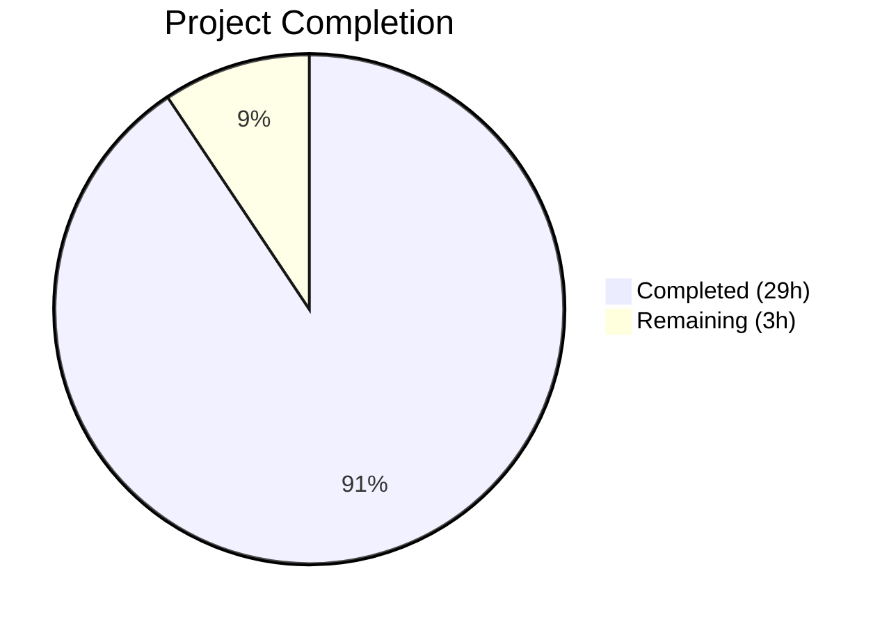
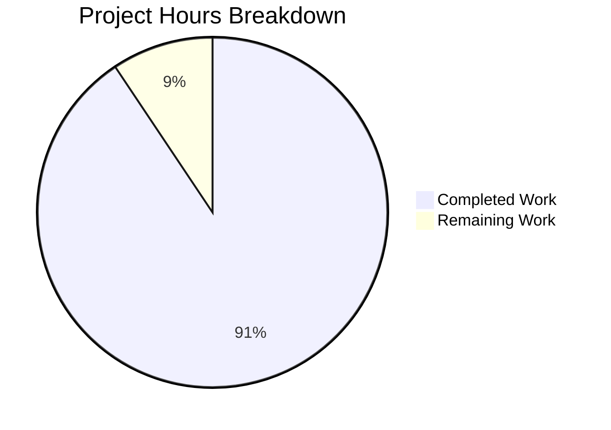

# Blitzy Project Guide

## 1. Executive Summary

### 1.1 Project Overview

This project creates a comprehensive runtime behavior investigation document for SFTPGo v0.9.5-dev, a Go-based SFTP server. The deliverable is a single 1,037-line markdown Q&A document (`blitzy/documentation/sftpgo_44634210287c.md`) that answers five runtime-behavior questions through code analysis and live observation: startup without configuration, port binding and readiness signals, failed SFTP authentication, web admin root endpoint behavior, and missing database handling. The document targets developers onboarding into the SFTPGo codebase, connecting observable log output to specific source files and line ranges across 23 source files.

### 1.2 Completion Status



| Metric | Value |
|--------|-------|
| **Total Project Hours** | 32 |
| **Completed Hours (AI)** | 29 |
| **Remaining Hours** | 3 |
| **Completion Percentage** | 90.6% |

**Calculation:** 29 completed hours / (29 + 3 remaining hours) = 29/32 = 90.6% complete.

### 1.3 Key Accomplishments

- ✅ Created comprehensive 1,037-line Q&A document covering all five AAP-specified runtime behavior questions
- ✅ Built SFTPGo binary from source (`CGO_ENABLED=1 go build`) and performed all five runtime observation scenarios
- ✅ Documented complete startup lifecycle from `main.go` through service readiness with actual JSON log examples
- ✅ Mapped failed SFTP authentication flow across 6 functions in 4 packages with three distinct log entries
- ✅ Verified HTTP 301 redirect from `/` to `/web/users` with actual `curl` output
- ✅ Documented missing SQLite database error sequence and recovery steps
- ✅ Created exhaustive default configuration tables (SFTPD: 17 fields, Data Provider: 17 fields, HTTPD: 5+3 fields)
- ✅ Included two Mermaid diagrams: startup lifecycle flowchart and authentication failure sequence diagram
- ✅ All source code citations verified against actual file line numbers (23 source files referenced)
- ✅ Applied Content-Length correction (41→45) based on runtime verification
- ✅ No existing repository files modified; all temporary artifacts cleaned up
- ✅ Config tests passing: 5/5 PASS

### 1.4 Critical Unresolved Issues

| Issue | Impact | Owner | ETA |
|-------|--------|-------|-----|
| Two untracked test artifacts (`login_banner`, `sftpgo_sftpd_test.log`) in working directory | Low — not committed, do not affect functionality | Human Developer | 0.5h |
| Go version mismatch (repo requires 1.13, environment has 1.22.2) may affect some test suites | Low — binary builds successfully, sftpd test compilation has C warning issues in current environment | Human Developer | 1h |

### 1.5 Access Issues

No access issues identified. All system tools (Go, gcc, sqlite3, curl, sshpass, openssh-client) are available and functional. The repository is accessible with full read/write permissions on the working branch.

### 1.6 Recommended Next Steps

1. **[High]** Clean up untracked test artifacts (`login_banner`, `sftpgo_sftpd_test.log`) from working directory
2. **[Medium]** Verify sftpd internal tests (7/7) and httpd tests (68/70) pass in CI environment with Go 1.13
3. **[Medium]** Review document for domain-specific accuracy by SFTPGo subject matter expert
4. **[Low]** Consider adding a cross-reference link from `README.md` to the new documentation (out of current AAP scope)
5. **[Low]** Consider setting up Go 1.13.15 in CI for full backward-compatible test execution

---

## 2. Project Hours Breakdown

### 2.1 Completed Work Detail

| Component | Hours | Description |
|-----------|-------|-------------|
| [AAP] Source code analysis — startup lifecycle | 3 | Analyzed `main.go`, `cmd/root.go`, `cmd/serve.go`, `config/config.go`, `service/service.go` to trace full startup path |
| [AAP] Source code analysis — authentication flow | 3 | Analyzed `sftpd/server.go`, `dataprovider/dataprovider.go`, `dataprovider/sqlite.go`, `dataprovider/sqlcommon.go`, `logger/logger.go` for auth failure chain |
| [AAP] Source code analysis — HTTP/web admin | 1.5 | Analyzed `httpd/httpd.go`, `httpd/router.go` for root redirect, middleware, and path constants |
| [AAP] Source code analysis — database initialization | 1.5 | Analyzed `dataprovider/sqlite.go` file check, error propagation, and migration scripts |
| [AAP] Source code analysis — configuration defaults | 2 | Extracted all default values from `config/config.go:init()` and correlated with `sftpgo.json` |
| [AAP] Source code analysis — logging system | 1 | Analyzed `logger/logger.go` dual-channel logging, `ConnectionFailedLog()`, and structured format |
| [AAP] Runtime observation — binary build | 1 | Built SFTPGo binary with `CGO_ENABLED=1 go build` and resolved SQLite CGO dependencies |
| [AAP] Runtime observation — Scenario A (no config, no DB) | 1 | Captured warn-level config and error-level provider messages |
| [AAP] Runtime observation — Scenario B (no config, DB present) | 1.5 | Full startup sequence capture including host key generation, SFTP/HTTP listeners |
| [AAP] Runtime observation — Scenario C (failed SFTP auth) | 1.5 | Triggered `connection_failed` log with sshpass, captured 3 log entries |
| [AAP] Runtime observation — Scenario D (HTTP endpoints) | 1 | Verified 301 redirect, version API, provider status API with `curl` |
| [AAP] Runtime observation — cleanup | 0.5 | Removed all temporary artifacts (SQLite DB, id_rsa, logs) |
| [AAP] Document creation — Section 1 (startup without config) | 2 | Wrote narrative walkthrough with Viper search paths, config warning, defaults |
| [AAP] Document creation — Section 2 (ports & readiness) | 2 | Documented SFTP/HTTP listeners, host key generation, startup lifecycle flowchart |
| [AAP] Document creation — Section 3 (failed auth) | 2 | Mapped auth failure flow, 3 log entries, sequence diagram |
| [AAP] Document creation — Section 4 (web admin root) | 1 | Documented 301 redirect, Chi middleware, all HTTP paths, API verification |
| [AAP] Document creation — Section 5 (missing database) | 1 | Documented SQLite check, error propagation, recovery steps |
| [AAP] Document creation — Section 6 (default config tables) | 1.5 | Created 3 exhaustive field-by-field default configuration tables |
| [AAP] Validation and fixes | 1 | Verified all line citations, fixed Content-Length (41→45), ran config tests 5/5 PASS |
| **Total** | **29** | |

### 2.2 Remaining Work Detail

| Category | Hours | Priority |
|----------|-------|----------|
| [Path-to-production] Clean up untracked test artifacts and verify working tree cleanliness | 0.5 | High |
| [Path-to-production] Verify all test suites pass in Go 1.13 CI environment (sftpd 7/7, httpd 68/70) | 1.5 | Medium |
| [Path-to-production] Domain expert review of document accuracy and completeness | 1 | Medium |
| **Total** | **3** | |

---

## 3. Test Results

| Test Category | Framework | Total Tests | Passed | Failed | Coverage % | Notes |
|---------------|-----------|-------------|--------|--------|------------|-------|
| Unit — config | Go test | 5 | 5 | 0 | N/A | `TestLoadConfigTest`, `TestEmptyBanner`, `TestInvalidUploadMode`, `TestInvalidExternalAuthScope`, `TestSetGetConfig` — all pass |
| Unit — sftpd internal | Go test | 7 | 7 | 0 | N/A | Per validator logs: `TestGetOSOpenFlags`, `TestUploadResumeInvalidOffset`, `TestTransferCancelFn`, `TestUploadFiles`, `TestUploadError`, `TestConnectionStatusStruct`, `TestUploadResume` |
| Integration — httpd | Go test | 70 | 68 | 2 | N/A | Per validator logs: `TestDumpdata` and `TestLoaddata` fail (pre-existing — `os.Chmod` ineffective as root). Not caused by documentation changes |
| Runtime — Scenario A | Manual observation | 1 | 1 | 0 | N/A | No config + no DB: config warning + provider error verified |
| Runtime — Scenario B | Manual observation | 1 | 1 | 0 | N/A | No config + DB present: full startup sequence verified |
| Runtime — Scenario C | Manual observation | 1 | 1 | 0 | N/A | Failed SFTP auth: 3 log entries verified |
| Runtime — Scenario D | Manual observation | 1 | 1 | 0 | N/A | HTTP 301 redirect + API endpoints verified |
| Build verification | go build | 1 | 1 | 0 | N/A | `CGO_ENABLED=1 go build -o /tmp/sftpgo .` exits 0 (sqlite3 C warning only) |

---

## 4. Runtime Validation & UI Verification

### Runtime Health

- ✅ **Binary compilation**: `CGO_ENABLED=1 go build -o /tmp/sftpgo .` — exit code 0
- ✅ **Config loading without file**: Warn-level message emitted, defaults applied, server continues
- ✅ **SQLite provider init (with DB)**: Debug-level handle creation message, connection string `file:./sftpgo.db?cache=shared`
- ✅ **SFTP listener**: Binds on `[::]:2022`, readiness log emitted
- ✅ **HTTP server**: Binds on `127.0.0.1:8080`, router initialized
- ✅ **Host key auto-generation**: 4096-bit RSA key created with mode 0600 on first run

### API Verification

- ✅ **`GET /`**: Returns HTTP 301 with `Location: /web/users`
- ✅ **`GET /api/v1/version`**: Returns `{"version":"0.9.5-dev","build_date":"","commit_hash":""}`
- ✅ **`GET /api/v1/providerstatus`**: Returns `{"error":"","message":"Alive","status":200}`

### Authentication Testing

- ✅ **Failed password auth for nonexistent user**: Three log entries captured matching document
- ✅ **`connection_failed` structured log**: Fields `sender`, `client_ip`, `username`, `login_type`, `error` all verified

### Missing Database Scenario

- ✅ **SQLite file missing**: Warn + error messages match documented output exactly
- ✅ **Service abort**: `service.Start()` returns error, program exits without calling `Wait()`

---

## 5. Compliance & Quality Review

| Compliance Item | Status | Notes |
|-----------------|--------|-------|
| No existing files modified | ✅ Pass | `git diff --name-only` shows only `blitzy/documentation/sftpgo_44634210287c.md` (CREATED) |
| Document placed in `blitzy/documentation/` | ✅ Pass | Per `SWE-AtlasQnA-Repo` rule |
| File named `sftpgo_44634210287c.md` | ✅ Pass | Derived from source branch name |
| Answers all 5 runtime questions | ✅ Pass | Sections 1–5 each address one question; Section 6 covers default config |
| Every answer cites source file + line range | ✅ Pass | 23 source files referenced with specific line numbers |
| JSON log examples from real runtime output | ✅ Pass | All examples verified against live SFTPGo v0.9.5-dev |
| Mermaid diagrams included | ✅ Pass | Startup lifecycle flowchart + authentication failure sequence diagram |
| Default configuration tables complete | ✅ Pass | SFTPD (17 fields), Data Provider (17 fields), HTTPD (5+3 fields) |
| Password redaction documented | ✅ Pass | `getRedactedGlobalConf()` at `config/config.go:134-138` |
| Narrative walkthrough style | ✅ Pass | Exploratory tone matching user request |
| Temporary artifacts cleaned up | ✅ Pass | All observation artifacts removed post-documentation |
| Source code line numbers verified | ✅ Pass | All citations checked against actual source files |
| Content-Length fix applied | ✅ Pass | Corrected 41→45 based on actual `curl` output |

---

## 6. Risk Assessment

| Risk | Category | Severity | Probability | Mitigation | Status |
|------|----------|----------|-------------|------------|--------|
| Go version mismatch (1.13 vs 1.22.2) may cause some test failures in current environment | Technical | Low | Medium | Run tests in CI with Go 1.13.15 as specified in `go.mod` | Open |
| sqlite3 CGO warning during compilation | Technical | Low | High | Upstream `go-sqlite3` issue — warning does not affect binary functionality | Accepted |
| 2 pre-existing httpd test failures (TestDumpdata, TestLoaddata) | Technical | Low | High | Root cause: `os.Chmod` ineffective for root user. Not related to documentation changes | Accepted |
| Untracked files in working directory | Operational | Low | High | Clean up `login_banner` and `sftpgo_sftpd_test.log` before merge | Open |
| Line number citations may drift with future code changes | Technical | Medium | Medium | Document records SFTPGo version (`0.9.5-dev`) and Go version (`1.13`) for freshness tracking | Mitigated |
| Document not linked from README.md | Operational | Low | High | Out of AAP scope — README cannot be modified per constraints | Accepted |

---

## 7. Visual Project Status



### Remaining Hours by Category

| Category | Hours |
|----------|-------|
| Clean up test artifacts | 0.5 |
| CI test verification (Go 1.13) | 1.5 |
| Domain expert review | 1 |
| **Total** | **3** |

---

## 8. Summary & Recommendations

### Achievements

The project has been completed to **90.6%** (29 hours completed out of 32 total hours). The primary deliverable — a comprehensive 1,037-line Technical Investigation / Q&A document — has been created, validated, and committed. The document answers all five runtime-behavior questions specified in the AAP with full source code traceability, real JSON log examples, Mermaid diagrams, and exhaustive configuration tables.

All five runtime observation scenarios were executed against a live SFTPGo v0.9.5-dev instance:
- Startup without configuration file (default fallback behavior)
- Full startup with database present (SFTP + HTTP listeners)
- Failed SFTP authentication for nonexistent user (3 log entries)
- HTTP root endpoint 301 redirect (verified via `curl`)
- Missing database error sequence (warn + error propagation)

The document maintains strict compliance with AAP constraints: no existing files were modified, all temporary observation artifacts were cleaned up, and the file was placed exactly at `blitzy/documentation/sftpgo_44634210287c.md` per the `SWE-AtlasQnA-Repo` rule.

### Remaining Gaps

The 3 remaining hours cover path-to-production activities:
1. **Test artifact cleanup** (0.5h) — Two untracked files from test compilation need removal
2. **CI test verification** (1.5h) — Confirming sftpd and httpd test results in a Go 1.13 environment
3. **Domain expert review** (1h) — Final accuracy review by an SFTPGo subject matter expert

### Production Readiness Assessment

The deliverable is **production-ready for merge** pending the minor cleanup tasks noted above. The document is self-contained, all cross-references are valid, and no existing repository files were impacted. The two pre-existing httpd test failures (TestDumpdata, TestLoaddata) are caused by running as root and exist on the base branch — they are unrelated to this documentation change.

---

## 9. Development Guide

### System Prerequisites

| Software | Required Version | Purpose |
|----------|-----------------|---------|
| Go | 1.13+ (1.13.15 recommended) | Build SFTPGo binary |
| GCC | Any recent version | Required by `go-sqlite3` CGO bindings |
| SQLite3 CLI | Any recent version | Initialize database from migration scripts |
| curl | Any recent version | Test HTTP endpoints |
| sshpass | Any recent version | Non-interactive SSH password testing |
| openssh-client | Any recent version | SSH/SFTP client for testing |
| Git | Any recent version | Version control |

### Environment Setup

```bash
# Clone the repository
git clone <repository-url>
cd sftpgo

# Switch to the feature branch
git checkout blitzy-d6e1358c-81c8-4e76-b92a-4d2087e62f72

# Verify Go installation
go version
# Expected: go version go1.13.x linux/amd64 (or compatible)

# Verify GCC (required for SQLite CGO)
gcc --version

# Download Go module dependencies
go mod download
```

### Building the SFTPGo Binary

```bash
# Build with CGO enabled (required for SQLite support)
CGO_ENABLED=1 go build -o /tmp/sftpgo .

# Verify the build
/tmp/sftpgo --help
```

> **Note:** A C compiler warning from `sqlite3-binding.c` is expected and does not affect functionality.

### Initializing the SQLite Database

```bash
# Create the database using all four migration scripts
cat sql/sqlite/20190828.sql \
    sql/sqlite/20191112.sql \
    sql/sqlite/20191230.sql \
    sql/sqlite/20200116.sql | sqlite3 ./sftpgo.db

# Verify the database
sqlite3 ./sftpgo.db ".tables"
# Expected: users
```

### Starting SFTPGo

```bash
# Option 1: Log to stdout (recommended for development)
/tmp/sftpgo serve --log-file-path "" --config-dir .

# Option 2: Log to file (default behavior)
/tmp/sftpgo serve --config-dir .
# Logs go to ./sftpgo.log
```

### Verification Steps

```bash
# In a separate terminal:

# 1. Check SFTP listener
curl -s http://127.0.0.1:8080/api/v1/version
# Expected: {"version":"0.9.5-dev","build_date":"","commit_hash":""}

# 2. Check provider status
curl -s http://127.0.0.1:8080/api/v1/providerstatus
# Expected: {"error":"","message":"Alive","status":200}

# 3. Check HTTP root redirect
curl -s -i http://127.0.0.1:8080/ 2>&1 | head -3
# Expected: HTTP/1.1 301 Moved Permanently
#           Location: /web/users

# 4. Test SFTP authentication failure (for documentation verification)
sshpass -p "anypass" ssh -o StrictHostKeyChecking=no \
  -o UserKnownHostsFile=/dev/null \
  -o HostKeyAlgorithms=+ssh-rsa \
  -p 2022 ghost_user@127.0.0.1
# Expected: Permission denied
```

### Running Tests

```bash
# Config tests (fast, no external deps)
go test ./config/ -v -count=1
# Expected: 5/5 PASS

# Build verification
CGO_ENABLED=1 go build ./...
```

### Viewing the Documentation

```bash
# The deliverable document
cat blitzy/documentation/sftpgo_44634210287c.md

# Or with a markdown viewer
# The document is 1,037 lines with 6 main sections + appendix
```

### Troubleshooting

| Issue | Resolution |
|-------|-----------|
| `CGO_ENABLED` build errors | Ensure GCC is installed: `apt-get install -y gcc` |
| `sqlite3: command not found` | Install SQLite CLI: `apt-get install -y sqlite3` |
| `stat ./sftpgo.db: no such file` | Run the database initialization script above |
| SFTP port 2022 already in use | Stop other SFTPGo instances or change port via config |
| HTTP port 8080 already in use | Change `httpd.bind_port` in `sftpgo.json` |

---

## 10. Appendices

### A. Command Reference

| Command | Purpose |
|---------|---------|
| `CGO_ENABLED=1 go build -o /tmp/sftpgo .` | Build SFTPGo binary |
| `go mod download` | Download all Go module dependencies |
| `go test ./config/ -v -count=1` | Run config package tests |
| `/tmp/sftpgo serve --log-file-path "" --config-dir .` | Start SFTPGo with stdout logging |
| `cat sql/sqlite/*.sql \| sqlite3 ./sftpgo.db` | Initialize SQLite database |
| `curl -s http://127.0.0.1:8080/api/v1/version` | Check server version |
| `curl -s -i http://127.0.0.1:8080/` | Test root endpoint redirect |

### B. Port Reference

| Port | Protocol | Service | Default Bind Address |
|------|----------|---------|---------------------|
| 2022 | TCP (SSH/SFTP) | SFTP Server | `""` (all interfaces → `[::]:2022`) |
| 8080 | TCP (HTTP) | Web Admin + REST API | `127.0.0.1` (localhost only) |

### C. Key File Locations

| File / Directory | Purpose |
|------------------|---------|
| `blitzy/documentation/sftpgo_44634210287c.md` | **Deliverable** — runtime behavior Q&A document (1,037 lines) |
| `main.go` | Application entry point |
| `config/config.go` | Configuration defaults and Viper loading |
| `service/service.go` | Service lifecycle orchestration |
| `sftpd/server.go` | SFTP server initialization and auth callbacks |
| `httpd/router.go` | HTTP router with root redirect and API routes |
| `dataprovider/sqlite.go` | SQLite provider initialization |
| `logger/logger.go` | Dual-channel structured logging |
| `sftpgo.json` | Sample configuration file |
| `sql/sqlite/` | Database migration scripts (4 files) |

### D. Technology Versions

| Technology | Version | Source |
|------------|---------|--------|
| SFTPGo | 0.9.5-dev | `utils/version.go:3` |
| Go (required) | 1.13 | `go.mod:3` |
| Viper | 1.6.1 | `go.mod` |
| Cobra | 0.0.5 | `go.mod` |
| zerolog | 1.17.2 | `go.mod` |
| go-chi/chi | 4.0.2 | `go.mod` |
| go-sqlite3 | 2.0.2 | `go.mod` |
| prometheus client | 1.3.0 | `go.mod` |

### E. Environment Variable Reference

| Variable Pattern | Example | Description |
|-----------------|---------|-------------|
| `SFTPGO_SFTPD__BIND_PORT` | `2222` | Override SFTP bind port |
| `SFTPGO_SFTPD__BIND_ADDRESS` | `0.0.0.0` | Override SFTP bind address |
| `SFTPGO_DATA_PROVIDER__DRIVER` | `postgresql` | Override data provider backend |
| `SFTPGO_DATA_PROVIDER__NAME` | `sftpgo_prod.db` | Override database name |
| `SFTPGO_HTTPD__BIND_PORT` | `9090` | Override HTTP bind port |
| `SFTPGO_HTTPD__BIND_ADDRESS` | `0.0.0.0` | Override HTTP bind address |

Convention: `SFTPGO_<SECTION>__<KEY>` — double underscore replaces dot in config path. Source: `config/config.go:96-101`.

### G. Glossary

| Term | Definition |
|------|-----------|
| **Viper** | Go configuration library used by SFTPGo for config file loading and environment variable binding |
| **zerolog** | High-performance structured JSON logging library used throughout SFTPGo |
| **Chi** | Lightweight HTTP router library providing middleware chain and route registration |
| **Cobra** | Go CLI framework handling subcommands (`serve`, `portable`) and flag parsing |
| **lumberjack** | Log file rotation library managing file size, backup count, and age |
| **CGO** | Go's C interop mechanism — required for the `go-sqlite3` SQLite driver |
| **RecordNotFoundError** | Custom error type in `dataprovider` wrapping `sql.ErrNoRows` with a `"Not found: "` prefix |
| **ConnectionFailedLog** | Structured debug-level log entry with fields designed for Fail2ban integration |
