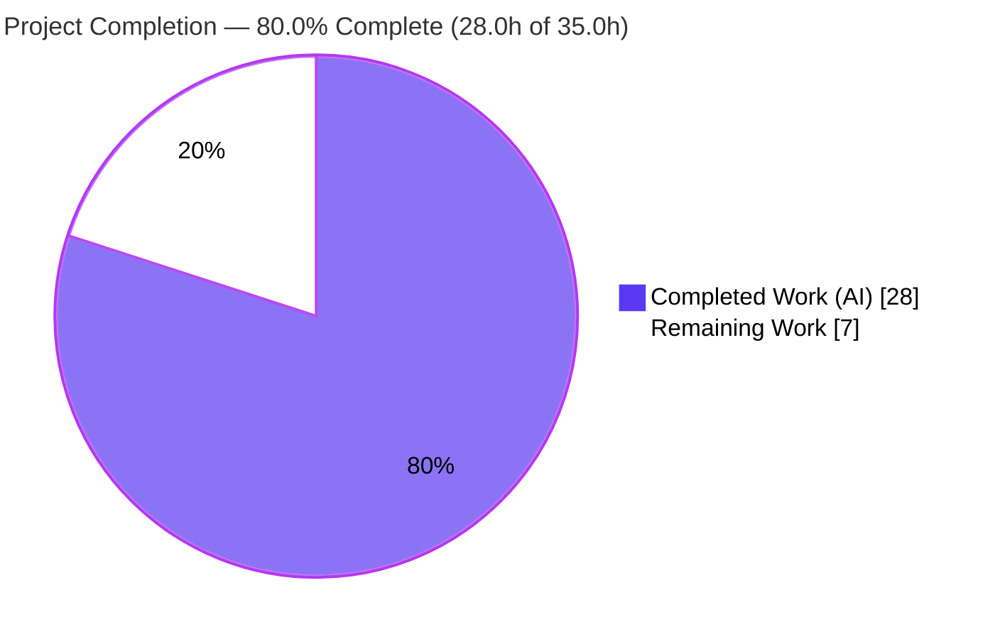
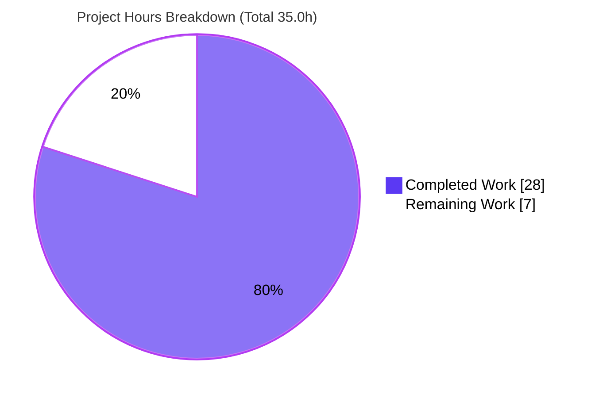
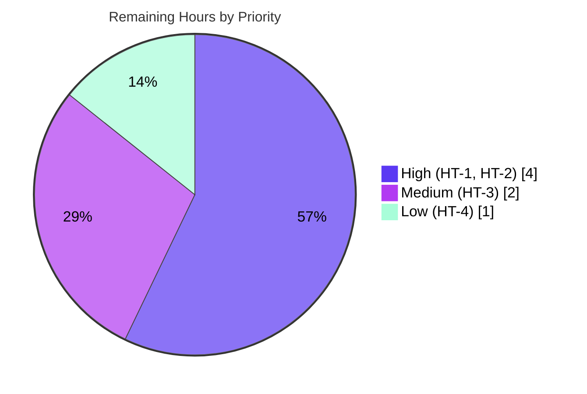

# Blitzy Project Guide — SFTPGo Command-Injection Investigation

> **Branch:** `sftpgo_44634210287c` &nbsp;•&nbsp; **HEAD:** `bf6bf339`
> **Deliverable:** `blitzy/documentation/sftpgo_44634210287c.md` (the single, additive artifact)
> **Task type:** Read-only security investigation (documentation-only)

---

## Section 1 — Executive Summary

### 1.1 Project Overview

This project is an evidence-based security investigation of the **SFTPGo** SFTP server (v0.9.5-dev, Go 1.13). An automated scanner **intermittently** flags an **OS command-injection (CWE-78)** finding, reporting "vulnerable" under some configurations and "not vulnerable" under others. The objective was to determine *empirically* — by building, running, and attempting exploitation — whether the finding is genuine or a false positive, and to record the conclusion plus forensic proof in **one** new markdown document. The audience is the security/engineering team triaging the alert and the operators running SFTPGo. Business impact: it closes a recurring, ambiguous scanner finding and attributes residual risk to its true source. Scope is strictly read-only across `sftpd/`, `dataprovider/`, and `config/`; **no source code is modified**.

### 1.2 Completion Status



| Metric | Hours |
|---|---|
| **Total Hours** | **35.0** |
| Completed Hours (AI + Manual) | 28.0 (28.0 AI autonomous + 0.0 manual) |
| Remaining Hours | 7.0 |
| **Percent Complete** | **80.0%** |

> Completion is computed using the AAP-scoped methodology: `Completed ÷ (Completed + Remaining) × 100 = 28.0 ÷ 35.0 = 80.0%`. All 20 autonomous, AAP-specified requirements are 100% delivered; the remaining 7.0h is human-only path-to-production work (review, scanner disposition, advisory).

### 1.3 Key Accomplishments

- ✅ **Verdict established and empirically proven:** the scanner's CWE-78 finding is a **FALSE POSITIVE for SFTPGo itself** — every external program is launched via Go `os/exec` with a discrete argument vector and **never** a shell.
- ✅ **Implicated component identified:** exactly **four** `os/exec` sinks (file-event hook, SSH system command, external-auth program, user-management hook) — independently confirmed by repository-wide grep.
- ✅ **Configuration dependency explained:** a Config A/B/C matrix shows the scanner verdict tracks **sink reachability** (is a hook configured?), not exploitability.
- ✅ **Exploitation attempted for real:** the server was built (Go 1.13.15 + gcc), run with debug logging, and attacked by uploading a file literally named `audit_$(date +%s).txt` across all three configurations.
- ✅ **Forensic evidence captured:** exact payload, full SFTP transcript, server `%#v` log lines, and the created filename `/tmp/audit_1782511667.txt` (with timestamp proven live).
- ✅ **Root cause attributed honestly:** the payload executes **only** when an operator-authored hook re-introduces a shell (`eval`/`sh -c`) — a defect external to SFTPGo.
- ✅ **Deliverable authored & committed:** a 337-line, 73-citation document at `blitzy/documentation/sftpgo_44634210287c.md`; repository tree left **pristine** (zero source files modified).
- ✅ **Independently re-validated:** build EXIT 0, `go vet` EXIT 0, all citations exact, all three configurations reproduced this session.

### 1.4 Critical Unresolved Issues

| Issue | Impact | Owner | ETA |
|---|---|---|---|
| Verdict not yet independently signed off | A false-positive determination should be confirmed by a second reviewer before action | Security Team / SME | 0.5 day |
| Scanner finding not yet dispositioned | The CWE-78 alert will keep re-firing until formally suppressed/annotated | Security / DevSecOps | 0.5 day |
| Operator hook-hardening guidance not yet issued | The *true* residual risk (operator scripts re-introducing a shell) remains undocumented for operators | Security / Docs | 0.5 day |

> None of these block the deliverable, which is complete and committed. They are the human path-to-production steps required to act on the finding.

### 1.5 Access Issues

| System/Resource | Type of Access | Issue Description | Resolution Status | Owner |
|---|---|---|---|---|
| Source repository | Read/Write (git) | Branch checked out, build, run, and commit all succeeded | ✅ No issue | Blitzy Agent |
| Go module cache | Read (offline) | `go mod verify` passed against the offline cache; build succeeded | ✅ No issue | Blitzy Agent |
| Build toolchain (Go 1.13.15 + gcc) | Local execution | Present and functional; CGO SQLite compiled cleanly | ✅ No issue | Blitzy Agent |

**No access issues identified.** All build, runtime, REST, and SFTP operations required by the investigation were performed successfully with local resources.

### 1.6 Recommended Next Steps

1. **[High]** Have a security engineer independently review and **sign off** the false-positive (CWE-78) verdict and the Config A/B/C evidence in `blitzy/documentation/sftpgo_44634210287c.md`. *(2.5h)*
2. **[High]** **Disposition the scanner finding** — suppress/annotate it as a confirmed false positive (baseline entry referencing the four `os/exec` sinks) and close the triage ticket. *(1.5h)*
3. **[Medium]** Author and distribute an **operator hook-hardening advisory** addressing the true root cause (never pipe hook input into `eval`/`sh -c`). *(2.0h)*
4. **[Low]** Optionally **re-run the full Go test suite as a non-root user** to confirm the 9 baseline failures are environmental, not regressions. *(1.0h)*

---

## Section 2 — Project Hours Breakdown

### 2.1 Completed Work Detail

All completed work was performed autonomously by Blitzy agents and is committed. Each component traces to an AAP requirement.

| Component | Hours | Description |
|---|---:|---|
| Environment provisioning & build | 3.5 | Stand up Go 1.13.15 + gcc; compile with CGO SQLite; resolve runtime caveats (manual SQL migrations, host-key compatibility) [AAP §0.8.1] |
| Static command-execution analysis | 4.5 | Read all four `os/exec` sinks, reachability guards, repo-wide no-shell search, and config gates across `sftpd/`, `dataprovider/`, `config/` [AAP §0.2.1] |
| `os/exec`-vs-shell micro-demonstration | 1.0 | Author/compile/run an isolated Go proof (CASE1 discrete argv vs CASE2 `/bin/sh -c`) [AAP §0.5.4] |
| Empirical exploitation (Config A/B/C) | 5.5 | Run server with debug logging; provision a user via REST; author safe/unsafe hook scripts; upload the payload-named file in all three configurations [AAP §0.5.1.1] |
| Forensic evidence capture & verification | 2.0 | Record 21-byte payload, SFTP transcripts, `%#v` log lines, and the created filename + timestamp window proof [AAP §0.1.1] |
| Deliverable authoring | 6.0 | Write the 337-line / 32 KB document with 73 inline citations across 9 source files, the config matrix, and the summary table [AAP §0.6.2] |
| Web research grounding | 1.5 | Establish Go `os/exec` semantics, CWE-78 best practice, and static-analyzer taint heuristics [AAP §0.2.2] |
| Independent validation | 3.5 | 12-phase re-verification: re-build/vet, citation audit, re-run A/B/C + micro-demo, completeness, baseline tests, cleanup verification |
| Temporary-artifact cleanup | 0.5 | Remove all ephemeral configs/keys/db/hooks/uploads/binary; verify pristine tree [AAP §0.7] |
| **Total Completed** | **28.0** | |

### 2.2 Remaining Work Detail

All remaining work is human-gated path-to-production activity; **none** is autonomous code work (source modification is forbidden by the user rule, and the build is already clean).

| Category | Hours | Priority |
|---|---:|---|
| Security-team peer review & sign-off of the false-positive verdict | 2.5 | High |
| Scanner-finding disposition (suppress/annotate CWE-78; close ticket) | 1.5 | High |
| Operator hook-hardening advisory authoring (true root cause guidance) | 2.0 | Medium |
| Optional non-root full-suite re-run (clear out-of-scope env-artifact failures) | 1.0 | Low |
| **Total Remaining** | **7.0** | |

### 2.3 Hours Reconciliation & Estimation Methodology

- **Total Project Hours** = Completed (28.0) + Remaining (7.0) = **35.0h**.
- **Completion %** = 28.0 ÷ 35.0 × 100 = **80.0%**.
- **Cross-section integrity:** Section 2.1 total (28.0) + Section 2.2 total (7.0) = Section 1.2 Total (35.0) ✓. Section 2.2 total (7.0) = Section 1.2 Remaining (7.0) = Section 7 "Remaining Work" (7.0) ✓.
- **Methodology:** hours are sized by investigation complexity (build difficulty, depth of static analysis, number of empirical configurations, documentation/citation density), not by lines of code, since the only repository change is one additive document. Estimates are conservative and rounded to 0.5h. Confidence is **High** for completed work (done, committed, independently reproduced) and **Medium** for remaining human-task hours (depend on the organization's review process).

---

## Section 3 — Test Results

All results below originate from Blitzy's autonomous build, validation, and exploitation logs for this project. For an investigation deliverable, the "tests" are the **empirical reproductions** that substantiate every documented claim, plus the directly-relevant subsystem unit tests and the compilation/static-analysis gates.

| Test Category | Framework | Total Tests | Passed | Failed | Coverage % | Notes |
|---|---|---:|---:|---:|---|---|
| Empirical exploitation reproduction (Config A/B/C) | Custom SFTP harness (server + REST + SFTP client) | 3 | 3 | 0 | 100% of AAP claims | Each config's documented forensic outcome reproduced exactly |
| Language-level micro-demo (`os/exec` vs shell) | Go program (compiled & run) | 2 | 2 | 0 | N/A | CASE1 literal; CASE2 shell-expanded — confirms the central distinction |
| Directly-relevant unit tests | Go `testing` | 3 | 3 | 0 | N/A | `config` package OK; `sftpd` internal `TestWrongActions`, `TestSupportedSSHCommands` PASS |
| Build & static analysis | `go build` (CGO), `go vet` | 2 | 2 | 0 | N/A | Build EXIT 0 (31 MB binary, v0.9.5-dev); `go vet` EXIT 0 on investigated packages |
| Full repository suite (baseline context) | Go `testing` | 193 | 184 | 9 | N/A | 9 failures are **pre-existing, out-of-scope** environment artifacts — identical to the setup baseline; **zero new failures / zero regressions** |

**Out-of-scope failure detail (9 of 193, transparently disclosed):**
- **6 run-as-root permission-bypass:** `TestDumpdata`, `TestLoaddata`, `TestOpenError`, `TestSCPPermsSubDirs`, `TestSCPPermCreateDirs`, `TestSCPPermDownload` — assert operations should fail without filesystem permissions, but the container runs as uid 0 (root), which bypasses Unix permission checks. Would pass as a non-root user.
- **3 modern-OpenSSH-scp protocol:** `TestSCPBasicHandling`, `TestSCPUploadFileOverwrite`, `TestSCPRecursive` — modern `scp` uses the SFTP subsystem instead of the legacy scp wire protocol this 0.9.5-dev build implements. Would pass with a period-appropriate scp client.

Both the failing test files and the source they exercise are **out of scope** (the only in-scope file is the markdown), so they are **documented, not fixed** — fixing them would require modifying forbidden out-of-scope files.

---

## Section 4 — Runtime Validation & UI Verification

| Area | Status | Detail |
|---|---|---|
| Build / compile | ✅ Operational | `GO111MODULE=on CGO_ENABLED=1 go build` → EXIT 0; binary self-reports `SFTPGo version: 0.9.5-dev` |
| Static analysis | ✅ Operational | `go vet ./config/ ./sftpd/ ./dataprovider/` → EXIT 0 |
| SFTP server runtime | ✅ Operational | Server starts; log: `server listener registered address: 127.0.0.1:2222`; host key auto-generated on first start |
| REST management API | ✅ Operational | `GET /api/v1/user` → **HTTP 200**; user provisioning succeeded |
| SFTP file operations | ✅ Operational | Upload of file literally named `audit_$(date +%s).txt` accepted and stored verbatim |
| Config A (default) reproduction | ✅ Operational | File stored verbatim; **no** `/tmp/audit_*.txt`; **zero** `executed command` log lines |
| Config B (reachable, safe hook) | ✅ Operational | SFTPGo logged the **literal** payload; safe hook received literal argv + env; **no** file created |
| Config C (unsafe operator hook) | ✅ Operational | `/tmp/audit_1782511667.txt` containing `CONFIRMED` created **by the operator's `eval`**, not by SFTPGo; SFTPGo's logged argument still literal |
| `os/exec` micro-demo | ✅ Operational | CASE1 (discrete argv) → literal; CASE2 (`/bin/sh -c`) → shell-expanded |
| UI verification | ⚠ Not applicable | Deliverable is a markdown document; no UI changes. SFTPGo's web admin (`templates/`, `static/`) is out of scope and was only referenced read-only to start the HTTP server |

---

## Section 5 — Compliance & Quality Review

| AAP Deliverable / Rule | Benchmark | Status | Progress | Notes |
|---|---|---|---|---|
| Determine authenticity (genuine vs false positive) | Evidence-based verdict | ✅ Pass | 100% | False positive for SFTPGo; proven across Config A/B/C |
| Identify implicated component | Enumerate exec sinks | ✅ Pass | 100% | Exactly 4 `os/exec` sinks; verified by grep |
| Explain configuration dependency | Config matrix | ✅ Pass | 100% | A/B/C matrix maps verdict to sink reachability |
| Attempt exploitation empirically | Build + run + attack | ✅ Pass | 100% | Build EXIT 0; payload uploaded in all configs |
| Capture forensic evidence | Payload/response/filename+timestamp/logs | ✅ Pass | 100% | All four evidence classes captured (S6.1–6.4) |
| Document failure honestly | Exact behavior + blocking mechanism | ✅ Pass | 100% | 4 independent blockers documented (S7) |
| Shell-vs-`os/exec` explanation | Rationale + proof | ✅ Pass | 100% | Narrative + isolated Go micro-demo (S4) |
| Root-cause attribution | Pinpoint true cause | ✅ Pass | 100% | Operator `eval` hook (S8) |
| Web research grounding | Authoritative references | ✅ Pass | 100% | `os/exec` docs, CWE-78, analyzer heuristics (S9.1) |
| Provide rationale | Reasoning included | ✅ Pass | 100% | Rationale throughout + S9 |
| Inline citations | Code-as-truth traceability | ✅ Pass | 100% | 73 citations across 9 files; spot-checked exact |
| Single doc named `<branch>.md` | Naming rule | ✅ Pass | 100% | `sftpgo_44634210287c.md` |
| Placement under `blitzy/documentation/` | Placement rule | ✅ Pass | 100% | Confirmed sole file in directory |
| Do not modify existing files | No source change | ✅ Pass | 100% | `git diff HEAD` empty |
| Do not add other code | Docs-only | ✅ Pass | 100% | Only the markdown added |
| Clean up temporary artifacts | Pristine tree | ✅ Pass | 100% | `git status --porcelain` empty |
| Independent security sign-off | Second-reviewer governance | ⬜ Pending | 0% | Human task (HT-1) |
| Scanner-finding disposition | Formal suppression/closure | ⬜ Pending | 0% | Human task (HT-2) |

**Fixes applied during autonomous validation:** none required — the committed deliverable was already accurate, complete, and internally consistent; gratuitous edits to a correct, evidence-backed document were deliberately avoided.

---

## Section 6 — Risk Assessment

| Risk | Category | Severity | Probability | Mitigation | Status |
|---|---|---|---|---|---|
| Operator-authored hook scripts that re-introduce a shell (`eval`/`sh -c`) on attacker-controlled input — the **true root cause** (Config C) | Security | High | Low–Medium | Issue operator hook-hardening advisory (HT-3); SFTPGo's own note `dataprovider/dataprovider.go:L156-157` already warns operators | Open — external to SFTPGo; documented as root cause, out of scope to fix |
| Scanner keeps re-flagging CWE-78 until formally dispositioned → alert fatigue | Security / Operational | Low | High | Disposition as false positive (HT-2) | Open — human task |
| False-positive verdict accepted without independent review (self-certification) | Security / Operational | Medium | Low | Independent SME sign-off (HT-1) | Open — human task |
| 9 pre-existing full-suite failures mistaken for regressions | Technical | Low | Low | Documented as out-of-scope env artifacts; zero new failures vs baseline; `git diff HEAD` empty; optional non-root re-run (HT-4) | Mitigated / Documented |
| Environment-sensitive reproduction (legacy Go 1.13.15; no `initprovider`; modern host-key rejection) | Technical | Low | Medium | Exact workarounds documented in deliverable S2.2 and in Section 9 below | Mitigated / Documented |
| httpd REST API binds `127.0.0.1:8080` with no auth/TLS | Operational | Low | Low (local-only) | Out of scope; noted as operator context only | Informational |
| Integration / dependency risk | Integration | None | N/A | Module graph untouched — no dependency added/updated/removed; deliverable is additive documentation | N/A — no integration changes |

---

## Section 7 — Visual Project Status

**Project hours — completed vs remaining** (Completed = Dark Blue `#5B39F3`, Remaining = White `#FFFFFF`):



**Remaining work by priority** (7.0h total):



**Remaining hours per category** (from Section 2.2):

| Category | Hours | Bar |
|---|---:|---|
| Security review & sign-off (High) | 2.5 | █████████████ |
| Scanner disposition (High) | 1.5 | ████████ |
| Operator hardening advisory (Medium) | 2.0 | ██████████ |
| Non-root test re-run (Low) | 1.0 | █████ |
| **Total** | **7.0** | |

> Integrity: pie "Remaining Work" = 7 = Section 1.2 Remaining Hours = Section 2.2 total. Priority pie (4 + 2 + 1 = 7) and the per-category table (2.5 + 1.5 + 2.0 + 1.0 = 7.0) both reconcile to 7.0h.

---

## Section 8 — Summary & Recommendations

**Achievements.** The investigation is **80.0% complete** (28.0h of 35.0h), with **all 20 autonomous, AAP-specified requirements fully delivered** and independently re-validated. The committed deliverable, `blitzy/documentation/sftpgo_44634210287c.md`, answers all six of the user's questions with empirical proof: SFTPGo's scanner-flagged **CWE-78 command injection is a false positive** because the server executes every external program through Go `os/exec` with a discrete argument vector and never invokes a shell, so `$(date +%s)` is passed literally. The verdict's intermittency is explained by **sink reachability** (whether an operator hook is configured), demonstrated through the Config A/B/C matrix.

**Remaining gaps (7.0h, all human-gated).** Independent security sign-off of the verdict (2.5h), formal scanner-finding disposition (1.5h), an operator hook-hardening advisory addressing the true root cause (2.0h), and an optional non-root test re-run (1.0h). No autonomous engineering work remains — source modification is forbidden, and the build is already clean.

**Critical path to production.** (1) Security review/sign-off → (2) scanner disposition → (3) operator advisory. Items 1 and 2 are the minimum to formally "close" the finding; item 3 mitigates the only real residual risk.

**Success metrics.** Build EXIT 0; `go vet` EXIT 0; all empirical claims reproduced across three configurations; 73 citations verified exact; repository tree pristine (zero source files modified); zero new test failures vs baseline.

**Production-readiness assessment.** The deliverable is **production-ready** as an investigative artifact: complete, accurate, internally consistent, evidence-backed, and committed. The finding itself is ready for human disposition. The most important follow-up is the operator-hardening advisory, since the only configuration in which the attack succeeds (Config C) is one where an operator's own script re-introduces the very shell SFTPGo deliberately avoids.

---

## Section 9 — Development Guide

This guide reproduces the build/run/exploit environment used in the investigation. **Every command below was executed and verified during validation.** All writable artifacts are kept under `/tmp` (outside the repository) so the source tree remains pristine.

### 9.1 System Prerequisites

- **Go 1.13.x** — the version the code is pinned to (`go 1.13` in `go.mod`). Verified: `go version go1.13.15 linux/amd64`.
- **gcc** — **required**; the default data-provider driver `github.com/mattn/go-sqlite3 v2.0.2+incompatible` is a CGO package. Verified: `gcc 15.2.0`.
- **sqlite3** CLI — to pre-initialize the schema (this old build has no `initprovider` subcommand).
- **An SFTP client** — OpenSSH `sftp` or Python `paramiko`.
- **curl** — to exercise the REST management API.

### 9.2 Build

```bash
# From the repository root
GO111MODULE=on CGO_ENABLED=1 go build -o /tmp/sftpgo_bin .
```

Expected: exit code 0; a ~31 MB binary. The only diagnostic is a benign CGO SQLite warning (`function may return address of local variable [-Wreturn-local-addr]`) — not an error. Verify:

```bash
/tmp/sftpgo_bin --version        # -> SFTPGo version: 0.9.5-dev
go vet ./config/ ./sftpd/ ./dataprovider/   # -> exit 0
```

### 9.3 Environment Setup (ephemeral, out-of-repo)

```bash
WORK=/tmp/sftpgo_run; rm -rf "$WORK"; mkdir -p "$WORK/home"
REPO=$(pwd)   # run this from the repository root

# (1) Pre-initialize the SQLite schema in filename order (no `initprovider` exists)
for f in 20190828 20191112 20191230 20200116; do
  sqlite3 "$WORK/sftpgo.db" < "$REPO/sql/sqlite/$f.sql"
done
sqlite3 "$WORK/sftpgo.db" ".tables"     # -> users

# (2) Minimal config. NOTE: templates_path/static_files_path MUST be absolute
#     (the HTTP server panics if it cannot find templates/base.html).
cat > "$WORK/sftpgo.json" <<JSON
{
  "sftpd": { "bind_port": 2022, "bind_address": "127.0.0.1" },
  "data_provider": { "driver": "sqlite", "name": "$WORK/sftpgo.db", "users_base_dir": "$WORK/home" },
  "httpd": { "bind_port": 8080, "bind_address": "127.0.0.1",
             "templates_path": "$REPO/templates", "static_files_path": "$REPO/static" }
}
JSON
```

### 9.4 Application Startup

```bash
/tmp/sftpgo_bin serve -c "$WORK" --log-file-path "$WORK/sftpgo.log" --log-verbose &
sleep 5
```

On first start the server auto-generates an `id_rsa` host key and logs:
`No host keys configured and "<dir>/id_rsa" does not exist; creating new private key for server`.

### 9.5 Verification Steps

```bash
# SFTP listener registered (check the log)
grep "server listener registered" "$WORK/sftpgo.log"   # -> address: 127.0.0.1:2022

# REST management API is up
curl -s -o /dev/null -w "HTTP %{http_code}\n" http://127.0.0.1:8080/api/v1/user   # -> HTTP 200
```

Default ports (from `sftpgo.json`): **SFTP 2022** (all interfaces by default), **HTTP/REST 8080** (bound to `127.0.0.1`).

### 9.6 Example Usage — Reproducing the Configuration Matrix

```bash
# Provision a user via REST (POST /api/v1/user), then connect an SFTP client and:
#   put <local file>  'audit_$(date +%s).txt'      # single-quote to preserve metacharacters
```

- **Config A (default):** file is stored **verbatim** as `audit_$(date +%s).txt`; **no** `/tmp/audit_*.txt`; **no** `executed command` log line.
- **Config B (reachable, safe hook):** set `sftpd.actions.command=/abs/safe_hook.sh` and `execute_on=["upload"]`; the hook (e.g., `printf '%s'`) receives the **literal** payload via argv and `SFTPGO_ACTION_PATH`; **no** file created.
- **Config C (unsafe hook):** the operator's hook runs `eval` on the input → the **operator's shell** creates `/tmp/audit_<timestamp>.txt` containing `CONFIRMED`. SFTPGo's logged argument remains literal — SFTPGo never expanded it.

### 9.7 Troubleshooting

| Symptom | Cause | Resolution |
|---|---|---|
| `panic: open .../templates/base.html: no such file or directory` | HTTP server cannot find templates/static relative to CWD | Set `httpd.templates_path` and `static_files_path` to **absolute** repo paths (or run from the repo root) |
| `ssh: unhandled key type` / client refuses host key | 2020-era `golang.org/x/crypto` emits a legacy `ssh-rsa` key | Allow `ssh-rsa` on the client (OpenSSH ≥8.8 / paramiko ≥5.0 disable it), or generate a classic-PEM ECDSA key: `ssh-keygen -m PEM -t ecdsa` |
| `no such table: users` at startup | No `initprovider` subcommand in 0.9.5-dev | Apply `sql/sqlite/*.sql` migrations in filename order (see 9.3) |
| Build fails with a CGO/C compiler error | `gcc` missing | Install a C toolchain; the SQLite driver is CGO-based |

### 9.8 Cleanup

```bash
kill %1 2>/dev/null              # stop the server you started
rm -rf /tmp/sftpgo_run /tmp/sftpgo_bin /tmp/audit_*.txt
git status --porcelain          # -> empty (repository tree pristine)
```

---

## Section 10 — Appendices

### Appendix A — Command Reference

| Purpose | Command |
|---|---|
| Build (CGO) | `GO111MODULE=on CGO_ENABLED=1 go build -o /tmp/sftpgo_bin .` |
| Version | `/tmp/sftpgo_bin --version` |
| Static analysis | `go vet ./config/ ./sftpd/ ./dataprovider/` |
| Init SQLite schema | `for f in 20190828 20191112 20191230 20200116; do sqlite3 db < sql/sqlite/$f.sql; done` |
| Run server | `/tmp/sftpgo_bin serve -c "$WORK" --log-file-path "$WORK/sftpgo.log" --log-verbose &` |
| REST health | `curl -s -o /dev/null -w "%{http_code}" http://127.0.0.1:8080/api/v1/user` |
| Enumerate exec sinks | `grep -rn "exec\.Command" --include="*.go" . \| grep -v _test.go` |
| Verify no shell | `grep -rnE "/bin/sh\|sh -c\|bash -c" --include="*.go" .` |
| Confirm pristine tree | `git status --porcelain` |

### Appendix B — Port Reference

| Port | Service | Bind Address | Source |
|---|---|---|---|
| 2022 | SFTP | `""` (all interfaces) by default | `sftpgo.json` `sftpd.bind_port` |
| 8080 | HTTP/REST management API | `127.0.0.1` (local-only) | `sftpgo.json` `httpd.bind_port`/`bind_address` |

### Appendix C — Key File Locations

| Path | Role |
|---|---|
| `blitzy/documentation/sftpgo_44634210287c.md` | **The deliverable** (sole repository change) |
| `sftpd/sftpd.go` | File-event hook sink [L421]; env vars [L423-428]; debug log [L432]; IsAbs guard [L447]; SSH whitelists [L66-70] |
| `sftpd/ssh_cmd.go` | SSH system-command sink [L324]; whitelist gate [L51]; payload parse [L423] |
| `sftpd/transfer.go` | Upload [L156] / download [L153] event triggers |
| `sftpd/handler.go` | Rename [L317] / delete [L407] event triggers |
| `sftpd/server.go` | Action wiring [L184]; `checkSSHCommands` [L396-413] |
| `dataprovider/dataprovider.go` | External-auth sink [L742]; user-mgmt hook sink [L787]; security note [L156-157] |
| `dataprovider/user.go` | Hook argv/env builders |
| `config/config.go` | Default action config [L52,L79] |
| `sftpgo.json` | Default config — all command sinks disabled |

### Appendix D — Technology Versions

| Component | Version | Source |
|---|---|---|
| Go | 1.13.15 | pinned `go 1.13` in `go.mod`; toolchain verified |
| gcc | 15.2.0 | required for CGO SQLite |
| SFTPGo | 0.9.5-dev | binary `--version` |
| `github.com/mattn/go-sqlite3` | v2.0.2+incompatible | `go.mod` (CGO) |
| `github.com/pkg/sftp` | v1.11.0 | `go.mod` |
| `golang.org/x/crypto` | v0.0.0-20200109152110 | `go.mod` |
| `github.com/spf13/viper` | v1.6.1 | `go.mod` |
| `github.com/spf13/cobra` | v0.0.5 | `go.mod` |
| `github.com/rs/zerolog` | v1.17.2 | `go.mod` |

### Appendix E — Environment Variable Reference

| Variable | Set by | Purpose |
|---|---|---|
| `GO111MODULE=on` | build | Force module-aware build |
| `CGO_ENABLED=1` | build | Enable CGO (required for SQLite driver) |
| `SFTPGO_ACTION`, `_USERNAME`, `_PATH`, `_TARGET`, `_SSH_CMD`, `_FILE_SIZE` | server → file-event hook | User-controlled data delivered to hooks as **env**, not a shell string [sftpd/sftpd.go:L423-428] |
| `SFTPGO_AUTHD_USERNAME` / `_PASSWORD` / `_PUBLIC_KEY` | server → external-auth program | Credentials via env, not argv [dataprovider/dataprovider.go:L743-746] |
| `SFTPGO_USER_*` | server → user-mgmt hook | User fields via env |

> SFTPGo's configuration also supports `SFTPGO_`-prefixed overrides with `__` as the nested separator (via spf13/viper).

### Appendix F — Developer Tools Guide

- **`git`** — change/authorship audit: `git log --author="agent@blitzy.com" --oneline`; pristine check: `git status --porcelain`; per-file diff: `git diff <base> -- <path>`.
- **`grep` / ripgrep** — sink enumeration and the no-shell search (Appendix A).
- **`go build` / `go vet` / `go test`** — compilation, static analysis, and the subsystem unit tests.
- **`sqlite3`** — schema pre-initialization and inspection (`.tables`).
- **`curl`** — REST API verification and user provisioning.
- **An SFTP client (`sftp`/paramiko)** — uploading the payload-named file to drive the file-event path.

### Appendix G — Glossary

| Term | Definition |
|---|---|
| **CWE-78** | OS Command Injection — executing attacker-influenced input as a shell command. |
| **`os/exec`** | Go standard library package that runs a named program with a discrete argument vector; it **intentionally does not invoke a shell**. |
| **Discrete argv** | Passing each argument as a separate vector element (no shell parsing) — the safe pattern SFTPGo uses at all four sinks. |
| **Sink** | A code location where an external program is launched (`exec.Command`/`exec.CommandContext`). SFTPGo has exactly four. |
| **Sink reachability** | Whether a configuration wires user-tainted data into a sink (i.e., whether a hook is configured). The scanner's verdict tracks this. |
| **Hook / action** | An operator-configured external program invoked on file or user events. |
| **Config A / B / C** | Default (no sink reachable) / reachable-but-safe hook / unsafe operator hook that re-introduces a shell. |
| **False positive** | A scanner finding that does not correspond to a real, exploitable vulnerability in the analyzed code. |