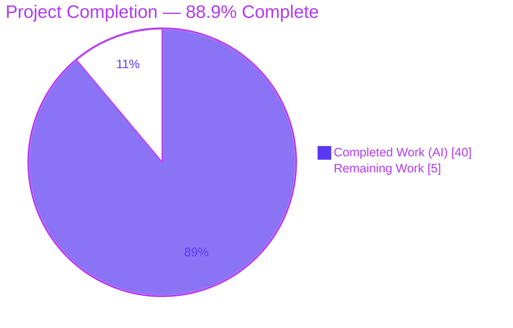
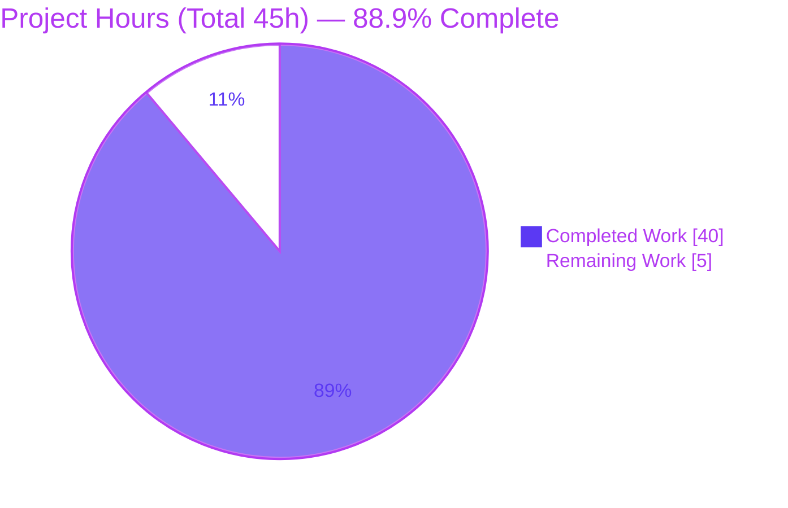
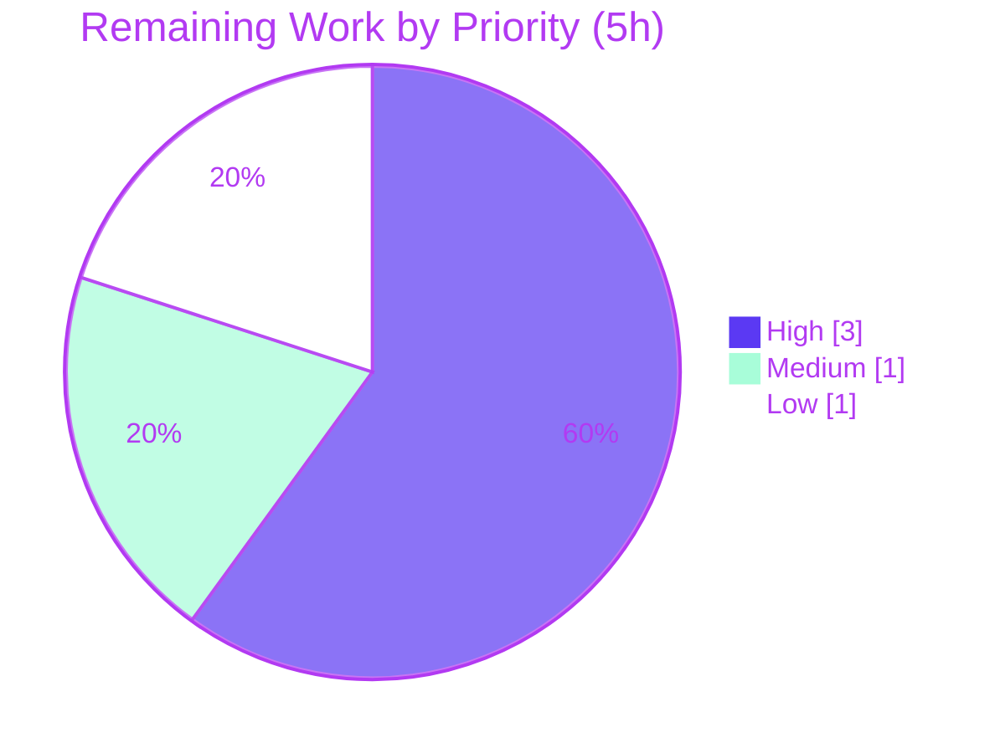

# Blitzy Project Guide — SFTPGo "Clean Start" Runtime Q&A (`sftpgo_44634210287c`)

> **Legend / Brand Colors.** Completed / AI Work = **Dark Blue `#5B39F3`** · Remaining / Not Completed = **White `#FFFFFF`** · Headings & Accents = **Violet-Black `#B23AF2`** · Highlight = **Mint `#A8FDD9`**.

---

## 1. Executive Summary

### 1.1 Project Overview

This project delivers a single, evidence-backed runtime Q&A document explaining what **SFTPGo** (`github.com/drakkan/sftpgo` @ commit `44634210287c`) actually does during a **clean start**, written for an operator preparing to run the service behind a **TLS-terminating reverse proxy**. The deliverable answers four question areas — working-directory/config discovery, the first-start failure/success matrix, proxy-header address & scheme handling, and undeniable evidence snippets — each grounded in `file:line` references and verbatim output captured by actually building and running the exact checkout. Business impact: it converts an operator's "behavior seems to shift between runs" uncertainty into reproducible, documented fact. Technical scope is deliberately narrow and **read-only**: one new markdown file is added and no existing source is modified.

### 1.2 Completion Status



| Metric | Hours |
|---|---:|
| **Total Hours** | **45** |
| Completed Hours (AI + Manual) | 40 (AI: 40 · Manual: 0) |
| Remaining Hours | 5 |
| **Percent Complete** | **88.9%** |

> **Calculation (PA1, AAP-scoped):** `Completion % = Completed ÷ (Completed + Remaining) = 40 ÷ 45 = 88.9%`. The completion percentage measures only work scoped in the Agent Action Plan (the documentation deliverable) plus standard path-to-production activities for a documentation artifact. All 12 AAP-specified requirements are completed; the remaining 5 hours are human path-to-production (review, publish, sign-off).

### 1.3 Key Accomplishments

- ✅ **Single deliverable created & committed** — `blitzy/documentation/sftpgo_44634210287c.md` (735 lines), correctly named for the source branch, in the `blitzy/documentation` directory.
- ✅ **Q1 answered with reproduction** — proved the working directory is always on the config search path (`config/config.go:L149`) while relative resources resolve against `--config-dir` (`cmd/root.go:L33`), refuting the "temp config dir isolates everything" assumption.
- ✅ **Q2 first-start matrix** — six scenarios with startup behavior, **exit status**, and HTTP responses, including the crux distinction: graceful failures exit `0` vs the missing-templates panic exit `2`.
- ✅ **Q3 proxy-header behavior** — all eight header permutations exercised; chi `RealIP` v4.0.2 leftmost-XFF selection and TLS-only scheme derivation documented (scheme stays `http` behind a TLS-terminating proxy).
- ✅ **Q4 undeniable evidence** — startup logs, per-endpoint header slices, byte-exact bodies (`404`=48B, `301`=45B), one redacted access-log line, and `/metrics` counter deltas proving header-independent, status-driven movement.
- ✅ **"Shifts between runs" reproduced** — with identical inputs across 5 runs (5/5 distinct 4096-bit host keys; identical log-sender order), not stabilized away.
- ✅ **Grounding map** — ~53 `file:line` references tied to commit `44634210287c`; independent spot-check of 8 references confirmed all accurate.
- ✅ **Read-only guarantee upheld** — `git diff 44634210287c..HEAD` shows one file added (735 insertions, 0 deletions); zero source/config/build changes; working tree clean.
- ✅ **Autonomous validation** — build reproduced (`SFTPGo 0.9.5-dev`), all scenarios re-run ≥2×, and exactly one factual inaccuracy found and corrected (§C.3 Row 5).

### 1.4 Critical Unresolved Issues

| Issue | Impact | Owner | ETA |
|---|---|---|---|
| _None — no blocking issues_ | The AAP-scoped deliverable is complete, validated, and committed; the repository is pristine. No compilation, test, or functionality blockers exist for a documentation artifact. | — | — |

> All remaining work is standard human path-to-production (review, publish, sign-off), tracked in Sections 2.2 and 8, not unresolved defects.

### 1.5 Access Issues

| System/Resource | Type of Access | Issue Description | Resolution Status | Owner |
|---|---|---|---|---|
| Source repository | Git read/write | Repository was accessible; branch checked out at the pinned commit and committed successfully. | ✅ Resolved | — |
| Build image `ghcr.io/scaleapi/swe-atlas:...` | Container/registry | Pinned Docker build image was available offline (pre-baked checkout + Go/gcc toolchain + warmed module cache). | ✅ Resolved | — |
| chi v4.0.2 vendored source | Module cache | `go-chi/chi@v4.0.2` `realip.go` available in the module cache for source-of-truth verification. | ✅ Resolved | — |

> **No access issues identified** that prevent build validation, integration, or the documentation deliverable. (The assessment container itself does not have `go` on `PATH`; this is by design — the SFTPGo build was performed in the pinned build image. It does not block the deliverable, which is a committed markdown file.)

### 1.6 Recommended Next Steps

1. **[High]** SME technical review of the Q&A evidence and claims — confirm Q1–Q4 answers and that verbatim output supports each claim (2h).
2. **[High]** Re-verify the grounding-map `file:line` references against the pinned commit `44634210287c` (1h).
3. **[Medium]** Merge the PR and publish/integrate the document into the operator runbook / knowledge base (1h).
4. **[Low]** Route to the requesting operator for stakeholder sign-off and distribution (1h).

---

## 2. Project Hours Breakdown

### 2.1 Completed Work Detail

Each completed component traces to a specific AAP requirement (R1–R12). A run-first investigation's effort is dominated by scenario setup, execution, and re-capture — not authoring alone.

| Component | Hours | Description |
|---|---:|---|
| Environment setup + canonical cgo build + baseline (Section A) | 4 | Built SFTPGo with `CGO_ENABLED=1`; reproduced banner `SFTPGo 0.9.5-dev` + go-sqlite3 cgo warning; established default ports & data-provider defaults; prepared usable SQLite DB. (R2) |
| Q1 — Working-directory & config discovery (Section B) | 5 | Three sub-scenarios (cwd-only competing config, `-c`+cwd precedence, no-config search-path enumeration), each reproduced 2×; refutation of the "temp config dir isolates everything" hypothesis. (R3) |
| Q2 — First-start matrix (Section C) | 7 | Six scenarios with state prep, `$?` exit-code capture, HTTP probes, and full panic/goroutine trace analysis; exit codes `0/0/run/0/2/run` confirmed. (R4) |
| Q3 — Proxy header address & scheme (Section D) | 6 | Eight header permutations via `curl`; access-log readback; vendored chi v4.0.2 `realip.go` source analysis; TLS-only scheme derivation. (R5) |
| Q4 — Evidence appendix (Section E) | 6 | Per-endpoint header slices; `od -c` byte-exact bodies (`404`=48B, `301`=45B); redacted access-log line; `/metrics` S0/S1/S2 scrapes + self-count arithmetic. (R6) |
| "Shifts between runs" reproduction | 2 | Five-run identical-input experiment: 5/5 distinct 4096-bit host keys, keygen-time range, identical log-sender order. (R7) |
| Grounding map + web-research corroboration | 3 | ~53 `file:line` references verified against the checkout; chi `RealIP` v4.0.2 semantics corroborated (Forwarded / X-Forwarded-Proto not consulted). (R8, R9) |
| Document assembly, structure & editorial polish | 2 | Cohesive 735-line document following the direct-answer → causal-reason → verbatim-evidence shape. (R1) |
| Autonomous validation & QA remediation | 5 | Four review cycles (6 MAJOR findings, 3 anchor links, QA issues, §C.3 Row 5 fix) + full runtime re-verification; run-first, redaction, and pristine-repo constraints upheld. (R10, R11, R12) |
| **Total Completed** | **40** | **Matches Completed Hours in Section 1.2** |

### 2.2 Remaining Work Detail

Each remaining category traces to a path-to-production need for a documentation artifact (R13–R16). No AAP deliverable work remains.

| Category | Hours | Priority |
|---|---:|---|
| SME technical review of evidence & claims accuracy (R13) | 2 | High |
| Grounding-map `file:line` re-verification vs pinned commit `44634210287c` (R14) | 1 | High |
| Documentation publication / KB integration — merge PR, link into operator runbook (R15) | 1 | Medium |
| Stakeholder sign-off & distribution (R16) | 1 | Low |
| **Total Remaining** | **5** | **Matches Remaining Hours in Section 1.2 and Section 7 pie** |

### 2.3 Hours Reconciliation

| Check | Value | Status |
|---|---|---|
| Section 2.1 Completed total | 40h | ✅ |
| Section 2.2 Remaining total | 5h | ✅ |
| Section 2.1 + Section 2.2 | 45h = Total Project Hours (Section 1.2) | ✅ |
| Section 7 pie "Remaining Work" | 5h = Section 1.2 Remaining = Section 2.2 total | ✅ |
| Completion % | 40 ÷ 45 = 88.9% | ✅ |

---

## 3. Test Results

> **Integrity note.** This is a **read-only documentation deliverable** — there is **no unit/integration test suite for a markdown file**. The rows below are the **autonomous runtime-validation scenarios** executed by Blitzy's validation systems and recorded in the validation logs for this project. "Framework/Method" reflects the observation harness used (`go build`, `sftpgo serve`, `curl`, `od -c`, `/metrics` scrape, source cross-reference). "Coverage %" denotes the fraction of AAP-required conditions exercised for that area (not code coverage).

| Test Category | Framework / Method | Total | Passed | Failed | Coverage % | Notes |
|---|---|---:|---:|---:|---:|---|
| Build & toolchain reproduction | `go build` (CGO_ENABLED=1) + version check | 1 | 1 | 0 | 100% | Banner `SFTPGo 0.9.5-dev` + go-sqlite3 `-Wreturn-local-addr` warning reproduced; build exit `0` |
| Q1 — Config-discovery scenarios | `sftpgo serve` + `curl` + filesystem probes | 3 | 3 | 0 | 100% | cwd-wins selection, `-c` precedence, no-config search-path enumeration; each reproduced 2× |
| Q2 — First-start matrix | `sftpgo serve` + `$?` capture + `curl` | 6 | 6 | 0 | 100% | Exit `0/0/run/0/2/run` confirmed; each reproduced 2× |
| Q3 — Proxy-header permutations | `curl -H` + access-log readback | 8 | 8 | 0 | 100% | leftmost / whole-value / XFF>X-Real-IP / Forwarded-ignored / scheme-stays-`http` |
| Q4 — Evidence captures | `curl -D` + `od -c` + `/metrics` scrape | 5 | 5 | 0 | 100% | header slices (301/301/200/200/404); `404`=48B, `301`=45B; metric deltas identical w/ & w/o XFF |
| "Shifts between runs" nondeterminism | 5× identical usable-DB start | 5 | 5 | 0 | 100% | 5/5 distinct 4096-bit host keys; identical log-sender order |
| Doc-claim source verification | `file:line` cross-reference vs checkout + chi v4.0.2 | 53 | 53 | 0 | 100% | **1 inaccuracy found & corrected** (commit `7c3c9b46`, §C.3 Row 5); all accurate post-fix |
| **Total** | | **81** | **81** | **0** | **100%** | All scenarios reproduced ≥2× where applicable |

**Independent assessment spot-check:** 8 grounding-map references re-verified against the live checkout (`utils/version.go:L3`, `cmd/root.go:L33`, `cmd/serve.go:L17`, `config/config.go:L147-149`, `httpd/web.go:L95-98`, `metrics/metrics.go:L220-229`, `logger/request_logger.go:L36-46`, `go.mod:L10`) — **all accurate**. Document integrity: 76 code-fence markers (balanced), 58 headings, 14 internal anchor links, 53 unique `*.go:L` references.

---

## 4. Runtime Validation & UI Verification

**Runtime health (observed against a freshly built binary):**

- ✅ **Build & launch** — binary builds with cgo and starts; banner `SFTPGo 0.9.5-dev` emitted.
- ✅ **Q1 config discovery** — cwd participates in config selection; `-c` dir owns resource resolution; search path enumerated in the warn line `[<cfgDir> /root/.config/sftpgo /etc/sftpgo <cwd>]` (de-duplicated when cwd == cfgDir).
- ✅ **Q2 matrix** — all six outcomes reproduced: SQLite missing → exit `0`; empty → `sqlite database file is invalid` → exit `0`; usable → full clean start; SFTP port taken → `address already in use` → exit `0`; templates missing → **panic → exit `2`**; static missing → runs (404 on assets).
- ✅ **Q3 proxy headers** — all eight permutations reproduced; scheme `http` in every case.
- ✅ **Q4 endpoints** — `GET /` → `301` → `/web/users`; `GET /web` → `301`; `GET /web/users` → `200`; `GET /metrics` → `200` (`text/plain; version=0.0.4`); unknown path → `404` JSON.

**UI verification (SFTPGo web interface):**

- ✅ **Operational** — `GET /web/users` returns `200 OK` (`text/html`) when `templates/` and `static/` are present.
- ⚠ **Partial (expected/documented)** — with `static/` missing, static assets return `404` while the page route still redirects/serves; with `templates/` missing, the process **panics at startup (exit 2)** — this is the documented crash path, not a regression.
- ℹ **No design/Figma verification applies** — the AAP provided no Figma frames and the deliverable is a documentation artifact, not a frontend change. No design-system compliance sub-section is applicable.

**API integration outcomes:**

- ✅ `/metrics` Prometheus exposition operational; `sftpgo_http_*` counters increment status-driven and header-independent (verified via S0/S1/S2 deltas).

---

## 5. Compliance & Quality Review

Cross-maps the AAP "SWE-AtlasQnA-Repo" rule set (§0.7) and deliverable requirements to observed status. Fixes applied during autonomous validation are noted.

| Benchmark / Rule | Requirement | Status | Progress | Notes |
|---|---|:--:|:--:|---|
| Deliverable rule (§0.7.1) | Single `<branch>.md` in `blitzy/documentation` | ✅ Pass | 100% | `sftpgo_44634210287c.md` created & committed |
| Run-first methodology (§0.7.2) | Build & run before writing; capture real output | ✅ Pass | 100% | All scenarios executed against a built binary |
| Reproducibility (§0.7.2) | Confirm stability across ≥2 runs; reproduce "shifts" | ✅ Pass | 100% | Each capture ≥2×; 5-run host-key experiment |
| Exhaustive coverage (§0.7.2/§0.7.4) | Every named condition & variant, incl. error/edge | ✅ Pass | 100% | SQLite 3 states, port-taken, templates-vs-static, 8 header permutations |
| Evidence rules (§0.7.3) | Actual, complete, unedited output + command shown | ✅ Pass | 100% | Verbatim logs, `od -c` bytes, `curl -D` headers |
| Redaction directive (§0.7.3/§0.8) | Redact only `time` + `request_id` in the access-log line | ✅ Pass | 100% | §E.4 redacts exactly those fields |
| Grounding (§0.7.4) | Every claim carries `file:line` + observed evidence | ✅ Pass | 100% | ~53 references; grounding map appendix |
| Web-search corroboration (§0.1.3) | Corroborate chi v4.0.2 semantics | ✅ Pass | 100% | §D.4 cites vendored source as primary + public docs |
| Scope rule — read-only (§0.7.5) | No existing file modified; no code added but the doc | ✅ Pass | 100% | `git diff` = 1 file added, 0 source changes |
| Cleanup (§0.7.5/§0.8) | Temporary artifacts removed; checkout pristine | ✅ Pass | 100% | Working tree clean; scratch under `/tmp` removed |
| Accuracy (§0.7.3) | No false claims | ✅ Pass (1 fixed) | 100% | §C.3 Row 5 "only volatile element" claim corrected (commit `7c3c9b46`) |
| Anchor-link integrity | Internal navigation links resolve | ✅ Pass (fixed) | 100% | 3 broken anchors fixed (commit `8e2d22fa`) |

**Outstanding compliance items:** none. All autonomous-scope compliance benchmarks pass; remaining items are human acceptance gates (Section 2.2).

---

## 6. Risk Assessment

Overall profile is **exceptionally low**: a read-only deliverable means **zero regression risk** to SFTPGo. The security items below are behaviors the document **correctly surfaces** for the operator; per AAP §0.3.2 they are explicitly **out of scope to remediate**.

| Risk | Category | Severity | Probability | Mitigation | Status |
|---|---|:--:|:--:|---|---|
| Snapshot / line-number drift — `file:line` refs tied to commit `44634210287c` become stale on a different checkout | Technical | Low | Medium | Prominent snapshot-fidelity note + branch-named filename; re-verify on other commits | Mitigated (documented) |
| Toolchain divergence — observations used Go 1.19.13 (go.mod declares min 1.13); traces show `/app` + `/usr/local/go` prefixes | Technical | Low | Low | §A.7 notes project-frame line numbers identical to pristine checkout; `go 1.13` is a minimum | Mitigated (documented) |
| Re-verification requires the pinned cgo/Docker build environment | Technical | Low | Low–Med | §A documents exact image, build command, and invocation | Mitigated |
| chi `RealIP` X-Forwarded-For spoofing — leftmost XFF trusted without validation; logged `remote_addr` is client-forgeable | Security | Medium | Medium | Operator: front with a sanitizing proxy that overwrites XFF; never use logged IP for authz | Documented (out of scope to fix) |
| TLS scheme confusion — logged scheme stays `http` even when client used `https` (`X-Forwarded-Proto` ignored) | Security | Low–Med | Medium | Operator awareness; don't rely on logged scheme for security decisions | Documented (out of scope to fix) |
| Publication / discoverability + drift — evidence won't reach the operator if not merged into the KB/runbook | Operational | Low | Medium | Publish & link (R15); snapshot note bounds drift | Open (path-to-production) |
| Markdown anchor-link integrity — broken relative anchors would degrade navigation | Integration | Low | Low | Anchors fixed (commit `8e2d22fa`) and QA-validated | Mitigated |

**No High-severity risks. No blocking risks.**

---

## 7. Visual Project Status

**Project hours breakdown** (Completed = Dark Blue `#5B39F3`, Remaining = White `#FFFFFF`):



**Remaining work by priority** (High = 3h, Medium = 1h, Low = 1h; sums to 5h):



**Remaining hours per category (Section 2.2):**

| Category | Hours | Priority |
|---|---:|:--:|
| SME technical review | 2 | High |
| Grounding-map re-verification | 1 | High |
| Publication / KB integration | 1 | Medium |
| Stakeholder sign-off & distribution | 1 | Low |
| **Total** | **5** | |

> **Integrity:** the pie chart "Remaining Work" (5) equals Section 1.2 Remaining Hours (5) and the sum of the Section 2.2 "Hours" column (5).

---

## 8. Summary & Recommendations

**Achievements.** The project is **88.9% complete** (40 of 45 hours). The AAP-scoped deliverable — a single, evidence-backed runtime Q&A document — is **fully authored, validated, and committed**. All twelve AAP-specified requirements are met: the four question areas (Q1–Q4) are answered with observed, reproduced-at-runtime evidence; the "shifts between runs" symptom is reproduced with identical inputs rather than explained away; every claim is grounded in `file:line` references; and the run-first methodology, redaction directive, and read-only constraint are all honored. Autonomous validation reproduced the build and every scenario, and corrected the single factual inaccuracy it found.

**Remaining gaps.** The remaining **5 hours** are entirely **human path-to-production** for a documentation artifact — there is no outstanding deliverable work and no blocking defect. They comprise SME technical review (2h), grounding-map re-verification against the pinned commit (1h), publication into the operator runbook/KB (1h), and stakeholder sign-off (1h).

**Critical path to production.** SME review → reference re-verification → merge & publish → sign-off. Because the change is read-only and isolated (one file added, zero source modified), the merge carries no regression risk to SFTPGo.

**Success metrics.** ✅ One correctly-named file added; ✅ zero source changes (`git diff` = 735 insertions in a single file); ✅ 81/81 autonomous validation scenarios passed; ✅ all four question areas answered with verbatim evidence; ✅ working tree clean.

**Production-readiness assessment.** **READY for human review and publication.** The deliverable meets all AAP requirements and quality benchmarks. The two security findings (chi `RealIP` spoofing, `http`-scheme-behind-TLS-proxy) are intentionally documented-not-remediated per AAP scope, and are surfaced clearly for the operator to act on in their proxy configuration.

| Metric | Value |
|---|---|
| Completion | 88.9% (40 / 45h) |
| AAP requirements completed | 12 / 12 |
| Autonomous validation scenarios passed | 81 / 81 |
| Source files modified | 0 |
| Blocking issues | 0 |

---

## 9. Development Guide

> This guide has two tracks: **(A) verifying/reviewing the deliverable** (works in any environment with `git`) and **(B) reproducing the runtime observations** (requires a Go 1.13+ toolchain with cgo). Verification/integrity commands below were tested live during assessment.

### 9.1 System Prerequisites

- **git** ≥ 2.x — to view the deliverable and confirm repository integrity.
- **A markdown viewer** — to read `blitzy/documentation/sftpgo_44634210287c.md` (any renderer, or the GitHub UI).
- **For runtime reproduction (Track B):**
  - **Go 1.13+** — `go.mod` declares `go 1.13` as the minimum; observations used **Go 1.19.13** (backward-compatible).
  - **gcc** — required because the default data provider uses `mattn/go-sqlite3`, a **cgo-only** driver (build with `CGO_ENABLED=1`).
  - **curl** — to probe HTTP endpoints and replay proxy-header permutations.
  - **python3** — the observation used Python's built-in `sqlite3` module to create a usable database (no `sqlite3` CLI required).
  - **Recommended:** the pinned build image `ghcr.io/scaleapi/swe-atlas:swe_atlas_QnA_drakkan_sftpgo_1.0` (ships the checkout pre-baked at `/app` with the toolchain and a warmed module cache) for byte-identical reproduction.

### 9.2 Environment Setup

```bash
# Track A/B — obtain the checkout at the pinned commit
git clone https://github.com/drakkan/sftpgo.git
cd sftpgo
git checkout 44634210287cb192f2a53147eafb84a33a96826b
```

> Track B alternative (exact reproduction): launch the pinned image; the checkout is pre-baked at `/app` and the Go toolchain is at `/usr/local/go`.

### 9.3 Review the Deliverable (Track A — tested)

```bash
# Confirm the deliverable exists and its size
test -f blitzy/documentation/sftpgo_44634210287c.md && wc -l blitzy/documentation/sftpgo_44634210287c.md
# Expected: 735 blitzy/documentation/sftpgo_44634210287c.md

# Confirm the repository is pristine except the single doc (vs the source commit)
git diff 44634210287cb192f2a53147eafb84a33a96826b..HEAD --name-status
# Expected: A  blitzy/documentation/sftpgo_44634210287c.md

# Confirm a clean working tree
git status --porcelain && echo "CLEAN"

# Confirm all changes are authored by the Blitzy agent
git log 44634210287cb192f2a53147eafb84a33a96826b..HEAD --format="%h %an <%ae>"

# Document integrity: code fences must be even (balanced)
grep -c '^```' blitzy/documentation/sftpgo_44634210287c.md   # expect an even number (76)

# Read the document
less blitzy/documentation/sftpgo_44634210287c.md
```

### 9.4 Reproduce the Runtime Observations (Track B)

```bash
# 1) Canonical build (writes OUTSIDE the checkout so the tree stays pristine)
cd /app   # or your checkout root
CGO_ENABLED=1 GO111MODULE=on GOFLAGS=-mod=readonly go build -o /tmp/obs/sftpgo .
echo $?   # expect 0 (a single harmless go-sqlite3 -Wreturn-local-addr warning is normal)

# 2) Confirm the canonical version banner
/tmp/obs/sftpgo --version           # expect: SFTPGo version: 0.9.5-dev

# 3) Prepare a scratch config dir and a USABLE SQLite DB (no CLI needed)
mkdir -p /tmp/obs/cfg
python3 - /tmp/obs/cfg/sftpgo.db <<'PY'
import sqlite3, sys
c = sqlite3.connect(sys.argv[1])
c.execute('CREATE TABLE "users" ("id" integer NOT NULL PRIMARY KEY AUTOINCREMENT, '
          '"username" varchar(255) NOT NULL UNIQUE, "password" varchar(255) NULL, '
          '"public_keys" text NULL, "home_dir" varchar(255) NOT NULL, "uid" integer NOT NULL, '
          '"gid" integer NOT NULL, "max_sessions" integer NOT NULL, "quota_size" bigint NOT NULL, '
          '"quota_files" integer NOT NULL, "permissions" text NOT NULL, "used_quota_size" bigint NOT NULL, '
          '"used_quota_files" integer NOT NULL, "last_quota_update" bigint NOT NULL, '
          '"upload_bandwidth" integer NOT NULL, "download_bandwidth" integer NOT NULL, '
          '"expiration_date" bigint NOT NULL, "last_login" bigint NOT NULL, "status" integer NOT NULL, '
          '"filters" TEXT NULL, "filesystem" text NULL);')
c.commit(); c.close()
PY
cp -r /app/templates /app/static /tmp/obs/cfg/   # web assets for a fully successful start

# 4) Canonical invocation (logs to stdout via -l "")
/tmp/obs/sftpgo serve -c /tmp/obs/cfg -l "" &
SFTPGO_PID=$!
sleep 2
```

### 9.5 Verification Steps & Example Usage

```bash
# HTTP endpoint responses (defaults: HTTP 127.0.0.1:8080)
curl -s -o /dev/null -w "%{http_code}\n" http://127.0.0.1:8080/            # 301
curl -s -o /dev/null -w "%{http_code}\n" http://127.0.0.1:8080/web         # 301
curl -s -o /dev/null -w "%{http_code}\n" http://127.0.0.1:8080/web/users   # 200
curl -s -o /dev/null -w "%{http_code}\n" http://127.0.0.1:8080/metrics     # 200
curl -s -o /dev/null -w "%{http_code}\n" http://127.0.0.1:8080/nope        # 404

# Byte-exact 404 body (48 bytes incl. trailing newline)
curl -s http://127.0.0.1:8080/nope | od -c

# Proxy-header behavior: leftmost X-Forwarded-For is logged; scheme stays http
curl -s -o /dev/null -H 'X-Forwarded-For: 203.0.113.7, 70.41.3.18' http://127.0.0.1:8080/probe

# /metrics counter family
curl -s http://127.0.0.1:8080/metrics | grep '^sftpgo_http_'

# Stop the server you started (use the captured PID — never pkill)
kill "$SFTPGO_PID"
```

### 9.6 Troubleshooting

- **`go: command not found`** — install Go 1.13+ or use the pinned build image; the assessment container intentionally has no `go` (the build ran in the build image).
- **Build fails with cgo/linker errors** — ensure `gcc` is installed and build with `CGO_ENABLED=1` (the default SQLite driver is cgo-only).
- **`sqlite3: command not found`** — not needed; use the Python `sqlite3` snippet in §9.4 to create the usable database.
- **`error initializing data provider: ... no such file or directory` and process exits `0`** — expected when `sftpgo.db` is missing; create/initialize the DB first (this is Q2 row 1).
- **`sqlite database file is invalid` and exit `0`** — the DB file is empty (0 bytes); recreate it with the `users` schema (Q2 row 2).
- **`bind: address already in use` and exit `0`** — port `:2022` (SFTP) or `:8080` (HTTP) is taken; free the port or change it in config (Q2 row 4).
- **Process crashes with `panic: open .../templates/base.html` and exit `2`** — the `templates/` directory is missing; copy it into the config dir (Q2 row 5 — the one non-graceful failure).
- **A stray `sftpgo.json` changes behavior** — the current working directory is always the last config search path; launch from a clean directory or verify the `config file used:` debug line (Q1).

---

## 10. Appendices

### A. Command Reference

| Command | Purpose |
|---|---|
| `CGO_ENABLED=1 GO111MODULE=on GOFLAGS=-mod=readonly go build -o /tmp/obs/sftpgo .` | Canonical default build (no `-ldflags`) |
| `sftpgo --version` | Print version banner (`SFTPGo version: 0.9.5-dev`) |
| `sftpgo serve -c <configDir> -l ""` | Canonical invocation; `-l ""` routes logs to stdout |
| `sftpgo serve --help` | Show all flags and their env-var equivalents |
| `git diff 44634210287c..HEAD --name-status` | Confirm only the doc was added |
| `git status --porcelain` | Confirm a clean working tree |
| `curl -sD - -o /dev/null <url>` | Capture HTTP response headers only |
| `curl -s <url> \| od -c` | Inspect byte-exact response body |
| `curl -s http://127.0.0.1:8080/metrics \| grep '^sftpgo_http_'` | Scrape HTTP request counters |

### B. Port Reference

| Port | Bind Address | Service | Notes |
|---|---|---|---|
| 2022 | `[::]:2022` (all interfaces) | SFTP | Default `SFTPD.BindPort` |
| 8080 | `127.0.0.1:8080` | HTTP (web UI + REST + `/metrics`) | Default `HTTPDConfig.BindPort` |
| 5432 | — | (PostgreSQL default in config dump) | Not used with the default `sqlite` driver |

### C. Key File Locations

| Path | Role |
|---|---|
| `blitzy/documentation/sftpgo_44634210287c.md` | **The deliverable** (735 lines) |
| `cmd/root.go` | `defaultConfigDir = "."`; `--version` template; `Execute()` exit path |
| `cmd/serve.go` | `serve` uses Cobra `Run:` (not `RunE:`) — explains exit `0` on graceful failure |
| `config/config.go` | Viper search path incl. cwd `"."` (L149); warn-and-continue |
| `dataprovider/sqlite.go` | SQLite missing/empty/usable handling |
| `sftpd/server.go` | `net.Listen` bind; host-key auto-generation |
| `httpd/web.go` | `template.Must(...)` → panic on missing templates (exit `2`) |
| `httpd/router.go` | Middleware chain `RequestID → RealIP → StructuredLogger → Recoverer`; routes |
| `logger/request_logger.go` | Access-log `remote_addr`; scheme from `r.TLS` only |
| `metrics/metrics.go` | `sftpgo_http_*` counters; `HTTPRequestServed` status routing |
| `go.mod` | Module directive `go 1.13`; `go-chi/chi v4.0.2+incompatible` |

### D. Technology Versions

| Component | Version | Notes |
|---|---|---|
| SFTPGo | `0.9.5-dev` | Default build banner |
| Go (module minimum) | 1.13 | Declared in `go.mod` |
| Go (observation toolchain) | 1.19.13 | Used in the pinned build image |
| gcc (observation) | 12.2.1 | For cgo SQLite driver |
| `go-chi/chi` | v4.0.2+incompatible | Router + `RealIP` middleware |
| `rs/zerolog` | v1.17.2 | Structured JSON logging |
| `spf13/viper` | v1.6.1 | Config loading + search path |
| `spf13/cobra` | v0.0.5 | CLI command handling |
| `prometheus/client_golang` | v1.3.0 | `/metrics` exposition |
| `mattn/go-sqlite3` | v2.0.2+incompatible | cgo SQLite driver (default provider) |

### E. Environment Variable Reference

| Variable | Flag Equivalent | Purpose |
|---|---|---|
| `SFTPGO_CONFIG_DIR` | `-c, --config-dir` | Config dir + base for relative resources (default `.`) |
| `SFTPGO_CONFIG_FILE` | `-f, --config-file` | Config file base name (default `sftpgo`) |
| `SFTPGO_LOG_FILE_PATH` | `-l, --log-file-path` | Log file path; empty → stdout (default `sftpgo.log`) |
| `SFTPGO_LOG_VERBOSE` | `-v, --log-verbose` | Verbose (debug) logs (default `true`) |
| `SFTPGO_LOG_MAX_SIZE` | `-s, --log-max-size` | Max log size (MB) before rotation (default `10`) |
| `SFTPGO_LOG_MAX_BACKUPS` | `-b, --log-max-backups` | Old log files to retain (default `5`) |
| `SFTPGO_LOG_MAX_AGE` | `-a, --log-max-age` | Days to retain old logs (default `28`) |
| `SFTPGO_LOG_COMPRESS` | `-z, --log-compress` | Gzip rotated logs (default off) |

> The Viper env prefix is `SFTPGO_`; env vars override file/default configuration.

### F. Developer Tools Guide

| Tool | Use in this project |
|---|---|
| `git` | Confirm pristine repo, view the single-file diff, verify agent authorship |
| `go build` (CGO) | Reproduce the canonical binary for observation |
| `curl` | Probe endpoints, capture header slices, replay proxy-header permutations |
| `od -c` / `wc -c` | Verify byte-exact response bodies (`404`=48B, `301`=45B) |
| `python3` (`sqlite3` module) | Create the usable SQLite database for Q2 row 3 |
| Prometheus `/metrics` scrape | Observe `sftpgo_http_*` counter deltas |

### G. Glossary

| Term | Meaning |
|---|---|
| **Clean start** | A first launch of `sftpgo serve` with no pre-existing runtime state |
| **AAP** | Agent Action Plan — the authoritative project scope for this deliverable |
| **cwd** | Current working directory — always the last entry on the config search path |
| **Config dir (`-c`)** | Base directory for relative resources (DB, `id_rsa`, templates/static); default `"."` |
| **XFF** | `X-Forwarded-For` HTTP header — leftmost entry is what chi `RealIP` v4.0.2 logs (when comma-space separated) |
| **Graceful failure** | A startup error that exits `0` because `serve` uses Cobra `Run:` not `RunE:` |
| **`template.Must`** | Wrapper that **panics** on parse failure → the only first-start path that exits `2` |
| **Grounding map** | The appendix mapping each claim to a `file:line` reference at the pinned commit |
| **Read-only deliverable** | The repository is unchanged except the one added documentation file |

---

*This project guide follows the mandatory 10-section Blitzy Project Guide Template. Cross-section integrity validated: Section 1.2 Remaining (5h) = Section 2.2 total (5h) = Section 7 pie "Remaining Work" (5h); Section 2.1 (40h) + Section 2.2 (5h) = Total (45h); completion 40 ÷ 45 = 88.9% used consistently throughout; all Section 3 results originate from Blitzy's autonomous validation logs; Completed = `#5B39F3`, Remaining = `#FFFFFF`.*