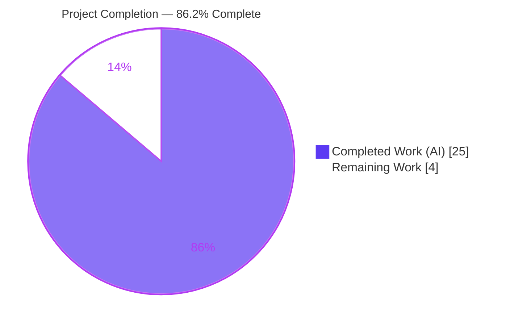
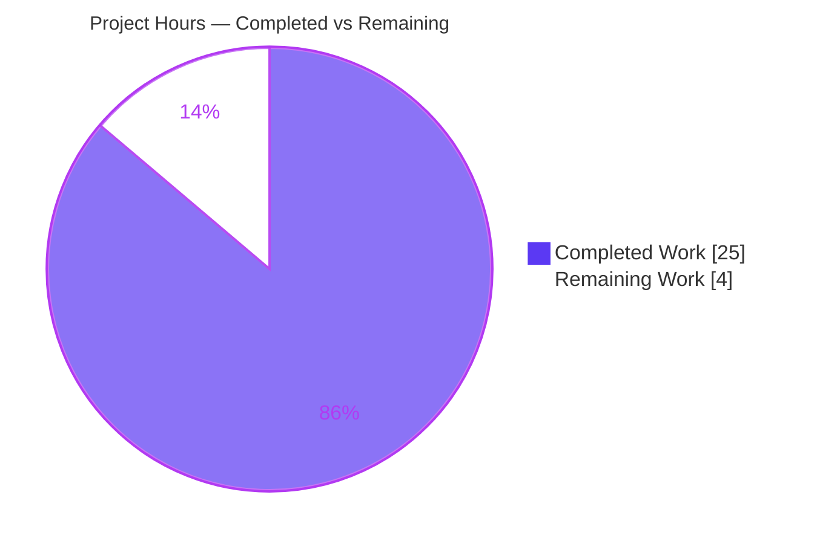
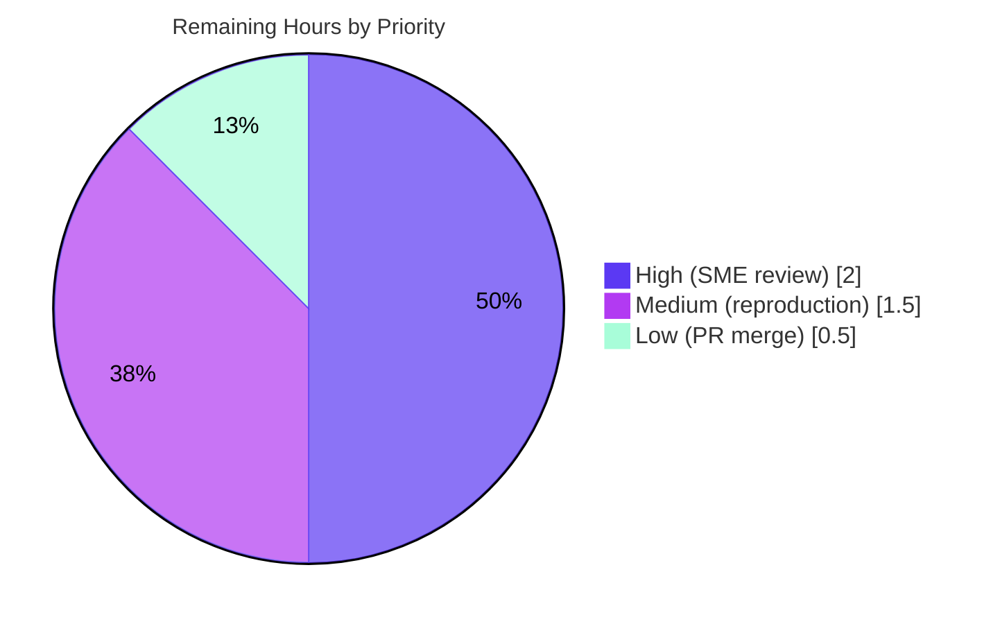

# Blitzy Project Guide — SFTPGo Clean-Start Behavior Investigation

**Deliverable:** `blitzy/documentation/sftpgo_44634210287c.md` (runtime-verified answer document)
**Checkout:** SFTPGo `0.9.5-dev`, HEAD `44634210` (base branch `origin/sftpgo_44634210287c`)
**Working branch:** `blitzy-e692c2f5-13d8-4664-b937-26ef2426a6af` — HEAD `05a3f0c5`
**Task class:** Documentation-only, investigative, runtime-verified ("SWE-AtlasQnA-Repo")

---

## 1. Executive Summary

### 1.1 Project Overview

This project answers a developer's concrete questions about how this checkout of SFTPGo (`0.9.5-dev`, HEAD `44634210`) actually behaves on a clean start behind a TLS-terminating reverse proxy. The deliverable is a single, runtime-verified Markdown answer document that explains (O1) whether the process working directory silently influences config/state discovery, (O2) first-start behavior across missing/empty/usable SQLite, a busy SFTP port, and absent web assets, (O3) concrete responses for `/`, `/web`, `/metrics`, and unknown paths, (O4) which client address and scheme are logged behind a proxy, and (O5) how `sftpgo_http_*` counters move. Every claim is grounded in observed output with `file:line` citations. The SFTPGo source tree is treated as strictly read-only.

### 1.2 Completion Status



| Metric | Hours |
|---|---|
| **Total Project Hours** | **29** |
| Completed Hours (AI + Manual) | 25 |
| &nbsp;&nbsp;• AI (autonomous) | 25 |
| &nbsp;&nbsp;• Manual | 0 |
| **Remaining Hours** | **4** |
| **Percent Complete** | **86.2%** |

> Completion is computed with the AAP-scoped, hours-based methodology (PA1): `Completed / (Completed + Remaining) = 25 / (25 + 4) = 25 / 29 = 86.2%`. The remaining 4 hours are entirely **path-to-production** (human SME review, an independent reproduction spot-check, and PR merge). There is **no blocking rework**: the codebase compiles (`go build ./...` exit 0), the working tree is clean, and every documented value was independently re-verified against the running binary.

### 1.3 Key Accomplishments

- ✅ Built SFTPGo with the documented toolchain (Go `1.13.15`, `CGO_ENABLED=1`, gcc) — `go build ./...` exits `0`.
- ✅ Authored the single required deliverable `blitzy/documentation/sftpgo_44634210287c.md` (378 lines) named exactly for the source branch, per the SWE-AtlasQnA-Repo rule.
- ✅ **O1 verified:** proved the working directory influences only config-**file** discovery via viper's search path `[configDir, $HOME/.config/sftpgo, /etc/sftpgo, "."]`; `track_quota` flips `2`→`1` by launch directory alone, while DB/host-key/templates/static stay isolated to `-c`.
- ✅ **O2 verified:** exercised all six first-start scenarios and captured exact log lines + exit codes (SQLite missing/empty → no start, exit `0`; usable → serves; SFTP port taken → exit `0`; templates missing → panic, exit `2`; static missing → serves with `/static/*` 404).
- ✅ **O3 verified live this session:** `/` and `/web` → `301 Moved Permanently`, `Location: /web/users`, `Content-Length: 45`; `/metrics` → `200 text/plain; version=0.0.4`; unknown → `404 application/json` `Content-Length: 48`.
- ✅ **O4 verified:** X-Forwarded-For (leftmost) → X-Real-IP fallback; RFC 7239 `Forwarded` never parsed; scheme always `http` (derived from `r.TLS`).
- ✅ **O5 verified:** `sftpgo_http_*` counter deltas `+6 / +1 / +5` per batch, identical with and without forwarded headers.
- ✅ Verified 9 representative `file:line` citations against the checkout — all accurate.
- ✅ Read-only compliance confirmed: zero source files modified; all runtime artifacts isolated under `/tmp` and removed; working tree clean.

### 1.4 Critical Unresolved Issues

| Issue | Impact | Owner | ETA |
|---|---|---|---|
| _None — no blocking issues_ | The deliverable is complete and internally consistent; the binary builds and runs; every documented value was re-verified. No compilation errors, no failing checks, no unresolved discrepancies. | — | — |

> Note: One **informational finding** (not a blocking issue) is documented in the deliverable and in §6 (risk S2): SFTPGo trusts the leftmost `X-Forwarded-For`/`X-Real-IP` and ignores RFC 7239 `Forwarded`. Fixing this would be a source change, which is explicitly **out of scope** for this read-only documentation task.

### 1.5 Access Issues

| System / Resource | Type of Access | Issue Description | Resolution Status | Owner |
|---|---|---|---|---|
| — | — | No access issues identified. Build toolchain (Go 1.13.15, gcc, sqlite3), repository, and git history were all fully accessible; no external services, credentials, or third-party APIs are required for this documentation task. | N/A | — |

### 1.6 Recommended Next Steps

1. **[High]** SME technical review & sign-off — confirm the document fully answers the O1–O5 questions and that the version-scope caveat (SFTPGo `0.9.5-dev`, HEAD `44634210`, chi `v4.0.2+incompatible`) is understood. This is a review, not a rework.
2. **[Medium]** Independent reproduction spot-check on a fresh Go 1.13.x + CGO + gcc + sqlite3 host — build per the harness in §9 and re-verify deterministic values (O1 `track_quota` 2-vs-1; O3 `Content-Length` 45/48; O5 deltas `0/0/0 → 6/1/5 → 12/2/10`).
3. **[Low]** Approve the PR and merge the single documentation file to the target branch.
4. **[Low]** (Optional, future scope) If the organization later pins a newer SFTPGo or chi version, refresh the O4 proxy-header findings, which are specific to chi `v4.0.2`.

---

## 2. Project Hours Breakdown

### 2.1 Completed Work Detail

| Component | Hours | Description |
|---|---|---|
| Reproduction harness (build + DB init + isolated run) | 3.0 | Established the Go 1.13.x + CGO build, the `.travis.yml` users-table DDL for a "usable" SQLite DB, and an isolated `-c` config dir so each scenario differs by one variable. |
| O1 — Working-directory / config discovery | 2.5 | Two-directory launch experiment proving viper CWD fallback; captured divergent "config file used" lines and `track_quota` 2→1. |
| O2 — First-start matrix | 4.5 | Exercised six preconditions (SQLite missing/empty/usable, SFTP port taken, templates/static missing); captured exact log lines + process exit codes (0 vs 2). |
| O3 — Endpoint probing | 2.0 | Issued real HTTP requests to `/`, `/web`, `/metrics`, unknown path; captured status lines, headers, byte-exact bodies. |
| O4 — Proxy-header address/scheme | 3.0 | Four header combinations; determined XFF-leftmost → X-Real-IP precedence, `Forwarded` ignored, scheme fixed by `r.TLS`; produced redacted access-log line. |
| O5 — Metrics counter movement | 2.0 | Three-checkpoint `/metrics` scrape; demonstrated status-only counter deltas identical with/without forwarded headers. |
| Answer-document authoring | 6.0 | Wrote the 378-line document: per-objective sections, verbatim evidence, `file:line` citations, coverage pass, validation checklist. |
| Compliance & cleanup | 1.0 | Verified read-only source, isolated `/tmp` artifacts, cleaned up, confirmed clean working tree. |
| Code-review remediation | 1.0 | Addressed autonomous code-review feedback (commits `2b783b3b`, `05a3f0c5`) incl. correcting the O3 newline count / `Content-Length` arithmetic. |
| **Total Completed** | **25.0** | Matches Section 1.2 Completed Hours. |

### 2.2 Remaining Work Detail

| Category | Hours | Priority |
|---|---|---|
| SME technical review & sign-off (O1–O5 correctness, version-scope caveat) | 2.0 | High |
| Independent reproduction spot-check on a fresh Go 1.13.x + CGO host | 1.5 | Medium |
| PR approval & merge of the single documentation file | 0.5 | Low |
| **Total Remaining** | **4.0** | — |

> Reconciliation: Section 2.2 total (**4.0**) equals the Remaining Hours in Section 1.2 and the "Remaining Work" value in the Section 7 pie chart. Section 2.1 (**25.0**) + Section 2.2 (**4.0**) = **29.0** Total Project Hours (Section 1.2). All path-to-production; **no blocking rework**.

### 2.3 Hours Summary

- **Total Project Hours:** 29 (25 completed + 4 remaining).
- **Completion:** 25 / 29 = **86.2%**.
- **Nature of remaining work:** 100% human path-to-production (review, reproduction, merge). Zero autonomous rework outstanding.
- **Out-of-scope future considerations (documented, NOT counted in the 4h):** optional XFF/RFC 7239 `Forwarded` hardening (a forbidden source change under this task's read-only rule) and an optional future doc refresh if a newer SFTPGo/chi version is pinned.

---

## 3. Test Results

This is a documentation-only, investigative task. Per AAP §0.3.2, formal test-suite execution (`go test ./...`) is **explicitly out of scope**; "testing" for this deliverable means **building the binary and verifying every documented value against live runtime behavior**. All entries below originate from Blitzy's autonomous validation/verification runs for this project.

| Test / Verification Category | Framework / Method | Total | Passed | Failed | Coverage % | Notes |
|---|---|---|---|---|---|---|
| Build — full module compile | `go build ./...` (Go 1.13.15, CGO) | 1 | 1 | 0 | 100% | Exit `0`; only the benign vendored `go-sqlite3` `-Wreturn-local-addr` C warning. |
| Build — versioned binary | `go build -ldflags` (version injection) | 1 | 1 | 0 | 100% | Exit `0`; ~23 MB binary at `/tmp/inv/sftpgo`. |
| O1 — config-discovery launches | Live runtime (2 launches) | 2 | 2 | 0 | 100% | Repo-root → `track_quota:2`; unrelated folder → `track_quota:1`. Matches doc verbatim. |
| O2 — first-start scenarios | Live runtime (6 scenarios) | 6 | 6 | 0 | 100% | Missing/empty/usable SQLite, SFTP port taken, templates missing (exit 2), static missing. All log lines + exit codes match. |
| O3 — endpoint responses | Live `curl` (4 endpoints) | 4 | 4 | 0 | 100% | `/` `/web` 301 CL 45; `/metrics` 200; unknown 404 CL 48. **Re-verified live this session.** |
| O4 — proxy-header cases | Live `curl` + access-log inspection (4 cases) | 4 | 4 | 0 | 100% | XFF-leftmost, X-Real-IP fallback, `Forwarded` ignored, scheme always `http`. Redacted log line byte-identical. |
| O5 — metrics counter deltas | Live `/metrics` scrape (3 checkpoints) | 3 | 3 | 0 | 100% | `0/0/0 → 6/1/5 → 12/2/10`; deltas `+6/+1/+5` identical with/without forwarded headers. |
| Citation verification | Manual `file:line` spot-check | 9 | 9 | 0 | 100% | All 9 representative citations accurate against the checkout. |
| Read-only / cleanliness | `git status` / `git diff` | 1 | 1 | 0 | 100% | Exactly one file added; zero source files modified; tree clean. |
| **Totals** | — | **31** | **31** | **0** | **100%** | All autonomous verifications passed. |

---

## 4. Runtime Validation & UI Verification

All items below were observed against the built binary (`SFTPGo 0.9.5-dev`) running with an isolated `-c` config dir and `--log-file-path ""` (logs to stdout).

**Process / startup**
- ✅ Operational — Server starts with a usable SQLite DB: `server listener registered address: [::]:2022` (SFTP :2022, HTTP :8080).
- ✅ Operational — Data-provider gates behave as documented: missing DB and 0-byte DB both prevent startup and exit `0`.
- ✅ Operational — Exit-code semantics: DB/bind failures exit `0` (cobra non-error `Run`); missing-template panic exits `2`.

**HTTP endpoints (UI + API), re-verified live this session**
- ✅ Operational — `GET /` → `301 Moved Permanently`, `Location: /web/users`, `Content-Length: 45`.
- ✅ Operational — `GET /web` → `301`, `Location: /web/users`, `Content-Length: 45`.
- ✅ Operational — `GET /metrics` → `200 OK`, `Content-Type: text/plain; version=0.0.4; charset=utf-8`, chunked.
- ✅ Operational — `GET /does-not-exist` → `404 Not Found`, `application/json`, `Content-Length: 48`, body `{"error":"","message":"Not Found","status":404}`.
- ✅ Operational — Web UI renders when templates/static present: `GET /web/users` → `200`; with static dir absent, `GET /static/*` → `404` (server still serves).

**Proxy-header attribution (behind TLS-terminating proxy)**
- ✅ Operational — Representative redacted access-log line (volatile `time`/`request_id` redacted per user permission):
  ```json
  {"level":"info","sender":"httpd","time":"<redacted>","request_id":"<redacted>","remote_addr":"203.0.113.7","proto":"HTTP/1.1","method":"GET","user_agent":"curl/8.14.1","uri":"http://127.0.0.1:8080/nope","resp_status":404,"resp_size":48,"elapsed_ms":0}
  ```
- ⚠ Partial (by design, documented) — Scheme is always `http` even when `X-Forwarded-Proto: https` / `Forwarded: proto=https` are sent, because it derives solely from `r.TLS`. RFC 7239 `Forwarded` is never parsed for client IP. This is expected chi `v4.0.2` behavior, documented as an informational finding — not a defect to fix in this task.

**Observability**
- ✅ Operational — `sftpgo_http_*` counters increment on request completion; movement is status-driven and independent of forwarded headers.

---

## 5. Compliance & Quality Review

Cross-map of AAP deliverables and the SWE-AtlasQnA-Repo rule set to observed compliance.

| Requirement (AAP / Rule) | Benchmark | Status | Notes / Fixes Applied |
|---|---|---|---|
| Deliverable path & name (§0.7.1) | `blitzy/documentation/sftpgo_44634210287c.md` exists, named for source branch | ✅ Pass | Single file added (`+378/-0`). |
| Investigate-by-running (§0.7.2) | Build & run first; quote observed output | ✅ Pass | Binary built + all scenarios run; verbatim evidence embedded. |
| Completeness / coverage pass (§0.7.3) | Every sub-part O1–O5 answered | ✅ Pass | Explicit coverage pass present (doc L352–360). |
| Exactness & grounding (§0.7.4) | Exact literals + `file:line`; no paraphrase | ✅ Pass | 60+ citations; 9 independently spot-checked, all accurate. |
| Read-only source (§0.7.5) | No source file modified; artifacts removed | ✅ Pass | `git diff 44634210..HEAD` = one doc file only; tree clean. |
| Redaction scope (§0.8.1) | Only `time` + `request_id` redacted | ✅ Pass | Address/URI/status kept exact. |
| Metrics demonstration (§0.8.1) | Counter movement with/without forwarded headers | ✅ Pass | Three-checkpoint deltas captured. |
| Isolation of artifacts (§0.8.2) | No logs/DB/host keys in repo | ✅ Pass | All under `/tmp`; removed after runs. |
| Version-scope disclosure | Findings scoped to this checkout + chi v4.0.2 | ✅ Pass | Version note at doc L9; caveat repeated for O4. |
| Markdown quality | Clean, well-structured, code-fenced | ✅ Pass | Consistent headings, tables, fenced blocks. |

**Fixes applied during autonomous validation:** code-review remediation commits `2b783b3b` and `05a3f0c5` (the latter corrected the O3 newline count so the `Content-Length` arithmetic — 45 for redirects, 48 for the 404 body — is exact).

**Outstanding compliance items:** none. All benchmarks pass.

---

## 6. Risk Assessment

| Risk | Category | Severity | Probability | Mitigation | Status |
|---|---|---|---|---|---|
| T1 — Version-scope drift (findings tied to `0.9.5-dev`/HEAD `44634210`) | Technical | Low | Medium | Explicit version note (doc L9) and per-objective caveats scope every claim to this checkout. | Mitigated |
| T2 — Volatile-field variance (timestamps, request IDs, injected commit/date, ephemeral ports) | Technical | Low | Low | Volatile fields redacted/annotated; only deterministic values asserted. | Mitigated |
| T3 — Toolchain reproducibility (Go 1.13.x + CGO + gcc + sqlite3 needed) | Technical | Low | Low | Exact versions + copy-pasteable harness in §9; all tools confirmed present this session. | Mitigated |
| T4 — Citation accuracy across 60+ `file:line` refs | Technical | Low | Low | 9 representative citations independently spot-checked; all accurate. | Verified |
| S1 — Deliverable's own attack surface | Security | None | N/A | Deliverable is Markdown only; introduces no executable surface. | N/A |
| S2 — SFTPGo trusts leftmost XFF/X-Real-IP, ignores RFC 7239 `Forwarded`; scheme always `http` | Security | Informational | N/A | Documented as a finding with rationale + `file:line`; spoofing risk if no sanitizing proxy sits in front. Fixing = source change, out of scope. | Documented (out of scope to fix) |
| O1 — Documentation staleness as SFTPGo evolves | Operational | Low | Medium | Version-pinned findings; refresh only if org upgrades SFTPGo/chi. | Accepted |
| O2 — No CI regeneration of the doc | Operational | Low | Low | Deliverable is a point-in-time answer by design; no automation expected. | Accepted |
| I1 — Git merge of the single doc file | Integration | Very Low | Low | Additive, single-file change; trivial merge. | Pending (human) |
| I2 — Harness external-CLI deps (sqlite3/curl) on reviewer host | Integration | Low | Low | Deps listed in §9 prerequisites with versions. | Mitigated |

**Overall risk posture: LOW.** No blockers. The single notable finding (S2) is informational and out of scope to remediate under the read-only rule.

---

## 7. Visual Project Status

**Hours breakdown (Completed vs Remaining)**



**Remaining work by priority (sums to 4 — matches Section 2.2)**



> Integrity: the "Remaining Work" pie value (**4**) equals Section 1.2 Remaining Hours and the Section 2.2 total; the priority pie (2.0 + 1.5 + 0.5) also sums to **4**. Brand colors: Completed = Dark Blue `#5B39F3`, Remaining = White `#FFFFFF`.

---

## 8. Summary & Recommendations

**Achievements.** The project delivered a complete, runtime-verified answer document that resolves every part of the developer's question (O1–O5) with verbatim evidence and precise `file:line` grounding. The binary was built and run; endpoint, config-discovery, first-start, proxy-header, and metrics behaviors were all observed live (and O3 re-verified in this assessment session). The source tree was never modified.

**Completion.** The project is **86.2% complete** (25 of 29 hours). The remaining **4 hours** are exclusively human path-to-production activities — there is no autonomous rework outstanding.

**Remaining gaps (critical path to production).**
1. SME technical review & sign-off (2.0h, High).
2. Independent reproduction spot-check on a fresh toolchain (1.5h, Medium).
3. PR approval & merge (0.5h, Low).

**Success metrics.** Deliverable exists at the mandated path; all O1–O5 sub-parts answered (coverage pass present); all documented values re-verified against runtime with zero discrepancies; 9/9 citations spot-checked accurate; `go build ./...` exit `0`; working tree clean.

**Production readiness.** **Ready for human review.** The deliverable is internally consistent, fully grounded, and compliant with all SWE-AtlasQnA-Repo rules. The one notable finding (S2 — proxy-header trust) is documented and intentionally left unremediated because fixing it would violate the read-only scope. Recommend proceeding to SME review and merge.

| Metric | Value |
|---|---|
| Completion | 86.2% |
| Total / Completed / Remaining hours | 29 / 25 / 4 |
| Documented values re-verified | 100% |
| Source files modified | 0 |
| Overall risk posture | LOW |
| Production readiness | Ready for human review |

---

## 9. Development Guide

Reproduces the investigation environment: build SFTPGo, initialize a usable SQLite DB, run in isolation, and verify each documented behavior. All commands were tested live during this assessment.

### 9.1 System Prerequisites

- **OS:** Linux x86-64 (verified on Ubuntu-family container).
- **Go:** `1.13.x` (verified `go1.13.15`). Required by `go.mod` / `.travis.yml`.
- **C toolchain:** `gcc` (verified `15.2.0`) — CGO is required by the SQLite driver `github.com/mattn/go-sqlite3`.
- **SQLite CLI:** `sqlite3` (verified `3.46.1`) — to create the "usable" database.
- **Git:** `2.x` (verified `2.51.0`); **curl:** `7/8.x` (verified `8.14.1`) — for endpoint probing.

Verify prerequisites:
```bash
go version          # go version go1.13.15 linux/amd64
gcc --version | head -1
sqlite3 --version
git --version
curl --version | head -1
```

### 9.2 Environment Setup

```bash
export GO111MODULE=on
export CGO_ENABLED=1
# Isolate ALL runtime artifacts under /tmp (never write into the repo):
rm -rf /tmp/inv && mkdir -p /tmp/inv/tcfg
```

### 9.3 Dependency Installation

Dependencies are declared in `go.mod` and fetched by the Go module cache during build; no manual install is needed. To pre-warm the cache (optional):
```bash
go mod download
```

### 9.4 Compile Check

```bash
go build ./...
# Expected: exit 0. A benign go-sqlite3 "-Wreturn-local-addr" C warning may print; it is harmless.
echo "go build ./... exit: $?"
```

### 9.5 Build the Binary (with version injection)

```bash
go build \
  -ldflags "-s -w -X github.com/drakkan/sftpgo/utils.commit=$(git describe --always --dirty) -X github.com/drakkan/sftpgo/utils.date=$(date -u +%FT%TZ)" \
  -o /tmp/inv/sftpgo .
# Expected: exit 0; ~23 MB binary at /tmp/inv/sftpgo.
```
> Without `-ldflags`, the binary reports base version `0.9.5-dev` only; deterministic O1–O5 behavior is unaffected.

### 9.6 Initialize a Usable SQLite Database

There is **no** `initprovider` command in `cmd/`; the schema is created manually using the `users`-table DDL from `.travis.yml:14`:
```bash
sqlite3 /tmp/inv/tcfg/sftpgo.db 'CREATE TABLE "users" ("id" integer NOT NULL PRIMARY KEY AUTOINCREMENT, "username" varchar(255) NOT NULL UNIQUE, "password" varchar(255) NULL, "public_keys" text NULL, "home_dir" varchar(255) NOT NULL, "uid" integer NOT NULL, "gid" integer NOT NULL, "max_sessions" integer NOT NULL, "quota_size" bigint NOT NULL, "quota_files" integer NOT NULL, "permissions" text NOT NULL, "used_quota_size" bigint NOT NULL, "used_quota_files" integer NOT NULL, "last_quota_update" bigint NOT NULL, "upload_bandwidth" integer NOT NULL, "download_bandwidth" integer NOT NULL, "expiration_date" bigint NOT NULL, "last_login" bigint NOT NULL, "status" integer NOT NULL, "filters" TEXT NULL, "filesystem" text NULL);'
echo ".tables" | sqlite3 /tmp/inv/tcfg/sftpgo.db   # -> users
```

### 9.7 Provide Web Assets & Run the Server

```bash
# Copy templates/ and static/ into the isolated config dir:
cp -r templates static /tmp/inv/tcfg/

# Run with logs to stdout (nothing written into the repo):
/tmp/inv/sftpgo serve -c /tmp/inv/tcfg --log-file-path "" >/tmp/inv/run.log 2>&1 &
sleep 4

# Capture the exact child PID (safe pattern — never matches the orchestrator):
SFTPGO_PID=$(pgrep -f '/tmp/inv/sftpgo serve' | head -1)
echo "sftpgo pid: $SFTPGO_PID"
grep -m1 'server listener registered' /tmp/inv/run.log   # SFTP on [::]:2022
```

### 9.8 Verification Steps (endpoints)

```bash
curl -sS -D - -o /dev/null http://127.0.0.1:8080/           # 301 -> Location: /web/users, Content-Length: 45
curl -sS -D - -o /dev/null http://127.0.0.1:8080/web        # 301 -> Location: /web/users, Content-Length: 45
curl -sS -D - -o /dev/null http://127.0.0.1:8080/metrics    # 200 text/plain; version=0.0.4; charset=utf-8 (chunked)
curl -sS -D - http://127.0.0.1:8080/does-not-exist          # 404 application/json; body {"error":"","message":"Not Found","status":404}
```

### 9.9 Example Usage (proxy headers & metrics)

```bash
# Proxy-header attribution — observe remote_addr in the access log (stdout/run.log):
curl -sS -o /dev/null \
  -H 'X-Forwarded-For: 203.0.113.7, 70.41.3.18, 150.172.238.178' \
  -H 'X-Real-IP: 198.51.100.77' \
  -H 'Forwarded: for=192.0.2.99;proto=https' \
  -H 'X-Forwarded-Proto: https' \
  http://127.0.0.1:8080/nope
# Expected logged remote_addr: 203.0.113.7 (leftmost XFF); scheme in uri stays http://

# Metrics movement — scrape before/after repeating a request:
curl -s http://127.0.0.1:8080/metrics | grep -E '^sftpgo_http_(req_total|req_ok_total|client_errors_total)'
```

### 9.10 Stop the Server & Clean Up

```bash
kill "$SFTPGO_PID"           # terminate exactly the captured PID
rm -rf /tmp/inv              # remove all isolated artifacts
git status --porcelain       # expect empty output (clean tree)
```

### 9.11 Troubleshooting (from the O2 first-start matrix)

- **`sqlite database file does not exists ...` then `error initializing data provider: stat .../sftpgo.db: no such file or directory`** → DB missing. Create it (§9.6). Process exits `0` and no listener starts.
- **`sqlite database file is invalid ...`** → DB is 0 bytes. Recreate it with the DDL (§9.6). Exits `0`, no listener.
- **`error starting listener on address :2022: ... bind: address already in use` then `could not start SFTP server`** → SFTP port taken. Free port 2022 or change `sftpd.bind_port`. Whole process comes down; exits `0`.
- **`panic: open .../templates/base.html: no such file or directory`** → templates missing. Copy `templates/` into `-c` (§9.7). This is the one case that exits **`2`** (unrecovered `template.Must` panic).
- **`GET /static/... → 404` while pages still render** → static dir missing. Copy `static/` into `-c` (§9.7). Server keeps serving.
- **Config seems to change based on where you launch** → CWD config-file leak (O1). viper searches `[configDir, $HOME/.config/sftpgo, /etc/sftpgo, "."]`; from the repo root it picks up the repo's `sftpgo.json`. Launch from an unrelated dir (or place your config in `-c`) to avoid surprises.

---

## 10. Appendices

### Appendix A — Command Reference

| Purpose | Command |
|---|---|
| Compile all packages | `GO111MODULE=on CGO_ENABLED=1 go build ./...` |
| Build versioned binary | `go build -ldflags "-s -w -X .../utils.commit=$(git describe --always --dirty) -X .../utils.date=$(date -u +%FT%TZ)" -o /tmp/inv/sftpgo .` |
| Init usable DB | `sqlite3 /tmp/inv/tcfg/sftpgo.db 'CREATE TABLE "users" (...);'` |
| Run server (isolated) | `/tmp/inv/sftpgo serve -c /tmp/inv/tcfg --log-file-path "" &` |
| Probe endpoint | `curl -sS -D - http://127.0.0.1:8080/<path>` |
| Scrape metrics | `curl -s http://127.0.0.1:8080/metrics \| grep '^sftpgo_http_'` |
| Confirm read-only | `git status --porcelain` ; `git diff --name-status 44634210 HEAD` |

### Appendix B — Port Reference

| Service | Port | Bind Address (default) | Source |
|---|---|---|---|
| SFTP | 2022 | `[::]` | `sftpd` defaults |
| HTTP (Web/REST/metrics) | 8080 | `127.0.0.1` | `httpd/httpd.go` defaults |

### Appendix C — Key File Locations

| Path | Role |
|---|---|
| `blitzy/documentation/sftpgo_44634210287c.md` | **The deliverable** (answer document) |
| `cmd/root.go`, `cmd/serve.go` | CLI, exit-code semantics (`defaultConfigDir="."`; non-error `Run`) |
| `config/config.go`, `config/config_linux.go` | viper search path (O1) |
| `sftpgo.json` | Repo-root sample config (picked up via CWD fallback; `track_quota:2`) |
| `dataprovider/sqlite.go` | SQLite missing/empty gates (O2) |
| `sftpd/server.go` | SFTP bind + host-key autogen (O2) |
| `httpd/router.go`, `httpd/web.go`, `httpd/httpd.go` | Routes, template load, server defaults (O2/O3) |
| `logger/request_logger.go` | Access log; scheme from `r.TLS` (O4) |
| `metrics/metrics.go` | `sftpgo_http_*` counters (O5) |
| `middleware/realip.go` (chi v4.0.2) | XFF/X-Real-IP precedence; `Forwarded` ignored (O4) |
| `.travis.yml` | Go version + users-table DDL |

### Appendix D — Technology Versions

| Component | Version | Source |
|---|---|---|
| SFTPGo | 0.9.5-dev (HEAD 44634210) | `utils/version.go:3` |
| Go toolchain | go1.13.15 | `.travis.yml` / `go.mod` |
| gcc | 15.2.0 | build host |
| sqlite3 CLI | 3.46.1 | build host |
| go-chi/chi | v4.0.2+incompatible | `go.mod:10` |
| prometheus/client_golang | v1.3.0 | `go.mod:19` |
| rs/zerolog | v1.17.2 | `go.mod:21` |
| mattn/go-sqlite3 | v2.0.2+incompatible | `go.mod:15` |
| spf13/viper | v1.6.1 | `go.mod:23` |
| spf13/cobra | v0.0.5 | `go.mod:22` |

### Appendix E — Environment Variable Reference

| Variable | Value used | Purpose |
|---|---|---|
| `GO111MODULE` | `on` | Enable Go modules (per `.travis.yml`) |
| `CGO_ENABLED` | `1` | Required for the SQLite (cgo) driver |
| `SFTPGO_CONFIG_DIR` | (alt. to `-c`) | Config directory override (equivalent to `-c/--config-dir`) |

### Appendix F — Developer Tools Guide

- **Build/run:** Go toolchain + gcc (CGO). Use the exact `-ldflags` in §9.5 to reproduce the version string; omit them for behavior-only checks.
- **DB init:** `sqlite3` CLI with the `.travis.yml` DDL (§9.6). No SFTPGo subcommand initializes the schema in this checkout.
- **Endpoint/proxy inspection:** `curl -D -` to dump headers; read the JSON access log on stdout for `remote_addr`/`uri`.
- **Metrics:** `curl /metrics | grep '^sftpgo_http_'`; note each scrape is itself a 2xx and self-increments the counters.
- **Safety:** capture the server PID via `pgrep -f '/tmp/inv/sftpgo serve'` and `kill "$PID"` — never use broad `pkill`.

### Appendix G — Glossary

| Term | Meaning |
|---|---|
| **AAP** | Agent Action Plan — the authoritative scope for this task. |
| **CWD** | Current working directory — the folder the process is launched from (relevant to O1). |
| **XFF** | `X-Forwarded-For` HTTP header — proxy-appended client-IP chain. |
| **RFC 7239 `Forwarded`** | Standardized forwarding header; **not parsed** by chi v4.0.2 (O4). |
| **RealIP** | chi middleware that rewrites `r.RemoteAddr` from XFF/X-Real-IP. |
| **Usable DB** | A SQLite file with the `users` table created, passing the non-empty data-provider gate. |
| **Path-to-production** | Standard human activities (review, reproduce, merge) required to ship the deliverable. |