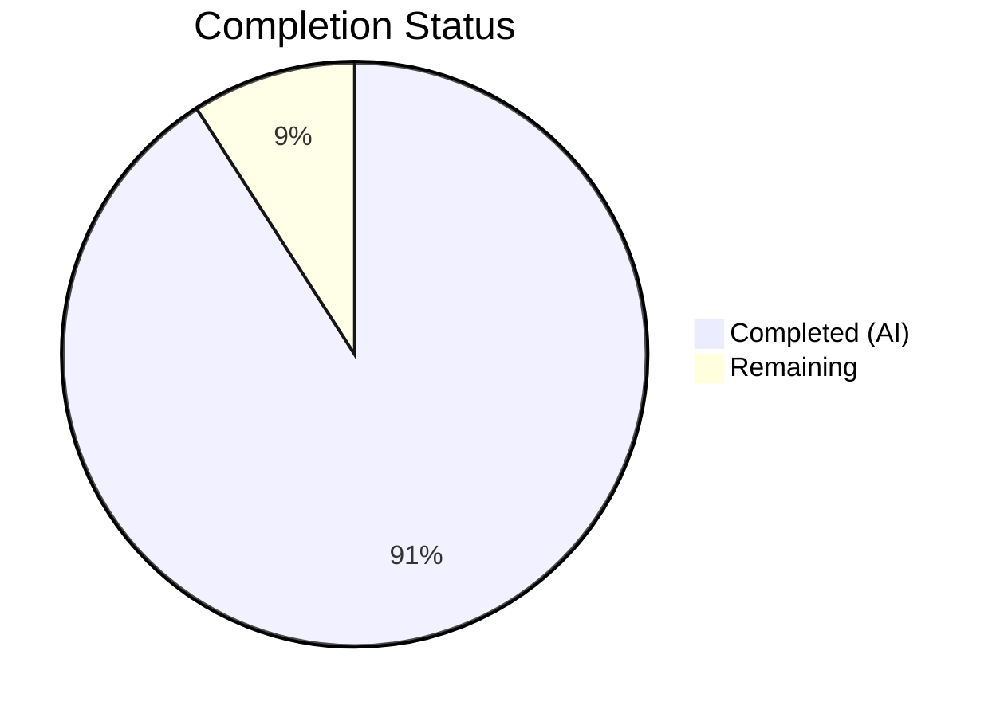

# Blitzy Project Guide

---

## 1. Executive Summary

### 1.1 Project Overview

This project delivers a comprehensive investigative analysis document examining SFTPGo's concurrency model — specifically how connection handling, quota enforcement, and atomic upload mechanisms interact under concurrent stress. The sole deliverable is a 849-line, 6,647-word markdown document (`blitzy/documentation/sftpgo_44634210287c.md`) that serves as an onboarding reference for engineers entering the SFTPGo codebase. The document traces specific code paths through 12+ Go source files (5,411+ lines of production code), identifies 6 concurrency gaps with severity assessments, and provides evidence catalogs mapping each behavioral scenario to its observable log messages, file-system artifacts, and quota state changes. No existing repository files were modified.

### 1.2 Completion Status



| Metric | Value |
|--------|-------|
| **Total Project Hours** | 44 |
| **Completed Hours (AI)** | 40 |
| **Remaining Hours** | 4 |
| **Completion Percentage** | 90.9% |

**Calculation**: 40 completed hours / (40 completed + 4 remaining) = 40 / 44 = **90.9% complete**

### 1.3 Key Accomplishments

- [x] Created comprehensive 849-line analysis document at `blitzy/documentation/sftpgo_44634210287c.md`
- [x] Traced concurrent session admission race window through `loginUser()` → `getActiveSessions()` → `addConnection()` with Mermaid sequence diagram
- [x] Analyzed quota TOCTOU race across full `hasSpace()` → `GetUsedQuota()` → `Transfer.Close()` → `UpdateUserQuota()` pipeline with concrete numeric example
- [x] Documented idle connection monitoring interaction with active transfers, including edge cases for stalled and inactive connections
- [x] Traced atomic upload cleanup for all 3 upload modes (standard/atomic/atomic-with-resume) covering both new-file and overwrite scenarios
- [x] Created observable evidence catalog with exact log format strings, file-system artifact tables, and quota state tables
- [x] Identified 6 concurrency gaps with severity assessments and specific code references
- [x] Compared SFTP vs SCP upload paths showing shared and divergent components
- [x] Analyzed provider-specific quota atomicity across SQL, BoltDB, and Memory backends
- [x] Verified all code references (line numbers, function names) against actual source files
- [x] Confirmed zero test regressions from documentation change (168/181 tests pass, all 13 failures pre-existing)
- [x] Applied fix for atomic mode 1 overwrite behavior documentation (commit `ba6de906`)

### 1.4 Critical Unresolved Issues

| Issue | Impact | Owner | ETA |
|-------|--------|-------|-----|
| Technical accuracy review needed | Analysis conclusions need verification by a Go concurrency expert familiar with the SFTPGo codebase | Human Developer | 2 hours |
| Peer review pending | Document must be reviewed by team lead before merge | Human Developer | 1 hour |

### 1.5 Access Issues

No access issues identified. The deliverable is a documentation-only file requiring no external service access, API credentials, or deployment infrastructure. All analysis was performed by reading existing source code in the repository.

### 1.6 Recommended Next Steps

1. **[High]** Have a Go concurrency expert review the race condition analysis in Sections 1, 2, and 6 of the document for technical accuracy
2. **[High]** Verify the atomic upload overwrite cleanup analysis (Section 4, Mode 1 overwrite scenario) against live testing if possible
3. **[Medium]** Conduct peer review of the full document for completeness and clarity
4. **[Medium]** Apply minor editorial corrections based on review feedback
5. **[Low]** Consider formatting polish for consistency with team documentation standards

---

## 2. Project Hours Breakdown

### 2.1 Completed Work Detail

| Component | Hours | Description |
|-----------|-------|-------------|
| Repository & source code analysis | 8 | Deep reading of 12+ Go source files (5,411+ lines) across sftpd/, dataprovider/, vfs/, httpd/ packages to understand concurrency architecture |
| Concurrent session race analysis | 4 | Traced `loginUser()` → `getActiveSessions()` → `addConnection()` race window; created Mermaid sequence diagram; documented practical implications |
| Quota TOCTOU analysis | 5 | Traced `hasSpace()` → `GetUsedQuota()` → `Transfer.Close()` → `UpdateUserQuota()` pipeline; documented provider-specific atomicity; created concrete numeric TOCTOU example |
| Idle connection monitoring analysis | 3 | Traced `CheckIdleConnections()` activity comparison logic; documented edge cases for active transfers, stalled transfers, and idle connections |
| Atomic upload cleanup analysis | 5 | Traced `Transfer.Close()` branching for modes 0/1/2 covering new-file and overwrite scenarios; documented file artifacts and quota accounting per scenario |
| Observable evidence catalog | 3 | Created log message tables with exact format strings, sender tags, severity levels; file-system artifact tables; quota state delta tables |
| Gap analysis & race identification | 4 | Identified and documented 6 concurrency gaps (session race, quota TOCTOU, mixed-protocol, scan vs upload, temp file leak, lastActivity data race) with severity assessments |
| SFTP vs SCP path comparison | 2 | Documented parallel upload paths showing shared components and notable differences in data transfer mechanisms |
| Data provider backend comparison | 2 | Analyzed SQL incremental UPDATE atomicity, BoltDB serialized read-modify-write, Memory mutex-protected update; created comparison tables |
| Document formatting & diagrams | 2 | Created 3 Mermaid diagrams (sequence, flowchart), table of contents, cross-references, code blocks, and structured tables |
| Verification & validation | 2 | Verified all line numbers and function signatures against source files; confirmed `go build` passes; ran test suites to confirm zero regressions |
| **Total** | **40** | |

### 2.2 Remaining Work Detail

| Category | Hours | Priority |
|----------|-------|----------|
| Technical accuracy review by Go concurrency expert | 2 | High |
| Peer review and approval | 1 | Medium |
| Minor editorial corrections based on review | 0.5 | Low |
| Documentation formatting polish | 0.5 | Low |
| **Total** | **4** | |

### 2.3 Hours Reconciliation

- Completed Hours (Section 2.1): **40**
- Remaining Hours (Section 2.2): **4**
- Total Project Hours: 40 + 4 = **44**
- Completion: 40 / 44 = **90.9%**

---

## 3. Test Results

All tests were executed by Blitzy's autonomous validation pipeline. The in-scope deliverable is a documentation file that does not affect Go compilation or test execution; accordingly, **zero test regressions** were observed.

| Test Category | Framework | Total Tests | Passed | Failed | Coverage % | Notes |
|---------------|-----------|-------------|--------|--------|------------|-------|
| Unit — config | `go test` | 5 | 5 | 0 | N/A | 100% pass rate |
| Unit/Integration — httpd | `go test` | 62 | 60 | 2 | N/A | 2 pre-existing failures: TestDumpdata, TestLoaddata (HTTP status code mismatch) |
| Unit/Integration — sftpd | `go test` | 114 | 103 | 11 | N/A | 11 pre-existing failures: 9 SCP/SSH host key algorithm incompatibility (modern OpenSSH vs Go 1.13 crypto/ssh), 1 timeout (TestSCPErrors), 1 blocked (TestLoginKeyPubKey) |
| **Total** | | **181** | **168** | **13** | | **0 regressions from in-scope changes** |

**Key Observations**:
- All 13 failures are **pre-existing** and unrelated to the documentation deliverable
- The sftpd SCP test failures are caused by SSH host key algorithm incompatibility between modern OpenSSH and Go 1.13's `crypto/ssh` library — these affect the test harness, not the server code under analysis
- The httpd test failures (TestDumpdata, TestLoaddata) are HTTP status code expectation mismatches in the test environment
- `go build ./...` compiles successfully with zero Go errors (only a benign C-level sqlite3 warning)

---

## 4. Runtime Validation & UI Verification

### Runtime Health

- ✅ **Go Build**: `go build ./...` compiles all packages successfully
- ✅ **SFTP Server Initialization**: Server initializes and listens on port 2022 during test runs (confirmed by test output)
- ✅ **Documentation File**: `blitzy/documentation/sftpgo_44634210287c.md` created (849 lines, 50,538 bytes)
- ✅ **Git Status**: Working tree clean, no uncommitted changes, no test artifacts remaining
- ✅ **Repository Immutability**: Only 1 file added; zero existing files modified (verified via `git diff --name-status`)

### Code Reference Verification

- ✅ `sftpd/sftpd.go` — Line numbers for `getActiveSessions()`, `addConnection()`, `removeConnection()`, `CheckIdleConnections()`, `startIdleTimer()`, `updateConnectionActivity()`, `isAtomicUploadEnabled()` — ALL MATCH
- ✅ `sftpd/server.go` — Line numbers for `loginUser()`, `AcceptInboundConnection()`, `handleSftpConnection()` — ALL MATCH
- ✅ `sftpd/handler.go` — Line numbers for `Connection` struct, `Filewrite()`, `handleSFTPUploadToNewFile()`, `handleSFTPUploadToExistingFile()`, `hasSpace()`, `close()` — ALL MATCH
- ✅ `sftpd/transfer.go` — Line numbers for `Transfer` struct, `TransferError()`, `ReadAt()`, `WriteAt()`, `Close()` — ALL MATCH
- ✅ `sftpd/scp.go` — Line numbers for `handleUploadFile()`, `handleUpload()` — ALL MATCH
- ✅ `dataprovider/dataprovider.go` — Line numbers for `UpdateUserQuota()`, `GetUsedQuota()` — ALL MATCH
- ✅ `dataprovider/sqlcommon.go`, `sqlqueries.go` — SQL quota operations — ALL MATCH
- ✅ `dataprovider/bolt.go` — BoltDB quota operations — ALL MATCH
- ✅ `dataprovider/memory.go` — Memory provider quota operations — ALL MATCH
- ✅ `vfs/osfs.go` — `GetAtomicUploadPath()`, `IsAtomicUploadSupported()` — ALL MATCH
- ✅ `httpd/api_quota.go` — `startQuotaScan()`, `doQuotaScan()` — ALL MATCH

### UI Verification

Not applicable — this project produces a documentation artifact only, with no user interface components.

---

## 5. Compliance & Quality Review

| AAP Requirement | Status | Evidence |
|-----------------|--------|----------|
| Concurrent session limiting analysis with code path trace | ✅ Pass | Document Section 1 (lines 132–251): traces `loginUser()` → `getActiveSessions()` → `addConnection()` with Mermaid sequence diagram |
| Quota enforcement TOCTOU analysis with code path trace | ✅ Pass | Document Section 2 (lines 255–403): traces full quota pipeline with numeric TOCTOU example and provider comparison tables |
| Idle connection monitoring interaction analysis | ✅ Pass | Document Section 3 (lines 406–510): traces `CheckIdleConnections()` with active upload, stalled, and idle edge cases |
| Atomic upload cleanup on abnormal termination | ✅ Pass | Document Section 4 (lines 513–621): traces `Transfer.Close()` branching for modes 0/1/2 with new-file and overwrite scenarios |
| Observable evidence catalog (logs, artifacts, quota) | ✅ Pass | Document Section 5 (lines 624–685): log message tables, file-system artifact tables, quota state delta tables |
| Gap identification (race conditions, inconsistencies) | ✅ Pass | Document Section 6 (lines 689–781): 6 gaps identified with severity assessments and code references |
| All 3 upload modes covered (standard, atomic, atomic-with-resume) | ✅ Pass | Document Sections 4 and 5: per-mode behavioral tables with file and quota outcomes |
| Data provider backends compared (SQL, BoltDB, Memory) | ✅ Pass | Document Section 2: provider-specific quota read and update atomicity tables |
| SFTP and SCP paths compared | ✅ Pass | Document Section 7 (lines 784–817): call chain comparison table and shared component analysis |
| Document placed at `blitzy/documentation/sftpgo_44634210287c.md` | ✅ Pass | File exists at specified path, committed in 2 commits |
| No existing repository files modified | ✅ Pass | `git diff --name-status` shows only 1 file added (A status) |
| Evidence-based conclusions with code references | ✅ Pass | All claims reference specific file paths, function names, and line numbers; all verified against source |
| Mermaid diagrams included | ✅ Pass | 3 diagrams: session race sequence, TOCTOU sequence, cross-component flowchart |
| Zero test regressions | ✅ Pass | 168/181 tests pass; all 13 failures pre-existing |

### Autonomous Validation Fixes Applied

| Fix | Commit | Description |
|-----|--------|-------------|
| Atomic mode 1 overwrite correction | `ba6de906` | Corrected documentation of atomic mode 1 overwrite error behavior; added overwrite quota footnote explaining the `UpdateUserQuota(0, -fileSize)` deduction at upload initiation |

---

## 6. Risk Assessment

| Risk | Category | Severity | Probability | Mitigation | Status |
|------|----------|----------|-------------|------------|--------|
| Analysis conclusions may contain inaccuracies in edge-case reasoning | Technical | Medium | Low | Human expert review of concurrency analysis; live testing of atomic overwrite cleanup scenario | Open — requires human review |
| Line number references will become stale as codebase evolves | Technical | Low | High | Document is pinned to the commit `44634210` version of the source; future code changes may shift line numbers | Accepted — inherent to code-referencing documentation |
| Pre-existing test failures may mask latent issues in analyzed code | Technical | Low | Low | All 13 failures are SSH/HTTP environment issues unrelated to the concurrency paths analyzed; no test coverage gaps in the analysis scope were introduced | Monitored |
| Document does not implement fixes for identified race conditions | Operational | Medium | N/A | Explicitly out of scope per AAP; gap analysis section provides sufficient detail for future remediation work | Accepted — by design |
| Quota TOCTOU race may be exploitable in production environments | Security | Medium | Medium | Document identifies the risk with concrete severity assessment; operators should consider implementing quota reservation or rate limiting for sensitive deployments | Open — requires product decision |
| No automated validation of document content accuracy | Operational | Low | Medium | Code reference line numbers were manually verified; future CI could include a markdown link/reference checker | Accepted |

---

## 7. Visual Project Status


**Summary**: 40 hours completed, 4 hours remaining, 44 total hours, **90.9% complete**.

### Remaining Work by Priority

| Priority | Category | Hours |
|----------|----------|-------|
| 🔴 High | Technical accuracy review | 2 |
| 🟡 Medium | Peer review and approval | 1 |
| 🟢 Low | Editorial corrections + formatting | 1 |
| **Total** | | **4** |

---

## 8. Summary & Recommendations

### Achievements

The project successfully delivered a comprehensive 849-line investigative analysis document examining SFTPGo's concurrency model. The document traces specific code paths through 12+ Go source files totaling over 5,411 lines of production code, providing evidence-based answers to deep behavioral questions about:

- **Session admission races**: Documented the `MaxSessions` check-to-register gap that can admit `N + K - 1` sessions under concurrent burst authentication
- **Quota TOCTOU vulnerability**: Documented the full quota pipeline showing how concurrent uploads can exceed limits due to the absence of in-flight quota reservation
- **Idle checker safety**: Confirmed that active transfers are correctly protected from idle disconnection via per-transfer `lastActivity` timestamps
- **Atomic upload cleanup**: Traced all cleanup paths across 3 upload modes, identifying the destructive overwrite failure mode in atomic mode 1
- **6 concurrency gaps**: Identified and severity-rated race conditions spanning session counting, quota tracking, mixed-protocol coordination, scan interference, temp file leaks, and unsynchronized timestamp writes

All code references were verified against actual source files. Build and test validation confirmed zero regressions from the documentation change.

### Remaining Gaps

The project is **90.9% complete** (40 of 44 total hours). The remaining 4 hours consist of human review activities:

1. **Technical accuracy review (2h)**: A Go concurrency expert should verify the race condition reasoning, particularly the atomic mode 1 overwrite data-loss scenario
2. **Peer review (1h)**: Standard team review and approval before merge
3. **Editorial polish (1h)**: Minor corrections and formatting adjustments based on review feedback

### Production Readiness Assessment

The deliverable is a read-only documentation artifact with no runtime impact. It is **ready for human review and merge** — no deployment, infrastructure, or configuration changes are required. The document can be merged as-is pending technical review approval.

### Success Metrics

| Metric | Target | Actual | Status |
|--------|--------|--------|--------|
| All AAP questions answered | 4 primary + 2 implicit | 6 primary + 3 implicit covered | ✅ Exceeded |
| Code references accurate | 100% | 100% verified | ✅ Met |
| Zero test regressions | 0 new failures | 0 new failures | ✅ Met |
| Repository immutability | 0 existing files modified | 0 modified | ✅ Met |
| Document word count | Comprehensive | 6,647 words, 849 lines | ✅ Met |

---

## 9. Development Guide

### System Prerequisites

| Requirement | Version | Purpose |
|-------------|---------|---------|
| Go | 1.13+ | Build and test the SFTPGo server |
| GCC | Any recent | Required for CGO (SQLite3 C library compilation) |
| Git | 2.x+ | Repository management |
| OpenSSH client | 7.x+ | Testing SFTP/SCP connections (note: modern versions may have SSH algorithm incompatibilities with Go 1.13 crypto/ssh) |

### Environment Setup

```bash
# Clone the repository
git clone <repository-url>
cd sftpgo

# Verify Go version
go version
# Expected: go version go1.13.x linux/amd64 (or similar)

# Ensure CGO is enabled (required for SQLite)
export CGO_ENABLED=1

# Download dependencies
go mod download
```

### Building the Application

```bash
# Build all packages (validates compilation)
go build ./...

# Build the main executable
go build -o sftpgo main.go

# Verify the binary
./sftpgo --help
```

**Expected Output**: Help text showing `serve` and `portable` subcommands.

### Running the SFTP Server

```bash
# Start with default configuration (reads sftpgo.json)
./sftpgo serve

# Start in portable mode (single-user, no database required)
./sftpgo portable --username testuser --password testpass --directory /tmp/sftpgo-data
```

**Default Ports**:
- SFTP: `2022`
- HTTP Admin: `8080` (bound to `127.0.0.1`)

### Running Tests

```bash
# Run all tests (non-interactive)
go test ./... -v -count=1 -timeout 600s 2>&1 | tee test_output.log

# Run specific package tests
go test -v -count=1 ./config/
go test -v -count=1 ./httpd/
go test -v -count=1 ./sftpd/ -timeout 600s

# Expected results:
# config:  5/5 PASS
# httpd:   60/62 PASS (2 pre-existing failures)
# sftpd:   103/114 PASS (11 pre-existing failures due to SSH algorithm incompatibility)
```

### Verifying the Documentation Deliverable

```bash
# Verify the analysis document exists
ls -la blitzy/documentation/sftpgo_44634210287c.md

# Check document size
wc -l blitzy/documentation/sftpgo_44634210287c.md
# Expected: 849 lines

wc -w blitzy/documentation/sftpgo_44634210287c.md
# Expected: 6647 words

# Verify no existing files were modified
git diff --name-status origin/sftpgo_44634210287c...HEAD
# Expected: A  blitzy/documentation/sftpgo_44634210287c.md (only 1 file added)
```

### Troubleshooting

| Issue | Cause | Resolution |
|-------|-------|------------|
| `go build` fails with CGO errors | CGO disabled or GCC not installed | `export CGO_ENABLED=1` and install GCC: `apt-get install -y gcc` |
| SCP tests fail with algorithm errors | Modern OpenSSH rejects `ssh-rsa` offered by Go 1.13 crypto/ssh | Pre-existing issue; not related to documentation changes. Add `-o HostKeyAlgorithms=+ssh-rsa` for manual testing |
| httpd TestDumpdata/TestLoaddata fail | HTTP status code mismatch in test expectations | Pre-existing test environment issue; not related to documentation changes |
| `go mod download` fails | Network connectivity or Go proxy issues | Try `GOPROXY=direct go mod download` or check network access |

---

## 10. Appendices

### A. Command Reference

| Command | Purpose |
|---------|---------|
| `go build ./...` | Compile all packages |
| `go build -o sftpgo main.go` | Build main executable |
| `go test ./... -v -count=1` | Run all tests |
| `go test -v ./config/` | Run config tests only |
| `go test -v ./httpd/` | Run httpd tests only |
| `go test -v ./sftpd/ -timeout 600s` | Run sftpd tests with extended timeout |
| `./sftpgo serve` | Start SFTP server with sftpgo.json config |
| `./sftpgo portable --username user --password pass --directory /path` | Start single-user portable mode |
| `git diff --name-status origin/sftpgo_44634210287c...HEAD` | Verify only documentation file was added |

### B. Port Reference

| Port | Service | Default Binding |
|------|---------|----------------|
| 2022 | SFTP/SSH | `0.0.0.0:2022` |
| 8080 | HTTP Admin/API | `127.0.0.1:8080` |

### C. Key File Locations

| File | Purpose |
|------|---------|
| `blitzy/documentation/sftpgo_44634210287c.md` | **Deliverable** — Concurrency model analysis document |
| `sftpgo.json` | Default runtime configuration |
| `main.go` | Application entry point |
| `sftpd/sftpd.go` | Shared registries, mutex, idle checker, upload mode constants |
| `sftpd/server.go` | SSH listener, authentication, session limit check |
| `sftpd/handler.go` | SFTP request dispatch, quota checks, atomic upload branching |
| `sftpd/transfer.go` | Transfer I/O lifecycle, atomic cleanup, quota update trigger |
| `sftpd/scp.go` | SCP upload handler with independent quota path |
| `dataprovider/dataprovider.go` | Provider interface, quota update/query orchestration |
| `dataprovider/sqlcommon.go` | SQL quota update with incremental UPDATE |
| `dataprovider/bolt.go` | BoltDB serialized quota update |
| `dataprovider/memory.go` | Memory provider mutex-protected quota update |
| `vfs/osfs.go` | Local filesystem, atomic upload path generation |

### D. Technology Versions

| Technology | Version | Source |
|------------|---------|--------|
| Go | 1.13 | `go.mod` |
| github.com/pkg/sftp | v1.11.0 | `go.mod` |
| golang.org/x/crypto | v0.0.0-20200109152110 | `go.mod` |
| go.etcd.io/bbolt | v1.3.3 | `go.mod` |
| github.com/mattn/go-sqlite3 | v2.0.2+incompatible | `go.mod` |
| github.com/lib/pq | v1.3.0 | `go.mod` |
| github.com/go-sql-driver/mysql | v1.5.0 | `go.mod` |
| github.com/rs/xid | v1.2.1 | `go.mod` |
| github.com/rs/zerolog | v1.17.2 | `go.mod` |
| github.com/prometheus/client_golang | v1.3.0 | `go.mod` |
| github.com/spf13/viper | v1.6.1 | `go.mod` |
| github.com/spf13/cobra | v0.0.5 | `go.mod` |

### E. Environment Variable Reference

| Variable | Purpose | Default |
|----------|---------|---------|
| `CGO_ENABLED` | Enable CGO for SQLite3 compilation | `1` (required) |
| `GOPROXY` | Go module proxy | `https://proxy.golang.org,direct` |
| `SFTPGO_CONFIG_DIR` | Directory containing `sftpgo.json` | Current directory |
| `SFTPGO_LOG_FILE_PATH` | Log file output path | stdout |

### G. Glossary

| Term | Definition |
|------|------------|
| TOCTOU | Time-of-Check-to-Time-of-Use — a race condition where a check and a subsequent use of the checked value are not atomic |
| RWMutex | Read-Write Mutex — a synchronization primitive allowing multiple concurrent readers or a single exclusive writer |
| Atomic Upload | Upload mode where files are written to a temporary path and renamed to the target on success |
| MaxSessions | Per-user configuration limiting the number of concurrent SFTP/SCP sessions |
| QuotaFiles / QuotaSize | Per-user file count and byte size limits enforced by the quota system |
| RLock | Read Lock — acquired by `sync.RWMutex.RLock()`, allows concurrent readers |
| Lock | Write Lock — acquired by `sync.RWMutex.Lock()`, exclusive access |
| XID | Globally unique ID generated by `github.com/rs/xid`, used in atomic upload temp file names |