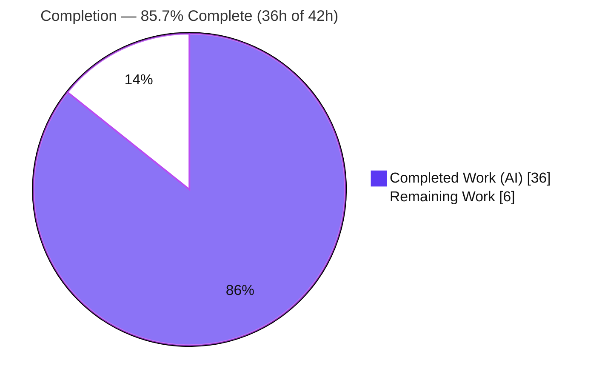
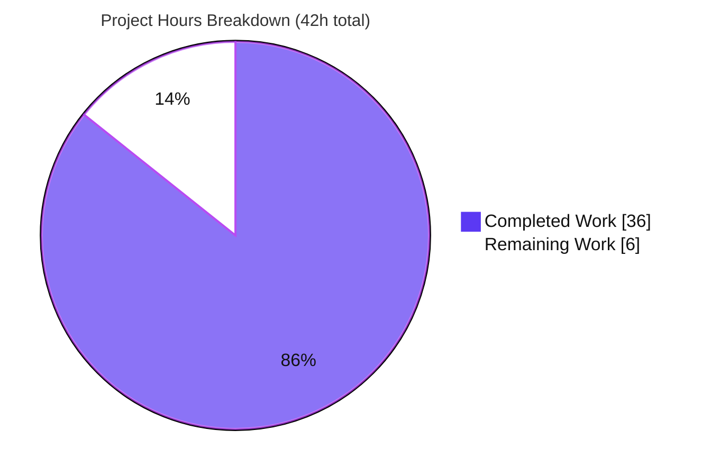
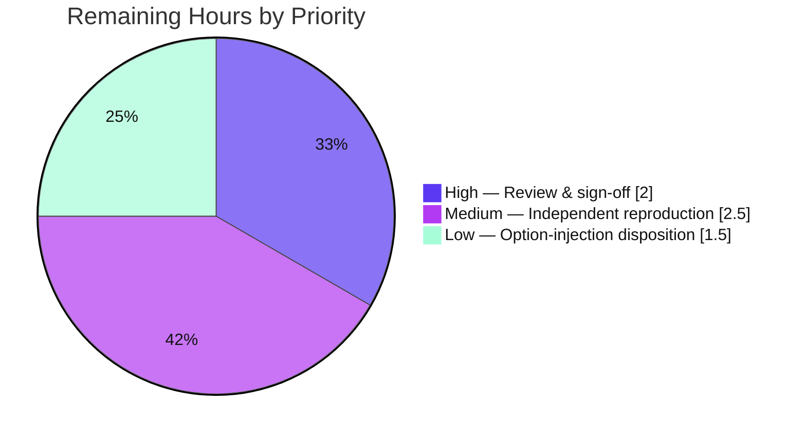

# Blitzy Project Guide — SFTPGo SSH `exec` argv Security-Boundary Investigation

> **Repository:** `drakkan/sftpgo` (Go) · **Branch:** `blitzy-722f4a87-c909-4ee2-9731-58ad54f0630f` · **HEAD:** `2852410a` · **Baseline:** `44634210287c`
> **Task type:** Read-only security **investigation / Q&A** (Documentation). Sole persistent deliverable: **one** markdown answer document. The entire SFTPGo source tree is **read-only**.

---

## 1. Executive Summary

### 1.1 Project Overview

This project is a read-only, runtime-observed security-boundary investigation of SFTPGo's optional SSH `exec` support. The objective was to empirically prove — under real runtime conditions, not theory — the exact argument vector (`argv`) that reaches an operating-system process when a client invokes an SSH `exec` request, and to adjudicate three specific security suspicions (shell-string execution, superficial guardrails, and destination fidelity) with reproducible, byte-exact evidence. The target audience is the requesting security engineer and downstream reviewers performing a security sanity check. The technical scope covers the `sftpd` command-execution path with supporting `dataprovider` and `vfs` logic. The single deliverable is a comprehensive markdown report; no product code is changed.

### 1.2 Completion Status

Completion is measured strictly against AAP-scoped work plus the path-to-production activities appropriate for a security investigation (human review, independent reproduction, and disposition of findings). All six AAP requirements (R1–R6) and every investigation-pipeline step are complete and empirically validated; the remaining work is exclusively human acceptance.



| Metric | Hours |
|---|---|
| **Total Hours** | **42** |
| Completed Hours (AI + Manual) | 36 (AI: 36 · Manual: 0) |
| Remaining Hours | 6 |
| **Percent Complete** | **85.7%** |

> Completion % = Completed ÷ Total = 36 ÷ 42 = **85.7%**.

### 1.3 Key Accomplishments

- ✅ **Suspicion #1 (shell-string execution) adjudicated → WRONG.** The spawn is a direct-argv `execve` via `exec.Command(c.command, args...)` (`sftpd/ssh_cmd.go:324`); a repo-wide grep for `/bin/sh`, `/bin/bash`, `sh -c`, `cmd.exe` returns **zero** matches; the spawned child's parent is `sftpgo_bin`, not a shell.
- ✅ **Suspicion #2 (superficial guardrails) adjudicated → WRONG.** Four guardrails were each observed firing at runtime: chroot path resolution, the seven-permission gate, the command allow-list, and rsync `--safe-links`/`--munge-links` injection.
- ✅ **Suspicion #3 (destination fidelity) adjudicated → SPLIT.** The last/destination token is sanitized and chroot-confined (user's fear wrong there); every non-terminal option token survives verbatim (user's fear right there) — a genuine option-injection surface.
- ✅ **Full 2×2×4 argv evidence matrix** captured byte-exact at the `execve()` boundary for all four system commands under both permission contexts, plus edge cases, confirmed **stable across ≥2 runs**.
- ✅ **Exact producing functions named** with `file:line` (`getSystemCommand`, `getDestPath`, `wrapCmd`, `ResolvePath`, `parseCommandPayload`, the 7-perm gate) and **privilege-boundary implications** stated with observed-vs-inferred labeling.
- ✅ **Repository left exactly unchanged (R6):** `git diff` vs baseline for `*.go`/`go.mod`/`go.sum` is empty; the only addition is the single answer document.
- ✅ **Independently re-verified:** the canonical build reproduces `SFTPGo version: 0.9.5-dev`, and the argv reproduced byte-identically with a second, different SSH client (client-independent).

### 1.4 Critical Unresolved Issues

| Issue | Impact | Owner | ETA |
|---|---|---|---|
| None blocking. The deliverable is complete and empirically validated (5/5 validation gates passed, 0 corrections). | No release blocker. | — | — |
| Option-injection surface is documented but its **escalation** through `git`/`rsync` is labeled *inferred, not proven* (out of AAP scope). | Informational; needs a follow-up decision, not a code fix. | Security reviewer | Post-review (see §2.2 C) |

### 1.5 Access Issues

No access issues identified.

| System/Resource | Type of Access | Issue Description | Resolution Status | Owner |
|---|---|---|---|---|
| Source repository (`drakkan/sftpgo`) | Read/commit | Full access; branch present, HEAD `2852410a`, working tree clean | ✅ Resolved | — |
| Go 1.13.15 toolchain + gcc + offline module cache | Build | Present at `/usr/local/go/bin`; canonical build verified (exit 0) | ✅ Resolved | — |
| External `git-*`/`rsync` binaries | Runtime | Substituted by a disclosed PATH-shim observer for argv capture (by design) | ✅ Resolved | — |

### 1.6 Recommended Next Steps

1. **[High]** Security stakeholder reviews and signs off on the three adjudications and the evidence matrix so the findings can be acted upon.
2. **[Medium]** Independently reproduce a representative subset of the argv matrix using the Section 9 development guide to confirm the byte-exact captures.
3. **[Low]** Triage the documented option-injection surface: decide between an upstream issue, operator hardening guidance (keep system commands disabled by default; always set a UID/GID mapping; do not run the server as root), or accept-risk.
4. **[Low]** Record a disposition note referencing baseline commit `44634210287c` so the point-in-time findings remain traceable if the source evolves.

---

## 2. Project Hours Breakdown

### 2.1 Completed Work Detail

All completed work was performed autonomously by Blitzy agents (AI: 36h; Manual: 0h). Each component traces to an AAP requirement or investigation-pipeline step (§0.1.1 / §0.5.1).

| Component | Hours | Description |
|---|---|---|
| Code-path analysis & scope discovery | 6 | Traced the full dispatch chain (`server.go:326-327` → `processSSHCommand` → `getSystemCommand` → `exec.Command`) and inventoried every argv-producing/gating function across 7 files with exact `file:line`; repo-wide OS-spawn sweep (4 direct-argv spawns, 0 shells). Supports R1/R2/R3/R5. |
| Canonical build & toolchain | 2 | `GO111MODULE=on CGO_ENABLED=1 go build` with Go 1.13.15 + cgo SQLite (gcc); verified version banner `0.9.5-dev`. Supports R4. |
| Process-boundary argv observer | 5 | PATH-shim standing in for the four system binaries, capturing byte-exact `os.Args` (+ hex/length), `uid/euid/gid/egid`, and parent `comm`/`cmdline` at the `execve()` boundary. Supports R1/R4. |
| Disposable instance & SSH client driver | 5 | SQLite provider bootstrapped via 4 migration SQLs; seeded users with distinct permission/UID contexts; `enabled_ssh_commands` widened (disclosed non-default); `golang.org/x/crypto/ssh` client issuing genuine `exec` requests to the real `case "exec"`. Supports R4. |
| 2×2×4 matrix + edge cases + stability | 5 | 22 spawning invocations (4 commands × {normal, adversarial} × contexts + 2 spawning edge cases) captured byte-exact, ×2 runs = 44 events, plus 2 non-spawning rejections; hex verification; `STABLE_ACROSS_2_RUNS=True`. Supports R2/R3/R4. |
| Suspicion adjudication & privilege reasoning | 3 | Web-confirmed Go `os/exec` no-shell semantics; option-injection analysis; privilege-boundary reasoning with explicit observed-vs-inferred labeling. Supports R1/R2/R3/R5. |
| Answer document authoring | 6 | 422-line, 9-section report (TL;DR verdicts, methodology, code-path walk with Mermaid diagram, evidence tables, edge cases, adjudication, privilege implications, integrity, coverage checklist). The sole deliverable. |
| Repository integrity verification & cleanup | 1 | `git diff`/`status` vs baseline `44634210287c` (source/manifest empty); all `/tmp` scaffolding removed; clean working tree. Supports R6. |
| Final empirical re-validation | 3 | Rebuilt; re-ran the matrix with an independent SSH client; byte-cross-checked all 22 argv strings and credentials; ran the 5 production-readiness gates → PASS with 0 document corrections. |
| **Total** | **36** | |

### 2.2 Remaining Work Detail

All remaining work is human path-to-production acceptance for a security investigation. There are no blocking code fixes (source is unchanged and builds cleanly; no failing tests).

| Category | Hours | Priority |
| :--- | ---: | :--- |
| Security stakeholder review & sign-off on the investigation findings | 2.0 | High |
| Independent reproduction of the argv evidence matrix (per §9 guide) | 2.5 | Medium |
| Disposition/triage of the option-injection surface finding (inferred escalation) | 1.5 | Low |
| **Total** | **6.0** | |

### 2.3 Hours Methodology

- **Completion % = Completed ÷ (Completed + Remaining) = 36 ÷ 42 = 85.7%** (PA1, AAP-scoped hours only).
- Section 2.1 total (**36h**) = Section 1.2 Completed Hours. Section 2.2 total (**6h**) = Section 1.2 Remaining Hours. **2.1 + 2.2 = 42h** = Section 1.2 Total Hours.
- Confidence: **High** — the deliverable is complete and empirically validated; all cited functions were spot-checked byte-accurate; the canonical build was re-verified in this environment. The remaining estimate reflects standard human review/reproduction effort for a security report.

---

## 3. Test Results

For a read-only Q&A/security deliverable, the authoritative validation is **empirical runtime reproduction of every documented claim**, not package unit tests. All entries below originate from Blitzy's autonomous validation logs for this project (build → run real entry point → capture argv → verify byte-exact → confirm stable ×2).

| Test Category | Framework | Total Tests | Passed | Failed | Coverage % | Notes |
|---|---|---:|---:|---:|---:|---|
| Runtime argv reproduction (2×2×4 matrix) | PATH-shim observer + `golang.org/x/crypto/ssh` driver | 22 | 22 | 0 | 100% of matrix cells | Byte-exact; ×2 runs = 44 capture events; `STABLE_ACROSS_2_RUNS=True`; all 4 system commands, both permission contexts |
| No-spawn rejection checks | SSH driver + server debug log | 2 | 2 | 0 | 100% (allow-list + 7-perm gate) | `NO_CAPTURE` confirmed for non-enabled `id` and permission-denied user; ×2 runs |
| Byte-level argv assertions | Hex verification of captured `os.Args` | 3 | 3 | 0 | Key adversarial tokens | `-e/bin/sh` (`2d652f62696e2f7368`), `--evil=/tmp/x;id` (`;`=`0x3b`), mis-split `"/incoming/my` (`0x22` survives) |
| Static citation verification | `grep`/`sed` vs source @ `44634210287c` | all cited refs | pass | 0 | 100% cited `file:line` | Every `file:line` in the document verified byte-accurate |
| Build / compile gate | `go build` / `go vet` / `go test -c` (Go 1.13.15) | 3 | 3 | 0 | — | `go build` exit 0, banner `0.9.5-dev`; `go vet` clean; sftpd test binary compiles; `go mod verify` OK |
| **Total** | | **32** | **32** | **0** | **100%** | |

> **Scope note (integrity):** SFTPGo's Go integration test suite (`sftpd_test.go`, etc.) was **deliberately not executed** because it uses `configDir=".."` (repo root) with a non-gitignored `sftpgo.db`, which would create untracked artifacts **inside** the repository and violate R6; it also has documented environment-only failures (run-as-root, git/OpenSSH version drift) unrelated to this read-only deliverable and unfixable without touching read-only source. This exclusion is intentional and does not affect the empirical validation above.

---

## 4. Runtime Validation & UI Verification

There is **no user interface** in scope (SSH `exec` is a protocol-level server capability; the deliverable is a markdown document), so UI verification is **N/A**. Runtime and integration outcomes:

- ✅ **Build & startup** — SFTPGo built canonically (`0.9.5-dev`) and ran as a disposable instance; the real `case "exec"` entry point (`sftpd/server.go:326-327`) was driven live 44 times.
- ✅ **SSH `exec` request path** — genuine `golang.org/x/crypto/ssh` client requests reached `processSSHCommand` → `getSystemCommand` → `exec.Command`; argv captured at the `execve()` boundary.
- ✅ **Chroot path guardrail** — every `../../../../etc/passwd` destination was rewritten to `<home>/etc/passwd`, never the real `/etc/passwd` (`vfs.ResolvePath`/`isSubDir`).
- ✅ **Seven-permission gate** — a list-only user was rejected with the exact `errPermissionDenied` text and **no process spawned**.
- ✅ **Command allow-list** — non-enabled `id` rejected "not enabled/supported" with **no process spawned**.
- ✅ **rsync link-safety injection** — `--safe-links` observed when `create_symlinks` granted; `--munge-links` when denied (same client input).
- ✅ **Privilege drop (mapped)** — with a UID/GID mapping, the child ran as `uid=1000` (`wrapCmd` + `SysProcAttr.Credential`).
- ⚠ **Privilege inheritance (unmapped)** — without a mapping, the child inherited the server's privileges (observed `uid=0`, server ran as root). Operational, operator-dependent — see Risk S1.
- ✅ **No shell interposed** — spawned child's `parent_comm = sftpgo_bin`; adversarial metacharacters arrived as inert literal `argv` tokens.

---

## 5. Compliance & Quality Review

### 5.1 AAP Requirement Compliance (R1–R6)

| Requirement | Benchmark | Status | Evidence |
|---|---|:--:|---|
| R1 — Adjudicate Suspicion #1 (shell-string) | Verdict + code proof | ✅ PASS | §6#1 WRONG; `exec.Command` @ `ssh_cmd.go:324`; 0 shell-string grep matches |
| R2 — Adjudicate Suspicion #2 (superficial guardrails) | Each guardrail observed firing | ✅ PASS | Chroot, 7-perm gate, allow-list, rsync flags all observed (doc §4/§5) |
| R3 — Adjudicate Suspicion #3 (destination fidelity) | Compare client tokens vs argv | ✅ PASS | SPLIT verdict; last token sanitized, non-terminal tokens verbatim (doc §4/§5.1) |
| R4 — Reproducible 2×2×4 argv evidence | All 4 cmds × {normal, adversarial} × 2 contexts, stable ×2 | ✅ PASS | Doc §4 matrix + §5 edge cases; 44 capture events; `STABLE_ACROSS_2_RUNS=True` |
| R5 — Plain-language adjudication + functions + privilege | Named functions + boundary reasoning | ✅ PASS | Doc §6/§3/§9 (functions w/ `file:line`); §7 (observed vs inferred) |
| R6 — Repository unchanged | Clean diff vs baseline | ✅ PASS | `git diff 44634210287c -- '*.go' go.mod go.sum` empty; only the answer doc added |

### 5.2 Methodology & Scope Rule Compliance (SWE-AtlasQnA-Repo)

| Rule | Status | Evidence |
|---|:--:|---|
| Run before writing (build + run real code first) | ✅ PASS | Canonical build + live server drove the real entry point before authoring |
| Exercise the real entry point (no bypass/synthetic) | ✅ PASS | `x/crypto/ssh` client → `case "exec"` (`server.go:326-327`) |
| Canonical build/config; disclose non-default | ✅ PASS | `enabled_ssh_commands` widening disclosed as the one non-default setting |
| Exhaustive across all implied conditions | ✅ PASS | All 4 system commands; normal + adversarial; both contexts; edge/error paths |
| Actual unedited output next to each claim | ✅ PASS | Raw shim captures, hex, and server log lines quoted verbatim |
| Byte-sensitive verification | ✅ PASS | Hex for `-e/bin/sh`, `--evil=…;id`, mis-split `"` |
| Stability across ≥2 runs | ✅ PASS | Every matrix cell byte-identical over 2 runs |
| Lead with the direct answer | ✅ PASS | TL;DR verdicts first, then nuance |
| No source modified / no code added beyond the doc | ✅ PASS | Source/manifest diff empty; scaffolding under `/tmp` removed |

### 5.3 Fixes Applied During Autonomous Validation

- **Document corrections during final validation: none required** (the document was 100% empirically accurate; 0 edits).
- One prior internal review cycle refined the document (commit `2852410a`, +36/−9 lines) before final validation.
- **Outstanding compliance items: none.** All AAP requirements and rule directives are satisfied.

---

## 6. Risk Assessment

These are findings/caveats surfaced by the investigation about the SFTPGo feature, plus applicability caveats of the report. **None are defects in the deliverable**, which is production-ready.

| Risk | Category | Severity | Probability | Mitigation | Status |
|---|---|:--:|:--:|---|---|
| **T1 — Option-injection surface:** non-terminal argv tokens (`--upload-pack=…`, `-oProxyCommand=…`, `--sender`, `-e/bin/sh`) reach `git`/`rsync` **verbatim** | Technical | Medium | High | Keep system commands disabled by default; upstream option hardening; document operator guidance | Documented / Open (remediation out of AAP scope) |
| **T2 — Naive tokenization:** `parseCommandPayload` splits on plain spaces with no quote-awareness (`ssh_cmd.go:424`); a leading `"` (`0x22`) survives | Technical | Low | Medium | Quote-aware tokenizer (out of scope) | Documented |
| **T3 — Citation drift:** report pinned to baseline `44634210287c`; source evolution could drift `file:line` refs | Technical | Low | Low | Citations are commit-anchored; re-verify against target release | Mitigated |
| **S1 — Child privilege inheritance:** without a UID/GID mapping the child inherits the **server's** privileges (observed `uid=0` when server ran as root; `GetUID()→-1` disables `wrapCmd` guard) | Security | High | Medium | Always set a UID/GID mapping; never run the server as root | Documented / Operator-dependent |
| **S2 — Chroot scope boundary:** `ResolvePath` confines only the destination **path** token; it does not sanitize option tokens or force a privilege drop | Security | Medium | High (by design) | Operator awareness; combine with UID/GID mapping and allow-list restraint | Documented |
| **O1 — Feature opt-in:** system commands are **disabled by default** (`md5sum,sha1sum,cd,pwd`); the surfaces exist only if an operator widens `enabled_ssh_commands` | Operational | Low | Low | Keep the default; document risk of enabling | Mitigated-by-default |
| **O2 — Environment-specific observation:** the disposable server ran as root, so "mapping OFF → `uid=0`" is environment-specific; general inheritance is code-grounded | Operational | Info | — | Doc §7 explicitly labels observed vs inferred | Disclosed |
| **I1 — Inferred escalation:** the surface **exists** (observed) but end-to-end escalation via `git`/`rsync` was **not proven** | Integration | Medium | Unknown | Follow-up validation against the external binaries (remaining task C) | Open (out of AAP scope) |
| **I2 — Version specificity:** findings pertain to `0.9.5-dev` @ `44634210287c`; later releases may differ | Integration | Low | Low | Re-run the investigation against the target release before relying on conclusions | Noted |

---

## 7. Visual Project Status

**Project hours (Total 42h · 85.7% complete).** Completed = Dark Blue `#5B39F3`; Remaining = White `#FFFFFF`.



**Remaining work by priority (6h total).**



| Category (from §2.2) | Hours | Priority |
| :--- | ---: | :--- |
| Security review & sign-off | 2.0 | High |
| Independent reproduction of evidence | 2.5 | Medium |
| Option-injection finding disposition | 1.5 | Low |
| **Remaining total** | **6.0** | |

---

## 8. Summary & Recommendations

**Achievements.** The investigation delivered exactly what the AAP required: a single, comprehensive, runtime-observed answer document that adjudicates all three suspicions with byte-exact evidence, names the exact producing functions, states the privilege-boundary implications, and confirms the repository is unchanged. The three verdicts are: **#1 shell-string → WRONG** (direct-argv `execve`, no shell), **#2 superficial guardrails → WRONG** (four guardrails observed firing), and **#3 destination fidelity → SPLIT** (destination token sanitized/chroot-confined, but non-terminal option tokens survive verbatim — a real option-injection surface).

**Remaining gaps.** No AAP work remains. The outstanding **6 hours** are human path-to-production for a security report: stakeholder review/sign-off (2.0h), independent reproduction of the evidence matrix (2.5h), and disposition of the option-injection finding (1.5h).

**Critical path to production.** (1) Security review sign-off → (2) independent reproduction of a representative subset of the argv matrix → (3) disposition/triage decision on the option-injection surface with operator hardening guidance.

**Production-readiness assessment.** The deliverable is **production-ready**: all five autonomous validation gates passed with zero corrections, every claim is empirically grounded and reproducible, and repository integrity (R6) is confirmed. The project is **85.7% complete** on an AAP-scoped hours basis (36h of 42h), with the balance being standard human acceptance activities that carry no code-change risk.

| Success Metric | Target | Result |
|---|---|---|
| AAP requirements satisfied (R1–R6) | 6/6 | ✅ 6/6 |
| Empirical argv reproduction | 100%, stable ×2 | ✅ 100%, stable |
| Repository unchanged (R6) | source/manifest diff empty | ✅ Confirmed |
| Validation gates | 5/5 | ✅ 5/5, 0 corrections |
| AAP-scoped completion | — | **85.7% (36/42h)** |

---

## 9. Development Guide

This guide reproduces the investigation environment and evidence. **Every command that builds or runs code must write outside the repository tree (use `/tmp`) to preserve R6.** Commands marked ✅ were executed and verified in this environment.

### 9.1 System Prerequisites

- **OS:** Linux (x86_64).
- **Go toolchain:** Go **1.13.x** — present at `/usr/local/go/bin` (`go version` → `go1.13.15 linux/amd64`). ✅
- **C compiler:** `gcc` (required for the cgo SQLite driver `github.com/mattn/go-sqlite3`). ✅ (`gcc 15.2.0`)
- **Git:** for repository integrity checks. ✅
- **Go module cache or network:** an offline module cache (~386MB at `$(go env GOPATH)/pkg/mod`) makes the build reproducible without internet. ✅
- **SSH client library:** `golang.org/x/crypto/ssh` (already a project dependency) to drive genuine `exec` requests.

### 9.2 Environment Setup

```bash
# Put the Go 1.13 toolchain on PATH (it is not on the default PATH)
export PATH=/usr/local/go/bin:$PATH
go version                     # expect: go version go1.13.15 linux/amd64

# Build flags used throughout
export GO111MODULE=on
export CGO_ENABLED=1           # cgo is required for the SQLite driver

# Work from the repository root; keep ALL generated artifacts under /tmp
cd /tmp/blitzy/sftpgo/blitzy-722f4a87-c909-4ee2-9731-58ad54f0630f_463001
```

### 9.3 Build (canonical) ✅

```bash
GO111MODULE=on CGO_ENABLED=1 go build -o /tmp/sftpgo_bin .
# exit 0. The only compiler output is a harmless -Wreturn-local-addr warning
# from the vendored go-sqlite3 C file (out-of-scope dependency).

/tmp/sftpgo_bin --version
# expected output:  SFTPGo version: 0.9.5-dev
```

### 9.4 Stand Up a Disposable Instance (outside the repo)

```bash
mkdir -p /tmp/inv/cfg /tmp/inv/home
# 0.9.5-dev has no "initprovider" command: bootstrap the SQLite provider by
# applying the migration SQLs in order.
for f in 20190828 20191112 20191230 20200116; do
  sqlite3 /tmp/inv/cfg/sftpgo.db < sql/sqlite/$f.sql
done

# Disclosed NON-DEFAULT config: widen enabled_ssh_commands to include the four
# system commands (default is only md5sum, sha1sum, cd, pwd). Set bind ports
# and data provider to the disposable SQLite DB in /tmp/inv/cfg/sftpgo.json.
# Then launch (writes nothing into the repo):
/tmp/sftpgo_bin serve --config-dir /tmp/inv/cfg --log-file-path /tmp/inv/sftpgo.log &
```

Seed users (via the local REST admin API) with the distinct contexts: (A) UID/GID mapping ON (`uid=1000`) vs OFF (unmapped), and (B) `create_symlinks` granted vs denied. Each user needs the full seven permissions (`download, upload, create_dirs, list, overwrite, delete, rename`) on the destination for a system command to run.

### 9.5 Install the Process-Boundary argv Observer

```bash
# A tiny Go-stdlib program that prints its os.Args (with hex/length), uid/euid/
# gid/egid, and parent comm/cmdline, then exits. Copy it under the four names
# and place its directory FIRST on the server's PATH so exec.Command resolves
# to the shim at the execve() boundary.
mkdir -p /tmp/inv/shim
for n in git-receive-pack git-upload-pack git-upload-archive rsync; do
  cp /tmp/inv/argv_observer /tmp/inv/shim/$n
done
# Launch the server with:  PATH=/tmp/inv/shim:$PATH  /tmp/sftpgo_bin serve ...
```

### 9.6 Drive the Real Entry Point & Capture argv

Use a `golang.org/x/crypto/ssh` client to issue a genuine `exec` request (which reaches `case "exec"` at `sftpd/server.go:326-327`):

```go
sess, _ := client.NewSession()
out, _ := sess.CombinedOutput("git-upload-pack /incoming")   // normal
// adversarial example:
// sess.CombinedOutput("rsync --server --sender -e/bin/sh . ../../../../etc/passwd")
```

The shim writes the exact `argv` for each spawn; run each cell twice and diff to confirm `STABLE_ACROSS_2_RUNS`.

### 9.7 Verification Steps ✅

```bash
# (a) No shell anywhere on the spawn path (expect zero matches):
grep -rnE '/bin/sh|/bin/bash|sh -c|cmd\.exe' --include='*.go' sftpd vfs dataprovider | grep -v _test.go

# (b) Enumerate every OS-process spawn (expect exactly four, all direct-argv):
grep -rnE 'exec\.Command(Context)?\(' --include='*.go' sftpd dataprovider | grep -v _test.go

# (c) Repository integrity (expect empty source/manifest diff; only the doc added):
git status --porcelain
git diff 44634210287c -- '*.go' go.mod go.sum          # expect: (empty)
git diff 44634210287c --name-status                    # expect: A blitzy/documentation/sftpgo_44634210287c.md
```

Expected runtime facts to confirm: `parent_comm = sftpgo_bin` (not a shell); `../../../../etc/passwd` → `<home>/etc/passwd`; `--safe-links` (symlinks granted) vs `--munge-links` (denied); child `uid=1000` when mapped vs inherited server uid when unmapped.

### 9.8 Example Usage

```text
Client sends:   git-upload-pack /incoming
Observed argv:  [git-upload-pack, /tmp/inv/home/<user>/incoming]

Client sends:   rsync --server --sender -e/bin/sh . ../../../../etc/passwd
Observed argv:  [rsync, --safe-links, --server, --sender, -e/bin/sh, ., /tmp/inv/home/<user>/etc/passwd]
                # non-terminal tokens verbatim; last token chroot-confined
```

### 9.9 Troubleshooting

- **`go: command not found`** → the toolchain is not on PATH: `export PATH=/usr/local/go/bin:$PATH`.
- **cgo/`gcc` errors during build** → install a C compiler; `CGO_ENABLED=1` is mandatory for the SQLite driver.
- **Build hangs/fails offline** → ensure `$(go env GOPATH)/pkg/mod` is populated, or provide network for module download.
- **`initprovider` not found** → expected on `0.9.5-dev`; apply the migration SQLs manually (see §9.4).
- **`ssh: command <x> not enabled/supported`** → widen `enabled_ssh_commands` (the disclosed non-default setting).
- **`Permission denied. You don't have the permissions to execute this command`** → the user lacks one of the seven required permissions on the destination.
- **Preserving R6** → never write the binary or scaffolding inside the repo; keep everything under `/tmp` and re-run the §9.7(c) integrity checks.

---

## 10. Appendices

### A. Command Reference

| Purpose | Command |
|---|---|
| Put Go 1.13 on PATH | `export PATH=/usr/local/go/bin:$PATH` |
| Canonical build | `GO111MODULE=on CGO_ENABLED=1 go build -o /tmp/sftpgo_bin .` |
| Version banner | `/tmp/sftpgo_bin --version` → `SFTPGo version: 0.9.5-dev` |
| Start server | `/tmp/sftpgo_bin serve --config-dir /tmp/inv/cfg --log-file-path /tmp/inv/sftpgo.log` |
| No-shell corroboration | `grep -rnE '/bin/sh\|/bin/bash\|sh -c\|cmd.exe' --include='*.go' sftpd vfs dataprovider \| grep -v _test.go` |
| Spawn inventory | `grep -rnE 'exec\.Command(Context)?\(' --include='*.go' sftpd dataprovider \| grep -v _test.go` |
| Integrity (source diff) | `git diff 44634210287c -- '*.go' go.mod go.sum` |
| Integrity (name-status) | `git diff 44634210287c --name-status` |

### B. Port Reference

| Service | Default (repo `sftpgo.json`) | Investigation instance |
|---|---|---|
| SSH/SFTP (`sftpd.bind_port`) | 2022 | 2022 (doc) · 2099 (independent validation) |
| REST admin API (`httpd.bind_port`) | 8080 | 8099 (independent validation) |
| PostgreSQL (example only) | 5432 | not used (SQLite provider) |

### C. Key File Locations

| Path | Role |
|---|---|
| `blitzy/documentation/sftpgo_44634210287c.md` | **The deliverable** (422 lines · 5,632 words · 45,378 bytes) |
| `sftpd/ssh_cmd.go` | Core argv builder: `getSystemCommand` (288), `exec.Command` (324), 7-perm gate (158-162), `getDestPath` (356-371), `parseCommandPayload` (423-429) |
| `sftpd/server.go` | Entry point `case "exec"` (326-327); `EnabledSSHCommands` (99) |
| `sftpd/cmd_unix.go` / `sftpd/cmd_windows.go` | `wrapCmd` UID/GID credential (10-16) / no-op stub (7) |
| `sftpd/sftpd.go` | Command category vars (66-71); `sshSubsystemExecMsg` (126-128) |
| `dataprovider/user.go` | `GetUID`/`GetGID` (237-250); `HasPerms`/`GetPermissionsForPath` |
| `vfs/osfs.go` | Chroot resolver `ResolvePath` (200); `isSubDir` (278) |
| `sql/sqlite/{20190828,20191112,20191230,20200116}.sql` | SQLite provider bootstrap migrations |

### D. Technology Versions

| Component | Version |
|---|---|
| Go module | `github.com/drakkan/sftpgo` |
| SFTPGo build banner | `0.9.5-dev` |
| Go toolchain | `go 1.13` (declared); `go1.13.15 linux/amd64` (env) |
| `github.com/mattn/go-sqlite3` | `v2.0.2+incompatible` (cgo) |
| `golang.org/x/crypto` | `v0.0.0-20200109152110-61a87790db17` |
| `github.com/pkg/sftp` | `v1.11.0` |
| `github.com/spf13/viper` | `v1.6.1` |
| `github.com/spf13/cobra` | `v0.0.5` |
| gcc (env) | 15.2.0 |

### E. Environment Variable Reference

| Variable | Value | Purpose |
|---|---|---|
| `PATH` | `/usr/local/go/bin:$PATH` (build) · `/tmp/inv/shim:$PATH` (run) | Locate Go toolchain; make the argv observer intercept spawns |
| `GO111MODULE` | `on` | Module-mode build |
| `CGO_ENABLED` | `1` | Required for the SQLite cgo driver |
| `SFTPGO_CONFIG_DIR` | e.g. `/tmp/inv/cfg` | Config dir (equivalent to `--config-dir`) |

### F. Developer Tools Guide

| Tool | Use in this investigation |
|---|---|
| `go build` / `go vet` / `go test -c` | Canonical build and compile-gate checks |
| `git diff` / `git status --porcelain` | R6 repository-integrity verification against baseline `44634210287c` |
| `grep` / `sed` | No-shell corroboration, spawn inventory, `file:line` citation checks |
| PATH-shim argv observer (Go stdlib) | Byte-exact `os.Args` capture at the `execve()` boundary |
| `golang.org/x/crypto/ssh` client | Driving the real `exec` entry point |
| `sqlite3` | Bootstrapping the disposable data provider |

### G. Glossary

| Term | Meaning |
|---|---|
| **argv** | The argument vector passed to a process at `execve()`; here captured byte-exact by the observer |
| **Direct-argv exec** | `exec.Command(name, args...)` with no intervening shell — Go's `os/exec` passes each element literally |
| **Chroot resolution** | `vfs.ResolvePath` confining a path within the user's home dir via `isSubDir` |
| **Option-injection surface** | Client-controlled non-terminal argv tokens reaching `git`/`rsync` verbatim |
| **wrapCmd** | Applies `SysProcAttr.Credential{Uid,Gid}` to drop privileges when a UID/GID mapping exists |
| **2×2×4 matrix** | {normal, adversarial} × {two permission contexts} × {four system commands} |
| **R1–R6** | The six AAP requirements (§0.1.1) |
| **Baseline `44634210287c`** | The pre-investigation source commit against which repository integrity is verified |