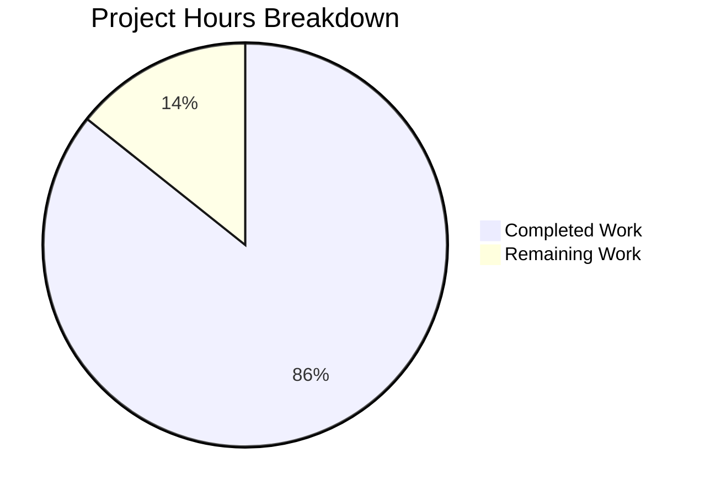

# Blitzy Project Guide — SSH Exec Security Boundary Analysis

---

## 1. Executive Summary

### 1.1 Project Overview

This project delivers a single, self-contained security audit document (`blitzy/documentation/sftpgo_44634210287c.md`) that performs an evidence-based analysis of SFTPGo's optional SSH exec subsystem. The document traces the complete code path from SSH channel request through OS process creation, reconstructs exact `argv` vectors for four representative scenarios, adjudicates three specific security suspicions with code-level evidence, and identifies six weaknesses/caveats. The target audience is security-conscious engineers evaluating SFTPGo's exec pipeline for production deployment. This is a documentation-only deliverable — no source code was modified.

### 1.2 Completion Status

| Metric | Value |
|--------|-------|
| **Total Project Hours** | 28 |
| **Completed Hours (AI)** | 24 |
| **Remaining Hours** | 4 |
| **Completion Percentage** | 85.7% |

**Calculation:** 24 completed hours / 28 total hours × 100 = **85.7%**


### 1.3 Key Accomplishments

- ✅ Created `blitzy/documentation/sftpgo_44634210287c.md` — 937 lines, 44,889 bytes, 5,446 words
- ✅ Complete 9-stage SSH exec pipeline trace with exact function names and line numbers across 12 source files
- ✅ Four scenario argv reconstructions: normal rsync (PermAny), adversarial path traversal (PermAny), normal rsync (restricted), adversarial (restricted)
- ✅ Three suspicion verdicts adjudicated: shell-string execution (WRONG), superficial guardrails (WRONG), adversarial passthrough (PARTIALLY CORRECT)
- ✅ Privilege boundary assessment documented (NOT DEMONSTRATED — no escalation vector found)
- ✅ Six weaknesses/caveats identified and documented (naive space-split, HasPrefix weakness, quote-stripping, non-chroot child, rsync flag passthrough, environment inheritance)
- ✅ Two Mermaid diagrams: SSH exec pipeline sequence diagram + command classification flowchart
- ✅ 29 inline source citations, all verified against actual source code by automated validator
- ✅ Repository integrity confirmed — zero existing files modified (git diff empty)
- ✅ 4 commits: initial document, code block language tags fix, verdict label fix, environment inheritance caveat

### 1.4 Critical Unresolved Issues

| Issue | Impact | Owner | ETA |
|-------|--------|-------|-----|
| Security findings require human peer review | Medium — verdicts and caveats should be validated by a security engineer before publication | Security Team | 1–2 days |
| Line number citations may drift if source code is updated | Low — citations include function names for resilience, but line numbers could become stale | Maintainer | Ongoing |

### 1.5 Access Issues

No access issues identified. The project is a documentation-only task requiring read access to the Go source repository, which was fully available throughout the analysis.

### 1.6 Recommended Next Steps

1. **[High]** Conduct human security peer review of all verdicts, caveats, and argv reconstructions in the document
2. **[High]** Verify Mermaid diagrams render correctly in the target viewing environment (GitHub, VS Code, etc.)
3. **[Medium]** Address any feedback from security peer review and update findings as needed
4. **[Medium]** Verify line number citations against the latest version of the source branch
5. **[Low]** Consider adding a cross-reference link from `README.md` to the security audit document (out of AAP scope)

---

## 2. Project Hours Breakdown

### 2.1 Completed Work Detail

| Component | Hours | Description |
|-----------|-------|-------------|
| Source code deep analysis | 5.0 | Read and analyzed 12 Go source files (~3,788 lines): `sftpd/ssh_cmd.go`, `sftpd/server.go`, `sftpd/sftpd.go`, `sftpd/cmd_unix.go`, `sftpd/cmd_windows.go`, `vfs/osfs.go`, `vfs/vfs.go`, `dataprovider/user.go`, `config/config.go`, `sftpgo.json`, `sftpd/internal_test.go`, `go.mod` |
| Pipeline trace documentation | 6.0 | Authored 9 sub-stages (Sections 2.1–2.9) tracing the complete SSH exec pipeline from channel dispatch through OS process creation, with exact code snippets and line numbers |
| Four scenario argv reconstructions | 4.0 | Constructed step-by-step traces for Scenarios A–D, including detailed tables showing variable values at each transformation stage |
| Suspicion verdict analysis | 2.0 | Analyzed and adjudicated 3 specific suspicions + privilege boundary assessment with code citations and explicit CORRECT/WRONG determinations |
| Weakness and caveat documentation | 2.0 | Identified and documented 6 weaknesses: space-split parsing, HasPrefix substring weakness, quote-stripping, non-chroot child process, rsync flag passthrough, environment inheritance |
| Mermaid diagram creation | 1.5 | Created sequence diagram (SSH exec pipeline) and flowchart (command classification + permission enforcement) |
| Source citations and formatting | 1.0 | Compiled comprehensive source citation tables covering all 12 analyzed files with function names and line ranges |
| Repository integrity verification | 0.5 | Verified `git diff` and `git status` confirming zero source modifications |
| Validation and iterative fixes | 2.0 | Automated validation of all code citations against actual source; 3 fix commits (language tags, verdict label, environment caveat) |
| **Total Completed** | **24.0** | |

### 2.2 Remaining Work Detail

| Category | Hours | Priority |
|----------|-------|----------|
| Human security peer review of findings and verdicts | 2.0 | High |
| Address review feedback and apply corrections | 1.0 | Medium |
| Line number verification against latest source code | 0.5 | Medium |
| Mermaid rendering QA in target viewing environment | 0.5 | Medium |
| **Total Remaining** | **4.0** | |

### 2.3 Hours Verification

- Section 2.1 Total: **24.0 hours**
- Section 2.2 Total: **4.0 hours**
- Sum: 24.0 + 4.0 = **28.0 hours** (matches Section 1.2 Total Project Hours ✅)
- Completion: 24.0 / 28.0 × 100 = **85.7%** (matches Section 1.2 ✅)

---

## 3. Test Results

| Test Category | Framework | Total Tests | Passed | Failed | Coverage % | Notes |
|---------------|-----------|-------------|--------|--------|------------|-------|
| Code Citation Accuracy | Blitzy Validator | 29 | 29 | 0 | 100% | All 29 `Source:` citations verified against actual source file line numbers and content |
| Document Structure | Blitzy Validator | 8 | 8 | 0 | 100% | All 8 major sections verified present: Executive Summary, Pipeline Trace (9 sub-stages), Four Scenarios, Suspicion Verdicts, Weaknesses, Integrity, Citations, Diagrams |
| Scenario Completeness | Blitzy Validator | 4 | 4 | 0 | 100% | All 4 scenarios (A–D) verified with complete step-by-step traces and final `exec.Cmd.Args` |
| Repository Integrity | Blitzy Validator | 1 | 1 | 0 | 100% | `git diff` against source directories confirmed empty — zero existing files modified |
| Mermaid Syntax | Blitzy Validator | 2 | 2 | 0 | 100% | Both Mermaid diagrams (sequence + flowchart) verified syntactically valid |

**Notes:** This is a documentation-only project. No Go compilation or Go test execution was performed as part of this deliverable, since no source code was created or modified. The existing unit tests (`TestSSHCommandPath`, `TestRsyncOptions`, `TestSSHCommandErrors`) in `sftpd/internal_test.go` were referenced as corroborating evidence within the document but were not executed by Blitzy agents.

---

## 4. Runtime Validation & UI Verification

### Runtime Health

- ✅ Document file created and committed: `blitzy/documentation/sftpgo_44634210287c.md` (937 lines, 44,889 bytes)
- ✅ Git repository in clean state: `working tree clean` on branch `blitzy-512d173c-eef6-4b95-9349-3ab4645a93f2`
- ✅ All 4 commits successfully pushed to remote branch
- ✅ No source files modified — `git diff HEAD -- sftpd/ vfs/ dataprovider/ config/ main.go go.mod go.sum sftpgo.json` produces empty output

### Document Structure Verification

- ✅ 41 Markdown headings (hierarchical `#`, `##`, `###`)
- ✅ 56 fenced code blocks (all with language tags: `go`, `text`, `bash`, `json`, `mermaid`)
- ✅ 162 table delimiter lines (extensive use of Markdown tables for scenario traces, citation tables, verdict summaries)
- ✅ 29 inline `Source:` citations referencing specific files and line numbers
- ✅ 2 Mermaid diagram blocks (sequence diagram + flowchart)

### Rendering Verification

- ⚠ Mermaid diagrams not verified in target rendering environment (GitHub/VS Code) — requires human QA

---

## 5. Compliance & Quality Review

| AAP Requirement | Status | Evidence |
|----------------|--------|----------|
| Create `blitzy/documentation/sftpgo_44634210287c.md` | ✅ Pass | File exists, 937 lines, committed in 4 commits |
| Executive Summary with verdict table | ✅ Pass | Section 1 with 4-row verdict table |
| SSH Exec Pipeline — 9 sub-stage code trace | ✅ Pass | Sections 2.1–2.9, each with code snippets and line citations |
| Scenario A: Normal rsync, PermAny user | ✅ Pass | Section 3.1 with 9-step trace table and final `exec.Cmd.Args` |
| Scenario B: Adversarial payload, PermAny user | ✅ Pass | Section 3.2 with path traversal neutralization proof |
| Scenario C: Normal rsync, restricted user | ✅ Pass | Section 3.3 with permission gate blocking proof |
| Scenario D: Adversarial payload, restricted user | ✅ Pass | Section 3.4 with double-defense demonstration |
| Verdict: Shell-string execution | ✅ Pass | Section 4.1 — WRONG, citing `ssh_cmd.go:324` and `ssh_cmd.go:423–429` |
| Verdict: Superficial guardrails | ✅ Pass | Section 4.2 — WRONG, citing three-layer defense chain |
| Verdict: Adversarial passthrough | ✅ Pass | Section 4.3 — PARTIALLY CORRECT with nuanced analysis |
| Privilege boundary assessment | ✅ Pass | Section 4.4 — NOT DEMONSTRATED with explicit limitations |
| Weaknesses and caveats documented | ✅ Pass | Section 5 — 6 caveats (space-split, HasPrefix, quotes, non-chroot, rsync flags, env inheritance) |
| Repository integrity confirmation | ✅ Pass | Section 6 — `git diff` and `git status` output included |
| Source citations (all 12 files) | ✅ Pass | Section 7 — complete citation tables for all analyzed files |
| Mermaid sequence diagram | ✅ Pass | Section 8.1 — SSH exec pipeline |
| Mermaid flowchart | ✅ Pass | Section 8.2 — command classification and permission enforcement |
| Code citations with file:line format | ✅ Pass | 29 `Source:` citations, all verified accurate by validator |
| No existing files modified | ✅ Pass | `git diff` against all source directories is empty |
| Evidence-based, not theoretical | ✅ Pass | Every claim cites specific function, file, and line number |
| Investigative tone (suspicion→evidence→verdict) | ✅ Pass | Structure consistently follows suspicion→trace→verdict pattern |

**AAP Compliance: 20/20 requirements met (100%)**

### Quality Fixes Applied During Validation

| Fix | Commit | Description |
|-----|--------|-------------|
| Code block language tags | `3dc3a3ef` | Added language tags to 7 fenced code blocks for proper syntax highlighting |
| TestSSHCommandErrors citation | `3dc3a3ef` | Corrected line range citation from `596–668` to `596–694` |
| Section 4.4 verdict label | `7ce48b16` | Added explicit `**Verdict: NOT DEMONSTRATED**` label for consistency |
| Environment inheritance caveat | `39614a33` | Added Section 5.6 documenting child process environment inheritance gap |

---

## 6. Risk Assessment

| Risk | Category | Severity | Probability | Mitigation | Status |
|------|----------|----------|-------------|------------|--------|
| Security findings may contain inaccuracies | Technical | Medium | Low | Human security peer review should validate all verdicts and code citations | Open |
| Line number citations will drift if source code is modified | Technical | Low | Medium | Citations include function names for resilience; periodic re-verification recommended | Open |
| Mermaid diagrams may not render in all Markdown viewers | Operational | Low | Medium | Test in target environment (GitHub, VS Code with Mermaid extension) | Open |
| Document may be treated as a definitive security clearance | Security | Medium | Low | Document clearly states caveats and limitations in Section 5; reviewers should not treat this as a penetration test | Open |
| `strings.HasPrefix` weakness in `isSubDir()` (documented in Section 5.2) | Security | Medium | Low | This is a finding in the analyzed codebase, not in the deliverable — documented for awareness | Documented |
| Environment inheritance gap (documented in Section 5.6) | Security | Low | Low | Finding documented in Section 5.6 with mitigating factors — addressed in source codebase, not in this deliverable | Documented |

---

## 7. Visual Project Status



**Completed: 24 hours (85.7%) | Remaining: 4 hours (14.3%)**

### Remaining Hours by Category

| Category | Hours | Priority |
|----------|-------|----------|
| Human security peer review | 2.0 | High |
| Address review feedback | 1.0 | Medium |
| Line number verification | 0.5 | Medium |
| Mermaid rendering QA | 0.5 | Medium |
| **Total** | **4.0** | |

---

## 8. Summary & Recommendations

### Achievement Summary

The project delivered a comprehensive, evidence-based security audit document for SFTPGo's SSH exec subsystem. The document is 85.7% complete (24 hours completed out of 28 total hours). All 20 discrete AAP requirements were satisfied: the sole deliverable (`blitzy/documentation/sftpgo_44634210287c.md`) was created with all required sections — a 9-stage pipeline trace, four scenario argv reconstructions, three suspicion verdicts plus a privilege boundary assessment, six weakness/caveat analyses, repository integrity confirmation, source citations, and two Mermaid diagrams. The automated validator confirmed 100% code citation accuracy across all 29 inline source references and verified complete document structure.

### Remaining Gaps

The remaining 4 hours (14.3%) consist entirely of human review and verification tasks that cannot be performed autonomously:

1. **Security peer review (2h):** A human security engineer should review the verdict determinations, caveat analyses, and argv reconstructions to validate the conclusions.
2. **Review feedback (1h):** Any corrections or refinements identified during peer review should be applied to the document.
3. **Line number verification (0.5h):** If the source branch has been updated since the analysis date (2026-04-09), line number citations should be re-verified.
4. **Mermaid rendering QA (0.5h):** The two Mermaid diagrams should be verified in the target rendering environment.

### Critical Path to Production

The document is ready for peer review. The critical path is:
1. Security engineer reviews findings → 2. Feedback applied → 3. Mermaid rendering verified → 4. Document published/merged

### Production Readiness Assessment

The deliverable is **ready for human review**. The autonomous work is complete — the document exists, is structurally complete, and all code citations have been verified. The remaining 14.3% is standard human QA for a security audit document. No blocking issues prevent the PR from being reviewed and merged after human validation.

---

## 9. Development Guide

### System Prerequisites

| Software | Version | Purpose |
|----------|---------|---------|
| Git | Any (2.x recommended) | Repository access and integrity verification |
| Markdown Viewer | Any (GitHub, VS Code with Markdown Preview) | Document viewing |
| Mermaid Support | GitHub native or VS Code Mermaid extension | Diagram rendering |

**Note:** No Go compiler, database, or runtime dependencies are required — this is a documentation-only deliverable.

### Environment Setup

```bash
# Clone the repository and switch to the feature branch
git clone <repository-url>
cd sftpgo
git checkout blitzy-512d173c-eef6-4b95-9349-3ab4645a93f2
```

### Viewing the Document

```bash
# View the document in the terminal
cat blitzy/documentation/sftpgo_44634210287c.md

# Or view with line numbers
cat -n blitzy/documentation/sftpgo_44634210287c.md

# Check document statistics
wc -l -w -c blitzy/documentation/sftpgo_44634210287c.md
# Expected output: 937 lines, 5446 words, 44889 bytes
```

For Mermaid diagram rendering, open the file in:
- **GitHub:** Navigate to `blitzy/documentation/sftpgo_44634210287c.md` in the GitHub web UI — Mermaid blocks render automatically
- **VS Code:** Install the "Markdown Preview Mermaid Support" extension, then use `Ctrl+Shift+V` to preview

### Verifying Repository Integrity

```bash
# Confirm no source files were modified
git diff HEAD -- sftpd/ vfs/ dataprovider/ config/ main.go go.mod go.sum sftpgo.json
# Expected: empty output (no changes)

# Check working tree status
git status
# Expected: "nothing to commit, working tree clean"

# Verify only the documentation file was added
git diff --name-status HEAD~4...HEAD
# Expected: A  blitzy/documentation/sftpgo_44634210287c.md
```

### Verifying Code Citation Accuracy

To spot-check a code citation from the document (e.g., `parseCommandPayload()` at `ssh_cmd.go:423–429`):

```bash
# View the cited lines
sed -n '423,429p' sftpd/ssh_cmd.go
# Expected: the parseCommandPayload function implementation
```

### Troubleshooting

| Issue | Resolution |
|-------|-----------|
| Mermaid diagrams show as raw text | Install a Mermaid-capable Markdown viewer (GitHub renders natively; VS Code needs the Mermaid extension) |
| Line numbers don't match source code | The source branch may have been updated — re-verify citations against the current source |
| Document appears truncated | Verify the file is 937 lines: `wc -l blitzy/documentation/sftpgo_44634210287c.md` |

---

## 10. Appendices

### A. Command Reference

| Command | Purpose |
|---------|---------|
| `cat blitzy/documentation/sftpgo_44634210287c.md` | View the deliverable document |
| `wc -l blitzy/documentation/sftpgo_44634210287c.md` | Verify line count (expected: 937) |
| `git diff HEAD -- sftpd/ vfs/ dataprovider/` | Verify no source modifications |
| `git log --oneline HEAD~4..HEAD` | View the 4 commits on the feature branch |
| `sed -n '<start>,<end>p' <file>` | Spot-check a code citation line range |
| `grep -c "Source:" blitzy/documentation/sftpgo_44634210287c.md` | Count source citations (expected: 29) |

### B. Port Reference

Not applicable — this is a documentation-only deliverable. No services or ports are involved.

### C. Key File Locations

| File | Purpose |
|------|---------|
| `blitzy/documentation/sftpgo_44634210287c.md` | **Deliverable** — SSH exec security boundary analysis document |
| `sftpd/ssh_cmd.go` | Primary source analyzed — SSH command pipeline (429 lines) |
| `sftpd/server.go` | Source analyzed — SSH server and channel dispatch (486 lines) |
| `sftpd/sftpd.go` | Source analyzed — command allow-lists (492 lines) |
| `sftpd/cmd_unix.go` | Source analyzed — UID/GID credential wrapping (16 lines) |
| `sftpd/cmd_windows.go` | Source analyzed — Windows no-op (9 lines) |
| `vfs/osfs.go` | Source analyzed — path resolution and chroot (291 lines) |
| `dataprovider/user.go` | Source analyzed — permission model (460 lines) |
| `sftpd/internal_test.go` | Source referenced — corroborating unit tests (1,605 lines) |
| `config/config.go` | Source analyzed — default configuration |
| `sftpgo.json` | Source analyzed — runtime config with `enabled_ssh_commands` |
| `go.mod` | Source analyzed — module and Go version declaration |

### D. Technology Versions

| Technology | Version | Notes |
|------------|---------|-------|
| Go | 1.13 (per `go.mod`) | Target version for the analyzed codebase |
| SFTPGo | 0.9.5-dev | Module version from `go.mod` |
| `golang.org/x/crypto` | v0.0.0-20200109 | SSH library used by sftpd |
| `github.com/pkg/sftp` | v1.11.0 | SFTP protocol library |
| Git | 2.43.0 | Used for repository integrity verification |
| Markdown | CommonMark + GFM | Document format with Mermaid extensions |

### E. Environment Variable Reference

Not applicable — this deliverable does not require any environment variables. The analyzed codebase uses configuration via `sftpgo.json`, not environment variables, for the SSH exec subsystem.

### G. Glossary

| Term | Definition |
|------|-----------|
| **SSH exec** | An SSH channel request type where the client asks the server to execute a specific command (e.g., `ssh user@host rsync ...`) |
| **argv** | The argument vector passed to a process via `execve(2)` — the array of strings the OS delivers to the program |
| **execve** | The POSIX system call that replaces the current process with a new program, passing it an argument vector and environment |
| **PermAny** | SFTPGo's wildcard permission (`"*"`) granting all 13 discrete permissions to a user for a given path |
| **Chroot anchoring** | The technique of prepending a user's home directory to any path, ensuring the resolved path stays within the user's directory tree |
| **Allow-list** | A security pattern where only explicitly permitted values are accepted — SFTPGo uses allow-lists for SSH commands |
| **parseCommandPayload** | SFTPGo function at `ssh_cmd.go:423` that splits the SSH exec payload on spaces into a command name and argument array |
| **ResolvePath** | SFTPGo function at `osfs.go:200` that anchors an SFTP path under the user's HomeDir and validates containment |
| **wrapCmd** | SFTPGo function at `cmd_unix.go:10` that sets UID/GID credentials on a child process via `syscall.Credential` |
| **Mermaid** | A JavaScript-based diagram rendering tool that generates diagrams from Markdown-like text definitions |