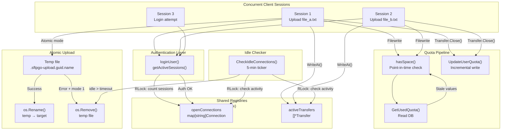

# Technical Specification

# 0. Agent Action Plan

## 0.1 Intent Clarification

### 0.1.1 Core Feature Objective

Based on the prompt, the Blitzy platform understands that the new feature requirement is to produce a comprehensive investigative analysis document that answers deep behavioral questions about the SFTPGo server's concurrency model — specifically how connection handling, quota enforcement, and atomic upload mechanisms interact under realistic concurrent stress. The deliverable is a standalone markdown document placed in the repository's `blitzy/documentation` directory, named `sftpgo_44634210287c.md`, that serves as an onboarding reference for engineers entering the codebase.

The feature requirements, restated with enhanced clarity, are:

- **Concurrent session limiting under load** — Determine exactly what happens when a user whose `MaxSessions` is set close to the limit attempts to open multiple sessions concurrently while uploads are in flight. The analysis must trace the code path through `loginUser()` in `sftpd/server.go` (lines 365–394) where `getActiveSessions()` (lines 200–210) counts entries in the `openConnections` map under a read lock, and document how a session-count race manifests between the authentication check and the `addConnection()` registration.

- **Quota enforcement under concurrent uploads** — Analyze how two or more simultaneous uploads from the same user interact with the quota system. The analysis must trace the `hasSpace()` check in `sftpd/handler.go` (lines 515–534), which queries `dataprovider.GetUsedQuota()` for the *stored* quota values, not the in-flight bytes. It must also trace the `UpdateUserQuota()` call in `Transfer.Close()` (`sftpd/transfer.go`, lines 166–168) where the delta is persisted only on transfer completion, and characterize the TOCTOU (time-of-check-to-time-of-use) window between the initial quota check and the final quota update.

- **Idle connection monitoring interaction** — Document what happens when the idle connection ticker (5-minute interval per `sftpd/sftpd.go`, line 132) fires and the `CheckIdleConnections()` function (lines 331–352) determines a connection exceeds `idleTimeout`, while that connection has an active atomic upload in progress. The analysis must clarify how the transfer-level `lastActivity` timestamp (updated on each `WriteAt`) affects whether the idle checker closes the connection.

- **Atomic upload cleanup on abnormal termination** — Trace the specific code path taken when a connection is forcefully closed mid-upload in atomic mode (`uploadModeAtomic` = 1). The analysis must follow the chain from `c.close()` in `sftpd/handler.go` (lines 536–542), through the SSH channel/net connection close, to the eventual `Transfer.Close()` invocation, and document what happens to the temporary file (named `.sftpgo-upload.<guid>.<original>` per `vfs/osfs.go`, line 178) and the quota accounting.

- **Observable evidence** — Catalog the specific log messages, their senders, and their severity levels that would appear in each scenario: successful upload, quota rejection, session rejection, idle disconnect, and mid-stream transfer failure. Document the concrete file-system artifacts (temporary files, final files, missing files) and the quota field values at each stage.

- **Gap identification** — Identify any race conditions, cleanup failures, or accounting inconsistencies that the code design permits under concurrent stress, with specific code references and reasoning.

**Implicit requirements detected:**

- The analysis must distinguish behavior across all three upload modes: standard (0), atomic (1), and atomic-with-resume (2), since the cleanup logic in `Transfer.Close()` diverges significantly between modes at lines 134–148 of `sftpd/transfer.go`.
- The analysis must account for the different data provider backends (SQL, BoltDB, Memory) since quota update atomicity varies: SQL backends use incremental `UPDATE ... SET used_quota_size = used_quota_size + $1` (non-transactional per call), BoltDB uses serialized read-modify-write within `bolt.Update`, and the Memory provider uses a simple mutex-protected in-place update.
- The analysis must cover both SFTP and SCP upload paths, since both implement independent quota checking and atomic upload support (compare `sftpd/handler.go` lines 412–513 with `sftpd/scp.go` lines 184–284).

### 0.1.2 Special Instructions and Constraints

- **Repository immutability**: The user explicitly states "keep the actual repository unchanged and clean up any test artifacts when you're done." Per the project rules, no existing files may be modified and no code may be added other than the requested documentation markdown file.
- **Output location**: The generated document must be placed at `blitzy/documentation/sftpgo_44634210287c.md` in the destination repository.
- **Evidence-based answers**: All conclusions must be grounded in specific code paths, line references, and structural reasoning — not assumptions or speculation.
- **Thinking and rationale**: The document must include reasoning and rationale behind every answer, per the SWE-AtlasQnA-Repo rule.

### 0.1.3 Technical Interpretation

These feature requirements translate to the following technical implementation strategy:

- To **answer the concurrent session-limiting questions**, we will analyze the `loginUser()` → `getActiveSessions()` → `addConnection()` call chain in `sftpd/server.go` and `sftpd/sftpd.go`, documenting the RWMutex acquisition patterns and the gap between the read-lock session count check (authentication time) and the write-lock connection registration (SFTP subsystem setup time).

- To **answer the quota coordination questions**, we will analyze the `hasSpace()` → `GetUsedQuota()` → `Transfer.WriteAt()` → `Transfer.Close()` → `UpdateUserQuota()` pipeline across `sftpd/handler.go`, `sftpd/transfer.go`, `dataprovider/dataprovider.go`, and the concrete provider implementations (`dataprovider/sqlcommon.go` lines 74–90, `dataprovider/bolt.go` lines 180–209, `dataprovider/memory.go` lines 119–140), documenting where serialization occurs and where it does not.

- To **answer the idle checker interaction questions**, we will analyze the `startIdleTimer()` → `CheckIdleConnections()` flow in `sftpd/sftpd.go` (lines 320–352), specifically the transfer-activity comparison loop at lines 336–345 that uses `time.Since(t.lastActivity)` to prevent closing connections with active transfers.

- To **answer the atomic upload cleanup questions**, we will analyze `Transfer.Close()` in `sftpd/transfer.go` (lines 121–170), the branching logic at lines 134–148 that decides between `os.Rename()` (success or atomic-with-resume) and `os.Remove()` (error in pure atomic mode), and the quota reversal at lines 142–144 (`numFiles--`, `bytesReceived = 0`).

- To **produce the observable evidence catalog**, we will enumerate every `logger.Log()`, `logger.TransferLog()`, `logger.CommandLog()`, and `logger.Warn()` call in the affected code paths, mapping each to its sender tag, severity level, and format string, so the document provides a concrete lookup table for operators.

- To **deliver the document**, we will create a single markdown file at `blitzy/documentation/sftpgo_44634210287c.md` containing all analysis, code-path traces, and evidence tables.

## 0.2 Repository Scope Discovery

### 0.2.1 Comprehensive File Analysis

The analysis document requires deep reading and citation of the following existing repository files. Every file listed below has been read and its relevance confirmed by direct inspection.

**Core SFTP Server and Connection Handling:**

| File Path | Relevance | Key Lines / Functions |
|-----------|-----------|----------------------|
| `sftpd/sftpd.go` | Central registry: `openConnections` map, `activeTransfers` slice, `activeQuotaScans` slice, shared `sync.RWMutex`, idle connection checker, upload mode constants | `init()` (130–133), `getActiveSessions()` (200–210), `addConnection()` (354–360), `removeConnection()` (362–376), `addTransfer()` (378–382), `removeTransfer()` (384–403), `CheckIdleConnections()` (331–352), `startIdleTimer()` (320–328), `updateConnectionActivity()` (405–412), `isAtomicUploadEnabled()` (414–416) |
| `sftpd/server.go` | SSH listener, handshake, authentication callbacks, session limit check, SFTP handler wiring, connection lifecycle | `Configuration.Initialize()` (117–198), `AcceptInboundConnection()` (243–333), `handleSftpConnection()` (335–353), `loginUser()` (365–394), `validatePasswordCredentials()` (448–461), `validatePublicKeyCredentials()` (432–446) |
| `sftpd/handler.go` | Per-connection SFTP request dispatch, quota checks (`hasSpace`), atomic upload path branching, upload/overwrite handler, file removal with quota deduction | `Connection` struct (21–39), `Filewrite()` (98–134), `handleSFTPUploadToNewFile()` (412–448), `handleSFTPUploadToExistingFile()` (450–513), `hasSpace()` (515–534), `handleSFTPRemove()` (381–410), `close()` (536–542) |
| `sftpd/transfer.go` | Transfer I/O lifecycle, atomic upload rename/delete on close, quota update trigger, bandwidth throttling, error propagation | `Transfer` struct (28–48), `TransferError()` (52–65), `ReadAt()` (69–87), `WriteAt()` (91–114), `Close()` (121–170), `handleThrottle()` (190–210), `copyFromReaderToWriter()` (215–261) |
| `sftpd/scp.go` | SCP upload/download handler with independent quota check and atomic upload support | `scpCommand.handle()` (32–62), `handleUploadFile()` (184–224), `handleUpload()` (226–284), `getUploadFileData()` (141–182) |
| `sftpd/ssh_cmd.go` | SSH command subsystem, SCP dispatch, quota-exceeded error | `processSSHCommand()` (45–80), `errQuotaExceeded` (29) |

**Data Provider and Quota Management:**

| File Path | Relevance | Key Lines / Functions |
|-----------|-----------|----------------------|
| `dataprovider/dataprovider.go` | Provider interface, quota update/query orchestration, `TrackQuota` configuration, `ManageUsers` gate, external auth delegation | `Provider` interface (220–235), `UpdateUserQuota()` (312–322), `GetUsedQuota()` (326–331), `CheckUserAndPass()` (279–288), `Initialize()` (243–276), `Config.TrackQuota` (135) |
| `dataprovider/user.go` | User model: `QuotaFiles`, `QuotaSize`, `UsedQuotaSize`, `UsedQuotaFiles`, `MaxSessions`, permissions, `HasQuotaRestrictions()` | `User` struct (64–110), `HasQuotaRestrictions()` (258–260), `HasPerm()` (159–165), `GetFilesystem()` (113–118), `IsLoginAllowed()` (185–214) |
| `dataprovider/sqlcommon.go` | Shared SQL execution: quota update with incremental `UPDATE`, quota read, user hydration | `sqlCommonUpdateQuota()` (74–90), `sqlCommonGetUsedQuota()` (109–126) |
| `dataprovider/sqlqueries.go` | SQL text: `getUpdateQuotaQuery()` (incremental vs reset), `getQuotaQuery()` | `getUpdateQuotaQuery()` (43–50), `getQuotaQuery()` (56–59) |
| `dataprovider/bolt.go` | BoltDB provider: serialized read-modify-write quota update within `bolt.Update` transaction | `updateQuota()` (180–209), `getUsedQuota()` (211–218) |
| `dataprovider/memory.go` | Memory provider: mutex-protected in-place quota update | `updateQuota()` (119–140), `getUsedQuota()` (142–154) |

**Virtual Filesystem Abstraction:**

| File Path | Relevance | Key Lines / Functions |
|-----------|-----------|----------------------|
| `vfs/vfs.go` | `Fs` interface (18 methods), `GetSFTPError()`, `SetPathPermissions()`, `IsLocalOsFs()` | `Fs` interface (18–43), `SetPathPermissions()` (99–108) |
| `vfs/osfs.go` | Local filesystem: atomic upload path generation (`.sftpgo-upload.<guid>.<name>`), root path checks, symlink safety | `GetAtomicUploadPath()` (175–179), `IsAtomicUploadSupported()` (123–125), `ScanRootDirContents()` (155–172), `ResolvePath()` (200–223) |
| `vfs/s3fs.go` | S3 backend: atomic uploads NOT supported (`IsAtomicUploadSupported()` returns false) | Relevant for documenting that S3 users are not affected by atomic upload race conditions |

**Service, Configuration, and Observability:**

| File Path | Relevance | Key Lines / Functions |
|-----------|-----------|----------------------|
| `service/service.go` | Service startup: SFTP and HTTP server goroutine launch, provider injection, portable mode | `Start()` (47–130), `StartPortableMode()` (131–217) |
| `config/config.go` | Configuration loading and validation, upload mode validation, Viper integration | `LoadConfig()`, init defaults including `UploadMode` and `IdleTimeout` |
| `sftpgo.json` | Default runtime configuration: port 2022, idle timeout 15 min, upload mode 0 (standard), track_quota 2 | Full file — documents default operational parameters |
| `logger/logger.go` | Structured logging: `TransferLog()`, `CommandLog()`, `ConnectionFailedLog()` sender/level formatting | Used by all sftpd code for audit-grade logging |
| `metrics/metrics.go` | Prometheus instrumentation: `TransferCompleted()`, `UpdateActiveConnectionsSize()`, `AddLoginAttempt()`, `AddLoginResult()` | Called at every lifecycle boundary for observability |

**HTTP API for Quota Management:**

| File Path | Relevance | Key Lines / Functions |
|-----------|-----------|----------------------|
| `httpd/api_quota.go` | REST quota scan: single-flight enforcement via `AddQuotaScan()`, filesystem walk, reset-mode `UpdateUserQuota()` | `startQuotaScan()` (16–34), `doQuotaScan()` (36–51) |

### 0.2.2 Integration Point Discovery

The following integration points are critical to the analysis because they represent handoff boundaries where concurrency races can occur:

- **Authentication → Connection Registry**: `loginUser()` reads session count under `RLock`, but `addConnection()` writes under `Lock`, creating a window between check and registration.
- **Quota Check → Quota Update**: `hasSpace()` queries stored quota from the data provider, but `UpdateUserQuota()` is called only when `Transfer.Close()` runs, creating a TOCTOU window for concurrent uploads.
- **Idle Checker → Transfer Activity**: `CheckIdleConnections()` reads both `openConnections` and `activeTransfers` under a single `RLock`, comparing `c.lastActivity` and `t.lastActivity` to determine effective idle time.
- **Transfer Close → Atomic File Operation**: `Transfer.Close()` executes `os.Rename()` or `os.Remove()` on the temp file, then calls `removeTransfer()` and `UpdateUserQuota()` — the ordering means the file operation occurs before the transfer registry cleanup.
- **SCP vs SFTP Quota Paths**: Both SFTP (`handler.go`) and SCP (`scp.go`) independently call `hasSpace()` and `UpdateUserQuota()` with no shared coordination, meaning mixed-protocol concurrent uploads double the race window.

### 0.2.3 New File Requirements

- **CREATE**: `blitzy/documentation/sftpgo_44634210287c.md` — The comprehensive analysis document answering all behavioral questions about connection handling, quota enforcement, and atomic upload mechanics under concurrency. This is the sole deliverable.

No other new source files, test files, or configuration files are required, per the constraint that no existing repository files may be modified and no code may be added beyond the documentation artifact.

## 0.3 Dependency Inventory

### 0.3.1 Key Packages Relevant to the Analysis

The following packages from `go.mod` are directly relevant to understanding the concurrency, file I/O, and transfer behavior under analysis. All names and versions are taken from the project's `go.mod` file.

| Registry | Package | Version | Purpose in Analysis |
|----------|---------|---------|---------------------|
| Go modules | `github.com/drakkan/sftpgo` | module root (Go 1.13) | Top-level module; targets Go 1.13 with module mode |
| Go modules | `github.com/pkg/sftp` | v1.11.0 | SFTP protocol library; provides `sftp.NewRequestServer`, `sftp.Handlers`, `sftp.Request`, `sftp.FileOpenFlags` — the request dispatch that invokes `Connection.Filewrite()` |
| Go modules | `golang.org/x/crypto` | v0.0.0-20200109152110-61a87790db17 | SSH server implementation (`ssh.NewServerConn`, `ssh.ServerConfig`, `ssh.Channel`); governs handshake, auth callbacks, and channel lifecycle |
| Go modules | `github.com/eikenb/pipeat` (replaced by `github.com/drakkan/pipeat`) | v0.0.0-20200114135659-fac71c64d75d | Pipe-based `io.WriterAt`/`io.ReaderAt` for S3 streaming uploads; used when VFS backend is S3 rather than local filesystem |
| Go modules | `go.etcd.io/bbolt` | v1.3.3 | BoltDB key/value store; serializes quota updates within `bolt.Update` transactions (single-writer model) |
| Go modules | `github.com/mattn/go-sqlite3` | v2.0.2+incompatible | SQLite3 driver; default data provider backend; relevant for understanding quota update atomicity at the SQL level |
| Go modules | `github.com/lib/pq` | v1.3.0 | PostgreSQL driver; alternative SQL backend for quota storage |
| Go modules | `github.com/go-sql-driver/mysql` | v1.5.0 | MySQL driver; alternative SQL backend for quota storage |
| Go modules | `github.com/rs/xid` | v1.2.1 | Globally unique ID generator; used in `GetAtomicUploadPath()` to create unique temp file names |
| Go modules | `github.com/rs/zerolog` | v1.17.2 | Structured JSON logger; all log messages documented in the analysis flow through this library |
| Go modules | `github.com/prometheus/client_golang` | v1.3.0 | Prometheus metrics; `TransferCompleted()`, `UpdateActiveConnectionsSize()`, `AddLoginAttempt()`, `AddLoginResult()` |
| Go modules | `gopkg.in/natefinsc/lumberjack.v2` | v2.0.0 | Log file rotation; used by `logger.InitLogger` for file-based logging |
| Go modules | `github.com/spf13/viper` | v1.6.1 | Configuration management; loads `sftpgo.json` settings including `upload_mode`, `idle_timeout`, `track_quota` |
| Go modules | `github.com/spf13/cobra` | v0.0.5 | CLI framework; `cmd/` package uses this for `serve` and `portable` commands |

### 0.3.2 Dependency Updates

No dependency additions or modifications are required. This task produces a documentation artifact only and does not alter any source code, configuration, or dependency manifests. All dependencies listed above are analyzed as-is for the behavioral investigation.

## 0.4 Integration Analysis

### 0.4.1 Existing Code Touchpoints

The analysis document must trace the following integration touchpoints to answer the user's questions accurately. These are the critical handoff boundaries where concurrent behavior emerges.

**Session Admission Control Chain:**

- `sftpd/server.go` → `validatePasswordCredentials()` / `validatePublicKeyCredentials()`: These authentication callbacks are invoked by the SSH library during handshake. They call `loginUser()` (line 365), which calls `getActiveSessions()` (line 372) to count active sessions under an `RLock` on the shared `mutex`.
- `sftpd/sftpd.go` → `getActiveSessions()` (lines 200–210): Acquires `mutex.RLock()`, iterates `openConnections` map counting entries matching the username, and returns the count. This is a point-in-time snapshot that can become stale immediately.
- `sftpd/server.go` → `AcceptInboundConnection()` (line 289): After authentication succeeds, `CheckRootPath` and login logging occur, but the connection is NOT yet registered in `openConnections`. Registration happens later in `handleSftpConnection()` (line 336) via `addConnection()`.
- `sftpd/sftpd.go` → `addConnection()` (lines 354–360): Acquires `mutex.Lock()` and inserts the connection. The time gap between `getActiveSessions()` (read lock during auth) and `addConnection()` (write lock during channel setup) is the session-count race window.

**Quota Enforcement Chain:**

- `sftpd/handler.go` → `hasSpace()` (lines 515–534): Called at upload initiation. Queries `dataprovider.GetUsedQuota()` which reads the *persisted* quota values from the database. Does NOT account for bytes currently in flight in other concurrent transfers.
- `dataprovider/dataprovider.go` → `GetUsedQuota()` (lines 326–331): Delegates to the active provider's `getUsedQuota()` method. For SQL backends this reads `used_quota_size` and `used_quota_files` from the users table.
- `sftpd/transfer.go` → `Transfer.Close()` (lines 121–170): Called when an upload completes (successfully or not). At line 167, calls `dataprovider.UpdateUserQuota(dataProvider, t.user, numFiles, t.bytesReceived, false)` with `reset=false`, meaning an *incremental* update.
- `dataprovider/dataprovider.go` → `UpdateUserQuota()` (lines 312–322): Checks `TrackQuota` configuration, then delegates to `provider.updateQuota()`. The SQL implementation uses `UPDATE ... SET used_quota_size = used_quota_size + $1` (line 48 of `sqlqueries.go`), which is atomic at the SQL row level but not coordinated with the `hasSpace()` check.
- **TOCTOU Window**: Between the `hasSpace()` check and `UpdateUserQuota()` call, there is no locking or reservation mechanism. Two concurrent uploads can both pass `hasSpace()` simultaneously, each seeing the same stored quota, and both proceed to write. Quota is only updated after each transfer completes, meaning the system can temporarily exceed limits.

**Atomic Upload File Lifecycle:**

- `sftpd/handler.go` → `Filewrite()` (line 106): When `isAtomicUploadEnabled()` returns true and `fs.IsAtomicUploadSupported()` returns true, the upload path is changed from the target path to the atomic temp path via `fs.GetAtomicUploadPath(p)`.
- `vfs/osfs.go` → `GetAtomicUploadPath()` (lines 175–179): Generates a path like `<dir>/.sftpgo-upload.<xid-guid>.<basename>` using `rs/xid` for uniqueness.
- `sftpd/transfer.go` → `Transfer.Close()` (lines 134–148): On success, renames temp to target (`os.Rename`). On error in atomic mode (mode 1), removes temp file (`os.Remove`) and zeroes out `bytesReceived` (line 144). On error in atomic-with-resume mode (mode 2), renames temp to target (preserving partial data for resume).
- **Cleanup on connection drop**: When the SSH connection is forcefully closed, the `Transfer.Close()` method is still called because `handleSftpConnection()` has `defer removeConnection(connection)`, and the SFTP request server's `Serve()` returns an error, which triggers the surrounding cleanup. The `Transfer.Close()` is invoked by the SFTP library's internal cleanup when the channel closes, which calls `TransferError()` first and then eventually `Close()`.

**Idle Connection Monitor Chain:**

- `sftpd/sftpd.go` → `startIdleTimer()` (lines 320–328): Starts a goroutine that reads from `idleConnectionTicker.C` (5-minute interval) and calls `CheckIdleConnections()`.
- `sftpd/sftpd.go` → `CheckIdleConnections()` (lines 331–352): Acquires `mutex.RLock()`, iterates all `openConnections`, and for each connection checks if any `activeTransfers` have more recent activity. If the effective idle time exceeds `idleTimeout`, it calls `c.close()` which closes the SSH channel and the underlying net connection.
- **Key interaction**: The idle checker uses `RLock` — meaning it does NOT prevent concurrent `addTransfer()` or `updateConnectionActivity()` from proceeding. However, within its snapshot, it correctly reads the most recent `t.lastActivity` for each transfer (line 339) and uses the minimum of connection idle time and transfer idle time to determine effective idleness. An active upload will have its `lastActivity` updated on each `WriteAt()` call, which prevents the idle checker from closing it.

### 0.4.2 Cross-Component Data Flow Under Concurrent Stress

### 0.4.3 Database / Schema Considerations

No schema modifications are required. The analysis document references the existing schema as defined by the SQL query builders in `dataprovider/sqlqueries.go`:

- **Quota fields in users table**: `used_quota_size` (int64), `used_quota_files` (int), `last_quota_update` (int64 — ms since epoch)
- **Incremental update query**: `UPDATE users SET used_quota_size = used_quota_size + $1, used_quota_files = used_quota_files + $2, last_quota_update = $3 WHERE username = $4`
- **Reset update query**: `UPDATE users SET used_quota_size = $1, used_quota_files = $2, last_quota_update = $3 WHERE username = $4`
- **Read query**: `SELECT used_quota_size, used_quota_files FROM users WHERE username = $1`

The incremental update is atomic at the SQL row level (single UPDATE statement), which means two concurrent `UpdateUserQuota()` calls will serialize at the database row lock. However, this does not prevent the TOCTOU race in the `hasSpace()` check, which reads stale values.

## 0.5 Technical Implementation

### 0.5.1 File-by-File Execution Plan

Since the deliverable is a single documentation artifact and no source code changes are permitted, the execution plan has one group:

**Group 1 — Documentation Deliverable:**

- **CREATE**: `blitzy/documentation/sftpgo_44634210287c.md`
  - Purpose: Comprehensive behavioral analysis document answering all questions posed by the user about SFTPGo's concurrent connection handling, quota enforcement, and atomic upload mechanisms.
  - Content structure:
    - Section on concurrent session admission: trace `loginUser()` → `getActiveSessions()` → `addConnection()` race window
    - Section on quota enforcement under concurrent uploads: trace `hasSpace()` → `GetUsedQuota()` → `WriteAt()` → `Close()` → `UpdateUserQuota()` TOCTOU gap
    - Section on idle checker interaction with active transfers: trace `CheckIdleConnections()` activity comparison logic
    - Section on atomic upload cleanup on abnormal termination: trace `Transfer.Close()` branching for modes 0/1/2 with and without `transferError`
    - Evidence catalog: tables of log messages, file states, and quota values for each scenario
    - Gap analysis: identified race conditions and their practical implications

### 0.5.2 Implementation Approach

The document will be structured to systematically answer each of the user's questions by walking through the code paths:

**Establishing the feature foundation:**

The analysis document will first establish the architectural context — the three shared registries (`openConnections`, `activeTransfers`, `activeQuotaScans`) protected by a single `sync.RWMutex` in `sftpd/sftpd.go`, the `Transfer` lifecycle in `sftpd/transfer.go`, and the quota pipeline spanning `sftpd/handler.go` through `dataprovider/`.

**Concurrent session behavior analysis:**

The document will trace the exact sequence when three clients attempt to authenticate concurrently against a user with `MaxSessions = 2`:
- Client A authenticates → `getActiveSessions()` returns 0 → auth succeeds → starts SFTP subsystem → `addConnection()` called
- Client B authenticates concurrently → `getActiveSessions()` may return 0 (if A hasn't reached `addConnection()` yet) → auth succeeds → race condition: both admitted
- Client C authenticates → `getActiveSessions()` returns 1 or 2 → rejected if 2, admitted if 1
- The document will explain that the race exists because `loginUser()` (line 372 of `server.go`) acquires `RLock` for the count check, releases it, and `addConnection()` (line 336 via `handleSftpConnection`) acquires `Lock` later in a different goroutine.

**Quota race analysis:**

The document will trace the TOCTOU window:
- Upload A calls `hasSpace(true)` → reads `numFile=5, size=900KB` from DB → `QuotaFiles=10, QuotaSize=1MB` → passes (5 < 10, 900KB < 1MB)
- Upload B calls `hasSpace(true)` concurrently → reads same stale values → also passes
- Both uploads proceed, each writing 200KB
- Upload A completes → `Transfer.Close()` calls `UpdateUserQuota(user, 1, 200KB, false)` → DB now: `numFile=6, size=1100KB` (exceeds 1MB!)
- Upload B completes → `Transfer.Close()` calls `UpdateUserQuota(user, 1, 200KB, false)` → DB now: `numFile=7, size=1300KB`
- The system has exceeded the configured quota because no reservation mechanism exists.

**Atomic upload cleanup analysis:**

The document will trace what happens when a connection is closed mid-upload:
- In atomic mode (1): `Transfer.Close()` sees `transferError != nil` → executes `os.Remove(t.file.Name())` → if removal succeeds, sets `numFiles--` and `bytesReceived = 0` → calls `UpdateUserQuota()` with 0 files and 0 bytes → quota correctly reversed
- In atomic-with-resume mode (2): `Transfer.Close()` sees `transferError != nil` BUT `uploadMode == uploadModeAtomicWithResume` → executes `os.Rename(t.file.Name(), t.path)` → partial file is kept at the target path → quota IS updated with the partial bytes received → file lingers with incomplete content
- In standard mode (0): `t.file.Name() == t.path` (no temp file) → no rename/delete logic → partial file remains at target path → quota is updated with partial bytes

**Observable evidence catalog:**

The document will include a table mapping each scenario to its log output:
- Session acceptance: `logger.LevelInfo` from `logSender` = "sftpd", message: "User id: %d, logged in with: %#v..."
- Session rejection: `logger.LevelDebug` from `logSender` = "sftpd", message: "authentication refused for user: %#v, too many open sessions: %v/%v"
- Quota rejection: `logger.LevelInfo` from `logSender` = "sftpd", message: "denying file write due to space limit"
- Atomic upload completion: `logger.LevelDebug` from `logSender` = "sftpd", message: "atomic upload completed, rename: %#v -> %#v, error: %v"
- Atomic upload failure cleanup: `logger.LevelWarn` from `logSender` = "sftpd", message: "atomic upload completed with error: \"%v\", delete temporary file: %#v, deletion error: %v"
- Idle disconnect: `logger.LevelInfo` from `logSender` = "sftpd", message: "close idle connection, idle time: %v, close error: %v"
- Transfer error: `logger.LevelWarn` from `logSender` = "sftpd", message: "Unexpected error for transfer, path: %#v, error: \"%v\"..."

### 0.5.3 Key Behavioral Findings to Document

The analysis will highlight these concrete findings:

- **Session race**: The gap between `getActiveSessions()` (RLock) and `addConnection()` (Lock) means `MaxSessions + 1` concurrent logins can occasionally all succeed when they authenticate in the same brief window. The practical mitigation is that SSH handshakes are serialized somewhat by network latency, making the window small but non-zero.

- **Quota TOCTOU**: The `hasSpace()` check reads stored quota, not in-flight bytes. There is no "quota reservation" or "pending bytes" tracking. The quota is only updated in `Transfer.Close()`. This means N concurrent uploads can each individually pass the quota check, collectively exceeding the limit. The excess is bounded by the sum of bytes that can be uploaded between the checks and the closes.

- **Idle checker safety**: The idle checker correctly prevents closing connections with active transfers by comparing `t.lastActivity` for each transfer. An upload that is actively writing will have `lastActivity` refreshed on every `WriteAt()` call (line 92 of `transfer.go`), keeping it well within the idle timeout. Only truly idle connections (no recent I/O) will be closed.

- **Atomic cleanup correctness**: In atomic mode 1, cleanup is correct: temp file is deleted and quota is zeroed. In atomic-with-resume mode 2, the partial file is preserved (intentionally), which means temp files survive but are at the expected path. In standard mode 0, partial files survive at the target path with partially written content.

- **Cross-provider atomicity**: SQL quota updates (`used_quota_size = used_quota_size + $1`) serialize at the database row level. BoltDB serializes via `bolt.Update` (single-writer). Memory provider serializes via `sync.Mutex`. The serialization is at the UPDATE step only — the read-check-write pipeline spanning `hasSpace()` → ... → `UpdateUserQuota()` is NOT atomic across providers.

## 0.6 Scope Boundaries

### 0.6.1 Exhaustively In Scope

The following items are comprehensively within scope for the analysis document and the implementation effort:

**Analysis Target Files (read-only inspection):**
- `sftpd/**/*.go` — All files in the SFTP server package, including connection registry, transfer lifecycle, handler, SCP, SSH commands, and server initialization
- `dataprovider/**/*.go` — All data provider files, including the provider interface, SQL/Bolt/Memory quota implementations, user model, and query builders
- `vfs/**/*.go` — All virtual filesystem files, including the Fs interface, local OS filesystem (atomic upload path generation), and S3 filesystem (atomic upload not supported)
- `config/config.go` — Configuration loading and validation for `upload_mode`, `idle_timeout`, `track_quota`
- `service/service.go` — Service startup orchestration and provider injection
- `logger/logger.go` — Structured logging API (TransferLog, CommandLog, ConnectionFailedLog)
- `metrics/metrics.go` — Prometheus metrics update functions
- `httpd/api_quota.go` — REST quota scan handler and single-flight enforcement
- `sftpgo.json` — Default runtime configuration reference

**Concurrency Scenarios Analyzed:**
- Concurrent session admission against `MaxSessions` limit with SFTP and SCP protocols
- Concurrent file uploads from the same user against `QuotaFiles` and `QuotaSize` limits
- Idle connection timeout firing during active transfers
- Forced connection closure during atomic upload (modes 0, 1, 2)
- Mixed SFTP/SCP uploads sharing the same quota pipeline
- Quota scan running concurrently with active uploads

**Deliverable:**
- `blitzy/documentation/sftpgo_44634210287c.md` — Complete analysis document with code-path traces, evidence tables, log message catalogs, gap analysis, and behavioral diagrams

### 0.6.2 Explicitly Out of Scope

- **Source code modifications**: No existing repository files will be modified. Per the project rule: "Do not modify any existing files in the source repository."
- **New application code**: No new Go source files, test files, or scripts will be added to the repository beyond the documentation markdown file.
- **S3 backend atomic upload analysis**: Since `S3Fs.IsAtomicUploadSupported()` returns `false`, the atomic upload race conditions do not apply to S3-backed users. The document will note this exclusion.
- **Performance benchmarking**: The analysis focuses on correctness and behavioral reasoning, not throughput measurements or performance profiling.
- **Fix implementation**: The document identifies race conditions and gaps but does not implement fixes. Remediation (e.g., quota reservation, distributed locks, transactional session admission) is noted as future work but not implemented.
- **Windows-specific behavior**: `service/service_windows.go` and platform-specific command wrappers (`cmd_windows.go`) are excluded from the analysis since the concurrency model is platform-neutral.
- **HTTP API endpoint behavior**: REST API handlers beyond `api_quota.go` are out of scope since the user's questions focus on the SFTP/SCP transfer layer, not the web admin interface.
- **External authentication program interaction**: The `doExternalAuth()` flow in `dataprovider/dataprovider.go` is out of scope since it does not directly affect quota or session concurrency within the SFTP layer.
- **Unrelated features or modules**: Docker configuration, fail2ban filters, init scripts, static assets, templates, and SQL migration scripts are not part of the analysis.

## 0.7 Rules for Feature Addition

### 0.7.1 Project Rules

The following rules are explicitly specified by the user and the project configuration and must be strictly adhered to:

- **SWE-AtlasQnA-Repo Rule**: Create a new markdown document named `sftpgo_44634210287c.md` (matching the source branch name) that comprehensively answers the questions posed in the prompt. Provide thinking and rationale behind the answers. Do not make assumptions — base all answers on the code as the truth. Do not modify any existing files in the source repository. Do not add any other code in the source repository besides the requested document. Place the generated document in the `blitzy/documentation` directory in the destination repository.

- **Repository Immutability**: The user states: "Feel free to write any temporary scripts to get the evidence, but keep the actual repository unchanged and clean up any test artifacts when you're done." This means any temporary analysis scripts used during research must be cleaned up and must not persist in the repository.

- **Evidence-Based Analysis**: All conclusions in the document must be grounded in specific code references (file paths, line numbers, function names). No speculative claims about behavior that cannot be traced to source code.

### 0.7.2 Documentation Quality Requirements

- **Comprehensiveness**: Every question posed by the user must be answered with a dedicated section in the document. No question may be deferred or left partially answered.
- **Code Citation**: Each behavioral claim must reference the specific source file, function name, and line range where the behavior is implemented.
- **Scenario Coverage**: The document must cover both the clean-run scenario and the contention scenario for each mechanism, with explicit differentiation of the observable outcomes.
- **Log Message Accuracy**: All log messages referenced must be exact format strings from the source code, with correct sender tags and severity levels.
- **Diagram Inclusion**: Where the interaction between components involves non-obvious sequencing or race conditions, the document should include sequence diagrams or flowcharts to make the timing relationships visually clear.

## 0.8 References

### 0.8.1 Repository Files and Folders Searched

The following files and folders were systematically explored to derive all conclusions in this Agent Action Plan:

**sftpd/ package — Connection handling, transfer lifecycle, idle checking**

| File | Lines Read | Key Content |
|------|-----------|-------------|
| `sftpd/sftpd.go` | 1–493 (full) | Shared registries (`openConnections`, `activeTransfers`, `activeQuotaScans`), single `sync.RWMutex`, `addConnection()`, `removeConnection()`, `addTransfer()`, `removeTransfer()`, `CheckIdleConnections()`, upload mode constants |
| `sftpd/transfer.go` | 1–262 (full) | Transfer struct with per-transfer `sync.Mutex`, `ReadAt`/`WriteAt`, `Close()` with atomic rename/delete branching and quota update, `handleThrottle()`, `copyFromReaderToWriter()` |
| `sftpd/handler.go` | 1–566 (full) | Connection struct, `Filewrite()` with atomic path branching, `handleSFTPUploadToNewFile()`, `handleSFTPUploadToExistingFile()`, `hasSpace()` quota check, `close()` |
| `sftpd/server.go` | 1–487 (full) | Configuration, `Initialize()` accept loop, `AcceptInboundConnection()` with 2-min handshake deadline, `loginUser()` with `getActiveSessions()` and MaxSessions enforcement, `handleSftpConnection()` |
| `sftpd/scp.go` | 1–350 | SCP upload handler with independent `hasSpace()` check, atomic upload path, quota deduction for overwrites |
| `sftpd/ssh_cmd.go` | 1–80 | `processSSHCommand()` dispatching SCP and SSH commands, `errQuotaExceeded` |

**dataprovider/ package — Quota storage, user model, backend providers**

| File | Lines Read | Key Content |
|------|-----------|-------------|
| `dataprovider/dataprovider.go` | 1–848 (full) | Provider interface, `UpdateUserQuota()`, `GetUsedQuota()`, TrackQuota config, `Initialize()` backend selection, external auth |
| `dataprovider/user.go` | 1–461 (full) | User struct with QuotaFiles/QuotaSize/UsedQuotaSize/UsedQuotaFiles/MaxSessions, `HasQuotaRestrictions()`, `HasPerm()`, `IsLoginAllowed()` |
| `dataprovider/sqlcommon.go` | 1–350 (full) | `sqlCommonUpdateQuota()` incremental UPDATE, `sqlCommonGetUsedQuota()` |
| `dataprovider/sqlqueries.go` | 1–82 (full) | `getUpdateQuotaQuery()` with `used_quota_size = used_quota_size + $1` incremental mode |
| `dataprovider/bolt.go` | 1–558 (full) | BoltDB `updateQuota()` serialized read-modify-write within `bolt.Update` transaction, `getUsedQuota()` |
| `dataprovider/memory.go` | 1–307 (full) | Memory provider `updateQuota()` with `sync.Mutex`, `getUsedQuota()` from in-memory map |

**vfs/ package — Filesystem abstraction, atomic upload path generation**

| File | Lines Read | Key Content |
|------|-----------|-------------|
| `vfs/vfs.go` | 1–113 (full) | `Fs` interface with 18+ methods, `GetSFTPError()`, `SetPathPermissions()`, `IsLocalOsFs()` |
| `vfs/osfs.go` | 1–292 (full) | `GetAtomicUploadPath()` generating `.sftpgo-upload.<xid>.<basename>`, `IsAtomicUploadSupported()`, `ResolvePath()` with symlink safety |

**httpd/ package — REST API quota scan**

| File | Lines Read | Key Content |
|------|-----------|-------------|
| `httpd/api_quota.go` | 1–52 (full) | `startQuotaScan()` with `AddQuotaScan()` single-flight guard, `doQuotaScan()` filesystem walk with reset-mode `UpdateUserQuota()` |

**Configuration and dependency manifests**

| File | Lines Read | Key Content |
|------|-----------|-------------|
| `go.mod` | 1–31 (full) | Go 1.13, key dependencies: `pkg/sftp`, `x/crypto`, `bbolt`, `pipeat`, `xid` |
| `sftpgo.json` | 1–48 (full) | Default config: port 2022, idle_timeout 15, upload_mode 0, track_quota 2 |

**Folders explored via `get_source_folder_contents`:**

| Folder | Purpose |
|--------|---------|
| `/` (root) | Overall repository structure discovery |
| `sftpd/` | Connection handling, SFTP protocol, transfer management |
| `dataprovider/` | User management, quota storage backends |
| `vfs/` | Filesystem abstraction and atomic upload support |
| `service/` | Service lifecycle and signal handling |
| `config/` | Configuration loading and defaults |
| `httpd/` | REST API endpoints |
| `logger/` | Structured logging with zerolog |
| `metrics/` | Prometheus metrics |

### 0.8.2 Tech Spec Sections Retrieved

The following sections from the existing Technical Specification were retrieved for additional context:

| Section | Key Information Derived |
|---------|------------------------|
| 4.2 Core Business Process Flows | Authentication flow, upload flow, quota enforcement, transfer lifecycle with Mermaid diagrams |
| 4.4 State Management | Connection, transfer, and provider state transitions |
| 4.6 Idle Connection Monitoring | Idle timeout enforcement flow, 5-minute ticker, RLock scanning |
| 4.10 Concurrency and Registry Management | Shared state registries, single RWMutex design, contention analysis |

### 0.8.3 Attachments and External Resources

- **Attachments provided**: None
- **Figma URLs provided**: None
- **External URLs referenced**: None
- **Environment files provided**: None

