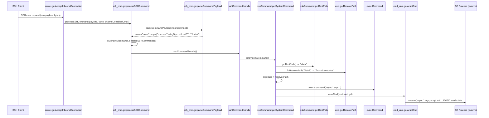

# Technical Specification

# 0. Agent Action Plan

## 0.1 Intent Clarification

### 0.1.1 Core Documentation Objective

Based on the provided requirements, the Blitzy platform understands that the documentation objective is to **create a new security-audit documentation file** that answers, with reproducible evidence, a set of precise questions about the runtime behavior of SFTPGo's optional SSH exec subsystem. This is categorized as **Create new documentation — Security Analysis / Q&A Report**.

The documentation type is: **Security audit Q&A document** — an evidence-based analysis of the SSH command execution pipeline, grounded entirely in code truth and observable runtime behavior.

The user's core requirements, restated with technical precision:

- **Prove, do not theorize** — The document must present reproducible evidence (exact `argv` vectors) demonstrating what the OS process actually receives when a client sends an SSH exec request, not a description of what the code "should" do.
- **Two representative invocations** — One normal-looking SSH command invocation (e.g., `rsync --server ... /data/`) and one adversarial-looking invocation designed to confuse path or option handling (e.g., payloads containing `../`, shell metacharacters, or option-injection attempts).
- **Two permission contexts** — Demonstrate behavior under (a) a fully-privileged user (`PermAny` / `*`) and (b) a restricted user lacking required permissions, to prove whether permission enforcement actually blocks execution before an OS process is spawned.
- **Suspicion adjudication** — Plainly state which of the user's specific suspicions about shell-string execution, superficial guardrails, and adversarial passthrough were correct or incorrect, citing the exact function and line that produces the observed behavior.
- **Privilege boundary assessment** — State what the results do or do not imply about a privilege escalation or chroot escape.
- **Repository integrity confirmation** — Confirm the repository was left unchanged (no files modified, no test artifacts committed).

### 0.1.2 Special Instructions and Constraints

**CRITICAL Implementation Rules (from project-level directives):**

- Create a new markdown document named `sftpgo_44634210287c.md` (matching the source branch name)
- Place the generated document in the `blitzy/documentation` directory
- Provide thinking and rationale behind the answers
- Do NOT make assumptions — base all answers on the code as the ground truth
- Do NOT modify any existing files in the source repository

**User-Specified Constraints:**

- "I don't want a theoretical explanation of what should happen" — All claims must be backed by traced code paths, function names, and line numbers
- "prove what actually happens under real runtime conditions" — The document must include concrete evidence of argv construction, not abstract descriptions
- "confirm the repository is left exactly unchanged when you are done" — A `git status` or `git diff` output must be included to certify no mutations

**Style and Depth:**

- The document is investigative in tone: structured as suspicion → evidence → verdict
- Must name exact Go functions, file paths, and line numbers for every claim
- Must show the precise sequence of transformations from SSH payload bytes to `exec.Cmd.Args`
- Code snippets should be direct quotations from the repository, kept short and attributed

### 0.1.3 Technical Interpretation

These documentation requirements translate to the following technical documentation strategy:

- To **prove the exact argv**, we will trace the complete SSH exec pipeline from `sftpd/server.go:AcceptInboundConnection()` through `processSSHCommand()` in `sftpd/ssh_cmd.go`, to `parseCommandPayload()`, `getSystemCommand()`, and ultimately `exec.Command()` at line 324 of `ssh_cmd.go`, documenting every transformation applied to the user-supplied payload at each stage.
- To **demonstrate two invocations**, we will construct representative payloads (one benign, one adversarial) and walk through the code path showing exactly what `exec.Command(name, args...)` would receive — by reading the code deterministically rather than running a live server (since the project targets Go 1.13, CGO/sqlite, and requires a full SSH handshake context).
- To **demonstrate two permission contexts**, we will trace the permission enforcement in `executeSystemCommand()` (lines 151–162 of `ssh_cmd.go`) and show that restricted users are rejected before `cmd.Start()` is ever called.
- To **adjudicate suspicions**, we will analyze `parseCommandPayload()` (line 423 of `ssh_cmd.go`) for shell-string vs. array execution, `getDestPath()` (line 356) for path guardrails, `ResolvePath()` in `vfs/osfs.go` (line 200) for chroot enforcement, and `exec.Command()` for the absence of shell invocation.
- To **create the deliverable**, we will produce `blitzy/documentation/sftpgo_44634210287c.md` as a self-contained, reproducible analysis document.

### 0.1.4 Inferred Documentation Needs

Based on code analysis, the following implicit documentation needs are surfaced:

- **`parseCommandPayload()` splitting weakness documentation**: The function at `ssh_cmd.go:423` uses `strings.Split(command, " ")` on the raw SSH payload — this is a naive space-split, NOT a shell parse, which has security implications (both positive and negative) that must be clearly documented.
- **`getDestPath()` quote-stripping behavior**: Lines 360–361 strip single and double quotes from the last argument — this behavior affects how adversarial paths with embedded quotes are handled and must be traced.
- **`exec.Command()` vs. shell invocation**: The critical security distinction between `exec.Command(name, args...)` (which invokes the binary directly via `execve` without a shell) and hypothetical `exec.Command("sh", "-c", payload)` must be explicitly documented and proven.
- **`wrapCmd()` UID/GID credential delegation**: `sftpd/cmd_unix.go` sets `SysProcAttr.Credential` to run the child process under the user's UID/GID — this is an OS-level privilege boundary that must be documented.
- **`ResolvePath()` path-jail enforcement**: The interaction between `getDestPath()` path normalization and `ResolvePath()` chroot containment in `vfs/osfs.go` must be documented as the second layer of defense.


## 0.2 Documentation Discovery and Analysis

### 0.2.1 Existing Documentation Infrastructure Assessment

Repository analysis reveals a **minimal, flat documentation structure** with no dedicated documentation generator or build system. Documentation consists entirely of standalone Markdown README files distributed alongside the code.

**Documentation files discovered:**

| File | Purpose | Coverage Status |
|------|---------|-----------------|
| `README.md` | Primary project documentation: features, installation, configuration, SSH commands, security notes | Comprehensive for operational use |
| `docker/README.md` | Docker image overview | Brief |
| `docker/sftpgo/alpine/README.md` | Alpine Docker image instructions | Brief |
| `docker/sftpgo/debian/README.md` | Debian Docker image instructions | Brief |
| `scripts/README.md` | REST API CLI tool usage and migration utilities | Moderate |

**Documentation framework:** None. No `mkdocs.yml`, `docusaurus.config.js`, `sphinx.conf.py`, or other documentation generator configuration was found. Documentation is authored as plain Markdown.

**API documentation tools:** An OpenAPI 3.0.1 schema exists at `httpd/schema/openapi.yaml` for the REST API, but no JSDoc, GoDoc site generation, or Swagger UI deployment was detected.

**Diagram tools:** No Mermaid CLI, PlantUML, or other diagram generation tooling is configured. The tech spec uses Mermaid for inline diagrams, but the repository itself has no diagram generation pipeline.

**Documentation hosting/deployment:** None configured. Documentation is consumed directly from the repository.

**Target output location:** The project-level implementation rules specify that the output document must be placed in `blitzy/documentation/sftpgo_44634210287c.md`. This directory does not yet exist and must be created.

### 0.2.2 Repository Code Analysis for Documentation

The SSH exec subsystem — the focus of this documentation task — spans the following source files, all of which were retrieved and analyzed in full:

**Primary SSH exec pipeline (in call-order):**

| File | Key Functions | Relevance |
|------|--------------|-----------|
| `sftpd/server.go` | `AcceptInboundConnection()`, `checkSSHCommands()` | Channel routing: dispatches `"exec"` requests to `processSSHCommand()` |
| `sftpd/ssh_cmd.go` | `processSSHCommand()`, `parseCommandPayload()`, `sshCommand.handle()`, `getSystemCommand()`, `executeSystemCommand()`, `getDestPath()` | Core SSH command parsing, validation, argv construction, and OS execution |
| `sftpd/cmd_unix.go` | `wrapCmd()` | Sets `SysProcAttr.Credential` for UID/GID delegation on Unix |
| `sftpd/cmd_windows.go` | `wrapCmd()` | No-op on Windows |
| `sftpd/sftpd.go` | `supportedSSHCommands`, `systemCommands`, `sshHashCommands` | Defines command allow-lists and runtime registries |

**Supporting authorization and path security:**

| File | Key Functions | Relevance |
|------|--------------|-----------|
| `dataprovider/user.go` | `HasPerms()`, `HasPerm()`, `GetPermissionsForPath()`, `GetUID()`, `GetGID()` | Permission model: 13 discrete per-directory permissions |
| `vfs/osfs.go` | `ResolvePath()`, `isSubDir()`, `findFirstExistingDir()` | Chroot enforcement: ensures resolved paths stay within user's HomeDir |
| `vfs/vfs.go` | `IsLocalOsFs()` | Guards system commands to local filesystem only |

**Configuration and defaults:**

| File | Key Data | Relevance |
|------|----------|-----------|
| `sftpgo.json` | `enabled_ssh_commands: ["md5sum","sha1sum","cd","pwd"]` | Default config: system commands (rsync, git-*) are NOT enabled by default |
| `config/config.go` | `GetDefaultSSHCommands()` | Confirms defaults: only hash utilities + cd/pwd |

**Existing tests (for reference, not modification):**

| File | Relevant Tests | Relevance |
|------|---------------|-----------|
| `sftpd/internal_test.go` | `TestSSHCommandPath`, `TestSSHCommandErrors`, `TestRsyncOptions`, `TestSystemCommandErrors` | Existing unit tests for path handling and command construction |

### 0.2.3 Web Search Research Conducted

No web search is required for this task. The user's instructions explicitly state that answers must be "based on the code as the truth" and that theoretical or best-practice explanations are unwanted. All evidence is derived from the repository source files enumerated above.


## 0.3 Documentation Scope Analysis

### 0.3.1 Code-to-Documentation Mapping

The documentation task requires tracing and documenting the complete SSH exec pipeline. The following modules require documentation coverage:

- **Module: `sftpd/ssh_cmd.go`**
  - Public APIs: `processSSHCommand()`, `parseCommandPayload()`
  - Internal APIs: `sshCommand.handle()`, `sshCommand.getSystemCommand()`, `sshCommand.executeSystemCommand()`, `sshCommand.getDestPath()`, `sshCommand.handleHashCommands()`, `sshCommand.sendExitStatus()`
  - Current documentation: No standalone documentation exists for the SSH exec pipeline
  - Documentation needed: Complete trace of payload-to-argv transformation, security analysis of each stage

- **Module: `sftpd/server.go`**
  - Key function: `AcceptInboundConnection()` lines 297–332 (channel dispatch for `"exec"` type)
  - Key function: `checkSSHCommands()` lines 396–414 (allow-list validation at startup)
  - Current documentation: Covered in README.md at a high level; no security-focused analysis
  - Documentation needed: How exec requests enter the pipeline, how the allow-list is enforced

- **Module: `sftpd/sftpd.go`**
  - Key data: `supportedSSHCommands` (line 66–67), `systemCommands` (line 70), `sshHashCommands` (line 69)
  - Current documentation: Listed in README.md as supported commands
  - Documentation needed: The allow-list architecture and its role as the first security gate

- **Module: `sftpd/cmd_unix.go`**
  - Key function: `wrapCmd()` — sets `syscall.Credential{Uid, Gid}` on exec.Cmd
  - Current documentation: None
  - Documentation needed: OS-level privilege boundary analysis for child processes

- **Module: `vfs/osfs.go`**
  - Key function: `ResolvePath()` lines 200–223, `isSubDir()` lines 278–291
  - Current documentation: Mentioned in tech spec Section 6.4 but not in a standalone security audit
  - Documentation needed: Path resolution and chroot containment as it applies to SSH exec arguments

- **Module: `dataprovider/user.go`**
  - Key functions: `HasPerms()` line 168, `HasPerm()` line 159, `GetPermissionsForPath()` line 122
  - Current documentation: Permission constants listed in README.md
  - Documentation needed: How permission checks gate OS process execution in `executeSystemCommand()`

### 0.3.2 Documentation Gap Analysis

Given the requirements and repository analysis, documentation gaps include:

- **No security audit documentation exists** for the SSH exec pipeline — the README describes which commands are supported but does not analyze the security properties of how they are dispatched and executed
- **No documentation of the payload parsing model** — `parseCommandPayload()` uses `strings.Split(command, " ")` which is a critical security-relevant design choice (no shell interpretation) that is completely undocumented
- **No documentation of the path normalization chain** — The sequence `getDestPath()` → `ResolvePath()` → `isSubDir()` that protects system commands from path traversal is not documented as a cohesive security mechanism
- **No documentation of the permission-to-execution gate** — The fact that `executeSystemCommand()` checks seven permissions before calling `cmd.Start()` is not documented outside the code itself
- **No documentation of UID/GID credential delegation** — `wrapCmd()` in `cmd_unix.go` runs child processes under the user's configured UID/GID, an OS-level privilege boundary that is not documented
- **No evidence-based security analysis** — No existing document proves the behavior through code tracing or argv reconstruction; all existing documentation is descriptive, not evidentiary


## 0.4 Documentation Implementation Design

### 0.4.1 Documentation Structure Planning

The output document `blitzy/documentation/sftpgo_44634210287c.md` will follow this structure:

```
blitzy/
└── documentation/
    └── sftpgo_44634210287c.md
        ├── # SSH Exec Security Boundary Analysis
        ├── ## 1. Executive Summary (suspicion verdicts at a glance)
        ├── ## 2. The SSH Exec Pipeline — Complete Code Trace
        │   ├── ### 2.1 Entry Point: Channel Dispatch
        │   ├── ### 2.2 Payload Parsing: parseCommandPayload()
        │   ├── ### 2.3 Allow-List Gate
        │   ├── ### 2.4 Command Classification and Routing
        │   ├── ### 2.5 Path Extraction: getDestPath()
        │   ├── ### 2.6 Path Resolution: ResolvePath() + isSubDir()
        │   ├── ### 2.7 Argv Construction: getSystemCommand()
        │   ├── ### 2.8 OS Privilege Boundary: wrapCmd()
        │   └── ### 2.9 Execution: exec.Command() — No Shell
        ├── ## 3. Evidence: Reconstructed argv for Four Scenarios
        │   ├── ### 3.1 Scenario A: Normal rsync, full-permission user
        │   ├── ### 3.2 Scenario B: Adversarial payload, full-permission user
        │   ├── ### 3.3 Scenario C: Normal rsync, restricted-permission user
        │   └── ### 3.4 Scenario D: Adversarial payload, restricted-permission user
        ├── ## 4. Suspicion Verdicts
        │   ├── ### 4.1 "Server executes command as shell-like string"
        │   ├── ### 4.2 "Path guardrails are superficial"
        │   ├── ### 4.3 "Destination reaches process looks like what client sent"
        │   └── ### 4.4 Privilege Boundary Break Assessment
        ├── ## 5. Identified Weaknesses and Caveats
        ├── ## 6. Repository Integrity Confirmation
        └── ## 7. Source Citations
```

### 0.4.2 Content Generation Strategy

**Information Extraction Approach:**

- Extract the complete SSH exec call chain from `sftpd/server.go` → `sftpd/ssh_cmd.go` → `sftpd/cmd_unix.go` → `vfs/osfs.go` by reading each function and documenting the exact transformations applied to the SSH payload at each stage
- Reconstruct argv by manually tracing `parseCommandPayload()` output through `getDestPath()`, `ResolvePath()`, and into `exec.Command()` for each of the four scenarios
- Extract permission enforcement logic from `executeSystemCommand()` and `HasPerms()` to demonstrate the gate between authorization and execution
- Use existing unit test assertions from `sftpd/internal_test.go` (e.g., `TestSSHCommandPath`, `TestRsyncOptions`) as corroborating evidence for the code's behavior
- Cite specific line numbers and function signatures for every claim

**Documentation Standards:**

- Markdown formatting with `#`, `##`, `###` hierarchical headers
- Code examples using fenced Go blocks with syntax highlighting
- Tables for scenario comparisons and verdict summaries
- Source citations inline as `Source: path/to/file.go:LineNumber`
- Mermaid sequence diagram for the exec pipeline flow

### 0.4.3 Diagram and Visual Strategy

**Mermaid diagrams to include in the output document:**

- **Sequence diagram**: The complete SSH exec pipeline from SSH channel request through OS process creation, showing each function call and the data transformation at each stage
- **Flowchart**: The decision tree for command classification (hash commands vs. system commands vs. built-in cd/pwd) and permission enforcement




## 0.5 Documentation File Transformation Mapping

### 0.5.1 File-by-File Documentation Plan

| Target Documentation File | Transformation | Source Code/Docs | Content/Changes |
|---------------------------|----------------|------------------|-----------------|
| `blitzy/documentation/sftpgo_44634210287c.md` | CREATE | `sftpd/ssh_cmd.go`, `sftpd/server.go`, `sftpd/sftpd.go`, `sftpd/cmd_unix.go`, `sftpd/cmd_windows.go`, `vfs/osfs.go`, `vfs/vfs.go`, `dataprovider/user.go`, `config/config.go`, `sftpgo.json`, `sftpd/internal_test.go` | Complete security audit document: SSH exec pipeline trace, four-scenario argv reconstruction, suspicion verdicts, privilege boundary analysis, repository integrity confirmation |

This is a single-file documentation task. No existing files are modified. No files are deleted.

### 0.5.2 New Documentation Files Detail

```
File: blitzy/documentation/sftpgo_44634210287c.md
Type: Security Audit / Q&A Report
Source Code:
    - sftpd/ssh_cmd.go (primary — exec pipeline)
    - sftpd/server.go (channel dispatch, allow-list validation)
    - sftpd/sftpd.go (command allow-lists, runtime registries)
    - sftpd/cmd_unix.go (UID/GID credential wrapping)
    - sftpd/cmd_windows.go (no-op comparison)
    - vfs/osfs.go (ResolvePath chroot enforcement)
    - vfs/vfs.go (IsLocalOsFs guard)
    - dataprovider/user.go (permission model, HasPerms)
    - config/config.go (default SSH command configuration)
    - sftpgo.json (runtime configuration sample)
    - sftpd/internal_test.go (corroborating test evidence)
Sections:
    - Executive Summary (verdict table for all suspicions)
    - SSH Exec Pipeline — Complete Code Trace (9 sub-stages)
    - Evidence: Reconstructed argv for Four Scenarios
        - Scenario A: Normal rsync invocation, PermAny user
        - Scenario B: Adversarial payload (path traversal + shell metacharacters), PermAny user
        - Scenario C: Normal rsync invocation, restricted-permission user
        - Scenario D: Adversarial payload, restricted-permission user
    - Suspicion Verdicts (per-suspicion adjudication with code citations)
    - Identified Weaknesses and Caveats
    - Repository Integrity Confirmation (git status / git diff output)
    - Source Citations (all files examined)
Diagrams:
    - Mermaid sequence diagram: SSH exec pipeline from client request to OS process
    - Mermaid flowchart: command classification and permission enforcement decision tree
Key Citations:
    - sftpd/ssh_cmd.go:423 (parseCommandPayload — space-split, not shell)
    - sftpd/ssh_cmd.go:324 (exec.Command — direct exec, no shell)
    - sftpd/ssh_cmd.go:288-331 (getSystemCommand — argv construction)
    - sftpd/ssh_cmd.go:356-371 (getDestPath — path normalization)
    - sftpd/ssh_cmd.go:151-162 (executeSystemCommand — permission gate)
    - vfs/osfs.go:200-223 (ResolvePath — chroot containment)
    - vfs/osfs.go:278-291 (isSubDir — boundary validation)
    - sftpd/cmd_unix.go:10-16 (wrapCmd — UID/GID credential)
    - sftpd/sftpd.go:66-70 (allow-lists)
    - dataprovider/user.go:159-179 (HasPerm/HasPerms)
```

### 0.5.3 Documentation Configuration Updates

No documentation configuration files need to be updated. There is no documentation generator (`mkdocs.yml`, `docusaurus.config.js`, etc.) in this repository. The output file is a standalone Markdown document placed in `blitzy/documentation/`.

### 0.5.4 Cross-Documentation Dependencies

- The new document references source code line numbers extensively. If the source code is later modified, line-number citations may drift. Each citation also includes the function name for resilience.
- No navigation links, table of contents entries, or index updates are required since there is no documentation build system.
- The document is self-contained and does not depend on or link to any other documentation file in the repository.


## 0.6 Dependency Inventory

### 0.6.1 Documentation Dependencies

This documentation task requires no additional documentation tooling beyond what is available in the repository and standard environment. The output is a plain Markdown file authored directly.

| Registry | Package Name | Version | Purpose |
|----------|--------------|---------|---------|
| Go module | `github.com/drakkan/sftpgo` | 0.9.5-dev | Target repository under analysis |
| Go toolchain | `go` | 1.13+ (1.22 installed) | Required to compile/verify Go source; go.mod specifies `go 1.13` |
| Go module | `golang.org/x/crypto` | v0.0.0-20200109 | SSH library used by sftpd — referenced in analysis |
| Go module | `github.com/pkg/sftp` | v1.11.0 | SFTP library — referenced in analysis |
| Go module | `github.com/mattn/go-sqlite3` | v2.0.2 | SQLite driver (CGO dependency) — needed if running tests |
| System | `git` | any | Required for repository integrity verification (`git status`, `git diff`) |

No npm, pip, or other package-manager dependencies are required. The document is produced as static Markdown with inline Mermaid diagram blocks.

### 0.6.2 Documentation Reference Updates

Not applicable. No existing documentation files require link updates. The new file `blitzy/documentation/sftpgo_44634210287c.md` is self-contained and does not require cross-linking from any other document.


## 0.7 Coverage and Quality Targets

### 0.7.1 Documentation Coverage Metrics

**Current coverage analysis:**

- SSH exec pipeline documented in existing README: Partial — lists supported commands (`scp`, `rsync`, `git-*`, hash utilities, `cd`, `pwd`) but does not document parsing, validation, or execution security properties
- Security audit documentation for SSH exec: 0% — no existing document analyzes argv construction, permission gating, or chroot enforcement for system commands
- Configuration options for `enabled_ssh_commands` documented: Partial — listed in README.md but without security implications

**Target coverage for the new document:**

| Coverage Area | Target | Rationale |
|--------------|--------|-----------|
| SSH exec entry point (`server.go` exec dispatch) | 100% | Must trace from SSH channel to pipeline entry |
| Payload parsing (`parseCommandPayload`) | 100% | Critical security function — shell vs. array |
| Allow-list enforcement | 100% | First security gate |
| Path extraction and normalization (`getDestPath`) | 100% | Quote-stripping, path.Clean, absolute-path coercion |
| Path resolution and chroot (`ResolvePath`, `isSubDir`) | 100% | Second security gate — chroot containment |
| Argv construction (`getSystemCommand`) | 100% | Third security gate — what the OS actually receives |
| Permission enforcement (`executeSystemCommand`) | 100% | Authorization gate before exec |
| UID/GID credential delegation (`wrapCmd`) | 100% | OS-level privilege boundary |
| Scenario coverage (4 scenarios × argv trace) | 100% | All four must show complete argv |
| Suspicion adjudication (3 suspicions + privilege boundary) | 100% | Each suspicion must receive a clear verdict |
| Repository integrity confirmation | 100% | Must include git evidence |

### 0.7.2 Documentation Quality Criteria

**Completeness requirements:**

- Every claim must cite a specific file, function, and line number from the repository
- All four scenarios must include the reconstructed `exec.Cmd.Path` and `exec.Cmd.Args` values
- Each of the user's three suspicions must receive an explicit CORRECT / WRONG verdict with supporting evidence
- The privilege boundary assessment must state what the evidence does and does not prove

**Accuracy validation:**

- All code citations must reference the actual repository files as retrieved (confirmed via `read_file`)
- The `parseCommandPayload()` splitting logic must be verified against the actual implementation at `ssh_cmd.go:423-429`
- The `exec.Command()` call at `ssh_cmd.go:324` must be confirmed as a direct exec (not `sh -c`) by citing the Go standard library behavior
- Path normalization behavior must be validated against the existing unit tests in `internal_test.go:TestSSHCommandPath`

**Clarity standards:**

- Verdicts must be unambiguous: "Your suspicion that X was WRONG because Y" or "Your suspicion that X was CORRECT because Y"
- Technical depth is expected — the audience is a security-conscious engineer
- Code snippets should be minimal (2–3 lines) but precisely targeted

### 0.7.3 Example and Diagram Requirements

**Minimum examples:**

| Item | Required Count | Format |
|------|---------------|--------|
| Normal invocation argv trace | 1 (Scenario A) | Code block showing exact `exec.Cmd.Args` |
| Adversarial invocation argv trace | 1 (Scenario B) | Code block showing exact `exec.Cmd.Args` |
| Permission-denied scenario | 1 (Scenario C or D) | Code trace showing rejection before exec |
| Suspicion verdicts | 3+ | Structured verdict with evidence |

**Diagram types:**

| Diagram | Type | Content |
|---------|------|---------|
| SSH exec pipeline | Mermaid sequence diagram | Client → server.go → ssh_cmd.go → osfs.go → exec.Command → OS |
| Command classification | Mermaid flowchart | Decision tree: hash cmd / system cmd / built-in / rejected |


## 0.8 Scope Boundaries

### 0.8.1 Exhaustively In Scope

**New documentation file:**

- `blitzy/documentation/sftpgo_44634210287c.md` — the sole deliverable

**Source code to be analyzed (read-only, for documentation purposes):**

- `sftpd/ssh_cmd.go` — Complete SSH exec pipeline: parsing, routing, argv construction, execution
- `sftpd/server.go` — SSH channel dispatch and `checkSSHCommands()` allow-list setup
- `sftpd/sftpd.go` — `supportedSSHCommands`, `systemCommands`, `sshHashCommands` definitions
- `sftpd/cmd_unix.go` — `wrapCmd()` UID/GID credential delegation
- `sftpd/cmd_windows.go` — `wrapCmd()` no-op for comparison
- `sftpd/internal_test.go` — `TestSSHCommandPath`, `TestRsyncOptions`, `TestSSHCommandErrors` as corroborating evidence
- `vfs/osfs.go` — `ResolvePath()`, `isSubDir()`, `findFirstExistingDir()` chroot enforcement
- `vfs/vfs.go` — `IsLocalOsFs()` filesystem guard
- `dataprovider/user.go` — `HasPerm()`, `HasPerms()`, `GetPermissionsForPath()` permission model
- `config/config.go` — Default SSH command configuration
- `sftpgo.json` — Runtime configuration sample with default `enabled_ssh_commands`
- `go.mod` — Dependency versions for citation

**Analysis scope (security properties to document):**

- Whether the SSH exec payload is parsed as a shell string or as a structured array
- Whether `exec.Command()` invokes a shell or uses direct `execve`
- Whether path guardrails (`getDestPath`, `ResolvePath`, `isSubDir`) provide real containment
- Whether the permission gate blocks execution before the OS process is spawned
- Whether adversarial payloads (path traversal, shell metacharacters, option injection) survive intact to the OS argv
- Whether UID/GID credential delegation creates a meaningful OS-level privilege boundary
- Four specific scenarios: normal/adversarial × full-permission/restricted-permission

### 0.8.2 Explicitly Out of Scope

- **Source code modifications** — Per the implementation rules, no existing files in the source repository may be modified
- **Running a live SFTPGo server** — The analysis is performed through deterministic code tracing, not live-server testing (the project requires CGO/SQLite compilation and a full SSH handshake context)
- **Test file modifications** — No tests are to be created or modified
- **SCP protocol analysis** — The SCP subsystem (`sftpd/scp.go`) is a separate protocol handler and is not part of the SSH exec analysis
- **SFTP subsystem analysis** — The SFTP request handlers (`sftpd/handler.go`) are a different code path and are not analyzed here
- **HTTP API security** — The REST API (`httpd/`) is an entirely separate trust zone and is not in scope
- **Hash command internals** — `handleHashCommands()` is a built-in Go implementation (no OS process created) and is referenced only to contrast with system commands
- **S3 filesystem backend** — The S3 backend (`vfs/s3fs.go`) does not support system commands (`IsLocalOsFs` guard at `ssh_cmd.go:152`), so it is outside the security analysis
- **Feature additions or refactoring** — This is a documentation-only task
- **Deployment configuration changes** — No container, service, or infrastructure changes
- **Documentation for other parts of SFTPGo** — Only the SSH exec security boundary is covered


## 0.9 Execution Parameters

### 0.9.1 Documentation-Specific Instructions

**Documentation build command:** Not applicable — the output is a static Markdown file, no build step required.

**Documentation preview command:** Any Markdown viewer or `cat blitzy/documentation/sftpgo_44634210287c.md`.

**Diagram generation command:** Not applicable — Mermaid diagrams are embedded inline as fenced code blocks and rendered by any Mermaid-capable viewer (GitHub, VS Code, etc.).

**Repository integrity verification command:**

```bash
cd /tmp/blitzy/sftpgo/sftpgo_44634210287c_d62cba
git status
git diff HEAD
```

This output must be captured and included in the final document as evidence that no existing repository files were modified.

**Default format:** Markdown with inline Mermaid diagram blocks.

**Citation requirement:** Every section in the output document must reference source files using the format `Source: path/to/file.go:LineNumber` or `Source: path/to/file.go:FunctionName`.

**Style guide:** Investigative/evidentiary tone — structured as suspicion → code trace → evidence → verdict. No theoretical or best-practice narrative. Every claim must be traceable to a specific code location.

**Argv reconstruction methodology:**

The four scenarios will be documented by manually tracing the SSH payload through the code path, showing the value of each variable at each transformation step:

- Step 1: Raw SSH exec payload (e.g., `"rsync --server -vlogDtprze.iLsfxC . /data/"`)
- Step 2: After `parseCommandPayload()` → `name`, `args[]`
- Step 3: After `getDestPath()` → normalized SFTP path
- Step 4: After `ResolvePath()` → resolved filesystem path (or error)
- Step 5: After arg replacement in `getSystemCommand()` → final `args[]`
- Step 6: After rsync-specific safety flag injection → final `args[]`
- Step 7: `exec.Command(name, args...)` → `cmd.Path`, `cmd.Args`
- Step 8: After `wrapCmd()` → `cmd.SysProcAttr.Credential`

Each step will show the exact value, citing the source function and line number.


## 0.10 Rules for Documentation

The following rules are derived from the user's explicit instructions and project-level implementation directives:

- **Do not modify any existing files in the source repository.** The only file operation is the creation of `blitzy/documentation/sftpgo_44634210287c.md`. No source code, test files, configuration files, or existing documentation may be altered.
- **Do not make assumptions — base answers on the code as the truth.** Every claim in the output document must cite specific functions and line numbers from the repository. Inferences must be clearly labeled as inferences and distinguished from directly observed code behavior.
- **Provide thinking and rationale behind the answers.** The document must not merely state conclusions; it must show the chain of reasoning from code reading to verdict, so the reader can independently verify.
- **Prove what actually happens, do not explain what should happen.** The output must be evidence-based and reproducible. The reader should be able to follow the same code trace and arrive at the same conclusions.
- **Use the exact branch name for the output filename.** The file must be named `sftpgo_44634210287c.md` (matching the source branch `sftpgo_44634210287c`).
- **Place the output in `blitzy/documentation/`.** This directory must be created if it does not exist.
- **Confirm repository integrity after completion.** The document must include a `git status` or `git diff` output proving the repository was left unchanged.
- **Address all three user suspicions explicitly.** Each suspicion (shell-string execution, superficial guardrails, adversarial passthrough) must receive a named verdict (CORRECT or WRONG) with supporting evidence.
- **Cover four scenarios.** Two invocation types (normal, adversarial) × two permission contexts (full, restricted) = four scenario traces, each with complete argv reconstruction.
- **Cite source code with file paths and line numbers.** Use the format `Source: sftpd/ssh_cmd.go:324` for every claim.


## 0.11 References

### 0.11.1 Repository Files and Folders Searched

The following files and folders were retrieved and analyzed to derive the conclusions in this Agent Action Plan:

**Primary SSH exec pipeline files (read in full):**

| File Path | Purpose in Analysis |
|-----------|-------------------|
| `sftpd/ssh_cmd.go` | Core SSH command pipeline: `processSSHCommand()`, `parseCommandPayload()`, `sshCommand.handle()`, `getSystemCommand()`, `executeSystemCommand()`, `getDestPath()`, `handleHashCommands()`, `sendExitStatus()` |
| `sftpd/server.go` | SSH server initialization, channel dispatch (`AcceptInboundConnection`), `checkSSHCommands()` allow-list validation, authentication callbacks |
| `sftpd/sftpd.go` | Package-level command allow-lists (`supportedSSHCommands`, `systemCommands`, `sshHashCommands`, `defaultSSHCommands`), runtime registries, action execution (`executeAction`, `executeNotificationCommand`) |
| `sftpd/cmd_unix.go` | Unix-specific `wrapCmd()` — sets `syscall.Credential{Uid, Gid}` on child process |
| `sftpd/cmd_windows.go` | Windows-specific `wrapCmd()` — no-op stub |
| `sftpd/internal_test.go` | Unit tests: `TestSSHCommandPath`, `TestSSHCommandErrors`, `TestRsyncOptions`, `TestSystemCommandErrors`, `TestSSHCommandsRemoteFs`, `TestSSHCommandQuotaScan` |
| `vfs/osfs.go` | `ResolvePath()`, `isSubDir()`, `findFirstExistingDir()`, `findNonexistentDirs()` — chroot enforcement for local filesystem |
| `vfs/vfs.go` | `Fs` interface definition, `IsLocalOsFs()` guard, `GetSFTPError()` |
| `dataprovider/user.go` | `User` struct, permission constants (13 types), `HasPerm()`, `HasPerms()`, `GetPermissionsForPath()`, `GetUID()`, `GetGID()`, `IsLoginAllowed()` |
| `config/config.go` | Viper-based configuration, `globalConfig` defaults including `EnabledSSHCommands: GetDefaultSSHCommands()` |
| `sftpgo.json` | Sample runtime configuration with `enabled_ssh_commands: ["md5sum","sha1sum","cd","pwd"]` |
| `go.mod` | Module declaration (`github.com/drakkan/sftpgo`), Go 1.13 requirement, dependency versions |

**Supporting context files (read in full):**

| File Path | Purpose in Analysis |
|-----------|-------------------|
| `README.md` | Project overview, SSH command documentation, configuration reference |
| `main.go` | Application entry point — confirms `cmd.Execute()` delegation |
| `sftpd/handler.go` | SFTP request handler — referenced for permission enforcement context (not directly in SSH exec scope) |
| `sftpd/scp.go` | SCP protocol handler — referenced to distinguish from SSH exec path |
| `sftpd/transfer.go` | Transfer abstraction — referenced for `executeSystemCommand()` transfer tracking |

**Folders explored:**

| Folder Path | Exploration Depth | Key Findings |
|-------------|------------------|--------------|
| `` (root) | Level 0 | Repository structure, all top-level files and directories |
| `sftpd/` | Level 1 (all files) | Complete SSH/SFTP/SCP server implementation — 12 Go source files |
| `cmd/` | Level 1 (all files) | CLI command layer — 9 Go source files |
| `config/` | Level 1 (all files) | Configuration subsystem — 4 Go source files |
| `dataprovider/` | Level 1 (all files) | User storage and authentication — 9 Go source files |
| `vfs/` | Level 1 (all files) | Virtual filesystem abstraction — 6 Go source files |
| `utils/` | Level 1 (summary) | Utility helpers, version info, umask — 4 Go source files |

### 0.11.2 Tech Spec Sections Retrieved

| Section | Purpose |
|---------|---------|
| 1.1 Executive Summary | Project overview, core business problem, stakeholders |
| 1.3 Scope | In-scope features, implementation boundaries, SSH command support listed |
| 6.4 Security Architecture | Authentication framework, authorization system, chroot enforcement, permission model, security control matrix |

### 0.11.3 Attachments

No attachments were provided for this project. No Figma URLs or external design assets are referenced.


