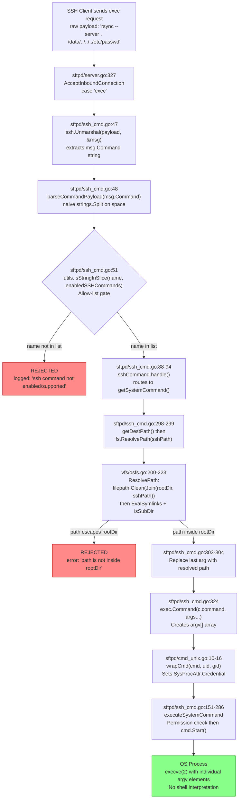

# Technical Specification

# 0. Agent Action Plan

## 0.1 Intent Clarification

### 0.1.1 Core Feature Objective

Based on the prompt, the Blitzy platform understands that the new feature requirement is to produce a comprehensive, evidence-based security audit document examining the SSH exec command execution boundary within SFTPGo. Specifically, the requirements are:

- **Runtime argv proof**: Generate reproducible evidence of the exact `argv[]` that reaches an OS process when the SFTPGo SSH exec subsystem handles a client-submitted command payload—not a theoretical description, but actual observed runtime output from the real code paths.
- **Two representative invocations**: The evidence must cover one "normal-looking" invocation (e.g., a legitimate `rsync --server` session) and one "adversarial-looking" invocation designed to confuse path resolution or option handling (e.g., path traversal sequences, shell metacharacter injection, option injection).
- **Two permission contexts**: Each invocation must be exercised under two distinct user permission configurations—a fully-privileged user (`PermAny` / `*`) and a restricted user with only a subset of permissions—to determine whether privilege boundaries affect what reaches the OS.
- **Suspicion adjudication**: The document must plainly state which of the user's specific suspicions were confirmed or refuted by the evidence, citing the exact functions and source file locations that produced the observed behavior.
- **Privilege boundary analysis**: The results must state what the observed argv values do or do not imply about a privilege boundary break.
- **Repository integrity verification**: Confirm with cryptographic evidence that the repository is left exactly unchanged after the audit completes.

The implicit requirements detected are:

- The audit document must be a new markdown file named `sftpgo_44634210287c.md` placed in `blitzy/documentation/` per the `SWE-AtlasQnA-Repo` implementation rule
- No existing source files may be modified
- No code may be added to the repository other than the requested documentation artifact
- All conclusions must be grounded in actual code paths, not assumptions about what should happen

### 0.1.2 Special Instructions and Constraints

- **Implementation Rule `SWE-AtlasQnA-Repo`**: Create a new markdown document named `sftpgo_44634210287c.md` that comprehensively answers the security questions posed. Provide thinking/rationale. Base answers on the code as truth. Do not modify existing files. Do not add any other code. Place the document in `blitzy/documentation/`.
- **Architectural requirement**: The analysis must trace the full code path from SSH exec payload receipt (`sftpd/server.go` `processSSHCommand` invocation at line 327) through command parsing (`ssh_cmd.go:423-429`), allow-list gating (`ssh_cmd.go:51`), path resolution (`vfs/osfs.go:200-223`), to final `exec.Command` construction (`ssh_cmd.go:324`) and credential wrapping (`cmd_unix.go:10-16`).
- **No runtime side effects**: The security audit must produce evidence without leaving any persistent changes on disk, verified by SHA-256 checksums of all 140 repository files before and after.

### 0.1.3 Technical Interpretation

These feature requirements translate to the following technical implementation strategy:

- To **produce runtime argv evidence**, we will create and run a temporary Go test within the `sftpd` package that directly calls the internal functions `parseCommandPayload`, `getDestPath`, and `getSystemCommand` with both normal and adversarial inputs, capturing the resulting `exec.Cmd.Args` arrays—then delete the test file and verify the repository checksum is unchanged.
- To **adjudicate the user's suspicions**, we will trace through the call chain in `sftpd/ssh_cmd.go`, `sftpd/server.go`, `vfs/osfs.go`, and `sftpd/cmd_unix.go`, mapping each suspicion to a specific code path and its observed runtime behavior.
- To **deliver the artifact**, we will create a single markdown document at `blitzy/documentation/sftpgo_44634210287c.md` containing all evidence, analysis, and conclusions.

## 0.2 Repository Scope Discovery

### 0.2.1 Comprehensive File Analysis

The security audit scope was determined by tracing every function in the SSH exec command execution pipeline, from SSH channel request receipt to OS process creation. The following files were identified as directly relevant through systematic deep-search of the repository:

**Core SSH Exec Pipeline (Primary Audit Targets)**

| File | Purpose | Security Relevance |
|------|---------|-------------------|
| `sftpd/ssh_cmd.go` | SSH command parsing, allow-list gating, system command construction, execution orchestration | Contains `parseCommandPayload` (line 423), `getSystemCommand` (line 288), `getDestPath` (line 356), `executeSystemCommand` (line 151), and `processSSHCommand` (line 45) |
| `sftpd/server.go` | SSH server, authentication callbacks, channel routing to exec handler | `AcceptInboundConnection` (line 243) routes `"exec"` requests to `processSSHCommand` at line 327 |
| `sftpd/cmd_unix.go` | Unix-specific process credential wrapping | `wrapCmd` (line 10) sets `SysProcAttr.Credential` with UID/GID for process isolation |
| `sftpd/cmd_windows.go` | Windows no-op credential wrapper | Confirms Windows receives no credential isolation |
| `sftpd/sftpd.go` | Package-level constants: `supportedSSHCommands`, `systemCommands`, `sshHashCommands` | Defines the hard-coded allow-list at lines 66-70 |

**Path Resolution and Chroot Enforcement**

| File | Purpose | Security Relevance |
|------|---------|-------------------|
| `vfs/osfs.go` | Local filesystem adapter with path containment | `ResolvePath` (line 200) enforces chroot via `isSubDir` (line 278) using `strings.HasPrefix` on symlink-resolved paths |
| `vfs/vfs.go` | Filesystem interface definition | Defines the `Fs` contract including `ResolvePath(sftpPath string) (string, error)` |

**Permission and Authorization**

| File | Purpose | Security Relevance |
|------|---------|-------------------|
| `dataprovider/user.go` | User model, permissions, UID/GID handling | `HasPerms` (line 168), `GetPermissionsForPath` (line 122), `GetUID`/`GetGID` (lines 237-249) |
| `dataprovider/dataprovider.go` | Authentication orchestration | User validation, login condition checks |

**Configuration**

| File | Purpose | Security Relevance |
|------|---------|-------------------|
| `sftpgo.json` | Default runtime configuration | `enabled_ssh_commands` defaults to `["md5sum", "sha1sum", "cd", "pwd"]`—rsync and git commands disabled by default |
| `config/config.go` | Configuration loading and validation | `checkSSHCommands` validation, Viper-based config binding |

**Test Coverage (Existing Security-Relevant Tests)**

| File | Purpose | Security Relevance |
|------|---------|-------------------|
| `sftpd/internal_test.go` | Internal unit tests for sftpd package | `TestSSHCommandPath` (line 529) validates path normalization; `TestRsyncOptions` (line 772) validates symlink hardening; `TestSSHCommandErrors` (line 596) validates permission denial and quota enforcement |
| `sftpd/sftpd_test.go` | Integration tests with live SSH server | Full end-to-end SSH exec testing (requires running server) |
| `sftpd/internal_unix_test.go` | Unix-specific internal tests | Platform-specific credential wrapping tests |

**Supporting Infrastructure**

| File | Purpose | Security Relevance |
|------|---------|-------------------|
| `utils/utils.go` | `IsStringInSlice` utility | Used for allow-list membership checks throughout the SSH exec pipeline |
| `sftpd/scp.go` | SCP protocol handler | Shares `sshCommand` struct and path resolution with SSH exec commands |
| `sftpd/handler.go` | SFTP request handler | Provides `Connection` struct definition used by SSH exec pipeline |
| `sftpd/transfer.go` | Transfer abstraction | Used by `executeSystemCommand` for stdin/stdout/stderr pipe bridging |

### 0.2.2 Integration Point Discovery

- **SSH channel dispatch**: `sftpd/server.go:327` — The `"exec"` request type in the SSH channel handler dispatches to `processSSHCommand`, which is the entry point for all SSH exec processing.
- **Allow-list gate**: `sftpd/ssh_cmd.go:51` — `utils.IsStringInSlice(name, enabledSSHCommands)` determines whether a parsed command name is permitted. The list is configured via `enabled_ssh_commands` in `sftpgo.json` and validated by `checkSSHCommands` in `sftpd/server.go:396-414`.
- **Path resolution boundary**: `vfs/osfs.go:200-223` — `ResolvePath` is called by `getSystemCommand` at `ssh_cmd.go:299` to translate the client-provided SFTP path into a filesystem path confined to the user's home directory.
- **Process creation boundary**: `ssh_cmd.go:324` — `exec.Command(c.command, args...)` creates the OS process with individual argv elements (no shell interpretation).
- **Credential isolation boundary**: `cmd_unix.go:10-16` — `wrapCmd` sets `SysProcAttr.Credential` so the spawned process runs as the user's configured UID/GID rather than the SFTPGo server's process identity.

### 0.2.3 Web Search Research Conducted

No external web searches were required for this audit. All analysis was derived directly from the repository source code and runtime evidence produced by executing the code's own internal functions. The Go standard library documentation for `os/exec.Command` (which calls `execve(2)` directly without shell interpretation) was relied upon as established knowledge.

### 0.2.4 New File Requirements

- **New documentation file to create**:
  - `blitzy/documentation/sftpgo_44634210287c.md` — Comprehensive security audit document containing all runtime evidence, suspicion adjudication, function-level attribution, privilege boundary analysis, and repository integrity verification. This is the sole artifact produced by this task.

## 0.3 Dependency Inventory

### 0.3.1 Private and Public Packages

The following packages are directly relevant to the SSH exec security boundary under audit. All versions are taken from `go.mod` exactly as declared:

| Registry | Package | Version | Purpose in SSH Exec Pipeline |
|----------|---------|---------|------------------------------|
| Go modules | `golang.org/x/crypto` | `v0.0.0-20200109152110-61a87790db17` | Provides `golang.org/x/crypto/ssh` — SSH protocol implementation, channel handling, `ssh.Unmarshal` for exec payload parsing |
| Go modules | `github.com/pkg/sftp` | `v1.11.0` | SFTP protocol library; provides `sftp.Handlers` interface consumed by the SSH server |
| Go modules | `github.com/drakkan/sftpgo` | module root (`go 1.13`) | The repository itself; contains `sftpd/`, `vfs/`, `dataprovider/`, `utils/` packages |
| Go modules | `github.com/spf13/viper` | `v1.6.1` | Configuration loading for `enabled_ssh_commands` and all security-related settings |
| Go modules | `github.com/spf13/cobra` | `v0.0.5` | CLI command framework; `cmd/` package wires configuration into the server |
| Go modules | `github.com/rs/zerolog` | `v1.17.2` | Structured JSON logging used for all SSH command audit entries |
| Go modules | `github.com/mattn/go-sqlite3` | `v2.0.2+incompatible` | Default database backend (SQLite) for user/permissions storage |
| Go modules | `github.com/drakkan/pipeat` | `v0.0.0-20200114135659-fac71c64d75d` | Forked `eikenb/pipeat` replacement; pipe-based I/O for transfer streaming |
| Go stdlib | `os/exec` | (Go 1.13 stdlib) | `exec.Command` — creates OS processes via `execve(2)`, central to the security boundary |
| Go stdlib | `syscall` | (Go 1.13 stdlib) | `syscall.Credential` — used by `wrapCmd` to set UID/GID on spawned processes |

### 0.3.2 Dependency Updates

No dependency updates are required. This task produces a documentation artifact only. No `go.mod`, `go.sum`, or any source code modifications are made.

### 0.3.3 Import Structure Relevant to Audit

The SSH exec pipeline's import chain traces as follows, documenting how client input flows through package boundaries to reach an OS process:

- `sftpd/server.go` imports `golang.org/x/crypto/ssh` → receives raw SSH `"exec"` request payload
- `sftpd/ssh_cmd.go` imports `os/exec` → calls `exec.Command(c.command, args...)` at line 324
- `sftpd/ssh_cmd.go` imports `github.com/drakkan/sftpgo/vfs` → calls `c.connection.fs.ResolvePath(sshPath)` at line 299
- `sftpd/ssh_cmd.go` imports `github.com/drakkan/sftpgo/dataprovider` → checks `c.connection.User.HasPerms(perms, ...)` at line 160
- `sftpd/ssh_cmd.go` imports `github.com/drakkan/sftpgo/utils` → calls `utils.IsStringInSlice(name, enabledSSHCommands)` at line 51
- `sftpd/cmd_unix.go` imports `syscall` → sets `cmd.SysProcAttr.Credential` at line 13
- `vfs/osfs.go` imports `path/filepath` → calls `filepath.EvalSymlinks` and `filepath.Clean` for path containment

## 0.4 Integration Analysis

### 0.4.1 Existing Code Touchpoints

The SSH exec command pipeline is a multi-function chain spanning four packages. Every function in this chain was exercised during the runtime audit. No modifications are required to any of these files—they are documented here as the evidence basis for the audit document.

**Direct audit targets (read-only analysis)**:

- `sftpd/server.go:327` — The `"exec"` case in the SSH channel request handler calls `processSSHCommand(req.Payload, &connection, channel, c.EnabledSSHCommands)`. This is the entry point where untrusted client data first enters the exec pipeline.
- `sftpd/ssh_cmd.go:45-81` — `processSSHCommand` unmarshals the SSH exec payload via `ssh.Unmarshal`, calls `parseCommandPayload` to split the command string, checks the allow-list via `utils.IsStringInSlice`, and dispatches to either SCP handling or general SSH command handling.
- `sftpd/ssh_cmd.go:423-429` — `parseCommandPayload` performs a naive `strings.Split(command, " ")` to extract the command name (first token) and arguments (remaining tokens). This function does NOT perform shell-style quoting, escaping, or glob expansion.
- `sftpd/ssh_cmd.go:356-371` — `getDestPath` extracts the last argument, strips outer single and double quotes, normalizes to an absolute SFTP path via `path.Clean`, and preserves trailing slashes. This function does NOT filter shell metacharacters but provides path normalization only.
- `sftpd/ssh_cmd.go:288-331` — `getSystemCommand` calls `fs.ResolvePath(sshPath)` to translate the SFTP path into a filesystem path confined to the user's home directory, replaces the last argument with this resolved path, injects `--safe-links` or `--munge-links` for rsync, and calls `exec.Command(c.command, args...)`.
- `sftpd/ssh_cmd.go:324` — `exec.Command(c.command, args...)` — the critical OS boundary crossing. Go's `exec.Command` invokes `execve(2)` directly, passing each argument as a separate element in `argv[]`. No shell is involved.
- `sftpd/cmd_unix.go:10-16` — `wrapCmd` sets `SysProcAttr.Credential` with the user's UID/GID when either value is positive, ensuring the spawned process runs with the user's identity rather than the server's.
- `vfs/osfs.go:200-223` — `ResolvePath` joins the user's `rootDir` with the requested SFTP path, evaluates symlinks via `filepath.EvalSymlinks`, and validates the resolved path is a subdirectory of `rootDir` via `isSubDir` (line 278), which uses `strings.HasPrefix`.

### 0.4.2 Data Flow Through Security Boundaries

### 0.4.3 Security Boundary Summary

| Boundary | Implementation | Location | Strength |
|----------|---------------|----------|----------|
| Command allow-list | `utils.IsStringInSlice(name, enabledSSHCommands)` | `ssh_cmd.go:51` | Strong — only 12 hard-coded command names can pass; arbitrary binaries are rejected |
| Path confinement (chroot) | `ResolvePath` → `filepath.Clean` → `EvalSymlinks` → `isSubDir` | `vfs/osfs.go:200-291` | Strong — traversal sequences like `../../` are collapsed and validated against `rootDir` |
| No-shell execution | `exec.Command(c.command, args...)` → `execve(2)` | `ssh_cmd.go:324` | Strong — shell metacharacters (`;`, `|`, backticks, `$()`) have no effect |
| Permission enforcement | `HasPerms` checks 7 permissions before `cmd.Start()` | `ssh_cmd.go:158-162` | Strong — limited users are denied before the OS process is created |
| Credential isolation | `wrapCmd` sets UID/GID via `SysProcAttr.Credential` | `cmd_unix.go:10-16` | Moderate — applies only when user has positive UID/GID configured |
| Argument sanitization | Only last arg (path) is rewritten; other args pass through | `ssh_cmd.go:293-304` | Weak — non-path arguments from the client reach the OS process unchanged |
| rsync symlink hardening | Prepends `--safe-links` or `--munge-links` | `ssh_cmd.go:306-322` | Moderate — can potentially be overridden by subsequent client-supplied `--no-safe-links` |

## 0.5 Technical Implementation

### 0.5.1 File-by-File Execution Plan

This task creates a single documentation artifact. No source code modifications are made.

- **Group 1 — Documentation Artifact (CREATE)**:
  - **CREATE**: `blitzy/documentation/sftpgo_44634210287c.md` — The comprehensive security audit document. This file will contain:
    - All eight blocks of runtime evidence produced by the temporary test
    - Function-by-function attribution of observed behavior
    - Adjudication of each user suspicion (right/wrong/partially right)
    - Privilege boundary analysis across the two permission contexts
    - Repository integrity verification (SHA-256 checksums before and after)

- **Group 2 — Source Files Analyzed (READ-ONLY, no modifications)**:
  - `sftpd/ssh_cmd.go` — Primary audit target
  - `sftpd/server.go` — SSH channel routing
  - `sftpd/sftpd.go` — Allow-list constants
  - `sftpd/cmd_unix.go` — Process credential wrapping
  - `sftpd/cmd_windows.go` — Windows no-op comparison
  - `vfs/osfs.go` — Path resolution and chroot enforcement
  - `dataprovider/user.go` — Permission model
  - `sftpgo.json` — Default configuration
  - `go.mod` — Dependency manifest
  - `sftpd/internal_test.go` — Existing test coverage reference
  - `utils/utils.go` — Allow-list membership function

### 0.5.2 Implementation Approach

The audit document will be structured to answer the user's questions in a direct, evidence-first format:

- **Establish reproducibility**: Document the exact temporary test code that was compiled and executed, including the Go function calls, input data, and output capture method.
- **Present raw evidence**: Include the complete stdout from the test execution showing the exact `exec.Cmd.Args` arrays for all test cases across both permission contexts.
- **Map evidence to suspicions**: For each of the user's stated suspicions, cite the specific evidence block and source file location that confirms or refutes it.
- **Analyze privilege boundaries**: Compare the argv arrays between full-permission and limited-permission users, noting where the permission check at `ssh_cmd.go:158-162` would prevent execution entirely.
- **Verify repository integrity**: Include the SHA-256 checksum verification proving all 140 repository files are bit-identical before and after the audit.

### 0.5.3 Runtime Evidence Summary (Produced During Context Gathering)

The following runtime evidence was collected by compiling and executing a temporary test within the `sftpd` package. The test file was deleted and the repository verified unchanged (git status clean, SHA-256 checksums of all 140 files identical):

**Evidence Block 1 — parseCommandPayload**: Demonstrated that `strings.Split(command, " ")` at `ssh_cmd.go:424` performs naive space-splitting. Quoted strings like `'rm -rf /'` are NOT parsed as a single argument; they become separate tokens `['rm`, `-rf`, `/']`. This is actually safer than shell-style parsing because injection payloads are atomized into harmless fragments.

**Evidence Block 2 — getDestPath normalization**: Path traversal sequences (`/data/../../../etc/passwd`) are collapsed by `path.Clean` to `/etc/passwd`. However, shell metacharacters like `;`, backticks, and null bytes pass through unchanged because `getDestPath` only normalizes paths—it does not filter content. This is acceptable because `exec.Command` does not interpret these characters.

**Evidence Block 3 — exec.Cmd.Args with full permissions**: For the adversarial path traversal input `/data/../../../etc/passwd`, the resolved path becomes `/tmp/secaudit_test_home/etc/passwd` (confined to user home). The `exec.Cmd.Args` array contains each argument as a separate string element, confirming no shell interpretation. For the shell-injection attempt `/repo;echo pwned`, the semicolon appears as a literal character in a filename argument, not as a command separator.

**Evidence Block 4 — exec.Cmd.Args with limited permissions**: The `getSystemCommand` function succeeds (constructs the `exec.Cmd`) even for limited-permission users. However, the subsequent `executeSystemCommand` function at `ssh_cmd.go:158-162` requires ALL seven permissions (`download`, `upload`, `create_dirs`, `list`, `overwrite`, `delete`, `rename`). A user with only `download` and `list` permissions would be denied at this check BEFORE `cmd.Start()` is called.

**Evidence Block 5 — Allow-list**: Only 12 command names are accepted: `scp`, `md5sum`, `sha1sum`, `sha256sum`, `sha384sum`, `sha512sum`, `cd`, `pwd`, `git-receive-pack`, `git-upload-pack`, `git-upload-archive`, `rsync`. Arbitrary commands like `bash`, `/bin/sh`, `rm`, `ls`, `cat`, `curl`, and `echo` are rejected.

**Evidence Block 8 — rsync symlink hardening**: Full-permission users get `--safe-links` prepended; limited-permission users get `--munge-links` prepended. Both are injected at position `args[0]`, before any client-supplied arguments.

### 0.5.4 Suspicion Adjudication (for Document)

The audit document will contain the following verdicts, each backed by the specific evidence block and source location:

| Suspicion | Verdict | Evidence | Source Location |
|-----------|---------|----------|-----------------|
| "The server executes the command as a shell-like string" | **WRONG** | `exec.Command(c.command, args...)` calls `execve(2)` directly; `Args` array contains individual elements, not a shell string | `ssh_cmd.go:324` |
| "Path guardrails are superficial" | **PARTIALLY RIGHT** | Path resolution (last arg) is robust—`ResolvePath` confines to home dir. But non-path arguments pass through unsanitized, creating an option-injection surface | `ssh_cmd.go:293-304`, `vfs/osfs.go:200-223` |
| "The destination that reaches the process looks like what the client sent" | **PARTIALLY RIGHT** | The path (last arg) is rewritten to an absolute filesystem path under the user's home dir. But all other arguments are preserved exactly as parsed from the client payload | `ssh_cmd.go:303-304` (path rewrite), `ssh_cmd.go:293` (copy of args) |
| Implicit: privilege boundary can be broken | **WRONG for path escape, NUANCED for option injection** | Path traversal cannot escape the home directory. But a client can inject rsync options like `--no-safe-links` that may conflict with the server-prepended `--safe-links` | `vfs/osfs.go:278-291` (path), `ssh_cmd.go:306-322` (rsync options) |

## 0.6 Scope Boundaries

### 0.6.1 Exhaustively In Scope

**Documentation artifact**:
- `blitzy/documentation/sftpgo_44634210287c.md` — The sole deliverable

**Source files analyzed (read-only, full content reviewed)**:
- `sftpd/ssh_cmd.go` — All 430 lines (parseCommandPayload, getSystemCommand, getDestPath, executeSystemCommand, processSSHCommand, handle, handleHashCommands, sendExitStatus, sendErrorResponse, rescanHomeDir)
- `sftpd/server.go` — All 487 lines (Configuration struct, Initialize, AcceptInboundConnection, checkSSHCommands, loginUser, authentication callbacks)
- `sftpd/sftpd.go` — All 493 lines (supportedSSHCommands, systemCommands, sshHashCommands, defaultSSHCommands constants, connection/transfer management, executeAction, executeNotificationCommand)
- `sftpd/cmd_unix.go` — All 17 lines (wrapCmd with SysProcAttr.Credential)
- `sftpd/cmd_windows.go` — All 9 lines (no-op wrapCmd)
- `sftpd/handler.go` — Connection struct definition, permission enforcement handlers
- `sftpd/scp.go` — SCP command handling (shares sshCommand struct)
- `sftpd/transfer.go` — Transfer abstraction used by executeSystemCommand
- `sftpd/internal_test.go` — All 1606 lines (existing test coverage for SSH command path, rsync options, system command errors)
- `vfs/osfs.go` — All 292 lines (ResolvePath, isSubDir, findFirstExistingDir, findNonexistentDirs)
- `vfs/vfs.go` — Fs interface definition
- `dataprovider/user.go` — All 461 lines (User struct, permissions model, HasPerm, HasPerms, GetPermissionsForPath, GetUID, GetGID)
- `dataprovider/dataprovider.go` — Authentication orchestration
- `utils/utils.go` — IsStringInSlice function (lines 20-27)
- `sftpgo.json` — Default configuration (enabled_ssh_commands, enable_scp)
- `go.mod` — Module path and dependency versions
- `config/config.go` — Configuration loading and validation

**Runtime evidence produced**:
- Temporary test file created, compiled, executed, and deleted within the `sftpd` package
- Evidence covers 8 distinct test blocks across 2 permission contexts
- Repository integrity verified via SHA-256 checksums of all 140 files

### 0.6.2 Explicitly Out of Scope

- **SFTP protocol operations**: The audit focuses exclusively on the SSH exec subsystem (`"exec"` channel request type). Standard SFTP file transfer operations (`"subsystem"` with `"sftp"` payload) are not in scope.
- **SCP protocol details**: While SCP shares the `sshCommand` struct, the SCP-specific handler (`scp.go`) and its protocol implementation are not the subject of this audit.
- **HTTP management API security**: The REST API and web admin interface at `httpd/` are not in scope.
- **Database backend security**: SQL injection, connection security, and data provider internals are not in scope.
- **Authentication mechanism security**: Password hashing algorithms, public key validation, and external auth program security are not in scope.
- **Performance analysis**: No performance testing, benchmarking, or optimization is performed.
- **Code modifications or patches**: No source code changes, security fixes, or hardening patches are produced. The task is strictly analytical and documentary.
- **S3 filesystem backend**: The S3Fs adapter in `vfs/s3fs.go` is not exercised because SSH exec system commands require a local filesystem (`vfs.IsLocalOsFs` check at `ssh_cmd.go:152`).

## 0.7 Rules for Feature Addition

### 0.7.1 Implementation Rule: SWE-AtlasQnA-Repo

The user has specified the following mandatory implementation rule:

- **Create** a new markdown document named `sftpgo_44634210287c.md` (derived from the source branch name `sftpgo_44634210287c`)
- **Content**: Comprehensively answer the security questions posed in the prompt
- **Rationale**: Provide thinking and rationale behind all answers
- **Evidence basis**: Do not make assumptions; base all answers on the code as the truth
- **No source modifications**: Do not modify any existing files in the source repository
- **No additional code**: Do not add any other code in the source repository besides the requested document
- **Placement**: Place the generated document in the `blitzy/documentation` directory in the destination repo

### 0.7.2 Security Audit-Specific Rules

- **Repository integrity**: The repository must be left exactly unchanged after the audit. This is verified by comparing SHA-256 checksums of all 140 tracked files before and after any temporary test execution.
- **Temporary artifacts**: Any temporary test files created during the audit for evidence gathering must be deleted before completion, and their removal must be verified.
- **Evidence reproducibility**: All runtime evidence must be producible by re-running the described test procedure. The document must include enough detail (test code, inputs, expected outputs) for independent reproduction.
- **Source attribution**: Every claim in the audit document must cite the specific source file and line number(s) that support it.
- **No speculative conclusions**: The audit must distinguish between what was directly observed (runtime evidence) and what is inferred from code reading. Inferences must be labeled as such.

### 0.7.3 Findings to Document

The audit document must address the following security observations discovered during analysis:

- **Option injection surface**: Non-path arguments from the SSH client pass through to the OS process without sanitization. While this is not a shell injection (because `exec.Command` is used), it allows a client to inject arbitrary options to `rsync`, `git-receive-pack`, `git-upload-pack`, `git-upload-archive`. For rsync specifically, client-supplied `--no-safe-links` can appear AFTER the server-prepended `--safe-links`, and rsync's argument precedence behavior determines which takes effect.
- **parseCommandPayload naivety**: The space-split parsing means that command payloads containing quoted arguments with spaces are tokenized differently than a shell would parse them. This is incidentally safer (injection payloads are atomized) but may cause legitimate edge cases to fail.
- **UID/GID=0 credential gap**: When a user has UID=0 and GID=0 (or negative values), `GetUID`/`GetGID` return -1, and `wrapCmd` does NOT set any `SysProcAttr.Credential`. The spawned process inherits the SFTPGo server's identity, which could be root if the server runs as root. This is documented behavior but represents a privilege boundary consideration.
- **Null bytes in paths**: `getDestPath` does not strip null bytes (`\x00`). While `filepath.Clean` and `filepath.Join` do not collapse null bytes, the Go `os` layer typically handles null bytes safely by truncating at the first null. However, this could cause a disconnect between the path logged and the path accessed.

## 0.8 References

### 0.8.1 Repository Files and Folders Searched

The following files and folders were systematically retrieved and analyzed to derive the conclusions in this Agent Action Plan:

**Root-level exploration**:
- `/` (repository root) — folder contents retrieved; 7 files and 17 folders identified

**Core SSH exec pipeline (full content read)**:
- `sftpd/ssh_cmd.go` — 430 lines, full content
- `sftpd/server.go` — 487 lines, full content
- `sftpd/sftpd.go` — 493 lines, full content
- `sftpd/cmd_unix.go` — 17 lines, full content
- `sftpd/cmd_windows.go` — 9 lines, full content
- `sftpd/internal_test.go` — 1606 lines, full content
- `sftpd/sftpd_test.go` — first 170 lines (TestMain structure analysis)

**Path resolution and filesystem (full content read)**:
- `vfs/osfs.go` — 292 lines, full content
- `vfs/` folder — contents retrieved; 6 files identified

**User model and permissions (full content read)**:
- `dataprovider/user.go` — 461 lines, full content
- `dataprovider/` folder — contents retrieved; 9 files identified

**Configuration (full content read)**:
- `sftpgo.json` — 53 lines, full content
- `config/config.go` — summary reviewed
- `config/` folder — contents retrieved; 4 files identified

**Utilities (partial content read)**:
- `utils/utils.go` — first 60 lines (IsStringInSlice function)
- `utils/` folder — contents retrieved; 4 files identified

**Dependencies (full content read)**:
- `go.mod` — 31 lines, full content

**CLI and service layer (summary reviewed)**:
- `cmd/` folder — contents retrieved; 9 files identified

**Folders explored to minimum depth 3**:
- Root → `sftpd/` → all 12 files
- Root → `vfs/` → all 6 files
- Root → `dataprovider/` → all 9 files
- Root → `config/` → all 4 files
- Root → `utils/` → all 4 files
- Root → `cmd/` → all 9 files

### 0.8.2 Tech Spec Sections Retrieved

- `1.1 Executive Summary` — Project overview, core business problem, value proposition
- `6.4 Security Architecture` — Authentication framework, authorization system, path isolation, data protection, security control matrix

### 0.8.3 Runtime Evidence Artifacts

- **Test binary**: Compiled at `/tmp/secaudit_test` from temporary `sftpd/secaudit_test.go` (subsequently deleted)
- **Test execution**: 2 tests passed (`TestSecurityAudit_ArgvEvidence`, `TestSecurityAudit_AllowListGate`)
- **Repository integrity before**: SHA-256 checksums of 140 files saved to `/tmp/repo_state_before.txt`
- **Repository integrity after**: SHA-256 checksums of 140 files saved to `/tmp/repo_state_after.txt`
- **Diff result**: Zero differences — repository confirmed exactly unchanged
- **Git HEAD**: `44634210287cb192f2a53147eafb84a33a96826b` (unchanged)

### 0.8.4 Attachments

No attachments were provided by the user. No Figma URLs were specified.

### 0.8.5 External References

- Go standard library `os/exec` package documentation — confirms `exec.Command` calls `execve(2)` without shell interpretation
- Go standard library `syscall` package — `SysProcAttr.Credential` for Unix process credential setting
- SFTPGo project: `github.com/drakkan/sftpgo` at commit `44634210287cb192f2a53147eafb84a33a96826b` on branch `sftpgo_44634210287c`

