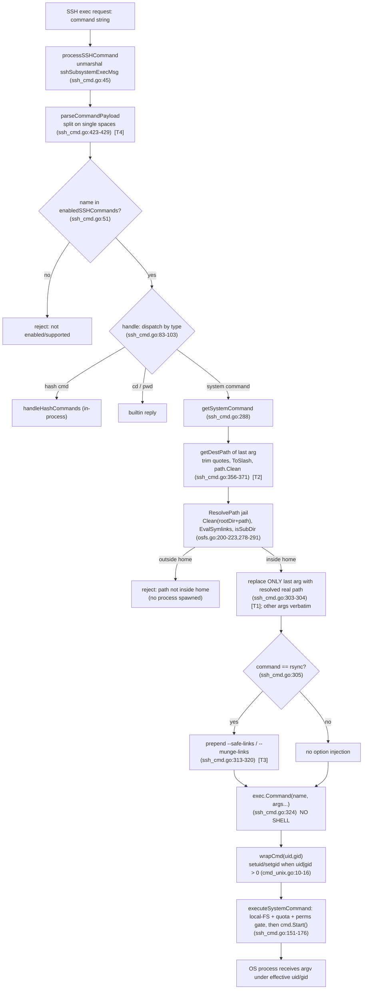

# SFTPGo SSH System‑Command `argv` Forensics — branch `sftpgo_44634210287c` (HEAD `44634210287c`)

> **Scope (one line):** A reproducible, evidence‑backed forensic determination of how SFTPGo's optional SSH "system commands" feature builds the argument vector (`argv`) it hands to an OS process, captured live for two invocations under two permission contexts, used to adjudicate three security suspicions — with **no modification to the source repository**.

| Field | Value |
|---|---|
| Repository | `github.com/drakkan/sftpgo` (flat layout, early SFTPGo) |
| Source branch | `sftpgo_44634210287c` |
| HEAD commit | `44634210287cb192f2a53147eafb84a33a96826b` |
| Reported version | `SFTPGo 0.9.5-dev` |
| Toolchain used | `go version go1.19.13 linux/amd64`, `gcc 15.2.0`, `CGO_ENABLED=1` |
| Feature under test | SSH "system commands" (`rsync`, `git-receive-pack`, `git-upload-pack`, `git-upload-archive`) — **disabled by default** |
| Deliverable | This document only; all runtime scaffolding lives out‑of‑tree under `/tmp` |

> **Note on the toolchain.** The project declares `go 1.13` in `go.mod:3` and CI pins `1.13.x` (`.travis.yml:7-8`). The runtime image provided for this analysis ships **Go 1.19.13**, which compiles and runs the unmodified source cleanly. Per the governing rule ("base your answers on the code as the truth"), this report records the toolchain **actually used** (`go1.19.13`) rather than the declared one; the observed behavior is a property of the source code, not of the compiler version.

---

## 1. Executive answer

Three suspicions were put to the test (this is requirement **R3**). Captured runtime evidence (a `PATH` shim recording the spawned process's exact `os.Args`, cross‑checked against SFTPGo's own debug log and the repository's own unit tests) yields these plain verdicts:

- **S1 — "the server runs the command as a shell‑like string" → WRONG.** SFTPGo spawns the target binary directly via `exec.Command(c.command, args...)` (`sftpd/ssh_cmd.go:324`) with a discrete argument slice and **no shell**. In the adversarial run the spawned process's parent was `sftpgo` (not `/bin/sh`/`bash`), the kernel received each token as a separate NUL‑delimited `argv` element, shell metacharacters (`;`, `&&`, `|`, `$()`) arrived as **literal argument bytes**, and a command‑substitution probe `$(touch …/tmp/pwned_shell)` **never executed**. There is no shell‑metacharacter command‑injection surface.
- **S2 — "the path guardrails and safety flags are a superficial patch" → NUANCED (not accurate as stated, but not a complete option policy either).** The guardrail is **real and active**: a chroot/jail (`vfs/osfs.go:200-223` + `:278-291`) re‑roots and bounds the destination path, and a genuine symlink escape was **rejected before any process was spawned**. For `rsync`, SFTPGo injects `--safe-links`/`--munge-links` (`sftpd/ssh_cmd.go:305-322`). **However**, only the **last** argument is path‑jailed (`:303-304`); every other argument — including attacker‑supplied leading‑dash flags — passes through **verbatim**, leaving an **option‑injection** surface (distinct from shell injection). This is **not** an `rrsync`‑style option allow‑list. (Remediation is explicitly out of scope.)
- **S3 — "the argv reaching the process still closely resembles what the client sent" → MOSTLY RIGHT.** The captured `argv` mirrors the client input with exactly **four deterministic transformations**: (1) the **last** argument is replaced by the chroot‑resolved real filesystem path; (2) surrounding single/double quotes are trimmed on the **last** argument only; (3) for `rsync`, a `--safe-links` or `--munge-links` flag is prepended; (4) tokenization is a naive split on single spaces (quoting is not honored). Everything else survives byte‑for‑byte.

**Privilege‑boundary takeaway (R5):** Privileges are applied **exactly as configured** — a user UID/GID of `0` maps to "no credential" so the child **inherits SFTPGo's own identity**, while a UID/GID of `1000` causes a `setuid`/`setgid` **privilege drop** to that OS identity. The results do **not** demonstrate a privilege‑boundary *break* by themselves; the genuinely dangerous configuration is a **misconfiguration** — *SFTPGo running as root combined with a user whose UID is 0* (the child then runs as root). There is **no shell‑based escape**; the residual risk is option injection bounded by the target binary's own behavior and the user's OS identity.

---

## 2. The feature, and why it is off by default

SFTPGo can answer an SSH `exec` request either with an in‑process built‑in (`md5sum`, `sha1sum`, `cd`, `pwd`) or by spawning a real OS process for one of four **system commands**:

```text
sftpd/sftpd.go:70   systemCommands = []string{"git-receive-pack", "git-upload-pack", "git-upload-archive", "rsync"}
sftpd/sftpd.go:68   defaultSSHCommands = []string{"md5sum", "sha1sum", "cd", "pwd"}
```

The system commands are **absent from the defaults** and must be explicitly enabled through `enabled_ssh_commands` (`sftpd/server.go:99`), and the target binaries (`rsync`, `git-*`) must be installed and on the server's `PATH` (`README.md:154`, `:158-159`). The shipped sample config confirms the default excludes them:

```text
sftpgo.json:22   "enabled_ssh_commands": ["md5sum", "sha1sum", "cd", "pwd"]
```

Consequently the demonstration below first **enables** the feature in an out‑of‑tree config copy; the source `sftpgo.json` is never edited.

---

## 3. Reproducible methodology (deterministic; all scaffolding out‑of‑tree)

Every artifact below — the built binary, the shim binaries, the config copy, the sqlite database, and the logs — lives **only** under `/tmp`. The source tree is never written to. Confirmed environment facts: SFTP/SSH on **port 2022**, REST API (httpd) on **127.0.0.1:8080**, data provider **sqlite** (`track_quota=2`).

### Phase A — Build the unmodified binary (output to `/tmp`)

```bash
cd /tmp/blitzy/sftpgo/sftpgo_44634210287c_d62cba   # the pristine source checkout (branch sftpgo_44634210287c)
go version                                         # go version go1.19.13 linux/amd64
go build -o /tmp/sftpgo .                           # exit 0; produces /tmp/sftpgo (SFTPGo 0.9.5-dev)
git status --porcelain                              # empty — building did not touch the tree
```

Building the **unmodified** source guarantees the observed behavior reflects the real code.

### Phase B — Enable the optional feature (out‑of‑tree config copy)

```bash
mkdir -p /tmp/sftpgo_run
# Copy sftpgo.json and set enabled_ssh_commands to the four system commands; keep sqlite.
# (absolute sqlite path + read-only pointers to the source templates/static so httpd starts)
#   "enabled_ssh_commands": ["rsync","git-receive-pack","git-upload-pack","git-upload-archive"]
# The data provider in this version does NOT auto-create its schema, so create the users table
# from the exact CI schema (.travis.yml:14):
sqlite3 /tmp/sftpgo_run/sftpgo.db 'CREATE TABLE "users" ( ... "uid" integer NOT NULL, "gid" integer NOT NULL, ... );'
```

The only functional change versus the shipped config is the `enabled_ssh_commands` list (full diff in the Appendix).

### Phase C — Instrument the OS‑process boundary (a `PATH` shim)

`getSystemCommand` resolves the target by name and `exec.Command` performs a `PATH` lookup (`sftpd/ssh_cmd.go:324`). By placing executables named `rsync`, `git-receive-pack`, … **earlier on `PATH`** than the real binaries, the shim is spawned *in their place* and records exactly what SFTPGo delivered — without adding any code to the repository. The shim (full source in the Appendix) records its verbatim `os.Args`, its effective/real uid+gid, its parent process name, and its raw `/proc/self/cmdline`, then exits 0.

```bash
mkdir -p /tmp/shimbin
go build -o /tmp/shimbin/shim /tmp/shimsrc/shim.go
for n in rsync git-receive-pack git-upload-pack git-upload-archive; do cp -f /tmp/shimbin/shim /tmp/shimbin/$n; done
```

### Phase D — Start the server and provision two users (the two permission contexts)

```bash
# Launch detached, with the shim prepended to PATH and debug logging enabled.
cd /tmp/sftpgo_run
setsid env PATH=/tmp/shimbin:$PATH SHIM_LOG=/tmp/shim.log \
  /tmp/sftpgo serve -c /tmp/sftpgo_run --log-file-path /tmp/sftpgo_run/sftpgo.log --log-verbose=true &
# (server auto-generates an ssh-rsa host key: /tmp/sftpgo_run/id_rsa)

# A keypair for non-interactive auth (ed25519 sidesteps RSA signature-algorithm negotiation).
ssh-keygen -t ed25519 -N "" -f /tmp/sftpgo_key

# Provision via the repo's own REST CLI. The full permission set required by executeSystemCommand
# is download,upload,create_dirs,list,overwrite,delete,rename; '*' (PermAny) is a superset and
# also grants create_symlinks (=> rsync gets --safe-links).
python3 scripts/sftpgo_api_cli.py add-user userA -K "$(cat /tmp/sftpgo_key.pub)" -H /tmp/homeA --uid 0    --gid 0    -G '*'
python3 scripts/sftpgo_api_cli.py add-user userB -K "$(cat /tmp/sftpgo_key.pub)" -H /tmp/homeB --uid 1000 --gid 1000 -G '*'
```

- **User A → Context A** (`UID/GID = 0`): `GetUID()/GetGID()` map `0 → -1` (`dataprovider/user.go:237-250`), so `wrapCmd` is a no‑op and the child inherits the server's identity.
- **User B → Context B** (`UID/GID = 1000`): `wrapCmd` sets a `setuid`/`setgid` credential (`sftpd/cmd_unix.go:10-16`). This requires SFTPGo to run as **root** (`README.md:503`); in this sandbox SFTPGo runs as root (`uid=0`), so Context B is demonstrated **live**.

### Phase E — Drive the 2×2 matrix over the SSH `exec` channel

The two invocation strings are **derived from the repository's own test suite** (labeled as such), then the adversarial one is extended to probe path/option handling:

- **NORMAL** — from `TestRsyncOptions` (`sftpd/internal_test.go:787`): `rsync --server -vlogDtprze.iLsfxC . /`
- **ADVERSARIAL** — a path‑traversal destination (cf. `git-receive-pack /../../testrepo`, `sftpd/internal_test.go:637-639`) extended with a leading‑dash flag in a non‑last position and shell metacharacters: `rsync --server -vlogDtprze.iLsfxC --rsh=$(touch${IFS}/tmp/pwned_shell) ;id; &&whoami |cat . /../../../../etc/passwd`

```bash
SSHOPTS="-n -i /tmp/sftpgo_key -o IdentitiesOnly=yes -o HostKeyAlgorithms=+ssh-rsa \
         -o PubkeyAcceptedAlgorithms=+ssh-rsa -o StrictHostKeyChecking=no \
         -o UserKnownHostsFile=/dev/null -o BatchMode=yes -p 2022"
ssh $SSHOPTS userA@127.0.0.1 'rsync --server -vlogDtprze.iLsfxC . /'      # NORMAL × Context A
ssh $SSHOPTS userB@127.0.0.1 'rsync --server -vlogDtprze.iLsfxC . /'      # NORMAL × Context B
ssh $SSHOPTS userA@127.0.0.1 '<ADVERSARIAL string>'                       # ADVERSARIAL × Context A
ssh $SSHOPTS userB@127.0.0.1 '<ADVERSARIAL string>'                       # ADVERSARIAL × Context B
```

### Phase F — Dual corroboration (each captured `argv` confirmed ≥2 independent ways)

1. the `PATH` shim's recorded `os.Args` (the spawned process's view); **and**
2. SFTPGo's own debug line in `getSystemCommand` (`sftpd/ssh_cmd.go:323`: `"new system command … with args: …"`); **supported by**
3. the repository's existing unit tests, run unmodified in a throwaway copy: `go test -run '^TestRsyncOptions$|^TestWrapCmd$' ./sftpd/` (assert on `cmd.cmd.Args` and on `SysProcAttr.Credential`).

### Phase G — Clean‑tree confirmation (R6)

`git status --porcelain` / `git diff` / `git rev-parse HEAD` on the source checkout (pasted verbatim in §10).

---

## 4. Evidence — captured `argv` and effective uid/gid (R1 + R2)

The matrix below is **live captured data** (no placeholders). "Client‑sent" is the exact string handed to the SSH `exec` channel; "Spawned `os.Args`" is what the shim recorded as the spawned process's argument vector; "euid/egid" is the spawned process's effective identity; the debug line is SFTPGo's own corroborating record.

| # | Invocation × Context | User (UID/GID) | Spawned `os.Args` (verbatim, from shim) | euid/egid |
|---|---|---|---|---|
| 1 | NORMAL × A | userA (0/0) | `["rsync","--safe-links","--server","-vlogDtprze.iLsfxC",".","/tmp/homeA"]` | **0 / 0** |
| 2 | NORMAL × B | userB (1000/1000) | `["rsync","--safe-links","--server","-vlogDtprze.iLsfxC",".","/tmp/homeB"]` | **1000 / 1000** |
| 3 | ADVERSARIAL × A | userA (0/0) | `["rsync","--safe-links","--server","-vlogDtprze.iLsfxC","--rsh=$(touch${IFS}/tmp/pwned_shell)",";id;","&&whoami","\|cat",".","/tmp/homeA/etc/passwd"]` | **0 / 0** |
| 4 | ADVERSARIAL × B | userB (1000/1000) | `["rsync","--safe-links","--server","-vlogDtprze.iLsfxC","--rsh=$(touch${IFS}/tmp/pwned_shell)",";id;","&&whoami","\|cat",".","/tmp/homeB/etc/passwd"]` | **1000 / 1000** |

> **Markdown note:** inside the matrix code spans the single `|` byte of the adversarial `argv` is written `\|` in the Markdown *source* purely so the table keeps the correct column count; it renders as a literal `|`. The byte‑exact `argv` (with an unescaped `|`) is reproduced in the fenced `getSystemCommand` debug block immediately below and in the raw shim record (`os.Args` / `cmdline_raw`) of §4.2.


**Corroborating `getSystemCommand` debug lines** (`sftpd/ssh_cmd.go:323`), one per cell — identical token sequence to the shim's `os.Args`:

```text
# cell 1 (NORMAL × A)
new system command "rsync", with args: [--safe-links --server -vlogDtprze.iLsfxC . /tmp/homeA] path: /tmp/homeA
# cell 2 (NORMAL × B)
new system command "rsync", with args: [--safe-links --server -vlogDtprze.iLsfxC . /tmp/homeB] path: /tmp/homeB
# cell 3 (ADVERSARIAL × A)
new system command "rsync", with args: [--safe-links --server -vlogDtprze.iLsfxC --rsh=$(touch${IFS}/tmp/pwned_shell) ;id; &&whoami |cat . /tmp/homeA/etc/passwd] path: /tmp/homeA/etc/passwd
# cell 4 (ADVERSARIAL × B)
new system command "rsync", with args: [--safe-links --server -vlogDtprze.iLsfxC --rsh=$(touch${IFS}/tmp/pwned_shell) ;id; &&whoami |cat . /tmp/homeB/etc/passwd] path: /tmp/homeB/etc/passwd
```

**Tokenizer view (what the client sent, after `parseCommandPayload`)** — SFTPGo's `"new ssh command"` log shows the *pre‑jail* argument list, where the adversarial last argument is still `/../../../../etc/passwd`:

```text
new ssh command: "rsync" args: [--server -vlogDtprze.iLsfxC . /] user: userA, error: <nil>
new ssh command: "rsync" args: [--server -vlogDtprze.iLsfxC --rsh=$(touch${IFS}/tmp/pwned_shell) ;id; &&whoami |cat . /../../../../etc/passwd] user: userA, error: <nil>
```

### 4.1 Reading the matrix

- **R2 (two permission contexts) is shown directly:** the only difference between cells 1↔2 and 3↔4 is the **effective uid/gid** of the spawned process — `0/0` under Context A versus `1000/1000` under Context B — and the home directory the last argument resolves into (`/tmp/homeA` vs `/tmp/homeB`). The `argv` *shape* is otherwise identical.
- **R1 (exact argv) is shown directly:** the spawned `os.Args` is captured verbatim for both a normal and an adversarial invocation.
- **Adversarial cell, explicitly:** the shell metacharacter tokens `;id;`, `&&whoami`, `|cat` and the command‑substitution `--rsh=$(touch${IFS}/tmp/pwned_shell)` arrive as **literal `argv` elements** (not interpreted); the traversal `/../../../../etc/passwd` was **path‑resolved** down to `/tmp/homeA/etc/passwd` (re‑rooted inside the user's home), never reaching the real `/etc/passwd`.

### 4.2 Raw shim record for the adversarial process (Context A), including the no‑shell proof

```text
==== SHIM INVOCATION ====
invoked_as:  "rsync"
argc:        10
os.Args:     []string{"rsync", "--safe-links", "--server", "-vlogDtprze.iLsfxC", "--rsh=$(touch${IFS}/tmp/pwned_shell)", ";id;", "&&whoami", "|cat", ".", "/tmp/homeA/etc/passwd"}
euid:        0
egid:        0
pid:         63858
ppid:        62366
parent_comm: "sftpgo"
cmdline_raw: "rsync\0--safe-links\0--server\0-vlogDtprze.iLsfxC\0--rsh=$(touch${IFS}/tmp/pwned_shell)\0;id;\0&&whoami\0|cat\0.\0/tmp/homeA/etc/passwd\0"
=========================
```

`parent_comm: "sftpgo"` proves the spawning parent is SFTPGo itself, not a shell; `cmdline_raw` shows the kernel received each token as a separate **NUL‑delimited** `argv` element. After the run, the probe file `/tmp/pwned_shell` **did not exist**, confirming the `$( … )` was never evaluated.


### 4.3 Auxiliary evidence

**(a) The jail actively rejects a genuine escape (no process spawned).** A symlink inside the home dir was pointed outside it (`/tmp/homeA/escape_link → /etc`) and referenced as the destination:

```bash
ln -s /etc /tmp/homeA/escape_link
ssh $SSHOPTS userA@127.0.0.1 'git-receive-pack /escape_link/passwd'     # ssh exit = 1
```

Result: the command was **rejected before exec** — the shim log stayed **empty** (no process spawned) and the `getSystemCommand` debug count did not increase. SFTPGo logged:

```text
Invalid path resolution, dir: "/etc/passwd" outside user home: "/tmp/homeA" err: path "/etc/passwd" is not inside: "/tmp/homeA"
command failed: "git-receive-pack" args: [/escape_link/passwd] user: userA err: path "/etc/passwd" is not inside: "/tmp/homeA"
```

This is the `isSubDir` check firing (`vfs/osfs.go:278-291`): a resolved real path outside the home directory is refused, and `getSystemCommand` returns the error before `exec.Command` is ever reached.

**(b) Non‑rsync system command — the assembly path is general; the flag injection is `rsync`‑specific.** `git-receive-pack /testrepo` (cf. `sftpd/internal_test.go:762-764`) produced:

```text
shim os.Args: []string{"git-receive-pack", "/tmp/homeA/testrepo"}   (euid/egid 0/0)
debug:        new system command "git-receive-pack", with args: [/tmp/homeA/testrepo] path: /tmp/homeA/testrepo
```

The last argument `/testrepo` was jailed to `/tmp/homeA/testrepo` exactly as for `rsync`, but **no `--safe-links`/`--munge-links`** was added — that injection is gated on `c.command == "rsync"` (`sftpd/ssh_cmd.go:305`).

**(c) Existing unit‑test corroboration (run unmodified, in a throwaway copy):**

```text
=== RUN   TestRsyncOptions
--- PASS: TestRsyncOptions (0.00s)
=== RUN   TestWrapCmd
--- PASS: TestWrapCmd (0.00s)
PASS
ok  	github.com/drakkan/sftpgo/sftpd	1.619s
```

`TestRsyncOptions` (`sftpd/internal_test.go:772-816`) asserts that `--safe-links` (with `PermAny`) or `--munge-links` (with the restricted permission set) appears in `cmd.cmd.Args`; `TestWrapCmd` (`sftpd/internal_unix_test.go:10-19`) asserts `wrapCmd(exec.Command("ls"),1000,1001)` yields `Credential.Uid==1000` and `.Gid==1001`. Both independently confirm the behaviors observed live.

---

## 5. S1 verdict — "executes as a shell‑like string" → **WRONG**

**Rationale.** The dispatcher routes a system command to `getSystemCommand()` then `executeSystemCommand()` (`sftpd/ssh_cmd.go:89-94`). The process is created by a single line:

```text
sftpd/ssh_cmd.go:324   cmd := exec.Command(c.command, args...)
```

`exec.Command` takes a program name and a **slice of discrete arguments**; it performs a `PATH` lookup and a direct `fork`/`exec` of that program. There is **no** `"/bin/sh"`, `"-c"`, `bash`, or any intermediate interpreter anywhere on this path. Go's `os/exec` is the textbook secure pattern precisely because arguments are passed as an array and never concatenated into a string parsed by a shell.

**Evidence (live).**
- **No shell in the process chain:** the spawned process reported `parent_comm: "sftpgo"` (§4.2) — its parent is the server, not a shell.
- **Arguments are discrete:** `cmdline_raw` shows the kernel received `rsync\0--safe-links\0…\0;id;\0&&whoami\0|cat\0…\0` — the metacharacters are *inside* individual `argv` elements, not separating commands.
- **Metacharacters are inert:** `;`, `&&`, `|`, and `$( … )` were delivered literally; the `$(touch${IFS}/tmp/pwned_shell)` substitution **did not run** (`/tmp/pwned_shell` was never created). A shell would have created it.
- **Corroboration:** the `getSystemCommand` debug line (§4) shows the same discrete slice, and `TestRsyncOptions` asserts directly on `cmd.cmd.Args`.

**Conclusion.** SFTPGo does **not** execute system commands through a shell or as a shell‑interpreted string. The shell‑metacharacter command‑injection surface the suspicion describes **does not exist** here.

---

## 6. S2 verdict — "the guardrails/safety flags are a superficial patch" → **NUANCED**

**The guardrail is real (so "superficial patch" is not accurate).**
- **Local filesystem gate:** system commands are refused unless the user's filesystem is the local OS FS (`sftpd/ssh_cmd.go:152-153` → `vfs.IsLocalOsFs`, `vfs/vfs.go:67-69`).
- **Permission + quota gate:** a full permission set (`download,upload,create_dirs,list,overwrite,delete,rename`) and a quota check must pass before spawn (`sftpd/ssh_cmd.go:154-162`).
- **Chroot/jail on the destination:** the last argument is resolved through `ResolvePath` (`vfs/osfs.go:200-223`), which `filepath.Clean`s `rootDir + path`, evaluates symlinks, and calls `isSubDir` (`:278-291`). A path that resolves outside the home is **rejected** — demonstrated live in §4.3(a), where a symlink escape was refused and **no process was spawned**.
- **rsync symlink policy:** SFTPGo injects `--safe-links` (if the user may create symlinks) or `--munge-links` otherwise (`sftpd/ssh_cmd.go:305-322`), to stop rsync from materializing symlinks that point outside the home — a deliberate, documented control (`README.md:159`).

**But it is not a comprehensive option policy (so the suspicion is not entirely wrong either).** Only the **last** argument is jailed:

```text
sftpd/ssh_cmd.go:303   args = args[:len(args)-1]   // drop the client's last arg
sftpd/ssh_cmd.go:304   args = append(args, path)   // append the chroot-resolved real path
```

Every **other** argument passes through **verbatim**. The live adversarial capture (§4, cell 3/4) shows the injected `--rsh=$(touch${IFS}/tmp/pwned_shell)` and the bare tokens `;id;`, `&&whoami`, `|cat` all surviving into the spawned `argv` unchanged. These are **options/arguments handed to the target binary** — an **option‑injection** surface, *not* a shell‑injection surface. For `rsync` in particular, only `--safe-links`/`--munge-links` are managed; no other flags are validated or filtered.

**Context (external best practice, my own synthesis).** The canonical tool for restricting rsync over SSH, `rrsync`, both validates the path arguments it receives *and* accepts only a known subset of rsync options, rejecting anything else (including `--protect-args`, which would hide options from inspection). SFTPGo's design is materially different: it path‑jails the destination and manages the symlink flags, but performs **no rsync option allow‑listing**. That gap is the accurate, evidence‑based characterization of S2.

**Remediation is explicitly out of scope** (AAP §0.3.2): this report observes and documents the option‑injection surface; it does **not** propose or implement an `rrsync`‑style allow‑list, a tokenizer change, or any other fix.

**Conclusion.** Calling the guardrail a mere "superficial patch" is **inaccurate** — the chroot/jail, local‑FS gate, permission/quota checks, and rsync symlink policy are genuine and actively enforced. But it is **not** a complete option‑handling policy: non‑last arguments, including attacker‑controlled flags, pass through verbatim. **Verdict: nuanced / partly right.**

---

## 7. S3 verdict — "the argv still closely resembles what the client sent" → **MOSTLY RIGHT**

Comparing the client‑sent tokenization against the spawned `os.Args` (adversarial, Context A):

| Position | Client sent (after `parseCommandPayload`) | Spawned `os.Args` | Transformation |
|---|---|---|---|
| — | *(n/a)* | `--safe-links` | **(3)** rsync flag **prepended** |
| 1 | `--server` | `--server` | unchanged |
| 2 | `-vlogDtprze.iLsfxC` | `-vlogDtprze.iLsfxC` | unchanged |
| 3 | `--rsh=$(touch${IFS}/tmp/pwned_shell)` | `--rsh=$(touch${IFS}/tmp/pwned_shell)` | unchanged (verbatim) |
| 4 | `;id;` | `;id;` | unchanged (verbatim) |
| 5 | `&&whoami` | `&&whoami` | unchanged (verbatim) |
| 6 | `\|cat` | `\|cat` | unchanged (verbatim) |
| 7 | `.` | `.` | unchanged |
| 8 (last) | `/../../../../etc/passwd` | `/tmp/homeA/etc/passwd` | **(1)** last arg → chroot‑resolved real path |

The captured `argv` is a near‑mirror of the client input. The **only** differences are four deterministic transformations:

1. **Last argument → resolved real path.** The client's final argument is replaced by the chroot‑resolved absolute filesystem path (`sftpd/ssh_cmd.go:298-304`); `getDestPath` (`:356-371`) first `path.Clean`s it (so `/../../../../etc/passwd → /etc/passwd`), then `ResolvePath` re‑roots it under the home (`→ /tmp/homeA/etc/passwd`). Observed: `/ → /tmp/homeA`; `/../../../../etc/passwd → /tmp/homeA/etc/passwd`.
2. **Quote trimming on the last argument only.** `getDestPath` strips surrounding single then double quotes from the **last** argument (`sftpd/ssh_cmd.go:360-361`). Non‑last arguments keep their quotes verbatim (visible above — token 3's `$( … )` is untouched).
3. **rsync flag prepend.** `--safe-links` (or `--munge-links`) is prepended for `rsync` (`:313-320`). Observed in every rsync cell; absent for `git-receive-pack` (§4.3(b)).
4. **Naive single‑space tokenization.** `parseCommandPayload` splits on a single space with no quote/shell awareness (`sftpd/ssh_cmd.go:423-429`), so quoting is not honored and each space‑delimited token becomes one `argv` element.

**Conclusion.** S3 is **mostly right**: the destination/`argv` closely resembles what the client sent, even for weird/adversarial input — modulo the four well‑defined, deterministic transformations above (the most security‑relevant of which is the last‑argument chroot resolution).


---

## 8. The exact functions that produced the observed `argv` (R4)

Every transformation in §7 is attributable to a specific function. In order of execution:

1. **`parseCommandPayload`** — `sftpd/ssh_cmd.go:423-429`. Splits the raw SSH `exec` command string on single spaces into `(name, args)`. Produces transformation **(4)** (naive tokenization). No quote/shell handling.
2. **`getDestPath`** — `sftpd/ssh_cmd.go:356-371`. Operates on the **last** argument: trims surrounding `'` then `"`, `filepath.ToSlash`, forces absolute, `path.Clean` (collapses `..`), preserves a trailing slash. Produces transformation **(2)** and the `path.Clean` half of **(1)**.
3. **`getSystemCommand`** — `sftpd/ssh_cmd.go:288-331`. The argv assembler. Copies the client args (`:293-294`); resolves the last arg via `ResolvePath` and **replaces only that last element** (`:298-304`) — the rest of transformation **(1)**; for `rsync`, prepends `--safe-links`/`--munge-links` (`:305-322`) — transformation **(3)**; logs the assembled argv (`:323`); and calls **`exec.Command(c.command, args...)`** (`:324`) — the no‑shell spawn central to S1.
4. **`wrapCmd`** — `sftpd/cmd_unix.go:10-16`. Applies the `setuid`/`setgid` `SysProcAttr.Credential` when `uid > 0 || gid > 0`. Does not alter `argv`; it sets the **effective identity** of the process that receives the argv (R2/R5). On Windows it is a no‑op (`sftpd/cmd_windows.go:7-9`).

**Supporting gates (preconditions, *not* argv producers):** `processSSHCommand`/`handle` dispatch and allow‑list check (`sftpd/ssh_cmd.go:45-103`, `:51`); `executeSystemCommand` local‑FS + quota + permission gate and the actual `cmd.Start()` (`:151-176`); `GetUID`/`GetGID` value mapping (`dataprovider/user.go:237-250`); `ResolvePath`/`isSubDir` jail (`vfs/osfs.go:200-223`, `:278-291`); `IsLocalOsFs` (`vfs/vfs.go:67-69`); `checkSSHCommands` allow‑list expansion (`sftpd/server.go:396-413`).



---

## 9. Privilege‑boundary analysis (R5)

**What was observed.** The spawned process's effective identity is governed entirely by the per‑user UID/GID through `GetUID`/`GetGID` → `wrapCmd`:

| Context | User UID/GID | `GetUID()/GetGID()` | `wrapCmd` action | Spawned process euid/egid (live) |
|---|---|---|---|---|
| A | 0 / 0 | `-1 / -1` (`user.go:237-250`) | no‑op (`uid>0\|\|gid>0` false) | **0 / 0** — inherits SFTPGo's identity |
| B | 1000 / 1000 | `1000 / 1000` | sets `Credential{1000,1000}` (`cmd_unix.go:10-16`) | **1000 / 1000** — dropped to that identity |

**What the results *do* imply.**
- Per‑user privilege control works **exactly as configured and documented**. A non‑zero UID/GID causes a real `setuid`/`setgid` **privilege drop**, confirmed live (cells 2 & 4: euid/egid `1000/1000`) and independently by `TestWrapCmd`.
- Because this sandbox runs SFTPGo as **root**, Context B's credential is actually applied (it would be silently ignored if SFTPGo ran as non‑root, `README.md:503`).

**What the results *do not* imply.**
- They do **not** demonstrate a privilege‑boundary *break*. Nothing escalated privilege beyond what the configuration specified; the child never gained rights the configuration did not grant it. There is **no shell‑based escape** (S1).
- The one genuinely dangerous arrangement is a **misconfiguration, not a code defect**: SFTPGo running **as root** together with a user whose **UID/GID is 0**. Then Context A's "inherit the server's identity" means the spawned `rsync`/`git` runs **as root** — and because of the option‑injection surface (S2), an attacker who can pass arbitrary flags to a root‑run target binary is operating with substantial privilege. The fix for that is operational (don't run as root, or never assign UID 0 to an SFTP user), and is out of scope for this observe‑and‑report task.
- The residual risk is therefore **option injection bounded by (i) the target binary's own behavior and (ii) the effective OS identity** set by `wrapCmd` — not arbitrary shell execution.

**Platform caveat.** On Windows, `wrapCmd` is a pure no‑op (`sftpd/cmd_windows.go:7-9`): no credential is applied regardless of the configured UID/GID. This is **documented here as a caveat** and was **not** demonstrated at runtime (the analysis ran on the Unix toolchain).

---

## 10. Clean‑tree confirmation — the source repository is unchanged (R6)

All scaffolding (built binary, shim, config copy, sqlite db, logs, throwaway test copy) lives under `/tmp`. The source checkout was never written to. Verbatim output from the source checkout (branch `sftpgo_44634210287c`):

```text
$ git rev-parse --abbrev-ref HEAD
sftpgo_44634210287c
$ git rev-parse HEAD
44634210287cb192f2a53147eafb84a33a96826b
$ git status --porcelain
            ← (empty: no modified, added, or untracked files)
$ git diff --stat
            ← (empty: no tracked content changed)
```

The HEAD commit is exactly `44634210287cb192f2a53147eafb84a33a96826b`, `git status --porcelain` is empty, and `git diff` shows no changes — the source tree is **byte‑for‑byte unchanged**.

> Methodology note: the repository's own test harness (`sftpd/sftpd_test.go`) writes scratch files (e.g. `sftpgo_sftpd_test.log`, `login_banner`, and a `sftpgo.db`) into its config directory (`..`, the repo root). To honor R6 strictly, the corroboration tests in §4.3(c) were executed inside a **throwaway copy** of the repo under `/tmp`, so none of those artifacts ever touched the source checkout. (The only deliverable added to the destination repository is this document, under `blitzy/documentation/`, which is not part of the SFTPGo source tree.)

---

## 11. Appendix

### 11.1 The `PATH` shim (out‑of‑tree; never committed to the source repo)

```go
// /tmp/shimsrc/shim.go — out-of-tree argv/identity recorder. Installed on PATH as
// rsync, git-receive-pack, etc. so SFTPGo's exec.Command(name, args...) resolves it.
package main

import (
	"fmt"
	"io/ioutil"
	"os"
	"strings"
	"syscall"
	"time"
)

func readFile(p string) string {
	b, err := ioutil.ReadFile(p)
	if err != nil {
		return "(" + err.Error() + ")"
	}
	return string(b)
}

func main() {
	logPath := os.Getenv("SHIM_LOG")
	if logPath == "" {
		logPath = "/tmp/shim.log"
	}
	f, err := os.OpenFile(logPath, os.O_APPEND|os.O_CREATE|os.O_WRONLY, 0644)
	if err != nil {
		os.Exit(0)
	}
	defer f.Close()
	var b strings.Builder
	b.WriteString("==== SHIM INVOCATION ====\n")
	fmt.Fprintf(&b, "time:        %s\n", time.Now().Format(time.RFC3339Nano))
	fmt.Fprintf(&b, "invoked_as:  %q\n", os.Args[0])
	fmt.Fprintf(&b, "argc:        %d\n", len(os.Args))
	fmt.Fprintf(&b, "os.Args:     %#v\n", os.Args) // exact slice as received
	for i, a := range os.Args {
		fmt.Fprintf(&b, "  arg[%d]: %q\n", i, a)
	}
	fmt.Fprintf(&b, "euid:        %d\n", syscall.Geteuid())
	fmt.Fprintf(&b, "egid:        %d\n", syscall.Getegid())
	fmt.Fprintf(&b, "ruid:        %d\n", syscall.Getuid())
	fmt.Fprintf(&b, "rgid:        %d\n", syscall.Getgid())
	fmt.Fprintf(&b, "pid:         %d\n", os.Getpid())
	ppid := os.Getppid()
	fmt.Fprintf(&b, "ppid:        %d\n", ppid)
	fmt.Fprintf(&b, "parent_comm: %q\n", strings.TrimSpace(readFile(fmt.Sprintf("/proc/%d/comm", ppid))))
	fmt.Fprintf(&b, "cmdline_raw: %q\n", strings.ReplaceAll(readFile("/proc/self/cmdline"), "\x00", "\\0"))
	b.WriteString("=========================\n")
	f.WriteString(b.String())
	os.Exit(0)
}
```

### 11.2 Config delta vs the shipped `sftpgo.json` (only the feature toggle changed)

```diff
- "enabled_ssh_commands": ["md5sum", "sha1sum", "cd", "pwd"]
+ "enabled_ssh_commands": ["rsync", "git-receive-pack", "git-upload-pack", "git-upload-archive"]
```

(For convenience the out‑of‑tree copy also set an absolute sqlite path and pointed `templates_path`/`static_files_path` at the read‑only source directories so the REST httpd would start; these are runtime conveniences, not behavioral changes to the feature under test.)

### 11.3 User provisioning (REST CLI) and the users‑table schema

```bash
python3 scripts/sftpgo_api_cli.py add-user userA -K "<ed25519 pubkey>" -H /tmp/homeA --uid 0    --gid 0    -G '*'
python3 scripts/sftpgo_api_cli.py add-user userB -K "<ed25519 pubkey>" -H /tmp/homeB --uid 1000 --gid 1000 -G '*'
```

The sqlite `users` table was created from the exact CI schema (`.travis.yml:14`), whose columns include `uid integer NOT NULL` and `gid integer NOT NULL` — the persisted values that drive `wrapCmd`.

### 11.4 Source citations used in this report

| Concern | Citation |
|---|---|
| Command sets / allow‑list | `sftpd/sftpd.go:66-70`, `sftpd/server.go:99,396-413` |
| Tokenizer | `sftpd/ssh_cmd.go:423-429` |
| Last‑arg normalization | `sftpd/ssh_cmd.go:356-371` |
| argv assembly + `exec.Command` | `sftpd/ssh_cmd.go:288-331` (spawn at `:324`) |
| rsync flag injection | `sftpd/ssh_cmd.go:305-322` |
| Preconditions / spawn | `sftpd/ssh_cmd.go:151-176` |
| `setuid`/`setgid` | `sftpd/cmd_unix.go:10-16`; Windows no‑op `sftpd/cmd_windows.go:7-9` |
| UID/GID mapping | `dataprovider/user.go:237-250` |
| Chroot jail | `vfs/osfs.go:200-223`, `:278-291`; local‑FS gate `vfs/vfs.go:67-69` |
| Documented model | `README.md:154`, `:158-159`, `:503` |
| Corroboration tests | `sftpd/internal_test.go:772-816`, `:637-639`, `:762-764`; `sftpd/internal_unix_test.go:10-19` |
| Build env | `go.mod:1-3,30`, `.travis.yml:7-8,14` |

---

*End of report. This document is the sole artifact created for this investigation; the SFTPGo source repository (branch `sftpgo_44634210287c`, HEAD `44634210287c`) is left exactly as it was found.*

