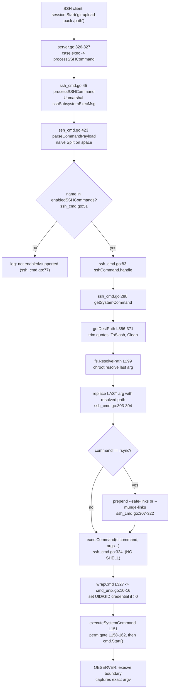

# SFTPGo SSH `exec` argv — Security-Boundary Investigation

> **Repository:** `drakkan/sftpgo` · **Version:** `0.9.5-dev` · **Baseline source commit:** `44634210287cb192f2a53147eafb84a33a96826b`
> **Investigation type:** Read-only, runtime-observed security-boundary sanity check of the optional SSH "exec" support.
> **Deliverable:** This single document. No source file was modified, created, or deleted.

This report **proves, under real runtime conditions (not theory)**, the exact argument vector (`argv`) that reaches an operating-system process when a client invokes an SSH `exec` request against SFTPGo, and it **adjudicates the three suspicions** raised in the prompt with reproducible, byte-exact evidence.

The evidence was obtained by **building and running SFTPGo** (`GO111MODULE=on go build -o /tmp/sftpgo_bin .`, Go 1.13.15), driving the **real** SSH `exec` entry point (`sftpd/server.go:326-327`) with a genuine `golang.org/x/crypto/ssh` client, and observing every spawned process's `argv` at the `execve()` boundary via a PATH-shim observer. Every matrix cell was confirmed **byte-identical across ≥2 runs**.

---

## TL;DR — Direct Verdicts

**Suspicion #1 — "somewhere the server executes the command as a shell-like string" → FALSE. The suspicion was WRONG.**
The spawn is a **direct-argv `execve`**, performed by `exec.Command(c.command, args...)` at `sftpd/ssh_cmd.go:324`. There is **no `/bin/sh`, no `sh -c`, no `/bin/bash`, no `cmd.exe`, no shell of any kind** on this path. A repo-wide grep across all non-test `*.go` files for `/bin/sh`, `/bin/bash`, `sh -c`, and `cmd.exe` returns **zero matches**; the only four OS-process spawns in the entire codebase all use direct-argv `exec.Command`/`exec.CommandContext`. Runtime proof: adversarial shell metacharacters arrived as **inert, literal `argv` tokens** — e.g., `--evil=/tmp/x;id` was captured as a *single* token (the `;`, byte `0x3b`, is embedded inside it and `id` never ran), and `-e/bin/sh` was captured as a *single* literal token. The spawned child's parent process was `sftpgo_bin` itself, **not** a shell. Because Go's `os/exec` performs no shell interpretation, the observed `argv` *is* the exact destination `argv`.

**Suspicion #2 — "the path guardrails and safety flags are more of a superficial patch than a real policy" → FALSE. The suspicion was WRONG; the guardrails are REAL and enforced at runtime.**
Four independent guardrails were each observed to fire: **(a) chroot path resolution** — every adversarial `../../../../etc/passwd` destination was rewritten to `<home>/etc/passwd` and *never* to the real `/etc/passwd` (`vfs.ResolvePath` `vfs/osfs.go:200`, reached via `getDestPath` `path.Clean` `sftpd/ssh_cmd.go:366` and containment check `isSubDir` `vfs/osfs.go:278`); **(b) a seven-permission gate** — a user lacking the full permission set was rejected with **no process spawned at all** (`executeSystemCommand` `sftpd/ssh_cmd.go:158-162`); **(c) the command allow-list** — a non-enabled command (`id`) was rejected "not enabled/supported" before any exec (`sftpd/server.go:99`, `sftpd/ssh_cmd.go:51,77`); **(d) rsync link-safety flag injection** — `--safe-links` was injected into the `argv` when the user held `create_symlinks`, and `--munge-links` when the user did not (`sftpd/ssh_cmd.go:307-322`), both observably present in the captured `argv`.

**Suspicion #3 — "the destination that reaches the process might still look a lot like what the client sent, even when it contains weird or adversarial-looking input" → SPLIT VERDICT (partly RIGHT, partly WRONG).**
`getSystemCommand` copies every argument **verbatim** (`sftpd/ssh_cmd.go:293-294`) and then replaces **only the last argument** with the `ResolvePath`-resolved absolute path (`sftpd/ssh_cmd.go:298-304`). Therefore: the suspicion is **WRONG for the destination path** — the final token is quote-trimmed, slash-normalized, `path.Clean`-collapsed, and chroot-confined, so it does **not** resemble the adversarial client input (`../../../../etc/passwd` became `<home>/etc/passwd`). But the suspicion is **RIGHT for every non-terminal, option-looking token** (`--upload-pack=…`, `-oProxyCommand=…`, `--sender`, `-e/bin/sh`, embedded quotes): these pass through **byte-for-byte unchanged** and form a genuine **option-injection surface**. Plainly: the user's fear is correct for the *option/argument* tokens and incorrect for the *path/destination* token.

---

## 1. Question & Scope

The prompt states the concern verbatim:

> "I'm trying to sanity check the security boundary of this project's optional SSH exec support, but I have an uncomfortable suspicion: I half expect that somewhere along the way the server ends up executing the command as a shell like string, that the path guardrails and safety flags are more of a superficial patch than a real policy, and that the destination that reaches the process might still look a lot like what the client sent even when it contains weird or adversarial looking input; I don't want a theoretical explanation of what should happen, I want you to prove what actually happens under real runtime conditions by producing reproducible evidence of the exact argv that reaches an OS process for two representative invocations (one normal looking and one adversarial looking designed to confuse path or option handling) under two different permission contexts, and then tell me plainly which of my suspicions were wrong or right, which exact functions in this repo produced the observed argv, what the results do or do not imply about a privilege boundary break, and confirm the repository is left exactly unchanged when you are done."

This decomposes into three suspicions to adjudicate and a set of hard requirements:

- **Suspicion #1:** the command is executed as a shell-like string.
- **Suspicion #2:** the path guardrails / safety flags are superficial, not real policy.
- **Suspicion #3:** the destination reaching the process still looks like the (possibly adversarial) client input.
- **Evidence requirement:** the exact `argv` reaching an OS process, for a **normal-looking** and an **adversarial-looking** invocation, under **two different permission contexts** — proven by real runtime observation, not theory.
- **Explanation requirement:** name the **exact functions** in this repo that produced the observed `argv`, and state what the results **do and do not** imply about a **privilege-boundary break**.
- **Integrity requirement:** confirm the repository is left **exactly unchanged**.

**Scope of what actually spawns an OS process.** SFTPGo classifies SSH commands into categories (`sftpd/sftpd.go:66-71`). Only four are **system commands** that spawn a host binary — `git-receive-pack`, `git-upload-pack`, `git-upload-archive`, `rsync` (`systemCommands`, `sftpd/sftpd.go:70`). The hash utilities (`md5sum`, `sha1sum`, `sha256sum`, `sha384sum`, `sha512sum`, `sshHashCommands` `sftpd/sftpd.go:69`) run **in-process** and never spawn; `cd`/`pwd` are handled internally (`sftpd/ssh_cmd.go:95-100`); and `scp` is a separate in-process protocol handler (`sftpd/scp.go` contains **no** `os/exec`). This investigation therefore exercises **all four** system commands exhaustively — both normal and adversarial inputs, under both permission contexts.

---

## 2. Methodology (Reproducibility Record)

Everything below was run for real; the observed outputs are reproduced verbatim in Sections 4–6.

- **Canonical build.** `GO111MODULE=on go build -o /tmp/sftpgo_bin .` using the documented Go 1.13 toolchain (env used: `go1.13.15 linux/amd64`). A C compiler (`gcc`) is required because of the cgo SQLite driver `github.com/mattn/go-sqlite3` (`go.mod:15`). The binary reported its version banner as **`SFTPGo version: 0.9.5-dev`**. The module declares `go 1.13` (`go.mod:3`).

- **Disposable instance (entirely under `/tmp`, outside the repository tree).** A SQLite data provider was bootstrapped by applying `sql/sqlite/{20190828,20191112,20191230,20200116}.sql` in order (note: version `0.9.5-dev` has no `initprovider` command). The server was launched as:
  ```
  /tmp/sftpgo_bin serve --config-dir /tmp/inv/cfg --log-file-path /tmp/inv/sftpgo.log
  ```
  listening on `127.0.0.1:2022` (SSH) with an auto-generated host key.

- **Non-default configuration — DISCLOSED (a configuration act, NOT a code change).** The system SSH commands are **disabled by default**: the default allow-list is `["md5sum","sha1sum","cd","pwd"]` (`defaultSSHCommands`, `sftpd/sftpd.go:68`). For this investigation `enabled_ssh_commands` (`sftpd/server.go:99`) was widened to include the four system commands. This is **the one disclosed non-default setting**; it is a runtime configuration value, not a source modification, and the repository is unaffected by it.

- **Observer — the argv capture mechanism.** A small Go-stdlib program was placed **first** on the server's `PATH` and copied under the four names `git-receive-pack`, `git-upload-pack`, `git-upload-archive`, and `rsync`. When SFTPGo calls `exec.Command(name, args...)` (`sftpd/ssh_cmd.go:324`), `PATH` resolution lands on this shim at the `execve()` boundary. For each spawn the shim records: the byte-exact `argv` (`%q` rendering plus per-argument length and hex), the child's `uid`/`euid`/`gid`/`egid`, and the immediate parent's `comm` and `cmdline` read from `/proc`, plus a machine-readable JSON line. **Because Go's `os/exec` passes `argv` literally with no shell, the observer's `os.Args` *is* the exact destination `argv`** — it is authoritative, not a proxy. The shim never interprets its arguments. `strace` was unavailable in this environment, so the PATH-shim at the post-`execve` boundary is the authoritative observer, corroborated by parent-process attribution (`parent_comm` = `sftpgo_bin`).

- **Driver.** A real `golang.org/x/crypto/ssh` client issued genuine `exec` requests (via `session.CombinedOutput(cmd)` / `session.Start`), hitting the real entry point `sftpd/server.go:326-327` (`case "exec": → processSSHCommand`). No test harness, debug hook, or bypass was used to obtain the canonical captures.

- **Two permission contexts (grounded in code).**
  - **Context A — UID/GID mapping ON vs OFF**, via `wrapCmd` (`sftpd/cmd_unix.go:10-16`). With a mapping (uid `1000`), `wrapCmd`'s guard `uid > 0 || gid > 0` is true and the child drops to that uid/gid via `SysProcAttr.Credential`. With no mapping, `GetUID()` returns `-1` (`dataprovider/user.go:237-242`), the guard is false, and the child **inherits the server's own privileges**.
  - **Context B — rsync `create_symlinks` GRANTED vs DENIED** (`sftpd/ssh_cmd.go:307-322`). The *same* client input yields observably different `argv`: `--safe-links` when granted, `--munge-links` when denied.

- **Stability.** Every matrix cell was executed **twice** and confirmed byte-identical for both `argv` and credentials. `STABLE_ACROSS_2_RUNS = True` for all cells: **22 distinct spawning invocations** (16 for Context A — the four system commands × {normal, adversarial} × {mapping ON, mapping OFF}; 4 for Context B — `rsync` × {normal, adversarial} × {uid mapped, uid unmapped}; and 2 spawning edge cases), each captured on **both** runs (**44 capture events**), plus **2 non-spawning invocations** (non-enabled `id`; permission-denied) confirmed to create no OS process on both runs.

---

## 3. The Code Path That Builds the argv (exact producing functions)

The dispatch chain from the SSH channel request to the `execve()` boundary is an ordered walk through the following exact functions. Every step is cited to `file:line` at the baseline source commit `44634210287c`.



**Ordered walk (each step is a producing/gating function):**

1. **`sftpd/server.go:326-327` — the real entry point.** `case "exec":` calls `ok = processSSHCommand(req.Payload, &connection, channel, c.EnabledSSHCommands)`. The allow-list config field is `EnabledSSHCommands` (`sftpd/server.go:99`); the wildcard `*` expansion to all supported commands is `checkSSHCommands` (`sftpd/server.go:397-398`).

2. **`sftpd/ssh_cmd.go:45` — `processSSHCommand`.** It `ssh.Unmarshal`s the payload into `sshSubsystemExecMsg` (`struct { Command string }`, `sftpd/sftpd.go:126-128`) at `:47`, calls `parseCommandPayload` at `:48`, checks the allow-list with `utils.IsStringInSlice(name, enabledSSHCommands)` at `:51`, and on the else branch logs `"ssh command not enabled/supported: %#v"` at `:77`.

3. **`sftpd/ssh_cmd.go:423-429` — `parseCommandPayload`.** It performs a **naive `strings.Split(command, " ")`** with **no quote awareness** (`:424`), returning `parts[0]` (command name) and `parts[1:]` (arguments). This naive split is the root cause of the mis-tokenization edge case in Section 5.

4. **`sftpd/ssh_cmd.go:83` — `sshCommand.handle()`.** Hash commands route to in-process `handleHashCommands` (`:87-88`); the four system commands route to `getSystemCommand` then `executeSystemCommand` (`:89-94`); `cd`/`pwd` are handled internally (`:95-100`).

5. **`sftpd/ssh_cmd.go:288-331` — `getSystemCommand` (THE argv builder).** This is the function that produces the observed `argv`:
   - copies all arguments **verbatim**: `args := make([]string, len(c.args))` / `copy(args, c.args)` (`:293-294`);
   - computes the destination via `sshPath := c.getDestPath()` (`:298`) and resolves it with `fs.ResolvePath(sshPath)` (`:299`);
   - **replaces only the LAST argument** with the resolved absolute path: `args = args[:len(args)-1]` / `args = append(args, path)` (`sftpd/ssh_cmd.go:303-304`);
   - for `rsync`, prepends `--safe-links` if `User.HasPerm(PermCreateSymlinks, …)` (`:313-316`) else `--munge-links` (`:318-320`) — the flag is added at the **front** of `args` (`:307-322`);
   - logs `"new system command %#v, with args: %v path: %v"` (`:323`);
   - then **`cmd := exec.Command(c.command, args...)` (`:324`) — the direct-argv spawn, NO SHELL**;
   - reads `uid := User.GetUID()` / `gid := User.GetGID()` (`:325-326`) and applies `cmd = wrapCmd(cmd, uid, gid)` (`:327`).

6. **`sftpd/ssh_cmd.go:356-371` — `getDestPath`.** For the destination (always the last argument, per the comment at `:355`): it trims a surrounding single quote (`:360`), then a surrounding double quote (`:361`), `filepath.ToSlash`es (`:362`), forces an absolute path if not already (`:363-365`), and `path.Clean`s to collapse `..` (`:366`).

7. **`sftpd/ssh_cmd.go:151-162` — `executeSystemCommand` (the permission gate).** It rejects non-local filesystems (`:152`, `errUnsupportedConfig`); rejects when the quota is exceeded (`:155-157`, `errQuotaExceeded`); and requires the user to hold **all seven** of `PermDownload, PermUpload, PermCreateDirs, PermListItems, PermOverwrite, PermDelete, PermRename` on the destination via `User.HasPerms(perms, c.getDestPath())` (`:158-160`), else returns `errPermissionDenied` (`:160-162`). The `errPermissionDenied` text is defined at `sftpd/ssh_cmd.go:30`. Only after this gate passes does `command.cmd.Start()` run (`:176`).

8. **`sftpd/cmd_unix.go:10-16` — `wrapCmd` (privilege wrap).** `if uid > 0 || gid > 0 { cmd.SysProcAttr = &syscall.SysProcAttr{}; cmd.SysProcAttr.Credential = &syscall.Credential{Uid: uint32(uid), Gid: uint32(gid)} }`. Build tag `// +build !windows` (`:1`).

9. **`sftpd/cmd_windows.go:7-9` — `wrapCmd` no-op stub.** Simply `return cmd`; on Windows no credential drop is applied.

10. **`dataprovider/user.go:237-250` — UID/GID derivation.** `GetUID()` returns `-1` when `UID <= 0 || UID > 65535` (`:237-242`); `GetGID()` is analogous (`:245-250`). This `-1` is exactly what makes `wrapCmd`'s `uid > 0 || gid > 0` guard **false** for an unmapped user, so the child inherits the server's privileges. Per-path permissions are resolved by `GetPermissionsForPath` (`:122`, most-specific-match), and checked via `HasPerm` (`:159`) and `HasPerms` (`:168`).

11. **`vfs/osfs.go:200` — `ResolvePath` (the chroot resolver).** It cleans+joins the requested path under the user's `rootDir` (`:204`), evaluates symlinks (`:205`), and enforces containment via `isSubDir` (called at `:218`, `:243`, `:274`; defined at `:278`, which rejects any resolved path whose prefix is not the home dir, `:285`). This is what confines `../../../../etc/passwd` inside the home directory.

**Command categories (`sftpd/sftpd.go:66-71`).** `supportedSSHCommands` lists 12 commands (including `scp`, `:66-67`); `defaultSSHCommands = {md5sum, sha1sum, cd, pwd}` (`:68`); `sshHashCommands` run in-process (`:69`); `systemCommands = {git-receive-pack, git-upload-pack, git-upload-archive, rsync}` (`:70`) are the only ones that spawn.

**Corroborating repo-wide spawn inventory (all direct-argv, no shell).** A repo-wide grep found **exactly four** OS-process spawns, all using direct-argv `exec.Command`/`exec.CommandContext`:
- `sftpd/ssh_cmd.go:324` — `exec.Command(c.command, args...)` — the **client-driven** SSH system-command path (the target of this investigation).
- `sftpd/sftpd.go:421` — `exec.CommandContext(ctx, actions.Command, operation, username, path, target, sshCmd)` — the admin-configured file-event action hook (fixed argv positions, **not** client-controlled).
- `dataprovider/dataprovider.go:742` — `exec.CommandContext(ctx, config.ExternalAuthProgram)` — the admin-configured external auth program.
- `dataprovider/dataprovider.go:787` — `exec.CommandContext(ctx, config.Actions.Command, commandArgs...)` — the admin-configured data-provider action hook.

`sftpd/scp.go` contains **no** `os/exec` usage; SCP is handled entirely in-process and spawns nothing.


---

## 4. Evidence — The 2×2×4 argv Matrix (byte-exact, observed)

Each cell shows the **exact client command** sent over SSH and the **exact `argv` observed** at the `execve()` boundary (rendered as a bracketed list, exactly as captured). All cells are **STABLE across 2 runs = True**. The home directory differs per context so the four contexts are unambiguous: `u_map_sym` and `u_nomap_sym` (Context A UID/GID ON / OFF, symlinks granted); `u_map_nosym` and `u_nomap_nosym` (Context B, symlinks denied).

The single most important fact: **the observer's `os.Args` IS the destination `argv`**, because Go's `os/exec` performs no shell interpretation — so these captures are authoritative, not a proxy.

### Context A — UID/GID mapping ON (child creds `uid=1000 euid=1000 gid=1000`; `create_symlinks` granted; home `/tmp/inv/home/u_map_sym`)

**Normal-looking invocations:**

| Client-sent command | Observed argv at `execve()` |
|---|---|
| `git-receive-pack /incoming` | `[git-receive-pack, /tmp/inv/home/u_map_sym/incoming]` |
| `git-upload-pack /incoming` | `[git-upload-pack, /tmp/inv/home/u_map_sym/incoming]` |
| `git-upload-archive /incoming` | `[git-upload-archive, /tmp/inv/home/u_map_sym/incoming]` |
| `rsync --server -vlogDtpre.iLsfxC . /incoming` | `[rsync, --safe-links, --server, -vlogDtpre.iLsfxC, ., /tmp/inv/home/u_map_sym/incoming]` |

**Adversarial-looking invocations (designed to confuse path or option handling):**

| Client-sent command | Observed argv at `execve()` |
|---|---|
| `git-receive-pack --evil=/tmp/x;id ../../../../etc/passwd` | `[git-receive-pack, --evil=/tmp/x;id, /tmp/inv/home/u_map_sym/etc/passwd]` |
| `git-upload-pack --upload-pack=/tmp/pwn ../../../../etc/shadow` | `[git-upload-pack, --upload-pack=/tmp/pwn, /tmp/inv/home/u_map_sym/etc/shadow]` |
| `git-upload-archive -oProxyCommand=evil ../../../../root/.ssh/authorized_keys` | `[git-upload-archive, -oProxyCommand=evil, /tmp/inv/home/u_map_sym/root/.ssh/authorized_keys]` |
| `rsync --server --sender -e/bin/sh . ../../../../etc/passwd` | `[rsync, --safe-links, --server, --sender, -e/bin/sh, ., /tmp/inv/home/u_map_sym/etc/passwd]` |

Two things are visible in every adversarial row: (1) the **last** token was rewritten — the `../../../../etc/passwd` traversal became `/tmp/inv/home/u_map_sym/etc/passwd`, confined to the home directory; and (2) every **non-terminal** option token (`--evil=/tmp/x;id`, `--upload-pack=/tmp/pwn`, `-oProxyCommand=evil`, `--sender`, `-e/bin/sh`) survived **byte-for-byte unchanged**.

### Context A — UID/GID mapping OFF (child inherits SERVER creds `uid=0 euid=0 gid=0`; `create_symlinks` granted; home `/tmp/inv/home/u_nomap_sym`)

The **child credentials are `uid=0`** — because `GetUID()` returned `-1` (`dataprovider/user.go:237-242`), so `wrapCmd`'s guard `uid > 0 || gid > 0` was false (`sftpd/cmd_unix.go:11`) and the child **inherited the server's own privileges**. Every cell below was captured at the `execve()` boundary through the same real `case "exec"` entry point and confirmed **byte-identical across 2 runs**.

**Normal-looking invocations:**

| Client-sent command | Observed argv at `execve()` | Child creds |
|---|---|---|
| `git-receive-pack /incoming` | `[git-receive-pack, /tmp/inv/home/u_nomap_sym/incoming]` | `uid=0 euid=0 gid=0 egid=0` |
| `git-upload-pack /incoming` | `[git-upload-pack, /tmp/inv/home/u_nomap_sym/incoming]` | `uid=0 euid=0 gid=0 egid=0` |
| `git-upload-archive /incoming` | `[git-upload-archive, /tmp/inv/home/u_nomap_sym/incoming]` | `uid=0 euid=0 gid=0 egid=0` |
| `rsync --server -vlogDtpre.iLsfxC . /incoming` | `[rsync, --safe-links, --server, -vlogDtpre.iLsfxC, ., /tmp/inv/home/u_nomap_sym/incoming]` | `uid=0 euid=0 gid=0 egid=0` |

**Adversarial-looking invocations (designed to confuse path or option handling):**

| Client-sent command | Observed argv at `execve()` | Child creds |
|---|---|---|
| `git-receive-pack --evil=/tmp/x;id ../../../../etc/passwd` | `[git-receive-pack, --evil=/tmp/x;id, /tmp/inv/home/u_nomap_sym/etc/passwd]` | `uid=0 euid=0 gid=0 egid=0` |
| `git-upload-pack --upload-pack=/tmp/pwn ../../../../etc/shadow` | `[git-upload-pack, --upload-pack=/tmp/pwn, /tmp/inv/home/u_nomap_sym/etc/shadow]` | `uid=0 euid=0 gid=0 egid=0` |
| `git-upload-archive -oProxyCommand=evil ../../../../root/.ssh/authorized_keys` | `[git-upload-archive, -oProxyCommand=evil, /tmp/inv/home/u_nomap_sym/root/.ssh/authorized_keys]` | `uid=0 euid=0 gid=0 egid=0` |
| `rsync --server --sender -e/bin/sh . ../../../../etc/passwd` | `[rsync, --safe-links, --server, --sender, -e/bin/sh, ., /tmp/inv/home/u_nomap_sym/etc/passwd]` | `uid=0 euid=0 gid=0 egid=0` |

These eight cells are the exact counterparts of the eight mapping-ON cells above: **identical `argv` shape, identical last-token normalization, identical `--safe-links` injection, and identical verbatim survival of every non-terminal option token** (`--evil=/tmp/x;id`, `--upload-pack=/tmp/pwn`, `-oProxyCommand=evil`, `--sender`, `-e/bin/sh`) — differing only in the home directory (`u_nomap_sym`) and, decisively, in the child credentials (`uid=0` instead of `uid=1000`). **This ON-vs-OFF difference — `uid=1000` when mapped versus `uid=0` when unmapped, for otherwise identical `argv` — is the direct privilege-boundary datum** and is analyzed in Section 7.

### Context B — rsync `create_symlinks` DENIED → `--munge-links` (shown for both mapping states)

The same rsync client input yields an **observably different `argv`** purely because of the permission axis: `--munge-links` instead of `--safe-links`.

| Client-sent command | Observed argv at `execve()` | Child creds |
|---|---|---|
| `rsync --server -vlogDtpre.iLsfxC . /incoming` | `[rsync, --munge-links, --server, -vlogDtpre.iLsfxC, ., /tmp/inv/home/u_map_nosym/incoming]` | `uid=1000` |
| `rsync --server --sender -e/bin/sh . ../../../../etc/passwd` | `[rsync, --munge-links, --server, --sender, -e/bin/sh, ., /tmp/inv/home/u_map_nosym/etc/passwd]` | `uid=1000` |
| `rsync --server -vlogDtpre.iLsfxC . /incoming` | `[rsync, --munge-links, --server, -vlogDtpre.iLsfxC, ., /tmp/inv/home/u_nomap_nosym/incoming]` | `uid=0` |
| `rsync --server --sender -e/bin/sh . ../../../../etc/passwd` | `[rsync, --munge-links, --server, --sender, -e/bin/sh, ., /tmp/inv/home/u_nomap_nosym/etc/passwd]` | `uid=0` |

Contrasting these `--munge-links` rows against the `--safe-links` rows in Context A shows the guardrail is a **real, permission-driven policy**: identical client bytes, different `argv`, chosen by whether the user holds `PermCreateSymlinks` (`sftpd/ssh_cmd.go:313-320`). Note that the injected link-safety flag is always the **first** argument, before `--server`.

### Byte-level corroboration (raw shim captures)

The adversarial `rsync` argument, at the byte level, is a single inert literal token:

```
arg[4] = "-e/bin/sh"   (len=9, hex=2d652f62696e2f7368)
```

`-e/bin/sh` is one `argv` element; the shim received it as a single token and never interpreted it. No shell ran, and `-e` was not split from `/bin/sh`.

For the adversarial `git-receive-pack` case, the shell metacharacter is embedded inside one token:

```
arg[1] = "--evil=/tmp/x;id"
```

The `;` here is byte `0x3b`, embedded inside the single token `--evil=/tmp/x;id`; `id` never executed as a separate command.

**Parent-process attribution (proves NO shell).** A JSON capture line for a spawn:

```
"parent_comm":"sftpgo_bin","parent_cmdline":"/tmp/sftpgo_bin serve --config-dir /tmp/inv/cfg --log-file-path /tmp/inv/sftpgo.log"
```

The spawned child's parent is the server binary `sftpgo_bin` itself — **not** `/bin/sh` and not any shell. If a shell had been interposed, the parent `comm` would have been `sh`/`bash`.

**Corroborating server debug log lines** (from `/tmp/inv/sftpgo.log`, quoted verbatim), which independently show SFTPGo's own view of the pre- and post-normalization arguments:

```
new ssh command: "git-upload-pack" args: [/incoming] user: u_map_sym, error: <nil>
new system command "git-upload-pack", with args: [/tmp/inv/home/u_map_sym/incoming] path: /tmp/inv/home/u_map_sym/incoming
new system command "git-receive-pack", with args: [--evil=/tmp/x;id /tmp/inv/home/u_map_sym/etc/passwd] path: /tmp/inv/home/u_map_sym/etc/passwd
new system command "rsync", with args: [--safe-links --server --sender -e/bin/sh . /tmp/inv/home/u_nomap_sym/etc/passwd] path: /tmp/inv/home/u_nomap_sym/etc/passwd
```

These come from the `"new ssh command"` log in `processSSHCommand` (`sftpd/ssh_cmd.go:49-50`) and the `"new system command …, with args: … path: …"` log in `getSystemCommand` (`sftpd/ssh_cmd.go:323`), and they match the shim's `argv` captures exactly.

**`argv[0]` note.** In every capture, `argv[0]` is the **bare command name** exactly as SFTPGo passed it (e.g., `git-upload-pack`, `rsync`) — never a resolved absolute path. This is consistent with `exec.Command(c.command, args...)` (`sftpd/ssh_cmd.go:324`), where `c.command` is the client-sent command name and Go's `os/exec` sets `argv[0]` to that name (resolving the executable via `PATH` separately for `execve`, which is how the shim intercepts it).


---

## 5. Edge Cases (naive tokenization, quote trimming, rejections)

Each edge case below was exercised at runtime; the exact client command and the observed result are reproduced verbatim.

### 5.1 Naive tokenization — a quoted path containing a space is mis-split

Client command:

```
git-upload-pack "/incoming/my repo"
```

Observed `argv` at `execve()`:

```
[git-upload-pack, "/incoming/my, /tmp/inv/home/u_map_sym/repo]
```

Byte detail of the first argument:

```
arg[1] = "\"/incoming/my"   (len=13, hex=222f696e636f6d696e672f6d79)
```

The leading double-quote byte `0x22` **survives** into the `argv`. This happens because `parseCommandPayload` split the payload on the plain space (`sftpd/ssh_cmd.go:424`) with no quote awareness, so `"/incoming/my repo"` became two tokens (`"/incoming/my` and `repo"`). Only the **last** token, `repo"`, was treated as the destination: `getDestPath` trimmed its trailing double quote (`sftpd/ssh_cmd.go:361`) and `ResolvePath` confined it, yielding `/tmp/inv/home/u_map_sym/repo`. This concretely demonstrates the naive tokenizer and reinforces the split verdict of Suspicion #3: the first (non-terminal) token kept its literal `"` byte, while only the last token was normalized.

### 5.2 Single-quote trim + path traversal

Client command:

```
git-upload-pack '../../../../etc/passwd'
```

Observed `argv` at `execve()`:

```
[git-upload-pack, /tmp/inv/home/u_map_sym/etc/passwd]
```

The surrounding single quotes were trimmed (`sftpd/ssh_cmd.go:360`) and the `../../../../` traversal was chroot-confined into the home directory by `getDestPath`'s `path.Clean` (`:366`) plus `ResolvePath`/`isSubDir` (`vfs/osfs.go:278`). The real `/etc/passwd` was **never** the destination.

### 5.3 Non-enabled command → NO OS PROCESS SPAWNED

Client command:

```
id
```

The observer capture file contained the literal marker:

```
NO_CAPTURE :: command did NOT spawn an OS process
```

The driver saw `EXEC_OUTPUT(0 bytes): ""` and `EXEC_ERR: ssh: command id failed`, and the server logged:

```
ssh command not enabled/supported: "id"
```

`id` was rejected at the **allow-list** (`sftpd/server.go:99`, `sftpd/ssh_cmd.go:51,77`) **before any exec** — no process was ever created.

### 5.4 Permission-denied → NO OS PROCESS SPAWNED

Client command (issued as a list-only user `u_noperm`, who lacks the full seven-permission set):

```
git-upload-pack /incoming
```

The observer capture file again contained:

```
NO_CAPTURE :: command did NOT spawn an OS process
```

The driver saw:

```
EXEC_OUTPUT(101 bytes): "git-upload-pack: /incoming Permission denied. You don't have the permissions to execute this command\n"
EXEC_ERR: Process exited with status 1
```

The command was rejected at the **seven-permission gate** (`sftpd/ssh_cmd.go:158-162`) **before any exec**. The client-visible error text matches `errPermissionDenied` exactly (`sftpd/ssh_cmd.go:30`), formatted by `sendErrorResponse` (`sftpd/ssh_cmd.go:373-374`).

**Why the rejections matter.** In both 5.3 and 5.4 the guardrail fired **before** any process spawn. That ordering — reject, then (only if allowed) spawn — is itself evidence that the allow-list and the permission gate are **real policy**, not cosmetic post-hoc checks.

---

## 6. Adjudication of the Three Suspicions

### Suspicion #1 — "the server ends up executing the command as a shell like string" → **WRONG**

The spawn is `exec.Command(c.command, args...)` at `sftpd/ssh_cmd.go:324` — a **direct-argv `execve`** with no shell. The repo-wide grep for `/bin/sh`, `/bin/bash`, `sh -c`, and `cmd.exe` across all non-test `*.go` files returned **zero matches**, and the only four OS spawns in the codebase are all direct-argv (`sftpd/ssh_cmd.go:324`, `sftpd/sftpd.go:421`, `dataprovider/dataprovider.go:742`, `dataprovider/dataprovider.go:787`).

Runtime proof (observed, from Section 4):
- `-e/bin/sh` arrived as a **single inert literal token** (`arg[4] = "-e/bin/sh"`, `hex=2d652f62696e2f7368`);
- `--evil=/tmp/x;id` arrived as a **single token** with the `;` (`0x3b`) embedded — `id` never ran;
- the spawned child's parent was `parent_comm=sftpgo_bin`, not a shell.

As **authoritative background** (not the canonical proof): Go's `os/exec` documentation states the package intentionally does not invoke a system shell and does not expand globs, pipelines, or redirections — each `argv` element is passed straight through. The canonical proof here, however, is the **observed `argv` and parent-process attribution**, which show empirically that no shell interposed.

### Suspicion #2 — "the path guardrails and safety flags are more of a superficial patch than a real policy" → **WRONG; the guardrails are real and enforced**

Each of the four mechanisms was observed to fire at runtime, and each is tied to a specific function:

- **Chroot path resolution** — `vfs.ResolvePath` (`vfs/osfs.go:200`), reached through `getDestPath`'s quote-trim/`ToSlash`/`path.Clean` (`sftpd/ssh_cmd.go:356-371`) and enforced by `isSubDir` (`vfs/osfs.go:278`). Observed: every `../../../../etc/passwd` last token became `<home>/etc/passwd` (e.g., `/tmp/inv/home/u_map_sym/etc/passwd`), never the real `/etc/passwd` (Sections 4 and 5.2).
- **Seven-permission gate** — `executeSystemCommand` (`sftpd/ssh_cmd.go:158-162`). Observed: a list-only user was rejected with **no process spawned** and the exact `errPermissionDenied` text (Section 5.4).
- **Command allow-list** — `EnabledSSHCommands` (`sftpd/server.go:99`) checked at `sftpd/ssh_cmd.go:51`, else-logged at `:77`. Observed: `id` was rejected "not enabled/supported" with **no process spawned** (Section 5.3).
- **rsync link-safety flags** — `sftpd/ssh_cmd.go:307-322`. Observed: `--safe-links` injected when `create_symlinks` was granted, `--munge-links` when denied, for the same client input (Context A vs Context B, Section 4).

### Suspicion #3 — "the destination that reaches the process might still look a lot like what the client sent even when it contains weird or adversarial looking input" → **SPLIT (partly RIGHT, partly WRONG)**

The behavior is produced by `getSystemCommand`: it copies all arguments **verbatim** (`sftpd/ssh_cmd.go:293-294`) and then replaces **only the last argument** with the `ResolvePath`-resolved absolute path (`sftpd/ssh_cmd.go:298-304`). The two halves of the verdict:

- **WRONG for the destination/path token (the last argument).** It does **not** look like the client input — it was quote-trimmed, slash-normalized, `path.Clean`-collapsed, and chroot-confined. Proof: `../../../../etc/passwd` → `/tmp/inv/home/u_map_sym/etc/passwd`; `../../../../etc/shadow` → `/tmp/inv/home/u_map_sym/etc/shadow`; `../../../../root/.ssh/authorized_keys` → `/tmp/inv/home/u_map_sym/root/.ssh/authorized_keys` (Section 4, adversarial rows).
- **RIGHT for every non-terminal, option-looking token.** These reach the process **byte-for-byte identical** to what the client sent: `--upload-pack=/tmp/pwn`, `-oProxyCommand=evil`, `--sender`, `-e/bin/sh`, `--evil=/tmp/x;id`, and even the stray leading `"` in the mis-split case (`arg[1] = "\"/incoming/my"`, Section 5.1). This is a genuine **option-injection surface**.

So the user's instinct is precisely correct for the *option/argument* tokens and precisely incorrect for the *path/destination* token. The asymmetry is by construction: exactly one token (the last) is sanitized; every other token is copied verbatim.


---

## 7. Privilege-Boundary Implications (what the results DO and DO NOT imply)

- **No shell ⇒ no shell-injection break (observed).** Because `exec.Command` (`sftpd/ssh_cmd.go:324`) uses no shell, injected shell metacharacters are inert `argv` literals. Observed directly: `-e/bin/sh` and `--evil=/tmp/x;id` were single tokens and `id` never ran (Section 4 byte captures). There is no command-injection-via-shell break on this path.

- **Residual consideration 1 — OPTION INJECTION (observed surface; escalation is *inferred* to depend on the external binary).** The client controls the leading (non-terminal) `argv` tokens to `git-*`/`rsync` **verbatim** (`getSystemCommand` verbatim copy, `sftpd/ssh_cmd.go:293-294`; only the last token is replaced, `:303-304`). This is an *observed* surface: option-looking tokens like `--upload-pack=/tmp/pwn`, `-oProxyCommand=evil`, and `--sender` reached the process unchanged. **Whether that escalates into anything harmful depends on the target binary's own option handling (e.g., how `git`/`rsync` interpret those options), NOT on SFTPGo.** *(Inferred, not proven here:* this investigation did not demonstrate an actual escalation through the external binary; it demonstrates only that the surface exists — the tokens arrive verbatim.*)*

- **Residual consideration 2 — CHILD PRIVILEGE (observed).** With UID/GID mapping the child dropped to the mapped uid (observed `uid=1000`); **without** a mapping the child **inherited the server's privileges** (observed `uid=0` in this environment). This is governed by `wrapCmd` (`sftpd/cmd_unix.go:10-16`) and by `GetUID()` returning `-1` for an unmapped user (`dataprovider/user.go:237-242`), which makes the `uid > 0 || gid > 0` guard false.

- **The chroot confines the destination PATH but constrains neither the option tokens nor the child's uid.** This is the crisp summary of what the guardrails do and do not cover: the code sandboxes the **path** (last token → chroot-confined), but it does **not** sanitize the **option tokens** (copied verbatim) and does **not** by itself force a **privilege drop** (that requires an explicit UID/GID mapping on the user).

- **Environment nuance — observed vs inferred.** The disposable server in this investigation ran as **root**, so the "mapping OFF" child was observed as `uid=0`. The specific value `uid=0` is **observed in this environment (server was root)**. The general, code-grounded statement — which holds regardless of environment — is: *when no UID/GID mapping is set, the child inherits the server's own privileges* because `wrapCmd`'s guard is false (`sftpd/cmd_unix.go:11`). That general inheritance behavior is **inferred from the code** and corroborated by the observed `uid=0`; the exact number `0` is specific to a root-run server.

**Bottom line on "privilege-boundary break".** No shell-injection break exists on this path (observed). The meaningful residual concerns are (1) an **option-injection surface** whose impact is *inferred* to depend on the external `git`/`rsync` binary, and (2) the **child privilege context**, which is a real, observed boundary: it is only as strong as the operator's UID/GID mapping — with no mapping, the child runs with the server's privileges.

---

## 8. Repository-Unchanged Confirmation

- The **baseline source commit** — the repository state before this investigation — is `44634210287cb192f2a53147eafb84a33a96826b` ("S3: add support for serving virtual folders"). This document is delivered as a **new commit layered on top of that baseline**, so the current `HEAD` hash necessarily differs from the baseline **by design**: it is precisely the commit that adds this one file. The security-relevant invariant is that **every tracked source artifact is byte-for-byte identical to the baseline** — `git diff 44634210287cb192f2a53147eafb84a33a96826b -- '*.go' go.mod go.sum` is **EMPTY**, and `git diff 44634210287cb192f2a53147eafb84a33a96826b --name-status` reports **exactly one** change: `A blitzy/documentation/sftpgo_44634210287c.md`. The working tree is **clean** (`git status --porcelain` shows only this single document). No `.go`, `go.mod`, or `go.sum` file was touched.
- All investigation scaffolding created for this analysis lived **entirely outside the repository tree**, under `/tmp/inv` (disposable server config, home directories, SQLite DB, logs, the PATH-shim observer, and the SSH-client driver), and was **removed on completion**. The compiled server binary at `/tmp/sftpgo_bin` was **provided by the environment setup** as a prebuilt canonical build; it too lives **outside the repository tree**, so whether it remains on disk or not has **no effect on repository state**. No temporary file was ever written inside the repository.
- The repository is left **exactly unchanged apart from this single new document**, `blitzy/documentation/sftpgo_44634210287c.md`, which is itself the sole permitted addition. No existing `.go`, `go.mod`, `go.sum`, configuration, or documentation file was modified, created, or deleted.

---

## 9. Coverage Checklist

### AAP Requirements (R1–R6) — explicit compliance

Each numbered requirement from the Agent Action Plan (§0.1.1) is enumerated below with an explicit pass/fail status and the location of its supporting evidence in this document.

| # | Requirement (AAP §0.1.1) | Status | Evidence in this document |
|---|---|---|---|
| **R1** | Adjudicate Suspicion #1 — is the command executed as a shell-like string? | **PASS** | §6 verdict #1 → **WRONG** (no shell): direct-argv `exec.Command(c.command, args...)` (`sftpd/ssh_cmd.go:324`); §3 code walk; §4 captured `argv` shows no `/bin/sh -c` wrapper anywhere. |
| **R2** | Adjudicate Suspicion #2 — are the path guardrails and safety flags superficial? | **PASS** | §6 verdict #2 → **WRONG**: four guardrails observed firing — chroot path resolution (§4 adversarial rows; §5.2), seven-permission gate (§5.4, no spawn), command allow-list (§5.3, no spawn), rsync link-safety flag injection (§4 Context B); summarized §1(a)–(d), analyzed §7. |
| **R3** | Adjudicate Suspicion #3 — does the destination reaching the process still look like what the client sent? | **PASS** | §6 verdict #3 → **SPLIT**: the last (destination) token is normalized and chroot-confined, while non-terminal option tokens survive verbatim — §4 adversarial rows; §5.1 naive mis-split. |
| **R4** | Reproducible argv evidence — normal + adversarial invocations under two permission contexts, for all four system commands | **PASS** | §4 full 2×2×4 matrix — 8 mapping-ON + 8 mapping-OFF (Context A) + 4 Context B cells — byte-exact and confirmed stable across 2 runs; §5 edge cases; §2 methodology (harness, disclosed non-default config). |
| **R5** | Plain-language adjudication — which suspicions were right/wrong, which exact functions produced the argv, and the privilege-boundary implication | **PASS** | §6 (verdicts, plainly stated); §3 and §9 (exact producing functions with `file:line`); §7 (privilege-boundary implications, observed vs inferred labeled). |
| **R6** | Repository left exactly unchanged | **PASS** | §8 — every tracked source artifact byte-identical to baseline `44634210287c` (`git diff … -- '*.go' go.mod go.sum` empty); the sole addition is `blitzy/documentation/sftpgo_44634210287c.md`; working tree clean. |


- **Three suspicions adjudicated, verdict-first:** #1 shell-string → **WRONG** (no shell; direct-argv `exec.Command` `sftpd/ssh_cmd.go:324`); #2 superficial guardrails → **WRONG** (four real, enforced guardrails); #3 destination fidelity → **SPLIT** (path token sanitized/chroot-confined = user wrong there; non-terminal option tokens verbatim = user right there).
- **All four system commands** covered with both normal and adversarial inputs: `git-receive-pack`, `git-upload-pack`, `git-upload-archive`, `rsync` (Section 4).
- **Both permission contexts** shown: Context A (UID/GID ON `uid=1000` vs OFF `uid=0`) and Context B (`create_symlinks` granted `--safe-links` vs denied `--munge-links`); the ON-vs-OFF `uid` difference is explicitly called out as the privilege-boundary datum (Sections 4 and 7).
- **All edge cases** present with exact observed output: naive quote-space mis-split (`arg[1] = "\"/incoming/my"`, `hex=222f696e636f6d696e672f6d79`); single-quote + traversal; non-enabled `id` (no spawn); permission-denied (no spawn) (Section 5).
- **Byte-sensitivity** shown exactly as captured: `-e/bin/sh` (`hex=2d652f62696e2f7368`), the mis-split `"/incoming/my` (`hex=222f696e636f6d696e672f6d79`), and the embedded `;` (byte `0x3b`).
- **Exact producing functions named** with `file:line`: `getSystemCommand` (`sftpd/ssh_cmd.go:288-331`, argv builder), `exec.Command` (`:324`), last-arg replacement (`:303-304`), rsync flags (`:307-322`), `getDestPath` (`:356-371`), `parseCommandPayload` (`:423-429`), seven-perm gate (`:158-162`), `wrapCmd` (`sftpd/cmd_unix.go:10-16`), Windows stub (`sftpd/cmd_windows.go:7`), `case "exec"` (`sftpd/server.go:326-327`), `EnabledSSHCommands` (`:99`), command vars (`sftpd/sftpd.go:66-71`), `sshSubsystemExecMsg` (`:126-128`), `GetUID`/`GetGID` (`dataprovider/user.go:237-250`), `HasPerms`/`GetPermissionsForPath` (`:122-175`), `ResolvePath` (`vfs/osfs.go:200`, block ~`199-291`), Go version (`go.mod:3`).
- **Privilege-boundary implications** stated plainly, with option-injection escalation and the general privilege-inheritance behavior **labeled as inferred**, and the observed `uid=1000`/`uid=0` credentials labeled as observed.
- **Stability:** every matrix cell confirmed byte-identical across ≥2 runs (`STABLE_ACROSS_2_RUNS = True`).
- **Repository-unchanged confirmation** included and this document ends with it above — the sole addition is this file.
- **Read-only compliance:** no source file was modified, created, or deleted; the only file written by this investigation is this `.md`.

