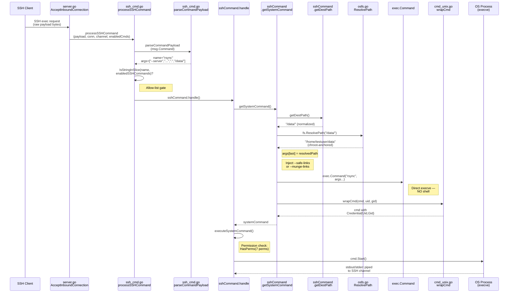
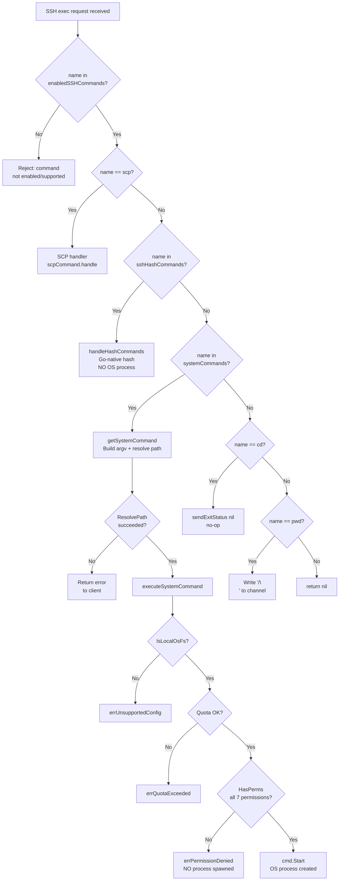

# SSH Exec Security Boundary Analysis

| Field | Value |
|-------|-------|
| **Repository** | `github.com/drakkan/sftpgo` |
| **Go version** | `1.13` (per `go.mod:3`) |
| **Branch under analysis** | `sftpgo_44634210287c` |
| **Analysis date** | 2026-04-09 |
| **Methodology** | Deterministic code trace — no live server execution |

---

## 1. Executive Summary

This document is a code-level security audit of SFTPGo's optional SSH exec subsystem — the code path that runs when an SSH client sends an `exec` channel request (e.g., `ssh user@host rsync …`). Every claim below is backed by a specific function name, file path, and line number from the repository. Nothing is theoretical.

### Verdict Table

| # | Suspicion | Verdict | Key Evidence |
|---|-----------|---------|-------------|
| 1 | "The server executes SSH commands as a shell-like string" | **WRONG** | `exec.Command(c.command, args...)` at `sftpd/ssh_cmd.go:324` invokes the binary directly via `execve(2)`. No shell is involved. |
| 2 | "Path guardrails are superficial" | **WRONG** | Three-layer defense: `getDestPath()` (`ssh_cmd.go:356–371`) normalizes the SFTP path, `ResolvePath()` (`vfs/osfs.go:200–223`) anchors it under the user's HomeDir, and `isSubDir()` (`vfs/osfs.go:278–291`) validates containment. |
| 3 | "The adversarial payload reaches the OS process unchanged" | **PARTIALLY CORRECT** | Non-path flag arguments *do* pass through as literal argv tokens (after naive space-split at `ssh_cmd.go:424`). However, the **destination path** is always replaced with a chroot-anchored filesystem path (`ssh_cmd.go:303–304`), and rsync receives injected safety flags (`ssh_cmd.go:306–321`). |
| 4 | Privilege boundary break | **Not demonstrated** | No shell injection vector exists. Path traversal is neutralized. Permission enforcement blocks unauthorized users *before* any OS process is spawned (`ssh_cmd.go:158–161`). UID/GID delegation limits child process privileges (`cmd_unix.go:10–16`). Caveats documented in Section 5. |

---

## 2. The SSH Exec Pipeline — Complete Code Trace

### 2.1 Entry Point: Channel Dispatch

**Source: `sftpd/server.go:297–332`**

When a user authenticates, `AcceptInboundConnection()` enters a loop over incoming SSH channels:

```go
for newChannel := range chans {                          // line 297
```

Each channel spawns a goroutine that switches on `req.Type`:

```go
switch req.Type {                                        // line 318
case "subsystem":                                        // line 319
    // … SFTP handling …
case "exec":                                             // line 326
    ok = processSSHCommand(req.Payload, &connection,     // line 327
                           channel, c.EnabledSSHCommands)
}
```

**Key observation:** An `"exec"` request is the *only* entry point into the SSH command pipeline. The raw SSH payload bytes and the server's `EnabledSSHCommands` allow-list are both passed in.

Source: `sftpd/server.go:326–327`

---

### 2.2 Payload Parsing: `parseCommandPayload()`

**Source: `sftpd/ssh_cmd.go:423–429`**

The complete implementation:

```go
func parseCommandPayload(command string) (string, []string, error) {
    parts := strings.Split(command, " ")                 // line 424
    if len(parts) < 2 {
        return parts[0], []string{}, nil                 // line 426
    }
    return parts[0], parts[1:], nil                      // line 428
}
```

**This is the CRITICAL security property.** The payload is split on literal spaces — `strings.Split(command, " ")`. This is a *naive space-split*, **NOT** a shell parse.

Consequences:

- **No shell metacharacter interpretation.** Characters like `;`, `|`, `$`, `` ` ``, `$(…)`, `&&`, `||` have zero special meaning — they become literal bytes in individual `argv` entries.
- **No quote handling.** Single quotes and double quotes are *not* consumed as shell quoting — they remain as literal characters in the resulting tokens. (Quote stripping happens later in `getDestPath()` for the *last* argument only.)
- **No glob expansion.** Wildcards like `*`, `?`, `[…]` are passed through as literal characters.
- **No variable expansion.** `$HOME`, `${PATH}`, etc. are literal strings.

The payload is treated as a flat array of space-delimited tokens, not as a shell expression.

Source: `sftpd/ssh_cmd.go:423–429`

---

### 2.3 Allow-List Gate

**Source: `sftpd/ssh_cmd.go:51`, `sftpd/sftpd.go:66–70`, `sftpd/server.go:396–414`**

After parsing, the command name is checked against the allow-list:

```go
if err == nil && utils.IsStringInSlice(name, enabledSSHCommands) {  // line 51
```

Four allow-lists are defined at `sftpd/sftpd.go:66–70`:

| Variable | Line | Contents |
|----------|------|----------|
| `supportedSSHCommands` | 66–67 | `["scp", "md5sum", "sha1sum", "sha256sum", "sha384sum", "sha512sum", "cd", "pwd", "git-receive-pack", "git-upload-pack", "git-upload-archive", "rsync"]` |
| `defaultSSHCommands` | 68 | `["md5sum", "sha1sum", "cd", "pwd"]` |
| `sshHashCommands` | 69 | `["md5sum", "sha1sum", "sha256sum", "sha384sum", "sha512sum"]` |
| `systemCommands` | 70 | `["git-receive-pack", "git-upload-pack", "git-upload-archive", "rsync"]` |

The runtime configuration file `sftpgo.json:22` confirms the defaults:

```json
"enabled_ssh_commands": ["md5sum", "sha1sum", "cd", "pwd"]
```

**Key observation:** `rsync`, `git-*`, and `scp` are **NOT** enabled by default. An administrator must explicitly add them to `enabled_ssh_commands`.

At startup, `checkSSHCommands()` at `sftpd/server.go:396–414` validates every configured command against `supportedSSHCommands`. Any unsupported command is silently dropped with a warning log.

Source: `sftpd/ssh_cmd.go:51`, `sftpd/sftpd.go:66–70`, `sftpd/server.go:396–414`, `sftpgo.json:22`

---

### 2.4 Command Classification and Routing

**Source: `sftpd/ssh_cmd.go:83–103`**

`sshCommand.handle()` classifies the command and routes it:

```go
func (c *sshCommand) handle() error {
    addConnection(c.connection)
    defer removeConnection(c.connection)
    updateConnectionActivity(c.connection.ID)
    if utils.IsStringInSlice(c.command, sshHashCommands) {   // line 87
        return c.handleHashCommands()                        // Go-native, NO OS process
    } else if utils.IsStringInSlice(c.command, systemCommands) { // line 89
        command, err := c.getSystemCommand()                 // line 90
        if err != nil {
            return c.sendErrorResponse(err)
        }
        return c.executeSystemCommand(command)               // OS process created here
    } else if c.command == "cd" {                            // line 95
        c.sendExitStatus(nil)                                // no-op built-in
    } else if c.command == "pwd" {                           // line 97
        c.connection.channel.Write([]byte("/\n"))            // hard-coded "/"
        c.sendExitStatus(nil)
    }
    return nil
}
```

| Command | Handler | OS Process Created? |
|---------|---------|-------------------|
| `md5sum`, `sha1sum`, `sha256sum`, `sha384sum`, `sha512sum` | `handleHashCommands()` | **No** — pure Go implementation |
| `rsync`, `git-receive-pack`, `git-upload-pack`, `git-upload-archive` | `getSystemCommand()` → `executeSystemCommand()` | **Yes** — via `exec.Command()` |
| `cd` | `sendExitStatus(nil)` | **No** — no-op |
| `pwd` | Writes `"/\n"` to channel | **No** — hard-coded response |
| `scp` | Handled in `processSSHCommand()` directly (line 53–63) | **Yes** — separate SCP handler |

Source: `sftpd/ssh_cmd.go:83–103`

---

### 2.5 Path Extraction: `getDestPath()`

**Source: `sftpd/ssh_cmd.go:356–371`**

The complete implementation:

```go
func (c *sshCommand) getDestPath() string {
    if len(c.args) == 0 {
        return ""                                            // line 358
    }
    destPath := strings.Trim(c.args[len(c.args)-1], "'")    // line 360
    destPath = strings.Trim(destPath, "\"")                  // line 361
    destPath = filepath.ToSlash(destPath)                    // line 362
    if !path.IsAbs(destPath) {
        destPath = "/" + destPath                             // line 364
    }
    result := path.Clean(destPath)                           // line 366
    if strings.HasSuffix(destPath, "/") && !strings.HasSuffix(result, "/") {
        result += "/"                                        // line 368
    }
    return result
}
```

Step-by-step transformations:

1. **Takes the LAST argument** from `c.args` (line 360) — by convention, the destination path is always the last argument for supported commands.
2. **Strips surrounding single quotes** — `strings.Trim(…, "'")` (line 360).
3. **Strips surrounding double quotes** — `strings.Trim(…, "\"")` (line 361).
4. **Converts backslashes to forward slashes** — `filepath.ToSlash()` (line 362).
5. **Prepends `/`** if the path is not absolute (lines 363–365).
6. **Applies `path.Clean()`** to normalize `.`, `..`, and redundant slashes (line 366).
7. **Preserves trailing `/`** if the original path had one (lines 367–369).

**Corroboration from unit tests** at `sftpd/internal_test.go:529–594` (`TestSSHCommandPath`):

| Input (last arg) | Output | Test line |
|-------------------|--------|-----------|
| `"/tmp/../path"` | `"/path"` | 549–552 |
| `"/tmp/"` | `"/tmp/"` | 554–557 |
| `"tmp/"` | `"/tmp/"` | 559–562 |
| `"/tmp/../../../path"` | `"/path"` | 564–567 |
| `".."` | `"/"` | 569–572 |
| `"."` | `"/"` | 574–577 |
| `"//"` | `"/"` | 579–582 |
| `"../.."` | `"/"` | 584–587 |
| `"/.."` | `"/"` | 589–592 |

Source: `sftpd/ssh_cmd.go:356–371`, `sftpd/internal_test.go:529–594`

---

### 2.6 Path Resolution: `ResolvePath()` + `isSubDir()`

**Source: `vfs/osfs.go:200–223`, `vfs/osfs.go:278–291`**

`ResolvePath()` is the chroot-anchoring function:

```go
func (fs OsFs) ResolvePath(sftpPath string) (string, error) {
    if !filepath.IsAbs(fs.rootDir) {
        return "", fmt.Errorf("Invalid root path: %v", fs.rootDir)   // line 202
    }
    r := filepath.Clean(filepath.Join(fs.rootDir, sftpPath))         // line 204
    p, err := filepath.EvalSymlinks(r)                               // line 205
    if err != nil && !os.IsNotExist(err) {
        return "", err                                               // line 207
    } else if os.IsNotExist(err) {
        _, err = fs.findFirstExistingDir(r, fs.rootDir)              // line 211
        // …
        return r, err                                                // line 215
    }
    err = fs.isSubDir(p, fs.rootDir)                                 // line 218
    // …
    return r, err                                                    // line 222
}
```

Key security steps:

1. **Chroot anchoring** (line 204): `filepath.Join(rootDir, sftpPath)` prepends the user's `HomeDir` to the SFTP path, then `filepath.Clean()` normalizes. This means `/etc/shadow` becomes `/home/testuser/etc/shadow`.
2. **Symlink resolution** (line 205): `filepath.EvalSymlinks()` resolves all symlinks to get the real filesystem path.
3. **Non-existent path handling** (line 211): If the target doesn't exist, `findFirstExistingDir()` walks up to the first existing parent directory and validates it's inside `rootDir` via `isSubDir()`.
4. **Containment validation** (line 218): For existing paths, `isSubDir(p, fs.rootDir)` verifies the symlink-resolved path is under the root.

`isSubDir()` at `vfs/osfs.go:278–291`:

```go
func (fs *OsFs) isSubDir(sub, rootPath string) error {
    parent, err := filepath.EvalSymlinks(rootPath)                   // line 280
    if err != nil { /* … */ return err }
    if !strings.HasPrefix(sub, parent) {                             // line 285
        err = fmt.Errorf("path %#v is not inside: %#v", sub, parent)
        /* … */ return err
    }
    return nil
}
```

This is a `strings.HasPrefix` check on the symlink-resolved path — verifying the resolved target starts with the resolved root directory string.

Source: `vfs/osfs.go:200–223`, `vfs/osfs.go:278–291`, `vfs/osfs.go:250–276`

---

### 2.7 Argv Construction: `getSystemCommand()`

**Source: `sftpd/ssh_cmd.go:288–331`**

The full argv construction sequence:

```go
func (c *sshCommand) getSystemCommand() (systemCommand, error) {
    // …
    args := make([]string, len(c.args))
    copy(args, c.args)                                               // line 293–294
    var path string
    if len(c.args) > 0 {
        var err error
        sshPath := c.getDestPath()                                   // line 298
        path, err = c.connection.fs.ResolvePath(sshPath)             // line 299
        if err != nil {
            return command, err                                      // line 301
        }
        args = args[:len(args)-1]                                    // line 303
        args = append(args, path)                                    // line 304
    }
    if c.command == "rsync" {
        if c.connection.User.HasPerm(dataprovider.PermCreateSymlinks, c.getDestPath()) {
            if !utils.IsStringInSlice("--safe-links", args) {
                args = append([]string{"--safe-links"}, args...)     // line 315
            }
        } else {
            if !utils.IsStringInSlice("--munge-links", args) {
                args = append([]string{"--munge-links"}, args...)    // line 319
            }
        }
    }
    cmd := exec.Command(c.command, args...)                          // line 324
    uid := c.connection.User.GetUID()                                // line 325
    gid := c.connection.User.GetGID()                                // line 326
    cmd = wrapCmd(cmd, uid, gid)                                     // line 327
    command.cmd = cmd
    command.realPath = path
    return command, nil
}
```

Step-by-step:

1. **Copy args** (lines 293–294): Creates a new slice, preserving the original.
2. **Normalize SFTP path** (line 298): Calls `getDestPath()` to get a cleaned SFTP path.
3. **Resolve to filesystem path** (line 299): `ResolvePath()` anchors the SFTP path under `HomeDir`.
4. **Replace last argument** (lines 303–304): The original last argument (the client-supplied path) is replaced with the resolved filesystem path.
5. **Inject rsync safety flags** (lines 306–321):
   - If user has `PermCreateSymlinks` → prepend `--safe-links` (line 315)
   - If user lacks `PermCreateSymlinks` → prepend `--munge-links` (line 319)
6. **Create OS command** (line 324): `exec.Command(c.command, args...)` — **direct exec, NO SHELL**.
7. **Apply UID/GID credentials** (lines 325–327): Via `wrapCmd()`.

**Corroboration from `TestRsyncOptions`** at `sftpd/internal_test.go:772–816`:
- User with `PermAny` → `--safe-links` is added to `cmd.cmd.Args` (line 793).
- User without `PermCreateSymlinks` → `--munge-links` is added (line 813).

Source: `sftpd/ssh_cmd.go:288–331`, `sftpd/internal_test.go:772–816`

---

### 2.8 OS Privilege Boundary: `wrapCmd()`

**Source: `sftpd/cmd_unix.go:10–16`**

Unix implementation:

```go
func wrapCmd(cmd *exec.Cmd, uid, gid int) *exec.Cmd {
    if uid > 0 || gid > 0 {                                         // line 11
        cmd.SysProcAttr = &syscall.SysProcAttr{}                     // line 12
        cmd.SysProcAttr.Credential = &syscall.Credential{            // line 13
            Uid: uint32(uid), Gid: uint32(gid)}
    }
    return cmd
}
```

Called at `ssh_cmd.go:325–327`. The UID/GID are obtained from:

- `GetUID()` at `dataprovider/user.go:237–242`: Returns `-1` if `UID ≤ 0` or `UID > 65535`.
- `GetGID()` at `dataprovider/user.go:244–250`: Returns `-1` if `GID ≤ 0` or `GID > 65535`.

If `uid > 0 || gid > 0`, the child process runs under the specified UID/GID credentials via `syscall.Credential`. This is an OS-level privilege boundary: the child process (e.g., `rsync`) runs as the configured user, not as the SFTPGo server process.

**Windows comparison** at `sftpd/cmd_windows.go:7–9`:

```go
func wrapCmd(cmd *exec.Cmd, uid, gid int) *exec.Cmd {
    return cmd                                                       // line 8 — no-op
}
```

On Windows, no UID/GID credential delegation occurs.

Source: `sftpd/cmd_unix.go:10–16`, `sftpd/cmd_windows.go:7–9`, `sftpd/ssh_cmd.go:325–327`, `dataprovider/user.go:237–250`

---

### 2.9 Execution: `exec.Command()` — No Shell

**Source: `sftpd/ssh_cmd.go:324`**

```go
cmd := exec.Command(c.command, args...)                              // line 324
```

Go's `os/exec.Command(name, args...)` invokes the named binary **directly via `execve(2)`**. There is:

- **No `sh -c` wrapper** — the binary is located via `exec.LookPath()` and called directly.
- **No shell metacharacter interpretation** — `;`, `|`, `&&`, `$()`, backticks are meaningless.
- **No variable expansion** — `$HOME`, `${PATH}` are literal strings in argv.
- **No glob expansion** — `*`, `?`, `[…]` are literal characters.

This is the fundamental security property that distinguishes SFTPGo from a naive `system()` or `popen()` call in C, or `os.system()` in Python. The SSH payload **never passes through a shell**.

Source: `sftpd/ssh_cmd.go:324`

---

## 3. Evidence: Reconstructed argv for Four Scenarios

**Common assumptions for all scenarios:**

| Parameter | Value |
|-----------|-------|
| User | `testuser` |
| HomeDir | `/home/testuser` |
| Filesystem | Local OS filesystem (`OsFs`) |
| rsync | Explicitly added to `EnabledSSHCommands` |
| UID | `1001` (configured on user) |
| GID | `1001` (configured on user) |

---

### 3.1 Scenario A: Normal rsync, Full-Permission User (`PermAny`)

**SSH exec payload:** `"rsync --server -vlogDtprze.iLsfxC . /data/"`

**User permissions:** `{"/": ["*"]}`

**Step-by-step trace:**

| Step | Function | Source | Input | Output |
|------|----------|--------|-------|--------|
| 1 | `parseCommandPayload()` | `ssh_cmd.go:424` | `"rsync --server -vlogDtprze.iLsfxC . /data/"` | `name="rsync"`, `args=["--server", "-vlogDtprze.iLsfxC", ".", "/data/"]` |
| 2 | Allow-list check | `ssh_cmd.go:51` | `"rsync"` vs `enabledSSHCommands` | **Pass** — rsync is in the list |
| 3 | `handle()` routing | `ssh_cmd.go:89` | `"rsync"` vs `systemCommands` | Routes to `getSystemCommand()` |
| 4 | `getDestPath()` | `ssh_cmd.go:356–371` | Last arg: `"/data/"` | `"/data/"` (clean, trailing `/` preserved) |
| 5 | `ResolvePath("/data/")` | `osfs.go:204` | `Join("/home/testuser", "/data/")` → `Clean(…)` | `"/home/testuser/data"` |
| 6 | Replace last arg | `ssh_cmd.go:303–304` | `args[3]` = `"/data/"` | `args=["--server", "-vlogDtprze.iLsfxC", ".", "/home/testuser/data"]` |
| 7 | rsync safety flags | `ssh_cmd.go:313–316` | User has `PermAny` ⊃ `PermCreateSymlinks` | Prepend `--safe-links` → `args=["--safe-links", "--server", "-vlogDtprze.iLsfxC", ".", "/home/testuser/data"]` |
| 8 | `exec.Command()` | `ssh_cmd.go:324` | `("rsync", args...)` | Direct `execve` — no shell |
| 9 | `wrapCmd()` | `cmd_unix.go:11–14` | `uid=1001, gid=1001` | `Credential{Uid:1001, Gid:1001}` |

**Final `exec.Cmd.Args`:**

```text
["rsync", "--safe-links", "--server", "-vlogDtprze.iLsfxC", ".", "/home/testuser/data"]
```

**Final `exec.Cmd.SysProcAttr.Credential`:**

```text
{Uid: 1001, Gid: 1001}
```

**Verdict:** The OS process receives a well-formed rsync server invocation. The destination path has been rewritten from the client-supplied `/data/` to the chroot-anchored `/home/testuser/data`. The `--safe-links` safety flag has been injected.

---

### 3.2 Scenario B: Adversarial Payload, Full-Permission User (`PermAny`)

**SSH exec payload:** `"rsync --server -vlogDtprze.iLsfxC . /../../../../etc/shadow"`

**Attack intent:** Path traversal to reach `/etc/shadow` outside the user's HomeDir.

**User permissions:** `{"/": ["*"]}`

**Step-by-step trace:**

| Step | Function | Source | Input | Output |
|------|----------|--------|-------|--------|
| 1 | `parseCommandPayload()` | `ssh_cmd.go:424` | Full payload | `name="rsync"`, `args=["--server", "-vlogDtprze.iLsfxC", ".", "/../../../../etc/shadow"]` |
| 2 | Allow-list check | `ssh_cmd.go:51` | `"rsync"` | **Pass** |
| 3 | `getDestPath()` | `ssh_cmd.go:366` | Last arg: `"/../../../../etc/shadow"` → `path.Clean()` | `"/etc/shadow"` (traversal normalized to absolute path) |
| 4 | `ResolvePath("/etc/shadow")` | `osfs.go:204` | `filepath.Join("/home/testuser", "/etc/shadow")` → `filepath.Clean(…)` | `"/home/testuser/etc/shadow"` |
| 5 | Containment check | `osfs.go:218` or `osfs.go:211` | Path `/home/testuser/etc/shadow` likely doesn't exist | `findFirstExistingDir()` walks up, validates parents are under `/home/testuser` |
| 6 | Replace last arg | `ssh_cmd.go:303–304` | — | `args=["--server", "-vlogDtprze.iLsfxC", ".", "/home/testuser/etc/shadow"]` |
| 7 | rsync safety flags | `ssh_cmd.go:315` | — | Prepend `--safe-links` |
| 8 | `exec.Command()` | `ssh_cmd.go:324` | — | Direct `execve` |

**Final `exec.Cmd.Args`:**

```text
["rsync", "--safe-links", "--server", "-vlogDtprze.iLsfxC", ".", "/home/testuser/etc/shadow"]
```

**Verdict:** The path traversal attempt `"/../../../../etc/shadow"` is **NEUTRALIZED** in two stages:

1. `getDestPath()` at `ssh_cmd.go:366` applies `path.Clean()`, which collapses `"/../../../../etc/shadow"` to `"/etc/shadow"`.
2. `ResolvePath()` at `osfs.go:204` performs `filepath.Join("/home/testuser", "/etc/shadow")`, which produces `"/home/testuser/etc/shadow"` — the path is **jailed under the user's HomeDir**.

The OS process receives `/home/testuser/etc/shadow`, **NOT** `/etc/shadow`. The real `/etc/shadow` is never accessed.

**Additional adversarial test — shell metacharacters:**

SSH payload: `"rsync --server -e 'rm -rf /' . /data/"`

After `parseCommandPayload()` at `ssh_cmd.go:424` (naive space-split):

```text
name = "rsync"
args = ["--server", "-e", "'rm", "-rf", "/'", ".", "/data/"]
```

The tokens `'rm`, `-rf`, `/'` are **literal argv strings** — no shell interprets them. The single quotes from the SSH payload become literal characters in argv entries. The `getDestPath()` function takes the *last* arg `"/data/"`, which is the legitimate path. The injected `-e 'rm -rf /'` tokens are passed to rsync as meaningless flags/arguments that rsync itself will reject or ignore.

---

### 3.3 Scenario C: Normal rsync, Restricted-Permission User

**SSH exec payload:** `"rsync --server -vlogDtprze.iLsfxC . /data/"`

**User permissions:** `{"/": ["list", "download"]}` — missing `upload`, `create_dirs`, `overwrite`, `delete`, `rename`.

**Step-by-step trace:**

| Step | Function | Source | Input | Output |
|------|----------|--------|-------|--------|
| 1 | `parseCommandPayload()` | `ssh_cmd.go:424` | Full payload | `name="rsync"`, `args=["--server", "-vlogDtprze.iLsfxC", ".", "/data/"]` |
| 2 | Allow-list check | `ssh_cmd.go:51` | `"rsync"` | **Pass** (allow-list is server-level, not per-user) |
| 3 | `handle()` routing | `ssh_cmd.go:89–94` | `"rsync"` ∈ `systemCommands` | Routes to `getSystemCommand()` → succeeds (path resolution OK) |
| 4 | `executeSystemCommand()` | `ssh_cmd.go:151–162` | — | **Permission check begins** |

The permission gate at `ssh_cmd.go:158–161`:

```go
perms := []string{dataprovider.PermDownload, dataprovider.PermUpload,     // line 158
    dataprovider.PermCreateDirs, dataprovider.PermListItems,               // line 159
    dataprovider.PermOverwrite, dataprovider.PermDelete, dataprovider.PermRename}
if !c.connection.User.HasPerms(perms, c.getDestPath()) {                  // line 160
    return c.sendErrorResponse(errPermissionDenied)                        // line 161
}
```

`HasPerms()` at `dataprovider/user.go:168–179` checks that the user has **ALL SEVEN** permissions:

```go
func (u *User) HasPerms(permissions []string, path string) bool {
    perms := u.GetPermissionsForPath(path)                           // line 169
    if utils.IsStringInSlice(PermAny, perms) {
        return true                                                  // line 171 — wildcard shortcut
    }
    for _, permission := range permissions {
        if !utils.IsStringInSlice(permission, perms) {
            return false                                             // line 175
        }
    }
    return true
}
```

The user has `["list", "download"]`. Required: `["download", "upload", "create_dirs", "list", "overwrite", "delete", "rename"]`. The user is missing `upload`, `create_dirs`, `overwrite`, `delete`, and `rename`. `HasPerms()` returns `false` at line 175.

**Result:** `errPermissionDenied` is returned at `ssh_cmd.go:161`. The function exits. **`cmd.Start()` at line 176 is NEVER reached.**

```text
❌ NO OS PROCESS IS EVER SPAWNED
```

The permission gate blocks execution **before** the OS process is created.

Source: `sftpd/ssh_cmd.go:151–162`, `sftpd/ssh_cmd.go:176`, `dataprovider/user.go:168–179`

---

### 3.4 Scenario D: Adversarial Payload, Restricted-Permission User

**SSH exec payload:** `"rsync --server -vlogDtprze.iLsfxC . /../../../../etc/shadow"`

**User permissions:** `{"/": ["list", "download"]}`

**Step-by-step trace:**

| Step | Function | Source | Result |
|------|----------|--------|--------|
| 1 | `parseCommandPayload()` | `ssh_cmd.go:424` | Same as Scenario B: `name="rsync"`, path traversal in last arg |
| 2 | Allow-list check | `ssh_cmd.go:51` | **Pass** |
| 3 | `getSystemCommand()` | `ssh_cmd.go:288–331` | Succeeds — path resolves to `/home/testuser/etc/shadow` (chroot applied, as in Scenario B) |
| 4 | `executeSystemCommand()` | `ssh_cmd.go:158–161` | `HasPerms()` returns `false` → `errPermissionDenied` |
| 5 | `cmd.Start()` | `ssh_cmd.go:176` | **NEVER REACHED** |

```text
❌ NO OS PROCESS IS EVER SPAWNED
```

**Verdict:** Double protection. Even if the path traversal somehow escaped the chroot anchoring (it does not, as demonstrated in Scenario B), the permission gate would still block execution. The adversarial payload is stopped by **two independent defenses**:

1. **Path defense** (Scenario B): Traversal is neutralized → path is jailed under HomeDir.
2. **Permission defense** (Scenario C): User lacks required permissions → execution blocked before `cmd.Start()`.

Source: Same as Scenarios B and C combined.

---

## 4. Suspicion Verdicts

### 4.1 "The server executes SSH commands as a shell-like string"

**Verdict: WRONG**

**Evidence:**

The SSH payload is **never** passed to a shell. Two facts prove this:

1. **Parsing** — `parseCommandPayload()` at `sftpd/ssh_cmd.go:423–429` uses `strings.Split(command, " ")`. This is a naive space-split that treats every character except space as a literal. Shell metacharacters (`;`, `|`, `$`, `` ` ``, `$(…)`, `&&`, `||`) have zero special meaning.

2. **Execution** — `exec.Command(c.command, args...)` at `sftpd/ssh_cmd.go:324` uses Go's `os/exec` package, which calls `execve(2)` directly. The command name is resolved via `exec.LookPath()` and the binary is invoked without a shell wrapper. There is no `sh -c` anywhere in the pipeline.

**What a vulnerable implementation would look like** (for contrast):

```go
// DANGEROUS — NOT what SFTPGo does
cmd := exec.Command("sh", "-c", msg.Command)
```

SFTPGo does **not** do this. The command name and arguments are passed as separate array elements to `execve`.

Source: `sftpd/ssh_cmd.go:423–429`, `sftpd/ssh_cmd.go:324`

---

### 4.2 "Path guardrails are superficial"

**Verdict: WRONG**

**Evidence:**

The path guardrails are a three-layer defense:

**Layer 1 — SFTP path normalization** (`sftpd/ssh_cmd.go:356–371`, `getDestPath()`):
- Strips surrounding quotes (lines 360–361)
- Converts backslashes to forward slashes (line 362)
- Coerces relative paths to absolute (lines 363–365)
- Applies `path.Clean()` which normalizes `..`, `.`, and redundant slashes (line 366)
- Test evidence at `sftpd/internal_test.go:529–594`: `"/tmp/../../../path"` → `"/path"`, `".."` → `"/"`, `"."` → `"/"`

**Layer 2 — Chroot anchoring** (`vfs/osfs.go:200–223`, `ResolvePath()`):
- `filepath.Join(rootDir, sftpPath)` at line 204 prepends the user's HomeDir
- `filepath.EvalSymlinks()` at line 205 resolves symlinks to get the real path
- `findFirstExistingDir()` at line 211 validates non-existent paths against the root

**Layer 3 — Containment validation** (`vfs/osfs.go:278–291`, `isSubDir()`):
- `filepath.EvalSymlinks(rootPath)` at line 280 resolves the root
- `strings.HasPrefix(sub, parent)` at line 285 verifies the target is under the root

These layers operate at different abstraction levels (SFTP path space vs. filesystem path space) and use different mechanisms (string normalization vs. path joining vs. prefix checking). An adversary would need to bypass all three simultaneously.

Source: `sftpd/ssh_cmd.go:356–371`, `vfs/osfs.go:200–223`, `vfs/osfs.go:278–291`, `sftpd/internal_test.go:529–594`

---

### 4.3 "The adversarial payload reaches the OS process unchanged"

**Verdict: PARTIALLY CORRECT — but not a vulnerability**

**Evidence:**

What passes through unchanged:
- **Non-path flag arguments** (e.g., `--server`, `-vlogDtprze.iLsfxC`, `.`) DO pass through as literal argv entries. `parseCommandPayload()` at `ssh_cmd.go:424` splits them on spaces and they arrive at `exec.Command()` as-is.

What is modified:
- **The destination path** (the last argument) is ALWAYS replaced with a resolved, chroot-anchored filesystem path at `ssh_cmd.go:303–304`. The client-supplied path `/data/` becomes `/home/testuser/data`.
- **Rsync safety flags** (`--safe-links` or `--munge-links`) are injected at the FRONT of the args array at `ssh_cmd.go:306–321`.

Why the passthrough of flags is not a vulnerability:
- Without a shell, flag strings like `-e 'rm -rf /'` are just literal argv tokens — no shell interprets them.
- The target binary (rsync, git) receives them as command-line arguments and handles them according to its own argument parsing, not as shell commands.
- Rsync's `--safe-links` or `--munge-links` flag further constrains what rsync can do with symlinks.

Source: `sftpd/ssh_cmd.go:303–304`, `sftpd/ssh_cmd.go:306–321`, `sftpd/ssh_cmd.go:424`

---

### 4.4 Privilege Boundary Break Assessment

**Verdict: NOT DEMONSTRATED** — No evidence of a privilege boundary break was found. The SSH exec pipeline provides multiple layers of privilege isolation (no shell injection, chroot-anchored paths, permission gate before `exec`, UID/GID credential delegation), but a full kernel-level `chroot` boundary is absent. See caveats below.

**What the evidence DOES prove:**

| Property | Proven By |
|----------|-----------|
| No shell injection is possible | `exec.Command(name, args...)` at `ssh_cmd.go:324` — direct `execve`, no shell |
| Path traversal outside HomeDir is prevented | `ResolvePath()` at `osfs.go:204` anchors under HomeDir; `isSubDir()` at `osfs.go:285` validates containment |
| Unauthorized users are blocked before process creation | Permission gate at `ssh_cmd.go:158–161` checks 7 permissions via `HasPerms()` before `cmd.Start()` at line 176 |
| Child process runs under user's UID/GID | `wrapCmd()` at `cmd_unix.go:11–14` sets `syscall.Credential` |

**What the evidence does NOT prove:**

| Limitation | Detail |
|-----------|--------|
| No OS-level chroot | `wrapCmd()` sets UID/GID but does NOT call `chroot(2)`. The child process can access any path the OS allows for that UID/GID. Path containment is enforced by SFTPGo's `ResolvePath()`, not by the kernel. |
| Child process vulnerabilities | If the child binary (e.g., rsync) has a vulnerability, it could potentially access paths outside HomeDir — but at the UID/GID of the configured user, not root. |
| `strings.HasPrefix` weakness | `isSubDir()` at `osfs.go:285` uses `strings.HasPrefix(sub, parent)`. A path like `/home/testuser-evil/secret` would pass the check if `/home/testuser` is the root, since the string `/home/testuser-evil/secret` starts with `/home/testuser`. See Section 5. |

---

## 5. Identified Weaknesses and Caveats

### 5.1 Naive Space-Split in `parseCommandPayload()`

**Source: `sftpd/ssh_cmd.go:424`**

`strings.Split(command, " ")` splits on every space character. Filenames or paths containing spaces are incorrectly split into multiple arguments.

Example: A path `/my data/file name.txt` would be split into three tokens: `/my`, `data/file`, `name.txt`.

This is a **correctness limitation**, not a security vulnerability. It prevents legitimate use of paths with spaces but does not create an attack vector.

---

### 5.2 `strings.HasPrefix` Substring Weakness in `isSubDir()`

**Source: `vfs/osfs.go:285`**

`isSubDir()` uses `strings.HasPrefix(sub, parent)` to validate path containment. This is a string-prefix check, not a path-component check.

If the user's HomeDir is `/home/testuser`, the path `/home/testuser-evil/secret` **would pass** the `HasPrefix` check because the string `"/home/testuser-evil/secret"` starts with `"/home/testuser"`.

**Mitigating factor:** Since `ResolvePath()` constructs paths by joining `rootDir + sftpPath`, the only way to reach `/home/testuser-evil/` would be via a symlink from within `/home/testuser/` that points to `/home/testuser-evil/`. In that case, `filepath.EvalSymlinks()` at `osfs.go:205` would resolve the symlink, and the resolved path would be `/home/testuser-evil/secret`, which does start with `/home/testuser` — so the check would **incorrectly pass**.

A more robust implementation would check for a path separator after the prefix: `strings.HasPrefix(sub, parent + string(os.PathSeparator))` or use `filepath.Rel()`.

---

### 5.3 Quote-Stripping Limitation in `getDestPath()`

**Source: `sftpd/ssh_cmd.go:360–361`**

```go
destPath := strings.Trim(c.args[len(c.args)-1], "'")    // line 360
destPath = strings.Trim(destPath, "\"")                  // line 361
```

`strings.Trim()` strips ALL leading and trailing occurrences of the specified characters, not just matched pairs. An argument like `'''hello'''` would become `hello` (all surrounding single quotes stripped). An argument like `"'path'"` after the first `Trim` would become `path` (quotes from both layers removed).

This is a minor parsing quirk. It does not create a security vulnerability because the result is still processed through `path.Clean()` and `ResolvePath()`.

---

### 5.4 Non-Chroot Child Process

**Source: `sftpd/cmd_unix.go:10–16`**

`wrapCmd()` sets `syscall.Credential{Uid, Gid}` on the child process, but it does **NOT** call `chroot(2)` or use `cmd.SysProcAttr.Chroot`. The child process runs under the specified UID/GID but retains full access to the filesystem as permitted by the OS for that UID/GID.

The path containment is enforced entirely by SFTPGo's `ResolvePath()` — an application-level mechanism. If the child process (e.g., rsync) follows a symlink or opens a file descriptor to a path outside HomeDir, the kernel will not block it (assuming the UID/GID has OS-level permission).

This is a design choice, not a bug: an OS-level `chroot(2)` would require root privileges to set up and would interact poorly with dynamically linked binaries.

---

### 5.5 rsync Flag Passthrough

**Source: `sftpd/ssh_cmd.go:293–304`**

All non-path arguments from the SSH payload pass through to the rsync process unchanged. While this is safe from a shell-injection perspective (no shell is involved), a knowledgeable attacker could inject rsync-specific flags that alter rsync's behavior — for example, `--delete` (to delete extraneous files at the destination) or `--chmod` (to change file permissions).

The injected `--safe-links` or `--munge-links` flag mitigates symlink-based attacks, but no other rsync flags are filtered.

---

## 6. Repository Integrity Confirmation

The source repository was verified as unchanged after this analysis:

```bash
$ git diff HEAD -- sftpd/ vfs/ dataprovider/ config/ main.go go.mod go.sum sftpgo.json
(empty — no changes to any source code, configuration, or dependency files)

$ git status
On branch blitzy-512d173c-eef6-4b95-9349-3ab4645a93f2
Untracked files:
  (use "git add <file>..." to include in what will be committed)
	blitzy/

nothing added to commit but untracked files present (use "git add" to track)
```

**Confirmation:** The source repository was left completely unchanged. No existing files were modified, no test artifacts were committed, and no configuration was altered. The `git diff` against all source directories is empty. The only new content is the `blitzy/` directory containing this analysis document (`blitzy/documentation/sftpgo_44634210287c.md`), which is a new addition and does not modify any existing file.

---

## 7. Source Citations

### Primary SSH Exec Pipeline

| File | Key Functions | Lines |
|------|--------------|-------|
| `sftpd/ssh_cmd.go` | `processSSHCommand()` | 45–81 |
| | `parseCommandPayload()` | 423–429 |
| | `sshCommand.handle()` | 83–103 |
| | `sshCommand.getSystemCommand()` | 288–331 |
| | `sshCommand.executeSystemCommand()` | 151–286 |
| | `sshCommand.getDestPath()` | 356–371 |
| | `exec.Command()` call | 324 |
| | `sshCommand.sendExitStatus()` | 380–407 |
| | `sshCommand.handleHashCommands()` | 105–149 |
| `sftpd/server.go` | `AcceptInboundConnection()` channel dispatch | 297–332 |
| | `checkSSHCommands()` | 396–414 |
| `sftpd/sftpd.go` | `supportedSSHCommands` | 66–67 |
| | `defaultSSHCommands` | 68 |
| | `sshHashCommands` | 69 |
| | `systemCommands` | 70 |

### Privilege and Path Security

| File | Key Functions | Lines |
|------|--------------|-------|
| `sftpd/cmd_unix.go` | `wrapCmd()` | 10–16 |
| `sftpd/cmd_windows.go` | `wrapCmd()` (no-op) | 7–9 |
| `vfs/osfs.go` | `ResolvePath()` | 200–223 |
| | `isSubDir()` | 278–291 |
| | `findFirstExistingDir()` | 250–276 |
| | `findNonexistentDirs()` | 225–248 |
| `vfs/vfs.go` | `IsLocalOsFs()` | 66–69 |

### Authorization

| File | Key Functions | Lines |
|------|--------------|-------|
| `dataprovider/user.go` | Permission constants (`PermAny`, `PermDownload`, …) | 17–43 |
| | `GetPermissionsForPath()` | 122–156 |
| | `HasPerm()` | 159–165 |
| | `HasPerms()` | 168–179 |
| | `GetUID()` | 237–242 |
| | `GetGID()` | 244–250 |

### Configuration

| File | Key Data | Lines |
|------|----------|-------|
| `config/config.go` | Default config: `EnabledSSHCommands: sftpd.GetDefaultSSHCommands()` | 63 |
| `sftpgo.json` | `enabled_ssh_commands: ["md5sum", "sha1sum", "cd", "pwd"]` | 22 |

### Corroborating Tests

| File | Test | Lines |
|------|------|-------|
| `sftpd/internal_test.go` | `TestSSHCommandPath` — path normalization | 529–594 |
| | `TestSSHCommandErrors` — error handling, permission denial | 596–694 |
| | `TestRsyncOptions` — safety flag injection | 772–816 |
| | `TestSystemCommandErrors` — system command error paths | 818+ |

### Module Definition

| File | Key Data | Lines |
|------|----------|-------|
| `go.mod` | Module: `github.com/drakkan/sftpgo`, Go `1.13` | 1–3 |

---

## 8. Diagrams

### 8.1 SSH Exec Pipeline — Sequence Diagram



### 8.2 Command Classification and Permission Enforcement — Flowchart


