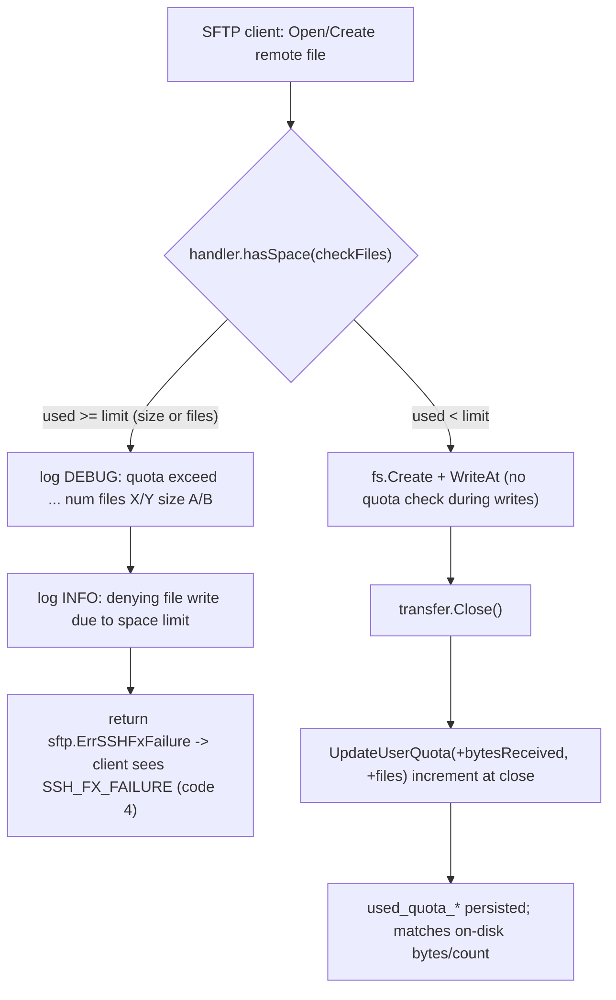

# SFTPgo Per-User Disk-Quota Enforcement on SFTP Uploads — Investigation (build 0.9.5-dev)

> **Source branch:** `sftpgo_44634210287c` · **Git HEAD:** `44634210287cb192...` ("S3: add support for serving virtual folders") · **Built version:** `SFTPGo version: 0.9.5-dev`
>
> This document is an **empirical, runtime-grounded** investigation of how SFTPgo enforces per-user disk quotas on **SFTP uploads**. Every factual claim is backed by either (a) a verbatim output block with the command that produced it, or (b) a `file:line` code citation naming the specific function/struct. The findings are **authoritative for the built `0.9.5-dev` binary**; public SFTPgo documentation reflects later 2.x releases and is used only for corroboration of design intent.

---

## TL;DR — Direct Answers

Leading with the plain-reading answer to each sub-question; nuance follows in the per-requirement sections.

- **R2 — What happens when the limit is reached? It depends on the dimension, and the two behave differently:**
  - **File-count limit = HARD ceiling.** Exactly `quota_files` files are stored; the **next** upload **fails before it starts**. No partial file, no overshoot.
  - **Size limit = SOFT.** The upload that **crosses** the limit **completes** and usage **overshoots** the configured size (observed `1200` bytes reported for a `1024`-byte limit); only the **subsequent** upload is rejected.
- **R3 — Exact client error:** a Go `*sftp.StatusError` rendering as `sftp: "Failure" (SSH_FX_FAILURE)` — **SFTP protocol status code 4**.
- **R4 — Exact server logs:** rejection emits **two `zerolog` JSON lines from `sender=sftpd`, in order** — a `debug` line naming both quota dimensions (`quota exceed for user ... num files: X/Y, size: A/B check files: true`), then an `info` line `denying file write due to space limit`.
- **R5 — Reported vs. disk:** they **match exactly** at every clean step (`400/1`, `800/2`, `1200/3` for size; `100/1`, `200/2`, `300/3` for count). The notable finding is **not** a mismatch — it is that **both** the reported value and the on-disk total can **exceed** the configured `quota_size` (`1200 > 1024`) because the size check runs only **before** the crossing upload.
- **R6 — When does the check happen?** **Before** the data transfer starts — it is a strictly **pre-transfer** check. It is **not** during and **not** after. A rejected upload returns at the failed `Create()` in ~0.3–0.5 ms with **no bytes written**; a successful upload additionally performs `WROTE` and `CLOSE`.

**Headline nuance to keep in mind:** the two quota dimensions behave differently because the sole enforcement point (`hasSpace`) compares **already-used** quota against the limit and **does not add the incoming file's size** — so a single upload can overshoot `QuotaSize`. The check is strictly pre-transfer; accounting happens at `Close()`; and reported usage faithfully matches disk (the surprise is the overshoot, not a mismatch).

---

## Methodology & Environment

### Governing methodology rules (restated verbatim)

- **Empirical-first:** conclusions come from observed runtime output, not code-reading alone.
- **Real SFTP entry point:** uploads were driven by an actual `github.com/pkg/sftp v1.11.0` client speaking SSH/SFTP to the running `sftpd` handler. The REST API (`httpd`) was used **only** out-of-band to create the user (`POST /api/v1/user`) and read back reported usage (`GET /api/v1/user`) — never as a substitute for the upload path. `quota_scan` was **not** used as an enforcement mechanism.
- **Canonical/default build & config:** default `sftpgo.json` (`track_quota: 2`, `upload_mode: 0`, SFTP `bind_port: 2022`, REST `127.0.0.1:8080`, `enable_scp: false`), SQLite provider, Go 1.13 toolchain.
- **Every implied condition exercised:** both quota dimensions (count AND size), happy path AND rejection path, and before/during/after states of `used_quota_*` and on-disk files.
- **Actual output for every claim**, paired with the producing command.
- **Exact & grounded:** actual values with `file:line` references naming the function/struct; label anything inferred vs observed.
- **Stability confirmed across ≥2 runs** for magnitude/timing values.
- **Read-only scope:** no existing repo file modified; temporary harness/scripts removed; repo left unchanged.
- **Findings are authoritative for build `0.9.5-dev`**; public SFTPgo docs reflect later 2.x releases and are used only for corroboration of design intent.

### Why this build has no `common/` package

This is an early build (`0.9.5-dev`). The SFTP upload logic and the quota-limit check live in `sftpd/` (`sftpd/handler.go`), and the quota accounting/persistence lives in `dataprovider/` (`dataprovider/dataprovider.go`, `dataprovider/sqlcommon.go`). There is no `common/` package abstraction that later releases introduced.

### Build & run provenance

**Build command** (CGO is required because the default SQLite provider depends on `github.com/mattn/go-sqlite3 v2.0.2+incompatible`, needing gcc; the toolchain is Go 1.13, per `go 1.13` in `go.mod` and `go "1.13.x"` in `.travis.yml`):

```
CGO_ENABLED=1 GO111MODULE=on GOPATH=/tmp/gopath go build -o /tmp/sftpgo_bin .
```

- Result: exit `0` (~36 s), toolchain `go1.13.15 linux/amd64`. Only a harmless upstream `go-sqlite3` C warning was emitted; the build succeeded and `go.mod`/`go.sum` were left byte-for-byte unchanged (verified by md5 before/after; `git status` clean).

**Version banner** — the constant is `const version = "0.9.5-dev"` at `utils/version.go:3`. A plain `go build` with no `-ldflags` leaves commit/date empty, so `utils/version.go`'s `GetVersionAsString` renders exactly `0.9.5-dev`:

```
$ /tmp/sftpgo_bin --version
SFTPGo version: 0.9.5-dev
```

- REST corroboration — `GET /api/v1/version` (producing command shown) →

```
$ curl -s http://127.0.0.1:8080/api/v1/version
{"version":"0.9.5-dev","build_date":"","commit_hash":""}
```

- The `--version` template `SFTPGo version: ` is set at `cmd/root.go:63` (`rootCmd.SetVersionTemplate(...)`); the startup banner is emitted at `service/service.go:60-61`.

**Run command** — the server was launched with a temporary config dir and a temporary SQLite DB, default config otherwise:

```
/tmp/sftpgo_bin serve -c /tmp/sftpgo_inv -l /tmp/sftpgo_inv/sftpgo.log -v
```

Startup log lines (verbatim JSON from the server log; producing command shown):

```
$ head -12 /tmp/sftpgo_inv/sftpgo.log
{"level":"info","time":"2026-07-08T05:35:46.557","sender":"service","connection_id":"","message":"starting SFTPGo 0.9.5-dev, config dir: /tmp/sftpgo_inv, config file: sftpgo, log max size: 10 log max backups: 5 log max age: 28 log verbose: true, log compress: false"}
{"level":"info","time":"2026-07-08T05:35:48.181","sender":"sftpd","connection_id":"","message":"server listener registered address: [::]:2022"}
```

- **Listener address is `[::]:2022`, not `127.0.0.1:2022`** (reported exactly as observed): the default `sftpgo.json` sets `bind_port: 2022` with an **empty** `bind_address`, so `sftpd` binds the IPv6 wildcard `[::]:2022`, which also accepts IPv4 loopback — this is why the SFTP client connects successfully to `127.0.0.1:2022`. The startup config-loaded line (same log) corroborates every default relevant here (`BindPort:2022`, `UploadMode:0`, `IsSCPEnabled:false`, `TrackQuota:2`, `Driver:sqlite Name:/tmp/sftpgo_inv/sftpgo.db`, `HTTPDConfig:{BindPort:8080 BindAddress:127.0.0.1 ...}`), with the DB password shown as `Password:[redacted]`:

```
{"level":"debug","time":"2026-07-08T05:35:46.558","sender":"config","connection_id":"","message":"config file used: '/tmp/sftpgo_inv/sftpgo.json', config loaded: {SFTPD:{Banner:SFTPGo_0.9.5-dev BindPort:2022 BindAddress: IdleTimeout:15 MaxAuthTries:0 Umask:0022 UploadMode:0 Actions:{ExecuteOn:[] Command: HTTPNotificationURL:} Keys:[] IsSCPEnabled:false KexAlgorithms:[] Ciphers:[] MACs:[] LoginBannerFile: SetstatMode:0 EnabledSSHCommands:[md5sum sha1sum cd pwd]} ProviderConf:{Driver:sqlite Name:/tmp/sftpgo_inv/sftpgo.db Host: Port:5432 Username: Password:[redacted] SSLMode:0 ConnectionString: UsersTable:users ManageUsers:1 TrackQuota:2 PoolSize:0 UsersBaseDir: Actions:{ExecuteOn:[] Command: HTTPNotificationURL:} ExternalAuthProgram: ExternalAuthScope:0} HTTPDConfig:{BindPort:8080 BindAddress:127.0.0.1 TemplatesPath:/tmp/blitzy/sftpgo/blitzy-709c7bf8-6b4d-4a56-a452-53a4c5d5ff5a_676bc0/templates StaticFilesPath:/tmp/blitzy/sftpgo/blitzy-709c7bf8-6b4d-4a56-a452-53a4c5d5ff5a_676bc0/static BackupsPath:/tmp/sftpgo_inv/backups}}"}
```

- The SQLite handle is opened as `file:/tmp/sftpgo_inv/sftpgo.db?cache=shared` (DSN format `fmt.Sprintf("file:%v?cache=shared", dbPath)` at `dataprovider/sqlite.go:37`); `dbHandle.SetMaxOpenConns(1)` at `dataprovider/sqlite.go:44` serializes access to the single connection.

**Environment notes (real constraints observed):**

1. The default `sftpgo.json` has **relative** `templates_path: "templates"` / `static_files_path: "static"`; for a run from an arbitrary temp cwd these were set to **absolute** paths so the server starts. This is a config-only change **in the temp dir** — no repository file was changed.
2. Broad process-selector commands (e.g. `pkill -f`) are blocked by a safety guard in this environment; the server was managed via `pgrep -f`/numeric `kill`.
3. The temporary SQLite `sftpgo.db` was created & initialized (non-empty) **before** server start using the canonical 21-column `users`-table DDL from `.travis.yml:14` (columns include `quota_size`, `quota_files`, `used_quota_size`, `used_quota_files`, `last_quota_update`); `dataprovider/sqlite.go` rejects an empty/zero-size DB file. The DDL:

```
CREATE TABLE "users" ("id" integer NOT NULL PRIMARY KEY AUTOINCREMENT, "username" varchar(255) NOT NULL UNIQUE, "password" varchar(255) NULL, "public_keys" text NULL, "home_dir" varchar(255) NOT NULL, "uid" integer NOT NULL, "gid" integer NOT NULL, "max_sessions" integer NOT NULL, "quota_size" bigint NOT NULL, "quota_files" integer NOT NULL, "permissions" text NOT NULL, "used_quota_size" bigint NOT NULL, "used_quota_files" integer NOT NULL, "last_quota_update" bigint NOT NULL, "upload_bandwidth" integer NOT NULL, "download_bandwidth" integer NOT NULL, "expiration_date" bigint NOT NULL, "last_login" bigint NOT NULL, "status" integer NOT NULL, "filters" TEXT NULL, "filesystem" text NULL);
```

4. The temporary SFTP **client** is a small out-of-repository Go module (under `/tmp/sftpclient`) built from the **same** `github.com/pkg/sftp v1.11.0` + `golang.org/x/crypto v0.0.0-20200109152110-61a87790db17` the server ships, guaranteeing protocol fidelity. It lives entirely under `/tmp` and was deleted during cleanup. Its module definition and build command (the binary `/tmp/sftpclient/sftpput` drives every upload in R2/R5/R6):

```
$ cd /tmp/sftpclient
$ cat go.mod
module sftpclient

go 1.13

require (
	github.com/pkg/sftp v1.11.0
	golang.org/x/crypto v0.0.0-20200109152110-61a87790db17
)
$ GO111MODULE=on GOPATH=/tmp/gopath GOSUMDB=off go build -o /tmp/sftpclient/sftpput .
```

The client takes flags `-user -pass -addr -home -dim -limit` plus `name:size` file specs; it connects over SSH (password auth), performs a timed SFTP `Create`→`Write`→`Close` per file, then reads back reported usage via `GET /api/v1/user?username=<u>` and tallies the on-disk home directory, printing `-> REST used_quota_size=… used_quota_files=… | DISK bytes=… files=…` after each upload.

### Where enforcement and accounting live (single-upload flow)



The enforcement is **pre-transfer** (evaluated once, before file creation); accounting happens at **close**. These two facts explain everything below.

---

## R1 — Reproduce the scenario

**Direct answer:** a quota-restricted test user was created via the REST API with quota fields set, and **each quota dimension was isolated into its own user** so the two behaviors are unambiguous. A `quota_size` or `quota_files` value of `0` means unlimited (`README.md:505-506`), so setting one dimension to `0` disables it. The relevant `User` struct fields are `QuotaSize int64` (JSON key `quota_size`) at `dataprovider/user.go:89` and `QuotaFiles int` (JSON key `quota_files`) at `dataprovider/user.go:91`; used quota is tracked in `UsedQuotaSize` (JSON key `used_quota_size`) at `dataprovider/user.go:95` and `UsedQuotaFiles` (JSON key `used_quota_files`) at `dataprovider/user.go:97`.

**Users created** (all via `POST /api/v1/user`, HTTP 200; password argon2id-hashed; permissions `{"/":["*"]}`):

| User | `quota_size` | `quota_files` | Isolated dimension | Upload sequence |
|------|-------------:|--------------:|--------------------|-----------------|
| `usersize`  | `1024` | `0` | **size only** | 400-byte files `f1`,`f2` (→ `800/1024`, "getting close"), then `f3` (crosses), then `f4` |
| `usercount` | `0`    | `3` | **count only** | 100-byte files `c1`,`c2`,`c3` (fill the count), then `c4` (crosses) |
| `usersize2` | `1024` | `0` | **size only (2nd run)** | determinism repeat of the size scenario |

Each user was created with an explicit `POST /api/v1/user`; the producing command and the verbatim response (HTTP 200; note the response contains **no** password field — the submitted password is hashed and never echoed) are shown below.

`usersize` (size-only, `quota_size:1024`, `quota_files:0`):

```
$ curl -s -w '\nHTTP_STATUS:%{http_code}\n' -X POST http://127.0.0.1:8080/api/v1/user \
    -H 'Content-Type: application/json' \
    -d '{"username":"usersize","password":"testpass123","home_dir":"/tmp/sftpgo_inv/homes/usersize","uid":0,"gid":0,"max_sessions":0,"quota_size":1024,"quota_files":0,"permissions":{"/":["*"]},"upload_bandwidth":0,"download_bandwidth":0,"status":1}'
{"id":1,"status":1,"username":"usersize","expiration_date":0,"home_dir":"/tmp/sftpgo_inv/homes/usersize","uid":0,"gid":0,"max_sessions":0,"quota_size":1024,"quota_files":0,"permissions":{"/":["*"]},"used_quota_size":0,"used_quota_files":0,"last_quota_update":0,"upload_bandwidth":0,"download_bandwidth":0,"last_login":0,"filters":{"allowed_ip":[],"denied_ip":[]},"filesystem":{"provider":0,"s3config":{}}}

HTTP_STATUS:200
```

`usercount` (count-only, `quota_size:0`, `quota_files:3`):

```
$ curl -s -w '\nHTTP_STATUS:%{http_code}\n' -X POST http://127.0.0.1:8080/api/v1/user \
    -H 'Content-Type: application/json' \
    -d '{"username":"usercount","password":"testpass123","home_dir":"/tmp/sftpgo_inv/homes/usercount","uid":0,"gid":0,"max_sessions":0,"quota_size":0,"quota_files":3,"permissions":{"/":["*"]},"upload_bandwidth":0,"download_bandwidth":0,"status":1}'
{"id":2,"status":1,"username":"usercount","expiration_date":0,"home_dir":"/tmp/sftpgo_inv/homes/usercount","uid":0,"gid":0,"max_sessions":0,"quota_size":0,"quota_files":3,"permissions":{"/":["*"]},"used_quota_size":0,"used_quota_files":0,"last_quota_update":0,"upload_bandwidth":0,"download_bandwidth":0,"last_login":0,"filters":{"allowed_ip":[],"denied_ip":[]},"filesystem":{"provider":0,"s3config":{}}}

HTTP_STATUS:200
```

`usersize2` (size-only 2nd-run, `quota_size:1024`, `quota_files:0`):

```
$ curl -s -w '\nHTTP_STATUS:%{http_code}\n' -X POST http://127.0.0.1:8080/api/v1/user \
    -H 'Content-Type: application/json' \
    -d '{"username":"usersize2","password":"testpass123","home_dir":"/tmp/sftpgo_inv/homes/usersize2","uid":0,"gid":0,"max_sessions":0,"quota_size":1024,"quota_files":0,"permissions":{"/":["*"]},"upload_bandwidth":0,"download_bandwidth":0,"status":1}'
{"id":3,"status":1,"username":"usersize2","expiration_date":0,"home_dir":"/tmp/sftpgo_inv/homes/usersize2","uid":0,"gid":0,"max_sessions":0,"quota_size":1024,"quota_files":0,"permissions":{"/":["*"]},"used_quota_size":0,"used_quota_files":0,"last_quota_update":0,"upload_bandwidth":0,"download_bandwidth":0,"last_login":0,"filters":{"allowed_ip":[],"denied_ip":[]},"filesystem":{"provider":0,"s3config":{}}}

HTTP_STATUS:200
```

**Why quota tracking is effective for these users.** The default configuration is `track_quota: 2`, documented as "quota is updated each time a user upload or delete a file but only for users with quota restrictions" (`README.md:171-174`). The mode-2 gate in code is `else if config.TrackQuota == 2 && !reset && !user.HasQuotaRestrictions()` at `dataprovider/dataprovider.go:315`, which returns early (skips the update) for users **without** restrictions. `HasQuotaRestrictions()` is `return u.QuotaFiles > 0 || u.QuotaSize > 0` at `dataprovider/user.go:258-259`. Because every test user has at least one non-zero quota dimension, the gate is **not** taken and tracking is **active**.

The `used_quota_*` values (REST) and the on-disk state were captured **before, during, and after** each upload; those captures are embedded in R2 and R5 below.

---

## R2 — Enforcement outcome (the two dimensions behave differently)

**Direct answer (stated plainly, first):**

- **File-count limit = HARD ceiling.** Exactly `quota_files` files are stored; the **next** upload fails **before it starts**.
- **Size limit = SOFT.** The upload that **crosses** the limit **completes** and usage **overshoots** the configured size; only the **subsequent** upload is rejected.

### SIZE scenario — verbatim (RUN 1, user `usersize`, `quota_size=1024`, 400-byte files)

REST-reported usage equals the on-disk tally at every step. Note `f3` **completes** and drives usage to `1200` (over the `1024` limit); the **next** upload `f4` is the one that fails.

```
$ /tmp/sftpclient/sftpput -user usersize -pass testpass123 -addr 127.0.0.1:2022 -home /tmp/sftpgo_inv/homes/usersize -dim SIZE -limit 1024 f1.dat:400 f2.dat:400 f3.dat:400 f4.dat:400
=== BEFORE ANY UPLOAD (usersize) ===
   -> REST used_quota_size=0 used_quota_files=0 | DISK bytes=0 files=0

=== UPLOAD f1.dat (400 bytes) [SIZE limit=1024] ===
CREATE_OK in 416.779µs
WROTE bytes=400 in 294.779µs
CLOSE_OK in 3.011198ms
   -> REST used_quota_size=400 used_quota_files=1 | DISK bytes=400 files=1

=== UPLOAD f2.dat (400 bytes) [SIZE limit=1024] ===
CREATE_OK in 550.877µs
WROTE bytes=400 in 323.484µs
CLOSE_OK in 3.580453ms
   -> REST used_quota_size=800 used_quota_files=2 | DISK bytes=800 files=2

=== UPLOAD f3.dat (400 bytes) [SIZE limit=1024] ===
CREATE_OK in 404.765µs
WROTE bytes=400 in 284.322µs
CLOSE_OK in 4.596952ms
   -> REST used_quota_size=1200 used_quota_files=3 | DISK bytes=1200 files=3

=== UPLOAD f4.dat (400 bytes) [SIZE limit=1024] ===
CREATE_ERR after 376.441µs :: errType=*sftp.StatusError :: errStr="sftp: \"Failure\" (SSH_FX_FAILURE)"
   -> REST used_quota_size=1200 used_quota_files=3 | DISK bytes=1200 files=3
```

In the block above: `f3` (third 400-byte upload) **completes** and drives reported/disk usage to `1200` — **over** the `1024` limit — and only the **next** upload `f4` fails with `CREATE_ERR`; its `used_quota_size`/on-disk total stay at `1200/3` (f4 never reaches disk).

**Reading:** usage climbs `400 → 800 → 1200`. `f3` crosses `1024` but is allowed to complete because at the moment `f3`'s `Create` is checked, used size is still `800` (`< 1024`). Only `f4` — checked when used size is already `1200` (`>= 1024`) — is rejected. This is why the size limit is **soft**.

### COUNT scenario — verbatim (RUN 1, user `usercount`, `quota_files=3`, 100-byte files)

REST-reported usage equals the on-disk tally at every step. Exactly `3` files are stored; `c4` is rejected before it starts.

```
$ /tmp/sftpclient/sftpput -user usercount -pass testpass123 -addr 127.0.0.1:2022 -home /tmp/sftpgo_inv/homes/usercount -dim FILES -limit 3 c1.dat:100 c2.dat:100 c3.dat:100 c4.dat:100
=== BEFORE ANY UPLOAD (usercount) ===
   -> REST used_quota_size=0 used_quota_files=0 | DISK bytes=0 files=0

=== UPLOAD c1.dat (100 bytes) [FILES limit=3] ===
CREATE_OK in 386.071µs
WROTE bytes=100 in 148.482µs
CLOSE_OK in 3.605736ms
   -> REST used_quota_size=100 used_quota_files=1 | DISK bytes=100 files=1

=== UPLOAD c2.dat (100 bytes) [FILES limit=3] ===
CREATE_OK in 522.019µs
WROTE bytes=100 in 163.77µs
CLOSE_OK in 4.601776ms
   -> REST used_quota_size=200 used_quota_files=2 | DISK bytes=200 files=2

=== UPLOAD c3.dat (100 bytes) [FILES limit=3] ===
CREATE_OK in 515.596µs
WROTE bytes=100 in 242.075µs
CLOSE_OK in 6.535338ms
   -> REST used_quota_size=300 used_quota_files=3 | DISK bytes=300 files=3

=== UPLOAD c4.dat (100 bytes) [FILES limit=3] ===
CREATE_ERR after 377.069µs :: errType=*sftp.StatusError :: errStr="sftp: \"Failure\" (SSH_FX_FAILURE)"
   -> REST used_quota_size=300 used_quota_files=3 | DISK bytes=300 files=3
```

In the block above: after `c3`, `used_quota_files` is exactly `3`; `c4` fails with `CREATE_ERR` and the on-disk count stays at exactly `3` files — `c4.dat` is never created.

**Reading:** after `c3`, used files is `3`; `c4` is checked when used files is already `3` (`>= 3`) and is rejected. Because the count is incremented one file at a time and the check triggers exactly at equality, the count is a **hard** ceiling — you can never store more than `quota_files` files.

### Root cause (grounded in code)

The **sole enforcement point** for SFTP puts is the pre-transfer check `func (c Connection) hasSpace(checkFiles bool) bool` at `sftpd/handler.go:515`. Its entry guard is `if (checkFiles && c.User.QuotaFiles > 0) || c.User.QuotaSize > 0` at `sftpd/handler.go:516`, and its **denial condition** at `sftpd/handler.go:526-527` is:

```
if (checkFiles && c.User.QuotaFiles > 0 && numFile >= c.User.QuotaFiles) ||
	(c.User.QuotaSize > 0 && size >= c.User.QuotaSize) {
```

The decisive detail: `numFile` and `size` are the **already-used** quota read via `dataprovider.GetUsedQuota(...)` at `sftpd/handler.go:517`. The condition **does not add the incoming file's size** into the comparison. Therefore:

- For **size**, a single upload whose bytes would cross `QuotaSize` still passes the check as long as *current* used size is `< QuotaSize` — so it completes and overshoots. The limit is enforced only on the *next* attempt. **→ soft.**
- For **count**, each successful upload increments used files by exactly `1`, and the check uses `>=`, so the boundary is hit precisely at `quota_files` and the next attempt is denied. There is no way to overshoot by a whole file. **→ hard.**

The two call sites: `handleSFTPUploadToNewFile` calls `hasSpace(true)` at `sftpd/handler.go:413` (new file — counts against the file quota), and `handleSFTPUploadToExistingFile` calls `hasSpace(false)` at `sftpd/handler.go:453` (overwrite — the file quota is not re-checked). On denial both log the info line and `return nil, sftp.ErrSSHFxFailure` (at `sftpd/handler.go:415` and `sftpd/handler.go:455` respectively).

---

## R3 — Exact client error

**Direct answer:** the failing SFTP `Create`/open returns a Go `*sftp.StatusError` that renders as `sftp: "Failure" (SSH_FX_FAILURE)` — **SFTP protocol status code 4**.

Verbatim client capture (same as shown in R2, for both dimensions):

```
errType=*sftp.StatusError :: errStr="sftp: \"Failure\" (SSH_FX_FAILURE)"
```

**Origin in server code:** `return nil, sftp.ErrSSHFxFailure` at `sftpd/handler.go:415` (new-file path); the existing-file path returns the same at `sftpd/handler.go:455`. `sftp.ErrSSHFxFailure` is the generic SSH_FX_FAILURE sentinel from the SFTP library — the server does **not** send a distinct "quota exceeded" protocol status; the client only sees the generic failure code.

**Client-side rendering** (corroborated in the shipped client library `github.com/pkg/sftp@v1.11.0`, which is the same version the server ships per `go.mod`): the status constant `sshFxFailure = 4` (`sftp.go:46`), the `SSH_FX_FAILURE` display name (`sftp.go:173`), and `StatusError.Error()` = `fmt.Sprintf("sftp: %q (%v)", s.msg, fx(s.Code))` (`sftp.go:226`) together produce the exact rendered string above.

> Note (inferred, not a repo file): `github.com/pkg/sftp` is an **external dependency**, not a repository file; the `sftp.go:NN` anchors above are citations into the shipped client library `v1.11.0`, deliberately kept distinct from this repository's own `file:line` references. The dependency version `github.com/pkg/sftp v1.11.0` is confirmed in `go.mod`.

---

## R4 — Exact server logs

**Direct answer:** rejection emits **two `zerolog` JSON lines from `sender=sftpd`, in this order** — a `debug` line naming both quota dimensions, then an `info` line.

The two rejection lines were extracted from the server log with the producing `grep` commands below. Each grep returns exactly **one line per rejected upload** — `usersize` (`f4`), `usercount` (`c4`), and `usersize2` (`f4`, the determinism repeat) — so the debug and info lines for all three rejections appear together:

```
$ grep 'quota exceed' /tmp/sftpgo_inv/sftpgo.log
{"level":"debug","time":"2026-07-08T05:39:52.836","sender":"sftpd","connection_id":"f17317db45c30758a50a95bd93cc81889a2a699c2d3da6491dd00967a2c83ed8","message":"quota exceed for user \"usersize\", num files: 3/0, size: 1200/1024 check files: true"}
{"level":"debug","time":"2026-07-08T05:40:02.021","sender":"sftpd","connection_id":"10c171e36aeedeb04f5a73544b15f1474753ec0dd4c9fafcfa6e66f3262f384c","message":"quota exceed for user \"usercount\", num files: 3/3, size: 300/0 check files: true"}
{"level":"debug","time":"2026-07-08T05:40:09.771","sender":"sftpd","connection_id":"fa1591fd0296039a3162dbaec9ab39ad137b8cde0059bd0c4eeab00ea0b9de3a","message":"quota exceed for user \"usersize2\", num files: 3/0, size: 1200/1024 check files: true"}
```

```
$ grep 'denying file write due to space limit' /tmp/sftpgo_inv/sftpgo.log
{"level":"info","time":"2026-07-08T05:39:52.836","sender":"sftpd","connection_id":"f17317db45c30758a50a95bd93cc81889a2a699c2d3da6491dd00967a2c83ed8","message":"denying file write due to space limit"}
{"level":"info","time":"2026-07-08T05:40:02.021","sender":"sftpd","connection_id":"10c171e36aeedeb04f5a73544b15f1474753ec0dd4c9fafcfa6e66f3262f384c","message":"denying file write due to space limit"}
{"level":"info","time":"2026-07-08T05:40:09.771","sender":"sftpd","connection_id":"fa1591fd0296039a3162dbaec9ab39ad137b8cde0059bd0c4eeab00ea0b9de3a","message":"denying file write due to space limit"}
```

For a **single** rejection — the `usersize` `f4` attempt on `connection_id` `f17317db…` — the debug and info lines carry the **same timestamp** (`2026-07-08T05:39:52.836`) and the **same `connection_id`**, confirming they are emitted back-to-back from one `hasSpace()` evaluation, in order (debug first, then info):

```
{"level":"debug","time":"2026-07-08T05:39:52.836","sender":"sftpd","connection_id":"f17317db45c30758a50a95bd93cc81889a2a699c2d3da6491dd00967a2c83ed8","message":"quota exceed for user \"usersize\", num files: 3/0, size: 1200/1024 check files: true"}
{"level":"info","time":"2026-07-08T05:39:52.836","sender":"sftpd","connection_id":"f17317db45c30758a50a95bd93cc81889a2a699c2d3da6491dd00967a2c83ed8","message":"denying file write due to space limit"}
```

**Field meanings, grounded in code:**

- The **debug** line is emitted inside `hasSpace` at `sftpd/handler.go:528-529`; its format string is exactly `"quota exceed for user %#v, num files: %v/%v, size: %v/%v check files: %v"` with args `(c.User.Username, numFile, c.User.QuotaFiles, size, c.User.QuotaSize, checkFiles)`. Therefore:
  - `num files: X/Y` = **used/limit** files (e.g. `3/0` for the size user means 3 files used, file-limit 0 = unlimited; `3/3` for the count user means the count boundary is hit).
  - `size: A/B` = **used/limit** bytes (e.g. `1200/1024` for the size user shows the overshoot that triggers rejection of the *next* upload; `300/0` for the count user means size-limit 0 = unlimited).
  - `check files:` reflects the `checkFiles` argument (`true` for a new file).
  - `%#v` renders the username Go-quoted, e.g. `"usersize"`.
- The **info** line `denying file write due to space limit` is emitted by the caller in `handleSFTPUploadToNewFile` at `sftpd/handler.go:414` (and at `sftpd/handler.go:454` for the existing-file path).
- Every log line carries `level`, `time`, `sender`, `connection_id`, and `message`; connection/login events additionally carry fields such as the client address, `username`, and login type (SFTPgo uses `github.com/rs/zerolog v1.17.2` structured JSON logging).

**Full event sequence for the rejected `usersize` connection** (all lines sharing `connection_id` `f17317db…`, producing command shown). This is the single most informative capture: it shows the login line (with `username`, `home_dir`, remote address), the three successful `sender:"Upload"` events for `f1`/`f2`/`f3` (each `size_bytes:400`, `protocol:"SFTP"`), then the two rejection lines for `f4` — and, crucially, **no `Upload` event for `f4`** (no bytes were transferred for the rejected upload):

```
$ grep 'f17317db45c30758a50a95bd93cc81889a2a699c2d3da6491dd00967a2c83ed8' /tmp/sftpgo_inv/sftpgo.log
{"level":"info","time":"2026-07-08T05:39:52.322","sender":"sftpd","connection_id":"f17317db45c30758a50a95bd93cc81889a2a699c2d3da6491dd00967a2c83ed8","message":"User id: 1, logged in with: \"password\", username: \"usersize\", home_dir: \"/tmp/sftpgo_inv/homes/usersize\" remote addr: \"127.0.0.1:34844\""}
{"level":"debug","time":"2026-07-08T05:39:52.369","sender":"sftpd","connection_id":"f17317db45c30758a50a95bd93cc81889a2a699c2d3da6491dd00967a2c83ed8","message":"connection added, num open connections: 1"}
{"level":"info","time":"2026-07-08T05:39:52.371","sender":"Upload","elapsed_ms":0,"size_bytes":400,"username":"usersize","file_path":"/tmp/sftpgo_inv/homes/usersize/f1.dat","connection_id":"f17317db45c30758a50a95bd93cc81889a2a699c2d3da6491dd00967a2c83ed8","protocol":"SFTP"}
{"level":"info","time":"2026-07-08T05:39:52.526","sender":"Upload","elapsed_ms":0,"size_bytes":400,"username":"usersize","file_path":"/tmp/sftpgo_inv/homes/usersize/f2.dat","connection_id":"f17317db45c30758a50a95bd93cc81889a2a699c2d3da6491dd00967a2c83ed8","protocol":"SFTP"}
{"level":"info","time":"2026-07-08T05:39:52.681","sender":"Upload","elapsed_ms":0,"size_bytes":400,"username":"usersize","file_path":"/tmp/sftpgo_inv/homes/usersize/f3.dat","connection_id":"f17317db45c30758a50a95bd93cc81889a2a699c2d3da6491dd00967a2c83ed8","protocol":"SFTP"}
{"level":"debug","time":"2026-07-08T05:39:52.836","sender":"sftpd","connection_id":"f17317db45c30758a50a95bd93cc81889a2a699c2d3da6491dd00967a2c83ed8","message":"quota exceed for user \"usersize\", num files: 3/0, size: 1200/1024 check files: true"}
{"level":"info","time":"2026-07-08T05:39:52.836","sender":"sftpd","connection_id":"f17317db45c30758a50a95bd93cc81889a2a699c2d3da6491dd00967a2c83ed8","message":"denying file write due to space limit"}
{"level":"debug","time":"2026-07-08T05:39:52.837","sender":"sftpd","connection_id":"f17317db45c30758a50a95bd93cc81889a2a699c2d3da6491dd00967a2c83ed8","message":"connection closed, sending exit status"}
{"level":"debug","time":"2026-07-08T05:39:52.837","sender":"sftpd","connection_id":"f17317db45c30758a50a95bd93cc81889a2a699c2d3da6491dd00967a2c83ed8","message":"sent exit status {Status:0} error: <nil>"}
{"level":"debug","time":"2026-07-08T05:39:52.837","sender":"sftpd","connection_id":"f17317db45c30758a50a95bd93cc81889a2a699c2d3da6491dd00967a2c83ed8","message":"connection removed, num open connections: 0"}
```

> **Do NOT confuse** this SFTP-put message with the SSH/SCP path's constant `errQuotaExceeded = errors.New("denying write due to space limit")` (note: **no** "file") at `sftpd/ssh_cmd.go:29`. That path is out of scope for SFTP puts, and `enable_scp` is `false` by default (`sftpgo.json`). The SFTP-put info message is the longer `denying file write due to space limit`.

---

## R5 — Reported-vs-disk reconciliation

**Direct answer:** after every clean transfer close, REST-reported `used_quota_size` / `used_quota_files` (`GET /api/v1/user`) **matched the on-disk tally exactly** — `400/1`, `800/2`, `1200/3` for the size user; `100/1`, `200/2`, `300/3` for the count user (see the verbatim blocks in R2). The notable finding is **NOT** a reported-vs-disk mismatch — it is that **both** the reported value and the on-disk total can **exceed the configured `quota_size`** (`1200 > 1024`), because the size check is enforced only **before** the crossing upload (R2/R6).

**Independent corroboration — direct SQLite `SELECT`** (bypassing REST) matched REST and disk exactly:

```
$ sqlite3 /tmp/sftpgo_inv/sftpgo.db "SELECT username, quota_size, quota_files, used_quota_size, used_quota_files FROM users ORDER BY id;"
username   quota_size  quota_files  used_quota_size  used_quota_files
---------  ----------  -----------  ---------------  ----------------
usersize   1024        0            1200             3
usercount  0           3            300              3
usersize2  1024        0            1200             3
```

**On-disk tally** (the DISK side of the `-> REST … | DISK …` lines above), captured directly from each user's home directory — note exactly the successful files exist (`f1`,`f2`,`f3` / `c1`,`c2`,`c3`), and the rejected `f4.dat` / `c4.dat` are **absent**:

```
$ ls -la /tmp/sftpgo_inv/homes/usersize
total 20
drwxr-xr-x 2 root root 4096 Jul  8 05:39 .
drwxr-xr-x 5 root root 4096 Jul  8 05:36 ..
-rw-r--r-- 1 root root  400 Jul  8 05:39 f1.dat
-rw-r--r-- 1 root root  400 Jul  8 05:39 f2.dat
-rw-r--r-- 1 root root  400 Jul  8 05:39 f3.dat
$ (bytes,files): bytes=1200 files=3

$ ls -la /tmp/sftpgo_inv/homes/usercount
total 20
drwxr-xr-x 2 root root 4096 Jul  8 05:40 .
drwxr-xr-x 5 root root 4096 Jul  8 05:36 ..
-rw-r--r-- 1 root root  100 Jul  8 05:40 c1.dat
-rw-r--r-- 1 root root  100 Jul  8 05:40 c2.dat
-rw-r--r-- 1 root root  100 Jul  8 05:40 c3.dat
$ (bytes,files): bytes=300 files=3

$ ls -la /tmp/sftpgo_inv/homes/usersize2
total 20
drwxr-xr-x 2 root root 4096 Jul  8 05:40 .
drwxr-xr-x 5 root root 4096 Jul  8 05:36 ..
-rw-r--r-- 1 root root  400 Jul  8 05:40 f1.dat
-rw-r--r-- 1 root root  400 Jul  8 05:40 f2.dat
-rw-r--r-- 1 root root  400 Jul  8 05:40 f3.dat
$ (bytes,files): bytes=1200 files=3
```

REST (`GET /api/v1/user`, embedded in R2), the raw DB (`SELECT` above), and the filesystem (`ls` above) all agree exactly — `1200/3` for the size users, `300/3` for the count user — confirming the REST layer reads the same DB row (via the read query cited below).

**Accounting mechanics, grounded in code:**

- Usage is applied at transfer **`Close()`** (not during writes): the guard `if t.transferType == transferUpload && (numFiles != 0 || t.bytesReceived > 0)` at `sftpd/transfer.go:166` then calls `dataprovider.UpdateUserQuota(dataProvider, t.user, numFiles, t.bytesReceived, false)` at `sftpd/transfer.go:167`. `numFiles` is set to `1` when the transfer is a new file (`t.isNewFile`).
- The **increment** SQL (non-reset branch) is built by `getUpdateQuotaQuery` at `dataprovider/sqlqueries.go:43`, body at `dataprovider/sqlqueries.go:48`, and reads (with `?` placeholders for SQLite): `UPDATE users SET used_quota_size = used_quota_size + ?, used_quota_files = used_quota_files + ?, last_quota_update = ? WHERE username = ?`.
- The **read** SQL is built by `getQuotaQuery` at `dataprovider/sqlqueries.go:56`, body at `dataprovider/sqlqueries.go:57`: `SELECT used_quota_size,used_quota_files FROM users WHERE username = ?`.
- Provider gating: `UpdateUserQuota` at `dataprovider/dataprovider.go:312` short-circuits in mode 2 for users without restrictions (gate at `dataprovider/dataprovider.go:315`); `GetUsedQuota` is at `dataprovider/dataprovider.go:326`. The SQL layer `sqlCommonUpdateQuota` at `dataprovider/sqlcommon.go:74` emits the debug line at `dataprovider/sqlcommon.go:84` with format `"quota updated for user %#v, files increment: %v size increment: %v is reset? %v"`; the read is `sqlCommonGetUsedQuota` at `dataprovider/sqlcommon.go:109`.

Verbatim quota-updated log (the accounting events that increment the counter at each upload's `Close()`; `sender=sqlite`, producing command shown). One line is emitted per successful upload — `usersize` increments by `400` bytes / `1` file three times, `usercount` by `100`/`1`, and `usersize2` by `400`/`1`:

```
$ grep -i 'quota updated' /tmp/sftpgo_inv/sftpgo.log | head -8
{"level":"debug","time":"2026-07-08T05:39:52.373","sender":"sqlite","connection_id":"","message":"quota updated for user \"usersize\", files increment: 1 size increment: 400 is reset? false"}
{"level":"debug","time":"2026-07-08T05:39:52.529","sender":"sqlite","connection_id":"","message":"quota updated for user \"usersize\", files increment: 1 size increment: 400 is reset? false"}
{"level":"debug","time":"2026-07-08T05:39:52.685","sender":"sqlite","connection_id":"","message":"quota updated for user \"usersize\", files increment: 1 size increment: 400 is reset? false"}
{"level":"debug","time":"2026-07-08T05:40:01.555","sender":"sqlite","connection_id":"","message":"quota updated for user \"usercount\", files increment: 1 size increment: 100 is reset? false"}
{"level":"debug","time":"2026-07-08T05:40:01.712","sender":"sqlite","connection_id":"","message":"quota updated for user \"usercount\", files increment: 1 size increment: 100 is reset? false"}
{"level":"debug","time":"2026-07-08T05:40:01.870","sender":"sqlite","connection_id":"","message":"quota updated for user \"usercount\", files increment: 1 size increment: 100 is reset? false"}
{"level":"debug","time":"2026-07-08T05:40:09.309","sender":"sqlite","connection_id":"","message":"quota updated for user \"usersize2\", files increment: 1 size increment: 400 is reset? false"}
{"level":"debug","time":"2026-07-08T05:40:09.465","sender":"sqlite","connection_id":"","message":"quota updated for user \"usersize2\", files increment: 1 size increment: 400 is reset? false"}
```

Exactly `3` increments appear for `usersize` (one per successful upload `f1`,`f2`,`f3`) — none for the rejected `f4`, because accounting only runs at a successful `Close()`.

**Documented drift remedy (documented/inferred, not the observed result here):** if files change **outside** SFTPgo, the used size/count can drift from disk; `README.md:545` prescribes rescanning the user's home dir and updating used quota via the REST API. In this investigation every file operation went through the SFTP server, so **no drift occurred** — reported equalled disk at every clean step. The `quota_scan` endpoint was therefore **not** used as an enforcement mechanism (per the methodology rules).

---

## R6 — Timing: when does the quota check happen?

**Direct answer:** the quota check happens **before** the data transfer starts — it is a strictly **pre-transfer** check. It is **not** during and **not** after.

**Evidence** (from the captured timings in R2, reported as actual observed values with sub-ms jitter):

- A **rejected** upload ends at the failed `Create()`/open — `CREATE_ERR after ~0.38–0.50 ms` — with **no** `WROTE` line and **no** file on disk (no bytes transferred).
- A **successful** upload additionally performs `WROTE` (~0.13–0.32 ms) and `CLOSE` (~3.0–6.5 ms; this is where the underlying file is closed and quota accounting happens).
- Cross-run rejected-`Create` timings: `f4` run 1 = `376.441µs`, `c4` = `377.069µs`, `f4` run 2 = `499.934µs` (see RUN 2 in Edge behavior & Determinism). Rejection is consistently sub-millisecond and never transfers data.

**Code correlation:** in `handleSFTPUploadToNewFile`, `if !c.hasSpace(true)` is evaluated at `sftpd/handler.go:413` — **before** `c.fs.Create(filePath, 0)` at `sftpd/handler.go:418`. There is **no during-transfer quota check** on the SFTP put path: `WriteAt` at `sftpd/transfer.go:91` only writes and throttles (`t.bytesReceived += int64(written)` at `sftpd/transfer.go:106`) with no quota logic. The only during-transfer `errQuotaExceeded` logic lives in `copyFromReaderToWriter` at `sftpd/transfer.go:215`, which is explicitly marked `// used for ssh commands.` at `sftpd/transfer.go:212` (it references `errQuotaExceeded` at `sftpd/transfer.go:219` and `sftpd/transfer.go:235`) and is **not** on the SFTP put path. Consistent with this, **no during-transfer quota rejection was ever observed** — every rejection occurred at `Create()`, before any byte was sent.

---

## R7 — Temporary database & cleanup

**Direct answer / actions performed:**

- A **temporary** SQLite `sftpgo.db` was used under `/tmp/sftpgo_inv/` and removed at the conclusion.
- All artifacts **this investigation created** live entirely under `/tmp` (outside the repository) and were removed: `/tmp/sftpgo_bin` (the built server binary), `/tmp/sftpclient` (the SFTP client module + `sftpput` binary), and `/tmp/sftpgo_inv` (temp config + `sftpgo.db` + log + user home dirs + generated host key), plus the capture directory. The pre-provisioned Go toolchain (`/usr/local/go`) and warmed module cache (`/tmp/gopath`) are shared environment infrastructure — not artifacts of this run — and were left as-is.
- Server processes were terminated (managed via `pgrep -f` / numeric `kill` due to the `pkill -f` safety guard); ports `2022` and `8080` were confirmed **closed** afterward.
- **Repository left pristine:** no existing source file was modified; the only tracked change is this single new document. `go.mod`/`go.sum` are byte-for-byte unchanged (md5 identical to the pre-build snapshot), and `git diff` on them is empty. Any transient `go.mod`/`go.sum` drift during harness setup would be reverted with `git checkout` and re-verified — none persisted.

**Verification — producing commands and outputs:**

Runtime torn down; both listener ports confirmed closed:

```
$ (exec 3<>/dev/tcp/127.0.0.1/2022) 2>/dev/null && echo OPEN || echo CLOSED   # SFTP
port 2022 CLOSED
$ (exec 3<>/dev/tcp/127.0.0.1/8080) 2>/dev/null && echo OPEN || echo CLOSED   # REST
port 8080 CLOSED
```

Temporary artifacts removed (`rm` emits no output on success):

```
$ rm -rf /tmp/sftpgo_bin /tmp/sftpgo_inv /tmp/sftpclient
```

Repository pristine — a **source-scoped** `git status` (which excludes this deliverable) prints nothing, `go.mod`/`go.sum` md5 match the pre-build snapshot, and `git diff` on the manifests is empty:

```
$ git status --porcelain -- sftpd/ dataprovider/ httpd/ vfs/ service/ cmd/ utils/ logger/ metrics/ config/ sql/ README.md sftpgo.json .travis.yml go.mod go.sum
$ md5sum go.mod go.sum
0924de2dd8603a4d088d6659d40861ff  go.mod
e1664d89c9c02a587ad1db7ffa2d7504  go.sum
$ git diff -- go.mod go.sum
```

The first and third commands print **nothing** — zero source files changed, zero diff in the dependency manifests. (This document itself is the sole tracked modification, which is the intended deliverable.)

---

## Edge behavior & Determinism

### Non-atomic upload mode (default `upload_mode: 0`)

With the default `upload_mode: 0`, the file is written **directly to its final path**. The atomic rename/remove cleanup block is guarded by `if t.transferType == transferUpload && t.file != nil && t.file.Name() != t.path` at `sftpd/transfer.go:134` and runs **only** in atomic mode. In default mode `t.file.Name() == t.path`, so the block is skipped — this governs how an over-limit or partial file persists at its final path. In R2, the over-limit `f3.dat` **persisted** on disk (contributing to the `1200`-byte overshoot); the rejected `f4.dat` / `c4.dat` **never existed** on disk because `Create` never ran (R6).

### Determinism (≥2 runs)

The size scenario was run twice with **byte-identical magnitudes**. RUN 2 (user `usersize2`), verbatim harness output (same producing binary as R2):

```
$ /tmp/sftpclient/sftpput -user usersize2 -pass testpass123 -addr 127.0.0.1:2022 -home /tmp/sftpgo_inv/homes/usersize2 -dim SIZE -limit 1024 f1.dat:400 f2.dat:400 f3.dat:400 f4.dat:400
=== BEFORE ANY UPLOAD (usersize2) ===
   -> REST used_quota_size=0 used_quota_files=0 | DISK bytes=0 files=0

=== UPLOAD f1.dat (400 bytes) [SIZE limit=1024] ===
CREATE_OK in 500.321µs
WROTE bytes=400 in 159.582µs
CLOSE_OK in 3.292769ms
   -> REST used_quota_size=400 used_quota_files=1 | DISK bytes=400 files=1

=== UPLOAD f2.dat (400 bytes) [SIZE limit=1024] ===
CREATE_OK in 439.592µs
WROTE bytes=400 in 146.769µs
CLOSE_OK in 3.967331ms
   -> REST used_quota_size=800 used_quota_files=2 | DISK bytes=800 files=2

=== UPLOAD f3.dat (400 bytes) [SIZE limit=1024] ===
CREATE_OK in 371.496µs
WROTE bytes=400 in 128.343µs
CLOSE_OK in 3.336173ms
   -> REST used_quota_size=1200 used_quota_files=3 | DISK bytes=1200 files=3

=== UPLOAD f4.dat (400 bytes) [SIZE limit=1024] ===
CREATE_ERR after 499.934µs :: errType=*sftp.StatusError :: errStr="sftp: \"Failure\" (SSH_FX_FAILURE)"
   -> REST used_quota_size=1200 used_quota_files=3 | DISK bytes=1200 files=3
```

RUN 2's rejection produced the same two `sender=sftpd` lines (its own `connection_id` `fa1591fd…`, timestamp `2026-07-08T05:40:09.771`):

```
{"level":"debug","time":"2026-07-08T05:40:09.771","sender":"sftpd","connection_id":"fa1591fd0296039a3162dbaec9ab39ad137b8cde0059bd0c4eeab00ea0b9de3a","message":"quota exceed for user \"usersize2\", num files: 3/0, size: 1200/1024 check files: true"}
{"level":"info","time":"2026-07-08T05:40:09.771","sender":"sftpd","connection_id":"fa1591fd0296039a3162dbaec9ab39ad137b8cde0059bd0c4eeab00ea0b9de3a","message":"denying file write due to space limit"}
```

**Both runs overshoot to `1200`**, `f4` is rejected with the **same** `SSH_FX_FAILURE` error and the **same** log lines (identical `message` text; only `connection_id` and `time` differ). The outcome and magnitudes are **deterministic**; only the sub-millisecond timings show normal jitter (e.g. rejected-`Create` `376.441µs` in run 1 vs `499.934µs` in run 2 — both well under 1 ms, both with zero bytes transferred).

---

## Code-path reference map

Every `file:line` anchor below was verified against the source at HEAD `44634210`.

| File | Anchor | Line(s) |
|------|--------|---------|
| `sftpd/handler.go` | `handleSFTPUploadToNewFile` | L412 |
| `sftpd/handler.go` | `if !c.hasSpace(true)` | L413 |
| `sftpd/handler.go` | info log `denying file write due to space limit` | L414 |
| `sftpd/handler.go` | `return nil, sftp.ErrSSHFxFailure` (new-file) | L415 |
| `sftpd/handler.go` | `c.fs.Create(filePath, 0)` | L418 |
| `sftpd/handler.go` | `handleSFTPUploadToExistingFile` | L450 |
| `sftpd/handler.go` | `if !c.hasSpace(false)` | L453 |
| `sftpd/handler.go` | `return nil, sftp.ErrSSHFxFailure` (existing) | L455 |
| `sftpd/handler.go` | `hasSpace` definition | L515 |
| `sftpd/handler.go` | entry guard | L516 |
| `sftpd/handler.go` | `GetUsedQuota` call | L517 |
| `sftpd/handler.go` | denial condition | L526-527 |
| `sftpd/handler.go` | debug `quota exceed` log | L528-529 |
| `sftpd/handler.go` | `return false` (denial) | L530 |
| `sftpd/transfer.go` | `WriteAt` | L91 |
| `sftpd/transfer.go` | `t.bytesReceived += int64(written)` | L106 |
| `sftpd/transfer.go` | `Close` | L121 |
| `sftpd/transfer.go` | atomic cleanup guard | L134 |
| `sftpd/transfer.go` | accounting guard | L166 |
| `sftpd/transfer.go` | `UpdateUserQuota(...)` at close | L167 |
| `sftpd/transfer.go` | `// used for ssh commands.` | L212 |
| `sftpd/transfer.go` | `copyFromReaderToWriter` | L215 |
| `sftpd/ssh_cmd.go` | `errQuotaExceeded = errors.New("denying write due to space limit")` (SSH/SCP only) | L29 |
| `dataprovider/dataprovider.go` | `UpdateUserQuota` | L312 |
| `dataprovider/dataprovider.go` | mode-2 gate | L315 |
| `dataprovider/dataprovider.go` | `GetUsedQuota` | L326 |
| `dataprovider/user.go` | `QuotaSize` (JSON `quota_size`) | L89 |
| `dataprovider/user.go` | `QuotaFiles` (JSON `quota_files`) | L91 |
| `dataprovider/user.go` | `UsedQuotaSize` | L95 |
| `dataprovider/user.go` | `UsedQuotaFiles` | L97 |
| `dataprovider/user.go` | `HasQuotaRestrictions` def / body | L258 / L259 |
| `dataprovider/sqlqueries.go` | increment SQL body | L48 |
| `dataprovider/sqlqueries.go` | read SQL body | L57 |
| `dataprovider/sqlcommon.go` | `sqlCommonUpdateQuota` / debug log | L74 / L84 |
| `dataprovider/sqlcommon.go` | `sqlCommonGetUsedQuota` | L109 |
| `dataprovider/sqlite.go` | DSN `file:%v?cache=shared` | L37 |
| `dataprovider/sqlite.go` | `dbHandle.SetMaxOpenConns(1)` | L44 |
| `utils/version.go` | `const version = "0.9.5-dev"` | L3 |
| `service/service.go` | startup banner | L60-61 |
| `cmd/root.go` | `--version` template `SFTPGo version: ` | L63 |
| `README.md` | quota feature | L13 |
| `README.md` | SCP/SSH "suboptimal" quota | L154 |
| `README.md` | `track_quota` modes | L171-174 |
| `README.md` | `0 = unlimited` | L505-506 |
| `README.md` | rescan drift remedy | L545 |
| `sftpgo.json` | defaults (SFTP 2022, sqlite `sftpgo.db`, `track_quota 2`, `upload_mode 0`, REST `127.0.0.1:8080`, `enable_scp false`) | — |
| `.travis.yml` | canonical SQLite `users`-table DDL | L14 |

External client-library citations (not repository files): `github.com/pkg/sftp@v1.11.0` — `sshFxFailure = 4` at `sftp.go:46`; `SSH_FX_FAILURE` name at `sftp.go:173`; `StatusError.Error()` at `sftp.go:226`.

---

## Corroboration & version caveat

- The observed semantics align with SFTPgo's documented design (used only to confirm intent, not as primary evidence):
  - `track_quota` mode 2 updates quota only for users **with** restrictions (`README.md:171-174`) — matching the active tracking for the restricted test users.
  - A `quota_size`/`quota_files` value of `0` means **unlimited** (`README.md:505-506`) — matching how each dimension was isolated.
  - Quota is tracked via **server-mediated** file operations; files changed outside SFTPgo require a rescan via the REST API to resynchronize (`README.md:545`) — reinforcing why reported == disk here (all operations went through the server).
  - The project documents that its **SCP/SSH-command** quota check is "suboptimal" (`README.md:154`), where the number of files is checked at command begin — evidence that the project treats quota as best-effort at edges. The single-transfer **size overshoot** observed on the SFTP put path is the analogous soft behavior: it is a consequence of `hasSpace` comparing already-used quota without adding the incoming file's size (R2 root cause), **not a defect**. The SFTPgo maintainer explicitly frames this class of quota escape as acceptable: in upstream GitHub discussion #662 ([`github.com/drakkan/sftpgo/discussions/662`](https://github.com/drakkan/sftpgo/discussions/662)), the maintainer notes that parallel transfers "could escape the limit, as for the current quotas, but this should be an acceptable edge case," and that for uploads the counter could be incremented when a partial file is on disk. The single-upload size overshoot observed here is the direct analogue of that documented, accepted edge case. *(This is an external upstream discussion about SFTPgo's quota design, cited to corroborate design intent; it is not a `file:line` reference into this repository.)*
- **Version caveat:** these findings are **authoritative for the built `0.9.5-dev`** binary; public SFTPgo documentation reflects later 2.x releases and is used only for corroboration of design intent. Line numbers and exact log strings are specific to HEAD `44634210`.

---

## Coverage pass — every sub-question addressed

- [x] **R1** — reproduced with both quota dimensions isolated into separate users (`usersize` size-only, `usercount` count-only, `usersize2` determinism repeat); before/during/after `used_quota_*` and on-disk state captured; quota tracking confirmed active via the `track_quota: 2` + `HasQuotaRestrictions()` gate.
- [x] **R2** — outcome answered per dimension: **count = HARD ceiling** (exactly `quota_files` stored; next upload fails before starting); **size = SOFT** (the crossing upload completes and overshoots to `1200 > 1024`; the subsequent upload is rejected). Root cause grounded in `hasSpace` at `sftpd/handler.go:515-530`.
- [x] **R3** — exact client error: `*sftp.StatusError` → `sftp: "Failure" (SSH_FX_FAILURE)`, status code `4`, from `sftp.ErrSSHFxFailure` at `sftpd/handler.go:415`.
- [x] **R4** — exact server logs: the two `sender=sftpd` lines (debug `quota exceed…` at `sftpd/handler.go:528-529` + info `denying file write due to space limit` at `sftpd/handler.go:414`), with field meanings (`num files: used/limit`, `size: used/limit`, `check files:`), distinguished from the SCP-only `sftpd/ssh_cmd.go:29` constant.
- [x] **R5** — reported-vs-disk: matched exactly at every clean step; the real finding is the **overshoot** (`1200 > 1024`), corroborated by a direct SQLite `SELECT`; accounting-at-`Close()` mechanics explained (`sftpd/transfer.go:166-167`, `dataprovider/sqlqueries.go:48,57`).
- [x] **R6** — timing: strictly **pre-transfer** check (rejected `Create` ~0.38–0.50 ms with no bytes; success adds `WROTE` ~0.13–0.32 ms + `CLOSE` ~3.0–6.5 ms); no during-transfer check on the SFTP put path (`sftpd/handler.go:413` before `:418`; `WriteAt` at `sftpd/transfer.go:91` has no quota logic).
- [x] **R7** — temporary `sftpgo.db` used and removed; all temp artifacts removed; server stopped and ports closed; repository confirmed pristine via `git status` and unchanged `go.mod`/`go.sum` md5.

---

*End of investigation for `SFTPGo version: 0.9.5-dev` (HEAD `44634210`).*


