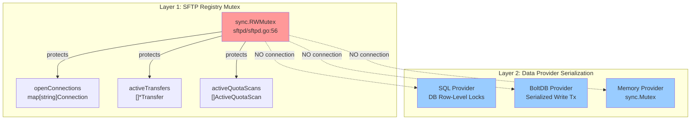
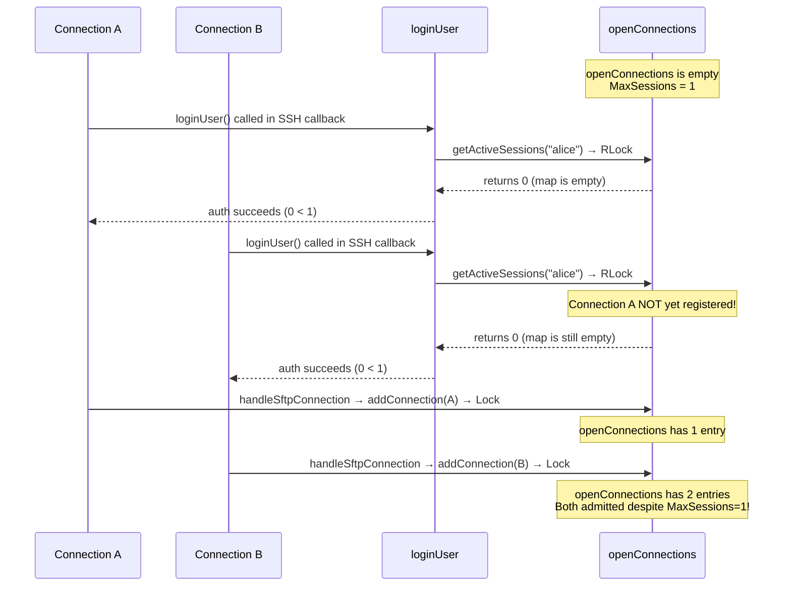
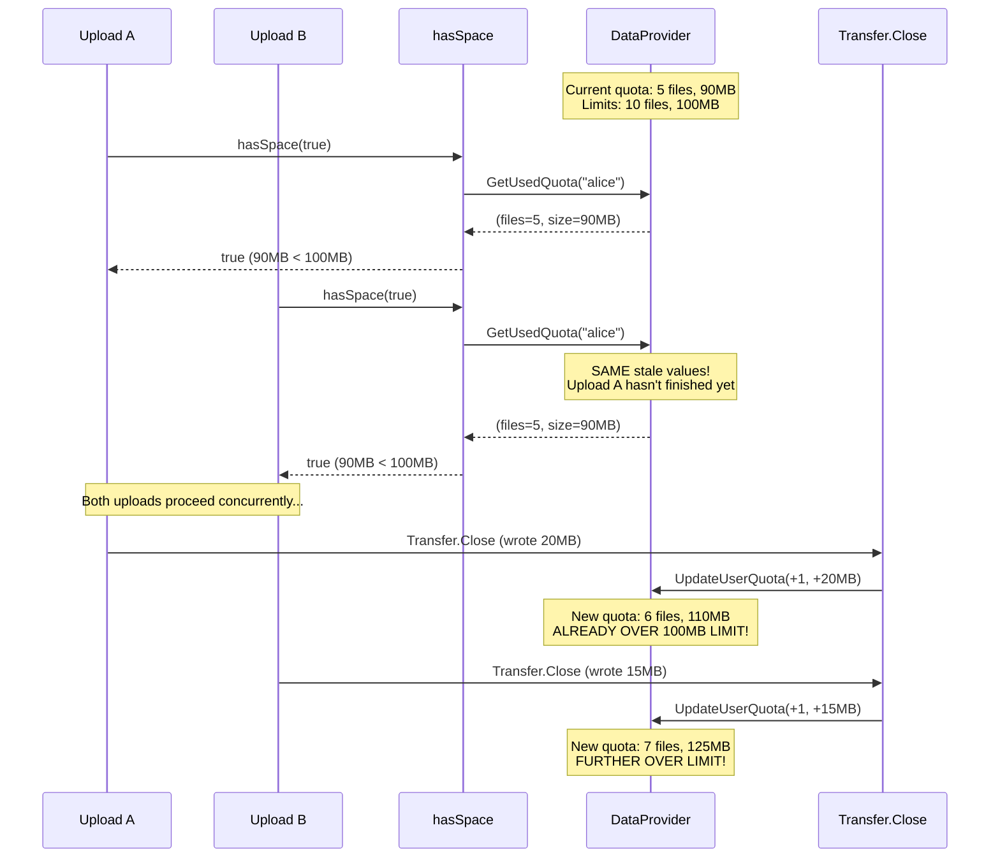
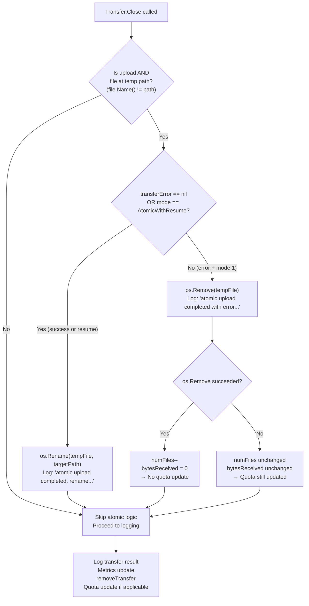
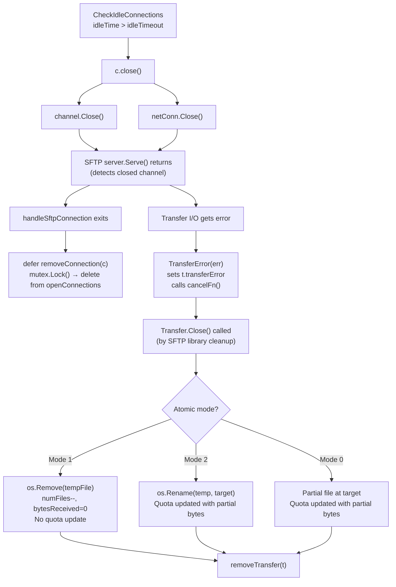

# SFTPGo Concurrency Deep-Dive: Connection Handling, Quota Enforcement, and Atomic Uploads

## Introduction and Scope

This document provides a comprehensive technical analysis of how SFTPGo's **connection handling**, **quota enforcement**, **atomic upload mechanics**, and **idle connection monitoring** coordinate under concurrent stress conditions. Every technical claim is grounded in the actual source code and cites specific files and line numbers.

> **Citation Format:** All references follow the pattern `Source: <file>:<line-range>` and point to the SFTPGo source code as the single source of truth.

### Core Questions Addressed

This document answers the following seven questions:

1. **Quota Coordination:** How does SFTPGo coordinate quota updates across simultaneous transfers—do quota checks race with each other or serialize cleanly, and where does that decision first manifest at runtime?
2. **Session + Quota Pressure:** When a user with strict quota limits opens multiple sessions near `MaxSessions` and starts concurrent uploads that collectively threaten to exceed both `QuotaFiles` and `QuotaSize`, what happens to session acceptance, quota accounting, and file state?
3. **Mid-Stream Atomic Failure:** What happens to a partial temporary file and its associated quota accounting when a connection is dropped mid-stream due to idle timeout or session-limit rejection during an atomic-mode upload?
4. **Observable Evidence:** What do the actual logged messages, file states, and quota values look like during a burst of concurrent activity, including sessions accepted vs. rejected, quota changes at each step, and any surviving temporary files?
5. **Clean vs. Killed Transfer:** What gaps or inconsistencies appear when a transfer is deliberately killed mid-stream versus when it completes normally, and what concrete signs in logs or the filesystem distinguish the two paths?
6. **Concurrent Subsystem Interaction:** How do the idle connection checker, session limiter, and quota enforcer interact when all run concurrently?
7. **Architectural Boundaries (Implicit):** What are the TOCTOU gaps and architectural boundaries in the two-layer locking model?

---

## Architecture Overview: The Concurrency Landscape

### Shared State Registries and Locking

SFTPGo manages concurrent connections through three package-level registries, all protected by a single `sync.RWMutex`:

```go
var (
    mutex                sync.RWMutex               // Source: sftpd/sftpd.go:56
    openConnections      map[string]Connection       // Source: sftpd/sftpd.go:57
    activeTransfers      []*Transfer                 // Source: sftpd/sftpd.go:58
    idleConnectionTicker *time.Ticker                // Source: sftpd/sftpd.go:59
    idleTimeout          time.Duration               // Source: sftpd/sftpd.go:60
    activeQuotaScans     []ActiveQuotaScan           // Source: sftpd/sftpd.go:61
)
```

These registries are initialized in `init()`:

```go
func init() {
    openConnections = make(map[string]Connection)          // Source: sftpd/sftpd.go:131
    idleConnectionTicker = time.NewTicker(5 * time.Minute) // Source: sftpd/sftpd.go:132
}
```

`Source: sftpd/sftpd.go:130-133`

#### Function-Level Lock Usage

Every function that accesses the shared registries acquires the appropriate lock type. The table below catalogs each function, its lock type, and the registry it touches:

| Function | Lines | Lock Type | Registry Accessed | Operation |
|----------|-------|-----------|-------------------|-----------|
| `getActiveSessions` | 200-210 | `mutex.RLock()` | `openConnections` | Count matching usernames |
| `AddQuotaScan` | 223-236 | `mutex.Lock()` | `activeQuotaScans` | Append scan entry |
| `RemoveQuotaScan` | 239-258 | `mutex.Lock()` | `activeQuotaScans` | Remove scan entry |
| `CloseActiveConnection` | 262-271 | `mutex.RLock()` | `openConnections` | Lookup + call `close()` |
| `GetConnectionsStats` | 275-318 | `mutex.RLock()` | `openConnections` + `activeTransfers` | Build status snapshot |
| `CheckIdleConnections` | 331-352 | `mutex.RLock()` | `openConnections` + `activeTransfers` | Iterate + close idle |
| `addConnection` | 354-360 | `mutex.Lock()` | `openConnections` | Insert connection |
| `removeConnection` | 362-376 | `mutex.Lock()` | `openConnections` | Delete connection |
| `addTransfer` | 378-382 | `mutex.Lock()` | `activeTransfers` | Append transfer |
| `removeTransfer` | 384-402 | `mutex.Lock()` | `activeTransfers` | Remove transfer |
| `updateConnectionActivity` | 405-412 | `mutex.Lock()` | `openConnections` | Update `lastActivity` |
| `isAtomicUploadEnabled` | 414-416 | None | `uploadMode` (read-only) | Check upload mode |

`Source: sftpd/sftpd.go:200-416`

#### Rationale

A single `sync.RWMutex` for all three registries simplifies the concurrency model: there is no risk of inter-registry deadlock, and read-heavy operations (stats, idle checking, session counting) can run concurrently via `RLock()`. Write operations (`addConnection`, `removeConnection`, `addTransfer`, `removeTransfer`) serialize against each other via `Lock()`.

**Critical limitation:** This mutex protects ONLY the in-memory registries within the `sftpd` package. It does NOT protect quota reads/writes in the data provider layer. This architectural boundary is the root cause of the TOCTOU race documented in later sections.

### Data Provider Quota Serialization by Backend

The `Provider` interface defines the quota operations that every data backend must implement:

```go
type Provider interface {
    updateQuota(username string, filesAdd int, sizeAdd int64, reset bool) error   // line 223
    getUsedQuota(username string) (int, int64, error)                             // line 224
    // ... other methods
}
```

`Source: dataprovider/dataprovider.go:219-235`

#### UpdateUserQuota Gating Logic

The public `UpdateUserQuota` wrapper applies configuration-based gating before delegating to the provider:

```go
func UpdateUserQuota(p Provider, user User, filesAdd int, sizeAdd int64, reset bool) error {
    if config.TrackQuota == 0 {
        return &MethodDisabledError{err: trackQuotaDisabledError}     // quota tracking disabled
    } else if config.TrackQuota == 2 && !reset && !user.HasQuotaRestrictions() {
        return nil                                                      // skip for unrestricted users
    }
    if config.ManageUsers == 0 {
        return &MethodDisabledError{err: manageUsersDisabledError}     // user management disabled
    }
    return p.updateQuota(user.Username, filesAdd, sizeAdd, reset)
}
```

`Source: dataprovider/dataprovider.go:310-322`

#### GetUsedQuota Gating Logic

```go
func GetUsedQuota(p Provider, username string) (int, int64, error) {
    if config.TrackQuota == 0 {
        return 0, 0, &MethodDisabledError{err: trackQuotaDisabledError}
    }
    return p.getUsedQuota(username)
}
```

`Source: dataprovider/dataprovider.go:326-331`

#### HasQuotaRestrictions

The `HasQuotaRestrictions` method determines whether a user has any quota limits configured:

```go
func (u *User) HasQuotaRestrictions() bool {
    return u.QuotaFiles > 0 || u.QuotaSize > 0
}
```

`Source: dataprovider/user.go:257-260`

### The Two-Layer Locking Architecture

SFTPGo's concurrency model uses two completely independent locking layers that do not coordinate with each other:



#### Rationale

The SFTP `sync.RWMutex` and the data-provider locking mechanisms are **completely independent**. When `hasSpace` reads the quota (via `GetUsedQuota`) and when `Transfer.Close` updates the quota (via `UpdateUserQuota`), neither operation holds the SFTP registry mutex. The data provider's own serialization protects only individual read or write operations—it does NOT create a transaction that spans from the quota check to the quota update.

This design means that the `hasSpace` check and the `UpdateUserQuota` call operate under **different locks at different times**, which creates the TOCTOU (Time-Of-Check-To-Time-Of-Use) race window analyzed in detail below.

#### Per-Provider Serialization Comparison

| Provider | Update Mechanism | Atomicity Guarantee | Read Mechanism | Source Citation |
|----------|-----------------|---------------------|----------------|-----------------|
| **SQL** (SQLite/PostgreSQL/MySQL) | `UPDATE ... SET used_quota_size = used_quota_size + ?, used_quota_files = used_quota_files + ?, last_quota_update = ? WHERE username = ?` | Atomic increment via DB row-level locking; individual `stmt.Exec` is atomic | `SELECT used_quota_size, used_quota_files FROM ... WHERE username = ?` — point-in-time read, no lock held after return | `Source: dataprovider/sqlcommon.go:74-90`, `Source: dataprovider/sqlqueries.go:43-49`, `Source: dataprovider/sqlcommon.go:109-126` |
| **BoltDB** | `dbHandle.Update(func(tx *bolt.Tx) error {...})` — serialized read-modify-write within a single transaction | Single-writer guarantee from BoltDB; reads user JSON, modifies `UsedQuotaSize += sizeAdd` and `UsedQuotaFiles += filesAdd`, writes back | `p.userExists(username)` which calls `dbHandle.View()` — read transaction runs concurrently with writes | `Source: dataprovider/bolt.go:180-209`, `Source: dataprovider/bolt.go:211-218` |
| **Memory** | `p.dbHandle.lock.Lock()` / `defer p.dbHandle.lock.Unlock()` — explicit `sync.Mutex` around read-modify-write on in-memory map | Full mutex serialization: reads user, modifies fields, writes back to map | Also acquires `p.dbHandle.lock.Lock()` — reads and writes serialize against each other | `Source: dataprovider/memory.go:119-140`, `Source: dataprovider/memory.go:142-154` |

#### Key Insight: SQL Incremental vs. Reset Queries

The SQL provider uses different queries depending on the `reset` flag:

```sql
-- Incremental (reset=false): used during normal upload completion
UPDATE users SET used_quota_size = used_quota_size + ?,
                 used_quota_files = used_quota_files + ?,
                 last_quota_update = ?
WHERE username = ?

-- Reset (reset=true): used during quota scan
UPDATE users SET used_quota_size = ?,
                 used_quota_files = ?,
                 last_quota_update = ?
WHERE username = ?
```

`Source: dataprovider/sqlqueries.go:43-49`

The incremental query relies on the database engine's own atomicity for the `SET column = column + ?` expression. This means concurrent `UpdateUserQuota` calls from different transfers will correctly serialize at the database level—but only for the update itself. The preceding `GetUsedQuota` read is a separate transaction.

---

## Connection Handling Under Session Pressure

### Session Counting and Limit Enforcement

#### Authentication Flow Trace

The connection lifecycle begins when a TCP connection is accepted and proceeds through SSH handshake, authentication, and SFTP subsystem initialization:

1. **TCP Accept:** `Configuration.Initialize` starts a TCP listener and spawns a goroutine for each incoming connection:
   ```go
   for {
       conn, _ := listener.Accept()
       if conn != nil {
           go c.AcceptInboundConnection(conn, serverConfig)
       }
   }
   ```
   `Source: sftpd/server.go:192-197`

2. **SSH Handshake:** `AcceptInboundConnection` sets a 2-minute deadline and performs the SSH handshake:
   ```go
   conn.SetDeadline(time.Now().Add(handshakeTimeout)) // handshakeTimeout = 2 * time.Minute
   sconn, chans, reqs, err := ssh.NewServerConn(conn, config)
   ```
   `Source: sftpd/server.go:247-249`

3. **Password Authentication Callback** (called by SSH library during handshake):
   ```go
   PasswordCallback: func(conn ssh.ConnMetadata, pass []byte) (*ssh.Permissions, error) {
       sp, err := c.validatePasswordCredentials(conn, pass)
       // ...
   }
   ```
   `Source: sftpd/server.go:128-134`
   
   `validatePasswordCredentials` calls `dataprovider.CheckUserAndPass`, then `loginUser`:
   `Source: sftpd/server.go:448-461`

4. **Public Key Authentication Callback** (alternative path):
   ```go
   PublicKeyCallback: func(conn ssh.ConnMetadata, pubKey ssh.PublicKey) (*ssh.Permissions, error) {
       sp, err := c.validatePublicKeyCredentials(conn, string(pubKey.Marshal()))
       // ...
   }
   ```
   `Source: sftpd/server.go:136-143`
   
   `validatePublicKeyCredentials` calls `dataprovider.CheckUserAndPubKey`, then `loginUser`:
   `Source: sftpd/server.go:432-446`

5. **Session Limit Check** in `loginUser`:
   ```go
   func loginUser(user dataprovider.User, loginType string, remoteAddr string) (*ssh.Permissions, error) {
       if !filepath.IsAbs(user.HomeDir) {
           // reject: invalid home dir
       }
       if user.MaxSessions > 0 {
           activeSessions := getActiveSessions(user.Username)
           if activeSessions >= user.MaxSessions {
               logger.Debug(logSender, "", "authentication refused for user: %#v, too many open sessions: %v/%v",
                   user.Username, activeSessions, user.MaxSessions)
               return nil, fmt.Errorf("too many open sessions: %v", activeSessions)
           }
       }
       if !user.IsLoginAllowed(remoteAddr) {
           // reject: IP not allowed
       }
       // serialize user to JSON and return in ssh.Permissions.Extensions["user"]
   }
   ```
   `Source: sftpd/server.go:365-394`

6. **`getActiveSessions` Implementation:**
   ```go
   func getActiveSessions(username string) int {
       mutex.RLock()
       defer mutex.RUnlock()
       numSessions := 0
       for _, c := range openConnections {
           if c.User.Username == username {
               numSessions++
           }
       }
       return numSessions
   }
   ```
   `Source: sftpd/sftpd.go:200-210`

### The Auth-to-Registration Timing Gap

There is a critical timing gap between when the session count is checked and when the connection is actually registered in the `openConnections` map.

#### The Sequence

1. **Session check** happens during authentication (inside SSH auth callback) at `loginUser` lines 371-377
2. After auth succeeds, SSH handshake completes, and the user is unmarshalled from `sconn.Permissions.Extensions["user"]` at line 264
3. Connection object is created at lines 277-287
4. For each SSH channel, when `req.Type == "subsystem"` with payload `"sftp"`, `handleSftpConnection` is called at line 324
5. `handleSftpConnection` calls `addConnection(connection)` which acquires `mutex.Lock()` and adds to `openConnections` at lines 354-360
6. **GAP:** Between step 1 (session count check) and step 5 (registration), another connection can authenticate and also pass the session check

#### Race Scenario



`Source: sftpd/server.go:243-333` (AcceptInboundConnection), `Source: sftpd/server.go:335-353` (handleSftpConnection), `Source: sftpd/sftpd.go:354-360` (addConnection)

#### Rationale

This gap exists because the Go `crypto/ssh` library processes authentication in callback functions during the SSH handshake. The auth callback cannot block on connection registration because the SFTP subsystem channel hasn't been established yet—authentication must complete before channel negotiation begins. The connection can only be registered in `handleSftpConnection` after the SSH channel has been accepted and the SFTP subsystem request has been received.

The practical impact is limited: the window is typically milliseconds-long (the time between auth callback return and `addConnection` call), but under high concurrency with burst connection attempts, it is possible for `MaxSessions + N` connections to exist briefly.

### Observable Evidence: Sessions Accepted vs. Rejected

#### Log Messages for Session Lifecycle

**Session Rejected — Too Many Sessions:**
```json
{
  "level": "debug",
  "sender": "sftpd",
  "connection_id": "",
  "message": "authentication refused for user: \"alice\", too many open sessions: 3/3"
}
```
`Source: sftpd/server.go:374-375`

**Session Rejected — Invalid Home Directory:**
```json
{
  "level": "warn",
  "sender": "sftpd",
  "connection_id": "",
  "message": "user \"alice\" has an invalid home dir: \"/nonexistent\". Home dir must be an absolute path, login not allowed"
}
```
`Source: sftpd/server.go:367-368`

**Session Rejected — IP Not Allowed:**
```json
{
  "level": "debug",
  "sender": "sftpd",
  "connection_id": "",
  "message": "cannot login user \"alice\", remote address is not allowed: 10.0.0.5"
}
```
`Source: sftpd/server.go:380`

**Connection Failed Log** (emitted on auth failure for Fail2ban integration):
```json
{
  "level": "debug",
  "sender": "connection_failed",
  "client_ip": "10.0.0.5",
  "username": "alice",
  "login_type": "password",
  "error": "too many open sessions: 3"
}
```
`Source: sftpd/server.go:457` (password), `Source: sftpd/server.go:442` (pubkey), `Source: logger/logger.go:175-184` (format)

**Connection Accepted:**
```json
{
  "level": "info",
  "sender": "sftpd",
  "connection_id": "a1b2c3d4e5f6",
  "message": "User id: 1, logged in with: \"password\", username: \"alice\", home_dir: \"/home/alice\" remote addr: \"10.0.0.5:54321\""
}
```
`Source: sftpd/server.go:291-292`

**Connection Added:**
```json
{
  "level": "debug",
  "sender": "sftpd",
  "connection_id": "a1b2c3d4e5f6",
  "message": "connection added, num open connections: 1"
}
```
`Source: sftpd/sftpd.go:359`

**Connection Removed:**
```json
{
  "level": "debug",
  "sender": "sftpd",
  "connection_id": "a1b2c3d4e5f6",
  "message": "connection removed, num open connections: 0"
}
```
`Source: sftpd/sftpd.go:375`

#### Prometheus Metrics for Session Lifecycle

| Metric Operation | Source | When Emitted |
|-----------------|--------|--------------|
| `metrics.AddLoginAttempt(true)` | server.go:438 | Public key auth attempt |
| `metrics.AddLoginAttempt(false)` | server.go:453 | Password auth attempt |
| `metrics.AddLoginResult(true, err)` | server.go:444 | Public key auth result |
| `metrics.AddLoginResult(false, err)` | server.go:459 | Password auth result |
| `metrics.UpdateActiveConnectionsSize(len(openConnections))` | sftpd.go:358 | After `addConnection` |
| `metrics.UpdateActiveConnectionsSize(len(openConnections))` | sftpd.go:366 | After `removeConnection` |

`Source: sftpd/server.go:432-461`, `Source: sftpd/sftpd.go:354-376`, `Source: metrics/metrics.go:190-217,232-234`

---

## Quota Enforcement Across Concurrent Transfers

### The hasSpace Check-Then-Act Pattern

The `hasSpace` function is the sole gatekeeper for quota enforcement before an upload begins:

```go
func (c Connection) hasSpace(checkFiles bool) bool {
    if (checkFiles && c.User.QuotaFiles > 0) || c.User.QuotaSize > 0 {
        numFile, size, err := dataprovider.GetUsedQuota(dataProvider, c.User.Username)
        if err != nil {
            if _, ok := err.(*dataprovider.MethodDisabledError); ok {
                c.Log(logger.LevelWarn, logSender,
                    "quota enforcement not possible for user %#v: %v", c.User.Username, err)
                return true  // allow upload when quota tracking is disabled
            }
            c.Log(logger.LevelWarn, logSender,
                "error getting used quota for %#v: %v", c.User.Username, err)
            return false
        }
        if (checkFiles && c.User.QuotaFiles > 0 && numFile >= c.User.QuotaFiles) ||
            (c.User.QuotaSize > 0 && size >= c.User.QuotaSize) {
            c.Log(logger.LevelDebug, logSender,
                "quota exceed for user %#v, num files: %v/%v, size: %v/%v check files: %v",
                c.User.Username, numFile, c.User.QuotaFiles, size, c.User.QuotaSize, checkFiles)
            return false
        }
    }
    return true
}
```

`Source: sftpd/handler.go:515-534`

#### Call Sites

| Caller | Line | `checkFiles` | Rationale |
|--------|------|-------------|-----------|
| `handleSFTPUploadToNewFile` | 413 | `true` | New file: must check both file count AND size quota |
| `handleSFTPUploadToExistingFile` | 453 | `false` | Overwrite: file already counted, only check size quota |

`Source: sftpd/handler.go:412-448` (new file), `Source: sftpd/handler.go:450-513` (existing file)

#### Rationale for `checkFiles` Parameter

When overwriting an existing file, the file count does not change—only the size may change. Therefore `handleSFTPUploadToExistingFile` passes `checkFiles=false` to skip the file-count check. For new files, both file count and size must be validated.

### The TOCTOU Race Window

**This is the most critical concurrency gap in SFTPGo's quota enforcement.**

The Time-Of-Check-To-Time-Of-Use (TOCTOU) race occurs because there is NO quota reservation mechanism between the `hasSpace` check and the `UpdateUserQuota` call:

1. `hasSpace` reads current quota via `dataprovider.GetUsedQuota` — **no lock held from SFTP mutex**
2. Upload proceeds — bytes are written via `Transfer.WriteAt` — `bytesReceived` accumulates
3. `Transfer.Close` finally calls `dataprovider.UpdateUserQuota(dataProvider, t.user, numFiles, t.bytesReceived, false)`
4. **Between step 1 and step 3, no quota reservation exists** — another concurrent upload can also pass `hasSpace` using the same stale quota values



`Source: sftpd/handler.go:515-534` (hasSpace), `Source: sftpd/transfer.go:166-168` (UpdateUserQuota call)

#### Rationale

SFTPGo does **NOT** use quota reservation or locking across the upload lifecycle. The quota check (`hasSpace`) and the quota update (`Transfer.Close`) are completely decoupled — they happen at different times, under different locks (or no locks), with no mechanism to prevent concurrent uploads from both passing the same stale check.

#### Per-Provider Behavior Under This Race

**SQL Provider:** The `UPDATE ... SET used_quota_size = used_quota_size + ?` statement is atomic at the database row level. Two concurrent `UpdateUserQuota` calls will correctly serialize at the DB engine level — the quota increments will both be applied. However, the stale read in `hasSpace` is still a problem: both uploads read the same pre-upload quota values.

`Source: dataprovider/sqlcommon.go:74-90`, `Source: dataprovider/sqlqueries.go:43-49`

**BoltDB Provider:** The `dbHandle.Update()` function provides a serialized write transaction. Two concurrent `updateQuota` calls will execute sequentially due to BoltDB's single-writer guarantee. However, `getUsedQuota` uses `dbHandle.View()` (read transaction) which runs concurrently with writes — so the `hasSpace` read can still return stale data.

`Source: dataprovider/bolt.go:180-209` (update), `Source: dataprovider/bolt.go:211-218` (getUsedQuota via `userExists` using `View`)

**Memory Provider:** Both `getUsedQuota` and `updateQuota` acquire `p.dbHandle.lock.Lock()` (a `sync.Mutex`), so reads and writes serialize against each other. However, the gap between the `getUsedQuota` call (in `hasSpace`) and the `updateQuota` call (in `Transfer.Close`) is unprotected — the mutex is released between the two calls.

`Source: dataprovider/memory.go:119-140` (update), `Source: dataprovider/memory.go:142-154` (getUsedQuota)

### Quota Update Mechanics in Transfer.Close

The `Transfer.Close` method is the central point where upload finalization, atomic file handling, and quota updates converge. Here is a step-by-step trace:

```go
func (t *Transfer) Close() error {
    t.lock.Lock()                    // Step 1: Per-transfer mutex (line 122)
    defer t.lock.Unlock()
    if t.isFinished {                // Step 2: Guard against double-close (line 124)
        return errTransferClosed
    }
    err := t.closeIO()              // Step 3: Close file/pipe handles (line 127)
    t.isFinished = true             // Step 4: Mark finished (line 128)
    numFiles := 0                   // Step 5: Calculate file count delta
    if t.isNewFile {
        numFiles = 1                 // New file adds 1 to count (line 131)
    }
    t.checkDownloadSize()           // Step 6: Validate download size (line 133)
    
    // Step 7: Atomic upload finalization (lines 134-147)
    if t.transferType == transferUpload && t.file != nil && t.file.Name() != t.path {
        if t.transferError == nil || uploadMode == uploadModeAtomicWithResume {
            err = os.Rename(t.file.Name(), t.path)           // Rename temp to target
        } else {
            err = os.Remove(t.file.Name())                    // Delete temp file
            if err == nil {
                numFiles--                                     // Adjust file count
                t.bytesReceived = 0                            // Zero out received bytes
            }
        }
    }
    
    // Step 8: Logging (lines 149-163)
    if t.transferError == nil {
        // Log successful transfer via TransferLog
        // Fire executeAction for hooks
    } else {
        // Log warning: "transfer error: %v, path: %#v"
    }
    
    // Step 9: Metrics (line 164)
    metrics.TransferCompleted(t.bytesSent, t.bytesReceived, t.transferType, t.transferError)
    
    // Step 10: Remove from registry (line 165)
    removeTransfer(t)
    
    // Step 11: Quota update (lines 166-168)
    if t.transferType == transferUpload && (numFiles != 0 || t.bytesReceived > 0) {
        dataprovider.UpdateUserQuota(dataProvider, t.user, numFiles, t.bytesReceived, false)
    }
    return err
}
```

`Source: sftpd/transfer.go:121-170`

#### Error Cleanup Logic Analysis

The quota adjustment logic at lines 143-145 handles different scenarios:

**Case 1: New file (`isNewFile=true`), atomic mode 1 error, temp file deleted successfully:**
- `numFiles` starts at 1 (line 131)
- `numFiles--` → `numFiles = 0` (line 144)
- `bytesReceived = 0` (line 145)
- Condition `(0 != 0 || 0 > 0)` → **FALSE** → **No quota update** ✓ (correct: temp file was removed)

**Case 2: Existing file overwrite (`isNewFile=false`), atomic mode 1 error, temp file deleted successfully:**
- `numFiles` starts at 0 (line 129)
- `numFiles--` → `numFiles = -1` (line 144)
- `bytesReceived = 0` (line 145)
- Condition `(-1 != 0 || 0 > 0)` → **TRUE** → **Quota update: numFiles=-1, bytesReceived=0**
- This DECREMENTS the file count by 1, accounting for the original file that was renamed to the temp path and then deleted

**Case 3: Any mode, no error (success):**
- `numFiles` stays as originally set (1 for new file, 0 for overwrite)
- `bytesReceived` reflects actual bytes written
- Quota update proceeds with positive values

**Case 4: Standard mode (mode 0), error:**
- No atomic finalization runs (file is already at target path)
- `numFiles` and `bytesReceived` reflect what was written
- Quota IS updated (partial file persists at target)

### Per-Provider Serialization Comparison

#### SQL Provider Detail

```go
func sqlCommonUpdateQuota(username string, filesAdd int, sizeAdd int64, reset bool, dbHandle *sql.DB) error {
    q := getUpdateQuotaQuery(reset)
    stmt, err := dbHandle.Prepare(q)
    if err != nil { /* log and return */ }
    defer stmt.Close()
    _, err = stmt.Exec(sizeAdd, filesAdd, utils.GetTimeAsMsSinceEpoch(time.Now()), username)
    // log result
    return err
}
```

`Source: dataprovider/sqlcommon.go:74-90`

The generated query (non-reset):
```sql
UPDATE users SET used_quota_size = used_quota_size + ?,
                 used_quota_files = used_quota_files + ?,
                 last_quota_update = ?
WHERE username = ?
```

`Source: dataprovider/sqlqueries.go:43-49`

The `SELECT` for reading quota:
```go
func sqlCommonGetUsedQuota(username string, dbHandle *sql.DB) (int, int64, error) {
    q := getQuotaQuery()  // SELECT used_quota_size,used_quota_files FROM users WHERE username = ?
    stmt, err := dbHandle.Prepare(q)
    // ...
    err = stmt.QueryRow(username).Scan(&usedSize, &usedFiles)
    return usedFiles, usedSize, err
}
```

`Source: dataprovider/sqlcommon.go:109-126`

#### BoltDB Provider Detail

```go
func (p BoltProvider) updateQuota(username string, filesAdd int, sizeAdd int64, reset bool) error {
    return p.dbHandle.Update(func(tx *bolt.Tx) error {
        bucket, _, err := getBuckets(tx)
        // ... read user JSON from bucket
        var user User
        err = json.Unmarshal(u, &user)
        if reset {
            user.UsedQuotaSize = sizeAdd
            user.UsedQuotaFiles = filesAdd
        } else {
            user.UsedQuotaSize += sizeAdd        // line 199
            user.UsedQuotaFiles += filesAdd      // line 200
        }
        user.LastQuotaUpdate = utils.GetTimeAsMsSinceEpoch(time.Now())
        buf, err := json.Marshal(user)
        return bucket.Put([]byte(username), buf)
    })
}
```

`Source: dataprovider/bolt.go:180-209`

The read function uses `View` (read-only transaction):
```go
func (p BoltProvider) getUsedQuota(username string) (int, int64, error) {
    user, err := p.userExists(username)  // calls dbHandle.View()
    return user.UsedQuotaFiles, user.UsedQuotaSize, err
}
```

`Source: dataprovider/bolt.go:211-218`

#### Memory Provider Detail

```go
func (p MemoryProvider) updateQuota(username string, filesAdd int, sizeAdd int64, reset bool) error {
    p.dbHandle.lock.Lock()
    defer p.dbHandle.lock.Unlock()
    // ... find user, modify fields
    user.UsedQuotaSize += sizeAdd       // line 134
    user.UsedQuotaFiles += filesAdd     // line 135
    p.dbHandle.users[user.Username] = user  // line 138
    return nil
}

func (p MemoryProvider) getUsedQuota(username string) (int, int64, error) {
    p.dbHandle.lock.Lock()              // Note: Lock, not RLock
    defer p.dbHandle.lock.Unlock()
    // ... find user, return fields
}
```

`Source: dataprovider/memory.go:119-140` (update), `Source: dataprovider/memory.go:142-154` (getUsedQuota)

---

## Atomic Upload Mechanics Under Failure

### Temp File Naming and Location

When atomic upload is enabled, SFTPGo writes uploaded data to a temporary file in the same directory as the target, then renames it on completion:

```go
func (OsFs) GetAtomicUploadPath(name string) string {
    dir := filepath.Dir(name)
    guid := xid.New().String()
    return filepath.Join(dir, ".sftpgo-upload."+guid+"."+filepath.Base(name))
}
```

`Source: vfs/osfs.go:174-179`

**Example:** Target `/home/alice/data/report.csv` → Temp file `/home/alice/data/.sftpgo-upload.c0v4r5g6h7i8j9k0.report.csv`

The atomic path is selected in `Filewrite`:

```go
filePath := p
if isAtomicUploadEnabled() && c.fs.IsAtomicUploadSupported() {
    filePath = c.fs.GetAtomicUploadPath(p)
}
```

`Source: sftpd/handler.go:105-108`

Where `isAtomicUploadEnabled` checks the upload mode:

```go
func isAtomicUploadEnabled() bool {
    return uploadMode == uploadModeAtomic || uploadMode == uploadModeAtomicWithResume
}
```

`Source: sftpd/sftpd.go:414-416`

#### Upload Mode Constants

```go
const (
    uploadModeStandard         = iota  // 0
    uploadModeAtomic                    // 1
    uploadModeAtomicWithResume          // 2
)
```

`Source: sftpd/sftpd.go:49-53`

> **Note:** The S3 backend returns `false` from `IsAtomicUploadSupported()`, so atomic uploads are a local-filesystem-only feature.

### Three Completion Paths: Success / Error+Atomic / Error+Resume

The `Transfer.Close` method at lines 134-147 implements a decision tree for atomic upload finalization:



`Source: sftpd/transfer.go:134-147`

#### Path 1 — Standard Mode (mode 0)

No temp file is used. The `filePath` equals the target `p`. Data is written directly to the target path.

- **On success:** Data is at target path. Quota updated with `numFiles` and `bytesReceived`.
- **On error:** Partial data remains at target path. Quota updated with whatever was written.

#### Path 2 — Atomic Success (mode 1 or 2, no error)

```go
err = os.Rename(t.file.Name(), t.path)
logger.Debug(logSender, t.connectionID, "atomic upload completed, rename: %#v -> %#v, error: %v",
    t.file.Name(), t.path, err)
```

Temp file is atomically renamed to target. Quota updated normally.

`Source: sftpd/transfer.go:136-138`

#### Path 3 — Atomic Error (mode 1, error present)

```go
err = os.Remove(t.file.Name())
logger.Warn(logSender, t.connectionID, "atomic upload completed with error: \"%v\", delete temporary file: %#v, "+
    "deletion error: %v", t.transferError, t.file.Name(), err)
if err == nil {
    numFiles--
    t.bytesReceived = 0
}
```

Temp file is deleted. If deletion succeeds, `numFiles` and `bytesReceived` are zeroed out, preventing any quota update.

`Source: sftpd/transfer.go:140-146`

#### Path 4 — Atomic-with-Resume Error (mode 2, error present)

Falls into the same branch as success: `os.Rename(tempFile, targetPath)` at line 136. The partial data is renamed to the target path so the client can resume later. Quota IS updated with partial bytes.

### Partial File Cleanup and Quota Reversal

#### Quota Update Decision at Transfer.Close

After atomic finalization, `Transfer.Close` evaluates whether a quota update is needed:

```go
if t.transferType == transferUpload && (numFiles != 0 || t.bytesReceived > 0) {
    dataprovider.UpdateUserQuota(dataProvider, t.user, numFiles, t.bytesReceived, false)
}
```

`Source: sftpd/transfer.go:166-168`

| Scenario | `numFiles` | `bytesReceived` | Condition Result | Quota Updated? |
|----------|-----------|-----------------|-----------------|----------------|
| Mode 1, new file, success | 1 | N bytes | `true` | Yes: `+1, +N` |
| Mode 1, new file, error, temp deleted | 0 | 0 | `false` | **No** (clean) |
| Mode 1, overwrite, error, temp deleted | -1 | 0 | `true` | Yes: `-1, 0` (decrements) |
| Mode 2, error (any) | 1 or 0 | partial bytes | `true` | Yes (partial persists) |
| Mode 0, error | 1 or 0 | partial bytes | `true` | Yes (partial persists) |

#### Existing File Overwrite in Atomic Mode

When overwriting an existing file with atomic mode enabled, `handleSFTPUploadToExistingFile` performs these steps:

1. **Rename existing file to temp path:**
   ```go
   if isAtomicUploadEnabled() && c.fs.IsAtomicUploadSupported() {
       err = c.fs.Rename(requestPath, filePath)  // existing → temp path
   }
   ```
   `Source: sftpd/handler.go:467-474`

2. **Create new file at temp path:**
   ```go
   file, w, cancelFn, err := c.fs.Create(filePath, osFlags)
   ```
   `Source: sftpd/handler.go:476`

3. **Pre-decrement quota** (unless resume mode):
   ```go
   if pflags.Append && osFlags&os.O_TRUNC == 0 {
       minWriteOffset = fileSize  // resume: keep old size accounted
   } else {
       dataprovider.UpdateUserQuota(dataProvider, c.User, 0, -fileSize, false)  // decrement old size
   }
   ```
   `Source: sftpd/handler.go:482-487`

**Critical observation on error in mode 1:** If the upload fails, the temp file (containing partial NEW data) is deleted by `Transfer.Close`. However, the original file was first renamed to the temp path and then overwritten by `Create` at the same path. The `Create` call opens the file with the OS flags, which may truncate the renamed file. When the temp file is subsequently deleted, **the original file data is lost**.

The quota adjustment (`numFiles--` when `isNewFile=false`) correctly decrements the file count to account for the lost file, and the pre-decremented size (`-fileSize` at line 486) means the size quota reflects the removal of the old content.

#### Rationale

This design prioritizes atomicity for the success path (the new data replaces the old data in a single rename operation) at the cost of data loss on the error path. The tradeoff is that successful uploads are guaranteed to be complete, while failed uploads may lose the original file. This is a known architectural decision.

### Orphaned Temp File Detection

If the SFTPGo server process crashes between temp file creation and `Transfer.Close`, orphaned `.sftpgo-upload.*` files will persist on disk indefinitely.

**Detection:** The `ScanRootDirContents` function at `vfs/osfs.go:155-171` uses `filepath.Walk` to count all files and their sizes in a user's root directory. It would count orphaned temp files as regular files, inflating both the file count and size totals.

```go
func (fs OsFs) ScanRootDirContents() (int, int64, error) {
    numFiles := 0
    size := int64(0)
    // ... filepath.Walk counting info.Mode().IsRegular() files
    return numFiles, size, err
}
```

`Source: vfs/osfs.go:155-171`

Temp files can be identified by their naming pattern: `.sftpgo-upload.<20-char-xid>.<original-filename>`.

**No automatic cleanup mechanism exists.** There is no background goroutine or startup routine that scans for and removes orphaned temp files. Manual cleanup is required after a crash.

`Source: vfs/osfs.go:174-179` (naming pattern)

---

## Idle Connection Checker Interactions

### Ticker Mechanics and Activity Resolution

The idle connection checker is started during server initialization:

```go
// In Configuration.Initialize:
if c.IdleTimeout > 0 {
    startIdleTimer(time.Duration(c.IdleTimeout) * time.Minute)
}
```

`Source: sftpd/server.go:188-190`

```go
func startIdleTimer(maxIdleTime time.Duration) {
    idleTimeout = maxIdleTime
    go func() {
        for t := range idleConnectionTicker.C {
            logger.Debug(logSender, "", "idle connections check ticker %v", t)
            CheckIdleConnections()
        }
    }()
}
```

`Source: sftpd/sftpd.go:320-328`

The ticker fires every 5 minutes (set in `init()` at line 132). Each tick calls `CheckIdleConnections`:

```go
func CheckIdleConnections() {
    mutex.RLock()
    defer mutex.RUnlock()
    for _, c := range openConnections {
        idleTime := time.Since(c.lastActivity)
        for _, t := range activeTransfers {
            if t.connectionID == c.ID {
                transferIdleTime := time.Since(t.lastActivity)
                if transferIdleTime < idleTime {
                    c.Log(logger.LevelDebug, logSender,
                        "idle time: %v setted to transfer idle time: %v", idleTime, transferIdleTime)
                    idleTime = transferIdleTime
                }
            }
        }
        if idleTime > idleTimeout {
            err := c.close()
            c.Log(logger.LevelInfo, logSender,
                "close idle connection, idle time: %v, close error: %v", idleTime, err)
        }
    }
    logger.Debug(logSender, "", "check idle connections ended")
}
```

`Source: sftpd/sftpd.go:331-352`

#### Activity Resolution Logic

The checker considers **BOTH** connection-level `lastActivity` AND transfer-level `lastActivity`, using the most recent one. This prevents closing connections that have active transfers:

1. Start with connection's `lastActivity` as the baseline idle time
2. Iterate all `activeTransfers` looking for transfers belonging to this connection
3. If any transfer's `lastActivity` is more recent than the connection's, use the transfer's idle time instead
4. Only close the connection if the effective idle time exceeds `idleTimeout`

This means a connection with an active data transfer will NOT be closed as idle, even if the connection-level `lastActivity` hasn't been updated recently (since transfer I/O updates `Transfer.lastActivity` but not `Connection.lastActivity` directly).

### Impact on In-Flight Transfers

When `CheckIdleConnections` decides to close a connection, it calls `Connection.close()`:

```go
func (c Connection) close() error {
    if c.channel != nil {
        err := c.channel.Close()
        c.Log(logger.LevelInfo, logSender, "channel close, err: %v", err)
    }
    return c.netConn.Close()
}
```

`Source: sftpd/handler.go:536-542`

This triggers a cascade:

1. `CheckIdleConnections` calls `c.close()` → closes SSH channel + TCP connection
2. Any in-flight `Transfer.WriteAt` or `Transfer.ReadAt` will receive an I/O error on next operation
3. The SFTP request server (`server.Serve()` at server.go:344) detects the closed channel and returns
4. `handleSftpConnection` (server.go:335) exits, triggering `defer removeConnection(connection)` at line 337
5. The Transfer's `Close()` method is called by the SFTP library during cleanup
6. `TransferError` (transfer.go:52-65) sets `t.transferError` and calls `t.cancelFn()` (if present)
7. `Transfer.Close` runs the atomic finalization and quota update logic as documented above

**Important:** `CheckIdleConnections` does NOT directly call `removeConnection`. It only closes the channel/connection. The removal from `openConnections` happens via the deferred call in `handleSftpConnection`.

**Thread safety note:** `CheckIdleConnections` holds `mutex.RLock()` when it calls `c.close()`. This is safe because `close()` operates on the connection's own `channel` and `netConn` fields, not on the shared registries. The subsequent `removeConnection` call (from the deferred cleanup) will acquire `mutex.Lock()`, which will block until the `RLock` from `CheckIdleConnections` is released.

`Source: sftpd/handler.go:536-542`, `Source: sftpd/server.go:335-353`, `Source: sftpd/transfer.go:52-65`

### Connection Close Cascade



`Source: sftpd/sftpd.go:331-352` (CheckIdleConnections), `Source: sftpd/server.go:335-353` (handleSftpConnection), `Source: sftpd/transfer.go:121-170` (Transfer.Close)

---

## Observable Runtime Evidence Catalog

### Log Messages by Code Path

All SFTPGo structured log entries include `timestamp`, `sender`, and `connection_id` fields at minimum. The logging functions are defined in `logger/logger.go`:

- `Debug/Info/Warn/Error(sender, connectionID, format, v...)` → fields: `timestamp`, `sender`, `connection_id`, `message`
- `TransferLog(operation, path, elapsed, size, user, connectionID, protocol)` → fields: `timestamp`, `sender` (operation), `elapsed_ms`, `size_bytes`, `username`, `file_path`, `connection_id`, `protocol`
- `CommandLog(command, path, target, user, fileMode, connectionID, protocol, uid, gid, atime, mtime, sshCommand)` → fields: `timestamp`, `sender` (command), `username`, `file_path`, `target_path`, `filemode`, `uid`, `gid`, `access_time`, `modification_time`, `ssh_command`, `connection_id`, `protocol`
- `ConnectionFailedLog(user, ip, loginType, errorString)` → fields: `timestamp`, `sender` ("connection_failed"), `client_ip`, `username`, `login_type`, `error`

`Source: logger/logger.go:84-116` (Log/Debug/Info/Warn/Error), `Source: logger/logger.go:138-149` (TransferLog), `Source: logger/logger.go:152-169` (CommandLog), `Source: logger/logger.go:175-184` (ConnectionFailedLog)

#### Connection Lifecycle Logs

| Level | Sender | Source | Message Pattern | Key Fields |
|-------|--------|--------|-----------------|------------|
| Warn | `sftpd` | server.go:251 | `"failed to accept an incoming connection: %v"` | sender, connection_id (empty) |
| Debug | `connection_failed` | server.go:253,442,457 | ConnectionFailedLog | client_ip, username, login_type, error |
| Warn | `sftpd` | server.go:367-368 | `"user %#v has an invalid home dir: %#v. Home dir must be an absolute path, login not allowed"` | sender |
| Debug | `sftpd` | server.go:374-375 | `"authentication refused for user: %#v, too many open sessions: %v/%v"` | sender |
| Debug | `sftpd` | server.go:380 | `"cannot login user %#v, remote address is not allowed: %v"` | sender |
| Info | `sftpd` | server.go:291-292 | `"User id: %d, logged in with: %#v, username: %#v, home_dir: %#v remote addr: %#v"` | sender, connection_id |
| Debug | `sftpd` | sftpd.go:359 | `"connection added, num open connections: %v"` | sender, connection_id |
| Debug | `sftpd` | sftpd.go:375 | `"connection removed, num open connections: %v"` | sender, connection_id |

#### Transfer Lifecycle Logs

| Level | Sender | Source | Message Pattern | Key Fields |
|-------|--------|--------|-----------------|------------|
| Info | `sftpd` | handler.go:414,454 | `"denying file write due to space limit"` | sender, connection_id |
| Debug | `sftpd` | handler.go:528-529 | `"quota exceed for user %#v, num files: %v/%v, size: %v/%v check files: %v"` | sender, connection_id |
| Debug | `sftpd` | handler.go:70 | `"fileread requested for path: %#v"` | sender, connection_id |
| Warn | `sftpd` | transfer.go:63-64 | `"Unexpected error for transfer, path: %#v, error: \"%v\" bytes sent: %v, bytes received: %v transfer running since %v ms"` | sender, connection_id |
| Debug | `sftpd` | transfer.go:137-138 | `"atomic upload completed, rename: %#v -> %#v, error: %v"` | sender, connection_id |
| Warn | `sftpd` | transfer.go:141-142 | `"atomic upload completed with error: \"%v\", delete temporary file: %#v, deletion error: %v"` | sender, connection_id |
| Info | `Upload`/`Download` | transfer.go:152,155 | TransferLog | sender (op), elapsed_ms, size_bytes, username, file_path, connection_id, protocol |
| Warn | `sftpd` | transfer.go:159 | `"transfer error: %v, path: %#v"` | sender, connection_id |

#### Idle Checker Logs

| Level | Sender | Source | Message Pattern | Key Fields |
|-------|--------|--------|-----------------|------------|
| Debug | `sftpd` | sftpd.go:324 | `"idle connections check ticker %v"` | sender |
| Debug | `sftpd` | sftpd.go:340-341 | `"idle time: %v setted to transfer idle time: %v"` | sender, connection_id |
| Info | `sftpd` | sftpd.go:348 | `"close idle connection, idle time: %v, close error: %v"` | sender, connection_id |
| Debug | `sftpd` | sftpd.go:351 | `"check idle connections ended"` | sender |

### File System States After Each Scenario

| Scenario | Target File | Temp File | Notes |
|----------|------------|-----------|-------|
| **Standard (mode 0), success** | Complete data at `targetPath` | N/A (not used) | Normal completion |
| **Standard (mode 0), error** | Partial data at `targetPath` | N/A (not used) | Partial file persists |
| **Atomic (mode 1), success** | Complete data at `targetPath` (renamed from temp) | Removed (renamed) | Clean state |
| **Atomic (mode 1), new file, error** | Does not exist | Deleted by `os.Remove` | Clean filesystem |
| **Atomic (mode 1), overwrite, error** | Does not exist (original lost) | Deleted by `os.Remove` | **Data loss**: original file lost |
| **Atomic+Resume (mode 2), success** | Complete data at `targetPath` (renamed from temp) | Removed (renamed) | Clean state |
| **Atomic+Resume (mode 2), error** | Partial data at `targetPath` (temp renamed to target) | Removed (renamed) | Client can resume |

### Quota Values at Each Step — Worked Example

**Setup:** User `alice` has `QuotaFiles=10, QuotaSize=100MB`. Current usage: `UsedQuotaFiles=5, UsedQuotaSize=60MB`.

Two concurrent uploads start: Upload A (new file, 25MB) and Upload B (new file, 20MB).

| Step | Event | Quota Read | Quota Write | Resulting State |
|------|-------|-----------|-------------|-----------------|
| 1 | Upload A: `hasSpace(true)` | files=5, size=60MB | — | Passes (60MB < 100MB, 5 < 10) |
| 2 | Upload B: `hasSpace(true)` | files=5, size=60MB (stale!) | — | Passes (same stale values) |
| 3 | Upload A: data transfer (25MB) | — | — | A writing, B writing |
| 4 | Upload A: `Transfer.Close` | — | `UpdateUserQuota(+1, +25MB)` | **files=6, size=85MB** |
| 5 | Upload B: `Transfer.Close` | — | `UpdateUserQuota(+1, +20MB)` | **files=7, size=105MB** ⚠️ OVER QUOTA |

If Upload A had been 50MB instead of 25MB:

| Step | Event | Resulting State |
|------|-------|-----------------|
| 4' | Upload A: `Transfer.Close` | `UpdateUserQuota(+1, +50MB)` → **files=6, size=110MB** ⚠️ |
| 5' | Upload B: `Transfer.Close` | `UpdateUserQuota(+1, +20MB)` → **files=7, size=130MB** ⚠️⚠️ |

Both uploads complete and the quota is exceeded by 30MB. Neither upload's `hasSpace` check caught this because both read the same stale values before either completed.

### Prometheus Metrics Affected

| Metric Function | Source | Counters/Gauges Updated |
|-----------------|--------|------------------------|
| `TransferCompleted(bytesSent, bytesReceived, transferKind, err)` | metrics.go:152-170 | Upload success: `totalUploads++`, `totalUploadSize += bytesReceived`; Upload error: `totalUploadErrors++`; Download success: `totalDownloads++`, `totalDownloadSize += bytesSent`; Download error: `totalDownloadErrors++` |
| `UpdateActiveConnectionsSize(size)` | metrics.go:232-234 | `activeConnections.Set(size)` — gauge showing current open connections |
| `AddLoginAttempt(withKey)` | metrics.go:191-198 | `totalLoginAttempts++`, and `totalKeyLoginAttempts++` or `totalPasswordLoginAttempts++` |
| `AddLoginResult(withKey, err)` | metrics.go:201-217 | On success: `totalLoginOK++`; On failure: `totalLoginFailed++`; plus key/password-specific counters |

`Source: metrics/metrics.go:152-170,191-217,232-234`

---

## Clean Run vs. Contention Failure: Differential Analysis

### Normal Completion Sequence

A successful upload follows this complete sequence:

1. **Authentication:** `loginUser` passes session limit check → SSH `Permissions` returned with serialized user
2. **Channel Accept:** SSH channel negotiated → `handleSftpConnection` called → `addConnection(connection)`
3. **Upload Initiation:** SFTP `Filewrite` request → `hasSpace` passes → file/temp created → `addTransfer(&transfer)`
4. **Data Transfer:** Client writes data → `Transfer.WriteAt` increments `bytesReceived`, updates `lastActivity`
5. **Client EOF:** Client signals completion → SFTP library calls `Transfer.Close`
6. **Atomic Finalization:** `os.Rename(tempFile, targetPath)` succeeds (if atomic mode)
7. **Logging:** `logger.TransferLog(uploadLogSender, ...)` emitted at Info level
8. **Action Hook:** `go executeAction(operationUpload, ...)` fired asynchronously
9. **Metrics:** `metrics.TransferCompleted(0, bytesReceived, 0, nil)` → `totalUploads++`
10. **Registry Cleanup:** `removeTransfer(t)` → transfer removed from `activeTransfers`
11. **Quota Update:** `dataprovider.UpdateUserQuota(dataProvider, t.user, 1, bytesReceived, false)` → quota incremented
12. **Session End:** Client closes session → `handleSftpConnection` exits → `defer removeConnection(connection)`

#### Distinguishing Evidence — Normal Completion

- **Log:** TransferLog with `sender: "Upload"`, positive `size_bytes`, Info level
- **Log:** `"atomic upload completed, rename: ..."` at Debug level (if atomic mode)
- **Filesystem:** No temp files, target file contains complete data
- **Quota:** Correctly incremented by file count and byte size
- **Metrics:** `totalUploads` incremented, `totalUploadSize` increased, `totalUploadErrors` unchanged

### Mid-Stream Kill Sequence

When a connection is killed mid-upload (client crash, network failure, idle timeout):

1. **Steps 1-4:** Same as normal completion
2. **Connection Drop:** I/O error propagates to transfer
3. **TransferError:** `TransferError(err)` called → sets `t.transferError`, calls `cancelFn()` if present, logs Warn:
   `"Unexpected error for transfer, path: %#v, error: \"%v\" bytes sent: %v, bytes received: %v transfer running since %v ms"`
   `Source: sftpd/transfer.go:52-65`
4. **Transfer.Close** runs (called by SFTP library cleanup):
   - **Atomic mode 1:** `os.Remove(tempFile)` → `numFiles--`, `bytesReceived=0` → **no quota update**
   - **Atomic mode 2:** `os.Rename(tempFile, targetPath)` → quota updated with partial bytes
   - **Standard mode 0:** Partial file at target → quota updated with partial bytes
5. **Logging:** `"transfer error: %v, path: %#v"` at Warn level — `Source: sftpd/transfer.go:159`
6. **Metrics:** `metrics.TransferCompleted(0, bytesReceived, 0, transferError)` → `totalUploadErrors++`
7. **No Action Hook:** `executeAction` is NOT called when `transferError != nil`
8. **Registry Cleanup:** `removeTransfer(t)` → `removeConnection(connection)` via defer

#### Distinguishing Evidence — Mid-Stream Kill

- **Log:** `"Unexpected error for transfer..."` at Warn level (transfer.go:63-64)
- **Log:** `"transfer error: %v, path: %#v"` at Warn level (transfer.go:159)
- **Log:** `"atomic upload completed with error: ..."` at Warn level (if atomic mode 1)
- **Filesystem (mode 1):** No temp file, no target file (for new uploads) → clean filesystem
- **Filesystem (mode 2):** Target file with partial data
- **Filesystem (mode 0):** Target file with partial data
- **Metrics:** `totalUploadErrors` incremented (NOT `totalUploads`)
- **Quota (mode 1):** Unchanged — no update issued
- **Quota (mode 2/0):** Incremented by partial bytes
- **Action Hook:** NOT fired

### Concrete Distinguishing Signs

| Aspect | Normal Completion | Mid-Stream Kill |
|--------|-------------------|-----------------|
| **TransferLog** | Info level, `sender: "Upload"`, positive `size_bytes` | **NOT emitted** |
| **Transfer Error Log** | NOT emitted | Warn: `"Unexpected error for transfer..."` AND `"transfer error: ..."` |
| **Atomic Rename Log** | Debug: `"atomic upload completed, rename: %#v -> %#v..."` | Warn: `"atomic upload completed with error: \"%v\", delete temporary file: %#v..."` (mode 1) |
| **Temp File on Disk** | None (renamed to target) | None (deleted in mode 1) or at target path (mode 2) |
| **Target File** | Complete data, full size | Absent (mode 1 new file), partial data (mode 0/2), or missing (mode 1 overwrite) |
| **Quota Change** | `+1 file, +N bytes` (positive) | Mode 1: **no change**; Mode 2/0: `+1 file, +partial bytes` |
| **Prometheus Upload Counter** | `totalUploads` +1 | `totalUploadErrors` +1 |
| **Action Hook** | `executeAction(operationUpload, ...)` fires | **NOT fired** |
| **Connection Remove Log** | Debug: `"connection removed..."` (orderly) | Debug: `"connection removed..."` (via defer, after error) |

---

## Summary of Gaps and Risks

### Gap 1: TOCTOU Quota Race

**Severity: Critical**

The `hasSpace` function reads the current quota without any reservation, and `UpdateUserQuota` is called only when the transfer completes. Multiple concurrent uploads can each pass the `hasSpace` check using the same stale quota values, collectively exceeding both `QuotaFiles` and `QuotaSize` limits.

**Code Evidence:** `hasSpace` at `sftpd/handler.go:515-534` calls `dataprovider.GetUsedQuota` which returns a point-in-time snapshot. `UpdateUserQuota` at `sftpd/transfer.go:167` is called only in `Transfer.Close`. No locking spans the gap between these two operations.

**Impact:** Users can exceed quota limits by a factor proportional to the number of concurrent uploads, bounded by `MaxSessions` (if set) or unlimited (if `MaxSessions=0`).

**Mitigation Notes:** The incremental `UPDATE ... SET col = col + ?` at the SQL level ensures that the final quota values are mathematically correct (all bytes are accounted for), even though they may exceed the configured limit. To enforce strict quotas, an external quota-scan mechanism could periodically reconcile actual disk usage against the database.

### Gap 2: Auth-to-Registration Session Count Gap

**Severity: Medium**

`getActiveSessions` counts entries in the `openConnections` map, but `addConnection` is called after authentication in `handleSftpConnection`. During the window between auth (session count check) and registration (`addConnection`), another connection can authenticate and also pass the session check.

**Code Evidence:** Session check at `sftpd/server.go:371-377`, registration at `sftpd/server.go:336` (via `addConnection` at `sftpd/sftpd.go:354-360`).

**Impact:** Brief window allows `MaxSessions + N` connections to coexist, where N is bounded by the number of connections completing SSH handshake simultaneously.

**Mitigation Notes:** The window is typically milliseconds-long. For most deployments, this is not a practical issue unless under extreme burst connection conditions.

### Gap 3: Atomic Overwrite Data Loss

**Severity: Medium**

In atomic mode 1 (`uploadModeAtomic`), if an upload to an existing file fails, the original file is lost. The original file was renamed to the atomic temp path (`handler.go:468`), then `Create` was called at the same temp path (`handler.go:476`), and on error, `os.Remove` deletes the temp path (`transfer.go:140`).

**Code Evidence:** Rename at `sftpd/handler.go:467-474`, Create at `sftpd/handler.go:476`, Remove at `sftpd/transfer.go:140-146`.

**Impact:** A failed upload overwrites can result in complete data loss of the original file.

**Mitigation Notes:** `uploadModeAtomicWithResume` (mode 2) avoids this by renaming the temp file to the target on error, preserving the partial new data for client-side resume. Operators who need original-file preservation should consider mode 0 (standard) for overwrite-heavy workflows.

### Gap 4: No Orphaned Temp File Cleanup

**Severity: Low**

If the SFTPGo server process crashes between temp file creation and `Transfer.Close`, `.sftpgo-upload.*` files persist indefinitely. No background cleanup mechanism exists in the codebase.

**Code Evidence:** Temp file creation at `vfs/osfs.go:174-179`. No cleanup routine found in any `init()`, `Initialize`, or background goroutine.

**Impact:** Disk space leak over time if crashes occur during atomic uploads. `ScanRootDirContents` (`vfs/osfs.go:155-171`) will count orphaned temp files in quota scans, potentially causing quota discrepancies.

**Mitigation Notes:** Operators should implement external monitoring for `.sftpgo-upload.*` files and clean up stale ones (e.g., those older than the maximum expected upload duration).

### Gap 5: Idle Checker 5-Minute Resolution

**Severity: Low**

The idle connection checker runs on a fixed 5-minute ticker (`idleConnectionTicker = time.NewTicker(5 * time.Minute)` at line 132). A connection that becomes idle can remain open for up to 5 minutes past the configured `IdleTimeout` before being detected and closed.

**Code Evidence:** `sftpd/sftpd.go:132` (ticker initialization), `sftpd/sftpd.go:320-328` (startIdleTimer goroutine).

**Impact:** Resource holding (file descriptors, memory) for up to 5 minutes beyond the intended idle timeout.

**Mitigation Notes:** The 5-minute resolution is a reasonable tradeoff between detection latency and CPU overhead. For stricter enforcement, the ticker interval could be reduced, though this would increase lock contention on `mutex.RLock()`.

### Gap 6: Cross-Layer Locking Independence

**Severity: Critical (architectural)**

The SFTP `sync.RWMutex` (protecting connection/transfer registries) and the data-provider serialization mechanisms (SQL row locks, BoltDB transactions, memory mutex) are completely independent. No unified transaction or distributed lock spans from the quota check (`hasSpace`) to the quota update (`UpdateUserQuota`).

**Code Evidence:** SFTP mutex at `sftpd/sftpd.go:56`. Provider locking at `dataprovider/sqlcommon.go:74-90`, `dataprovider/bolt.go:180-209`, `dataprovider/memory.go:119-140`. The `hasSpace` function at `sftpd/handler.go:515-534` does not hold any lock when calling `GetUsedQuota`, and `Transfer.Close` at `sftpd/transfer.go:166-168` does not hold any lock when calling `UpdateUserQuota`.

**Impact:** This is the root cause of Gap 1 (TOCTOU race). The two-layer architecture means that quota enforcement is fundamentally best-effort rather than strict.

**Mitigation Notes:** Implementing strict quota enforcement would require either (a) a quota reservation mechanism that atomically decrements available quota at upload start and adjusts on completion, or (b) per-user upload serialization. Both approaches would significantly reduce upload throughput, which is likely why the current design was chosen.

---

*Document generated from source code analysis. All citations reference the SFTPGo repository source files.*
