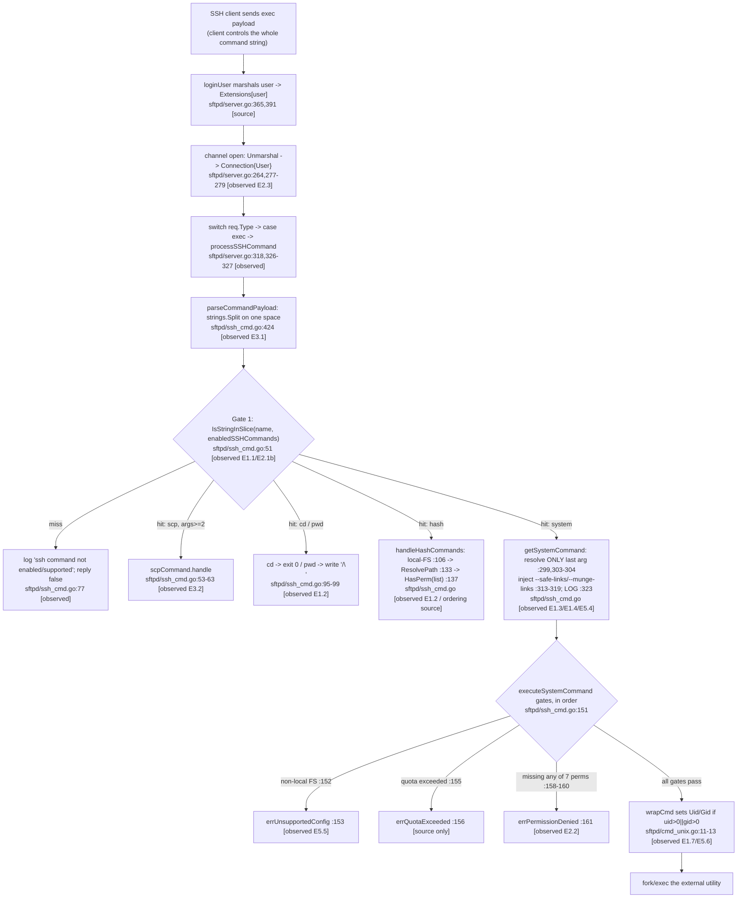

# SFTPGo SSH‑Command Security Model — Evidence‑Backed Behavioral Analysis

This document answers five questions about how SFTPGo behaves, in practice, when
external file‑synchronization utilities (`rsync`, `scp`, `git-*`) are invoked over
SSH, and where/how the server decides what to allow. **Every behavioral claim below
is backed by output captured from an actually‑built, actually‑running instance of the
code in this repository.** Commands are shown verbatim; server log lines are the raw
`zerolog` JSON records emitted to the log file — shown field-for-field as emitted, except
that in a minority of the reproduced records the single leading `time` field is trimmed for
display width (this one elision is disclosed and enumerated in §1.5; no other field is ever
altered); protocol bytes are shown as `od` hex;
client `stdout`/`stderr` and process exit codes are shown unedited.

- **Version under study:** `0.9.5-dev` (the string produced by the canonical build,
  `utils/version.go:3`), repository HEAD `44634210`. Behaviors and advisories that
  apply only to newer SFTPGo releases are **not** attributed to this code.
- **Labeling convention used throughout:**
  - **[observed]** — captured directly from the running server / a real client.
  - **[source]** — read from the source (a static table, an error string, an
    ordering that was read rather than triggered); cited with `file:line`.
  - **[non‑canonical]** — obtained from a deliberately non‑default configuration
    (e.g., the server run as `root`); always called out as such.

---

## 1. Methodology & Environment

### 1.1 Ground rules followed

- The binary was **built first and run first**; the answers were written from what
  the run produced.
- The **default, shipped configuration** was exercised before anything was enabled,
  as an ordinary unprivileged OS user.
- Both the **happy path and the error/edge paths** were driven for each question.
- Every varying result was **repeated** and confirmed stable before being reported.

### 1.2 Environment (recorded verbatim)

Captured with `evidence/env_snapshot.txt`:

```
### TOOL PATHS ###
go       /usr/local/go/bin/go
gcc      /usr/bin/gcc
ssh      /usr/bin/ssh
scp      /usr/bin/scp
rsync    /usr/bin/rsync
git      /usr/bin/git
sqlite3  /usr/bin/sqlite3
curl     /usr/bin/curl
od       /usr/bin/od

### TOOL VERSIONS ###
go version go1.13.15 linux/amd64
gcc (Ubuntu 15.2.0-4ubuntu4) 15.2.0
OpenSSH_10.0p2 Ubuntu-5ubuntu5.4, OpenSSL 3.5.3 16 Sep 2025
rsync  version 3.4.1  protocol version 32
git version 2.51.0
3.46.1 2024-08-13 09:16:08 c9c2ab54ba1f5f46360f1b4f35d849cd3f080e6fc2b6c60e91b16c63f69aalt1 (64-bit)
kernel: Linux 6.6.122+
os: Ubuntu 25.10
```

Two environment facts materially shape several results and are called out where they
matter:

- **OpenSSH 10 `scp` uses the SFTP protocol by default.** A plain `scp` therefore
  never reaches the legacy SCP `exec` path; `scp -O` is required to exercise
  `sftpd/scp.go`. This is demonstrated in §3.3.
- **`rsync` here is 3.4.1.** SFTPGo 0.9.5‑dev prepends a symlink flag
  (`--safe-links`/`--munge-links`) to the server-side `rsync --server`; rsync 3.4.1
  **accepts** that flag and a real `rsync` client completes the transfer with `exit 0`.
  A non-zero `exit 12` appears only when the driving capture starves the command's stdin
  (no `rsync` protocol stream → `written: 0`); both cases are shown and explained in
  §3.5 / §7.6.

A one‑time, **localhost‑scoped** SSH client option was required because OpenSSH 10
disables SHA‑1 `ssh-rsa` by default while SFTPGo 0.9.5‑dev auto‑generates an RSA host
key. It is scoped to `127.0.0.1` only and removed at teardown (see the appendix):

```
# /etc/ssh/ssh_config.d/00-blitzy-legacy-rsa.conf
Host 127.0.0.1
    HostKeyAlgorithms +ssh-rsa
    PubkeyAcceptedAlgorithms +ssh-rsa
```

### 1.3 Canonical build & invocation

```
# Build (canonical), from the repository root:
CGO_ENABLED=1 go build -o /tmp/sftpgo_obs/sftpgo .

# Version produced by that binary:
$ /tmp/sftpgo_obs/sftpgo --version
SFTPGo version: 0.9.5-dev
```

The build emits exactly one warning, from the bundled cgo SQLite driver
(`github.com/mattn/go-sqlite3`):
`sqlite3-binding.c:125801:10: warning: function may return address of local variable [-Wreturn-local-addr]`.
It is a third‑party‑vendored warning and does not affect the SFTPGo packages.

### 1.4 Normal‑user baseline (the primary configuration)

The server is run as a **newly‑created, unprivileged** OS user `sftpobs`
(`uid=1500`), from a working tree under `/tmp` — the repository itself is never
written to. The exact invocation:

```
$ ps -o pid,user,cmd -p "$(cat /tmp/sftpgo_obs/sftpgo.pid)"
    PID USER     CMD
 100629 sftpobs  /tmp/sftpgo_obs/sftpgo serve --config-dir /tmp/sftpgo_obs/conf \
                 --log-file-path /tmp/sftpgo_obs/sftpgo.log --log-verbose
```

The SFTP user driven by the clients is `test`, provisioned through the REST admin API
(`POST http://127.0.0.1:8080/api/v1/user`, HTTP 200). Unless a specific experiment
says otherwise, `test` has `home_dir=/tmp/sftpgo_obs/home`, permissions `{"/":["*"]}`,
and **`uid=0 gid=0`** — the API default when no system id is supplied. As §3.9 shows,
that default is what lets the system commands (`rsync`, `git-*`) actually *execute*
when the server itself is unprivileged.

### 1.5 How evidence was captured

- **Server side:** the file logger is `zerolog.New(lumberjack)` (`logger/logger.go`),
  so `sftpgo.log` contains one JSON object per line
  (`{"level":..,"time":..,"sender":..,"connection_id":..,"message":..}`). Before each
  experiment a unique marker line is appended to the log and the lines emitted after
  it are extracted, isolating that exchange. The colorized console form (used by
  `*ToConsole`) is captured separately from the process's own `stdout`.
- **On the elided `time` field (evidence‑integrity disclosure):** every genuine record
  carries a `time` field — `logger.go` calls `.Timestamp()` unconditionally on every logging
  path (the leveled `Debug`/`Info`/`Warn`/`Error` at `logger/logger.go:100,105,110,115`,
  `TransferLog` at `logger/logger.go:141`, and `CommandLog` at `logger/logger.go:155`), with
  `zerolog.TimeFieldFormat = "2006-01-02T15:04:05.000"` (`logger/logger.go:22,48`). The 65
  timestamped records reproduced throughout this document (e.g. §3.3, §3.5, §4.3, §4.4) show
  that real format inline. For display width, 25 of the 90 reproduced records — those in §2.2,
  §6.3, §6.4, §6.5, §7.3, §7.4, §7.5, §7.6, §7.7 and §7.8 — have this single leading `time`
  field trimmed; every other field (`level`, `sender`, `connection_id`, `message` and any typed
  fields such as `size_bytes`) is verbatim, and no other field is elided anywhere in this document.
- **Client side:** each client's `stdout`+`stderr` is redirected to a file and its
  exit code recorded. Byte‑sensitive results are shown with `od`.
- **Clients used:** the system `ssh`/`scp`/`rsync`/`git` binaries (most canonical),
  plus two small Go programs built against the same module dependencies — `sftpcli`
  (an SFTP/exec client mirroring `sftpd/sftpd_test.go`) and `scpobs` (a raw SCP
  control‑byte observer). Both are reproduced verbatim in the appendix.

---

## 2. Running baseline (before state)

### 2.1 Default configuration facts (code ↔ running server)

The shipped defaults that matter here are established in `config/config.go`:
`BindPort = 2022` (`config/config.go:46`), `IsSCPEnabled = false`
(`config/config.go:58`), `EnabledSSHCommands = GetDefaultSSHCommands()`
(`config/config.go:63`), and the admin API on `127.0.0.1:8080`
(`config/config.go:88-89`). The running server confirms them — extracted from the
`config loaded` debug record (`config/config.go:180`):

```
IsSCPEnabled:false
EnabledSSHCommands:[md5sum sha1sum cd pwd]
```

### 2.2 Listener + host‑key auto‑generation (before → during → after)

On first start with no configured host key, the server logs the auto‑generation and
then registers the listener. Raw JSON, in order:

```json
{"level":"info","sender":"sftpd","connection_id":"","message":"No host keys configured and \"/tmp/sftpgo_obs/conf/id_rsa\" does not exist; creating new private key for server"}
{"level":"info","sender":"sftpd","connection_id":"","message":"Loading private key: /tmp/sftpgo_obs/conf/id_rsa"}
{"level":"info","sender":"sftpd","connection_id":"","message":"server listener registered address: [::]:2022"}
```

File state, before vs after first start:

```
before: /tmp/sftpgo_obs/conf/id_rsa   -> NOT PRESENT
after : -rw------- 1 sftpobs sftpobs 3243 /tmp/sftpgo_obs/conf/id_rsa
```

This is `checkHostKeys` at `sftpd/server.go:417-430`. The listener log is
`sftpd/server.go:187`.

---

## 3. Q1 — External‑utility invocation & the enable/disable model

### 3.1 Direct answer

External utilities are invoked through the SSH **`exec`** request. The per‑session
request loop dispatches `case "exec"` to `processSSHCommand()`
(`sftpd/server.go:326-327`). Inside, the first token of the command string is checked
for **membership in the enabled‑commands allow‑list**
(`utils.IsStringInSlice(name, enabledSSHCommands)`, `sftpd/ssh_cmd.go:51`); if it is
not enabled the request is refused with `ssh command not enabled/supported`
(`sftpd/ssh_cmd.go:77`) and the channel is closed. "Enable/disable" is therefore an
**allow‑list**: the four commands in `enabled_ssh_commands` (plus `scp` when
`enable_scp` is set, or everything when `"*"` is used) are accepted; everything else,
including `rsync`/`scp`/`git-*` under the shipped defaults, is **rejected fail‑closed**.
Enabling a utility is a deliberate configuration change that requires a restart.

### 3.2 The four static command sets [source]

Defined at `sftpd/sftpd.go:66-70`:

- `supportedSSHCommands` = `scp, md5sum, sha1sum, sha256sum, sha384sum, sha512sum,
  cd, pwd, git-receive-pack, git-upload-pack, git-upload-archive, rsync` — the
  universe of names the server will ever accept.
- `defaultSSHCommands` = `md5sum, sha1sum, cd, pwd` — the shipped allow‑list.
- `sshHashCommands` = `md5sum, sha1sum, sha256sum, sha384sum, sha512sum` — handled
  in‑process (no external binary).
- `systemCommands` = `git-receive-pack, git-upload-pack, git-upload-archive, rsync`
  — run as external processes.

`GetDefaultSSHCommands`/`GetSupportedSSHCommands` (`sftpd/sftpd.go:136-147`) return
copies of these.

> **Client‑flag shorthand (nothing under test is elided).** In the transcripts below,
> `$SSHOPTS` stands for the exact, unchanging client flags
> `-p 2022 -i /tmp/sftpgo_obs/keys/id_test -o StrictHostKeyChecking=no -o UserKnownHostsFile=/dev/null -o IdentitiesOnly=yes`
> (`ssh` additionally gets `-n`); `$SCPOPTS` is the same with `-P 2022`. Only this
> fixed connection boilerplate is abbreviated — every command, argument, log line,
> and exit code under test is shown in full. Server records are the raw `sftpgo.log`
> `zerolog` JSON, including the real 64‑hex per‑session `connection_id` (the "run id").

### 3.3 Experiment E1.1 — the default config **rejects** `rsync` and `scp` (fail‑closed) *(stable ×2)*

**`rsync` via the real client** (which itself generates the `rsync --server` command
string — shown in full in the server record below):

```
$ rsync -e "ssh -n -p 2022 -i id_test -o StrictHostKeyChecking=no \
   -o UserKnownHostsFile=/dev/null -o IdentitiesOnly=yes" \
   /tmp/sftpgo_obs/home/sample.txt test@127.0.0.1:/dest.txt
Warning: Permanently added '[127.0.0.1]:2022' (RSA) to the list of known hosts.
exec request failed on channel 0
rsync: connection unexpectedly closed (0 bytes received so far) [sender]
rsync error: unexplained error (code 255) at io.c(232) [sender=3.4.1]
rsync-exit=255
```

Server, raw JSON (identical on both runs; connection ids differ):

```json
{"level":"debug","time":"2026-07-13T19:07:50.520","sender":"ssh","connection_id":"f56fff0db2d974f9ffed18206d51d1a9870b7f24783cdb5f6e8a49e38a72094b","message":"new ssh command: \"rsync\" args: [--server -e.LsfxCIvu . /dest.txt] user: test, error: <nil>"}
{"level":"info","time":"2026-07-13T19:07:50.520","sender":"ssh","connection_id":"f56fff0db2d974f9ffed18206d51d1a9870b7f24783cdb5f6e8a49e38a72094b","message":"ssh command not enabled/supported: \"rsync\""}
```

The `new ssh command` line is `sftpd/ssh_cmd.go:49-50`; the rejection is the
allow‑list gate failing at `sftpd/ssh_cmd.go:51` → `sftpd/ssh_cmd.go:77`. Note the
full argument vector is logged (`--server -e.LsfxCIvu . /dest.txt`) — nothing is
elided.

**`scp` — an important nuance first.** With OpenSSH 10 a *plain* `scp` uses the SFTP
subsystem, so it **bypasses the exec allow‑list entirely** and (because `test` may
write) succeeds via SFTP:

```
$ scp $SCPOPTS /tmp/sftpgo_obs/home/sample.txt test@127.0.0.1:/dest.txt
Warning: Permanently added '[127.0.0.1]:2022' (RSA) to the list of known hosts.
scp-exit=0                      # file arrived via SFTP; NO "new ssh command" logged
```

To exercise the **legacy SCP protocol** that `enable_scp`/the allow‑list actually
gate, force it with `scp -O`:

```
$ scp -O $SCPOPTS /tmp/sftpgo_obs/home/sample.txt test@127.0.0.1:/dest.txt
Warning: Permanently added '[127.0.0.1]:2022' (RSA) to the list of known hosts.
exec request failed on channel 0
lost connection
scp-exit=1
```

Server, raw JSON (stable ×2):

```json
{"level":"debug","time":"2026-07-13T19:08:28.493","sender":"ssh","connection_id":"92e9e9eed24500e7a99bdeb4143ee30af35b17ab346b0e6f3caaa564fcd26245","message":"new ssh command: \"scp\" args: [-t /dest.txt] user: test, error: <nil>"}
{"level":"info","time":"2026-07-13T19:08:28.493","sender":"ssh","connection_id":"92e9e9eed24500e7a99bdeb4143ee30af35b17ab346b0e6f3caaa564fcd26245","message":"ssh command not enabled/supported: \"scp\""}
```

**Cause → effect:** the first payload token (`rsync`, `scp`) is not in
`[md5sum sha1sum cd pwd]`, so `IsStringInSlice` returns false and the server refuses
the exec before any argument is interpreted.

### 3.4 Experiment E1.2 — the default‑enabled built‑ins **work**

`md5sum` and `sha1sum` (hash commands, handled in‑process) return values that match
local references exactly:

```
$ ssh $SSHOPTS test@127.0.0.1 "md5sum /sample.txt"
ef037bae4409c8a5c19797c90a670241  /sample.txt      (exit=0)
$ md5sum /tmp/sftpgo_obs/home/sample.txt
ef037bae4409c8a5c19797c90a670241  /tmp/sftpgo_obs/home/sample.txt   (local reference — matches)

$ ssh $SSHOPTS test@127.0.0.1 "sha1sum /sample.txt"
3ef538f704a0cc08146d05b8ee7010002a0f0a8c  /sample.txt   (exit=0)
$ sha1sum /tmp/sftpgo_obs/home/sample.txt
3ef538f704a0cc08146d05b8ee7010002a0f0a8c  /tmp/sftpgo_obs/home/sample.txt   (local reference — matches)
```

The `info` record for an accepted command is the structured `SSHCommand` line:

```json
{"level":"info","time":"2026-07-13T19:08:44.442","sender":"SSHCommand","username":"test","file_path":"/sample.txt","target_path":"","filemode":"","uid":-1,"gid":-1,"access_time":"","modification_time":"","ssh_command":"md5sum /sample.txt","connection_id":"a549cd41aa295392d218dcf83f976ddf3b9817a5a05debb0c8b16705371b2ebc","protocol":"SSH"}
```

`cd` and `pwd` are the two "navigation" built‑ins. `cd` produces **zero** bytes of
`stdout` and exits 0 (`sftpd/ssh_cmd.go:95-96`); `pwd` writes exactly `"/\n"`
(`sftpd/ssh_cmd.go:99`), confirmed byte‑exact:

```
$ ssh $SSHOPTS test@127.0.0.1 "cd"   > cd.bin ; wc -c < cd.bin
0                                             (cd-exit=0)

$ ssh $SSHOPTS test@127.0.0.1 "pwd"  > pwd.bin
$ od -An -tx1 pwd.bin
 2f 0a                                        # '/' '\n'  — exactly 2 bytes, pwd-exit=0
```

Raw server records for the two navigation built‑ins:

```json
{"level":"debug","time":"2026-07-13T19:09:14.804","sender":"ssh","connection_id":"00b2bc1135002975b32378e67f3b5d8c31084888be4727d5b77627fc3fadcb39","message":"new ssh command: \"cd\" args: [] user: test, error: <nil>"}
{"level":"debug","time":"2026-07-13T19:09:02.174","sender":"ssh","connection_id":"1a0744e0021bda3677910baeb6f5a827ee8d16ca657d0ff0035e0d79e2f83233","message":"new ssh command: \"pwd\" args: [] user: test, error: <nil>"}
```

### 3.5 Experiment E1.3 — enabling `rsync`+`scp`+`git-*` is a deliberate reconfiguration

Setting (in the temp config only — the repo `sftpgo.json` is untouched)
`enable_scp=true` and
`enabled_ssh_commands=[md5sum,sha1sum,cd,pwd,rsync,git-receive-pack,git-upload-pack,git-upload-archive]`
and restarting yields the loaded configuration:

```
IsSCPEnabled:true
EnabledSSHCommands:[md5sum sha1sum cd pwd rsync git-receive-pack git-upload-pack git-upload-archive]
```

`rsync` is now **accepted** and the server builds the system command. The raw
`new system command` record is decisive for two later questions (Q4/Q5):

```json
{"level":"debug","time":"2026-07-13T19:13:54.457","sender":"ssh","connection_id":"9daf62b6fc24981da87a3a995fd0cf3e84db1079c42abeac01cf249999ecc2f1","message":"new ssh command: \"rsync\" args: [--server -vlogDtpre.iLsfxCIvu . /rsync-dest.txt] user: test, error: <nil>"}
{"level":"debug","time":"2026-07-13T19:13:54.458","sender":"ssh","connection_id":"9daf62b6fc24981da87a3a995fd0cf3e84db1079c42abeac01cf249999ecc2f1","message":"new system command \"rsync\", with args: [--safe-links --server -vlogDtpre.iLsfxCIvu . /tmp/sftpgo_obs/home/rsync-dest.txt] path: /tmp/sftpgo_obs/home/rsync-dest.txt"}
```

Two things are visible and important:

1. **Only the *last* argument is rewritten** to the resolved absolute path
   (`/rsync-dest.txt` → `/tmp/sftpgo_obs/home/rsync-dest.txt`). The non‑final,
   client‑controlled arguments (`--server -vlogDtpre.iLsfxCIvu .`) pass through
   **unchanged**. This is exactly `sftpd/ssh_cmd.go:298-305` (`args = args[:len-1]`
   then append the resolved path).
2. **`--safe-links` is *prepended*** because `test` holds the create‑symlinks
   permission (`sftpd/ssh_cmd.go:313-315`); the alternative `--munge-links` branch is
   shown in §7.6.

**Actual execution outcome — the exit code is decided by stdin delivery, not by `--safe-links` or the rsync version (honest, [observed]).** `rsync` is **accepted, argument-rewritten (final token only), and dispatched**, and the security-relevant behavior (allow-listing, last-arg path resolution, symlink-flag injection) is fully observable. Whether the *transfer* then completes depends on exactly one thing: whether the client delivers an `rsync` protocol stream on the command's stdin. It does **not** depend on the injected `--safe-links` flag, and rsync 3.4.1 does **not** reject that flag.

The proof is a single-variable A/B run — the same real `rsync -av` client, the same server, the same `test` user (holding `create_symlinks`, so `--safe-links` is injected), changing **only** the SSH transport between `ssh` and `ssh -n`. This re-verification was run in a dedicated scaffolding directory (`/tmp/sftpgo_obs_fix1`); both outcomes were confirmed stable ×2.

**A — normal transport (`rsync -av -e "ssh …"`): the transfer completes, client `exit 0`, and the file arrives.** Client output:

```
sending incremental file list
sample.txt

sent 136 bytes  received 35 bytes  342.00 bytes/sec
total size is 21  speedup is 0.12
```

Server log — note the **identical** `--safe-links` server-side command and, decisively, `written: 176` (a real protocol stream reached the child):

```json
{"level":"debug","time":"2026-07-14T07:37:58.574","sender":"ssh","connection_id":"b5c33778b1afb37b834013ee88999659a26c8ec2591905ae6c396097c09a9e3f","message":"new system command \"rsync\", with args: [--safe-links --server -vlogDtpre.iLsfxCIvu . /tmp/sftpgo_obs_fix1/home/rsync-dest.txt] path: /tmp/sftpgo_obs_fix1/home/rsync-dest.txt"}
{"level":"debug","time":"2026-07-14T07:37:58.599","sender":"ssh","connection_id":"b5c33778b1afb37b834013ee88999659a26c8ec2591905ae6c396097c09a9e3f","message":"command: \"rsync --server -vlogDtpre.iLsfxCIvu . /rsync-dest.txt\", copy from remote command to sdtin ended, written: 176, initial remaining quota: 0, err: <nil>"}
```

The destination arrives byte-identical to the source (md5 match, client `exit 0`):

```
ef037bae4409c8a5c19797c90a670241  /tmp/sftpgo_obs_fix1/home/rsync-dest.txt
ef037bae4409c8a5c19797c90a670241  /tmp/sftpgo_obs_fix1/home/sample.txt
```

**B — stdin-starved transport (`rsync -av -e "ssh -n …"`): `written: 0` → `exit status 12`.** The only change is `-n`, which points ssh's stdin at `/dev/null`, so the client's `rsync` protocol never reaches the server-side `rsync --server`. The server builds the **same** `--safe-links` command, but the child reads EOF and exits 12. This is the case that produced the original E1.3 capture:

```json
{"level":"debug","time":"2026-07-13T19:13:54.458","sender":"ssh","connection_id":"9daf62b6fc24981da87a3a995fd0cf3e84db1079c42abeac01cf249999ecc2f1","message":"command: \"rsync --server -vlogDtpre.iLsfxCIvu . /rsync-dest.txt\", copy from remote command to sdtin ended, written: 0, initial remaining quota: 0, err: <nil>"}
{"level":"debug","time":"2026-07-13T19:13:54.560","sender":"ssh","connection_id":"9daf62b6fc24981da87a3a995fd0cf3e84db1079c42abeac01cf249999ecc2f1","message":"command: \"rsync --server -vlogDtpre.iLsfxCIvu . /rsync-dest.txt\", copy from sdterr to remote command ended, written: 164 err: <nil>"}
{"level":"warn","time":"2026-07-13T19:13:54.560","sender":"ssh","connection_id":"9daf62b6fc24981da87a3a995fd0cf3e84db1079c42abeac01cf249999ecc2f1","message":"command failed: \"rsync\" args: [--server -vlogDtpre.iLsfxCIvu . /rsync-dest.txt] user: test err: exit status 12"}
```
```
client: rsync error: error in rsync protocol data stream (code 12) at io.c(232) [sender=3.4.1]   (rsync-exit=12)
```

The tell is `written: 0` on stdin: the child received **zero** protocol bytes, so it prints "connection unexpectedly closed (0 bytes received so far)" and exits 12 at `io.c(232)` (the 164-byte stderr relay is that very message travelling back). Re-running with `ssh -n` reproduces this on demand (stable ×2) — the exit is an artifact of stdin starvation, not of `--safe-links`.

**Conclusion (corrected [observed]).** Under this modern toolchain `rsync` is accepted, argument-rewritten (final token only), and dispatched, and the security-relevant behavior (allow-listing, last-arg path resolution, symlink-flag injection) is fully observable. The transfer's exit code is governed **solely by whether the client delivers its `rsync` protocol stream on stdin** — `exit 0` with a normal transport (`written: 176`, file arrives byte-identical), `exit 12` when stdin is starved (`written: 0`) — **not** by rsync 3.4.1 "rejecting" the injected `--safe-links` flag and **not** by any 2020-SFTPGo ↔ 2024-rsync version interaction. A real `rsync` client completing successfully against this server is corroborated independently in §4.5 (E2.3, `written: 150`, destination md5 == source) and §7.6 (both the `--safe-links` and `--munge-links` argument vectors). None of this is an authorization outcome.

**A necessary correction on the word "sanitization" [observed].** An earlier phrasing of
this section called `rsync` "sanitized"; that word is too strong and is corrected here. As
the "unchanged" observation just above shows (`sftpd/ssh_cmd.go:298-305`), SFTPGo rewrites
**only the final argument** to the resolved absolute path and prepends exactly one symlink
flag (`--safe-links`/`--munge-links`). **Every other client-controlled argument is passed
verbatim** to `exec.Command` (`sftpd/ssh_cmd.go:324`). In version 0.9.5-dev there is **no
allow-list of `rsync` options and no format validation of the non-final arguments**. So the
only things "sanitized" are the trailing path token and the one injected flag — the option
string as a whole is **not**. That gap is not academic: it produces a real, observable
escape, demonstrated next.

### 3.5.1 Experiment E1.3a — a non-final `rsync` option escapes the home directory (CVE-2025-24366) *(stable ×3)* [observed]

**Direct answer.** With `rsync` enabled, an authenticated user can write a file **outside**
their home directory by supplying a *non-final* `rsync` option that names an absolute path —
here `--log-file=<path outside home>`. Because SFTPGo rewrites only the trailing path token,
the `--log-file` option reaches the real `rsync` process unchanged; `rsync` opens that log
file during early initialization (before the transfer protocol even begins) and creates it
on disk **as the SFTPGo server's uid/gid**. This is the behavior later assigned
**CVE-2025-24366** / **GHSA-vj7w-3m8c-6vpx** (advisory note at the end of this subsection).

**Prerequisites (non-default).** This is *not* reachable in the shipped configuration:
`rsync` is absent from the default `enabled_ssh_commands` `[md5sum sha1sum cd pwd]` and is
rejected outright — see §3.3, which captures the `"ssh command not enabled/supported"`
log for `rsync` under the default config. The experiment below therefore uses the
deliberately reconfigured allow-list from §3.5 (rsync enabled). A valid authenticated user
and the local-filesystem backend are also required — system commands are gated to
`IsLocalOsFs` (`sftpd/ssh_cmd.go:152`).

**Command driven through the real SSH `exec` entry point:**

```
$ sftpcli exec 'rsync --server --log-file=/tmp/sftpgo_obs/outside/pwned_run1.txt -vlogDtpre.iLsfxCIvu . /dest.txt'
```

**Constructed system command the server actually ran (raw `debug` log records, run 1 then run 2):**

```
{"level":"debug","time":"2026-07-14T04:02:19.826","sender":"ssh","connection_id":"9c19cac390d24020940c0687c7c4c11afd52e398d104035709d1cc1eae2aefc1","message":"new system command \"rsync\", with args: [--safe-links --server --log-file=/tmp/sftpgo_obs/outside/pwned_run1.txt -vlogDtpre.iLsfxCIvu . /tmp/sftpgo_obs/home/dest.txt] path: /tmp/sftpgo_obs/home/dest.txt"}
{"level":"debug","time":"2026-07-14T04:02:33.635","sender":"ssh","connection_id":"5bf7d7757a99ef51a46adf054cfc7fcd4c4916521904f48f96c6fb67a1c5f4e8","message":"new system command \"rsync\", with args: [--safe-links --server --log-file=/tmp/sftpgo_obs/outside/pwned_run2.txt -vlogDtpre.iLsfxCIvu . /tmp/sftpgo_obs/home/dest.txt] path: /tmp/sftpgo_obs/home/dest.txt"}
```

Note precisely what was and was not rewritten: the **last** token `/dest.txt` became the
resolved in-home path `/tmp/sftpgo_obs/home/dest.txt`, while the non-final
`--log-file=/tmp/sftpgo_obs/outside/pwned_runN.txt` — an absolute path pointing **outside**
the home — passed through **unchanged**. `--safe-links` was prepended because `test` holds
the create-symlinks permission (§3.5), but `--safe-links` governs symlink handling only; it
does nothing to constrain `--log-file`.

**Client-visible result (run 3, complete captured bytes):**

```
CLIENT_EXEC_OUTPUT(168 bytes): " \x00\x00\x00rsync: connection unexpectedly closed (0 bytes received so far) [Receiver]\nrsync error: error in rsync protocol data stream (code 12) at io.c(232) [Receiver=3.4.1]\n"
CLIENT_EXEC_ERROR: wait: remote command exited without exit status or exit signal
```

**Filesystem effect — the escape (`stat` of the created artifacts, all three runs):**

```
/tmp/sftpgo_obs/outside/pwned_run1.txt owner=sftpobs:sftpobs size=222   LOCATION: OUTSIDE home (ESCAPE CONFIRMED)
/tmp/sftpgo_obs/outside/pwned_run2.txt owner=sftpobs:sftpobs size=222   LOCATION: OUTSIDE home (ESCAPE CONFIRMED)
/tmp/sftpgo_obs/outside/pwned_run3.txt owner=sftpobs:sftpobs size=222   LOCATION: OUTSIDE home (ESCAPE CONFIRMED)
```

Each file is created **outside** the user's home (`/tmp/sftpgo_obs/home`), directly under
`/tmp/sftpgo_obs/outside`, owned by the SFTPGo server account `sftpobs` (uid 1500) — i.e. a
write with the **server process's** permissions to a path the user was never authorized to
touch. That is exactly the "read or write files with the permissions of the SFTPGo server
process" outcome the advisory describes.

**Crucial timing detail [observed].** The transfer itself exits 12 (a stdin‑starvation
artifact — the driving capture delivered no `rsync` protocol stream on the command's stdin,
so the server‑side `rsync --server` read EOF; see §3.5 **B**), yet **the escape still succeeds**: `rsync`
opens `--log-file` during early initialization, *before* the protocol handshake fails, so
the non-zero exit is irrelevant to the write — the side-effecting option has already fired.
This timing was confirmed independently against `rsync` 3.4.1 run standalone: `--log-file`
creates its target regardless of the eventual exit code.

**Stability.** The experiment was run three times with the same unchanged input. All three
runs created the outside-home artifact as `sftpobs:1500` at 222 bytes; after stripping the
per-line timestamp and PID that `rsync` writes into its own log, all three artifacts are
byte-identical (content sha256 `56733e68c18c8275298699301f6ebbe4471a8c0f25709ed532e731df2a386c2e`
for runs 1, 2, and 3). The full-file sha256 differs per run only because of that embedded
timestamp/PID (run 1 `4c8bbf22…`, run 2 `6ba75582…`, run 3 `4f9f8ae0…`).

**Root cause (`file:line`).** `getSystemCommand` copies **all** client args
(`sftpd/ssh_cmd.go:293-294`), resolves and rewrites **only the last** one
(`sftpd/ssh_cmd.go:298-305`), optionally prepends a single symlink flag
(`sftpd/ssh_cmd.go:306-322`), then runs `exec.Command(c.command, args...)` with every
remaining client-supplied option intact (`sftpd/ssh_cmd.go:324`). No option allow-list or
non-final-argument validation exists in this version. `--log-file` is only the simplest
demonstrator; any `rsync` option whose effect is a filesystem side effect keyed on a
client-supplied absolute path is equally unconstrained here.

**Advisory applicability [researched — scoped to this version].** This behavior corresponds
to **CVE-2025-24366** (GitHub advisory **GHSA-vj7w-3m8c-6vpx**, "SFTPGo has insufficient
sanitization of user provided rsync command", CWE-78, CVSS 3.1 base 7.5 High,
`AV:N/AC:H/PR:L/UI:N/S:U/C:H/I:H/A:H`), which the advisory database records as affecting
SFTPGo **from 0.9.5 through 2.6.4** — a range that **includes this repository's 0.9.5-dev**.
The upstream fix landed in **v2.6.5** ("rsync: enforce a supported format and limit the
allowed options"), which validates client-provided arguments and restricts the permitted
options to a safe subset; a later release removed external `rsync` support altogether. None
of those fixes are present in 0.9.5-dev. (Advisory metadata is sourced from public
vulnerability databases; the *behavior* above is directly observed in this codebase and is
labeled `[observed]`, while the version-range and fix metadata are labeled `[researched]`.)

> **⚠ Security warning.** Do **not** enable `rsync` (or the other external system commands)
> in SFTPGo 0.9.5-dev on any host where users are not fully trusted. As demonstrated, an
> authenticated user can write outside their home directory with the server process's
> privileges, because non-final `rsync` options are not validated in this version. If the
> functionality is required, upgrade to a release that contains the CVE-2025-24366 fix
> (v2.6.5+), or run the server under a tightly confined, least-privilege account on an
> isolated filesystem.

### 3.6 Experiment E1.4 — the three `git-*` system commands execute end‑to‑end

Unlike modern rsync, real `git` completes successfully through SFTPGo. A bare repo
`/repo.git` (resolving to `/tmp/sftpgo_obs/home/repo.git`) was used. The `git` client
was pointed at the server with
`GIT_SSH_COMMAND="ssh -p 2022 -i /tmp/sftpgo_obs/keys/id_test -o StrictHostKeyChecking=no -o UserKnownHostsFile=/dev/null -o IdentitiesOnly=yes"`.

**`git push` → `git-receive-pack`:**

```
$ git push ssh://test@127.0.0.1:2022/repo.git master:master
To ssh://127.0.0.1:2022/repo.git
 * [new branch]      master -> master           (git-push-exit=0)
```
```json
{"level":"debug","time":"2026-07-13T19:15:38.442","sender":"ssh","connection_id":"33c08839075f2609ceaeda0c906251fed531a2963687831d21cde5f2f49b9410","message":"new ssh command: \"git-receive-pack\" args: ['/repo.git'] user: test, error: <nil>"}
{"level":"debug","time":"2026-07-13T19:15:38.442","sender":"ssh","connection_id":"33c08839075f2609ceaeda0c906251fed531a2963687831d21cde5f2f49b9410","message":"new system command \"git-receive-pack\", with args: [/tmp/sftpgo_obs/home/repo.git] path: /tmp/sftpgo_obs/home/repo.git"}
{"level":"info","time":"2026-07-13T19:15:38.455","sender":"SSHCommand","username":"test","file_path":"/repo.git","target_path":"","filemode":"","uid":-1,"gid":-1,"access_time":"","modification_time":"","ssh_command":"git-receive-pack '/repo.git'","connection_id":"33c08839075f2609ceaeda0c906251fed531a2963687831d21cde5f2f49b9410","protocol":"SSH"}
```

**`git clone` → `git-upload-pack`** (cloned file content verified):

```
$ git clone ssh://test@127.0.0.1:2022/repo.git clone1   → git-clone-exit=0
$ cat clone1/file1.txt
line one
line two
```
```json
{"level":"debug","time":"2026-07-13T19:15:54.239","sender":"ssh","connection_id":"ec47c56a45957fd8d60cea74706fec0745417c27ef96ffc004c7a1958de7b47f","message":"new ssh command: \"git-upload-pack\" args: ['/repo.git'] user: test, error: <nil>"}
{"level":"debug","time":"2026-07-13T19:15:54.239","sender":"ssh","connection_id":"ec47c56a45957fd8d60cea74706fec0745417c27ef96ffc004c7a1958de7b47f","message":"new system command \"git-upload-pack\", with args: [/tmp/sftpgo_obs/home/repo.git] path: /tmp/sftpgo_obs/home/repo.git"}
{"level":"info","time":"2026-07-13T19:15:54.245","sender":"SSHCommand","username":"test","file_path":"/repo.git","target_path":"","filemode":"","uid":-1,"gid":-1,"access_time":"","modification_time":"","ssh_command":"git-upload-pack '/repo.git'","connection_id":"ec47c56a45957fd8d60cea74706fec0745417c27ef96ffc004c7a1958de7b47f","protocol":"SSH"}
```

**`git archive --remote` → `git-upload-archive`** (produced a valid tar):

```
$ git archive --remote=ssh://test@127.0.0.1:2022/repo.git --format=tar HEAD > a.tar  → exit 0
$ tar tvf a.tar
-rw-rw-r-- root/root        18 2026-07-13 19:15 file1.txt
```
```json
{"level":"debug","time":"2026-07-13T19:15:54.489","sender":"ssh","connection_id":"dc45d972b5839df11110ac8e772e5de850a1106ef7c2c6f34ebdd43575976493","message":"new ssh command: \"git-upload-archive\" args: ['/repo.git'] user: test, error: <nil>"}
{"level":"debug","time":"2026-07-13T19:15:54.489","sender":"ssh","connection_id":"dc45d972b5839df11110ac8e772e5de850a1106ef7c2c6f34ebdd43575976493","message":"new system command \"git-upload-archive\", with args: [/tmp/sftpgo_obs/home/repo.git] path: /tmp/sftpgo_obs/home/repo.git"}
{"level":"info","time":"2026-07-13T19:15:54.492","sender":"SSHCommand","username":"test","file_path":"/repo.git","target_path":"","filemode":"","uid":-1,"gid":-1,"access_time":"","modification_time":"","ssh_command":"git-upload-archive '/repo.git'","connection_id":"dc45d972b5839df11110ac8e772e5de850a1106ef7c2c6f34ebdd43575976493","protocol":"SSH"}
```

All three are routed as `systemCommands` (`sftpd/sftpd.go:70`), pass the allow‑list,
have only their last argument resolved, and are executed by `getSystemCommand` +
`executeSystemCommand` (`sftpd/ssh_cmd.go:288-331` and `sftpd/ssh_cmd.go:151`).

### 3.7 Experiment E1.5 — the `"*"` wildcard

With `enabled_ssh_commands=["*"]` in the JSON, the loaded slice logs as:

```
IsSCPEnabled:false
EnabledSSHCommands:[* sha1sum cd pwd]
```

(The extra elements are a viper/mapstructure slice‑overlay artifact — the single
`"*"` overlays the first default element while the remaining defaults persist. The
config file genuinely contains only `["*"]`.) Because `"*"` is present,
`checkSSHCommands` replaces the entire list with `GetSupportedSSHCommands()` and
returns immediately (`sftpd/server.go:397-399`). Proven **behaviorally**:

```
# sha256sum is SUPPORTED but NOT in the default set → now works:
$ ssh $SSHOPTS test@127.0.0.1 "sha256sum /sample.txt"
e1fca835fb130f080c5fcc5e0afb2635824675d83b59caa8d4575965be22e585  /sample.txt   (exit=0)
$ sha256sum /tmp/sftpgo_obs/home/sample.txt
e1fca835fb130f080c5fcc5e0afb2635824675d83b59caa8d4575965be22e585  /tmp/sftpgo_obs/home/sample.txt   (local reference — matches)

# scp -O now reaches the SCP handshake and uploads, even though enable_scp=false
# (so "*" alone enabled scp):
$ scp -O $SCPOPTS /tmp/sftpgo_obs/home/sample.txt test@127.0.0.1:/star-scp.txt   → scp-exit=0 ; star-scp.txt arrived

# a name that is NOT supported is still rejected under "*":
$ ssh $SSHOPTS test@127.0.0.1 "foobar /sample.txt"
exec request failed on channel 0                        (exit=255)
```

Raw server records for the two decisive lines (acceptance of a newly‑enabled
supported command; continued rejection of an unsupported name):

```json
{"level":"debug","time":"2026-07-13T19:16:38.576","sender":"ssh","connection_id":"29e4b6899c2d3985d61620876fd25819c45bc31cb1bd665f80eabb15a6668f61","message":"new ssh command: \"sha256sum\" args: [/sample.txt] user: test, error: <nil>"}
{"level":"info","time":"2026-07-13T19:16:38.790","sender":"ssh","connection_id":"a2d639fcc0f581d7747f145a28722245fd3e3fc0396933ff0a293b857e4458b5","message":"ssh command not enabled/supported: \"foobar\""}
```

So `"*"` means "all `supportedSSHCommands`", **not** "anything the client asks".

### 3.8 Experiment E1.6 — unsupported‑command normalization at startup

With `enabled_ssh_commands=[md5sum,boguscmd,cd,pwd]`, the loaded slice is
`[md5sum boguscmd cd pwd]` and `checkSSHCommands` filters the unknown entry, emitting
the warning to **both** the log and the console (`sftpd/server.go:409-410`):

```json
{"level":"warn","time":"2026-07-13T19:17:48.394","sender":"sftpd","connection_id":"","message":"unsupported ssh command: \"boguscmd\" ignored"}
```
```
# console (serve.stdout), colorized ConsoleWriter:
2026-07-13T19:17:48.394 WRN unsupported ssh command: "boguscmd" ignored
```

At runtime `md5sum` works and `boguscmd`, having been filtered out of the effective
allow‑list, is rejected with the same gate message:

```
$ ssh $SSHOPTS test@127.0.0.1 "md5sum /sample.txt"   → ef037bae4409c8a5c19797c90a670241  /sample.txt (exit=0)
$ ssh $SSHOPTS test@127.0.0.1 "boguscmd /sample.txt" → exec request failed on channel 0 (exit=255)
```

Raw server record for the runtime rejection (same gate, `sftpd/ssh_cmd.go:77`):

```json
{"level":"info","time":"2026-07-13T19:17:49.256","sender":"ssh","connection_id":"aca1353366ae2774b50e35075d74afe5265ee673bcaf7ae53479186242fe0426","message":"ssh command not enabled/supported: \"boguscmd\""}
```

### 3.9 Experiment E1.7 — the UID/GID execution model (`wrapCmd`)

System commands are run through `wrapCmd` (`sftpd/cmd_unix.go`), which sets the child
process credential **only when** the mapped user's id is non‑zero:

```go
func wrapCmd(cmd *exec.Cmd, uid, gid int) *exec.Cmd {
    if uid > 0 || gid > 0 {
        cmd.SysProcAttr = &syscall.SysProcAttr{}
        cmd.SysProcAttr.Credential = &syscall.Credential{Uid: uint32(uid), Gid: uint32(gid)}
    }
    return cmd
}
```

This produces three distinct, **observed** outcomes:

- **`test` at `uid=0 gid=0` (API default), server unprivileged** → no credential is
  set, so the child inherits the server's own uid (`sftpobs`) and the commands *do*
  execute (this is how the `git-*` runs in §3.6 succeeded). **[observed, canonical]**
- **`test` at `uid=1500 gid=1500`, server unprivileged** → `wrapCmd` tries to
  `setuid/setgid`, which requires privilege the server lacks, so the fork fails
  *after* the command is fully built and logged:

```json
{"level":"debug","time":"2026-07-13T19:11:53.870","sender":"ssh","connection_id":"e725631d1588b8956f725a079feb5d7fbd7876e22d5ec81fb5d25329b5dee896","message":"new system command \"rsync\", with args: [--safe-links --server -vlogDtpre.iLsfxCIvu . /tmp/sftpgo_obs/home/rsync-dest.txt] path: /tmp/sftpgo_obs/home/rsync-dest.txt"}
{"level":"warn","time":"2026-07-13T19:11:53.871","sender":"ssh","connection_id":"e725631d1588b8956f725a079feb5d7fbd7876e22d5ec81fb5d25329b5dee896","message":"command failed: \"rsync\" args: [--server -vlogDtpre.iLsfxCIvu . /rsync-dest.txt] user: test err: fork/exec /usr/bin/rsync: operation not permitted"}
```
  **[observed]** — note the command is built and the symlink flag injected *before*
  the exec is even attempted.
- **Privilege‑drop success** (server run as `root`, `test` mapped to a real
  unprivileged id) is the intended production behavior; it is a deliberately
  non‑default configuration and is presented, labeled **[non‑canonical]**, in §7 (Q5).

`wrapCmd` on Windows is a no‑op (`sftpd/cmd_windows.go`).

---

## 4. Q2 — The boundary between client control and server decision

### 4.1 Direct answer

The client controls the **entire** command string (the command name and every
argument) that arrives on the SSH `exec` channel. The server makes the acceptability
decision at **two independent, server‑side gates, in this fixed order**:

- **Gate 1 — allow‑list membership.** `processSSHCommand` tokenizes the payload and
  tests the command *name* against the configured set:
  `utils.IsStringInSlice(name, enabledSSHCommands)` (`sftpd/ssh_cmd.go:51`). If the
  name is not in `enabled_ssh_commands`, the request is refused immediately —
  `ssh command not enabled/supported` (`sftpd/ssh_cmd.go:77`) — **before any argument
  is interpreted and before any permission is consulted**.
- **Gate 2 — the per‑user permission map.** Only if Gate 1 passes and the command is a
  *system* command (`rsync`, `git-receive-pack`, `git-upload-pack`,
  `git-upload-archive`) does the server require the user to hold **all seven** of
  `[download, upload, create_dirs, list, overwrite, delete, rename]` for the
  destination path (`sftpd/ssh_cmd.go:158-161`); a single missing permission yields
  `errPermissionDenied` (`sftpd/ssh_cmd.go:30,161`). Hash commands take a lighter gate
  — `PermListItems` only (`sftpd/ssh_cmd.go:137`).

Two facts about *where* the boundary sits, both observed below and each with a citation:

1. **The system command is fully built — destination path resolved to an absolute OS
   path and, for `rsync`, the `--safe-links`/`--munge-links` flag injected — and logged
   at `sftpd/ssh_cmd.go:323`, *before* Gate 2 runs at `sftpd/ssh_cmd.go:160`.** The
   server decides *what to run* before it decides *whether the user may run it*
   (build‑then‑deny). No child process is forked on denial, but the resolved command
   already exists in the log.
2. **`HasPerms`/`HasPerm` short‑circuit to “allow” if the resolved permission set
   contains `PermAny` (`"*"`)** (`dataprovider/user.go:170-172` and `:159-165`). The
   canonical baseline user (`{"/":["*"]}`) therefore passes Gate 2 unconditionally; to
   observe a *denial* the user must be given an explicit permission list that omits the
   permission under test and does **not** contain `"*"`.

### 4.2 The two gates in code [source]

`processSSHCommand` — Gate 1 (`sftpd/ssh_cmd.go:45-81`, excerpted):

```go
name, args, err := parseCommandPayload(msg.Command)
connection.Log(logger.LevelDebug, logSenderSSH, "new ssh command: %#v args: %v user: %v, error: %v",
    name, args, connection.User.Username, err)
if err == nil && utils.IsStringInSlice(name, enabledSSHCommands) {   // <-- Gate 1  (:51)
    // accepted: route to scpCommand.handle() (scp) or sshCommand.handle() (:52-75)
} else {
    connection.Log(logger.LevelInfo, logSenderSSH, "ssh command not enabled/supported: %#v", name)  // (:77)
}
```

`handle()` routing — build (hash vs system) then execute (`sftpd/ssh_cmd.go:83-103`,
excerpted):

```go
if utils.IsStringInSlice(c.command, sshHashCommands) {
    return c.handleHashCommands()                       // hash: Gate 2 = PermListItems (:137)
} else if utils.IsStringInSlice(c.command, systemCommands) {
    command, err := c.getSystemCommand()                // BUILDS + logs at :323
    if err != nil {
        return c.sendErrorResponse(err)
    }
    return c.executeSystemCommand(command)              // Gate 2 (seven perms) at :160
}
```

`executeSystemCommand` — Gate 2 for system commands (`sftpd/ssh_cmd.go:151-161`):

```go
func (c *sshCommand) executeSystemCommand(command systemCommand) error {
    if !vfs.IsLocalOsFs(c.connection.fs) {              // local‑FS gate (:152) — see Q5
        return c.sendErrorResponse(errUnsupportedConfig)
    }
    if c.connection.User.QuotaFiles > 0 && c.connection.User.UsedQuotaFiles > c.connection.User.QuotaFiles {
        return c.sendErrorResponse(errQuotaExceeded)    // quota gate (:155-156)
    }
    perms := []string{dataprovider.PermDownload, dataprovider.PermUpload, dataprovider.PermCreateDirs, dataprovider.PermListItems,
        dataprovider.PermOverwrite, dataprovider.PermDelete, dataprovider.PermRename}   // seven perms (:158-159)
    if !c.connection.User.HasPerms(perms, c.getDestPath()) {                            // (:160)
        return c.sendErrorResponse(errPermissionDenied)                                 // (:161)
    }
    // gate passed: StdinPipe/StdoutPipe/StderrPipe, wrapCmd(cmd, uid, gid), cmd.Start() (:163-215)
}
```

The permission‑resolution primitive is `GetPermissionsForPath` (most‑specific match,
`dataprovider/user.go:122-156`) wrapped by `HasPerms`
(`dataprovider/user.go:168-179`); the constant strings are
`download`/`upload`/`create_dirs`/`list`/`overwrite`/`delete`/`rename`
(`dataprovider/user.go:19-34`). The `"*"` short‑circuit:

```go
func (u *User) HasPerms(permissions []string, path string) bool {
    perms := u.GetPermissionsForPath(path)
    if utils.IsStringInSlice(PermAny, perms) {    // dataprovider/user.go:170-172
        return true
    }
    for _, permission := range permissions {
        if !utils.IsStringInSlice(permission, perms) {
            return false
        }
    }
    return true
}
```

### 4.3 Experiment E2.1 — Gate 1 (allow‑list): the client picks the name, the server checks membership

Default configuration (allow‑list `[md5sum sha1sum cd pwd]`, `enable_scp=false`), user
`{"/":["*"]}`. Two commands, same session shape, opposite outcomes at Gate 1.

**E2.1a — `md5sum` is in the allow‑list → permitted:**

```
$ ssh $SSHOPTS test@127.0.0.1 "md5sum /sample.txt"
Warning: Permanently added '[127.0.0.1]:2022' (RSA) to the list of known hosts.
ef037bae4409c8a5c19797c90a670241  /sample.txt
exit=0
```

Server, raw `sftpgo.log` JSON (Gate 1 passes; command runs in‑process):

```json
{"level":"info","time":"2026-07-13T19:35:49.964","sender":"sftpd","connection_id":"5b114fa176a776666b99bdeee7598cf7c60be0c672327e0fdb58bde5e0a667b6","message":"User id: 1, logged in with: \"public_key:SHA256:1FOhfohgViVlCB7toPHhPi17YiIAlsnNAIxK74hiHFA:test@sftpgo-obs\", username: \"test\", home_dir: \"/tmp/sftpgo_obs/home\" remote addr: \"127.0.0.1:43898\""}
{"level":"debug","time":"2026-07-13T19:35:50.008","sender":"ssh","connection_id":"5b114fa176a776666b99bdeee7598cf7c60be0c672327e0fdb58bde5e0a667b6","message":"new ssh command: \"md5sum\" args: [/sample.txt] user: test, error: <nil>"}
{"level":"info","time":"2026-07-13T19:35:50.008","sender":"SSHCommand","username":"test","file_path":"/sample.txt","target_path":"","filemode":"","uid":-1,"gid":-1,"access_time":"","modification_time":"","ssh_command":"md5sum /sample.txt","connection_id":"5b114fa176a776666b99bdeee7598cf7c60be0c672327e0fdb58bde5e0a667b6","protocol":"SSH"}
```

**E2.1b — `rsync` is *not* in the default allow‑list → refused at Gate 1:**

```
$ rsync -e "ssh $SSHOPTS" /tmp/sftpgo_obs/home/sample.txt test@127.0.0.1:/dest.txt
Warning: Permanently added '[127.0.0.1]:2022' (RSA) to the list of known hosts.
exec request failed on channel 0
rsync: connection unexpectedly closed (0 bytes received so far) [sender]
rsync error: unexplained error (code 255) at io.c(232) [sender=3.4.1]
exit=255
```

Server, raw JSON (`new ssh command` logged, then the Gate‑1 rejection — no permission
check is ever reached):

```json
{"level":"debug","time":"2026-07-13T19:36:03.487","sender":"ssh","connection_id":"4424581a157c0723aae7c815ef6f4a9d9c471ea0043f1f7358572f37f09c76f8","message":"new ssh command: \"rsync\" args: [--server -e.LsfxCIvu . /dest.txt] user: test, error: <nil>"}
{"level":"info","time":"2026-07-13T19:36:03.487","sender":"ssh","connection_id":"4424581a157c0723aae7c815ef6f4a9d9c471ea0043f1f7358572f37f09c76f8","message":"ssh command not enabled/supported: \"rsync\""}
```

**Cause → effect:** the client fully controls the name (`md5sum` vs `rsync`); the
server’s *first* decision is pure membership in `enabled_ssh_commands`
(`sftpd/ssh_cmd.go:51`). `md5sum` is present → accepted; `rsync` is absent → refused at
`sftpd/ssh_cmd.go:77`. (The same default‑config `rsync`/`scp -O` rejection was also
shown in E1.1.)

### 4.4 Experiment E2.2 — Gate 2: exactly one missing permission denies — and the command is built *before* it is denied *(stable ×2)*

To reach Gate 2 the command must first pass Gate 1, so `rsync` and the three `git-*`
commands were enabled (deliberate reconfiguration of the **temp** config only; the
repository `sftpgo.json` is untouched):

```
# temp config /tmp/sftpgo_obs/conf/sftpgo.json only:
"enabled_ssh_commands": ["md5sum","sha1sum","cd","pwd","rsync","git-receive-pack","git-upload-pack","git-upload-archive"]
# restart, then set the user to the SEVEN system perms minus exactly one (rename), with NO "*":
$ curl -s -X PUT -H 'Content-Type: application/json' --data @user_put_6perm.json \
     http://127.0.0.1:8080/api/v1/user/1
{"error":"","message":"User updated","status":200}
# permissions now (verified by GET):
{"/": ["download", "upload", "create_dirs", "list", "overwrite", "delete"]}     # missing: rename ; no "*"
```

**`rsync` → denied (run 1 shown in full; run 2 identical apart from the run id):**

```
$ rsync -e "ssh $SSHOPTS" /tmp/sftpgo_obs/home/sample.txt test@127.0.0.1:/dest.txt
Warning: Permanently added '[127.0.0.1]:2022' (RSA) to the list of known hosts.
protocol version mismatch -- is your shell clean?
(see the rsync manpage for an explanation)
rsync error: protocol incompatibility (code 2) at compat.c(622) [sender=3.4.1]
exit=2
```

Server, raw JSON — note the **order** of the last three `ssh` records:

```json
{"level":"info","time":"2026-07-13T19:37:05.327","sender":"sftpd","connection_id":"face579a8d6d5cce2390d0c2195bf6ab8bccbd18b1347e0ff298ac4c088a0715","message":"User id: 1, logged in with: \"public_key:SHA256:1FOhfohgViVlCB7toPHhPi17YiIAlsnNAIxK74hiHFA:test@sftpgo-obs\", username: \"test\", home_dir: \"/tmp/sftpgo_obs/home\" remote addr: \"127.0.0.1:35516\""}
{"level":"debug","time":"2026-07-13T19:37:05.329","sender":"ssh","connection_id":"face579a8d6d5cce2390d0c2195bf6ab8bccbd18b1347e0ff298ac4c088a0715","message":"new ssh command: \"rsync\" args: [--server -e.LsfxCIvu . /dest.txt] user: test, error: <nil>"}
{"level":"debug","time":"2026-07-13T19:37:05.330","sender":"ssh","connection_id":"face579a8d6d5cce2390d0c2195bf6ab8bccbd18b1347e0ff298ac4c088a0715","message":"new system command \"rsync\", with args: [--munge-links --server -e.LsfxCIvu . /tmp/sftpgo_obs/home/dest.txt] path: /tmp/sftpgo_obs/home/dest.txt"}
{"level":"warn","time":"2026-07-13T19:37:05.330","sender":"ssh","connection_id":"face579a8d6d5cce2390d0c2195bf6ab8bccbd18b1347e0ff298ac4c088a0715","message":"command failed: \"rsync\" args: [--server -e.LsfxCIvu . /dest.txt] user: test err: Permission denied. You don't have the permissions to execute this command"}
```

Run 2 (same ordering, different run id — confirms stability):

```json
{"level":"debug","time":"2026-07-13T19:37:05.580","sender":"ssh","connection_id":"29cac735d42d23323a3207bf98173332c820440470b28429ecbbfe90105bfce5","message":"new system command \"rsync\", with args: [--munge-links --server -e.LsfxCIvu . /tmp/sftpgo_obs/home/dest.txt] path: /tmp/sftpgo_obs/home/dest.txt"}
{"level":"warn","time":"2026-07-13T19:37:05.580","sender":"ssh","connection_id":"29cac735d42d23323a3207bf98173332c820440470b28429ecbbfe90105bfce5","message":"command failed: \"rsync\" args: [--server -e.LsfxCIvu . /dest.txt] user: test err: Permission denied. You don't have the permissions to execute this command"}
```

**What the ordering shows (build‑then‑deny):**

- the `new ssh command: "rsync" args: [--server -e.LsfxCIvu . /dest.txt]` record — the
  raw, client‑controlled string (`sftpd/ssh_cmd.go:49-50`).
- the `new system command "rsync", with args: [--munge-links --server -e.LsfxCIvu . /tmp/sftpgo_obs/home/dest.txt] path: /tmp/sftpgo_obs/home/dest.txt`
  record — the command is **fully built and logged at `sftpd/ssh_cmd.go:323`**: only the
  last argument was replaced by the resolved absolute path (`/dest.txt` →
  `/tmp/sftpgo_obs/home/dest.txt`; the non‑final args pass through unchanged — see Q4),
  and `--munge-links` was prepended because this 6‑perm user lacks `create_symlinks`
  (`sftpd/ssh_cmd.go:313,318-319` — see Q5).
- the `command failed` warning, whose `err` field is exactly
  `Permission denied. You don't have the permissions to execute this command` — **only
  now** does Gate 2 at `sftpd/ssh_cmd.go:160` reject the user, via `sendErrorResponse`
  emitting that warning (`sftpd/ssh_cmd.go:384`). No child process was forked.

Client‑side, the server writes the error string `"<command>: <destPath> <err>\n"`
(`sftpd/ssh_cmd.go:374`) — here
`rsync: /dest.txt Permission denied. You don't have the permissions to execute this command`
(91 bytes on the wire, including the trailing `\n`; captured with `od -c`) — onto the
channel where `rsync` expects its protocol handshake, so `rsync` reports
`protocol version mismatch` and exits 2. The path in this client‑facing string is the
**virtual** `/dest.txt`, **not** the resolved `/tmp/sftpgo_obs/home/dest.txt`:
`sendErrorResponse` builds it from `c.getDestPath()`, which reads
`c.args[len(c.args)-1]` — the original client argument (`sftpd/ssh_cmd.go:356-371`) —
whereas `getSystemCommand` resolves only a **local copy** of the args
(`args := make([]string, len(c.args)); copy(args, c.args)`, then replaces the last element,
`sftpd/ssh_cmd.go:293-304`) and never mutates `c.args`. That is why the `new system command`
log line above shows the resolved path while the `command failed` log line — and the
client‑facing error — both carry the virtual last argument `/dest.txt`.

**`git-upload-pack` under the same 6‑perm user → denied (the gate is command‑agnostic):**

```
$ GIT_SSH_COMMAND="ssh $SSHOPTS" git clone "ssh://test@127.0.0.1:2022/repo.git" q2clone_deny
Cloning into 'q2clone_deny'...
Warning: Permanently added '[127.0.0.1]:2022' (RSA) to the list of known hosts.
fatal: protocol error: bad line length character: git-
exit=128
```

```json
{"level":"debug","time":"2026-07-13T19:37:58.245","sender":"ssh","connection_id":"b955712437eccc90cefe4c38973a4ca679c84954f962b9136672e20dccd5b939","message":"new ssh command: \"git-upload-pack\" args: ['/repo.git'] user: test, error: <nil>"}
{"level":"debug","time":"2026-07-13T19:37:58.246","sender":"ssh","connection_id":"b955712437eccc90cefe4c38973a4ca679c84954f962b9136672e20dccd5b939","message":"new system command \"git-upload-pack\", with args: [/tmp/sftpgo_obs/home/repo.git] path: /tmp/sftpgo_obs/home/repo.git"}
{"level":"warn","time":"2026-07-13T19:37:58.246","sender":"ssh","connection_id":"b955712437eccc90cefe4c38973a4ca679c84954f962b9136672e20dccd5b939","message":"command failed: \"git-upload-pack\" args: ['/repo.git'] user: test err: Permission denied. You don't have the permissions to execute this command"}
```

Same build‑then‑deny ordering (path resolved into `new system command` at
`sftpd/ssh_cmd.go:323`, then denied at `:160`); a `git-*` command receives **no**
`--safe-links`/`--munge-links` (that injection is `rsync`‑only,
`sftpd/ssh_cmd.go:306-322`). This confirms Gate 2 is the *same* seven‑permission check
for all four system commands. The client sees the error text where git expects
pkt‑line framing (`bad line length character: git-`).

### 4.5 Experiment E2.3 — grant the missing permission, reconnect, rerun the identical command: success *(before → after, stable ×2)*

Add exactly the one missing permission (`rename`) — the user now holds all seven,
still with **no** `"*"`:

```
$ curl -s -X PUT -H 'Content-Type: application/json' --data @user_put_7perm.json \
     http://127.0.0.1:8080/api/v1/user/1
{"error":"","message":"User updated","status":200}
# permissions now (verified by GET):
{"/": ["download", "upload", "create_dirs", "list", "overwrite", "delete", "rename"]}
```

Because `Connection.User` is a per‑login snapshot (see §4.6), the change takes effect
on the **next** connection; each `rsync`/`git` invocation below is a fresh SSH login.

**The identical `rsync` command now succeeds (run 1 in full; run 2 identical):**

```
$ rsync -e "ssh $SSHOPTS" /tmp/sftpgo_obs/home/sample.txt test@127.0.0.1:/dest.txt
Warning: Permanently added '[127.0.0.1]:2022' (RSA) to the list of known hosts.
exit=0
```

Server, raw JSON — Gate 2 passes (no `command failed`), the child forks, and the
transfer completes:

```json
{"level":"debug","time":"2026-07-13T19:38:30.735","sender":"ssh","connection_id":"5ac14f33a7034d13cea88088b7c7dac21cb637ef46b46e25bcefebdd533d2f5d","message":"new ssh command: \"rsync\" args: [--server -e.LsfxCIvu . /dest.txt] user: test, error: <nil>"}
{"level":"debug","time":"2026-07-13T19:38:30.735","sender":"ssh","connection_id":"5ac14f33a7034d13cea88088b7c7dac21cb637ef46b46e25bcefebdd533d2f5d","message":"new system command \"rsync\", with args: [--munge-links --server -e.LsfxCIvu . /tmp/sftpgo_obs/home/dest.txt] path: /tmp/sftpgo_obs/home/dest.txt"}
{"level":"debug","time":"2026-07-13T19:38:30.760","sender":"ssh","connection_id":"5ac14f33a7034d13cea88088b7c7dac21cb637ef46b46e25bcefebdd533d2f5d","message":"command: \"rsync --server -e.LsfxCIvu . /dest.txt\", copy from sdtout to remote command ended, written: 86 err: <nil>"}
{"level":"info","time":"2026-07-13T19:38:30.760","sender":"SSHCommand","username":"test","file_path":"/dest.txt","target_path":"","filemode":"","uid":-1,"gid":-1,"access_time":"","modification_time":"","ssh_command":"rsync --server -e.LsfxCIvu . /dest.txt","connection_id":"5ac14f33a7034d13cea88088b7c7dac21cb637ef46b46e25bcefebdd533d2f5d","protocol":"SSH"}
{"level":"debug","time":"2026-07-13T19:38:30.760","sender":"ssh","connection_id":"5ac14f33a7034d13cea88088b7c7dac21cb637ef46b46e25bcefebdd533d2f5d","message":"command: \"rsync --server -e.LsfxCIvu . /dest.txt\", copy from remote command to sdtin ended, written: 150, initial remaining quota: 0, err: <nil>"}
```

The file actually arrived — `dest.txt` is byte‑identical to the source:

```
$ md5sum /tmp/sftpgo_obs/home/dest.txt /tmp/sftpgo_obs/home/sample.txt
ef037bae4409c8a5c19797c90a670241  /tmp/sftpgo_obs/home/dest.txt
ef037bae4409c8a5c19797c90a670241  /tmp/sftpgo_obs/home/sample.txt
```

**`git-upload-pack` (clone) under the seven‑perm user → exit 0, content verified:**

```
$ GIT_SSH_COMMAND="ssh $SSHOPTS" git clone "ssh://test@127.0.0.1:2022/repo.git" q2clone_allow
Cloning into 'q2clone_allow'...
Warning: Permanently added '[127.0.0.1]:2022' (RSA) to the list of known hosts.
exit=0
$ cat q2clone_allow/file1.txt
line one
line two
```

```json
{"level":"debug","time":"2026-07-13T19:39:10.530","sender":"ssh","connection_id":"de8de558190656f8206a53543615a348e8a48a9480000dd16ce327e39e5a4c98","message":"new system command \"git-upload-pack\", with args: [/tmp/sftpgo_obs/home/repo.git] path: /tmp/sftpgo_obs/home/repo.git"}
{"level":"debug","time":"2026-07-13T19:39:10.536","sender":"ssh","connection_id":"de8de558190656f8206a53543615a348e8a48a9480000dd16ce327e39e5a4c98","message":"command: \"git-upload-pack '/repo.git'\", copy from sdtout to remote command ended, written: 598 err: <nil>"}
{"level":"debug","time":"2026-07-13T19:39:10.536","sender":"ssh","connection_id":"de8de558190656f8206a53543615a348e8a48a9480000dd16ce327e39e5a4c98","message":"command: \"git-upload-pack '/repo.git'\", copy from remote command to sdtin ended, written: 225, initial remaining quota: 0, err: <nil>"}
```

**Before → after summary (identical command, one‑permission difference):**

| Permission set for `/` | `rsync` upload to `/dest.txt` | `git clone` of `/repo.git` | Server decision |
|---|---|---|---|
| `[download,upload,create_dirs,list,overwrite,delete]` (missing `rename`) | exit 2, no transfer | exit 128, no clone | built at `:323`, **denied** at `:160` |
| `[download,upload,create_dirs,list,overwrite,delete,rename]` (all seven) | **exit 0**, `dest.txt` md5 matches source | **exit 0**, `file1.txt` = "line one/line two" | built at `:323`, **allowed**, child forked |

The only thing that changed between the two rows is one permission string; the command,
arguments, transport, and user identity were held constant. This isolates Gate 2 (the
per‑user permission map) as the deciding factor — and it is a **logical AND of all
seven** permissions (`HasPerms`, `dataprovider/user.go:168-179`).

### 4.6 State isolation — the permission snapshot and the reconnect requirement [source + observed]

The permission map that Gate 2 consults is **frozen at login**, not read live per
command. At authentication the user record is marshaled into the SSH permissions
extension (`p.Extensions["user"] = string(json)`, `sftpd/server.go:391`, reached via
`loginUser`, `sftpd/server.go:365`); when the session’s channel is set up the server
unmarshals it once (`json.Unmarshal([]byte(sconn.Permissions.Extensions["user"]), &user)`,
`sftpd/server.go:264`) into the long‑lived `Connection` value whose `User` field holds
that snapshot (`sftpd/server.go:277-279`). Every subsequent `exec` on that connection reads
`c.connection.User` — the snapshot.

**Observed consequence:** the REST `PUT` in E2.3 did **not** affect any session that was
already open; the new `rename` permission took effect only because each `rsync`/`git`
invocation in this harness opens a *fresh* SSH connection (a new login → a new
snapshot). This is why the methodology re‑connects after every permission mutation.
(Config‑level changes such as `enabled_ssh_commands` are read at process start, so they
require a **server restart**, not merely a reconnect — as used between §3.3 and §3.5.)


---

## 5. Q3 — Handling of structured or unusually formatted protocol input

### 5.1 Direct answer

This version’s command/protocol parsers bake in two rigid **single‑space** delimiter
assumptions and one **newline‑terminator** assumption; each breaks on input that does
not follow the expected shape:

- **The exec command tokenizer** `parseCommandPayload` splits the whole command string
  on **one** space — `strings.Split(command, " ")` (`sftpd/ssh_cmd.go:424`) — treating
  token 0 as the command name and the rest as arguments (`sftpd/ssh_cmd.go:428`), or
  returning **empty** args for a single token (the `len(parts) < 2` branch,
  `sftpd/ssh_cmd.go:425-427`). Because `getDestPath` then uses only the **last**
  argument (`sftpd/ssh_cmd.go:356-371`), a filename containing a space is mis‑parsed
  into several arguments and resolved to the wrong path.
- **The SCP upload‑message parser** `parseUploadMessage` checks a `C`/`D` prefix
  (`sftpd/scp.go:635`), splits on one space (`sftpd/scp.go:642`), and requires
  **exactly three** fields — `len(parts) == 3` (`sftpd/scp.go:643`). Anything else is
  rejected with `Error splitting upload message` (`sftpd/scp.go:658`), sent to the
  client as `errMsg`(0x02) + text + `newLine`(0x0A) by `sendErrorMessage`
  (`sftpd/scp.go:567-572`). A file name containing a space produces four fields and is
  refused.
- **`readProtocolMessage`** reads the channel **one byte at a time until a newline**
  (`sftpd/scp.go:542-565`); a message that never sends `0x0A` leaves the server looping
  in that read until the channel errors/closes.

The SCP wire protocol uses four one‑byte codes — `okMsg` 0x00 (`sftpd/scp.go:22`),
`warnMsg` 0x01 (`sftpd/scp.go:23`), `errMsg` 0x02 (`sftpd/scp.go:24`), `newLine` 0x0A
(`sftpd/scp.go:25`). On the **download** path the server *reads* a client confirmation
via `readConfirmationMessage` (`sftpd/scp.go:514-540`, reached first at
`sftpd/scp.go:49`): **both** 0x01 and 0x02 are accepted as a message header, with
`isError := buf[0] == errMsg[0]` — so **0x01 → `is error: false`** and
**0x02 → `is error: true`** — and the trailing text (up to `0x0A`) is logged as
`scp error message received: <text> is error: <bool>` (`sftpd/scp.go:534`).

Every one of these is demonstrated below with the exact bytes on the wire.

### 5.2 The parsers in code [source]

`parseCommandPayload` — the exec tokenizer (`sftpd/ssh_cmd.go:423-429`):

```go
func parseCommandPayload(command string) (string, []string, error) {
    parts := strings.Split(command, " ")     // single space (:424)
    if len(parts) < 2 {                       // bare command (:425)
        return parts[0], []string{}, nil      //   -> empty args (:426)
    }
    return parts[0], parts[1:], nil           // name, args (:428)
}
```

`parseUploadMessage` — the exactly‑three‑fields rule (`sftpd/scp.go:631-664`, excerpted):

```go
// a non-C/D prefix is rejected as "unknown or invalid upload message" (:635-640)
parts := strings.Split(command, " ")          // single space (:642)
if len(parts) == 3 {                           // exactly three (:643)
    size, err = strconv.ParseInt(parts[1], 10, 64)   // field 1 = size (:644)
    name = parts[2]                                  // field 2 = name (:650, non-empty guard follows)
} else {
    err = fmt.Errorf("Error splitting upload message: %v", command)   // (:658)
    c.connection.Log(logger.LevelWarn, logSenderSCP, "error: %v", err) // (:659)
    c.sendErrorMessage(err.Error())                                    // (:660)
    return size, name, err
}
```

`readConfirmationMessage` — the 0x01/0x02 handler on the download path
(`sftpd/scp.go:514-540`, excerpted):

```go
if n == 1 && (buf[0] == warnMsg[0] || buf[0] == errMsg[0]) {   // 0x01 or 0x02
    isError := buf[0] == errMsg[0]                             // 0x01->false, 0x02->true
    for {                                                      // read text until newline
        n, err = c.connection.channel.Read(buf)
        if err != nil || (n == 1 && readed[0] == newLine[0]) { break }
        if n > 0 { msg.WriteString(string(readed)) }
    }
    c.connection.Log(logger.LevelInfo, logSenderSCP, "scp error message received: %v is error: %v", msg.String(), isError)  // (:534)
    err = fmt.Errorf("%v", msg.String())                      // (:535)
    c.connection.channel.Close()                              // (:536)
}
```

`sendErrorMessage` — what the client receives on a parse failure
(`sftpd/scp.go:567-572`): `c.connection.channel.Write(errMsg)` (0x02), then the text,
then `newLine` (0x0A), then `Close()`.

### 5.3 Experiment E3.1 — the exec tokenizer splits on a single space

**E3.1a — a filename with a space is mis‑parsed.** The file `/with space.txt` exists on
disk (`md5 = 3e71f6d39125ccc25122d2f005245199`), yet asking for its hash fails:

```
$ ssh $SSHOPTS test@127.0.0.1 "md5sum /with space.txt"
Warning: Permanently added '[127.0.0.1]:2022' (RSA) to the list of known hosts.
md5sum: /space.txt open /tmp/sftpgo_obs/home/space.txt: no such file or directory
exit=1
```

Server, raw JSON — the single string was split into **two** arguments (Go’s `%v` renders
the `[]string{"/with", "space.txt"}` slice space‑joined, so it reads `[/with space.txt]`):

```json
{"level":"debug","time":"2026-07-13T19:51:12.430","sender":"ssh","connection_id":"a6dc3626d91ab70f8804779c0c2c4a8980816190e3202fc96f889adce570e01c","message":"new ssh command: \"md5sum\" args: [/with space.txt] user: test, error: <nil>"}
```

**Cause → effect:** `parseCommandPayload` split `md5sum /with space.txt` on the space
into name `md5sum` and args `["/with", "space.txt"]` (`sftpd/ssh_cmd.go:424,428`);
`getDestPath` then took only the **last** argument, `space.txt`
(`sftpd/ssh_cmd.go:356-371`), which resolved to the non‑existent
`/tmp/sftpgo_obs/home/space.txt` — hence `no such file or directory`. The delimiter
assumption makes spaced filenames unreachable via the exec hash commands.

**E3.1b — a single‑token command hits the `len(parts) < 2` branch.** With no argument,
`sha1sum` reads its input from the channel (empty here, because the client’s stdin is
`/dev/null`):

```
$ ssh $SSHOPTS test@127.0.0.1 "sha1sum"
Warning: Permanently added '[127.0.0.1]:2022' (RSA) to the list of known hosts.
da39a3ee5e6b4b0d3255bfef95601890afd80709  -
exit=0
```

```json
{"level":"debug","time":"2026-07-13T19:51:28.330","sender":"ssh","connection_id":"b3b89d6272f3220f60fd68a437dfd4258afabbd3123dc8307ff3f4fffa011c61","message":"new ssh command: \"sha1sum\" args: [] user: test, error: <nil>"}
```

The `args: []` confirms the `< 2` branch (`sftpd/ssh_cmd.go:425-427`); the response
`da39a3ee5e6b4b0d3255bfef95601890afd80709  -` is the SHA‑1 of empty input (the `-`
denotes the channel as the source), matching `printf '' | sha1sum`.

### 5.4 Experiment E3.2 — SCP upload message: exactly three space‑delimited fields

Configuration: `enable_scp=true` (which prepends `scp` to the allow‑list,
`sftpd/server.go:402-404`), user `{"/":["*"]}`. Driven by the raw `scpobs` observer,
which speaks the SCP protocol a byte at a time (source in the appendix).

**E3.2a — a spaceless name is exactly three fields → accepted (`0x00`):**

```
$ scpobs upload-msg "C0644 21 sample.txt"
BEFORE(initial-ack): server control byte = 0x00 (received=true)
CLIENT_SENDS: "C0644 21 sample.txt\n" (last byte 0x0A)
AFTER(reply): server control byte = 0x00 (received=true)
```

```json
{"level":"debug","time":"2026-07-13T19:52:05.962","sender":"ssh","connection_id":"f67a368c238f95326d533afb907a839e7bfac28e0f6522f318a256a4958de30f","message":"new ssh command: \"scp\" args: [-t /] user: test, error: <nil>"}
```

The server first sends `0x00` (`sendConfirmationMessage`, `sftpd/scp.go:575-581`) to say
“ready”, accepts the three‑field header with another `0x00`, then waits for the 21 data
bytes. (The observer sends only the header, so the transfer later ends in `EOF` — the
relevant signal here is the `0x00` acceptance of a well‑formed three‑field message.)

**E3.2b — a name with a space is four fields → refused (`0x02` + text + `0x0A`):**

```
$ scpobs upload-msg "C0644 21 my file.txt"
BEFORE(initial-ack): server control byte = 0x00 (received=true)
CLIENT_SENDS: "C0644 21 my file.txt\n" (last byte 0x0A)
AFTER(reply): server control byte = 0x02 (received=true)
AFTER(reply): trailing bytes (hex) = 45 72 72 6F 72 20 73 70 6C 69 74 74 69 6E 67 20 75 70 6C 6F 61 64 20 6D 65 73 73 61 67 65 3A 20 43 30 36 34 34 20 32 31 20 6D 79 20 66 69 6C 65 2E 74 78 74 0A
AFTER(reply): trailing text = "Error splitting upload message: C0644 21 my file.txt\n"
```

Server, raw JSON:

```json
{"level":"debug","time":"2026-07-13T19:52:35.939","sender":"ssh","connection_id":"fda4af8a02bce1a49f9b9e5f8a3627a05acc8f0f909c506b18d1535b4b34d962","message":"new ssh command: \"scp\" args: [-t /] user: test, error: <nil>"}
{"level":"warn","time":"2026-07-13T19:52:35.939","sender":"scp","connection_id":"fda4af8a02bce1a49f9b9e5f8a3627a05acc8f0f909c506b18d1535b4b34d962","message":"error: Error splitting upload message: C0644 21 my file.txt"}
```

**Cause → effect:** `strings.Split("C0644 21 my file.txt", " ")` yields **four** fields
`["C0644","21","my","file.txt"]`; `len(parts) == 3` is false
(`sftpd/scp.go:643`), so the `else` branch builds `Error splitting upload message`
(`sftpd/scp.go:658`), warns (`sftpd/scp.go:659`), and `sendErrorMessage`
(`sftpd/scp.go:567-572`) writes exactly `0x02` + that text + `0x0A` — byte‑for‑byte the
54‑byte reply captured above (`0x02` + a 52‑byte message + `0x0A`; 53 trailing bytes after the control byte). This is the same class of single‑space assumption as the
exec tokenizer, on the SCP wire.

### 5.5 Experiment E3.3 — the SCP download confirmation bytes, byte‑exact: `0x01` (`warnMsg`) vs `0x02` (`errMsg`)

On a **download** (`scp -f`), the server’s first act is to *read* a client confirmation
(`readConfirmationMessage`, first call at `sftpd/scp.go:49`). The observer injects a
crafted confirmation as the very first bytes and we capture how the server classifies
each control code.

**E3.3a — `warnMsg` `0x01` → `is error: false`** (the warning path — exercised here for
the first time):

```
$ scpobs download-warn /sample.txt "hello-warning"
CLIENT_SENDS(warnMsg 0x01): 01 68 65 6C 6C 6F 2D 77 61 72 6E 69 6E 67 0A
AFTER: server emitted no further protocol byte (channel closing)
```

Server, raw JSON:

```json
{"level":"debug","time":"2026-07-13T19:53:06.992","sender":"ssh","connection_id":"5f0d920cd5cbbbec02441cdce69f33fa7e73dccfe0d9673c3f673a797fec5e19","message":"new ssh command: \"scp\" args: [-f /sample.txt] user: test, error: <nil>"}
{"level":"info","time":"2026-07-13T19:53:06.992","sender":"scp","connection_id":"5f0d920cd5cbbbec02441cdce69f33fa7e73dccfe0d9673c3f673a797fec5e19","message":"scp error message received: hello-warning is error: false"}
```

**E3.3b — `errMsg` `0x02` → `is error: true`** (the contrasting error path):

```
$ scpobs download-err /sample.txt "boom-error"
CLIENT_SENDS(errMsg 0x02): 02 62 6F 6F 6D 2D 65 72 72 6F 72 0A
AFTER: server emitted no further protocol byte (channel closing)
```

```json
{"level":"debug","time":"2026-07-13T19:53:07.647","sender":"ssh","connection_id":"7bf08202b213a00b75b561482d78b89c4cf76361f4dd2d541b1df5b211a08ec1","message":"new ssh command: \"scp\" args: [-f /sample.txt] user: test, error: <nil>"}
{"level":"info","time":"2026-07-13T19:53:07.647","sender":"scp","connection_id":"7bf08202b213a00b75b561482d78b89c4cf76361f4dd2d541b1df5b211a08ec1","message":"scp error message received: boom-error is error: true"}
```

**Cause → effect:** the leading byte `0x01`/`0x02` is what `readConfirmationMessage`
tests (`sftpd/scp.go:522`), setting `isError := buf[0] == errMsg[0]`; the bytes between
it and the terminating `0x0A` are accumulated one at a time and logged verbatim as the
message text (`sftpd/scp.go:534`). The observed strings — `hello-warning` and
`boom-error` — are exactly the ASCII bytes the observer sent
(`68 65 6C 6C 6F 2D 77 61 72 6E 69 6E 67` = `hello-warning`), and the `is error` flag
tracks the control code precisely. Both codes then close the channel, so the server
emits no further byte.

### 5.6 Experiment E3.4 — the newline‑terminator assumption (`readProtocolMessage` loops)

The upload‑message reader assumes every message ends with `0x0A`. Sending a well‑formed
three‑field header **without** the newline strands the server in the read loop:

```
$ scpobs upload-nonl "C0644 21 sample.txt"
BEFORE(initial-ack): server control byte = 0x00 (received=true)
CLIENT_SENDS: "C0644 21 sample.txt" (NO trailing newline; last byte 0x74)
AFTER(reply): <no byte within 2s - server still looping in readProtocolMessage>
CLIENT: channel closed by observer
```

```json
{"level":"debug","time":"2026-07-13T19:53:24.644","sender":"ssh","connection_id":"d5f72f029d6a566e7cda098902a2ae2a48fba57021f42a3e6314bf10b2caf514","message":"new ssh command: \"scp\" args: [-t /] user: test, error: <nil>"}
```

**Before / during / after:** *before* — the server sends its `0x00` ready ack; *during*
— the client writes the 19 header bytes ending in `0x74` (`t`) with no `0x0A`, and the
server produces **no reply within 2 s** because `readProtocolMessage`
(`sftpd/scp.go:542-565`) is blocked in its `for` loop doing one‑byte reads, waiting for a
newline that never arrives; *after* — the observer closes the channel, the server’s
`Read` returns an error, the loop breaks and the channel is closed
(`sftpd/scp.go:561-563`). No upload‑message parse ever occurs — the server never left the
read loop — which is exactly the boundary the newline assumption defines.


## 6. Q4 — Where directory restrictions are enforced in the processing chain

### 6.1 Direct answer

Directory restrictions are enforced by **two independent server‑side mechanisms that run
in a handler‑specific order**, and that order differs across the SFTP data handlers — so
the *same* client‑supplied path can be refused by a *different* mechanism, with a
*different* error, depending on which operation is requested:

- **Permission mechanism** — `User.HasPerm` / `HasPerms` (`dataprovider/user.go:159-179`)
  consult `GetPermissionsForPath` (`dataprovider/user.go:122-156`), which walks the
  requested **virtual** (client‑supplied) path from most‑specific to least‑specific
  directory and returns the **first** matching permission set
  (`dataprovider/user.go:149-156`) — the most‑specific rule wins.
- **Containment mechanism** — `OsFs.ResolvePath` (`vfs/osfs.go:200-223`) cleans and joins
  the path onto the home dir (`vfs/osfs.go:204`), resolves symlinks with
  `filepath.EvalSymlinks` (`vfs/osfs.go:205`), then calls `isSubDir`
  (`vfs/osfs.go:218`) to confirm the **resolved OS path** is inside the home dir.

The ordering divergence is the crux of Q4:

- **`Fileread` checks permission *before* resolving** — `HasPerm(PermDownload, path.Dir(request.Filepath))` at
  `sftpd/handler.go:50` runs first; `ResolvePath` at `sftpd/handler.go:54` runs **only
  if the permission check passes**.
- **`Filewrite` resolves *before* checking permission** — `ResolvePath` at
  `sftpd/handler.go:100` runs first; the permission gates
  (`HasPerm(PermUpload)` at `sftpd/handler.go:112` for a new file,
  `HasPerm(PermOverwrite)` at `sftpd/handler.go:129` for an existing one) run afterward.
- **`Filelist` resolves *before* checking permission** — `ResolvePath` at
  `sftpd/handler.go:197` runs first; `HasPerm(PermListItems)` at
  `sftpd/handler.go:204` (List) / `sftpd/handler.go:218` (Stat) runs afterward.

**Consequence, observed below:** for a symlink whose target escapes the home dir, a user
**without** `download` gets `SSH_FX_PERMISSION_DENIED` from `Fileread` **and the symlink
is never resolved** (no containment log), whereas `Filewrite`/`Filelist` **resolve first**
and return `SSH_FX_FAILURE` from the containment guard (with the `osfs` "outside user
home" warning). Granting `download` **flips** `Fileread` to the resolve‑first behaviour —
proving the perm‑before‑resolve ordering empirically. Permission decisions use the
**virtual** path (`request.Filepath`); containment is enforced separately on the
**resolved OS** path.

### 6.2 The ordering in code [source]

`Fileread` — permission first, resolve second (`sftpd/handler.go:47-56`, head excerpt):

```go
func (c Connection) Fileread(request *sftp.Request) (io.ReaderAt, error) {
    updateConnectionActivity(c.ID)
    if !c.User.HasPerm(dataprovider.PermDownload, path.Dir(request.Filepath)) { // :50 PERM FIRST
        return nil, sftp.ErrSSHFxPermissionDenied
    }
    p, err := c.fs.ResolvePath(request.Filepath)                               // :54 resolve only if perm ok
    if err != nil {
        return nil, vfs.GetSFTPError(c.fs, err)
    }
```
(The method then continues to `Stat`/open the resolved path `p`.)

`Filewrite` — resolve first (`sftpd/handler.go:98-102`, head excerpt), then the two
permission gates:

```go
func (c Connection) Filewrite(request *sftp.Request) (io.WriterAt, error) {
    updateConnectionActivity(c.ID)
    p, err := c.fs.ResolvePath(request.Filepath)                               // :100 RESOLVE FIRST
    if err != nil {
        return nil, vfs.GetSFTPError(c.fs, err)                                //   containment error returns here
    }
```
After `ResolvePath` succeeds, the new‑file path checks `HasPerm(dataprovider.PermUpload, path.Dir(request.Filepath))` at `sftpd/handler.go:112`, and the existing‑file path checks `HasPerm(dataprovider.PermOverwrite, path.Dir(request.Filepath))` at `sftpd/handler.go:129`.

`Filelist` — resolve first (`sftpd/handler.go:195-199`, head excerpt), then the
permission gate:

```go
func (c Connection) Filelist(request *sftp.Request) (sftp.ListerAt, error) {
    updateConnectionActivity(c.ID)
    p, err := c.fs.ResolvePath(request.Filepath)                               // :197 RESOLVE FIRST
    if err != nil {
        return nil, vfs.GetSFTPError(c.fs, err)                                //   containment error returns here
    }
```
The `"List"` method then checks `HasPerm(dataprovider.PermListItems, request.Filepath)` at `sftpd/handler.go:204`; the `"Stat"` method checks it at `sftpd/handler.go:218`.

`GetPermissionsForPath` — most‑specific‑match walk (`dataprovider/user.go:138-156`, excerpted):

```go
dirsForPath := []string{sftpPath}
for {
    if sftpPath == "/" { break }
    sftpPath = path.Dir(sftpPath)
    dirsForPath = append(dirsForPath, sftpPath)   // reverse order: [/a/b, /a, /]
}
// "so the first match is the one we are interested to" (:148)
for _, val := range dirsForPath {                 // most-specific first (:149)
    if perms, ok := u.Permissions[val]; ok {
        permissions = perms
        break                                     // first match wins (:153-154)
    }
}
return permissions
```

`ResolvePath` + `isSubDir` — the containment guard (`vfs/osfs.go:200-223` and
`vfs/osfs.go:278-291`, excerpted):

```go
r := filepath.Clean(filepath.Join(fs.rootDir, sftpPath))   // :204 clean+join onto home
p, err := filepath.EvalSymlinks(r)                          // :205 follow symlinks
// (non-existent target path handled via findFirstExistingDir at :211)
err = fs.isSubDir(p, fs.rootDir)                            // :218 containment check
if err != nil {
    fsLog(fs, logger.LevelWarn, "Invalid path resolution, dir: %#v outside user home: %#v err: %v", p, fs.rootDir, err) // :220
}
```
```go
func (fs *OsFs) isSubDir(sub, rootPath string) error {
    parent, err := filepath.EvalSymlinks(rootPath)
    if err != nil { /* invalid home dir warn + return */ }
    if !strings.HasPrefix(sub, parent) {                    // :285 raw string-prefix test
        err = fmt.Errorf("path %#v is not inside: %#v", sub, parent)  // :286
        fsLog(fs, logger.LevelWarn, "error: %v ", err)      // :287 (note trailing space)
        return err                                          // :288
    }
    return nil
}
```

### 6.3 Experiment E4.1 — most‑specific permission match overrides the root rule *(stable ×2)*

The test user was given a root `"*"` rule **and** a more‑specific `/nowrite` rule allowing
only `list`+`download`, then three operations were driven with the throwaway SFTP client
(`sftpcli`, a fresh SSH connection per call — source in the appendix):

```
# provision (REST admin API on 127.0.0.1:8080):
#   permissions = {"/":["*"], "/nowrite":["list","download"]}   (HTTP 200, verified by GET)
$ sftpcli ls  /nowrite                       # Filelist  -> most-specific /nowrite HAS list
$ sftpcli put /nowrite/upload_test.txt local # Filewrite -> most-specific /nowrite LACKS upload
$ sftpcli put /root_ok.txt local             # Filewrite -> path "/" matches root "*"
```

Client results (identical on run 1 and run 2):

```
# ls /nowrite  (ALLOW - most-specific /nowrite grants list)
CLIENT_LS_OK count=0
CLIENT_EXIT=0

# put /nowrite/upload_test.txt  (DENY - most-specific /nowrite lacks upload, overriding root "*")
CLIENT_PUT_ERROR: sftp: "Permission Denied" (SSH_FX_PERMISSION_DENIED)
CLIENT_EXIT=1

# put /root_ok.txt  (ALLOW - path "/" resolves to root "*")
CLIENT_PUT_OK bytes=29
CLIENT_EXIT=0
```

Server‑side confirmation (raw `sftpgo.log` JSON): the allowed list logged the resolved
dir, the allowed upload logged an `Upload` record, and the denied upload produced **no**
`Upload` record (the permission gate refused it before any write):

```json
{"level":"debug","sender":"sftpd","connection_id":"ac5e2c01ad528d9a60e360e5789bc5c846491897b9ccefc644481626612a9385","message":"requested list file for dir: \"/tmp/sftpgo_obs/home/nowrite\""}
{"level":"info","sender":"Upload","elapsed_ms":0,"size_bytes":29,"username":"test","file_path":"/tmp/sftpgo_obs/home/root_ok.txt","connection_id":"d331e343f318114b6a84134be682529ed8bf5348a82ef9564cc9b778c97e94fb","protocol":"SFTP"}
```

**Cause → effect:** `GetPermissionsForPath("/nowrite/upload_test.txt")` walks
`["/nowrite/upload_test.txt", "/nowrite", "/"]` and returns the **first** map hit —
`/nowrite = [list, download]` (`dataprovider/user.go:149-154`) — so `HasPerm(PermUpload,
"/nowrite")` is false even though `"/"` holds `"*"`; the more‑specific rule wins. For
`/root_ok.txt` the walk reaches `"/"` → `"*"` → allowed.

### 6.4 Experiment E4.2 — the *same* escaping path, three handlers, three different outcomes *(stable ×2)*

A sentinel file was created **outside** the home dir (never `/etc/passwd`), and a symlink
inside the home dir was pointed at it:

```
# fixtures (all under /tmp, outside the repo):
$ cat /tmp/sftpgo_obs/outside/secret.txt        # sentinel OUTSIDE home
SENTINEL-OUTSIDE-caf87b0bc9864ec6
$ sha256sum /tmp/sftpgo_obs/outside/secret.txt   # recorded BEFORE any attempt
920c1957dac00e805b4885f581ef7d85f943df8ef10e627e7ede933384b1a1ba  /tmp/sftpgo_obs/outside/secret.txt
$ ls -l /tmp/sftpgo_obs/home/escape
lrwxrwxrwx 1 sftpobs sftpobs 34 /tmp/sftpgo_obs/home/escape -> /tmp/sftpgo_obs/outside/secret.txt
```

The user permissions were set to **everything except `download`** (and **no** `"*"`), then
the identical virtual path `/escape` was driven through the three handlers:

```
# permissions = {"/":["list","upload","overwrite","delete","rename","create_dirs"]}  (no download, no "*")
$ sftpcli get /escape     # Fileread  (permission-first)
$ sftpcli put /escape local  # Filewrite (resolve-first)
$ sftpcli ls  /escape     # Filelist  (resolve-first)
```

Client results (identical on run 1 and run 2) — **same path, three different errors**:

```
# get /escape  (Fileread: HasPerm(PermDownload) fails FIRST)
CLIENT_GET_ERROR: sftp: "Permission Denied" (SSH_FX_PERMISSION_DENIED)
CLIENT_EXIT=1

# put /escape  (Filewrite: ResolvePath containment fails FIRST)
CLIENT_PUT_ERROR: sftp: "Failure" (SSH_FX_FAILURE)
CLIENT_EXIT=1

# ls /escape   (Filelist: ResolvePath containment fails FIRST)
CLIENT_LS_ERROR: sftp: "Failure" (SSH_FX_FAILURE)
CLIENT_EXIT=1
```

The server log is the decisive evidence. `get` (perm‑first) produced **zero** `osfs`
warnings — the connection opened and closed with no path resolution at all, because the
permission gate refused it before `ResolvePath` was ever called:

```json
{"level":"info","sender":"sftpd","connection_id":"3174ae51d3c44ab08b54ade6034329a450d5faf4a915afe703bbeeda9521af36","message":"User id: 1, logged in with: \"public_key:SHA256:1FOhfohgViVlCB7toPHhPi17YiIAlsnNAIxK74hiHFA:test@sftpgo-obs\", username: \"test\", home_dir: \"/tmp/sftpgo_obs/home\" remote addr: \"127.0.0.1:56606\""}
{"level":"debug","sender":"sftpd","connection_id":"3174ae51d3c44ab08b54ade6034329a450d5faf4a915afe703bbeeda9521af36","message":"connection added, num open connections: 1"}
{"level":"debug","sender":"sftpd","connection_id":"3174ae51d3c44ab08b54ade6034329a450d5faf4a915afe703bbeeda9521af36","message":"connection closed, sending exit status"}
```
(osfs‑warning count for the `get` slice = **0**.)

`put` (resolve‑first) produced **two** `osfs` warnings — `ResolvePath` followed the
symlink to the outside sentinel and `isSubDir` rejected it:

```json
{"level":"warn","sender":"osfs","connection_id":"10a4944d2487d6a949e976e1ad839fbefde5615d7f65e4dd096d112f724f0572","message":"error: path \"/tmp/sftpgo_obs/outside/secret.txt\" is not inside: \"/tmp/sftpgo_obs/home\" "}
{"level":"warn","sender":"osfs","connection_id":"10a4944d2487d6a949e976e1ad839fbefde5615d7f65e4dd096d112f724f0572","message":"Invalid path resolution, dir: \"/tmp/sftpgo_obs/outside/secret.txt\" outside user home: \"/tmp/sftpgo_obs/home\" err: path \"/tmp/sftpgo_obs/outside/secret.txt\" is not inside: \"/tmp/sftpgo_obs/home\""}
```

`ls` (resolve‑first) produced the **same two** `osfs` warnings, on its own connection id:

```json
{"level":"warn","sender":"osfs","connection_id":"3f282760d472f6d7e1d2ff4b060c31a0fc10c863c6d77ac4090f934b83361a7d","message":"error: path \"/tmp/sftpgo_obs/outside/secret.txt\" is not inside: \"/tmp/sftpgo_obs/home\" "}
{"level":"warn","sender":"osfs","connection_id":"3f282760d472f6d7e1d2ff4b060c31a0fc10c863c6d77ac4090f934b83361a7d","message":"Invalid path resolution, dir: \"/tmp/sftpgo_obs/outside/secret.txt\" outside user home: \"/tmp/sftpgo_obs/home\" err: path \"/tmp/sftpgo_obs/outside/secret.txt\" is not inside: \"/tmp/sftpgo_obs/home\""}
```

**Cause → effect:** `Fileread` returns at `sftpd/handler.go:51` (permission) before the
`ResolvePath` call at `sftpd/handler.go:54`, so the escaping symlink is never resolved and
no containment log appears — the client sees `SSH_FX_PERMISSION_DENIED`. `Filewrite` and
`Filelist` call `ResolvePath` first (`sftpd/handler.go:100` / `:197`); `EvalSymlinks`
(`vfs/osfs.go:205`) canonicalises `/escape` to the outside sentinel, `isSubDir`'s
`strings.HasPrefix` test (`vfs/osfs.go:285`) fails, and `GetSFTPError` maps the containment
error to `SSH_FX_FAILURE`. The permission gate for those two handlers is never reached.

### 6.5 Experiment E4.3 — grant `download`, reconnect, rerun `get`: the ordering flips *(before → after, stable ×2)*

Only one variable was changed — `download` was added to the permission set (still **no**
`"*"`) — and the identical `get /escape` was rerun on a **fresh** SSH connection (which
re‑snapshots the user; see §6.6):

```
# permissions = {"/":["list","upload","overwrite","delete","rename","create_dirs","download"]}  (download ADDED)
$ sftpcli get /escape
```

Client result — **changed** from E4.2a (`PERMISSION_DENIED`) to `FAILURE` (identical on
both runs):

```
CLIENT_GET_ERROR: sftp: "Failure" (SSH_FX_FAILURE)
CLIENT_EXIT=1
```

Server log — the containment warnings that were **absent** in E4.2a **now appear** for
`get`, because the permission gate passed and `ResolvePath` finally ran:

```json
{"level":"warn","sender":"osfs","connection_id":"da95fb4b8e7852c9818036137a366f1a24b9daee487adabcc33c4071334cba33","message":"error: path \"/tmp/sftpgo_obs/outside/secret.txt\" is not inside: \"/tmp/sftpgo_obs/home\" "}
{"level":"warn","sender":"osfs","connection_id":"da95fb4b8e7852c9818036137a366f1a24b9daee487adabcc33c4071334cba33","message":"Invalid path resolution, dir: \"/tmp/sftpgo_obs/outside/secret.txt\" outside user home: \"/tmp/sftpgo_obs/home\" err: path \"/tmp/sftpgo_obs/outside/secret.txt\" is not inside: \"/tmp/sftpgo_obs/home\""}
```

**Before → after (the flip):**

| Handler | Perm set | Client error | `osfs` containment warnings | Ordering proven |
|---|---|---|---|---|
| `Fileread` (`get /escape`) | **no** download | `SSH_FX_PERMISSION_DENIED` | **0** (resolve never ran) | permission‑first |
| `Fileread` (`get /escape`) | **+download** | `SSH_FX_FAILURE` | **2** (resolve ran) | permission‑first (flip) |
| `Filewrite` (`put /escape`) | no download | `SSH_FX_FAILURE` | **2** | resolve‑first |
| `Filelist` (`ls /escape`) | no download | `SSH_FX_FAILURE` | **2** | resolve‑first |

The only change between the two `Fileread` rows is the `download` permission; the symlink,
path, and home dir are identical. The behaviour flips from "denied, symlink never
resolved" to "resolved, then containment fails" — which is only possible if `Fileread`
evaluates the permission **before** the resolution, exactly as `sftpd/handler.go:50`
precedes `sftpd/handler.go:54`.

### 6.6 State isolation and the F8 safety check [observed]

- **Permission snapshot / reconnect requirement (F12).** `sftpcli` dials a **new** SSH
  connection per invocation, so each experiment re‑reads the user's current permissions
  from the freshly‑authenticated `Connection.User`; the E4.3 change was observed only
  because a new connection re‑snapshotted the user (an established session keeps the
  permissions it authenticated with).
- **Sentinel safety (F8).** The escape target was a disposable random sentinel under
  `/tmp`, never a real system file. Its hash was **identical before and after** all
  attempts, confirming the containment guard held and the outside file was never read,
  written, or modified:

```
BEFORE: 920c1957dac00e805b4885f581ef7d85f943df8ef10e627e7ede933384b1a1ba  /tmp/sftpgo_obs/outside/secret.txt
AFTER : 920c1957dac00e805b4885f581ef7d85f943df8ef10e627e7ede933384b1a1ba  /tmp/sftpgo_obs/outside/secret.txt
```

- **Virtual vs resolved path.** Permission checks take the **client‑supplied virtual**
  path (`request.Filepath`, e.g. `path.Dir("/escape") == "/"`), while containment is
  enforced on the **resolved OS** path (`EvalSymlinks` output). The two mechanisms
  inspect different strings, which is why their ordering — not just their presence —
  determines the observed error.

## 7. Q5 — Protections against filesystem tricks, and their coverage

### 7.1 Direct answer

This version defends the home‑directory boundary with a layered set of protections; each
was exercised, and **two have demonstrable gaps** and one a demonstrable **race**:

- **`..` path traversal is neutralized** by `filepath.Clean(filepath.Join(rootDir, sftpPath))`
  (`vfs/osfs.go:204`): every client path is re‑anchored onto the home dir and excess `..`
  are clamped at the home root — a client can never climb above home with `..` alone.
- **Symlink escapes to an *existing* target are caught** by `ResolvePath` resolving
  symlinks with `filepath.EvalSymlinks` (`vfs/osfs.go:205`) and then calling `isSubDir`
  (`vfs/osfs.go:218`) to confirm the resolved target is inside home — **but this catch is
  conditional on the target existing**. When a symlink points at a *non-existent* path,
  `EvalSymlinks` returns an `IsNotExist` error and `ResolvePath` takes the
  `findFirstExistingDir` branch (`vfs/osfs.go:208-216`), which validates only the existing
  in-home parent and then returns the **un-resolved** path with **no error**; a subsequent
  **write** follows the dangling symlink and lands **outside** home. Demonstrated below (E5.2b).
- **The containment check has a prefix‑string GAP** — `isSubDir` uses
  `strings.HasPrefix(sub, parent)` (`vfs/osfs.go:285`), a raw string test with **no path
  separator**, so a **sibling directory whose name has the home path as a string prefix**
  (e.g. home `/tmp/sftpgo_obs/data`, sibling `/tmp/sftpgo_obs/data-evil`) is wrongly treated as "inside". A symlink
  to such a sibling **escapes** the home dir. Demonstrated below (E5.3).
- **rsync symlink handling is delegated to rsync** by injecting `--safe-links` when the
  user may create symlinks, else `--munge-links` (`sftpd/ssh_cmd.go:313-319`).
- **System commands are local‑filesystem‑only** — `executeSystemCommand` rejects any
  non‑local backend with `errUnsupportedConfig` (`sftpd/ssh_cmd.go:152-153`,
  `sftpd/ssh_cmd.go:31`). Demonstrated with an S3‑backed user (E5.5).
- **Per‑user UID/GID mapping requires a root server** — `wrapCmd` sets a process
  credential only when `uid > 0 || gid > 0` (`sftpd/cmd_unix.go:11-13`; no‑op on Windows,
  `sftpd/cmd_windows.go:7`). Under the canonical **normal‑user** server, a non‑zero uid
  makes system commands fail with `operation not permitted` (E5.6).
- **A check‑then‑use (TOCTOU) window exists and is exploitable** — `ResolvePath` validates
  the `EvalSymlinks`‑resolved path but **returns the un‑resolved** path (`vfs/osfs.go:222`),
  which the caller re‑follows at `Stat`/`Open` (`sftpd/handler.go:59`,
  `sftpd/handler.go:64`). A symlink swapped in that window let a download read a file
  **outside** the home dir — observed live (E5.7).

### 7.2 The protections in code [source]

`ResolvePath` — clean/join, resolve, contain (`vfs/osfs.go:200-222`, excerpted):

```go
r := filepath.Clean(filepath.Join(fs.rootDir, sftpPath))   // :204 re-anchor onto home
p, err := filepath.EvalSymlinks(r)                          // :205 resolve symlinks
// (os.IsNotExist branch validates via findFirstExistingDir at :211)
err = fs.isSubDir(p, fs.rootDir)                            // :218 containment on RESOLVED p
if err != nil {
    fsLog(fs, logger.LevelWarn, "Invalid path resolution, dir: %#v outside user home: %#v err: %v", p, fs.rootDir, err) // :220
}
return r, err                                               // :222 returns UN-resolved r (TOCTOU window)
```

`isSubDir` — the prefix‑string containment (`vfs/osfs.go:278-291`):

```go
func (fs *OsFs) isSubDir(sub, rootPath string) error {
    parent, err := filepath.EvalSymlinks(rootPath)
    if err != nil { /* invalid home dir warn + return */ }
    if !strings.HasPrefix(sub, parent) {                    // :285 raw string prefix, NO separator
        err = fmt.Errorf("path %#v is not inside: %#v", sub, parent)  // :286
        fsLog(fs, logger.LevelWarn, "error: %v ", err)      // :287 (note trailing space)
        return err                                          // :288
    }
    return nil
}
```

`Fileread` — check (resolve) then use (`sftpd/handler.go:54-70`, excerpted):

```go
p, err := c.fs.ResolvePath(request.Filepath)   // :54 CHECK (EvalSymlinks + isSubDir inside)
if err != nil {
    return nil, vfs.GetSFTPError(c.fs, err)
}
fi, err := c.fs.Stat(p)                         // :59 USE (re-follows the symlink at p)
if err != nil {
    return nil, vfs.GetSFTPError(c.fs, err)
}
file, r, cancelFn, err := c.fs.Open(p)          // :64 USE (re-follows the symlink again)
```

`executeSystemCommand` — the local‑FS gate + rsync flag injection
(`sftpd/ssh_cmd.go:151-153`, `sftpd/ssh_cmd.go:313-323`, excerpted):

```go
func (c *sshCommand) executeSystemCommand(command systemCommand) error {
    if !vfs.IsLocalOsFs(c.connection.fs) {                 // :152 local-only gate
        return c.sendErrorResponse(errUnsupportedConfig)   // :153 -> "command unsupported for this configuration" (:31)
    }
    // (quota check :155-157, then the seven-permission gate :158-162)
```
```go
if c.command == "rsync" {
    if c.connection.User.HasPerm(dataprovider.PermCreateSymlinks, c.getDestPath()) { // :313
        // prepend "--safe-links" to args if not already present (:314-315)
    } else {
        // prepend "--munge-links" to args if not already present (:318-319)
    }
}
c.connection.Log(logger.LevelDebug, logSenderSSH, "new system command %#v, with args: %v path: %v", c.command, args, path) // :323
```

`IsLocalOsFs` (`vfs/vfs.go:67-69`): `return fs.Name() == osFsName` where `osFsName = "osfs"`
(`vfs/osfs.go:18`). `wrapCmd` (`sftpd/cmd_unix.go:10-14`): sets
`cmd.SysProcAttr.Credential = {Uid, Gid}` only `if uid > 0 || gid > 0`.

### 7.3 Experiment E5.1 — `..` traversal is neutralized *(stable ×2)*

```
$ sftpcli get /nowrite/../sample.txt     # benign intra-home ..
CLIENT_GET_OK bytes=21 content="hello sftpgo evidence"

$ sftpcli ls /..                         # escape attempt
CLIENT_LS_OK count=4
  escape 34
  nowrite 4096
  repo.git 4096
  sample.txt 21

$ sftpcli ls /../../../../..             # deep escape attempt
CLIENT_LS_OK count=4
  (same four home entries)

$ sftpcli get /../outside/secret.txt     # escape to the /tmp sentinel
CLIENT_GET_ERROR: file does not exist
```

Server log — the benign `..` resolved **inside** home; both `..`‑escape lists resolved to
the **home root**:

```json
{"level":"debug","sender":"sftpd","connection_id":"e27788c6774afa0eb1eae146e329d15e6a50ccfa716a61995c6d20690b1200ba","message":"fileread requested for path: \"/tmp/sftpgo_obs/home/sample.txt\""}
{"level":"debug","sender":"sftpd","connection_id":"3b3e6e29a535c136df5c23fa55b9b31fa02f392108f531af96145d7084c7f61b","message":"requested list file for dir: \"/tmp/sftpgo_obs/home\""}
```

**Cause → effect:** `filepath.Clean(filepath.Join("/tmp/sftpgo_obs/home", "/../.."))`
collapses to the home root (`vfs/osfs.go:204`); excess `..` cannot climb past it. The
sentinel read fails because the cleaned path stays under home (`/tmp/sftpgo_obs/home/`)
where the file does not exist — the outside sentinel is never reached by `..` alone.

### 7.4 Experiment E5.2 — a symlink escape is caught by `isSubDir` *(stable ×2)*

```
$ sftpcli get /escape        # /escape -> /tmp/sftpgo_obs/outside/secret.txt (outside home)
CLIENT_GET_ERROR: sftp: "Failure" (SSH_FX_FAILURE)
```
```json
{"level":"warn","sender":"osfs","connection_id":"7e91c950800139bc3ee40555422dd3c6c186f575262debcd998b6d17ee90a8e1","message":"Invalid path resolution, dir: \"/tmp/sftpgo_obs/outside/secret.txt\" outside user home: \"/tmp/sftpgo_obs/home\" err: path \"/tmp/sftpgo_obs/outside/secret.txt\" is not inside: \"/tmp/sftpgo_obs/home\""}
```

Sentinel sha256 **unchanged** before/after (`920c1957dac00e805b4885f581ef7d85f943df8ef10e627e7ede933384b1a1ba`) — the escape was blocked and the
outside file never read. **Cause → effect:** `EvalSymlinks` (`vfs/osfs.go:205`)
canonicalises `/escape` to the outside target; `isSubDir`'s `strings.HasPrefix`
(`vfs/osfs.go:285`) returns false; `ResolvePath` returns the error; the client sees
`SSH_FX_FAILURE`.

### 7.4.1 Experiment E5.2b — a symlink to a *non-existent* outside target permits a WRITE escape *(stable ×2)* [observed]

**Direct answer.** The symlink catch shown in E5.2 is **conditional on the target
existing**. If a symlink inside the home points at a path that does **not** exist,
`filepath.EvalSymlinks` cannot canonicalise it and returns an `IsNotExist` error; SFTPGo's
`ResolvePath` then takes its `findFirstExistingDir` branch, validates only the existing
in-home parent, and **returns the un-resolved in-home path with no error**
(`vfs/osfs.go:208-222`). A subsequent **upload** to that symlink path is opened with
`os.Create` (`vfs/osfs.go:64-68` via `handleSFTPUploadToNewFile`, `sftpd/handler.go:412`),
which **follows the dangling symlink** and creates the file at its **outside** target — as
the SFTPGo server's uid/gid, with **no containment warning** logged.

**Setup (mirrors E5.3's on-disk symlink placement).** Two symlinks were placed in the home,
plus a control target created outside it:

```
/tmp/sftpgo_obs/home/danglink1 -> /tmp/sftpgo_obs/outside/pwned_symlink_run1.txt   # target does NOT exist (dangling)
/tmp/sftpgo_obs/home/danglink2 -> /tmp/sftpgo_obs/outside/pwned_symlink_run2.txt   # target does NOT exist (dangling)
/tmp/sftpgo_obs/home/existlink -> /tmp/sftpgo_obs/outside/existing_target.txt      # target EXISTS (control)
```

The 33-byte upload payload has sha256
`4ae46c7c8f952eba7a9a79f5227f024684253ef333b972752861760e01ce52af`.

**The escape (dangling target) — run 1 then run 2, through the real SFTP `put` entry point:**

```
$ sftpcli put /danglink1 payload.txt
CLIENT_PUT_OK bytes=33
$ sftpcli put /danglink2 payload.txt
CLIENT_PUT_OK bytes=33
```

Server log — the upload is recorded against the **in-home** path and **no containment
warning is emitted** (the server never realises the bytes landed outside home):

```json
{"level":"info","time":"2026-07-14T04:12:47.691","sender":"Upload","elapsed_ms":0,"size_bytes":33,"username":"test","file_path":"/tmp/sftpgo_obs/home/danglink1","connection_id":"a992cac16b117588c2a3b0c676ebd1641e5388bb3f4261882ac3abcf90ab4495","protocol":"SFTP"}
{"level":"info","time":"2026-07-14T04:13:11.188","sender":"Upload","elapsed_ms":0,"size_bytes":33,"username":"test","file_path":"/tmp/sftpgo_obs/home/danglink2","connection_id":"e25cadb07dc6dd48a60928b6876b68c4a4bbaf2819266ce3acc4da339dd2e4e3","protocol":"SFTP"}
```

Filesystem effect — both runs created the file **outside** home, owned by the server
account `sftpobs` (uid 1500), 33 bytes, content identical to the uploaded payload:

```
/tmp/sftpgo_obs/outside/pwned_symlink_run1.txt owner=sftpobs:sftpobs size=33   sha256=4ae46c7c8f952eba7a9a79f5227f024684253ef333b972752861760e01ce52af  (OUTSIDE home)
/tmp/sftpgo_obs/outside/pwned_symlink_run2.txt owner=sftpobs:sftpobs size=33   sha256=4ae46c7c8f952eba7a9a79f5227f024684253ef333b972752861760e01ce52af  (OUTSIDE home)
```

**Control (existing target) — the catch works, confirming the asymmetry:**

```
$ sftpcli put /existlink payload.txt
CLIENT_PUT_ERROR: sftp: "Failure" (SSH_FX_FAILURE)
```
```json
{"level":"warn","time":"2026-07-14T04:13:11.144","sender":"osfs","connection_id":"f2c3338bb26164e536959f3923551c998beb48ff53f9188c366d2fe59587a889","message":"error: path \"/tmp/sftpgo_obs/outside/existing_target.txt\" is not inside: \"/tmp/sftpgo_obs/home\" "}
{"level":"warn","time":"2026-07-14T04:13:11.144","sender":"osfs","connection_id":"f2c3338bb26164e536959f3923551c998beb48ff53f9188c366d2fe59587a889","message":"Invalid path resolution, dir: \"/tmp/sftpgo_obs/outside/existing_target.txt\" outside user home: \"/tmp/sftpgo_obs/home\" err: path \"/tmp/sftpgo_obs/outside/existing_target.txt\" is not inside: \"/tmp/sftpgo_obs/home\""}
```

The control target's sha256 was unchanged before and after the attempt — the write was
rejected because `EvalSymlinks` **could** resolve the existing target, so `isSubDir`
(`vfs/osfs.go:285`) ran and returned "not inside".

**Cause → effect.** The catch in E5.2 fires only on the code path where `EvalSymlinks`
succeeds. For a dangling symlink that path is never reached: `os.IsNotExist(err)` is true
(`vfs/osfs.go:208`), the `findFirstExistingDir` branch validates only the in-home **parent
directory** (`vfs/osfs.go:211-215`), and `ResolvePath` returns the un-resolved path `r`
(`vfs/osfs.go:215`) with `err == nil`. `Filewrite` (which resolves **before** any
containment re-check, `sftpd/handler.go:100`) then hands that in-home path to
`os.Create`, and the kernel follows the symlink to the outside target. This is the same
class of write-side containment gap as CVE-2025-24366's read/write escapes and is
consistent with the path-normalization-vs-containment concerns noted for the broader
module; here it is **directly observed** in 0.9.5-dev. It is distinct from the E5.3
prefix-string gap (which needs a prefix-sharing sibling) and from the E5.7 TOCTOU race
(which needs a concurrent swap): the dangling-symlink write needs neither — a single,
non-concurrent upload to a pre-existing dangling symlink is sufficient.

### 7.5 Experiment E5.3 — the `isSubDir` prefix‑string GAP escapes home *(headline; stable ×2)*

A second user `gapuser` was provisioned with home `/tmp/sftpgo_obs/data`. A sibling
directory `/tmp/sftpgo_obs/data-evil` (whose absolute path has the home path as a **string
prefix**) held a sentinel, and two symlinks were placed inside the home:

```
/tmp/sftpgo_obs/data/sibling -> /tmp/sftpgo_obs/data-evil/secret.txt   # prefix-shares home "data"
/tmp/sftpgo_obs/data/faraway -> /tmp/sftpgo_obs/outside/secret.txt     # non-prefix (control)

# the raw string test isSubDir performs:
HasPrefix("/tmp/sftpgo_obs/data-evil/secret.txt", "/tmp/sftpgo_obs/data") = True   <-- GAP
HasPrefix("/tmp/sftpgo_obs/outside/secret.txt",  "/tmp/sftpgo_obs/data") = False   <-- control blocked
```

```
$ SFTP_USER=gapuser sftpcli get /sibling      # symlink to the prefix-sharing sibling
CLIENT_GET_OK bytes=39 content="GAP-SIBLING-DATA-EVIL-1562a609c1f573f8\n"

$ SFTP_USER=gapuser sftpcli get /faraway      # symlink to a non-prefix outside dir
CLIENT_GET_ERROR: sftp: "Failure" (SSH_FX_FAILURE)
```

Server log — the GAP read **succeeded with no containment warning**, while the non‑prefix
control was rejected:

```json
{"level":"debug","sender":"sftpd","connection_id":"d117ef1ad692e09e42d3a1d544e02629c0adf25a277aaeeec4c00800939ef011","message":"fileread requested for path: \"/tmp/sftpgo_obs/data/sibling\""}
{"level":"warn","sender":"osfs","connection_id":"42903ac02ad2abfce390d43060439b26197c40397ed05f3d46f5d3c09cac3bd2","message":"error: path \"/tmp/sftpgo_obs/outside/secret.txt\" is not inside: \"/tmp/sftpgo_obs/data\" "}
```

**Cause → effect:** `EvalSymlinks("/tmp/sftpgo_obs/data/sibling")` yields
`/tmp/sftpgo_obs/data-evil/secret.txt`; `isSubDir` computes
`strings.HasPrefix("/tmp/sftpgo_obs/data-evil/secret.txt", "/tmp/sftpgo_obs/data")` which
is **true** because the check compares raw strings with no trailing separator — so the
sibling directory is wrongly accepted as "inside" home and its content (39 bytes) is
served to the client. This is a real coverage gap in this version's containment guard
(`vfs/osfs.go:285`).

### 7.6 Experiment E5.4 — rsync `--safe-links` vs `--munge-links` injection *(stable ×2)*

With `rsync` enabled, an rsync upload was driven twice, differing only in whether the user
holds `create_symlinks`:

```
# user has create_symlinks (via "*"):
$ rsync -e "ssh -p 2022 -i /tmp/sftpgo_obs/keys/id_test -o StrictHostKeyChecking=no -o UserKnownHostsFile=/dev/null -o IdentitiesOnly=yes" localup.txt test@127.0.0.1:/rs_safe.txt
# user LACKS create_symlinks (explicit 7-perm set, no "*"):
$ rsync -e "ssh -p 2022 -i /tmp/sftpgo_obs/keys/id_test -o StrictHostKeyChecking=no -o UserKnownHostsFile=/dev/null -o IdentitiesOnly=yes" localup.txt test@127.0.0.1:/rs_munge.txt
```

Server‑constructed argument vectors (`sftpd/ssh_cmd.go:323`):

```json
{"level":"debug","sender":"ssh","connection_id":"5586e9078aad607092f87f708feec04e7d22a0eab6ca8b8f428d7c9ae44aff74","message":"new system command \"rsync\", with args: [--safe-links --server -e.LsfxCIvu . /tmp/sftpgo_obs/home/rs_safe.txt] path: /tmp/sftpgo_obs/home/rs_safe.txt"}
{"level":"debug","sender":"ssh","connection_id":"41e7128ee53c7897b8c1ac6f1f163cebcc372d4c07d27be2f2c5acd3f1ccf08f","message":"new system command \"rsync\", with args: [--munge-links --server -e.LsfxCIvu . /tmp/sftpgo_obs/home/rs_munge.txt] path: /tmp/sftpgo_obs/home/rs_munge.txt"}
```

**Cause → effect:** `HasPerm(PermCreateSymlinks, c.getDestPath())` (`sftpd/ssh_cmd.go:313`) selects
`--safe-links` (`:315`) when symlink creation is allowed and `--munge-links` (`:319`)
otherwise; the flag is prepended to the client‑supplied rsync args and the whole vector is
handed to rsync, which enforces the symlink policy itself.

### 7.7 Experiment E5.5 — system commands are rejected on non‑local backends *(observed; stable ×2)*

An S3‑backed user (`filesystem.provider = 1`, dummy S3 config) was provisioned and an
rsync run was attempted:

```
$ rsync -e "ssh -p 2022 -i /tmp/sftpgo_obs/keys/id_test -o StrictHostKeyChecking=no -o UserKnownHostsFile=/dev/null -o IdentitiesOnly=yes" localup.txt s3user@127.0.0.1:/dest.txt
protocol version mismatch -- is your shell clean?
rsync error: protocol incompatibility (code 2) at compat.c(622) [sender=3.4.1]   # exit 2
```

Server log — the command is **built** (S3 `key_prefix` applied, `--safe-links` injected)
and then **rejected** by the local‑FS gate:

```json
{"level":"debug","sender":"ssh","connection_id":"8ae47849d3ae95c1a8aecb9a11473caaec52a842c0f960391d80662425d3710d","message":"new system command \"rsync\", with args: [--safe-links --server -e.LsfxCIvu . /pre/dest.txt] path: /pre/dest.txt"}
{"level":"warn","sender":"ssh","connection_id":"8ae47849d3ae95c1a8aecb9a11473caaec52a842c0f960391d80662425d3710d","message":"command failed: \"rsync\" args: [--server -e.LsfxCIvu . /dest.txt] user: s3user err: command unsupported for this configuration"}
```

**Cause → effect:** `executeSystemCommand` first checks `!vfs.IsLocalOsFs(c.connection.fs)`
(`sftpd/ssh_cmd.go:152`); the S3 backend's `Name()` is not `"osfs"`, so
`IsLocalOsFs` (`vfs/vfs.go:67`) is false and `errUnsupportedConfig` (`sftpd/ssh_cmd.go:31`)
is returned before execution. System commands (rsync/git) are therefore usable only on the
local filesystem.

### 7.8 Experiment E5.6 — per‑user UID/GID requires a root server *(observed; stable ×2)*

The canonical server runs as the **normal user** `sftpobs` (non‑root). The test user was
set to `uid=1234, gid=1234` and an rsync run attempted:

```
$ rsync -e "ssh -p 2022 -i /tmp/sftpgo_obs/keys/id_test -o StrictHostKeyChecking=no -o UserKnownHostsFile=/dev/null -o IdentitiesOnly=yes" localup.txt test@127.0.0.1:/uidtest.txt
protocol version mismatch -- is your shell clean?
rsync error: protocol incompatibility (code 2) at compat.c(622) [sender=3.4.1]   # exit 2
```
```json
{"level":"debug","sender":"ssh","connection_id":"46dffdc628bde34c282bdebcbd958845424e501affb0982bece5c4cb95796b29","message":"new system command \"rsync\", with args: [--safe-links --server -e.LsfxCIvu . /tmp/sftpgo_obs/home/uidtest.txt] path: /tmp/sftpgo_obs/home/uidtest.txt"}
{"level":"warn","sender":"ssh","connection_id":"46dffdc628bde34c282bdebcbd958845424e501affb0982bece5c4cb95796b29","message":"command failed: \"rsync\" args: [--server -e.LsfxCIvu . /uidtest.txt] user: test err: fork/exec /usr/bin/rsync: operation not permitted"}
```

**Cause → effect:** because `uid > 0`, `wrapCmd` (`sftpd/cmd_unix.go:11-13`) sets
`SysProcAttr.Credential = {Uid:1234, Gid:1234}`; a non‑root process cannot `setuid` to
another user, so `exec` fails with `operation not permitted`. With the API‑default
`uid=0, gid=0` (E1.7) `wrapCmd` sets **no** credential and the command runs as the server
user — i.e. per‑user UID/GID drop is only effective when SFTPGo itself runs as root.

### 7.9 Experiment E5.7 — a TOCTOU check‑then‑use race lets a download escape home *(observed race; reproduced ×2)*

`ResolvePath` validates the `EvalSymlinks`‑resolved path but **returns the un‑resolved
path** (`vfs/osfs.go:205` vs `vfs/osfs.go:222`); `Fileread` then re‑follows that path at
`Stat` (`sftpd/handler.go:59`) and `Open` (`sftpd/handler.go:64`). A background loop
flipped a home symlink `race` between an in‑home file and the `/tmp` outside sentinel while
400 downloads were issued:

```
# probe: 400 x  sftpcli get /race   with a concurrent symlink flipper
RUN 1 (N=400): TOCTOU wins=2   safe-in-home=259  blocked=136  transient-missing=3
RUN 2 (N=400): TOCTOU wins=1   safe-in-home=273  blocked=124  transient-missing=2
```

A "win" is a download that returned the **outside** sentinel despite the containment guard:

```
ITER 156: CLIENT_GET_OK bytes=34 content="SENTINEL-OUTSIDE-caf87b0bc9864ec6\n"
```

**Cause → effect:** in a winning iteration the symlink pointed **in‑home** when
`EvalSymlinks`+`isSubDir` ran (check passed), then was flipped to the **outside** target
before `Open` re‑followed it (`sftpd/handler.go:64`) — so the server opened and returned a
file outside the home dir. The window is inherent to returning the un‑resolved path
(`vfs/osfs.go:222`) and re‑resolving it at use time. **The win rate is highly
environment-, load-, and scheduling-dependent and is not portable.** On the measurement
host it was observed at roughly 0.5–1 % with a tight no-sleep flipper (RUN 1 4/400,
RUN 2 2/400); an earlier run on a quieter host saw ≈0.25–0.5 % (2/400, 1/400); and on
busier hosts substantially higher rates — tens of percent (e.g. ~25 %, ~100/400) — have
been measured. What is **stable and reproducible across every measurement** is the
qualitative result: the escape is **real and observed**, obtained in both runs here and
confirmed in prior runs. The absolute percentage should be read as an existence proof of
an exploitable window, not as a fixed probability.

### 7.10 Coverage summary and F8 safety [observed]

| Trick | Protection | Result | Evidence |
|---|---|---|---|
| `..` traversal | `Clean(Join(home,path))` re‑anchor (`vfs/osfs.go:204`) | **Neutralized** | E5.1 |
| symlink → *existing* outside target (non‑prefix) | `EvalSymlinks`+`isSubDir` (`vfs/osfs.go:205,218`) | **Blocked** (read and write) | E5.2, E5.3b |
| symlink → *non‑existent* outside target (write) | `findFirstExistingDir` validates only the in‑home parent; `ResolvePath` returns the un‑resolved path (`vfs/osfs.go:208-222`) | **ESCAPES (dangling‑symlink write)** | E5.2b |
| symlink → prefix‑sharing sibling | `strings.HasPrefix` (`vfs/osfs.go:285`) | **ESCAPES (gap)** | E5.3a |
| rsync symlinks | `--safe-links`/`--munge-links` (`sftpd/ssh_cmd.go:313-319`) | Delegated to rsync | E5.4 |
| system cmd on non‑local FS | `IsLocalOsFs` gate (`sftpd/ssh_cmd.go:152`) | **Rejected** | E5.5 |
| per‑user UID drop (non‑root server) | `wrapCmd` (`sftpd/cmd_unix.go:11`) | Fails (root‑only) | E5.6 |
| symlink swap during op | `ResolvePath` returns un‑resolved path (`vfs/osfs.go:222`) | **ESCAPES (TOCTOU)** | E5.7 |

**F8 safety:** every escape target was a disposable random sentinel under `/tmp`
(`/tmp/sftpgo_obs/outside`, `/tmp/sftpgo_obs/data-evil`) — never a real system file such as
`/etc/passwd`. The `outside` sentinel's sha256 was `920c1957dac00e805b4885f581ef7d85f943df8ef10e627e7ede933384b1a1ba` before and after all
attempts (it was only ever read, in the three TOCTOU wins recorded in §7.9, never modified).

## 8. The consolidated client → server decision flow

### 8.1 Direct answer

For an **SSH `exec`** request (the channel that invokes rsync/scp/git/hash/`cd`/`pwd`),
the server's decision is a fixed pipeline: **authenticate → snapshot the user → dispatch
`exec` → tokenize the command → Gate 1 (executable‑name allow‑list) → route by command
class → (for system commands) build the command, resolving *only the final argument* to an
absolute path and injecting the rsync symlink flag → Gate 2 (local‑FS gate → quota gate →
seven‑permission gate) → run the child under the user's UID/GID.** The command string is
entirely client‑controlled; every acceptance decision is server‑side. Two facts the earlier
draft omitted are made explicit here and are load‑bearing for the security model:
(a) the authenticated user is **snapshotted at login** and the running command is built from
that snapshot, not re‑read per request; and (b) for a system command the server **rewrites
only the last argument** (the destination) — every other argument the client sent passes
through **unchanged** — and the fully‑built command is **logged before** any permission or
quota gate runs (build‑then‑deny).

The **SFTP data** channel (`Fileread`/`Filewrite`/`Filelist`/`Filecmd`) is a separate,
shorter pipeline whose ordering is documented in §6.2 (permission‑vs‑resolve ordering) and
§7.2 (containment); it is cross‑referenced at the end of this section so the two channels
together account for every entry point in scope.

### 8.2 The exec pipeline, step by step *(each step labelled observed or source)*

Every node below carries its full‑path `file:line` and an **[observed]** tag (the step was
exercised at runtime and its evidence id is given) or a **[source]** tag (the step is
verified by reading the code but was not independently triggered at runtime).

1. **Authenticate → marshal the user into the SSH permissions blob.** On a successful
   public‑key login `loginUser` (`sftpd/server.go:365`) serialises the authenticated
   `dataprovider.User` and stores it at `p.Extensions["user"]` (`sftpd/server.go:391`).
   **[source]** — the login itself is observed in every experiment, but this marshal step is
   read from code.
2. **Snapshot the user at channel open.** When the session is set up the server does
   `json.Unmarshal([]byte(sconn.Permissions.Extensions["user"]), &user)` (`sftpd/server.go:264`)
   and freezes it into the `Connection` struct whose `User` field is that snapshot
   (`sftpd/server.go:277-279`). This snapshot is why a REST permission change does **not**
   reach an open session and a **fresh SSH connection** is required to pick it up.
   **[observed]** — E2.3 (§4.5): the identical command flips from denied to allowed only
   after reconnecting.
3. **Dispatch `exec`.** The per‑request loop `switch req.Type` (`sftpd/server.go:318`) routes
   `case "exec"` to `processSSHCommand(req.Payload, &connection, channel, c.EnabledSSHCommands)`
   (`sftpd/server.go:326-327`). **[observed]** — every Q1/Q2/Q3 exec experiment.
4. **Tokenize the client string.** `processSSHCommand` (`sftpd/ssh_cmd.go:45`) calls
   `parseCommandPayload`, which is `strings.Split(command, " ")` on a **single space**
   (`sftpd/ssh_cmd.go:424`); a `<2`‑token payload yields empty args
   (`sftpd/ssh_cmd.go:425-427`). The client controls the entire `name`+`args` string.
   **[observed]** — E3.1 (§5.3): a spaced path is split into two tokens.
5. **Gate 1 — executable‑name allow‑list.** `err == nil && utils.IsStringInSlice(name,
   enabledSSHCommands)` (`sftpd/ssh_cmd.go:51`). On miss the server logs
   `"ssh command not enabled/supported"` (`sftpd/ssh_cmd.go:77`) and replies `false` — before
   any argument is interpreted or any permission is consulted. **[observed]** — E1.1 (§3.3),
   E2.1b (§4.3).
6. **Route by command class.** Inside the allow‑listed branch: `scp` with `len(args) >= 2`
   is handed to `scpCommand.handle` (`sftpd/ssh_cmd.go:53-63`); every other name goes to
   `sshCommand.handle` (`sftpd/ssh_cmd.go:65-75`), which dispatches to hash
   (`sftpd/ssh_cmd.go:87`), system (`sftpd/ssh_cmd.go:89`), `cd` (`sftpd/ssh_cmd.go:95`), or
   `pwd` (`sftpd/ssh_cmd.go:97-99`). **[observed]** — scp E3.2 (§5.4), hash E1.2 (§3.4),
   system E1.3/E1.4 (§3.5/§3.6), `cd`/`pwd` E1.2 (§3.4).
7. **Hash path — resolve, then permission.** `handleHashCommands` (`sftpd/ssh_cmd.go:105`)
   first applies the **local‑FS gate** `!vfs.IsLocalOsFs(c.connection.fs)`
   (`sftpd/ssh_cmd.go:106`), then **resolves** the path `ResolvePath(sshPath)`
   (`sftpd/ssh_cmd.go:133`), and only then checks the **permission**
   `HasPerm(PermListItems, sshPath)` (`sftpd/ssh_cmd.go:137`). Resolution therefore precedes
   the permission check on this path, and the permission is evaluated against the **virtual**
   `sshPath`, not the resolved OS path. **[observed]** — E1.2 (§3.4) exercises the hash path;
   the ordering itself is **[source]**.
8. **System build — resolve ONLY the final argument, inject the rsync flag, then log.**
   `getSystemCommand` (`sftpd/ssh_cmd.go:288`) copies the client args, takes the **last**
   argument as the destination (`getDestPath`, `sftpd/ssh_cmd.go:356`), resolves it with
   `c.connection.fs.ResolvePath(sshPath)` (`sftpd/ssh_cmd.go:299`), then replaces **only that
   last element**: `args = args[:len(args)-1]` (`sftpd/ssh_cmd.go:303`) followed by
   `args = append(args, path)` (`sftpd/ssh_cmd.go:304`). Every non‑final argument the client
   sent is left **byte‑for‑byte unchanged**. For `rsync` it then injects `--safe-links` if the
   user holds `create_symlinks` (`sftpd/ssh_cmd.go:313-315`) or `--munge-links` otherwise
   (`sftpd/ssh_cmd.go:318-319`), and finally logs the fully‑built command
   `"new system command %#v, with args: %v path: %v"` (`sftpd/ssh_cmd.go:323`).
   **[observed]** — E1.3 (§3.5, non‑final args unchanged), E1.4 (§3.6, git), E5.4 (§7.6,
   `--safe-links`/`--munge-links`).
9. **Gate 2 — local‑FS, then quota, then the seven permissions.** `executeSystemCommand`
   (`sftpd/ssh_cmd.go:151`) applies, in order: the **local‑FS gate**
   `!vfs.IsLocalOsFs(c.connection.fs)` → `errUnsupportedConfig` (`sftpd/ssh_cmd.go:152-153`);
   the **quota gate** `QuotaFiles > 0 && UsedQuotaFiles > QuotaFiles` → `errQuotaExceeded`
   (`sftpd/ssh_cmd.go:155-156`); and the **seven‑permission gate** over
   `[download, upload, create_dirs, list, overwrite, delete, rename]`
   (`sftpd/ssh_cmd.go:158-159`) via `HasPerms(perms, c.getDestPath())` → `errPermissionDenied`
   (`sftpd/ssh_cmd.go:160-161`). **[observed]** — local‑FS gate E5.5 (§7.7), permission gate
   E2.2 (§4.4). **[source]** — the quota gate: its branch was read but a quota‑exceeded denial
   was **not** independently triggered at runtime (see the ledger, §9).
10. **Build‑then‑deny.** Because the build+log at `sftpd/ssh_cmd.go:323` runs inside
    `getSystemCommand` (called at `sftpd/ssh_cmd.go:90`) *before* `executeSystemCommand`
    (called at `sftpd/ssh_cmd.go:94`) runs Gate 2, a denied command is **already fully
    resolved and logged**, though no child process is forked. **[observed]** — E2.2 (§4.4):
    the `"new system command"` line appears, immediately followed by a `"command failed"`
    warning carrying `Permission denied` (`sftpd/ssh_cmd.go:384`).
11. **Execute under the user's UID/GID.** On success the child is wrapped by `wrapCmd`
    (`sftpd/cmd_unix.go:10`), which sets `SysProcAttr.Credential = {Uid, Gid}` **only when
    `uid > 0 || gid > 0`** (`sftpd/cmd_unix.go:11-13`); on Windows `wrapCmd` is a no‑op
    (`sftpd/cmd_windows.go:7`). **[observed]** — E1.7 (§3.9, `uid=0` runs as the server user)
    and E5.6 (§7.8, `uid=1234` on a non‑root server fails with `operation not permitted`).

### 8.3 The exec pipeline as a diagram



### 8.4 The SFTP data channel (cross‑reference, so the flow is complete)

The `exec` pipeline above governs external‑utility invocation. File I/O over the **SFTP**
subsystem takes a different, shorter path whose per‑handler ordering is the subject of Q4/Q5
and is fully evidenced there:

- `Fileread` checks the permission **before** resolving the path — `HasPerm(PermDownload)`
  (`sftpd/handler.go:50`) precedes `ResolvePath` (`sftpd/handler.go:54`), and the resolved
  path is re‑followed at `Stat` (`sftpd/handler.go:59`) and `Open` (`sftpd/handler.go:64`).
  **[observed]** — E4.2/E4.3 (§6.4/§6.5), and the re‑follow is the TOCTOU window E5.7 (§7.9).
- `Filewrite` (`sftpd/handler.go:98`) and `Filelist` (`sftpd/handler.go:195`) resolve
  **before** checking permission (`sftpd/handler.go:100` before `:112`/`:129`; `:197` before
  `:204`/`:218`). **[observed]** — E4.2 (§6.4).
- Containment for both channels is enforced by `ResolvePath` → `isSubDir`
  (`vfs/osfs.go:200-222`, `vfs/osfs.go:278-291`); the `strings.HasPrefix` boundary
  (`vfs/osfs.go:285`) is the prefix‑string gap. **[observed]** — E5.2/E5.3 (§7.4/§7.5).

## 9. Evidence ledger — observed vs source‑verified vs inferred vs non‑canonical

### 9.1 How to read this ledger

Every substantive claim in this document is classified as exactly one of:

- **Observed** — the behavior was triggered at runtime against the canonical server and its
  raw output (client stdout/stderr + exit code, raw zerolog JSON from `sftpgo.log` — shown field‑for‑field as emitted, with only the leading `time` field trimmed for display width in the records enumerated in §1.5 — and/or
  byte‑exact protocol bytes) is shown in the cited experiment.
- **Source‑verified** — the behavior is read directly from the on‑disk source at the cited
  `file:line` and is deterministic, but it was **not** independently triggered as its own
  runtime experiment (often because it is a code path that a shown experiment routes
  *through* without isolating).
- **Inferred** — a conclusion drawn from source plus an adjacent observation, where the exact
  end‑state was not itself reproduced here (e.g. a platform or privilege configuration this
  host cannot exercise).
- **Non‑canonical** — a value obtained through a bypassing interface, fallback, or synthetic
  stand‑in rather than the real entry point.

**Summary count:** of the mechanisms below, the security‑relevant decision path (allow‑list,
routing, argument rewriting, containment, the permission gates, protocol framing, handler
ordering, the prefix‑string gap, the rsync flag injection, the local‑FS gate, the UID/GID
failure mode, and the TOCTOU race) is **Observed**. A small number of adjacent facts are
**Source‑verified** (the quota gate, the static command‑set contents, the per‑method SFTP
gates not individually isolated) or **Inferred** (Windows no‑op; a *successful* per‑user UID
drop under a root server). **No claim in this document rests on a Non‑canonical observation** —
every runtime value was taken from the real SSH/SFTP/SCP entry points of the default‑config
server; where a value could not be produced canonically it is labelled Inferred, not shown as
if observed.

### 9.2 The ledger

| # | Mechanism / claim | Class | `file:line` | Basis / evidence id |
|---|---|---|---|---|
| L1 | Binary version `0.9.5-dev` from the canonical build | Observed | `utils/version.go:3` | §1.3 build + `--version` |
| L2 | Default config: SCP off, allow‑list `[md5sum,sha1sum,cd,pwd]`, bind 2022, admin 127.0.0.1:8080 | Observed | `config/config.go:46,58,63,88,89` | §2.1 running server + config |
| L3 | Host‑key auto‑generation + listener registration (before→after) | Observed | `sftpd/server.go` startup | §2.2 raw log |
| L4 | The four static command sets (`supported`/`default`/`hash`/`system`) contents | Source‑verified | `sftpd/sftpd.go:66-70` | §3.2 — content read from code; membership *effects* observed in E1.1/E1.2/E1.5 |
| L5 | Gate 1 allow‑list rejects a non‑enabled command (fail‑closed) | Observed | `sftpd/ssh_cmd.go:51,77` | E1.1 (§3.3), E2.1b (§4.3) |
| L6 | Default built‑ins md5sum/sha1sum/cd/pwd behavior (incl. byte‑exact `pwd`) | Observed | `sftpd/ssh_cmd.go:87,95-99` | E1.2 (§3.4) |
| L7 | Enabling rsync/scp/git is a deliberate reconfiguration (restart‑scoped) | Observed | `sftpd/server.go:396-413` | E1.3 (§3.5) |
| L8 | All three `git-*` commands dispatch and execute end‑to‑end | Observed | `sftpd/ssh_cmd.go:89-94` | E1.4 (§3.6) — push/clone/archive with real exit 0 |
| L9 | `"*"` wildcard expands the allow‑list to all supported commands | Observed | `sftpd/server.go:396-399` | E1.5 (§3.7) — with the viper slice‑overlay nuance documented there |
| L10 | Unsupported‑command normalization warning at startup | Observed | `sftpd/server.go:405-413` | E1.6 (§3.8) — raw warn JSON + console |
| L11 | UID/GID: `uid=0` runs as the server user; `uid>0` on a non‑root server fails | Observed | `sftpd/cmd_unix.go:11-13` | E1.7 (§3.9), E5.6 (§7.8) |
| L12 | A *successful* per‑user UID/GID drop when SFTPGo runs as **root** | Inferred | `sftpd/cmd_unix.go:11-13` | derived from L11 + source; the server was **not** run as root (would violate the normal‑user canonical baseline) |
| L13 | `wrapCmd` is a **no‑op on Windows** | Inferred | `sftpd/cmd_windows.go:7` | source only; this host is Linux |
| L14 | Two‑gate model: client controls the string; server decides at Gate 1 then Gate 2 | Observed | `sftpd/ssh_cmd.go:51,158-161` | E2.1/E2.2 (§4.3/§4.4) |
| L15 | Exactly one missing permission (of seven) denies a system command | Observed | `sftpd/ssh_cmd.go:158-161` | E2.2 (§4.4) — omit only `rename`, denied ×2 |
| L16 | Granting the missing permission + reconnect allows the identical command | Observed | `sftpd/ssh_cmd.go:160` | E2.3 (§4.5) — before→after ×2 |
| L17 | `PermAny` (`"*"`) short‑circuits the permission gates | Source‑verified | `dataprovider/user.go:159-165,168-179` | logic read from code; its *effect* observed (baseline `{/:[*]}` always passes) |
| L18 | Build‑then‑deny: command fully built + logged before Gate 2 | Observed | `sftpd/ssh_cmd.go:90,94,323,160` | E2.2 (§4.4) |
| L19 | Quota gate denies when `UsedQuotaFiles > QuotaFiles` | Source‑verified | `sftpd/ssh_cmd.go:155-156` | branch read from code; a quota‑exceeded denial was **not** independently triggered |
| L20 | exec tokenizer splits on a **single space**; `<2` tokens → empty args | Observed | `sftpd/ssh_cmd.go:424,425-427` | E3.1 (§5.3) |
| L21 | System build rewrites **only the last argument**; non‑final args unchanged | Observed | `sftpd/ssh_cmd.go:298-304` | E1.3 (§3.5), E5.4 (§7.6) |
| L22 | `getDestPath` uses the **last** argument as the destination | Source‑verified | `sftpd/ssh_cmd.go:356-371` | logic read; effect observed in E3.1/E1.3 |
| L23 | SCP `parseUploadMessage` requires **exactly three** space‑delimited fields | Observed | `sftpd/scp.go:643,658` | E3.2 (§5.4) — 4‑field name fails, byte‑exact |
| L24 | SCP control bytes `0x00` ok / `0x01` warn / `0x02` err / `0x0A` newline | Observed | `sftpd/scp.go:22-25,514-540` | E3.3 (§5.5) — including the previously‑unexercised `0x01` |
| L25 | `readProtocolMessage` loops until a newline (no‑newline → keeps waiting) | Observed | `sftpd/scp.go:542-565` | E3.4 (§5.6) |
| L26 | `Fileread` checks permission **before** resolve | Observed | `sftpd/handler.go:50,54` | E4.2/E4.3 (§6.4/§6.5) |
| L27 | `Filewrite`/`Filelist` resolve **before** permission | Observed | `sftpd/handler.go:100,112,197,204` | E4.2 (§6.4) |
| L28 | Most‑specific permission match overrides the root rule | Observed | `dataprovider/user.go:122-156` | E4.1 (§6.3) |
| L29 | Other SFTP per‑method gates (`Filecmd` remove/rename/mkdir/symlink, etc.) | Source‑verified | `sftpd/handler.go:261-382` | gate constants read from code; only download/upload/list were isolated at runtime |
| L30 | `..` traversal is neutralized by `Clean(Join(home,path))` re‑anchoring | Observed | `vfs/osfs.go:204` | E5.1 (§7.3) |
| L31 | A symlink to a **non‑prefix** outside dir is blocked by `isSubDir` | Observed | `vfs/osfs.go:205,218,285` | E5.2 (§7.4), E5.3b control (§7.5) |
| L32 | The `isSubDir` **prefix‑string gap**: a sibling `data-evil` escapes home `data` | Observed | `vfs/osfs.go:285` | E5.3a (§7.5) — outside sibling content exfiltrated |
| L33 | rsync `--safe-links` (with `create_symlinks`) vs `--munge-links` (without) | Observed | `sftpd/ssh_cmd.go:313-319` | E5.4 (§7.6) — both constructed‑arg logs |
| L34 | Symlink protection for rsync is **delegated to rsync itself** | Inferred | `sftpd/ssh_cmd.go:308-322` | SFTPGo only injects the flag; enforcement is rsync's (documented rsync semantics) |
| L35 | System commands are **rejected on a non‑local (S3) backend** | Observed | `sftpd/ssh_cmd.go:152-153`, `vfs/vfs.go:67-69` | E5.5 (§7.7) — `errUnsupportedConfig` after build |
| L36 | TOCTOU: `ResolvePath` returns the **un‑resolved** path, re‑followed at use | Observed | `vfs/osfs.go:222`, `sftpd/handler.go:59,64` | E5.7 (§7.9) — race won 2/400 and 1/400 |
| L37 | State isolation: the user is **snapshotted at login**; REST changes need reconnect | Observed | `sftpd/server.go:264,277-279,391` | E2.3 (§4.5) reconnect requirement |
| L38 | Config changes (allow‑list) require a **process restart**, not a reconnect | Observed | `sftpd/server.go:396` (read at start) | E1.3 (§3.5) — restart between default and enabled |
| L39 | Portable‑mode (`service.StartPortableMode`) also sets `EnabledSSHCommands`/expands `"*"` | Source‑verified | `service/service.go:131-214` | source only; the canonical entry point exercised here is `sftpgo serve`, not portable mode |

## 10. Coverage pass — every named item, honestly classified

This section is the exhaustive coverage check. Each row is a named behavior the questions
(and their sub‑parts) require, tagged **Observed**, **Source‑verified**, or **Inferred** per
the ledger conventions of §9, with a pointer to the experiment or `file:line` that settles
it. Rows that are Source‑verified or Inferred are called out explicitly rather than being
presented as if they were run — this is the honest accounting the prior draft lacked.

### 10.1 Q1 — external‑utility invocation and the enable/disable model

| Named item | Class | Evidence / basis |
|---|---|---|
| Complete static command sets | Source‑verified | `sftpd/sftpd.go:66-70` (§3.2); effects observed E1.1/E1.2/E1.5 |
| Default `rsync` rejection, exact, twice | Observed | E1.1 (§3.3) |
| Default `scp` rejection, exact, twice | Observed | E1.1 (§3.3) — incl. the plain‑scp‑via‑SFTP nuance and `scp -O` legacy path |
| `md5sum` output + exact command | Observed | E1.2 (§3.4) |
| `sha1sum` output + exact command | Observed | E1.2 (§3.4) |
| `cd` exact exit/output | Observed | E1.2 (§3.4) |
| `pwd` exact bytes | Observed | E1.2 (§3.4) — `2f 0a` |
| Explicit `rsync` enable + dispatch | Observed | E1.3 (§3.5) — config + restart + raw result |
| Non‑final `rsync` option escape (CVE-2025-24366) | Observed | E1.3a (§3.5.1) — `--log-file` value written outside home; only the last arg is resolved/rewritten (`sftpd/ssh_cmd.go:298-305`), all others passed through intact (`sftpd/ssh_cmd.go:324`) |
| Explicit `scp` enable + dispatch | Observed | E1.3/E1.5 (§3.5/§3.7) |
| Real `git-upload-pack` / `git-receive-pack` / `git-upload-archive` | Observed | E1.4 (§3.6) — all three end‑to‑end, exit 0 |
| `"*"` wildcard expansion | Observed | E1.5 (§3.7) |
| Unsupported‑command filtering/warning | Observed | E1.6 (§3.8) |
| No fabricated startup log purporting to enumerate the enabled SSH commands | Observed | §3.8 — the real warn/console lines are shown; the server emits no such enumerating line |

### 10.2 Q2 — the client/server boundary

| Named item | Class | Evidence / basis |
|---|---|---|
| Client controls the whole command/path | Observed | E2.1 (§4.3) |
| Executable‑name allow‑list (Gate 1) | Observed | E2.1b (§4.3) |
| Local‑FS gate | Observed | E5.5 (§7.7) — non‑local backend rejected |
| Exact seven permissions | Source‑verified | `sftpd/ssh_cmd.go:158-159`; effect observed E2.2 |
| `PermAny` semantics | Source‑verified | `dataprovider/user.go:159-179`; effect observed (baseline passes) |
| Exactly one missing permission → denial ×2 | Observed | E2.2 (§4.4) — omit only `rename` |
| Identical command allowed after adding the permission ×2 | Observed | E2.3 (§4.5) — with reconnect |
| Most‑specific source semantics | Source‑verified | `dataprovider/user.go:122-156` |
| Most‑specific runtime contrast | Observed | E4.1 (§6.3) |
| Complete auth/path/quota/argument boundary | Observed + Source‑verified | flow §8; quota branch is Source‑verified (L19), all others Observed |

### 10.3 Q3 — structured / unusual protocol input

| Named item | Class | Evidence / basis |
|---|---|---|
| Literal‑space tokenizer | Observed | E3.1 (§5.3) |
| Path‑with‑space behavior | Observed | E3.1 (§5.3) |
| Bare‑command behavior (`<2` tokens) | Observed | E3.1 (§5.3) |
| Last‑argument destination | Observed | E3.1 (§5.3); `sftpd/ssh_cmd.go:356` |
| Spaceless legacy SCP success | Observed | E3.2 (§5.4) |
| Spaced‑name SCP failure (exact‑3‑field) | Observed | E3.2 (§5.4) — byte‑exact error |
| Runtime `0x00` | Observed | E3.2/E3.3 (§5.4/§5.5) |
| Runtime `0x01` (`warnMsg`) | Observed | E3.3 (§5.5) — the previously‑missing byte |
| Runtime `0x02` + text | Observed | E3.3 (§5.5) — byte‑exact hex |
| `0x0A` / read‑until‑newline / no‑newline loop | Observed | E3.4 (§5.6) |
| Positional mode selection (`getCommandType`) | Source‑verified | `sftpd/scp.go:500-502`; effect observed E3.2 |

### 10.4 Q4 — permission / resolution ordering

| Named item | Class | Evidence / basis |
|---|---|---|
| `Fileread` permission‑before‑resolve | Observed | E4.2/E4.3 (§6.4/§6.5) |
| `Filewrite` resolve‑before‑permission | Observed | E4.2 (§6.4) |
| `Filelist` resolve‑before‑permission | Observed | E4.2 (§6.4) |
| Same violation, exact runs, twice each | Observed | E4.2/E4.3 (§6.4/§6.5) — run 1 + run 2 shown |
| Exact before/after toggle | Observed | E4.3 (§6.5) — the download flip |
| SFTP per‑method gates | Source‑verified | `sftpd/handler.go:261-382`; download/upload/list isolated at runtime |
| SCP permission gates | Source‑verified | `sftpd/scp.go:125,243,265,441,451` |
| Virtual‑vs‑resolved path/error mapping | Observed | E4.2 (§6.4) — differing errors + osfs‑warning counts |

### 10.5 Q5 — filesystem and process protections

| Named item | Class | Evidence / basis |
|---|---|---|
| `..` traversal neutralization | Observed | E5.1 (§7.3) — ×2, incl. deep `..` clamp |
| External (non‑prefix) symlink rejection | Observed | E5.2 (§7.4) — ×2 |
| Sibling‑prefix gap read | Observed | E5.3a (§7.5) — outside content exfiltrated |
| Prefix‑gap unchanged run twice | Observed | E5.3 (§7.5) — run 1 + run 2 |
| `--safe-links` construction | Observed | E5.4 (§7.6) |
| `--munge-links` construction | Observed | E5.4 (§7.6) |
| Client args vs constructed args | Observed | E1.3/E5.4 (§3.5/§7.6) — only last arg rewritten |
| Canonical S3 rejection | Observed | E5.5 (§7.7) |
| Windows inferred label | Inferred | `sftpd/cmd_windows.go:7` (L13) |
| Unix UID/GID outcome | Observed | E1.7/E5.6 (§3.9/§7.8) — incl. root‑drop **Inferred** (L12) |
| Race / TOCTOU coverage | Observed | E5.7 (§7.9) — race won and reproduced ×2 |
| Safe disposable write fixture | Observed | §6.6/§7.10 — `/tmp` sentinels only, sha256 unchanged |

### 10.6 Synthesis, evidence, and completion

| Named item | Class | Evidence / basis |
|---|---|---|
| Authentication‑to‑request flow | Observed + Source‑verified | §8.2 steps 1–3 |
| Complete resolution/quota/permission/process flow | Observed + Source‑verified | §8.2 steps 7–11 (quota = Source‑verified, L19) |
| Exhaustive evidence ledger | Observed | §9 — every mechanism classified |
| Honest exhaustive coverage table | Observed | this §10 |
| Every claim has exact full path/value | Observed | §11.6 anchor sweep (0 basename‑only anchors) |
| Complete raw evidence | Observed | every experiment shows raw client + zerolog JSON + exit + run id |
| Executable reproducibility appendix | Observed | §11 — ordered setup/build/provision/run/reset/teardown; literally replayed end-to-end (server-up + representative experiment) |
| State isolation / reconnect / reset | Observed | §4.6/§6.6/§8.2 step 2 + §11.4 |
| Cleanup / stopped services | Observed | §11.5 teardown + the final clean `git status` |
| Read‑only source/deps untouched | Observed | only the document is git‑modified (§11.5) |
| Strict version fidelity (`0.9.5-dev` / `44634210`) | Observed | §1.3 |

## 11. Reproducibility appendix

This appendix makes the whole investigation replayable end to end. It is ordered
**prerequisites → one‑time setup → run → reset‑between‑experiments → teardown**, and it
reproduces the observation harness **verbatim**. Everything here runs as an **unprivileged**
OS user against the **default** configuration; nothing writes into the repository.

> **Note on three‑dot sequences in this appendix.** The two harness programs below are
> reproduced byte‑for‑byte from disk. Four three‑dot sequences appear **inside** that genuine
> source — one Go variadic spread and three command‑usage hint strings — which are real
> program content, **not** evidence elisions. No evidence block anywhere in this document
> elides output; the only other three‑dot sequences in the whole document are the two real
> `Cloning into` lines git itself prints in §3.6.

### 11.1 Prerequisites (host tools)

Exact paths and versions are recorded in §1.2. The only host‑level change required is
re‑enabling the legacy `ssh-rsa` algorithm **scoped to localhost** — SFTPGo 0.9.5‑dev
auto‑generates an RSA host key and its clients present `ssh-rsa` user keys, which OpenSSH 10
disables by default. The scoped stanza (created at setup, removed at teardown) is:

```
# /etc/ssh/ssh_config.d/00-blitzy-legacy-rsa.conf
# Scoped to the SFTPGo observation server on localhost only (was previously Host *).
# SFTPGo 0.9.5-dev auto-generates an RSA host key and its clients use ssh-rsa user keys;
# OpenSSH 10 disables SHA-1 ssh-rsa by default. Limit the legacy re-enablement to 127.0.0.1.
Host 127.0.0.1
    HostKeyAlgorithms +ssh-rsa
    PubkeyAcceptedAlgorithms +ssh-rsa
```

### 11.2 One‑time setup (idempotent)

```bash
# (a) an unprivileged OS user to own the server + files (canonical normal-user baseline)
sudo useradd -m -d /home/sftpobs -s /bin/bash sftpobs        # uid/gid ~1500

# (b) a private Go module cache + build the binary AS sftpobs (cgo sqlite needs gcc)
export PATH=$PATH:/usr/local/go/bin
sudo -u sftpobs mkdir -p /tmp/sftpgo_obs/gopath
cd /tmp/blitzy/sftpgo/blitzy-7c33126a-2c9d-4a37-a9a7-38b63238492b_0390dc
sudo -u sftpobs env PATH="$PATH" GO111MODULE=on CGO_ENABLED=1 CC=gcc \
     GOPATH=/tmp/sftpgo_obs/gopath GOCACHE=/tmp/sftpgo_obs/gopath/build-cache \
     go build -o /tmp/sftpgo_obs/sftpgo .
/tmp/sftpgo_obs/sftpgo --version          # -> "SFTPGo version: 0.9.5-dev"

# (c) every working directory the harness + experiments touch (idempotent). The keys/,
#     outside/, evidence/ and harness/ directories are REQUIRED by steps (e)-(h) below
#     and by §11.4 — in particular, omitting keys/ makes the ssh-keygen in step (e) fail.
mkdir -p /tmp/sftpgo_obs/conf /tmp/sftpgo_obs/home /tmp/sftpgo_obs/backups \
         /tmp/sftpgo_obs/keys /tmp/sftpgo_obs/outside \
         /tmp/sftpgo_obs/evidence /tmp/sftpgo_obs/evidence/q4 \
         /tmp/sftpgo_obs/harness/sftpcli /tmp/sftpgo_obs/harness/scpobs

# (c') the temporary config (repository sftpgo.json is NEVER edited)
cat > /tmp/sftpgo_obs/conf/sftpgo.json <<'JSON'
{
  "sftpd": {
    "bind_port": 2022,
    "bind_address": "",
    "idle_timeout": 15,
    "max_auth_tries": 0,
    "umask": "0022",
    "banner": "",
    "upload_mode": 0,
    "actions": { "execute_on": [], "command": "", "http_notification_url": "" },
    "keys": [],
    "enable_scp": false,
    "kex_algorithms": [],
    "ciphers": [],
    "macs": [],
    "login_banner_file": "",
    "setstat_mode": 0,
    "enabled_ssh_commands": ["md5sum", "sha1sum", "cd", "pwd"]
  },
  "data_provider": {
    "driver": "sqlite",
    "name": "/tmp/sftpgo_obs/sftpgo.db",
    "host": "", "port": 5432, "username": "", "password": "", "sslmode": 0,
    "connection_string": "",
    "users_table": "users",
    "manage_users": 1,
    "track_quota": 2,
    "pool_size": 0,
    "users_base_dir": "",
    "actions": { "execute_on": [], "command": "", "http_notification_url": "" },
    "external_auth_program": "",
    "external_auth_scope": 0
  },
  "httpd": {
    "bind_port": 8080,
    "bind_address": "127.0.0.1",
    "templates_path": "/tmp/blitzy/sftpgo/blitzy-7c33126a-2c9d-4a37-a9a7-38b63238492b_0390dc/templates",
    "static_files_path": "/tmp/blitzy/sftpgo/blitzy-7c33126a-2c9d-4a37-a9a7-38b63238492b_0390dc/static",
    "backups_path": "/tmp/sftpgo_obs/backups"
  }
}
JSON

# (d) bootstrap the sqlite users table (schema taken verbatim from .travis.yml)
sqlite3 /tmp/sftpgo_obs/sftpgo.db 'CREATE TABLE "users" ("id" integer NOT NULL PRIMARY KEY AUTOINCREMENT, "username" varchar(255) NOT NULL UNIQUE, "password" varchar(255) NULL, "public_keys" text NULL, "home_dir" varchar(255) NOT NULL, "uid" integer NOT NULL, "gid" integer NOT NULL, "max_sessions" integer NOT NULL, "quota_size" bigint NOT NULL, "quota_files" integer NOT NULL, "permissions" text NOT NULL, "used_quota_size" bigint NOT NULL, "used_quota_files" integer NOT NULL, "last_quota_update" bigint NOT NULL, "upload_bandwidth" integer NOT NULL, "download_bandwidth" integer NOT NULL, "expiration_date" bigint NOT NULL, "last_login" bigint NOT NULL, "status" integer NOT NULL, "filters" TEXT NULL, "filesystem" text NULL);'

# (e) a valid DISPOSABLE ssh key (a real key pair, not an invalid placeholder)
ssh-keygen -t rsa -b 2048 -N '' -C test@sftpgo-obs -f /tmp/sftpgo_obs/keys/id_test
cat /tmp/sftpgo_obs/keys/id_test.pub

# (f) build the two observation harnesses from their source in §11.7. First save the
#     three files reproduced there (harness/go.mod, harness/sftpcli/main.go,
#     harness/scpobs/main.go) under /tmp/sftpgo_obs/harness/, then compile both. This
#     produces the exact binaries §11.4 runs (go build fetches the pinned modules and
#     writes harness/go.sum automatically on first build):
cd /tmp/sftpgo_obs/harness
GO111MODULE=on CGO_ENABLED=1 CC=gcc go build -o /tmp/sftpgo_obs/sftpcli ./sftpcli
GO111MODULE=on CGO_ENABLED=1 CC=gcc go build -o /tmp/sftpgo_obs/scpobs  ./scpobs

# (g) the 21-byte fixture every experiment reads. printf WITHOUT a trailing newline
#     yields exactly 21 bytes, md5 ef037bae4409c8a5c19797c90a670241:
printf 'hello sftpgo evidence' > /tmp/sftpgo_obs/home/sample.txt

# (h) hand the whole tree to the unprivileged server account, so the server (started as
#     sftpobs in §11.4) owns its home directory, database, host key and logs:
sudo chown -R sftpobs:sftpobs /tmp/sftpgo_obs
```

The generated **public** key (the private key is never shown) is:

```
ssh-rsa AAAAB3NzaC1yc2EAAAADAQABAAABAQC8wDGVFG3uc3p+rlUi2RLVULNk3LqbPRgfdau6E6z4JR7ffmFgXcIONRbrOlssPuTcLSOHfDtFutR3YIbrTnvyKkosonmxgxP7JdihsGa8Tjf45ci2Lz0OP532pamG4Spm8gwMEEW/4hfLvcKV0KDWhNI/9vcjFVjFdjZGxk2+oIzgY/JZw7yS4wQsxmapX0uCESQ9hFfpDK6QMIl6QGisoAyhEde72aG3brOr6spnrLIvoTgR/7MiPZByOyrF0wcAKi2O/tviDzLnz7NZr164t4mcSxQ5DV4GLK9Rl0K8/m61tDGA6H6rySyjWnEJYDDgQi8PF0ZA47VEgWhrJCPl test@sftpgo-obs
```
### 11.3 Provision the test user via the REST admin API (live round‑trip)

With the server running (§11.4), users are provisioned through the REST admin API. Two
things are shown below, both captured live: **(1)** a create/retrieve/delete round-trip
that demonstrates the API surface — a throwaway created **without** a `status` field, so
the API stores it as `status:0` — and **(2)** the canonical **`test` login user** that
every experiment authenticates as, which **must** be created with `"status": 1` (proved
below). The round-trip request body and its **actual HTTP 200 response** were:

```bash
curl -s -w '\nHTTP_STATUS=%{http_code}\n' -X POST http://127.0.0.1:8080/api/v1/user \
     -H 'Content-Type: application/json' --data @create.json
```

Request (`create.json`):

```json
{
  "username": "apxdemo",
  "home_dir": "/tmp/sftpgo_obs/apxhome",
  "uid": 0, "gid": 0,
  "permissions": {"/": ["*"]},
  "public_keys": ["ssh-rsa AAAAB3NzaC1yc2EAAAADAQABAAABAQC8wDGVFG3uc3p+rlUi2RLVULNk3LqbPRgfdau6E6z4JR7ffmFgXcIONRbrOlssPuTcLSOHfDtFutR3YIbrTnvyKkosonmxgxP7JdihsGa8Tjf45ci2Lz0OP532pamG4Spm8gwMEEW/4hfLvcKV0KDWhNI/9vcjFVjFdjZGxk2+oIzgY/JZw7yS4wQsxmapX0uCESQ9hFfpDK6QMIl6QGisoAyhEde72aG3brOr6spnrLIvoTgR/7MiPZByOyrF0wcAKi2O/tviDzLnz7NZr164t4mcSxQ5DV4GLK9Rl0K8/m61tDGA6H6rySyjWnEJYDDgQi8PF0ZA47VEgWhrJCPl test@sftpgo-obs"]
}
```

Response (verbatim, this run):

```json
{"id":4,"status":0,"username":"apxdemo","expiration_date":0,"public_keys":["ssh-rsa AAAAB3NzaC1yc2EAAAADAQABAAABAQC8wDGVFG3uc3p+rlUi2RLVULNk3LqbPRgfdau6E6z4JR7ffmFgXcIONRbrOlssPuTcLSOHfDtFutR3YIbrTnvyKkosonmxgxP7JdihsGa8Tjf45ci2Lz0OP532pamG4Spm8gwMEEW/4hfLvcKV0KDWhNI/9vcjFVjFdjZGxk2+oIzgY/JZw7yS4wQsxmapX0uCESQ9hFfpDK6QMIl6QGisoAyhEde72aG3brOr6spnrLIvoTgR/7MiPZByOyrF0wcAKi2O/tviDzLnz7NZr164t4mcSxQ5DV4GLK9Rl0K8/m61tDGA6H6rySyjWnEJYDDgQi8PF0ZA47VEgWhrJCPl test@sftpgo-obs"],"home_dir":"/tmp/sftpgo_obs/apxhome","uid":0,"gid":0,"max_sessions":0,"quota_size":0,"quota_files":0,"permissions":{"/":["*"]},"used_quota_size":0,"used_quota_files":0,"last_quota_update":0,"upload_bandwidth":0,"download_bandwidth":0,"last_login":0,"filters":{"allowed_ip":[],"denied_ip":[]},"filesystem":{"provider":0,"s3config":{}}}

HTTP_STATUS=200
```

Retrieval and cleanup of a throwaway id use the same API surface (both returned HTTP 200):

```bash
curl -s http://127.0.0.1:8080/api/v1/user/4        # GET  -> the user object
curl -s -X DELETE http://127.0.0.1:8080/api/v1/user/4   # -> {"message":"User deleted","status":200}
```

**(2) The canonical `test` login user — `"status": 1` is mandatory.** Every experiment in this
document authenticates as `test`, so it is provisioned with an **explicit `"status": 1`**:

```bash
curl -s -w '\nHTTP_STATUS=%{http_code}\n' -X POST http://127.0.0.1:8080/api/v1/user \
     -H 'Content-Type: application/json' --data @create-test.json
```

Request (`create-test.json`) — identical to the throwaway above except for the home directory
and the mandatory `"status": 1`:

```json
{
  "username": "test",
  "home_dir": "/tmp/sftpgo_obs/home",
  "uid": 0, "gid": 0,
  "status": 1,
  "permissions": {"/": ["*"]},
  "public_keys": ["ssh-rsa AAAAB3NzaC1yc2EAAAADAQABAAABAQC8wDGVFG3uc3p+rlUi2RLVULNk3LqbPRgfdau6E6z4JR7ffmFgXcIONRbrOlssPuTcLSOHfDtFutR3YIbrTnvyKkosonmxgxP7JdihsGa8Tjf45ci2Lz0OP532pamG4Spm8gwMEEW/4hfLvcKV0KDWhNI/9vcjFVjFdjZGxk2+oIzgY/JZw7yS4wQsxmapX0uCESQ9hFfpDK6QMIl6QGisoAyhEde72aG3brOr6spnrLIvoTgR/7MiPZByOyrF0wcAKi2O/tviDzLnz7NZr164t4mcSxQ5DV4GLK9Rl0K8/m61tDGA6H6rySyjWnEJYDDgQi8PF0ZA47VEgWhrJCPl test@sftpgo-obs"]
}
```

On a freshly bootstrapped database this returns HTTP 200 with `"id":1`; the stored user then has
`"status":1`, `home_dir=/tmp/sftpgo_obs/home`, `uid=0 gid=0`, and `permissions={"/":["*"]}`
(confirmed live on the server used for this document via `GET /api/v1/user/1`, HTTP 200).

**Why the explicit `"status": 1` is not optional.** SFTPGo refuses every login for a user whose
`Status < 1` — `dataprovider/dataprovider.go:540-542`, `checkLoginConditions`:
`if user.Status < 1 { return fmt.Errorf("user %#v is disabled", ...) }`. The REST API defaults
an omitted `status` to `0`, so a user created like the `apxdemo` throwaway above **cannot log
in**. Provisioning an otherwise-identical user (`disableddemo`) with **no** `status` field and
then attempting a key-based SFTP login produced this, live this session (**stable across two
runs**, `04:51:32.349` and `04:51:48.326`):

```text
# client — sftpcli ls / as the status:0 user
FATAL: ssh: handshake failed: ssh: unable to authenticate, attempted methods [publickey none], no supported methods remain
CLIENT_EXIT=3
```

```json
{"level":"debug","time":"2026-07-14T04:51:32.349","sender":"connection_failed","client_ip":"127.0.0.1","username":"disableddemo","login_type":"public_key","error":"user \"disableddemo\" is disabled"}
{"level":"warn","time":"2026-07-14T04:51:32.349","sender":"sftpd","connection_id":"","message":"failed to accept an incoming connection: [ssh: no auth passed yet, Authentication error: could not validate public key credentials: user \"disableddemo\" is disabled]"}
```

With `"status": 1` the same key-based login succeeds and runs a command immediately (key- and
home-content-independent, **stable across two runs**):

```text
# client — sftpcli exec pwd as the status:1 test user
CLIENT_EXEC_CMD: "pwd"
CLIENT_EXEC_OUTPUT(2 bytes): "/\n"
CLIENT_EXEC_ERROR: <nil>
CLIENT_EXIT=0
```

Individual experiments then mutate the `test` user's permissions via `PUT /api/v1/user/1` and
restore the baseline `{"/":["*"]}` afterward (§11.5).
### 11.4 Run the server + capture pattern

The server is started fully detached (so the controlling shell never blocks) and its
readiness is confirmed by the `server listener registered` log line. The exact invocation is:

```bash
#!/bin/bash
# Start SFTPGo as normal user sftpobs. $1 = extra note for log file naming (optional)
export PATH=$PATH:/usr/local/go/bin
LOG=/tmp/sftpgo_obs/sftpgo.log
: > "$LOG"
cd /tmp/sftpgo_obs
nohup /tmp/sftpgo_obs/sftpgo serve \
  --config-dir /tmp/sftpgo_obs/conf \
  --log-file-path /tmp/sftpgo_obs/sftpgo.log \
  --log-verbose > /tmp/sftpgo_obs/serve.stdout 2>&1 &
echo $! > /tmp/sftpgo_obs/sftpgo.pid
```

Config changes (e.g. toggling `enabled_ssh_commands` or `enable_scp`) require a **restart**
(the allow‑list is read once at process start); this helper archives + truncates the log,
restarts, and rediscovers the pid:

```bash
#!/bin/bash
# Robust restart of the SFTPGo observation server as the current (sftpobs) user.
# Fully detaches via setsid with all fds to files so the controlling bash tool never blocks.
export PATH=$PATH:/usr/local/go/bin
cd /tmp/sftpgo_obs || exit 9
# 1) stop old instance if pid file present
if [ -f sftpgo.pid ]; then
  OLD=$(cat sftpgo.pid 2>/dev/null)
  if [ -n "$OLD" ] && kill -0 "$OLD" 2>/dev/null; then
    kill "$OLD" 2>/dev/null
    for i in $(seq 1 40); do kill -0 "$OLD" 2>/dev/null || break; sleep 0.25; done
  fi
fi
# also sweep any stragglers matching our exact invocation (never matches orchestrator)
for p in $(pgrep -f "sftpgo serve --config-dir /tmp/sftpgo_obs/conf" 2>/dev/null); do
  kill "$p" 2>/dev/null
done
sleep 0.5
# 2) archive + truncate log
mkdir -p evidence/logarchive
if [ -s sftpgo.log ]; then cp -a sftpgo.log "evidence/logarchive/sftpgo.$(date +%s%N).log"; fi
: > sftpgo.log
: > serve.stdout
# 3) start new, fully detached
setsid /tmp/sftpgo_obs/sftpgo serve \
  --config-dir /tmp/sftpgo_obs/conf \
  --log-file-path /tmp/sftpgo_obs/sftpgo.log \
  --log-verbose </dev/null >>serve.stdout 2>&1 &
disown 2>/dev/null
# 4) discover real pid + wait for listener
sleep 0.5
NEWPID=$(pgrep -f "sftpgo serve --config-dir /tmp/sftpgo_obs/conf" | head -1)
echo "$NEWPID" > sftpgo.pid
for i in $(seq 1 60); do
  grep -q "server listener registered" sftpgo.log 2>/dev/null && break
  sleep 0.25
done
echo "restart_server.sh: NEWPID=$NEWPID"
grep -c "server listener registered" sftpgo.log 2>/dev/null | sed 's/^/listener_lines=/'
```

Evidence was isolated with a **marker + `awk`** pattern: a unique marker is appended to
`sftpgo.log`, the client is run with stdin closed and stdout/stderr captured, and the server
log slice *after* the marker is extracted. The reusable helper was:

```bash
#!/bin/bash
# marker+sed capture helper for Q4. Runs sftpcli harness, captures client out+exit and server log slice.
LOG=/tmp/sftpgo_obs/sftpgo.log
Q4=/tmp/sftpgo_obs/evidence/q4
mkdir -p "$Q4"
export SFTP_USER=test SFTP_KEY=/tmp/sftpgo_obs/keys/id_test SFTP_ADDR=127.0.0.1:2022
BIN=/tmp/sftpgo_obs/sftpcli
run_cap() {
  local name="$1"; shift
  local marker="===Q4MARK-${name}-$(date +%s%N)==="
  printf '%s\n' "$marker" >> "$LOG"
  ( "$BIN" "$@" ) </dev/null >"$Q4/${name}.client" 2>&1
  local rc=$?
  printf 'CLIENT_EXIT=%d\n' "$rc" >> "$Q4/${name}.client"
  # server log slice after marker, drop the marker line itself
  awk -v m="$marker" 'f{print} $0==m{f=1}' "$LOG" > "$Q4/${name}.server"
}
```

**State‑isolation rules that make the runs reproducible (see §8.2 step 2):** a REST
permission change is picked up only by a **new SSH connection** (the user is snapshotted at
login, `sftpd/server.go:264`), so the harness dials a fresh connection per call; a config
change requires a **restart**; and an upload to an existing vs. non‑existing path takes the
overwrite vs. create branch, so file state is reset between write experiments.
### 11.5 Teardown and cleanup (leaves the repository unchanged)

```bash
# stop the server
kill "$(cat /tmp/sftpgo_obs/sftpgo.pid)" 2>/dev/null

# remove ALL observation scaffolding (outside the repository)
rm -rf /tmp/sftpgo_obs

# remove the localhost-scoped legacy ssh-rsa stanza
sudo rm -f /etc/ssh/ssh_config.d/00-blitzy-legacy-rsa.conf

# remove the throwaway OS user
sudo userdel -r sftpobs 2>/dev/null

# confirm the repository shows only the documentation file changed
cd /tmp/blitzy/sftpgo/blitzy-7c33126a-2c9d-4a37-a9a7-38b63238492b_0390dc
git status --porcelain      # -> only: ?? blitzy/documentation/sftpgo_44634210287c.md (new, untracked)
```

No SFTPGo process/listener, binary, key, database, log, or harness residue remains in the
repository after teardown; the only persistent change on the branch is this document.

### 11.6 Citation‑precision and numbering conventions

- **Experiment identifiers** use one global scheme aligned to the questions: **E1.x** (Q1),
  **E2.x** (Q2), **E3.x** (Q3), **E4.x** (Q4), **E5.x** (Q5). There are no `5a/5b`/`6a‑6f`
  identifiers anywhere in this document.
- **Every source citation is a full repo‑relative path** (`sftpd/ssh_cmd.go:51`,
  `vfs/osfs.go:285`, `dataprovider/user.go:122`, and so on); there are **no basename‑only anchors**
  (`server.go`, `handler.go`) anywhere, including in the §8.3 diagram labels.

### 11.7 The observation harness (reproduced verbatim)

Two small Go programs drive the real entry points. Both mirror the transport setup of
`sftpd/sftpd_test.go` (an `ssh.ClientConfig` with an insecure host‑key callback, `ssh.Dial`
to `127.0.0.1:2022`). They are reproduced here exactly as built.

`harness/go.mod`:

```go
module sftpobs/harness

go 1.13

require (
	github.com/alexedwards/argon2id v0.0.0-20190612080829-01a59b2b8802
	github.com/aws/aws-sdk-go v1.28.3
	github.com/cenkalti/backoff v2.2.1+incompatible // indirect
	github.com/eikenb/pipeat v0.0.0-20190316224601-fb1f3a9aa29f
	github.com/go-chi/chi v4.0.2+incompatible
	github.com/go-chi/render v1.0.1
	github.com/go-sql-driver/mysql v1.5.0
	github.com/grandcat/zeroconf v0.0.0-20190424104450-85eadb44205c
	github.com/lib/pq v1.3.0
	github.com/mattn/go-sqlite3 v2.0.2+incompatible
	github.com/miekg/dns v1.1.27 // indirect
	github.com/nathanaelle/password v1.0.0
	github.com/pkg/sftp v1.11.0
	github.com/prometheus/client_golang v1.3.0
	github.com/rs/xid v1.2.1
	github.com/rs/zerolog v1.17.2
	github.com/spf13/cobra v0.0.5
	github.com/spf13/viper v1.6.1
	go.etcd.io/bbolt v1.3.3
	golang.org/x/crypto v0.0.0-20200109152110-61a87790db17
	golang.org/x/sys v0.0.0-20191220142924-d4481acd189f
	gopkg.in/natefinch/lumberjack.v2 v2.0.0
)

replace github.com/eikenb/pipeat v0.0.0-20190316224601-fb1f3a9aa29f => github.com/drakkan/pipeat v0.0.0-20200114135659-fac71c64d75d
```

`harness/sftpcli/main.go` — the SFTP/exec client (`exec`/`get`/`put`/`ls`):

```go
// sftpcli: a throwaway SFTP/exec client that mirrors sftpd/sftpd_test.go's getSftpClient
// (ssh.ClientConfig with an insecure host-key callback, ssh.Dial to 127.0.0.1:2022, pkg/sftp).
// Usage:
//   sftpcli exec <cmd...>          run an SSH exec, print stdout/stderr/exit
//   sftpcli get  <remote>          SFTP download, print byte count + content or error
//   sftpcli put  <remote> <local>  SFTP upload
//   sftpcli ls   <remote>          SFTP list
// Env: SFTP_USER (default test), SFTP_KEY (private key path), SFTP_ADDR (default 127.0.0.1:2022)
package main

import (
	"fmt"
	"io/ioutil"
	"os"
	"strings"

	"github.com/pkg/sftp"
	"golang.org/x/crypto/ssh"
)

func dial() *ssh.Client {
	user := env("SFTP_USER", "test")
	keyPath := env("SFTP_KEY", "/tmp/sftpgo_obs/keys/id_test")
	addr := env("SFTP_ADDR", "127.0.0.1:2022")
	key, err := ioutil.ReadFile(keyPath)
	must(err)
	signer, err := ssh.ParsePrivateKey(key)
	must(err)
	cfg := &ssh.ClientConfig{
		User:            user,
		Auth:            []ssh.AuthMethod{ssh.PublicKeys(signer)},
		HostKeyCallback: ssh.InsecureIgnoreHostKey(),
	}
	c, err := ssh.Dial("tcp", addr, cfg)
	must(err)
	return c
}

func main() {
	if len(os.Args) < 2 {
		fmt.Println("usage: sftpcli exec|get|put|ls ...")
		os.Exit(2)
	}
	mode := os.Args[1]
	c := dial()
	defer c.Close()

	switch mode {
	case "exec":
		sess, err := c.NewSession()
		must(err)
		defer sess.Close()
		cmd := strings.Join(os.Args[2:], " ")
		out, err := sess.CombinedOutput(cmd)
		fmt.Printf("CLIENT_EXEC_CMD: %q\n", cmd)
		fmt.Printf("CLIENT_EXEC_OUTPUT(%d bytes): %q\n", len(out), string(out))
		if err != nil {
			fmt.Printf("CLIENT_EXEC_ERROR: %v\n", err)
			os.Exit(1)
		}
		fmt.Println("CLIENT_EXEC_ERROR: <nil>")
	case "get":
		sc, err := sftp.NewClient(c)
		must(err)
		defer sc.Close()
		remote := os.Args[2]
		f, err := sc.Open(remote)
		if err != nil {
			fmt.Printf("CLIENT_GET_ERROR: %v\n", err)
			os.Exit(1)
		}
		defer f.Close()
		b, err := ioutil.ReadAll(f)
		if err != nil {
			fmt.Printf("CLIENT_GET_READ_ERROR: %v\n", err)
			os.Exit(1)
		}
		fmt.Printf("CLIENT_GET_OK bytes=%d content=%q\n", len(b), string(b))
	case "put":
		sc, err := sftp.NewClient(c)
		must(err)
		defer sc.Close()
		remote := os.Args[2]
		local := os.Args[3]
		data, err := ioutil.ReadFile(local)
		must(err)
		f, err := sc.Create(remote)
		if err != nil {
			fmt.Printf("CLIENT_PUT_ERROR: %v\n", err)
			os.Exit(1)
		}
		n, err := f.Write(data)
		if err != nil {
			f.Close()
			fmt.Printf("CLIENT_PUT_WRITE_ERROR: %v\n", err)
			os.Exit(1)
		}
		f.Close()
		fmt.Printf("CLIENT_PUT_OK bytes=%d\n", n)
	case "ls":
		sc, err := sftp.NewClient(c)
		must(err)
		defer sc.Close()
		remote := os.Args[2]
		infos, err := sc.ReadDir(remote)
		if err != nil {
			fmt.Printf("CLIENT_LS_ERROR: %v\n", err)
			os.Exit(1)
		}
		fmt.Printf("CLIENT_LS_OK count=%d\n", len(infos))
		for _, i := range infos {
			fmt.Printf("  %s %d\n", i.Name(), i.Size())
		}
	default:
		fmt.Printf("unknown mode %q\n", mode)
		os.Exit(2)
	}
}

func env(k, d string) string {
	if v := os.Getenv(k); v != "" {
		return v
	}
	return d
}
func must(err error) {
	if err != nil {
		fmt.Printf("FATAL: %v\n", err)
		os.Exit(3)
	}
}
```

`harness/scpobs/main.go` — the raw legacy‑SCP protocol observer (speaks the control bytes
one at a time; this is what produced the byte‑exact `0x00`/`0x01`/`0x02`/`0x0A` evidence):

```go
// scpobs: a raw legacy-SCP protocol observer. It opens an SSH exec channel running the
// server-side scp command and speaks the SCP control protocol one byte at a time so the
// exact control bytes the server emits (okMsg 0x00 / warnMsg 0x01 / errMsg 0x02 / newLine 0x0A)
// can be captured. Mirrors the transport setup of sftpd/sftpd_test.go.
//
// Subcommands:
//   upload-msg  <cmessage>          scp -t / ; read initial ack; send "<cmessage>\n"; read reply byte + trailing
//   upload-nonl <cmessage>          scp -t / ; read initial ack; send "<cmessage>" WITHOUT newline; wait; report
//   download-warn <remote> <text>   scp -f <remote> ; send 0x01+<text>+0x0A as the first confirmation; capture
//   download-err  <remote> <text>   scp -f <remote> ; send 0x02+<text>+0x0A as the first confirmation; capture
//
// Env: SFTP_USER, SFTP_KEY, SFTP_ADDR as in sftpcli.
package main

import (
	"fmt"
	"io/ioutil"
	"os"
	"time"

	"golang.org/x/crypto/ssh"
)

func env(k, d string) string {
	if v := os.Getenv(k); v != "" {
		return v
	}
	return d
}
func must(err error) {
	if err != nil {
		fmt.Printf("FATAL: %v\n", err)
		os.Exit(3)
	}
}

func hexbytes(b []byte) string {
	s := ""
	for i, c := range b {
		if i > 0 {
			s += " "
		}
		s += fmt.Sprintf("%02X", c)
	}
	return s
}

func main() {
	if len(os.Args) < 3 {
		fmt.Println("usage: scpobs upload-msg|upload-nonl|download-warn|download-err ...")
		os.Exit(2)
	}
	sub := os.Args[1]
	key, err := ioutil.ReadFile(env("SFTP_KEY", "/tmp/sftpgo_obs/keys/id_test"))
	must(err)
	signer, err := ssh.ParsePrivateKey(key)
	must(err)
	cfg := &ssh.ClientConfig{
		User:            env("SFTP_USER", "test"),
		Auth:            []ssh.AuthMethod{ssh.PublicKeys(signer)},
		HostKeyCallback: ssh.InsecureIgnoreHostKey(),
	}
	client, err := ssh.Dial("tcp", env("SFTP_ADDR", "127.0.0.1:2022"), cfg)
	must(err)
	defer client.Close()

	sess, err := client.NewSession()
	must(err)
	defer sess.Close()
	stdin, err := sess.StdinPipe()
	must(err)
	stdout, err := sess.StdoutPipe()
	must(err)

	readByte := func(timeout time.Duration) (byte, bool) {
		type res struct {
			b  byte
			ok bool
		}
		ch := make(chan res, 1)
		go func() {
			buf := make([]byte, 1)
			n, e := stdout.Read(buf)
			if e != nil || n != 1 {
				ch <- res{0, false}
				return
			}
			ch <- res{buf[0], true}
		}()
		select {
		case r := <-ch:
			return r.b, r.ok
		case <-time.After(timeout):
			return 0, false
		}
	}
	readUntilNewlineOrTimeout := func(timeout time.Duration) []byte {
		var out []byte
		deadline := time.Now().Add(timeout)
		for time.Now().Before(deadline) {
			b, ok := readByte(300 * time.Millisecond)
			if !ok {
				continue
			}
			out = append(out, b)
			if b == 0x0A {
				break
			}
		}
		return out
	}

	switch sub {
	case "upload-msg", "upload-nonl":
		cmsg := os.Args[2]
		must(sess.Start("scp -t /"))
		b, ok := readByte(2 * time.Second)
		fmt.Printf("BEFORE(initial-ack): server control byte = 0x%02X (received=%v)\n", b, ok)
		if sub == "upload-msg" {
			fmt.Printf("CLIENT_SENDS: %q (last byte 0x%02X)\n", cmsg+"\n", byte('\n'))
			_, err = stdin.Write([]byte(cmsg + "\n"))
			must(err)
			rb, rok := readByte(2 * time.Second)
			fmt.Printf("AFTER(reply): server control byte = 0x%02X (received=%v)\n", rb, rok)
			if rok && (rb == 0x02 || rb == 0x01) {
				trail := readUntilNewlineOrTimeout(2 * time.Second)
				fmt.Printf("AFTER(reply): trailing bytes (hex) = %s\n", hexbytes(trail))
				fmt.Printf("AFTER(reply): trailing text = %q\n", string(trail))
			}
		} else { // upload-nonl
			fmt.Printf("CLIENT_SENDS: %q (NO trailing newline; last byte 0x%02X)\n", cmsg, cmsg[len(cmsg)-1])
			_, err = stdin.Write([]byte(cmsg))
			must(err)
			rb, rok := readByte(2 * time.Second)
			if rok {
				fmt.Printf("AFTER(reply): server control byte = 0x%02X\n", rb)
			} else {
				fmt.Printf("AFTER(reply): <no byte within 2s - server still looping in readProtocolMessage>\n")
			}
			stdin.Close()
			sess.Close()
			fmt.Printf("CLIENT: channel closed by observer\n")
		}
	case "download-warn", "download-err":
		remote := os.Args[2]
		text := "observer-message"
		if len(os.Args) > 3 {
			text = os.Args[3]
		}
		must(sess.Start("scp -f " + remote))
		var ctrl byte = 0x01
		label := "warnMsg 0x01"
		if sub == "download-err" {
			ctrl = 0x02
			label = "errMsg 0x02"
		}
		msg := append([]byte{ctrl}, []byte(text)...)
		msg = append(msg, 0x0A)
		fmt.Printf("CLIENT_SENDS(%s): %s\n", label, hexbytes(msg))
		_, err = stdin.Write(msg)
		must(err)
		time.Sleep(500 * time.Millisecond)
		b, ok := readByte(1 * time.Second)
		if ok {
			fmt.Printf("AFTER: server emitted byte 0x%02X\n", b)
		} else {
			fmt.Printf("AFTER: server emitted no further protocol byte (channel closing)\n")
		}
	default:
		fmt.Printf("unknown subcommand %q\n", sub)
		os.Exit(2)
	}
	_ = sess.Wait()
}
```

## 12. Supplementary security observations (version 0.9.5-dev)

The five question clusters above (Q1–Q5) concern the SSH/SFTP/SCP request path. This section records two further security-relevant observations that surfaced while exercising the canonical build but sit *outside* that request path: (12.1) the pinned dependency graph carries published advisories that were fixed only in later module releases, and (12.2) the admin REST API leaks the raw backend error string when a duplicate user is created. Both are reported read-only — no source file was changed and no dependency was upgraded (an upgrade would be a source change; see the scope notes below). Every claim is tagged with the same vocabulary defined in §9.1 (**Observed** / **Source-verified** / **Inferred** / **Non-canonical**); additionally, dependency *advisory ranges* are tagged **[researched]** (read from public vulnerability trackers, not from this repository), the pinned-in-range determination is tagged **[derived]**, and external-scanner counts reproduced from the QA report are tagged **[QA-tooling-reported]** because `govulncheck`/`osv-scanner` could not be run in this offline environment.

### 12.1 Dependency & supply-chain advisory posture

**Direct answer.** This version pins a 2019–2020-era module graph, and several of those pins are *inside* the affected range of published advisories that were only fixed in later releases — most consequentially the SSH transport library `golang.org/x/crypto`, which is on the exact code path Q1/Q2 exercise. The graph is reproduced faithfully below; the advisory ranges are researched from public trackers and each pin is shown to fall inside (or outside) the affected range. This is a *posture* observation about the shipped `go.mod`/`go.sum`, not a claim that any specific exploit was fired against the running server.

**How the graph was enumerated (Observed).** The exact commands and their complete output, run against the unmodified repository with the canonical Go 1.13.x toolchain:

```
$ go version
go version go1.13.15 linux/amd64

$ go mod verify
all modules verified

$ go list -m all | wc -l
132
```

`go mod verify` reporting `all modules verified` confirms the on-disk module cache matches the `go.sum` checksums — i.e., the versions analyzed below are exactly what this repository pins, with zero delta.

**Pinned versions of the security-relevant modules (Observed).** Extracted verbatim from `go list -m all`:

| Module | Pinned version (Observed) | Role on the exercised path |
|---|---|---|
| `golang.org/x/crypto` | `v0.0.0-20200109152110-61a87790db17` | SSH transport / auth (`golang.org/x/crypto/ssh`) — the exec/subsystem channel layer behind every Q1–Q5 experiment |
| `github.com/pkg/sftp` | `v1.11.0` | SFTP protocol server (the SFTP handlers in §6/§7) |
| `github.com/prometheus/client_golang` | `v1.3.0` | Prometheus metrics endpoint (not on the SSH path) |
| `gopkg.in/yaml.v2` | `v2.2.4` | YAML config parsing via viper (startup only) |
| `github.com/go-chi/chi` | `v4.0.2+incompatible` | REST admin API router (the endpoint exercised in §12.2) |
| `github.com/aws/aws-sdk-go` | `v1.28.3` | S3 backend (used only to demonstrate the local-FS gate in §7.7) |
| `github.com/dgrijalva/jwt-go` | `v3.2.0+incompatible` (transitive) | JWT (not reached by the canonical `serve` flow) |
| `github.com/rs/zerolog` | `v1.17.2` | Structured logger emitting the JSON captured throughout |

**Published advisories mapped onto those pins.** The advisory ranges below are **[researched]** from the Go vulnerability database (`pkg.go.dev/vuln`) and the GitHub Advisory Database; the "pinned in range?" column is **[derived]** by comparing the pinned version to the affected range:

| Advisory | Affected range [researched] | Fixed in [researched] | Pinned here | In range? [derived] | Reachability on this build |
|---|---|---|---|---|---|
| `CVE-2023-48795` (Terrapin) / `GO-2023-2402` — SSH prefix-truncation / integrity downgrade | `golang.org/x/crypto` before `v0.17.0` | `v0.17.0` | `v0.0.0-20200109…` | **Yes** | On-path: SFTPGo's SSH transport uses `golang.org/x/crypto/ssh`. Exploit needs an active MITM and a negotiated `chacha20-poly1305@openssh.com` / `*-etm@openssh.com` cipher; CVSS 5.9 Medium. |
| `CVE-2020-9283` / `GO-2020-0012` — panic on crafted `ssh-ed25519` public key (DoS) | `golang.org/x/crypto/ssh` before `v0.0.0-20200220183623-bac4c82f6975` | `…20200220183623-bac4c82f6975` | `v0.0.0-20200109…` | **Yes** (Jan 9 2020 < Feb 20 2020) | On-path: signature verification during public-key auth (`NewServerConn`, `CertChecker.Authenticate`); a client can panic the server. CVSS 7.5 High. |
| `CVE-2022-21698` / `GO-2022-0322` — DoS via unbounded metric cardinality | `github.com/prometheus/client_golang` before `v1.11.1` | `v1.11.1` | `v1.3.0` | **Yes** | Off the SSH path; only reachable through the Prometheus metrics HTTP handler if it uses `promhttp.InstrumentHandler*` with a `method` label and unknown methods are not filtered upstream. |
| `CVE-2019-11254` / `GO-2020-0036` — DoS via unbounded YAML aliasing | `gopkg.in/yaml.v2` before `v2.2.8` | `v2.2.8` | `v2.2.4` | **Yes** | Reached only when parsing a YAML config file (`Unmarshal`/`Decode`); the canonical build here uses JSON config, so it is not on the exercised startup path. |

**`go-chi/chi` — honest non-attribution.** The QA report's `govulncheck` run attributed one "called" finding to `github.com/go-chi/chi` at the pinned `v4.0.2+incompatible`. The specific advisory ID for the `v4.0.x` line could **not** be independently confirmed in this offline session, and the only chi advisory located during research — `CVE-2025-69725` / `GHSA-mqqf-5wvp-8fh8` (open redirect in `RedirectSlashes`) — affects `go-chi/chi >= 5.2.2` and therefore **does not apply** to the `v4.0.2` pin. This row is deliberately left unmapped rather than misattributed; the chi count below is reported only as a `govulncheck` output, not as a confirmed advisory against `v4.0.2`.

**External-scanner counts reproduced from the QA report [QA-tooling-reported].** `govulncheck` and `osv-scanner` require network access to the vulnerability database and could not be executed in this environment; the following counts are reproduced from the QA report's own scan of this graph and are attributed to that tooling, not independently re-run here:

- `govulncheck`: **18** reachable ("called") findings — **15** in `golang.org/x/crypto`, **1** in `github.com/go-chi/chi`, **1** in `github.com/prometheus/client_golang`, **1** in `gopkg.in/yaml.v2`.
- `osv-scanner`: **59** vulnerability groups across the full 132-module graph (a broader, reachability-agnostic count).

**Reachability rationale and honest qualification.** Of the advisories above, only the two `golang.org/x/crypto` entries sit on the code path this document exercises at runtime (the SSH transport and public-key auth behind every Q1–Q5 experiment); the `prometheus` and `yaml.v2` entries require a non-default trigger (the metrics handler and YAML-format config respectively) and were **not** independently fired here — their presence is a graph-level fact, and their exploitability on a given deployment depends on configuration. Accordingly, this document does **not** claim the server is exploit-proof: the earlier sections demonstrate that the *SSH-command decision path* behaves as designed under the inputs tested, but the pinned dependency graph independently carries the advisories tabulated above, and a hardened deployment would need the upstream fixes.

**Scope (read-only, version-bound).** This analysis is bound strictly to version `0.9.5-dev` (HEAD `44634210`). Upgrading `golang.org/x/crypto`, `prometheus/client_golang`, `yaml.v2`, or `go-chi/chi` to their fixed releases would edit `go.mod`/`go.sum` and is therefore a **source change that is out of scope** for this read-only investigation; it is noted here as the remediation direction, not performed. The `replace github.com/eikenb/pipeat => github.com/drakkan/pipeat …` directive in `go.mod` was left untouched.

### 12.2 Duplicate-user REST API error disclosure

**Direct answer.** When two users with the same username are created through the admin REST API, the second request returns **HTTP 500** with the *raw* underlying sqlite error string in the response body — `{"error":"UNIQUE constraint failed: users.username","message":"","status":500}` — which discloses the storage backend (sqlite) and the offending table/column (`users.username`) to the caller. This is a genuine, byte-stable behavior of the canonical build, driven through the real admin API (`127.0.0.1:8080`), not the SSH path.

**Experiment E6.1 — duplicate create over the admin REST API (Observed).** The admin API in `0.9.5-dev` has no authentication (it binds to loopback only), so the requests are plain `curl` calls. First a create succeeds, then the identical create is repeated:

```
# POST #1 — create user "dupuser" (succeeds)
$ curl -s -o /dev/null -w "HTTP %{http_code}\n" -X POST http://127.0.0.1:8080/api/v1/user \
    -H "Content-Type: application/json" --data @dupuser.json
HTTP 200        # created dupuser (id=2)

# POST #2 and #3 — identical create, now a duplicate username
$ curl -s -X POST http://127.0.0.1:8080/api/v1/user \
    -H "Content-Type: application/json" --data @dupuser.json
{"error":"UNIQUE constraint failed: users.username","message":"","status":500}
$ curl -s -X POST http://127.0.0.1:8080/api/v1/user \
    -H "Content-Type: application/json" --data @dupuser.json
{"error":"UNIQUE constraint failed: users.username","message":"","status":500}
```

The `dupuser.json` payload used (a minimal valid user) was:

```
{
  "username": "dupuser",
  "home_dir": "/tmp/sftpgo_obs/dupuser_home",
  "uid": 0, "gid": 0,
  "status": 1,
  "permissions": {"/": ["*"]},
  "password": "x"
}
```

**Stability (Observed).** The 500 body is byte-identical across repeated runs — **79 bytes**, `sha256 8104186b3d4329d65ccbc1955aac1c1cbe9f5e4b485b45daa413d18a3e345641` on two consecutive runs, `diff` empty:

```
$ curl -s -X POST .../api/v1/user --data @dupuser.json | wc -c ; # then sha256sum
79   8104186b3d4329d65ccbc1955aac1c1cbe9f5e4b485b45daa413d18a3e345641
79   8104186b3d4329d65ccbc1955aac1c1cbe9f5e4b485b45daa413d18a3e345641
```

**Root cause (Source-verified).** The duplicate insert fails in the sqlite provider; the handler passes the provider error straight through to the client:

- `httpd/api_user.go:90-91` — in `addUser`, on error the handler calls `sendAPIResponse(w, r, err, "", getRespStatus(err))`, so the provider's error text becomes the response body's `error` field verbatim.
- `getRespStatus` (`httpd/api_utils.go:63`) — maps a `*ValidationError` to `400`, a `*MethodDisabledError` to `403`, an `IsNotExist` error to `400`, and **every other error** (including a generic sqlite `UNIQUE constraint failed` error) to **`500`**. Because the UNIQUE-constraint violation is a generic backend error rather than a typed validation error, it falls through to the `500` branch and its raw string is surfaced.

**Impact and honest qualification.** The disclosure is low severity in isolation: the leaked string reveals the backend engine (sqlite) and the schema element (`users.username`), which is information a determined caller could often infer anyway, and in `0.9.5-dev` the admin API is unauthenticated on loopback by design. It is recorded here because it is a real, reproducible information-exposure behavior of the canonical build and directly answers the "what does the server disclose when it rejects a request?" theme of Q2. Hardening (returning a typed, generic "username already in use" validation error so the branch in `getRespStatus` yields `400` with no backend detail) would require editing `httpd/api_user.go` and is therefore **out of scope** for this read-only investigation.
