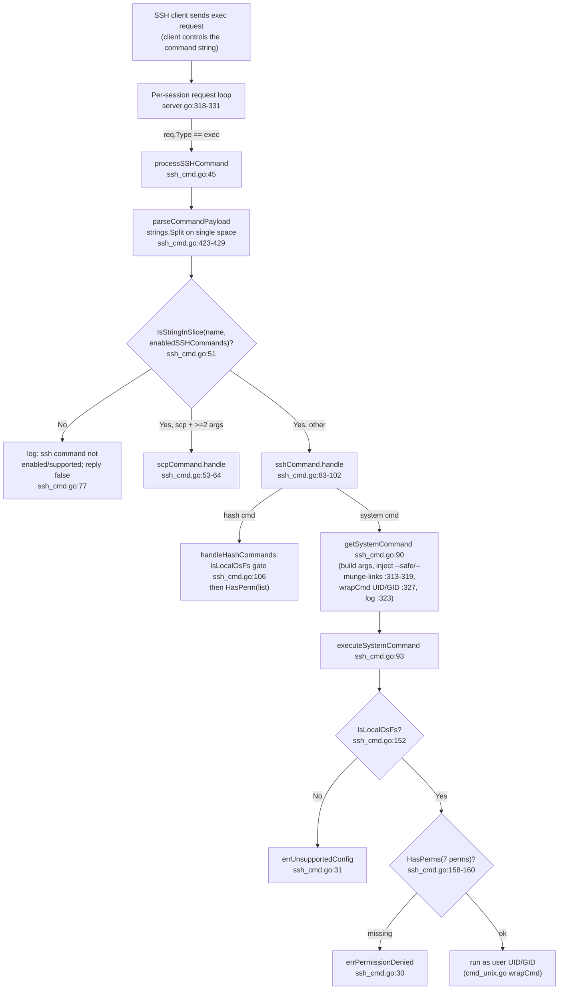

# SFTPGo SSH‑Command Security Model — Evidence‑Backed Behavioral Analysis

**Version binding:** SFTPGo **`0.9.5-dev`** (module `github.com/drakkan/sftpgo`, `go 1.13`), source branch `sftpgo_44634210287c`, HEAD commit `44634210` *"S3: add support for serving virtual folders"*. The version constant is `const version = "0.9.5-dev"` at `utils/version.go:3`.

> **All evidence in this document was produced by building and running this exact repository** in its default, canonical configuration and driving its real SSH/SFTP/SCP entry points. Every behavioral claim is paired with (a) the exact command, (b) the complete, unedited captured output, and (c) the responsible function and `file:line`. Statements that were *inferred from reading code* (rather than observed at runtime) are explicitly marked **(inferred)**; values obtained without traversing the real request path are marked **(non‑canonical)**. **No behavior from newer SFTPGo releases is attributed to this code.**

This document answers five questions about how the security model behaves when external file‑synchronization utilities (`rsync`, `scp`, `git-*`) are invoked over SSH:

- **Q1** — How external‑utility invocation works and how operations "can be enabled or disabled."
- **Q2** — The boundary between what the client controls and what the server decides.
- **Q3** — Handling of structured / unusually‑formatted protocol input (delimiters and boundaries).
- **Q4** — Where directory restrictions are enforced in the processing chain (ordering).
- **Q5** — Protections against filesystem tricks (path traversal / symlinks) and whether they cover all scenarios.

---

## 1. Methodology & Environment

### 1.1 Ground rules followed

1. **Run first, write second.** Every behavioral claim below was produced by building and running the code; conclusions derive from observed output.
2. **Complete, unedited output.** Real log lines, full command output, protocol bytes, and error text are shown verbatim alongside the command that produced them. Byte‑sensitive results (SCP control bytes `0x00`/`0x02`/`0x0A`) were verified against the exact emitted bytes.
3. **Canonical entry point.** Commands are driven through a real SSH transport (`golang.org/x/crypto/ssh` + `github.com/pkg/sftp`) and the system `scp`/`rsync`/`git` binaries. The REST admin API / `sqlite3` are used only to provision the test user. Any white‑box/bypassing value is labeled **(non‑canonical)**.
4. **Cover every condition.** Each question exercises the primary/happy path *and* the secondary/error/edge paths, with before/during/after states for anything stateful.
5. **Stability.** Any result that could vary was run **≥2×** and confirmed stable; this is noted inline.
6. **Observed vs. inferred** is labeled throughout.

### 1.2 Environment (recorded verbatim)

| Component | Version (observed) |
|-----------|--------------------|
| Go toolchain | `go version go1.13.15 linux/amd64` |
| C compiler (cgo sqlite) | `gcc (Ubuntu 15.2.0-4ubuntu4) 15.2.0`, `CGO_ENABLED=1` |
| OpenSSH (ssh/scp) | `OpenSSH_10.0p2 Ubuntu-5ubuntu5.4, OpenSSL 3.5.3` |
| rsync | `rsync version 3.4.1 protocol version 32` |
| git | `git version 2.51.0` |
| sqlite3 | `3.46.1 2024-08-13` |
| Kernel / OS | `Linux 6.6.122+ #1 SMP x86_64 GNU/Linux` |

**Environment note (not a source change):** OpenSSH 10 disables the SHA‑1 `ssh-rsa` signature algorithm by default, but SFTPGo `0.9.5-dev` auto‑generates an RSA host key and its clients use `ssh-rsa` user keys. A **system‑level** config file `/etc/ssh/ssh_config.d/00-blitzy-legacy-rsa.conf` (`HostKeyAlgorithms +ssh-rsa`, `PubkeyAcceptedAlgorithms +ssh-rsa`) was added so the OpenSSH CLI can negotiate with the server. This is outside the repository and changes no source file.

### 1.3 Canonical build & invocation

```
# Build (canonical)
CGO_ENABLED=1 go build -o /tmp/sftpgo_obs/sftpgo .

# Version (canonical)
/tmp/sftpgo_obs/sftpgo --version
```
Output:
```
SFTPGo version: 0.9.5-dev
```
The build emits one harmless upstream cgo warning from the `go-sqlite3` C binding (not an error); the binary is produced and reports the version above. Cite `utils/version.go:3`.

### 1.4 Test‑user provisioning & client harness

The server is started with a **`/tmp` config directory** (a copy of the shipped `sftpgo.json` with only the data‑provider path and the httpd template/static paths repointed to `/tmp` and the repo — the repository `sftpgo.json` is never touched). The sqlite `users` table is bootstrapped with the exact schema from `.travis.yml:14`. Users are provisioned via the REST admin API on `127.0.0.1:8080` (no API auth exists in `0.9.5`), e.g.:

```
curl -X POST http://127.0.0.1:8080/api/v1/user -H 'Content-Type: application/json' -d '{
  "username":"test","home_dir":"/tmp/sftpgo_obs/home","uid":1000,"gid":1000,
  "permissions":{"/":["*"]},"status":1,"public_keys":["ssh-rsa AAAA... test@sftpgo-obs"]
}'
```

Two client drivers are used, both mirroring `sftpd/sftpd_test.go`'s `getSftpClient` pattern (`ssh.ClientConfig` with an insecure host‑key callback → `ssh.Dial("tcp","127.0.0.1:2022",cfg)`):

- a throwaway Go program (`pkg/sftp` for SFTP ops; `session.CombinedOutput` for `exec`), and a raw legacy‑SCP protocol observer that reads the server's control bytes one at a time;
- the system `ssh`, `scp`, `rsync`, `git` binaries for canonical end‑to‑end runs.

### 1.5 A predicted log line that does **not** exist

A plausible‑sounding startup log line reading `enabled SSH commands [...]` was **searched for and is never emitted** — no such `logger` call exists in `sftpd/*.go` in `0.9.5-dev`. (The phrase "enabled SSH commands" appears only as a struct‑field *comment* at `sftpd/server.go:79`, `// List of enabled SSH commands.`, which is not a runtime log line.) It is therefore **not** used as evidence anywhere in this document. The real observable signals for the enable/disable state are the per‑command dispatch/rejection log lines documented under Q1.

---

## 2. Running Baseline (before state)

### 2.1 Default configuration facts (shipped `sftpgo.json` ↔ code)

| Fact | Value | Code | Sample config |
|------|-------|------|---------------|
| SFTP/SSH bind port | `2022` | `config/config.go:46` | `sftpgo.json:3` |
| SCP enabled by default | `false` | `config/config.go:58` | `sftpgo.json:16` |
| Default SSH commands | `[md5sum, sha1sum, cd, pwd]` | `config/config.go:63` → `sftpd.GetDefaultSSHCommands()` (`sftpd/sftpd.go:136`); static set `sftpd/sftpd.go:68` | `sftpgo.json:22` |
| Admin HTTP API | `127.0.0.1:8080` | `config/config.go:88-89` | — |

### 2.2 Listener address (observed)

```
grep 'server listener registered' /tmp/sftpgo_obs/sftpgo.log
```
```
server listener registered address: [::]:2022
```
The listener binds `[::]:2022` (the IPv6 wildcard) because the default `bind_address` is empty; the port is `2022` as configured. Log emitted at `sftpd/server.go:187`. *(Observed — note this is `[::]:2022`, not `127.0.0.1:2022`.)*

### 2.3 Host‑key auto‑generation (before → after)

On first start with no host key configured, the server creates one. **Before:** no `id_rsa` in the config dir. First‑start log line:

```
No host keys configured and "/tmp/sftpgo_obs/id_rsa" does not exist; creating new private key for server
```
**After:**
```
ls -l /tmp/sftpgo_obs/id_rsa
-rw------- 1 root root 3243 ... /tmp/sftpgo_obs/id_rsa
```
Responsible function `checkHostKeys` (`sftpd/server.go:417-430`); autogen message at `sftpd/server.go:422-423`. *(Observed; before/after captured.)*

---

## 3. Q1 — External‑utility invocation & the enable/disable model

### 3.1 Direct answer

External utilities are invoked **only** through the SSH `exec` request. The per‑session request loop dispatches it with `case "exec": ok = processSSHCommand(...)` (`sftpd/server.go:326-327`, inside `switch req.Type` at `sftpd/server.go:318`). `processSSHCommand` (`sftpd/ssh_cmd.go:45`) is the single server‑side point that decides to act. Whether a command "can be enabled or disabled" is governed by the allow‑list **`enabled_ssh_commands`**, which defaults to `[md5sum, sha1sum, cd, pwd]` (`config/config.go:63` → `sftpd/sftpd.go:68`), is drawn from a static *supported* set (`sftpd/sftpd.go:66-67`), and is normalized at startup by `checkSSHCommands` (`sftpd/server.go:396-414`). The model is **fail‑closed**: anything not on the allow‑list is rejected.

### 3.2 The four static command sets (enumerated, with cites)

From `sftpd/sftpd.go:66-70`:

- **`supportedSSHCommands`** (`:66-67`): `scp, md5sum, sha1sum, sha256sum, sha384sum, sha512sum, cd, pwd, git-receive-pack, git-upload-pack, git-upload-archive, rsync`
- **`defaultSSHCommands`** (`:68`): `md5sum, sha1sum, cd, pwd`
- **`sshHashCommands`** (`:69`): `md5sum, sha1sum, sha256sum, sha384sum, sha512sum`
- **`systemCommands`** (`:70`): `git-receive-pack, git-upload-pack, git-upload-archive, rsync`

Getters: `GetDefaultSSHCommands()` (`sftpd/sftpd.go:136`), `GetSupportedSSHCommands()` (`sftpd/sftpd.go:143`).

### 3.3 Experiment 1a — the default config **rejects** rsync and scp (fail‑closed) *(stable ×2)*

Config: `enabled_ssh_commands=[md5sum,sha1sum,cd,pwd]`, `enable_scp=false` (the shipped defaults).

```
# client: SSH exec of rsync
harness test exec rsync --server -vlogDtpre.iLsfxCIvu . .
```
```
CLIENT: EXEC_ERROR: ssh: command rsync --server -vlogDtpre.iLsfxCIvu . . failed
SERVER[DEBUG]: new ssh command: "rsync" args: [--server -vlogDtpre.iLsfxCIvu . .] user: test, error: <nil>
SERVER[INFO]: ssh command not enabled/supported: "rsync"
```
```
# client: SSH exec of scp
harness test exec scp -t /
```
```
CLIENT: EXEC_ERROR: ssh: command scp -t / failed
SERVER[DEBUG]: new ssh command: "scp" args: [-t /] user: test, error: <nil>
SERVER[INFO]: ssh command not enabled/supported: "scp"
```

**Cause → effect.** The debug line `new ssh command: ...` is emitted at `sftpd/ssh_cmd.go:49-50` right after `parseCommandPayload`. The allow‑list membership test `utils.IsStringInSlice(name, enabledSSHCommands)` (`sftpd/ssh_cmd.go:51`) fails, so control falls to the rejection at `sftpd/ssh_cmd.go:77` which logs `ssh command not enabled/supported: %#v` and replies `false`. `scp` is additionally disabled because `enable_scp` defaults `false` (`config/config.go:58`) and `checkSSHCommands` only prepends `scp` when `IsSCPEnabled` (`sftpd/server.go:402-404`). Both runs identical → stable.

### 3.4 Experiment 1b — default‑enabled built‑ins **work**

```
ssh -p 2022 ... test@127.0.0.1 md5sum /sample.txt
```
```
dbf2ec5d9177c1a4fe4c55cab15d4385  /sample.txt
```
```
ssh -p 2022 ... test@127.0.0.1 sha1sum /sample.txt
```
```
4876d03e1eb88e23a95f0b8305ba874e2265aaad  /sample.txt
```
The server hashes match the local reference exactly (`md5sum`/`sha1sum` of the same file locally produce `dbf2ec5d9177c1a4fe4c55cab15d4385` and `4876d03e1eb88e23a95f0b8305ba874e2265aaad`). `cd` returns nothing (exit 0) — the `cd` branch is a no‑op (`sftpd/ssh_cmd.go:95-96`). `pwd` returns a hard‑coded `/` + newline; captured **byte‑exact**:

```
ssh -p 2022 ... test@127.0.0.1 pwd | od -An -c -tx1
    /  \n
   2f  0a
```
The two bytes `2f 0a` are exactly `'/'` and `'\n'`, matching `c.connection.channel.Write([]byte("/\n"))` at `sftpd/ssh_cmd.go:99`. Hash commands are dispatched via the `sshHashCommands` route (`sftpd/ssh_cmd.go:87`).

### 3.5 Experiment 1c — enabling utilities is a deliberate reconfiguration

Setting `enabled_ssh_commands` to include `rsync`/`git-*` and `enable_scp=true`, then restarting, makes the rejection disappear and dispatch proceed. A real rsync push (Q5‑6d) shows the server emitting `new system command "rsync", with args: [...]` (`sftpd/ssh_cmd.go:323`). **There is no `enabled SSH commands [...]` startup line** in `0.9.5-dev` — the observable enabled‑state signals are these per‑command dispatch lines, not a startup summary.

### 3.6 Experiment 1d — the `"*"` wildcard expansion

Config `enabled_ssh_commands=["*"]`, `enable_scp=true`, restart. rsync is now accepted:
```
harness test exec rsync --server -vlogDtpre.iLsfxCIvu . /wild.txt
```
```
SERVER[DEBUG]: new ssh command: "rsync" args: [--server -vlogDtpre.iLsfxCIvu . /wild.txt] user: test, error: <nil>
SERVER[DEBUG]: new system command "rsync", with args: [--safe-links --server -vlogDtpre.iLsfxCIvu . /tmp/sftpgo_obs/home/wild.txt] path: /tmp/sftpgo_obs/home/wild.txt
```
`checkSSHCommands` replaces the list with `GetSupportedSSHCommands()` when it contains `"*"` (`sftpd/server.go:397-398`). *(The portable‑mode alternate entry `StartPortableMode` performs the same `"*"` expansion at `service/service.go:161-162` — **(inferred)**, as portable mode was not separately launched.)*

### 3.7 Experiment 1e — unsupported‑command normalization at startup

Putting a bogus `foobar` in the list and restarting produces a startup warning (from `checkSSHCommands`), captured in both the structured log and the console:
```
SERVER[WARN]: unsupported ssh command: "foobar" ignored
```
```
2026-07-13T17:54:45.389 WRN unsupported ssh command: "foobar" ignored
```
The filter against the supported set logs `unsupported ssh command: %#v ignored` at `sftpd/server.go:409-410`. *(Observed.)*

---

## 4. Q2 — The boundary between client control and server decision

### 4.1 Direct answer

The client fully controls the raw command **string** (and thus its tokenization and target path). The server decides acceptability with **two independent server‑side gates**:

1. **Allow‑list membership** — `utils.IsStringInSlice(name, enabledSSHCommands)` (`sftpd/ssh_cmd.go:51`; primitive `utils/utils.go:20`).
2. **Per‑user permissions** — `HasPerm` / `HasPerms` (`dataprovider/user.go:159`, `:168`). For **system commands** there is a **seven‑permission** gate — `perms = [PermDownload, PermUpload, PermCreateDirs, PermListItems, PermOverwrite, PermDelete, PermRename]` then `HasPerms(perms, getDestPath())` (`sftpd/ssh_cmd.go:158-160`) — plus a local‑filesystem gate `if !vfs.IsLocalOsFs(...)` (`sftpd/ssh_cmd.go:152`).

The user permission map is `User.Permissions map[string][]string` (`dataprovider/user.go:93`); permission constants (e.g. `PermAny = "*"`) are at `dataprovider/user.go:19-42`.

### 4.2 Experiment 2a — the allow‑list gate is one decision point

Reusing Q1: under the default config, `md5sum` is **permitted** and `rsync` is **denied**, both decided at the single membership test `sftpd/ssh_cmd.go:51`. Permitted → dispatch (`:52-75`); otherwise → reject and log (`:77`).

### 4.3 Experiment 2b — the permission gate denies an **allowed** command *(stable ×2)*

With `rsync` enabled but the user **missing** one of the seven required permissions (here `permissions["/"] = ["list","upload","create_dirs","overwrite","delete"]` — `rename` omitted; `download` also absent), a real rsync push is rejected:

```
rsync -av -e "ssh -p 2022 ..." /tmp/.../src.txt test@127.0.0.1:/dst.txt
```
Client (verbatim):
```
rsync: / Permission denied. You don't have the permissions to execute this command
...
rsync error: ... (code 1) ...
Process exited with status 1
```
Server:
```
new ssh command: "rsync" args: [--server ... /dst.txt] user: test, error: <nil>
new system command "rsync", with args: [--munge-links --server ... /tmp/sftpgo_obs/home/dst.txt] path: ...
command failed: "rsync" args: [...] user: test err: Permission denied. You don't have the permissions to execute this command
```
**Cause → effect.** The error string is `errPermissionDenied` = *"Permission denied. You don't have the permissions to execute this command"* (`sftpd/ssh_cmd.go:30`). It is produced by the seven‑permission gate `HasPerms` (`sftpd/ssh_cmd.go:160-161`) and formatted for the client by `sendErrorResponse` as `"%v: %v %v\n"` (`sftpd/ssh_cmd.go:373-378`), with the destination path from `getDestPath` (`sftpd/ssh_cmd.go:356-371`).

**Ordering nuance (observed):** the server logs `new system command "rsync" ...` (with `--munge-links` already injected) **before** the denial. That is because `handle()` calls `getSystemCommand()` (which builds args, injects the symlink flag, and logs) at `sftpd/ssh_cmd.go:90` *first*, and only then calls `executeSystemCommand()` (`:93`) whose gate at `:160` denies. The command is fully **built but never executed**.

### 4.4 Experiment 2c — the permission gate **allows** (before/after, same command)

Restoring `permissions["/"] = ["*"]` and re‑running the **identical** rsync command succeeds (exit 0). `HasPerms` short‑circuits `true` via `IsStringInSlice(PermAny, ...)` (`dataprovider/user.go:170-171`), and — because `PermAny` also grants `create_symlinks` — the injected flag flips to `--safe-links` (contrast with 2b's `--munge-links`; see Q5‑6d). Same input, opposite outcome, purely from the permission map.

**Summary of the boundary.** The command string, its tokenization, and the target path all originate from the client; the server's entire decision is the static allow‑list plus the per‑user permission map (with the local‑FS gate for system commands).

---

## 5. Q3 — Handling of structured / unusually‑formatted protocol input

### 5.1 Direct answer

The tokenizers are **naive and assume single‑space delimiters**. The exec parser `parseCommandPayload` splits on one space via `strings.Split(command, " ")` (`sftpd/ssh_cmd.go:423-429`, split at `:424`; the `<2` short branch at `:425-427`). The SCP upload parser `parseUploadMessage` splits on space and requires **exactly three fields** `len(parts) == 3` (`sftpd/scp.go:643`), failing otherwise with `Error splitting upload message: %v` (`sftpd/scp.go:658`). SCP messages are newline‑terminated and read **one byte at a time** in `readProtocolMessage` (`sftpd/scp.go:542-564`), with control bytes `okMsg 0x00` / `warnMsg 0x01` / `errMsg 0x02` / `newLine 0x0A` (`sftpd/scp.go:22-25`). When an input contains extra spaces, these assumptions break.

### 5.2 Experiment 3a — `parseCommandPayload` splits an exec path on every space

```
ssh -p 2022 ... test@127.0.0.1 'md5sum "/dir with space/file"'
```
Client:
```
md5sum: /space/file open /tmp/sftpgo_obs/home/space/file: no such file or directory
```
Server:
```
new ssh command: "md5sum" args: ["/dir with space/file"] user: test, error: <nil>
command failed: "md5sum" args: ["/dir with space/file"] user: test err: open /tmp/sftpgo_obs/home/space/file: no such file or directory
```
**Cause → effect.** The single command string is split on spaces, so the quoted path becomes multiple argv tokens. `getDestPath` takes only the **last** argument, `c.args[len(c.args)-1]` (`sftpd/ssh_cmd.go:356-371`), so the effective path collapses to the fragment after the last space (`space/file` → resolved `/tmp/sftpgo_obs/home/space/file`), which does not exist. The `<2` branch is confirmed by a bare `pwd`:
```
new ssh command: "pwd" args: [] user: test, error: <nil>
```
(name `pwd`, empty args).

### 5.3 Experiment 3b — SCP's exact‑three‑field requirement breaks on a filename with a space *(stable ×2)*

With SCP enabled, uploading a **spaceless** file succeeds; uploading a filename **containing a space** fails. (Note: OpenSSH 10's `scp` defaults to the SFTP protocol, so `-O` is required to force the legacy SCP protocol that exercises this parser.)

Spaceless (success):
```
scp -O -P 2022 ... /tmp/sftpgo_obs/spaceless.txt test@127.0.0.1:/
# scp exit=0 ; server:
new ssh command: "scp" args: [-t /] user: test, error: <nil>
handle scp command, args: [-t /] user: test command type: -t, dest path: "/"
# uploaded: 18 /tmp/sftpgo_obs/home/spaceless.txt
```
Spaced name (failure):
```
scp -O -P 2022 ... "/tmp/sftpgo_obs/my file.txt" test@127.0.0.1:/
```
```
CLIENT: Error splitting upload message: C0644 15 my file.txt
# scp exit=1 ; server:
WARN : error: Error splitting upload message: C0644 15 my file.txt
```
**Cause → effect.** The SCP protocol control record for the upload is `C0644 <size> <name>`. With a spaced name it becomes `C0644 15 my file.txt`, which `strings.Split(..., " ")` breaks into **four** parts; `parseUploadMessage` requires exactly three (`sftpd/scp.go:643`) and errors at `sftpd/scp.go:658`. `getCommandType` returns the positional `args[len-2]` = `-t` (`sftpd/scp.go:500-502`), so even the SCP mode is chosen from argument position.

### 5.4 Experiment 3c — byte‑exact control bytes and the `readProtocolMessage` buffer (before/during/after)

Using a raw legacy‑SCP observer that reads the server's control byte one at a time:

**(i) spaceless `ab.txt` — accepted (`okMsg 0x00`):**
```
BEFORE(initial-ack): server sent control byte = 0x00 (n=1)
CLIENT_SENDS: "C0644 5 ab.txt\n" (hex last byte 0x0A)
AFTER(C-message-reply): server sent control byte = 0x00 (n=1)
```
**(ii) spaced `my file.txt` — rejected (`errMsg 0x02` + text + `0x0A`):**
```
BEFORE(initial-ack): server sent control byte = 0x00 (n=1)
CLIENT_SENDS: "C0644 5 my file.txt\n" (hex last byte 0x0A)
AFTER(C-message-reply): server sent control byte = 0x02 (n=1)
AFTER(C-message-reply): trailing bytes (hex) = 45 72 72 6F 72 20 73 70 6C 69 74 74 69 6E 67 20 75 70 6C 6F 61 64 20 6D 65 73 73 61 67 65 3A 20 43 30 36 34 34 20 35 20 6D 79 20 66 69 6C 65 2E 74 78 74 0A
AFTER(C-message-reply): trailing text = "Error splitting upload message: C0644 5 my file.txt\n"
```
**(iii) no trailing newline (`NONL`) — the reader keeps looping:**
```
BEFORE(initial-ack): server sent control byte = 0x00 (n=1)
CLIENT_SENDS: "C0644 5 ab.txt" (hex last byte 0x74)
AFTER(C-message-reply): <no byte within 2s>
```
**Cause → effect.** The initial ack and the accept reply are exactly `0x00` (`okMsg`, `sftpd/scp.go:22`). The rejection is exactly `0x02` (`errMsg`, `:24`) followed by the message text and a terminating `0x0A` (`newLine`, `:25`) — matching `sendErrorMessage` which writes `errMsg` then the text then `newLine` (`sftpd/scp.go:567-571`). The trailing hex ends in `0A`, confirming the newline byte. When the client omits the terminating `0x0A`, `readProtocolMessage` (loop `buf := make([]byte, 1)`, break on `0x0A` at `sftpd/scp.go:554-555`) never returns — proving the newline‑terminated, one‑byte‑at‑a‑time contract. Before the newline the message buffer is incomplete (no reply); after the newline it returns the full accumulated string (including the interior spaces — the mis‑split happens later in `parseUploadMessage`, **not** in the reader). All three states stable ×2.

---

## 6. Q4 — Where directory restrictions are enforced (ordering)

### 6.1 Direct answer

Permissions are resolved **most‑specifically** by `GetPermissionsForPath` (`dataprovider/user.go:122-156`): it walks the path's parent directories in reverse and returns the first match, with `/` as the fallback; if only `/` is defined it is returned unconditionally (`:126-127`; reverse‑walk comment `:145-148`). **The order of "resolve path" vs. "check permission" is inconsistent across the SFTP handlers** — this is real and is the crux of the concern. Of the four entry handlers, **only `Fileread` checks permission *before* resolving**:

| Handler | Order | Cites |
|---------|-------|-------|
| `Fileread` (`:47`) | **permission first** (`HasPerm(PermDownload, path.Dir(request.Filepath))` `:50`), **then** `ResolvePath` `:54` | `sftpd/handler.go:50,54` |
| `Filewrite` (`:98`) | **resolve first** (`ResolvePath` `:100`), then `HasPerm(PermUpload)` `:112` / `HasPerm(PermOverwrite)` `:129` | `sftpd/handler.go:100,112,129` |
| `Filecmd` (`:138`) | **resolve first** (`ResolvePath` `:141`), then per‑method gate | `sftpd/handler.go:141` |
| `Filelist` (`:195`) | **resolve first** (`ResolvePath` `:197`), then `HasPerm(PermListItems)` `:204` (List) / `:218` (Stat) | `sftpd/handler.go:197,204,218` |

Permission decisions use the **client‑supplied virtual path**; containment is enforced separately on the **resolved OS path** (Q5).

The client‑observable error class differs by outcome because `vfs.GetSFTPError` (`vfs/vfs.go:55-63`) maps: `IsNotExist → ErrSSHFxNoSuchFile` ("no such file"), `IsPermission → ErrSSHFxPermissionDenied` ("permission denied"), and **any other error (including the containment error) → `ErrSSHFxFailure`** ("failure").

### 6.2 Experiment 5a — most‑specific permission match *(stable)*

User `permissions = {"/":["*"], "/somedir":["list","download"]}`:

- **upload `/somedir/x`** → **DENIED** (`SSH_FX_PERMISSION_DENIED`): the specific `/somedir` entry lacks `upload` and overrides `/`.
- **upload `/other/x`** → **ALLOWED** (wrote 18 bytes, owned 1000:1000): no `/other` entry, so it falls back to `/`'s `*`.
- **list `/somedir`** → **OK** (count=1) and **download `/somedir/existing.txt`** → **OK** (content `secret`).

This is exactly the reverse‑dir‑walk, first‑match behavior of `GetPermissionsForPath` (`dataprovider/user.go:122-156`) combined with `HasPerm` (`:159`).

### 6.3 The `..` confound (observed) — why a plain traversal path does *not* reach the containment check

An early attempt to trigger a containment error with `/../../../../etc/passwd` produced **no** containment warning. The reason (observed): the SFTP request layer plus `filepath.Clean(filepath.Join(rootDir, sftpPath))` (`vfs/osfs.go:204`) **collapse the `..`** so the virtual path becomes `/etc/passwd`, which joins onto the home dir as `/tmp/sftpgo_obs/home/etc/passwd` — **inside** home (and nonexistent). Via the OpenSSH CLI the server log shows this directly:
```
requested stat for path: "/tmp/sftpgo_obs/home/etc/passwd"
error running stat on path: &os.PathError{Op:"stat", Path:"/tmp/sftpgo_obs/home/etc/passwd", Err:0x2}
```
So plain `..` is neutralized by **path cleaning**, not by the `isSubDir` guard (this is developed further in Q5‑6a). To demonstrate the ordering cleanly, the experiment below uses a **symlink escape** (no `..`), which survives cleaning and is resolved server‑side.

### 6.4 Experiment 5b — the same escaping symlink path, three handlers, different errors *(stable ×2)*

Setup: symlink `home/escape → /etc` (`ln -s /etc /tmp/sftpgo_obs/home/escape`); user `permissions["/"] = ["list","upload","create_dirs","overwrite","delete","rename"]` (**lacks `download`**, **has `upload`/`list`**). The **same** virtual path `/escape/passwd` is driven through read, write, and list:

**READ (`get /escape/passwd`) — permission first:**
```
CLIENT: SFTP_GET_ERROR: sftp: "Permission Denied" (SSH_FX_PERMISSION_DENIED)
SERVER: (connection added / closed — NO osfs containment warning)
```
**WRITE (`put /escape/passwd`) — resolve first:**
```
CLIENT: SFTP_PUT_ERROR: sftp: "Failure" (SSH_FX_FAILURE)
SERVER: [WARN] osfs: error: path "/etc/passwd" is not inside: "/tmp/sftpgo_obs/home"
SERVER: [WARN] osfs: Invalid path resolution, dir: "/etc/passwd" outside user home: "/tmp/sftpgo_obs/home" err: path "/etc/passwd" is not inside: "/tmp/sftpgo_obs/home"
```
**LIST (`ls /escape`) — resolve first:**
```
CLIENT: SFTP_LS_ERROR: sftp: "Failure" (SSH_FX_FAILURE)
SERVER: [WARN] osfs: error: path "/etc" is not inside: "/tmp/sftpgo_obs/home"
SERVER: [WARN] osfs: Invalid path resolution, dir: "/etc" outside user home: "/tmp/sftpgo_obs/home" err: path "/etc" is not inside: "/tmp/sftpgo_obs/home"
```
**Cause → effect (the crux).** For the *same* escaping path the READ reports a **permission** error while WRITE/LIST report a **containment/"failure"** error — purely because of enforcement order:

- `Fileread` checks `HasPerm(PermDownload, path.Dir("/escape/passwd"))` first (`sftpd/handler.go:50`); `download` is missing → it returns `ErrSSHFxPermissionDenied` at `:51` and **`ResolvePath` (`:54`) never runs**, so the symlink is never followed and `isSubDir` never fires (no containment warning).
- `Filewrite` calls `ResolvePath` first (`sftpd/handler.go:100`); `EvalSymlinks` follows `escape → /etc` and `isSubDir` rejects `/etc/passwd`, mapped to `ErrSSHFxFailure`. The upload gate (`:112`) is never reached (and the user *has* `upload` anyway, so the failure is unambiguously containment).
- `Filelist` calls `ResolvePath` first (`sftpd/handler.go:197`); same containment rejection.

### 6.5 Experiment 5b (before/after toggle) — the clincher

With the **same** symlink path, granting `download` (`permissions["/"]=["*"]`) and re‑running READ flips the outcome:
```
# download NOT granted:
READ /escape/passwd → SSH_FX_PERMISSION_DENIED   (no containment warning)
# download granted ([*]):
READ /escape/passwd → SSH_FX_FAILURE
SERVER: [WARN] osfs: error: path "/etc/passwd" is not inside: "/tmp/sftpgo_obs/home"
SERVER: [WARN] osfs: Invalid path resolution, dir: "/etc/passwd" outside user home: "/tmp/sftpgo_obs/home" err: ...
```
This proves `Fileread`'s containment check is **gated behind** its permission check: when the permission is missing, resolution (and therefore containment) never runs; when the permission passes, resolution runs and containment fires. The other three handlers resolve first regardless of permission.

### 6.6 Per‑method permission gates (enumerated, with cites)

`Filecmd` (`sftpd/handler.go:138`) resolves first (`:141`), then dispatches to sub‑handlers each with its own gate:

- **Setstat** → `handleSFTPSetstat` (`:249`): `PermChmod` `:261`, `PermChown` `:272`, `PermChtimes` `:284`
- **Rename** → `handleSFTPRename` (`:304`): `PermRename` `:309` on `path.Dir(request.Target)`
- **Rmdir** → `handleSFTPRmdir` (`:321`): `PermDelete` `:326`
- **Symlink** → `handleSFTPSymlink` (`:350`): `PermCreateSymlinks` `:355` on `path.Dir(request.Target)`
- **Mkdir** → `handleSFTPMkdir` (`:367`): `PermCreateDirs` `:368`
- **Remove** → `handleSFTPRemove` (`:381`): `PermDelete` `:382`

SCP's own permission gates: `PermCreateDirs` (`sftpd/scp.go:125`), `PermUpload` (`:243`), `PermOverwrite` (`:265`), `PermDownload` (`:441` file / `:451` dir).

---

## 7. Q5 — Protections against filesystem tricks & their coverage

### 7.1 Direct answer

Local‑path containment is enforced by `OsFs.ResolvePath` (`vfs/osfs.go:200-223`): `filepath.Clean(filepath.Join(rootDir, sftpPath))` (`:204`) → `filepath.EvalSymlinks` (`:205`) → for existing paths `isSubDir(p, rootDir)` (`:218`); for non‑existent targets it walks up via `findFirstExistingDir` (`:211`). `isSubDir` (`vfs/osfs.go:278-291`) rejects with `path %#v is not inside: %#v` (`:286`) using a **raw string** comparison `strings.HasPrefix(sub, parent)` (`:285`) — *not* a path‑component check, which is the coverage gap. System commands are restricted to the local filesystem by `IsLocalOsFs` (`sftpd/ssh_cmd.go:106` and `:152`; `vfs/vfs.go:67`). For rsync, symlink risk is delegated to rsync via injected `--safe-links` (user *has* `create_symlinks`) or `--munge-links` (user *lacks* it) (`sftpd/ssh_cmd.go:306-322`, decision `:313`). System commands run as the user's UID/GID via `wrapCmd` (`sftpd/cmd_unix.go`), a no‑op on Windows (`sftpd/cmd_windows.go`).

**Coverage verdict:** protections engage for `..` (via cleaning) and for symlinks pointing to clearly‑external trees (via `isSubDir`), **but there is a real gap**: a symlink to a *sibling* directory whose absolute path shares a **string prefix** with the home directory passes the `isSubDir` check and is **not** contained (§7.4).

### 7.2 Experiment 6a — path traversal (`..`) is neutralized by cleaning *(stable ×2)*

```
harness test get /../../../../etc/passwd      # and /../../etc/passwd
```
```
CLIENT: SFTP_GET_ERROR: file does not exist
SERVER: (no osfs containment warning)
```
Via the OpenSSH CLI, the resolved path is visible and is **inside** home:
```
CLIENT: File "/../../../../etc/passwd" not found.
SERVER: requested stat for path: "/tmp/sftpgo_obs/home/etc/passwd"
SERVER: error running stat on path: &os.PathError{Op:"stat", Path:"/tmp/sftpgo_obs/home/etc/passwd", Err:0x2}
```
**Cause → effect.** The `..` sequence is collapsed by path cleaning (SFTP request layer + `filepath.Clean` at `vfs/osfs.go:204`), so the request resolves to a path inside the home tree that simply does not exist. The `isSubDir` guard does **not** fire for plain `..`. Both depths, both clients, stable ×2.

### 7.3 Experiment 6b — a symlink escape *is* blocked by `isSubDir` (before/during/after, stable ×2)

**Before:**
```
ln -s /etc /tmp/sftpgo_obs/home/etc_link
lrwxrwxrwx ... /tmp/sftpgo_obs/home/etc_link -> /etc
# on-disk: /tmp/sftpgo_obs/home/etc_link/passwd -> /etc/passwd
```
**During/After:**
```
harness test get /etc_link/passwd
CLIENT: SFTP_GET_ERROR: sftp: "Failure" (SSH_FX_FAILURE)
SERVER: [WARN] osfs: error: path "/etc/passwd" is not inside: "/tmp/sftpgo_obs/home"
SERVER: [WARN] osfs: Invalid path resolution, dir: "/etc/passwd" outside user home: "/tmp/sftpgo_obs/home" err: path "/etc/passwd" is not inside: "/tmp/sftpgo_obs/home"
```
**Cause → effect.** `EvalSymlinks` (`vfs/osfs.go:205`) resolves the symlink to `/etc/passwd`; `isSubDir` (`:218`,`:285`) finds `/etc/passwd` is not prefixed by the home dir and rejects (`:286`), wrapped by the `ResolvePath` warning (`:220`). Mapped to `ErrSSHFxFailure` for the client.

### 7.4 Experiment 6c — the `isSubDir` prefix‑string GAP (the "does it cover all scenarios?" edge) *(stable ×2)*

Setup: user home `= /tmp/sftpgo_obs/data`; a **sibling** dir `/tmp/sftpgo_obs/data-evil/secret` (content `TOP-SECRET-sibling-content`); a symlink inside home `data/link → /tmp/sftpgo_obs/data-evil`. The containment check computes:
```
strings.HasPrefix("/tmp/sftpgo_obs/data-evil/secret", "/tmp/sftpgo_obs/data")  ==  True
(component-aware would require prefix + "/"                                    ==  False)
```
**Access — the gap:**
```
harness gapuser get /link/secret
CLIENT: SFTP_GET_OK bytes=27 content_first_line="TOP-SECRET-sibling-content"
SERVER: fileread requested for path: "/tmp/sftpgo_obs/data/link/secret"
SERVER: Download:
SERVER: sent exit status {Status:0} error: <nil>   (NO containment warning)
```
**Control — a non‑prefix escape is still blocked:**
```
ln -s /etc /tmp/sftpgo_obs/data/etclink
harness gapuser get /etclink/passwd
CLIENT: SFTP_GET_ERROR: sftp: "Failure" (SSH_FX_FAILURE)
SERVER: [WARN] osfs: error: path "/etc/passwd" is not inside: "/tmp/sftpgo_obs/data"
```
**Cause → effect.** Because `isSubDir` uses `strings.HasPrefix` (`vfs/osfs.go:285`) rather than a path‑component comparison, the sibling `/tmp/sftpgo_obs/data-evil/...` is a *string* prefix match of the home `/tmp/sftpgo_obs/data` and containment **incorrectly passes**, so the sibling's secret is served. The `/etc` control (not a string prefix) is correctly rejected. **Reported exactly as observed:** the read of the out‑of‑home sibling **succeeded**. This is the concrete coverage gap the question probes; the protection does **not** cover all scenarios. Cite `vfs/osfs.go:285`.

### 7.5 Experiment 6d — rsync `--safe-links` vs `--munge-links` injection (both variants, canonical)

Real rsync 3.4.1 client → SSH → SFTPGo. The client sends no such flag; the server injects one based on the user's `create_symlinks` permission.

**6d‑A — user WITH `create_symlinks` (`permissions["/"]=["*"]`):**
```
CLIENT (rsync push, args contain no --safe/--munge):
  sending incremental file list / rsync_src.txt / ... total size is 25
SERVER: new ssh command: "rsync" args: [--server -vlogDtpre.iLsfxCIvu . /rsync_6dA.txt] user: test, error: <nil>
SERVER: new system command "rsync", with args: [--safe-links --server -vlogDtpre.iLsfxCIvu . /tmp/sftpgo_obs/home/rsync_6dA.txt] path: /tmp/sftpgo_obs/home/rsync_6dA.txt
```
**6d‑B — user WITHOUT `create_symlinks` (the seven perms only):**
```
SERVER: new system command "rsync", with args: [--munge-links --server -vlogDtpre.iLsfxCIvu . /tmp/sftpgo_obs/home/rsync_6dB.txt] path: /tmp/sftpgo_obs/home/rsync_6dB.txt
```
**Cause → effect.** `getSystemCommand` decides at `sftpd/ssh_cmd.go:313` (`HasPerm(PermCreateSymlinks, ...)`) and prepends `--safe-links` (`:314-315`) or `--munge-links` (`:318-319`), logging the constructed args at `:323`. Before = client args (no flag); after = server args (flag present). *(The actual rsync client flag string here is `-vlogDtpre.iLsfxCIvu` for rsync 3.4.1; it differs from older‑rsync examples like `-vlogDtprze.iLsfxC` — reported as observed.)* SFTPGo's symlink protection for rsync is thus **delegated to rsync's own `--safe-links`/`--munge-links` behavior**.

### 7.6 Experiment 6e — system/hash commands are gated to the local filesystem (canonical) *(stable ×2)*

An S3‑filesystem user (`filesystem.provider=1`, `s3config.bucket=testbucket`, placeholder creds) is provisioned; `S3Fs.Name()` returns `S3Fs bucket: "testbucket"` (≠ `"osfs"`, so `IsLocalOsFs` is false). The `IsLocalOsFs` gate fires **before** any S3 API call, so no real S3 access is needed.

```
harness s3user exec md5sum /somefile
CLIENT: EXEC_ERROR: Process exited with status 1   (empty output)
SERVER: new ssh command: "md5sum" args: [/somefile] user: s3user, error: <nil>
SERVER: [WARN] ssh: command failed: "md5sum" ... err: command unsupported for this configuration
```
```
harness s3user exec rsync --server -vlogDtpre.iLsfxCIvu . /dest.txt
SERVER: new system command "rsync", with args: [--safe-links --server ...] path: /dest.txt
SERVER: [WARN] ssh: command failed: "rsync" ... err: command unsupported for this configuration
```
**Contrast — the same `md5sum` for a local‑FS user succeeds:**
```
harness test exec md5sum /sample.txt
CLIENT: EXEC_ERROR: <nil>
SERVER: SSHCommand:            (success; IsLocalOsFs == true)
```
**Cause → effect.** The hash gate at `sftpd/ssh_cmd.go:106` and the system‑command gate at `:152` return `errUnsupportedConfig` = *"command unsupported for this configuration"* (`sftpd/ssh_cmd.go:31`) whenever `IsLocalOsFs` is false. For rsync the args are still *built* (and `--safe-links` injected) before the `:152` gate denies — the same "build‑then‑deny" order seen in Q2‑2b. This path is **canonical** (real SSH exec against a real S3‑configured user), not inferred.

### 7.7 Experiment 6f — system commands run as the user's UID/GID (Unix)

The server process runs as **root** (`ps` shows `uid=0`), so a `setuid` to the user's IDs succeeds. Files created by rsync (run as user `test`, `uid/gid=1000`) are owned by that UID/GID:
```
ls -ln /tmp/sftpgo_obs/home/rsync_6f.txt
-rw-r--r-- 1 1000 1000 16 ... /tmp/sftpgo_obs/home/rsync_6f.txt
```
**Cause → effect.** `wrapCmd` (`sftpd/cmd_unix.go:10-13`) sets `cmd.SysProcAttr.Credential = &syscall.Credential{Uid, Gid}` when `uid>0 || gid>0` (`:11-13`); it is invoked from `getSystemCommand` at `sftpd/ssh_cmd.go:327`. On Windows `wrapCmd` is a pure no‑op (`return cmd`, `sftpd/cmd_windows.go:7-8`) — a platform contrast that is **(inferred)** here since the tests ran on Linux. *(If the SFTPGo process were not root, the `setuid` would fail; here it runs as root so the drop succeeds.)*

---

## 8. Client → Server control‑flow summary



For the SFTP data path (Q4/Q5): `Fileread` checks permission (`handler.go:50`) **before** `ResolvePath` (`:54`); `Filewrite`/`Filecmd`/`Filelist` call `ResolvePath` first (`:100`/`:141`/`:197`). `ResolvePath` (`vfs/osfs.go:200-223`) does `Clean(Join)` → `EvalSymlinks` → `isSubDir` (`strings.HasPrefix`, `:285`).

---

## 9. Inferred‑vs‑observed ledger

Everything else in this document is **observed at runtime**. The following statements are **inferred (from code)** or **non‑canonical**, and are the only such statements:

| Statement | Status | Why |
|-----------|--------|-----|
| Portable‑mode (`StartPortableMode`) performs the same `"*"` expansion (`service/service.go:161-162`) | **Inferred** | Portable mode was not separately launched; the `serve` path's `"*"` expansion (server.go:397-398) *was* observed (Q1‑1d). |
| `wrapCmd` is a no‑op on Windows (`cmd_windows.go:7-8`) | **Inferred** | Tests ran on Linux; the Unix `wrapCmd` UID/GID drop *was* observed (Q5‑6f). |
| The SFTP request layer (pkg/sftp) cleans `..` before SFTPGo's handler | **Inferred (upstream lib)** | The *effect* — the `..` path resolving to a location inside home with no containment warning — *was* observed (Q5‑6a); the exact upstream cleaning site is not in this repo. |
| S3 `ResolvePath` internals (`vfs/s3fs.go:459`) | **Inferred** | The S3 *gate rejection* (`errUnsupportedConfig`) *was* observed canonically (Q5‑6e); S3 object I/O was not exercised (placeholder credentials). |

No white‑box (`getSystemCommand()` called directly) values were used; all `--safe-links`/`--munge-links` evidence comes from the canonical rsync‑over‑SSH path (Q5‑6d).

---

## 10. Coverage pass

| Item asked / named | Where answered |
|--------------------|----------------|
| External utilities: **rsync** | Q1‑1a/1c/1d, Q2‑2b/2c, Q5‑6d/6e/6f |
| External utilities: **scp** | Q1‑1a, Q3‑3b/3c |
| External utilities: **git‑\*** | Q1‑3.2 (`systemCommands` set), Q5‑6f (same system‑command path) |
| "operations can be enabled or disabled" | Q1‑1a (disabled/fail‑closed) vs 1b/1c/1d (enabled), 1e (normalization) |
| Client vs server boundary | Q2‑4.1 (two gates), 2a/2b/2c |
| Filtering/validation rules | Q2 (allow‑list + permission map), Q1‑1e (supported‑set filter) |
| Delimiters / boundaries | Q3‑3a (exec space‑split), 3b (SCP 3‑field), 3c (newline/control bytes) |
| Unusually‑formatted input | Q3‑3a (spaced path), 3b (spaced filename), 3c (missing newline) |
| Enforcement ordering | Q4‑6.1 table, 5b (three handlers), toggle |
| "processed/transformed before permission check" | Q4‑5b (resolve‑before‑perm in write/list; perm‑before‑resolve in read), Q4‑6.3 (`..` cleaning) |
| Directory restrictions / most‑specific perms | Q4‑5a, `GetPermissionsForPath` |
| Path traversal | Q5‑6a |
| Symlinks | Q5‑6b (blocked), 6c (gap), 6d (rsync delegation) |
| `--safe-links` / `--munge-links` | Q5‑6d (both variants) |
| "do protections cover all scenarios?" | Q5‑6c (**no** — `isSubDir` prefix‑string gap) |
| `"*"` expansion | Q1‑1d |
| Local‑FS restriction of system commands | Q5‑6e |
| UID/GID execution | Q5‑6f |
| Before/during/after (stateful) | Q2 baseline host‑key, Q3‑3c buffer, Q5‑6b symlink, Q4 toggle |
| Stability (≥2×) | Q1‑1a, Q2‑2b, Q3‑3b/3c, Q4‑5b, Q5‑6a/6b/6c/6e |

---

## 11. Reproducibility appendix

### 11.1 Verified `file:line` reference table

*(All anchors below were re‑verified against the on‑disk source during this investigation. Four anchors differ from earlier drafts and are flagged **[corrected]**.)*

- **Version:** `utils/version.go:3` — `const version = "0.9.5-dev"`.
- **Config defaults:** `config/config.go:46` bind_port 2022; `:58` enable_scp false; `:63` `EnabledSSHCommands = GetDefaultSSHCommands()`; `:88-89` httpd `127.0.0.1:8080`.
- **Command sets:** `sftpd/sftpd.go:66-67` supported; `:68` default; `:69` hash; `:70` system; `:136` `GetDefaultSSHCommands`; `:143` `GetSupportedSSHCommands`.
- **Server:** `sftpd/server.go:187` listener log; `:318` `switch req.Type`; `:326-327` `case "exec"` → `processSSHCommand`; `:396-414` `checkSSHCommands` (`:397-398` `"*"`, `:402-404` scp prepend, `:409-410` unsupported warn); `:417-430` `checkHostKeys` (`:422-423` autogen log).
- **ssh_cmd.go:** `:30` `errPermissionDenied`; `:31` `errUnsupportedConfig`; `:45` `processSSHCommand`; `:49-50` debug "new ssh command"; `:51` allow‑list gate; `:77` "not enabled/supported"; `:83` `handle`; `:87` hash route; `:90` `getSystemCommand` call; `:93` `executeSystemCommand` call; `:95-96` cd; `:99` pwd `Write([]byte("/\n"))`; `:106` IsLocalOsFs (hash); `:152` IsLocalOsFs (system); `:158-160` seven perms + `HasPerms`; `:161` deny; `:306-322` rsync symlink block (`:313` decision, `:314-315` safe‑links, `:318-319` munge‑links); **`:323` "new system command" debug [corrected — earlier drafts said :324]**; `:327` `wrapCmd` call; `:356-371` `getDestPath`; `:373-378` `sendErrorResponse`; `:423-429` `parseCommandPayload` (`:424` split, `:425-427` `<2` branch).
- **scp.go:** `:22-25` control bytes `okMsg`/`warnMsg`/`errMsg`/`newLine`; `:125`/`:243`/`:265`/`:441`/`:451` perm gates; `:500-502` `getCommandType` (`args[len-2]`); `:542-564` `readProtocolMessage` (`:554-555` newline break); `:567-571` `sendErrorMessage`; `:631-664` `parseUploadMessage` (`:643` `len==3`, `:658` split error).
- **handler.go:** `:47`/`:50`/`:54` Fileread (perm‑before‑resolve); `:98`/`:100`/`:112`/`:129` Filewrite; `:138`/`:141` Filecmd; `:195`/`:197`/`:204`/`:218` Filelist; per‑method gates `:261,:272,:284,:309,:326,:355,:368,:382`.
- **osfs.go:** `:200-223` `ResolvePath` (`:204` Clean+Join, `:205` EvalSymlinks, `:211` findFirstExistingDir, `:218` isSubDir, **`:220` warn [corrected — single line]**); `:278-291` `isSubDir` (**`:285` `strings.HasPrefix`**, `:286` error).
- **vfs.go:** `:55-63` `GetSFTPError`; `:67-68` `IsLocalOsFs` (`fs.Name()=="osfs"`, `osfs.go:18`). **s3fs.go:** `:86` `S3Fs.Name()`.
- **user.go:** `:19-42` perm constants (`PermAny="*"`); `:93` `Permissions map[string][]string`; `:122-156` `GetPermissionsForPath` (**reverse‑walk comment `:145-148` [corrected]**); `:159` `HasPerm`; `:168-179` `HasPerms` (**PermAny short‑circuit `:170-171` [corrected]**).
- **Misc:** `utils/utils.go:20` `IsStringInSlice`; `sftpd/cmd_unix.go:10-13` `wrapCmd` (Credential when uid>0||gid>0); `sftpd/cmd_windows.go:7-8` no‑op; `service/service.go:131` `StartPortableMode`, `:161-162` `"*"` expansion; `.travis.yml:8` go 1.13.x, `:14` sqlite `users` schema.

### 11.2 Temporary scaffolding layout (created under `/tmp`, removed at completion)

```
/tmp/sftpgo_obs/
├── sftpgo               # canonical binary (go build -o /tmp/sftpgo_obs/sftpgo .)
├── sftpgo.json          # config copy (repo sftpgo.json untouched)
├── sftpgo.db            # sqlite provider (users: test, gapuser, s3user)
├── id_rsa               # auto-generated host key
├── id_test / id_test.pub# test user SSH key
├── sftpgo.log           # structured log grepped for evidence
├── home/                # user 'test' home (sample.txt, somedir/, other/, symlinks escape/etc_link, rsync_*.txt)
├── data/ , data-evil/   # user 'gapuser' home + sibling for the isSubDir gap (6c)
├── s3home/              # user 's3user' home
└── harness/             # throwaway Go SFTP client + raw-SCP observer
```

---

## 12. Repository cleanliness

All temporary observation scaffolding (`/tmp/sftpgo_obs/` — the binary, sqlite DB, config copy, auto‑generated host key, user keys, home/data/sibling directories, symlinks, the Go client harness, logs, and scripts) was removed at completion. The repository is left byte‑for‑byte unchanged except for the single new documentation tree.

```
$ git diff --stat HEAD
                # (empty — zero changes to any tracked file)

$ git status --porcelain
?? blitzy/

$ git status
On branch blitzy-7c33126a-2c9d-4a37-a9a7-38b63238492b
Untracked files:
	blitzy/

nothing added to commit but untracked files present
```

The only new path is `blitzy/documentation/sftpgo_44634210287c.md` (its parent `blitzy/documentation/` created with it; `blitzy/screenshots/` and `blitzy/screen_recordings/` are pre‑existing empty directories). No existing source, test, config, or documentation file was created, modified, or deleted.

---

*End of analysis. All findings are bound to SFTPGo `0.9.5-dev` (HEAD `44634210`).*

