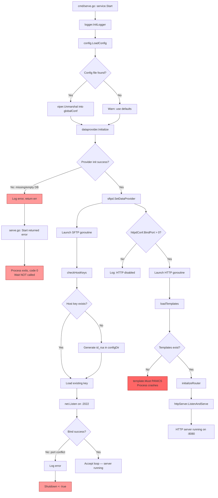
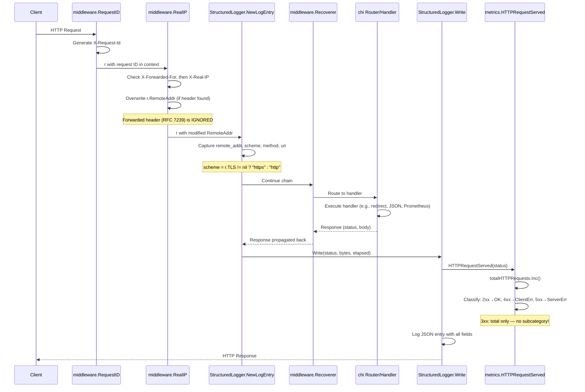

# SFTPGo v0.9.5-dev — Runtime Behavior Investigation

## Introduction

This document investigates the runtime behavior of **SFTPGo version `0.9.5-dev`** across several specific "first start" scenarios, with particular focus on conditions that produce non-obvious or shifting results between runs.

> **Source**: `utils/version.go:L3` — `const version = "0.9.5-dev"`

### Scope

Six investigation areas are covered:

1. **Configuration search path and working directory effects** — whether a temporary config directory truly isolates SFTPGo state
2. **SQLite data-provider states** — startup behavior when the DB file is missing, empty, or valid
3. **SFTP port conflicts** — what happens when the default SFTP port is already occupied
4. **Missing web UI assets** — impact of absent template files or static assets
5. **Proxy header resolution** — which IP and scheme SFTPGo logs under various proxy headers
6. **Metrics counter behavior** — how `sftpgo_http_*` Prometheus counters move for identical requests with and without proxy headers

### Methodology

- All answers are grounded in source code from branch `sftpgo_44634210287c`
- Every claim references the specific source file and function that proves it, using the format `Source: filename.go:FunctionName` or `Source: filename.go:LLineNumber`
- The repository remains unchanged; any temporary observation scripts described include cleanup guidance
- Illustrative snippets use volatile-field placeholders: `<TIMESTAMP>`, `<REQUEST_ID>`, `<COMMIT_HASH>`, `<BUILD_DATE>`

### Key Dependency Versions

| Package | Version | Source |
|---|---|---|
| SFTPGo | `0.9.5-dev` | `utils/version.go:L3` |
| chi | `v4.0.2+incompatible` | `go.mod:L10` |
| viper | `v1.6.1` | `go.mod:L23` |
| zerolog | `v1.17.2` | `go.mod:L21` |
| prometheus/client_golang | `v1.3.0` | `go.mod:L19` |
| go-sqlite3 | `v2.0.2+incompatible` | `go.mod:L15` |
| lumberjack.v2 | `v2.0.0` | `go.mod:L27` |

---

## Table of Contents

- [1. Configuration Search Path and Working Directory Effects](#1-configuration-search-path-and-working-directory-effects)
- [2. SQLite Data Provider: Three First-Start States](#2-sqlite-data-provider-three-first-start-states)
- [3. SFTP Port Conflict Behavior](#3-sftp-port-conflict-behavior)
- [4. Missing Web UI Templates and Static Assets](#4-missing-web-ui-templates-and-static-assets)
- [5. HTTP Endpoint Response Mapping](#5-http-endpoint-response-mapping)
- [6. Proxy Header Resolution](#6-proxy-header-resolution)
- [7. Metrics Counter Behavior](#7-metrics-counter-behavior)
- [8. Summary Table](#8-summary-table)
- [Appendix A: Startup Sequence Flowchart](#appendix-a-startup-sequence-flowchart)
- [Appendix B: HTTP Request Middleware Pipeline](#appendix-b-http-request-middleware-pipeline)

---

## 1. Configuration Search Path and Working Directory Effects

### Direct Answer

**A temporary config directory does NOT fully isolate SFTPGo state.** Viper's config search path includes `.` (the current working directory) as a fallback, so the process CAN discover `sftpgo.json` from the current working directory even when an explicit `--config-dir` is specified.

### Viper Config Search Path

The configuration loading logic is in `config/config.go:LoadConfig` (lines 145–182). The search path is built in this exact order:

```
Source: config/config.go:LoadConfig (lines 147–149)
```

1. **`viper.AddConfigPath(configDir)`** — the directory passed via `--config-dir` flag (line 147)
2. **`setViperAdditionalConfigPaths()`** — platform-specific paths (line 148)
3. **`viper.AddConfigPath(".")`** — current working directory as the **FINAL fallback** (line 149)

On Linux, `config/config_linux.go:setViperAdditionalConfigPaths` (lines 8–11) adds two platform-specific paths:

```
Source: config/config_linux.go:setViperAdditionalConfigPaths (lines 8–11)
```

- `$HOME/.config/sftpgo`
- `/etc/sftpgo`

**Full search order on Linux:**

```
configDir → $HOME/.config/sftpgo → /etc/sftpgo → . (CWD)
```

Viper uses **first-match-wins** semantics: `viper.ReadInConfig()` at line 151 tries each path in order and stops at the first directory containing a file matching the config name (`sftpgo` by default, from `config/config.go:L99`).

### Why CWD Matters

The repository root contains `sftpgo.json` — a valid configuration file. This creates a subtle trap:

- If you start SFTPGo from the **repo root** with `--config-dir /tmp/mytest`, and `/tmp/mytest` has no `sftpgo.json`, Viper falls through all search paths and eventually finds the repo root's `sftpgo.json` via the `.` (CWD) fallback.
- If you start from an **empty `/tmp`** directory with the same flag, no config file is found at all, and defaults are used.
- If `configDir` **does** contain a matching config file, the search stops there — CWD is never consulted.

This means **starting from the repo root vs. an empty `/tmp` directory silently loads different configuration** even when the same `--config-dir` is used.

### Default Values

When no config file is found (or loading fails), the defaults from `config/config.go:init()` (lines 41–101) are used:

```
Source: config/config.go:init (lines 41–94)
```

| Setting | Default Value |
|---|---|
| SFTP port | `2022` (line 46) |
| HTTP port | `8080` on `127.0.0.1` (lines 88–89) |
| Data provider | SQLite driver, DB name `sftpgo.db` (lines 66–67) |
| Templates path | `templates` (relative) (line 90) |
| Static files path | `static` (relative) (line 91) |
| Backups path | `backups` (relative) (line 92) |

**Important**: When `LoadConfig` fails, it logs a warning but **returns the error** — the caller (`service/service.go:L65`) simply ignores the return value and continues with defaults:

```
Source: service/service.go:L65
```

```go
config.LoadConfig(s.ConfigDir, s.ConfigFile)
```

Note the absence of error checking — the return value is discarded. This means a missing or invalid config file is **not fatal**; the process continues with built-in defaults.

### Log File: CWD-Relative Behavior

The default log file path is a **relative** path:

```
Source: cmd/root.go:L35
```

```go
defaultLogFile = "sftpgo.log"
```

This value flows through `service/service.go:L52` to `logger/logger.go:InitLogger` (line 47), which passes it to `lumberjack.Logger{Filename: logFilePath}`:

```
Source: logger/logger.go:InitLogger (lines 47–56)
```

Lumberjack resolves relative paths against the **current working directory**. Therefore:

- Starting from `/srv/sftpgo` creates `/srv/sftpgo/sftpgo.log`
- Starting from `/tmp` creates `/tmp/sftpgo.log`

**The log file location shifts with the working directory.**

### Host Key Generation Side Effect

When no SSH host keys are configured, `sftpd/server.go:checkHostKeys` (lines 417–430) auto-generates an RSA key:

```
Source: sftpd/server.go:checkHostKeys (lines 417–430)
```

```go
func (c *Configuration) checkHostKeys(configDir string) error {
    var err error
    if len(c.Keys) == 0 {
        autoFile := filepath.Join(configDir, defaultPrivateKeyName)
        if _, err = os.Stat(autoFile); os.IsNotExist(err) {
            // ... generates new private key
            err = c.generatePrivateKey(autoFile)
        }
        c.Keys = append(c.Keys, Key{PrivateKey: defaultPrivateKeyName})
    }
    return err
}
```

The key file is written with `os.OpenFile(file, os.O_RDWR|os.O_CREATE|os.O_TRUNC, 0600)` (`sftpd/server.go:L470`).

**Consequence**: Each fresh temporary configDir gets a **new** RSA host key. The SSH fingerprint changes between runs with different temp directories. The key name is `id_rsa` (`sftpd/server.go:L27` — `const defaultPrivateKeyName = "id_rsa"`).

### SQLite DB Path Resolution

The SQLite DB path is resolved **relative to configDir, NOT CWD**:

```
Source: dataprovider/sqlite.go:initializeSQLiteProvider (lines 23–25)
```

```go
dbPath := config.Name
if !filepath.IsAbs(dbPath) {
    dbPath = filepath.Join(basePath, dbPath)
}
```

Where `basePath` is `configDir` (passed from `service/service.go:L69`). The DB file location is **not CWD-sensitive**.

### Template/Static Path Resolution

Template and static file paths are also resolved **relative to configDir**:

```
Source: httpd/httpd.go:Initialize (lines 81–88)
```

```go
staticFilesPath := c.StaticFilesPath
if !filepath.IsAbs(staticFilesPath) {
    staticFilesPath = filepath.Join(configDir, staticFilesPath)
}
templatesPath := c.TemplatesPath
if !filepath.IsAbs(templatesPath) {
    templatesPath = filepath.Join(configDir, templatesPath)
}
```

These follow `configDir`, **not** CWD.

### CWD Sensitivity Summary

| Resource | Resolved Against | CWD-Sensitive? |
|---|---|---|
| Config file search | configDir → platform paths → `.` (CWD) | **YES** (CWD is final fallback) |
| Log file path | CWD (lumberjack resolves relative paths) | **YES** |
| SQLite DB file | configDir | No |
| Templates path | configDir | No |
| Static files path | configDir | No |
| Host key generation | configDir | No |

### Illustrative Startup Log Snippets

**Scenario A**: Starting from repo root (CWD has `sftpgo.json`) with empty temp configDir — config found via CWD fallback:

```json
{"level":"debug","time":"<TIMESTAMP>","sender":"config","connection_id":"","message":"config file used: '<REPO_ROOT>/sftpgo.json', config loaded: {SFTPD:{Banner:SFTPGo_0.9.5-dev BindPort:2022 ...} ProviderConf:{Driver:sqlite Name:sftpgo.db ...Password:[redacted]...} HTTPDConfig:{BindPort:8080 BindAddress:127.0.0.1 ...}}"}
```

**Scenario B**: Starting from `/tmp` (no `sftpgo.json` in CWD) with empty temp configDir — no config found, defaults used:

```json
{"level":"warn","time":"<TIMESTAMP>","sender":"config","connection_id":"","message":"error loading configuration file: Config File \"sftpgo\" Not Found in \"[/tmp/empty_config_dir /home/<USER>/.config/sftpgo /etc/sftpgo /tmp]\". Default configuration will be used: {SFTPD:{Banner:SFTPGo_0.9.5-dev BindPort:2022 ...} ProviderConf:{Driver:sqlite Name:sftpgo.db ...Password:[redacted]...} HTTPDConfig:{BindPort:8080 BindAddress:127.0.0.1 ...}}"}
```

---

## 2. SQLite Data Provider: Three First-Start States

All three states are handled in `dataprovider/sqlite.go:initializeSQLiteProvider` (lines 18–51), called from `dataprovider/dataprovider.go:Initialize` (line 260).

### State 1: Missing DB File

```
Source: dataprovider/sqlite.go:initializeSQLiteProvider (lines 27–32)
```

**What happens:**

1. `os.Stat(dbPath)` returns an error (file not found)
2. A warning is logged: `"sqlite database file does not exists, please be sure to create and initialize a database before starting sftpgo"`
3. The error is returned to `dataprovider.Initialize` (line 260), which propagates it to `service/service.go:Start` (line 69)
4. `Start` logs: `"error initializing data provider: %v"` and returns the error (lines 70–73)
5. In `cmd/serve.go` (line 29): `if err := service.Start(); err == nil { service.Wait() }` — since `Start` returned an error, `Wait` is NOT called
6. The process exits

**HTTP endpoints**: **NOT available**. The HTTP goroutine (launched at `service/service.go:L100–109`) is never reached because `Start()` returns before that point.

**Illustrative log output:**

```json
{"level":"warn","time":"<TIMESTAMP>","sender":"dataProvider","connection_id":"","message":"sqlite database file does not exists, please be sure to create and initialize a database before starting sftpgo"}
{"level":"error","time":"<TIMESTAMP>","sender":"service","connection_id":"","message":"error initializing data provider: stat <CONFIG_DIR>/sftpgo.db: no such file or directory"}
```

### State 2: Empty (Zero-Byte) DB File

```
Source: dataprovider/sqlite.go:initializeSQLiteProvider (lines 33–36)
```

**What happens:**

1. `os.Stat(dbPath)` succeeds (file exists)
2. `fi.Size() == 0` is true — the file is zero bytes
3. Returns `errors.New("sqlite database file is invalid, please be sure to create and initialize a database before starting sftpgo")`
4. Same propagation path as State 1 → process exits, no HTTP server

**Illustrative log output:**

```json
{"level":"error","time":"<TIMESTAMP>","sender":"service","connection_id":"","message":"error initializing data provider: sqlite database file is invalid, please be sure to create and initialize a database before starting sftpgo"}
```

### State 3: Valid DB File

```
Source: dataprovider/sqlite.go:initializeSQLiteProvider (lines 37–49)
```

**What happens:**

1. `os.Stat(dbPath)` succeeds and `fi.Size() > 0`
2. Connection string is built: `fmt.Sprintf("file:%v?cache=shared", dbPath)` (line 37)
3. `sql.Open("sqlite3", connectionString)` succeeds
4. `dbHandle.SetMaxOpenConns(1)` is set (line 44) — SQLite requires single-writer access
5. Provider is set and the availability timer starts (`dataprovider/dataprovider.go:L272–274`)
6. SFTP goroutine launches (`service/service.go:L91–98`)
7. HTTP goroutine launches (`service/service.go:L100–109`)
8. HTTP endpoints become available on `127.0.0.1:8080`

**Illustrative log output:**

```json
{"level":"debug","time":"<TIMESTAMP>","sender":"dataProvider","connection_id":"","message":"sqlite database handle created, connection string: \"file:<CONFIG_DIR>/sftpgo.db?cache=shared\""}
```

### Exit Status — Critical Observation

```
Source: cmd/serve.go:L29
```

```go
if err := service.Start(); err == nil {
    service.Wait()
}
```

When `Start()` fails (States 1 and 2), the Cobra command's `Run` function simply returns. **There is no `os.Exit(1)` on this path.** Cobra exits the process with code 0.

**The process does NOT exit with a non-zero status on data provider failure.** This is a silent failure: the only indication is the error log message.

---

## 3. SFTP Port Conflict Behavior

### What Happens on Bind Failure

```
Source: sftpd/server.go:Initialize (lines 178–182)
```

```go
listener, err := net.Listen("tcp", fmt.Sprintf("%s:%d", c.BindAddress, c.BindPort))
if err != nil {
    logger.Warn(logSender, "", "error starting listener on address %s:%d: %v", c.BindAddress, c.BindPort, err)
    return err
}
```

If port 2022 (the default from `config/config.go:L46`) is already in use, `net.Listen` returns an error such as `"listen tcp :2022: bind: address already in use"`. The error is logged and returned.

### Goroutine Error Propagation

The SFTP server runs in a **goroutine** launched from `service/service.go:L91–98`:

```
Source: service/service.go:L91–98
```

```go
go func() {
    logger.Debug(logSender, "", "initializing SFTP server with config %+v", sftpdConf)
    if err := sftpdConf.Initialize(s.ConfigDir); err != nil {
        logger.Error(logSender, "", "could not start SFTP server: %v", err)
        logger.ErrorToConsole("could not start SFTP server: %v", err)
    }
    s.Shutdown <- true
}()
```

When `Initialize` returns an error (bind failure):

1. Error is logged: `"could not start SFTP server: %v"`
2. `s.Shutdown <- true` is sent on the shutdown channel

In `service/service.go:Wait` (line 121): `<-s.Shutdown` unblocks, and the process exits.

### Critical Timing Detail

`Start()` returns `nil` **successfully** at line 116 — **before** the goroutine encounters the bind error. The error is detected **asynchronously**. The sequence is:

1. `Start()` returns `nil` → `cmd/serve.go` calls `service.Wait()`
2. SFTP goroutine runs → attempts `net.Listen` → fails → sends `true` on `Shutdown`
3. `Wait()` unblocks → process exits

### HTTP Server May Briefly Be Accessible

If the data provider initialized successfully and the HTTP port (8080) is free, the HTTP goroutine also launches (at `service/service.go:L100–109`). The HTTP server may briefly be accessible **before** the SFTP goroutine's `Shutdown` signal terminates the process.

### Exit Status

The process exits normally after the `Shutdown` channel fires. **No explicit non-zero exit code is set.** The exit code is 0.

### Illustrative Log Snippets

```json
{"level":"warn","time":"<TIMESTAMP>","sender":"sftpd","connection_id":"","message":"error starting listener on address :2022: listen tcp :2022: bind: address already in use"}
{"level":"error","time":"<TIMESTAMP>","sender":"service","connection_id":"","message":"could not start SFTP server: listen tcp :2022: bind: address already in use"}
```

---

## 4. Missing Web UI Templates and Static Assets

### Missing Templates → Panic at Initialization (Pre-Server)

```
Source: httpd/web.go:loadTemplates (lines 78–104)
```

The `loadTemplates` function uses `template.Must(template.ParseFiles(...))` **four** times:

```go
usersTmpl := template.Must(template.ParseFiles(usersPaths...))       // line 95
userTmpl := template.Must(template.ParseFiles(userPaths...))         // line 96
connectionsTmpl := template.Must(template.ParseFiles(connectionsPaths...))  // line 97
messageTmpl := template.Must(template.ParseFiles(messagePath...))    // line 98
```

`template.Must` is a Go stdlib function that **panics** if `ParseFiles` returns an error. The five required template files are defined at `httpd/web.go:L17–22`:

| Constant | File | Source |
|---|---|---|
| `templateBase` | `base.html` | L18 |
| `templateUsers` | `users.html` | L19 |
| `templateUser` | `user.html` | L20 |
| `templateConnections` | `connections.html` | L21 |
| `templateMessage` | `message.html` | L22 |

Template paths are resolved relative to `configDir` (not CWD) — see `httpd/httpd.go:Initialize` lines 85–88.

### The Panic Is NOT Caught by middleware.Recoverer

`middleware.Recoverer` is registered in `httpd/router.go:L26`, but it only catches panics during HTTP request handling. The `loadTemplates` panic occurs during **initialization** — at `httpd/httpd.go:L89` — **before** `initializeRouter` is called (line 90) and **before** `httpServer.ListenAndServe()` (line 98):

```
Source: httpd/httpd.go:Initialize (lines 89–98)
```

```go
loadTemplates(templatesPath)         // ← panic happens here
initializeRouter(staticFilesPath)    // never reached
httpServer := &http.Server{...}
return httpServer.ListenAndServe()   // never reached
```

This panic propagates up through the HTTP goroutine in `service/service.go:L103–109`. Since the goroutine has **no `recover()`**, the panic crashes the **entire process** with a Go runtime stack trace.

### Missing Static Files → 404 at Runtime (NOT a Panic)

```
Source: httpd/router.go:initializeRouter (lines 127–130)
```

```go
router.Group(func(router chi.Router) {
    router.Use(middleware.DefaultCompress)
    fileServer(router, webStaticFilesPath, http.Dir(staticFilesPath))
})
```

`http.Dir` opens the directory. If individual static files are missing, Go's `http.FileServer` returns a **404** for each missing file at request time. The server starts successfully; missing static assets only cause **per-request 404s**.

### Key Distinction

| Condition | Behavior | Impact |
|---|---|---|
| Missing template files | `template.Must` panics during init | **Process crash** (entire process killed by Go runtime) |
| Missing static files | `http.FileServer` returns 404 per request | **Server runs normally**, individual assets return 404 |

### Illustrative Panic Output

When templates are missing, the process emits a Go runtime panic trace:

```text
panic: open <CONFIG_DIR>/templates/base.html: no such file or directory

goroutine 19 [running]:
html/template.Must(...)
	/usr/local/go/src/html/template/template.go:372
github.com/drakkan/sftpgo/httpd.loadTemplates(0xc0001a2300, 0x1a)
	/path/to/httpd/web.go:95 +0x...
github.com/drakkan/sftpgo/httpd.Conf.Initialize(...)
	/path/to/httpd/httpd.go:89 +0x...
...
```

---

## 5. HTTP Endpoint Response Mapping

The complete route table is defined in `httpd/router.go:initializeRouter` (lines 21–131). The path constants are defined in `httpd/httpd.go:L20–34`.

### GET `/` → 301 Redirect

```
Source: httpd/router.go:L36–38
```

```go
router.Get("/", func(w http.ResponseWriter, r *http.Request) {
    http.Redirect(w, r, webUsersPath, http.StatusMovedPermanently)
})
```

Where `webUsersPath = "/web/users"` (`httpd/httpd.go:L31`).

**Response:**

```http
HTTP/1.1 301 Moved Permanently
Location: /web/users
Content-Type: text/html; charset=utf-8
```

### GET `/web` → 301 Redirect

```
Source: httpd/router.go:L40–42
```

```go
router.Get(webBasePath, func(w http.ResponseWriter, r *http.Request) {
    http.Redirect(w, r, webUsersPath, http.StatusMovedPermanently)
})
```

Where `webBasePath = "/web"` (`httpd/httpd.go:L30`).

**Response:**

```http
HTTP/1.1 301 Moved Permanently
Location: /web/users
Content-Type: text/html; charset=utf-8
```

### GET `/metrics` → Prometheus Output

```
Source: httpd/router.go:L44
```

```go
router.Handle(metricsPath, promhttp.Handler())
```

Where `metricsPath = "/metrics"` (`httpd/httpd.go:L29`).

**Response:**

```http
HTTP/1.1 200 OK
Content-Type: text/plain; version=0.0.4; charset=utf-8
```

Body contains Prometheus text exposition format with all registered counters and gauges.

### GET `/api/v1/version` → Version JSON

```
Source: httpd/router.go:L46–48
```

```go
router.Get(versionPath, func(w http.ResponseWriter, r *http.Request) {
    render.JSON(w, r, utils.GetAppVersion())
})
```

**Response:**

```http
HTTP/1.1 200 OK
Content-Type: application/json; charset=utf-8
```

```json
{"version":"0.9.5-dev","build_date":"<BUILD_DATE>","commit_hash":"<COMMIT_HASH>"}
```

### Unknown Paths → JSON 404

```
Source: httpd/router.go:L28–30
```

```go
router.NotFound(http.HandlerFunc(func(w http.ResponseWriter, r *http.Request) {
    sendAPIResponse(w, r, nil, "Not Found", http.StatusNotFound)
}))
```

`sendAPIResponse` (in `httpd/api_utils.go:L46–61`) sets the `Content-Type` header and writes a JSON response using the `apiResponse` struct (`httpd/httpd.go:L63–67`):

**Response:**

```http
HTTP/1.1 404 Not Found
Content-Type: application/json; charset=utf-8
```

```json
{"error":"","message":"Not Found","status":404}
```

Note: The `error` field is an empty string because `nil` was passed as the error parameter to `sendAPIResponse`.

---

## 6. Proxy Header Resolution

### Middleware Chain

The middleware chain is configured in `httpd/router.go:initializeRouter` (lines 23–26) in this **exact order**:

```
Source: httpd/router.go:L23–26
```

```go
router.Use(middleware.RequestID)
router.Use(middleware.RealIP)
router.Use(logger.NewStructuredLogger(logger.GetLogger()))
router.Use(middleware.Recoverer)
```

1. **`middleware.RequestID`** — generates a unique request ID
2. **`middleware.RealIP`** — overwrites `r.RemoteAddr` based on proxy headers
3. **`logger.NewStructuredLogger`** — structured logger that reads `r.RemoteAddr`
4. **`middleware.Recoverer`** — panic recovery

**Order matters**: `RealIP` runs **before** the logger, so the logger sees the **modified** `RemoteAddr`.

### chi v4.0.2 `middleware.RealIP` Behavior

The `go.mod:L10` confirms `chi v4.0.2+incompatible`. The `middleware.RealIP` implementation in chi v4.0.2:

1. Checks `X-Forwarded-For` header **FIRST**
2. Falls back to `X-Real-IP` header if `X-Forwarded-For` is not present
3. For multi-IP `X-Forwarded-For` (e.g., `"10.0.0.1, 192.168.1.1"`): extracts the **first IP only**
4. Overwrites `r.RemoteAddr` in place with the extracted IP

### `Forwarded` Header (RFC 7239) — NOT Supported

**CRITICAL**: chi v4.0.2's `middleware.RealIP` does **NOT** parse the RFC 7239 `Forwarded` header.

A request with `Forwarded: for=198.51.100.17; proto=https` is **silently ignored**. `r.RemoteAddr` retains the original TCP peer address. This is a significant gap for TLS-terminating reverse proxy scenarios that use the standard `Forwarded` header.

### Scheme Detection Limitation

```
Source: logger/request_logger.go:NewLogEntry (lines 36–39)
```

```go
scheme := "http"
if r.TLS != nil {
    scheme = "https"
}
```

The scheme is determined by `r.TLS`, **NOT** by any forwarded header. Behind a TLS-terminating proxy:

- The proxy-to-SFTPGo connection is plain HTTP
- `r.TLS` is `nil`
- The logged scheme is **always `http`**

This is true regardless of `X-Forwarded-Proto`, `Forwarded: proto=https`, or any other header. chi v4.0.2's `RealIP` middleware only modifies `RemoteAddr` — it does **not** touch the request's scheme or TLS state.

### Access Log Field Structure

```
Source: logger/request_logger.go:NewLogEntry (lines 41–46)
```

The structured log entry captures these fields:

| Field | Value | Source |
|---|---|---|
| `remote_addr` | `r.RemoteAddr` (post-RealIP modification) | L42 |
| `proto` | `r.Proto` (e.g., `HTTP/1.1`) | L43 |
| `method` | `r.Method` | L44 |
| `user_agent` | `r.UserAgent()` | L45 |
| `uri` | `fmt.Sprintf("%s://%s%s", scheme, r.Host, r.RequestURI)` | L46 |
| `request_id` | `middleware.GetReqID(r.Context())` | L48–51 |

After the handler completes, `StructuredLoggerEntry.Write` (line 57–67) adds:

| Field | Value | Source |
|---|---|---|
| `resp_status` | HTTP status code | L63 |
| `resp_size` | Response size in bytes | L64 |
| `elapsed_ms` | Request duration in milliseconds | L65 |

### Working Directory Effect on Header Processing

**NONE.** The middleware chain is pure HTTP processing — CWD has zero influence on proxy header resolution. The IP extraction logic is entirely in-memory and does not reference any filesystem paths.

### Representative Access Log Lines

**Without proxy headers** (direct request from localhost):

```json
{"level":"info","time":"<TIMESTAMP>","sender":"httpd","remote_addr":"127.0.0.1:<PORT>","proto":"HTTP/1.1","method":"GET","user_agent":"curl/7.x","uri":"http://127.0.0.1:8080/api/v1/version","request_id":"<REQUEST_ID>","resp_status":200,"resp_size":67,"elapsed_ms":0,"message":""}
```

**With `X-Forwarded-For: 10.0.0.1`** (single IP):

```json
{"level":"info","time":"<TIMESTAMP>","sender":"httpd","remote_addr":"10.0.0.1","proto":"HTTP/1.1","method":"GET","user_agent":"curl/7.x","uri":"http://127.0.0.1:8080/api/v1/version","request_id":"<REQUEST_ID>","resp_status":200,"resp_size":67,"elapsed_ms":0,"message":""}
```

Note: `remote_addr` has **no port** — `middleware.RealIP` overwrites `RemoteAddr` with just the IP.

**With `X-Forwarded-For: 10.0.0.1, 192.168.1.1`** (multi-IP chain):

```json
{"level":"info","time":"<TIMESTAMP>","sender":"httpd","remote_addr":"10.0.0.1","proto":"HTTP/1.1","method":"GET","user_agent":"curl/7.x","uri":"http://127.0.0.1:8080/api/v1/version","request_id":"<REQUEST_ID>","resp_status":200,"resp_size":67,"elapsed_ms":0,"message":""}
```

Only the **first IP** (`10.0.0.1`) is used; `192.168.1.1` is ignored.

**With `X-Real-IP: 203.0.113.50`** (no XFF present):

```json
{"level":"info","time":"<TIMESTAMP>","sender":"httpd","remote_addr":"203.0.113.50","proto":"HTTP/1.1","method":"GET","user_agent":"curl/7.x","uri":"http://127.0.0.1:8080/api/v1/version","request_id":"<REQUEST_ID>","resp_status":200,"resp_size":67,"elapsed_ms":0,"message":""}
```

`X-Real-IP` is the **fallback** — only used when `X-Forwarded-For` is absent.

**With `Forwarded: for=198.51.100.17; proto=https`** (RFC 7239):

```json
{"level":"info","time":"<TIMESTAMP>","sender":"httpd","remote_addr":"127.0.0.1:<PORT>","proto":"HTTP/1.1","method":"GET","user_agent":"curl/7.x","uri":"http://127.0.0.1:8080/api/v1/version","request_id":"<REQUEST_ID>","resp_status":200,"resp_size":67,"elapsed_ms":0,"message":""}
```

The `Forwarded` header is **completely ignored**. `remote_addr` retains the original TCP peer address. The URI scheme is still `http://` because `r.TLS` is nil.

### Header Priority Summary

| Header Present | Resulting `remote_addr` |
|---|---|
| None | Original TCP peer (e.g., `127.0.0.1:<PORT>`) |
| `X-Forwarded-For: A` | `A` |
| `X-Forwarded-For: A, B, C` | `A` (first IP only) |
| `X-Real-IP: A` | `A` (only when XFF is absent) |
| `X-Forwarded-For: A` + `X-Real-IP: B` | `A` (XFF takes precedence) |
| `Forwarded: for=A` | Original TCP peer (**header ignored**) |
| `Forwarded: for=A` + `X-Forwarded-For: B` | `B` (only XFF is processed) |

---

## 7. Metrics Counter Behavior

### Counter Names

The HTTP-related Prometheus counters are registered in `metrics/metrics.go` (lines 130–148) using `promauto`:

```
Source: metrics/metrics.go:L130–148
```

| Counter Name | Variable | Description |
|---|---|---|
| `sftpgo_http_req_total` | `totalHTTPRequests` | Total HTTP requests served |
| `sftpgo_http_req_ok_total` | `totalHTTPOK` | 2xx responses |
| `sftpgo_http_client_errors_total` | `totalHTTPClientErrors` | 4xx responses |
| `sftpgo_http_server_errors_total` | `totalHTTPServerErrors` | 5xx responses |

### Classification Logic

```
Source: metrics/metrics.go:HTTPRequestServed (lines 220–229)
```

```go
func HTTPRequestServed(status int) {
    totalHTTPRequests.Inc()
    if status >= 200 && status < 300 {
        totalHTTPOK.Inc()
    } else if status >= 400 && status < 500 {
        totalHTTPClientErrors.Inc()
    } else if status >= 500 {
        totalHTTPServerErrors.Inc()
    }
}
```

### The 3xx Gap — Critical Observation

**3xx responses (like the 301 redirects from `/` and `/web`) increment ONLY `totalHTTPRequests`, NOT any subcategory counter.**

There is no `else if status >= 300 && status < 400` branch. This means:

```
sftpgo_http_req_total > (sftpgo_http_req_ok_total + sftpgo_http_client_errors_total + sftpgo_http_server_errors_total)
```

The difference equals the number of 3xx (and 1xx) responses served.

### How Metrics Are Called

```
Source: logger/request_logger.go:Write (line 58)
```

```go
func (l *StructuredLoggerEntry) Write(status, bytes int, elapsed time.Duration) {
    metrics.HTTPRequestServed(status)
    // ... logging ...
}
```

`Write` is invoked by chi's `middleware.RequestLogger` at the end of **every** HTTP request. This means every request — including `GET /metrics` itself — increments the counters.

### Proxy Headers Do NOT Affect Counter Values

`HTTPRequestServed(status)` receives **only** the HTTP status code. It has no access to headers, `r.RemoteAddr`, or any proxy-related information. **Identical requests with and without proxy headers produce identical counter increments.** The only thing that changes is the logged `remote_addr` in the access log — not the metrics.

### `/metrics` Output Snippets — Walkthrough

**Initial state** (fresh startup, no requests served yet):

```text
# HELP sftpgo_http_req_total The total number of HTTP requests served
# TYPE sftpgo_http_req_total counter
sftpgo_http_req_total 0
# HELP sftpgo_http_req_ok_total The total number of HTTP requests served with 2xx status code
# TYPE sftpgo_http_req_ok_total counter
sftpgo_http_req_ok_total 0
# HELP sftpgo_http_client_errors_total The total number of HTTP requests served with 4xx status code
# TYPE sftpgo_http_client_errors_total counter
sftpgo_http_client_errors_total 0
# HELP sftpgo_http_server_errors_total The total number of HTTP requests served with 5xx status code
# TYPE sftpgo_http_server_errors_total counter
sftpgo_http_server_errors_total 0
```

**After `GET /`** (returns 301):

```text
sftpgo_http_req_total 1
sftpgo_http_req_ok_total 0
sftpgo_http_client_errors_total 0
sftpgo_http_server_errors_total 0
```

The 3xx gap in action: `total` incremented, but **no subcategory** was incremented.

**After `GET /api/v1/version`** (returns 200):

```text
sftpgo_http_req_total 2
sftpgo_http_req_ok_total 1
sftpgo_http_client_errors_total 0
sftpgo_http_server_errors_total 0
```

**After `GET /nonexistent`** (returns 404):

```text
sftpgo_http_req_total 3
sftpgo_http_req_ok_total 1
sftpgo_http_client_errors_total 1
sftpgo_http_server_errors_total 0
```

**Important note about self-referential counting**: Each `GET /metrics` request **also** increments the counters (it returns 200). So after viewing `/metrics` once:

```text
sftpgo_http_req_total 4
sftpgo_http_req_ok_total 2
```

The `/metrics` response itself was a 200, so it incremented both `total` and `ok`. The values you see in the `/metrics` output include the count from the **current** request being served.

---

## 8. Summary Table

### Startup Scenarios

| Scenario | Startup Result | Exit Code | HTTP Available? | Key Code Path |
|---|---|---|---|---|
| Clean temp configDir, CWD = repo root | Starts with `sftpgo.json` from CWD fallback | N/A (running) | Yes (if DB valid) | `config/config.go:L149` (CWD fallback) |
| Clean temp configDir, CWD = `/tmp` | Starts with built-in defaults | N/A (running) | Yes (if DB valid) | `config/config.go:L152` (warn, defaults) |
| SQLite DB missing | Startup aborts | 0 (no `os.Exit(1)`) | **No** | `dataprovider/sqlite.go:L27–31` |
| SQLite DB empty (0 bytes) | Startup aborts | 0 (no `os.Exit(1)`) | **No** | `dataprovider/sqlite.go:L33–36` |
| SQLite DB valid | Full startup | N/A (running) | **Yes** | `dataprovider/sqlite.go:L37–49` |
| SFTP port 2022 occupied | SFTP fails async; HTTP goroutine starts then process exits | 0 | **Briefly** (before Shutdown) | `sftpd/server.go:L178–181` |
| Templates missing | **Panic** — process crash | 2 (runtime panic) | **No** | `httpd/web.go:L95–98` |
| Static files missing | Server starts normally | N/A (running) | **Yes** (assets return 404) | `httpd/router.go:L129` |

### HTTP Endpoint Responses

| Request | Status | Response Type | Location Header | Key Code Path |
|---|---|---|---|---|
| `GET /` | 301 | HTML redirect | `/web/users` | `httpd/router.go:L36–38` |
| `GET /web` | 301 | HTML redirect | `/web/users` | `httpd/router.go:L40–42` |
| `GET /metrics` | 200 | Prometheus text | — | `httpd/router.go:L44` |
| `GET /api/v1/version` | 200 | JSON | — | `httpd/router.go:L46–48` |
| `GET /nonexistent` | 404 | JSON | — | `httpd/router.go:L28–30` |

### Proxy Header Behavior

| Header(s) Sent | Logged `remote_addr` | Logged `scheme` | Key Code Path |
|---|---|---|---|
| None | `127.0.0.1:<PORT>` | `http` | (no middleware action) |
| `X-Forwarded-For: 10.0.0.1` | `10.0.0.1` | `http` | chi `middleware.RealIP` |
| `X-Forwarded-For: 10.0.0.1, 192.168.1.1` | `10.0.0.1` | `http` | chi `middleware.RealIP` (first IP) |
| `X-Real-IP: 203.0.113.50` | `203.0.113.50` | `http` | chi `middleware.RealIP` (fallback) |
| `Forwarded: for=198.51.100.17; proto=https` | `127.0.0.1:<PORT>` | `http` | **IGNORED** — chi v4.0.2 limitation |

### Metrics Counter Increments

| Request | Status | `req_total` | `req_ok_total` | `client_errors` | `server_errors` |
|---|---|---|---|---|---|
| `GET /` | 301 | +1 | — | — | — |
| `GET /api/v1/version` | 200 | +1 | +1 | — | — |
| `GET /nonexistent` | 404 | +1 | — | +1 | — |
| `GET /metrics` | 200 | +1 | +1 | — | — |
| Same request with proxy headers | same | same | same | same | same |

---

## Appendix A: Startup Sequence Flowchart



**Notes on the flowchart:**

- `config.LoadConfig` searches: `configDir` → `$HOME/.config/sftpgo` → `/etc/sftpgo` → `.` (CWD)
- The SFTP and HTTP goroutines launch **concurrently** after provider init succeeds
- The SFTP bind failure triggers asynchronous shutdown (may briefly coexist with running HTTP server)
- Template loading panic is a **synchronous** crash in the HTTP goroutine — kills the entire process

---

## Appendix B: HTTP Request Middleware Pipeline



**Key observations from the pipeline:**

1. `RealIP` modifies `r.RemoteAddr` **before** the logger captures it — the logged IP reflects proxy headers
2. The scheme is determined from `r.TLS`, not headers — behind a TLS-terminating proxy, scheme is always `http`
3. `HTTPRequestServed` receives only the status code — proxy headers do not affect metrics
4. The `GET /metrics` request itself flows through this entire pipeline, incrementing the counters it reports
