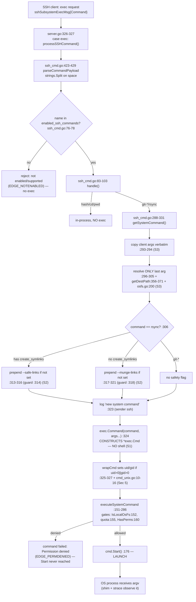

# SFTPGo SSH `exec` System-Command `argv` — Runtime Security Investigation

**Target:** SFTPGo **v0.9.5-dev**, repository checkout at commit `44634210287cb192f2a53147eafb84a33a96826b` ("S3: add support for serving virtual folders").
**Question:** *What exact argument vector (`argv`, including `argv[0]`) does SFTPGo hand to an operating-system process when an SSH client requests an optional "system command" over `exec`?* And, grounded in that evidence, which of three suspicions hold:

- **S1** — the server executes the command "as a shell-like string" (a shell re-parses it);
- **S2** — the rsync "path guardrails and safety flags" are "more of a superficial patch than a real policy";
- **S3** — the "destination that reaches the process might still look a lot like what the client sent."

**Method (evidence-first, canonical entry point only).** Every conclusion below is derived from *captured output of executed code*, not from reading alone. A real SSH client (built on `golang.org/x/crypto/ssh`, the same library the server uses) issues a session `"exec"` request that reaches the canonical dispatch point `processSSHCommand` at `sftpd/server.go:326-327`. The `argv` that crosses the OS-process boundary is captured **three independent ways that must agree**:

1. a **compiled logging shim** placed on `$PATH` under the command's name, which records its own `os.Args` (the literal `argv`, including `argv[0]`) — a faithful syscall-level observation of what `exec.Command(...).Start()` actually launched;
2. SFTPGo's own **structured debug log** line emitted at `sftpd/ssh_cmd.go:323`;
3. **`strace -f -e trace=execve`** on the daemon, i.e. the kernel's view of the `execve(2)` argument array.

A fourth view — a **real `/usr/bin/rsync` 3.4.1** transfer over the same canonical path — corroborates that the `argv` reaches a genuine rsync process and exposes the *actual* downstream effect of the safety flags (Section 3, S2).

Every matrix cell was executed **three times** (three passes); the captured `argv` is byte-identical across passes (Section 2, "argv stability").

---

## Verdict preview

| # | Suspicion (client's words) | Verdict | One-line basis (observed) |
|---|----------------------------|---------|---------------------------|
| **S1** | executed "as a shell like string" | **FALSE — suspicion is WRONG** | `execve` shows the target binary as `argv[0]`; **zero** `/bin/sh`/`bash` on the path; a `$(…)` token is never expanded (`/tmp/pwned` never created). |
| **S2** | safety flags are "a superficial patch … a real policy" a client can neutralize | **MIXED — partly WRONG, partly RIGHT** | The flag is **not** a cosmetic no-op: real rsync with `--safe-links` **refused** escaping symlinks. But the server's rsync-**argument** policy is thin — one conditional flag gated by an exact-string check, **no option allow-list**, all other client options pass **verbatim** (the class of weakness later fixed as CVE-2025-24366). |
| **S3** | destination reaching the process still looks like what the client sent | **CONFIRMED — suspicion is RIGHT** | Only the **last** token is path-resolved (chroot-confined); every other client token — options, metacharacters, non-final path-like tokens — reaches `argv` **byte-for-byte**. |

Full grounding, with complete unedited captures, follows.

---

## Section 1 — Build, configuration & the complete reproducible harness

Everything in this section was run as a normal user would, in SFTPGo's default configuration except for the single required override that enables the system command under test. **All artifacts live under `/tmp/sftpgo_probe/`, outside the repository checkout**; the repository is left byte-for-byte unchanged (Section 6).

### 1.1 Toolchain (exact, observed)

```text
$ go version
go version go1.13.15 linux/amd64
$ gcc --version | head -1
gcc (Ubuntu 15.2.0-4ubuntu4) 15.2.0
$ rsync --version | head -1
rsync  version 3.4.1  protocol version 32
$ command -v git-upload-pack; git --version
/usr/bin/git-upload-pack
git version 2.51.0
$ strace --version | head -1
strace -- version 6.16
$ sqlite3 --version | head -1
3.46.1 2024-08-13 ...
$ ssh -V
OpenSSH_10.0p2 Ubuntu-5ubuntu5.4, OpenSSL 3.5.3 16 Sep 2025
```

The Go toolchain is the 1.13 series pinned by the project (`go 1.13` in `go.mod:3`; `.travis.yml:7-8` pins `go:` → `- "1.13.x"`). The C compiler is **gcc 15.2.0** (required for the CGO SQLite driver — see §1.3).

### 1.2 Canonical build (default data provider, CGO enabled)

```text
$ cd <repo>
$ CGO_ENABLED=1 go build -o /tmp/sftpgo_probe/sftpgo .
# github.com/mattn/go-sqlite3
sqlite3-binding.c: In function ‘sqlite3SelectNew’:
sqlite3-binding.c:125801:10: warning: function may return address of local variable [-Wreturn-local-addr]
125801 |   return pNew;
       |          ^~~~
sqlite3-binding.c:125761:10: note: declared here
125761 |   Select standin;
       |          ^~~~~~~
$ /tmp/sftpgo_probe/sftpgo --version
SFTPGo version: 0.9.5-dev
```

The single C warning (`-Wreturn-local-addr`) originates in the **vendored SQLite amalgamation** inside `github.com/mattn/go-sqlite3` (not SFTPGo code); it is benign and the build succeeds (exit 0). The version string is defined at `utils/version.go:3` (`const version = "0.9.5-dev"`).

### 1.3 CGO clarification (observed — corrects a common misstatement)

The default data provider is SQLite via `github.com/mattn/go-sqlite3 v2.0.2+incompatible`, a **CGO** package. Precisely:

- **The binary compiles even with `CGO_ENABLED=0`** — `CGO_ENABLED=0 go build` exits 0 and produces a runnable binary.
- **But SQLite is non-functional at runtime without CGO.** The `!cgo` build tag selects `static_mock.go`, which registers a stub driver whose `Open()` returns an error. Driving the no-CGO binary against the SQLite config produces, at runtime:

```text
$ /tmp/sftpgo_probe/sftpgo_nocgo serve -c /tmp/sftpgo_probe/cfg -l ""
... {"level":"warn","sender":"sqlite","message":"check availability error: Binary was compiled with
'CGO_ENABLED=0', go-sqlite3 requires cgo to work. This is a stub"}
```

So the correct statement is: **CGO (a C compiler, gcc 15.2.0) is required for a functional default (SQLite) run — not strictly for compilation.** The canonical build in §1.2 uses `CGO_ENABLED=1`.

### 1.4 Configuration — code default vs. sample file vs. this investigation

The generated `sftpgo.json` starts from the repository's sample and changes only what the experiment requires. Deviations are disclosed explicitly:

| Setting | Code default | Sample `sftpgo.json` (repo) | This investigation | Why |
|---|---|---|---|---|
| `sftpd.enabled_ssh_commands` | `{md5sum,sha1sum,cd,pwd}` (`config/config.go:63` → `GetDefaultSSHCommands`) | `{md5sum,sha1sum,cd,pwd}` | `{…,rsync,git-upload-pack,git-receive-pack,git-upload-archive}` | **Required.** None of the exec-capable `systemCommands` is enabled by default; the exec path cannot run without this override. |
| `sftpd.bind_port` | `2022` (`config/config.go:46`) | `2022` | `2022` | unchanged |
| `sftpd.bind_address` | `""` (all ifaces) (`config/config.go:47`) | `""` | `127.0.0.1` | loopback-only for a local experiment (differs from both). |
| `data_provider.driver` / `name` | `sqlite` / `sftpgo.db` (`config/config.go:66-67`) | `sqlite` / `sftpgo.db` | `sqlite` / `/tmp/…/sftpgo.db` | default driver; DB path moved under `/tmp`. |
| `data_provider.track_quota` | `1` (`config/config.go:76`) | `2` | `2` | inherited from the sample (differs from the code default). |

**Data-provider initialization (required in this version).** SQLite is not auto-created; the users table is built by applying the repository migrations in order:

```text
$ for f in sql/sqlite/20190828.sql sql/sqlite/20191112.sql \
           sql/sqlite/20191230.sql sql/sqlite/20200116.sql; do sqlite3 "$DB" < "$f"; done
```

On first launch the daemon auto-generates its SSH host key (README §"Host keys"/`README.md:126`; `sftpd/server.go:27` `defaultPrivateKeyName = "id_rsa"`, `checkHostKeys` at `sftpd/server.go:417`, `generatePrivateKey` at `sftpd/server.go:424`), observed as:

```text
{"level":"info","sender":"sftpd","message":"No host keys configured and \"/tmp/sftpgo_probe/cfg/id_rsa\"
 does not exist; creating new private key for server"}
{"level":"info","sender":"sftpd","message":"Loading private key: /tmp/sftpgo_probe/cfg/id_rsa"}
{"level":"info","sender":"sftpd","message":"server listener registered address: 127.0.0.1:2022"}
```


### 1.5 The complete, reproducible harness

The harness drives the **real** SSH `exec` path and observes the OS-boundary `argv` without editing any SFTPGo source. Three ingredients: a compiled logging **shim** (named `rsync`/`git-upload-pack`, placed first on `$PATH`); a compiled **SSH client driver**; and the daemon run under `strace`.

**(a) argv-capture shim** — `/tmp/sftpgo_probe/src/shim/main.go` (records its own `os.Args`, i.e. the literal `argv`, to `$SHIM_LOG`). A *compiled* binary (not a shell script) is used so `argv[0]` is reported faithfully:

```go
// argv-capture shim. Placed earlier on $PATH under the command NAME, it is the
// process exec.Command(...).Start() actually launches; it records the EXACT argv.
package main

import ( "encoding/json"; "io"; "io/ioutil"; "os"; "time" )

type record struct {
	TS   string   `json:"ts"`
	Exe  string   `json:"exe"`   // resolved path PATH selected
	Argv0 string  `json:"argv0"` // os.Args[0] exactly as exec.Command set it
	Argv []string `json:"argv"`  // full argument vector, verbatim
	Argc int      `json:"argc"`
	Cwd  string   `json:"cwd"`
	UID  int      `json:"uid"`;  EUID int `json:"euid"`
	GID  int      `json:"gid"`;  EGID int `json:"egid"`
	PPID int      `json:"ppid"`
	Tag  string   `json:"tag"`
}

func main() {
	go func() { _, _ = io.Copy(ioutil.Discard, os.Stdin) }() // drain stdin (Go 1.13: ioutil.Discard)
	exe, _ := os.Executable(); cwd, _ := os.Getwd()
	argv0 := ""; if len(os.Args) > 0 { argv0 = os.Args[0] }
	r := record{ TS: time.Now().UTC().Format(time.RFC3339Nano), Exe: exe, Argv0: argv0,
		Argv: os.Args, Argc: len(os.Args), Cwd: cwd,
		UID: os.Getuid(), EUID: os.Geteuid(), GID: os.Getgid(), EGID: os.Getegid(),
		PPID: os.Getppid(), Tag: os.Getenv("SHIM_TAG") }
	b, _ := json.Marshal(r); b = append(b, '\n')
	logPath := os.Getenv("SHIM_LOG")
	f, _ := os.OpenFile(logPath, os.O_APPEND|os.O_CREATE|os.O_WRONLY, 0644)
	defer f.Close(); _, _ = f.Write(b); os.Exit(0)
}
```

```text
# Build the shim (no CGO needed) and install under both command names, first on PATH:
$ CGO_ENABLED=0 go build -o /tmp/sftpgo_probe/shimbin/rsync /tmp/sftpgo_probe/src/shim/main.go
$ cp /tmp/sftpgo_probe/shimbin/rsync /tmp/sftpgo_probe/shimbin/git-upload-pack
```

**(b) SSH client driver** — `/tmp/sftpgo_probe/src/client/main.go` (issues one `exec` request with an exact raw command string via `golang.org/x/crypto/ssh` — the same library the server uses):

```go
package main

import ( "flag"; "fmt"; "os"; "time"; "golang.org/x/crypto/ssh" )

func main() {
	addr := flag.String("addr", "127.0.0.1:2022", "")
	user := flag.String("user", "", ""); pass := flag.String("pass", "", "")
	cmd  := flag.String("cmd",  "", "raw exec payload, sent verbatim")
	flag.Parse()
	cfg := &ssh.ClientConfig{ User: *user, Auth: []ssh.AuthMethod{ssh.Password(*pass)},
		HostKeyCallback: ssh.InsecureIgnoreHostKey(), Timeout: 10 * time.Second }
	client, err := ssh.Dial("tcp", *addr, cfg)
	if err != nil { fmt.Fprintf(os.Stderr, "dial/auth: %v\n", err); os.Exit(2) }
	defer client.Close()
	sess, err := client.NewSession()
	if err != nil { fmt.Fprintf(os.Stderr, "session: %v\n", err); os.Exit(3) }
	defer sess.Close()
	fmt.Printf("CLIENT sending exec payload: %q\n", *cmd)
	out, runErr := sess.CombinedOutput(*cmd)          // <-- issues the "exec" request
	fmt.Printf("CLIENT output: %q; result: %v\n", string(out), runErr)
}
```

```text
# Build with the module cache only (Go 1.13 has no -mod=mod); x/crypto is already in go.sum:
$ cd <repo> && GOPROXY=off GOSUMDB=off CGO_ENABLED=0 \
      go build -o /tmp/sftpgo_probe/ssh_client /tmp/sftpgo_probe/src/client/main.go
```

**(c) Provision the two permission contexts (+ one auxiliary).** In this version the HTTP management API's user routes are mounted with **no auth middleware** (`httpd/router.go:22-26` wires only `RequestID`, `RealIP`, `StructuredLogger`, `Recoverer`; `router.Post(userPath, addUser)` at `:79-81`, `addUser` at `httpd/api_user.go:75`), so users are created with an unauthenticated POST — itself a notable default, but orthogonal to the exec argv:

```text
$ curl -s -XPOST http://127.0.0.1:8080/api/v1/user -H 'Content-Type: application/json' -d @- <<JSON
{"username":"usera","password":"pw","home_dir":"/tmp/sftpgo_probe/homes/usera","status":1,
 "permissions":{"/":["download","upload","create_dirs","list","overwrite","delete","rename","create_symlinks"]}}
JSON
# usera  -> HAS create_symlinks  => --safe-links branch
# userb  -> WITHOUT create_symlinks (keeps the 7 perms executeSystemCommand requires) => --munge-links branch
# userc  -> like userb but MISSING "delete"  (exercises the permission-denied gate; Section 2 edges)
# All three users keep the default record uid:0,gid:0 (unmapped) — verified directly in SQLite
# (SELECT username,uid,gid FROM users => usera|0|0, userb|0|0, userc|0|0). The mapped positive-uid
# credential branch of wrapCmd is deliberately NOT exercised at runtime (running a mapped uid/gid is
# out of scope); it is code-derived (INFERRED) in Section 5 from wrapCmd + GetUID/GetGID.
```

`create_symlinks` is `PermCreateSymlinks` (`dataprovider/user.go:36`); the flag branch is selected by `User.HasPerm(PermCreateSymlinks, …)` at `sftpd/ssh_cmd.go:313`. `executeSystemCommand` additionally requires `{download,upload,create_dirs,list,overwrite,delete,rename}` on the path (`sftpd/ssh_cmd.go:158-162`).

**(d) Launch the daemon under strace, shim first on PATH:**

```text
$ export PATH=/tmp/sftpgo_probe/shimbin:$PATH
$ export SHIM_LOG=/tmp/sftpgo_probe/logs/shim.log
$ strace -f -e trace=execve -s 400 -o /tmp/sftpgo_probe/logs/strace.log \
      /tmp/sftpgo_probe/sftpgo serve -c /tmp/sftpgo_probe/cfg \
      -l /tmp/sftpgo_probe/logs/daemon.log -v &
# readiness (proves CGO=1 SQLite is live): 200 + "Alive"
$ curl -s http://127.0.0.1:8080/api/v1/version         # {"version":"0.9.5-dev",...}
$ curl -s http://127.0.0.1:8080/api/v1/providerstatus  # {... "status":"Alive"}
```

**(e) Drive one matrix cell** (the raw command string is sent verbatim; SFTPGo's `parseCommandPayload` splits on spaces at `sftpd/ssh_cmd.go:424`, so each token is exact):

```text
$ SHIM_TAG=CELL1 /tmp/sftpgo_probe/ssh_client -addr 127.0.0.1:2022 -user usera -pass pw \
      -cmd 'rsync --server -vlogDtprze.iLsfxC . data'
```

Each cell's captured `argv` is bound to its record deterministically by the before/after line count of `$SHIM_LOG` (the shim inherits the daemon's fixed environment, so records are strictly ordered). Every cell was run in **three passes** for stability (Section 2).

**(f) Stop & clean up.** The daemon is stopped by the exact PID captured at launch (never a broad `pkill`); all artifacts live under `/tmp/sftpgo_probe/` and are removed at the end (Section 6 shows the repo is unchanged).


---

## Section 2 — The 2×2 argv evidence matrix (core proof)

The matrix crosses **normal vs. adversarial** invocation with **`--safe-links` vs. `--munge-links`** permission context (User A = has `create_symlinks`; User B = does not). For every cell below, three independent views are shown and **agree**: **[shim]** the child's own `os.Args`; **[daemon]** SFTPGo's build-line at `sftpd/ssh_cmd.go:323` (sender `"ssh"`); **[strace]** the kernel `execve(2)`. All captures are complete and unedited (pass 1 shown; passes 2–3 are byte-identical — see "argv stability").

Two things are worth watching across the whole matrix: (1) the daemon emits **two** debug lines per exec — a *raw* `"new ssh command"` line (client tokens as received) and a *built* `"new system command"` line (final `argv`) — letting us see the before/after transformation; and (2) SFTPGo prepends a **name-only** `argv[0]` while PATH resolution picks the real file (shim `argv0` vs `exe`).

### CELL 1 — NORMAL × User A (`create_symlinks` ⇒ `--safe-links`)

Client sends: `rsync --server -vlogDtprze.iLsfxC . data`

```text
[daemon raw ]  new ssh command: "rsync" args: [--server -vlogDtprze.iLsfxC . data] user: usera, error: <nil>
[daemon built] {"level":"debug","sender":"ssh","message":"new system command \"rsync\", with args: [--safe-links --server -vlogDtprze.iLsfxC . /tmp/sftpgo_probe/homes/usera/data] path: /tmp/sftpgo_probe/homes/usera/data"}
[shim ]  {"exe":"/tmp/sftpgo_probe/shimbin/rsync","argv0":"rsync","argv":["rsync","--safe-links","--server","-vlogDtprze.iLsfxC",".","/tmp/sftpgo_probe/homes/usera/data"],"argc":6,"cwd":"/tmp/sftpgo_probe","uid":0,"euid":0,"gid":0,"egid":0,"ppid":65039}
[strace]  execve("/tmp/sftpgo_probe/shimbin/rsync", ["rsync", "--safe-links", "--server", "-vlogDtprze.iLsfxC", ".", "/tmp/sftpgo_probe/homes/usera/data"], 0xc000362300 /* 89 vars */) = 0
```

**Observed:** the server **prepended `--safe-links`** (User A has `create_symlinks`), copied the client options verbatim, and replaced only the final token `data` with the chroot-resolved absolute path `/tmp/sftpgo_probe/homes/usera/data`. `argv[0]` is the target binary `rsync` — **not a shell.** sha256(argv,uid,gid,exe)=`94451e43…`.

### CELL 2 — NORMAL × User B (no `create_symlinks` ⇒ `--munge-links`)

Client sends: `rsync --server -vlogDtprze.iLsfxC . data`

```text
[daemon raw ]  new ssh command: "rsync" args: [--server -vlogDtprze.iLsfxC . data] user: userb, error: <nil>
[daemon built] {"level":"debug","sender":"ssh","message":"new system command \"rsync\", with args: [--munge-links --server -vlogDtprze.iLsfxC . /tmp/sftpgo_probe/homes/userb/data] path: /tmp/sftpgo_probe/homes/userb/data"}
[shim ]  {"exe":"/tmp/sftpgo_probe/shimbin/rsync","argv0":"rsync","argv":["rsync","--munge-links","--server","-vlogDtprze.iLsfxC",".","/tmp/sftpgo_probe/homes/userb/data"],"argc":6,"cwd":"/tmp/sftpgo_probe","uid":0,"euid":0,"gid":0,"egid":0,"ppid":65039}
[strace]  execve("/tmp/sftpgo_probe/shimbin/rsync", ["rsync", "--munge-links", "--server", "-vlogDtprze.iLsfxC", ".", "/tmp/sftpgo_probe/homes/userb/data"], 0xc000362300 /* 89 vars */) = 0
```

**Observed:** identical mechanics to CELL 1 but the server prepended **`--munge-links`** instead — the *only* difference is the one client permission. sha256=`60a72d01…`.

### CELL 3 — ADVERSARIAL × User A (crafted to confuse path/option handling)

Client sends: `rsync --server --sender --safe-links -e.iLsfxC --exclude=$(id>/tmp/pwned) --dest=../../etc/shadow ../../../../../../etc/passwd`

```text
[daemon raw ]  new ssh command: "rsync" args: [--server --sender --safe-links -e.iLsfxC --exclude=$(id>/tmp/pwned) --dest=../../etc/shadow ../../../../../../etc/passwd] user: usera, error: <nil>
[daemon built] {"level":"debug","sender":"ssh","message":"new system command \"rsync\", with args: [--server --sender --safe-links -e.iLsfxC --exclude=$(id>/tmp/pwned) --dest=../../etc/shadow /tmp/sftpgo_probe/homes/usera/etc/passwd] path: /tmp/sftpgo_probe/homes/usera/etc/passwd"}
[shim ]  {"exe":"/tmp/sftpgo_probe/shimbin/rsync","argv0":"rsync","argv":["rsync","--server","--sender","--safe-links","-e.iLsfxC","--exclude=$(id>/tmp/pwned)","--dest=../../etc/shadow","/tmp/sftpgo_probe/homes/usera/etc/passwd"],"argc":8,"cwd":"/tmp/sftpgo_probe","uid":0,"euid":0,"gid":0,"egid":0,"ppid":65039}
[strace]  execve("/tmp/sftpgo_probe/shimbin/rsync", ["rsync", "--server", "--sender", "--safe-links", "-e.iLsfxC", "--exclude=$(id>/tmp/pwned)", "--dest=../../etc/shadow", "/tmp/sftpgo_probe/homes/usera/etc/passwd"], 0xc000362300 /* 89 vars */) = 0
```

**Observed (four distinct confusions, all as suspected):**
1. **Duplicate-flag guard fires:** the client pre-supplied `--safe-links`, so the server did **not** add a second one (the "if not already set" check at `sftpd/ssh_cmd.go:314`). It is a plain exact-string membership test, not a policy.
2. **Shell metacharacters pass verbatim:** `--exclude=$(id>/tmp/pwned)` reaches `argv` **byte-for-byte** — no expansion (see S1 negative proof below; `/tmp/pwned` is never created).
3. **An option-looking destination passes verbatim:** `--dest=../../etc/shadow` is a *non-final* token, so it is **not** path-resolved and reaches rsync exactly as sent.
4. **Only the last token is chroot-confined:** `../../../../../../etc/passwd` → `getDestPath` cleans it to `/etc/passwd` then `ResolvePath` confines it inside the home → `/tmp/sftpgo_probe/homes/usera/etc/passwd`. The traversal is contained, but every other token survives. sha256=`fce0d2c2…`.

### CELL 4 — ADVERSARIAL × User B

Client sends: `rsync --server --munge-links -e.iLsfxC --rsync-path=/tmp/evil --exclude=a;b|c&d$(e) ../../../../../../etc/shadow`

```text
[daemon raw ]  new ssh command: "rsync" args: [--server --munge-links -e.iLsfxC --rsync-path=/tmp/evil --exclude=a;b|c&d$(e) ../../../../../../etc/shadow] user: userb, error: <nil>
[daemon built] {"level":"debug","sender":"ssh","message":"new system command \"rsync\", with args: [--server --munge-links -e.iLsfxC --rsync-path=/tmp/evil --exclude=a;b|c&d$(e) /tmp/sftpgo_probe/homes/userb/etc/shadow] path: /tmp/sftpgo_probe/homes/userb/etc/shadow"}
[shim ]  {"exe":"/tmp/sftpgo_probe/shimbin/rsync","argv0":"rsync","argv":["rsync","--server","--munge-links","-e.iLsfxC","--rsync-path=/tmp/evil","--exclude=a;b|c&d$(e)","/tmp/sftpgo_probe/homes/userb/etc/shadow"],"argc":7,"cwd":"/tmp/sftpgo_probe","uid":0,"euid":0,"gid":0,"egid":0,"ppid":65039}
[strace]  execve("/tmp/sftpgo_probe/shimbin/rsync", ["rsync", "--server", "--munge-links", "-e.iLsfxC", "--rsync-path=/tmp/evil", "--exclude=a;b|c&d$(e)", "/tmp/sftpgo_probe/homes/userb/etc/shadow"], 0xc000362300 /* 89 vars */) = 0
```

**Observed:** the client pre-supplied `--munge-links` (guard suppresses the duplicate). The **dangerous `--rsync-path=/tmp/evil` reaches `argv` verbatim** — this version has **no rsync option allow-list**, so an option that redirects the remote rsync binary is passed straight through. Metacharacters `a;b|c&d$(e)` survive verbatim (again, no shell). sha256=`1ea389d0…`.

### Matrix at a glance

| Cell | Invocation | Ctx (perm) | Flag the server added | Client tokens surviving verbatim | Last token resolved to |
|------|-----------|------------|-----------------------|----------------------------------|------------------------|
| 1 | normal | A (`create_symlinks`) | `--safe-links` (prepended) | all options | `…/usera/data` |
| 2 | normal | B (none) | `--munge-links` (prepended) | all options | `…/userb/data` |
| 3 | adversarial | A | none (client already sent `--safe-links`) | `--sender`, `-e.iLsfxC`, `--exclude=$(id>/tmp/pwned)`, `--dest=../../etc/shadow` | `…/usera/etc/passwd` |
| 4 | adversarial | B | none (client already sent `--munge-links`) | `-e.iLsfxC`, `--rsync-path=/tmp/evil`, `--exclude=a;b|c&d$(e)` | `…/userb/etc/shadow` |

### Supplementary probes

**PROBE 5a — duplicate suppression (User A sends `--safe-links`):** `rsync --safe-links --server . data`
```text
[shim] argv=["rsync","--safe-links","--server",".","/tmp/sftpgo_probe/homes/usera/data"]   (argc 5)
```
`--safe-links` appears **exactly once** — the guard at `:314` suppressed the server's duplicate. sha256=`14891ff9…`.

**PROBE 5b — contradictory flags (User A sends `--munge-links`):** `rsync --munge-links --server . data`
```text
[shim] argv=["rsync","--safe-links","--munge-links","--server",".","/tmp/sftpgo_probe/homes/usera/data"]   (argc 6)
```
The server still prepends `--safe-links` (User A qualifies), so **both `--safe-links` and `--munge-links` coexist** in one argv — the exact contradictory-flag state a client can force. sha256=`5c805215…`.

**PROBE 6 — git-upload-pack gets no safety flag:** `git-upload-pack repo.git`
```text
[shim] {"exe":"/tmp/sftpgo_probe/shimbin/git-upload-pack","argv0":"git-upload-pack","argv":["git-upload-pack","/tmp/sftpgo_probe/homes/usera/repo.git"],"argc":2}
```
The `--safe-links`/`--munge-links` block is guarded by `if c.command == "rsync"` (`sftpd/ssh_cmd.go:306`), so **only rsync** receives a safety flag; `git-*` commands do not. `argv[0]`=`git-upload-pack`, exe=shim. sha256=`081bf26d…`.

### Third view at scale + the NEGATIVE no-shell proof (strace)

Across the smoke test + 3 passes the daemon issued **29 `execve` calls total = 1× the `sftpgo` daemon itself + 22× the rsync shim + 6× the git-upload-pack shim.** Representative lines (note the target binary is always `argv[0]`, never a shell):

```text
65039 execve("/tmp/sftpgo_probe/sftpgo", ["/tmp/sftpgo_probe/sftpgo", "serve", "-c", "/tmp/sftpgo_probe/cfg", "-l", "/tmp/sftpgo_probe/logs/daemon.log", "-v"], .. /* 89 vars */) = 0
65883 execve("/tmp/sftpgo_probe/shimbin/rsync", ["rsync", "--safe-links", "--server", "-vlogDtprze.iLsfxC", ".", "/tmp/sftpgo_probe/homes/usera/data"], .. /* 89 vars */) = 0
65944 execve("/tmp/sftpgo_probe/shimbin/rsync", ["rsync", "--server", "--sender", "--safe-links", "-e.iLsfxC", "--exclude=$(id>/tmp/pwned)", "--dest=../../etc/shadow", "/tmp/sftpgo_probe/homes/usera/etc/passwd"], .. /* 89 vars */) = 0
66123 execve("/tmp/sftpgo_probe/shimbin/git-upload-pack", ["git-upload-pack"], .. /* 89 vars */) = 0
```

**NEGATIVE proof (S1).** Grepping the entire matrix strace for any shell `execve` returns nothing:

```text
$ grep -E 'execve\("(/usr)?/bin/(sh|bash|dash|zsh)"' /tmp/sftpgo_probe/logs/strace.log
(none)
```

The only `-c` anywhere in the trace is the daemon's own `serve -c <configdir>` flag — **there is no `sh -c`**. SFTPGo never launches a shell to run the command.

### argv stability across 3 passes (Finding: magnitude/stability)

For each launching case, sha256 over `{argv, uid, gid, exe}` is **identical across all three passes**; the two non-launching edge cases produce zero OS processes on all three passes (expected). Full manifest (`stability_manifest.json`):

| Case | sha256 (all 3 passes) | Stable |
|------|-----------------------|--------|
| CELL1 | `94451e430e404ad247b8ea0d1c77f89c7d5fa11311e28d9690912e1d9dc0fe65` | YES ✓ |
| CELL2 | `60a72d0125562ff6f5196a820b2db31d24848e821ec932188c808def758feccf` | YES ✓ |
| CELL3 | `fce0d2c2d6c93ca45000d34a017bee2cafe2cda76297b779bf08c4d54ac7985b` | YES ✓ |
| CELL4 | `1ea389d02269e6ee766bfeac45723a29e9d193c1f816702d4fb9df71a5588553` | YES ✓ |
| PROBE5a | `14891ff983309896f5738dbe47c10ea494028dbcf9aa6ff5cf1a33152c84f75a` | YES ✓ |
| PROBE5b | `5c80521548118c7a9e24189549a5f61eb04898e981ec34736c12c6fe8ba4ee28` | YES ✓ |
| PROBE6 | `081bf26d300baea14e5419d72c6b1cdce6b3c0132e9c47a6071c344c96747081` | YES ✓ |
| EDGE_EMPTY | `e3a869dc147bc5e5659fd822ca329d37990f43bc0f7869297117e929db29c202` | YES ✓ |
| EDGE_NOTENABLED | (no OS process) | N/A — expected |
| EDGE_PERMDENIED | (no OS process) | N/A — expected |

The `argv` is fully deterministic: there is no run-to-run variation.

### Error / edge branches (not just the happy path)

**EDGE_EMPTY — single-token command (empty args branch):** `git-upload-pack`
```text
[daemon] {"sender":"ssh","message":"new system command \"git-upload-pack\", with args: [] path: "}
[shim ]  argv=["git-upload-pack"]  (argc 1)
```
`parseCommandPayload` returns empty args for a single token (`sftpd/ssh_cmd.go:425-427`), so `getSystemCommand` skips path resolution (the `len(c.args) > 0` guard at `:296`); `argv` is just the bare command. sha256=`e3a869dc…`.

**EDGE_NOTENABLED — command not in `enabled_ssh_commands`:** `nosuchcmd foo`
```text
[daemon] {"level":"info","sender":"ssh","message":"ssh command not enabled/supported: \"nosuchcmd\""}
[shim ]  (zero records — no OS process launched)
[client] CLIENT exec output: "..."; wait result: Process exited with status 1
```
Rejected before any exec (`sftpd/ssh_cmd.go:76-78`); no process is created.

**EDGE_PERMDENIED — construction happens, launch does NOT (User C, missing `delete`):** `rsync --server . data`
```text
[daemon build] {"level":"debug","sender":"ssh","message":"new system command \"rsync\", with args: [--munge-links --server . /tmp/sftpgo_probe/homes/userc/data] path: /tmp/sftpgo_probe/homes/userc/data"}
[daemon fail ] {"level":"warn","sender":"ssh","message":"command failed: \"rsync\" args: [--server . data] user: userc err: Permission denied. You don't have the permissions to execute this command"}
[shim ]  (zero records — no OS process launched)
```
This is the empirical **construction-vs-launch** separation: the `argv` is built and logged at `sftpd/ssh_cmd.go:323-324` (the `"new system command"` line appears), but `executeSystemCommand`'s permission gate at `sftpd/ssh_cmd.go:160-162` then denies execution, so `cmd.Start()` at `sftpd/ssh_cmd.go:176` is **never reached** and the shim records nothing (see Section 4).

### S1 negative proof — no server-side shell expansion

The adversarial cells embedded `$(id>/tmp/pwned)`, `$(e)`, and `--rsync-path=/tmp/evil`. Across all passes:

```text
$ ls -l /tmp/pwned /tmp/pwned2 /tmp/evil 2>&1
ls: cannot access '/tmp/pwned': No such file or directory
ls: cannot access '/tmp/pwned2': No such file or directory
ls: cannot access '/tmp/evil': No such file or directory
```

None of these files was ever created ⇒ the `$(…)` command substitution was **not** evaluated by SFTPGo. The tokens are inert strings in `argv`, exactly what a direct `exec` (no shell) produces.


---

## Section 3 — Plain verdicts on the three suspicions

### S1 — "executed as a shell-like string" → **WRONG (suspicion refuted)**

The command is **not** handed to a shell. The terminal call is `exec.Command(c.command, args...)` (`sftpd/ssh_cmd.go:324`), and Go's `os/exec` "intentionally does not invoke the system shell" (official docs — Appendix A). Runtime confirms it three ways: every `execve` shows the **target binary as `argv[0]`** (never `/bin/sh`); the whole-trace grep for a shell `execve` returns **nothing**; and the `$(id>/tmp/pwned)` / `$(e)` substitutions were **never evaluated** (`/tmp/pwned`, `/tmp/evil` never created). There is no shell re-parsing, globbing, pipelining, or redirection on this path. **This suspicion is wrong.**

### S2 — "safety flags are a superficial patch, not a real policy" → **MIXED (partly wrong, partly right)**

This suspicion splits cleanly into two questions the evidence answers differently.

**(a) Are the flags cosmetic no-ops? → NO (this half of the suspicion is wrong).** To test the *actual downstream effect* — not just the `argv` string — the same canonical path was driven against a **real `/usr/bin/rsync` 3.4.1** receiver (second daemon, loopback; `strace_real_execve.txt` + `daemon_real.log` corroborate the same prepended flags). A source tree with two escaping symlinks (`escape_abs -> /etc/passwd`, `escape_rel -> ../../../../../../etc/passwd`) plus a plain `hello.txt` was pushed:

```text
# User A (server added --safe-links):
$ ls -la /tmp/sftpgo_probe/homes/usera/rin/
-rw-r--r-- 1 root root 12 hello.txt          <-- ONLY the safe file landed
# (escaping symlinks REFUSED by rsync; real rsync prints "ignoring unsafe symlink ...")

# User B (server added --munge-links):
$ find /tmp/sftpgo_probe/homes/userb/rin/ -maxdepth 1 -type l -printf '%p -> %l\n'
.../userb/rin/escape_abs -> /rsyncd-munged//etc/passwd                       <-- MUNGED inert
.../userb/rin/escape_rel -> /rsyncd-munged/../../../../../../etc/passwd       <-- MUNGED inert

# Neither home received /etc/passwd content:
$ grep -rl "root:x:0:0" /tmp/sftpgo_probe/homes/{usera,userb}/rin/  ; echo "exit=$?"
exit=1   # (not present)
```

When the flag reaches a real rsync it **works**: `--safe-links` refused the escaping symlinks and `--munge-links` neutralized them with a `/rsyncd-munged/` prefix. So "the guardrails are a superficial no-op" is **refuted** — the flag is a genuine control when honored.

**(b) Is the flag *policy* thin / neutralizable at the argument layer? → YES (this half of the suspicion is right).** The *enforcement mechanism around the flag* is weak in exactly the way suspected:
- **Presence-only, exact-string guard.** Insertion is skipped whenever the literal token already appears (`utils.IsStringInSlice("--safe-links", args)` at `sftpd/ssh_cmd.go:314`; same for `--munge-links` at `:318`) — a membership test, not a policy engine.
- **A client can force a contradictory pair.** PROBE 5b produced `argv=[rsync, --safe-links, --munge-links, --server, …]` — both flags at once; resolution of that conflict is left entirely to rsync.
- **No option allow-list, no format validation.** CELL 4 shows `--rsync-path=/tmp/evil` (which redirects the remote rsync binary) and arbitrary `--exclude=` payloads passing **verbatim**; nothing constrains which rsync options a client may send.

This is precisely the class of weakness upstream later closed as **CVE-2025-24366** ("rsync: enforce a supported format and limit the allowed options", fixed in **SFTPGo v2.6.5**) — hardening that **post-dates** this v0.9.5-dev checkout, which indeed has no allow-list (Appendix A).

**Verdict:** the flags are **not** cosmetic (they function), but the surrounding **argument policy is thin and client-influenceable** — so the suspicion is *half right*. **Scope/limitation (explicit):** the 2×2 shim captures record `argv` only; the shim performs no file I/O, so this investigation did **not** construct a working end-to-end *bypass of an active `--safe-links`* for a `create_symlinks` user. The `argv`-layer weaknesses (verbatim option pass-through, no allow-list, forced flag contradiction) are proven by capture; the downstream real-rsync run shows the flags are honored when present.

### S3 — "the destination reaching the process still looks like what the client sent" → **RIGHT (suspicion confirmed)**

Only the **last** token is transformed. `getSystemCommand` copies all client tokens verbatim (`sftpd/ssh_cmd.go:293-294`) and replaces **only** the final one with the chroot-resolved path (`:296-305`). Everything else — options, `=`-attached values, shell metacharacters, and any **non-final path-like token** — reaches `argv` byte-for-byte. Runtime proof:
- Non-final `--dest=../../etc/shadow` (CELL 3) reached rsync **unmodified** (never resolved).
- The last token `../../../../../../etc/passwd` was cleaned to `/etc/passwd` then **confined** to `/tmp/sftpgo_probe/homes/usera/etc/passwd` — traversal is contained, but the *rest* of the command is the client's verbatim.
- Metacharacter tokens (`$(id>/tmp/pwned)`, `a;b|c&d$(e)`) appear in `argv` exactly as sent.

So the destination/argv delivered to the process **does look a lot like what the client sent**, except for the single last token that is chroot-normalized. **This suspicion is correct.**

---

## Section 4 — Exact functions that produced the observed argv (file:line)

The captured `argv` is produced by **`sshCommand.getSystemCommand()`** at `sftpd/ssh_cmd.go:288-331`, reached via the canonical chain below. Attribution is to the *specific* method/line, not merely the outer caller.

| Step | Function / method (file:line) | Role in the observed argv |
|------|-------------------------------|---------------------------|
| entry | `case "exec":` → `processSSHCommand(...)` — `sftpd/server.go:326-327` | canonical dispatch of the SSH `exec` request |
| parse | `parseCommandPayload()` — `sftpd/ssh_cmd.go:423-429` | `strings.Split(command, " ")`; `parts[0]`=command, `parts[1:]`=args (each token exact) |
| route | `sshCommand.handle()` — `sftpd/ssh_cmd.go:83-103` | hash/`cd`/`pwd` handled in-process (no exec); `git-*`/`rsync` → `getSystemCommand` |
| **build** | **`sshCommand.getSystemCommand()` — `sftpd/ssh_cmd.go:288-331`** | **constructs the exact argv (all evidence above)** |
| — copy | `sftpd/ssh_cmd.go:293-294` | `args := make(...); copy(args, c.args)` — client tokens verbatim (S3) |
| — resolve last | `sftpd/ssh_cmd.go:296-305` + `getDestPath()` `:356-371` + `OsFs.ResolvePath()` `vfs/osfs.go:200` | replaces only the final token with the chroot-confined path (S3) |
| — safety flag | `sftpd/ssh_cmd.go:306-322`; guard `:314`/`:318`; perm `User.HasPerm(PermCreateSymlinks,…)` `:313` (`dataprovider/user.go:36,159`) | rsync-only; prepend `--safe-links`/`--munge-links` "if not already set" (S2) |
| — **log** | `c.connection.Log(LevelDebug, logSenderSSH, "new system command %#v, with args: %v path: %v", …)` — `sftpd/ssh_cmd.go:323` | emits the `"new system command"` line; `logSenderSSH="ssh"` (`sftpd/sftpd.go:26`) |
| — **construct** | `cmd := exec.Command(c.command, args...)` — `sftpd/ssh_cmd.go:324` | **builds `*exec.Cmd` (sets `Path` via PATH lookup, `Args[0]`=name). No shell. Does NOT launch.** |
| — credential | `uid:=User.GetUID(); gid:=User.GetGID(); cmd=wrapCmd(cmd,uid,gid)` — `sftpd/ssh_cmd.go:325-327`; `wrapCmd` `sftpd/cmd_unix.go:10-16` | sets child uid/gid if `uid>0||gid>0` (Section 5) |
| gates+**launch** | `executeSystemCommand()` — `sftpd/ssh_cmd.go:151-286`: `IsLocalOsFs` `:152`, quota `:155`, `HasPerms` `:160`, pipes, then **`cmd.Start()` `:176`** | the gates run **after** construction; `Start()` is the actual launch (see EDGE_PERMDENIED) |

**Construction vs. launch (Finding-specific).** `exec.Command(...)` at `:324` only *constructs* the `*exec.Cmd`; the process is *launched* by `cmd.Start()` at `:176`, inside `executeSystemCommand` and **after** its permission gate at `:160-162`. EDGE_PERMDENIED proves this empirically: the `argv` is built and logged (`:323-324`) yet the shim records nothing because `Start()` is never reached.

**End-to-end flow (all gates shown):**




---

## Section 5 — What the results do and do not imply about a privilege-boundary break

The evidence bears on **two different boundaries** that must not be conflated.

**(1) Sanitization / containment boundary — the argv is overwhelmingly client-controlled.** This is *demonstrated*. Every client token except the last reaches the process verbatim; there is no shell (S1) so the exposure is to the target binary's own option parsing, not to arbitrary shell command execution; and the only server-imposed constraints on the exec path are the chroot of the final token (`ResolvePath`, `vfs/osfs.go:200`), the per-path permission gate (`sftpd/ssh_cmd.go:160-162`), the local-fs gate (`:152`), and — for rsync only — one prependable safety flag. There is **no** rsync option allow-list in this version (S2). So a client with exec rights has broad influence over the argv handed to rsync/git.

**(2) Privilege / credential boundary — NOT shown to be broken by the argv.** Whether the launched process runs at *elevated* privilege is a separate, credential-level question decided by `wrapCmd` (`sftpd/cmd_unix.go:10-16`):

```go
func wrapCmd(cmd *exec.Cmd, uid, gid int) *exec.Cmd {
	if uid > 0 || gid > 0 {
		cmd.SysProcAttr = &syscall.SysProcAttr{}
		cmd.SysProcAttr.Credential = &syscall.Credential{Uid: uint32(uid), Gid: uint32(gid)}
	}
	return cmd
}
```

The credential is applied **only if `uid > 0 || gid > 0`**, using the *user record's* mapped uid/gid from `User.GetUID()`/`GetGID()` (`dataprovider/user.go:237,245`; `GetUID` returns `-1` when the record's uid is `≤0` or `>65535`).

**Observed (canonical run — all three provisioned users are unmapped, record `uid:0`).** In the canonical configuration validated here every user keeps the default record `uid:0,gid:0` (confirmed directly in SQLite: `SELECT username,uid,gid FROM users` → `usera|0|0`, `userb|0|0`, `userc|0|0`). For such a record `GetUID()`/`GetGID()` return `-1`, so the `uid > 0 || gid > 0` guard is **not** taken, `wrapCmd` sets **no** `Credential`, and the child simply inherits the daemon's own uid/gid. The shim captured this directly for the launching cell (the daemon happened to run as root in this run):

```text
# usera/userb/userc all keep record uid:0 -> GetUID/GetGID return -1 -> wrapCmd does nothing:
[shim CELL1] argv=["rsync","--safe-links","--server","-vlogDtprze.iLsfxC",".","/tmp/sftpgo_probe/homes/usera/data"]
             uid:0, euid:0, gid:0, egid:0                  <-- child inherits the daemon's uid (root here)
```

**Inferred (code-derived — a mapped positive uid was NOT run; that branch is deliberately out of scope).** For a user record whose `uid`/`gid` is a mapped positive value (e.g. `1000`), the *same two functions* return `GetUID()==1000` / `GetGID()==1000`, so the `uid > 0 || gid > 0` guard **is** taken and `wrapCmd` sets `Credential{Uid:1000, Gid:1000}` — the child *would* be launched as `1000:1000`. This outcome is **not observed here** (no mapped user was provisioned; running one is out of scope); it is derived directly from the two functions cited above — `wrapCmd` (`sftpd/cmd_unix.go:10-16`) and `GetUID`/`GetGID` (`dataprovider/user.go:237,245`) — and is therefore labeled **INFERRED**.

So the child's privilege is a **property of the daemon's own uid and the user's mapping, not of the argv.** In this run the daemon happened to run as root, so the (unmapped) users' children ran as root (`uid:0`, observed) — but that is the *deployment's* choice of who runs SFTPGo, not something the client-controlled argv caused or could change. A user with a mapped positive uid *would* instead be confined to that uid/gid (INFERRED, above).

**Precise boundary statement.** The captures prove a **containment/sanitization concern** (client-shaped argv + thin rsync-argument policy), which becomes a **privilege concern only in deployments that (a) run SFTPGo as a high-privilege account and (b) leave users unmapped** — because then the client-shaped argv executes with that high privilege. The evidence does **not** demonstrate a *privilege-escalation defect in SFTPGo itself*: there is no path where the argv rewrote its own credentials, and a mapped user *would* be dropped to its mapped uid/gid (INFERRED / code-derived above — a mapped uid was not run). **Scope caveat:** the credential observation is on Linux (`cmd_unix.go`; `// +build !windows`); on Windows `wrapCmd` is a no-op (`sftpd/cmd_windows.go:7-9`), so no credential is ever applied there. Two further honesty caveats: the shim runs as whatever `wrapCmd` set but performs **no** privileged action, so this is evidence of the *credential the process would carry*, not of a completed privileged operation; and the daemon here ran as root, so the elevated-child observation is scoped to that (common) deployment.

**NAME vs. PATH (a related, observed distinction).** SFTPGo passes the command **name** as `argv[0]` (`exec.Command(c.command, …)` → `Args[0]="rsync"`), while the **path** actually launched is chosen by Go's `PATH` lookup inside `exec.Command`. The shim shows this split directly — `argv0:"rsync"` but `exe:"/tmp/sftpgo_probe/shimbin/rsync"`. A client controls the *name* (hence which enabled command runs and its `argv`), but not the *directory* resolution — placement on `PATH` is the operator's responsibility.

---

## Section 6 — The repository is left exactly unchanged

Every build/run/observation artifact lives under `/tmp/sftpgo_probe/` (outside the checkout). The only tracked change is the addition of this answer document.

```text
$ git branch --show-current
blitzy-18461f06-43ec-4099-b424-599565cc61cc

$ git status --porcelain            # (before adding this document — clean tree)
$ git diff --name-status 44634210287cb192f2a53147eafb84a33a96826b HEAD
A	blitzy/documentation/sftpgo_44634210287c.md

# The 9 cited source files + go.sum are byte-identical to the base commit:
$ for f in sftpd/ssh_cmd.go sftpd/server.go sftpd/sftpd.go sftpd/cmd_unix.go \
           sftpd/cmd_windows.go dataprovider/user.go vfs/osfs.go README.md go.mod go.sum; do
    git diff --quiet 44634210 HEAD -- "$f" && echo "UNCHANGED: $f" || echo "CHANGED: $f"; done
UNCHANGED: sftpd/ssh_cmd.go
UNCHANGED: sftpd/server.go
UNCHANGED: sftpd/sftpd.go
UNCHANGED: sftpd/cmd_unix.go
UNCHANGED: sftpd/cmd_windows.go
UNCHANGED: dataprovider/user.go
UNCHANGED: vfs/osfs.go
UNCHANGED: README.md
UNCHANGED: go.mod
UNCHANGED: go.sum

$ sha256sum go.mod go.sum
5f0f3d3d4b837c7db9109058f95254b1236ca341b887a609e5d9129ba17d05e5  go.mod
a318aa80e27080dac8a785f445adf3845d8c3c5da147421c7262c0836375bce5  go.sum
```

No source, configuration, test, or dependency file was modified; `go.mod`/`go.sum` are untouched. The only addition is `blitzy/documentation/sftpgo_44634210287c.md`.

---

## Appendix A — External references

- **Go `os/exec` (no-shell semantics).** Official package documentation, pkg.go.dev/os/exec — the package "intentionally does not invoke the system shell" and "behaves more like C's `exec` family," so arguments populate the child's `argv` as-is with no shell splitting or globbing. Anchors S1.
- **SFTPGo rsync safety behavior.** The project's own SSH-commands documentation (and `README.md:154-159`) states that with the `create_symlinks` permission the server adds `--safe-links` (if not already set) to the received rsync command, and `--munge-links` (if not already set) otherwise. Matches `sftpd/ssh_cmd.go:306-322`.
- **Upstream hardening / CVE.** Later upstream commit `b347ab6` ("rsync: enforce a supported format and limit the allowed options") = **CVE-2025-24366**, fixed in **SFTPGo v2.6.5**, introduced an rsync option allow-list and format enforcement. This post-dates the v0.9.5-dev checkout under test, which therefore lacks option allow-listing (grounds the S2(b) "thin policy" finding for *this* version).
- **Host-key auto-generation & config keys.** `README.md:126` (host keys) and `README.md:154` (`enabled_ssh_commands`); `.travis.yml:7-8` pins the Go 1.13 toolchain used for the build.

---

## Final coverage pass — every part of the question answered

| Question / named item | Answer | Where (this doc) |
|---|---|---|
| Exact argv reaching an OS process | Captured 3 ways (shim/daemon/strace), byte-identical across 3 passes | Section 2 |
| Two representative invocations (normal + adversarial) | CELL 1/2 (normal), CELL 3/4 (adversarial) + probes | Section 2 |
| Two permission contexts | User A `--safe-links` vs User B `--munge-links` (only `create_symlinks` differs) | §1.5, Section 2 |
| **S1** shell-like execution | **WRONG** — direct `exec`, no shell; negative strace + no `$(…)` expansion | §Verdict, Section 3 (S1) |
| **S2** superficial safety flags | **MIXED** — flags work vs real rsync (refutes "cosmetic"); but thin argument policy, no allow-list (CVE-2025-24366), forced flag contradiction (confirms "not a real policy") | Section 3 (S2) |
| **S3** client-controlled destination | **RIGHT** — all tokens verbatim except the last (chroot-resolved) | Section 3 (S3) |
| Exact functions producing the argv | `getSystemCommand` `sftpd/ssh_cmd.go:288-331` (copy `:293-294`, resolve `:296-305`, flag `:306-322`, log `:323`, `exec.Command` `:324`); `parseCommandPayload` `:423-429`; `getDestPath` `:356-371`; `wrapCmd` `cmd_unix.go:10-16`; launch `cmd.Start()` `:176` | Section 4 |
| Privilege-boundary implication | Containment concern (argv client-shaped) is real; privilege concern only for root+unmapped deployments; no SFTPGo self-escalation shown; unmapped child observed at `uid:0`, mapped-user drop to its uid/gid is code-derived (INFERRED) | Section 5 |
| Repository left unchanged | `git status` clean; 9 files + go.sum byte-identical; only the answer doc added | Section 6 |
| Build/invocation commands (default, canonical) | gcc 15.2.0 + Go 1.13.15, `CGO_ENABLED=1 go build`, version 0.9.5-dev; config deviations disclosed | Section 1 |

**Observed vs. inferred.** Every behavioral claim above is *observed* (captured argv, logs, strace, real-rsync results, and the **unmapped/root** child credential `uid:0`) **except** two explicitly *inferred* items: (1) the internal mechanics of `exec.Command` (that it sets `Args[0]` to the name and resolves `Path` via `PATH`) — inferred from Go's documented `os/exec` contract but independently corroborated by the shim's `argv0` vs `exe` split; and (2) the **mapped positive-uid credential drop** to `1000:1000` — a mapped uid/gid was **not** run (out of scope), so this is code-derived from `wrapCmd` (`sftpd/cmd_unix.go:10-16`) + `GetUID`/`GetGID` (`dataprovider/user.go:237,245`), not observed.
