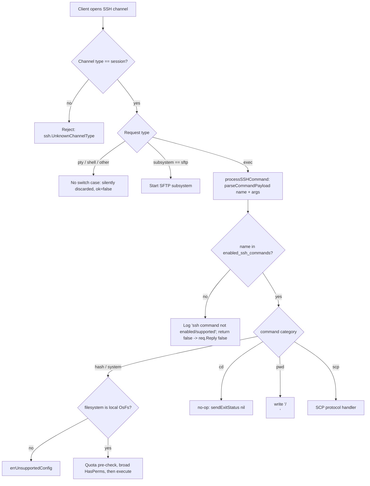

# SFTPGo Security Model for External Utilities over SSH — Evidence-Based Code Analysis

This document answers five entangled security questions about how SFTPGo behaves when
file-synchronization tools (`rsync`), version-control helpers (`git-*`), and other
server-side utilities are invoked over SSH. Every answer is grounded in **the actual
source code at the checked-out commit** and is corroborated by **observed runtime
behavior** captured from a server that was built and exercised with real `ssh`, `scp`,
`sftp`, and `rsync` clients.

---

## Overview

SFTPGo is a fully featured SFTP server with optional SSH-command, SCP, and HTTP/REST
surfaces. Its security model is **layered**, and each question below maps onto a
specific layer:

| Layer | Package(s) | Responsibility |
|-------|------------|----------------|
| **Protocol / command gating** | `sftpd/` (`server.go`, `ssh_cmd.go`, `scp.go`, `sftpd.go`) | Which SSH channels/requests are accepted, which SSH commands may run, how protocol messages are parsed |
| **Authorization** | `dataprovider/` (`user.go`) | Per-directory permission resolution (`HasPerm`/`HasPerms`, most-specific match) |
| **Filesystem containment** | `vfs/` (`osfs.go`) | Chroot-style confinement to the user's home dir (`ResolvePath`, `isSubDir`) |

The five questions are answered against these layers:

- **Q1** — How are server-side utilities turned on/off, and what happens between a
  client initiating a command and the server acting on it? (command gating)
- **Q2** — Where does the server decide what is acceptable when a request triggers
  server-side execution, and what rules does that filtering follow? (trust boundary)
- **Q3** — Do the delimiter/boundary assumptions in protocol-level parsing hold when
  inputs do not follow expected patterns? (input robustness)
- **Q4** — Where is the per-directory permission restriction enforced, and is anything
  transformed before the check? (authorization ordering)
- **Q5** — When do path-traversal/symlink protections engage, and do they cover all
  relevant scenarios? (filesystem containment)

### Commit pin

> All citations and line anchors in this document are faithful to the exact checked-out
> commit. They were re-verified by re-opening each file in the working tree.
>
> - **Commit:** `44634210287cb192f2a53147eafb84a33a96826b`
> - **Branch (source):** `sftpgo_44634210287c`
> - **Module:** `github.com/drakkan/sftpgo`
> - **Go directive:** `go 1.13` (built and run with Go `1.13.15`)
> - **Reported binary version:** `SFTPGo version: 0.9.5-dev`

### Methodology — static evidence + dynamic evidence

The user explicitly required *evidence of how the system behaves in practice*, not
theory. Accordingly, every answer combines two independent forms of evidence:

1. **Static citations** — exact `file:line` anchors at the pinned commit, with minimal
   verbatim snippets. The technical-spec anchors were treated as a *map to confirm*, not
   as ground truth; each line was re-read against the working tree. A few anchors in the
   `getSystemCommand` region were off by 1–2 lines in the spec and are cited here at the
   **lines actually observed** (`ssh_cmd.go` `getSystemCommand` is at L288, `getDestPath()`
   call at L298, `ResolvePath(sshPath)` at L299).
2. **Dynamic transcripts** — captured from a server that was **built CGO-free**
   (`CGO_ENABLED=0 go build`), run with the pure-Go **in-memory** data provider, and
   driven with system `ssh`/`scp`/`sftp`/`rsync` clients. Two instances were used: one
   with the **shipped restrictive defaults** (`enabled_ssh_commands = md5sum, sha1sum,
   cd, pwd`; `enable_scp = false`) and one with the **external system commands (the
   `git-*`/`rsync` family) plus SCP enabled** (the exact command lists appear in the
   harness below; note `sha256sum` is *supported* but deliberately **not** enabled on
   either instance, to demonstrate the supported-vs-enabled distinction in Q2). All
   clients used `-o HostKeyAlgorithms=+ssh-rsa` because the server presents an `ssh-rsa`
   host key, and `scp -O` because modern OpenSSH defaults to SFTP-backed copy.

> **Ephemeral tooling.** Per the task rules, **no SFTPGo source file was modified** and
> **no code was added to the repository**. The compiled binary, throwaway JSON configs,
> generated SSH keys, user home directories, and all transcripts lived **outside** the
> repository (under `/tmp/sftpgo_eval`) and were **deleted** when analysis finished. The
> only committed artifact is this Markdown document.

### Behavioral-test harness — exact, reproducible setup

Every transcript in this document was produced against the following throwaway harness
(all paths under `/tmp/sftpgo_eval`, outside the repository). Two server instances run as
a non-root user against the in-memory provider:

| Instance | SFTP port | `enable_scp` | `enabled_ssh_commands` |
|----------|-----------|--------------|------------------------|
| **A — restrictive default** | 2223 | `false` | `["md5sum","sha1sum","cd","pwd"]` |
| **B — system-commands + SCP** | 2222 | `true` | `["md5sum","sha1sum","rsync","git-receive-pack","git-upload-pack","git-upload-archive","cd","pwd"]` |

`sha256sum` is in `supportedSSHCommands` but is **not** listed by either instance — it is
*supported but not enabled* (used in Q2). Two public-key users were loaded:

| User | Home | Permissions |
|------|------|-------------|
| `testuser` | `/tmp/sftpgo_eval/homes/testuser` | `{"/":["*"], "/private":["list"], "/readonly":["list","download"]}` |
| `nosymuser` | `/tmp/sftpgo_eval/homes/nosymuser` | `{"/":["list","download","upload","create_dirs","overwrite","delete","rename"]}` (all **except** `create_symlinks`) |

All client commands below use this exact option string (a generated 2048-bit RSA key, no
reliance on `~/.ssh/config`):

```text
OPTS="-i /tmp/sftpgo_eval/keys/id_rsa -o IdentitiesOnly=yes \
      -o HostKeyAlgorithms=+ssh-rsa -o PubkeyAcceptedAlgorithms=+ssh-rsa \
      -o StrictHostKeyChecking=no -o UserKnownHostsFile=/dev/null \
      -o BatchMode=yes -o ConnectTimeout=8"
```

Server log lines are shown as `sender | message` (decoded from the server's JSON log);
client output is shown verbatim. The binary self-reported `SFTPGo version: 0.9.5-dev`.

### Trust boundary for a server-side `exec` request

The diagram below summarizes the decision path that every server-side `exec` request
traverses. Every decision happens **after** the client's request is received — the
server never trusts the client to pre-authorize itself.



---

## Q1 — External-utility security model and enable/disable mechanics

### Restated question

Which server-side operations (file-synchronization tools and related utilities) can run
over SSH, how does an operator turn each one on or off, and what exactly happens in the
window between a client initiating an action and the server acting on it?

### Code evidence

**The command taxonomy is a fixed, hard-coded set** — `sftpd/sftpd.go`:

```go
// sftpd/sftpd.go:66-70
supportedSSHCommands = []string{"scp", "md5sum", "sha1sum", "sha256sum", "sha384sum", "sha512sum", "cd", "pwd",
    "git-receive-pack", "git-upload-pack", "git-upload-archive", "rsync"}
defaultSSHCommands = []string{"md5sum", "sha1sum", "cd", "pwd"}
sshHashCommands    = []string{"md5sum", "sha1sum", "sha256sum", "sha384sum", "sha512sum"}
systemCommands     = []string{"git-receive-pack", "git-upload-pack", "git-upload-archive", "rsync"}
```

So there are three behavioral categories plus SCP:
- **Internal hash commands** (`sshHashCommands`, `sftpd/sftpd.go:69`) — computed inside SFTPGo.
- **System commands** (`systemCommands`, `sftpd/sftpd.go:70`) — the `git-*` helpers and `rsync`, executed by spawning the real external binary.
- **No-op/navigation commands** — `cd` and `pwd`, handled specially.
- **`scp`** — SFTPGo's own SCP protocol implementation.

**Dispatch by category** — `sftpd/ssh_cmd.go` `handle()`:

```go
// sftpd/ssh_cmd.go:83-103 (trimmed)
func (c *sshCommand) handle() error {
    ...
    if utils.IsStringInSlice(c.command, sshHashCommands) {        // L87
        return c.handleHashCommands()
    } else if utils.IsStringInSlice(c.command, systemCommands) {  // L89
        command, err := c.getSystemCommand()
        ...
        return c.executeSystemCommand(command)
    } else if c.command == "cd" {                                  // L95
        c.sendExitStatus(nil)                                      // no-op
    } else if c.command == "pwd" {                                 // L97
        c.connection.channel.Write([]byte("/\n"))                  // hard-coded "/"
        c.sendExitStatus(nil)
    }
    return nil
}
```

**Defaults are restrictive and centrally wired**:
- The runtime default is the *restrictive* set, not the supported set — `config/config.go:63` sets `EnabledSSHCommands: sftpd.GetDefaultSSHCommands()`, calling the getter `GetDefaultSSHCommands()` defined at `sftpd/sftpd.go:136`, which returns the `defaultSSHCommands` variable defined at `sftpd/sftpd.go:68`.
- SCP is **off by default** — `config/config.go:58` sets `IsSCPEnabled: false`.
- The shipped config mirrors this — `sftpgo.json:16` `"enable_scp": false`; `sftpgo.json:22` `"enabled_ssh_commands": ["md5sum", "sha1sum", "cd", "pwd"]`.
- The project documentation states the same contract — `README.md:154` (`enabled_ssh_commands`, default `md5sum, sha1sum, cd, pwd`, `*` enables all), `README.md:148` (`enable_scp` default disabled), and per-command notes at `README.md:155-159`, including `README.md:157`: *"Currently `cd` do nothing and `pwd` always returns the `/` path."*

### Rationale / thinking

The enable/disable mechanic is a **string-membership gate over a closed vocabulary**. An
operator can only ever enable a command that already appears in `supportedSSHCommands`;
anything else is dropped at startup (see Q2's `checkSSHCommands`). This is a deliberate
*allow-list* design: rather than trying to sandbox an arbitrary shell, SFTPGo refuses to
acknowledge any verb it does not itself implement or explicitly wrap. The taxonomy split
matters because each category has a different threat profile — hash commands never touch
an external process, `cd`/`pwd` are inert conveniences for mobile clients that lack
`SSH_FXP_REALPATH`, and only the `systemCommands` actually fork an external binary
(hence the additional restrictions analyzed in Q2/Q5). The "window between initiating
and acting" is therefore: *parse the command name → test membership in
`enabled_ssh_commands` → dispatch by category*. Nothing executes before that membership
test passes.

### Behavioral-test recipe and observed evidence

Using the harness above (instance **A** = restrictive default on port 2223; instance
**B** = system-commands + SCP on port 2222). `testuser`'s home was seeded with
`hello.txt` (`md5sum` ground truth on the host: `9da2e881d3f92f99a771aea65ae3ba2b`).

**Enabled internal commands on the restrictive instance A** (`md5sum`, `sha1sum`, and the
inert `cd`/`pwd`) — exact commands and full output:

```text
$ ssh -p 2223 $OPTS testuser@127.0.0.1 pwd
/
$ ssh -p 2223 $OPTS testuser@127.0.0.1 cd
                                                       # no output, exit 0 (no-op)
$ ssh -p 2223 $OPTS testuser@127.0.0.1 "md5sum /hello.txt"
9da2e881d3f92f99a771aea65ae3ba2b  /hello.txt           # exit 0
$ ssh -p 2223 $OPTS testuser@127.0.0.1 "sha1sum /hello.txt"
5988b26d962618baa7b40eb702a61947bf339fc9  /hello.txt   # exit 0
```
The hash is computed by SFTPGo's *internal* implementation and is reported against the
**virtual** path `/hello.txt` (not the on-disk path). `pwd` returns the hard-coded `/`,
and `cd` does nothing — exactly as `sftpd/ssh_cmd.go:95-100` and `README.md:157` state.
Server log (instance A):
```text
ssh | new ssh command: "pwd" args: [] user: testuser, error: <nil>
ssh | new ssh command: "cd" args: [] user: testuser, error: <nil>
ssh | new ssh command: "md5sum" args: [/hello.txt] user: testuser, error: <nil>
ssh | new ssh command: "sha1sum" args: [/hello.txt] user: testuser, error: <nil>
```

**Disabled commands under the shipped default** — `rsync` and `git-receive-pack` are
**not** in instance A's `md5sum, sha1sum, cd, pwd`:

```text
$ ssh -p 2223 $OPTS testuser@127.0.0.1 "rsync --server -vlogDtpre.iLsfxCIvu . /upload"
exec request failed on channel 0                       # client stderr; exit = 255
$ ssh -p 2223 $OPTS testuser@127.0.0.1 "git-receive-pack '/repo.git'"
exec request failed on channel 0                       # exit = 255
```
The server logs the parsed command first, then the gate refusal — `req.Reply(false)`
surfaces to the client as "exec request failed":
```text
ssh | new ssh command: "rsync" args: [--server -vlogDtpre.iLsfxCIvu . /upload] user: testuser, error: <nil>
ssh | ssh command not enabled/supported: "rsync"
ssh | new ssh command: "git-receive-pack" args: ['/repo.git'] user: testuser, error: <nil>
ssh | ssh command not enabled/supported: "git-receive-pack"
```
The **same** verbs behave differently on instance **B**, where the `git-*`/`rsync` family
is enabled: `rsync` is accepted and reaches system-command execution (see Q5 test 6 for
its transcript), and `md5sum` returns the identical hash on both instances:
```text
$ ssh -p 2222 $OPTS testuser@127.0.0.1 "md5sum /hello.txt"
9da2e881d3f92f99a771aea65ae3ba2b  /hello.txt           # exit 0
```
This is the enable/disable mechanic demonstrated end-to-end: the identical client command
is accepted or refused purely by the per-command `enabled_ssh_commands` gate.

### Coverage verdict

**Complete and conservative.** Enable/disable is a precise allow-list keyed on a closed
command vocabulary with a restrictive default (only internal hashes and inert `cd`/`pwd`
ship enabled; SCP and all external-binary commands are off). The gate is enforced on
every `exec` before any dispatch, and the three categories are cleanly separated so that
the higher-risk external-binary path carries extra checks (Q2). No command outside
`supportedSSHCommands` can ever be enabled.


---

## Q2 — Client/server trust boundary and server-side request filtering

### Restated question

When a client request triggers server-side execution, where does the server draw the
trust boundary — i.e., at which point does it decide what is acceptable — and what rules
does that filtering apply?

### Code evidence

**Layer 1 — only `session` channels, only `subsystem`/`exec` requests** — `sftpd/server.go`:

```go
// sftpd/server.go:300-329 (trimmed)
if newChannel.ChannelType() != "session" {                 // L300
    ...
    newChannel.Reject(ssh.UnknownChannelType, "unknown channel type")   // L302
    continue
}
...
// Channels have a type ... Discard anything else we receive ("pty", "shell", etc)   // L312-313
switch req.Type {                                          // L318
case "subsystem":
    if string(req.Payload[4:]) == "sftp" {                 // L320
        ok = true
        go c.handleSftpConnection(channel, connection)
    }
case "exec":
    ok = processSSHCommand(req.Payload, &connection, channel, c.EnabledSSHCommands)  // L327
}
req.Reply(ok, nil)                                         // L329
```
There is **no `case` for `pty` or `shell`** — those requests fall through the switch with
`ok` still `false`, so `req.Reply(false, nil)` silently refuses them.

**Layer 2 — the enable list is the gate inside `processSSHCommand`** — `sftpd/ssh_cmd.go`:

```go
// sftpd/ssh_cmd.go:45-80 (trimmed)
func processSSHCommand(payload []byte, connection *Connection, channel ssh.Channel, enabledSSHCommands []string) bool {
    var msg sshSubsystemExecMsg
    if err := ssh.Unmarshal(payload, &msg); err == nil {
        name, args, err := parseCommandPayload(msg.Command)                       // L48
        ...
        if err == nil && utils.IsStringInSlice(name, enabledSSHCommands) {        // L51  <- the gate
            ...                                                                   // build & dispatch
        } else {
            connection.Log(..., "ssh command not enabled/supported: %#v", name)  // L77
        }
    }
    return false                                                                  // L80 -> req.Reply(false)
}
```

**Layer 0 — startup validation** narrows the configured list to the supported set —
`sftpd/server.go` `checkSSHCommands()` (func at L396):

```go
// sftpd/server.go:397-413 (trimmed)
if utils.IsStringInSlice("*", c.EnabledSSHCommands) {       // "*" -> all supported
    c.EnabledSSHCommands = GetSupportedSSHCommands()
    return
}
sshCommands := []string{}
if c.IsSCPEnabled {                                         // L402: SCP toggle prepends "scp"
    sshCommands = append(sshCommands, "scp")
}
for _, command := range c.EnabledSSHCommands {
    if utils.IsStringInSlice(command, supportedSSHCommands) {
        sshCommands = append(sshCommands, command)
    } else {
        logger.Warn(..., "unsupported ssh command: %#v ignored", command)   // L409
    }
}
c.EnabledSSHCommands = sshCommands                          // L413
```

**Extra gates for the external-binary path** — `sftpd/ssh_cmd.go` `executeSystemCommand`
(func at L151) and `handleHashCommands` (func at L105):

```go
// sftpd/ssh_cmd.go:152-161 (trimmed)
if !vfs.IsLocalOsFs(c.connection.fs) {                 // L152: only the local filesystem
    return c.sendErrorResponse(errUnsupportedConfig)
}
if c.connection.User.QuotaFiles > 0 && c.connection.User.UsedQuotaFiles > c.connection.User.QuotaFiles {  // L155 quota pre-check
    return c.sendErrorResponse(errQuotaExceeded)
}
perms := []string{dataprovider.PermDownload, dataprovider.PermUpload, dataprovider.PermCreateDirs, dataprovider.PermListItems,
    dataprovider.PermOverwrite, dataprovider.PermDelete, dataprovider.PermRename}   // L158-159
if !c.connection.User.HasPerms(perms, c.getDestPath()) {   // L160: requires ALL 7 perms
    return c.sendErrorResponse(errPermissionDenied)
}
```
`handleHashCommands` applies the same local-FS restriction at `sftpd/ssh_cmd.go:106-108`.
The external binary is then launched via `exec.Command(c.command, args...)`
(`sftpd/ssh_cmd.go:324`) and wrapped by `wrapCmd(cmd, uid, gid)` (`sftpd/ssh_cmd.go:327`).

**Privilege handling** — `sftpd/cmd_unix.go`:

```go
// sftpd/cmd_unix.go:10-16
func wrapCmd(cmd *exec.Cmd, uid, gid int) *exec.Cmd {
    if uid > 0 || gid > 0 {
        cmd.SysProcAttr = &syscall.SysProcAttr{}
        cmd.SysProcAttr.Credential = &syscall.Credential{Uid: uint32(uid), Gid: uint32(gid)}
    }
    return cmd
}
```
On Windows the wrapper is a **no-op** — `sftpd/cmd_windows.go:7-9` simply `return cmd`.

### Rationale / thinking

The trust boundary sits **entirely on the server, after the request is received**. The
client cannot choose its own channel handling: a non-`session` channel is rejected with
`ssh.UnknownChannelType`, and within a session only two verbs are honored. The
*absence* of a `pty`/`shell` case is itself the security decision — by never replying
`true` to a shell request, SFTPGo guarantees there is no interactive shell to escape
from. For `exec`, filtering is defense-in-depth and ordered from cheapest to most
specific: (0) startup pruning to the supported vocabulary, (1) per-command membership in
`enabled_ssh_commands`, then for external binaries (2) "must be the local filesystem"
(`git`/`rsync` cannot operate on an S3-backed user), (3) a quota pre-check, and (4) a
*broad* 7-permission requirement — because once an opaque external process runs, SFTPGo
can no longer mediate individual reads/writes, so it demands the user already hold every
relevant permission up front. Finally, `wrapCmd` drops the child to the user's uid/gid
when those are set, so a misbehaving external binary runs with the SFTP user's OS
identity rather than the server's.

### Behavioral-test recipe and observed evidence

**Only `session` channels carrying `subsystem`/`exec` are honored; `pty`/`shell` are
discarded.** Forcing a PTY and interactive shell on instance **B** is rejected outright:
```text
$ ssh -tt -p 2222 $OPTS testuser@127.0.0.1
PTY allocation request failed on channel 0
                                                       # no shell; client exit = 255
```
The request switch has only `subsystem` and `exec` cases and explicitly discards
`pty`/`shell` (`sftpd/server.go:312-329`), so there is no interactive shell to escape from.

**Disallowed exec verbs are refused via `req.Reply(false)`.** On instance **B**
(`enabled_ssh_commands` lists the `git-*`/`rsync` family but **not** `sha256sum`; `whoami`
is not in `supportedSSHCommands` at all) — exact commands:
```text
$ ssh -p 2222 $OPTS testuser@127.0.0.1 "sha256sum /hello.txt"
exec request failed on channel 0                       # supported but NOT enabled; exit = 255
$ ssh -p 2222 $OPTS testuser@127.0.0.1 "whoami"
exec request failed on channel 0                       # not supported at all; exit = 255
```
The server log shows each command **parsed and logged first**, then refused — proving the
parse precedes the gate (`parseCommandPayload` at `sftpd/ssh_cmd.go:48`, the "new ssh command"
log at L49, the membership test at L51, the refusal log at L77):
```text
ssh | new ssh command: "sha256sum" args: [/hello.txt] user: testuser, error: <nil>
ssh | ssh command not enabled/supported: "sha256sum"
ssh | new ssh command: "whoami" args: [] user: testuser, error: <nil>
ssh | ssh command not enabled/supported: "whoami"
```
The client-visible `exec request failed on channel 0` is OpenSSH's rendering of
`processSSHCommand` returning `false`, which `sftpd/server.go:329` passes to `req.Reply(ok, nil)`.

**Startup validation in action.** Instance B set `enable_scp: true` but did **not** list
`scp` in `enabled_ssh_commands`; SCP transfers still worked (Q3) because `checkSSHCommands`
adds `scp` to the effective command list whenever `IsSCPEnabled`
(`sftpd/server.go:402-403`).

**Privilege wrapper — observed *attempting* the credential drop.** The harness users have
`uid/gid = 1000` (> 0), so on Unix `wrapCmd` takes its `uid > 0 || gid > 0` branch
(`sftpd/cmd_unix.go:11`) and sets `SysProcAttr.Credential{Uid:1000, Gid:1000}` on the
child before `exec`. Because the test server itself ran as a **non-root** user, the kernel
refused the credential change, so the `rsync` exec failed — captured in the server log
during Q5 test 6:
```text
ssh  | new system command "rsync", with args: [--safe-links --server -e.LsfxCIvu . /tmp/sftpgo_eval/homes/testuser/rs_safe.txt] path: /tmp/sftpgo_eval/homes/testuser/rs_safe.txt
WARN | command failed: "rsync" args: [--server -e.LsfxCIvu . /rs_safe.txt] user: testuser err: fork/exec /usr/bin/rsync: operation not permitted
```
This is the expected outcome of the privilege-drop path running without root, and it
confirms `wrapCmd` *attempts* to drop to the user's `uid/gid` rather than running the
command with the server's ambient privilege. The drop completes successfully only when the
server runs as root with a user `uid/gid > 0` (cited from source; not reproducible in this
non-root harness). On **Windows**, `wrapCmd` is a **no-op** (`sftpd/cmd_windows.go:7-9`) —
external commands inherit the server's identity — reported from source because that file
compiles only under `GOOS=windows`.

### Coverage verdict

**Complete for the protocol/command boundary; one cross-platform nuance to flag.** The
channel/request gate, the per-command allow-list, and the external-binary pre-conditions
(local-FS, quota, broad permissions) are all enforced server-side before execution, and
the silent `req.Reply(false)` was observed for every disallowed verb. The **privilege
drop is platform-specific**: real on Unix (when uid/gid are set and the server can change
them), but a **no-op on Windows** — so on Windows external commands inherit the server
process's identity. This is a coverage *nuance*, not a hole in the command gate, and is
flagged here as verified-from-source (it cannot be exercised on this Linux host).


---

## Q3 — Robustness of structured / protocol-level input parsing

### Restated question

The SCP protocol and the SSH `exec` payload carry structured, delimiter-separated data.
Do the delimiter and boundary assumptions baked into that parsing hold when a client
sends input that does not follow the expected pattern (for example, a filename
containing spaces)?

### Code evidence

**SCP messages are newline-terminated and read one byte at a time** — `sftpd/scp.go`:

```go
// sftpd/scp.go:542-564 (trimmed) — "protool messages are newline terminated"
func (c *scpCommand) readProtocolMessage() (string, error) {
    var command strings.Builder
    buf := make([]byte, 1)                 // L545: 1-byte buffer
    for {
        n, err = c.connection.channel.Read(buf)
        if err != nil { break }
        if n == 1 && readed[0] == newLine[0] { break }   // stop at '\n'
        command.WriteString(string(readed))
    }
    return command.String(), err
}
```

**The upload-message parser splits on spaces and demands EXACTLY three tokens** —
`sftpd/scp.go` `parseUploadMessage` (func at L631):

```go
// sftpd/scp.go:635-662 (trimmed)
if !strings.HasPrefix(command, "C") && !strings.HasPrefix(command, "D") {   // L635
    err = fmt.Errorf("unknown or invalid upload message: ...")
    ...
}
parts := strings.Split(command, " ")        // L642: naive split on single spaces
if len(parts) == 3 {                          // L643: STRICT three-token requirement
    size, err = strconv.ParseInt(parts[1], 10, 64)   // L644
    ...
    name = parts[2]                            // L650
    if len(name) == 0 { ... }                  // L651: empty-name guard
} else {
    err = fmt.Errorf("Error splitting upload message: %v", command)   // L658
    ...
}
```
A well-formed SCP sink message is `C<mode> <size> <name>` (e.g. `C0644 12 file.txt`).
Splitting that on spaces yields exactly three tokens. But the OpenSSH SCP protocol
allows the **name to contain spaces** (the name is conceptually the remainder after the
size field), so `C0644 15 with space.txt` splits into **four** tokens and fails the
`len(parts) == 3` test.

**The SSH tokenizer is equally naive** — `sftpd/ssh_cmd.go` `parseCommandPayload` (L423):

```go
// sftpd/ssh_cmd.go:423-428
func parseCommandPayload(command string) (string, []string, error) {
    parts := strings.Split(command, " ")     // L424: no shell quoting/escaping
    if len(parts) < 2 {
        return parts[0], []string{}, nil
    }
    return parts[0], parts[1:], nil
}
```
Destination-path extraction only strips *surrounding* quotes from the last argument —
`sftpd/ssh_cmd.go` `getDestPath` (L356): `strings.Trim(..., "'")` at L360 then
`strings.Trim(..., "\"")` at L361, before `path.Clean`. There is no general shell
unquoting; embedded spaces are not reassembled.

### Rationale / thinking

Both parsers trade *protocol fidelity* for *implementation simplicity*. The SCP parser's
`len(parts) == 3` is an exact-arity contract: it is trivially correct for the common
case and structurally rejects anything ambiguous. The crucial point for a security
analysis is the **direction of the failure**: an over-strict parser **rejects** input it
cannot unambiguously interpret. It does not silently mis-split a name into a size, nor
does it let an attacker smuggle extra fields past the size check — `strconv.ParseInt` of
`parts[1]` would itself fail on a non-numeric token. So the assumption "names have no
spaces" does **not** hold against the real protocol, but the consequence is a
**correctness/interoperability gap** (legitimate spaced filenames can't be uploaded via
SCP), not a parsing-confusion vulnerability. The SSH tokenizer shares the same naive
`strings.Split`, but the path it feeds is independently re-validated by `ResolvePath`
(Q5), so the lack of shell quoting does not translate into an injection or traversal.

### Behavioral-test recipe and observed evidence

On instance **B** (`enable_scp: true`), using `scp -O` (legacy SCP protocol) so the upload
message is actually parsed by SFTPGo's `parseUploadMessage`. Two local files were prepared:
`nospace.txt` (17 bytes) and `with space.txt` (15 bytes).

**Space-free filename — accepted.** Exact command, server log, and a follow-up `md5sum`
confirming the bytes landed under the home:
```text
$ scp -O -P 2222 $OPTS /tmp/sftpgo_eval/nospace.txt testuser@127.0.0.1:/nospace.txt
# exit 0
```
```text
ssh    | new ssh command: "scp" args: [-t /nospace.txt] user: testuser, error: <nil>
scp    | handle scp command, args: [-t /nospace.txt] user: testuser command type: -t, dest path: "/nospace.txt"
Upload | size_bytes:17 username:"testuser" file_path:"/tmp/sftpgo_eval/homes/testuser/nospace.txt" protocol:"SCP"
```
```text
$ ssh -p 2222 $OPTS testuser@127.0.0.1 "md5sum /nospace.txt"
8c957cbeda3fcbd9e3570c5a34b1bb2e  /nospace.txt          # exit 0 — file is present in the home
```

**Filename containing spaces — rejected at the parse step.** Exact command with the full
client and server output:
```text
$ scp -O -P 2222 $OPTS "/tmp/sftpgo_eval/with space.txt" testuser@127.0.0.1:/
Error splitting upload message: C0644 15 with space.txt # client exit = 1
```
```text
ssh | new ssh command: "scp" args: [-t /] user: testuser, error: <nil>
scp | handle scp command, args: [-t /] user: testuser command type: -t, dest path: "/"
scp | error: Error splitting upload message: C0644 15 with space.txt
```
The upload was aborted **before any file was created** — there is **no** `Upload` log
line for it (contrast the space-free case above), and a listing of the home afterwards
shows no spaced file. The captured protocol message `C0644 15 with space.txt` is exactly
the four-token input that violates the `len(parts) == 3` assumption in `parseUploadMessage`
(`sftpd/scp.go:642-662`).

### Coverage verdict

**Robustness/correctness gap — explicitly NOT a containment hole.** The strict
three-token SCP parser rejects legitimate filenames that contain spaces, so the protocol
assumption does not hold for all valid inputs. However, the failure mode is a clean
rejection (`Error splitting upload message`) with no file written and no path confusion,
and the parallel SSH tokenizer's output is still funneled through `ResolvePath`. The gap
is one of **interoperability/robustness**, not of security containment.


---

## Q4 — Ordering of permission enforcement relative to path processing

### Restated question

Users are restricted to certain directories with per-directory permissions. Where in the
processing chain is that restriction enforced, and is the request path transformed (e.g.,
resolved to a disk path) *before* the permission check, or after?

### Code evidence

**Permission resolution is most-specific-match on the virtual path** — `dataprovider/user.go`:

```go
// dataprovider/user.go:122-156 (trimmed)
func (u *User) GetPermissionsForPath(p string) []string {
    permissions := []string{}
    if perms, ok := u.Permissions["/"]; ok {
        if len(u.Permissions) == 1 { return perms }   // L126-127: only "/" defined -> unconditional
        permissions = perms                            // L130: "/" is the fallback
    }
    ...
    dirsForPath := []string{sftpPath}
    for { if sftpPath == "/" { break }; sftpPath = path.Dir(sftpPath); dirsForPath = append(...) }  // L138-144
    // dirsForPath: deepest dir first ... "/" last
    for _, val := range dirsForPath {
        if perms, ok := u.Permissions[val]; ok { permissions = perms; break }   // L150-152: FIRST (most-specific) match wins
    }
    return permissions
}

func (u *User) HasPerm(permission, path string) bool {     // L159
    perms := u.GetPermissionsForPath(path)
    if utils.IsStringInSlice(PermAny, perms) { return true }   // L161: "*" wildcard
    return utils.IsStringInSlice(permission, perms)
}

func (u *User) HasPerms(permissions []string, path string) bool {   // L168: requires ALL
    perms := u.GetPermissionsForPath(path)
    if utils.IsStringInSlice(PermAny, perms) { return true }
    for _, permission := range permissions { if !utils.IsStringInSlice(permission, perms) { return false } }
    return true
}
```
The permission constants are simple strings: `PermAny = "*"` (`dataprovider/user.go:19`),
`PermListItems = "list"` (L21), `PermDownload = "download"` (L23), `PermUpload = "upload"`
(L25), `PermOverwrite = "overwrite"` (L28), etc.

**Per-operation ordering — `sftpd/handler.go`.** The permission check always keys off the
**virtual** request path (`request.Filepath`/`request.Target`), never the resolved disk
path, and **both the permission gate and the path resolution always precede the actual
filesystem mutation**. The *relative* order of those two gates varies by operation:

- `Fileread` (func L47) — **check-then-resolve** (the lone outlier):
  ```go
  if !c.User.HasPerm(dataprovider.PermDownload, path.Dir(request.Filepath)) {  // L50  (permission FIRST)
      return nil, sftp.ErrSSHFxPermissionDenied
  }
  p, err := c.fs.ResolvePath(request.Filepath)                                 // L54  (resolve AFTER)
  ```
- `Filewrite` (func L98) — **resolve-then-check**:
  ```go
  p, err := c.fs.ResolvePath(request.Filepath)                                 // L100 (resolve FIRST)
  ...
  if !c.User.HasPerm(dataprovider.PermUpload, path.Dir(request.Filepath)) { ... }     // L112 (new file)
  ...
  if !c.User.HasPerm(dataprovider.PermOverwrite, path.Dir(request.Filepath)) { ... }  // L129 (existing file)
  ```
- `Filelist` (func L195): `ResolvePath` L197, then `PermListItems` at L204 (List, on
  `request.Filepath`) / L218 (Stat, on `path.Dir`).
- `handleSFTPSetstat` (func L249): `pathForPerms = request.Filepath` (L253), then
  `PermChmod` L261 / `PermChown` L272 / `PermChtimes` L284.
- `handleSFTPRename` (func L304): root guard L305, then `PermRename` L309.
  `handleSFTPRmdir` (func L321): root guard L322, then `PermDelete` L326.
  `handleSFTPSymlink` (func L350): root guard L351, then `PermCreateSymlinks` L355.
  `handleSFTPMkdir` (func L367): `PermCreateDirs` L368. `handleSFTPRemove` (func L381):
  `PermDelete` L382.

**SCP is consistently resolve-then-check** — `sftpd/scp.go`: `handleCreateDir` (func L117)
`ResolvePath` L119 → `PermCreateDirs` L125; `handleUpload` (func L226) `ResolvePath` L231
→ `Stat` L241 → `PermUpload` L243 (new) / `PermOverwrite` L265 (existing); `handleDownload`
(func L420) `ResolvePath` L425 → `PermDownload` L441 (recursive dir) / L451 (`path.Dir`).

### Rationale / thinking

Two invariants matter more than the per-operation ordering: (1) the permission check is
computed on the **virtual** path via most-specific match, and (2) **both** the
permission gate and `ResolvePath` always run **before** any byte is read, written, or
unlinked. The `Fileread` outlier (check-then-resolve) is a micro-optimization — there is
no point resolving a path the user can't download from — but it is *not* a weakness,
because resolution is a pure containment computation (Q5) with no side effects, so doing
it after the permission check changes nothing observable. The most-specific-match rule
(`dataprovider/user.go:149-152`) is the heart of the directory restriction: a broad
permission at `/` can be **narrowed** by a more specific entry on a subdirectory, and
because the lookup uses the *virtual* path the user cannot dodge it by crafting a disk
path — they never get to supply one. The broad `HasPerms` used for system commands (Q2)
is the same machinery applied with a 7-permission conjunction.

### Behavioral-test recipe and observed evidence

All commands below ran against **instance B** (SFTP on port `2222`) as **`testuser`**,
whose per-directory permission map is `{"/": ["*"], "/readonly": ["list","download"],
"/private": ["list"]}` (see the Behavioral-test harness subsection; `$OPTS` is the
canonical client option string defined there). Each `sftp` session was driven with a
batch heredoc so the exact client/server output is reproducible.

**(a) `/` has `*` → download allowed.**

```text
$ sftp -P 2222 $OPTS testuser@127.0.0.1 <<'EOF'
get /hello.txt /tmp/sftpgo_eval/out/got_hello.txt
EOF
Warning: Permanently added '[127.0.0.1]:2222' (RSA) to the list of known hosts.
Connected to 127.0.0.1.
sftp> get /hello.txt /tmp/sftpgo_eval/out/got_hello.txt
Fetching /hello.txt to /tmp/sftpgo_eval/out/got_hello.txt
# exit=0   -> local got_hello.txt is 13 bytes, content "hello sftpgo"
```

**(b) `/private` has only `list` → `ls` works but `get` is DENIED (same directory).**

```text
$ sftp -P 2222 $OPTS testuser@127.0.0.1 <<'EOF'
ls -l /private
EOF
Warning: Permanently added '[127.0.0.1]:2222' (RSA) to the list of known hosts.
Connected to 127.0.0.1.
sftp> ls -l /private
-rw-r--r--    1 root     root           22 Jun 26 22:36 secret.txt
# exit=0

$ sftp -P 2222 $OPTS testuser@127.0.0.1 <<'EOF'
get /private/secret.txt /tmp/sftpgo_eval/out/got_secret.txt
EOF
Warning: Permanently added '[127.0.0.1]:2222' (RSA) to the list of known hosts.
Connected to 127.0.0.1.
sftp> get /private/secret.txt /tmp/sftpgo_eval/out/got_secret.txt
Fetching /private/secret.txt to /tmp/sftpgo_eval/out/got_secret.txt
remote open "/private/secret.txt": Permission denied
# exit=0 (sftp batch reports the per-command error inline; got_secret.txt was never created)
```

**(c) `/readonly` lacks `upload` → upload DENIED; `/` allows it → upload OK.**

```text
$ sftp -P 2222 $OPTS testuser@127.0.0.1 <<'EOF'
put /tmp/sftpgo_eval/local_upload.txt /readonly/up.txt
put /tmp/sftpgo_eval/local_upload.txt /up.txt
EOF
Warning: Permanently added '[127.0.0.1]:2222' (RSA) to the list of known hosts.
Connected to 127.0.0.1.
sftp> put /tmp/sftpgo_eval/local_upload.txt /readonly/up.txt
Uploading /tmp/sftpgo_eval/local_upload.txt to /readonly/up.txt
dest open "/readonly/up.txt": Permission denied
sftp> put /tmp/sftpgo_eval/local_upload.txt /up.txt
Uploading /tmp/sftpgo_eval/local_upload.txt to /up.txt
# exit=0   -> /up.txt created (15 bytes, content "upload payload")
```

The decisive observation is the **same directory `/private` permitting `ls` but
refusing `get`** — proving the check resolves the *most-specific* entry for the virtual
path and overrides the `/ = *` wildcard, exactly as `GetPermissionsForPath` specifies.
The denied `get` left **no local file** (`got_secret.txt` was never created), and the
denied `put` left **no file in `/readonly`**, so the refusals aborted before any
filesystem mutation.

The server log distinguishes the allowed operations from the denied ones. The two
**successful** operations each produced an explicit command-log line; the **denied**
`put` produced only a path-resolution stat probe (the OpenSSH `sftp` client issues an
`SSH_FXP_STAT` on the destination before uploading) and **no `Upload` command-log line**:

```text
# allowed download (get /hello.txt) -> Download command log:
{"sender":"Download","size_bytes":13,"username":"testuser","file_path":"/tmp/sftpgo_eval/homes/testuser/hello.txt","protocol":"SFTP"}

# allowed upload (put -> /up.txt) -> the client's pre-put stat resolves the virtual
# path into the home, then an Upload command log is emitted:
sftpd: requested stat for path: "/tmp/sftpgo_eval/homes/testuser/up.txt"
{"sender":"Upload","size_bytes":15,"username":"testuser","file_path":"/tmp/sftpgo_eval/homes/testuser/up.txt","protocol":"SFTP"}

# denied upload (put -> /readonly/up.txt) -> the client's pre-put stat shows the virtual
# path resolving to its in-home absolute location (ENOENT, file not yet present), but NO
# Upload command log follows -- the write was refused after resolution:
sftpd: requested stat for path: "/tmp/sftpgo_eval/homes/testuser/readonly/up.txt"
sftpd: error running stat on path: &os.PathError{Op:"stat", Path:"/tmp/sftpgo_eval/homes/testuser/readonly/up.txt", Err:0x2}
```

Two facts are observable here. First, the stat probes show every virtual path is
**resolved into the home** (`/readonly/up.txt` → `/tmp/.../homes/testuser/readonly/up.txt`)
— i.e. resolution maps the request into the chroot regardless of the eventual permission
outcome. Second, the denied `put` produced **no `Upload` line and created no file**, while
the allowed `put` produced both — the outcome predicted by the source ordering where
`Filewrite` resolves the path and then checks `PermUpload`/`PermOverwrite`
(`sftpd/handler.go:100-129`). SFTPGo emits **no dedicated server-side "permission denied"
log** at the `Fileread`/`Filewrite` refusal points (they return
`sftp.ErrSSHFxPermissionDenied` directly), so the client-side `Permission denied` is the
observable denial signal, consistent with the code.

### Coverage verdict

**Complete and consistent.** The directory restriction is enforced on the virtual path
by most-specific match, the relative order of the permission check vs. path resolution
varies by operation (`Fileread` is check-then-resolve; everything else, including all of
SCP, is resolve-then-check), but in **every** path both gates precede the filesystem
mutation. The observed `ls`-allowed/`get`-denied split in a single directory confirms the
most-specific-match semantics behave exactly as the code prescribes.


---

## Q5 — Filesystem-trick protections (path traversal / symlink) and their coverage

### Restated question

SFTPGo confines each user to a home directory. When do the path-traversal and symlink
protections actually engage, and do they cover all the relevant scenarios — `../`
sequences, absolute paths, sibling directories that share a name prefix, symlinks that
point outside the home, the root directory itself, and the destination of external
commands such as `rsync`?

### Code evidence

**`ResolvePath` is the chroot gate** — `vfs/osfs.go` (func at L200):

```go
// vfs/osfs.go:200-222 (trimmed)
func (fs OsFs) ResolvePath(sftpPath string) (string, error) {
    if !filepath.IsAbs(fs.rootDir) { return "", fmt.Errorf("Invalid root path: %v", fs.rootDir) }
    r := filepath.Clean(filepath.Join(fs.rootDir, sftpPath))     // L204: lexical join under root
    p, err := filepath.EvalSymlinks(r)                            // L205: resolve symlinks
    if err != nil && !os.IsNotExist(err) {
        return "", err
    } else if os.IsNotExist(err) {
        _, err = fs.findFirstExistingDir(r, fs.rootDir)           // L211: validate nearest existing parent
        ...
        return r, err                                             // L215: returns lexical r
    }
    err = fs.isSubDir(p, fs.rootDir)                              // L218: validate symlink-resolved p
    ...
    return r, err                                                 // L222: returns lexical r
}
```
**Key nuance:** `ResolvePath` **validates the symlink-evaluated path `p`** (via `isSubDir`
at L218) but **returns the lexically-cleaned path `r`** (L215, L222) for the operation to
use.

**`isSubDir` is the containment predicate** — `vfs/osfs.go`:

```go
// vfs/osfs.go:278-290
func (fs *OsFs) isSubDir(sub, rootPath string) error {
    parent, err := filepath.EvalSymlinks(rootPath)               // L280
    if err != nil { ... return err }
    if !strings.HasPrefix(sub, parent) {                          // L285: prefix test, NO trailing separator
        err = fmt.Errorf("path %#v is not inside: %#v", sub, parent)   // L286
        ... return err
    }
    return nil
}
```
The containment test at L285 is `strings.HasPrefix(sub, parent)` **without** a trailing
separator. This is the well-known Go anti-pattern (`filepath.HasPrefix` is deprecated for
exactly this reason): in pure string terms, `HasPrefix("/home/user-evil", "/home/user")`
is `true`, so a *sibling* whose name extends the root's name is wrongly judged
"inside". Combined with `ResolvePath` returning the lexical `r` (L222) while validating
the symlink-evaluated `p` (L218), this is **confirmed reachable** through a planted in-home
symlink in the behavioral tests below (Q5, test 2). (For non-existent targets,
`findFirstExistingDir` at L250 also re-checks `isSubDir(p, rootPath)` on the nearest
existing parent at L274.)

**The root directory is protected independently of permissions** — `sftpd/handler.go`,
using `GetRelativePath` (`vfs/osfs.go:183-191`):

```go
// sftpd/handler.go:305 / 322-323 / 351
if c.fs.GetRelativePath(sourcePath) == "/" { ... "renaming root dir is not allowed" ... }   // rename
if c.fs.GetRelativePath(dirPath)    == "/" { ... "removing root dir is not allowed" ... }    // rmdir
if c.fs.GetRelativePath(sourcePath) == "/" { ... "symlinking root dir is not allowed" ... }  // symlink
```
These guards run **before** the permission check, so even a user with `*` cannot
rename/rmdir/symlink the home root.

**External-command destinations are chroot-validated, and rsync gets symlink flags** —
`sftpd/ssh_cmd.go` `getSystemCommand` (func at L288):

```go
// sftpd/ssh_cmd.go:298-322 (trimmed)
sshPath := c.getDestPath()                                       // L298
path, err = c.connection.fs.ResolvePath(sshPath)                 // L299: chroot-validate the dest
...
args = args[:len(args)-1]; args = append(args, path)             // L303-304: replace last arg with resolved path
if c.command == "rsync" {
    if c.connection.User.HasPerm(dataprovider.PermCreateSymlinks, c.getDestPath()) {   // L313
        if !utils.IsStringInSlice("--safe-links", args) { args = append([]string{"--safe-links"}, args...) }   // L314-316
    } else {
        if !utils.IsStringInSlice("--munge-links", args) { args = append([]string{"--munge-links"}, args...) }  // L318-320
    }
}
```
Per the rsync manual, `--safe-links` ignores links that point outside the destination
tree and `--munge-links` rewrites symlink values to make them unusable (but recoverable);
this defense is **delegated to the external `rsync` binary's correctness**. The home-dir
confinement contract is also documented at `README.md:502` ("The user cannot upload or
download files outside this directory").

### Rationale / thinking

Containment combines a **lexical join under the root** with a **symlink-aware
validation**. The two steps defend against different attacks — but the validation step
contains a real boundary bug that the lexical step does **not** compensate for, and the
behavioral tests below confirm it is reachable from ordinary clients.

The lexical step (`filepath.Clean(filepath.Join(rootDir, sftpPath))`, L204) is what
defeats `../`: the incoming `sftpPath` is the *virtual* path, already rooted at `/`
before it reaches `ResolvePath`, so any `..` collapses at the virtual root and can never
climb above `rootDir`. This was confirmed empirically (tests 1 and 4 below).

The symlink step is where coverage breaks down. `ResolvePath` resolves symlinks with
`EvalSymlinks` to obtain the real target `p` (L205), validates **`p`** with `isSubDir`
(L218), but then returns the **lexical** path `r` (L222) — and `r` still contains the
unresolved symlink component. `isSubDir` in turn decides containment with
`strings.HasPrefix(sub, parent)` (L285) and **no trailing separator**. Consequently, if a
user plants a symlink inside the home whose target is a *sibling directory whose path
string begins with the home path string* (here home `…/homes/testuser`, sibling
`…/homes/testuser-evil`), then the symlink-evaluated `p = …/homes/testuser-evil/evil.txt`
satisfies `HasPrefix(p, "…/homes/testuser") == true`; `isSubDir` returns success; and the
operation then runs on the returned lexical `r = …/homes/testuser/escape/evil.txt`, whose
`escape` component the OS follows out of the home. The escape depends only on the attacker
controlling such a symlink (a user with upload/create-symlink rights, or any out-of-band
home seeding, can plant one) and on the sibling sharing the name prefix; it does **not**
require defeating the lexical step.

The intuition that "the virtual path is rooted at `/`, so a sibling can never be
constructed" is precisely the trap. It holds for a *direct* virtual reference such as
`/../testuser-evil` — the `..` collapses to `…/testuser/testuser-evil`, **inside** the
home (test 4) — but it does **not** hold for a *symlink-evaluated* path, because
`EvalSymlinks` produces the sibling target **after** rooting, and that target is exactly
what the buggy `HasPrefix` check waves through. By contrast, a symlink whose target does
**not** share the prefix (`/etc`, or a non-prefix sibling such as `…/elsewhere`) is
correctly blocked (tests 3 and 4), which isolates the `HasPrefix`-without-separator check
as the precise cause of the escape.

The root-directory guards are a separate, permission-independent safety net (you cannot
destroy the chroot anchor even with `*` — test 5). The external-command path reuses
`ResolvePath` so that `git`/`rsync` operate on a validated destination, with rsync's own
link-safety flags injected from the user's `create_symlinks` permission (test 6) — though
that destination reuse inherits the same `isSubDir` boundary behavior analysed above.

### Behavioral-test recipe and observed evidence

**Test harness (instance B, SCP enabled, SFTP on 127.0.0.1:2222).** `testuser`
(home `/tmp/sftpgo_eval/homes/testuser`, permissions `{"/":["*"], "/private":["list"],
"/readonly":["list","download"]}`) and `nosymuser` (all permissions **except**
`create_symlinks`) were loaded into the in-memory provider. Three symlinks were planted
**inside** `testuser`'s home, and two decoy files were created **outside** it:

```text
$ ls -la /tmp/sftpgo_eval/homes/testuser
lrwxrwxrwx escape    -> ../testuser-evil                     # sibling that SHARES the "testuser" name prefix
lrwxrwxrwx etclink   -> /etc                                 # absolute, non-prefix
lrwxrwxrwx otherlink -> /tmp/sftpgo_eval/elsewhere           # sibling that does NOT share the prefix
-rw-r--r-- hello.txt
$ cat /tmp/sftpgo_eval/homes/testuser-evil/evil.txt          # OUTSIDE the home, prefix-sharing sibling
SIBLING-PREFIX SECRET OUTSIDE THE HOME (testuser-evil)
$ cat /tmp/sftpgo_eval/elsewhere/other.txt                   # OUTSIDE the home, non-prefix sibling
non-prefix sibling secret
```

All client commands use this exact, fully-specified option string (no `~/.ssh/config`
reliance):

```text
OPTS="-i /tmp/sftpgo_eval/keys/id_rsa -o IdentitiesOnly=yes \
      -o HostKeyAlgorithms=+ssh-rsa -o PubkeyAcceptedAlgorithms=+ssh-rsa \
      -o StrictHostKeyChecking=no -o UserKnownHostsFile=/dev/null \
      -o BatchMode=yes -o ConnectTimeout=8"
```

**1) `../` and absolute traversal are contained.** Exact command and full transcript:
```text
$ sftp -P 2222 $OPTS testuser@127.0.0.1
Connected to 127.0.0.1.
sftp> ls -la /
lrwxrwxrwx    1 root     root           16 Jun 26 22:36 escape
lrwxrwxrwx    1 root     root            4 Jun 26 22:36 etclink
-rw-r--r--    1 root     root           13 Jun 26 22:36 hello.txt
-rw-r--r--    1 root     root           17 Jun 26 22:47 nospace.txt
lrwxrwxrwx    1 root     root           26 Jun 26 22:36 otherlink
drwxr-xr-x    0 root     root         4096 Jun 26 22:36 private
drwxr-xr-x    0 root     root         4096 Jun 26 22:36 readonly
-rw-r--r--    1 root     root           10 Jun 26 22:36 seed_up.txt
drwxr-xr-x    0 root     root         4096 Jun 26 22:36 sub
sftp> get /etc/passwd /tmp/sftpgo_eval/out/should_not_exist1
File "/etc/passwd" not found.
sftp> get ../../../../../../etc/passwd /tmp/sftpgo_eval/out/should_not_exist2
File "/../../../../../../etc/passwd" not found.
```
The virtual `/etc/passwd` is rooted **under the home**; the server log shows the lexical
join and the resulting `ENOENT` (`Err:0x2`), so nothing escaped:
```text
sftpd | requested stat for path: "/tmp/sftpgo_eval/homes/testuser/etc/passwd"
sftpd | error running stat on path: &os.PathError{Op:"stat", Path:"/tmp/sftpgo_eval/homes/testuser/etc/passwd", Err:0x2}
```

**2) Sibling-prefix symlink — ESCAPES the home (containment gap).** This is the scenario
the `isSubDir` `HasPrefix`-without-separator bug enables, and which the direct-traversal
probe in test 4 cannot reach. The in-home symlink `escape -> ../testuser-evil` resolves
to the prefix-sharing sibling `/tmp/sftpgo_eval/homes/testuser-evil`. Reading and listing
through it **succeeds** over both SFTP and SCP:
```text
$ sftp -P 2222 $OPTS testuser@127.0.0.1
sftp> get /escape/evil.txt /tmp/sftpgo_eval/out/escaped_evil.txt
Fetching /escape/evil.txt to /tmp/sftpgo_eval/out/escaped_evil.txt
# exit=0
$ cat /tmp/sftpgo_eval/out/escaped_evil.txt
SIBLING-PREFIX SECRET OUTSIDE THE HOME (testuser-evil)      # <-- data from OUTSIDE the home

sftp> ls -la /escape
-rw-r--r--    1 root     root           55 Jun 26 22:36 evil.txt

$ scp -O -P 2222 $OPTS testuser@127.0.0.1:/escape/evil.txt /tmp/sftpgo_eval/out/escaped_evil_scp.txt
# exit=0
$ cat /tmp/sftpgo_eval/out/escaped_evil_scp.txt
SIBLING-PREFIX SECRET OUTSIDE THE HOME (testuser-evil)      # <-- SCP also escapes
```
The server logs a **successful** download whose `file_path` is the lexical `r` returned
by `ResolvePath` (the `escape` symlink component is still present), and — crucially —
there is **no** `isSubDir` "is not inside" warning, because `HasPrefix("…/testuser-evil/evil.txt",
"…/testuser")` is `true`:
```text
ssh      | new ssh command: "scp" args: [-f /escape/evil.txt] user: testuser, error: <nil>
scp      | handle scp command, args: [-f /escape/evil.txt] user: testuser command type: -f, dest path: "/escape/evil.txt"
sftpd    | requested stat for path: "/tmp/sftpgo_eval/homes/testuser/escape/evil.txt"
Download | size_bytes:55 username:"testuser" file_path:"/tmp/sftpgo_eval/homes/testuser/escape/evil.txt" protocol:"SFTP"
Download | size_bytes:55 username:"testuser" file_path:"/tmp/sftpgo_eval/homes/testuser/escape/evil.txt" protocol:"SCP"
```
**Data outside the home was read through both SFTP and SCP. This is a real containment
escape, not a latent nuance** — it follows directly from `ResolvePath` validating the
symlink-evaluated `p` while operating on the lexical `r` (L218/L222) and from the
`HasPrefix`-without-separator boundary at L285.

**3) Symlink to a non-prefix absolute target (`/etc`) — correctly blocked.** Same client,
the planted `etclink -> /etc`:
```text
sftp> get /etclink/passwd /tmp/sftpgo_eval/out/should_not_exist3
File "/etclink/passwd" not found.
sftp> ls /etclink
Can't ls: "/etclink" not found
```
Here `EvalSymlinks` yields `/etc/passwd`, whose string does **not** begin with the home,
so `isSubDir` rejects it (this is L285/L286 → L218/L220 firing):
```text
osfs | error: path "/etc/passwd" is not inside: "/tmp/sftpgo_eval/homes/testuser"
osfs | Invalid path resolution, dir: "/etc/passwd" outside user home: "/tmp/sftpgo_eval/homes/testuser" err: path "/etc/passwd" is not inside: "/tmp/sftpgo_eval/homes/testuser"
```

**4) Non-prefix sibling symlink and direct virtual traversal — both contained.** The
`otherlink -> /tmp/sftpgo_eval/elsewhere` target does **not** share the home prefix, and a
*direct* virtual `/../testuser-evil` reference collapses **inside** the home — neither
reaches the sibling, which is exactly why the prior direct-traversal probe was misleading:
```text
sftp> get /otherlink/other.txt /tmp/sftpgo_eval/out/should_not_exist4
File "/otherlink/other.txt" not found.
sftp> get /../testuser-evil/evil.txt /tmp/sftpgo_eval/out/should_not_exist5
File "/../testuser-evil/evil.txt" not found.
```
Server log — the non-prefix symlink is blocked by `isSubDir`, while the direct `..`
reference is rooted to `…/testuser/testuser-evil` (inside the home, hence `ENOENT`):
```text
osfs  | error: path "/tmp/sftpgo_eval/elsewhere/other.txt" is not inside: "/tmp/sftpgo_eval/homes/testuser"
sftpd | requested stat for path: "/tmp/sftpgo_eval/homes/testuser/testuser-evil/evil.txt"
sftpd | error running stat on path: &os.PathError{Op:"stat", Path:"/tmp/sftpgo_eval/homes/testuser/testuser-evil/evil.txt", Err:0x2}
```
The contrast between test 2 (prefix-sharing sibling → **escapes**) and tests 3–4
(non-prefix targets → **blocked**) isolates the `HasPrefix`-without-separator check at
`vfs/osfs.go:285` as the precise cause.

**5) Root-directory protection — engages regardless of permissions.** Although `testuser`
holds `*` at `/`:
```text
$ sftp -P 2222 $OPTS testuser@127.0.0.1
sftp> rmdir /
remote rmdir "/": Permission denied
sftp> rename / /newroot
remote rename "/" to "/newroot": Permission denied
sftp> symlink / /rootlink
remote symlink file "/" to "/rootlink": Permission denied
```
Server log: `"removing root dir is not allowed"`, `"renaming root dir is not allowed"`,
`"symlinking root dir is not allowed"` (`sftpd/handler.go:323/306/352`). These guards run
**before** the permission check, so the chroot anchor cannot be destroyed.

**6) rsync symlink-flag injection — observed both branches.** Driving the real `rsync`
client over SSH for the two users:
```text
$ rsync -e "ssh -p 2222 $OPTS" /tmp/sftpgo_eval/nospace.txt testuser@127.0.0.1:/rs_safe.txt
$ rsync -e "ssh -p 2222 $OPTS" /tmp/sftpgo_eval/nospace.txt nosymuser@127.0.0.1:/rs_munge.txt
```
The server log shows the flag injected from the user's `create_symlinks` permission and
the destination rewritten to the **resolved absolute in-home path**:
```text
# testuser HAS create_symlinks (perm "*"):
ssh | new system command "rsync", with args: [--safe-links --server -e.LsfxCIvu . /tmp/sftpgo_eval/homes/testuser/rs_safe.txt] path: /tmp/sftpgo_eval/homes/testuser/rs_safe.txt
# nosymuser LACKS create_symlinks:
ssh | new system command "rsync", with args: [--munge-links --server -e.LsfxCIvu . /tmp/sftpgo_eval/homes/nosymuser/rs_munge.txt] path: /tmp/sftpgo_eval/homes/nosymuser/rs_munge.txt
```
This confirms both the flag logic (`sftpd/ssh_cmd.go:313-320`) and the `ResolvePath`
chroot of the external-command destination (`sftpd/ssh_cmd.go:299`). In this unprivileged
test environment the subsequent `exec` fails — `command failed: "rsync" … err: fork/exec
/usr/bin/rsync: operation not permitted` — because `wrapCmd` (`sftpd/cmd_unix.go`) drops
to the user's uid/gid before executing; the flag injection and destination resolution are
observable regardless, as they occur before the `exec`.

### Coverage verdict

**Mostly strong containment, but with one confirmed containment gap (prefix-sharing
sibling symlink) and one delegated defense.**
- **Lexical traversal (`../`, absolute paths):** fully contained (virtual-path rooting +
  `filepath.Clean`/`Join`). Confirmed (tests 1 and 4).
- **Symlink to a non-prefix target:** contained by `EvalSymlinks` + `isSubDir`; observed
  blocking links to `/etc` and to a non-prefix sibling (`…/elsewhere`). Confirmed
  (tests 3 and 4).
- **Symlink to a prefix-sharing sibling — NOT contained (coverage gap).** The
  `isSubDir` `HasPrefix`-without-separator check at `vfs/osfs.go:285`, combined with
  `ResolvePath` validating the symlink-evaluated `p` but returning the lexical `r`
  (L218/L222), lets an in-home symlink to a sibling whose path string shares the home
  prefix (e.g. home `…/testuser`, sibling `…/testuser-evil`) pass validation. **Observed
  empirically (test 2):** files outside the home were read through `/escape/evil.txt`
  over **both SFTP and SCP**. This is a genuine path-containment/symlink-escape gap, not
  a latent or unreachable nuance. Per the task's analysis-only scope (AAP §0.3.2), it is
  **reported and characterised, not remediated** — its reach is bounded by the attacker's
  ability to plant such a symlink (upload/`create_symlinks` rights, or out-of-band home
  seeding) and by a sibling existing whose name extends the home directory's name.
- **Root-directory destruction:** blocked independently of permissions (`rmdir`/`rename`/
  `symlink` on `/` all denied even with `*`). Confirmed (test 5).
- **rsync link safety:** **delegated** to the external `rsync` binary via injected
  `--safe-links` (user has `create_symlinks`) / `--munge-links` (user does not). SFTPGo's
  part — correct flag selection plus `ResolvePath` chroot of the destination — was
  verified in both branches (test 6); the ultimate guarantee depends on the external
  binary's correctness.


---

## Cross-cutting findings

Reading the five answers together, the findings sort into containment guarantees, one
**confirmed containment gap**, robustness/correctness gaps, and one externally-delegated
defense. The most important takeaway: confinement is strong against lexical traversal and
non-prefix symlinks, but is **broken by a prefix-sharing sibling symlink** because of the
`isSubDir` boundary check — an observed escape (Q5, test 2), not a theoretical one.

### Containment guarantees (verified to hold)

- **Command allow-list with a restrictive default.** A closed vocabulary
  (`supportedSSHCommands`) plus a per-command `enabled_ssh_commands` gate, defaulting to
  internal hashes + inert `cd`/`pwd` only; SCP and all external binaries are off by
  default. Disallowed verbs are silently refused via `req.Reply(false)` — observed for
  `rsync`, `git-receive-pack`, `sha256sum`, and `whoami`.
- **No interactive shell exists to escape from.** Only `session` channels are accepted,
  and within them only `subsystem=sftp` and `exec`; `pty`/`shell` have no case and are
  discarded.
- **Authorization on the virtual path, most-specific match, before every mutation.** The
  observed `ls`-allowed/`get`-denied split in the same `/private` directory proves the
  permission check cannot be dodged by path crafting and that a subdirectory entry
  narrows a broad `/` grant.
- **Chroot confinement against lexical traversal and non-prefix symlinks.** `ResolvePath`
  + `isSubDir` contained `../`, absolute paths, a direct (collapsing) `/../testuser-evil`
  reference, and symlinks to `/etc` and to a non-prefix sibling (`…/elsewhere`); the home
  root itself is protected from rename/rmdir/symlink independently of permissions. (A
  prefix-sharing sibling symlink is **not** contained — see the confirmed containment gap
  below.)

### Containment gap (confirmed, reported not remediated)

- **Prefix-sharing sibling symlink escapes the home** (`vfs/osfs.go:285` — `HasPrefix`
  without a trailing separator — combined with `ResolvePath` validating the
  symlink-evaluated `p` but returning the lexical `r`, L218/L222). An in-home symlink
  pointing to a sibling whose path string extends the home directory's name (home
  `…/testuser`, sibling `…/testuser-evil`) passes `isSubDir`, and the OS then follows the
  symlink in `r`. **Observed reading out-of-home data through `/escape/evil.txt` over both
  SFTP and SCP (Q5, test 2).** This is the one finding that affects confinement and is
  **not** delegated to an external tool. Its reach is bounded by the attacker's ability to
  plant such a symlink (upload/`create_symlinks` rights, or out-of-band home seeding) and
  by the existence of a sibling whose name extends the home directory's name. Per the
  analysis-only scope (AAP §0.3.2) it is characterised here, **not** remediated.

### Robustness / correctness gaps (do NOT affect containment)

- **Strict three-token SCP parser** (`sftpd/scp.go:643`) rejects legitimate filenames
  containing spaces (`Error splitting upload message` observed for `C0644 15 with
  space.txt`). This is an interoperability/correctness gap with a fail-closed outcome —
  **not** a path-traversal or parsing-confusion vulnerability.

### Defense delegated to an external tool

- **rsync symlink safety.** SFTPGo injects `--safe-links` (user has `create_symlinks`) or
  `--munge-links` (otherwise) and chroot-resolves the destination, but the ultimate
  symlink-safety guarantee depends on the correctness of the external `rsync` binary.
  Both injection branches were observed in the server's "new system command" log.

### Items verified empirically rather than asserted

- **`isSubDir` `HasPrefix` boundary is exploitable — confirmed by test.** The deprecated
  no-trailing-separator prefix check (`vfs/osfs.go:285`) was **observed to be reachable**:
  a planted in-home symlink to a prefix-sharing sibling read out-of-home data over both
  SFTP and SCP (Q5, test 2). The earlier intuition that "every client path is rooted at
  `/`, so a sibling can never be constructed" holds only for *direct* `..` references
  (which collapse inside the home — Q5 test 4); it fails for *symlink-evaluated* paths,
  because `EvalSymlinks` produces the sibling target **after** rooting. Characterised here
  as a confirmed containment gap, not a latent smell.
- **`wrapCmd` privilege drop is platform-specific.** Real on Unix
  (`sftpd/cmd_unix.go:10-16`, exercised only when the server runs as root with a user
  `uid/gid > 0`), but a **no-op on Windows** (`sftpd/cmd_windows.go:7-9`) — so on Windows
  external commands inherit the server's identity. The Windows file compiles only under
  `GOOS=windows` and was therefore reported from source, not run on this Linux host.
- **`ResolvePath` returns the lexically-cleaned `r` while validating the
  symlink-evaluated `p`** (`vfs/osfs.go:215,218,222`). Containment is enforced on `p`, but
  the operation proceeds on `r` — which still contains the unresolved symlink. This is
  precisely the mechanism behind the prefix-sharing sibling escape above: the `isSubDir`
  check on `p` is waved through by the `HasPrefix` boundary, and the OS then follows the
  symlink in `r`. Documented here as the behavioral root cause of the gap, not a benign
  characteristic.

### One-line summary per question

| Q | Subsystem | Verdict |
|---|-----------|---------|
| Q1 | command gating (`sftpd/`) | Complete — allow-list over a closed vocabulary, restrictive default |
| Q2 | trust boundary (`sftpd/`) | Complete server-side; Windows `wrapCmd` no-op is a platform nuance |
| Q3 | protocol parsing (`sftpd/scp.go`, `ssh_cmd.go`) | Robustness/correctness gap (spaced SCP names), fail-closed, not a hole |
| Q4 | authorization (`dataprovider/`, `sftpd/handler.go`) | Complete — virtual-path most-specific match, both gates precede mutation |
| Q5 | containment (`vfs/osfs.go`, `sftpd/handler.go`) | Mostly strong (lexical traversal, non-prefix symlinks, root-dir all contained); one **CONFIRMED gap** — prefix-sharing sibling symlink escapes via SFTP/SCP (`isSubDir` `HasPrefix`); rsync link-safety delegated to external binary |

---

## References

All anchors below were re-verified against the working tree at commit
`44634210287cb192f2a53147eafb84a33a96826b` (branch `sftpgo_44634210287c`, module
`github.com/drakkan/sftpgo`, `go 1.13`).

### Q1 — command taxonomy & enable/disable
- `sftpd/sftpd.go:66-67` — `supportedSSHCommands`.
- `sftpd/sftpd.go:68` — `defaultSSHCommands` (`md5sum, sha1sum, cd, pwd`).
- `sftpd/sftpd.go:69` — `sshHashCommands`; `sftpd/sftpd.go:70` — `systemCommands`.
- `sftpd/sftpd.go:136` — `GetDefaultSSHCommands()`; `sftpd/sftpd.go:143` — `GetSupportedSSHCommands()`.
- `sftpd/ssh_cmd.go:83-103` — `handle()` dispatch (hash L87-88; system L89-94; `cd` L95-96; `pwd` L97-100).
- `config/config.go:63` — `EnabledSSHCommands: sftpd.GetDefaultSSHCommands()`; `config/config.go:58` — `IsSCPEnabled: false`.
- `sftpgo.json:16` — `"enable_scp": false`; `sftpgo.json:22` — `"enabled_ssh_commands": ["md5sum","sha1sum","cd","pwd"]`.
- `README.md:148` (`enable_scp`), `README.md:154` (`enabled_ssh_commands`), `README.md:155-159` (per-command notes; `cd`/`pwd` at L157).

### Q2 — trust boundary & filtering
- `sftpd/server.go:300` (session-only), `:302` (reject), `:312-313` (discard pty/shell), `:318` (switch), `:319-325` (subsystem/sftp), `:326-327` (exec → `processSSHCommand`), `:329` (`req.Reply`).
- `sftpd/server.go:396-413` — `checkSSHCommands()` (`*` → all L397-400; prepend `scp` L402-404; drop unsupported L405-412; reassign L413). Rationale comments `sftpd/server.go:79-99`.
- `sftpd/ssh_cmd.go:45` (`processSSHCommand`), `:48` (`parseCommandPayload`), `:51` (allow-list gate), `:77` (reject log), `:80` (`return false`).
- `sftpd/ssh_cmd.go:106-108` (`handleHashCommands` local-FS), `:151-161` (`executeSystemCommand` local-FS L152-154, quota L155-156, broad `HasPerms` L158-161), `:324` (`exec.Command`), `:327` (`wrapCmd`).
- `sftpd/cmd_unix.go:10-16` — `wrapCmd` credential drop; `sftpd/cmd_windows.go:7-9` — `wrapCmd` no-op.
- `vfs/vfs.go:67` — `IsLocalOsFs`.

### Q3 — protocol-input parsing
- `sftpd/scp.go:542-564` — `readProtocolMessage` (byte-by-byte, `buf` L545).
- `sftpd/scp.go:635` (C/D prefix), `:642` (`strings.Split`), `:643` (strict `len == 3`), `:644` (`ParseInt`), `:650` (`name`), `:651` (empty-name guard), `:658` (`Error splitting upload message`).
- `sftpd/ssh_cmd.go:423-428` — `parseCommandPayload` (`strings.Split` L424); `sftpd/ssh_cmd.go:356-371` — `getDestPath` (quote-trim L360-361).

### Q4 — permission ordering
- `dataprovider/user.go:122-156` — `GetPermissionsForPath` (root-only L126-127; fallback L130; deepest-up loop L138-144; first-match break L150-152).
- `dataprovider/user.go:159-165` — `HasPerm` (`PermAny` L161); `:168-179` — `HasPerms`.
- `dataprovider/user.go:19` (`PermAny`), `:21` (`list`), `:23` (`download`), `:25` (`upload`), `:28` (`overwrite`), `:30` (`delete`), `:32` (`rename`), `:34` (`create_dirs`), `:36` (`create_symlinks`).
- `sftpd/handler.go:47` `Fileread` (`PermDownload` L50 before `ResolvePath` L54); `:98` `Filewrite` (`ResolvePath` L100, `PermUpload` L112, `PermOverwrite` L129); `:195` `Filelist` (`ResolvePath` L197, `PermListItems` L204/L218); `:249` `handleSFTPSetstat` (`pathForPerms` L253; `PermChmod` L261/`PermChown` L272/`PermChtimes` L284).
- `sftpd/handler.go:304` rename, `:321` rmdir, `:350` symlink, `:367` mkdir (`PermCreateDirs` L368), `:381` remove (`PermDelete` L382).
- `sftpd/scp.go:117` `handleCreateDir` (`ResolvePath` L119, `PermCreateDirs` L125); `:226` `handleUpload` (`ResolvePath` L231, `Stat` L241, `PermUpload` L243, `PermOverwrite` L265); `:420` `handleDownload` (`ResolvePath` L425, `PermDownload` L441/L451).

### Q5 — filesystem-trick protections
- `vfs/osfs.go:200-222` — `ResolvePath` (`r` L204, `EvalSymlinks` L205, non-existent branch L211/return `r` L215, `isSubDir(p,...)` L218, `return r` L222).
- `vfs/osfs.go:278-290` — `isSubDir` (`EvalSymlinks(rootPath)` L280, `HasPrefix` L285, error L286); `:250-275` — `findFirstExistingDir` (re-checks `isSubDir` L274).
- `vfs/osfs.go:183-191` — `GetRelativePath`.
- `sftpd/handler.go:305` (rename root guard), `:322-323` (rmdir root guard + log), `:351` (symlink root guard).
- `sftpd/ssh_cmd.go:288` `getSystemCommand` (`getDestPath` L298, `ResolvePath` L299, arg-replace L303-304); `:306-322` rsync flag injection (`HasPerm` L313, `--safe-links` L314-316, `--munge-links` L318-320).
- `README.md:502` (home-dir confinement), `README.md:507-516` (per-directory permissions).

### External references (background framing only)

The items below are **external, third-party** references used only to frame the analysis
above. **None of them is a vulnerability in SFTPGo** at commit
`44634210287cb192f2a53147eafb84a33a96826b`; the two CVEs in particular are cited purely
for *comparison and context*, and each is mapped to the question it informs. They were
verified against their upstream advisories rather than reproduced against SFTPGo.

- Go standard library deprecates `filepath.HasPrefix` because it does not respect path
  boundaries; the recommended containment compares against the root joined with a
  trailing separator. (Frames the `vfs/osfs.go:285` nuance.)
- rsync manual: `--safe-links` ignores links pointing outside the destination tree;
  `--munge-links` rewrites symlink values to make them unusable but recoverable. (Frames
  `sftpd/ssh_cmd.go:306-322`; the guarantee depends on the external binary.)
- **CVE-2026-41589 — SCP path traversal in `charmbracelet/wish` (a *different* Go SSH
  server), NOT in SFTPGo.** This comparison advisory (CWE-22, CVSS 9.6 Critical; GitHub
  advisory `GHSA-xjvp-7243-rg9h`; fixed in `charm.land/wish/v2` v2.0.1) describes an SCP
  middleware that lexically clean-joins the client-supplied SCP filename onto its root
  **without re-validating** that the result stays inside the root, so crafted `../`
  filenames read, write, and create directories outside the configured directory. It is
  cited here only as a **contrast**: SFTPGo does **not** share that naive
  join-without-revalidation pattern — it independently re-validates every SCP destination
  through `ResolvePath`→`isSubDir` (`sftpd/scp.go:231`, `vfs/osfs.go:218`), which is
  exactly the containment step the `wish` middleware omitted. This re-validation is the
  reason SFTPGo's naive SSH/SCP tokenizing (Q3) does not translate into traversal, and it
  underpins the destination-containment behavior in Q5. Sources:
  <https://nvd.nist.gov/vuln/detail/CVE-2026-41589> ·
  <https://github.com/charmbracelet/wish/security/advisories/GHSA-xjvp-7243-rg9h>
- **CVE-2024-12088 — `--safe-links` bypass in the external `rsync` binary, NOT in
  SFTPGo.** This background advisory (GitHub advisory `GHSA-p5pg-x43v-mvqj` from
  google/security-research; Red Hat Bugzilla 2330676; fixed in rsync 3.4.0) describes how
  `--safe-links` failed to account for a symlink whose destination *itself* contained a
  nested symlink, permitting path traversal / arbitrary write outside the destination
  tree. It is cited to make concrete the **Q5** finding that SFTPGo's rsync link-safety is
  **delegated** to the external binary: SFTPGo correctly injects `--safe-links` (user has
  `create_symlinks`) or `--munge-links` (otherwise) at `sftpd/ssh_cmd.go:306-322`, but the
  ultimate guarantee depends on the rsync binary being free of defects such as this one —
  i.e. a buggy rsync can undermine a defense SFTPGo applies correctly. Sources:
  <https://nvd.nist.gov/vuln/detail/CVE-2024-12088> ·
  <https://github.com/google/security-research/security/advisories/GHSA-p5pg-x43v-mvqj>

> **Commit pin (restated):** `44634210287cb192f2a53147eafb84a33a96826b` —
> branch `sftpgo_44634210287c`, module `github.com/drakkan/sftpgo`, `go 1.13`,
> binary `SFTPGo version: 0.9.5-dev`. All behavioral evidence was captured from a
> CGO-free build run with the in-memory provider; all ephemeral tooling was deleted.

