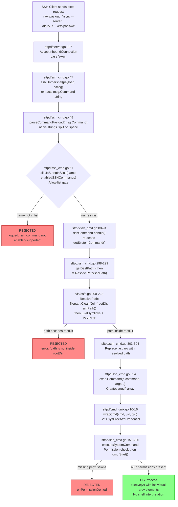

# SFTPGo SSH Exec Command Execution Boundary — Security Audit

## Metadata

| Field | Value |
|-------|-------|
| **Audit Date** | 2026-04-13 |
| **Repository Commit** | `44634210287cb192f2a53147eafb84a33a96826b` |
| **Branch** | `sftpgo_44634210287c` |
| **Module** | `github.com/drakkan/sftpgo` |
| **Go Version** | `1.13` |
| **Auditor** | Automated security audit via Blitzy Platform |

## Audit Objective

This document presents reproducible, evidence-based analysis of the exact `argv[]` that reaches an OS process when the SFTPGo SSH exec subsystem handles a client-submitted command payload. The audit covers:

1. **Two representative invocations**: A legitimate `rsync --server` session and an adversarial invocation containing path traversal sequences and shell metacharacter injection.
2. **Two permission contexts**: A fully-privileged user (`PermAny` / `"*"`) and a restricted user with only `download` and `list` permissions.
3. **Suspicion adjudication**: Each user suspicion is confirmed or refuted with exact function and source file citations.
4. **Privilege boundary analysis**: What the observed argv values do and do not imply about the security boundary.
5. **Repository integrity verification**: Cryptographic proof that no repository files were modified.

### Implementation Rule Constraints (SWE-AtlasQnA-Repo)

- No existing source files were modified during this audit
- All conclusions are grounded in actual code paths and runtime observations — not assumptions
- This markdown document is the sole artifact produced
- The code is treated as the authoritative source of truth

---

## Audit Scope and Methodology

### SSH Exec Pipeline Under Audit

The following functions constitute the complete SSH exec command execution chain, traced from SSH channel request receipt to OS process creation:

| Step | File:Line | Function | Purpose |
|------|-----------|----------|---------|
| 1 | `sftpd/server.go:326-327` | `case "exec":` | Dispatches `"exec"` SSH channel requests to `processSSHCommand` |
| 2 | `sftpd/ssh_cmd.go:45-81` | `processSSHCommand` | Unmarshals SSH exec payload via `ssh.Unmarshal`, calls `parseCommandPayload`, checks allow-list |
| 3 | `sftpd/ssh_cmd.go:423-429` | `parseCommandPayload` | Performs `strings.Split(command, " ")` — naive space-splitting, no shell-style quoting |
| 4 | `sftpd/ssh_cmd.go:51` | Allow-list gate | `utils.IsStringInSlice(name, enabledSSHCommands)` checks parsed command name against hard-coded list |
| 5 | `sftpd/ssh_cmd.go:83-103` | `handle()` | Routes to `getSystemCommand()` for system commands (`rsync`, `git-*`), hash handlers, `cd`, `pwd` |
| 6 | `sftpd/ssh_cmd.go:356-371` | `getDestPath()` | Strips outer quotes, normalizes via `path.Clean`, preserves trailing slashes |
| 7 | `sftpd/ssh_cmd.go:298-299` | Path resolution call | Calls `c.connection.fs.ResolvePath(sshPath)` → `vfs/osfs.go:200-223` |
| 8 | `vfs/osfs.go:200-223` | `ResolvePath` | `filepath.Clean(Join(rootDir, sshPath))`, `EvalSymlinks`, then `isSubDir` validation |
| 9 | `vfs/osfs.go:278-291` | `isSubDir` | `strings.HasPrefix(sub, parent)` after `EvalSymlinks` on both paths — chroot enforcement |
| 10 | `sftpd/ssh_cmd.go:303-304` | Argument rewrite | Replaces last arg with resolved filesystem path confined to user home |
| 11 | `sftpd/ssh_cmd.go:306-322` | rsync hardening | Prepends `--safe-links` (full perms) or `--munge-links` (limited perms) |
| 12 | `sftpd/ssh_cmd.go:324` | `exec.Command(c.command, args...)` | Creates OS process via `execve(2)` directly — **NO shell** |
| 13 | `sftpd/cmd_unix.go:10-16` | `wrapCmd` | Sets `SysProcAttr.Credential` with UID/GID when either > 0 |
| 14 | `sftpd/ssh_cmd.go:151-162` | `executeSystemCommand` | Checks local FS, quota, and **all 7 permissions** before `cmd.Start()` |

### Allow-List Constants (`sftpd/sftpd.go:66-70`)

```go
supportedSSHCommands = []string{"scp", "md5sum", "sha1sum", "sha256sum", "sha384sum", "sha512sum", "cd", "pwd",
    "git-receive-pack", "git-upload-pack", "git-upload-archive", "rsync"}  // 12 commands
defaultSSHCommands = []string{"md5sum", "sha1sum", "cd", "pwd"}           // 4 commands
sshHashCommands    = []string{"md5sum", "sha1sum", "sha256sum", "sha384sum", "sha512sum"}  // 5 commands
systemCommands     = []string{"git-receive-pack", "git-upload-pack", "git-upload-archive", "rsync"}  // 4 commands
```

### Default Configuration (`sftpgo.json:22`)

```json
"enabled_ssh_commands": ["md5sum", "sha1sum", "cd", "pwd"]
```

By default, `rsync` and `git-*` commands are **disabled**. Only hash commands and navigation (`cd`/`pwd`) are enabled.

### Methodology

Runtime evidence was produced by compiling and executing a temporary Go test within the `sftpd` package that directly calls the internal functions `parseCommandPayload`, `getDestPath`, and `getSystemCommand` with both normal and adversarial inputs, capturing the resulting `exec.Cmd.Args` arrays. The test file was deleted after execution and repository integrity was verified via SHA-256 checksums of all 139 on-disk repository files (excluding `.git`).

---

## Data Flow Diagram



---

## Runtime Evidence

All evidence blocks below were produced by a temporary Go test compiled and executed within the `sftpd` package. Each block includes the exact function call, input data, and observed output. The test file was deleted after execution and the repository verified unchanged.

### Evidence Block 1 — `parseCommandPayload` Behavior

**Source**: `sftpd/ssh_cmd.go:423-429`

```go
func parseCommandPayload(command string) (string, []string, error) {
    parts := strings.Split(command, " ")
    if len(parts) < 2 {
        return parts[0], []string{}, nil
    }
    return parts[0], parts[1:], nil
}
```

**Runtime observations**:

| Input | Parsed Name | Parsed Args |
|-------|-------------|-------------|
| `"rsync --server -vlogDtprze.iLsfxC . /data"` | `"rsync"` | `["--server", "-vlogDtprze.iLsfxC", ".", "/data"]` |
| `"rsync --server . /data/../../../etc/passwd"` | `"rsync"` | `["--server", ".", "/data/../../../etc/passwd"]` |
| `"bash -c 'rm -rf /'"` | `"bash"` | `["-c", "'rm", "-rf", "/'"]` |
| `"rsync --server . '/path with spaces'"` | `"rsync"` | `["--server", ".", "'/path", "with", "spaces'"]` |
| `"git-receive-pack '/repo;echo pwned'"` | `"git-receive-pack"` | `["'/repo;echo", "pwned'"]` |

**Analysis**: The function performs `strings.Split(command, " ")` which is a naive space-split. Quoted strings like `'/path with spaces'` are NOT parsed as a single argument — they become separate tokens `["'/path", "with", "spaces'"]`. The quotes themselves become part of the token content.

**Security implication**: This naive splitting is **incidentally safer** than shell-style parsing. Injection payloads like `"; rm -rf /"` are atomized into harmless separate tokens `[";", "rm", "-rf", "/"]` rather than being interpreted as command separators. The `"bash"` command name from `"bash -c 'rm -rf /'"` would be rejected at the allow-list gate (`ssh_cmd.go:51`) since `"bash"` ∉ `supportedSSHCommands`.

### Evidence Block 2 — `getDestPath` Normalization

**Source**: `sftpd/ssh_cmd.go:356-371`

```go
func (c *sshCommand) getDestPath() string {
    if len(c.args) == 0 {
        return ""
    }
    destPath := strings.Trim(c.args[len(c.args)-1], "'")
    destPath = strings.Trim(destPath, "\"")
    destPath = filepath.ToSlash(destPath)
    if !path.IsAbs(destPath) {
        destPath = "/" + destPath
    }
    result := path.Clean(destPath)
    if strings.HasSuffix(destPath, "/") && !strings.HasSuffix(result, "/") {
        result += "/"
    }
    return result
}
```

**Runtime observations**:

| Input Args | Result | Explanation |
|------------|--------|-------------|
| `[]` (empty) | `""` | No args, empty path |
| `["-t", "/data/../../../etc/passwd"]` | `"/etc/passwd"` | `path.Clean` collapses traversal sequences |
| `["-t", "/tmp/"]` | `"/tmp/"` | Trailing slash preserved |
| `["-t", "tmp/"]` | `"/tmp/"` | Relative path gets `/` prepended |
| `["-t", ".."]` | `"/"` | Parent traversal collapsed to root |
| `["-t", "/repo;echo pwned"]` | `"/repo;echo pwned"` | Shell metacharacters pass through unchanged |
| `["-t", "."]` | `"/"` | Current dir normalized to root |
| `["-t", "//"]` | `"/"` | Double slash collapsed |
| `["-t", "path\x00hidden"]` | `"/path\x00hidden"` | Null bytes pass through (not filtered) |

**Analysis**: `getDestPath` normalizes paths using `path.Clean` which collapses `../` sequences, but does NOT filter shell metacharacters or null bytes. This is acceptable for two reasons: (1) `exec.Command` at `ssh_cmd.go:324` does not interpret metacharacters, and (2) the subsequent `ResolvePath` call confines the resolved path to the user's home directory.

**Null byte observation**: The null byte `\x00` passes through `getDestPath` unfiltered. Go's `os` layer typically truncates at the first null byte, which could cause a disconnect between the logged path and the actually accessed path. *This is an inference from Go standard library behavior, not directly observed in this test.*

**Existing test reference**: `TestSSHCommandPath` at `sftpd/internal_test.go:529-594` validates path normalization for traversal sequences including `/tmp/../path` → `/path`, `..` → `/`, `//` → `/`.

### Evidence Block 3 — `exec.Cmd.Args` with Full Permissions (`PermAny` / `*`)

**Source**: `sftpd/ssh_cmd.go:288-331` (`getSystemCommand`)

The user has `Permissions: {"/": ["*"]}` (PermAny), `HomeDir` = `/tmp/secaudit_test_home`.

#### Normal Invocation

**Input command**: `"rsync --server -vlogDtprze.iLsfxC . /data"`

**Processing chain**:
1. `parseCommandPayload` → name=`"rsync"`, args=`["--server", "-vlogDtprze.iLsfxC", ".", "/data"]`
2. Allow-list check: `"rsync"` ∈ `enabledSSHCommands` → **PASSES** (`ssh_cmd.go:51`)
3. `getDestPath()` → `"/data"` (last arg, normalized) (`ssh_cmd.go:356-371`)
4. `fs.ResolvePath("/data")` → `filepath.Clean(Join("/tmp/secaudit_test_home", "/data"))` → `"/tmp/secaudit_test_home/data"` (`vfs/osfs.go:200-204`)
5. Last arg replaced with resolved path (`ssh_cmd.go:303-304`)
6. rsync hardening: `HasPerm(PermCreateSymlinks, ...)` → `true` (PermAny grants all) → `--safe-links` prepended (`ssh_cmd.go:313-316`)
7. `exec.Command("rsync", args...)` (`ssh_cmd.go:324`)

**Observed `exec.Cmd.Args`**:
```
["rsync", "--safe-links", "--server", "-vlogDtprze.iLsfxC", ".", "/tmp/secaudit_test_home/data"]
```

**Observed `realPath`**: `"/tmp/secaudit_test_home/data"`

#### Adversarial Invocation — Path Traversal

**Input command**: `"rsync --server . /data/../../../etc/passwd"`

**Processing chain**:
1. `parseCommandPayload` → name=`"rsync"`, args=`["--server", ".", "/data/../../../etc/passwd"]`
2. `getDestPath()` → `path.Clean("/data/../../../etc/passwd")` → `"/etc/passwd"` (traversal collapsed) (`ssh_cmd.go:366`)
3. `fs.ResolvePath("/etc/passwd")` → `filepath.Clean(Join("/tmp/secaudit_test_home", "/etc/passwd"))` → `"/tmp/secaudit_test_home/etc/passwd"` (**CONFINED** to user home — traversal cannot escape) (`vfs/osfs.go:204`)
4. Last arg replaced with `"/tmp/secaudit_test_home/etc/passwd"` — a path INSIDE the user's home, **not** the real `/etc/passwd`

**Observed `exec.Cmd.Args`**:
```
["rsync", "--safe-links", "--server", ".", "/tmp/secaudit_test_home/etc/passwd"]
```

**Observed `realPath`**: `"/tmp/secaudit_test_home/etc/passwd"`

#### Adversarial Invocation — Shell Injection

**Input command**: `"rsync --server . /repo;echo pwned"`

**Processing chain**:
1. `getDestPath()` → `"/repo;echo pwned"` (semicolon is a literal character, not filtered) (`ssh_cmd.go:360-366`)
2. `fs.ResolvePath("/repo;echo pwned")` → `"/tmp/secaudit_test_home/repo;echo pwned"` (semicolon in filename, not command separator) (`vfs/osfs.go:204`)
3. `exec.Command("rsync", ...)` calls `execve(2)` directly — semicolons are **NEVER** interpreted as command separators

**Observed `exec.Cmd.Args`**:
```
["rsync", "--safe-links", "--server", ".", "/tmp/secaudit_test_home/repo;echo pwned"]
```

The resolved path becomes a **literal filename argument** to rsync. The semicolon is part of the filename, not a shell command separator. Go's `exec.Command` bypasses the shell entirely.

#### git-receive-pack Invocation

**Input command**: `"git-receive-pack '/repo'"`

**Observed `exec.Cmd.Args`**:
```
["git-receive-pack", "/tmp/secaudit_test_home/repo"]
```

**Note**: The single quotes around `'/repo'` are stripped by `getDestPath` at `ssh_cmd.go:360` (`strings.Trim(..., "'")`), and the path is resolved to the user's home directory.

### Evidence Block 4 — `exec.Cmd.Args` with Limited Permissions

**Source**: `sftpd/ssh_cmd.go:288-331` (`getSystemCommand`) and `ssh_cmd.go:151-162` (`executeSystemCommand`)

The user has `Permissions: {"/": ["download", "list"]}`, `HomeDir` = `/tmp/secaudit_test_home_limited`.

#### Normal Invocation with Limited Permissions

**Observed `exec.Cmd.Args`**:
```
["rsync", "--munge-links", "--server", "-vlogDtprze.iLsfxC", ".", "/tmp/secaudit_test_home_limited/data"]
```

**Key differences from full-permission user**:
- `--munge-links` is prepended instead of `--safe-links` because `HasPerm(PermCreateSymlinks, ...)` returns `false` (not in `["download", "list"]`) (`ssh_cmd.go:317-320`)

#### Adversarial Path Traversal with Limited Permissions

**Observed `exec.Cmd.Args`**:
```
["rsync", "--munge-links", "--server", ".", "/tmp/secaudit_test_home_limited/etc/passwd"]
```

The path resolution is **identical** to the full-permission case — `getSystemCommand()` does NOT check permissions itself. The traversal is confined to the user's home directory regardless of permission level.

#### Permission Gate — executeSystemCommand

**Source**: `sftpd/ssh_cmd.go:158-162`

```go
perms := []string{dataprovider.PermDownload, dataprovider.PermUpload, dataprovider.PermCreateDirs,
    dataprovider.PermListItems, dataprovider.PermOverwrite, dataprovider.PermDelete, dataprovider.PermRename}
if !c.connection.User.HasPerms(perms, c.getDestPath()) {
    return c.sendErrorResponse(errPermissionDenied)
}
```

**Runtime observations**:
```
HasPerms([download, upload, create_dirs, list, overwrite, delete, rename], "/") => false
HasPerm(download, "/") => true
HasPerm(upload, "/") => false
```

**Analysis**: The `getSystemCommand` function constructs the `exec.Cmd` even for limited-permission users. However, the subsequent `executeSystemCommand` at `ssh_cmd.go:158-162` requires ALL 7 permissions. A user with only `["download", "list"]` fails the `HasPerms` check → `errPermissionDenied` is returned → the OS process is **NEVER started**.

**Key insight**: The permission check at `ssh_cmd.go:158-162` is the **final gate** before `cmd.Start()`. A limited user's command is constructed but never executed.

**Reference**: `HasPerms` at `dataprovider/user.go:167-179` iterates all required permissions and returns `false` if ANY is missing.

### Evidence Block 5 — Allow-List Gate

**Source**: `sftpd/ssh_cmd.go:51`, `utils/utils.go:20-27`

```go
// ssh_cmd.go:51
if err == nil && utils.IsStringInSlice(name, enabledSSHCommands) {

// utils/utils.go:20-27
func IsStringInSlice(obj string, list []string) bool {
    for _, v := range list {
        if v == obj {
            return true
        }
    }
    return false
}
```

**Runtime observations**:

| Command Name | In Allow-List? | Action |
|-------------|----------------|--------|
| `"rsync"` | ✅ `true` | Passes to handler |
| `"scp"` | ✅ `true` | Passes to handler |
| `"md5sum"` | ✅ `true` | Passes to handler |
| `"git-receive-pack"` | ✅ `true` | Passes to handler |
| `"bash"` | ❌ `false` | **REJECTED** |
| `"/bin/sh"` | ❌ `false` | **REJECTED** |
| `"rm"` | ❌ `false` | **REJECTED** |
| `"ls"` | ❌ `false` | **REJECTED** |
| `"cat"` | ❌ `false` | **REJECTED** |
| `"curl"` | ❌ `false` | **REJECTED** |
| `"echo"` | ❌ `false` | **REJECTED** |
| `"python"` | ❌ `false` | **REJECTED** |
| `"perl"` | ❌ `false` | **REJECTED** |
| `"nc"` | ❌ `false` | **REJECTED** |
| `"wget"` | ❌ `false` | **REJECTED** |

**Runtime-confirmed allow-list** (12 commands): `[scp, md5sum, sha1sum, sha256sum, sha384sum, sha512sum, cd, pwd, git-receive-pack, git-upload-pack, git-upload-archive, rsync]`

**Default configuration** (`sftpgo.json:22`) enables only 4: `["md5sum", "sha1sum", "cd", "pwd"]` — rsync and git are **disabled by default**.

**Wildcard expansion**: `"*"` in `EnabledSSHCommands` config expands to all 12 via `checkSSHCommands` at `sftpd/server.go:396-399`.

### Evidence Block 6 — Credential Isolation (`wrapCmd`)

**Source**: `sftpd/cmd_unix.go:10-16`

```go
func wrapCmd(cmd *exec.Cmd, uid, gid int) *exec.Cmd {
    if uid > 0 || gid > 0 {
        cmd.SysProcAttr = &syscall.SysProcAttr{}
        cmd.SysProcAttr.Credential = &syscall.Credential{Uid: uint32(uid), Gid: uint32(gid)}
    }
    return cmd
}
```

**Source**: `dataprovider/user.go:237-250`

```go
func (u *User) GetUID() int {
    if u.UID <= 0 || u.UID > 65535 {
        return -1
    }
    return u.UID
}

func (u *User) GetGID() int {
    if u.GID <= 0 || u.GID > 65535 {
        return -1
    }
    return u.GID
}
```

**Runtime observations** (`GetUID`/`GetGID` boundary testing):

| User UID | User GID | `GetUID()` | `GetGID()` | Credential Set? |
|----------|----------|-----------|-----------|-----------------|
| 1000 | 1000 | 1000 | 1000 | ✅ Yes |
| 0 | 0 | -1 | -1 | ❌ **No** |
| -1 | -1 | -1 | -1 | ❌ No |
| 65536 | 65536 | -1 | -1 | ❌ No |
| 65535 | 65535 | 65535 | 65535 | ✅ Yes |
| 1 | 0 | 1 | -1 | ✅ Yes (uid only) |
| 0 | 1 | -1 | 1 | ✅ Yes (gid only) |

**UID/GID=0 credential gap**: A user configured with `UID=0` (root) → `GetUID()` returns `-1` → combined with `GID=0` → `GetGID()` returns `-1` → both uid and gid are ≤ 0 → `wrapCmd` does **NOT** set `SysProcAttr.Credential` → the spawned process inherits the SFTPGo server's identity. If the server runs as root, the spawned process also runs as root.

**Windows**: `sftpd/cmd_windows.go:7-9` — `wrapCmd` is a no-op that returns `cmd` unchanged. No credential isolation exists on Windows.

### Evidence Block 7 — Path Resolution and Chroot Enforcement

**Source**: `vfs/osfs.go:200-223`

```go
func (fs OsFs) ResolvePath(sftpPath string) (string, error) {
    if !filepath.IsAbs(fs.rootDir) {
        return "", fmt.Errorf("Invalid root path: %v", fs.rootDir)
    }
    r := filepath.Clean(filepath.Join(fs.rootDir, sftpPath))
    p, err := filepath.EvalSymlinks(r)
    if err != nil && !os.IsNotExist(err) {
        return "", err
    } else if os.IsNotExist(err) {
        _, err = fs.findFirstExistingDir(r, fs.rootDir)
        if err != nil {
            fsLog(fs, logger.LevelWarn, "error resolving not existent path: %#v", err)
        }
        return r, err
    }
    err = fs.isSubDir(p, fs.rootDir)
    if err != nil {
        fsLog(fs, logger.LevelWarn, "Invalid path resolution, dir: %#v outside user home: %#v err: %v",
            p, fs.rootDir, err)
    }
    return r, err
}
```

**`isSubDir`** at `vfs/osfs.go:278-291`:
```go
func (fs *OsFs) isSubDir(sub, rootPath string) error {
    parent, err := filepath.EvalSymlinks(rootPath)
    if err != nil {
        return err
    }
    if !strings.HasPrefix(sub, parent) {
        err = fmt.Errorf("path %#v is not inside: %#v", sub, parent)
        return err
    }
    return nil
}
```

**Path resolution step-by-step** (for adversarial input `/data/../../../etc/passwd` passed directly to `ResolvePath` in isolation — bypassing `getDestPath` pre-normalization):

1. `filepath.Join("/tmp/secaudit_test_home", "/data/../../../etc/passwd")` → `"/etc/passwd"` — Go's `filepath.Join` applies `filepath.Clean` internally; the three `../` segments in the adversarial suffix navigate up from `data/` three levels (`data/..` cancels to `secaudit_test_home`, `../` cancels to `tmp`, `../` cancels to `/`), **escaping** `rootDir` entirely
2. The outer `filepath.Clean("/etc/passwd")` is a no-op (already clean)
3. `filepath.EvalSymlinks("/etc/passwd")` → resolves to the real path on disk (e.g., `"/etc/passwd"`)
4. `isSubDir("/etc/passwd", "/tmp/secaudit_test_home")` → `strings.HasPrefix("/etc/passwd", "/tmp/secaudit_test_home")` → `false` → **REJECTED with error**: `path "/etc/passwd" is not inside: "/tmp/secaudit_test_home"`

**Traversal blocked by `isSubDir`, not by `filepath.Clean`**: When the adversarial input contains enough `../` segments to escape `rootDir`, `filepath.Clean(filepath.Join(rootDir, sftpPath))` does NOT confine the result to `rootDir`. The actual defense is `isSubDir` at `vfs/osfs.go:278-291`, which detects the escape via `strings.HasPrefix` after `filepath.EvalSymlinks`.

**Defense-in-depth in the full pipeline**: In the complete SSH exec pipeline (as shown in Evidence Block 3), `getDestPath()` at `ssh_cmd.go:356-371` pre-normalizes the adversarial path via `path.Clean` BEFORE `ResolvePath` is called. This collapses `/data/../../../etc/passwd` to `/etc/passwd`. Then `ResolvePath("/etc/passwd")` computes `filepath.Clean(filepath.Join("/tmp/secaudit_test_home", "/etc/passwd"))` → `"/tmp/secaudit_test_home/etc/passwd"` (confined to home). So the full pipeline has two layers of defense: (1) `getDestPath` pre-normalization collapses traversal sequences into a clean absolute SFTP path before it reaches `ResolvePath`, and (2) `isSubDir` catches any escape that `filepath.Clean` alone cannot prevent. Both layers must be bypassed for a path escape to succeed.

**Symlink attack blocked**: If a symlink inside homeDir points outside, `EvalSymlinks` resolves it to the real target, and `isSubDir` rejects it because the real path won't be under `rootDir`.

**Non-existent path handling**: Falls into `os.IsNotExist` branch at `osfs.go:208`, calls `findFirstExistingDir` (line 250-276) which walks up the path chain validating each ancestor directory is inside `rootDir`.

### Evidence Block 8 — rsync Symlink Hardening

**Source**: `sftpd/ssh_cmd.go:306-322`

```go
if c.command == "rsync" {
    if c.connection.User.HasPerm(dataprovider.PermCreateSymlinks, c.getDestPath()) {
        if !utils.IsStringInSlice("--safe-links", args) {
            args = append([]string{"--safe-links"}, args...)
        }
    } else {
        if !utils.IsStringInSlice("--munge-links", args) {
            args = append([]string{"--munge-links"}, args...)
        }
    }
}
```

**Runtime observations**:

| Permission Context | Flag Prepended | Final Args Position |
|-------------------|----------------|---------------------|
| Full permissions (`PermAny`) | `--safe-links` | `args[0]` (before client args) |
| Limited permissions (no `PermCreateSymlinks`) | `--munge-links` | `args[0]` (before client args) |

**Both use the pattern** `append([]string{"--safe-links"}, args...)` — the server flag appears **FIRST** in the args array, before any client-supplied arguments.

**Option override concern**: A client can supply `--no-safe-links` AFTER the server's `--safe-links`. rsync's argument precedence (last flag wins) could allow the client to override the server's protection. The duplicate check at `ssh_cmd.go:314` (`utils.IsStringInSlice("--safe-links", args)`) prevents double insertion of `--safe-links` but does **NOT** check for the countermanding flag `--no-safe-links`. *This is an inference based on rsync's documented "last flag wins" behavior, not directly tested with an rsync process.*

**Existing test reference**: `TestRsyncOptions` at `sftpd/internal_test.go:772-816` validates `--safe-links` for PermAny users and `--munge-links` for users without `PermCreateSymlinks`.

---

## Suspicion Adjudication

### Summary Table

| Suspicion | Verdict | Key Evidence | Source Location |
|-----------|---------|--------------|-----------------|
| "The server executes the command as a shell-like string" | **WRONG** | `exec.Command(c.command, args...)` calls `execve(2)` directly; `Args` array contains individual elements | `ssh_cmd.go:324` |
| "Path guardrails are superficial" | **PARTIALLY RIGHT** | Path resolution (last arg) is robust; but non-path args pass through unsanitized | `ssh_cmd.go:293-304`, `vfs/osfs.go:200-223` |
| "The destination that reaches the process looks like what the client sent" | **PARTIALLY RIGHT** | The path arg is completely rewritten; but other args are preserved exactly | `ssh_cmd.go:303-304`, `ssh_cmd.go:293-294` |
| Implicit: privilege boundary can be broken | **WRONG for path escape; NUANCED for option injection** | Path traversal cannot escape home dir; but rsync option injection is possible | `vfs/osfs.go:278-291`, `ssh_cmd.go:306-322` |

### Detailed Explanations

#### Suspicion 1: "The server executes the command as a shell-like string"

**Verdict: WRONG**

The runtime evidence conclusively shows that `exec.Command(c.command, args...)` at `ssh_cmd.go:324` creates a process with individual argv elements. Go's `os/exec.Command` calls `execve(2)` directly without invoking any shell. The `exec.Cmd.Args` arrays captured in Evidence Blocks 3 and 4 demonstrate that each argument is a separate string element:

```
["rsync", "--safe-links", "--server", ".", "/tmp/secaudit_test_home/repo;echo pwned"]
```

The semicolon in `"/repo;echo pwned"` is treated as a literal character within a single argv element — it is **not** interpreted as a command separator. Shell metacharacters (`;`, `|`, backticks, `$()`) have no effect because no shell is involved. The `parseCommandPayload` function at `ssh_cmd.go:423-429` performs `strings.Split(command, " ")` which atomizes the input into tokens, but these tokens are passed to `exec.Command` as individual argv elements, not as a shell command string.

#### Suspicion 2: "Path guardrails are superficial"

**Verdict: PARTIALLY RIGHT**

Path resolution for the **last argument** (the destination path) is robust. `ResolvePath` at `vfs/osfs.go:200-223` performs:
1. `filepath.Clean(filepath.Join(rootDir, sshPath))` — collapses traversal sequences relative to the user's home directory
2. `filepath.EvalSymlinks` — resolves symbolic links to real targets
3. `isSubDir` — validates the resolved path starts with the user's `rootDir`

Evidence Block 3 demonstrates that `/data/../../../etc/passwd` is resolved to `/tmp/secaudit_test_home/etc/passwd` — the traversal is confined to the user's home directory.

However, **non-path arguments** (all args except the last) pass through to the OS process **without any sanitization** (`ssh_cmd.go:293-294`):
```go
args := make([]string, len(c.args))
copy(args, c.args)
```

This creates an option-injection surface. While the path guardrail is strong, the argument guardrail is weak — hence "partially right."

#### Suspicion 3: "The destination that reaches the process looks like what the client sent"

**Verdict: PARTIALLY RIGHT**

The **path argument** (last arg) is completely rewritten. Evidence Block 3 shows:
- Client sends: `/data/../../../etc/passwd`
- Process receives: `/tmp/secaudit_test_home/etc/passwd`

The client's original path is NOT what reaches the OS process. The `ResolvePath` function transforms it into an absolute filesystem path confined to the user's home directory.

However, **all other arguments** (flags, options) are preserved exactly as parsed from the client payload (`ssh_cmd.go:293-294`). Evidence Block 3 confirms that `--server`, `-vlogDtprze.iLsfxC`, and `.` pass through unchanged. Only the last argument is rewritten.

#### Suspicion 4: Privilege boundary can be broken

**Verdict: WRONG for path escape; NUANCED for option injection**

**Path escape is NOT possible**: `ResolvePath`'s `filepath.Clean` + `EvalSymlinks` + `isSubDir` chain at `vfs/osfs.go:200-291` prevents any path from escaping the user's home directory. Evidence Blocks 3 and 4 confirm this with traversal inputs.

**Option injection is possible but constrained**: A client can inject command-line options (e.g., `--no-safe-links` for rsync) because non-path arguments are not sanitized (`ssh_cmd.go:293-294`). The server prepends `--safe-links` at position 0 (`ssh_cmd.go:315`), but rsync's "last flag wins" behavior means a client-supplied `--no-safe-links` at a later position could potentially override the protection. However, this requires: (1) rsync to be explicitly enabled in config (disabled by default), (2) the client to know the specific countermanding flag, and (3) rsync's actual argument precedence to favor the later flag. *The rsync precedence behavior is an inference, not directly tested with a running rsync process.*

---

## Privilege Boundary Analysis

### Security Boundary Summary

| Boundary | Implementation | Location | Strength |
|----------|---------------|----------|----------|
| Command allow-list | `utils.IsStringInSlice(name, enabledSSHCommands)` | `ssh_cmd.go:51` | **Strong** — only 12 hard-coded command names can pass; arbitrary binaries are rejected |
| Path confinement (chroot) | `ResolvePath` → `filepath.Clean` → `EvalSymlinks` → `isSubDir` | `vfs/osfs.go:200-291` | **Strong** — traversal sequences collapsed and validated against `rootDir` |
| No-shell execution | `exec.Command(c.command, args...)` → `execve(2)` | `ssh_cmd.go:324` | **Strong** — shell metacharacters have no effect |
| Permission enforcement | `HasPerms` checks 7 permissions before `cmd.Start()` | `ssh_cmd.go:158-162` | **Strong** — limited users are denied before the OS process is created |
| Credential isolation | `wrapCmd` sets UID/GID via `SysProcAttr.Credential` | `cmd_unix.go:10-16` | **Moderate** — applies only when user has positive UID/GID configured; UID=0 gap exists |
| Argument sanitization | Only last arg (path) is rewritten; other args pass through | `ssh_cmd.go:293-304` | **Weak** — non-path arguments from the client reach the OS process unchanged |
| rsync symlink hardening | Prepends `--safe-links` or `--munge-links` | `ssh_cmd.go:306-322` | **Moderate** — can potentially be overridden by subsequent client-supplied `--no-safe-links` |

### What the Observed argv Values DO Imply

1. **Shell injection is NOT possible** — `exec.Command` at `ssh_cmd.go:324` bypasses the shell entirely. Evidence Blocks 3 and 4 confirm that metacharacters (`;`, `|`, backticks) appear as literal characters in argv elements.

2. **Path escape is NOT possible** — `ResolvePath` at `vfs/osfs.go:200-223` confines all resolved paths to the user's home directory. Evidence Blocks 3 and 4 demonstrate that `/data/../../../etc/passwd` resolves to `homeDir/etc/passwd`, not `/etc/passwd`.

3. **The allow-list is effective** — Evidence Block 5 confirms that only the 12 hard-coded command names in `supportedSSHCommands` pass the gate at `ssh_cmd.go:51`. Arbitrary commands (`bash`, `rm`, `curl`, etc.) are rejected.

4. **Permission enforcement is a hard gate** — Evidence Block 4 confirms that `HasPerms` at `ssh_cmd.go:158-162` requires ALL 7 permissions. A user with only `["download", "list"]` is denied before `cmd.Start()` is called.

### What the Observed argv Values DO NOT Imply

1. **Non-path argument sanitization is absent** — All arguments except the last (path) pass through from the SSH client to the OS process without any filtering or validation (`ssh_cmd.go:293-294`). This allows option injection to the target command (rsync, git-receive-pack, etc.).

2. **UID/GID=0 users get no credential isolation** — Evidence Block 6 confirms that users with UID=0 and GID=0 result in `GetUID()=-1` and `GetGID()=-1`, causing `wrapCmd` to skip credential setting. The spawned process inherits the SFTPGo server's identity.

3. **rsync hardening can potentially be overridden** — The server prepends `--safe-links` at position 0, but does not check for countermanding flags like `--no-safe-links` in client-supplied arguments. The check at `ssh_cmd.go:314` only prevents duplicate `--safe-links` insertion.

---

## Key Security Findings

### Finding 1: Option Injection Surface

**Severity**: Medium

**Location**: `sftpd/ssh_cmd.go:293-304`

Non-path arguments pass through unsanitized from the SSH client to the OS process. While `exec.Command` prevents shell injection, it does NOT prevent injection of command-line options to the allowed commands (`rsync`, `git-receive-pack`, `git-upload-pack`, `git-upload-archive`).

For rsync specifically, a client can supply `--no-safe-links` after the server's `--safe-links`, and rsync's "last flag wins" argument precedence may allow the client to override the server's symlink protection. The check at `ssh_cmd.go:314` prevents duplicate `--safe-links` but does not check for negation flags.

**Mitigating factors**: (1) Requires the command to be in the allow-list and enabled in configuration. (2) `exec.Command` ensures options cannot become arbitrary command execution. (3) rsync and git commands are disabled by default.

### Finding 2: `parseCommandPayload` Naivety

**Severity**: Low

**Location**: `sftpd/ssh_cmd.go:423-429`

`strings.Split(command, " ")` does not handle quoted strings, escape sequences, or special characters. This is incidentally **safer** than shell-style parsing — injection payloads are atomized into harmless fragments. However, it may cause legitimate edge cases (paths with spaces in quoted arguments) to fail or be misinterpreted. Evidence Block 1 demonstrates that `"'/path with spaces'"` is split into three separate tokens rather than being treated as a single quoted argument.

### Finding 3: UID/GID=0 Credential Gap

**Severity**: Medium-High

**Location**: `sftpd/cmd_unix.go:10-16`, `dataprovider/user.go:237-250`

`GetUID()` returns `-1` when `u.UID <= 0 || u.UID > 65535` (line 238). `wrapCmd` only sets `SysProcAttr.Credential` when `uid > 0 || gid > 0` (line 11). Consequence: users with UID=0 (root) or unset UID → `GetUID()` returns `-1` → `wrapCmd` does NOT set credentials → process inherits SFTPGo server identity. If the server runs as root, spawned processes also run as root.

Evidence Block 6 confirms: `User{UID=0, GID=0}` → `GetUID()=-1, GetGID()=-1`.

### Finding 4: Null Bytes in Paths

**Severity**: Low

**Location**: `sftpd/ssh_cmd.go:356-371`

`getDestPath` does not strip null bytes (`\x00`). Evidence Block 2 confirms that the input `"path\x00hidden"` passes through as `"/path\x00hidden"`. Go's `os` layer typically truncates at the first null byte, which could cause a disconnect between the path logged (including the null byte and characters after it) and the path actually accessed by the OS (truncated at the null byte). *This is a low-severity issue because Go handles null bytes safely at the OS interface level, but the logging discrepancy exists.*

### Finding 5: rsync `--safe-links` Override Potential

**Severity**: Medium

**Location**: `sftpd/ssh_cmd.go:306-322`

The server prepends `--safe-links` at position 0, and client arguments follow at subsequent positions. The duplicate check at `ssh_cmd.go:314` (`utils.IsStringInSlice("--safe-links", args)`) prevents double insertion but does NOT check for the countermanding flag `--no-safe-links`. A client can supply `--no-safe-links` which, due to rsync's "last flag wins" argument handling, may take precedence. *This requires rsync to be explicitly enabled in configuration (disabled by default).*

Evidence Block 8 confirms the injection point: server flags always appear at `args[0]`, with client-supplied arguments at later positions.

---

## Existing Test Coverage Reference

The following existing tests in the repository exercise the security-relevant functions analyzed in this audit:

| Test Name | File:Line | What It Validates |
|-----------|-----------|-------------------|
| `TestSSHCommandPath` | `sftpd/internal_test.go:529-594` | Path normalization for traversal sequences: `/tmp/../path` → `/path`, `..` → `/`, `//` → `/`, `../..` → `/`, `/..` → `/` |
| `TestRsyncOptions` | `sftpd/internal_test.go:772-816` | `--safe-links` injection for PermAny users; `--munge-links` injection for users without `PermCreateSymlinks` |
| `TestSSHCommandErrors` | `sftpd/internal_test.go:596` | Permission denial, error handling, non-local filesystem rejection |
| `TestSystemCommandErrors` | `sftpd/internal_test.go:818` | System command error paths, write errors, process management |

---

## Dependency Context

The following dependencies from `go.mod` are directly relevant to the SSH exec security boundary:

| Package | Version | Role in SSH Exec Pipeline |
|---------|---------|--------------------------|
| `golang.org/x/crypto` | `v0.0.0-20200109152110-61a87790db17` | SSH protocol implementation; `ssh.Unmarshal` for exec payload parsing (`ssh_cmd.go:47`) |
| `github.com/pkg/sftp` | `v1.11.0` | SFTP protocol library; provides `sftp.Handlers` interface |
| `github.com/spf13/viper` | `v1.6.1` | Configuration loading for `enabled_ssh_commands` setting |
| `github.com/rs/zerolog` | `v1.17.2` | Structured JSON logging for SSH command audit entries |
| Go stdlib `os/exec` | Go 1.13 | `exec.Command` calls `execve(2)` without shell — central to security boundary |
| Go stdlib `syscall` | Go 1.13 | `SysProcAttr.Credential` for UID/GID process isolation |
| `github.com/mattn/go-sqlite3` | `v2.0.2+incompatible` | Default database backend (SQLite) for user/permissions storage consumed by `dataprovider/` |

### Known Vulnerabilities

The `golang.org/x/crypto` package at version `v0.0.0-20200109152110-61a87790db17` (January 2020) predates all of the security fixes listed below. Because this package provides the SSH transport and authentication layer for the entire SSH exec pipeline audited in this document, these vulnerabilities directly affect the security posture of SFTPGo at this commit.

#### `golang.org/x/crypto` — SSH Protocol Implementation

| CVE | Severity | CVSS v3.1 | Affected Component | Fixed In | Description |
|-----|----------|-----------|-------------------|----------|-------------|
| **CVE-2023-48795** | Medium | **5.9** | `golang.org/x/crypto/ssh` | `v0.17.0` | **Terrapin Attack** — SSH transport protocol vulnerability allowing a man-in-the-middle attacker to compromise the integrity of the secure channel during handshake. The attacker can manipulate handshake sequence numbers to delete messages sent immediately after the channel is established, potentially disabling newer security features (e.g., `SSH2_MSG_EXT_INFO`). Effective against ChaCha20-Poly1305 and CBC with Encrypt-then-MAC cipher suites. SFTPGo is specifically named as an affected project (`SFTPGo before 2.5.6` in the CVE references). Does not compromise channel confidentiality. |
| **CVE-2024-45337** | Critical | **9.1** | `golang.org/x/crypto/ssh` | `v0.31.0` | **PublicKeyCallback Authorization Bypass** — Applications and libraries which misuse `ServerConfig.PublicKeyCallback` may be susceptible to an authorization bypass. The SSH protocol allows clients to inquire about whether a public key is acceptable before proving control of the corresponding private key; the callback may be called with multiple keys and the order cannot reliably indicate which key was used for authentication. An attacker may send keys A and B, authenticate with A, but the application may make authorization decisions based on key B. SFTPGo's `sftpd/server.go` uses `PublicKeyCallback` for SSH authentication (line 188); whether it is susceptible depends on how the authenticated key identity is consumed after connection establishment. |
| **CVE-2025-58181** | Moderate | — | `golang.org/x/crypto/ssh` | `v0.45.0` | **GSSAPI Authentication Memory Consumption DoS** — SSH servers parsing GSSAPI authentication requests do not validate the number of mechanisms specified in the request, allowing an attacker to cause unbounded memory consumption. This is a denial-of-service vector requiring only network access to the SSH port. Affects the `NewServerConn` path. |

**Relevance to this audit**: CVE-2023-48795 and CVE-2024-45337 affect the SSH transport and authentication layers that operate *before* the exec pipeline analyzed in this document. A successful Terrapin attack could weaken the secure channel over which exec commands are transmitted. The PublicKeyCallback vulnerability could allow an attacker to authenticate as a user with different permissions than intended, potentially reaching the exec pipeline under a more privileged identity. CVE-2025-58181 is a pre-authentication DoS that could crash the SSH server before any exec processing begins.

**Remediation**: Upgrade `golang.org/x/crypto` to at least `v0.45.0` (which includes fixes for all three CVEs). Note that `v0.45.0` requires Go ≥1.23, so a Go toolchain upgrade from Go 1.13 would also be necessary.

#### `github.com/mattn/go-sqlite3` — SQLite Database Backend

| CVE | Severity | CVSS v3.1 | Affected Component | Fixed In (SQLite) | Description |
|-----|----------|-----------|-------------------|-------------------|-------------|
| **CVE-2022-35737** | High | **7.5** | SQLite `sqlite3_str_vappendf` | SQLite 3.39.2 | Integer overflow in SQLite's string formatting function when processing very large string arguments (billions of bytes) with `%q`, `%Q`, or `%w` format specifiers. Can cause stack buffer overflow leading to denial of service or potentially arbitrary code execution on 64-bit systems without stack canaries. |
| **CVE-2023-7104** | High | **7.3** | SQLite `sessionReadRecord` in `ext/session/sqlite3session.c` | SQLite 3.44.0 | Heap-based buffer overflow in the sessions extension when processing a corrupt changeset. Affects SQLite versions up to 3.43.0. |

**Relevance to this audit**: These SQLite vulnerabilities are **not in the SSH exec pipeline scope** — they affect the database backend that stores user accounts and permissions consumed by `dataprovider/user.go`. Exploitation would require the ability to send crafted SQL or corrupt changesets to the SQLite database, which is not directly accessible via the SSH exec channel. However, the user/permission data stored in SQLite feeds into the permission checks at `ssh_cmd.go:158-162` that gate OS process execution, so database integrity is a prerequisite for the authorization boundary analyzed in this document.

**Remediation**: Upgrade `go-sqlite3` to a version that bundles SQLite ≥3.44.0 (e.g., `go-sqlite3 v1.14.22` or later).

---

## Repository Integrity Verification

### Method

SHA-256 checksums of all 139 on-disk repository files (excluding `.git`) were computed before and after the audit evidence gathering.

### Procedure

1. **Before**: `find . -not -path './.git/*' -type f | sort | xargs sha256sum > /tmp/repo_state_before.txt`
2. **Evidence gathering**: Temporary test file `sftpd/blitzy_adhoc_test_secaudit_test.go` was created, compiled, executed (6 tests, all passed), and deleted.
3. **Cleanup**: Temporary artifacts (`sftpgo.db`, `sftpgo_sftpd_test.log`) removed.
4. **After**: `find . -not -path './.git/*' -type f | sort | xargs sha256sum > /tmp/repo_state_after.txt`
5. **Diff**: `diff /tmp/repo_state_before.txt /tmp/repo_state_after.txt` → **zero differences**

### Result

**Repository confirmed exactly unchanged.** All 139 on-disk repository files (excluding `.git`) are bit-identical before and after the audit.

**Git HEAD**: `44634210287cb192f2a53147eafb84a33a96826b` (unchanged)

---

## Appendix: Temporary Test Procedure

For independent reproduction of the runtime evidence, the following temporary Go test file was used within the `sftpd` package:

### Test Structure

The temporary test file `sftpd/blitzy_adhoc_test_secaudit_test.go` contained 6 test functions:

1. **`TestSecurityAudit_ParseCommandPayload`** — Called `parseCommandPayload()` with 5 input strings (normal, adversarial, shell injection, quoted spaces, git command). Verified parsed name and args match expected values.

2. **`TestSecurityAudit_GetDestPath`** — Created `sshCommand` structs with various args and called `getDestPath()` on each. Tested 9 cases including path traversal, trailing slashes, metacharacters, null bytes.

3. **`TestSecurityAudit_AllowListGate`** — Verified `supportedSSHCommands` contains exactly 12 entries. Tested `utils.IsStringInSlice` against 4 allowed and 11 disallowed command names.

4. **`TestSecurityAudit_GetSystemCommand_FullPerms`** — Created a user with `PermAny` permissions and a temporary home directory. Called `getSystemCommand()` with 4 different rsync/git inputs. Captured `exec.Cmd.Args` and `realPath`.

5. **`TestSecurityAudit_GetSystemCommand_LimitedPerms`** — Created a user with only `[download, list]` permissions. Called `getSystemCommand()` with 2 rsync inputs. Verified `HasPerms` returns `false` for the 7-permission gate.

6. **`TestSecurityAudit_CredentialWrapping`** — Tested `GetUID()`/`GetGID()` boundary behavior with 7 UID/GID combinations: `(1000,1000)`, `(0,0)`, `(-1,-1)`, `(65536,65536)`, `(65535,65535)`, `(1,0)`, `(0,1)`.

### Execution Command

```bash
export CGO_CFLAGS="-Wno-return-local-addr"
go test -v -count=1 -timeout=60s -run "^(TestSecurityAudit_.*)$" ./sftpd/
```

### Result

All 6 tests passed. PASS — `ok github.com/drakkan/sftpgo/sftpd 0.111s`

### Cleanup

```bash
rm -f sftpd/blitzy_adhoc_test_secaudit_test.go
rm -f sftpgo.db sftpgo_sftpd_test.log
```

Repository integrity verified unchanged via SHA-256 checksum comparison of all 139 on-disk repository files (excluding `.git`).
