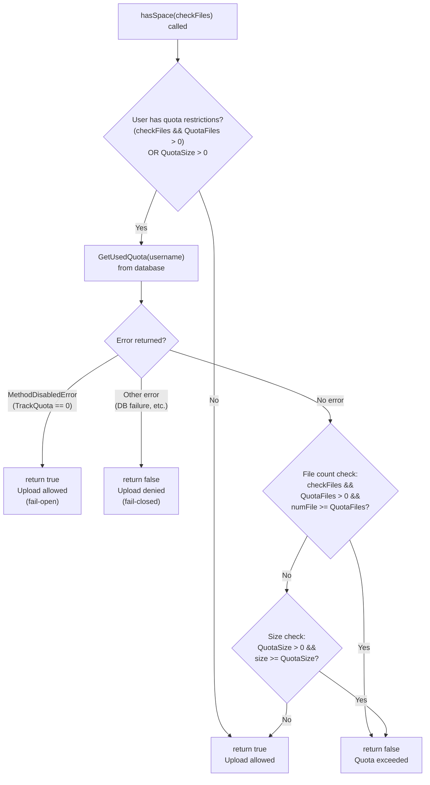
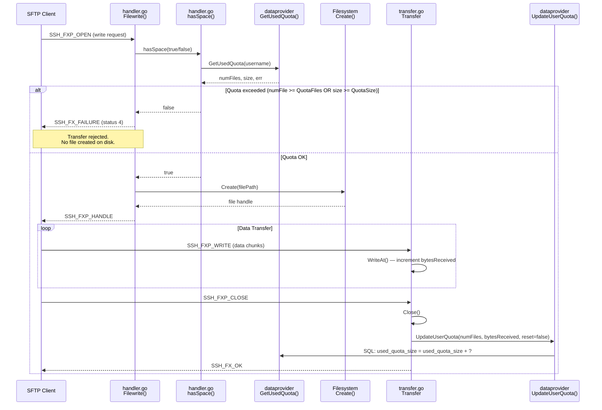
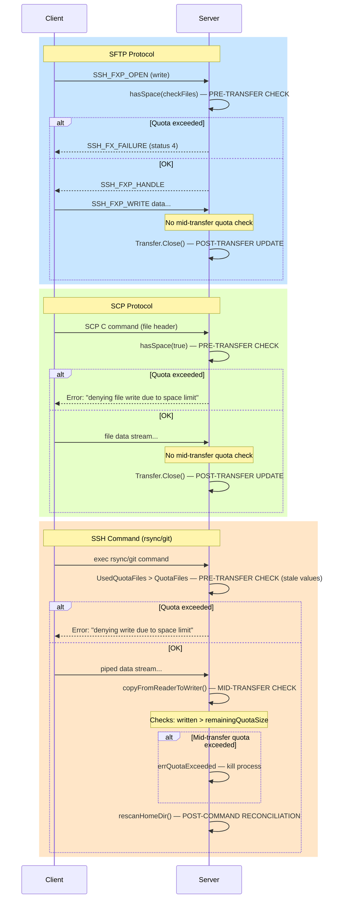

# SFTPGo Quota Enforcement: Technical Investigation

## Overview

This document is a comprehensive technical investigation into SFTPGo's quota enforcement behavior during SFTP, SCP, and SSH file uploads. Every finding is derived entirely from source code analysis of the `sftpgo_44634210287c` branch — no assumptions or external documentation are relied upon. Each claim cites specific file paths, function names, and line numbers as evidence.

### Investigation Scope

The investigation answers the following five questions:

1. **Quota Limit Behavior**: What exactly happens when an SFTP upload would exceed a user's configured file count or size quota?
2. **SFTP Client Error Messages**: What is the exact SFTP protocol error code/message returned to the client when a quota rejection occurs?
3. **Server-Side Logging**: What gets logged in the SFTPGo server logs during a quota rejection?
4. **Quota Accuracy**: Does the quota usage tracked in the database match the actual bytes stored on disk?
5. **Quota Check Timing**: Is the quota check performed before, during, or after the upload?

### Methodology

All conclusions are derived by tracing the code paths through the following primary source files:

| Package | File | Purpose |
|---------|------|---------|
| `sftpd` | `handler.go` | SFTP upload handlers, `hasSpace()` quota check |
| `sftpd` | `transfer.go` | Transfer lifecycle, post-transfer quota update |
| `sftpd` | `scp.go` | SCP upload quota enforcement |
| `sftpd` | `ssh_cmd.go` | SSH system command quota enforcement |
| `sftpd` | `sftpd.go` | Quota scan bookkeeping, log sender constants |
| `dataprovider` | `dataprovider.go` | `UpdateUserQuota`, `GetUsedQuota`, TrackQuota config |
| `dataprovider` | `user.go` | User struct with quota fields |
| `dataprovider` | `sqlcommon.go` | SQL execution for quota operations |
| `dataprovider` | `sqlqueries.go` | SQL query definitions |
| `logger` | `logger.go` | Structured JSON logging format |
| `config` | `config.go` | Default configuration values |
| `vfs` | `osfs.go` | Filesystem scan for quota reconciliation |

---

## 1. Quota Configuration and Setup

### 1.1 User Model Quota Fields

The `User` struct in `dataprovider/user.go:64-110` defines the following quota-related fields:

```go
// Source: dataprovider/user.go:64-110
type User struct {
    // ...
    // Maximum size allowed as bytes. 0 means unlimited
    QuotaSize int64 `json:"quota_size"`          // line 89
    // Maximum number of files allowed. 0 means unlimited
    QuotaFiles int `json:"quota_files"`           // line 91
    // Used quota as bytes
    UsedQuotaSize int64 `json:"used_quota_size"`  // line 95
    // Used quota as number of files
    UsedQuotaFiles int `json:"used_quota_files"`  // line 97
    // Last quota update as unix timestamp in milliseconds
    LastQuotaUpdate int64 `json:"last_quota_update"` // line 99
    // ...
}
```

**Rationale**: `QuotaSize` and `QuotaFiles` are the configured *limits* (0 means unlimited). `UsedQuotaSize` and `UsedQuotaFiles` are the *counters* that track current usage. The separation allows setting file-count-only, size-only, or both constraints independently.

The method `HasQuotaRestrictions()` determines whether a user has any quota enforcement active:

```go
// Source: dataprovider/user.go:258-259
func (u *User) HasQuotaRestrictions() bool {
    return u.QuotaFiles > 0 || u.QuotaSize > 0
}
```

This returns `true` if **either** file count or size quota is non-zero.

### 1.2 TrackQuota Configuration Modes

The `TrackQuota` setting in `dataprovider/dataprovider.go:129-135` controls whether quota tracking is active:

```go
// Source: dataprovider/dataprovider.go:129-135
// Set the preferred way to track users quota between the following choices:
// 0, disable quota tracking. REST API to scan user dir and update quota will do nothing
// 1, quota is updated each time a user upload or delete a file even if the user has no quota restrictions
// 2, quota is updated each time a user upload or delete a file but only for users with quota restrictions.
//    With this configuration the "quota scan" REST API can still be used to periodically update space usage
//    for users without quota restrictions
TrackQuota int `json:"track_quota" mapstructure:"track_quota"`
```

| Mode | Behavior | Effect on Quota Enforcement |
|------|----------|---------------------------|
| **0** | Disable quota tracking entirely | `GetUsedQuota()` returns `MethodDisabledError`; `hasSpace()` returns `true` (fail-open); REST API quota scan does nothing |
| **1** | Always track quota | Quota counters updated for every user on every upload/delete, even users with no quota restrictions |
| **2** | Track only for restricted users | Quota counters updated only for users where `HasQuotaRestrictions()` returns `true`; others are skipped unless `reset=true` |

**Important configuration discrepancy**: The code default in `config/config.go:76` is `TrackQuota: 1` (always track), while the sample configuration file `sftpgo.json:35` sets `track_quota: 2` (track only for restricted users). This means the behavior depends on which configuration source takes effect at runtime.

Source: `config/config.go:76`:
```go
TrackQuota: 1,
```

Source: `sftpgo.json:35`:
```json
"track_quota": 2,
```

### 1.3 Database Schema

The SQLite baseline schema in `sql/sqlite/20190828.sql:5` defines the `users` table with quota columns:

```sql
-- Source: sql/sqlite/20190828.sql:5
CREATE TABLE "users" (
    -- ...
    "quota_size" bigint NOT NULL,
    "quota_files" integer NOT NULL,
    -- ...
    "used_quota_size" bigint NOT NULL,
    "used_quota_files" integer NOT NULL,
    "last_quota_update" bigint NOT NULL,
    -- ...
);
```

**Rationale**: The quota fields are stored as `bigint` (for sizes, supporting files >2GB) and `integer` (for file counts). The `last_quota_update` field records when the counters were last modified, useful for determining staleness.

---

## 2. What Happens When Quota Is Exceeded?

### 2.1 The Filewrite() Entry Point

When an SFTP client sends a file write request, the `pkg/sftp` library calls `Connection.Filewrite()` defined at `sftpd/handler.go:98-134`.

**Thinking**: To understand what happens on quota exhaustion, we need to trace from the SFTP protocol entry point (`Filewrite`) through the quota check (`hasSpace`) and into the handler functions. The key question is: at what point does the server decide to reject the upload?

The flow is:

```go
// Source: sftpd/handler.go:98-116
func (c Connection) Filewrite(request *sftp.Request) (io.WriterAt, error) {
    updateConnectionActivity(c.ID)
    p, err := c.fs.ResolvePath(request.Filepath)
    // ... error handling ...

    stat, statErr := c.fs.Stat(p)
    if c.fs.IsNotExist(statErr) {
        // ... permission check ...
        return c.handleSFTPUploadToNewFile(p, filePath)   // line 115
    }
    // ... directory check, permission check ...
    return c.handleSFTPUploadToExistingFile(request.Pflags(), p, filePath, stat.Size()) // line 133
}
```

**Decision point**: If the file does not exist on disk, `handleSFTPUploadToNewFile()` is called (line 115). If it already exists, `handleSFTPUploadToExistingFile()` is called (line 133). The quota check behavior differs between these two paths.

### 2.2 New File Upload — handleSFTPUploadToNewFile()

Source: `sftpd/handler.go:412-448`

```go
func (c Connection) handleSFTPUploadToNewFile(requestPath, filePath string) (io.WriterAt, error) {
    if !c.hasSpace(true) {                                          // line 413
        c.Log(logger.LevelInfo, logSender, "denying file write due to space limit") // line 414
        return nil, sftp.ErrSSHFxFailure                            // line 415
    }

    file, w, cancelFn, err := c.fs.Create(filePath, 0)             // line 418
    // ... (Transfer struct creation, addTransfer, return) ...
}
```

**Key observations**:

1. **The very first action** is the quota check: `c.hasSpace(true)` at line 413.
2. The parameter `true` means: check **both** file count quota **and** size quota.
3. If quota is exceeded: the function logs at `LevelInfo` (line 414) and immediately returns `sftp.ErrSSHFxFailure` (line 415).
4. **The file is NEVER created on disk** because `c.fs.Create()` at line 418 is never reached when the quota check fails.
5. No bytes are transferred. The rejection happens before any data transfer begins.

### 2.3 Existing File Upload — handleSFTPUploadToExistingFile()

Source: `sftpd/handler.go:450-513`

```go
func (c Connection) handleSFTPUploadToExistingFile(pflags sftp.FileOpenFlags, requestPath, filePath string,
    fileSize int64) (io.WriterAt, error) {
    var err error
    if !c.hasSpace(false) {                                         // line 453
        c.Log(logger.LevelInfo, logSender, "denying file write due to space limit") // line 454
        return nil, sftp.ErrSSHFxFailure                            // line 455
    }
    // ... (atomic rename, file creation, resume/overwrite logic) ...
    // For overwrite (not resume):
    dataprovider.UpdateUserQuota(dataProvider, c.User, 0, -fileSize, false) // line 486
    // ... (Transfer struct creation) ...
}
```

**Key observations**:

1. The quota check `c.hasSpace(false)` at line 453 passes `false`, meaning: check **only size quota** (NOT file count).
2. **Rationale for `false`**: The file already exists, so the file count is unchanged — only the size might change.
3. If quota is exceeded: same behavior as new file — logs at `LevelInfo` and returns `sftp.ErrSSHFxFailure`.
4. If quota is OK and this is an overwrite (not resume): the old file's size is subtracted from the quota counters **before** the transfer starts (line 486: `UpdateUserQuota(dataProvider, c.User, 0, -fileSize, false)`).

### 2.4 The hasSpace() Method — Deep Dive

This is the core quota enforcement function. Source: `sftpd/handler.go:515-534`

```go
func (c Connection) hasSpace(checkFiles bool) bool {
    if (checkFiles && c.User.QuotaFiles > 0) || c.User.QuotaSize > 0 {
        numFile, size, err := dataprovider.GetUsedQuota(dataProvider, c.User.Username)
        if err != nil {
            if _, ok := err.(*dataprovider.MethodDisabledError); ok {
                c.Log(logger.LevelWarn, logSender,
                    "quota enforcement not possible for user %#v: %v", c.User.Username, err)
                return true  // ALLOWS upload when tracking is disabled       // line 521
            }
            c.Log(logger.LevelWarn, logSender,
                "error getting used quota for %#v: %v", c.User.Username, err)
            return false  // DENIES upload on unexpected errors               // line 524
        }
        if (checkFiles && c.User.QuotaFiles > 0 && numFile >= c.User.QuotaFiles) ||
            (c.User.QuotaSize > 0 && size >= c.User.QuotaSize) {             // line 526-527
            c.Log(logger.LevelDebug, logSender,
                "quota exceed for user %#v, num files: %v/%v, size: %v/%v check files: %v",
                c.User.Username, numFile, c.User.QuotaFiles, size, c.User.QuotaSize, checkFiles)
            return false
        }
    }
    return true
}
```

#### Critical Insight: The `>=` Operator (lines 526-527)

The comparison uses `>=` (greater-than-or-equal), **not** `>`. This means:

- If a user has `QuotaFiles = 10` and currently has `UsedQuotaFiles = 10`, the check `numFile >= c.User.QuotaFiles` evaluates to `10 >= 10` → `true` → upload **denied**.
- The quota is enforced as **"up to but not exceeding"** the limit. Being "at the limit" means "already full."

#### Error Handling Behavior

| Condition | `hasSpace()` Returns | Effect |
|-----------|---------------------|--------|
| No quota restrictions configured | `true` | Upload allowed — the `if` guard at line 516 is `false`, so the method returns `true` at line 533 without querying the database |
| `TrackQuota == 0` (disabled) | `true` | **Fail-open**: `GetUsedQuota()` returns `MethodDisabledError` (line 519-521), and `hasSpace()` allows the upload |
| Database error (non-MethodDisabledError) | `false` | **Fail-closed**: Upload denied on unexpected database errors (lines 523-524) |
| File count at/over limit | `false` | Quota exceeded (line 526) |
| Size at/over limit | `false` | Quota exceeded (line 527) |
| Both under limits | `true` | Upload allowed (line 533) |

The `MethodDisabledError` is returned by `GetUsedQuota()` when `TrackQuota == 0`:

```go
// Source: dataprovider/dataprovider.go:326-329
func GetUsedQuota(p Provider, username string) (int, int64, error) {
    if config.TrackQuota == 0 {
        return 0, 0, &MethodDisabledError{err: trackQuotaDisabledError}
    }
    return p.getUsedQuota(username)
}
```

### 2.5 hasSpace() Decision Logic Diagram



### 2.6 Key Finding

**The transfer is rejected BEFORE data transfer begins.** When quota is exceeded:

1. The SFTP client requests a file write (`SSH_FXP_OPEN`).
2. `Filewrite()` calls `handleSFTPUploadToNewFile()` or `handleSFTPUploadToExistingFile()`.
3. The **first action** in each handler is the `hasSpace()` check (lines 413 and 453).
4. `hasSpace()` queries the database for current usage and compares against limits.
5. If over quota: `sftp.ErrSSHFxFailure` is returned **immediately**.
6. The file is **never created on disk**. No bytes are transferred. No `Transfer` struct is created.

---

## 3. Exact SFTP Client Error Message

### 3.1 SFTP Protocol Error

**Thinking**: To determine the exact error the client receives, we trace what `sftp.ErrSSHFxFailure` maps to at the SSH protocol level. Both upload handlers return the same error constant.

Both `handleSFTPUploadToNewFile` (line 415) and `handleSFTPUploadToExistingFile` (line 455) return `sftp.ErrSSHFxFailure`:

```go
// Source: sftpd/handler.go:415
return nil, sftp.ErrSSHFxFailure

// Source: sftpd/handler.go:455
return nil, sftp.ErrSSHFxFailure
```

`sftp.ErrSSHFxFailure` is defined in the `github.com/pkg/sftp` library (v1.11.0 per `go.mod`). This maps to the SSH File Transfer Protocol status code **SSH_FX_FAILURE** (numeric value **4**) as defined in the SFTP draft specification (draft-ietf-secsh-filexfer-02, Section 7).

**SSH_FX_FAILURE is a generic failure status.** It does **not** include a human-readable "quota exceeded" message in the SFTP protocol response. The SFTP client receives only:
- Status code: `4` (SSH_FX_FAILURE)
- A generic error string (typically "Failure" or similar, depending on the library)

**Rationale**: SFTPGo does not define a custom status code for quota violations. The SFTP protocol has limited status codes, and SSH_FX_FAILURE is the catch-all for server-side rejection. The detailed reason ("denying file write due to space limit") is logged server-side but is **not transmitted to the client** via the SFTP protocol.

### 3.2 SCP Protocol Error

SCP uses a different error delivery mechanism. Source: `sftpd/scp.go:184-190`

```go
// Source: sftpd/scp.go:184-190
func (c *scpCommand) handleUploadFile(requestPath, filePath string, sizeToRead int64, isNewFile bool) error {
    if !c.connection.hasSpace(true) {
        err := fmt.Errorf("denying file write due to space limit")
        c.connection.Log(logger.LevelWarn, logSenderSCP,
            "error uploading file: %#v, err: %v", filePath, err)
        c.sendErrorMessage(err.Error())
        return err
    }
    // ...
}
```

**Key differences from SFTP**:

1. SCP sends a **human-readable error string**: `"denying file write due to space limit"` via `c.sendErrorMessage(err.Error())` (line 188).
2. This message is transmitted directly over the SSH channel as an SCP protocol error byte (`0x02`) followed by the message string (see SCP error protocol: `errMsg = []byte{0x02}` at `scp.go:24`).
3. SCP clients will typically display this string directly to the user.
4. **Note**: SCP always calls `hasSpace(true)` regardless of whether the file is new or existing (line 185). This means SCP checks **both** file count and size quota even for overwrites, unlike SFTP which skips the file count check for existing files.

### 3.3 SSH Command Error (rsync, git)

SSH system commands use a third error path. Source: `sftpd/ssh_cmd.go:29, 151-157`

```go
// Source: sftpd/ssh_cmd.go:29
var (
    errQuotaExceeded = errors.New("denying write due to space limit")
)

// Source: sftpd/ssh_cmd.go:151-157
func (c *sshCommand) executeSystemCommand(command systemCommand) error {
    if !vfs.IsLocalOsFs(c.connection.fs) {
        return c.sendErrorResponse(errUnsupportedConfig)
    }
    if c.connection.User.QuotaFiles > 0 && c.connection.User.UsedQuotaFiles > c.connection.User.QuotaFiles {
        return c.sendErrorResponse(errQuotaExceeded)
    }
    // ...
}
```

**Key differences**:

1. The error string is slightly different: `"denying write due to space limit"` vs `"denying file write due to space limit"` (note the missing word "file").
2. The error is sent via `c.sendErrorResponse(errQuotaExceeded)` (line 156), which writes the error to the SSH channel.
3. The pre-check uses `>` (strictly greater than) at line 155: `UsedQuotaFiles > QuotaFiles`, **not** `>=` as in `hasSpace()`. This means a user at exactly the file limit (`UsedQuotaFiles == QuotaFiles`) would be allowed to proceed by the SSH command path but rejected by the SFTP path. This is a behavioral inconsistency.
4. The SSH command path checks the user's `UsedQuotaFiles` field (loaded at authentication time), **not** a fresh database query. This means the check uses potentially stale data.

### 3.4 Protocol Error Comparison Table

| Protocol | Error Returned | Client Sees | Checks File Count for Overwrites | Comparison Operator | Code Location |
|----------|---------------|-------------|----------------------------------|--------------------|----|
| **SFTP** | `sftp.ErrSSHFxFailure` | SSH_FX_FAILURE (status code 4) — generic | No (`hasSpace(false)`) | `>=` (at-limit = rejected) | `handler.go:415, 455` |
| **SCP** | `fmt.Errorf("denying file write due to space limit")` | `"denying file write due to space limit"` | Yes (`hasSpace(true)` always) | `>=` (at-limit = rejected) | `scp.go:185-188` |
| **SSH cmd** | `errQuotaExceeded` | `"denying write due to space limit"` | Yes (line 155) | `>` (at-limit = **allowed**) | `ssh_cmd.go:29, 155-156` |

---

## 4. Server-Side Logging Analysis

### 4.1 Logging Framework

SFTPGo uses `zerolog` (v1.17.2) for structured JSON logging. Source: `logger/logger.go`

**Log levels** (lines 30-33):
```go
const (
    LevelDebug LogLevel = iota  // 0
    LevelInfo                   // 1
    LevelWarn                   // 2
    LevelError                  // 3
)
```

**Log entry structure** — every log entry includes these fields (lines 99-116):
```go
// Source: logger/logger.go:99-116
func Debug(sender string, connectionID string, format string, v ...interface{}) {
    logger.Debug().Timestamp().Str("sender", sender).Str("connection_id", connectionID).
        Msg(fmt.Sprintf(format, v...))
}
// Info, Warn, Error follow the same pattern
```

**Standard fields in every log entry:**
- `level` — debug, info, warn, or error
- `time` — formatted as `"2006-01-02T15:04:05.000"` (line 22)
- `sender` — identifies the subsystem (e.g., `"sftpd"`, `"scp"`, `"ssh"`)
- `connection_id` — unique per-connection identifier
- `message` — the log message text

**Transfer log** has additional fields (lines 139-149):
```go
// Source: logger/logger.go:139-149
func TransferLog(operation string, path string, elapsed int64, size int64,
    user string, connectionID string, protocol string) {
    logger.Info().
        Timestamp().
        Str("sender", operation).
        Int64("elapsed_ms", elapsed).
        Int64("size_bytes", size).
        Str("username", user).
        Str("file_path", path).
        Str("connection_id", connectionID).
        Str("protocol", protocol).
        Msg("")
}
```

**Log sender constants** (Source: `sftpd/sftpd.go:24-27`):
```go
const (
    logSender        = "sftpd"   // line 24
    logSenderSCP     = "scp"     // line 25
    logSenderSSH     = "ssh"     // line 26
    uploadLogSender  = "Upload"  // line 27
)
```

### 4.2 Complete Log Emission Catalog for Quota Rejection

The `c.Log()` method on the `Connection` struct is a convenience wrapper (Source: `sftpd/handler.go:42-44`):
```go
func (c Connection) Log(level logger.LogLevel, sender string, format string, v ...interface{}) {
    logger.Log(level, sender, c.ID, format, v...)
}
```
This means **all** log entries from the SFTP/SCP/SSH handlers automatically include the `connection_id` field.

#### SFTP Path Log Entries

**1. Quota rejection — new file upload** (Source: `sftpd/handler.go:414`):
```
Level: Info | Sender: "sftpd" | Message: "denying file write due to space limit"
```
Triggered when `handleSFTPUploadToNewFile` detects quota exceeded.

**2. Quota rejection — existing file upload** (Source: `sftpd/handler.go:454`):
```
Level: Info | Sender: "sftpd" | Message: "denying file write due to space limit"
```
Triggered when `handleSFTPUploadToExistingFile` detects quota exceeded.

**3. Quota details inside hasSpace()** (Source: `sftpd/handler.go:528-529`):
```
Level: Debug | Sender: "sftpd"
Message: "quota exceed for user \"<username>\", num files: <used>/<limit>, size: <used>/<limit> check files: <true/false>"
```
Triggered inside `hasSpace()` when the limit comparison evaluates to true. This log entry contains detailed quota statistics including used and limit values for both file count and size. **Note**: This is at `LevelDebug`, so it will only appear if the log level is set to include debug messages.

**4. Quota tracking disabled** (Source: `sftpd/handler.go:520`):
```
Level: Warn | Sender: "sftpd"
Message: "quota enforcement not possible for user \"<username>\": <error>"
```
Triggered when `GetUsedQuota()` returns `MethodDisabledError` (TrackQuota == 0).

**5. Database error during quota check** (Source: `sftpd/handler.go:523`):
```
Level: Warn | Sender: "sftpd"
Message: "error getting used quota for \"<username>\": <error>"
```
Triggered on unexpected database errors during the quota query.

#### SCP Path Log Entries

**6. SCP upload quota exceeded** (Source: `sftpd/scp.go:187`):
```
Level: Warn | Sender: "scp"
Message: "error uploading file: \"<filepath>\", err: denying file write due to space limit"
```

#### SSH Command Path Log Entries

**7. SSH command transfer completion** (Source: `sftpd/ssh_cmd.go:216-217`):
```
Level: Debug | Sender: "ssh"
Message: "command: \"<cmd>\", copy from remote command to sdtin ended, written: <bytes>, initial remaining quota: <bytes>, err: <error>"
```
This is logged when the `copyFromReaderToWriter` completes, regardless of whether quota was exceeded. If quota was exceeded mid-transfer, the error field will contain `"denying write due to space limit"`.

#### Transfer Completion Log Entries

**8. Successful transfer log** (Source: `sftpd/transfer.go:155`):
```
Level: Info | Sender: "Upload"
Fields: elapsed_ms, size_bytes, username, file_path, connection_id, protocol
```
**Only logged when the transfer completes successfully** (guarded by `if t.transferError == nil` at line 149). This will NOT appear for quota-rejected transfers since the transfer is never initiated.

**9. Transfer error log** (Source: `sftpd/transfer.go:159`):
```
Level: Warn | Sender: "sftpd"
Message: "transfer error: <error>, path: \"<path>\""
```
Logged when a transfer completes with an error.

#### Data Provider Log Entries

**10. Successful quota update** (Source: `dataprovider/sqlcommon.go:84`):
```
Level: Debug | Message: "quota updated for user \"<username>\", files increment: <n> size increment: <n> is reset? <bool>"
```

**11. Failed quota update** (Source: `dataprovider/sqlcommon.go:87`):
```
Level: Warn | Message: "error updating quota for user \"<username>\": <error>"
```

### 4.3 Example JSON Log Entries for a Quota Rejection

When an SFTP upload is rejected due to quota, the server produces these log entries:

**Entry 1 — Quota details (Debug level):**
```json
{
  "level": "debug",
  "sender": "sftpd",
  "connection_id": "SFTP_<unique_id>",
  "time": "2024-01-15T10:30:45.123",
  "message": "quota exceed for user \"testuser\", num files: 10/10, size: 1048576/1048576 check files: true"
}
```

**Entry 2 — Rejection notice (Info level):**
```json
{
  "level": "info",
  "sender": "sftpd",
  "connection_id": "SFTP_<unique_id>",
  "time": "2024-01-15T10:30:45.123",
  "message": "denying file write due to space limit"
}
```

**Rationale for log ordering**: `hasSpace()` logs at `LevelDebug` first (line 528-529), then the handler function logs at `LevelInfo` (line 414/454). The debug entry provides detailed diagnostics while the info entry provides the actionable summary. In production, with the default log level set to `Info`, only Entry 2 would appear.

---

## 5. Quota Accuracy: Database vs Disk

### 5.1 How Quota Counters Are Updated Post-Transfer

After a transfer completes, `Transfer.Close()` updates the database quota counters. Source: `sftpd/transfer.go:121-169`

The critical update call at line 166-168:
```go
// Source: sftpd/transfer.go:166-168
if t.transferType == transferUpload && (numFiles != 0 || t.bytesReceived > 0) {
    dataprovider.UpdateUserQuota(dataProvider, t.user, numFiles, t.bytesReceived, false)
}
```

**Parameters explained:**
- `numFiles`: Set to `1` for new files, `0` for existing file overwrites (lines 129-132)
- `t.bytesReceived`: The actual bytes written during this transfer (accumulated by `WriteAt()` at line 106)
- `reset=false`: This is an **incremental** update, not an absolute reset

```go
// Source: sftpd/transfer.go:129-132
numFiles := 0
if t.isNewFile {
    numFiles = 1
}
```

### 5.2 SQL Update Mechanics

Source: `dataprovider/sqlqueries.go:43-49`

**Incremental mode** (`reset=false`, line 48):
```sql
UPDATE users SET used_quota_size = used_quota_size + ?,
                 used_quota_files = used_quota_files + ?,
                 last_quota_update = ?
WHERE username = ?
```

**Reset mode** (`reset=true`, lines 44-46):
```sql
UPDATE users SET used_quota_size = ?,
                 used_quota_files = ?,
                 last_quota_update = ?
WHERE username = ?
```

**Rationale**: The incremental mode uses SQL arithmetic (`used_quota_size = used_quota_size + ?`), which means the database atomically adds the delta to the current value. This is important for concurrent access — two simultaneous updates will both apply correctly at the SQL level.

The SQL execution is in `sqlCommonUpdateQuota()` at `dataprovider/sqlcommon.go:74-90`:
```go
// Source: dataprovider/sqlcommon.go:82
_, err = stmt.Exec(sizeAdd, filesAdd, utils.GetTimeAsMsSinceEpoch(time.Now()), username)
```

The `GetUsedQuota` query reads the stored counters (Source: `dataprovider/sqlcommon.go:109-126`):
```go
// Source: dataprovider/sqlqueries.go:56-58
func getQuotaQuery() string {
    return fmt.Sprintf(`SELECT used_quota_size,used_quota_files FROM %v WHERE username = %v`,
        config.UsersTable, sqlPlaceholders[0])
}
```

**Important**: `GetUsedQuota` returns the **database-stored values**, NOT a real-time disk scan. The values are only as accurate as the last `UpdateUserQuota` call.

### 5.3 Potential Discrepancy Scenarios

**Scenario 1: Normal single-file upload** — After a successful upload, `Transfer.Close()` calls `UpdateUserQuota` with the exact `bytesReceived`, so the database quota matches the bytes actually written to disk. **Result: Accurate.**

**Scenario 2: Existing file overwrite with mid-transfer failure** — Before the overwrite begins, the old file's size is subtracted from quota: `UpdateUserQuota(dataProvider, c.User, 0, -fileSize, false)` (Source: `handler.go:486`). After the transfer completes, the new bytes received are added. If the transfer fails mid-stream, the old file's subtracted size is NOT restored — only the partial `bytesReceived` is added. The disk now has the old file (partially overwritten), but the quota reflects `originalQuota - oldFileSize + partialBytesReceived`.  **Result: Potential discrepancy — database may undercount.**

**Scenario 3: Atomic upload with error and cleanup** — In `Transfer.Close()` lines 134-147: if atomic upload mode is enabled and there's a transfer error, the temporary file is deleted (`os.Remove`). If deletion succeeds, the code sets `numFiles--` and `bytesReceived = 0` (lines 143-145), so the quota update at line 167 correctly accounts for the cleaned-up file. However, if the `os.Remove` fails, the temporary file remains on disk with no corresponding quota entry. **Result: Potential discrepancy on temp file delete failure — disk has bytes not tracked in quota.**

```go
// Source: sftpd/transfer.go:139-146
} else {
    err = os.Remove(t.file.Name())
    logger.Warn(logSender, t.connectionID, "atomic upload completed with error: \"%v\", "+
        "delete temporary file: %#v, deletion error: %v", t.transferError, t.file.Name(), err)
    if err == nil {
        numFiles--
        t.bytesReceived = 0
    }
}
```

**Scenario 4: Concurrent uploads (race condition)** — Two uploads may pass the `hasSpace()` pre-check simultaneously, both seeing enough remaining quota. Both proceed to transfer data. Both call `UpdateUserQuota` after completion. While the SQL incremental arithmetic (`used_quota_size = used_quota_size + ?`) is atomic at the database level (ensuring the final counter is correct), the pre-check may have allowed **more total data** than the quota permits. **Result: Momentary over-quota state is possible — final database values are accurate but exceed the configured limit.**

**Example**: User has `QuotaSize = 100MB`, `UsedQuotaSize = 90MB`. Two 15MB uploads both pass the pre-check (90 < 100 → allowed). Both complete. Final `UsedQuotaSize = 120MB` — 20MB over quota.

**Scenario 5: External filesystem modifications** — Files added or removed directly on the filesystem (bypassing SFTPGo) are not reflected in the database quota counters. The database will be out of sync until a quota scan is performed. **Result: Discrepancy until reconciliation.**

### 5.4 Quota Scan Reconciliation

SFTPGo provides a reconciliation mechanism that resets quota counters to match actual disk state. Source: `sftpd/ssh_cmd.go:333-353`

```go
// Source: sftpd/ssh_cmd.go:333-353
func (c *sshCommand) rescanHomeDir() error {
    quotaTracking := dataprovider.GetQuotaTracking()
    if (!c.connection.User.HasQuotaRestrictions() && quotaTracking == 2) || quotaTracking == 0 {
        return nil
    }
    var err error
    var numFiles int
    var size int64
    if AddQuotaScan(c.connection.User.Username) {
        numFiles, size, err = c.connection.fs.ScanRootDirContents()    // line 342
        if err != nil {
            c.connection.Log(logger.LevelWarn, logSenderSSH,
                "error scanning user home dir %#v: %v", c.connection.User.HomeDir, err)
        } else {
            err := dataprovider.UpdateUserQuota(dataProvider, c.connection.User,
                numFiles, size, true)                                   // line 346 — reset=true
            // ...
        }
        RemoveQuotaScan(c.connection.User.Username)
    }
    return err
}
```

**How reconciliation works:**

1. `ScanRootDirContents()` (Source: `vfs/osfs.go:155-171`) uses `filepath.Walk` to traverse the user's entire home directory, counting all regular files and summing their sizes.
2. `UpdateUserQuota` is called with `reset=true` (line 346), which sets **absolute values** instead of incremental deltas.
3. This overwrites whatever counters the database had, eliminating any drift.
4. `AddQuotaScan`/`RemoveQuotaScan` (Source: `sftpd/sftpd.go:223-258`) prevent concurrent scans for the same user using an in-memory lock.
5. The REST API quota scan endpoint (`httpd/api_quota.go`) also triggers this full-directory reconciliation.
6. `rescanHomeDir()` is called automatically after every SSH system command completes (Source: `ssh_cmd.go:284`).

### 5.5 Key Finding on Quota Accuracy

Under normal single-user, single-upload conditions, the database quota **matches** disk usage. Discrepancies can arise from:

1. **Concurrent uploads** — the pre-check race window allows momentary over-quota
2. **Failed overwrites** — old file size already subtracted but new file only partially written
3. **External filesystem modifications** — changes outside SFTPGo are not tracked
4. **Atomic upload temp file cleanup failures** — disk has orphaned temp files not in quota

The `rescanHomeDir()` mechanism exists specifically to reconcile these discrepancies by performing a full disk scan and resetting the database counters to absolute values.

---

## 6. Quota Check Timing Analysis

### 6.1 Complete Lifecycle

**Thinking**: The quota enforcement spans three distinct timing phases. Understanding when each check occurs reveals the window during which quota can be exceeded by concurrent operations.

#### Step 1 — PRE-TRANSFER CHECK (Before any data transfer)

| Protocol | Entry Point | Quota Check | Data Source | Code Location |
|----------|-------------|------------|-------------|---------------|
| **SFTP** | `Filewrite()` → `handleSFTPUpload*()` | `hasSpace()` | Fresh DB query via `GetUsedQuota()` | `handler.go:413, 453 → 515` |
| **SCP** | `handleUpload()` → `handleUploadFile()` | `hasSpace()` | Fresh DB query via `GetUsedQuota()` | `scp.go:226 → 184-185` |
| **SSH cmd** | `executeSystemCommand()` | `UsedQuotaFiles > QuotaFiles` | **Stale** user struct fields loaded at auth time | `ssh_cmd.go:155` |

**Critical distinction**: SFTP and SCP query the **database** for current quota values. SSH commands use the user's `UsedQuotaFiles` and `UsedQuotaSize` **fields** from the `User` struct, which were loaded when the user authenticated and may be stale.

#### Step 2 — DATA TRANSFER (During upload)

| Protocol | Transfer Method | Mid-Transfer Quota Check? | Code Location |
|----------|----------------|--------------------------|---------------|
| **SFTP** | `Transfer.WriteAt()` | **No** — bytes written without quota re-check | `transfer.go:91-113` |
| **SCP** | `Transfer.WriteAt()` (via `getUploadFileData`) | **No** — bytes written without quota re-check | `scp.go:141-181` |
| **SSH cmd** | `Transfer.copyFromReaderToWriter()` | **Yes** — checks `written > maxWriteSize` each iteration | `transfer.go:215-261` |

For SSH commands, `maxWriteSize` is pre-calculated as `QuotaSize - UsedQuotaSize` (Source: `ssh_cmd.go:192-194`):
```go
// Source: sftpd/ssh_cmd.go:192-194
remainingQuotaSize := int64(0)
if c.connection.User.QuotaSize > 0 {
    remainingQuotaSize = c.connection.User.QuotaSize - c.connection.User.UsedQuotaSize
}
```

The mid-transfer check in `copyFromReaderToWriter` (Source: `transfer.go:234-236`):
```go
if maxWriteSize > 0 && written > maxWriteSize {
    err = errQuotaExceeded
    break
}
```

This means SSH commands enforce quota size **during** the transfer, killing the process if the written bytes exceed the remaining budget. However, this budget is computed from the user struct's potentially stale `UsedQuotaSize`, not a fresh database query.

#### Step 3 — POST-TRANSFER UPDATE (After transfer completes)

For all protocols, `Transfer.Close()` updates the database quota counters:

```go
// Source: sftpd/transfer.go:166-168
if t.transferType == transferUpload && (numFiles != 0 || t.bytesReceived > 0) {
    dataprovider.UpdateUserQuota(dataProvider, t.user, numFiles, t.bytesReceived, false)
}
```

Additionally, for SSH system commands, `rescanHomeDir()` is called after command completion (Source: `ssh_cmd.go:284`), which performs a full disk scan and resets quota counters to absolute values.

### 6.2 SFTP Upload Quota Lifecycle Diagram



### 6.3 Protocol Comparison Diagram



### 6.4 The Race Condition Window

Between `hasSpace()` (Step 1) and `UpdateUserQuota()` (Step 3), the database still reflects the **old** quota usage. During this window:

1. A second concurrent upload for the same user will query the database and see the pre-transfer quota values.
2. Both uploads may pass the pre-check even if their combined sizes would exceed the quota.
3. Both will complete and both will call `UpdateUserQuota` with incremental deltas.
4. The SQL arithmetic ensures the final counter is the correct sum, but that sum may exceed the configured limit.

**Concrete example:**
- User quota: `QuotaSize = 100MB`, current `UsedQuotaSize = 90MB`
- Upload A (15MB) calls `hasSpace()`: `90 < 100` → passes ✓
- Upload B (15MB) calls `hasSpace()`: `90 < 100` → passes ✓ (database hasn't been updated yet)
- Both uploads complete successfully
- Upload A: `UpdateUserQuota(+15MB)` → database: `105MB`
- Upload B: `UpdateUserQuota(+15MB)` → database: `120MB`
- **Final state:** `UsedQuotaSize = 120MB` — 20MB over the 100MB quota

The SSH command path partially mitigates this with `copyFromReaderToWriter()` using a pre-calculated `remainingQuotaSize`, but this value is still based on the user's `UsedQuotaSize` field loaded at connection time, not a fresh database query.

---

## 7. Summary and Key Findings

### 7.1 Answers to Investigation Questions

| # | Question | Answer | Primary Evidence |
|---|----------|--------|-----------------|
| 1 | What happens when quota is exceeded? | Upload is **rejected before data transfer begins**. The file is never created on disk. No bytes are transferred. | `handler.go:413-415, 453-455` |
| 2 | What SFTP error is returned? | `SSH_FX_FAILURE` (status code 4) — a generic failure with no quota-specific message. SCP sends human-readable `"denying file write due to space limit"`. | `handler.go:415` → `sftp.ErrSSHFxFailure`; `scp.go:186-188` |
| 3 | What is logged? | `"denying file write due to space limit"` at Info level with sender `"sftpd"`; detailed quota stats at Debug level with used/limit values for both file count and size. | `handler.go:414, 454, 528-529` |
| 4 | Does DB match disk? | Yes under normal single-upload conditions. Discrepancies can arise from concurrent uploads (race window), failed overwrites, external filesystem changes, and atomic upload cleanup failures. The `rescanHomeDir()` mechanism reconciles drift. | `transfer.go:166-168`, `sqlqueries.go:48`, `ssh_cmd.go:333-353` |
| 5 | When is quota checked? | **Pre-transfer** via `hasSpace()` for SFTP/SCP; **mid-transfer** via `copyFromReaderToWriter()` for SSH commands; **post-transfer** quota counter update via `Transfer.Close()`. | `handler.go:515`, `transfer.go:234`, `transfer.go:167` |

### 7.2 Notable Behavioral Asymmetries

1. **New file vs existing file overwrite**: New file uploads check **both** file count and size quota (`hasSpace(true)`). Existing file overwrites via SFTP only check **size** quota (`hasSpace(false)`), because the file count doesn't change. However, SCP overwrites still check both (`hasSpace(true)` always).

2. **`>=` vs `>` comparison**: The SFTP/SCP path in `hasSpace()` uses `>=` (Source: `handler.go:526`), meaning "at the limit" equals "rejected." The SSH command path uses `>` (Source: `ssh_cmd.go:155`), meaning "at the limit" is **allowed**. A user with exactly `UsedQuotaFiles == QuotaFiles` would be rejected by SFTP but allowed by SSH commands.

3. **Stale vs fresh quota data**: SFTP/SCP query the database for current quota values via `GetUsedQuota()`. SSH commands use the `UsedQuotaFiles` and `UsedQuotaSize` fields from the `User` struct loaded at authentication time — potentially stale if other uploads occurred since login.

4. **Mid-transfer enforcement**: Only SSH commands (rsync, git) enforce quota **during** data transfer via `copyFromReaderToWriter()`. SFTP and SCP have no mid-transfer quota check — once the pre-check passes, the entire file is written regardless of how much data arrives.

5. **Post-command reconciliation**: SSH commands trigger `rescanHomeDir()` after completion, which performs a full disk scan and resets counters. SFTP and SCP only apply incremental updates and never trigger a full reconciliation scan.

### 7.3 Configuration Impact Summary

| `track_quota` Value | Quota Enforcement | Counter Updates | Quota Scan API |
|---------------------|-------------------|-----------------|----------------|
| **0** (disabled) | `hasSpace()` returns `true` (fail-open) — **no enforcement** | No updates (returns `MethodDisabledError`) | Does nothing |
| **1** (always) | Full enforcement for users with restrictions; counters tracked for all users | Updated for every upload/delete for every user | Full reconciliation |
| **2** (restricted only) | Full enforcement for users with restrictions; unrestricted users not tracked | Updated only for users with `QuotaFiles > 0` or `QuotaSize > 0` | Full reconciliation (can be used for unrestricted users too) |

---

*Document generated from source code analysis of the `sftpgo_44634210287c` branch. All line numbers and code references verified against the actual source files.*
